# 运行时引擎设计：连接器平台 V2

**Feature ID**: CONN-PLAT-002  
**关联文档**: plan.md（§4.2 connector-api 模块），plan-db.md（§3 表结构），plan-json-schema.md（JSON 结构定义）  
**版本**: v1.0  
**创建日期**: 2026-06-09  
**对齐基线**: spec.md v2.24-draft，ADR-005（限流），ADR-006（运行记录）

---

## 0. 概述

V2 运行时在 V1 的串行调度引擎基础上新增 6 个核心模块：

| 模块 | 触发条件 | 关键能力 |
|------|---------|---------|
| 版本配置解析器 | 每次 HTTP/调试 触发 | 按 `deployed_version_id` 读取 FlowVersion 编排快照，连接器配置直接从节点 `connectorVersionConfig` 快照获取（无需查询 ConnectorVersion） |
| 并行分支执行器 | 编排中包含并行边 | Reactor `Flux.merge()` 并发执行，独立超时 + 错误汇聚 |
| flowConfig 解析器 | 版本配置加载后 | 解析超时/限流/缓存配置，初始化运行环境 |
| 脚本节点执行器 | 编排中包含 script 节点 | GraalJS 沙箱执行 `function main(ctx)`，详见 [plan-script.md](./plan-script.md) |
| 入站限流拦截器 | HTTP 触发请求到达 | Redis 令牌桶（QPS）或并发计数器（Concurrency） |
| 认证注入器扩展 | 连接器 HTTP 调用 | Cookie/DigitalSign/MultiAuth 注入器注册到现有 Strategy 模式 |

### 0.1 运行时整体架构

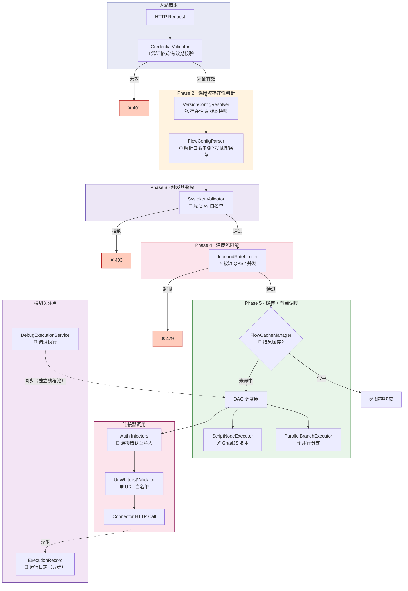

---

## 运行时执行全流程

> 本节以**一次完整的连接流 HTTP 调用**为视角，按真实请求处理链路串联全部运行时模块。
> 日志（§7）贯穿全流程异步写入，属横切关注点，不占独立阶段。

### 流程总览

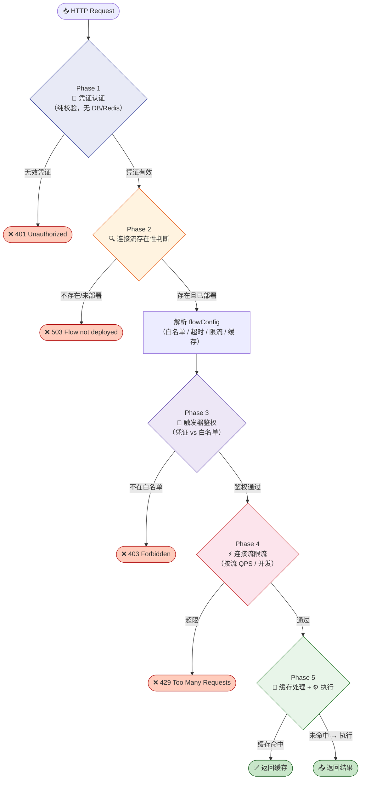

### 时序视角

下图为同一次调用的**组件交互时序**，按 Phase 用 `rect` 分区着色，省略异常分支（异常出口见上方 flowchart 和五阶段详解表）。

> 💡 **Phase 2 的数据读取路径**：运行时通过 `EntityCacheManager`（平台配置缓存，详见 [plan-cache §12](./plan-cache.md#12-part-2--平台配置缓存)）以 **Cache-Aside** 模式读取实体——优先 Redis `cp:entity:*`，miss 时回源 MySQL 并回写 Redis。理想全命中场景下，一次 `MGET` 即可取得全部版本快照，**完全跳过 MySQL**。

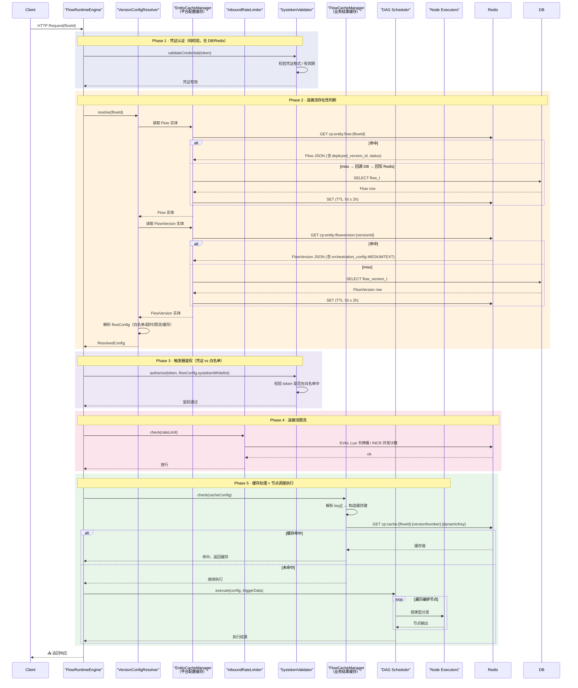

### 五阶段详解

| Phase | 负责模块 | 核心逻辑 | 异常出口 | 详见 |
|-------|---------|---------|---------|------|
| **1. 凭证认证** | CredentialValidator | 校验凭证格式与有效期，**纯内存操作**，不查 DB/Redis。无 flow 相关逻辑 | `401`（无效凭证） | — |
| **2. 连接流存在性判断** | VersionConfigResolver | flowId → EntityCache → FlowVersion 编排快照（含 connectorVersionConfig）；解析 `flowConfig`（白名单 / 超时 / 限流 / 缓存） | `503`（未部署）/ `500`（版本失效） | §1, §3 |
| **3. 触发器鉴权** | SystokenWhitelistValidator | Phase 2 拿到白名单后，校验凭证是否在 `trigger.authConfig.systokenWhitelist` 中 | `403`（不在白名单 / 白名单为空） | §10 |
| **4. 连接流限流** | InboundRateLimiter | 按流读取 `flowConfig.rateLimit`，Redis 令牌桶（QPS）或并发计数器 | `429`（超限）/ 降级放行 | §5 |
| **5. 缓存处理 + 节点调度执行** | FlowCacheManager + DAG + PBE + DPE + Auth Injector + URL Validator | 缓存命中 → 直接返回；未命中 → DAG 遍历执行 | 节点级错误 → 降级/标记失败 | §6, §2, §4, §9, §11 |

### Phase 5 节点级调度细节

Phase 5 的 DAG 调度器按编排边关系遍历节点，根据节点类型分发到对应执行器：

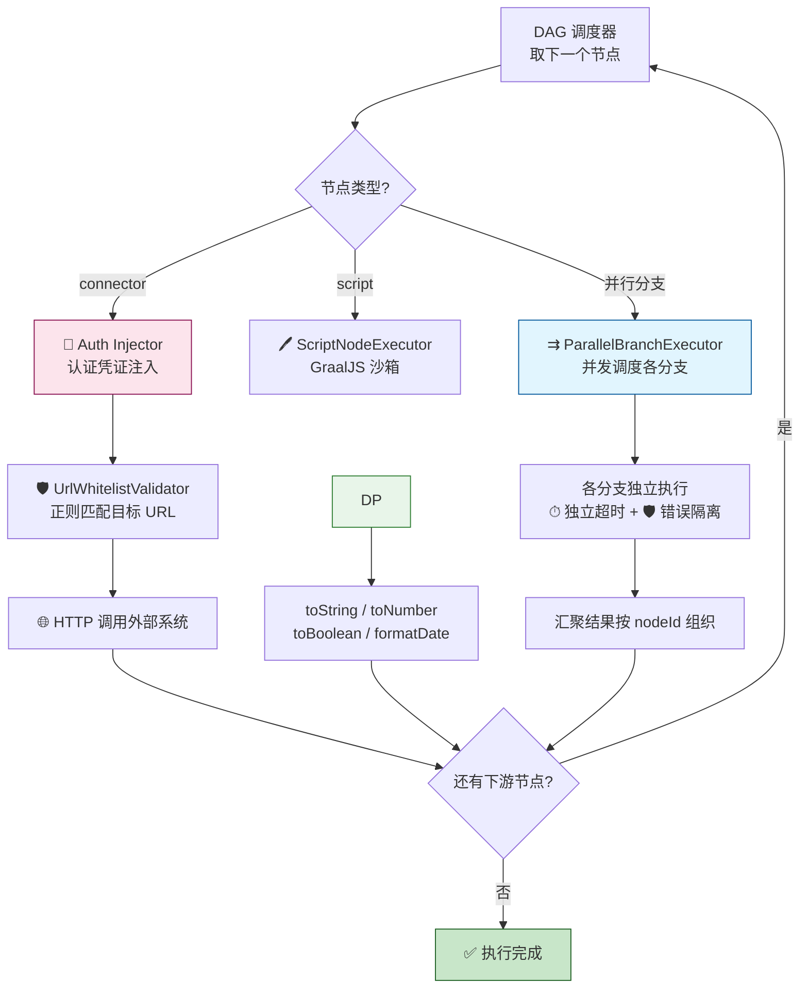

### 关键决策点汇总

| 决策点 | 阶段 | 决策逻辑 |
|--------|------|---------|
| 凭证是否有效？ | Phase 1 | 格式 + 有效期校验（纯内存）→ **通过**；无效 → `401`，不触发后续任何逻辑 |
| 流是否存在？ | Phase 2 | `deployed_version_id` 非空 且 版本快照存在 → **继续** |
| 凭证是否在白名单？ | Phase 3 | 白名单非空且包含当前 token → **通过**；否则 → `403` |
| 是否触发限流？ | Phase 4 | 令牌桶/并发超限 → **429**；Redis 不可用 → **降级放行** |
| 跳过 DAG 执行？ | Phase 5 | `cache.enabled=true` 且缓存键命中 → **返回缓存**；否则 → DAG 执行 |
| 单节点超时多久？ | Phase 5 | `min(节点配置超时, 应用级最大超时)`——上限由平台管理员控制 |

---

## 1. 版本配置解析器（VersionConfigResolver）

### 1.1 设计

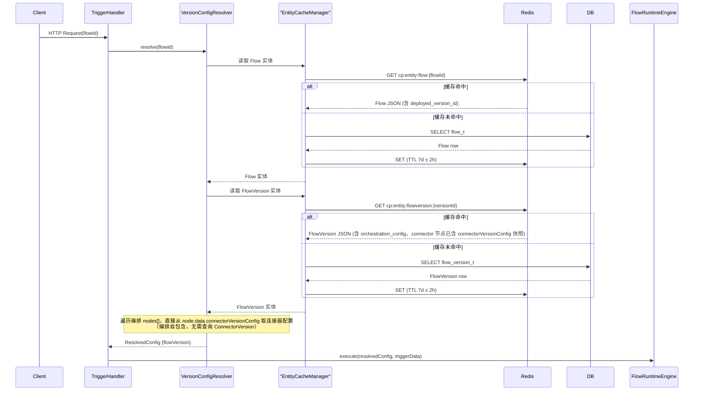

### 1.2 错误处理

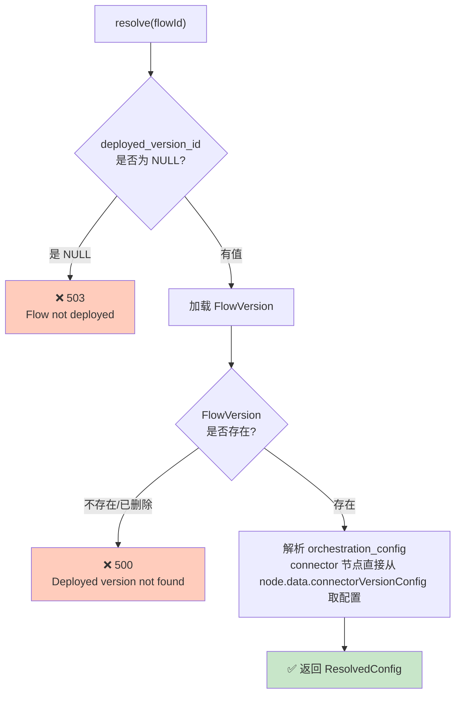

| 场景 | 处理 |
|------|------|
| `deployed_version_id` 为 NULL | 返回 503 "Flow not deployed" |
| FlowVersion 不存在或已删除 | 返回 500 "Deployed version not found" |
| connectorVersionConfig 快照缺失 | 标记对应节点为失败，记录错误日志（编排快照不完整） |


### 1.3 缓存策略

- FlowVersion 编排配置读后写入 Redis 缓存（含完整的 connectorVersionConfig 快照，无需单独缓存 ConnectorVersion）
- Key: `cp:entity:flowversion:{versionId}`, TTL: 7 天
- 版本切换时主动失效对应缓存

---

## 2. 并行分支执行器（ParallelBranchExecutor）

### 2.1 分支识别

编排保存时，从 FlowEdge 中识别并行边：

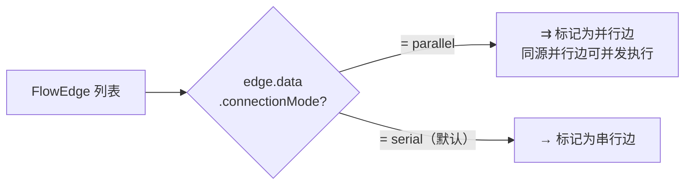

### 2.2 执行模型

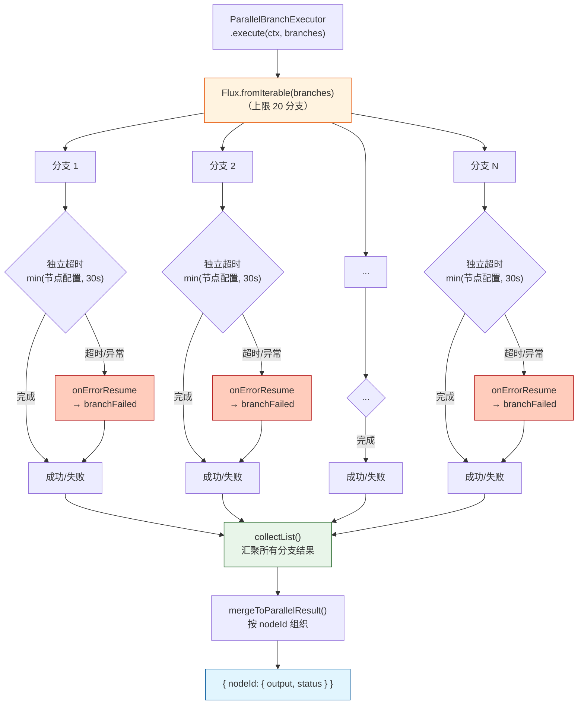

### 2.3 关键约束

| 约束 | 说明 |
|------|------|
| 并行分支数上限 | 20（硬限制，防止线程池耗尽） |
| 分支独立超时 | 每分支取 `min(节点超时配置, 30s)` |
| 错误不扩散 | 一个分支失败不影响其他分支执行 |
| 汇聚等待 | 所有分支完成后（成功或失败）才进入下游节点 |
| 结果合并 | 各分支输出按 `nodeId` 组织：`{ nodeId: { output: {...}, status: "success|failed" } }` |

---

## 3. flowConfig 解析器（FlowConfigParser）

### 3.1 flowConfig 结构

```json
{
  "timeout": {
    "perNode": 10,       // 每节点默认超时（秒），0=不限
    "global": 60          // 全流总超时（秒）
  },
  "rateLimit": {
    "mode": "QPS",        // QPS | CONCURRENCY
    "value": 100           // 上限值，0=关闭
  },
  "cache": {
    "enabled": true,
    "keyTemplate": "${$.node.trigger.input.userId}",  // 缓存键表达式
    "ttl": 300            // 缓存 TTL（秒），0=永不过期
  }
}
```

### 3.2 解析时机

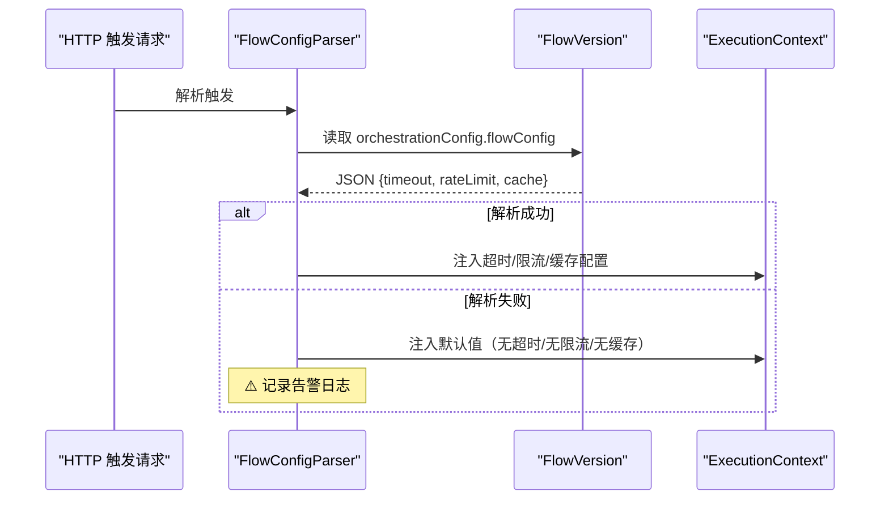

- HTTP 触发请求到达时，从 `FlowVersion.orchestrationConfig.flowConfig` JSON 解析
- 解析结果注入 `ExecutionContext`，供后续节点获取
- 解析失败 → 使用默认值（无超时/无限流/无缓存），记录告警日志

### 3.2a 节点超时上限控制

运行时单节点超时 = **min(节点配置值, 应用最大超时值)**。应用最大超时值从系统配置读取（默认 5s，平台管理员可按应用覆盖）。节点配置值超过应用最大超时值时，以应用最大超时值为准，确保平台管理员可控制全局超时上限。

---

## 4. [已移除] 数据处理节点执行器

> ❌ 已移除。数据处理节点（FR-040）已被脚本节点（FR-040a）替代。脚本节点执行器设计详见 [plan-script.md](./plan-script.md)。并行处理节点执行器见 §3 并行分支执行器。

---

## 5. 入站限流拦截器（InboundRateLimiter）

> 详见 ADR-005

### 5.1 WebFilter 拦截链

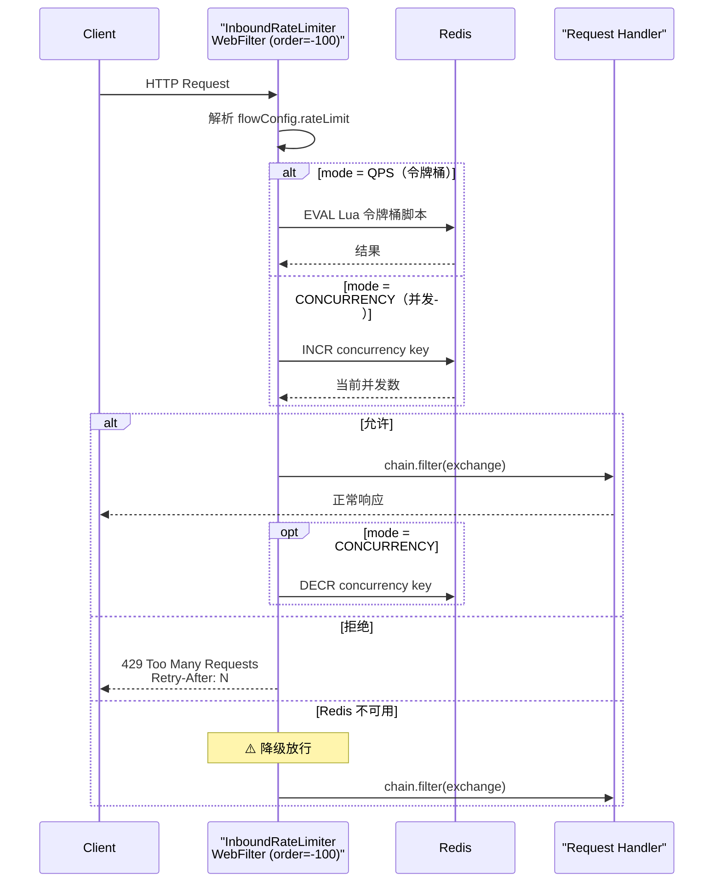

### 5.2 Redis Lua 脚本

```lua
-- key: cp:ratelimit:qps:{flowId}:{second}
-- ARGV[1]: maxTokens
-- ARGV[2]: currentSecond (用于清理过期 key)
local current = redis.call('GET', KEYS[1])
if current == false then
    redis.call('SET', KEYS[1], ARGV[1], 'EX', 2)
    return 1
elseif tonumber(current) > 0 then
    redis.call('DECR', KEYS[1])
    return 1
else
    return 0
end
```

### 5.3 并发模式

- Key: `cp:ratelimit:concurrency:{flowId}`
- 请求到达 → `INCR`，超 `maxConcurrency` → `DECR` + 返回 429
- 请求完成 → `DECR`
- 为防止死锁（进程崩溃），key 设置 TTL = 300s

---

## 6. 缓存管理（FlowCacheManager）

### 6.1 缓存模式

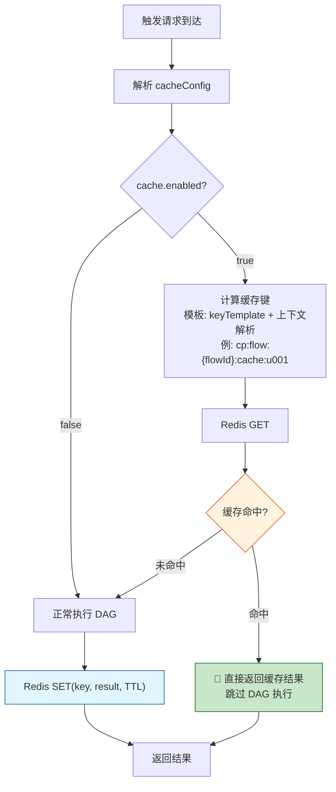

### 6.2 缓存键生成

- 模板：`${$.node.trigger.input.userId}`
- 运行时解析为: `cp:flow:{flowId}:cache:u001`
- 多个键用 `:` 拼接

### 6.3 缓存失效

| 触发条件 | 失效范围 |
|---------|---------|
| FlowVersion 发布 | 清空该 Flow 所有缓存 |
| FlowVersion 标记失效 | 清空该版本缓存 |
| Flow 部署新版本 | 清空该 Flow 所有缓存 |
| Flow 停止 | 清空该 Flow 所有缓存 |
| TTL 自然过期 | 自动失效 |

---

## 7. 日志采集（ExecutionRecordService + ExecutionStepService）

> 详见 ADR-006

### 7.1 写入模型

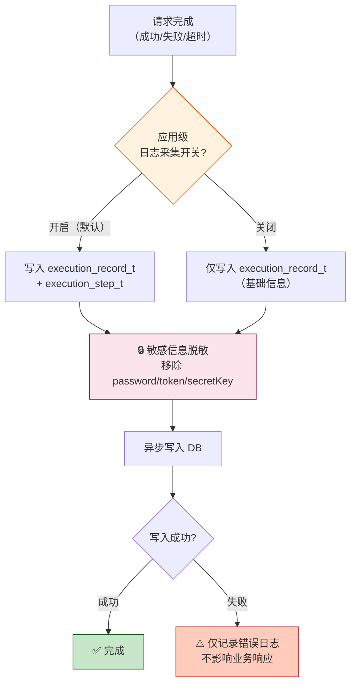

### 7.2 敏感信息脱敏

```java
private Map<String, Object> sanitize(Map<String, Object> data) {
    // 移除 marked sensitive 的字段（如 password, token, secretKey）
    return data.entrySet().stream()
        .filter(e -> !SENSITIVE_FIELDS.contains(e.getKey()))
        .collect(Collectors.toMap(Map.Entry::getKey, Map.Entry::getValue));
}
```

### 7.3 定时清理

- 每天 03:00 执行
- 删除 `trigger_time < NOW() - INTERVAL 30 DAY` 的记录
- 分批删除（每批 1000 条），避免长事务

### 7.3a FIFO 条数清理

每次 `execution_record` 写入后检查该 `flow_id` 的记录数是否超限（默认 1000，按应用可配），超限时按 `create_time ASC` 批量 DELETE 最早的多余记录。与 30 天定时清理互补。

---

## 8. 调试执行器（DebugExecutionService）

### 8.1 执行模式

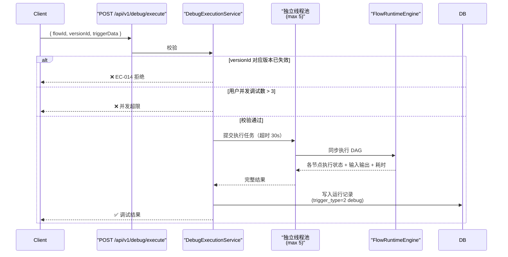

### 8.2 约束

| 约束 | 说明 |
|------|------|
| 版本限制 | 仅草稿和已发布版本可调试；已失效版本拒绝（EC-014） |
| 并发限制 | 同一用户最多 3 个并发调试请求 |
| 运行记录 | 调试执行生成运行记录，不计入正常运行指标 |
| 不影响运行中 Flow | 调试使用版本快照，不绑定 deployed_version_id |

---

## 9. 认证注入器扩展

### 9.1 注入器注册

V1 已有 `CredentialInjectorRegistry`（Strategy 模式），通过 Spring Bean 自动发现。V2 新增 3 个注入器：

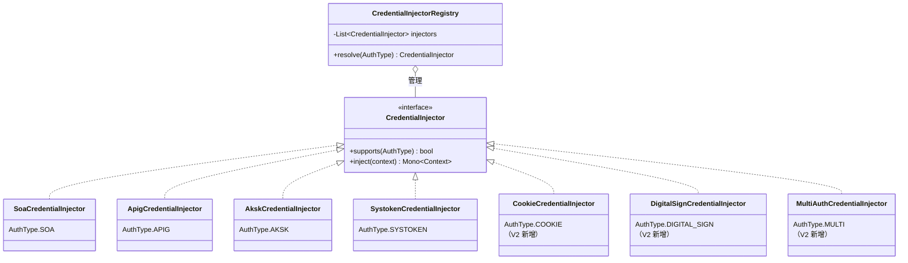

### 9.2 认证类型枚举扩展

```java
public enum AuthType {
    SOA(1),
    APIG(2),
    NONE(4),
    AKSK(5),
    SYSTOKEN(7),
    COOKIE(8),       // V2 新增
    DIGITAL_SIGN(9),  // V2 新增
    MULTI(10);        // V2 新增（多选组合）
}
```

---

## 10. SYSTOKEN 白名单校验器（SystokenWhitelistValidator）

### 10.1 校验流程

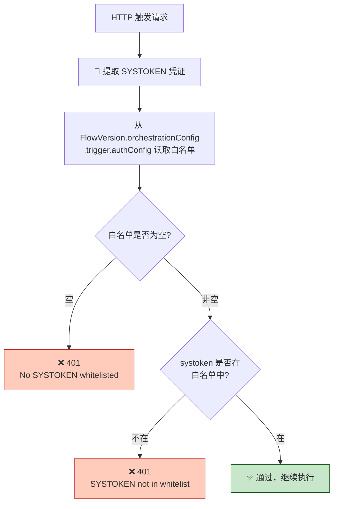

### 10.2 白名单配置位置

白名单存储在 `FlowVersion.orchestrationConfig.trigger.authConfig.systokenWhitelist` 中：

```json
{
  "trigger": {
    "type": "http",
    "authConfig": {
      "type": "SYSTOKEN",
      "systokenWhitelist": ["token_abc123", "token_xyz789"]
    }
  }
}
```

---

## 11. URL 白名单校验器（UrlWhitelistValidator）

### 11.1 校验流程

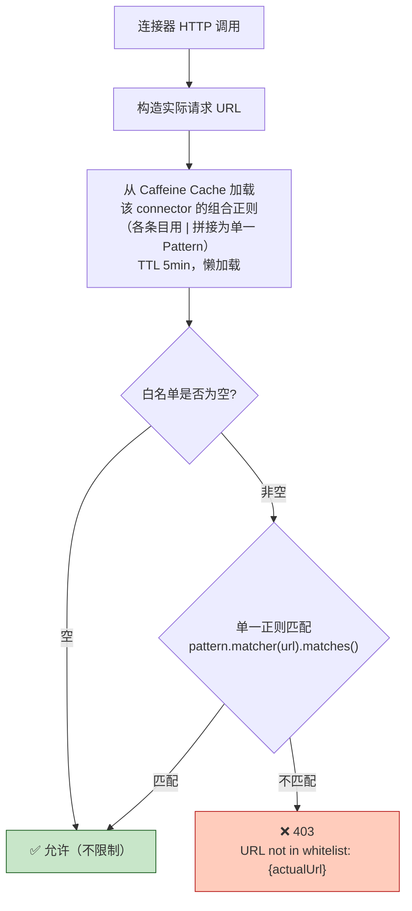

### 11.2 正则编译与缓存

各白名单条目用 `|` 拼接为**单一正则**编译并缓存，一次 `Matcher.matches()` 调用完成校验，无逐条遍历：

```java
@Component
public class UrlWhitelistValidator {
    // 缓存的是合并后的单一 Pattern，非 List
    private final LoadingCache<Long, Pattern> patternCache =
        Caffeine.newBuilder()
            .expireAfterWrite(5, TimeUnit.MINUTES)
            .build(connectorId -> {
                List<String> entries = loadWhitelistEntries(connectorId); // 从 DB 取
                if (entries.isEmpty()) return null;                      // 空白名单 = 不限制
                String combined = String.join("|", entries);             // 用 | 拼接
                return Pattern.compile(combined);
            });

    public void validate(Long connectorId, String actualUrl) {
        Pattern pattern = patternCache.get(connectorId);
        if (pattern == null) return;                        // 空白名单 = 不限制
        if (!pattern.matcher(actualUrl).matches()) {
            throw new UrlNotWhitelistedException(connectorId, actualUrl);
        }
    }
}
```
