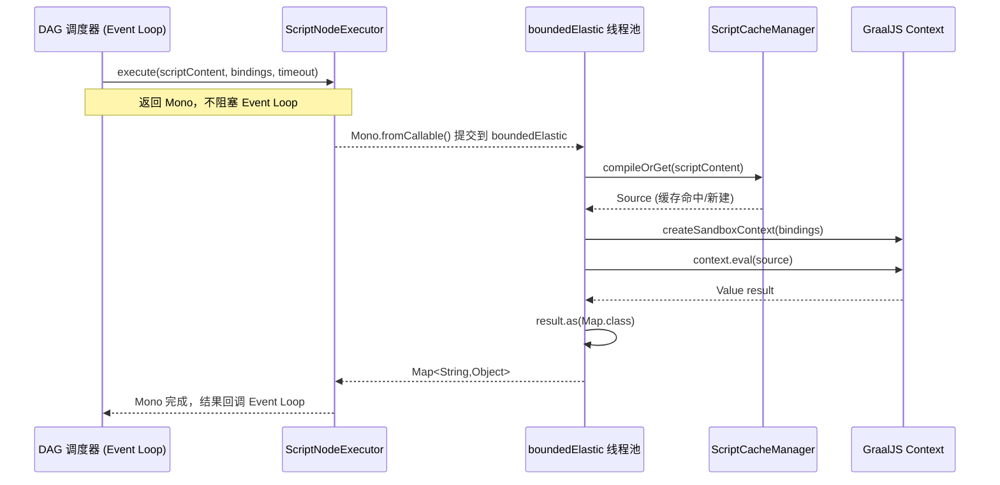

# 脚本执行引擎设计：连接器平台 V3

**Feature ID**: CONN-PLAT-003
**关联文档**: plan.md（主技术规划）、plan-json-schema.md（值表达式体系 §3）、plan-runtime.md（运行时引擎）
**版本**: v3.0-draft
**创建日期**: 2026-06-17
**对齐基线**: spec.md（继承自 V2 v2.24-draft，V3 待重写）

---

## 0. 概述

### 0.1 背景与动机

V2 的数据处理节点（FR-040）仅支持 4 种字段类型转换函数（`toString` / `toNumber` / `toBoolean` / `formatDate`），脚本执行能力被列为 `NG16`。V3 将**内联脚本节点**引入编排画布，使平台从「固定函数编排」升级为「可编程编排」。

### 0.2 核心设计决策

| # | 决策 | 说明 |
|:---:|------|------|
| 1 | **仅脚本节点（内联）** | 脚本写在连接流版本 JSON 配置中，不做脚本库、不建新表 |
| 2 | **GraalJS 引擎** | 沙箱能力碾压 Groovy，ES2022 语法，`HostAccess` 精细化 Java 互操作 |
| 3 | **WebFlux 非阻塞** | `Mono.fromCallable().subscribeOn(boundedElastic)` 隔离，不阻塞 Event Loop |
| 4 | **Context 沙箱** | `allowIO(false)` + `HostAccess.EXPLICIT` + `statementLimit` 四层防护 |
| 5 | **Source 编译缓存** | Caffeine 缓存 `Source`，首次编译 2~10ms，后续命中 < 0.5ms |
| 6 | **配置即存储** | 脚本源码存储在 `FlowVersion.orchestrationConfig` JSON 中，零新增表 |

### 0.3 存储位置

脚本内容作为**连接流版本快照**的一部分，存储在 `FlowVersion.orchestrationConfig` 的 `nodes[]` 中：

```
FlowVersion.orchestrationConfig (JSON TEXT)
  └── nodes[]
       └── { nodeType: "script", data: { scriptContent: "// JS code", ... } }
```

### 0.4 Spring Boot + WebFlux + GraalJS 关系

```
┌────────────────────────────────────────────────────────┐
│                 Spring Boot 3.x (Java 21)               │
│  ┌──────────────────────────────────────────────────┐  │
│  │              WebFlux (Reactor Netty)              │  │
│  │  ┌─────────────┐  ┌──────────────────────────┐   │  │
│  │  │ Event Loop  │  │ boundedElastic Scheduler  │   │  │
│  │  │ (NIO 非阻塞) │  │    ┌──────────────────┐  │   │  │
│  │  │             │  │    │  Script Executor  │  │   │  │
│  │  │  HTTP 路由   │  │    │  Mono.fromCallable│  │   │  │
│  │  │  参数解析    │  │    │    ↓              │  │   │  │
│  │  │  响应序列化  │  │    │  GraalJS Context  │  │   │  │
│  │  │             │  │    │  (阻塞式执行)      │  │   │  │
│  │  └─────────────┘  │    └──────────────────┘  │   │  │
│  │                    └──────────────────────────┘   │  │
│  └──────────────────────────────────────────────────┘  │
│                         │                              │
│              ┌──────────┴──────────┐                   │
│              │  GraalJS Polyglot   │                   │
│              │  ┌──────────────┐   │                   │
│              │  │ Context (每次│   │                   │
│              │  │ 新建/池化)   │   │                   │
│              │  │ ┌──────────┐ │   │                   │
│              │  │ │ Bindings │ │   │                   │
│              │  │ │ ├ input  │ │   │ ← 入参映射解析值  │
│              │  │ │ ├ ctx    │ │   │ ← 运行时上下文    │
│              │  │ │ ├ _util  │ │   │ ← Java 工具类     │
│              │  │ │ ├ _log   │ │   │ ← 日志输出        │
│              │  │ │ └ ...    │ │   │ ← 自定义业务类    │
│              │  │ └──────────┘ │   │                   │
│              │  └──────────────┘   │                   │
│              │   HostAccess 白名单  │                   │
│              │   ResourceLimits    │                   │
│              └─────────────────────┘                   │
└────────────────────────────────────────────────────────┘
```

---

## 1. 语言选型

### 1.1 候选对比

| 维度 | GraalJS (GraalVM) | Groovy 4.x |
|------|:---:|:---:|
| **沙箱能力** | ✅ `Context` 原生全维度权限开关 + `ResourceLimits` | ⚠️ `SecureASTCustomizer` 仅编译期 AST 白名单 |
| **JVM 互操作** | ✅ `HostAccess` 逐方法白名单 | ✅ 无缝调用 |
| **语言普及度** | ✅ JavaScript / ES2022 | 🟡 Groovy 特有语法 |
| **性能（预热后）** | 🟢 Graal JIT 编译 | 🟡 中等 |
| **异步模型** | ✅ Promise/async-await（预留） | ❌ |
| **体积** | ~30MB | ~8MB |

### 1.2 决策：GraalJS

| 理由 | 说明 |
|------|------|
| 沙箱碾压 | `allowIO(false)` + `allowCreateThread(false)` + `allowNativeAccess(false)` + `HostAccess.EXPLICIT` + `statementLimit(10000)` — 全维度运行时管控 |
| ES2022 | 应用管理员零学习成本 |
| Polyglot 扩展 | 后续可按需引入 Python/WASM |
| 精细 Java 互操作 | `@HostAccess.Export` 注解逐方法暴露，安全可控 |

### 1.3 Maven 依赖

```xml
<!-- 仅 connector-api 运行时引入，open-server 不引入 -->
<dependency>
    <groupId>org.graalvm.polyglot</groupId>
    <artifactId>polyglot</artifactId>
    <version>24.1.1</version>
</dependency>
<dependency>
    <groupId>org.graalvm.js</groupId>
    <artifactId>js</artifactId>
    <version>24.1.1</version>
</dependency>
```

### 1.4 JavaScript 要求

| 维度 | 约束 |
|------|------|
| **版本** | ES2022 (`js.ecmascript-version=2022`) |
| **严格模式** | 自动启用 |
| **模块** | 禁用 `import`/`export` |
| **顶层 await** | 禁用（脚本同步执行） |
| **返回值约定** | 最后一条表达式值 = 返回值，或显式 `return` |
| **类型映射** | JS `object` → Java `Map`、JS `number` → Java `double`、JS `string` → `String`、JS `boolean` → `boolean`、JS `Array` → `List` |

---

## 2. 安全沙箱设计

### 2.1 四层防护

```
第 1 层：Context 权限开关
  allowIO(false)              禁止文件/网络 I/O
  allowNativeAccess(false)    禁止 JNI
  allowCreateThread(false)    禁止线程
  allowCreateProcess(false)   禁止进程
  allowHostClassLoading(false) 禁止动态加载类
  allowPolyglotAccess(NONE)   禁止跨语言
  allowEnvironmentAccess(NONE) 禁止环境变量

第 2 层：HostAccess 白名单
  HostAccess.EXPLICIT → 仅 @HostAccess.Export 注解方法可调用
  禁止任意 Java 类查找（allowHostClassLookup(→false)）

第 3 层：ResourceLimits
  statementLimit(10000)   最多 1w 条语句
  option("js.console","false")
  option("js.print","false")
  option("js.load","false")

第 4 层：运维熔断
  单节点连续超时 5 次 → 版本自动禁用 + 告警
  全平台超时率 > 10% → 平台级告警
```

### 2.2 Context 工厂（核心代码）

```java
package com.openapp.connector.platform.v3.modules.script.context;

import org.graalvm.polyglot.*;
import org.springframework.stereotype.Component;
import java.util.Map;

@Component
public class GraalJSContextFactory {

    private static final Engine SHARED_ENGINE = Engine.newBuilder()
        .option("engine.WarnInterpreterOnly", "false")
        .build();

    /** 每次调用创建全新沙箱 Context */
    public Context createSandboxContext(Map<String, Object> bindingsMap) {
        Context ctx = Context.newBuilder("js")
            .engine(SHARED_ENGINE)

            // 第 1 层
            .allowIO(false)
            .allowNativeAccess(false)
            .allowCreateThread(false)
            .allowCreateProcess(false)
            .allowHostClassLoading(false)
            .allowPolyglotAccess(PolyglotAccess.NONE)
            .allowEnvironmentAccess(EnvironmentAccess.NONE)
            .allowExperimentalOptions(false)
            .allowValueSharing(false)

            // 第 2 层：仅 @HostAccess.Export 方法可被 JS 调用
            .allowHostAccess(HostAccess.newBuilder(HostAccess.EXPLICIT)
                .allowAccessAnnotatedBy(HostAccess.Export.class)
                .allowListAccess(true)
                .allowMapAccess(true)
                .build())
            .allowHostClassLookup(className -> false)

            // 第 3 层
            .resourceLimits(ResourceLimits.newBuilder()
                .statementLimit(10000, null)
                .build())
            .option("js.ecmascript-version", "2022")
            .option("js.console", "false")
            .option("js.print", "false")
            .option("js.load", "false")
            .option("js.global-arguments", "false")
            .option("js.foreign-object-prototype", "false")
            .option("js.unhandled-rejections", "throw")

            .build();

        // 注入 bindings
        Value jsBindings = ctx.getBindings("js");
        for (Map.Entry<String, Object> e : bindingsMap.entrySet()) {
            jsBindings.putMember(e.getKey(), e.getValue());
        }
        jsBindings.putMember("_util", new ScriptUtil());
        jsBindings.putMember("_log",  new ScriptLogger());

        return ctx;
    }
}
```

### 2.3 WebFlux 非阻塞包装

```java
@Component
public class ScriptNodeExecutor {

    private final GraalJSContextFactory contextFactory;
    private final ScriptCacheManager   cacheManager;

    /**
     * 执行脚本节点。阻塞操作跑在 boundedElastic 线程池，不占用 Event Loop。
     */
    public Mono<Map<String, Object>> execute(
            String scriptContent,
            Map<String, Object> bindings,
            Duration timeout) {

        return Mono.fromCallable(() -> {
            Source source = cacheManager.compileOrGet(scriptContent);
            Context ctx = contextFactory.createSandboxContext(bindings);
            try {
                Value result = ctx.eval(source);
                return result.isNull() ? Map.of() : result.as(Map.class);
            } finally {
                ctx.close(true);
            }
        })
        .subscribeOn(Schedulers.boundedElastic())
        .timeout(timeout);
    }
}
```

### 2.4 编译缓存

```java
@Component
public class ScriptCacheManager {

    private final Cache<String, Source> cache = Caffeine.newBuilder()
        .maximumSize(300)
        .expireAfterAccess(Duration.ofMinutes(30))
        .build();

    public Source compileOrGet(String scriptContent) {
        String hash = DigestUtils.md5Hex(scriptContent).substring(0, 16);
        return cache.get(hash, k ->
            Source.newBuilder("js", scriptContent, "inline.js").build());
    }
}
```

---

## 3. 脚本节点详设

### 3.1 节点类型

脚本节点是编排画布中的**独立节点类型**，与触发器、连接器、数据处理、数据输出节点并列：

```
触发器 ──▶ 连接器 ──▶ [脚本节点] ──▶ 数据输出
                        │
                        ├── scriptContent（多行 JS ES2022）
                        ├── inputMapping（引用上游字段 → input 对象）
                        ├── outputSchema（出参字段声明）
                        └── timeout（超时，默认 5s）
```

### 3.2 配置结构

存储在 `FlowVersion.orchestrationConfig.nodes[]` 中：

```json
{
  "nodeId": "script_1",
  "nodeType": "script",
  "label": "数据清洗与聚合",
  "data": {
    "scriptContent": "// JavaScript ES2022\nconst users = input.users;\n\nconst summary = {};\nsummary.total = users.length;\nsummary.avgAge = users.reduce((sum, u) => sum + u.age, 0) / users.length;\nsummary.activeCount = users.filter(u => u.status === 'active').length;\n\nsummary;",
    "inputMapping": {
      "users": {
        "type": "array",
        "value": "${$.node.conn_1.output.body.data.users}"
      }
    },
    "outputSchema": {
      "summary": {
        "type": "object",
        "properties": {
          "total":       { "type": "number" },
          "avgAge":      { "type": "number" },
          "activeCount": { "type": "number" }
        }
      }
    },
    "timeout": 5,
    "description": "统计用户总数、平均年龄、活跃数"
  }
}
```

### 3.3 注入到 JS 的变量

| 变量 | 类型 | 来源 | 说明 |
|------|------|------|------|
| `input` | `object` | `inputMapping` 解析 | 脚本入参，键=映射字段名 |
| `ctx` | `object` | Java ExecutionContext 代理 | 只读，所有节点 `input`/`output` |
| `_util` | `object` | `ScriptUtil` 实例 | 工具方法（见 §4） |
| `_log` | `object` | `ScriptLogger` 实例 | `_log.info/warn/debug/error(...)` |

### 3.4 约束

| 约束 | 值 |
|------|:---:|
| 每流最多脚本节点 | 10 |
| 脚本最大长度 | 10000 字符 |
| 默认超时 | 5s（可配 1~30s） |
| 语句上限 | 10000 条 |
| 返回值类型 | JS object → Java `Map<String,Object>` |
| 沙箱违规 | `PolyglotException` → 节点失败 |

### 3.5 执行流程



### 3.6 发布时校验

连接流版本发布时（FR-026），对每个 `nodeType=script` 执行编译校验：

```java
// ScriptValidator.java
public void validate(String scriptContent) {
    try {
        Source source = Source.newBuilder("js", scriptContent, "validate.js").build();
        // parse 成功 = 语法正确（不实际执行，仅语法检查）
    } catch (PolyglotException e) {
        throw new ValidationException("脚本语法错误: " + e.getMessage());
    }
}
```

> 💡 仅校验 JS 语法（parse），**不执行**脚本，与 V2「草稿保存不校验、发布时统一校验」原则一致。

---

## 4. Java 工具类暴露给 JS

### 4.1 `ScriptUtil`

```java
package com.openapp.connector.platform.v3.modules.script.context;

/**
 * JS 中通过 _util.xxx() 调用。
 * 方法通过 @HostAccess.Export 暴露，其余 private 方法不可访问。
 */
public class ScriptUtil {

    @HostAccess.Export
    public Map<String, Object> parseJson(String json) { /* Jackson */ }

    @HostAccess.Export
    public String toJson(Map<?, ?> map) { /* Jackson */ }

    @HostAccess.Export
    public String base64Encode(String input) { /* Base64 */ }

    @HostAccess.Export
    public String base64Decode(String input) { /* Base64 */ }

    @HostAccess.Export
    public String md5(String input) { /* MessageDigest */ }

    @HostAccess.Export
    public String sha256(String input) { /* MessageDigest */ }

    @HostAccess.Export
    public String uuid() { return UUID.randomUUID().toString(); }

    @HostAccess.Export
    public long timestamp() { return System.currentTimeMillis(); }

    @HostAccess.Export
    public String formatDate(long timestamp, String pattern) { /* DateTimeFormatter */ }
}
```

### 4.2 自定义业务类暴露给 JS

业务类通过 `@HostAccess.Export` 标注，在 `ContextFactory` 中注入：

```java
package com.openapp.connector.platform.v3.modules.script.business;

import org.graalvm.polyglot.HostAccess;

public class CustomValidator {

    @HostAccess.Export
    public boolean checkPhone(String phone) {
        return phone != null && phone.matches("^1[3-9]\\d{9}$");
    }

    @HostAccess.Export
    public String orderGrade(double amount) {
        if (amount >= 10000) return "VIP";
        if (amount >= 1000)  return "Gold";
        return "Standard";
    }
}
```

**注册到 Context**：

```java
// GraalJSContextFactory.createSandboxContext() 内追加：
jsBindings.putMember("_customValidator", new CustomValidator());

// 若不同连接流需要不同业务类组合，可在 bindingsMap 中动态传入
```

### 4.3 JS 中调用 Java 类示例

```javascript
// 1. 调用工具方法
const hash = _util.md5(input.userId + _util.timestamp());
const decoded = _util.base64Decode(input.payload);

// 2. 调用自定义业务类
const isValid = _customValidator.checkPhone(input.phone);
if (!isValid) throw new Error('Invalid phone: ' + input.phone);

const grade = _customValidator.orderGrade(input.amount);

// 3. 访问上游节点数据（ctx 只读）
const upstreamData = ctx.node.conn_1.output.body;

// 4. 日志
_log.info(`Order validated: grade=${grade}`);

// 5. 返回值
({ hash, grade, isValid });
```

---

## 5. 错误处理与监控

### 5.1 错误类型

| 错误 | Java 异常 | 处理 |
|------|---------|------|
| JS 语法错误 | `PolyglotException`（编译期） | 发布时拦截，不进入运行时 |
| 沙箱违规 | `PolyglotException: Access denied` | 运行时捕获，节点失败 |
| 语句超限 | `ResourceLimitExceededException` | 运行时捕获，节点失败 |
| 执行超时 | `TimeoutException` | WebFlux `Mono.timeout()` 触发 |
| JS 运行时异常 | `PolyglotException` | 被错误处理节点按策略（重试/忽略/终止）处理 |

### 5.2 监控指标

```
script.execution.count        脚本执行总数（tag: flowId, nodeId）
script.execution.duration     耗时分布（P50/P95/P99）
script.execution.timeout      超时次数
script.execution.sandbox_error 沙箱拦截次数
script.compilation.cache_hit   Source 缓存命中率
```

### 5.3 熔断

```
单节点连续超时 5 次 → 版本自动标记失效 + 平台告警
全平台超时率 > 10%（5 分钟窗口）→ 告警
```

---

## 6. 与现有节点的关系

### 6.1 脚本节点 vs 数据处理节点

| 维度 | 数据处理节点（V2 FR-040） | 脚本节点（V3 新增） |
|------|:---:|:---:|
| 能力 | 4 种类型转换函数 | 任意 JS 逻辑 |
| 入口 | 节点属性面板 → outputField → function | 独立节点 → scriptContent 编辑器 |
| 行数 | 单行函数调用 | 多行（最多 10000 字符） |
| 适用场景 | 简单类型转换 | 复杂聚合、条件计算、数据清洗 |

### 6.2 错误处理集成

脚本节点被错误处理节点（FR-039a）包裹，支持三种策略：
- **重试**：重新执行脚本（新 Context，无状态残留）
- **忽略**：跳过脚本节点，继续下游
- **终止**：终止整个连接流

---

## 7. 风险与缓解

| 风险 | 等级 | 缓解 |
|------|:---:|------|
| GraalJS 沙箱逃逸 CVE | 🟡 | 锁定 24.1.x LTS，跟踪 Oracle 安全公告 |
| GraalJS ~30MB 体积 | 🟢 | 仅 connector-api 引入，管理面不引入 |
| Context 创建 ~10ms/次 | 🟡 | Caffeine Source 缓存 + Context 池化（可选） |
| 阻塞 Event Loop | 🟢 | `Mono.fromCallable().subscribeOn(boundedElastic)` |
| JS number ↔ double 精度 | 🟡 | 大整数用 `_util` 字符串工具方法；文档明确映射规则 |

---

## 8. 版本规划

| 阶段 | 范围 | 预估 |
|------|------|:--:|
| Phase 1 | GraalJS Context 工厂 + 沙箱 + Source 缓存 + WebFlux 集成 | 基准 |
| Phase 2 | 脚本节点 DAG 集成 + inputMapping/outputSchema + 超时 + 错误处理 | +2 天 |
| Phase 3 | 自定义业务类 `@HostAccess.Export` 体系 + ScriptUtil 完善 | +1 天 |
| Phase 4 | 监控指标 + 熔断 + Context 池化优化 | +2 天 |

---

## 附录 A：完整 JS 脚本示例

### A.1 列表聚合统计

```javascript
const items = input.orderItems;

const totalAmount = items.reduce((sum, item) => sum + item.price * item.quantity, 0);
const avgPrice = items.reduce((sum, item) => sum + item.price, 0) / items.length;
const categories = new Set(items.map(i => i.category)).size;

_log.info(`Processed ${items.length} orders, ${categories} categories`);

({ orderStats: { totalAmount, avgPrice, categories } });
```

### A.2 数据脱敏 + 调用自定义类

```javascript
const phone = input.phone;
const amount = input.orderAmount;

if (!_customValidator.checkPhone(phone)) {
    throw new Error('手机号格式不合法: ' + phone);
}

const grade = _customValidator.orderGrade(amount);

// 脱敏
const masked = phone.substring(0, 3) + '****' + phone.substring(7);

const hash = _util.md5(phone + amount);
const now  = _util.formatDate(Date.now(), 'yyyy-MM-dd HH:mm:ss');

({ grade, masked, hash, validatedAt: now });
```

### A.3 ES2022 特性使用

```javascript
const users = input.users ?? [];

const lastUser = users.at(-1);         // Array.at() — ES2022
const hasActive = users.some(u => u.status === 'active');

// 分组
const byStatus = users.reduce((groups, user) => {
    (groups[user.status] ??= []).push(user);
    return groups;
}, {});

({ total: users.length, lastUser: lastUser?.name, hasActive, byStatus });
```

### A.4 复杂条件路由

```javascript
const { score, history } = input;

const avgHistory = history.length > 0
    ? history.reduce((s, h) => s + h, 0) / history.length
    : 0;

let level;
if (score >= 90 && avgHistory >= 85)     level = 'SSS';
else if (score >= 80 && avgHistory >= 70) level = 'A';
else if (score >= 60)                    level = 'B';
else                                     level = 'C';

const discount = { SSS: 0.5, A: 0.7, B: 0.85, C: 1.0 }[level];

({ level, discount, avgHistory });
```

---

## 附录 B：修订记录

| 版本 | 日期 | 修订内容 | 修订人 |
|------|------|---------|--------|
| v1.0 | 2026-06-17 | 初始版本：Groovy 方案，三种执行形态 + 脚本库 | SDDU Plan Agent |
| v2.0 | 2026-06-17 | 翻转为 GraalJS；新增 WebFlux 架构图、HostAccess 自定义类示例 | SDDU Plan Agent |
| v3.0 | 2026-06-17 | **大幅精简**：移除脚本库/数据库表/API 设计；脚本纯内联存储在 `FlowVersion.orchestrationConfig` JSON 中；仅保留脚本节点一种形态 | SDDU Plan Agent |

---

**文档状态**: 📝 初稿（draft，v3.0）
**下一步**: 与 V3 整体 spec.md 对齐后纳入 plan.md 子文档索引
