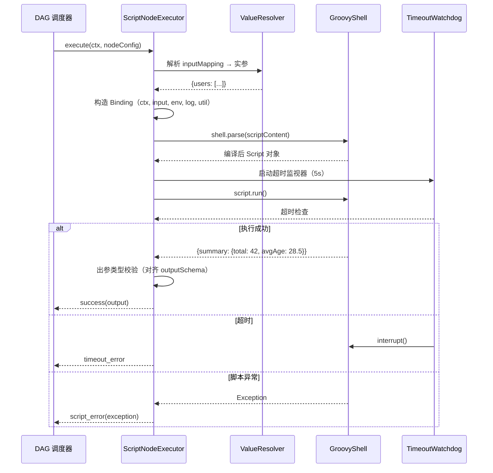
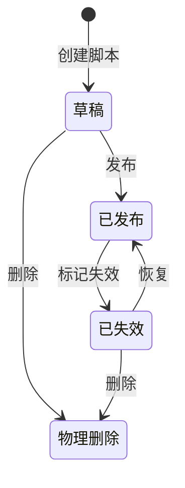
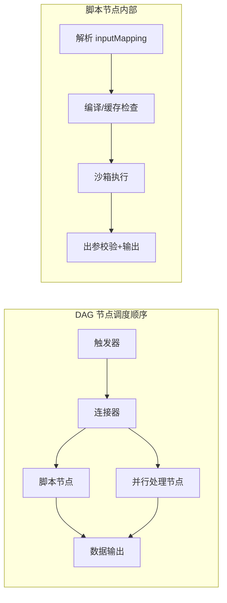

# 脚本执行引擎设计：连接器平台 V3

**Feature ID**: CONN-PLAT-003
**关联文档**: plan.md（主技术规划）、plan-json-schema.md（值表达式体系 §3）、plan-runtime.md（运行时引擎）
**版本**: v1.0-draft
**创建日期**: 2026-06-17
**对齐基线**: spec.md（继承自 V2 v2.24-draft，V3 待重写）

---

## 0. 概述

### 0.1 背景与动机

V2 的数据处理节点（FR-040）仅支持 4 种字段类型转换函数（`toString` / `toNumber` / `toBoolean` / `formatDate`），脚本执行能力（`NG16`）被明确列为 Non-Goal。V3 将脚本执行提升为核心能力，使平台从「固定函数编排」升级为「可编程编排」，支持：

- **复杂数据转换**：多字段聚合、条件计算、字符串模板、加密解密
- **自定义业务逻辑**：数据校验、格式标准化、业务规则计算
- **外部函数复用**：预定义脚本库，跨连接流共享

### 0.2 设计原则

| # | 原则 | 说明 |
|:---:|------|------|
| 1 | **渐进增强** | 兼容 V2 已有的 4 种内置函数，脚本作为更灵活的并行选项 |
| 2 | **安全沙箱** | 所有脚本在受控沙箱中执行，默认无文件系统/网络/反射权限 |
| 3 | **预编译缓存** | 脚本编译一次、缓存复用，避免每次执行重复解析 |
| 4 | **同步执行** | 脚本在 DAG 节点内同步执行（不引入异步复杂度），超时熔断 |
| 5 | **简单优先** | 先支持 Groovy（JVM 原生互操作最优），后续按需扩展 JS/Python |
| 6 | **复用表达式体系** | 脚本节点沿用 V2 值表达式体系 `${$.scope.path}` 注入上下文数据 |

### 0.3 三种执行形态

```
┌─────────────────────────────────────────────────────┐
│                  脚本执行形态                          │
├───────────────┬───────────────┬───────────────────────┤
│  脚本节点      │  脚本库函数    │  表达式内联脚本         │
│  (ScriptNode) │  (ScriptLib)  │  (Expression Script)  │
├───────────────┼───────────────┼───────────────────────┤
│ 编排画布独立节点│ 预定义可复用   │ 值表达式内一行调用       │
│ 多行脚本逻辑   │ 按名引用传参   │ ${$.script.xxx(args)} │
│ 完整上下文注入  │ 版本化管理     │ 轻量无状态             │
└───────────────┴───────────────┴───────────────────────┘
```

---

## 1. 脚本语言选型

### 1.1 候选语言对比

| 维度 | Groovy | JavaScript (GraalJS) | Python (Jython) | Java (编译) |
|------|:---:|:---:|:---:|:---:|
| **JVM 互操作** | ✅ 无缝调用 Java 类 | ⚠️ 需 polyglot 桥接 | ⚠️ Jython 2.7 停更 | ✅ 原生 |
| **动态类型** | ✅ 可选动态/静态 | ✅ 动态 | ✅ 动态 | ❌ 静态 |
| **沙箱成熟度** | ✅ SecureASTCustomizer | ⚠️ Graal SandboxPolicy | ❌ 无官方方案 | N/A |
| **社区活跃度** | ✅ Apache 维护 | ✅ Oracle GraalVM | ❌ 几乎停更 | ✅ |
| **Spring 集成** | ✅ spring-groovy | ⚠️ 需额外配置 | ❌ 无 | ✅ |
| **学习成本** | 🟢 低（类 Java） | 🟡 中（JS 语义差异） | 🟢 低 | 🟡 中（编译部署） |
| **性能** | 🟡 中（首次慢） | 🟢 快（Graal JIT） | 🔴 慢 | 🟢 快 |
| **文件大小** | ~8MB | ~60MB (GraalVM) | ~20MB | 0（内置） |

### 1.2 决策

| 阶段 | 语言 | 理由 |
|:---:|------|------|
| **V3 主语言** | **Groovy 4.x** | ① JVM 原生互操作最优—直接调用 Spring Bean、项目工具类；② `SecureASTCustomizer` 提供编译级沙箱白名单；③ 语法类 Java，应用管理员学习成本低；④ Spring Boot 原生集成 `groovy-all`；⑤ 社区活跃、长期维护 |
| **V3.N 备选** | JavaScript (GraalJS) | 当前不引入：① GraalVM 体积大（~60MB），与轻量化目标冲突；② 沙箱 `SandboxPolicy` 为 JDK 24+ 特性，当前 Java 21 不适用 |
| **不选用** | Python (Jython) | Jython 最后发布 2015 年，不支持 Python 3 |
| **不选用** | 编译期 Java | 应用管理员无编译环境，与「零代码编排」核心理念冲突 |

### 1.3 Groovy 版本锁定

```
org.apache.groovy:groovy-all:4.0.24
├── groovy:4.0.24.jar        # 核心运行时
├── groovy-jsr223:4.0.24.jar # JSR-223 ScriptEngine 适配
├── groovy-json:4.0.24.jar   # JSON 内置处理
├── groovy-templates:4.0.24.jar  # 模板（预留）
└── groovy-xml:4.0.24.jar    # XML 处理（预留）
```

> ⚠️ **依赖范围**：仅 `connector-api`（运行时）引入 `groovy-all`。管理面 `open-server` 仅在脚本库 CRUD 时不引入 Groovy 依赖——脚本内容作为纯文本存储，不在管理面编译/执行。

---

## 2. 安全沙箱设计

### 2.1 多层防护架构

```
┌──────────────────────────────────────────────┐
│              第 1 层：编译期 AST 白名单          │
│  SecureASTCustomizer                          │
│  ├── 禁止 import（仅白名单类可用）               │
│  ├── 禁止 method call（仅白名单方法可用）         │
│  ├── 禁止闭包/内部类                           │
│  ├── 禁止 package 声明                         │
│  └── 禁用 System.exit / Runtime.exec 等       │
├──────────────────────────────────────────────┤
│              第 2 层：运行时资源限制              │
│  ├── 执行超时：默认 5s，最大 30s（per 脚本）      │
│  ├── 内存限制：脚本内对象总数 ≤ 10000            │
│  ├── 循环限制：最大迭代 10000 次                 │
│  └── 线程限制：脚本内禁止创建线程                 │
├──────────────────────────────────────────────┤
│              第 3 层：ClassLoader 隔离          │
│  ├── 自定义 ScriptClassLoader                 │
│  ├── 仅暴露白名单包路径下的类                     │
│  └── 禁止反射（Class.forName / getDeclaredMethod）│
├──────────────────────────────────────────────┤
│              第 4 层：运维熔断                   │
│  ├── 单脚本连续超时 5 次 → 自动禁用 + 告警        │
│  └── 全平台脚本超时率 > 10% → 平台级告警          │
└──────────────────────────────────────────────┘
```

### 2.2 SecureASTCustomizer 白名单配置

```java
// 静态常量声明白名单
final class ScriptSandboxConfig {

    // —— 允许 import 的类（白名单） ——
    static final List<String> ALLOWED_IMPORTS = List.of(
        // Java 标准库
        "java.util.Map", "java.util.List", "java.util.ArrayList",
        "java.util.HashMap", "java.util.Set", "java.util.HashSet",
        "java.util.Date", "java.util.UUID", "java.util.Objects",
        "java.util.Collections", "java.util.stream.Collectors",
        "java.math.BigDecimal", "java.math.RoundingMode",
        "java.time.*", "java.time.format.DateTimeFormatter",
        "java.lang.Math", "java.lang.String",

        // Groovy 内置
        "groovy.json.JsonSlurper", "groovy.json.JsonOutput",

        // 平台工具类（白名单包路径）
        "com.openapp.connector.platform.script.util.*"
    );

    // —— 禁止的 import 模式（正则） ——
    static final List<String> BLOCKED_IMPORT_PATTERNS = List.of(
        "java\\.lang\\.reflect.*",
        "java\\.lang\\.System",      // 禁止 System.exit/System.getProperty
        "java\\.io\\..*",             // 禁止文件 I/O
        "java\\.net\\..*",            // 禁止网络
        "java\\.nio\\..*",            // 禁止 NIO
        "java\\.lang\\.Runtime",      // 禁止 Runtime.exec
        "java\\.lang\\.Thread",       // 禁止线程创建
        "java\\.lang\\.ClassLoader",
        "java\\.lang\\.ProcessBuilder",
        "javax\\..*", "sun\\..*", "com\\.sun\\..*",
        "org\\.springframework\\..*",  // 禁止直接访问 Spring 容器
        "org\\.apache\\.groovy\\.runtime\\..*"  // 禁止 Groovy 运行时反射
    );

    // —— 允许的方法白名单（接收者类型 → 允许的方法正则） ——
    static final Map<String, List<String>> ALLOWED_METHODS = Map.of(
        "java.lang.String", List.of(".*"),           // 所有方法
        "java.util.Map",    List.of("get", "put", "containsKey", "size", "keySet", "values", "entrySet", "getOrDefault"),
        "java.util.List",   List.of("get", "size", "isEmpty", "contains", "stream", "findAll", "collect", "each", "find"),
        "java.math.BigDecimal", List.of("add", "subtract", "multiply", "divide", "compareTo", "setScale")
    );
}
```

### 2.3 GroovyShell 工厂

```java
@Component
class GroovyShellFactory {

    private final CompilerConfiguration config;

    GroovyShellFactory() {
        this.config = new CompilerConfiguration();
        SecureASTCustomizer secure = new SecureASTCustomizer();

        // 编译期限制
        secure.setImportsWhitelist(ALLOWED_IMPORTS);
        secure.setStarImportsWhitelist(List.of("java.time"));
        secure.setStaticImportsWhitelist(List.of());
        secure.setStaticStarImportsWhitelist(List.of());
        secure.setPackageAllowed(false);
        secure.setClosuresAllowed(true);         // 允许闭包（Groovy 核心语法）
        secure.setMethodDefinitionAllowed(true); // 允许 def 定义方法

        // 阻断模式（正则黑名单）
        secure.setIndirectImportCheckEnabled(true);
        secure.addImportBlockedPatterns(BLOCKED_IMPORT_PATTERNS);

        config.addCompilationCustomizers(secure);
        config.setScriptBaseClass(SandboxScript.class.getName());
        config.setSourceEncoding("UTF-8");
    }

    GroovyShell createShell(Binding binding) {
        GroovyShell shell = new GroovyShell(
            ScriptSandboxClassLoader.INSTANCE,  // 受限 ClassLoader
            binding,
            config
        );
        return shell;
    }
}
```

### 2.4 基类 Script 注入上下文变量

```groovy
// SandboxScript.groovy（编译到项目 classpath，非运行时动态加载）
abstract class SandboxScript extends Script {

    /**
     * 平台注入的上下文变量，脚本内直接引用（无需 import/def）：
     *   ctx      — ExecutionContext（当前执行上下文，含所有节点数据）
     *   log      — ScriptLogger（脚本内日志输出）
     *   env      — Map<String,String>（环境变量白名单子集）
     *   util     — ScriptUtil（平台工具方法集）
     *   input    — 脚本节点的入参（已解析为具体值）
     */
    protected ExecutionContext ctx
    protected ScriptLogger      log
    protected Map<String,Object> env
    protected ScriptUtil        util
    protected Map<String,Object> input
}
```

---

## 3. 三种执行形态详设

### 3.1 形态一：脚本节点（ScriptNode）

脚本节点是编排画布中的**独立节点类型**，用户直接在节点内编写多行 Groovy 脚本。

```
触发器 ──▶ 连接器 ──▶ [脚本节点] ──▶ 数据输出
                        │
                        ├── 脚本内容（多行 Groovy）
                        ├── 入参映射（引用上游节点字段）
                        ├── 出参声明（字段名 + 类型）
                        └── 超时配置（默认 5s）
```

**节点配置结构**（存储于 FlowVersion.orchestrationConfig）：

```json
{
  "nodeId": "script_1",
  "nodeType": "script",
  "label": "数据清洗与聚合",
  "data": {
    "scriptSource": {
      "sourceType": "inline",           // inline | library_ref
      "content": "// Groovy script\nimport java.time.*\n\ndef users = input.users\ndef summary = [:]\nsummary.total = users.size()\nsummary.avgAge = users.collect{ it.age }.sum() / users.size()\n\nreturn [summary: summary]"
    },
    "inputMapping": {                    // 入参映射（引用上游节点字段）
      "users": {
        "type": "array",
        "value": "${$.node.conn_1.output.body.data.users}"
      }
    },
    "outputSchema": {                    // 出参声明
      "summary": {
        "type": "object",
        "properties": {
          "total":  { "type": "number" },
          "avgAge": { "type": "number" }
        }
      }
    },
    "timeout": 5,                        // 超时（秒），0=使用默认 5s
    "description": "统计用户总数和平均年龄"
  }
}
```

**执行流程**：



**脚本节点特有约束**：

| 约束 | 值 | 说明 |
|------|:---:|------|
| 每流最多脚本节点数 | 10 | 防止编排过度碎片化 |
| 脚本最大长度 | 10000 字符 | UI 编辑器限制，超长提示拆分为库函数 |
| 默认超时 | 5s | 可配置 1~30s |
| 返回值类型 | Map\<String,Object\> | 脚本 `return` 的 Map 按 key 映射到 outputSchema 各字段 |
| 禁止操作 | 文件 I/O、网络请求、线程、反射 | 沙箱拦截 → 编译失败 |

### 3.2 形态二：脚本库函数（ScriptLibrary）

预定义、可复用的脚本函数，**按名称 + 版本号引用**。脚本库面向平台管理员维护，应用管理员在编排中引用。

**脚本库实体生命周期**：



**数据库表**（`openplatform_v2_cp_script_t`）：

| 列名 | 类型 | 说明 |
|------|------|------|
| `id` | BIGINT(20) PK | 雪花 ID |
| `name_cn` | VARCHAR(100) | 中文名称 |
| `name_en` | VARCHAR(100) | 英文标识（引用键，唯一） |
| `description_cn` | VARCHAR(1000) | 中文描述 |
| `description_en` | VARCHAR(1000) | 英文描述 |
| `content` | MEDIUMTEXT | 脚本内容（Groovy 源码） |
| `version_number` | INT | 版本号（独立递增，1 开始） |
| `version_status` | TINYINT | 1=草稿 2=已发布 3=已失效 4=物理删除 |
| `input_schema` | TEXT | 入参 JSON Schema（入参字段定义） |
| `output_schema` | TEXT | 出参 JSON Schema（返回值字段定义） |
| `category` | VARCHAR(50) | 分类：string / math / date / logic / custom |
| `timeout` | INT | 推荐超时（秒），默认 5 |
| `create_by` | VARCHAR(100) | 创建人 |
| `create_time` | DATETIME(3) | 创建时间 |
| `last_update_by` | VARCHAR(100) | 最近修改人 |
| `last_update_time` | DATETIME(3) | 最近修改时间 |

**编排中引用脚本库**：

```json
{
  "nodeId": "script_2",
  "nodeType": "script",
  "data": {
    "scriptSource": {
      "sourceType": "library_ref",
      "scriptName": "dataMask",             // 对应 script_t.name_en
      "versionNumber": 2                     // 可选：不指定=最新已发布版本
    },
    "inputMapping": {
      "text": { "value": "${$.node.trigger.input.body.phone}" },
      "maskChar": { "value": "${$.constant:*}" }
    }
  }
}
```

**脚本库调用流程**：

1. 发布时校验：`scriptName` 对应的 `versionNumber` 存在且 `version_status=2`（已发布）
2. 运行时：根据 `scriptName` + `versionNumber` 查询脚本内容 → 编译缓存 → 执行
3. 脚本版本失效：已发布编排不受影响（快照时已固化引用版本号）

### 3.3 形态三：表达式内联脚本（Expression Script）

延续 V2 `plan-json-schema.md` §3 定义的值表达式体系，在数据处理节点或字段映射中直接嵌入简短的脚本调用。

**语法**：

```
${$.script.{scriptName}(arg1, arg2, ...)}
```

**示例**：

```
// 1. 数据处理节点 outputField 的 value 表达式
{ "type": "string", "value": "${$.script.normalize($.node.trigger.input.body.phone)}" }

// 2. 参数嵌套引用（脚本入参可引用任意值来源）
${$.script.validate($.node.loop_1.current.item, $.system.env.region)}

// 3. 与内置函数混用
${$.script.formatPhone($.system.fn.trim($.node.trigger.input.body.phone))}
```

**与形态二的关键区别**：

| 维度 | 形态二（脚本库引用） | 形态三（表达式内联） |
|------|:---:|:---:|
| 使用场景 | 脚本节点 | 数据处理节点 / 字段映射 |
| 脚本来源 | 脚本库 | 脚本库 |
| 多行脚本 | ✅ 支持 | ❌ 仅单行调用 |
| 入参数量 | 不限（通过 inputMapping） | 最多 5 个（表达式可读性） |
| 返回值 | Map（多字段） | 单个值 |
| 上下文注入 | `input` Map | 直接将解析后的实参传入 |

---

## 4. 运行时架构

### 4.1 模块结构

```
connector-api/src/main/java/.../v3/modules/script/
├── GroovyShellFactory.java         # GroovyShell 工厂（单例 CompilerConfiguration）
├── ScriptSandboxConfig.java       # 沙箱白名单/黑名单静态常量
├── SandboxScript.groovy           # 脚本基类（注入 ctx/log/env/util）
├── ScriptClassLoader.java         # 受限 ClassLoader
│
├── executor/
│   ├── ScriptNodeExecutor.java    # 脚本节点执行器（形态一）
│   ├── ScriptLibraryExecutor.java # 脚本库执行器（形态二 + 三共用）
│   └── ScriptTimeoutWatchdog.java # 超时监视器（Future + Thread.interrupt）
│
├── compiler/
│   ├── ScriptCacheManager.java    # 编译缓存管理（Caffeine）
│   └── ScriptValidator.java       # 发布时编译校验 + AST 合规检查
│
├── context/
│   ├── ScriptContextBuilder.java  # Binding 构造器（注入 ctx/env/log/util）
│   ├── ScriptLogger.java          # 脚本内日志（输出到 node_log）
│   └── ScriptUtil.java            # 脚本内工具方法
│
└── model/
    ├── ScriptSource.java          # inline | library_ref 区分
    ├── ScriptInputConfig.java     # 入参映射配置
    └── ScriptOutputConfig.java    # 出参 Schema
```

### 4.2 编译缓存设计

Groovy 脚本首次编译开销约 50~200ms，必须缓存：

```
Caffeine Cache Key: scriptName + versionNumber + contentHash
                ↓
        GroovyShell.parse() → Script 对象
                ↓
        缓存到 Caffeine（maxSize=200, expireAfterAccess=30min）
```

**缓存策略**：

| 维度 | 策略 |
|------|------|
| 缓存容器 | Caffeine（内存缓存，与 Redis 互补） |
| 最大条目 | 200 个（按 LRU 淘汰） |
| 过期策略 | 访问后 30 分钟过期 + 脚本版本变更主动失效 |
| 缓存键 | `script:{scriptName}:v{versionNumber}:md5(content)` |
| 淘汰监听 | 淘汰时记录 DEBUG 日志，无额外操作 |
| Redis 旁路 | 不缓存到 Redis（Groovy Script 对象不可序列化） |

**预热机制**：
- 连接流部署时：异步预编译所有引用的脚本库函数，避免首次执行冷启动
- 预热失败：不阻塞部署，首次执行时降级为实时编译

### 4.3 DAG 调度中的脚本节点

脚本节点在 DAG 调度中的位置：



**错误处理集成**：
- 脚本节点错误（超时/异常）被错误处理节点（G8）捕获
- 支持三种策略：重试（重新执行脚本）、忽略（跳过脚本节点）、终止

---

## 5. 平台工具方法与 API

### 5.1 `ScriptUtil` — 脚本内可直接调用的工具方法

```java
public class ScriptUtil {

    /** JSON 字符串 → Map */
    public Map<String, Object> parseJson(String json) { ... }

    /** Map → JSON 字符串 */
    public String toJson(Map<?, ?> map) { ... }

    /** Base64 编码 */
    public String base64Encode(String input) { ... }

    /** Base64 解码 */
    public String base64Decode(String input) { ... }

    /** MD5 */
    public String md5(String input) { ... }

    /** SHA-256 */
    public String sha256(String input) { ... }

    /** UUID v4 */
    public String uuid() { ... }

    /** 当前时间戳（毫秒） */
    public long timestamp() { ... }

    /** 格式化时间 */
    public String formatDate(long timestamp, String pattern) { ... }
}
```

### 5.2 `ScriptLogger` — 脚本内日志

```groovy
// 脚本内直接调用
log.info("处理用户数据，总数: ${users.size()}")
log.warn("用户年龄异常: ${user.age}")
log.debug("中间结果: ${intermediate}")

// 日志自动关联 execution_record_id，输出到 node_log_t
```

### 5.3 脚本内可以访问的执行上下文

```groovy
// 1. 脚本节点的入参（已解析）
def phone = input.phone       // 来自 inputMapping.phone 解析后的值

// 2. 完整运行时上下文（所有节点的 input/output）
def connResult = ctx.node.conn_1.output.body
def triggerHeader = ctx.node.trigger.input.header

// 3. 环境变量白名单
def region = env.region
def locale = env.locale

// 4. 执行元数据
def execId = ctx.execution.id
def flowId = ctx.execution.flowId
```

---

## 6. 接口设计

### 6.1 脚本库管理 API（open-server）

| # | 方法 | 路径 | 说明 |
|:---:|------|------|------|
| 1 | `POST` | `/v2/scripts` | 创建脚本（草稿） |
| 2 | `GET` | `/v2/scripts` | 脚本列表（按分类/名称过滤） |
| 3 | `GET` | `/v2/scripts/{scriptId}` | 脚本详情（含所有已发布版本列表） |
| 4 | `PUT` | `/v2/scripts/{scriptId}` | 编辑脚本基本信息 |
| 5 | `GET` | `/v2/scripts/{scriptId}/versions/{versionId}` | 查看指定版本内容 |
| 6 | `POST` | `/v2/scripts/{scriptId}/versions` | 创建新草稿版本 |
| 7 | `PUT` | `/v2/scripts/{scriptId}/versions/{versionId}` | 编辑草稿版本内容 |
| 8 | `POST` | `/v2/scripts/{scriptId}/versions/{versionId}/publish` | 发布版本 |
| 9 | `POST` | `/v2/scripts/{scriptId}/versions/{versionId}/disable` | 标记版本失效 |
| 10 | `POST` | `/v2/scripts/{scriptId}/versions/{versionId}/restore` | 恢复已失效版本 |
| 11 | `DELETE` | `/v2/scripts/{scriptId}/versions/{versionId}` | 删除版本（草稿/已失效） |
| 12 | `POST` | `/v2/scripts/{scriptId}/versions/{versionId}/test` | 脚本测试执行（同步，返回结果+耗时+日志） |

### 6.2 脚本测试接口详设

```
POST /v2/scripts/{scriptId}/versions/{versionId}/test
```

**请求体**：

```json
{
  "inputs": {
    "users": [
      { "name": "Alice", "age": 28 },
      { "name": "Bob",   "age": 35 }
    ]
  },
  "timeout": 10
}
```

**响应体**：

```json
{
  "success": true,
  "executionTimeMs": 45,
  "output": {
    "total": 2,
    "avgAge": 31.5
  },
  "logs": [
    { "level": "INFO", "message": "处理用户数据，总数: 2", "timestamp": "2026-06-17 10:30:01" }
  ]
}
```

**测试执行约束**：
- 独立线程池（max 3），与正常执行隔离
- 超时不可超过 30s
- 写入独立的测试执行记录（不混入生产运行记录）
- 脚本内可访问 `ctx`（注入 mock 上下文，无真实上游节点）

### 6.3 脚本库脚本内 API（connector-api 运行时内部）

| # | 方法 | 说明 |
|:---:|------|------|
| 1 | `scriptLibraryExecutor.execute(scriptName, versionNumber, input)` | 运行时执行脚本库函数 |
| 2 | `scriptCompiler.precompile(scriptName, versionNumber)` | 部署时预热编译 |
| 3 | `scriptCache.invalidate(scriptName, versionNumber)` | 版本变更时清除缓存 |

---

## 7. 安全防护细则

### 7.1 编译期拦截清单

| 拦截项 | 机制 | 错误提示 |
|--------|------|---------|
| `System.exit(0)` | AST 黑名单 | `[脚本安全] System.exit 被禁止使用` |
| `Runtime.getRuntime().exec()` | import 黑名单 | `[脚本安全] java.lang.Runtime 不可导入` |
| `Class.forName("xxx")` | 方法白名单 | `[脚本安全] java.lang.Class.forName 被禁止调用` |
| `new File("/etc/passwd")` | import 黑名单 | `[脚本安全] java.io.File 不可导入` |
| `new Socket("evil.com", 80)` | import 黑名单 | `[脚本安全] java.net.Socket 不可导入` |
| `Thread.start()` | import 黑名单 | `[脚本安全] java.lang.Thread 不可导入` |
| `@Grab(...)` | AST 自定义器 | `[脚本安全] @Grab 依赖下载被禁止` |
| `evaluate(...)` | AST 自定义器 | `[脚本安全] evaluate 动态脚本被禁止` |

### 7.2 运行时监控指标

```
script.execution.count        # 脚本执行总数（tag: script_name, version）
script.execution.duration     # 脚本执行耗时分布（P50/P95/P99）
script.execution.timeout      # 脚本超时次数
script.execution.error        # 脚本异常次数（tag: error_type）
script.compilation.cache_hit  # 编译缓存命中率
script.sandbox.blocked        # 沙箱拦截次数
```

### 7.3 熔断机制

```
单脚本连续超时 5 次
    → 该脚本版本自动禁用（version_status → 3=已失效）
    → 向平台管理员发送告警通知
    → 依赖该脚本的连接流执行时返回明确错误

全平台脚本超时率 > 10%（滑动窗口 5 分钟）
    → 平台级告警（不自动禁用，需人工评估）
    → 不影响正常脚本执行
```

---

## 8. 与 V2 功能的关系

### 8.1 内置函数 vs 脚本库

V2 的 4 种内置函数（`toString` / `toNumber` / `toBoolean` / `formatDate`）保留不变，与 V3 脚本库**并行共存**：

| 场景 | 推荐方式 | 理由 |
|------|---------|------|
| 简单类型转换（int→string） | V2 内置函数 | 更简洁，无编译开销 |
| 多字段聚合计算 | 脚本库 | 内置函数无法实现 |
| 日期格式化 | V2 `formatDate` | 专用函数更轻量 |
| 自定义数据脱敏 | 脚本库 | 无内置函数支持 |

### 8.2 数据处理节点扩展

V2 数据处理节点（FR-040）的 `sourceType` 值来源从 3 种扩展为 4 种：

| # | sourceType | V2 | V3 |
|:---:|------|:---:|:---:|
| 1 | `constant` | ✅ | ✅ |
| 2 | `reference` | ✅ | ✅ |
| 3 | `function` | ✅（4 种内置函数） | ✅（内置 + 脚本库引用） |
| 4 | `script` | ❌ | 🆕 引用脚本库函数 |

```json
// V3 新增的 sourceType="script" 示例
{
  "name": "maskedPhone",
  "type": "string",
  "sourceType": "script",
  "scriptRef": {
    "scriptName": "dataMask",
    "versionNumber": 2,
    "args": [
      { "sourceType": "reference", "value": "${$.node.trigger.input.body.phone}" },
      { "sourceType": "constant",  "value": "*" }
    ]
  }
}
```

---

## 9. 数据库变更

### 9.1 新增表

```sql
-- 脚本库主表（open-server 管理面）
CREATE TABLE `openplatform_v2_cp_script_t` (
  `id`               BIGINT(20)   NOT NULL COMMENT '脚本 ID（雪花）',
  `name_cn`          VARCHAR(100) NOT NULL COMMENT '中文名称',
  `name_en`          VARCHAR(100) NOT NULL COMMENT '英文标识（唯一引用键）',
  `description_cn`   VARCHAR(1000) DEFAULT NULL COMMENT '中文描述',
  `description_en`   VARCHAR(1000) DEFAULT NULL COMMENT '英文描述',
  `category`         VARCHAR(50)  NOT NULL DEFAULT 'custom' COMMENT '分类：string/math/date/logic/custom',
  `create_by`        VARCHAR(100) NOT NULL COMMENT '创建人',
  `create_time`      DATETIME(3)  NOT NULL DEFAULT CURRENT_TIMESTAMP(3),
  `last_update_by`   VARCHAR(100) NOT NULL COMMENT '最近修改人',
  `last_update_time` DATETIME(3)  NOT NULL DEFAULT CURRENT_TIMESTAMP(3) ON UPDATE CURRENT_TIMESTAMP(3),
  PRIMARY KEY (`id`),
  UNIQUE KEY `uk_name_en` (`name_en`)
) ENGINE=InnoDB DEFAULT CHARSET=utf8mb4 COMMENT='连接器平台 V3 脚本库主表';

-- 脚本版本表
CREATE TABLE `openplatform_v2_cp_script_version_t` (
  `id`               BIGINT(20)   NOT NULL COMMENT '版本 ID（雪花）',
  `script_id`        BIGINT(20)   NOT NULL COMMENT '所属脚本 ID',
  `version_number`   INT          NOT NULL COMMENT '版本号（从 1 递增）',
  `version_status`   TINYINT      NOT NULL DEFAULT 1 COMMENT '1=草稿 2=已发布 3=已失效 4=物理删除',
  `content`          MEDIUMTEXT   NOT NULL COMMENT '脚本内容（Groovy 源码）',
  `input_schema`     TEXT         DEFAULT NULL COMMENT '入参 JSON Schema',
  `output_schema`    TEXT         DEFAULT NULL COMMENT '出参 JSON Schema',
  `timeout`          INT          NOT NULL DEFAULT 5 COMMENT '推荐超时（秒）',
  `publish_time`     DATETIME(3)  DEFAULT NULL COMMENT '发布时间',
  `publish_by`       VARCHAR(100) DEFAULT NULL COMMENT '发布人',
  `create_by`        VARCHAR(100) NOT NULL COMMENT '创建人',
  `create_time`      DATETIME(3)  NOT NULL DEFAULT CURRENT_TIMESTAMP(3),
  `last_update_by`   VARCHAR(100) NOT NULL COMMENT '最近修改人',
  `last_update_time` DATETIME(3)  NOT NULL DEFAULT CURRENT_TIMESTAMP(3) ON UPDATE CURRENT_TIMESTAMP(3),
  PRIMARY KEY (`id`),
  UNIQUE KEY `uk_script_version` (`script_id`, `version_number`),
  KEY `idx_script_status` (`script_id`, `version_status`),
  KEY `idx_publish_time` (`publish_time`)
) ENGINE=InnoDB DEFAULT CHARSET=utf8mb4 COMMENT='连接器平台 V3 脚本版本表';

-- 脚本测试执行记录（connector-api 运行时）
CREATE TABLE `openplatform_v2_cp_script_test_record_t` (
  `id`               BIGINT(20)   NOT NULL COMMENT '记录 ID（雪花）',
  `script_id`        BIGINT(20)   NOT NULL COMMENT '脚本 ID',
  `version_id`       BIGINT(20)   NOT NULL COMMENT '版本 ID',
  `execution_status` TINYINT      NOT NULL COMMENT '1=成功 2=超时 3=异常',
  `execution_time_ms` INT         NOT NULL COMMENT '执行耗时（毫秒）',
  `inputs`           TEXT         DEFAULT NULL COMMENT '测试输入参数（JSON）',
  `output`           TEXT         DEFAULT NULL COMMENT '执行输出（JSON）',
  `error_message`    VARCHAR(2000) DEFAULT NULL COMMENT '错误信息',
  `logs`             MEDIUMTEXT   DEFAULT NULL COMMENT '脚本日志（JSON 数组）',
  `trigger_by`       VARCHAR(100) NOT NULL COMMENT '触发人',
  `create_time`      DATETIME(3)  NOT NULL DEFAULT CURRENT_TIMESTAMP(3),
  PRIMARY KEY (`id`),
  KEY `idx_script_time` (`script_id`, `create_time`)
) ENGINE=InnoDB DEFAULT CHARSET=utf8mb4 COMMENT='连接器平台 V3 脚本测试执行记录';
```

### 9.2 现有表变更

无。脚本节点配置存储在 `FlowVersion.orchestrationConfig` JSON 快照中，不独立建表。脚本库引用关系通过 `FlowVersion` 快照内 `scriptSource.scriptName + versionNumber` 记录，不通过引用稽核中间表。

---

## 10. 风险与缓解

| 风险 | 等级 | 缓解措施 |
|------|:---:|---------|
| Groovy 沙箱逃逸漏洞 | 🟡 中 | ① 锁定 Groovy 4.0.x LTS 版本，及时跟进安全补丁；② 四层防护（AST 白名单 + 运行时资源限制 + ClassLoader 隔离 + 运维熔断）；③ 定期安全审计依赖 CVE |
| 脚本执行阻塞 DAG 线程 | 🟡 中 | ① 脚本节点独立超时熔断（默认 5s）；② Caffeine 编译缓存，减少编译开销；③ 单流脚本节点上限 10 个 |
| 脚本版本引用不可用 | 🟢 低 | 发布时校验 + 引用快照固化版本号；运行时若版本缺失 → 明确报错提示 |
| 编译缓存内存占用 | 🟢 低 | Caffeine maxSize=200 + LRU + 30min 过期；单个 Script 对象约 5~50KB，200 个约 1~10MB |
| 脚本库内容质量参差 | 🟡 中 | 发布时执行编译校验 + AST 合规检查 + 输入 Schema 验证 |

---

## 11. 版本规划

| 阶段 | 范围 | 预估工期 |
|------|------|:--:|
| **Phase 1A** | 脚本节点（形态一）+ GroovyShell 沙箱 + Caffeine 编译缓存 | 基准 |
| **Phase 1B** | 脚本库 CRUD（形态二）+ 版本管理 + 测试执行 | +3 天 |
| **Phase 1C** | 表达式内联（形态三）+ 数据处理节点扩展 `sourceType=script` | +2 天 |
| **Phase 2** | 运行时监控指标 + 熔断机制 + 预热优化 | +3 天 |

---

## 12. 开放问题

| # | 问题 | 建议方向 | 决策时间 |
|:---:|------|---------|:---:|
| OQ-S1 | Groovy 脚本是否需要应用级隔离（应用 A 的脚本对应用 B 不可见）？ | 建议是，脚本库按 `app_id` 归属 | Plan 阶段 |
| OQ-S2 | 是否需要在 V3 就引入 GraalJS 作为第二语言？ | 建议 V3 仅 Groovy，降低复杂度 | Plan 阶段 |
| OQ-S3 | 脚本库是否走版本发布审批流程（类似连接流版本）？ | 建议不走审批（脚本库面向平台管理员，非应用管理员） | Plan 阶段 |
| OQ-S4 | 脚本测试执行的 mock 上下文范围？ | 建议仅提供空 `ctx` + 自定义 `inputs`，不模拟完整节点链 | Plan 阶段 |

---

## 附录 A：脚本示例

### A.1 数据脱敏（脚本库函数）

```groovy
// 脚本名称: dataMask
// 入参: text(string), maskChar(string)
// 出参: masked(string)

def mask(text, char = '*') {
    if (text == null || text.length() <= 4) return text
    def prefix = text.substring(0, 3)
    def suffix = text.substring(text.length() - 4)
    return prefix + char * (text.length() - 7) + suffix
}

return [masked: mask(input.text, input.maskChar)]
```

### A.2 列表聚合统计（脚本节点内联）

```groovy
import java.math.*

def items = input.orderItems as List<Map>
def stats = [:]

// 总金额
stats.totalAmount = items.collect { (it.price as BigDecimal) * (it.quantity as int) }
                         .sum() as BigDecimal

// 平均单价
stats.avgPrice = items.collect { it.price as BigDecimal }
                      .sum()
                      .divide(items.size() as BigDecimal, 2, RoundingMode.HALF_UP)

// 去重品类数
stats.categoryCount = items*.category.unique().size()

return [orderStats: stats]
```

### A.3 条件路由（表达式内联脚本）

```json
// 数据处理节点 outputField：根据金额判断订单等级
{
  "name": "orderLevel",
  "type": "string",
  "sourceType": "script",
  "scriptRef": {
    "scriptName": "classifyOrder",
    "versionNumber": 1,
    "args": [
      { "sourceType": "reference", "value": "${$.node.conn_1.output.body.totalAmount}" }
    ]
  }
}
```

```groovy
// 脚本: classifyOrder
def amount = input.amount as BigDecimal
def level = amount >= 10000 ? "VIP" : amount >= 1000 ? "Gold" : "Standard"
return [level: level]
```

---

## 附录 B：修订记录

| 版本 | 日期 | 修订内容 | 修订人 |
|------|------|---------|--------|
| v1.0-draft | 2026-06-17 | 初始版本：语言选型、三层执行形态、安全沙箱四层防护、编译缓存、脚本库 API、数据库设计 | SDDU Plan Agent |

---

**文档状态**: 📝 初稿（draft，v1.0）
**下一步**: 与 V3 整体 spec.md 对齐后纳入 plan.md 子文档索引
