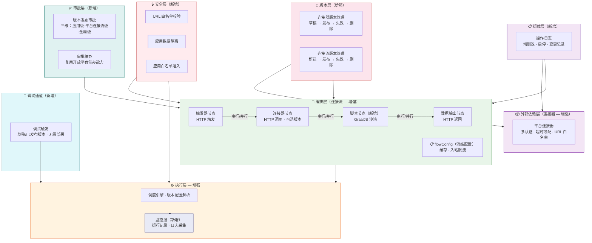
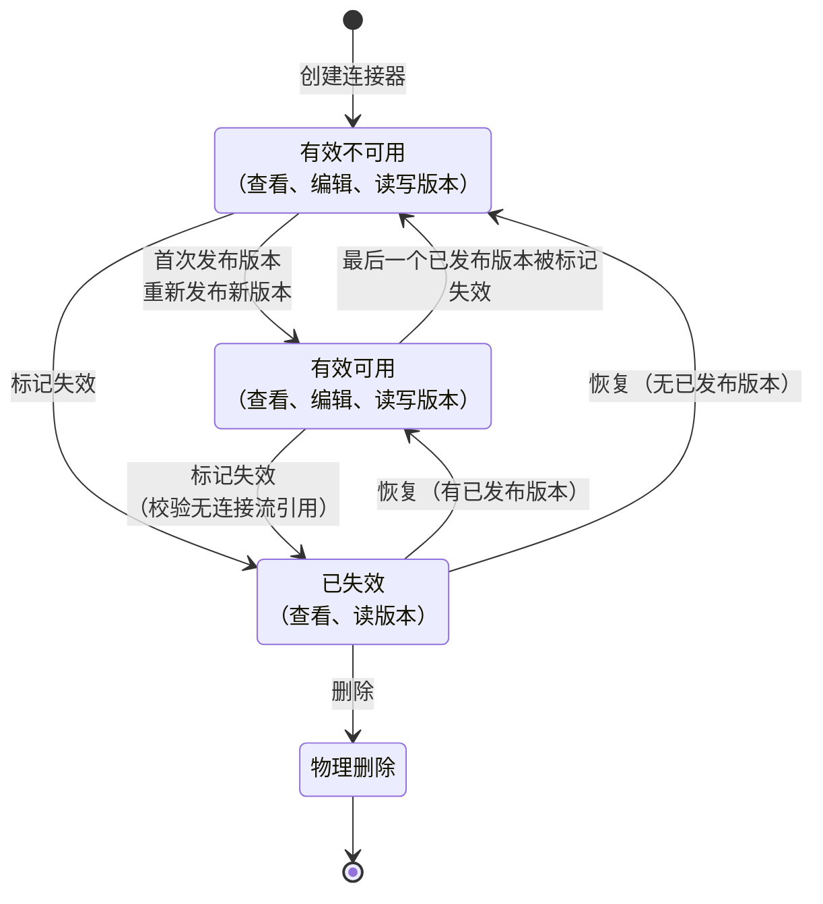
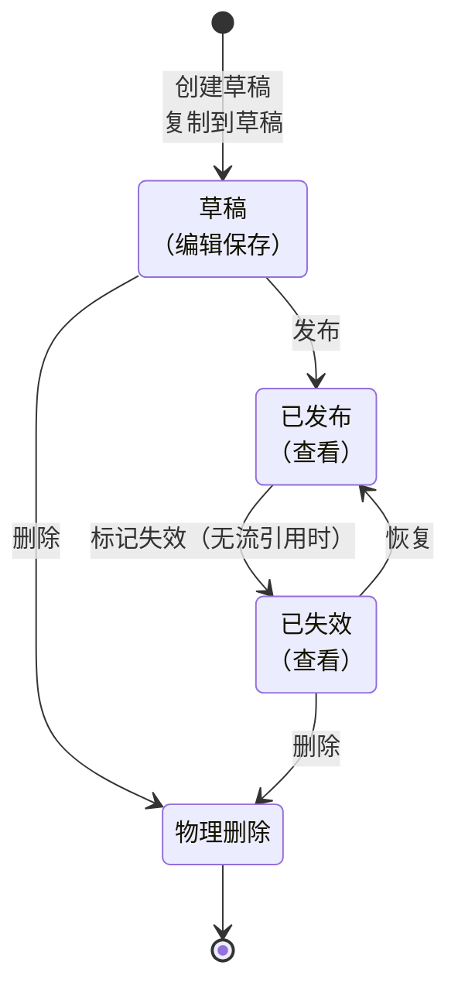
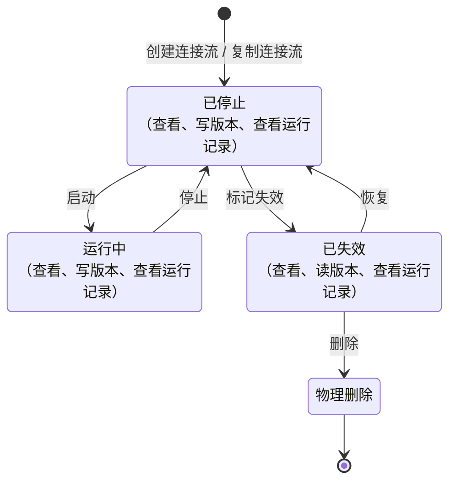
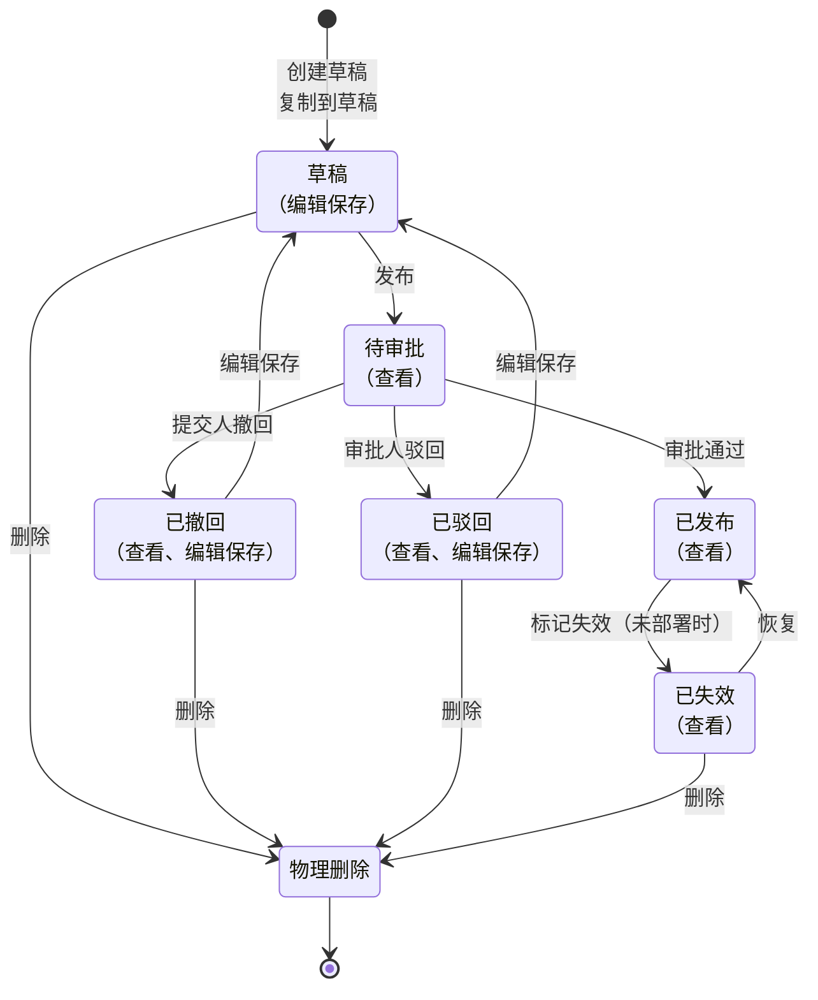
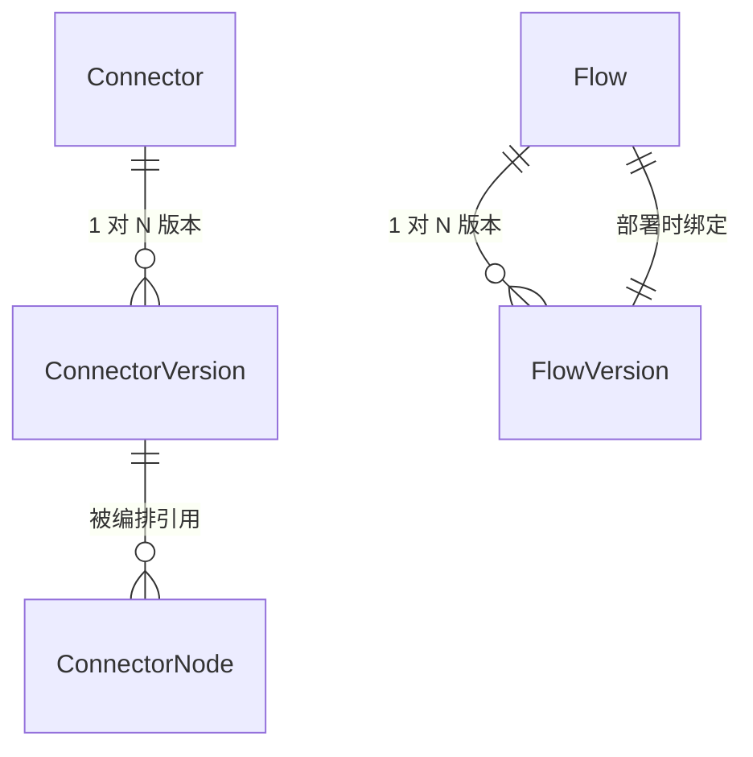

# 规范文档：连接器平台 V3 — 多版本与增强

**Feature ID**: CONN-PLAT-002  
**名称**: 连接器平台 V3 — 多版本与增强（Connector Platform V3 — Multi-Version & Enhancement）  
**状态**: draft  
**优先级**: P1  
**作者**: Summer  
**创建日期**: 2026-06-02  
**最后更新**: 2026-06-22  
**依赖**: CONN-PLAT-001（V1 MVP — 已建成并验证）  

---

> ### 📌 V2→V3 设计方向转变
> 
> **V2 设计方向：完整好用** — 以「功能完备」为目标，涵盖数据处理节点、错误处理节点、严格类型约束等完整体系。V2 详细设计文档已归档至 [`../specs-tree-connector-platform-v2/`](../specs-tree-connector-platform-v2/)。
> 
> **V3 设计方向：简单可用，能兜底** — 精简非刚需功能（数据处理节点、错误处理节点），大幅放宽前置校验（FR-047 仅保留 JSON 语法），以脚本节点作为复杂场景兜底方案。核心原则：**让连接器尽可能简单，但又功能强大**。
> 
> | 维度 | V2（已归档） | V3（当前） |
> |------|:-----------:|:---------:|
> | 交互方式 | 编排画布（React Flow 拖拽） | 流程编排（表单配置） |
> | 节点类型 | 触发器/连接器/数据输出/数据处理/错误处理 | 触发器/连接器/数据输出/**脚本** |
> | 数据校验 | 11 条严格类型约束（递归展开/禁止跨类型映射/禁止整体引用） | 仅 JSON 语法合法性 |
> | 复杂逻辑 | 数据处理节点（4 种函数）+ 错误处理（重试/忽略/终止） | 脚本节点（GraalJS 沙箱，`function main(ctx)`） |
> | 设计目标 | 平台保证正确性 | 用户自行负责，平台兜底 |

## 1. 概述

### 1.1 问题陈述

V1（CONN-PLAT-001）已验证了**零代码编排**的核心价值。但随着使用深入，V1 的能力边界暴露出以下痛点：

- **无版本管理**：连接器和连接流编辑即生效，无法保留多版本配置，变更无追溯
- **配置能力不足**：认证方式单一，超时不可配；编排仅支持串行，无并行分支和字段类型转换能力
- **安全防护薄弱**：缺少 URL 白名单和 SYSTOKEN 凭证白名单校验，连接器/连接流数据无应用级隔离，无应用白名单准入控制
- **发布缺少审批**：连接流版本发布无审批流程，关键变更缺少人工确认环节
- **运维不可见**：无运行记录监控，运行时缺乏版本配置解析和日志采集能力，变更操作无日志审计
- **调试效率低**：编排修改后必须发布、部署才能验证，迭代周期长
- **数据模型局限**：JSON Schema 参数传递和 HTTP 节点参数位置（header/query/body）支持不足

### 1.2 解决方案

V3 在 V1 基础上围绕**连接器增强、连接流增强、运行时增强、安全与准入、数据模型升级、调试体验、运维审计**七个方向升级：

- **连接器**：配置支持多版本管理（草稿→发布→失效→删除），认证类型扩展至数字签名、Cookie，支持多选组合
- **连接流**：配置支持多版本管理，生命周期操作独立为部署（版本绑定）、启动（状态迁移）、停止（状态迁移），三方互不耦合。版本发布需经过三级审批并支持一键催办，流程编排支持入站限流、超时控制、缓存及并行分支，新增脚本节点（GraalJS 沙箱）处理复杂逻辑，支持一键复制为独立连接流实体
- **运行时**：支持运行记录监控查看，运行时引擎升级以适配版本配置解析、日志采集等新特性
- **安全与准入**：连接器 URL 白名单校验，连接器/连接流数据按应用维度归属隔离，连接器平台能力按应用白名单逐步灰度开放
- **数据模型**：JSON Schema 增强，参数支持 input/output，HTTP 节点支持 header/query/body 参数位置。JSON 配置仅校验语法合法性，引用和类型约束由用户自行保证，完整 Schema 设计见 [plan-json-schema.md](./plan-json-schema.md)
- **调试**：草稿版本和已发布版本均支持页面直接触发调用，无需部署
- **运维**：连接器、连接流的增删改、启停等变更操作支持记录操作日志

### 1.3 架构

V3 在 V1 三层架构（外部依赖层 → 编排层 → 执行层）基础上叠加七个增强层：

V3 架构核心变化：

| 层级 | V1 | V3 增强 |
|------|-----|--------|
| **版本层** | 单版本，运行时未校验 | 多版本管理（草稿→发布→失效→删除），运行时校验版本 |
| **外部依赖层** | 单一认证，超时不可配 | 多认证（数字签名、Cookie），支持多选，超时可配，URL 白名单校验 |
| **编排层** | 纯串行，3 种节点（触发器/连接器/数据输出） | 新增脚本节点（GraalJS 沙箱），4 种节点；编排支持串行/并行（并行处理节点上限 8 分支） |
| **数据模型层** | 基础 JSON Schema | JSON Schema 增强：input/output 参数支持、header/query/body 参数位置；仅校验 JSON 语法合法性，完整 Schema 设计见 plan-json-schema.md |
| **执行层** | 调度执行 | 新增版本配置解析、运行记录监控、日志采集 |
| **安全层** | 无 | URL 白名单、应用数据隔离、应用白名单准入 |
| **审批层** | 无 | 版本发布审批（三级：应用级+平台连接流级+全局级）、审批一键催办 |
| **调试通道** | 无 | 草稿版本和已发布版本页面直调，无需部署 |
| **运维层** | 无 | 连接器/连接流增删改、启停等操作日志记录 |

### 1.4 Goals

| # | 目标 |
|---|------|
| **G1** | **连接器：配置多版本** — 支持多个已发布版本并行共存，可按需切换查看任意历史版本。生命周期：草稿 → 发布 → 失效 → 删除 |
| **G2** | **[已移除 — 并入 NG]** 连接器级限流配置 |
| **G3** | **连接器：认证类型增强** — 现有 SOA/APIG 基础上新增数字签名认证、Cookie 认证，支持认证多选组合，凭证支持配置放置位置（Header/Query） |
| **G4** | **连接流：配置多版本** — 支持多个已发布版本并行共存，可按需切换查看任意历史版本。生命周期：草稿 → 发布 → 失效 → 删除 |
| **G5** | **连接流：生命周期增强** — 部署 → 启动 → 停止，部署与启动完全隔离：部署仅绑定版本不改变状态，启动独立迁移状态（已停止 → 运行中）。生命周期状态：已停止 ⇄ 运行中 → 已失效 → 物理删除 |
| **G6** | **连接流：版本发布审批** — 连接流版本发布需经过三级审批：应用级版本发布审批人、平台级连接流统一审批人、全局审批人，全部通过后版本生效。平台管理员统一配置审批人，复用开放平台现有三级审批能力 |
| **G7** | **连接流：版本发布审批一键催办** — 连接流版本发布审批支持一键催办，复用开放平台现有审批催办能力，拓展至版本发布审批场景 |
| **G8** | **连接流：流程配置增强** — 编排支持触发器节点 SYSTOKEN 凭证白名单、连接器节点超时可配、连接流自身触发限流、串行/并行分支（仅并行，无条件和循环）；连接器节点可选引用版本；新增脚本节点（§3.8d）处理复杂逻辑 |
| **G9** | **[已移除]** ~~连接流：字段数据类型转换~~ — 非刚需移除，复杂场景由脚本节点（§3.8d）兜底 |
| **G18** | **连接流：一键复制** — 连接流列表支持一键复制，复制后生成独立连接流实体（含完整版本历史），名称自动追加 `_copy_xxxxx` 随机后缀，状态默认为「已停止」，仅限同应用内复制 |
| **G10** | **运行时：运行监控** — 连接流最近运行记录查看（触发时间、状态、耗时、触发方式） |
| **G11** | **运行时：运行时增强** — 运行时支持版本配置读取解析、日志采集记录、新增特性适配 |
| **G12** | **安全：连接器 URL 白名单校验** — 配置连接器时设置正则规则作为 URL 白名单，运行时按规则校验实际请求地址 |
| **G13** | **安全：数据按应用隔离** — 连接器、连接流数据按应用维度归属隔离，不同应用间资源互不可见 |
| **G14** | **安全：连接器平台应用白名单** — 平台管理员维护可开通连接器功能的应用白名单，白名单内应用才可使用连接器平台能力，支持逐步灰度 |
| **G15** | **数据模型：JSON Schema 增强** — 参数传递支持 input/output；HTTP 类型节点支持 header/query/body 参数位置。~~全平台数据结构严格类型约束~~ 已移除（见 FR-047），仅保留 JSON 语法校验 |
| **G16** | **调试：调试触发** — 连接流草稿版本和已发布版本均支持在页面直接触发调试调用，无需部署。失效版本不支持调试 |
| **G17** | **运维：操作日志** — 连接器、连接流的增删改、启停等变更操作支持记录操作日志 |

### 1.5 Non-Goals

| # | 非目标 | 原因 |
|---|--------|------|
| NG1 | AI 辅助编排 | V3 阶段 |
| NG2 | 连接器模板库 | 模板延后 |
| NG3 | 三方连接器开放发布 | V3 阶段 |
| NG4 | 连接器审批管控 | V3 无连接器审批流程 |
| NG5 | Scope 权限管控 | V3 仅做应用级隔离（G13），Scope 粒度权限待定 |
| NG6 | 连接器评分/评论系统 | V3 阶段 |
| NG7 | 开发者工具链（SDK/CLI/IDE 插件） | 后续版本 |
| NG8 | 社区市场/跨企业共享连接器 | 仅限企业内部 |
| NG9 | 计费/订阅系统 | 无需计费 |
| NG10 | 通用 iPaaS | 聚焦 XX 平台能力编排 |
| NG11 | 多集群/多云连接器运行时 | 企业内单一集群 |
| NG12 | 条件分支/循环/子流程编排 | V3 仅并行分支 |
| NG13 | 事件触发器 | V3 阶段 |
| NG14 | 定时触发器（Cron） | V3 阶段 |
| NG15 | 失败重试 | 延后评估 |
| NG16 | 表达式/模板/低代码函数处理 | V3 脚本节点（FR-040a）已覆盖复杂处理场景，表达式/模板等非刚需延后 |
| NG17 | 连接器级出站限流策略可配 | V3 移入，延后评估 |

---

### 1.6 关键设计决策

| 维度 | 关键设计 | 保护对象 | 配置对象 | 归属 |
|------|---------|---------|---------|:--:|
| **超时** | 属于连接流，非连接器。超时是调用方诉求，不同流对同一连接器可设不同超时值。平台管理员可按应用设置最大超时上限（平台统一默认 5s，未设独立值的应用回退使用平台统一默认） | 调用方（连接流）不长时间阻塞 | 应用管理员编排连接流时按节点配置，运行时取 min(节点值, 应用最大超时值) | G8 |
| **入站限流** | 属于连接流。限制连接流被触发的频率，防止自身过载。平台管理员可按应用设置最大限流上限（平台统一默认 QPS=1000、并发=1000，未设独立值的应用回退使用平台统一默认） | 连接流自身 | 应用管理员在连接流编排时配置，运行时取 min(流配置值, 应用最大限流值) | G8 |
| **缓存** | 属于连接流。通过缓存子图结果减少重复调用。TTL 上限默认 15 天 | 后端系统 + 调用效率 | 应用管理员在连接流运行时配置中设定 | G8 |
| **脚本节点** | 属于连接流。每流最多 10 个，用户编写 `function main(ctx) { ... return ... }` 处理复杂逻辑。GraalJS 沙箱执行（ES2022），五层纵深防御，不提供内置工具。ctx 为上游全量数据函数参数，return 显式输出。详细设计见 [plan-script.md](./plan-script.md) | 调用方（连接流） | 应用管理员在连接流编排时编写脚本 | G8 |
| **并行分支** | 属于连接流。并行处理节点内分支上限 8，防止资源过度拆分 | 连接流自身 | 应用管理员编排连接流时在并行处理节点中配置分支数 | G8 |
| **日志采集开关** | 属于平台 + 应用。控制是否写入节点级运行日志。平台管理员设置平台统一默认值（默认开启），可按应用覆盖；某应用未设独立值时回退使用平台统一默认。关闭后不再写入节点日志，运行记录仅保留基础信息；已写入的历史日志保留不变仍可查询。开关关闭期间条数上限和保留天数策略对不再写入的日志无实际影响（无新数据触发清理），老数据仍按策略到期清理 | 后端存储 | 平台管理员在应用级配置中设定；应用管理员在自己的应用内可操作开启/关闭 | G11 |
| **引用稽核** | 被引用方的校验通过查询引用方确定，不把引用关系固化到被引用方的状态或字段中。被引用方只关心自身配置，不关心"被谁用"。细则：① FlowVersion「已部署」不设独立状态，失效前查 `flow.deployed_version_id` 即可（1:1，O(1)）；② ConnectorVersion 的编排引用通过 `connector_version_ref` 中间表显式管理（M:N），保存编排时同步维护 | — | 引用关系存于引用方或中间表 | — |

### 1.7 核心业务对象生命周期

V3 有四个核心业务对象承载状态流转，是功能需求的基础约束。生命周期决定了 FR 中「可/不可」操作的边界条件，以及 EC 的处理逻辑。

> 💡 **关键认知**：连接器和连接流是状态容器，自身状态极简；版本是真正的配置载体，承载完整的发布/失效/审批流转。

| 对象 | 状态数 | 状态列表 | 审批 | 多版本并存 |
|------|:---:|------|:---:|:---:|
| 连接器 (Connector) | 4 | 有效可用 → 有效不可用 → 已失效 → 物理删除 | ❌ | — |
| 连接器版本 (ConnectorVersion) | 4 | 草稿 → 已发布 → 已失效 → 物理删除 | ❌ | ✅ |
| 连接流 (Flow) | 4 | 已停止 ⇄ 运行中 → 已失效 → 物理删除 | ❌ | — |
| 连接流版本 (FlowVersion) | 7 | 草稿 → 待审批 → 已撤回 / 已驳回 → 已发布 → 已失效 → 物理删除 | ✅ 三级 | ✅ |

---

#### 1.7.1 连接器生命周期

| 可执行的操作 | 有效可用 | 有效不可用 | 已失效 | 物理删除 |
|------|:---:|:---:|:---:|:---:|
| 查看基本信息 | ✅ | ✅ | ✅ | — |
| 编辑基本信息 | ✅ | ✅ | ❌ | — |
| 读版本 | ✅ | ✅ | ✅ | — |
| 写版本 | ✅ | ✅ | ❌ | — |
| 标记失效 | ✅（无流引用） | ✅（无流引用） | — | — |
| 恢复 | — | — | ✅ | — |
| 删除 | ❌ | ❌ | ✅ | — |

---

#### 1.7.2 连接器版本生命周期

连接器版本是配置的真正载体，多版本并行共存，无审批流程。

| 可执行的操作 | 草稿 | 已发布 | 已失效 | 物理删除 |
|------|:---:|:---:|:---:|:---:|
| 查看 | ✅ | ✅ | ✅ | — |
| 编辑保存 | ✅ | ❌ | ❌ | — |
| 发布 | ✅（非空配置） | — | — | — |
| 创建草稿 | — | ✅ | ✅ | — |
| 复制到草稿 | ❌ | ✅（未达1000上限） | ✅（未达1000上限） | — |
| 标记失效 | — | ✅（无流引用） | — | — |
| 恢复 | — | — | ✅ | — |
| 删除 | ✅ | ❌ | ✅ | — |

---

#### 1.7.3 连接流生命周期

> 💡 连接流状态机极简，仅 4 个状态。**部署**不改变状态 — 部署是纯版本绑定切换动作，在「已停止」和「运行中」状态下均可执行。**启动**是独立于部署的状态迁移动作，将「已停止」推进至「运行中」。

> 📌 **部署（独立动作，不改变状态）**：在「已停止」或「运行中」状态下，选择一个已发布版本执行部署，系统绑定该版本到连接流（设置 `deployed_version_id`）。部署本身不改变连接流状态，仅切换运行时引用的版本配置。在「运行中」状态下部署新版本时，运行时立即切换到新版本配置，当前执行中的实例继续用旧版本完成。

| 可执行的操作 | 已停止 | 运行中 | 已失效 | 物理删除 |
|------|:---:|:---:|:---:|:---:|
| 查看 | ✅ | ✅ | ✅ | — |
| 读版本 | ✅ | ✅ | ✅ | — |
| 写版本 | ✅ | ✅ | ❌ | — |
| 查看运行记录 | ✅ | ✅ | ✅ | — |
| **部署**（切换版本绑定） | ✅ | ✅（替换运行版本） | — | — |
| 启动 | ✅（有已部署版本时） | — | — | — |
| 停止 | — | ✅ | — | — |
| 标记失效 | ✅ | ❌ | — | — |
| 恢复 | — | — | ✅ | — |
| 删除 | ❌ | ❌ | ✅ | — |

---

#### 1.7.4 连接流版本生命周期

连接流版本是编排配置的真正载体，含三级审批流程。撤回和驳回独立为状态，保证自身可读无需回查审批表。

| 可执行的操作 | 草稿 | 待审批 | 已撤回 | 已驳回 | 已发布 | 已失效 | 物理删除 |
|------|:---:|:---:|:---:|:---:|:---:|:---:|:---:|
| 查看 | ✅ | ✅ | ✅ | ✅ | ✅ | ✅ | — |
| 编辑保存 | ✅ | ❌ | ✅（到草稿） | ✅（到草稿） | ❌ | ❌ | — |
| 发布 | ✅（非空编排） | — | — | — | — | — | — |
| 撤回 | — | ✅ | — | — | — | — | — |
| 驳回 | — | ✅ | — | — | — | — | — |
| 审批通过 | — | ✅ | — | — | — | — | — |
| 创建草稿 | — | — | — | — | ✅ | ✅ | — |
| 复制到草稿 | ❌ | ❌ | ❌ | ❌ | ✅ （无待审批/已撤回/已驳回版本 有草稿则覆盖，未达1000上限） | ✅ （无待审批/已撤回/已驳回版本 有草稿则覆盖，未达1000上限） | — |
| 标记失效 | — | — | — | — | ✅（未被运行中的流部署） | — | — |
| 恢复 | — | — | — | — | — | ✅ | — |
| 删除 | ✅ | ❌ | ✅ | ✅ | ❌ | ✅ | — |

---

#### 1.7.5 四对象关系与约束总结

| 约束 | 涉及对象 | 说明 |
|------|---------|------|
| 删除连接器需检验无引用 | Connector → Flow (ConnectorNode) | 运行中流引用某连接器的任意版本，则该连接器不可删除 |
| 失效版本需检验无流引用 | ConnectorVersion → Flow (ConnectorNode) | 任何流引用该版本即禁止失效 |
| 失效流版本需检验未部署 | FlowVersion → Flow | 已部署的版本禁止失效（无论流处于何种状态），需先部署其他版本解除绑定 |
| 删除流需已失效 | Flow | 仅已失效状态可删除 |
| 复制仅限同应用 | Flow → Application | 跨应用不可复制 |

---

## 2. 用户故事

> 💡 V3 面向两类角色：**平台管理员**负责平台级安全与审批配置；**应用管理员**负责自有应用下连接器和连接流的日常管理。

### 2.1 平台管理员

| ID | 用户故事 | 对应 Goal |
|----|---------|----------|
| US-01 | 配置连接器 URL 正则白名单规则，限制允许调用的目标地址范围 | G12 |
| US-02 | 维护连接器平台应用白名单，控制哪些应用开通连接器平台能力，支持逐步灰度 | G14 |
| US-03 | 配置连接流版本发布三级审批人（应用级/平台连接流级/全局级） | G6 |
| US-03a | 按应用配置节点超时最大上限、入站限流最大上限、运行记录条数上限和日志采集开关（平台统一默认：超时 5s，限流 QPS=1000/并发=1000，运行记录 1000 条/流，日志采集开启；未设独立值的应用回退使用平台统一默认） | G8、G11 |

### 2.2 应用管理员

| ID | 用户故事 | 对应 Goal |
|----|---------|----------|
| US-04 | 创建和管理连接器，管理连接器配置的多版本（草稿→发布→失效→删除） | G1 |
| US-05 | 选择连接器认证方式（SOA/APIG/数字签名/Cookie），支持多选组合，配置凭证放置位置（Header/Query） | G3 |
| US-06 | 创建和管理连接流，管理配置的多版本，发布版本需审批并支持催办，独立执行部署（版本绑定）和启动（状态迁移）操作 | G4、G5、G6、G7 |
| US-07 | 提交连接流版本发布审批，支持一键催办 | G6、G7 |
| US-08 | 编排连接流：配置节点超时、流级限流、SYSTOKEN 白名单、缓存、串行/并行、选择连接器引用版本，编写脚本节点处理复杂逻辑 | G8 |
| US-09 | [已移除] ~~在数据处理节点中配置字段数据类型转换~~ — 非刚需移除，见 G9 |
| US-10 | 查看连接流运行记录（触发时间、状态、耗时），节点详细日志的可见性依赖日志采集开关状态；在自己的应用内可控制日志采集开关的开启/关闭 | G10、G11 |
| US-11 | 在草稿版本和已发布版本上直接触发调试调用，无需部署 | G16 |
| US-12 | 查看连接器、连接流的操作日志（增删改、启停等变更记录），复用应用现有操作日志模块 | G17 |
| US-13 | 在连接流列表一键复制连接流，得到独立连接流实体，名称自动加随机后缀，状态默认已停止 | G18 |

---

## 3. 功能需求

### 3.1 连接器实体（G1）

> 💡 连接器实体是版本的载体，自身状态极简。创建连接器时不自动生成草稿版本，需手动创建（FR-005a）。

| FR | 名称 | 描述 | 验收标准 |
|----|------|------|---------|
| **FR-001** | 创建连接器 | V3：创建连接器时不自动生成草稿版本，仅创建连接器实体 | ① 创建连接器时填写基本信息（名称、描述、协议等），提交后创建连接器实体，连接器进入「有效不可用」状态（§1.7.1） ② ✅【创建时不校验】创建连接器时不校验业务必填字段（名称、描述、协议等信息允许为空），仅做数据库存储级别约束校验（如字段值超出列定义长度导致无法写入）。业务必填校验推迟到首次发布版本时执行（FR-007） ③ 创建连接器后需手动创建草稿版本（FR-005a）或从已发布版本复制到草稿（FR-006）来获得可编辑的版本 |
| **FR-002** | 恢复连接器 | V3：已失效的连接器可恢复 | ① 仅「已失效」状态可恢复 ② 恢复后连接器进入「有效」状态，具体为「有效可用」还是「有效不可用」由当前是否存在已发布版本来决定——有已发布版本则为「有效可用」，无已发布版本则为「有效不可用」（与 §1.7.1 的判定逻辑一致） ③ 恢复操作记录操作日志（FR-046） |
| **FR-003** | 失效连接器 | V3：有效可用或有效不可用的连接器可标记为已失效 | ① 标记失效前校验无连接流引用该连接器的任何版本（§1.7.1） ② 标记失效后连接器状态变为「已失效」，不可编辑、不可发布版本 |
| **FR-004** | 删除连接器 | V3：已失效的连接器可物理删除 | ① 仅「已失效」状态可删除 ② 删除前二次确认，删除后状态变为「物理删除」，不可恢复 |

### 3.2 连接器版本（G1）

> 💡 连接器版本生命周期见 §1.7.2：草稿 → 已发布 → 已失效 → 物理删除。V1 无版本概念，V3 新增完整多版本管理。

| FR | 名称 | 描述 | 验收标准 |
|----|------|------|---------|
| **FR-005** | 编辑草稿 | 草稿版本的连接器配置可修改。保存后覆盖当前草稿内容，不产生新版本号。草稿不影响已发布版本及运行中的连接流。 | ① 修改仅作用于当前草稿，已发布版本不受影响 ② 保存后草稿版本号不变，内容更新为最新修改 ③ ✅【保存时不校验】保存草稿时不执行任何数据格式平台要求限制校验（包括但不限于：URL 正则合法性、入参/出参 Schema 合规性检查、数据结构类型约束 FR-047），且不校验业务必填项（连接器名称、描述、协议等信息允许为空）。仅做数据库存储级别约束校验（如字段值超出列定义长度导致无法写入、不兼容的数据类型导致 DB 写入失败等），其余一律放行。所有业务必填校验和平台要求限制校验统一推迟到发布时执行（FR-007） ④ 运行中的连接流仍使用各自引用的已发布版本配置 |
| **FR-005a** | 创建草稿版本 | V3 新增：连接器支持手动创建空草稿版本，作为可编辑的配置工作区 | ① 连接器版本列表提供「创建草稿」按钮 ② 点击后生成一个空草稿版本（版本号递增），草稿配置为空 ③ 创建前提：当前无草稿版本时正常创建；已有草稿时提示「已存在草稿版本，请编辑当前草稿」 ④ 创建前校验版本总数：达 1000 上限时禁止创建，提示「版本数量已达上限（1000），请清理失效版本后再试」（EC-019） ⑤ ✅【创建时不校验】创建空草稿时不执行任何数据格式平台要求限制校验，生成的草稿版本允许配置为空、允许包含不合规数据格式 ⑥ 创建后草稿版本在版本列表中单独展示，标记为「草稿」 |
| **FR-006** | 复制到草稿 | V3 新增：在已发布版本上点击「复制到草稿」，以该版本配置快照为内容生成或覆盖草稿版本 | ① 连接器版本列表的已发布版本行提供「复制到草稿」操作按钮 ② 点击后以该已发布版本的完整配置快照为内容生成新草稿（新版本号递增），不影响原版本 ③ 复制前校验版本总数：达 1000 上限时禁止复制，提示「版本数量已达上限（1000），请清理失效版本后再试」 ④ ✅【复制时不校验】复制到草稿时不执行数据格式平台要求限制校验（包括但不限于：URL 正则合法性、入参/出参 Schema 合规性、数据结构类型约束）。所有平台要求校验统一推迟到发布时执行（FR-007） ⑤ 若当前已有草稿，以选中版本快照覆盖当前草稿内容；若无草稿，则新建草稿版本 |
| **FR-007** | 发布版本 | V3 新增：草稿发布为正式版本，同一数据记录状态由草稿变更为已发布，多已发布版本并行共存 | ① 仅草稿状态可发布 ② ⚠️【发布时校验】发布时统一执行以下全部校验（数据库级 + 业务必填 + 平台要求限制），任一项不通过则禁止发布并提示具体错误：    a) 业务必填字段校验：连接器基本信息的必填字段（名称、描述、协议等）不得为空；为空时提示「请完善连接器基本信息，缺少必填字段：xxx」    b) 草稿配置非空校验：配置为空时禁止发布（EC-009），提示「请先完善连接配置」    c) URL 正则白名单合法性校验（FR-015）：正则语法不合法则禁止发布，提示具体错误的正则行    d) 数据结构类型约束校验（FR-047）：入参/出参 Schema 未递归展开到基本类型、引用路径终点非基本类型、跨类型映射赋值、数组多源混引等，不满足则禁止发布 ③ 发布后版本状态变更为「已发布」，版本号沿用草稿时的版本号 ④ 多已发布版本并行共存，互不影响 ⑤ 首次发布时连接器状态从「有效不可用」→「有效可用」（§1.7.1） |
| **FR-008** | 版本查看 | V3 新增：查看已发布版本列表，可切换查看任意历史版本配置详情 | ① 版本列表展示：版本号、状态（已发布/已失效）、发布时间、发布人 ② 点击版本行展开/跳转该版本的完整配置快照（只读） ③ 支持切换查看任意历史版本，当前选中行高亮 ④ 无已发布版本时提示「暂无已发布版本」 ⑤ 草稿版本在列表中单独展示，标记为「草稿」 |
| **FR-009** | 版本失效 | V3 新增：已发布版本可标记失效。已有连接流引用的版本不可标记失效，失效后不可被引用 | ① 仅「已发布」状态可标记失效，操作后状态变为「已失效」；草稿不可标记失效 ② 失效前校验：查询引用关系（`connector_version_ref` 中间表），有连接流编排引用该版本时禁止失效（EC-001），提示「以下连接流引用了此版本：xxx」，列出引用流名称 ③ 失效后该版本不可被新连接流编排引用 ④ 若失效的是连接器最后一个已发布版本，连接器状态「有效可用」→「有效不可用」（§1.7.1） |
| **FR-010** | 版本删除 | V3 新增：草稿和已失效版本可删除 | ① 草稿和「已失效」状态可删除，操作后状态变为「物理删除」；「已发布」状态需先标记失效，再删除 ② 删除不可恢复，删除前二次确认「删除后不可恢复，确认删除？」 ③ 草稿可直接删除，无需先标记失效 |
| **FR-011** | 恢复版本 | V3 新增：已失效的连接器版本可恢复至「已发布」状态 | ① 仅「已失效」状态可恢复，操作后状态变为「已发布」 ② 恢复后版本可重新被连接流编排引用 ③ 若恢复的是连接器唯一已发布版本，连接器状态「有效不可用」→「有效可用」（§1.7.1） |

### 3.3 连接器配置（G3、G12）

| FR | 名称 | 描述 | 验收标准 |
|----|------|------|---------|
| **FR-012** | 认证类型 | V1 已支持 SOA、APIG。V3 新增：数字签名认证、Cookie 认证 | ① 连接器认证配置页面提供认证类型选择：SOA / APIG / 数字签名 / Cookie ② 选择数字签名后，仅需输入 Secret Key，加密存储，算法由平台统一处理 ③ 选择 Cookie 后，仅需填写 Cookie 名称（如 `SESSION_ID`），Cookie 的具体值由连接流编排时手动映射，连接器侧不定义来源 ④ 凭证加密存储，界面脱敏显示（同 V1 凭证安全要求 NFR-013） ⑤ 切换认证类型时提示「切换认证类型将清空当前凭证配置」，需用户确认 |
| **FR-013** | 凭证位置 | V1 已支持自定义凭证位置。V3 增强：数字签名凭证支持配置放置位置（Header、Query） | ① 凭证位置配置为下拉选项：Header / Query ② 选择 Header 时需填写 Header 名称（如 `X-Signature`） ③ 选择 Query 时需填写 Query 参数名（如 `signature`） ④ SOA / APIG 的凭证位置沿用 V1 已有配置方式，本次不强制改动 |
| **FR-014** | 认证多选 | V3 新增：同一连接器支持同时选择多种认证方式，运行时按次序附加 | ① 认证类型选择改为多选：SOA / APIG / 数字签名 / Cookie 可同时勾选 ② 多选时支持拖拽排序，运行时按排序依次附加认证信息 ③ Cookie 在多选场景下与其他认证方式并列，仅提供名称占位 ④ 取消所有勾选时提示「至少选择一种认证方式」 |
| **FR-015** | URL 正则白名单 | V1 无。V3 新增：平台管理员为连接器配置正则规则白名单，发布时校验正则合法性，运行态校验实际请求地址 | ① 连接器编辑页提供「URL 白名单」配置区，支持多条正则规则 ② 每条规则支持增删；✅【保存时不校验】草稿编辑保存时不校验正则合法性，允许暂存不合法正则表达式 ③ ⚠️【发布时校验】发布时（FR-007）统一校验所有正则规则的合法性，不合法则禁止发布并提示具体错误规则（EC-010） ④ 空白名单 = 不限制（允许调用任意地址）——与 SYSTOKEN 白名单的空=禁止规则相反 ⑤ 运行时每次连接器调用前，以实际请求的完整 URL 逐条匹配白名单正则 ⑥ 命中任意一条白名单规则 → 允许调用；全部不命中 → 拒绝调用，记录日志并返回错误 |

### 3.4 连接流实体（G5、G18）

> 💡 连接流生命周期见 §1.7.3：已停止 ⇄ 运行中 → 已失效 → 删除。**部署**不改变状态，仅切换版本绑定。创建连接流时不自动生成草稿版本，需手动创建（FR-024a）。

| FR | 名称 | 描述 | 验收标准 |
|----|------|------|---------|
| **FR-016** | 创建连接流 | V3：创建连接流时不自动生成草稿版本，仅创建连接流实体 | ① 创建连接流时填写基本信息（名称、描述等），提交后创建连接流实体，连接流进入「已停止」状态（§1.7.3） ② ✅【创建时不校验】创建连接流时不校验业务必填字段（名称、描述等信息允许为空），仅做数据库存储级别约束校验（如字段值超出列定义长度导致无法写入）。业务必填校验推迟到首次提交发布时执行（FR-026） ③ 创建连接流后需手动创建草稿版本（FR-024a）或从已发布版本复制到草稿（FR-025）来获得可编辑的版本 ④ 新创建的连接流无已部署版本，需先部署（FR-018）再启动（FR-019）才能响应触发 |
| **FR-017** | 一键复制 | 连接流列表支持一键复制，复制后生成独立连接流实体（含完整版本历史），名称自动追加 `_copy_xxxxx` 随机后缀，状态默认为「已停止」。仅限同应用内复制 | ① 连接流列表每行提供「复制」操作按钮 ② 点击复制后：创建新连接流实体，复制全部版本历史（含草稿/已发布/已失效等所有状态的版本）到新流 ③ 新连接流名称 = 原名称 + `_copy_xxxxx`（xxxxx 为随机 4 位十六进制 0000~ffff） ④ 后端校验名称唯一性，碰撞自动重试新后缀（EC-017） ⑤ 新连接流状态默认为「已停止」（§1.7.3），需部署和启动后方可响应触发 ⑥ 仅限同应用内复制：源连接流所属应用 = 目标应用，跨应用不可复制 ⑦ 复制时源连接流的状态不影响复制（运行中/已停止均可复制），复制生成的是独立实体（EC-016） ⑧ ✅【复制时不校验】一键复制时不执行任何数据格式平台要求限制校验，复制后的连接流及版本配置按原样保留，所有平台要求校验在后续各自版本的发布时执行 |
| **FR-018** | 部署 | V1 编辑保存即视为部署。V3 重构：部署是纯版本绑定切换动作，不改变连接流状态。选择已发布版本绑定到连接流，运行时按绑定版本配置执行 | ① 在连接流详情页选择已发布版本，点击「部署」，系统将该版本绑定到连接流（设置 `deployed_version_id`），连接流状态不变 ② 部署成功后，若连接流当前为「运行中」，运行时立即切换到新版本配置（当前执行中的实例继续用旧版本完成）；若当前为「已停止」，仅绑定版本不启动 ③ 部署前需确保选中的版本为「已发布」状态，否则操作拒绝 ④ 部署操作记录操作日志（FR-046） ⑤ **部署与启动完全隔离**：部署仅做版本绑定，不触发状态迁移；启动是独立的状态迁移操作（FR-019），将「已停止」→「运行中」 |
| **FR-019** | 启动 | V1 已支持。V3 增强：已停止的连接流可启动，恢复运行。启动与部署完全隔离，是独立的状态迁移动作 | ① 仅「已停止」状态可启动，操作后状态变为「运行中」 ② 启动前提：需存在已部署版本（`deployed_version_id` 非空），否则提示「请先部署一个版本后再启动」 ③ 启动后开始响应 HTTP 触发 ④ 启动操作记录操作日志（FR-046） ⑤ 「已失效」状态不可启动 ⑥ 启动与 FR-018（部署）完全独立：部署仅绑定版本不改变状态，启动仅迁移状态不绑定版本 |
| **FR-020** | 停止 | V1 已支持。V3 增强：运行中的连接流可停止 | ① 仅「运行中」状态可停止，操作后状态变为「已停止」 ② 停止后不再响应新触发；当前执行中的实例继续完成（EC-007） ③ 停止操作记录操作日志（FR-046） ④ 停止后仍可查看运行记录和版本历史 |
| **FR-021** | 恢复连接流 | V3：已失效的连接流可恢复 | ① 仅「已失效」状态可恢复 ② 恢复后连接流状态统一变为「已停止」（安全中间态，不自动响应触发） ③ 恢复后管理员可手动启动（FR-019） ④ 恢复操作记录操作日志（FR-046） |
| **FR-022** | 失效连接流 | V3：已停止的连接流可标记为已失效 | ① 运行中的连接流不可直接失效，必须先停止（§1.7.3） ② 标记失效后连接流状态变为「已失效」，不可编辑、不可启动 |
| **FR-023** | 删除连接流 | V3：已失效的连接流可物理删除 | ① 仅「已失效」状态可删除 ② 删除前二次确认，删除后状态变为「物理删除」，不可恢复 |

### 3.5 连接流版本（G4）

> 💡 连接流版本生命周期见 §1.7.4：草稿 → 待审批 → 已撤回 / 已驳回 → 已发布 → 已失效 → 物理删除。

| FR | 名称 | 描述 | 验收标准 |
|----|------|------|---------|
| **FR-024** | 编辑草稿 | 草稿版本的连接流编排可修改。保存后覆盖当前草稿内容，不产生新版本号。草稿不影响已部署的运行中版本。 | ① 修改仅作用于当前草稿（nodes + edges + flowConfig），已发布版本不受影响 ② ✅【保存时不校验】保存草稿时不执行任何数据格式平台要求限制校验（包括但不限于：入站限流上限、缓存时长上限、并行分支数上限、连接器版本引用可用性），且不校验业务必填项（连接流名称、描述等信息允许为空）。仅做数据库存储级别约束校验（如字段值超出列定义长度导致无法写入、不兼容的数据类型导致 DB 写入失败等），其余一律放行。所有业务必填校验和平台要求限制校验统一推迟到发布时执行（FR-026） ③ 保存后草稿版本号不变，编排内容更新为最新修改 ④ 运行中的连接流仍使用已部署版本的编排 |
| **FR-024a** | 创建草稿版本 | V3 新增：连接流支持手动创建空草稿版本，作为可编辑的编排工作区 | ① 连接流版本列表提供「创建草稿」按钮 ② 点击后生成一个空草稿版本（版本号递增），编排内容（nodes + edges + flowConfig）为空 ③ 创建前提：当前无草稿版本时正常创建；已有草稿时提示「已存在草稿版本，请编辑当前草稿」 ④ 创建前校验版本总数：达 1000 上限时禁止创建，提示「版本数量已达上限（1000），请清理失效版本后再试」（EC-020） ⑤ ✅【创建时不校验】创建空草稿时不执行任何数据格式平台要求限制校验，生成的草稿版本允许编排为空、允许包含不合规配置值 ⑥ 创建后草稿版本在版本列表中单独展示，标记为「草稿」 |
| **FR-025** | 复制到草稿 | V3 新增：在已发布版本上点击「复制到草稿」，以该版本编排快照为内容生成或覆盖草稿版本 | ① 连接流版本列表的已发布版本行提供「复制到草稿」操作按钮 ② 点击后以该已发布版本的完整编排快照（nodes + edges + flowConfig）生成新草稿（新版本号递增），不影响原版本 ③ 复制前校验版本总数：达 1000 上限时禁止复制，提示「版本数量已达上限（1000），请清理失效版本后再试」 ④ ✅【复制时不校验】复制到草稿时不执行任何数据格式平台要求限制校验（包括但不限于：入站限流上限、缓存时长上限、并行分支数上限、连接器版本引用可用性），且不校验业务必填项。仅做数据库存储级别约束校验（如字段值超出列定义长度导致无法写入），其余一律放行。所有业务必填校验和平台要求限制校验统一推迟到发布时执行（FR-026） ⑤ 复制前提校验：a) 当前存在待审批版本时禁止复制，提示「存在审批中的版本，请等待审批完成后再操作」 b) 当前存在已驳回版本时禁止复制，提示「存在已驳回的版本，请修改后重提或放弃后再操作」 c) 当前存在已撤回版本时禁止复制，提示「存在已撤回的版本，请重新编辑或放弃后再操作」 d) 当前已有草稿版本时，以选中版本快照覆盖当前草稿内容 e) 当前无草稿版本时，正常创建新草稿 |
| **FR-026** | 发布版本 | V3 新增：草稿发布为正式版本，同一数据记录状态由草稿变更为已发布 | ① 仅草稿状态可提交发布 ② ⚠️【发布时校验】提交发布时统一执行以下全部校验（数据库级 + 业务必填 + 平台要求限制），任一项不通过则禁止提交并提示具体错误：    a) 业务必填字段校验：连接流基本信息的必填字段（名称、描述等）不得为空；为空时提示「请完善连接流基本信息，缺少必填字段：xxx」    b) 编排非空校验：编排（nodes + edges）为空时禁止提交（EC-009），提示「请先完成编排配置」    c) 入站限流上限校验（FR-035）：QPS > 应用最大限流值或并发数 > 应用最大限流值则禁止提交（EC-025）    d) 节点超时上限校验（FR-034）：节点超时值 > 应用最大超时值则禁止提交（EC-028）    e) 缓存时长上限校验（FR-037）：TTL > 1296000 秒（15 天）则禁止提交（EC-026）    f) 并行分支数上限校验（FR-038a）：分支数 > 8 则禁止提交（EC-027）    g) 连接器版本引用可用性校验（FR-039）：引用的连接器版本不存在或非「已发布」状态则禁止提交（EC-004）    h) JSON 语法校验（FR-047）：所有 JSON 配置字段语法合法性（JSON parse 通过即可），不满足则禁止提交    i) 脚本节点语法校验（FR-040a）：`scriptContent` 必须是合法的 `function main(ctx) { ... }` 声明且 GraalJS parse 通过，不满足则禁止提交 ③ 校验通过后进入「待审批」状态，走三级审批流程 ④ 审批通过后版本状态变更为「已发布」，版本号沿用草稿时的版本号 ⑤ 多已发布版本并行共存 |
| **FR-027** | 版本查看 | V3 新增：查看已发布版本列表，可切换查看任意历史版本 | ① 版本列表展示：版本号、状态（已发布/已失效/待审批/已撤回/已驳回）、提交时间、发布人 ② 点击版本行展开/跳转该版本的完整编排快照（只读） ③ 支持切换查看任意历史版本，当前选中行高亮 ④ 无已发布版本时提示「暂无已发布版本」 |
| **FR-028** | 版本失效 | V3 新增：已发布版本可标记失效。已部署的版本不可标记失效，失效后不可部署 | ① 仅「已发布」状态可标记失效，操作后状态变为「已失效」 ② 失效前校验：查询 `flow.deployed_version_id`，当前版本为已部署版本时禁止失效（EC-002），提示「该版本当前已部署，请先部署其他版本后再操作」 ③ 失效后该版本不可被部署 ④ 失效后仍可查看版本配置快照 |
| **FR-029** | 版本删除 | V3 新增：草稿/已撤回/已驳回/已失效版本可删除 | ① 草稿、已撤回、已驳回、已失效状态可直接删除，操作后状态变为「物理删除」 ② 删除不可恢复，删除前二次确认「删除后不可恢复，确认删除？」 ③ 「已发布」和「待审批」状态不可直接删除：已发布需先标记失效，待审批需先撤回或驳回后再删除 |
| **FR-030** | 恢复版本 | V3 新增：已失效的连接流版本可恢复至「已发布」状态 | ① 仅「已失效」状态可恢复，操作后状态变为「已发布」 ② 恢复后版本可重新被部署 |

### 3.6 版本发布审批（G6、G7）

> 💡 连接流版本发布需三级审批（§1.7.4），复用开放平台审批引擎。审批过程对 FlowVersion 是黑盒。

| FR | 名称 | 描述 | 验收标准 |
|----|------|------|---------|
| **FR-031** | 提交审批 | V1 无审批。V3 新增：草稿版本发布时提交审批，审批通过后版本生效 | ① 草稿编排完成后点击「提交审批」，版本状态变为「待审批」 ② 系统向三级审批人依次发起审批（应用级 → 平台连接流级 → 全局级） ③ 审批通过后版本状态变为「已发布」，版本生效 ④ 任意一级驳回后版本状态变为「已驳回」（§1.7.4），驳回附带原因 ⑤ 提交人在审批完成前可撤回，版本状态变为「已撤回」 ⑥ 提交人在驳回后可修改草稿后重新提交审批 ⑦ 复用开放平台现有审批流程能力，不重新实现审批引擎 |
| **FR-032** | 审批人配置 | V3 新增：平台管理员配置三级审批人 | ① 平台管理员在连接器平台设置页配置三级审批人：a) 应用级版本发布审批人（按应用单独配置） b) 平台级连接流统一审批人（一个全局值） c) 全局审批人（一个全局值） ② 审批人配置变更后对新提交的审批生效，已发起的审批不受影响 ③ 审批人可配置多人，多人中任一审批通过即视为该级通过 ④ 审批人信息通过用户 ID 绑定，需校验用户存在且具有审批权限 |
| **FR-033** | 一键催办 | V3 新增：版本发布审批支持一键催办，复用开放平台催办能力 | ① 处于「待审批」状态的版本，提交人可点击「一键催办」 ② 催办后向当前审批节点的审批人发送通知（站内信/消息推送，复用现有能力） ③ 同一节点可重复催办，无冷却限制 ④ 超时未处理的审批保持「待审批」状态，不影响催办行为（EC-003） |

### 3.7 连接流编排 — 流级配置（G8）

> 💡 flowConfig（超时/入站限流/缓存）嵌入 FlowVersion 快照，不独立建表。

| FR | 名称 | 描述 | 验收标准 |
|----|------|------|---------|
| **FR-034** | 节点超时 | V1 无节点超时配置。V3 新增：连接器节点可配置超时时间，系统有应用级可配置的最大超时上限（平台统一默认 5s，可按应用覆盖），运行时取 min(节点值, 应用最大超时值) | ① 流程编排中选中连接器节点，右侧属性面板提供「超时时间」输入框（单位：秒） ② 不填或填 0 表示不限制（走应用最大超时值） ③ 应用最大超时值：平台管理员设置平台统一默认值（默认 5s），可按应用覆盖；某应用未设置独立值时回退使用平台统一默认值（§5.5） ④ ⚠️【发布时校验】提交发布时（FR-026）校验节点超时值不超过应用最大超时值，超限则禁止提交（EC-028） ⑤ 运行时取 min(节点配置值, 应用最大超时值)，超时后强制终止节点执行，标记「执行超时」 ⑥ 超时属于连接流配置，快照在 FlowVersion 中（§1.6） |
| **FR-035** | 入站限流 | V1 仅平台级默认限流。V3 新增：连接流自身触发限流（QPS/并发数），保护连接流不被高频调用。系统有应用级可配置的最大限流上限（平台统一默认 QPS=1000、并发=1000，可按应用覆盖） | ① 连接流 flowConfig 面板提供入站限流配置：限流方式（QPS / 并发数）、上限值（QPS 范围 0~应用最大限流值，并发数范围 0~应用最大限流值；填 0 表示关闭，走应用最大限流值） ② ✅【保存时不校验】草稿编辑保存时不校验上限值，允许暂存超出范围的值，界面可给出温和提示但不禁用保存按钮 ③ 应用最大限流值：平台管理员设置平台统一默认值（默认 QPS=1000、并发=1000），可按应用覆盖；某应用未设置独立值时回退使用平台统一默认值（§5.5） ④ ⚠️【发布时校验】提交发布时（FR-026）统一校验上限值：QPS > 应用最大限流值或并发数 > 应用最大限流值则禁止提交（EC-025） ⑤ 运行时取 min(流配置值, 应用最大限流值)，超限返回 429（Too Many Requests），不消耗执行资源 ⑥ 入站限流属于连接流，快照在 FlowVersion.flowConfig 中（§1.6） |
| **FR-036** | SYSTOKEN 白名单 | V1 无。V3 新增：触发器节点选择 SYSTOKEN 认证类型后，配置允许触发当前连接流的凭证白名单。空白名单=全部禁止 | ① 触发器节点认证配置中选择「SYSTOKEN」后展开白名单配置区域 ② 白名单表单支持添加多个凭证标识（字符串），支持增删 ③ 空白名单（列表为空）时任何 SYSTOKEN 凭证均不可触发此连接流（EC-011） ④ 运行时触发器校验：请求中的 SYSTOKEN 必须在白名单中，否则返回 401 |
| **FR-037** | 缓存配置 | V1 无。V3 新增：在 flowConfig 中配置缓存键（引用触发器输入参数）和缓存时长（TTL）。TTL 最小 1 秒，最大 1296000 秒（15 天） | ① flowConfig 面板提供缓存配置：缓存键（支持引用触发器入参字段，如 `$.input.userId`） ② 缓存时长（TTL）：秒，正整数，范围 1~1296000（15 天） ③ ✅【保存时不校验】草稿编辑保存时不校验 TTL 上限，允许暂存超出 15 天的值（如 2592000 秒 = 30 天），界面可给出温和提示但不禁用保存按钮 ④ ⚠️【发布时校验】提交发布时（FR-026）统一校验 TTL 上限：TTL > 1296000 秒则禁止提交，提示「缓存时长最大 15 天」（EC-026） ⑤ 缓存命中时跳过缓存节点子图的重复执行，直接返回缓存结果 ⑥ 缓存过期或未命中时正常执行，不中断流程（EC-012） ⑦ 版本发布/失效时主动清理对应版本的缓存，防止脏数据 |

### 3.8 流程编排（G8、G9）

### 3.8a 连接流编排 — 串行/并行（G8）

> 💡 并行处理节点为结构化并行组，通过主节点 + 分支标记节点组合实现。分支数范围 2~8，超过时发布时校验不通过，草稿保存不校验。

| FR | 名称 | 描述 | 验收标准 |
|----|------|------|---------|
| **FR-038** | 串行/并行 | V1 仅串行。V3 新增：节点间边支持并行连接模式，同一节点多条出边可并发执行 | ① 串行：节点依次执行 ② 并行：各分支并发执行，完成后自动汇聚到下游节点 |
| **FR-038a** | 并行处理节点 | V3 新增：结构化并行组节点，支持在同一节点内定义 2~8 个并行分支 | ① 分支数范围 2~8 ② ✅【保存时不校验】草稿编辑保存时不校验分支数上限，允许暂存超过 8 个分支的编排，界面可给出温和提示但不禁用保存按钮 ③ ⚠️【发布时校验】提交发布时（FR-026）统一校验分支数上限：分支数 > 8 则禁止提交，提示「并行分支数上限最大 8」（EC-027） ④ 各分支并发执行，完成后自动汇聚到下游节点 |

### 3.8b 连接流编排 — 连接器版本选择（G8）

| FR | 名称 | 描述 | 验收标准 |
|----|------|------|---------|
| **FR-039** | 连接器版本选择 | V1 无版本概念。V3 新增：编排时连接器节点可选择引用连接器的已发布版本 | ① 节点名称必填 ② 选择目标连接器后展示该连接器所有「已发布」版本（列表：版本号、发布时间），默认选中最新版本 ③ 选择版本后，运行时按该版本快照的配置执行 ④ ✅【保存时不校验】草稿编辑保存时不校验引用版本的可用性，允许暂存引用已失效/已删除版本（如编排保存期间连接器版本被失效），引用关系写入 `connector_version_ref` 中间表但不保证版本可用 ⑤ ⚠️【发布时校验】提交发布时（FR-026）统一校验所有连接器节点的引用版本是否存在且处于「已发布」状态，否则禁止提交，提示「引用的连接器版本不可用：连接器 "xxx" 版本 "vN"」（EC-004） ⑥ 编排时为连接器节点同步写入 `connector_version_ref` 中间表（§1.6） |

### 3.8c [已移除] 错误处理节点（G8）

> ❌ 已移除。错误处理节点（FR-039a）为非刚需功能，本期不做。连接器节点调用失败时直接终止整个连接流（V1 行为）。复杂容错逻辑由脚本节点（§3.8d）自行处理。

### 3.8d [已移除] 数据处理节点（G9）

> ❌ 已移除。数据处理节点（FR-040）为非刚需功能，本期不做。简单字段映射通过引用语法 `$.node.result.field` 完成，复杂数据加工由脚本节点（§3.8d）处理。

### 3.8e 连接流编排 — 脚本节点（G8）

> 💡 脚本节点用于处理复杂业务逻辑。用户编写标准 JavaScript（ES2022）函数 `function main(ctx) { ... return ... }`，通过 `ctx.{nodeId}.{input|output}.field` 路径访问任意上游节点数据。不提供内置工具（`_util`/`_log`），用户用纯 JS 自行实现所有逻辑。运行时使用 GraalJS 沙箱执行，五层纵深防御确保安全。详细设计见 [plan-script.md](./plan-script.md)。

| FR | 名称 | 描述 | 验收标准 |
|----|------|------|---------|
| **FR-040a** | 脚本节点 | V3 新增：用户编写 `function main(ctx) { ... return ... }` 处理复杂逻辑，ctx 为上游所有节点数据的函数参数，return 显式输出。不提供任何内置工具，用户自行编写所有逻辑 | ① 流程编排中可添加「脚本」节点类型，每连接流最多 10 个 ② 脚本节点配置：`scriptContent`（必填，标准 JS 函数声明，最大 10000 字符）、`outputSchema`（选填，声明出参字段供下游引用）、`timeout`（选填，默认 5s，范围 1~30s） ③ 数据访问：通过函数参数 `ctx.{nodeId}.{input\|output}.field` 读取上游节点数据，如 `ctx.conn_1.output.body.data.users` ④ 不提供 `_util`、`_log` 等内置工具——用户用纯 JS（ES2022）自行实现所有逻辑 ⑤ ✅【保存时不校验】草稿保存时仅校验 JSON 语法合法性，不执行脚本语法校验 ⑥ ⚠️【发布时校验】提交发布时（FR-026）统一校验：a) `scriptContent` 必须是合法的 `function main(ctx) { ... }` 声明，不允许函数外有任何代码；b) GraalJS 语法 parse 通过；不满足则禁止提交 ⑦ 运行时：GraalJS 沙箱执行（ES2022 严格模式，IO/线程/进程/Native/环境变量全部关闭），boundedElastic 线程隔离，`statementLimit=10000`，超时后强制终止 ⑧ 返回值作为节点 output，供下游通过 `ctx.script_1.output.field` 引用 |

### 3.9 调试（G16）

| FR | 名称 | 描述 | 验收标准 |
|----|------|------|---------|
| **FR-041** | 调试触发 | V1 无调试能力（必须发布部署后才能验证）。 V3 新增：草稿版本和已发布版本支持页面直接触发调试调用，无需部署，同步返回执行结果 | ① 连接流版本详情页（草稿版本和已发布版本）提供「调试」按钮 ② 点击调试后弹出调试面板：可输入触发器模拟数据（JSON 格式），点击「执行」触发 ③ 调试为同步执行：等待完整执行结果返回后展示（超时时间独立于正常执行，可设为 30s） ④ 调试结果展示：各节点执行状态（成功/失败）、输入输出数据、耗时 ⑤ 已失效版本不支持调试（EC-014），提示「该版本已失效，不可调试」 ⑥ 调试执行生成运行记录（trigger_type = debug），不计入正常运行指标 |

### 3.10 运行时（G10、G11）

| FR | 名称 | 描述 | 验收标准 |
|----|------|------|---------|
| **FR-042** | 运行记录查看 | V1 无运行记录。V3 新增：查看连接流最近运行记录（触发时间、状态、耗时、触发方式） | ① 运行管理页提供「运行记录」Tab ② 运行记录列表展示：触发时间、执行状态（成功/失败/超时）、耗时（ms）、触发方式（HTTP 触发 / 调试触发） ③ 支持按时间范围、状态、触发方式过滤 ④ 列表默认按触发时间倒序排列（最近的在最前） ⑤ 点击运行记录行展开/跳转本次执行的详细信息（各节点执行状态和日志） ⑥ 每个连接流最大保留 1000 条运行记录，超出上限时按 FIFO 自动清理最早记录（EC-029）。此上限支持按应用配置（平台默认 1000，可按应用覆盖，未设独立值的应用回退使用平台默认）。同时运行记录按 30 天数据保留策略自动清理过期记录，两种策略互补 ⑦ 运行记录详情中节点级日志的展示依赖日志采集开关状态（FR-044）：开关关闭期间的执行，节点日志区域提示「日志采集已关闭，本次执行无详细日志」；开关开启期间的执行，正常展示节点日志 |
| **FR-043** | 版本配置解析 | V1 无版本概念。V3 新增：运行时按引用版本号读取对应版本的配置 | ① 运行时收到触发请求后，根据 Flow 绑定的 `deployed_version_id` 查询对应 FlowVersion ② 从 FlowVersion 快照中解析 nodes、edges、flowConfig，构建执行 DAG ③ 连接器节点根据引用的 ConnectorVersion ID 查询对应版本的连接配置 ④ 若引用的版本已被删除或失效，执行失败并返回明确错误信息 |
| **FR-044** | 日志采集 | V1 无运行日志。V3 新增：运行时采集节点输入/输出日志，关联执行实例 | ① 每个节点执行时记录：节点 ID、节点类型、输入数据快照、输出数据快照、执行耗时、错误信息（如有） ② 日志关联 `execution_record_id`，支持按执行实例查询完整日志链路 ③ 日志中敏感信息（凭证、Token）自动脱敏 ④ 日志支持按时间范围和执行实例 ID 查询 ⑤ 日志存储方案由 OQ-007 决定（MySQL vs 独立存储） ⑥ 平台管理员可设置应用级日志采集开关：平台统一默认开启，可按应用覆盖关闭；某应用未设独立值时回退使用平台统一默认（开启）。应用管理员在自己的应用内可操作开启/关闭 ⑦ 开关关闭后：不再写入节点级日志（输入数据快照、输出数据快照、错误信息），运行记录仅保留触发时间、状态、耗时、触发方式等基础信息；已写入的历史日志保留不变，仍可查询 ⑧ 开关从关→开：立即恢复写入，后续触发的连接流正常采集节点日志；关闭期间的执行不补采 ⑨ 开关关闭期间，运行记录条数上限（FR-042 ⑥）和保留天数清理策略对不再写入的日志无实际影响（无新数据触发清理阈值）；老数据仍按策略到期清理 |

### 3.11 安全准入（G14）

| FR | 名称 | 描述 | 验收标准 |
|----|------|------|---------|
| **FR-045** | 应用白名单管理 | V1 无应用准入控制。V3 新增：平台管理员维护可开通连接器功能的应用白名单，支持逐步灰度开放 | ① 平台管理员在设置页维护应用白名单：支持按应用 ID 添加/移除 ② 白名单内应用可使用连接器平台全部功能 ③ 非白名单应用：访问连接器平台时提示「该应用未开通连接器平台能力」 ④ 应用被移出白名单后：已有数据保留，新操作（创建连接器/连接流等）拒绝（EC-015） ⑤ 白名单变更记录操作日志 |

### 3.12 运维审计（G17）

| FR | 名称 | 描述 | 验收标准 |
|----|------|------|---------|
| **FR-046** | 操作日志 | V1 无变更审计。V3 新增：连接器、连接流增删改、启停等变更操作记录日志，复用应用现有操作日志模块 | ① 记录的操作类型包括：连接器：创建、编辑基本信息、删除、恢复、创建草稿版本、发布版本、失效版本、恢复版本、删除版本 连接流：创建、编辑基本信息、删除、恢复、部署、启动、停止、创建草稿版本、发布版本、失效版本、恢复版本、删除版本、复制 审批域：提交审批、审批通过、审批驳回、撤回审批 ② 每条日志包含：操作人、操作时间、操作类型、操作对象（连接器/连接流/版本 ID）、变更前/后快照（关键字段） ③ 日志查看入口：连接器/连接流详情页提供「操作日志」Tab ④ 复用应用现有操作日志模块，不重新实现日志存储和查询 |

### 3.13 数据模型（G15）

> 💡 G15 是跨连接器和连接流的通用数据模型层，涵盖参数传递 input/output 支持、HTTP 节点 header/query/body 参数位置。数据结构设计遵循"最大自由，运行时负责"原则——仅保证 JSON 语法合法性，不限制引用路径、类型一致性等约束。完整 Schema 设计见 [plan-json-schema.md](./plan-json-schema.md)。

| FR | 名称 | 描述 | 验收标准 |
|----|------|------|---------|
| **FR-047** | JSON 语法校验 | 全平台所有 JSON 配置（连接器入参/出参 Schema、连接流节点配置、inputMapping/outputMapping、flowConfig 等）仅校验 JSON 语法合法性，不做业务语义约束 | ① ✅【保存时不校验】草稿保存时不校验 JSON 语法，允许暂存不合法 JSON ② ⚠️【发布时校验】连接器版本发布时（FR-007）和连接流版本提交发布时（FR-026）统一校验所有 JSON 字段的语法合法性（JSON parse 通过即可），不通过则禁止发布并提示具体错误位置 ③ 不校验：引用路径是否存在、引用路径终点类型、源与目标类型一致性、object/array 是否展开到基本类型、数组多源混引等——这些由用户自行保证，运行时按实际数据执行 ④ 完整的 JSON Schema 结构定义（节点模型、字段规范、值表达式体系等）见 [plan-json-schema.md](./plan-json-schema.md)，该文档保留完整设计作为实现参考 |

---

## 4. 非功能需求

### 4.1 性能要求

| ID | 需求 | 目标值 | 前提条件 |
|----|------|--------|---------|
| NFR-001 | 单连接流 TPS 与延迟（缓存命中） | ≥ 300 TPS，触发到返回 P99 < 500ms | 2C4G 单节点；单流独占执行 |
| NFR-002 | 单连接流 TPS 与延迟（无缓存） | ≥ 40 TPS，触发到返回 P99 < 2s | 2C4G 单节点；单流独占执行；三方接口支持 ≥ 50 TPS，响应稳定 20ms |
| NFR-003 | 多连接流并发性能 | ≥ 200 TPS（整体），≥ 10 流并发，各流正常执行不相互影响 | 2C4G 单节点 |
| NFR-004 | 页面操作接口响应 | 连接器/连接流列表、搜索、版本历史查看、调试触发等 P99 < 500ms，调试触发从触发到返回 P99 < 5s | 2C4G 单节点 |
| NFR-005 | 系统可用性 | ≥ 99.9%（沿用 V1） | — |

### 4.2 安全性要求

| ID | 需求 | 描述 |
|----|------|------|
| NFR-011 | 身份认证 | 沿用 V1：管理面企业内部认证；数据面 AKSK/OAuth |
| NFR-012 | 权限控制 | V3 仅限平台管理员和应用管理员 |
| NFR-013 | 凭证安全 | 沿用 V1：加密存储，界面脱敏，HTTPS 传输 |
| NFR-014 | HTTP 触发安全 | 沿用 V1：不可预测路径、请求签名验证 |
| NFR-015 | 审计日志 | 沿用 V1 + 新增：版本发布/失效、版本发布审批、操作日志记录 |

### 4.3 兼容性要求

| ID | 需求 | 描述 |
|----|------|------|
| NFR-016 | 设计一致性 | 无需保留 V1 兼容逻辑，所有功能按 V3 最新设计实现，不引入双轨代码路径 |
| NFR-017 | 能力开放平台兼容 | 与能力开放平台 MVP 兼容（沿用 V1） |
| NFR-018 | 浏览器兼容 | Chrome / Edge 最新 2 个大版本（沿用 V1） |

---

## 5. 技术设计

> 💡 V3 在 V1 基础上叠加增强。V1 组件（连接器 CRUD、编排引擎、运行时调度）保持不变。

### 5.1 V1→V3 核心变更

| 变更项 | V1 | V3 |
|--------|-----|-----|
| 版本模型 | 单版本（编辑即生效） | 多版本（草稿→发布→失效→删除），多版本并行共存 |
| 认证方式 | 已支持 SOA、APIG | 新增数字签名、Cookie，凭证位置支持 Header/Query，支持认证多选 |
| 限流 | 平台默认不可配 | 连接流级入站限流（QPS/并发上限 1000，G8） |
| 编排模式 | 纯串行 | 串行 + 并行（边级并行 + 并行处理节点，分支上限 8） |
| 节点类型 | 触发器、连接器、数据输出 | 新增脚本节点（GraalJS 沙箱，`function main(ctx)`） |
| 复杂逻辑处理 | 无 | 脚本节点（每流上限 10 个，5s 默认超时，ES2022） |
| 执行历史 | 无 | 运行记录查看 |
| 运行日志 | 无 | 节点输入/输出日志采集 |
| 审批 | 无 | 版本发布审批 + 一键催办 |
| 安全 | 无 | URL 正则白名单、SYSTOKEN 白名单（触发器认证）、应用白名单准入 |
| 数据模型校验 | 无 | 仅校验 JSON 语法合法性；引用路径、类型一致性等由用户自行保证，完整设计见 plan-json-schema.md |
| 调试 | 必须发布部署后才能验证 | 草稿/已发布版本直接调试触发 |

### 5.2 新增核心组件

| 组件 | 职责 |
|------|------|
| 版本管理服务 | 连接器和连接流的草稿、发布、版本查看、失效、删除 |
| 限流服务 | 连接流级入站限流（Redis） |
| 连接流运行配置引擎 | 解析 flowConfig（超时、入站限流、缓存） |
| 缓存服务 | 按 flowConfig 缓存配置管理缓存键和 TTL |
| 审批集成适配器 | 对接开放平台审批流程，处理版本发布三级审批和催办 |
| 运行记录服务 | 执行记录的写入、查询 |
| 日志采集服务 | 节点运行时输入/输出的采集、存储、查询 |
| URL 白名单校验器 | 正则白名单规则管理 + 运行时校验 |

### 5.3 接口模块

| 模块 | 主要接口 | 说明 |
|------|---------|------|
| 连接器版本 API | 草稿 CRUD、发布、版本列表、失效、删除 | V3 新增 |
| 连接器认证 API（多类型 + 多选） | 数字签名配置、凭证位置管理 | V3 增强 |
| 连接流版本 API | 草稿 CRUD、发布、版本列表、失效、删除 | V3 新增 |
| 连接流生命周期 API | 部署、启动、停止 | V3 增强 |
| 连接流复制 API | 一键复制连接流实体（含版本历史） | 新增 |
| 版本发布审批 API | 审批提交、催办、审批人配置 | V3 新增 |
| 编排配置 API | flowConfig（超时/限流/缓存）、节点编排、触发器认证配置 | V3 增强 |
| 运行记录 API | 运行记录列表 | V3 新增 |
| 运行日志 API | 按执行实例查询日志 | V3 新增 |
| 安全配置 API | URL 正则白名单、应用白名单管理 | V3 新增 |
| 调试 API | 草稿/已发布版本调试触发 | V3 新增 |

### 5.4 前端页面

| 页面 | 说明 |
|------|------|
| 连接器创建/编辑（增强） | 数字签名配置、Cookie 配置、认证多选、URL 白名单配置 |
| 连接器版本历史页 | 版本列表、详情、失效/删除、版本切换查看 |
| 连接流版本历史页 | 版本列表、详情、失效/删除、版本切换查看、一键复制 |
| 流程编排（增强） | 串行/并行边切换、连接器版本选择、并行处理节点、脚本节点、超时设置 |
| 连接流配置面板 | flowConfig（限流、缓存） |
| 版本发布审批页 | 提交审批、审批状态查看、一键催办 |
| 运行记录页 | 运行记录列表 |
| 运行日志页 | 按执行实例查询节点日志 |
| 调试面板 | 草稿/已发布版本触发调试、结果查看 |
| 应用白名单管理页 | 平台管理员配置应用白名单 |

### 5.5 依赖关系

> 💡 本节明确 V3 对现有系统的复用边界。**复用** = 直接调用现有接口，不改动被依赖方；**改造** = 需要在被依赖方新增配置项或接口，但不动其核心逻辑。

| 依赖 | 用途 | 源服务 | 复用内容 | V3 需自建 |
|------|------|--------|---------|-----------|
| V1 编排引擎和运行时 | 串行节点调度执行 | connector-platform (V1) | DAG 调度、节点执行器 | 并行分支调度、版本配置解析、调试通道 |
| V1 连接器管理 | 连接器 CRUD 基础能力 | connector-platform (V1) | 基本信息管理 | 版本层叠加、多认证配置、URL 白名单 |
| 数据库（MySQL） | 版本快照、运行记录、日志存储 | 基础设施 | 实例和连接 | 新增表：connector_version、flow_version、execution_record、node_log、platform_app_whitelist |
| Redis | 限流令牌桶、缓存 | 基础设施 | 实例和连接 | 入站限流计数逻辑、缓存键管理 |
| 开放平台审批引擎 | 版本发布审批流程（三级审批 + 一键催办） | open-server | 审批流发起、逐级通过/驳回/撤回、催办通知、审批记录存储 | **拓展**：新增「连接流版本发布审批」审批场景，V3 发起审批时透传场景标识，审批记录关联 FlowVersion ID |
| 三级审批人配置 | 配置应用级/平台连接流级/全局级审批人 | open-server | **改造**：现有审批人配置增加应用隔离（按应用维度独立配置审批人，应用 A 的审批人不可见/影响应用 B） **拓展**：新增「连接流版本发布审批」场景的审批人配置项，平台管理员在 open-server 侧维护 | V3 侧提供审批人配置入口（跳转或嵌入式页面），发起审批时透传场景标识 + 应用 ID，审批引擎按应用隔离取值 |
| 应用白名单 | 控制哪些应用可开通连接器平台能力 | market-server | **复用** market-server 现有 Lookup 能力（类似字典/枚举项管理），平台管理员在 market-server 侧维护白名单列表 | V3 侧调用 market-server 接口查询白名单，入口处拦截校验 |
| URL 正则白名单 | 连接器调用的目标地址正则校验 | market-server | **复用** market-server 现有 Property 能力（键值对形式的扩展属性管理），URL 白名单规则作为连接器的 Property 存储，校验逻辑在 V3 侧 | V3 侧实现正则校验器 + 发布时正则合法性校验 |
| SYSTOKEN 白名单 | 触发器节点 SYSTOKEN 认证的凭证白名单校验 | connector-platform (V1) | SYSTOKEN 凭证体系（凭证签发、合法性校验） | V3 侧：白名单配置存储于 FlowVersion 触发器节点快照；运行时比对请求 SYSTOKEN 是否在白名单内，空白名单时全部拒绝 |
| 应用现有操作日志模块 | 连接器/连接流变更操作日志记录 | 公共模块 | 日志写入接口（操作人、时间、操作类型、变更快照）、日志查询展示组件 | V3 侧定义操作类型枚举（创建/编辑/删除/恢复/部署/启动/停止/发布版本/失效版本等），调用写入接口 |
| HTTP 触发器网关 | HTTP 触发接入、签名验证、不可预测路径 | connector-platform (V1) | 完全复用 | — |
| 应用级超时/限流/运行记录/日志采集开关配置 | 平台管理员设置平台统一默认值（超时 5s，限流 QPS=1000/并发=1000，运行记录 1000 条/流，日志采集开启）并按应用覆盖；未设独立值的应用回退使用平台统一默认 | market-server | **复用** market-server 现有 Lookup/Property 能力，平台管理员在 market-server 侧维护应用级配置 | V3 侧调用 market-server 接口读取应用上限值和日志采集开关：超时/限流在发布时校验、运行时取 min；运行记录条数上限在运行时写入后校验 FIFO；日志采集开关在运行时判断是否写入节点日志 |

---

## 6. 边界情况

| EC | 场景 | 处理方式 |
|----|------|---------|
| EC-001 | 连接器版本被标记失效时仍有连接流引用 | 已有引用的版本禁止失效，提示影响范围 |
| EC-002 | 连接流版本被标记失效时该版本为当前已部署版本 | 已部署的版本禁止失效，提示「该版本当前已部署，请先部署其他版本后再操作」 |
| EC-003 | 版本发布审批超时未处理 | 版本保持「待审批」状态，可催办 |
| EC-004 | 连接器版本引用被删除 | 提交发布时校验，提示引用版本不可用 |
| EC-005 | HTTP 触发 URL 被非法调用 | 沿用 V1：签名失败 401 + 限流兜底 |
| EC-006 | 连接流执行超时 | 沿用 V1：强制终止，标记超时 |
| EC-007 | 连接流执行中被停止 | 沿用 V1：当前实例继续完成，新触发不响应 |
| EC-008 | 同一连接器多个草稿 | 每连接器仅一个草稿，再次编辑覆盖 |
| EC-009 | 草稿配置为空时发布 | ⚠️【发布时校验】校验不通过，禁止发布。连接器草稿 Schema 为空、连接流草稿编排为空均属于此场景 |
| EC-010 | URL 正则白名单规则语法错误 | 写入时不做校验，允许暂存；提交发布时（FR-007）统一校验正则合法性，不合法则拒绝发布并提示具体错误行 |
| EC-011 | SYSTOKEN 白名单为空 | 空即全部禁止，所有凭证不可触发，需至少配置一条白名单才能触发 |
| EC-012 | 缓存过期或未命中 | 正常执行 DAG，不中断流程 |
| EC-013 | [已移除] ~~数据处理节点类型转换失败~~ | 数据处理节点（FR-040）已移除 |
| EC-014 | 调试触发时引用的连接器版本已失效 | 调试失败，提示引用版本不可用 |
| EC-015 | 应用被移出白名单 | 已开通的应用数据保留，新操作拒绝 |
| EC-016 | 复制时源连接流正在运行 | 不受影响，新流为独立实体，状态为已停止 |
| EC-017 | 复制后名称后缀碰撞 | 随机 4 位十六进制（0000~ffff），后端校验唯一性，碰撞自动重试 |
| EC-018 | JSON 配置语法不合法 | 草稿保存时不校验，值可暂存；提交发布时（FR-007/FR-026）统一校验 JSON parse，不合法则拒绝发布并提示具体错误位置（FR-047） |
| EC-019 | 连接器「复制到草稿」或「创建草稿」时版本数已达上限（1000） | 禁止操作，提示「版本数量已达上限（1000），请清理失效版本后再试」（FR-005a、FR-006） |
| EC-020 | 连接流「复制到草稿」或「创建草稿」时版本数已达上限（1000） | 禁止操作，提示「版本数量已达上限（1000），请清理失效版本后再试」（FR-024a、FR-025） |
| EC-021 | 恢复连接器时所有版本均已删除 | 恢复成功但提示「无已发布版本，连接器处于有效不可用状态，请先发布版本」（FR-002） |
| EC-022 | [已移除] ~~重试次数超出 1~5 范围~~ | 错误处理节点（FR-039a）已移除 |
| EC-023 | [已移除] ~~重试间隔超出 1~300 秒范围~~ | 错误处理节点（FR-039a）已移除 |
| EC-024 | [已移除] ~~同一连接流添加第二个错误处理节点~~ | 错误处理节点（FR-039a）已移除 |
| EC-025 | 入站限流配置值超过应用最大限流上限 | 草稿保存时不校验，界面可给出温和提示但不阻止保存；提交发布时（FR-026）统一校验，超上限则拒绝发布，提示「QPS 不能超过应用最大限流值 xxx」或「并发数不能超过应用最大限流值 xxx」（FR-035） |
| EC-026 | 缓存时长超过 15 天（> 1296000 秒） | 草稿保存时不校验，界面可给出温和提示但不阻止保存；提交发布时（FR-026）统一校验，超上限则拒绝发布，提示「缓存时长最大 15 天」（FR-037） |
| EC-027 | 并行处理节点分支数超过 8 | 草稿保存时不校验，界面可给出温和提示但不阻止保存；提交发布时（FR-026）统一校验，超上限则拒绝发布，提示「并行分支数上限最大 8」（FR-038a） |
| EC-028 | 节点超时值超过应用最大超时上限 | 草稿保存时不校验，界面可给出温和提示但不阻止保存；提交发布时（FR-026）统一校验，超上限则拒绝发布，提示「节点超时值不能超过应用最大超时上限 xxx 秒」（FR-034） |
| EC-029 | 连接流运行记录超过条数上限 | 每次新运行记录写入成功后，若该连接流运行记录总数超过上限（默认 1000，按应用可配），按创建时间升序（FIFO）自动删除最早的多余记录，使总数恢复至上限。此上限与 30 天时间清理策略独立互补 |
| EC-030 | 日志采集开关关闭后连接流被触发 | 连接流正常执行不受影响；不写入节点级日志，运行记录仅保留基础信息（触发时间、状态、耗时、触发方式） |
| EC-031 | 日志采集开关从关闭切换为开启 | 立即生效，后续触发的连接流正常采集节点日志；关闭期间的执行不补采 |
| EC-032 | 日志采集开关关闭期间查看运行记录详情 | 运行记录基础信息正常展示；节点日志区域提示「日志采集已关闭，本次执行无详细日志」；若查看的是开关开启期间的历史记录，正常展示日志 |

---

## 7. 开放问题

| # | 问题 | 影响范围 | 建议决策时间 |
|---|------|---------|-------------|
| OQ-001 | 版本快照存储：完整存储 vs 增量存储 | 存储空间和查询性能 | Plan 阶段 |
| OQ-002 | 版本号策略：SemVer vs 递增序号 | 版本标识体系 | Plan 阶段 |
| OQ-003 | 限流实现方案：基于 Redis 的原生限流 | 入站限流实现 | Plan 阶段 |
| OQ-004 | 多版本并存时入站限流配置值的选取策略 | 运行时限流行为 | Plan 阶段 |
| OQ-005 | 版本发布审批对接开放平台审批流程的改造范围 | 审批集成复杂度 | Plan 阶段 |
| OQ-006 | 缓存一致性策略：版本变更后缓存处理 | 缓存可靠性 | Plan 阶段 |
| OQ-007 | 运行记录和日志的存储方案：MySQL vs 独立存储 | 查询性能和数据量 | Plan 阶段 |
| OQ-008 | 复制连接流时版本历史的清理策略 | 存储和版本管理复杂度 | Plan 阶段 |

---

## 8. 成功标准

### 8.1 定性指标

| 维度 | 成功标准 | 对应目标 |
|------|---------|---------|
| 版本可追溯 | 应用管理员可查看任意连接器/连接流的完整版本历史，支持切换查看 | G1、G4 |
| 安全迭代 | 多版本并行共存，通过选择版本部署实现安全迭代 | G1、G4、G5 |
| 认证升级 | 连接器支持数字签名认证，凭证位置可配 | G3 |
| 限流可控 | 连接流级入站限流保护连接流自身（QPS/并发上限 1000 / 缓存上限 15 天） | G8 |
| 审批落地 | 连接流版本发布需审批通过，支持催办 | G6、G7 |
| 编排增强 | 串行/并行连接 + 并行处理节点（上限 8 分支）+ 脚本节点（GraalJS 沙箱）+ 节点超时 | G8 |
| 复制便捷 | 连接流列表一键复制，新流为独立实体，可独立管理 | G18 |
| 安全准入 | URL 白名单 + SYSTOKEN 白名单（触发器认证） + 应用白名单准入 | G12、G8、G14 |
| 运维可见 | 运行记录查看 + 运行日志 + 操作日志审计 | G10、G11、G17 |
| 调试高效 | 草稿和已发布版本直接调试触发 | G16 |

### 8.2 定量指标

| 指标 | 对应目标 |
|------|--------|
| 连接器/连接流版本历史完整保留 | G1、G4 |

---

## 9. 风险与假设

### 9.1 关键假设

| 假设 | 风险等级 | 验证方式 |
|------|---------|---------|
| 版本快照存储对数据库性能影响可控 | 中 | 性能测试验证快照写入和查询延迟 |
| 开放平台审批能力可无缝复用至连接流版本发布审批场景 | 中 | 技术预研对接 |
| Redis 限流方案可满足入站限流性能要求 | 低 | 技术栈无变化 |

### 9.2 潜在风险

| 风险 | 影响 | 缓解措施 |
|------|------|---------|
| 版本发布审批流程涉及多系统改造，集成复杂度高 | 中 | 复用开放平台审批引擎，减少自研 |
| 多版本快照数据量增长导致存储压力 | 中 | 评估增量存储方案（OQ-001） |
| 缓存与版本切换的交互导致脏数据 | 低 | 版本变更时主动清理对应缓存 |

---

## 10. 版本规划

| 版本 | 范围 | 核心价值 |
|------|------|---------|
| **V1（MVP）** ✅ | 连接器管理（单版本）+ 连接流线性编排 + 测试执行 + 托管运行时 | 验证"零代码编排" |
| **V3（本规范）** | 多版本管理 + 数字签名认证 + 入站限流增强 + 版本发布审批 + 串并行编排 + 脚本节点 + 运行监控/日志 + URL/SYSTOKEN/应用白名单准入 + 调试触发 + 操作日志 | 简单可用 · 能兜底 |
| **后续版本** | 条件分支 + 事件/定时触发器 + 模板库 + 失败重试 | 编排能力补全 |
| **V4 展望** | AI 编排 + 三方开放发布 + 社区市场 + 多集群 | 生态与智能 |

---

## 附录

### A. 需求追溯

| 目标 | 对应 US | 对应 FR |
|------|---------|---------|
| G1 连接器配置多版本 | US-04 | FR-001, FR-002, FR-003, FR-004, FR-005, FR-005a, FR-006, FR-007 ~ FR-010, FR-011 |
| G3 连接器认证增强 | US-05 | FR-012 ~ FR-014 |
| G4 连接流配置多版本 | US-06 | FR-024, FR-024a, FR-025, FR-026 ~ FR-029, FR-030 |
| G5 连接流生命周期增强 | US-06 | FR-016, FR-018 ~ FR-020, FR-021, FR-022, FR-023 |
| G6 连接流版本发布审批 | US-03、US-07 | FR-031 ~ FR-032 |
| G7 版本发布审批一键催办 | US-07 | FR-033 |
| G8 连接流流程配置增强 | US-08 | FR-034 ~ FR-039, FR-038a, FR-040a |
| G9 [已移除] 字段数据类型转换 | US-09 [已移除] | FR-040 [已移除] |
| G18 连接流一键复制 | US-13 | FR-017 |
| G10 运行监控 | US-10 | FR-042 |
| G11 运行时增强 | —（系统级） | FR-043 ~ FR-044 |
| G12 URL 白名单 | US-01 | FR-015 |
| G14 应用白名单 | US-02 | FR-045 |
| G15 数据模型 JSON Schema 增强 | —（系统级） | FR-047 |
| G16 调试触发 | US-11 | FR-041 |
| G17 操作日志 | US-12 | FR-046 |

### B. V1→V3 变更摘要

| 变更项 | V1 | V3 |
|--------|-----|-----|
| 版本模型 | 单版本 | 多版本（草稿→发布→失效→删除） |
| 认证方式 | 已支持 SOA、APIG | 新增数字签名、Cookie，支持多选 |
| 入站限流 | 无 | 连接流级可配 |
| 编排模式 | 纯串行 | 串行 + 并行（边级） |
| 节点类型 | 触发器、连接器、数据输出 | 新增脚本节点（GraalJS 沙箱，`function main(ctx)`） |
| 版本发布审批 | 无 | 版本发布需审批，支持催办 |
| 运行监控 | 无 | 运行记录查看 |
| 运行日志 | 无 | 节点 I/O 日志采集 |
| 安全 | 无 | URL 正则白名单、SYSTOKEN 白名单、应用白名单 |
| 数据模型校验 | 无 | 仅校验 JSON 语法合法性（FR-047），完整设计见 plan-json-schema.md |
| 调试 | 必须发布部署后验证 | 草稿/已发布版本直接调试 |
| 审计 | 无 | 变更操作日志 |
| 角色 | 平台管理员 | 平台管理员 + 应用管理员 |
| 运行时 | HTTP 同步调度 | 完全复用 V1 |

### C. 参考资料

- V1 规范文档：`../specs-tree-connector-platform/spec.md`
- V1 技术计划：`../specs-tree-connector-platform/plan-code.md`
- V1 JSON Schema 设计：`plan-json-schema.md`
- V1 验证报告：`../specs-tree-connector-platform/validation-report.md`
- XX 平台能力开放平台规范：`../specs-tree-capability-open-platform/spec.md`
- 钉钉连接平台调研报告：`../../docs/software-connector-platform-research/钉钉连接平台调研报告.md`
- 飞书集成平台调研报告：`../../docs/software-connector-platform-research/飞书集成平台调研报告.md`

---

## 修订记录

| 版本 | 日期 | 修订内容 | 修订人 |
|------|------|---------|--------|
| v2.0-draft | 2026-06-02 | 初始版本：AI + 模板 + 三方发布 + 市场 | Summer |
| v2.1-draft | 2026-06-02 | 范围收窄：移除 AI/模板/三方发布/审批/评分，聚焦多版本+目录 | Summer |
| v2.2-draft | 2026-06-02 | 范围扩充：新增连接配置增强（多认证/超时/限流/串并行）和运行时监控增强（执行历史/运行日志/失败重试）；目录降为辅助功能 | Summer |
| v2.3-draft | 2026-06-02 | 全量重写：第 1~10 章完整对齐 17 条 Goal，双角色模型（平台管理员+应用管理员），33 条 FR | Summer |
| v2.4-draft | 2026-06-02 | 审批迁移：部署审批 → 版本发布审批；审批升级为三级（应用级+平台连接流级+全局级） | Summer |
| v2.5-draft | 2026-06-02 | SYSTOKEN 白名单从 flowConfig 迁移至触发器节点认证配置；空白名单=全部禁止 | Summer |
| v2.6-draft | 2026-06-03 | 新增 G18：连接流一键复制（含实体+版本历史），名称自动追加 _copy_xxxxx 随机后缀；NFR-016 改为设计一致性 | Summer |
| v2.7-draft | 2026-06-04 | 新增 §1.7 核心业务对象生命周期：Connector 4 状态（新增 Draft/Usable/Unusable，可用性自包含）；FlowVersion 7 状态（含 Withdrawn/Rejected）；四对象 mermaid 状态机 + 约束规则 + 关系图 | Summer |
| v2.8-draft | 2026-06-08 | G15 新增数据结构类型严格化约束：全平台递归展开到基本类型（string/number/boolean），object/array 不可作叶子类型，设计态硬校验；新增 FR-047、EC-018；§1.3 架构表新增数据模型层；§5.1/§B V1→V3 表同步更新 | Summer |
| v2.9-draft | 2026-06-08 | FR-047 新增映射引用类型约束（⑧⑨⑩）：禁止 object/array 整体引用赋值，引用路径终点必须为基本类型且源目标类型一致（string→string、number→number、boolean→boolean）；EC-018 同步扩展 | Summer |
| v2.10-draft | 2026-06-08 | FR-047 新增数组引用约束（⑪）：items 内最多引用一个 array 源，禁止跨 array 混引，无 array 引用时长度=1；§3.15 标题改为「JSON Schema 增强」以涵盖 G15 全貌，FR-047 名称改为「数据结构定义与引用类型约束」；EC-018 新增第④场景 | Summer |
| v2.11-draft | 2026-06-08 | FR-005/009 重命名为「编辑草稿」，新增 FR-006/009a「创建草稿版本」：明确两入口（创建时自动生成 + 已发布版本复制到草稿），版本上限 1000 条限制在 FR-006/009a 中约束；新增 EC-019/020；§1.7.2/1.7.4 草稿行追加版本上限约束；追溯矩阵同步更新 | Summer |
| v2.12-draft | 2026-06-08 | 职责拆分：FR-006/009a 精简为「复制到草稿」，新建 FR-001（创建连接器 + 空草稿 + 1000 上限）放 §3.1a 连接器实体管理，新建 FR-016（创建连接流 + 空草稿 + 1000 上限）放 §3.4 生命周期增强；§1.7.1/1.7.3 状态转移表同步更新；追溯矩阵 G1 新增 FR-001、G5 新增 FR-016 | Summer |
| v2.13-draft | 2026-06-08 | 新增恢复功能：FR-002（恢复连接器）、FR-011（恢复连接器版本）、FR-021（恢复连接流）、FR-030（恢复连接流版本），四对象均支持从「已失效」恢复到失效前状态；§1.7.1~1.7.4 状态机新增恢复边，删除「不可逆」表述；FR-046 操作日志新增恢复操作类型；EC-021 新增恢复边界场景 | Summer |
| v2.14-draft | 2026-06-08 | §1.7 重构：删除重复块，四对象 mermaid 图优化（自环移入状态标签、统一中文状态名、删除冗余 note），转移表替换为可执行操作×状态矩阵，终态统一为「物理删除」；§2 US 重组：US-04/07 融入恢复操作，US-06/07 拆分为生命周期与版本管理；§3 章节重组为 11 章按业务域归并；FR 全面重编号（FR-001~047）；新增 FR-003/004（连接器标记失效/删除）、FR-022/032（连接流标记失效/删除）；FR-005/016 编辑草稿修正（不创建仅更新）；版本号规则统一（草稿创建时生成，发布沿用） | Summer |
| v2.15-draft | 2026-06-09 | §3 章节重构为 13 章：实体→版本→审批→配置→编排→调试→运行时→安全→审计→数据模型；FR 严格递增重编号 FR-001~047；命名修正（FR-003 失效连接器、FR-011 恢复版本、FR-022 失效连接流、FR-030 恢复版本）；FR-015 移入 §3.3 连接器配置；FR-017（原 FR-040）移入 §3.4 连接流实体；§3.6 版本发布审批独立成章；§3.7 流级配置 / §3.8 编排画布拆分；§3.9 调试提前至运行时之前；全文档交叉引用同步更新 | Summer |
| v2.16-draft | 2026-06-10 | §5.5 依赖关系表重构：从 6 行扩展为 12 行，新增「源服务」「复用内容」「V3 需自建」三列，明确每条依赖的复用边界；审批相关拆为两条（审批引擎→拓展场景 + 三级审批人配置→改造应用隔离+拓展连接流版本发布审批场景）；新增应用白名单（market-server Lookup）、URL 正则白名单（market-server Property）、SYSTOKEN 白名单（connector-platform V1）、HTTP 触发器网关（connector-platform V1 完全复用）依赖行 | Summer |
| v2.17-draft | 2026-06-12 | 补充 G8 错误处理：新增 §3.8a 错误处理节点（FR-039a）— try-catch 结构节点模型，区域级成功条件 + catch 失败返回值（含占位符），失败终止流；新增 EC-022~EC-025；更新 US-08、§1.6、§5.1、§5.4、§8.1、附录 A | Summer |
| v2.18-draft | 2026-06-15 | FR-035/037 补充上限约束：入站限流 QPS/并发数上限默认 1000，缓存 TTL 上限 15 天（1296000 秒），设计态超限禁止保存；新增 EC-025/EC-026；同步更新 §1.6、§5.1、§8.1 | Summer |
| v2.19-draft | 2026-06-15 | FR-038 补充并行处理节点 + 分支上限 8：并行处理节点分支数范围 2~8，设计态超限禁止保存；新增 EC-027；§1.6 新增并行分支行；同步更新 §1.3、§5.1、§8.1 | Summer |
| v2.20-draft | 2026-06-15 | FR-039a 重构错误处理节点：try-catch+成功条件+失败返回值模型替换为重试(1~5次,间隔1~300s)/忽略/终止执行策略；每流最多1个，仅包裹连接器节点；错误类型全部/超时/连接错误/其他（全部与其他互斥）；删除旧 EC-022~EC-025，新增 EC-022/023/024；同步更新 §1.2、§1.4、§1.6、§2、§5.1、§8.1、附录 B | Summer |
| v2.21-draft | 2026-06-15 | 草稿版逻辑大调整：① FR-001/016 创建时不再自动生成草稿版本；② 新增 FR-005a/024a 手动创建草稿版本；③ FR-010/029 草稿（及已撤回/已驳回）支持直接删除；§1.7.2/1.7.4 状态机新增删除边+创建草稿操作；操作矩阵同步；EC-019/020 扩展覆盖创建草稿上限；FR-046 补充创建草稿版本日志；§3.1/§3.4 提示块 + 附录 A 同步 | Summer |
| v2.22-draft | 2026-06-15 | §3.8 结构优化：FR-038 拆分为边级串行/并行 + FR-038a 并行处理节点（§3.8a）；FR-040 数据处理节点独立为 §3.8b；§3.8a→§3.8c 错误处理节点；附录 A G8 补充 FR-038a；§5.4 编排画布行补充并行处理节点 | Summer |
| v2.23-draft | 2026-06-16 | 校验时机大调整：数据格式平台要求限制校验统一从"设计态保存时"推迟至"发布时"；引入"数据库存储OK就放行"原则——草稿创建/编辑/复制仅做数据库存储级别约束校验，不校验业务必填项（名称/描述等）和平台要求限制；FR-005/005a/006/007/015/024/024a/025/026/035/037/038a/039/039a/047 新增 ✅/⚠️ 标记；FR-001/016 新增创建时不校验标记；FR-007/026 发布时校验补全"业务必填字段校验"子项；EC-004/009/010/018/022/023/025/026/027 同步更新；§1.3/§5.1/附录B 同步 | Summer |
| v2.24-draft | 2026-06-16 | 超时/限流系统上限可配置：平台管理员设平台统一默认值（超时 5s/限流 QPS=1000 并发=1000），支持按应用覆盖，未设独立值的应用回退使用平台默认；修改 FR-034/FR-035/FR-026 验收标准；新增 EC-028；更新 §1.6/§5.5/US。新增运行记录条数上限（每流 1000 条，FIFO，按应用可配）+ 日志采集开关（一键停止/开启，按应用可配）；修改 FR-042/FR-044/US-03a/US-10；新增 EC-029~032；更新 §1.6/§5.5 | Summer |
| v2.25-draft | 2026-06-22 | **连接器需求大幅调整**：① 全文「画布」→「流程编排」术语替换；② 删除 FR-039a（错误处理节点）和 FR-040（数据处理节点），标记 G9/US-09 为 [已移除]；③ 新增 FR-040a（脚本节点），基于 plan-script.md 的 GraalJS 沙箱设计；④ FR-047 大幅放宽——从 11 条类型约束缩减为仅 JSON 语法校验；⑤ 更新 FR-026/FR-024/FR-025 校验项列表；⑥ 清理 EC-013/EC-018/EC-022~024；⑦ 同步更新 §1.2/§1.3/§1.6/§5.1/§5.4/§8.1/附录 A/B | Summer |

---

**规范状态**: 📝 初稿（draft，v3.0）  
**下一步**: 运行 `@sddu-plan connector-platform-v3` 开始技术规划
