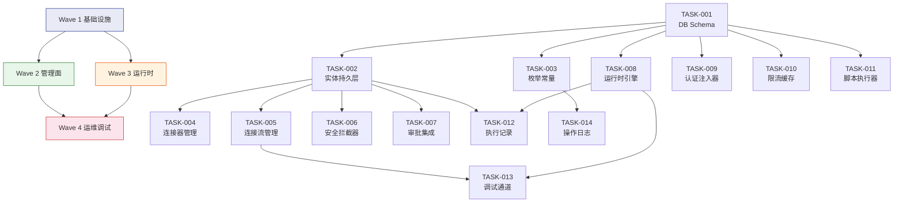

# 任务分解：连接器平台 V3 — 多版本与增强

**Feature ID**: CONN-PLAT-002
**规划版本**: v3.0
**创建日期**: 2026-06-22
**作者**: SDDU Tasks Agent
**前置文档**: [spec.md](./spec.md) v3.0, [plan.md](./plan.md) v3.0
**关联子文档**: plan-db.md, plan-api.md, plan-runtime.md, plan-script.md, plan-json-schema.md, plan-code.md, plan-cache.md

---

## 任务总览

| 波次 | 任务数 | 范围 | 可并行 |
|:---:|:---:|------|:---:|
| **Wave 1** | 3 | 数据库 Schema + 实体层 + 配置常量 | ✅ 3 任务并行 |
| **Wave 2** | 4 | 管理面核心（连接器/连接流/安全/审批） | ✅ 4 任务并行 |
| **Wave 3** | 4 | 运行时核心（引擎/认证/限流/缓存/脚本） | ✅ 4 任务并行 |
| **Wave 4** | 3 | 运维调试（运行记录/调试/操作日志） | ✅ 2 任务并行 + 1 可独立 |

**总计**: 14 个任务，4 个执行波次

### 复杂度分布

| 复杂度 | 数量 | 说明 |
|:---:|:---:|------|
| **S** | 2 | 单一文件/配置，自动化批量执行 |
| **M** | 8 | 多文件，有简单依赖 |
| **L** | 4 | 复杂变更，多文件多依赖 |

### 服务分布

| 服务 | 任务数 |
|------|:---:|
| open-server（管理面） | 8 |
| connector-api（运行时） | 5 |
| 数据库（跨服务） | 1 |

---

## 执行波次说明

### Wave 1 — 基础设施（无依赖，可并行）
数据库 DDL 变更 + 实体/持久层 + 枚举常量定义，为所有上层模块提供数据访问基础。

### Wave 2 — 管理面核心（依赖 Wave 1，模块间可并行）
连接器管理、连接流管理、安全拦截器、审批集成四大模块独立开发，共享 Wave 1 的实体层。

### Wave 3 — 运行时核心（依赖 Wave 1，与 Wave 2 可并行）
connector-api 运行时引擎的六个核心组件：版本解析器、认证注入器、限流拦截器、缓存管理器、脚本执行器、URL 白名单校验器。

### Wave 4 — 运维调试（依赖 Wave 2 + Wave 3）
执行记录写入/查询、调试执行通道、操作日志扩展。记录写入模块依赖运行时引擎就绪。

---

## 任务详情

---

## TASK-001: 数据库 Schema 迁移

**复杂度**: L
**前置依赖**: 无
**执行波次**: 1

### 描述
执行 V3 全部数据库 DDL 变更：5 张表 ALTER、3 张表 CREATE、1 张审批表 ALTER。输出 FlywayDB 风格 SQL 迁移脚本到 `open-server/src/main/resources/db/migration/V3__connector_platform_v3_schema.sql`。

变更清单（详见 plan-db.md §3）：
- `connector_t`: 新增 `app_id`，修改 `status` 枚举（4 状态）
- `connector_version_t`: 移除 `uk_connector_id`，新增 `version_number`、`status`、`published_time`、`published_by`
- `flow_t`: 新增 `deployed_version_id`、`deployed_version_number`、`app_id`，修改 `lifecycle_status` 枚举
- `flow_version_t`: 移除 `uk_flow_id`，新增 `version_number`、`status`（7 状态）、`published_time`、`published_by`
- `approval_flow_t`: 新增 `app_id`，`uk_code` → `uk_code_app`
- **CREATE** `connector_version_ref_t`（引用中间表，含 4 个索引）
- **CREATE** `execution_record_t`（V1 预留 DDL 未使用，V3 全新启用修正版）
- **CREATE** `execution_step_t`（V1 预留 DDL 未使用，V3 全新启用，`node_type` VARCHAR→TINYINT）

### 涉及文件
- [NEW] `open-server/src/main/resources/db/migration/V3__connector_platform_v3_schema.sql`

### 验收标准
- [ ] DDL 脚本包含全部 5 ALTER + 3 CREATE 语句
- [ ] 所有 TINYINT 枚举注释包含完整数字→含义映射
- [ ] 所有索引符合 `idx_xxx` / `uk_xxx` 命名规范
- [ ] 不使用物理外键约束
- [ ] `connector_version_ref_t` 包含 4 个索引（`idx_flow_version_node`、`idx_flow`、`idx_connector_version_flow_ver`、`idx_connector_flow_ver`）
- [ ] `execution_record_t` 包含 7 个索引（含 `idx_trigger_time` 用于定时清理）
- [ ] `execution_step_t` 的 `node_type` 为 TINYINT（非 VARCHAR）
- [ ] 审计字段（`create_time`/`last_update_time`/`create_by`/`last_update_by`）完备

### 验证命令
```bash
# 在 MySQL 5.7 环境中执行迁移脚本
mysql -u root -p < open-server/src/main/resources/db/migration/V3__connector_platform_v3_schema.sql

# 验证表结构
mysql -u root -p -e "
  DESCRIBE openplatform_v2_cp_connector_t;
  DESCRIBE openplatform_v2_cp_connector_version_t;
  DESCRIBE openplatform_v2_cp_flow_t;
  DESCRIBE openplatform_v2_cp_flow_version_t;
  DESCRIBE openplatform_v2_cp_connector_version_ref_t;
  DESCRIBE openplatform_v2_cp_execution_record_t;
  DESCRIBE openplatform_v2_cp_execution_step_t;
  DESCRIBE openplatform_v2_approval_flow_t;
  SHOW INDEX FROM openplatform_v2_cp_connector_version_ref_t;
  SHOW INDEX FROM openplatform_v2_cp_execution_record_t;
"
```

---

## TASK-002: 实体模型与持久层

**复杂度**: M
**前置依赖**: TASK-001
**执行波次**: 1

### 描述
创建/修改 V3 所需的所有 MyBatis 实体类、Mapper 接口、Mapper XML。涵盖新增表（`connector_version_ref_t`、`execution_record_t`、`execution_step_t`）的完整持久层，以及已有表（`connector_t`、`connector_version_t`、`flow_t`、`flow_version_t`）的字段更新。同时为 `approval_flow_t` 新增 `app_id` 字段映射。

核心工作：
1. 新增实体类：`ConnectorVersionRef`、`ExecutionRecord`、`ExecutionStep`
2. 修改实体类：`Connector`（新增 `app_id`、状态枚举）、`ConnectorVersion`（新增 `version_number`/`status`/`published_time`/`published_by`）、`Flow`（新增 `deployed_version_id`/`deployed_version_number`/`app_id`）、`FlowVersion`（新增 `version_number`/`status`（7 状态）/`published_time`/`published_by`）
3. 新增 Mapper 接口 + XML：`ConnectorVersionRefMapper`、`ExecutionRecordMapper`、`ExecutionStepMapper`
4. 修改 Mapper 接口 + XML：`ConnectorMapper`、`ConnectorVersionMapper`、`FlowMapper`、`FlowVersionMapper`、`ApprovalFlowMapper`
5. 新增 Repository 类（封装 Mapper + 雪花 ID 生成 + 业务逻辑）：`ConnectorVersionRefRepository`、`ExecutionRecordRepository`

### 涉及文件
- [NEW] `open-server/src/main/java/.../entity/ConnectorVersionRef.java`
- [NEW] `open-server/src/main/java/.../entity/ExecutionRecord.java`
- [NEW] `open-server/src/main/java/.../entity/ExecutionStep.java`
- [MODIFY] `open-server/src/main/java/.../entity/Connector.java`
- [MODIFY] `open-server/src/main/java/.../entity/ConnectorVersion.java`
- [MODIFY] `open-server/src/main/java/.../entity/Flow.java`
- [MODIFY] `open-server/src/main/java/.../entity/FlowVersion.java`
- [NEW] `open-server/src/main/java/.../mapper/ConnectorVersionRefMapper.java`
- [NEW] `open-server/src/main/java/.../mapper/ExecutionRecordMapper.java`
- [NEW] `open-server/src/main/java/.../mapper/ExecutionStepMapper.java`
- [MODIFY] `open-server/src/main/java/.../mapper/ConnectorMapper.java`
- [MODIFY] `open-server/src/main/java/.../mapper/ConnectorVersionMapper.java`
- [MODIFY] `open-server/src/main/java/.../mapper/FlowMapper.java`
- [MODIFY] `open-server/src/main/java/.../mapper/FlowVersionMapper.java`
- [NEW] 对应 Mapper XML 文件（3 新增 + 4 修改）
- [NEW] `open-server/src/main/java/.../repository/ConnectorVersionRefRepository.java`
- [NEW] `open-server/src/main/java/.../repository/ExecutionRecordRepository.java`

### 验收标准
- [ ] 所有实体类遵循命名规范（字段与数据库列 snake_case→camelCase 映射）
- [ ] BIGINT 雪花 ID 字段使用 `Long` 类型
- [ ] 枚举字段使用 `Integer` 类型（非 String）
- [ ] MEDIUMTEXT JSON 字段使用 `String` 类型，标注 Jackson 序列化
- [ ] Mapper XML 中的 `resultMap` 正确映射所有新旧字段
- [ ] `ConnectorVersionRefMapper` 支持按 `connector_version_id` + `flow_id` 联合查询引用
- [ ] `ExecutionRecordMapper` 支持按 `flow_id` + `app_id` + `status` 分页查询
- [ ] `ExecutionStepMapper` 支持按 `execution_id` 查询全部步骤
- [ ] 所有 Mapper 方法有对应 MyBatis XML SQL 实现

### 验证命令
```bash
# 编译检查实体类
cd open-server && mvn compile -pl . -am

# 运行 MyBatis 单元测试（需测试数据库）
mvn test -Dtest=ConnectorVersionRefMapperTest,ExecutionRecordMapperTest
```

---

## TASK-003: 枚举常量与配置定义

**复杂度**: S
**前置依赖**: 无
**执行波次**: 1

### 描述
定义 V3 所需的全部枚举类和常量配置，供所有模块引用。

包含：
1. **状态枚举类**：`ConnectorStatus`（4 状态）、`ConnectorVersionStatus`（4 状态）、`FlowLifecycleStatus`（4 状态）、`FlowVersionStatus`（7 状态，含审批中间态）、`ExecutionStatus`（0=success, 1=failed）、`TriggerType`（1=http, 2=debug）、`NodeType`（1=trigger, 2=connector, 3=script, 4=parallel, 5=exit）、`CacheStatus`（0=未命中, 1=全流命中, 2=部分命中）
2. **认证枚举**：`AuthType`（新增 COOKIE=8, DIGITAL_SIGN=9, MULTI=10）
3. **操作日志枚举扩展**：在现有 `OperateEnum` 中新增连接器/连接流的操作类型（创建/编辑/删除/恢复/部署/启动/停止/发布版本/失效版本/复制/提交审批/审批通过/审批驳回/撤回审批等）
4. **业务常量**：版本上限 1000、草稿默认版本号 1、脚本节点上限 10、并行分支上限 8、缓存 TTL 上限 1296000 秒、默认超时 5s、运行记录上限 1000、调试超时 30s

### 涉及文件
- [NEW/MODIFY] `open-server/src/main/java/.../constant/ConnectorStatus.java`
- [NEW/MODIFY] `open-server/src/main/java/.../constant/ConnectorVersionStatus.java`
- [NEW/MODIFY] `open-server/src/main/java/.../constant/FlowLifecycleStatus.java`
- [NEW] `open-server/src/main/java/.../constant/FlowVersionStatus.java`
- [NEW] `open-server/src/main/java/.../constant/ExecutionEnums.java`（聚合 ExecutionStatus/TriggerType/NodeType/CacheStatus）
- [MODIFY] `connector-api/src/main/java/.../constant/AuthType.java`
- [MODIFY] 现有 `OperateEnum` 文件（追加连接器平台操作类型枚举值）
- [NEW] `open-server/src/main/java/.../constant/ConnectorPlatformConstants.java`

### 验收标准
- [ ] 所有枚举类 TINYINT 值与 spec §1.7 状态定义一致
- [ ] `FlowVersionStatus` 包含 7 个状态值（含待审批=2/已撤回=3/已驳回=4）
- [ ] `ConnectorStatus` 默认值为 1（有效不可用），`FlowLifecycleStatus` 默认值为 1（已停止）
- [ ] `AuthType` 新增 COOKIE=8, DIGITAL_SIGN=9, MULTI=10
- [ ] `OperateEnum` 新增不少于 15 个操作类型（覆盖 spec FR-046 全部操作）
- [ ] `ConnectorPlatformConstants` 包含所有关键上限常量
- [ ] 各枚举类提供 `fromValue(int)` / `isValidTransition(int from, int to)` 静态方法（状态机校验）

### 验证命令
```bash
# 编译检查枚举类
cd open-server && mvn compile -pl . -am

# 验证枚举值不冲突
mvn test -Dtest=EnumConsistencyTest
```

---

## TASK-004: 连接器管理 API（实体 + 版本）

**复杂度**: L
**前置依赖**: TASK-001, TASK-002, TASK-003
**执行波次**: 2

### 描述
实现 open-server 连接器管理全部 API（plan-api.md #1~#16），涵盖 FR-001~FR-011、FR-015（配置侧）。

核心功能：
1. **连接器实体 CRUD**（#1~#7）：创建（不自动生成草稿）、列表查询（按 appId/status 过滤）、详情、更新、标记失效（校验无连接流引用）、恢复、删除（仅已失效状态）
2. **连接器版本管理**（#8~#16）：创建空草稿（版本上限 1000 校验）、版本列表（按 status 过滤）、版本详情（含 connectionConfig 快照）、更新草稿（发布时校验与保存时分离）、发布版本（含业务必填校验 + URL 正则合法性校验 + JSON 语法校验 + 草稿非空校验）、复制到草稿、标记失效（校验无连接流引用）、恢复、删除
3. **URL 白名单配置**：作为 `connectionConfig.urlWhitelist` 字段内嵌，不做独立端点；发布时校验正则语法
4. **应用数据隔离**：所有接口通过 `X-App-Id` Header 做应用归属校验
5. **状态联动**：首次发布 → 连接器状态 有效不可用→有效可用；最后一个已发布版本失效 → 有效可用→有效不可用

### 涉及文件
- [NEW] `open-server/src/main/java/.../v2/modules/connector/ConnectorController.java`
- [NEW] `open-server/src/main/java/.../v2/modules/connector/ConnectorService.java`
- [NEW] `open-server/src/main/java/.../v2/modules/connector/ConnectorVersionController.java`
- [NEW] `open-server/src/main/java/.../v2/modules/connector/ConnectorVersionService.java`
- [NEW] `open-server/src/main/java/.../v2/modules/connector/dto/ConnectorCreateRequest.java`
- [NEW] `open-server/src/main/java/.../v2/modules/connector/dto/ConnectorVersionSaveRequest.java`
- [NEW] `open-server/src/main/java/.../v2/modules/connector/dto/ConnectorPublishResponse.java`
- [MODIFY] `open-server/src/main/java/.../v2/modules/connector/ConnectorValidator.java`

### 验收标准
- [ ] POST `/connectors` 创建连接器时不自动生成草稿版本，状态为 1（有效不可用）
- [ ] GET `/connectors` 支持按 appId/status/connectorType/keyword 过滤分页
- [ ] PUT `/connectors/{id}/invalidate` 标记失效前校验连接流引用（通过 `connector_version_ref_t`），有引用时返回 422 + 引用流名称列表
- [ ] PUT `/connectors/{id}/recover` 恢复后根据已发布版本有无确定状态（1 或 2）
- [ ] DELETE `/connectors/{id}` 仅已失效状态可删除
- [ ] POST `/connectors/{id}/versions` 创建空草稿，已有草稿时返回 409
- [ ] PUT `/connectors/{id}/versions/{vid}` 更新草稿仅做 DB 存储级校验（JSON 可序列化即可），不校验正则/业务必填
- [ ] PUT `/connectors/{id}/versions/{vid}/publish` 发布时统一校验：业务必填非空 + 草稿配置非空 + URL 正则合法 + JSON 语法合法
- [ ] POST `/connectors/{id}/versions/{vid}/copy-to-draft` 支持覆盖已有草稿或新建，版本上限 1000 检查
- [ ] PUT `/connectors/{id}/versions/{vid}/invalidate` 失效前校验引用关系
- [ ] 首次发布版本时连接器状态变更为 2（有效可用）
- [ ] 最后一个已发布版本失效时连接器状态变更为 1（有效不可用）

### 验证命令
```bash
# 运行连接器管理 API 集成测试
curl -X POST http://localhost:18080/service/open/v2/connectors \
  -H "X-App-Id: 123456" \
  -H "Content-Type: application/json" \
  -d '{"nameCn":"测试连接器","nameEn":"Test Connector","connectorType":1}'

# 创建草稿版本
curl -X POST http://localhost:18080/service/open/v2/connectors/{connectorId}/versions \
  -H "X-App-Id: 123456"

# 发布版本
curl -X PUT http://localhost:18080/service/open/v2/connectors/{connectorId}/versions/{versionId}/publish \
  -H "X-App-Id: 123456"

# 单元测试
cd open-server && mvn test -Dtest=ConnectorServiceTest,ConnectorVersionServiceTest
```

---

## TASK-005: 连接流管理 API（实体 + 版本 + 编排）

**复杂度**: L
**前置依赖**: TASK-001, TASK-002, TASK-003
**执行波次**: 2

### 描述
实现 open-server 连接流管理全部 API（plan-api.md #17~#38），涵盖 FR-016~FR-030、FR-034~FR-039、FR-038a、FR-040a（发布校验）、FR-047（JSON 语法校验）。

核心功能：
1. **连接流实体 CRUD**（#17~#27）：创建（不自动生成草稿）、列表查询（按 appId/lifecycleStatus 过滤）、详情（含 invokeUrl）、更新、复制（完整版本历史，名称追加 `_copy_xxxxx`）、部署（纯版本绑定，不改变状态）、启动（需有已部署版本）、停止、标记失效（仅已停止状态）、恢复（→已停止）、删除
2. **连接流版本管理**（#28~#38）：创建空草稿、版本列表（按 status 过滤，含 deployed 标记）、版本详情（含 orchestrationConfig 快照）、更新草稿（发布时校验与保存时分离）、发布（提交审批，含全部校验：业务必填 + 编排非空 + 入站限流上限 + 节点超时上限 + 缓存 TTL 上限 + 并行分支数上限 + 连接器版本引用可用性 + JSON 语法 + 脚本语法）、复制到草稿（校验无待审批/已驳回/已撤回版本）、标记失效（校验未部署）、恢复、删除
3. **审批操作**（#37~#38）：撤回（待审批→已撤回）、催办（通知当前审批节点审批人）
4. **编排配置**（flowConfig + nodes + edges）：保存时不校验平台限制，发布时统一校验
5. **connector_version_ref 中间表维护**：编排保存/发布时同步写入引用关系

### 涉及文件
- [NEW] `open-server/src/main/java/.../v2/modules/flow/FlowController.java`
- [NEW] `open-server/src/main/java/.../v2/modules/flow/FlowService.java`
- [NEW] `open-server/src/main/java/.../v2/modules/flow/FlowVersionController.java`
- [NEW] `open-server/src/main/java/.../v2/modules/flow/FlowVersionService.java`
- [NEW] `open-server/src/main/java/.../v2/modules/flow/FlowDeployService.java`
- [NEW] `open-server/src/main/java/.../v2/modules/flow/FlowCopyService.java`
- [NEW] `open-server/src/main/java/.../v2/modules/flow/dto/FlowCreateRequest.java`
- [NEW] `open-server/src/main/java/.../v2/modules/flow/dto/FlowVersionSaveRequest.java`
- [NEW] `open-server/src/main/java/.../v2/modules/flow/dto/FlowDeployRequest.java`
- [NEW] `open-server/src/main/java/.../v2/modules/flow/validator/FlowPublishValidator.java`

### 验收标准
- [ ] POST `/flows` 创建时不自动生成草稿版本，lifecycleStatus=1（已停止）
- [ ] POST `/flows/{id}/copy` 复制全部版本历史，新名称含 `_copy_xxxxx`，状态为已停止
- [ ] POST `/flows/{id}/deploy` 部署仅绑定版本（设置 deployed_version_id），不改变 lifecycleStatus
- [ ] POST `/flows/{id}/start` 启动前校验 deployed_version_id 非空，状态 1→2
- [ ] POST `/flows/{id}/stop` 仅运行中可停止，状态 2→1
- [ ] PUT `/flows/{id}/invalidate` 仅已停止可失效，状态 1→3
- [ ] PUT `/flows/{id}/recover` 恢复后统一为已停止（1），需手动启动
- [ ] PUT `/flows/{id}/versions/{vid}` 更新草稿仅做 DB 存储级校验，不校验业务字段和平台限制
- [ ] POST `/flows/{id}/versions/{vid}/publish` 发布时执行全部 9 项校验（FR-026 列表），通过后进入待审批（status=2），调用 ApprovalEngine 创建审批实例
- [ ] POST `/flows/{id}/versions/{vid}/copy-to-draft` 校验无待审批/已驳回/已撤回版本，支持覆盖已有草稿
- [ ] POST `/flows/{id}/versions/{vid}/cancel` 撤回后版本状态变为已撤回（3）
- [ ] POST `/flows/{id}/versions/{vid}/urge` 向当前审批级别审批人发送通知
- [ ] 编排保存/发布时同步维护 connector_version_ref 中间表

### 验证命令
```bash
# 运行连接流管理 API 集成测试
curl -X POST http://localhost:18080/service/open/v2/flows \
  -H "X-App-Id: 123456" \
  -H "Content-Type: application/json" \
  -d '{"nameCn":"测试连接流","nameEn":"Test Flow"}'

# 复制连接流
curl -X POST http://localhost:18080/service/open/v2/flows/{flowId}/copy \
  -H "X-App-Id: 123456"

# 单元测试
cd open-server && mvn test -Dtest=FlowServiceTest,FlowVersionServiceTest,FlowPublishValidatorTest
```

---

## TASK-006: 安全准入拦截器

**复杂度**: M
**前置依赖**: TASK-001, TASK-002, TASK-003
**执行波次**: 2

### 描述
实现 open-server 安全准入层，涵盖 FR-045（应用白名单准入）和 G13（应用数据隔离）。

核心功能：
1. **应用白名单拦截器**（`AppWhitelistInterceptor`）：通过 `X-App-Id` Header 获取应用 ID，调用 market-server Lookup 查询应用是否在白名单内（`classify_code=cp_app_whitelist`）。非白名单应用返回 403 + 提示信息。
2. **应用数据隔离**（Service 层）：所有连接器/连接流查询操作按 `app_id` 过滤，创建操作写入 `app_id`（来源 `X-App-Id`），更新/删除操作校验资源归属。
3. **WebMvcConfigurer 注册**：将应用白名单拦截器注册到 Spring MVC 拦截链，对 `/service/open/v2/connectors/**` 和 `/service/open/v2/flows/**` 路径生效。
4. **market-server 降级处理**：market-server 不可用时，白名单校验降级放行（记录告警日志）。

### 涉及文件
- [NEW] `open-server/src/main/java/.../v2/modules/security/AppWhitelistInterceptor.java`
- [NEW] `open-server/src/main/java/.../v2/modules/security/AppWhitelistService.java`
- [NEW] `open-server/src/main/java/.../v2/modules/security/AppDataIsolationAspect.java`（AOP 切面）
- [MODIFY] `open-server/src/main/java/.../config/WebMvcConfig.java`

### 验收标准
- [ ] 非白名单应用访问任意连接器平台接口返回 403，message 包含「该应用未开通连接器平台能力」
- [ ] 白名单应用通过 market-server Lookup（`classify_code=cp_app_whitelist`）校验
- [ ] 应用 A 不可查询/操作应用 B 的连接器和连接流
- [ ] 创建连接器/连接流时 `app_id` 自动写入为 `X-App-Id` Header 值
- [ ] market-server 不可用时白名单校验降级放行，日志记录告警
- [ ] 拦截器仅对 `/service/open/v2/connectors/**` 和 `/service/open/v2/flows/**` 路径生效

### 验证命令
```bash
# 非白名单应用访问被拦截
curl -X GET http://localhost:18080/service/open/v2/connectors \
  -H "X-App-Id: 999999" \
  -v
# 预期：HTTP 403，body 含 "该应用未开通连接器平台能力"

# 白名单应用正常访问
curl -X GET http://localhost:18080/service/open/v2/connectors \
  -H "X-App-Id: {whitelisted_app_id}"

# 单元测试
cd open-server && mvn test -Dtest=AppWhitelistServiceTest,AppDataIsolationAspectTest
```

---

## TASK-007: 版本发布审批集成

**复杂度**: M
**前置依赖**: TASK-001, TASK-002, TASK-003
**执行波次**: 2

### 描述
实现连接流版本发布的三级审批集成（FR-031~FR-033），复用现有 `ApprovalEngine`，拓展 `businessType=connector_flow_version_publish` 场景。

核心功能：
1. **审批提交**（#32 发布时自动触发）：创建审批实例，透传场景标识 + 关联 FlowVersion ID，三级审批人按 `approval_flow_t` 配置的 `nodes` JSON 依次审批
2. **审批流模板配置**（#45~#48）：扩展审批模板 CRUD，新增 `appId` 字段实现应用隔离；新增 `code=connector_flow_version_publish` 业务类型模板
3. **审批记录查询**（#39~#44）：扩展审批列表/详情查询支持 `businessType=connector_flow_version_publish` 过滤；审批通过/驳回回调触发 FlowVersion 状态变更（待审批→已发布/已驳回）
4. **三级审批人配置**：按 `approval_flow_t` 的 `app_id` 区分全局/应用级审批人；查询时按 `app_id` 就近匹配（应用级优先，回退全局）
5. **催办**：复用现有通知能力

### 涉及文件
- [NEW] `open-server/src/main/java/.../v2/modules/approval/FlowVersionApprovalService.java`
- [NEW] `open-server/src/main/java/.../v2/modules/approval/ApprovalCallbackHandler.java`
- [MODIFY] 现有 `ApprovalController`（扩展 #39~#44 支持新 businessType）
- [MODIFY] 现有 `ApprovalFlowController`（扩展 #45~#48 支持 appId 字段）
- [MODIFY] 现有 `ApprovalEngine`（注册 connector_flow_version_publish 场景回调）

### 验收标准
- [ ] 连接流版本发布提交后自动创建审批实例，状态变为待审批（2）
- [ ] 三级审批依次进行（应用级→平台连接流级→全局级），任一级驳回即终止
- [ ] 全部通过后 FlowVersion 状态变更为已发布（5）
- [ ] 审批驳回后 FlowVersion 状态变更为已驳回（4），驳回原因可见
- [ ] 提交人撤回后 FlowVersion 状态变更为已撤回（3）
- [ ] 审批流模板按 `app_id` 隔离，应用级审批人配置覆盖全局配置
- [ ] 催办操作向当前审批级别审批人发送通知
- [ ] 审批记录列表支持按 `businessType=connector_flow_version_publish` 过滤
- [ ] 审批详情 `businessData` 包含 flowId/flowNameCn/versionId/versionNumber 等信息

### 验证命令
```bash
# 提交发布（触发审批）
curl -X POST http://localhost:18080/service/open/v2/flows/{flowId}/versions/{versionId}/publish \
  -H "X-App-Id: 123456"

# 查询待审批列表
curl -X GET "http://localhost:18080/service/open/v2/approvals/pending?businessType=connector_flow_version_publish"

# 审批通过
curl -X POST http://localhost:18080/service/open/v2/approvals/{approvalId}/approve \
  -H "Content-Type: application/json" \
  -d '{"comment":"同意发布"}'

# 单元测试
cd open-server && mvn test -Dtest=FlowVersionApprovalServiceTest,ApprovalCallbackHandlerTest
```

---

## TASK-008: 运行时引擎核心（版本解析 + DAG 调度 + 并行分支）

**复杂度**: L
**前置依赖**: TASK-001, TASK-002
**执行波次**: 3

### 描述
实现 connector-api 运行时引擎核心，涵盖 FR-043（版本配置解析）、FR-034（节点超时）、FR-038（串行/并行）、FR-038a（并行处理节点）。对接 EntityCacheManager（平台配置缓存，详见 plan-cache §12）实现 Cache-Aside 模式。

核心功能（详见 plan-runtime.md §1~§3）：
1. **版本配置解析器**（`VersionConfigResolver`）：Phase 2 核心——按 `flow_t.deployed_version_id` 读取 FlowVersion 快照，解析 `orchestration_config`，遍历 connector 节点按 `connector_version_ref_t` 加载 ConnectorVersion 快照。优先 Redis 缓存，miss 回源 MySQL。异常处理：未部署→503，版本删除→500，连接器版本失效→标记节点失败
2. **flowConfig 解析器**（`FlowConfigParser`）：从 `orchestration_config.flowConfig` 解析超时/限流/缓存配置，注入 ExecutionContext。解析失败使用默认值
3. **DAG 调度器**：基于 Reactor 响应式编程，按边关系遍历节点，根据节点类型分发到对应执行器。支持串行（`flatMap`）和并行（`Flux.merge()`）
4. **并行分支执行器**（`ParallelBranchExecutor`）：识别 `edge.data.connectionMode=parallel` 的并行边，各分支独立超时（`min(节点配置, 30s)`），错误不扩散，所有分支完成后汇聚
5. **5 阶段执行管道**：Phase 1 凭证认证→Phase 2 版本解析→Phase 3 触发器鉴权→Phase 4 入站限流→Phase 5 缓存+DAG
6. **平台配置缓存**（`EntityCacheManager`）：管理 `cp:entity:flow:{flowId}`、`cp:entity:flowversion:{versionId}`、`cp:entity:connectorversion:{cvId}` 等 key 的 Redis 缓存，TTL 7d±2h，版本变更时主动失效

### 涉及文件
- [NEW] `connector-api/src/main/java/.../v2/modules/runtime/VersionConfigResolver.java`
- [NEW] `connector-api/src/main/java/.../v2/modules/runtime/FlowConfigParser.java`
- [NEW] `connector-api/src/main/java/.../v2/modules/runtime/DagScheduler.java`
- [NEW] `connector-api/src/main/java/.../v2/modules/runtime/ParallelBranchExecutor.java`
- [NEW] `connector-api/src/main/java/.../v2/modules/runtime/FlowRuntimeEngine.java`
- [NEW] `connector-api/src/main/java/.../v2/modules/runtime/ExecutionContext.java`
- [NEW] `connector-api/src/main/java/.../v2/modules/cache/EntityCacheManager.java`
- [MODIFY] `connector-api/src/main/java/.../handler/FlowInvokeHandler.java`

### 验收标准
- [ ] HTTP 触发请求经过 5 阶段管道执行，每阶段失败返回对应 HTTP 状态码
- [ ] `deployed_version_id` 为 NULL 时返回 503（Flow not deployed）
- [ ] FlowVersion 快照不存在时返回 500（Deployed version not found）
- [ ] ConnectorVersion 不存在/已失效时对应节点标记失败，其余节点继续执行
- [ ] flowConfig 解析失败时使用默认值（无超时/无限流/无缓存），记录告警
- [ ] 并行边各分支并发执行，单分支失败不影响其他分支
- [ ] 并行分支全部完成后汇聚到下游节点
- [ ] 单节点超时按 `min(节点超时配置, 应用最大超时值)` 执行
- [ ] EntityCacheManager 优先 Redis 读取，miss 回源 MySQL 并回写，TTL 7d±2h

### 验证命令
```bash
# 触发连接流调用
curl -X POST http://localhost:18180/api/v1/flows/{flowId}/invoke \
  -H "X-Sys-Token: token_abc123" \
  -H "Content-Type: application/json" \
  -d '{"sender":"test","content":"hello"}'

# 单元测试
cd connector-api && mvn test -Dtest=VersionConfigResolverTest,DagSchedulerTest,ParallelBranchExecutorTest
```

---

## TASK-009: 运行时认证注入器（Cookie + 数字签名 + 多认证）

**复杂度**: M
**前置依赖**: TASK-001, TASK-003
**执行波次**: 3

### 描述
实现 connector-api 运行时认证注入器扩展，涵盖 FR-012~FR-014 的运行时执行部分。在 V1 已有的 `CredentialInjector` Strategy 模式基础上新增 3 个注入器，并实现 URL 白名单运行时校验。

核心功能（详见 plan-runtime.md §9~§11）：
1. **Cookie 凭证注入器**（`CookieCredentialInjector`）：从连接器配置读取 Cookie 名称，从编排映射值获取具体 Cookie 值，注入 HTTP Header
2. **数字签名注入器**（`DigitalSignCredentialInjector`）：读取 Secret Key，按平台统一签名算法计算签名值，根据凭证位置配置注入 Header（`X-Signature`）或 Query 参数
3. **多认证组合注入器**（`MultiAuthCredentialInjector`）：遍历 `authConfigs[]` 数组，按排序依次调用各认证注入器，叠加认证信息
4. **URL 白名单校验器**（`UrlWhitelistValidator`）：在每次连接器 HTTP 调用前，从缓存获取该连接器的组合正则 Pattern（各条用 `|` 拼接），一次 `Matcher.matches()` 校验。空白名单=不限制。正则编译结果用 Caffeine 缓存（TTL 5min）
5. **SYSTOKEN 白名单校验器**（`SystokenWhitelistValidator`）：Phase 3 核心——从 FlowVersion 触发器节点快照读取 `systokenWhitelist`，校验请求 SYSTOKEN 是否在其中。空白名单=全部禁止

### 涉及文件
- [NEW] `connector-api/src/main/java/.../v2/modules/auth/credential/CookieCredentialInjector.java`
- [NEW] `connector-api/src/main/java/.../v2/modules/auth/credential/DigitalSignCredentialInjector.java`
- [NEW] `connector-api/src/main/java/.../v2/modules/auth/credential/MultiAuthCredentialInjector.java`
- [NEW] `connector-api/src/main/java/.../v2/modules/security/UrlWhitelistValidator.java`
- [NEW] `connector-api/src/main/java/.../v2/modules/security/SystokenWhitelistValidator.java`
- [MODIFY] `connector-api/src/main/java/.../auth/CredentialInjectorRegistry.java`

### 验收标准
- [ ] Cookie 注入器按配置的 Cookie 名称注入 Header
- [ ] 数字签名注入器按凭证位置（Header/Query）注入签名值
- [ ] 多认证组合注入器按排序依次叠加认证信息
- [ ] `AuthType` 枚举新增 COOKIE=8, DIGITAL_SIGN=9, MULTI=10
- [ ] URL 白名单校验：空白名单放行；多条规则编译为单一 Pattern 一次匹配
- [ ] URL 不匹配白名单时返回 403 + 日志记录
- [ ] SYSTOKEN 白名单为空时全部禁止（返回 401）
- [ ] SYSTOKEN 不在白名单中时返回 401
- [ ] 认证注入器通过 Spring Bean 自动注册到 `CredentialInjectorRegistry`

### 验证命令
```bash
# 测试 SYSTOKEN 不在白名单时被拦截
curl -X POST http://localhost:18180/api/v1/flows/{flowId}/invoke \
  -H "X-Sys-Token: invalid_token" \
  -v
# 预期：HTTP 401

# 单元测试
cd connector-api && mvn test -Dtest=CookieCredentialInjectorTest,DigitalSignCredentialInjectorTest,UrlWhitelistValidatorTest
```

---

## TASK-010: 运行时限流拦截器与缓存管理器

**复杂度**: M
**前置依赖**: TASK-001
**执行波次**: 3

### 描述
实现 connector-api 入站限流（FR-035）和业务缓存（FR-037）的运行时模块。

核心功能（详见 plan-runtime.md §5~§6 和 plan-cache.md）：
1. **入站限流拦截器**（`InboundRateLimiter`）：Phase 4 核心——WebFilter 实现（order=-100），读取 `flowConfig.rateLimitConfig`，QPS 模式使用 Redis Lua 令牌桶脚本（Lua 原子操作），并发模式使用 Redis INCR/DECR 计数器。超限返回 429 + `Retry-After` Header。Redis 不可用时降级放行
2. **Redis Lua 令牌桶脚本**：`cp:ratelimit:qps:{flowId}:{second}`，SET NX + DECR，TTL=2s
3. **并发计数器**：`cp:ratelimit:concurrency:{flowId}`，INCR/DECR，TTL=300s（防死锁）
4. **限流配置取值**：`min(流配置值, 应用最大限流值)`，从 market-server Property 读取应用上限
5. **业务缓存管理器**（`FlowCacheManager`）：Phase 5 首步——解析 `flowConfig.cache`，构造缓存键（`keyTemplate` + 上下文解析），Redis GET 命中→直接返回缓存；未命中→执行 DAG 后 SET（TTL 由配置决定，最大 1296000 秒）
6. **缓存失效策略**：版本发布/失效/部署新版本/停止时主动清空该 Flow 缓存；TTL 自然过期兜底

### 涉及文件
- [NEW] `connector-api/src/main/java/.../v2/modules/ratelimit/InboundRateLimiter.java`
- [NEW] `connector-api/src/main/java/.../v2/modules/ratelimit/RateLimitConfigReader.java`
- [NEW] `connector-api/src/main/resources/lua/rate_limit_token_bucket.lua`
- [NEW] `connector-api/src/main/java/.../v2/modules/cache/FlowCacheManager.java`
- [NEW] `connector-api/src/main/java/.../v2/modules/cache/CacheKeyResolver.java`

### 验收标准
- [ ] QPS 模式：每秒请求数超过配置值时返回 429，`Retry-After: 1`
- [ ] 并发模式：并发请求数超过配置值时返回 429
- [ ] Lua 脚本原子执行，无竞态条件
- [ ] Redis 不可用时降级放行，记录告警日志
- [ ] 缓存命中时跳过 DAG 执行，直接返回缓存结果
- [ ] 缓存未命中时执行 DAG 后写入 Redis，TTL 正确
- [ ] 缓存键由 `keyTemplate` 表达式解析 + 上下文动态值拼接生成
- [ ] 版本变更时缓存被主动清空
- [ ] 速率限制值取 `min(流配置, 应用上限)`

### 验证命令
```bash
# 压测验证限流（超过 QPS 限制后返回 429）
ab -n 100 -c 10 http://localhost:18180/api/v1/flows/{flowId}/invoke

# 单元测试
cd connector-api && mvn test -Dtest=InboundRateLimiterTest,FlowCacheManagerTest
```

---

## TASK-011: 运行时脚本节点执行器（GraalJS 沙箱）

**复杂度**: L
**前置依赖**: TASK-001
**执行波次**: 3

### 描述
实现 connector-api 脚本节点执行器，涵盖 FR-040a 的运行时执行部分。用户编写 `function main(ctx) { ... return ... }`，GraalJS 沙箱执行，ctx 为上游节点数据函数参数。

核心功能（详见 plan-script.md）：
1. **GraalJS 沙箱配置**：ES2022 严格模式，五层纵深防御——`allowIO(false)`、`allowCreateThread(false)`、`allowNativeAccess(false)`、`HostAccess.EXPLICIT`、`allowAllAccess(false)`。`statementLimit=10000`，超时使用 `ScheduledExecutorService` 强制终止
2. **ctx 组装**：执行前将上游所有节点的 input/output 组装为嵌套 `Map<String, Object>`，不深拷贝（指针引用）。结构：`{ nodeId: { input: {...}, output: {...} } }`
3. **脚本执行流程**：① `Context.eval("js", scriptContent)` 注册 main 函数到全局 → ② `c.eval("js", "main").execute(ctx)` 调用，`this=undefined` → ③ 返回值 `Value.as(Map.class)` 转为 Java Map
4. **WebFlux 非阻塞隔离**：`Mono.fromCallable().subscribeOn(boundedElastic)`，独立线程池（max 10, queue 50）
5. **超时控制**：`min(脚本节点配置超时, 30s)`，默认 5s，超时后 `context.close(true)` 强制终止
6. **类型映射**：`Map`→`object`、`List`→`Array`、`String`→`string`、`Long/BigDecimal`→`number`、`Boolean`→`boolean`、`null`→`undefined`
7. **安全限制**：不提供 `_util`/`_log` 等内置工具（纯 JS）；每流最多 10 个脚本节点（编排保存时校验）

### 涉及文件
- [NEW] `connector-api/src/main/java/.../v2/modules/script/ScriptNodeExecutor.java`
- [NEW] `connector-api/src/main/java/.../v2/modules/script/GraalJsContextFactory.java`
- [NEW] `connector-api/src/main/java/.../v2/modules/script/CtxAssembler.java`
- [NEW] `connector-api/src/main/java/.../v2/modules/script/ScriptExecutionConfig.java`
- [MODIFY] `connector-api/pom.xml`（新增 GraalJS 依赖）

### 验收标准
- [ ] GraalJS 沙箱正确执行 `function main(ctx) { return { result: ctx.conn_1.output.body.value * 2 }; }` 并返回正确 Map
- [ ] 脚本超时（如无限循环）后 5s 内被强制终止，不阻塞线程池
- [ ] `ctx.trigger.input.body.field` 路径正确访问上游触发数据
- [ ] `ctx.conn_1.output.body.data` 正确访问上游连接器节点出参
- [ ] 可选链 `ctx?.conn_1?.output?.body?.field ?? "default"` 正常工作
- [ ] 脚本内尝试 IO/网络访问被沙箱拒绝
- [ ] 脚本内 `Java.type()` 被拒绝（`HostAccess.EXPLICIT`）
- [ ] 脚本内 `while(true){}` 在 `statementLimit` 达到后终止
- [ ] 每流最多 10 个脚本节点（编排保存时校验）
- [ ] 脚本源码最大 10000 字符（编排保存时校验）

### 验证命令
```bash
# 单元测试
cd connector-api && mvn test -Dtest=ScriptNodeExecutorTest,CtxAssemblerTest,GraalJsSandboxSecurityTest

# 安全测试（确认沙箱隔离）
mvn test -Dtest=GraalJsSandboxSecurityTest#testFileAccessBlocked
mvn test -Dtest=GraalJsSandboxSecurityTest#testJavaTypeBlocked
mvn test -Dtest=GraalJsSandboxSecurityTest#testInfiniteLoopTerminated
```

---

## TASK-012: 执行记录与步骤日志

**复杂度**: M
**前置依赖**: TASK-001, TASK-002, TASK-008
**执行波次**: 4

### 描述
实现执行记录写入（connector-api）和查询（open-server），涵盖 FR-042（运行记录查看）和 FR-044（日志采集）。

核心功能：
1. **执行记录写入**（connector-api）：请求完成后异步写入 `execution_record_t`（触发时间、流水号、状态、耗时、触发方式、缓存命中状态、错误信息等）+ `execution_step_t`（各节点输入/输出/耗时/错误）。写入前脱敏（移除 password/token/secretKey）。写入失败不影响业务响应
2. **日志采集开关控制**（connector-api）：从 market-server Property 读取应用级日志采集开关（默认开启）。关闭时不写入 `execution_step_t`，仅写入 `execution_record_t` 基础字段
3. **流版本快照冗余**：执行时冗余 `flow_version_snapshot`（MEDIUMTEXT），版本删除后仍可还原执行现场
4. **FIFO 清理**：每次写入后检查 `flow_id` 记录数是否超过上限（默认 1000，按应用可配），超限按 `create_time ASC` 批量删除最早记录
5. **30 天定时清理**：每天 03:00 执行，删除 `trigger_time < NOW() - 30 DAY` 记录，先删 `execution_step_t` 再删 `execution_record_t`，分批 1000 条
6. **执行记录查询**（open-server #49~#50）：按 flowId + status + triggerType + 时间范围分页查询；详情含 steps 数组（节点 I/O 日志内嵌）

### 涉及文件
- [NEW] `connector-api/src/main/java/.../v2/modules/execution/ExecutionRecordService.java`
- [NEW] `connector-api/src/main/java/.../v2/modules/execution/ExecutionStepService.java`
- [NEW] `connector-api/src/main/java/.../v2/modules/execution/LogSanitizer.java`
- [NEW] `connector-api/src/main/java/.../v2/modules/execution/ExecutionCleanupJob.java`
- [NEW] `connector-api/src/main/java/.../v2/modules/execution/LogSwitchService.java`
- [NEW] `open-server/src/main/java/.../v2/modules/flow/ExecutionRecordController.java`
- [NEW] `open-server/src/main/java/.../v2/modules/flow/ExecutionRecordService.java`

### 验收标准
- [ ] 每次 HTTP 触发/调试触发完成后产生一条 `execution_record_t` 记录
- [ ] 每个 DAG 节点执行完成后产生一条 `execution_step_t` 记录（含 input/output/耗时/状态）
- [ ] 日志采集开关关闭时不写入 `execution_step_t`，运行记录详情的 steps 为空
- [ ] 日志采集开关从关闭切换为开启后立即生效，关闭期间的执行不补采
- [ ] 敏感字段（password/token/secretKey/signSecretKey）在日志写入前脱敏
- [ ] 日志写入失败不影响 HTTP 响应（异步写入，异常吞掉仅记录）
- [ ] `flow_version_snapshot` 包含完整编排拓扑 + flowConfig
- [ ] FIFO 清理：单流记录数超过上限时删除最早记录
- [ ] 30 天定时清理正常运行（先删 step 再删 record，分批 1000）
- [ ] 运行记录列表支持按 status/triggerType/时间范围过滤分页
- [ ] 运行记录详情包含 steps 数组，每个 step 含 nodeId/nodeType/status/duration/inputData/outputData

### 验证命令
```bash
# 查询运行记录
curl -X GET "http://localhost:18080/service/open/v2/flows/{flowId}/executions?status=0&triggerType=1&curPage=1&pageSize=20" \
  -H "X-App-Id: 123456"

# 查询运行记录详情
curl -X GET "http://localhost:18080/service/open/v2/flows/{flowId}/executions/{executionId}" \
  -H "X-App-Id: 123456"

# 单元测试
cd connector-api && mvn test -Dtest=ExecutionRecordServiceTest,LogSanitizerTest
```

---

## TASK-013: 调试执行通道

**复杂度**: M
**前置依赖**: TASK-005, TASK-008
**执行波次**: 4

### 描述
实现调试执行功能（FR-041），支持草稿版本和已发布版本在页面直接触发调试调用，无需部署。同步返回各节点执行状态和输入输出数据。

核心功能（详见 plan-runtime.md §8）：
1. **调试执行服务**（connector-api `DebugExecutionService` #53）：直接接收 `{ flowId, versionId, triggerData }`，校验版本非已失效状态（EC-014），使用独立线程池（max 5，超时 30s），同步执行 DAG，返回各节点执行详情
2. **调试代理 API**（open-server #51）：前端调用 open-server 代理，open-server 转发到 connector-api #53。校验三层权限 + 版本状态
3. **并发控制**：同一用户最多 3 个并发调试请求
4. **运行记录生成**：调试执行生成 `execution_record_t`（`trigger_type=2 debug`），不计入正常运行指标
5. **版本限制**：仅草稿（status=1）和已发布（status=5）版本可调试；已失效版本拒绝

### 涉及文件
- [NEW] `connector-api/src/main/java/.../v2/modules/debug/DebugExecutionService.java`
- [NEW] `connector-api/src/main/java/.../v2/modules/debug/DebugExecutionController.java`
- [NEW] `open-server/src/main/java/.../v2/modules/flow/DebugProxyController.java`
- [NEW] `open-server/src/main/java/.../v2/modules/flow/DebugProxyService.java`

### 验收标准
- [ ] POST `/service/open/v2/flows/{flowId}/versions/{versionId}/debug` 支持草稿和已发布版本调试
- [ ] 已失效版本调试返回 422（EC-014）
- [ ] 调试为同步执行，返回各节点执行状态、输入输出数据、耗时
- [ ] 同一用户并发调试请求不超过 3 个
- [ ] 调试执行生成运行记录（trigger_type=2）
- [ ] 调试执行不依赖 `deployed_version_id`（使用传入的 versionId 快照）
- [ ] 调试超时 30s 后终止（独立于正常执行超时配置）
- [ ] 调试线程池隔离（不影响正常 HTTP 触发执行）

### 验证命令
```bash
# 触发调试执行
curl -X POST http://localhost:18080/service/open/v2/flows/{flowId}/versions/{versionId}/debug \
  -H "X-App-Id: 123456" \
  -H "Content-Type: application/json" \
  -d '{"triggerData":{"sender":"debug_user","content":"调试消息"}}'

# 单元测试
cd connector-api && mvn test -Dtest=DebugExecutionServiceTest
```

---

## TASK-014: 操作日志扩展

**复杂度**: S
**前置依赖**: TASK-003
**执行波次**: 4

### 描述
实现连接器平台操作日志记录（FR-046），复用应用现有 `OperateLog` 模块，扩展枚举值和快照加载器。

核心功能：
1. **OperateEnum 扩展**（在 TASK-003 中定义，此处实现写入逻辑）：连接器（创建/编辑/删除/恢复/创建草稿版本/发布版本/失效版本/恢复版本/删除版本）+ 连接流（创建/编辑/删除/恢复/部署/启动/停止/创建草稿版本/发布版本/失效版本/恢复版本/删除版本/复制）+ 审批（提交审批/审批通过/审批驳回/撤回审批）
2. **EntitySnapshotLoader 扩展**：为连接器/连接流相关实体提供变更快照能力（变更前/后关键字段），供 OperateLog 模块调用
3. **AOP 切面或手动埋点**：在 Service 层关键操作后调用 OperateLog 写入接口，记录操作人、操作时间、操作类型、操作对象 ID、变更快照

### 涉及文件
- [MODIFY] `open-server/src/main/java/.../v2/modules/auditlog/OperateEnum.java`（新增枚举值，TASK-003 已完成）
- [NEW] `open-server/src/main/java/.../v2/modules/auditlog/ConnectorOperateLogAspect.java`
- [NEW] `open-server/src/main/java/.../v2/modules/auditlog/FlowOperateLogAspect.java`
- [NEW] `open-server/src/main/java/.../v2/modules/auditlog/EntitySnapshotLoader.java`

### 验收标准
- [ ] 连接器的创建/编辑/删除/恢复操作产生操作日志
- [ ] 连接器版本的创建草稿/发布/失效/恢复/删除操作产生操作日志
- [ ] 连接流的创建/编辑/删除/恢复/部署/启动/停止/复制操作产生操作日志
- [ ] 连接流版本的创建草稿/发布/失效/恢复/删除/提交审批/撤回操作产生操作日志
- [ ] 审批的通过/驳回操作产生操作日志
- [ ] 每条日志包含：操作人、操作时间、操作类型、操作对象 ID、变更前/后快照
- [ ] 操作日志复用现有 OperateLog 存储和查询模块

### 验证命令
```bash
# 执行一个操作后查询操作日志
# （操作日志查询接口由现有 OperateLog 模块提供）

# 单元测试
cd open-server && mvn test -Dtest=ConnectorOperateLogAspectTest,FlowOperateLogAspectTest
```

---

## 依赖关系图



---

## FR 覆盖矩阵

| FR | 名称 | 对应任务 |
|:---|------|---------|
| FR-001 | 创建连接器 | TASK-004 |
| FR-002 | 恢复连接器 | TASK-004 |
| FR-003 | 失效连接器 | TASK-004 |
| FR-004 | 删除连接器 | TASK-004 |
| FR-005 | 编辑草稿（连接器） | TASK-004 |
| FR-005a | 创建草稿版本（连接器） | TASK-004 |
| FR-006 | 复制到草稿（连接器） | TASK-004 |
| FR-007 | 发布版本（连接器） | TASK-004 |
| FR-008~011 | 版本查看/失效/删除/恢复（连接器） | TASK-004 |
| FR-012~014 | 认证类型/凭证位置/认证多选 | TASK-004（配置）, TASK-009（运行时） |
| FR-015 | URL 正则白名单 | TASK-004（配置校验）, TASK-009（运行时校验） |
| FR-016 | 创建连接流 | TASK-005 |
| FR-017 | 一键复制 | TASK-005 |
| FR-018 | 部署 | TASK-005 |
| FR-019 | 启动 | TASK-005 |
| FR-020 | 停止 | TASK-005 |
| FR-021~023 | 恢复/失效/删除连接流 | TASK-005 |
| FR-024 | 编辑草稿（连接流） | TASK-005 |
| FR-024a | 创建草稿版本（连接流） | TASK-005 |
| FR-025 | 复制到草稿（连接流） | TASK-005 |
| FR-026 | 发布版本（连接流） | TASK-005, TASK-007 |
| FR-027~030 | 版本查看/失效/删除/恢复（连接流） | TASK-005 |
| FR-031 | 提交审批 | TASK-005, TASK-007 |
| FR-032 | 审批人配置 | TASK-007 |
| FR-033 | 一键催办 | TASK-007 |
| FR-034 | 节点超时 | TASK-005（配置校验）, TASK-008（运行时） |
| FR-035 | 入站限流 | TASK-005（配置校验）, TASK-010（运行时） |
| FR-036 | SYSTOKEN 白名单 | TASK-009（运行时） |
| FR-037 | 缓存配置 | TASK-005（配置校验）, TASK-010（运行时） |
| FR-038 | 串行/并行 | TASK-008 |
| FR-038a | 并行处理节点 | TASK-005（配置校验）, TASK-008（运行时） |
| FR-039 | 连接器版本选择 | TASK-005（配置校验）, TASK-008（版本解析） |
| FR-040a | 脚本节点 | TASK-005（发布时语法校验）, TASK-011（运行时执行） |
| FR-041 | 调试触发 | TASK-013 |
| FR-042 | 运行记录查看 | TASK-012 |
| FR-043 | 版本配置解析 | TASK-008 |
| FR-044 | 日志采集 | TASK-012 |
| FR-045 | 应用白名单管理 | TASK-006 |
| FR-046 | 操作日志 | TASK-014 |
| FR-047 | JSON 语法校验 | TASK-004（连接器发布时）, TASK-005（连接流发布时） |

---

## ✅ 任务分解完成

**Feature**: specs-tree-connector-platform-v3  
**阶段**: tasked  
**状态**: tracked  
**文件**: `.sddu/specs-tree-root/specs-tree-connector-platform-v3/tasks.md`

### 任务汇总
- 总任务数：14 个
- 复杂度分布：S 级 2 个，M 级 8 个，L 级 4 个
- 执行波次：4 个波次

### 下一步
👉 运行 `@sddu-build TASK-001` 开始实现第一个任务
