# 测试任务分解：连接器平台 V3 — 测试补充

**Feature ID**: CONN-PLAT-002  
**Feature Name**: 连接器平台 V3 — 测试补充  
**规划版本**: v3.0  
**创建日期**: 2026-06-22  
**前置文档**: [test-gap-analysis.md](./test-gap-analysis.md), [tasks.md](./tasks.md)  

---

## 任务总览

| 测试波次 | 任务数 | 范围 | 可并行 |
|:---:|:---:|------|:---:|
| **Test Wave P0** | 6 | 核心业务逻辑（运行时引擎 + 部署 + 版本管理 + 发布校验） | ✅ 6 任务并行 |
| **Test Wave P1** | 6 | 重要功能测试（Controller 切片 + 认证注入 + 安全校验 + 审批 + 限流） | ✅ 6 任务并行 |
| **Test Wave P2** | 3 | 辅助功能测试（缓存/脚本辅助 + 执行记录 + 调试/日志） | ✅ 3 任务并行 |
| **Test Wave E2E** | 3 | Python 端到端集成测试（版本生命周期 / 部署→启动→触发 / 认证+安全+脚本+调试） | ✅ 3 任务并行 |

**总计**: 18 个测试任务，4 个测试波次

---

## 测试波次说明

### Test Wave P0 — 核心业务（所有构建任务完成后立即补充）
运行时引擎核心（FlowRuntimeEngine / VersionConfigResolver / DagScheduler）和部署版本管理（FlowDeployService / FlowVersionService / FlowPublishValidator）。这些类承载了 V3 最核心的运行时逻辑和发布流程。

### Test Wave P1 — 重要功能
Controller 层 WebMvc 切片测试 + 认证注入器 + 安全校验器 + 审批集成 + 限流缓存管理器。对 API 端点正确性和安全机制提供回归保障。

### Test Wave P2 — 辅助功能
缓存键解析、限流配置读取、脱敏器、清理任务、脚本上下文组装、调试通道、操作日志切面等辅助基础设施。

### Test Wave E2E — Python 端到端集成测试
跨 open-server 和 connector-api 的 Python 端到端集成测试，直接通过 HTTP/MySQL 操作真实服务，覆盖 V3 最核心的用户场景：
- **E2E-001**: 连接器与连接流版本全生命周期 + 审批全流程（FR-005a/006/007/009/024a/026/031/032）
- **E2E-002**: 连接流部署→启动→触发调用端到端 + 一键复制 + 停止再启动（FR-018/019/042/017/020）
- **E2E-003**: 多认证组合 + URL 白名单 + 脚本节点 + 草稿调试（FR-012/013/014/015/040a/041）

每个脚本独立可运行，也可通过 all.py 聚合执行。10 个新增 Python 脚本，分 3 个测试任务。

---

## 测试任务详情

---

## TEST-TASK-P0-001: FlowRuntimeEngine + VersionConfigResolver + DagScheduler 核心运行时测试

**复杂度**: L  
**前置依赖**: TASK-008（运行时引擎核心已构建）  
**测试类型**: Java 单元测试 (JUnit 5 + Mockito + StepVerifier)  
**执行波次**: Test Wave P0

### 描述
为 connector-api 运行时引擎核心 3 件套编写联合单元测试。

覆盖场景：
1. **FlowRuntimeEngine**: 5 阶段管道正常执行、Phase 1~5 各阶段失败时返回对应 HTTP 状态码（503/500/401/429）、未部署流调用 503、已部署版本快照丢失 500
2. **VersionConfigResolver**: Redis 缓存命中直接返回、Redis miss 回源 MySQL 并回写、FlowVersion 快照不存在返回 500、ConnectorVersion 已失效标记节点失败不影响其他节点、Cache-Aside 模式 TTL 7d±2h
3. **DagScheduler**: 串行调度（flatMap）节点按序执行、并行调度（Flux.merge）多分支并发、并行边各分支独立超时、单节点超时终止、多并行边汇聚到下游

### 涉及文件（测试）
- [NEW] `connector-api/src/test/java/.../v2/modules/runtime/FlowRuntimeEngineTest.java`
- [NEW] `connector-api/src/test/java/.../v2/modules/runtime/VersionConfigResolverTest.java`
- [NEW] `connector-api/src/test/java/.../v2/modules/runtime/DagSchedulerTest.java`

### 验收标准
- [ ] FlowRuntimeEngineTest: 覆盖 5 阶段正常执行 + 4 种异常路径（503/500/401/429）
- [ ] VersionConfigResolverTest: 覆盖 Redis 命中/未命中/异常 3 种 Cache-Aside 场景
- [ ] DagSchedulerTest: 覆盖串行调度 1 条路径 + 并行调度 2 条路径（含超时 + 汇聚）
- [ ] 使用 StepVerifier 验证 Reactor 流行为
- [ ] 全部通过 `mvn test`

---

## TEST-TASK-P0-002: FlowDeployService 部署服务测试

**复杂度**: M  
**前置依赖**: TASK-005（连接流管理 API 已构建）  
**测试类型**: Java 单元测试 (JUnit 5 + Mockito)  
**执行波次**: Test Wave P0

### 描述
为 FlowDeployService 编写单元测试，覆盖部署核心逻辑。

覆盖场景：
1. 正常部署：版本绑定成功、deployed_version_id 更新正确
2. 部署已失效版本：拒绝并返回错误
3. 部署未发布版本（草稿/待审批/已驳回）：拒绝
4. 重复部署同一版本：幂等处理
5. 部署时连接器版本引用校验

### 涉及文件（测试）
- [NEW] `open-server/src/test/java/.../v2/modules/flow/service/FlowDeployServiceTest.java`

### 验收标准
- [ ] 覆盖正常部署 + 4 种异常场景
- [ ] 验证 deployed_version_id + deployed_version_number 字段更新
- [ ] 验证版本绑定逻辑正确（不改变 lifecycleStatus）
- [ ] 使用 Mockito 模拟 Mapper 层

---

## TEST-TASK-P0-003: FlowVersionService + FlowPublishValidator 版本管理与发布校验测试

**复杂度**: L  
**前置依赖**: TASK-005（连接流管理 API 已构建）  
**测试类型**: Java 单元测试 (JUnit 5 + Mockito)  
**执行波次**: Test Wave P0

### 描述
为 FlowVersionService 和 FlowPublishValidator 编写单元测试。

FlowVersionService 覆盖场景：
1. 创建空草稿（版本上限 1000 边界测试：999 OK, 1000 拒绝 409, 1001 拒绝）
2. 更新草稿（DB 存储级校验 / 发布时校验分离）
3. 发布提交审批（9 项校验全部通过 → 创建审批实例）
4. 复制到草稿（无待审批/已驳回/已撤回版本才允许）
5. 撤回（待审批→已撤回）
6. 失效/恢复/删除版本

FlowPublishValidator 覆盖场景：
7. 业务必填字段非空校验
8. 编排配置非空校验
9. 入站限流上限校验（> 应用上限拒绝）
10. 节点超时上限校验（> 应用上限拒绝）
11. 缓存 TTL 上限校验（> 1296000 拒绝）
12. 并行分支数上限校验（> 8 拒绝）
13. 连接器版本引用可用性校验（已失效/已删除拒绝）
14. JSON 语法校验（非法 JSON 拒绝）
15. 脚本语法校验（GraalJS 预编译不通过拒绝）

### 涉及文件（测试）
- [NEW] `open-server/src/test/java/.../v2/modules/flow/service/FlowVersionServiceTest.java`
- [NEW] `open-server/src/test/java/.../v2/modules/flow/validator/FlowPublishValidatorTest.java`

### 验收标准
- [ ] FlowVersionServiceTest: 覆盖 6 种版本操作 + 版本上限边界测试
- [ ] FlowPublishValidatorTest: 逐项覆盖全部 9 项校验（每项至少 1 正常 + 1 异常用例）
- [ ] 使用 Mockito 模拟 Mapper/ApprovalEngine/Redis 依赖
- [ ] 发布校验失败返回明确错误码和中文错误信息

---

## TEST-TASK-P0-004: ConnectorVersionService 连接器版本管理测试

**复杂度**: M  
**前置依赖**: TASK-004（连接器管理 API 已构建）  
**测试类型**: Java 单元测试 (JUnit 5 + Mockito)  
**执行波次**: Test Wave P0

### 描述
为 ConnectorVersionService 编写单元测试。

覆盖场景：
1. 创建空草稿（版本上限 1000 校验、已有草稿时 409）
2. 更新草稿（仅 DB 存储级 JSON 可序列化校验）
3. 发布版本（统一校验：业务必填 + 草稿非空 + URL 正则合法 + JSON 语法合法）
4. 复制到草稿（覆盖已有草稿 / 新建）
5. 失效前引用校验（通过 connector_version_ref_t 检查）
6. 首次发布触发连接器状态变更（有效不可用→有效可用）
7. 最后一个已发布版本失效触发状态变更（有效可用→有效不可用）
8. 恢复/删除版本

### 涉及文件（测试）
- [NEW] `open-server/src/test/java/.../v2/modules/connector/service/ConnectorVersionServiceTest.java`

### 验收标准
- [ ] 覆盖 8 种版本操作场景
- [ ] 验证版本上限 1000 边界
- [ ] 验证状态联动（连接器状态随版本状态变化）
- [ ] 验证 URL 白名单正则校验（合法→通过，非法→拒绝，空白名单→放行）
- [ ] 使用 Mockito 模拟 Mapper 层

---

## TEST-TASK-P0-005: FlowVersionController 连接流版本 API 端点测试

**复杂度**: M  
**前置依赖**: TASK-005（连接流管理 API 已构建）  
**测试类型**: Java WebMvc 切片测试 (JUnit 5 + MockMvc)  
**执行波次**: Test Wave P0

### 描述
为 FlowVersionController 编写 WebMvc 切片测试，覆盖 REST 端点 HTTP 层。

覆盖场景：
1. POST `/flows/{id}/versions` 创建空草稿 → 201，已有草稿 → 409
2. PUT `/flows/{id}/versions/{vid}` 更新草稿 → 200
3. POST `/flows/{id}/versions/{vid}/publish` 发布提交审批 → 200（校验通过）/ 422（校验失败）
4. POST `/flows/{id}/versions/{vid}/copy-to-draft` 复制到草稿 → 200 / 409（有待审批版本）
5. POST `/flows/{id}/versions/{vid}/cancel` 撤回审批 → 200 / 409（非待审批状态）
6. GET `/flows/{id}/versions` 版本列表（含 deployed 标记、按 status 过滤）
7. GET `/flows/{id}/versions/{vid}` 版本详情（含 orchestrationConfig 快照）

### 涉及文件（测试）
- [NEW] `open-server/src/test/java/.../v2/modules/flow/controller/FlowVersionControllerWebMvcTest.java`

### 验收标准
- [ ] 覆盖 7 个 API 端点，每个至少 1 正常 + 1 异常路径
- [ ] 验证 HTTP 状态码（200/201/409/422）
- [ ] 验证 `@Valid` 校验生效
- [ ] 验证响应 JSON 结构与 DTO 一致
- [ ] 使用 `@WebMvcTest` + MockMvc

---

## TEST-TASK-P0-006: ConnectorVersionController 连接器版本 API 端点测试

**复杂度**: M  
**前置依赖**: TASK-004（连接器管理 API 已构建）  
**测试类型**: Java WebMvc 切片测试 (JUnit 5 + MockMvc)  
**执行波次**: Test Wave P0

### 描述
为 ConnectorVersionController 编写 WebMvc 切片测试。

覆盖场景：
1. POST `/connectors/{id}/versions` 创建空草稿 → 201 / 409
2. PUT `/connectors/{id}/versions/{vid}` 更新草稿 → 200
3. PUT `/connectors/{id}/versions/{vid}/publish` 发布版本 → 200 / 422
4. POST `/connectors/{id}/versions/{vid}/copy-to-draft` 复制到草稿 → 200
5. PUT `/connectors/{id}/versions/{vid}/invalidate` 失效版本 → 200 / 422（有引用）
6. GET `/connectors/{id}/versions` 版本列表 → 200
7. GET `/connectors/{id}/versions/{vid}` 版本详情 → 200

### 涉及文件（测试）
- [NEW] `open-server/src/test/java/.../v2/modules/connector/controller/ConnectorVersionControllerWebMvcTest.java`

### 验收标准
- [ ] 覆盖 7 个 API 端点，每个至少 1 正常 + 1 异常路径
- [ ] 验证失效前引用校验返回 422 + 引用流名称列表
- [ ] 验证发布时 URL 正则校验错误信息
- [ ] 使用 `@WebMvcTest` + MockMvc

---

## TEST-TASK-P1-001: 认证注入器 3 件套测试

**复杂度**: M  
**前置依赖**: TASK-009（认证注入器已构建）  
**测试类型**: Java 单元测试 (JUnit 5)  
**执行波次**: Test Wave P1

### 描述
为 CookieCredentialInjector、DigitalSignCredentialInjector、MultiAuthCredentialInjector 编写单元测试。

覆盖场景：
1. CookieCredentialInjector: Cookie 名称匹配时注入 Header、名称不匹配时跳过、空 Cookie 值处理
2. DigitalSignCredentialInjector: Header 模式签名注入（X-Signature）、Query 参数模式签名注入、签名算法正确性（给定 Secret Key + 输入 → 预期签名值）
3. MultiAuthCredentialInjector: 多认证按 authConfigs[] 排序叠加、各注入器独立执行互不干扰、结果叠加正确性（先注入 Header A → 再注入 Header B）

### 涉及文件（测试）
- [NEW] `connector-api/src/test/java/.../v2/modules/auth/credential/CookieCredentialInjectorTest.java`
- [NEW] `connector-api/src/test/java/.../v2/modules/auth/credential/DigitalSignCredentialInjectorTest.java`
- [NEW] `connector-api/src/test/java/.../v2/modules/auth/credential/MultiAuthCredentialInjectorTest.java`

### 验收标准
- [ ] 3 个测试类覆盖各自核心场景
- [ ] Cookie 注入器验证 Header 名称和值正确
- [ ] 数字签名注入器验证签名值计算正确（固定输入→固定期望输出）
- [ ] 多认证注入器验证叠加后 Header 完整性

---

## TEST-TASK-P1-002: UrlWhitelistValidator + SystokenWhitelistValidator 安全校验测试

**复杂度**: M  
**前置依赖**: TASK-009（安全校验器已构建）  
**测试类型**: Java 单元测试 (JUnit 5)  
**执行波次**: Test Wave P1

### 描述
为 UrlWhitelistValidator 和 SystokenWhitelistValidator 编写单元测试。

UrlWhitelistValidator 场景：
1. 空白名单 → 放行任意 URL
2. 单条规则精确匹配 → 通过
3. 多条规则组合正则（`|` 拼接）一次匹配 → 通过
4. URL 不在白名单中 → 返回 false
5. 正则编译缓存（Caffeine 5min TTL）
6. 非法正则 → 编译失败 + 告警

SystokenWhitelistValidator 场景：
7. 空白名单 → 全部禁止（401）
8. SYSTOKEN 在白名单中 → 通过
9. SYSTOKEN 不在白名单中 → 拒绝（401）

### 涉及文件（测试）
- [NEW] `connector-api/src/test/java/.../v2/modules/security/UrlWhitelistValidatorTest.java`
- [NEW] `connector-api/src/test/java/.../v2/modules/security/SystokenWhitelistValidatorTest.java`

### 验收标准
- [ ] UrlWhitelistValidatorTest: 覆盖 6 种场景
- [ ] SystokenWhitelistValidatorTest: 覆盖 3 种场景
- [ ] 验证拒绝时返回明确的 HTTP 状态码和错误信息

---

## TEST-TASK-P1-003: AppWhitelistService + AppDataIsolationAspect 安全准入测试

**复杂度**: M  
**前置依赖**: TASK-006（安全准入拦截器已构建）  
**测试类型**: Java 单元测试 (JUnit 5 + Mockito)  
**执行波次**: Test Wave P1

### 描述
为 AppWhitelistService、AppWhitelistInterceptor、AppDataIsolationAspect 编写测试。

覆盖场景：
1. AppWhitelistService: 白名单应用通过 market-server Lookup、非白名单应用拒绝、market-server 不可用时降级放行 + 告警日志
2. AppWhitelistInterceptor: 路径匹配校验（`/connectors/**` 和 `/flows/**` 生效）、X-App-Id 缺失处理、403 响应体含中文提示
3. AppDataIsolationAspect: 创建时 app_id 自动注入（来源 X-App-Id Header）、查询时按 app_id 过滤、跨应用访问拒绝（应用 A 不可查应用 B 资源）

### 涉及文件（测试）
- [NEW] `open-server/src/test/java/.../v2/modules/security/AppWhitelistServiceTest.java`
- [NEW] `open-server/src/test/java/.../v2/modules/security/AppDataIsolationAspectTest.java`

### 验收标准
- [ ] AppWhitelistServiceTest: 覆盖正常通过、拒绝、降级 3 种场景
- [ ] AppDataIsolationAspectTest: 覆盖创建注入、查询过滤、跨应用拒绝 3 种场景
- [ ] 使用 Mockito 模拟 market-server 调用和 HTTP 请求上下文

---

## TEST-TASK-P1-004: FlowVersionApprovalService + ApprovalCallbackHandler 审批集成测试

**复杂度**: M  
**前置依赖**: TASK-007（审批集成已构建）  
**测试类型**: Java 单元测试 (JUnit 5 + Mockito)  
**执行波次**: Test Wave P1

### 描述
为 FlowVersionApprovalService 和 ApprovalCallbackHandler 编写单元测试。

覆盖场景：
1. FlowVersionApprovalService: 审批实例创建（businessType=connector_flow_version_publish）、三级审批依次通过路径、任一级驳回终止、撤回（待审批→已撤回）、催办通知发送
2. ApprovalCallbackHandler: 审批通过回调 → FlowVersion 状态变更为已发布（5）、审批驳回回调 → FlowVersion 状态变更为已驳回（4）、回调参数（businessData 含 flowId/versionId/versionNumber）正确性

### 涉及文件（测试）
- [NEW] `open-server/src/test/java/.../v2/modules/approval/FlowVersionApprovalServiceTest.java`
- [NEW] `open-server/src/test/java/.../v2/modules/approval/ApprovalCallbackHandlerTest.java`

### 验收标准
- [ ] FlowVersionApprovalServiceTest: 覆盖 4 种审批路径
- [ ] ApprovalCallbackHandlerTest: 覆盖 2 种回调路径
- [ ] Mock ApprovalEngine 验证调用参数正确
- [ ] 验证 FlowVersion 状态流转（待审批→已发布/已驳回/已撤回）

---

## TEST-TASK-P1-005: InboundRateLimiter + FlowCacheManager 限流与缓存测试

**复杂度**: M  
**前置依赖**: TASK-010（限流与缓存已构建）  
**测试类型**: Java 单元测试 (JUnit 5 + Embedded Redis / Mock)  
**执行波次**: Test Wave P1

### 描述
为 InboundRateLimiter 和 FlowCacheManager 编写单元测试。

InboundRateLimiter 场景：
1. QPS 模式：正常频率通过、超限返回 429 + `Retry-After: 1` Header、Redis Lua 令牌桶原子操作验证
2. 并发模式：正常并发通过、超限返回 429
3. Redis 不可用时降级放行 + 告警日志

FlowCacheManager 场景：
4. 缓存命中：跳过 DAG 执行、直接返回缓存结果
5. 缓存未命中：执行 DAG 后回写 Redis、TTL 正确设置（max 1296000s）
6. 版本变更主动清空缓存

### 涉及文件（测试）
- [NEW] `connector-api/src/test/java/.../v2/modules/ratelimit/InboundRateLimiterTest.java`
- [NEW] `connector-api/src/test/java/.../v2/modules/cache/FlowCacheManagerTest.java`

### 验收标准
- [ ] InboundRateLimiterTest: 覆盖 QPS 限流 + 并发限流 + Redis 降级 3 种场景
- [ ] FlowCacheManagerTest: 覆盖命中 + 未命中 + 主动清空 3 种场景
- [ ] 使用 Embedded Redis（如 Testcontainers 或 Redisson 测试支持）或 Mock RedisTemplate

---

## TEST-TASK-P1-006: ScriptNodeExecutor + GraalJsContextFactory 脚本执行器测试

**复杂度**: M  
**前置依赖**: TASK-011（脚本执行器已构建）  
**测试类型**: Java 单元测试 (JUnit 5)  
**执行波次**: Test Wave P1

### 描述
为 ScriptNodeExecutor 和 GraalJsContextFactory 编写单元测试。

ScriptNodeExecutor 场景：
1. 正常脚本执行：`function main(ctx) { return { result: ctx.trigger.input.body.value * 2 }; }` 返回正确 Map
2. ctx 上下文访问：`ctx.trigger.input.body.field`、`ctx.conn_1.output.body.data` 路径正确
3. JS 可选链语法：`ctx?.conn_1?.output?.body?.field ?? "default"` 正常工作
4. 脚本超时：`while(true){}` 在超时后（默认 5s）被强制终止
5. 类型映射：Map → object, List → Array, String → string, Long → number, Boolean → boolean, null → undefined

GraalJsContextFactory 场景（安全测试）：
6. IO 访问被拒绝（`allowIO(false)`）
7. `Java.type()` 被拒绝（`HostAccess.EXPLICIT`）
8. 线程创建被拒绝（`allowCreateThread(false)`）
9. 原生访问被拒绝（`allowNativeAccess(false)`）
10. statementLimit 超限终止（`while(true){}` 无限循环）

### 涉及文件（测试）
- [NEW] `connector-api/src/test/java/.../v2/modules/script/ScriptNodeExecutorTest.java`
- [NEW] `connector-api/src/test/java/.../v2/modules/script/GraalJsSandboxSecurityTest.java`

### 验收标准
- [ ] ScriptNodeExecutorTest: 覆盖 5 种正常/异常脚本执行场景
- [ ] GraalJsSandboxSecurityTest: 覆盖 5 层沙箱安全验证
- [ ] 超时测试验证线程在预期时间内被终止
- [ ] 安全测试验证每种违规操作都被沙箱拒绝

---

## TEST-TASK-P2-001: 缓存 + 脚本辅助类测试

**复杂度**: S  
**前置依赖**: TASK-010, TASK-011  
**测试类型**: Java 单元测试 (JUnit 5)  
**执行波次**: Test Wave P2

### 描述
为辅助基础设施类编写单元测试。

覆盖场景：
1. **CacheKeyResolver**: keyTemplate 表达式解析（`{{trigger.input.body.userId}}`）、上下文动态值拼接、模板变量不存在时使用默认值
2. **RateLimitConfigReader**: 正常读取流配置限流值、读取应用上限、取 min(流配置, 应用上限)、market-server 不可用降级
3. **CtxAssembler**: 上游多节点 input/output 组装为嵌套 Map `{ nodeId: { input: {...}, output: {...} } }`、指针引用正确性（修改原始数据不污染 ctx）
4. **ScriptExecutionConfig**: 线程池参数、超时值、源码长度限制

### 涉及文件（测试）
- [NEW] `connector-api/src/test/java/.../v2/modules/cache/CacheKeyResolverTest.java`
- [NEW] `connector-api/src/test/java/.../v2/modules/ratelimit/RateLimitConfigReaderTest.java`
- [NEW] `connector-api/src/test/java/.../v2/modules/script/CtxAssemblerTest.java`

### 验收标准
- [ ] 3 个测试类覆盖各自核心场景
- [ ] CacheKeyResolver 验证动态变量拼接正确
- [ ] RateLimitConfigReader 验证 min() 取值逻辑

---

## TEST-TASK-P2-002: 执行记录 + 脱敏 + 清理测试

**复杂度**: M  
**前置依赖**: TASK-012（执行记录已构建）  
**测试类型**: Java 单元测试 (JUnit 5 + Mockito)  
**执行波次**: Test Wave P2

### 描述
为 ExecutionRecordService（connector-api）、ExecutionStepService、LogSanitizer、ExecutionCleanupJob 编写单元测试。

覆盖场景：
1. **ExecutionRecordService** (connector-api): HTTP 触发写入（trigger_type=1）、调试触发写入（trigger_type=2）、异步写入不阻塞响应、写入失败不影响业务、FIFO 超上限清理（按 create_time ASC 删除最早记录）
2. **ExecutionStepService**: 各节点执行完成后写入 step、日志开关关闭时不写入、开关动态切换立即生效
3. **LogSanitizer**: password/token/secretKey/signSecretKey 字段脱敏为 `"***"`、嵌套 JSON 递归脱敏、非敏感字段保持原样
4. **ExecutionCleanupJob**: 30 天定时清理（先删 step 再删 record，分批 1000）、单流 FIFO 上限清理

### 涉及文件（测试）
- [NEW] `connector-api/src/test/java/.../v2/modules/execution/ExecutionRecordServiceTest.java`
- [NEW] `connector-api/src/test/java/.../v2/modules/execution/LogSanitizerTest.java`
- [NEW] `connector-api/src/test/java/.../v2/modules/execution/ExecutionCleanupJobTest.java`

### 验收标准
- [ ] 3 个测试类覆盖各自场景
- [ ] 异步写入测试验证不阻塞（超时断言）
- [ ] 脱敏测试验证敏感字段为 `"***"` 且非敏感字段不变
- [ ] 清理测试验证 FIFO 逻辑 + 30 天定时清理逻辑

---

## TEST-TASK-P2-003: 调试通道 + 操作日志测试

**复杂度**: S  
**前置依赖**: TASK-013, TASK-014  
**测试类型**: Java 单元测试 (JUnit 5 + Mockito)  
**执行波次**: Test Wave P2

### 描述
为调试执行通道和操作日志扩展类编写测试。

OpTestRunService 场景：
1. 草稿版本调试成功 → 返回各节点执行详情
2. 已发布版本调试成功 → 返回执行详情
3. 已失效版本调试拒绝（EC-014）
4. 同一用户并发限制 max 3

操作日志切面场景：
5. **EntitySnapshotLoader**: 连接器/连接流实体变更前/后关键字段快照对比（create_time、last_update_time 等审计字段 + 业务字段）
6. 操作日志 AOP：创建/编辑/删除/发布操作触发日志写入、日志字段完整性（操作人/操作时间/操作类型/对象 ID/变更快照）

### 涉及文件（测试）
- [NEW] `connector-api/src/test/java/.../v2/modules/debug/OpTestRunServiceTest.java`
- [NEW] `open-server/src/test/java/.../v2/common/snapshot/EntitySnapshotLoaderTest.java`

### 验收标准
- [ ] OpTestRunServiceTest: 覆盖 4 种调试场景
- [ ] EntitySnapshotLoaderTest: 覆盖连接器和连接流 2 种实体快照
- [ ] 验证已失效版本调试返回明确错误码 EC-014

---

## TEST-TASK-E2E-001: Python E2E — 连接器与连接流版本生命周期

**复杂度**: M  
**前置依赖**: TASK-004 (连接器管理 API), TASK-005 (连接流管理 API), TASK-007 (审批集成)  
**测试类型**: Python 集成测试 (requests + mysql CLI)  
**执行波次**: Test Wave E2E

### 描述
三个 P0 端到端集成测试脚本，通过 open-server (:18080) HTTP API 验证版本全生命周期。

**connector_version_lifecycle.py** (open-server):
1. 创建连接器 → 创建空草稿版本 → 更新草稿配置 → 发布版本
2. 创建第二个草稿 → 发布 → 查看版本列表（多已发布版本共存）
3. 复制已发布版本到草稿 → 发布第三个版本
4. 失效第一个已发布版本 → 验证引用校验 → 删除已失效版本

**flow_version_lifecycle.py** (open-server):
1. 创建连接流 → 创建空草稿 → 编辑编排 → 提交审批（进入待审批）
2. 模拟审批流转（应用级通过 → 平台级通过 → 版本状态变为已发布）
3. 创建第二个草稿 → 发布 → 查看版本列表（含 deployed 标记）
4. 验证审批驳回/撤回路径

**flow_approval_full_flow.py** (open-server):
1. 创建连接流 + 草稿编排 → 提交审批 → 验证状态=待审批
2. 模拟应用级审批通过（直接操作 MySQL）→ 平台连接流级驳回（status=已驳回）
3. 修改草稿后重新提审 → 三级全通过 → 验证最终版本状态=已发布

### 涉及文件（测试）
- [NEW] `open-server/src/test/python/inspect/connector_version_lifecycle.py`
- [NEW] `open-server/src/test/python/inspect/flow_version_lifecycle.py`
- [NEW] `open-server/src/test/python/inspect/flow_approval_full_flow.py`

### 验收标准
- [ ] connector_version_lifecycle.py: 验证 FR-005a (创建草稿)、FR-006 (复制到草稿)、FR-007 (发布校验)、FR-009 (失效)、FR-010 (删除)，覆盖连接器版本 5 步全生命周期
- [ ] flow_version_lifecycle.py: 验证 FR-024a (创建草稿)、FR-026 (发布校验)、FR-031 (提交审批)，覆盖连接流版本创建→发布→审批→版本列表全流程
- [ ] flow_approval_full_flow.py: 验证 FR-031 (审批提交)、FR-032 (审批流转)、驳回后重提，覆盖三级审批全路径
- [ ] 所有脚本使用 `python3 <script>.py` 独立可运行
- [ ] MySQL 数据在测试结束后自动清理（try/finally）

### 验证命令
```bash
python3 open-server/src/test/python/inspect/connector_version_lifecycle.py
python3 open-server/src/test/python/inspect/flow_version_lifecycle.py
python3 open-server/src/test/python/inspect/flow_approval_full_flow.py
```

---

## TEST-TASK-E2E-002: Python E2E — 连接流部署→启动→触发调用 端到端

**复杂度**: M  
**前置依赖**: TASK-004 (连接器管理 API), TASK-005 (连接流管理 API), TASK-008 (运行时引擎)  
**测试类型**: Python 集成测试 (requests + mysql CLI)  
**执行波次**: Test Wave E2E

### 描述
三个 🔴 P0 端到端集成测试脚本，通过 open-server (:18080) 和 connector-api (:18180) HTTP API 验证 V3 最核心的运行时场景。

**flow_deploy_start_invoke.py** (open-server → connector-api):
1. 创建连接器 + 发布版本 → 创建连接流 + 创建草稿 + 编排 + 发布版本
2. 部署已发布版本 → 启动连接流 → HTTP 触发调用 → 验证 X-Execution-Id / X-Status=0 头
3. 查看运行记录（trigger_type 正确） → 停止连接流
4. 未部署版本直接启动→被拒绝 + 已失效版本部署→被拒绝

**flow_copy.py** (open-server):
1. 创建连接流 + 发布多个版本 → 一键复制
2. 验证新流名称 = 原名 + `_copy_xxxxx` (5 位十六进制)
3. 验证新流状态 = 已停止 (lifecycle_status=0)
4. 验证新流版本历史完整（全部版本已复制）

**flow_stop_restart.py** (open-server):
1. 创建连接流 + 发布 + 部署 + 启动 → 验证状态=运行中
2. 停止连接流 → 验证状态=已停止 + HTTP 触发被拒绝
3. 重新启动 → 验证状态=运行中 + HTTP 触发恢复正常

### 涉及文件（测试）
- [NEW] `open-server/src/test/python/inspect/flow_deploy_start_invoke.py`
- [NEW] `open-server/src/test/python/inspect/flow_copy.py`
- [NEW] `open-server/src/test/python/inspect/flow_stop_restart.py`

### 验收标准
- [ ] flow_deploy_start_invoke.py: 验证 FR-018 (部署)、FR-019 (启动)、FR-042 (运行记录)，覆盖创建→发布→部署→启动→触发→记录 6 步全流程
- [ ] flow_copy.py: 验证 FR-017 (一键复制)、名称后缀 `_copy_xxxxx`、状态=已停止、版本历史完整
- [ ] flow_stop_restart.py: 验证 FR-019 (启动)、FR-020 (停止)、运行中→已停止→重新启动全流程
- [ ] 所有脚本使用 `python3 <script>.py` 独立可运行
- [ ] MySQL 数据在测试结束后自动清理（try/finally）

### 验证命令
```bash
python3 open-server/src/test/python/inspect/flow_deploy_start_invoke.py
python3 open-server/src/test/python/inspect/flow_copy.py
python3 open-server/src/test/python/inspect/flow_stop_restart.py
```

---

## TEST-TASK-E2E-003: Python E2E — 认证 + 安全 + 脚本 + 调试

**复杂度**: M  
**前置依赖**: TASK-004 (连接器管理 API), TASK-005 (连接流管理 API), TASK-009 (认证注入器+安全校验), TASK-011 (脚本执行器), TASK-013 (调试通道)  
**测试类型**: Python 集成测试 (requests + mysql CLI)  
**执行波次**: Test Wave E2E

### 描述
四个 P0 端到端集成测试脚本，通过 connector-api (:18180) HTTP API 验证认证、安全、脚本、调试功能。

**connector_auth_multiple.py** (connector-api):
1. 创建连接器：SOA 认证 + Cookie 认证多选
2. 创建连接器：数字签名(Header) + Cookie 多选
3. 创建连接器：三种以上组合认证
4. 通过运行时调用验证认证头正确附加到下游请求

**connector_url_whitelist.py** (connector-api):
1. 创建连接器（含 URL 白名单正则规则）→ 发布
2. 运行时调用命中的 URL → 正常调用下游
3. 运行时调用不命中的 URL → 拒绝并返回错误
4. 创建连接器空白名单 → 运行时任意 URL 均可调用

**script_node_execution.py** (connector-api):
1. 创建连接流编排（含脚本节点 `function main(ctx) { return {...} }`）
2. 正常执行 → 验证 output 值正确
3. 脚本超时（while(true){} 模拟）→ 验证超时终止
4. 脚本语法错误 → 发布时校验拒绝（或运行时失败）

**debug_draft_invoke.py** (connector-api):
1. 创建连接流+草稿编排 → 草稿版本调试（POST /api/v1/internal/test-run）→ 成功返回 steps
2. 发布草稿 → 已发布版本调试 → 成功返回 steps
3. 失效已发布版本 → 已失效版本调试 → 拒绝（EC-014）

### 涉及文件（测试）
- [NEW] `connector-api/src/test/python/inspect/connector_auth_multiple.py`
- [NEW] `connector-api/src/test/python/inspect/connector_url_whitelist.py`
- [NEW] `connector-api/src/test/python/inspect/script_node_execution.py`
- [NEW] `connector-api/src/test/python/inspect/debug_draft_invoke.py`

### 验收标准
- [ ] connector_auth_multiple.py: 验证 FR-012/FR-013/FR-014、SOA+Cookie/DigitalSign+Cookie/多认证组合 Header 正确附加
- [ ] connector_url_whitelist.py: 验证 FR-015、命中/未命中/空白名单 3 种场景
- [ ] script_node_execution.py: 验证 FR-040a、正常/超时/语法错误 3 种路径
- [ ] debug_draft_invoke.py: 验证 FR-041、草稿/已发布/已失效 3 种调试状态
- [ ] 所有脚本使用 `python3 <script>.py` 独立可运行
- [ ] MySQL 数据在测试结束后自动清理（try/finally）

### 验证命令
```bash
python3 connector-api/src/test/python/inspect/connector_auth_multiple.py
python3 connector-api/src/test/python/inspect/connector_url_whitelist.py
python3 connector-api/src/test/python/inspect/script_node_execution.py
python3 connector-api/src/test/python/inspect/debug_draft_invoke.py
```

---

## 依赖关系图

```mermaid
graph TD
    BUILD["14 个构建任务完成"] --> P0["Test Wave P0<br/>6 个核心测试"]
    BUILD --> P1["Test Wave P1<br/>6 个重要测试"]
    BUILD --> P2["Test Wave P2<br/>3 个辅助测试"]
    BUILD --> E2E["Test Wave E2E<br/>3 个 Python E2E 测试"]
    
    P0 --> P0_1["P0-001: 运行时引擎 3 件套"]
    P0 --> P0_2["P0-002: FlowDeployService"]
    P0 --> P0_3["P0-003: FlowVersionService + Validator"]
    P0 --> P0_4["P0-004: ConnectorVersionService"]
    P0 --> P0_5["P0-005: FlowVersionController"]
    P0 --> P0_6["P0-006: ConnectorVersionController"]
    
    P1 --> P1_1["P1-001: 认证注入器 3 件套"]
    P1 --> P1_2["P1-002: URL + SYSTOKEN 白名单"]
    P1 --> P1_3["P1-003: AppWhitelist + 数据隔离"]
    P1 --> P1_4["P1-004: 审批集成"]
    P1 --> P1_5["P1-005: 限流 + 缓存"]
    P1 --> P1_6["P1-006: 脚本执行器 + 沙箱安全"]
    
    P2 --> P2_1["P2-001: 缓存/脚本辅助类"]
    P2 --> P2_2["P2-002: 执行记录 + 脱敏 + 清理"]
    P2 --> P2_3["P2-003: 调试通道 + 操作日志"]
    
    E2E --> E2E_1["E2E-001: 连接器+连接流版本生命周期"]
    E2E --> E2E_2["E2E-002: 部署→启动→触发 + 复制 + 停止重启"]
    E2E --> E2E_3["E2E-003: 多认证 + URL白名单 + 脚本 + 调试"]
    
    style BUILD fill:#e8f5e9,stroke:#2e7d32
    style P0 fill:#ffcdd2,stroke:#c62828
    style P1 fill:#fff3e0,stroke:#e65100
    style P2 fill:#e8eaf6,stroke:#283593
    style E2E fill:#e0f2f1,stroke:#00695c
```



---

## 测试任务汇总

| 测试任务 | 复杂度 | 测试类型 | 测试类数 | 目标模块 |
|---------|:---:|------|:---:|------|
| TEST-TASK-P0-001 | L | 单元测试 | 3 | connector-api |
| TEST-TASK-P0-002 | M | 单元测试 | 1 | open-server |
| TEST-TASK-P0-003 | L | 单元测试 | 2 | open-server |
| TEST-TASK-P0-004 | M | 单元测试 | 1 | open-server |
| TEST-TASK-P0-005 | M | WebMvc 切片 | 1 | open-server |
| TEST-TASK-P0-006 | M | WebMvc 切片 | 1 | open-server |
| TEST-TASK-P1-001 | M | 单元测试 | 3 | connector-api |
| TEST-TASK-P1-002 | M | 单元测试 | 2 | connector-api |
| TEST-TASK-P1-003 | M | 单元测试 | 2 | open-server |
| TEST-TASK-P1-004 | M | 单元测试 | 2 | open-server |
| TEST-TASK-P1-005 | M | 单元测试 | 2 | connector-api |
| TEST-TASK-P1-006 | M | 单元测试 | 2 | connector-api |
| TEST-TASK-P2-001 | S | 单元测试 | 3 | connector-api |
| TEST-TASK-P2-002 | M | 单元测试 | 3 | connector-api |
| TEST-TASK-P2-003 | S | 单元测试 | 2 | connector-api + open-server |
| TEST-TASK-E2E-001 | M | Python 集成测试 | 3 py 脚本 | open-server |
| TEST-TASK-E2E-002 | M | Python 集成测试 | 3 py 脚本 | open-server + connector-api |
| TEST-TASK-E2E-003 | M | Python 集成测试 | 4 py 脚本 | connector-api |

**总计**: 18 个测试任务，30 个新增 Java 测试类 + 10 个新增 Python 集成测试脚本  
**目标测试覆盖率提升**: 从 ~23% → ~60%+（覆盖全部 Controller/Service/Validator/Engine/Manager 类）

---

## 验证命令

```bash
# Test Wave P0
cd connector-api && mvn test -Dtest=FlowRuntimeEngineTest,VersionConfigResolverTest,DagSchedulerTest
cd ../open-server && mvn test -Dtest=FlowDeployServiceTest,FlowVersionServiceTest,FlowPublishValidatorTest,ConnectorVersionServiceTest
cd ../open-server && mvn test -Dtest=FlowVersionControllerWebMvcTest,ConnectorVersionControllerWebMvcTest

# Test Wave P1
cd connector-api && mvn test -Dtest=CookieCredentialInjectorTest,DigitalSignCredentialInjectorTest,MultiAuthCredentialInjectorTest
cd connector-api && mvn test -Dtest=UrlWhitelistValidatorTest,SystokenWhitelistValidatorTest
cd ../open-server && mvn test -Dtest=AppWhitelistServiceTest,AppDataIsolationAspectTest
cd ../open-server && mvn test -Dtest=FlowVersionApprovalServiceTest,ApprovalCallbackHandlerTest
cd ../connector-api && mvn test -Dtest=InboundRateLimiterTest,FlowCacheManagerTest
cd ../connector-api && mvn test -Dtest=ScriptNodeExecutorTest,GraalJsSandboxSecurityTest

# Test Wave P2
cd connector-api && mvn test -Dtest=CacheKeyResolverTest,RateLimitConfigReaderTest,CtxAssemblerTest
cd connector-api && mvn test -Dtest=ExecutionRecordServiceTest,LogSanitizerTest,ExecutionCleanupJobTest
cd connector-api && mvn test -Dtest=OpTestRunServiceTest
cd ../open-server && mvn test -Dtest=EntitySnapshotLoaderTest

# Test Wave E2E — Python 端到端集成测试
# E2E-001: 连接器与连接流版本生命周期
cd open-server/src/test/python/inspect
python3 connector_version_lifecycle.py
python3 flow_version_lifecycle.py
python3 flow_approval_full_flow.py

# E2E-002: 连接流部署→启动→触发调用 端到端
python3 flow_deploy_start_invoke.py
python3 flow_copy.py
python3 flow_stop_restart.py

# E2E-003: 认证 + 安全 + 脚本 + 调试
cd ../../../../connector-api/src/test/python/inspect
python3 connector_auth_multiple.py
python3 connector_url_whitelist.py
python3 script_node_execution.py
python3 debug_draft_invoke.py

# 或使用 all.py 一键运行
python3 open-server/src/test/python/inspect/all.py --quiet
python3 connector-api/src/test/python/inspect/all.py --quiet
```

---

## ✅ 测试任务分解完成

**Feature**: specs-tree-connector-platform-v3  
**阶段**: test-tasked  
**文件**: `.sddu/specs-tree-root/specs-tree-connector-platform-v3/test-tasks.md`  
**新增**: +3 个 Python E2E 测试任务（10 个 Python 脚本，分布：3 + 3 + 4）

### 下一步
- 运行 `@sddu-build TEST-TASK-P0-001` 开始实现第一个 Java 测试任务
- 运行 `@sddu-build TEST-TASK-E2E-001` 开始实现第一个 Python E2E 测试任务
- 或直接执行 `mvn test` 验证当前 Java 测试状态
- 或直接执行 `python3 open-server/src/test/python/inspect/all.py` 验证当前 Python 测试状态
