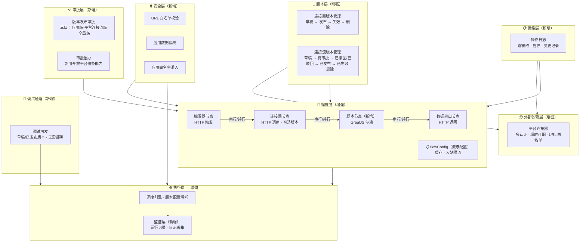
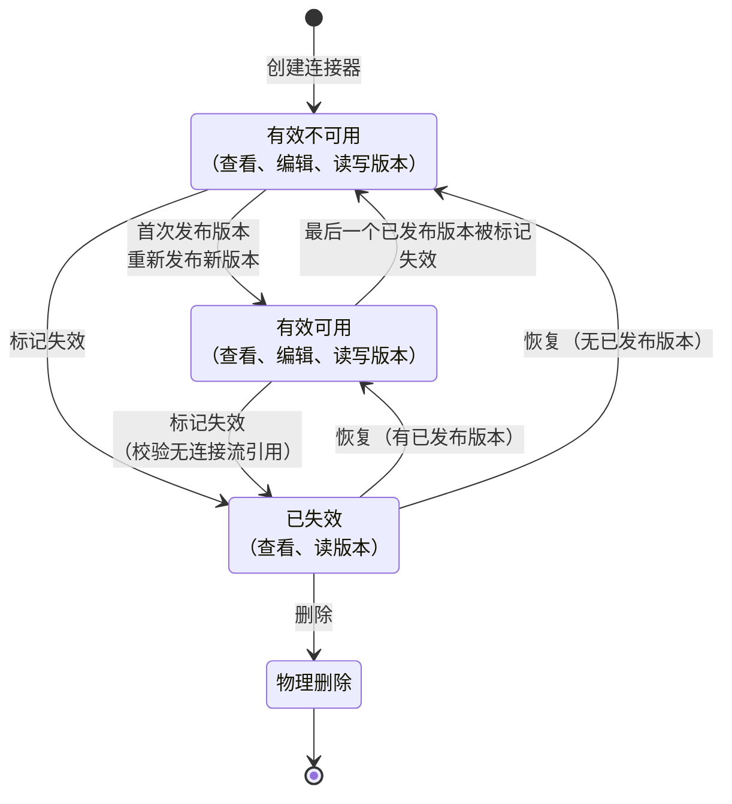
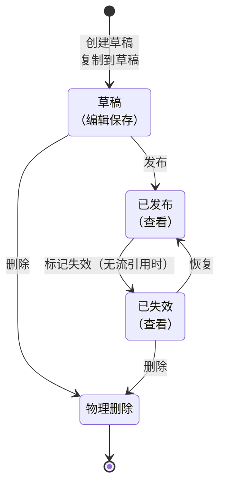
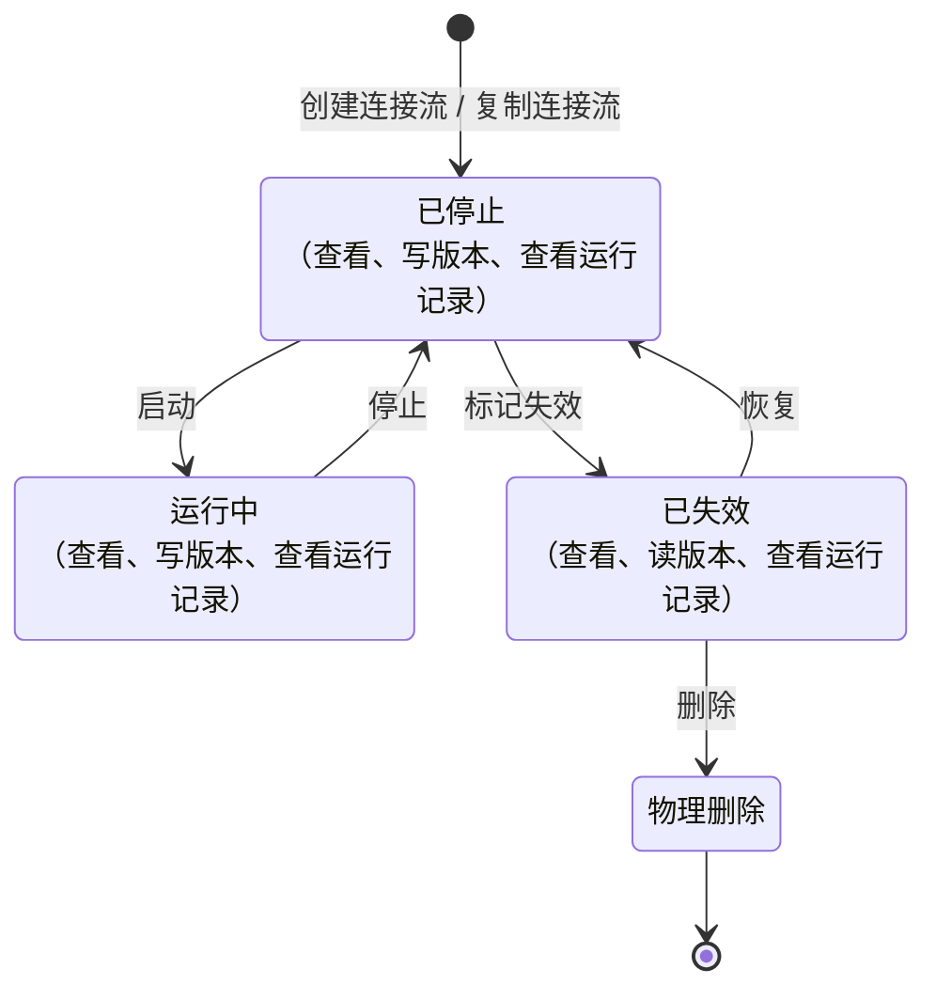
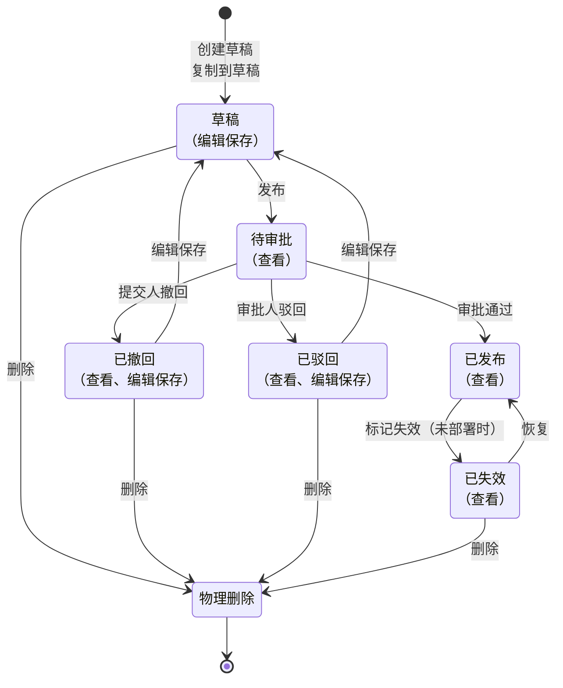
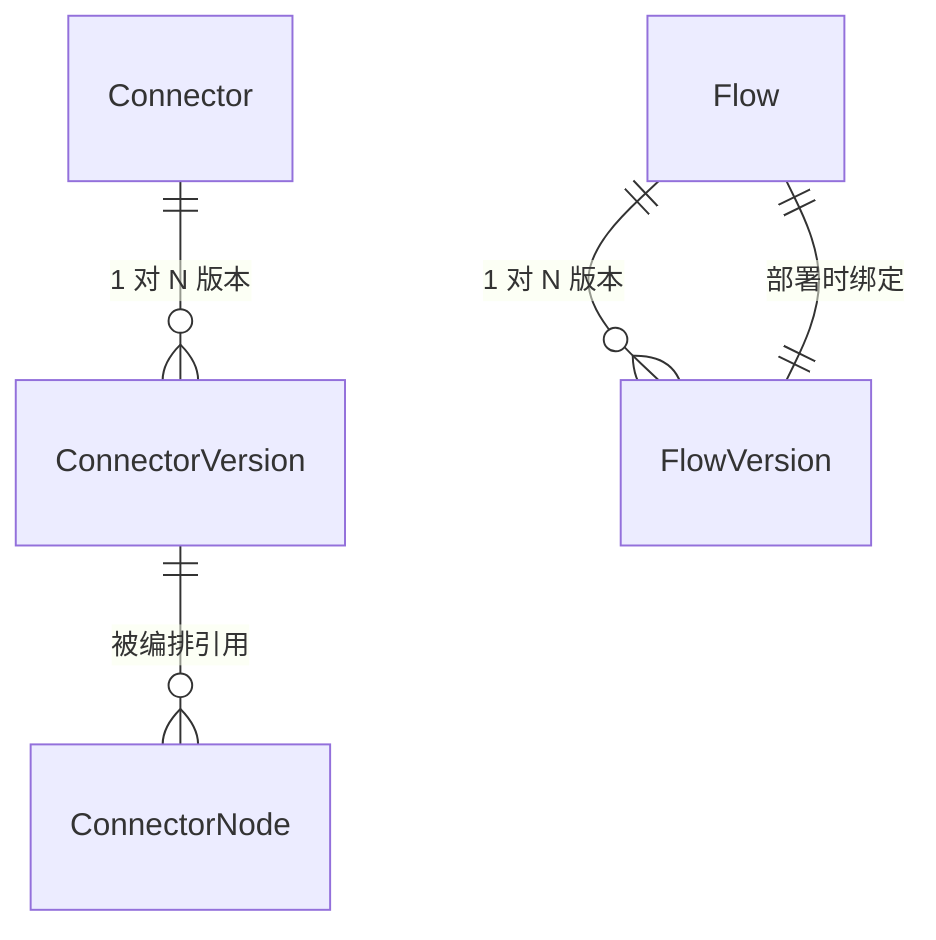

# 需求设计说明书：连接器平台 V3 — 多版本与增强

**Feature ID**: CONN-PLAT-002
**名称**: 连接器平台 V3 — 多版本与增强（Connector Platform V3 — Multi-Version & Enhancement）
**状态**: draft
**优先级**: P1
**作者**: Summer
**创建日期**: 2026-06-02
**最后更新**: 2026-06-22
**依赖**: CONN-PLAT-001（V1 MVP — 已建成并验证）

---

## 修订记录

| 版本 | 日期 | 修订内容 | 修订人 |
|------|------|---------|--------|
| v3.0 | 2026-06-22 | **V2→V3 设计方向转变**：移除数据处理节点(FR-040)和错误处理节点(FR-039a)，新增脚本节点(FR-040a)；FR-047从11条严格类型约束缩减为仅JSON语法校验；全文"画布"→"流程编排"术语替换 | Summer |
| v1.0 | 2026-06-16 | 合并 spec/plan/plan-db/plan-api/plan-json-schema/plan-cache 六份源文档为完整需求设计说明书 | SDDU |
| — | 2026-06-02 ~ 06-22 | spec.md 从 v2.0-draft 迭代至 v3.0，28 次修订 | Summer |

## 目录

- [1 需求价值和概述](#1-需求价值和概述)
  - [1.0 V2→V3 设计方向转变](#10-v2v3-设计方向转变)
  - [1.1 问题陈述](#11-问题陈述)
  - [1.2 解决方案](#12-解决方案)
  - [1.3 架构](#13-架构)
  - [1.4 Goals](#14-goals)
  - [1.5 Non-Goals](#15-non-goals)
  - [1.6 关键设计决策](#16-关键设计决策)
  - [1.7 核心业务对象生命周期](#17-核心业务对象生命周期)
- [2 上下文分析](#2-上下文分析)
- [3 初始需求分析（用户故事）](#3-初始需求分析用户故事)
- [4 需求影响分析](#4-需求影响分析)
- [5 系统用例分析](#5-系统用例分析)
- [6 功能设计（功能需求）](#6-功能设计功能需求)
  - [6.1 连接器实体（FR-001 ~ FR-004）](#61-连接器实体fr-001--fr-004)
  - [6.2 连接器版本（FR-005 ~ FR-011）](#62-连接器版本fr-005--fr-011)
  - [6.3 连接器配置（FR-012 ~ FR-015）](#63-连接器配置fr-012--fr-015)
  - [6.4 连接流实体（FR-016 ~ FR-023）](#64-连接流实体fr-016--fr-023)
  - [6.5 连接流版本（FR-024 ~ FR-030）](#65-连接流版本fr-024--fr-030)
  - [6.6 版本发布审批（FR-031 ~ FR-033）](#66-版本发布审批fr-031--fr-033)
  - [6.7 流程编排 — 流级配置（FR-034 ~ FR-037）](#67-流程编排--流级配置fr-034--fr-037)
  - [6.8 流程编排 — 串行/并行与脚本节点（FR-038 ~ FR-040a）](#68-流程编排--串行并行与脚本节点fr-038--fr-040a)
  - [6.9 调试（FR-041）](#69-调试fr-041)
  - [6.10 运行时（FR-042 ~ FR-044）](#610-运行时fr-042--fr-044)
  - [6.11 安全准入（FR-045）](#611-安全准入fr-045)
  - [6.12 运维审计（FR-046）](#612-运维审计fr-046)
  - [6.13 数据模型（FR-047）](#613-数据模型fr-047)
  - [6.14 功能需求汇总表](#614-功能需求汇总表)
- [7 系统级非功能设计](#7-系统级非功能设计)
  - [7.1 性能要求](#71-性能要求)
  - [7.2 安全性要求](#72-安全性要求)
  - [7.3 兼容性要求](#73-兼容性要求)
  - [7.4 边界情况汇总](#74-边界情况汇总)
- [8 技术设计](#8-技术设计)
  - [8.1 V1→V3 核心变更](#81-v1v3-核心变更)
  - [8.2 新增核心组件](#82-新增核心组件)
  - [8.3 接口模块](#83-接口模块)
  - [8.4 前端页面](#84-前端页面)
  - [8.5 依赖关系](#85-依赖关系)
- [9 checkList（成功标准与追溯）](#9-checklist成功标准与追溯)
  - [9.1 成功标准](#91-成功标准)
  - [9.2 需求追溯矩阵](#92-需求追溯矩阵)
  - [9.3 开放问题](#93-开放问题)
  - [9.4 风险与假设](#94-风险与假设)
- [附录 A：V1→V3 变更摘要](#附录-av1v3-变更摘要)
- [附录 B：版本规划](#附录-b版本规划)
- [附录 C：参考资料](#附录-c参考资料)

## Keywords 关键字

SOA, APIG, SYSTOKEN, AKSK, Cookie, Signature, 连接器(Connector), 连接流(Flow), 版本管理(Version Management), 多版本(Multi-Version), 审批流程(Approval Workflow), 限流(Rate Limiting), 缓存(Caching), JSON Schema, 应用隔离(App Isolation), URL白名单(URL Whitelist), 脚本节点(Script Node), GraalJS, 调试(Debug), 操作日志(Operation Log), 零代码编排(Zero-Code Orchestration), DAG, 流程编排(Flow Orchestration)

## Abstract 摘要

**中文**：连接器平台 V3 在 V1 零代码编排验证基础上，围绕连接器增强、连接流增强、运行时增强、安全与准入、数据模型升级、调试体验、运维审计七个方向进行升级。核心引入多版本管理（草稿→发布→失效→删除）、三级审批流程、增强认证体系（数字签名/Cookie/多选组合）、入站限流/缓存等流级配置、串并行编排与脚本节点（GraalJS 沙箱）、URL白名单与应用白名单安全准入、调试通道和操作日志。V3 设计哲学从 V2 的「完整好用」转变为「简单可用，能兜底」——精简非刚需功能，大幅放宽前置校验，以脚本节点作为复杂场景兜底方案。目标是为企业级连接器平台提供安全迭代、灵活编排、运维可见的完整能力。

**English**: Connector Platform V3 builds upon V1's validated zero-code orchestration by upgrading in seven areas: connector enhancement, flow enhancement, runtime enhancement, security & access control, data model upgrade, debugging experience, and operational audit. Key introductions include multi-version management (draft→published→deprecated→deleted), three-level approval workflow, enhanced authentication (Digital Signature/Cookie/multi-select), flow-level configurations (rate limiting/caching), serial-parallel orchestration with script nodes (GraalJS sandbox), URL whitelist and app whitelist security controls, debug channels, and operation logging. V3 shifts design philosophy from V2's "feature-complete" to "simple and reliable, with fallback" — trimming non-essential features, relaxing validations, and using script nodes as the universal escape hatch for complex logic.

## 缩略语清单

| 缩略语 | 英文全名 | 中文解释 |
|--------|----------|---------|
| SOA | Service-Oriented Architecture | 面向服务架构（认证方案） |
| APIG | API Gateway | API 网关认证 |
| SYSTOKEN | System Token | 系统凭证令牌 |
| AKSK | Access Key / Secret Key | 访问密钥对 |
| ADR | Architecture Decision Record | 架构决策记录 |
| DAG | Directed Acyclic Graph | 有向无环图（编排模型） |
| FIFO | First In First Out | 先进先出（记录清理策略） |
| QPS | Queries Per Second | 每秒请求数 |
| TPS | Transactions Per Second | 每秒事务数 |
| TTL | Time To Live | 缓存生存时间 |
| NFR | Non-Functional Requirement | 非功能需求 |
| FR | Functional Requirement | 功能需求 |
| EC | Edge Case | 边界情况 |
| MVP | Minimum Viable Product | 最小可行产品 |

---

## 1 需求价值和概述

### 1.0 V2→V3 设计方向转变

> **V2 设计方向：完整好用** — 以「功能完备」为目标，涵盖数据处理节点、错误处理节点、严格类型约束等完整体系。V2 详细设计文档已归档至 `../specs-tree-connector-platform-v2/`。
>
> **V3 设计方向：简单可用，能兜底** — 精简非刚需功能（数据处理节点、错误处理节点），大幅放宽前置校验（FR-047 仅保留 JSON 语法），以脚本节点作为复杂场景兜底方案。核心原则：**让连接器尽可能简单，但又功能强大**。

| 维度 | V2（已归档） | V3（当前） |
|------|:-----------:|:---------:|
| 交互方式 | 编排画布（React Flow 拖拽） | 流程编排（表单配置） |
| 节点类型 | 触发器/连接器/数据输出/数据处理/错误处理 | 触发器/连接器/数据输出/**脚本** |
| 数据校验 | 11 条严格类型约束（递归展开/禁止跨类型映射/禁止整体引用） | 仅 JSON 语法合法性 |
| 复杂逻辑 | 数据处理节点（4 种函数）+ 错误处理（重试/忽略/终止） | 脚本节点（GraalJS 沙箱，`function main(ctx)`） |
| 设计目标 | 平台保证正确性 | 用户自行负责，平台兜底 |

### 1.1 问题陈述

V1（CONN-PLAT-001）已验证了**零代码编排**的核心价值。但随着使用深入，V1 的能力边界暴露出以下 7 大痛点：

- **无版本管理**：连接器和连接流编辑即生效，无法保留多版本配置，变更无追溯
- **配置能力不足**：认证方式单一，超时不可配；编排仅支持串行，无并行分支和字段类型转换能力
- **安全防护薄弱**：缺少 URL 白名单和 SYSTOKEN 凭证白名单校验，连接器/连接流数据无应用级隔离，无应用白名单准入控制
- **发布缺少审批**：连接流版本发布无审批流程，关键变更缺少人工确认环节
- **运维不可见**：无运行记录监控，运行时缺乏版本配置解析和日志采集能力，变更操作无日志审计
- **调试效率低**：编排修改后必须发布、部署才能验证，迭代周期长
- **数据模型局限**：JSON Schema 参数传递和 HTTP 节点参数位置（header/query/body）支持不足

### 1.2 解决方案

V3 在 V1 基础上围绕**连接器增强、连接流增强、运行时增强、安全与准入、数据模型升级、调试体验、运维审计**七个方向升级：

| # | 方向 | 说明 |
|---|------|------|
| 1 | 连接器增强 | 多版本管理（草稿→发布→失效→删除），认证类型扩展至数字签名、Cookie，支持多选组合 |
| 2 | 连接流增强 | 多版本管理，生命周期操作独立为部署（版本绑定）、启动（状态迁移）、停止（状态迁移），三方互不耦合。版本发布需三级审批并支持一键催办，流程编排支持入站限流、超时控制、缓存及并行分支，新增脚本节点（GraalJS 沙箱）处理复杂逻辑，支持一键复制 |
| 3 | 运行时增强 | 运行记录监控查看，运行时版本配置解析、日志采集 |
| 4 | 安全与准入 | 连接器 URL 白名单校验，连接器/连接流数据按应用维度归属隔离，连接器平台能力按应用白名单逐步灰度开放 |
| 5 | 数据模型升级 | JSON Schema 增强，参数支持 input/output，HTTP 节点支持 header/query/body 参数位置；JSON 配置仅校验语法合法性，引用和类型约束由用户自行保证 |
| 6 | 调试体验 | 草稿版本和已发布版本均支持页面直接触发调用，无需部署 |
| 7 | 运维审计 | 连接器、连接流的增删改、启停等变更操作支持记录操作日志 |

### 1.3 架构

V3 在 V1 三层架构（外部依赖层 → 编排层 → 执行层）基础上叠加七个增强层：

**V1 与 V3 架构对比**：

| 层级 | V1 | V3 增强 |
|------|-----|--------|
| **版本层** | 单版本，运行时未校验 | 多版本管理（草稿→发布→失效→删除），运行时校验版本 |
| **外部依赖层** | 单一认证，超时不可配 | 多认证（数字签名、Cookie），支持多选，超时可配，URL 白名单校验 |
| **编排层** | 纯串行，3 种节点（触发器/连接器/数据输出） | 新增脚本节点（GraalJS 沙箱），4 种节点；编排支持串行/并行（并行处理节点上限 8 分支） |
| **数据模型层** | 基础 JSON Schema | JSON Schema 增强：input/output 参数支持、header/query/body 参数位置；仅校验 JSON 语法合法性，完整 Schema 设计见 plan-json-schema.md |
| **执行层** | 调度执行 | 新增版本配置解析、运行记录监控、日志采集 |
| **安全层** | 无 | URL 白名单、应用数据隔离、应用白名单准入 |
| **审批层** | 无 | 版本发布审批（三级：应用级+平台连接流级+全局级）、审批一键催办 |
| **调试通道** | 无 | 草稿版本和已发布版本页面直调，无需部署 |
| **运维层** | 无 | 连接器/连接流增删改、启停等操作日志记录 |

### 1.4 Goals

| # | 目标 | 说明 |
|---|------|------|
| **G1** | 连接器：配置多版本 | 支持多个已发布版本并行共存，可按需切换查看任意历史版本。生命周期：草稿 → 发布 → 失效 → 删除 |
| **G2** | [已移除] 连接器级限流配置 | 并入 Non-Goals |
| **G3** | 连接器：认证类型增强 | 现有 SOA/APIG 基础上新增数字签名认证、Cookie 认证，支持认证多选组合，凭证支持配置放置位置（Header/Query） |
| **G4** | 连接流：配置多版本 | 支持多个已发布版本并行共存，可按需切换查看任意历史版本。生命周期：草稿 → 发布 → 失效 → 删除 |
| **G5** | 连接流：生命周期增强 | 部署与启动完全隔离：部署仅绑定版本不改变状态，启动独立迁移状态（已停止 → 运行中）。生命周期状态：已停止 ⇄ 运行中 → 已失效 → 物理删除 |
| **G6** | 连接流：版本发布审批 | 连接流版本发布需经过三级审批：应用级版本发布审批人、平台级连接流统一审批人、全局审批人，全部通过后版本生效 |
| **G7** | 连接流：版本发布审批一键催办 | 复用开放平台现有审批催办能力，拓展至版本发布审批场景 |
| **G8** | 连接流：流程配置增强 | 编排支持触发器节点 SYSTOKEN 凭证白名单、连接器节点超时可配、连接流自身触发限流、串行/并行分支（仅并行，无条件和循环）；连接器节点可选引用版本；新增脚本节点处理复杂逻辑 |
| **G9** | [已移除] 字段数据类型转换 | 非刚需移除，复杂场景由脚本节点兜底 |
| **G18** | 连接流：一键复制 | 连接流列表支持一键复制，复制后生成独立连接流实体（含完整版本历史），名称自动追加 `_copy_xxxxx` 随机后缀，状态默认为「已停止」，仅限同应用内复制 |
| **G10** | 运行时：运行监控 | 连接流最近运行记录查看（触发时间、状态、耗时、触发方式） |
| **G11** | 运行时：运行时增强 | 运行时支持版本配置读取解析、日志采集记录、新增特性适配 |
| **G12** | 安全：连接器 URL 白名单校验 | 配置连接器时设置正则规则作为 URL 白名单，运行时按规则校验实际请求地址 |
| **G13** | 安全：数据按应用隔离 | 连接器、连接流数据按应用维度归属隔离，不同应用间资源互不可见 |
| **G14** | 安全：连接器平台应用白名单 | 平台管理员维护可开通连接器功能的应用白名单，白名单内应用才可使用连接器平台能力，支持逐步灰度 |
| **G15** | 数据模型：JSON Schema 增强 | 参数传递支持 input/output；HTTP 类型节点支持 header/query/body 参数位置。仅保留 JSON 语法校验，不限制引用路径、类型一致性等约束 |
| **G16** | 调试：调试触发 | 连接流草稿版本和已发布版本均支持在页面直接触发调试调用，无需部署。失效版本不支持调试 |
| **G17** | 运维：操作日志 | 连接器、连接流的增删改、启停等变更操作支持记录操作日志 |

### 1.5 Non-Goals

| # | 非目标 | 原因 |
|---|--------|------|
| NG1 | AI 辅助编排 | V3 阶段 |
| NG2 | 连接器模板库 | 模板延后 |
| NG3 | 三方连接器开放发布 | V3 阶段 |
| NG4 | 连接器审批管控 | V3 无连接器审批流程 |
| NG5 | Scope 权限管控 | V3 仅做应用级隔离（G13），Scope 粒度权限待定 |
| NG6 | 连接器评分/评论系统 | V3 阶段 |
| NG7 | 开发者工具链（SDK/CLI/IDE 插件） | 后续版本 |
| NG8 | 社区市场/跨企业共享连接器 | 仅限企业内部 |
| NG9 | 计费/订阅系统 | 无需计费 |
| NG10 | 通用 iPaaS | 聚焦 XX 平台能力编排 |
| NG11 | 多集群/多云连接器运行时 | 企业内单一集群 |
| NG12 | 条件分支/循环/子流程编排 | V3 仅并行分支 |
| NG13 | 事件触发器 | V3 阶段 |
| NG14 | 定时触发器（Cron） | V3 阶段 |
| NG15 | 失败重试 | 延后评估 |
| NG16 | 表达式/模板/低代码函数处理 | V3 脚本节点（FR-040a）已覆盖复杂处理场景，表达式/模板等非刚需延后 |
| NG17 | 连接器级出站限流策略可配 | V3 移入，延后评估 |

### 1.6 关键设计决策

| 维度 | 关键设计 | 保护对象 | 配置对象 | 归属 |
|------|---------|---------|---------|:--:|
| **超时** | 属于连接流，非连接器。超时是调用方诉求，不同流对同一连接器可设不同超时值。平台管理员可按应用设置最大超时上限（平台统一默认 5s，未设独立值的应用回退使用平台统一默认） | 调用方（连接流）不长时间阻塞 | 应用管理员编排连接流时按节点配置，运行时取 min(节点值, 应用最大超时值) | G8 |
| **入站限流** | 属于连接流。限制连接流被触发的频率，防止自身过载。平台管理员可按应用设置最大限流上限（平台统一默认 QPS=1000、并发=1000，未设独立值的应用回退使用平台统一默认） | 连接流自身 | 应用管理员在连接流编排时配置，运行时取 min(流配置值, 应用最大限流值) | G8 |
| **缓存** | 属于连接流。通过缓存子图结果减少重复调用。TTL 上限默认 15 天 | 后端系统 + 调用效率 | 应用管理员在连接流运行时配置中设定 | G8 |
| **脚本节点** | 属于连接流。每流最多 10 个，用户编写 `function main(ctx) { ... return ... }` 处理复杂逻辑。GraalJS 沙箱执行（ES2022），五层纵深防御，不提供内置工具。ctx 为上游全量数据函数参数，return 显式输出。详细设计见 plan-script.md | 调用方（连接流） | 应用管理员在连接流编排时编写脚本 | G8 |
| **并行分支** | 属于连接流。并行处理节点内分支上限 8，防止资源过度拆分 | 连接流自身 | 应用管理员编排连接流时在并行处理节点中配置分支数 | G8 |
| **日志采集开关** | 属于平台 + 应用。控制是否写入节点级运行日志。平台管理员设置平台统一默认值（默认开启），可按应用覆盖；某应用未设独立值时回退使用平台统一默认。关闭后不再写入节点日志，运行记录仅保留基础信息；已写入的历史日志保留不变仍可查询。开关关闭期间条数上限和保留天数策略对不再写入的日志无实际影响（无新数据触发清理），老数据仍按策略到期清理 | 后端存储 | 平台管理员在应用级配置中设定；应用管理员在自己的应用内可操作开启/关闭 | G11 |
| **引用稽核** | 被引用方的校验通过查询引用方确定，不把引用关系固化到被引用方的状态或字段中。被引用方只关心自身配置，不关心"被谁用"。细则：① FlowVersion「已部署」不设独立状态，失效前查 `flow.deployed_version_id` 即可（1:1，O(1)）；② ConnectorVersion 的编排引用通过 `connector_version_ref` 中间表显式管理（M:N），保存编排时同步维护 | — | 引用关系存于引用方或中间表 | — |

### 1.7 核心业务对象生命周期

V3 有四个核心业务对象承载状态流转，是功能需求的基础约束。生命周期决定了 FR 中「可/不可」操作的边界条件，以及 EC 的处理逻辑。

> **关键认知**：连接器和连接流是状态容器，自身状态极简；版本是真正的配置载体，承载完整的发布/失效/审批流转。

| 对象 | 状态数 | 状态列表 | 审批 | 多版本并存 |
|------|:---:|------|:---:|:---:|
| 连接器 (Connector) | 4 | 有效可用 → 有效不可用 → 已失效 → 物理删除 | ❌ | — |
| 连接器版本 (ConnectorVersion) | 4 | 草稿 → 已发布 → 已失效 → 物理删除 | ❌ | ✅ |
| 连接流 (Flow) | 4 | 已停止 ⇄ 运行中 → 已失效 → 物理删除 | ❌ | — |
| 连接流版本 (FlowVersion) | 7 | 草稿 → 待审批 → 已撤回 / 已驳回 → 已发布 → 已失效 → 物理删除 | ✅ 三级 | ✅ |

#### 1.7.1 连接器生命周期

| 可执行的操作 | 有效可用 | 有效不可用 | 已失效 | 物理删除 |
|------|:---:|:---:|:---:|:---:|
| 查看基本信息 | ✅ | ✅ | ✅ | — |
| 编辑基本信息 | ✅ | ✅ | ❌ | — |
| 读版本 | ✅ | ✅ | ✅ | — |
| 写版本 | ✅ | ✅ | ❌ | — |
| 标记失效 | ✅（无流引用） | ✅（无流引用） | — | — |
| 恢复 | — | — | ✅ | — |
| 删除 | ❌ | ❌ | ✅ | — |

#### 1.7.2 连接器版本生命周期

连接器版本是配置的真正载体，多版本并行共存，无审批流程。

| 可执行的操作 | 草稿 | 已发布 | 已失效 | 物理删除 |
|------|:---:|:---:|:---:|:---:|
| 查看 | ✅ | ✅ | ✅ | — |
| 编辑保存 | ✅ | ❌ | ❌ | — |
| 发布 | ✅（非空配置） | — | — | — |
| 创建草稿 | — | ✅ | ✅ | — |
| 复制到草稿 | ❌ | ✅（未达1000上限） | ✅（未达1000上限） | — |
| 标记失效 | — | ✅（无流引用） | — | — |
| 恢复 | — | — | ✅ | — |
| 删除 | ✅ | ❌ | ✅ | — |

#### 1.7.3 连接流生命周期

连接流状态机极简，仅 4 个状态。**部署**不改变状态 — 部署是纯版本绑定切换动作，在「已停止」和「运行中」状态下均可执行。**启动**是独立于部署的状态迁移动作，将「已停止」推进至「运行中」。

> **部署（独立动作，不改变状态）**：在「已停止」或「运行中」状态下，选择一个已发布版本执行部署，系统绑定该版本到连接流（设置 `deployed_version_id`）。部署本身不改变连接流状态，仅切换运行时引用的版本配置。在「运行中」状态下部署新版本时，运行时立即切换到新版本配置，当前执行中的实例继续用旧版本完成。

| 可执行的操作 | 已停止 | 运行中 | 已失效 | 物理删除 |
|------|:---:|:---:|:---:|:---:|
| 查看 | ✅ | ✅ | ✅ | — |
| 读版本 | ✅ | ✅ | ✅ | — |
| 写版本 | ✅ | ✅ | ❌ | — |
| 查看运行记录 | ✅ | ✅ | ✅ | — |
| **部署**（切换版本绑定） | ✅ | ✅（替换运行版本） | — | — |
| 启动 | ✅（有已部署版本时） | — | — | — |
| 停止 | — | ✅ | — | — |
| 标记失效 | ✅ | ❌ | — | — |
| 恢复 | — | — | ✅ | — |
| 删除 | ❌ | ❌ | ✅ | — |

#### 1.7.4 连接流版本生命周期

连接流版本是编排配置的真正载体，含三级审批流程。撤回和驳回独立为状态，保证自身可读无需回查审批表。

| 可执行的操作 | 草稿 | 待审批 | 已撤回 | 已驳回 | 已发布 | 已失效 | 物理删除 |
|------|:---:|:---:|:---:|:---:|:---:|:---:|:---:|
| 查看 | ✅ | ✅ | ✅ | ✅ | ✅ | ✅ | — |
| 编辑保存 | ✅ | ❌ | ✅（到草稿） | ✅（到草稿） | ❌ | ❌ | — |
| 发布 | ✅（非空编排） | — | — | — | — | — | — |
| 撤回 | — | ✅ | — | — | — | — | — |
| 驳回 | — | ✅ | — | — | — | — | — |
| 审批通过 | — | ✅ | — | — | — | — | — |
| 创建草稿 | — | — | — | — | ✅ | ✅ | — |
| 复制到草稿 | ❌ | ❌ | ❌ | ❌ | ✅（无待审批/已撤回/已驳回版本，有草稿则覆盖，未达1000上限） | ✅（同上条件） | — |
| 标记失效 | — | — | — | — | ✅（未被运行中的流部署） | — | — |
| 恢复 | — | — | — | — | — | ✅ | — |
| 删除 | ✅ | ❌ | ✅ | ✅ | ❌ | ✅ | — |

#### 1.7.5 四对象关系与约束总结

| 约束 | 涉及对象 | 说明 |
|------|---------|------|
| 删除连接器需检验无引用 | Connector → Flow (ConnectorNode) | 运行中流引用某连接器的任意版本，则该连接器不可删除 |
| 失效版本需检验无流引用 | ConnectorVersion → Flow (ConnectorNode) | 任何流引用该版本即禁止失效 |
| 失效流版本需检验未部署 | FlowVersion → Flow | 已部署的版本禁止失效（无论流处于何种状态），需先部署其他版本解除绑定 |
| 删除流需已失效 | Flow | 仅已失效状态可删除 |
| 复制仅限同应用 | Flow → Application | 跨应用不可复制 |

---

## 2 上下文分析

### 2.1 干系人画像

| 干系人 | 角色描述 | 使用方式 | 核心关注 |
|--------|---------|---------|---------|
| **平台管理员** | 企业级连接器平台的总控者 | Web 管理端（设置页） | 平台的全局安全策略、审批流配置、资源上限控制、应用准入管理 |
| **应用管理员** | 特定应用下连接器和连接流的日常管理者 | Web 管理端（应用视角） | 连接器的创建与多版本管理、连接流的编排与版本发布、监控与调试 |

### 2.2 所处环境

| 环境要素 | 描述 |
|---------|------|
| 系统定位 | 企业内连接器平台，面向内部应用管理员，非公共 iPaaS |
| 运行环境 | 单一企业内部集群，2C4G 单节点部署 |
| 终端设备 | 桌面浏览器（Chrome / Edge 最新 2 个大版本） |
| 已有基础 | V1 连接器管理、编排引擎、运行时调度均已建成并验证 |

### 2.3 假设与约束

| # | 假设 | 验证方式 |
|---|------|---------|
| A1 | V1 编排引擎和运行时调度可无缝扩展支持版本配置解析 | 开发阶段联调验证 |
| A2 | 开放平台审批引擎可复用至连接流版本发布审批场景 | 技术预研对接 |
| A3 | Redis 限流方案可满足入站限流性能要求 | 性能测试 |
| A4 | GraalJS 沙箱可在 WebFlux 非阻塞环境中稳定运行 | 集成测试 + 压力测试 |
| A5 | 现有 market-server Lookup/Property 能力可支持白名单和应用配置管理 | 对接验证 |

---

## 3 初始需求分析（用户故事）

> V3 面向两类角色：**平台管理员**负责平台级安全与审批配置；**应用管理员**负责自有应用下连接器和连接流的日常管理。

### 3.1 平台管理员

| ID | 用户故事 | 对应 Goal |
|----|---------|----------|
| US-01 | 配置连接器 URL 正则白名单规则，限制允许调用的目标地址范围 | G12 |
| US-02 | 维护连接器平台应用白名单，控制哪些应用开通连接器平台能力，支持逐步灰度 | G14 |
| US-03 | 配置连接流版本发布三级审批人（应用级/平台连接流级/全局级） | G6 |
| US-03a | 按应用配置节点超时最大上限、入站限流最大上限、运行记录条数上限和日志采集开关（平台统一默认：超时 5s，限流 QPS=1000/并发=1000，运行记录 1000 条/流，日志采集开启；未设独立值的应用回退使用平台统一默认） | G8、G11 |

### 3.2 应用管理员

| ID | 用户故事 | 对应 Goal |
|----|---------|----------|
| US-04 | 创建和管理连接器，管理连接器配置的多版本（草稿→发布→失效→删除） | G1 |
| US-05 | 选择连接器认证方式（SOA/APIG/数字签名/Cookie），支持多选组合，配置凭证放置位置（Header/Query） | G3 |
| US-06 | 创建和管理连接流，管理配置的多版本，发布版本需审批并支持催办，独立执行部署（版本绑定）和启动（状态迁移）操作 | G4、G5、G6、G7 |
| US-07 | 提交连接流版本发布审批，支持一键催办 | G6、G7 |
| US-08 | 编排连接流：配置节点超时、流级限流、SYSTOKEN 白名单、缓存、串行/并行、选择连接器引用版本，编写脚本节点处理复杂逻辑 | G8 |
| US-09 | [已移除] ~~在数据处理节点中配置字段数据类型转换~~ — 非刚需移除，见 G9 |
| US-10 | 查看连接流运行记录（触发时间、状态、耗时），节点详细日志的可见性依赖日志采集开关状态；在自己的应用内可控制日志采集开关的开启/关闭 | G10、G11 |
| US-11 | 在草稿版本和已发布版本上直接触发调试调用，无需部署 | G16 |
| US-12 | 查看连接器、连接流的操作日志（增删改、启停等变更记录），复用应用现有操作日志模块 | G17 |
| US-13 | 在连接流列表一键复制连接流，得到独立连接流实体，名称自动加随机后缀，状态默认已停止 | G18 |

---

## 4 需求影响分析

### 4.1 产品影响评估

| 受影响产品/模块 | 影响描述 | 变更等级 |
|----------------|---------|:---:|
| 连接器管理模块 | 叠加版本层，支持多版本管理、多认证配置、URL 白名单 | ⬆️ 大 |
| 连接流编排模块 | 叠加版本层，新增脚本节点、并行处理节点、流级配置（限流/缓存/超时） | ⬆️ 大 |
| 运行时调度引擎 | 升级支持版本配置解析、运行记录、日志采集、调试通道 | ⬆️ 中 |
| 开放平台审批引擎 | 新增「连接流版本发布审批」审批场景，三级审批人配置需增加应用隔离 | ⬆️ 中 |
| market-server | 新增应用白名单、URL 白名单、应用级超时/限流/运行记录上限/日志开关配置项 | ⬆️ 中 |
| 前端交互界面 | 新增版本历史页、审批页、运行记录/日志页、调试面板、脚本编辑器 | ⬆️ 大 |

### 4.2 系统接口影响

| 接口层级 | 变更类型 | 涉及接口数 |
|---------|:---:|:---:|
| 连接器版本 API | 新增 | 8 个端点 |
| 连接器认证 API | 增强 | 4 个端点 |
| 连接流版本 API | 新增 | 8 个端点 |
| 连接流生命周期 API | 增强 | 4 个端点 |
| 连接流复制 API | 新增 | 1 个端点 |
| 版本发布审批 API | 新增 | 4 个端点 |
| 流程编排配置 API | 增强 | 6 个端点 |
| 运行记录 API | 新增 | 2 个端点 |
| 运行日志 API | 新增 | 2 个端点 |
| 调试 API | 新增 | 2 个端点 |
| 安全配置 API | 新增 | 4 个端点 |
| 操作日志 API | 集成 | 复用现有模块 |

### 4.3 数据影响

| 数据 | 影响项 | 说明 |
|------|--------|------|
| 数据库新增表 | connector_version, flow_version, execution_record, node_log, platform_app_whitelist, connector_version_ref | — |
| 数据库变更表 | connector, flow（新增状态字段、deployed_version_id） | — |
| 数据库存量数据 | V1 连接器/连接流数据需迁移至 V3 模型 | 需制定迁移方案 |

---

## 5 系统用例分析

### 5.1 平台管理员用例

| 用例 ID | 用例名称 | 关联 FR | 优先级 |
|---------|---------|--------|:---:|
| UC-P01 | 管理应用白名单 | FR-045 | P1 |
| UC-P02 | 配置 URL 正则白名单规则 | FR-015（配置端） | P1 |
| UC-P03 | 配置三级审批人 | FR-032 | P1 |
| UC-P04 | 管理应用级超时/限流/运行记录上限/日志开关 | FR-034, FR-035, FR-042, FR-044 | P1 |

### 5.2 应用管理员用例

| 用例 ID | 用例名称 | 关联 FR | 优先级 |
|---------|---------|--------|:---:|
| UC-A01 | 创建与管理连接器 | FR-001 ~ FR-004 | P1 |
| UC-A02 | 管理连接器版本（草稿/发布/失效/删除/恢复） | FR-005, FR-005a, FR-006, FR-007, FR-008, FR-009, FR-010, FR-011 | P1 |
| UC-A03 | 配置连接器认证（多类型+多选+凭证位置） | FR-012, FR-013, FR-014 | P1 |
| UC-A04 | 管理连接器 URL 白名单 | FR-015（编辑端） | P1 |
| UC-A05 | 创建与管理连接流 | FR-016, FR-021, FR-022, FR-023 | P1 |
| UC-A06 | 复制连接流 | FR-017 | P1 |
| UC-A07 | 部署与启停连接流 | FR-018, FR-019, FR-020 | P1 |
| UC-A08 | 管理连接流版本（草稿/发布/失效/删除/恢复） | FR-024, FR-024a, FR-025, FR-026, FR-027, FR-028, FR-029, FR-030 | P1 |
| UC-A09 | 提交版本发布审批与催办 | FR-031, FR-033 | P1 |
| UC-A10 | 编排连接流（节点/流级配置） | FR-034, FR-035, FR-036, FR-037, FR-038, FR-038a, FR-039, FR-040a | P1 |
| UC-A11 | 调试连接流版本 | FR-041 | P1 |
| UC-A12 | 查看运行记录与日志 | FR-042, FR-044 | P1 |
| UC-A13 | 查看操作日志 | FR-046 | P1 |

---

## 6 功能设计（功能需求）

> **核心设计原则**：V3 采用"数据库存储 OK 就放行"的宽松策略。草稿创建、编辑、复制时仅做数据库存储级别约束校验（如字段值超出列定义长度），业务必填校验和所有平台要求限制校验统一推迟到**发布时**执行。草稿保存不校验 JSON 语法、正则合法性、引用版本可用性、限流/超时/缓存/分支上限——允许暂存不合规值，发布时统一拦截。

### 6.1 连接器实体（FR-001 ~ FR-004）

> 连接器实体是版本的载体，自身状态极简。创建连接器时不自动生成草稿版本，需手动创建（FR-005a）。

| FR | 名称 | 核心描述 |
|----|------|---------|
| **FR-001** | 创建连接器 | 创建时不自动生成草稿版本，仅创建连接器实体。创建时不校验业务必填字段（名称、描述、协议等信息允许为空），仅做数据库存储级别约束校验。创建后连接器进入「有效不可用」状态。业务必填校验推迟到首次发布版本时执行。 |
| **FR-002** | 恢复连接器 | 已失效的连接器可恢复。恢复后连接器进入「有效」状态，具体为「有效可用」还是「有效不可用」由当前是否存在已发布版本决定。恢复操作记录操作日志（FR-046）。 |
| **FR-003** | 失效连接器 | 有效可用或有效不可用的连接器可标记为已失效。标记失效前校验无连接流引用该连接器的任何版本。失效后不可编辑、不可发布版本。 |
| **FR-004** | 删除连接器 | 仅「已失效」状态可物理删除。删除前二次确认，删除后状态变为「物理删除」，不可恢复。 |

### 6.2 连接器版本（FR-005 ~ FR-011）

> 连接器版本生命周期见 §1.7.2：草稿 → 已发布 → 已失效 → 物理删除。V1 无版本概念，V3 新增完整多版本管理。

| FR | 名称 | 核心描述 |
|----|------|---------|
| **FR-005** | 编辑草稿 | 草稿版本的连接器配置可修改。保存后覆盖当前草稿内容，不产生新版本号。保存时不执行任何数据格式平台要求限制校验，且不校验业务必填项——仅做数据库存储级别约束校验，其余一律放行。所有校验统一推迟到发布时执行（FR-007）。 |
| **FR-005a** | 创建草稿版本 | 手动创建空草稿版本，作为可编辑的配置工作区。创建前提：当前无草稿版本时正常创建；已有草稿时提示「已存在草稿版本」。创建前校验版本总数：达 1000 上限时禁止创建（EC-019）。创建的空草稿允许配置为空。 |
| **FR-006** | 复制到草稿 | 在已发布版本上点击「复制到草稿」，以该版本配置快照为内容生成或覆盖草稿版本。版本总数达 1000 上限时禁止复制。若当前已有草稿，以选中版本快照覆盖当前草稿内容；若无草稿，则新建草稿版本。复制时不执行平台要求限制校验。 |
| **FR-007** | 发布版本 | 草稿发布为正式版本，版本号沿用草稿时的版本号。发布时统一执行全部校验：业务必填字段校验、草稿配置非空校验（EC-009）、URL 正则合法性校验（FR-015）、JSON 语法校验（FR-047），任一项不通过则禁止发布。首次发布时连接器状态从「有效不可用」→「有效可用」。 |
| **FR-008** | 版本查看 | 查看已发布版本列表（版本号、状态、发布时间、发布人），可切换查看任意历史版本配置详情（只读）。草稿版本在列表中单独展示。 |
| **FR-009** | 版本失效 | 已发布版本可标记失效。失效前校验：有连接流编排引用该版本时禁止失效（EC-001）。若失效的是连接器最后一个已发布版本，连接器状态「有效可用」→「有效不可用」。 |
| **FR-010** | 版本删除 | 草稿和已失效版本可删除。删除不可恢复，删除前二次确认。「已发布」状态需先标记失效再删除。草稿可直接删除，无需先标记失效。 |
| **FR-011** | 恢复版本 | 已失效的连接器版本可恢复至「已发布」状态。恢复后版本可重新被连接流编排引用。若恢复的是连接器唯一已发布版本，连接器状态「有效不可用」→「有效可用」。 |

### 6.3 连接器配置（FR-012 ~ FR-015）

| FR | 名称 | 核心描述 |
|----|------|---------|
| **FR-012** | 认证类型 | V1 已支持 SOA、APIG。V3 新增数字签名认证（仅需 Secret Key，算法平台统一处理）、Cookie 认证（仅填写 Cookie 名称，值由连接流编排时手动映射）。凭证加密存储，界面脱敏显示。 |
| **FR-013** | 凭证位置 | 数字签名凭证支持配置放置位置（Header / Query）。SOA / APIG 的凭证位置沿用 V1 已有配置方式，本次不强制改动。 |
| **FR-014** | 认证多选 | 同一连接器支持同时选择多种认证方式（SOA / APIG / 数字签名 / Cookie 可同时勾选）。多选时支持拖拽排序，运行时按次序依次附加认证信息。取消所有勾选时提示「至少选择一种认证方式」。 |
| **FR-015** | URL 正则白名单 | 连接器编辑页提供「URL 白名单」配置区，支持多条正则规则。草稿编辑保存时不校验正则合法性，允许暂存不合法表达式。发布时（FR-007）统一校验正则合法性，不合法则禁止发布并提示具体错误规则（EC-010）。空白名单 = 不限制（允许调用任意地址）。运行时每次调用前逐条匹配，命中任意一条即允许，全部不命中则拒绝。 |

### 6.4 连接流实体（FR-016 ~ FR-023）

> 连接流生命周期见 §1.7.3：已停止 ⇄ 运行中 → 已失效 → 删除。创建连接流时不自动生成草稿版本。

| FR | 名称 | 核心描述 |
|----|------|---------|
| **FR-016** | 创建连接流 | 创建时不自动生成草稿版本，仅创建连接流实体。创建时不校验业务必填字段，仅做数据库存储级别约束校验。创建后连接流进入「已停止」状态。创建后需手动创建草稿版本（FR-024a）或从已发布版本复制到草稿（FR-025）。 |
| **FR-017** | 一键复制 | 连接流列表支持一键复制，生成独立连接流实体（含完整版本历史）。新连接流名称 = 原名称 + `_copy_xxxxx`（xxxxx 为随机 4 位十六进制），状态默认为「已停止」。仅限同应用内复制。复制时不执行任何数据格式平台要求限制校验。 |
| **FR-018** | 部署 | 部署是纯版本绑定切换动作，不改变连接流状态。选择已发布版本绑定到连接流（设置 `deployed_version_id`）。部署与启动完全隔离：部署仅做版本绑定，启动是独立的状态迁移操作（FR-019）。 |
| **FR-019** | 启动 | 仅「已停止」状态可启动，操作后状态变为「运行中」。启动前提：需存在已部署版本（`deployed_version_id` 非空）。启动后开始响应 HTTP 触发。 |
| **FR-020** | 停止 | 仅「运行中」状态可停止，操作后状态变为「已停止」。停止后不再响应新触发；当前执行中的实例继续完成（EC-007）。 |
| **FR-021** | 恢复连接流 | 仅「已失效」状态可恢复，恢复后连接流状态统一变为「已停止」（安全中间态，不自动响应触发）。 |
| **FR-022** | 失效连接流 | 运行中的连接流不可直接失效，必须先停止。标记失效后不可编辑、不可启动。 |
| **FR-023** | 删除连接流 | 仅「已失效」状态可物理删除。删除前二次确认，删除后不可恢复。 |

### 6.5 连接流版本（FR-024 ~ FR-030）

> 连接流版本生命周期见 §1.7.4：草稿 → 待审批 → 已撤回 / 已驳回 → 已发布 → 已失效 → 物理删除。

| FR | 名称 | 核心描述 |
|----|------|---------|
| **FR-024** | 编辑草稿 | 草稿版本的连接流编排可修改。保存时不执行任何数据格式平台要求限制校验，且不校验业务必填项——仅做数据库存储级别约束校验，其余一律放行。所有校验统一推迟到发布时执行（FR-026）。 |
| **FR-024a** | 创建草稿版本 | 手动创建空草稿版本，编排内容（nodes + edges + flowConfig）为空。创建前提：当前无草稿版本；已有草稿时提示。版本总数达 1000 上限时禁止创建（EC-020）。 |
| **FR-025** | 复制到草稿 | 在已发布版本上点击「复制到草稿」，以该版本编排快照生成或覆盖草稿。复制前提校验：a) 存在待审批/已驳回/已撤回版本时禁止复制（分别提示）；b) 版本总数达 1000 上限禁止复制。当前已有草稿时覆盖，无草稿时新建。复制时不执行平台要求限制校验。 |
| **FR-026** | 发布版本 | 草稿发布为正式版本，版本号沿用草稿时的版本号。提交发布时统一执行全部校验（数据库级 + 业务必填 + 平台要求限制），包括：业务必填字段校验、编排非空校验（EC-009）、入站限流上限校验（EC-025）、节点超时上限校验（EC-028）、缓存时长上限校验（EC-026）、并行分支数上限校验（EC-027）、连接器版本引用可用性校验（EC-004）、JSON 语法校验（FR-047）、脚本节点语法校验（FR-040a）。校验通过后进入「待审批」状态，走三级审批流程。 |
| **FR-027** | 版本查看 | 查看版本列表（版本号、状态、提交时间、发布人），可切换查看任意历史版本编排快照（只读）。 |
| **FR-028** | 版本失效 | 已发布版本可标记失效。失效前校验：查询 `flow.deployed_version_id`，当前版本为已部署版本时禁止失效（EC-002）。 |
| **FR-029** | 版本删除 | 草稿/已撤回/已驳回/已失效版本可直接删除。删除不可恢复。已发布和待审批状态不可直接删除：已发布需先标记失效，待审批需先撤回或驳回后再删除。 |
| **FR-030** | 恢复版本 | 已失效的连接流版本可恢复至「已发布」状态。恢复后版本可重新被部署。 |

### 6.6 版本发布审批（FR-031 ~ FR-033）

> 连接流版本发布需三级审批，复用开放平台审批引擎。

| FR | 名称 | 核心描述 |
|----|------|---------|
| **FR-031** | 提交审批 | 草稿编排完成后点击「提交审批」，版本状态变为「待审批」。系统向三级审批人依次发起审批（应用级 → 平台连接流级 → 全局级）。审批通过后版本状态变为「已发布」；任意一级驳回后变为「已驳回」；提交人可在审批完成前撤回变为「已撤回」。复用开放平台现有审批流程能力。 |
| **FR-032** | 审批人配置 | 平台管理员在连接器平台设置页配置三级审批人：a) 应用级版本发布审批人（按应用单独配置）；b) 平台级连接流统一审批人（一个全局值）；c) 全局审批人（一个全局值）。审批人配置变更后对新提交的审批生效。审批人可配置多人，多人中任一审批通过即视为该级通过。 |
| **FR-033** | 一键催办 | 处于「待审批」状态的版本，提交人可点击「一键催办」。催办后向当前审批节点的审批人发送通知（复用现有站内信/消息推送能力）。同一节点可重复催办，无冷却限制。 |

### 6.7 流程编排 — 流级配置（FR-034 ~ FR-037）

> flowConfig（超时/入站限流/缓存）嵌入 FlowVersion 快照，不独立建表。

| FR | 名称 | 核心描述 |
|----|------|---------|
| **FR-034** | 节点超时 | 连接器节点可配置超时时间（秒）。应用最大超时值：平台管理员设平台统一默认值（默认 5s），可按应用覆盖。保存时不校验上限值；提交发布时（FR-026）校验节点超时值不超过应用最大超时值，超限则禁止提交（EC-028）。运行时取 min(节点配置值, 应用最大超时值)。 |
| **FR-035** | 入站限流 | 连接流 flowConfig 面板提供入站限流配置：限流方式（QPS / 并发数）、上限值。应用最大限流值：平台管理员设平台统一默认值（默认 QPS=1000、并发=1000），可按应用覆盖。保存时不校验上限值；提交发布时（FR-026）校验 QPS/并发数不超过应用最大限流值，超限则禁止提交（EC-025）。运行时取 min(流配置值, 应用最大限流值)，超限返回 429。 |
| **FR-036** | SYSTOKEN 白名单 | 触发器节点认证配置中选择「SYSTOKEN」后展开白名单配置区域。空白名单（列表为空）时任何 SYSTOKEN 凭证均不可触发此连接流（EC-011）。运行时触发器校验：请求中的 SYSTOKEN 必须在白名单中，否则返回 401。 |
| **FR-037** | 缓存配置 | flowConfig 面板提供缓存配置：缓存键（支持引用触发器入参字段）、缓存时长（TTL，秒，范围 1~1296000 即 15 天）。保存时不校验 TTL 上限；提交发布时（FR-026）校验 TTL 不超过 1296000 秒，超限则禁止提交（EC-026）。缓存命中时跳过子图重复执行。版本发布/失效时主动清理对应版本缓存。 |

### 6.8 流程编排 — 串行/并行与脚本节点（FR-038 ~ FR-040a）

| FR | 名称 | 核心描述 |
|----|------|---------|
| **FR-038** | 串行/并行 | V1 仅串行。V3 新增：节点间边支持并行连接模式，同一节点多条出边可并发执行。串行：节点依次执行；并行：各分支并发执行，完成后自动汇聚到下游节点。 |
| **FR-038a** | 并行处理节点 | 结构化并行组节点，支持在同一节点内定义 2~8 个并行分支。保存时不校验分支数上限；提交发布时（FR-026）校验分支数不超过 8，超限则禁止提交（EC-027）。各分支并发执行，完成后自动汇聚。 |
| **FR-039** | 连接器版本选择 | 编排时连接器节点可选择引用连接器的已发布版本。节点名称必填。选择目标连接器后展示所有「已发布」版本（列表：版本号、发布时间），默认选中最新版本。保存时不校验引用版本的可用性；提交发布时（FR-026）校验所有连接器节点的引用版本是否存在且处于「已发布」状态（EC-004）。编排时同步写入 `connector_version_ref` 中间表。 |
| **FR-040a** | 脚本节点 | V3 新增：用户编写 `function main(ctx) { ... return ... }` 处理复杂逻辑，ctx 为上游所有节点数据的函数参数，return 显式输出。每连接流最多 10 个。配置：`script`（必填，最大 10000 字符）、`output`（选填）、`timeout`（选填，默认 5s，范围 1~30s）。不提供任何内置工具（`_util`/`_log`），用户用纯 JS（ES2022）自行实现。保存时仅校验 JSON 语法合法性，不校验脚本语法；提交发布时（FR-026）统一校验脚本语法和 GraalJS parse。运行时：GraalJS 沙箱执行（ES2022 严格模式，IO/线程/进程/Native/环境变量全部关闭），boundedElastic 线程隔离，`statementLimit=10000`。详细设计见 plan-script.md。 |

### 6.9 调试（FR-041）

| FR | 名称 | 核心描述 |
|----|------|---------|
| **FR-041** | 调试触发 | 草稿版本和已发布版本支持页面直接触发调试调用，无需部署，同步返回执行结果。调试结果展示：各节点执行状态（成功/失败）、输入输出数据、耗时。已失效版本不支持调试（EC-014）。调试执行生成运行记录（trigger_type = debug），不计入正常运行指标。 |

### 6.10 运行时（FR-042 ~ FR-044）

| FR | 名称 | 核心描述 |
|----|------|---------|
| **FR-042** | 运行记录查看 | 查看连接流最近运行记录（触发时间、执行状态、耗时、触发方式）。支持按时间范围、状态、触发方式过滤。每个连接流最大保留 1000 条运行记录，超出上限时按 FIFO 自动清理最早记录（EC-029）。此上限支持按应用配置。同时运行记录按 30 天数据保留策略自动清理。节点级日志的展示依赖日志采集开关状态。 |
| **FR-043** | 版本配置解析 | 运行时收到触发请求后，根据 Flow 绑定的 `deployed_version_id` 查询对应 FlowVersion，从快照中解析 nodes、edges、flowConfig，构建执行 DAG。连接器节点根据引用的 ConnectorVersion ID 查询对应版本的连接配置。若引用的版本已被删除或失效，执行失败并返回明确错误信息。 |
| **FR-044** | 日志采集 | 运行时采集节点输入/输出日志，关联执行实例。日志中敏感信息（凭证、Token）自动脱敏。平台管理员可设置应用级日志采集开关（平台统一默认开启，可按应用覆盖关闭）。开关关闭后：不再写入节点级日志，运行记录仅保留基础信息；已写入的历史日志保留不变。开关从关→开：立即恢复写入，关闭期间的执行不补采。开关关闭期间查看运行记录详情时，节点日志区域提示「日志采集已关闭，本次执行无详细日志」。 |

### 6.11 安全准入（FR-045）

| FR | 名称 | 核心描述 |
|----|------|---------|
| **FR-045** | 应用白名单管理 | 平台管理员在设置页维护应用白名单：支持按应用 ID 添加/移除。白名单内应用可使用连接器平台全部功能。非白名单应用：访问连接器平台时提示「该应用未开通连接器平台能力」。应用被移出白名单后：已有数据保留，新操作拒绝（EC-015）。 |

### 6.12 运维审计（FR-046）

| FR | 名称 | 核心描述 |
|----|------|---------|
| **FR-046** | 操作日志 | 连接器、连接流增删改、启停等变更操作记录日志，复用应用现有操作日志模块。记录的操作类型涵盖连接器/连接流/版本的创建、编辑、删除、恢复、部署、启动、停止、发布、失效、复制、审批提交/通过/驳回/撤回。每条日志包含：操作人、操作时间、操作类型、操作对象、变更前/后快照。 |

### 6.13 数据模型（FR-047）

> G15 是跨连接器和连接流的通用数据模型层，涵盖参数传递 input/output 支持、HTTP 节点 header/query/body 参数位置。数据结构设计遵循"最大自由，运行时负责"原则——仅保证 JSON 语法合法性，不限制引用路径、类型一致性等约束。完整 Schema 设计见 plan-json-schema.md。

| FR | 名称 | 核心描述 |
|----|------|---------|
| **FR-047** | JSON 语法校验 | 全平台所有 JSON 配置（连接器入参/出参 Schema、连接流节点配置、inputMapping/outputMapping、flowConfig 等）仅校验 JSON 语法合法性，不做业务语义约束。保存时不校验 JSON 语法，允许暂存不合法 JSON；发布时（FR-007 和 FR-026）统一校验 JSON parse 是否通过，不通过则禁止发布并提示具体错误位置。不校验：引用路径是否存在、引用路径终点类型、源与目标类型一致性、object/array 是否展开到基本类型、数组多源混引等——这些由用户自行保证，运行时按实际数据执行。 |

### 6.14 功能需求汇总表

| FR ID | 名称 | 所属域 | 关联 Goal | 优先级 |
|-------|------|--------|----------|:---:|
| FR-001 | 创建连接器 | §6.1 连接器实体 | G1 | P0 |
| FR-002 | 恢复连接器 | §6.1 连接器实体 | G1 | P1 |
| FR-003 | 失效连接器 | §6.1 连接器实体 | G1 | P0 |
| FR-004 | 删除连接器 | §6.1 连接器实体 | G1 | P1 |
| FR-005 | 编辑草稿（连接器） | §6.2 连接器版本 | G1 | P0 |
| FR-005a | 创建草稿版本（连接器） | §6.2 连接器版本 | G1 | P0 |
| FR-006 | 复制到草稿（连接器） | §6.2 连接器版本 | G1 | P0 |
| FR-007 | 发布版本（连接器） | §6.2 连接器版本 | G1 | P0 |
| FR-008 | 版本查看（连接器） | §6.2 连接器版本 | G1 | P1 |
| FR-009 | 版本失效（连接器） | §6.2 连接器版本 | G1 | P1 |
| FR-010 | 版本删除（连接器） | §6.2 连接器版本 | G1 | P1 |
| FR-011 | 恢复版本（连接器） | §6.2 连接器版本 | G1 | P1 |
| FR-012 | 认证类型 | §6.3 连接器配置 | G3 | P0 |
| FR-013 | 凭证位置 | §6.3 连接器配置 | G3 | P1 |
| FR-014 | 认证多选 | §6.3 连接器配置 | G3 | P1 |
| FR-015 | URL 正则白名单 | §6.3 连接器配置 | G12 | P0 |
| FR-016 | 创建连接流 | §6.4 连接流实体 | G5 | P0 |
| FR-017 | 一键复制 | §6.4 连接流实体 | G18 | P1 |
| FR-018 | 部署 | §6.4 连接流实体 | G5 | P0 |
| FR-019 | 启动 | §6.4 连接流实体 | G5 | P0 |
| FR-020 | 停止 | §6.4 连接流实体 | G5 | P0 |
| FR-021 | 恢复连接流 | §6.4 连接流实体 | G5 | P1 |
| FR-022 | 失效连接流 | §6.4 连接流实体 | G5 | P0 |
| FR-023 | 删除连接流 | §6.4 连接流实体 | G5 | P1 |
| FR-024 | 编辑草稿（连接流） | §6.5 连接流版本 | G4 | P0 |
| FR-024a | 创建草稿版本（连接流） | §6.5 连接流版本 | G4 | P0 |
| FR-025 | 复制到草稿（连接流） | §6.5 连接流版本 | G4 | P0 |
| FR-026 | 发布版本（连接流） | §6.5 连接流版本 | G4 | P0 |
| FR-027 | 版本查看（连接流） | §6.5 连接流版本 | G4 | P1 |
| FR-028 | 版本失效（连接流） | §6.5 连接流版本 | G4 | P1 |
| FR-029 | 版本删除（连接流） | §6.5 连接流版本 | G4 | P1 |
| FR-030 | 恢复版本（连接流） | §6.5 连接流版本 | G4 | P1 |
| FR-031 | 提交审批 | §6.6 版本发布审批 | G6 | P0 |
| FR-032 | 审批人配置 | §6.6 版本发布审批 | G6 | P0 |
| FR-033 | 一键催办 | §6.6 版本发布审批 | G7 | P1 |
| FR-034 | 节点超时 | §6.7 流级配置 | G8 | P0 |
| FR-035 | 入站限流 | §6.7 流级配置 | G8 | P0 |
| FR-036 | SYSTOKEN 白名单 | §6.7 流级配置 | G8 | P1 |
| FR-037 | 缓存配置 | §6.7 流级配置 | G8 | P1 |
| FR-038 | 串行/并行 | §6.8 编排 | G8 | P0 |
| FR-038a | 并行处理节点 | §6.8 编排 | G8 | P1 |
| FR-039 | 连接器版本选择 | §6.8 编排 | G8 | P0 |
| FR-040a | 脚本节点 | §6.8 编排 | G8 | P0 |
| FR-041 | 调试触发 | §6.9 调试 | G16 | P1 |
| FR-042 | 运行记录查看 | §6.10 运行时 | G10 | P0 |
| FR-043 | 版本配置解析 | §6.10 运行时 | G11 | P0 |
| FR-044 | 日志采集 | §6.10 运行时 | G11 | P0 |
| FR-045 | 应用白名单管理 | §6.11 安全准入 | G14 | P0 |
| FR-046 | 操作日志 | §6.12 运维审计 | G17 | P1 |
| FR-047 | JSON 语法校验 | §6.13 数据模型 | G15 | P0 |

---

## 7 系统级非功能设计

### 7.1 性能要求

| ID | 需求 | 目标值 | 前提条件 |
|----|------|--------|---------|
| NFR-001 | 单连接流 TPS 与延迟（缓存命中） | ≥ 300 TPS，触发到返回 P99 < 500ms | 2C4G 单节点；单流独占执行 |
| NFR-002 | 单连接流 TPS 与延迟（无缓存） | ≥ 40 TPS，触发到返回 P99 < 2s | 2C4G 单节点；单流独占执行；三方接口支持 ≥ 50 TPS，响应稳定 20ms |
| NFR-003 | 多连接流并发性能 | ≥ 200 TPS（整体），≥ 10 流并发，各流正常执行不相互影响 | 2C4G 单节点 |
| NFR-004 | 页面操作接口响应 | 连接器/连接流列表、搜索、版本历史查看、调试触发等 P99 < 500ms，调试触发从触发到返回 P99 < 5s | 2C4G 单节点 |
| NFR-005 | 系统可用性 | ≥ 99.9%（沿用 V1） | — |

### 7.2 安全性要求

| ID | 需求 | 描述 |
|----|------|------|
| NFR-011 | 身份认证 | 沿用 V1：管理面企业内部认证；数据面 AKSK/OAuth |
| NFR-012 | 权限控制 | V3 仅限平台管理员和应用管理员 |
| NFR-013 | 凭证安全 | 沿用 V1：加密存储，界面脱敏，HTTPS 传输 |
| NFR-014 | HTTP 触发安全 | 沿用 V1：不可预测路径、请求签名验证 |
| NFR-015 | 审计日志 | 沿用 V1 + 新增：版本发布/失效、版本发布审批、操作日志记录 |
| NFR-016 | 数据隔离 | V3 新增：连接器、连接流数据按应用维度归属隔离，不同应用间资源互不可见 |
| NFR-017 | URL 白名单防护 | V3 新增：运行时每次连接器调用前校验实际请求 URL 是否匹配白名单正则 |
| NFR-018 | 脚本沙箱安全 | V3 新增：GraalJS 沙箱五层纵深防御（ES2022 严格模式，IO/线程/进程/Native/环境变量全部关闭） |

### 7.3 兼容性要求

| ID | 需求 | 描述 |
|----|------|------|
| NFR-021 | 设计一致性 | 无需保留 V1 兼容逻辑，所有功能按 V3 最新设计实现，不引入双轨代码路径 |
| NFR-022 | 能力开放平台兼容 | 与能力开放平台 MVP 兼容（沿用 V1） |
| NFR-023 | 浏览器兼容 | Chrome / Edge 最新 2 个大版本（沿用 V1） |
| NFR-024 | V1 数据向后兼容 | V1 存量连接器/连接流数据需迁移至 V3 模型，已发布配置保持可用 |

### 7.4 边界情况汇总

| EC | 场景 | 处理方式 | 关联 FR |
|----|------|---------|---------|
| EC-001 | 连接器版本被标记失效时仍有连接流引用 | 已有引用的版本禁止失效，提示影响范围 | FR-009 |
| EC-002 | 连接流版本被标记失效时该版本为当前已部署版本 | 已部署的版本禁止失效，提示「该版本当前已部署，请先部署其他版本后再操作」 | FR-028 |
| EC-003 | 版本发布审批超时未处理 | 版本保持「待审批」状态，可催办 | FR-033 |
| EC-004 | 连接器版本引用被删除 | 提交发布时校验，提示引用版本不可用 | FR-026, FR-039 |
| EC-005 | HTTP 触发 URL 被非法调用 | 沿用 V1：签名失败 401 + 限流兜底 | — |
| EC-006 | 连接流执行超时 | 沿用 V1：强制终止，标记超时 | — |
| EC-007 | 连接流执行中被停止 | 沿用 V1：当前实例继续完成，新触发不响应 | FR-020 |
| EC-008 | 同一连接器多个草稿 | 每连接器仅一个草稿，再次编辑覆盖 | FR-005 |
| EC-009 | 草稿配置为空时发布 | 发布时校验不通过，禁止发布 | FR-007, FR-026 |
| EC-010 | URL 正则白名单规则语法错误 | 写入时不校验，允许暂存；发布时统一校验，不合法则拒绝发布 | FR-015, FR-007 |
| EC-011 | SYSTOKEN 白名单为空 | 空即全部禁止，所有凭证不可触发，需至少配置一条白名单才能触发 | FR-036 |
| EC-012 | 缓存过期或未命中 | 正常执行 DAG，不中断流程 | FR-037 |
| EC-014 | 调试触发时引用的连接器版本已失效 | 调试失败，提示引用版本不可用 | FR-041 |
| EC-015 | 应用被移出白名单 | 已开通的应用数据保留，新操作拒绝 | FR-045 |
| EC-016 | 复制时源连接流正在运行 | 不受影响，新流为独立实体，状态为已停止 | FR-017 |
| EC-017 | 复制后名称后缀碰撞 | 随机 4 位十六进制（0000~ffff），后端校验唯一性，碰撞自动重试 | FR-017 |
| EC-018 | JSON 配置语法不合法 | 草稿保存时不校验，值可暂存；提交发布时统一校验 JSON parse，不合法则拒绝发布 | FR-047 |
| EC-019 | 连接器「复制到草稿」或「创建草稿」时版本数已达上限（1000） | 禁止操作，提示「版本数量已达上限（1000），请清理失效版本后再试」 | FR-005a, FR-006 |
| EC-020 | 连接流「复制到草稿」或「创建草稿」时版本数已达上限（1000） | 禁止操作，提示「版本数量已达上限（1000），请清理失效版本后再试」 | FR-024a, FR-025 |
| EC-021 | 恢复连接器时所有版本均已删除 | 恢复成功但提示「无已发布版本，连接器处于有效不可用状态，请先发布版本」 | FR-002 |
| EC-025 | 入站限流配置值超过应用最大限流上限 | 草稿保存时不校验；提交发布时超上限则拒绝发布 | FR-035, FR-026 |
| EC-026 | 缓存时长超过 15 天（> 1296000 秒） | 草稿保存时不校验；提交发布时超上限则拒绝发布 | FR-037, FR-026 |
| EC-027 | 并行处理节点分支数超过 8 | 草稿保存时不校验；提交发布时超上限则拒绝发布 | FR-038a, FR-026 |
| EC-028 | 节点超时值超过应用最大超时上限 | 草稿保存时不校验；提交发布时超上限则拒绝发布 | FR-034, FR-026 |
| EC-029 | 连接流运行记录超过条数上限 | 每次新运行记录写入成功后，若总数超过上限（默认 1000，按应用可配），按 FIFO 自动删除最早记录 | FR-042 |
| EC-030 | 日志采集开关关闭后连接流被触发 | 连接流正常执行不受影响；不写入节点级日志，运行记录仅保留基础信息 | FR-044 |
| EC-031 | 日志采集开关从关闭切换为开启 | 立即生效，后续触发的连接流正常采集节点日志；关闭期间的执行不补采 | FR-044 |
| EC-032 | 日志采集开关关闭期间查看运行记录详情 | 运行记录基础信息正常展示；节点日志区域提示「日志采集已关闭，本次执行无详细日志」；若查看的是开关开启期间的历史记录，正常展示日志 | FR-044 |

---

## 8 技术设计

### 8.1 V1→V3 核心变更

| 变更项 | V1 | V3 |
|--------|-----|-----|
| 版本模型 | 单版本（编辑即生效） | 多版本（草稿→发布→失效→删除），多版本并行共存 |
| 认证方式 | 已支持 SOA、APIG | 新增数字签名、Cookie，凭证位置支持 Header/Query，支持认证多选 |
| 限流 | 平台默认不可配 | 连接流级入站限流（QPS/并发上限 1000，平台默认，可按应用覆盖） |
| 编排模式 | 纯串行 | 串行 + 并行（边级并行 + 并行处理节点，分支上限 8） |
| 节点类型 | 触发器、连接器、数据输出 | 新增脚本节点（GraalJS 沙箱，`function main(ctx)`） |
| 复杂逻辑处理 | 无 | 脚本节点（每流上限 10 个，5s 默认超时，ES2022） |
| 执行历史 | 无 | 运行记录查看 |
| 运行日志 | 无 | 节点输入/输出日志采集（支持按应用开关） |
| 审批 | 无 | 版本发布审批（三级）+ 一键催办 |
| 安全 | 无 | URL 正则白名单、SYSTOKEN 白名单（触发器认证）、应用白名单准入 |
| 数据模型校验 | 无 | 仅校验 JSON 语法合法性；引用路径、类型一致性等由用户自行保证 |
| 调试 | 必须发布部署后才能验证 | 草稿/已发布版本直接调试触发 |
| 审计 | 无 | 变更操作日志 |
| 角色 | 平台管理员 | 平台管理员 + 应用管理员 |

### 8.2 新增核心组件

| 组件 | 职责 |
|------|------|
| 版本管理服务 | 连接器和连接流的草稿、发布、版本查看、失效、删除、恢复 |
| 限流服务 | 连接流级入站限流（Redis 令牌桶/滑动窗口） |
| 连接流运行配置引擎 | 解析 flowConfig（超时、入站限流、缓存） |
| 缓存服务 | 按 flowConfig 缓存配置管理缓存键和 TTL |
| 审批集成适配器 | 对接开放平台审批流程，处理版本发布三级审批和催办 |
| 运行记录服务 | 执行记录的写入、查询、FIFO 清理 |
| 日志采集服务 | 节点运行时输入/输出的采集、存储、脱敏、查询 |
| URL 白名单校验器 | 正则白名单规则管理 + 运行时校验 |
| 脚本执行引擎 | GraalJS 沙箱，五层纵深防御，boundedElastic 线程隔离 |

### 8.3 接口模块

| 模块 | 主要接口 | 说明 |
|------|---------|------|
| 连接器版本 API | 草稿 CRUD、发布、版本列表、失效、删除、恢复 | V3 新增 |
| 连接器认证 API（多类型 + 多选） | 数字签名配置、凭证位置管理 | V3 增强 |
| 连接流版本 API | 草稿 CRUD、发布、版本列表、失效、删除、恢复 | V3 新增 |
| 连接流生命周期 API | 部署、启动、停止 | V3 增强 |
| 连接流复制 API | 一键复制连接流实体（含版本历史） | V3 新增 |
| 版本发布审批 API | 审批提交、催办、审批人配置 | V3 新增 |
| 编排配置 API | flowConfig（超时/限流/缓存）、节点编排、触发器认证配置 | V3 增强 |
| 运行记录 API | 运行记录列表、详情 | V3 新增 |
| 运行日志 API | 按执行实例查询日志 | V3 新增 |
| 安全配置 API | URL 正则白名单、应用白名单管理 | V3 新增 |
| 调试 API | 草稿/已发布版本调试触发 | V3 新增 |

### 8.4 前端页面

| 页面 | 说明 |
|------|------|
| 连接器创建/编辑（增强） | 数字签名配置、Cookie 配置、认证多选、URL 白名单配置 |
| 连接器版本历史页 | 版本列表、详情、失效/删除/恢复、版本切换查看 |
| 连接流版本历史页 | 版本列表、详情、失效/删除/恢复、版本切换查看、一键复制 |
| 流程编排（增强） | 串行/并行边切换、连接器版本选择、并行处理节点、脚本节点编辑器、超时设置 |
| 连接流配置面板 | flowConfig（限流、缓存） |
| 版本发布审批页 | 提交审批、审批状态查看、一键催办 |
| 运行记录页 | 运行记录列表、详情（含节点日志） |
| 调试面板 | 草稿/已发布版本触发调试、结果查看 |
| 应用白名单管理页 | 平台管理员配置应用白名单 |
| 操作日志页 | 连接器/连接流详情页「操作日志」Tab |

### 8.5 依赖关系

| 依赖 | 用途 | 源服务 | 复用内容 | V3 需自建 |
|------|------|--------|---------|-----------|
| V1 编排引擎和运行时 | 串行节点调度执行 | connector-platform (V1) | DAG 调度、节点执行器 | 并行分支调度、版本配置解析、调试通道 |
| V1 连接器管理 | 连接器 CRUD 基础能力 | connector-platform (V1) | 基本信息管理 | 版本层叠加、多认证配置、URL 白名单 |
| 数据库（MySQL） | 版本快照、运行记录、日志存储 | 基础设施 | 实例和连接 | 新增表：connector_version、flow_version、execution_record、node_log、platform_app_whitelist、connector_version_ref |
| Redis | 限流令牌桶、缓存 | 基础设施 | 实例和连接 | 入站限流计数逻辑、缓存键管理 |
| 开放平台审批引擎 | 版本发布审批流程（三级审批 + 一键催办） | open-server | 审批流发起、逐级通过/驳回/撤回、催办通知、审批记录存储 | 拓展：新增「连接流版本发布审批」审批场景 |
| 三级审批人配置 | 配置应用级/平台连接流级/全局级审批人 | open-server | 改造：现有审批人配置增加应用隔离 | V3 侧提供审批人配置入口 |
| 应用白名单 | 控制哪些应用可开通连接器平台能力 | market-server | 复用 market-server 现有 Lookup 能力 | V3 侧调用接口查询白名单，入口处拦截校验 |
| URL 正则白名单 | 连接器调用的目标地址正则校验 | market-server | 复用 market-server 现有 Property 能力 | V3 侧实现正则校验器 |
| SYSTOKEN 白名单 | 触发器节点 SYSTOKEN 认证的凭证白名单校验 | connector-platform (V1) | SYSTOKEN 凭证体系 | V3 侧：白名单配置存储于 FlowVersion 快照；运行时比对 |
| 应用现有操作日志模块 | 连接器/连接流变更操作日志记录 | 公共模块 | 日志写入接口、日志查询展示组件 | V3 侧定义操作类型枚举 |
| 应用级超时/限流/运行记录/日志采集开关配置 | 平台管理员设置并按应用覆盖 | market-server | 复用 market-server 现有 Lookup/Property 能力 | V3 侧调用接口读取应用上限值和开关状态 |

---

## 9 checkList（成功标准与追溯）

### 9.1 成功标准

#### 定性指标

| 维度 | 成功标准 | 对应目标 |
|------|---------|---------|
| 版本可追溯 | 应用管理员可查看任意连接器/连接流的完整版本历史，支持切换查看 | G1、G4 |
| 安全迭代 | 多版本并行共存，通过选择版本部署实现安全迭代 | G1、G4、G5 |
| 认证升级 | 连接器支持数字签名认证，凭证位置可配，支持认证多选组合 | G3 |
| 限流可控 | 连接流级入站限流保护连接流自身（QPS/并发上限可配/缓存上限 15 天） | G8 |
| 审批落地 | 连接流版本发布需三级审批通过，支持一键催办 | G6、G7 |
| 编排增强 | 串行/并行连接 + 并行处理节点（上限 8 分支）+ 脚本节点（GraalJS 沙箱）+ 节点超时 | G8 |
| 复制便捷 | 连接流列表一键复制，新流为独立实体，可独立管理 | G18 |
| 安全准入 | URL 白名单 + SYSTOKEN 白名单（触发器认证）+ 应用白名单准入 | G12、G8、G14 |
| 运维可见 | 运行记录查看 + 运行日志（支持按应用开关）+ 操作日志审计 | G10、G11、G17 |
| 调试高效 | 草稿和已发布版本直接调试触发，无需部署 | G16 |
| 数据模型自由 | JSON 配置仅校验语法，不限制引用和类型，用户自行保证正确性 | G15 |

#### 定量指标

| 指标 | 对应目标 |
|------|--------|
| 连接器/连接流版本历史完整保留 | G1、G4 |
| 单流 TPS ≥ 300（缓存命中），≥ 40（无缓存） | G11 |
| 页面操作接口 P99 < 500ms | G10、G16 |
| 系统可用性 ≥ 99.9% | G11 |

### 9.2 需求追溯矩阵

| 目标 | 对应 US | 对应 FR |
|------|---------|---------|
| G1 连接器配置多版本 | US-04 | FR-001, FR-002, FR-003, FR-004, FR-005, FR-005a, FR-006, FR-007, FR-008, FR-009, FR-010, FR-011 |
| G3 连接器认证增强 | US-05 | FR-012, FR-013, FR-014 |
| G4 连接流配置多版本 | US-06 | FR-024, FR-024a, FR-025, FR-026, FR-027, FR-028, FR-029, FR-030 |
| G5 连接流生命周期增强 | US-06 | FR-016, FR-018, FR-019, FR-020, FR-021, FR-022, FR-023 |
| G6 连接流版本发布审批 | US-03, US-07 | FR-031, FR-032 |
| G7 版本发布审批一键催办 | US-07 | FR-033 |
| G8 连接流流程配置增强 | US-08 | FR-034, FR-035, FR-036, FR-037, FR-038, FR-038a, FR-039, FR-040a |
| G18 连接流一键复制 | US-13 | FR-017 |
| G10 运行监控 | US-10 | FR-042 |
| G11 运行时增强 | —（系统级） | FR-043, FR-044 |
| G12 URL 白名单 | US-01 | FR-015 |
| G14 应用白名单 | US-02 | FR-045 |
| G15 数据模型 JSON Schema 增强 | —（系统级） | FR-047 |
| G16 调试触发 | US-11 | FR-041 |
| G17 操作日志 | US-12 | FR-046 |

### 9.3 开放问题

| # | 问题 | 影响范围 | 建议决策时间 |
|---|------|---------|-------------|
| OQ-001 | 版本快照存储：完整存储 vs 增量存储 | 存储空间和查询性能 | Plan 阶段 |
| OQ-002 | 版本号策略：SemVer vs 递增序号 | 版本标识体系 | Plan 阶段 |
| OQ-003 | 限流实现方案：基于 Redis 的原生限流 | 入站限流实现 | Plan 阶段 |
| OQ-004 | 多版本并存时入站限流配置值的选取策略 | 运行时限流行为 | Plan 阶段 |
| OQ-005 | 版本发布审批对接开放平台审批流程的改造范围 | 审批集成复杂度 | Plan 阶段 |
| OQ-006 | 缓存一致性策略：版本变更后缓存处理 | 缓存可靠性 | Plan 阶段 |
| OQ-007 | 运行记录和日志的存储方案：MySQL vs 独立存储 | 查询性能和数据量 | Plan 阶段 |
| OQ-008 | 复制连接流时版本历史的清理策略 | 存储和版本管理复杂度 | Plan 阶段 |

### 9.4 风险与假设

#### 关键假设

| 假设 | 风险等级 | 验证方式 |
|------|:---:|---------|
| 版本快照存储对数据库性能影响可控 | 中 | 性能测试验证快照写入和查询延迟 |
| 开放平台审批能力可无缝复用至连接流版本发布审批场景 | 中 | 技术预研对接 |
| Redis 限流方案可满足入站限流性能要求 | 低 | 技术栈无变化 |
| GraalJS 沙箱可在 WebFlux 非阻塞环境中稳定运行 | 中 | 集成测试 + 压力测试 |

#### 潜在风险

| 风险 | 影响 | 缓解措施 |
|------|------|---------|
| 版本发布审批流程涉及多系统改造，集成复杂度高 | 中 | 复用开放平台审批引擎，减少自研 |
| 多版本快照数据量增长导致存储压力 | 中 | 评估增量存储方案（OQ-001） |
| 缓存与版本切换的交互导致脏数据 | 低 | 版本变更时主动清理对应缓存 |
| 脚本节点开放度过高导致误用或安全问题 | 中 | 五层纵深防御沙箱 + 严格超时 + 资源限制 |

---

## 附录 A：V1→V3 变更摘要

| 变更项 | V1 | V3 |
|--------|-----|-----|
| 版本模型 | 单版本 | 多版本（草稿→发布→失效→删除） |
| 认证方式 | 已支持 SOA、APIG | 新增数字签名、Cookie，支持多选 |
| 入站限流 | 无 | 连接流级可配（QPS/并发上限 1000，平台默认，可按应用覆盖） |
| 编排模式 | 纯串行 | 串行 + 并行（边级） |
| 节点类型 | 触发器、连接器、数据输出 | 新增脚本节点（GraalJS 沙箱，`function main(ctx)`） |
| 版本发布审批 | 无 | 版本发布需三级审批，支持催办 |
| 运行监控 | 无 | 运行记录查看 |
| 运行日志 | 无 | 节点 I/O 日志采集（支持按应用开关） |
| 安全 | 无 | URL 正则白名单、SYSTOKEN 白名单、应用白名单 |
| 数据模型校验 | 无 | 仅校验 JSON 语法合法性（FR-047），完整设计见 plan-json-schema.md |
| 调试 | 必须发布部署后验证 | 草稿/已发布版本直接调试 |
| 审计 | 无 | 变更操作日志 |
| 角色 | 平台管理员 | 平台管理员 + 应用管理员 |
| 运行时 | HTTP 同步调度 | 完全复用 V1 |

---

## 附录 B：版本规划

| 版本 | 范围 | 核心价值 |
|------|------|---------|
| **V1（MVP）** ✅ | 连接器管理（单版本）+ 连接流线性编排 + 测试执行 + 托管运行时 | 验证"零代码编排" |
| **V2（已归档）** | 多版本管理 + 完整好用：数据处理节点 + 错误处理节点 + 严格类型约束 | 功能完备 |
| **V3（本规范）** | 多版本管理 + 数字签名认证 + 入站限流增强 + 版本发布审批 + 串并行编排 + **脚本节点（GraalJS）** + 运行监控/日志 + URL/SYSTOKEN/应用白名单准入 + 调试触发 + 操作日志 | 简单可用 · 能兜底 |
| **后续版本** | 条件分支 + 事件/定时触发器 + 模板库 + 失败重试 | 编排能力补全 |
| **V4 展望** | AI 编排 + 三方开放发布 + 社区市场 + 多集群 | 生态与智能 |

---

## 附录 C：参考资料

- V1 规范文档：`../specs-tree-connector-platform/spec.md`
- V1 技术计划：`../specs-tree-connector-platform/plan-code.md`
- V2 归档规范：`../specs-tree-connector-platform-v2/`
- V3 JSON Schema 设计：`plan-json-schema.md`
- V3 脚本执行引擎设计：`plan-script.md`
- V3 运行时引擎设计：`plan-runtime.md`
- V3 缓存方案：`plan-cache.md`
- V3 数据库设计：`plan-db.md`
- V3 API 设计：`plan-api.md`
- V3 技术规划主文档：`plan.md`
- 架构决策记录：`ADR-004.md` ~ `ADR-008.md`
- 钉钉连接平台调研报告：`../../docs/software-connector-platform-research/钉钉连接平台调研报告.md`
- 飞书集成平台调研报告：`../../docs/software-connector-platform-research/飞书集成平台调研报告.md`

---

**文档状态**: 📝 初稿（draft，v3.0）
**下一步**: 运行 `@sddu-plan connector-platform-v3` 开始技术规划
