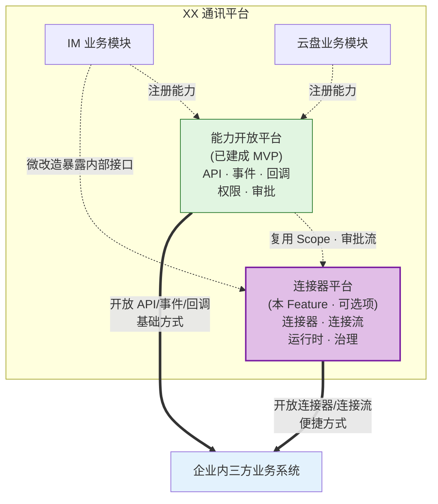
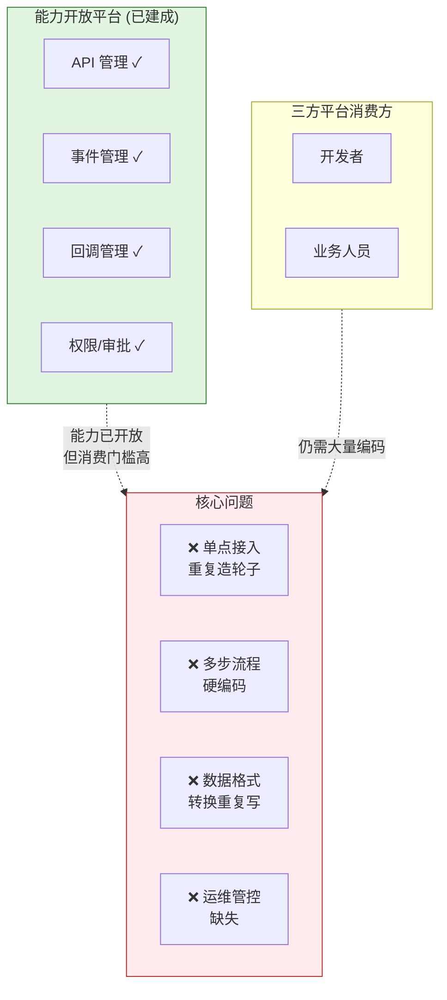
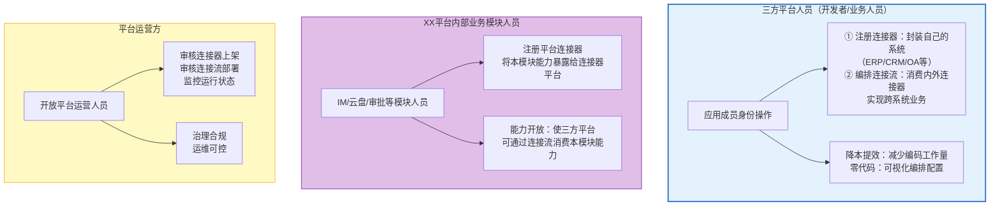
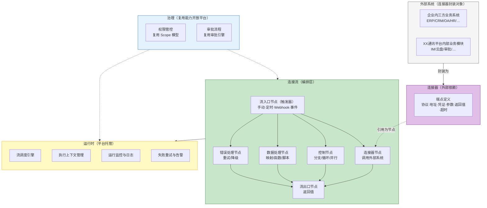
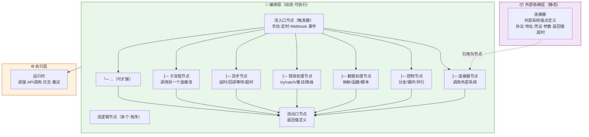
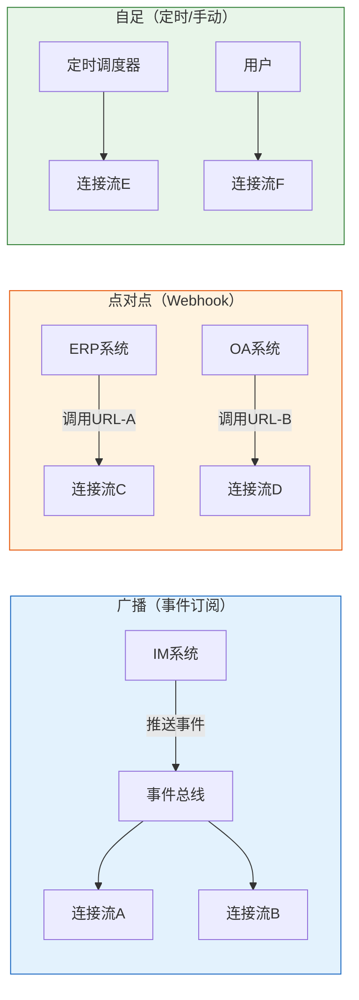
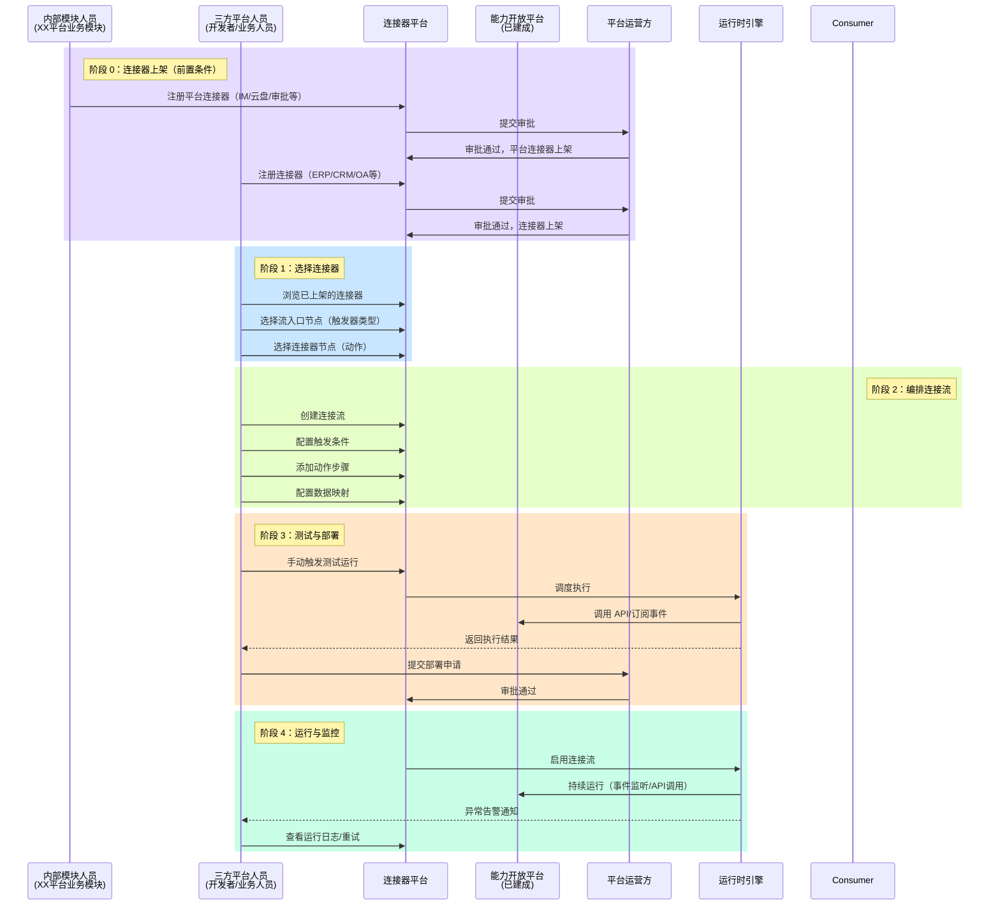
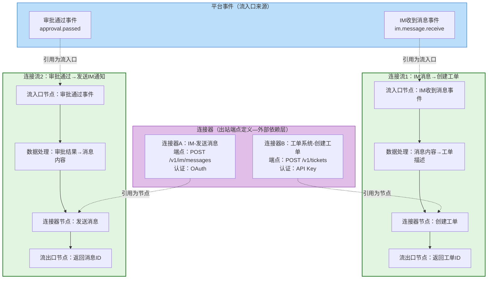
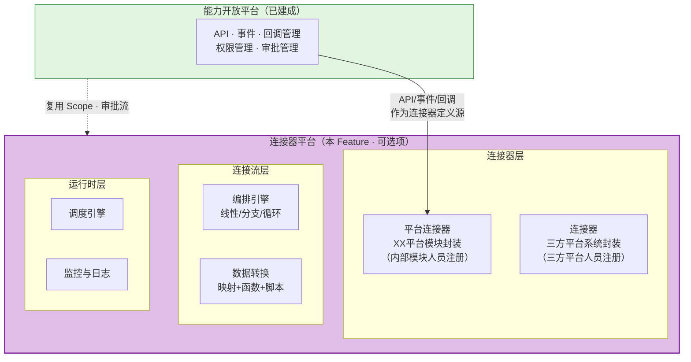

# 需求挖掘报告：连接器平台

**报告 ID**: DISCOVERY-CONN-001  
**创建时间**: 2026-05-14  
**最后更新**: 2026-05-19
**阶段**: 0.discovery（需求挖掘）  
**状态**: ✅ 已完成  
**会话 ID**: connector-session-001

---

## 一、执行摘要

### 1.1 核心定位

**连接器平台**是开放平台的组成部分，提供与 API、事件、回调**同级并列**的第四种开放形式。四种开放形式共同服务于同一目标：将 XX 通讯平台的能力开放给企业内三方平台使用。大多数场景是三方平台对接开放平台消费能力——连接器是**可选项/锦上添花**——没有连接器，三方平台也能通过 API/事件/回调达成目标；有了连接器，可以将三方平台原本需要大量人工编码的消费场景转化为**低代码/零代码配置**，使原有的开放更加便捷。

> 💡 **关系解读**：
> 1. **同级并列**：连接器与 API、事件、回调是同级并列的四种开放形式，共同服务于"连接XX通讯平台与三方平台"的目标
> 2. **可选项**：连接器是锦上添花——没有连接器也能通过 API/事件/回调达成目标，有了连接器使开放更便捷
> 3. **归属关系**：连接器平台是开放平台的组成部分，不内嵌于能力开放平台，但同属开放平台体系
> 4. **集成范围**：连接器平台仅对接与开放平台相关的业务系统：① 企业内三方业务系统（调用开放接口、提供回调/事件接口、监听事件处理业务）② XX通讯平台内部其它业务模块（微改造暴露内部接口等）
> 5. **复用关系**：复用能力开放平台的 Scope 权限模型和审批流引擎

### 1.2 核心问题

| 维度 | 描述 |
|------|------|
| **核心痛点** | 三方平台消费开放能力时编码成本高：每消费一个 API/事件/回调都要单独写代码处理鉴权、调用、编排等，无复用、无标准化 |
| **痛点细分** | ① 单点消费重复造轮子 ② 多步流程硬编码 ③ 数据格式转换重复写 ④ 运维管控缺失 |
| **不做后果** | 可接受但不够便捷 — 没有连接器三方平台也能通过 API/事件/回调消费能力达成目标，但仍需大量人工编码，接入效率无法进一步提升 |
| **现状** | 能力开放平台 MVP 已就绪（API/事件/回调/权限/审批），基本开放能力已具备，但三方平台消费开放能力时仍需大量人工编码 |
| **目标** | 构建连接器平台，作为 API/事件/回调同级并列的第四种开放形式，将三方平台消费能力时的人工编码场景转化为低代码/零代码配置，使原有开放更便捷 |

### 1.3 目标用户

| 角色 | 职责 | 诉求 |
|------|------|------|
| **三方平台人员**（开发者/业务人员） | 企业内三方平台的人员，通过应用成员身份操作：① 注册连接器（封装自己的系统，如 ERP/CRM/OA）② 编排连接流（消费平台连接器和自己的连接器实现业务） | **降本提效**：通过连接器封装减少编码工作量；**零代码**：通过可视化编排配置连接流，无需硬编码 |
| **XX平台内部业务模块人员** | XX通讯平台内部各业务模块（IM/云盘/审批等）的人员，注册平台连接器将自身能力暴露给连接器平台 | **能力开放**：将本模块 API/事件/回调封装为平台连接器，使三方平台可通过连接流消费 |
| **平台运营方** | 审核连接器上架、连接流部署，监控运行状态 | **治理**：复用审批流和权限模型，确保连接器合规运行 |

> 💡 **核心逻辑**：MVP 阶段三方平台人员和内部业务模块人员并重——只有**平台连接器**（内部模块能力）和**连接器**（三方平台系统）都上架后，三方平台人员才能编排**连接流**将内外连接起来产生新业务。内部业务模块人员的身份机制（是否需要注册应用等）待定。

---

## 二、问题空间分析

### 2.1 现状痛点

| 痛点维度 | 具体描述 |
|---------|---------|
| **单点消费重复造轮子** | 三方平台每消费一个开放能力（API/事件/回调），都要单独写代码处理鉴权、调用、错误重试等，没有可复用的封装 |
| **多步流程硬编码** | 三方平台需要串联多个开放能力完成业务流程时，缺乏编排工具，只能硬编码实现流程逻辑 |
| **数据格式转换重复写** | 三方平台消费开放能力后，需要将数据转换适配自身系统格式，每次都要写字段映射和转换逻辑 |
| **运维管控缺失** | 三方平台对接后的连接流缺少运行监控、重试、告警等运维能力，出问题只能人工排查 |

### 2.2 业务驱动

| 驱动因素 | 说明 |
|---------|------|
| **开放形式补全** | 连接器与 API、事件、回调同级并列，补全第四种开放形式，使开放更便捷 |
| **降本诉求** | 减少三方平台消费开放能力时的人工编码工作量 |
| **提效诉求** | 加速三方平台从"发现能力"到"能力落地运行"的端到端速度 |
| **低代码化** | 让业务人员（非开发者）也能配置跨系统流程，降低技术门槛 |
| **便捷增强** | 没有连接器也能通过 API/事件/回调达成目标，有了连接器使原有开放更便捷 |

### 2.3 不做会怎样

| 影响维度 | 后果 |
|---------|------|
| **业务影响** | 无实质影响 — 三方平台仍可通过 API/事件/回调消费能力达成目标，只是需要更多人工编码 |
| **效率影响** | 跨系统集成的场景仍需人工编码编排，无法通过低代码方式配置 |
| **体验影响** | 缺少便捷的连接流编排能力，业务人员无法自主配置跨系统流程 |
| **竞争影响** | 飞书AnyCross、钉钉连接流已提供便捷的编排能力，我们缺少对等体验 |

---

## 三、用户画像与场景

### 3.1 用户画像

> 💡 **核心用户**：三方平台人员是业务推广的核心用户——他们既注册连接器（封装自己的系统），也编排连接流（消费内外连接器实现业务）；内部模块人员是能力供给方——他们注册平台连接器使能力可被消费。只有平台连接器和连接器都上架后，连接流才能将内外连接起来产生新业务。

### 3.2 核心概念模型

> 💡 以下为基于旧模型的示意图，请以"核心概念分层"中定义的三层模型（外部依赖层→编排层→执行层）为准。

**核心概念分层**：

连接器平台的概念体系按"代码流程"类比组织为三层：**外部依赖层**（import 的模块/库）、**编排层**（函数体）、**执行层**（运行时环境）。

**表格一：我们的核心概念定义**

| 概念 | 层级 | 代码类比 | 本质 | 定义 | 包含 |
|------|------|---------|------|------|------|
| **连接器** | 外部依赖层 | import 的模块/库 | **外部系统的端点定义** | 声明一个流依赖的外部系统；封装调用该系统的完整技术信息（协议、地址、凭证、参数、返回值、超时等）；一个连接器对应一个**单一功能点**（如"发送消息"为一个连接器，"查询用户"为另一个连接器），不包含任何触发或编排逻辑 | 协议（HTTP/RPC/DB）、地址（URL/连接串）、认证方式（OAuth/API Key/Basic）、输入参数 Schema、输出返回值 Schema、超时时间、重试策略 |
| **连接流** | 编排层 | 一个完整的函数 | **可执行业务流程** | 由三个部分有向连接而成：一个流入口节点 + 多个流逻辑节点 + 一个可选的流出口节点 | 节点类型 + 节点间连线（顺序/条件/循环）+ 节点间参数映射规则 |
| ├─ 流入口节点 | 编排层 | 函数签名 + 参数 | **流程的启动条件**（即触发器） | 定义连接流在什么条件下开始执行；独立于任何连接器存在，是一个流有且仅有一个的起点；与流出口节点对称，构成流的边界 | 手动触发（用户点击）、定时触发（Cron 表达式）、Webhook 触发（HTTP 请求回调）、事件触发（平台事件订阅） |
| ├─ 流逻辑节点 | 编排层 | 函数体里的语句 | **流程的中间处理步骤** | 按业务逻辑编排的多个节点，每个节点执行一个单一明确的动作；节点间通过连线定义执行顺序 | 见下方子类型↓ |
| │ ├─ 连接器节点 | 流逻辑子类 | 调用外部函数 | **调用外部系统** | 引用某个连接器，传入输入参数，拿到输出返回值 | 引用连接器 + 输入参数映射 + 输出结果提取 |
| │ ├─ 控制节点 | 流逻辑子类 | if/for/switch/forkJoin | **变更执行路径** | 改变流程执行走向：分支（if/else/switch）、循环（for/while）、并行（fork/join）、聚合（join/merge） | 分支条件定义、循环次数/条件、并行分支数、聚合策略 |
| │ ├─ 数据处理节点 | 流逻辑子类 | map/filter/reduce | **数据加工** | 在节点间对数据进行格式转换和运算；通过配置完成无需编码 | 字段映射、内置函数（字符串/日期/数学/数组/逻辑）、条件过滤 |
| │ ├─ 错误处理节点 | 流逻辑子类 | try/catch/finally | **异常捕获与恢复** | 包装一段节点序列，当其中任一节点失败时触发捕获逻辑；支持重试、降级、跳过、告警等恢复策略 | 捕获范围（节点序列）、重试次数/间隔、降级返回值、降级动作、告警通知 |
| │ ├─ 异步节点 | 流逻辑子类 | setTimeout / Promise / await | **非同步执行控制** | 改变执行的时间维度：延时等待（sleep/wait）、等待外部回调（await callback）、超时控制（timeout） | 延时时长（秒/分/时）、等待条件（回调/条件满足）、超时时间、超时处理 |
| │ ├─ 子流程节点 | 流逻辑子类 | 函数调用 | **复用已有流程** | 引用另一个已定义的连接流，将其作为当前流的一个步骤执行；支持传入输入参数和获取返回值 | 引用的子流程、出入参数映射、执行模式（同步/异步） |
| │ └─ ... | 流逻辑子类 | — | 可扩展 | 随业务需要增加新的逻辑节点类型 | — |
| └─ 流出口节点 | 编排层 | return 语句 | **流程的结束定义** | 定义连接流执行完毕后如何返回结果；可选（无出口为 fire-and-forget） | 返回值字段定义、数据格式 |
| **运行时** | 执行层 | CPU / 虚拟机 | **流程执行引擎** | 平台托管的执行环境，负责解析连接流、调度执行每个节点、管理执行上下文、记录运行日志、处理失败重试 | 调度引擎、执行上下文隔离、运行日志、自动重试 |

> 💡 **为什么这样设计**：用代码流程类比是为了消除概念重叠。**连接器 = import 的库**（声明依赖，不执行）、**编排层 = 函数体**（入口→语句→出口）、**运行时 = 虚拟机**（落地执行）。入口（触发器）和出口（返回值）都在编排层，对称构成流的边界，解释一个流"怎么进、怎么处理、怎么出"。

**表格二：各竞品核心概念对照**

| 我们的概念 | 层级 | 我们的做法 | Zapier | Make | 钉钉 | 集简云 |
|-----------|------|----------|--------|------|------|--------|
| **连接器** | 外部依赖层 | 单一功能点，纯出站，声明流依赖的外部系统 | App 的 Action / Search | App 的 Action / Search | 连接器的"动作"部分 | 动作 |
| **流入口节点（触发器）** | 编排层 | 流的入口边界，独立概念，不属于连接器 | App 内置的 Trigger + 独立 Schedule | App 内置的 Trigger + 独立调度 | 连接器内置触发器 + 独立定时/手动 | 触发器 + 独立定时 |
| **连接流** | 编排层 | 入口 + 逻辑节点 + 出口 | Zap | Scenario | 连接流 | 数据流程 |
| **连接器节点** | 流逻辑子类 | 引用连接器，传入参数取回结果 | Zap 中的 Action 步骤 | Scenario 中的 Action 模块 | 连接流中的动作 | 数据流程中的动作 |
| **控制节点** | 流逻辑子类 | 独立节点类型 | Paths（有限） | Router + Iterator + Aggregator | 条件判断（简单） | 条件判断 + 循环 |
| **数据处理节点** | 流逻辑子类 | 独立节点类型 | Formatter | 300+ 内置函数 | 字段映射 | 字段映射 + 转换 |
| **错误处理节点** | 流逻辑子类 | 独有设计，明确节点化 | ❌ 无（仅单步重试） | Error Handler（模块级） | ❌ 无 | ❌ 无 |
| **异步节点** | 流逻辑子类 | 包装延时/回调等待/超时 | Delay 步骤 | Sleep 模块 + Webhook 模块 | ❌ 无 | 延时（有限） |
| **子流程节点** | 流逻辑子类 | 引用另一连接流作为一步 | ❌ 无 | ❌ 无 | ❌ 无 | ❌ 无 |
| **流出口节点** | 编排层 | 流的出口边界，返回值定义 | ❌ 无独立概念 | ❌ 无独立概念 | ❌ 无 | ❌ 无 |
| **运行时** | 执行层 | 平台托管 | 平台托管 | 平台托管 | 平台托管 | 平台托管 |

> 💡 **与竞品的关键差异**：① 连接器简化为单一功能点（纯出站），不入站，不内置触发器；② 触发器独立为流入口节点，与流出口节点对称构成流的边界；③ 与竞品最大区别：我们显式定义了"流出口节点"概念——竞品通常只编排不返回，我们认为定义返回值是流的完整职责之一；④ 我们将错误处理、异步、子流程等设计为**第一等公民的节点类型**，而非附着在模块上的次级配置——这使得编排模型更接近代码逻辑，表达力更强。**编排层 = 入口 + 体部 + 出口**，体部由6种基础节点类型组成，覆盖绝大多数业务流程场景。

### 3.3 典型场景

| 场景编号 | 场景名称 | 触发器 | 动作 | 编排复杂度 | 用户角色 |
|---------|---------|--------|------|-----------|---------|
| **S1** | IM消息→客服工单 | IM 消息事件 | 调用工单系统 API 创建工单 | 线性 | 业务人员 |
| **S2** | 审批→ERP→CRM同步 | 审批通过回调 | ① ERP 写入 ② CRM 更新 | 分支+并行 | 开发者 |
| **S3** | 入职自动化 | 定时查询新员工 | ① 拉群 ② 分配权限 ③ 推送欢迎消息 | 线性+循环 | 业务人员 |
| **S4** | 会议→云盘→IM联动 | 会议结束事件 | ① 上传录音到云盘 ② 发送总结到群 | 线性 | 业务人员 |

### 3.4 流入口节点类型

连接流的起点称为**流入口节点**（即触发器），决定了流在什么条件下开始执行。不同触发类型的区别：

| 类型 | 驱动模式 | 需外部系统配合 | 一次触发驱动的连接流数 |
|---------|---------|----------------|----------------|
| 事件订阅 | 广播 | 是（系统推送事件到事件总线） | 多条（所有订阅该事件的流） |
| Webhook | 点对点 | 是（外部调用Webhook URL） | 一条（URL对应的流） |
| 定时 | 独立 | 否（平台定时器自驱） | 一条 |
| 手动 | 独立 | 否（用户主动操作） | 一条 |

三种驱动模式示意：

#### 3.4.4 流入口节点类型对照

| 类型 | 驱动模式 | 是否需外部系统配合 | 一次触发驱动几条流 |
|---------|---------|----------------|----------------|
| 事件订阅 | 广播 | 是（系统推送事件到事件总线） | 多条（所有订阅该事件的流） |
| Webhook | 点对点 | 是（调用方请求Webhook URL） | 一条（URL对应的流） |
| 定时 | 独立 | 否（平台定时器自驱） | 一条 |
| 手动 | 独立 | 否（用户主动操作） | 一条 |

> 💡 **归属说明**：在新概念模型中，所有触发器类型（事件/Webhook/定时/手动）均归**流平台**管理，不属于连接器。其中事件和 Webhook 触发需要外部系统配合（推送事件/调用 URL），定时和手动触发由平台自身独立完成。详见 3.2 核心概念分层。 |

> 💡 **SSE/WebSocket**：7家竞品无一家支持SSE触发器；仅钉钉支持WebSocket触发器（Stream模式），本质是事件推送的传输通道（替代HTTP回调，解决内网系统无公网IP的问题），不是新的触发器类型。SSE不纳入，WebSocket与能力开放平台事件订阅模式对齐。

### 3.5 用户旅程地图

---

## 四、需求分层与优先级

### 4.1 需求分层

```mermaid
graph LR
    subgraph Must_Have[必备需求 - MVP 核心]
        M1[平台连接器+连接器]
        M2[连接器生命周期管理]
        M3[连接流线性编排]
        M4[连接流生命周期管理]
        M5[平台托管运行时]
        M6[运行监控与日志]
        M7[基础数据转换]
    end
    
    subgraph Should_Have[期望需求 - 完整编排]
        S1[条件分支+并行]
        S2[循环+迭代]
        S3[子流程+错误处理]
        S4[可视化拖拽编排]
        S5[函数库+脚本转换]
        S6[连接器开发 SDK]
    end
    
    subgraph Could_Have[惊喜需求 - 生态扩展]
        C1[连接器市场与发现]
        C2[连接器开放发布]
        C3[AI辅助编排]
        C4[模板库]
    end
    
    Must_Have -.-> Should_Have -.-> Could_Have
    
    style Must_Have fill:#e1f5e1,stroke:#2e7d32,stroke-width:2px
    style Should_Have fill:#fff3cd,stroke:#f57c00,stroke-width:2px
    style Could_Have fill:#f3e5f5,stroke:#7b1fa2,stroke-width:2px
```

### 4.2 需求清单

#### Must Have（必备 — MVP）

**连接器层**：

| 需求编号 | 需求描述 | 核心本质 | 验收标准 |
|---------|---------|---------|---------|
| **MH-01** | **平台连接器 + 连接器** | 单一功能点的外部系统端点定义 | 平台连接器：对能力开放平台单个 API/事件的封装（如"发送消息"为一个连接器），由内部模块人员注册；连接器：对三方平台系统单个功能的封装（如"创建工单"为一个连接器），由三方平台人员注册；消费方作为连接器节点引用使用 |
| **MH-02** | **连接器生命周期管理** | 连接器的注册、发布、版本、下架 | 支持连接器的注册/编辑/发布/下架/版本管理；发布时复用能力开放平台审批流程 |

**连接流层**：

| 需求编号 | 需求描述 | 核心本质 | 验收标准 |
|---------|---------|---------|---------|
| **MH-03** | **连接流线性编排** | 流入口节点→连接器节点的线性序列 | 支持流入口节点（触发器）→连接器节点1→连接器节点2→…的线性编排；支持手动/定时/Webhook/事件四种流入口触发方式 |
| **MH-04** | **连接流生命周期管理** | 连接流的创建、编辑、启停、版本 | 支持连接流的创建/编辑/启停/版本管理；部署时复用能力开放平台审批流程 |
| **MH-05** | **基础数据转换** | 字段级别的映射 | 支持源字段→目标字段的简单映射配置 |

**运行时层**：

| 需求编号 | 需求描述 | 核心本质 | 验收标准 |
|---------|---------|---------|---------|
| **MH-06** | **平台托管运行时** | 连接流在平台服务端运行 | 连接流在平台侧调度执行，消费方无需部署运行时；支持资源配额与隔离 |
| **MH-07** | **运行监控与日志** | 运行状态可视化和问题排查 | 支持查看连接流运行状态/执行历史/失败日志；支持失败重试 |

#### Should Have（期望 — V1）

**编排增强**：

| 需求编号 | 需求描述 | 验收标准 |
|---------|---------|---------|
| **SH-01** | **条件分支+并行** | 支持 if/else 条件分支、并行执行多步骤 |
| **SH-02** | **循环+迭代** | 支持 for 循环、遍历数组、批量处理 |
| **SH-03** | **子流程+错误处理** | 支持子流程调用、try/catch 错误处理、重试策略配置 |

**交互增强**：

| 需求编号 | 需求描述 | 验收标准 |
|---------|---------|---------|
| **SH-04** | **可视化拖拽编排** | 支持拖拽式可视化编排器，与代码模式可互转 |
| **SH-05** | **函数库+脚本转换** | 内置字符串/日期/数学等转换函数；支持自定义 JS 脚本 |

**开发者生态**：

| 需求编号 | 需求描述 | 验收标准 |
|---------|---------|---------|
| **SH-06** | **连接器开发 SDK** | 提供 SDK/框架，开发者可构建连接器 |

#### Could Have（惊喜 — V2）

| 需求编号 | 需求描述 | 验收标准 |
|---------|---------|---------|
| **CH-01** | **连接器市场与发现** | 统一门户展示连接器目录；支持搜索、评价、模板 |
| **CH-02** | **连接器开放发布** | 支持 ISV/开发者发布连接器，经审核后上架 |
| **CH-03** | **AI 辅助编排** | 通过 AI 辅助生成连接流配置或连接器封装 |
| **CH-04** | **模板库** | 提供常见场景的连接流模板，一键创建 |

---

## 五、核心流程设计

### 5.1 连接器平台使用全流程

从消费方视角展示从发现连接器到连接流运行的完整流程。

### 5.2 连接器与连接流的关系

> 💡 **核心逻辑**：连接器是出站端点定义（调用外部系统），不包含事件监听。事件监听来自**平台事件总线**，作为流入口节点的触发源。连接流 = 平台事件（流入口）+ 连接器节点（出站调用）+ 流出口（返回值）。一个连接器可被多个连接流引用。

### 5.3 集成方向与消费形式

连接器平台仅对接与开放平台相关的业务系统，分为两类：

**对接系统分类**：

| 系统类型 | 描述 | 连接器类型 | 谁注册 | 连接器角色 |
|---------|------|-----------|--------|-----------|
| **企业内三方业务系统** | XX通讯平台外部的企业内部系统 | 连接器 | 三方平台人员 | 调用开放接口、提供回调接口、提供事件接口、监听事件处理业务 |
| **XX通讯平台内部其它业务模块** | XX通讯平台内但未通过能力开放平台注册的模块 | 平台连接器 | 内部业务模块人员（身份机制待定） | 对内部接口进行微改造后暴露，通过连接器编排实现能力开放 |

**集成方向**：

| 集成方向 | 触发方式 | 典型场景 |
|---------|---------|---------|
| **XX平台→三方系统** | 事件触发 | IM消息→ERP创建工单、审批通过→CRM更新 |
| **三方系统→XX平台** | Webhook触发 | ERP数据变更→XX平台同步、外部事件→XX平台动作 |
| **XX内部模块→三方系统** | 事件/API触发 | 内部业务模块微改造接口→通过连接器暴露给三方系统 |

| 触发方式 | 描述 | 适用场景 |
|---------|------|---------|
| **事件触发** | 订阅能力开放平台事件，事件发生时自动执行 | 实时响应XX平台状态变更 |
| **Webhook触发** | 外部系统调用Webhook地址触发 | 外部系统主动推送数据 |
| **定时触发** | Cron表达式定时执行 | 定期数据同步、报表生成 |
| **手动触发** | 用户点击"立即执行" | 一次性数据迁移、手动重跑 |

### 5.4 与能力开放平台的协作关系

| 维度 | 关系说明 |
|------|---------|
| **同级并列** | 连接器与 API、事件、回调是同级并列的四种开放形式，共同服务于连接XX通讯平台与三方平台的目标；连接器是可选项，使原有开放更便捷 |
| **归属关系** | 连接器平台是开放平台的组成部分，不内嵌于能力开放平台，但同属开放平台体系 |
| **集成范围** | 仅对接与开放平台相关的业务系统：① 企业内三方业务系统 ② XX通讯平台内部其它业务模块 |
| **权限复用** | 复用 Scope 模型，连接器调用通过 Scope 管控 |
| **审批复用** | 复用审批流引擎，连接器上架/流部署走统一审批 |
| **架构预留** | 能力开放平台 FR-003、NFR-016 已预留资源类型扩展点 |

---

## 六、竞品对标

> 基于已有的 16 份竞品调研报告（`docs/software-connector-platform-research/` 12 份 + `docs/connector-platform-research/` 4 份），从三类竞品中提炼对连接器平台的核心启示。

### 6.1 竞品分类与对标定位

我们的连接器平台属于**内聚型集成平台**（以自身产品为中心），与以下三类竞品的定位有本质区别：

| 竞品类别 | 代表产品 | 核心特征 | 与我们的关系 |
|---------|---------|---------|------------|
| **内聚型平台** | 飞书、钉钉、企业微信 | 以自身 IM/协作为中心，集成是增值能力 | ⭐ 直接对标，同类竞品 |
| **国内 iPaaS** | 集简云、数环通、腾讯轻联 | 中立枢纽，连接一切，国内 SaaS 深度覆盖 | 边界参照，我们不与其竞争 |
| **国际 iPaaS** | Zapier、Make、Power Automate 等 | 全球 SaaS 生态，复杂编排，企业级治理 | 能力参照，学习最佳实践 |

### 6.2 内聚型平台对标（直接竞品）

与飞书、钉钉、企业微信三大企业 IM 平台的连接器能力对标：

| 对标维度 | 飞书做法 | 钉钉做法 | 企业微信做法 | 我们的策略 |
|---------|---------|---------|------------|-----------|
| **连接器定义** | 不封装连接器，API 直接开放 | 连接器=单一功能点（纯出站端点定义） | 不封装连接器，API+回调+Webhook 组合 | ✅ 采用简化模式：连接器=单一功能点，不包含触发器 |
| **编排能力** | 轻量自动化规则，仅 API+事件 | 连接流可视化编排 | 无内置流程编排，需第三方补齐 | ✅ 双模式：简单可视化+复杂代码 |
| **数据转换** | 无独立能力，SDK 处理 | 基础字段映射 | 无独立能力，需自建 ETL | ✅ 字段映射+函数+脚本 |
| **触发方式** | 事件+Webhook | 事件(Stream+HTTP)+Webhook+定时 | 事件回调+Webhook | ✅ 事件/Webhook/定时/手动四种 |
| **运行环境** | 平台侧托管 | 平台侧托管 | 需自建运行时 | ✅ 平台托管运行 |
| **生态策略** | 不建连接器市场，ISV 应用市场 | 50+预置+自定义，ISV 生态成熟 | 第三方应用市场+代开发 | ✅ 预置优先，后续开放自定义 |
| **微信生态** | ❌ | ❌ | ✅ 客户联系+微信客服（独有优势） | ⚠️ 不涉及，非我们的定位 |

> 💡 **核心结论**：三家中钉钉的连接器模式与我们最接近——显式的"连接器+连接流"双概念、可视化编排、平台托管运行。飞书和企业微信走的是"API 直接开放"路线，不封装连接器。我们选择钉钉模式，是因为封装连接器+编排连接流能更好地服务低代码用户。

### 6.3 国内 iPaaS 对标（边界参照）

国内 iPaaS 平台是我们**明确的非竞争对象**，但需要理解其能力边界作为参照：

| 对标维度 | 集简云 | 数环通 | 腾讯轻联 | 我们的边界 |
|---------|-------|--------|---------|----------|
| **核心定位** | 国产 iPaaS 头部 | 国产 iPaaS+数据集成 | 腾讯生态 iPaaS | 内聚型平台，仅编排 XX 平台能力 |
| **连接器数量** | 400+（60%国内应用） | 500+ | 300+ | 仅封装 XX 平台相关系统 |
| **国内 SaaS 覆盖** | 最深（金蝶/用友/泛微等） | 深 | 企微+腾讯生态 | 不做通用 SaaS 对接 |
| **编排能力** | 条件+延迟+子流程 | JS 脚本+条件+迭代 | 条件分支 | MVP 线性，后续迭代 |
| **定价** | ¥298/月起 | ¥298/月起 | 腾讯云内 | 随开放平台，无额外费用 |
| **信创** | ✅ | ✅ | ✅ | 跟随平台策略 |

> 💡 **边界确认**：我们聚焦"XX 平台能力编排"，不做通用 iPaaS。当企业需要对接通用 SaaS（如金蝶/用友/Salesforce）时，应推荐使用集简云/数环通等国内 iPaaS，而非自建。

### 6.4 国际 iPaaS 能力参照（最佳实践）

从国际 iPaaS 领导者中提取可借鉴的成熟实践：

| 参照维度 | Zapier | Make | Power Automate | 可借鉴实践 |
|---------|--------|------|---------------|----------|
| **连接器设计** | 触发器+动作+认证标准化 | 触发器+动作+函数+迭代器 | 触发器+动作+AI Copilot | ✅ 连接器=单一功能点（端点+认证+参数Schema），不含触发器 |
| **编排深度** | Paths 条件分支 | Router 多路由+迭代器+聚合器 | 条件+并行+子流+RPA | ✅ 分步迭代：MVP 线性→V1 分支/循环/子流程 |
| **数据转换** | Formatter 15+操作 | 300+函数库+自定义函数 | 表达式+JS/C# 脚本 | ✅ 分层：字段映射→函数库→自定义脚本 |
| **AI 赋能** | Copilot（有限） | ❌ | Copilot（深度，AI 辅助编排） | ⚠️ V2 阶段考虑 AI 辅助编排 |
| **模板生态** | 5000+ 预置模板 | 社区模板共享 | 模板库+社区 | ✅ V2 阶段建设模板库 |
| **调试体验** | 运行历史 | 历史记录回放 | 运行历史+断点 | ✅ 运行日志+执行历史 |

### 6.5 核心竞品启示

| 启示 | 来源 | 我们的策略 |
|------|------|-----------|
| **能力开放 > 连接器封装** | 飞书/企业微信 | API/事件/回调是基础，连接器是同级并列的可选项，使开放更便捷 |
| **连接器需可编排才有价值** | 钉钉 | 连接器+连接流双概念，缺一不可 |
| **不自建通用 iPaaS** | 综合调研 | 不与 Zapier/Make/集简云竞争，聚焦 XX 平台能力编排 |
| **分步迭代降低风险** | 行业最佳实践 | MVP 线性编排先行，后续迭代复杂编排 |
| **双模式服务不同用户** | Make/钉钉 | 可视化面向业务人员，代码面向开发者 |
| **企业微信的"无编排"反例** | 企业微信 | 缺乏流程编排引擎是核心短板，用户被迫依赖第三方补齐——印证编排能力的必要性 |
| **国内 SaaS 对接交给 iPaaS** | 集简云/数环通 | 通用 SaaS 集成不是我们的职责，推荐用户使用国内 iPaaS 补齐 |
| **AI 辅助编排是趋势** | Power Automate | Copilot 模式值得关注，但 MVP 阶段不引入，V2 规划 |

---

## 七、成功标准

**核心目标**: 
1. ✅ **业务人员能自主配置连接流** — 不依赖开发人员即可完成跨系统流程配置
2. ✅ **平台连接器被实际消费** — 有三方平台通过平台连接器完成实际业务集成

### 7.1 定性指标

| 维度 | 成功标准 | 对应核心目标 |
|------|---------|-------------|
| **低代码化** | 业务人员能独立创建并运行连接流，无需开发介入 | 业务人员能自主配置 |
| **平台连接器可用** | 至少 3 个平台连接器被三方平台实际使用 | 平台连接器被实际消费 |
| **接入提效** | 原本需人工编码 1 周的集成场景，用连接器可在 1 天内完成 | 接入效率显著提升 |
| **运维可控** | 连接流运行状态可监控，失败可重试，异常有告警 | 运行可靠性 |

### 7.2 定量指标（系统提供度量能力）

| 指标类型 | 具体的指标 | 对应核心目标 |
|---------|-----------|-------------|
| **规模指标** | 平台连接器数量、连接器数量 | 平台连接器被实际消费 |
| **使用指标** | 活跃连接流数量、业务人员创建的连接流占比 | 业务人员能自主配置 |
| **效率指标** | 连接流从创建到上线的时间 | 接入提效 |
| **可靠性指标** | 连接流运行成功率、平均重试次数 | 运行可靠性 |

> ⚠️ **注意**: 具体目标值取决于业务运营推广的投入力度，系统首先需要具备度量能力。

---

## 八、风险与假设

### 8.1 关键假设

| 假设 | 风险等级 | 验证方式 |
|------|---------|---------|
| 能力开放平台的 API/事件/回调足够稳定，可作为连接流中连接器节点的调用目标 | 低 | 已有 MVP 验证 |
| 业务人员愿意使用低代码编排工具 | 中 | MVP 上线后观察使用数据 |
| 开发者愿意基于 SDK 开发连接器 | 中 | V2 阶段开发者社区运营 |
| 平台托管运行时能满足性能和可靠性要求 | 中 | 需性能测试验证 |
| 复用 Scope 权限模型足以覆盖连接器调用鉴权需求 | 低 | 与能力开放平台团队确认 |

### 8.2 潜在风险

| 风险 | 影响 | 缓解措施 |
|------|------|---------|
| 编排引擎技术复杂度高，可能超工期 | 高 | 分步迭代：MVP 先做线性编排，降低首版复杂度 |
| 可视化拖拽编排前端实现复杂 | 高 | MVP 用表单配置替代拖拽，V1 再加拖拽 |
| 运行时可靠性（资源隔离/性能/容错） | 高 | 设计执行沙箱，限制单流资源配额，完善重试机制 |
| 与能力开放平台协作接口的边界与契约 | 中 | 明确接口契约，做好集成测试 |

---

## 九、范围边界

### 9.1 版本规划

| 版本 | 范围 | 核心价值 |
|------|------|---------|
| **MVP** | 平台连接器 + 连接器 + 线性编排 + 平台托管运行 + 运行监控 + 基础数据映射 | 验证"零代码配置连接流"核心价值 |
| **V1** | 完整编排（分支/循环/子流程）+ 可视化拖拽 + 函数库+脚本 + 连接器 SDK | 满足复杂场景，开放开发者生态 |
| **V2** | 连接器市场 + 连接器开放发布 + AI辅助编排 + 模板库 | 构建连接器生态 |

### 9.2 明确不做

| 范围 | 原因 |
|------|------|
| 计费系统 | 企业内使用，无需计费 |
| 多租户/跨企业 | 仅限企业内部系统 |
| 通用 iPaaS 能力 | 不与 Zapier/Make/集简云竞争 |
| 替代现有应用管理/成员管理 | 沿用现有系统 |

---

## 十、Feature 拆分建议

### 10.1 拆分方案

连接器平台按**前后端分离**模式拆分为两个子 Feature：

| 子 Feature | 范围 | 核心模块 |
|-----------|------|---------|
| **connector-platform-serve** | 后端服务 | 连接器引擎 + 流编排引擎 + 运行时 + 连接器 SDK |
| **connector-platform-web** | 前端界面 | 可视化编排器 + 管理界面 + 运行监控面板 |

### 10.2 拆分理由

1. **技术栈差异**：后端（Java/Spring）与前端（React/TypeScript）技术栈不同，并行开发效率更高
2. **职责清晰**：后端聚焦编排引擎和运行时，前端聚焦交互体验
3. **风险隔离**：可视化编排前端是主要风险点，独立可降低对后端开发节奏的影响
4. **与现有架构一致**：open-app 项目已有 open-server/open-web 的前后端分离模式

---

## 十一、下一步建议

### 11.1 进入规范编写阶段

运行 `@sddu-spec 连接器平台` 进入规范编写阶段，产出：
- 详细功能需求（FR）
- 非功能需求（NFR）
- 边界情况（EC）
- 技术设计（接口/页面/数据库清单）
- 子 Feature 规划

### 11.2 需要进一步确认的事项

| 事项 | 说明 |
|------|------|
| **平台连接器范围** | MVP 阶段具体需要封装哪些 XX 平台能力（IM/云盘/审批/…） |
| **内部业务模块人员身份机制** | 内部模块人员以什么身份注册平台连接器？是否需要注册应用？还是另有机制（如内部白名单、分组责任人延伸等）？ |
| **运行时技术选型** | 流编排引擎的技术方案（自研 vs 开源） |
| **可视化编排交互** | 表单配置 vs 拖拽编排的 MVP 交互方案 |
| **与能力开放平台接口契约** | 连接器平台消费 API/事件/回调的具体接口规范 |

---

## 附录

### A. 会话记录

完整对话记录见：`.sddu/specs-tree-root/specs-tree-connector-platform/discovery-session-log.md`

### B. 分析笔记

分析总结见：`.sddu/specs-tree-root/specs-tree-connector-platform/discovery-analysis.md`

### C. 参考资料

- 能力开放平台规范：`specs-tree-capability-open-platform/spec.md`
- 能力开放平台需求挖掘报告：`specs-tree-capability-open-platform/discovery-report.md`
- 软件连接器平台汇总对比调研报告：`docs/software-connector-platform-research/软件连接器平台汇总对比调研报告.md`
- 飞书集成平台调研报告：`docs/software-connector-platform-research/飞书集成平台调研报告.md`
- 钉钉连接平台调研报告：`docs/software-connector-platform-research/钉钉连接平台调研报告.md`
- 企业微信连接器平台调研报告：`docs/connector-platform-research/企业微信连接器平台调研报告.md`
- 连接器平台对比调研汇总报告：`docs/connector-platform-research/连接器平台对比调研汇总报告.md`
- 集简云连接器平台调研报告：`docs/software-connector-platform-research/集简云连接器平台调研报告.md`
- Power-Automate连接器平台调研报告：`docs/software-connector-platform-research/Power-Automate连接器平台调研报告.md`
- Zapier连接器平台调研报告：`docs/software-connector-platform-research/Zapier连接器平台调研报告.md`

---

**报告状态**: ✅ 需求挖掘完成  
**下一步**: 运行 `@sddu-spec 连接器平台` 开始规范编写

---

## 修订记录

| 版本 | 日期 | 修订内容 | 修订人 |
|------|------|---------|--------|
| v1.0 | 2026-05-14 | 初始版本 — 完成连接器平台需求挖掘报告 | AI Assistant |
| v1.1 | 2026-05-14 | 修正定位：连接器是开放平台组成部分，仅对接与开放平台相关的业务系统 | AI Assistant |
| v1.2 | 2026-05-14 | 核心定位重构：连接器与API/事件/回调同级并列，是可选项/锦上添花，没有也能达成目标，有了更便捷；不做后果从"非常严重"降级 | AI Assistant |
| v1.3 | 2026-05-14 | 视角修正：痛点从"对接外部系统"改为"三方平台消费开放能力"，明确大多数场景是三方平台对接开放平台 | AI Assistant |
| v1.4 | 2026-05-15 | 治理概念修正：复用的只有权限模型（Scope）和审批流引擎，生命周期管理是连接器平台自有；修正 mermaid 兼容性 | AI Assistant |
| v1.5 | 2026-05-15 | 术语统一：全文"集成流"统一为"连接流"，消除同一概念的两种叫法 | AI Assistant |
| v1.6 | 2026-05-15 | 5.2示例图优化：增加第二条连接流（审批通过→发送IM通知），连接器A被两条流复用，消除连接器C孤立节点 | AI Assistant |
| v1.7 | 2026-05-15 | 竞品对标扩充：从3家扩充到9家（增加企业微信/集简云/数环通/腾讯轻联/Power Automate/Zapier），新增竞品分类定位、国内iPaaS边界参照、国际iPaaS最佳实践三个维度，核心启示从5条增至8条 | AI Assistant |
| v1.8 | 2026-05-15 | 3.2核心概念模型图：增加外部系统（企业内三方平台+XX内部业务模块），体现连接器的封装对象 | AI Assistant |
| v1.9 | 2026-05-15 | 概念对照表新增触发器/动作独立定义：触发器=感知（入站），动作=执行（出站） | AI Assistant |
| v2.0 | 2026-05-15 | 触发器归属修正：定时/手动触发归为流平台自身，事件/Webhook触发属于连接器；概念模型图连接流增加流触发器节点；与业界主流做法（钉钉/飞书/Power Automate等5家）对齐 | AI Assistant |
| v2.1 | 2026-05-15 | 概念模型图修正：流触发器移出连接流独立展示，连接器触发器和流触发器并列作为连接流的两种触发来源 | AI Assistant |
| v2.2 | 2026-05-15 | 新增3.4触发机制：事件广播/Webhook点对点/定时手动独立，配图+对照表 | AI Assistant |
| v3.0 | 2026-05-18 | 角色与术语重构：① 1.3目标用户表重构为三方平台人员/内部业务模块人员/平台运营方，合并开发者与业务人员，补入内部模块人员；② 3.1用户画像图同步重构；③ 5.1全流程时序图新增"阶段0：连接器上架"，体现内外连接器双来源前置条件；④ 5.3系统分类表增加"连接器类型"和"谁注册"列；⑤ 5.4协作关系图连接器层重命名；⑥ 全文术语统一：预置连接器→平台连接器，自定义连接器→连接器；⑦ 新增待定开放问题：内部业务模块人员身份机制 | AI Assistant |
| v3.1 | 2026-05-19 | 核心概念重构（3.2节）：① 建立"外部依赖层→编排层→执行层"三层架构；② 连接器重构为单一功能点（纯出站端点定义），类比为 import 的模块/库；③ 触发器从外部依赖层移至编排层，作为流入口节点，与流出口节点对称构成流的边界；④ 编排层抽象为流逻辑节点体系，补全 6 种基础节点类型：连接器/控制/数据处理/错误处理/异步/子流程，以代码流程类比消除编排黑盒；⑤ 新增竞品对照表（Zapier/Make/钉钉/集简云逐项对比）；⑥ 新增三层概念拓扑图；⑦ 全文同步更新：3.2旧概念图/5.2关系图/3.4触发归属/4.2需求/5.1时序图/6.2对标/6.4参照/8.1假设等全面对齐新模型 | AI Assistant |

---

**最后更新**: 2026-05-19
