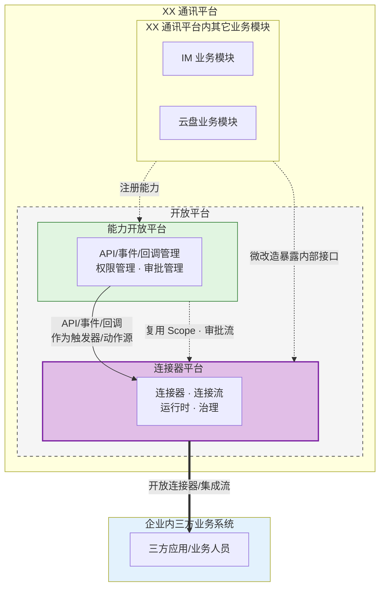
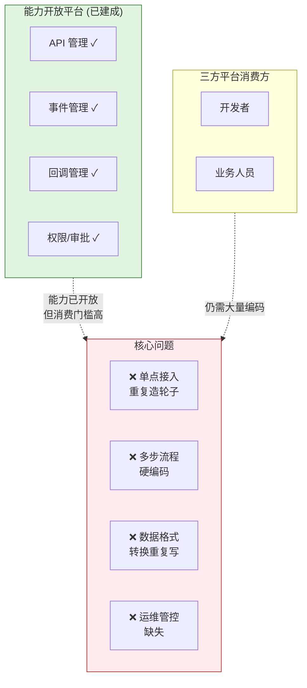
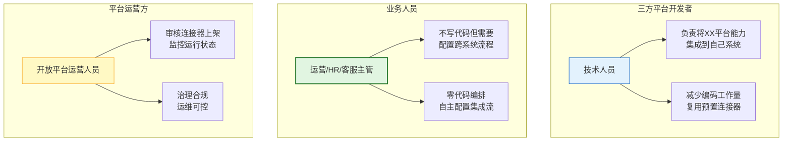
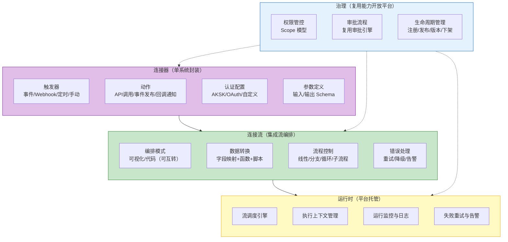
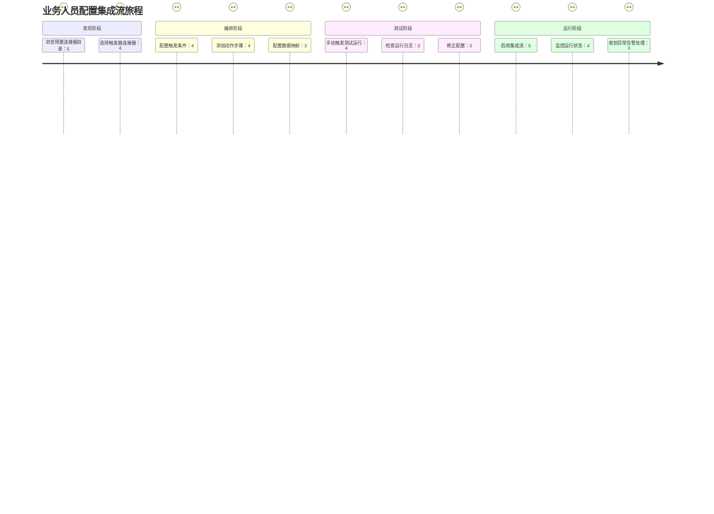
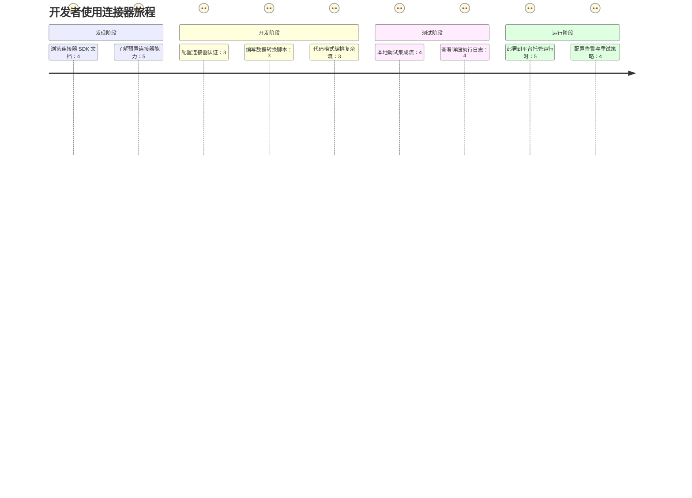
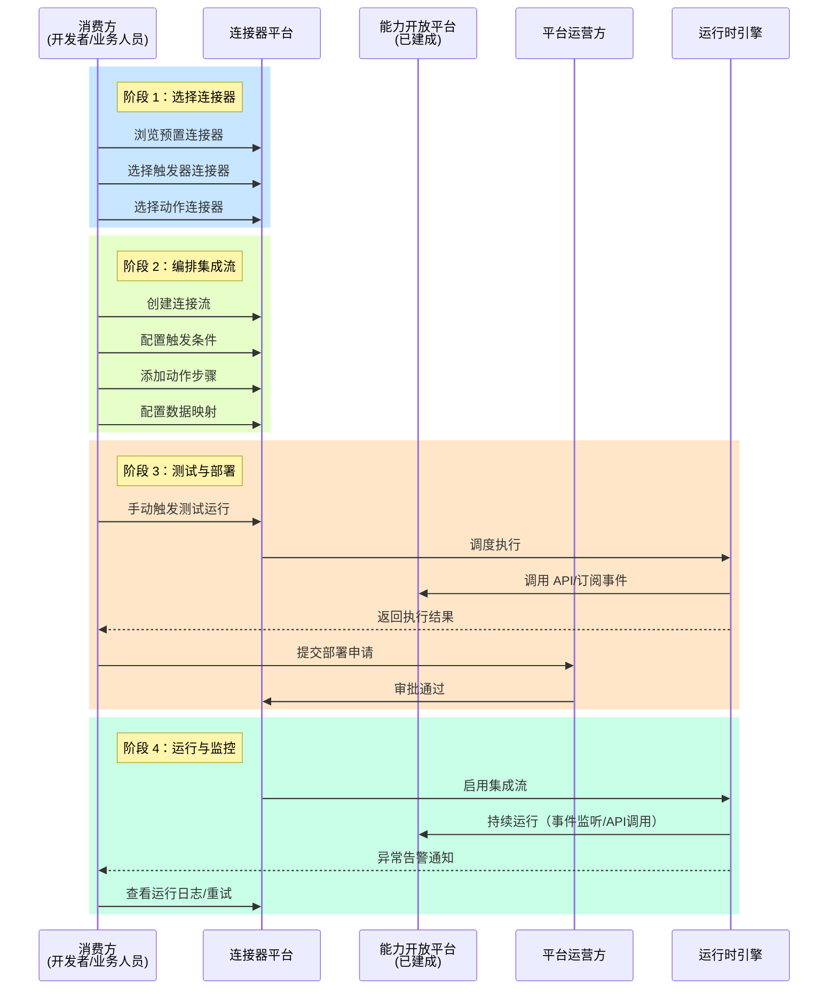
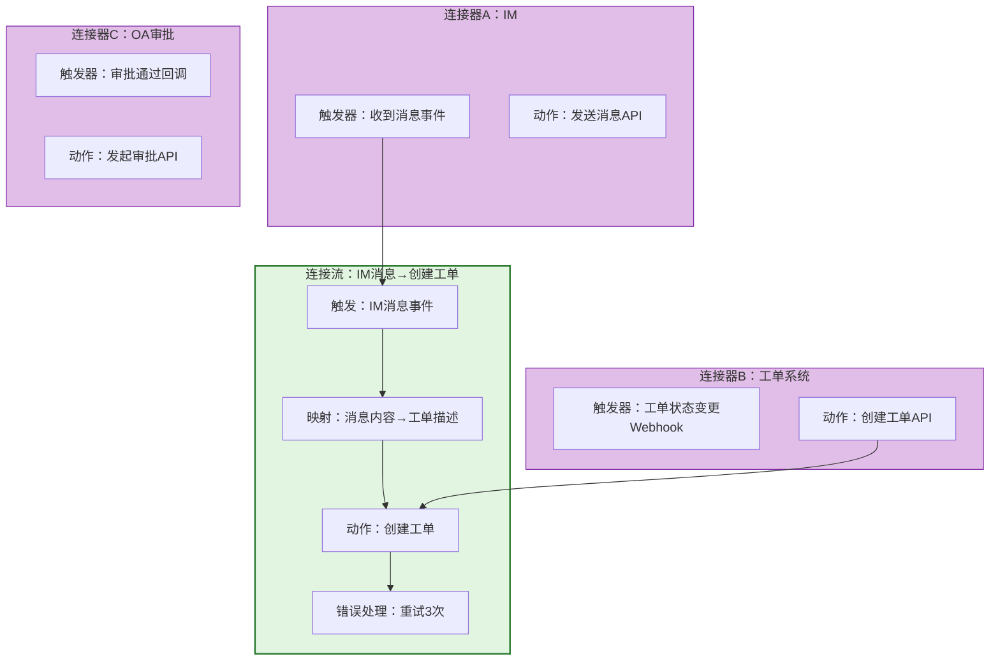
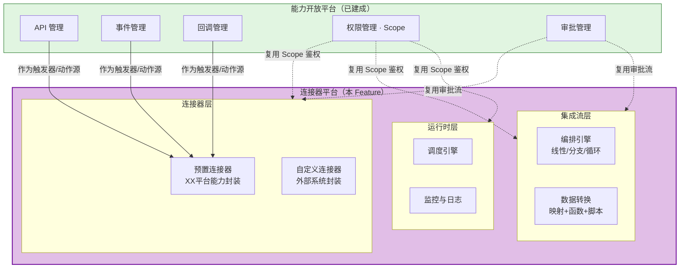

# 需求挖掘报告：连接器平台

**报告 ID**: DISCOVERY-CONN-001  
**创建时间**: 2026-05-14  
**最后更新**: 2026-05-14  
**阶段**: 0.discovery（需求挖掘）  
**状态**: ✅ 已完成  
**会话 ID**: connector-session-001

---

## 一、执行摘要

### 1.1 核心定位

**连接器平台**是开放平台的组成部分，作为独立 Feature 以**松耦合**方式与能力开放平台协作。它聚焦于与开放平台相关的业务系统的集成编排——包括**企业内三方业务系统**（调用开放接口、提供回调接口、提供事件接口、监听事件处理业务）和**XX通讯平台内部的其它业务模块**（对内部接口进行微改造后暴露等）——通过**连接器封装**和**集成流编排**，将原本需要大量人工编码的跨系统集成场景转化为**低代码/零代码配置**，释放能力开放平台的真正价值。

> 💡 **关系解读**：
> 1. **归属关系**：连接器平台是开放平台的组成部分，不内嵌于能力开放平台，但同属开放平台体系
> 2. **集成范围**：连接器平台仅对接与开放平台相关的业务系统：① 企业内三方业务系统（调用开放接口、提供回调/事件接口、监听事件处理业务）② XX通讯平台内部其它业务模块（微改造暴露内部接口等）
> 3. **消费关系**：连接器平台消费能力开放平台的 API/事件/回调作为触发器和动作源
> 4. **复用关系**：复用能力开放平台的 Scope 权限模型和审批流引擎
> 5. **开放方向**：连接器平台面向企业内三方平台开放连接器与集成流能力

### 1.2 核心问题

| 维度 | 描述 |
|------|------|
| **核心痛点** | 人工编码对接：每对接一个外部系统都要从零开发，无复用、无标准化 |
| **痛点细分** | ① 单点接入重复造轮子 ② 多步流程硬编码 ③ 数据格式转换重复写 ④ 运维管控缺失 |
| **不做后果** | 非常严重 — API/事件/回调的开放价值无法被充分释放，三方平台接入效率无法提升 |
| **现状** | 能力开放平台 MVP 已就绪（API/事件/回调/权限/审批），但消费方仍需大量编码才能完成跨系统集成 |
| **目标** | 构建连接器平台，将人工编码的集成场景转化为低代码/零代码配置 |

### 1.3 目标用户

| 角色 | 职责 | 诉求 |
|------|------|------|
| **三方平台开发者** | 将 XX 平台能力集成到自己系统的技术人员 | **降本**：通过连接器封装和 SDK 减少编码工作量；**提效**：复用预置连接器，快速完成对接 |
| **业务人员（低代码用户）** | 不写代码但需要配置跨系统业务流程的运营/HR/客服人员 | **零代码**：通过可视化/表单编排配置集成流，无需开发人员介入 |
| **连接器开发者** | 构建和发布可复用连接器的平台开发者/ISV（V2 阶段） | **开放生态**：提供 SDK/框架，支持自定义连接器开发与发布 |
| **平台运营方** | 审核连接器上架、监控运行状态 | **治理**：复用审批流和权限模型，确保连接器合规运行 |

> 💡 **核心逻辑**：MVP 阶段**三方平台开发者**和**业务人员**并重，连接器开发者在 V2 阶段通过开放生态引入。

---

## 二、问题空间分析

### 2.1 现状痛点

| 痛点维度 | 具体描述 |
|---------|---------|
| **单点接入重复造轮子** | 三方平台每接入一个新能力（API/事件/回调），都要单独写代码处理鉴权、调用、错误重试等，没有可复用的封装 |
| **多步流程硬编码** | 跨系统业务流程需要串联多个 API/事件，但缺乏编排工具，只能硬编码实现流程逻辑 |
| **数据格式转换重复写** | 对接的外部系统数据格式不统一，每次都要写字段映射和转换逻辑 |
| **运维管控缺失** | 已对接的集成流缺少运行监控、重试、告警等运维能力，出问题只能人工排查 |

### 2.2 业务驱动

| 驱动因素 | 说明 |
|---------|------|
| **MVP 自然演进** | 能力开放平台 MVP 已就绪，API/事件/回调的价值释放需要连接器编排能力 |
| **降本诉求** | 减少三方平台接入时的人工编码工作量 |
| **提效诉求** | 加速三方平台从"发现能力"到"能力落地运行"的端到端速度 |
| **低代码化** | 让业务人员（非开发者）也能配置跨系统流程，降低技术门槛 |
| **价值释放** | 没有连接器编排能力，API/事件/回调的开放价值无法被充分释放 |

### 2.3 不做会怎样

| 影响维度 | 后果 |
|---------|------|
| **业务影响** | API/事件/回调虽已开放，但消费门槛高，三方平台难以真正落地 |
| **效率影响** | 每次对接仍需大量人工编码，效率无法提升 |
| **生态影响** | 缺乏编排能力，XX通讯平台的集成生态无法形成壁垒 |
| **竞争影响** | 飞书AnyCross、钉钉连接流已形成差异化竞争能力 |

---

## 三、用户画像与场景

### 3.1 用户画像

> 💡 **核心用户**：业务人员（低代码用户）是差异化体验的核心，开发者是基础保障

### 3.2 核心概念模型

**核心概念对照**：

| 概念 | 定义 | 类比 |
|------|------|------|
| **连接器** | 对单个外部系统的封装，包含触发器、动作、认证、参数定义 | 钉钉的"自定义连接器"、Zapier 的"App" |
| **连接流** | 编排多个连接器的业务流程，包含编排、转换、流程控制、错误处理 | 钉钉的"连接流"、Make 的"Scenario"、Zapier 的"Zap" |
| **运行时** | 平台托管的流调度与执行引擎 | 类似 AWS Lambda + Step Functions |
| **治理** | 复用能力开放平台的权限/审批/生命周期管理 | 复用现有基础设施 |

### 3.3 典型场景

| 场景编号 | 场景名称 | 触发器 | 动作 | 编排复杂度 | 用户角色 |
|---------|---------|--------|------|-----------|---------|
| **S1** | IM消息→客服工单 | IM 消息事件 | 调用工单系统 API 创建工单 | 线性 | 业务人员 |
| **S2** | 审批→ERP→CRM同步 | 审批通过回调 | ① ERP 写入 ② CRM 更新 | 分支+并行 | 开发者 |
| **S3** | 入职自动化 | 定时查询新员工 | ① 拉群 ② 分配权限 ③ 推送欢迎消息 | 线性+循环 | 业务人员 |
| **S4** | 会议→云盘→IM联动 | 会议结束事件 | ① 上传录音到云盘 ② 发送总结到群 | 线性 | 业务人员 |

### 3.4 用户旅程地图

---

## 四、需求分层与优先级

### 4.1 需求分层

### 4.2 需求清单

#### Must Have（必备 — MVP）

**连接器层**：

| 需求编号 | 需求描述 | 核心本质 | 验收标准 |
|---------|---------|---------|---------|
| **MH-01** | **预置连接器** | 对 XX 平台能力的标准化封装 | 提供对能力开放平台 API/事件/回调的预置连接器封装，消费方无需编码即可使用 |
| **MH-02** | **连接器生命周期管理** | 连接器的注册、发布、版本、下架 | 支持连接器的注册/编辑/发布/下架/版本管理；复用能力开放平台审批流程 |

**集成流层**：

| 需求编号 | 需求描述 | 核心本质 | 验收标准 |
|---------|---------|---------|---------|
| **MH-03** | **集成流线性编排** | 串联多个步骤的触发器→动作链 | 支持触发器→动作1→动作2→…的线性编排；支持事件/Webhook/定时/手动四种触发方式 |
| **MH-04** | **集成流生命周期管理** | 集成流的创建、编辑、启停、版本 | 支持集成流的创建/编辑/启停/版本管理；复用能力开放平台审批流程 |
| **MH-05** | **基础数据转换** | 字段级别的映射 | 支持源字段→目标字段的简单映射配置 |

**运行时层**：

| 需求编号 | 需求描述 | 核心本质 | 验收标准 |
|---------|---------|---------|---------|
| **MH-06** | **平台托管运行时** | 集成流在平台服务端运行 | 集成流在平台侧调度执行，消费方无需部署运行时；支持资源配额与隔离 |
| **MH-07** | **运行监控与日志** | 运行状态可视化和问题排查 | 支持查看集成流运行状态/执行历史/失败日志；支持失败重试 |

#### Should Have（期望 — V1）

**编排增强**：

| 需求编号 | 需求描述 | 验收标准 |
|---------|---------|---------|
| **SH-01** | **条件分支+并行** | 支持 if/else 条件分支、并行执行多步骤 |
| **SH-02** | **循环+迭代** | 支持 for 循环、遍历数组、批量处理 |
| **SH-03** | **子流程+错误处理** | 支持子流程调用、try/catch 错误处理、重试策略配置 |

**交互增强**：

| 需求编号 | 需求描述 | 验收标准 |
|---------|---------|---------|
| **SH-04** | **可视化拖拽编排** | 支持拖拽式可视化编排器，与代码模式可互转 |
| **SH-05** | **函数库+脚本转换** | 内置字符串/日期/数学等转换函数；支持自定义 JS 脚本 |

**开发者生态**：

| 需求编号 | 需求描述 | 验收标准 |
|---------|---------|---------|
| **SH-06** | **连接器开发 SDK** | 提供 SDK/框架，开发者可构建自定义连接器 |

#### Could Have（惊喜 — V2）

| 需求编号 | 需求描述 | 验收标准 |
|---------|---------|---------|
| **CH-01** | **连接器市场与发现** | 统一门户展示连接器目录；支持搜索、评价、模板 |
| **CH-02** | **自定义连接器发布** | 支持 ISV/开发者发布自定义连接器，经审核后上架 |
| **CH-03** | **AI 辅助编排** | 通过 AI 辅助生成集成流配置或连接器封装 |
| **CH-04** | **模板库** | 提供常见场景的集成流模板，一键创建 |

---

## 五、核心流程设计

### 5.1 连接器平台使用全流程

从消费方视角展示从发现连接器到集成流运行的完整流程。

### 5.2 连接器与集成流的关系

> 💡 **核心逻辑**：连接器是可复用的原子单元，连接流是编排多个连接器的业务流程。一个连接器可被多个连接流引用。

### 5.3 集成方向与消费形式

连接器平台仅对接与开放平台相关的业务系统，分为两类：

**对接系统分类**：

| 系统类型 | 描述 | 连接器角色 |
|---------|------|-----------|
| **企业内三方业务系统** | XX通讯平台外部的企业内部系统 | 调用开放接口、提供回调接口、提供事件接口、监听事件处理业务 |
| **XX通讯平台内部其它业务模块** | XX通讯平台内但未通过能力开放平台注册的模块 | 对内部接口进行微改造后暴露，通过连接器编排实现能力开放 |

**集成方向**：

| 集成方向 | 触发方式 | 典型场景 |
|---------|---------|---------|
| **XX平台→三方系统** | 事件触发 | IM消息→ERP创建工单、审批通过→CRM更新 |
| **三方系统→XX平台** | Webhook触发 | ERP数据变更→XX平台同步、外部事件→XX平台动作 |
| **XX内部模块→三方系统** | 事件/API触发 | 内部业务模块微改造接口→通过连接器暴露给三方系统 |

| 触发方式 | 描述 | 适用场景 |
|---------|------|---------|
| **事件触发** | 订阅能力开放平台事件，事件发生时自动执行 | 实时响应XX平台状态变更 |
| **Webhook触发** | 外部系统调用Webhook地址触发 | 外部系统主动推送数据 |
| **定时触发** | Cron表达式定时执行 | 定期数据同步、报表生成 |
| **手动触发** | 用户点击"立即执行" | 一次性数据迁移、手动重跑 |

### 5.4 与能力开放平台的协作关系

| 维度 | 关系说明 |
|------|---------|
| **消费关系** | 连接器平台消费能力开放平台的 API/事件/回调作为触发器和动作源 |
| **权限复用** | 复用 Scope 模型，连接器调用通过 Scope 管控 |
| **审批复用** | 复用审批流引擎，连接器上架/流部署走统一审批 |
| **归属关系** | 连接器平台是开放平台的组成部分，不内嵌于能力开放平台，但同属开放平台体系 |
| **集成范围** | 仅对接与开放平台相关的业务系统：① 企业内三方业务系统 ② XX通讯平台内部其它业务模块 |
| **架构预留** | 能力开放平台 FR-003、NFR-016 已预留资源类型扩展点 |

---

## 六、竞品对标

### 6.1 竞品对标分析

基于已有的 12 份竞品调研报告，提炼对连接器平台的核心启示：

| 对标维度 | 飞书做法 | 钉钉做法 | Make 做法 | 我们的策略 |
|---------|---------|---------|----------|-----------|
| **连接器定义** | API 直接开放，不封装连接器 | 连接器=触发器+动作的封装 | App=触发器+动作+认证 | ✅ 采用钉钉/Make模式：连接器=单系统封装 |
| **编排模式** | 轻量级，仅 API+事件 | 连接流可视化编排 | 场景编排+路由+迭代 | ✅ 双模式：简单可视化+复杂代码 |
| **运行环境** | 平台侧托管 | 平台侧托管 | 平台侧托管 | ✅ 平台托管运行 |
| **数据转换** | 无独立能力 | 基础字段映射 | 丰富的函数+迭代器+聚合器 | ✅ 字段映射+函数+脚本 |
| **生态策略** | 不建连接器市场 | 50+预置+自定义 | 1800+连接器 | ✅ 预置优先，后续开放自定义 |

### 6.2 核心竞品启示

| 启示 | 来源 | 我们的策略 |
|------|------|-----------|
| **能力开放 > 连接器封装** | 飞书调研 | 先确保 API/事件/回调质量，连接器是上层封装 |
| **连接器需可编排才有价值** | 钉钉调研 | 连接器+集成流双概念，缺一不可 |
| **不自建通用 iPaaS** | 综合调研 | 不与 Zapier/Make/集简云竞争，聚焦 XX 平台能力编排 |
| **分步迭代降低风险** | 行业最佳实践 | MVP 线性编排先行，后续迭代复杂编排 |
| **双模式服务不同用户** | Make/钉钉 | 可视化面向业务人员，代码面向开发者 |

---

## 七、成功标准

**核心目标**: 
1. ✅ **业务人员能自主配置集成流** — 不依赖开发人员即可完成跨系统流程配置
2. ✅ **预置连接器被实际消费** — 有三方平台通过预置连接器完成实际业务集成

### 7.1 定性指标

| 维度 | 成功标准 | 对应核心目标 |
|------|---------|-------------|
| **低代码化** | 业务人员能独立创建并运行集成流，无需开发介入 | 业务人员能自主配置 |
| **预置可用** | 至少 3 个预置连接器被三方平台实际使用 | 预置连接器被实际消费 |
| **接入提效** | 原本需人工编码 1 周的集成场景，用连接器可在 1 天内完成 | 接入效率显著提升 |
| **运维可控** | 集成流运行状态可监控，失败可重试，异常有告警 | 运行可靠性 |

### 7.2 定量指标（系统提供度量能力）

| 指标类型 | 具体的指标 | 对应核心目标 |
|---------|-----------|-------------|
| **规模指标** | 预置连接器数量、自定义连接器数量 | 预置连接器被实际消费 |
| **使用指标** | 活跃集成流数量、业务人员创建的集成流占比 | 业务人员能自主配置 |
| **效率指标** | 集成流从创建到上线的时间 | 接入提效 |
| **可靠性指标** | 集成流运行成功率、平均重试次数 | 运行可靠性 |

> ⚠️ **注意**: 具体目标值取决于业务运营推广的投入力度，系统首先需要具备度量能力。

---

## 八、风险与假设

### 8.1 关键假设

| 假设 | 风险等级 | 验证方式 |
|------|---------|---------|
| 能力开放平台的 API/事件/回调足够稳定，可作为连接器的触发器和动作源 | 低 | 已有 MVP 验证 |
| 业务人员愿意使用低代码编排工具 | 中 | MVP 上线后观察使用数据 |
| 开发者愿意基于 SDK 开发自定义连接器 | 中 | V2 阶段开发者社区运营 |
| 平台托管运行时能满足性能和可靠性要求 | 中 | 需性能测试验证 |
| 复用 Scope 权限模型足以覆盖连接器调用鉴权需求 | 低 | 与能力开放平台团队确认 |

### 8.2 潜在风险

| 风险 | 影响 | 缓解措施 |
|------|------|---------|
| 编排引擎技术复杂度高，可能超工期 | 高 | 分步迭代：MVP 先做线性编排，降低首版复杂度 |
| 可视化拖拽编排前端实现复杂 | 高 | MVP 用表单配置替代拖拽，V1 再加拖拽 |
| 运行时可靠性（资源隔离/性能/容错） | 高 | 设计执行沙箱，限制单流资源配额，完善重试机制 |
| 松耦合架构导致与能力开放平台对接摩擦 | 中 | 明确接口契约，做好集成测试 |

---

## 九、范围边界

### 9.1 版本规划

| 版本 | 范围 | 核心价值 |
|------|------|---------|
| **MVP** | 预置连接器 + 线性编排 + 平台托管运行 + 运行监控 + 基础数据映射 | 验证"零代码配置集成流"核心价值 |
| **V1** | 完整编排（分支/循环/子流程）+ 可视化拖拽 + 函数库+脚本 + 连接器 SDK | 满足复杂场景，开放开发者生态 |
| **V2** | 连接器市场 + 自定义连接器发布 + AI辅助编排 + 模板库 | 构建连接器生态 |

### 9.2 明确不做

| 范围 | 原因 |
|------|------|
| 计费系统 | 企业内使用，无需计费 |
| 多租户/跨企业 | 仅限企业内部系统 |
| 通用 iPaaS 能力 | 不与 Zapier/Make/集简云竞争 |
| 替代现有应用管理/成员管理 | 沿用现有系统 |

---

## 十、Feature 拆分建议

### 10.1 拆分方案

连接器平台按**前后端分离**模式拆分为两个子 Feature：

| 子 Feature | 范围 | 核心模块 |
|-----------|------|---------|
| **connector-platform-serve** | 后端服务 | 连接器引擎 + 流编排引擎 + 运行时 + 连接器 SDK |
| **connector-platform-web** | 前端界面 | 可视化编排器 + 管理界面 + 运行监控面板 |

### 10.2 拆分理由

1. **技术栈差异**：后端（Java/Spring）与前端（React/TypeScript）技术栈不同，并行开发效率更高
2. **职责清晰**：后端聚焦编排引擎和运行时，前端聚焦交互体验
3. **风险隔离**：可视化编排前端是主要风险点，独立可降低对后端开发节奏的影响
4. **与现有架构一致**：open-app 项目已有 open-server/open-web 的前后端分离模式

---

## 十一、下一步建议

### 11.1 进入规范编写阶段

运行 `@sddu-spec 连接器平台` 进入规范编写阶段，产出：
- 详细功能需求（FR）
- 非功能需求（NFR）
- 边界情况（EC）
- 技术设计（接口/页面/数据库清单）
- 子 Feature 规划

### 11.2 需要进一步确认的事项

| 事项 | 说明 |
|------|------|
| **预置连接器范围** | MVP 阶段具体需要封装哪些 XX 平台能力（IM/云盘/审批/…） |
| **运行时技术选型** | 流编排引擎的技术方案（自研 vs 开源） |
| **可视化编排交互** | 表单配置 vs 拖拽编排的 MVP 交互方案 |
| **与能力开放平台接口契约** | 连接器平台消费 API/事件/回调的具体接口规范 |

---

## 附录

### A. 会话记录

完整对话记录见：`.sddu/specs-tree-root/specs-tree-connector-platform/discovery-session-log.md`

### B. 分析笔记

分析总结见：`.sddu/specs-tree-root/specs-tree-connector-platform/discovery-analysis.md`

### C. 参考资料

- 能力开放平台规范：`specs-tree-capability-open-platform/spec.md`
- 能力开放平台需求挖掘报告：`specs-tree-capability-open-platform/discovery-report.md`
- 软件连接器平台汇总对比调研报告：`docs/software-connector-platform-research/软件连接器平台汇总对比调研报告.md`
- 飞书集成平台调研报告：`docs/software-connector-platform-research/飞书集成平台调研报告.md`
- 钉钉连接平台调研报告：`docs/software-connector-platform-research/钉钉连接平台调研报告.md`

---

**报告状态**: ✅ 需求挖掘完成  
**下一步**: 运行 `@sddu-spec 连接器平台` 开始规范编写

---

## 修订记录

| 版本 | 日期 | 修订内容 | 修订人 |
|------|------|---------|--------|
| v1.0 | 2026-05-14 | 初始版本 — 完成连接器平台需求挖掘报告 | AI Assistant |

---

**最后更新**: 2026-05-14
