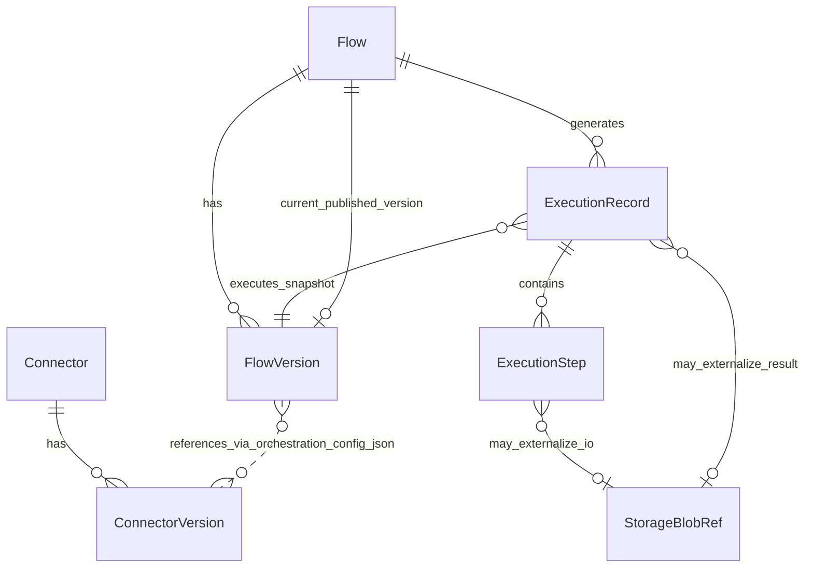
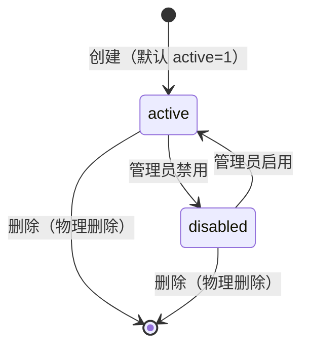
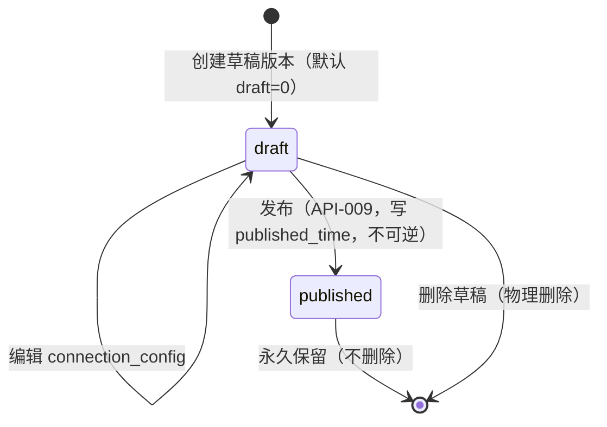
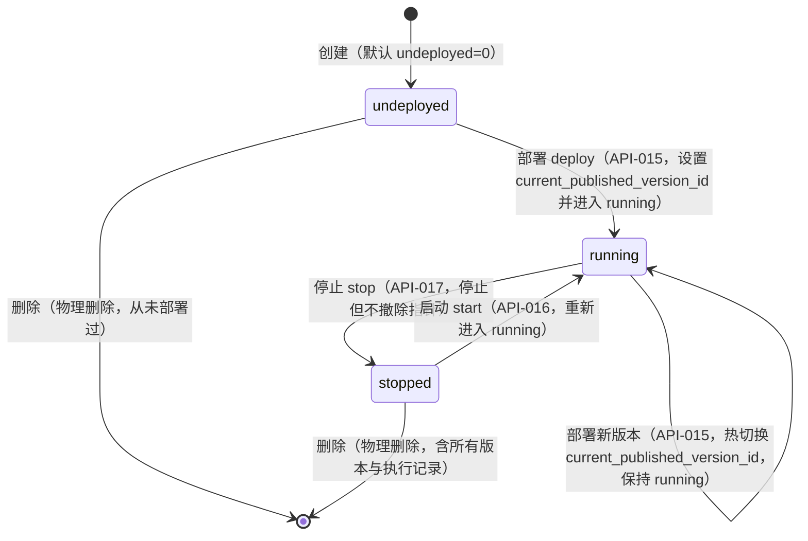
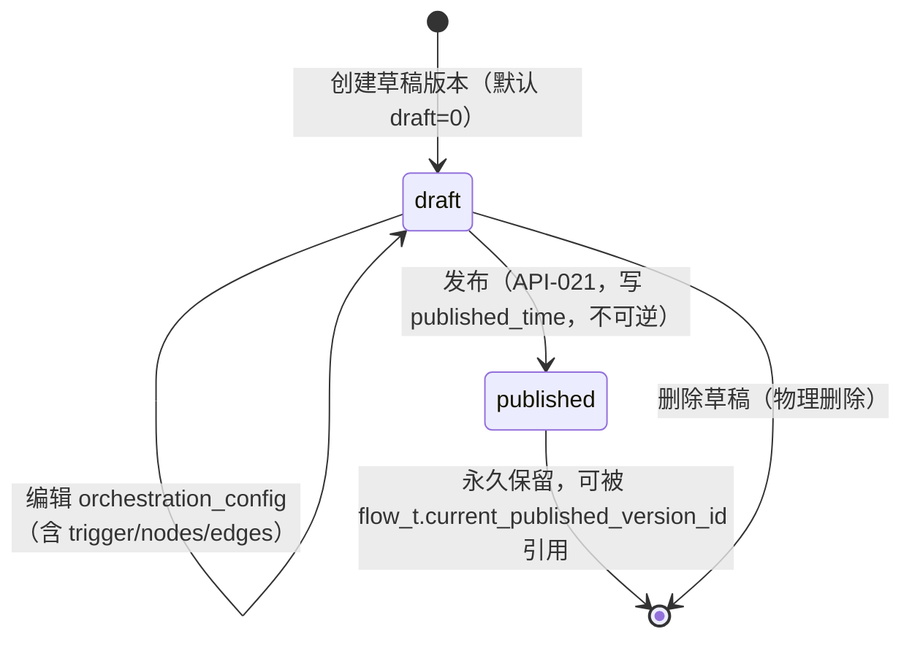
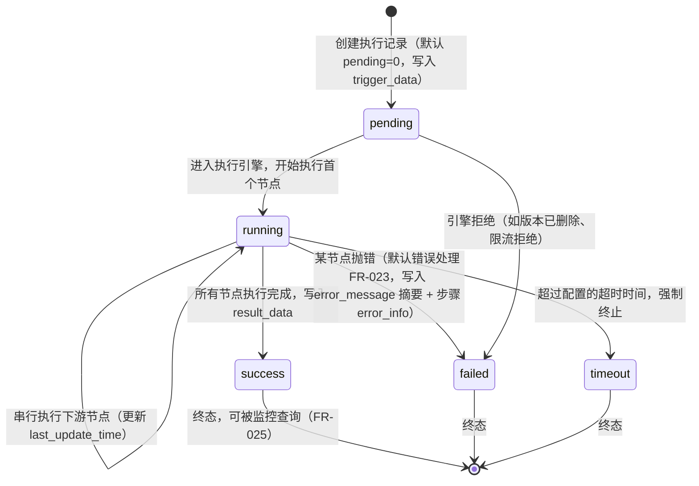

# 数据库设计：连接器平台

**Feature ID**: CONN-PLAT-001  
**关联文档**: plan.md（§4.2 数据库设计 + §4.3 表设计规则）  
**版本**: v2.7.6  
**创建日期**: 2026-05-21  
**最后更新**: 2026-05-22  
**对齐基线**: plan.md v2.7.6（含 v2.0 → v2.7.6 全部决策）

---

## 0. 设计规范

> 💡 本章合并原 §1 设计原则 + §2 通用规范（现统编为 §0 设计规范）。全面对齐能力开放平台（CAP-OPEN-001 `plan.md §4.2 表设计规则`），连接器平台子域作为 openplatform_v2 体系一部分严格遵循。

### 0.1 核心设计原则

| 原则 | 说明 |
|------|------|
| **表前缀** | 统一使用 `openplatform_v2_cp_`（openplatform=开放平台体系 / v2=平台第二代 / cp=connector platform 子域），与 open-server 既有表严格隔离 |
| **表后缀** | 所有表统一 `_t` 后缀；属性表 `_p_t`（V1 预留，MVP 不引入）|
| **主键** | 统一 BIGINT(20) **雪花 ID**（应用层生成），命名 `id`；**不再使用 `varchar(32)` 业务 ID 字段**（v2.7 决策） |
| **时间字段** | 统一 `DATETIME(3)`（毫秒精度） |
| **JSON 字段** | 统一 **TEXT 存 JSON 字符串**（v2.7.4 决策，禁用 MySQL JSON 原生类型）；应用层 Jackson 序列化/反序列化 |
| **描述字段** | 统一 `VARCHAR(1000)`（v2.7.2 决策，便于索引/排序/前端预览） |
| **名称字段** | 中英文双语 `name_cn` / `name_en`，VARCHAR(100)，必填 |
| **物理外键** | ❌ 禁用，所有关联通过逻辑字段（`xxx_id` BIGINT）+ 应用层维护 |
| **软删除** | **MVP 不引入 `is_deleted` 字段**——本期删除即物理删除（管理类业务量小）；V1 若有"误删恢复"诉求再引入 |
| **审计字段** | 每表必备 `create_time` / `last_update_time` / `create_by` / `last_update_by`（v2.7 命名规范） |
| **属性表模式** | MVP 不引入 `*_p_t`，所有字段直接入主表；V1 演进项 |
| **执行表分区** | MVP 不分区；V1 单表接近 500w 时按 `create_time` 月度分区 + 30 天冷归档 |
| **文件/图标字段** | 不直接存储完整 URL，统一使用 **文件 ID**（如 `icon_file_id`）存储，`VARCHAR(128)`，选填；系统层负责将文件 ID 解析为可访问 URL。关联 `storage_blob_ref_t` 或独立文件服务（V1） |

### 0.2 命名规范

| 规则 | 说明 | 连接器平台示例 |
|------|------|---------------|
| **完整前缀** | `openplatform_v2_cp_` | `openplatform_v2_cp_connector_t` |
| **表后缀** | 统一 `_t`；属性表 `_p_t`（V1 预留） | `openplatform_v2_cp_execution_step_t` |
| **命名风格** | 小写字母 + 下划线分隔 | `connector_version` / `execution_step` |
| **索引命名** | `idx_字段名[_字段名2[_字段名3]]` | `idx_connector_id_version_status_create_time` |
| **唯一索引命名** | `uk_字段名[_字段名2]` | `uk_flow_id_version_no` |

### 0.3 主键规范

| 规则 | 说明 |
|------|------|
| **主键类型** | BIGINT(20)，**应用层生成雪花 ID**（非自增） |
| **主键命名** | 统一使用 `id` |
| **业务 ID** | ❌ **不再单独维护 `varchar(32)` 业务 ID**——直接用 BIGINT 雪花 `id` 作为业务标识对外暴露（API 响应转 string 避免 JS 精度丢失） |
| **关联字段** | 使用**逻辑外键**（存储关联 ID），**严禁物理外键约束**，关联关系由应用层维护 |

> **禁止使用外键**：所有表关联关系通过存储逻辑字段实现，不使用数据库物理外键约束（FOREIGN KEY）。

### 0.4 审计字段规范

所有业务表必须包含以下 4 个审计字段：

| 字段名 | 类型 | 说明 |
|--------|------|------|
| `create_time` | DATETIME(3) | 创建时间，默认 `CURRENT_TIMESTAMP(3)` |
| `last_update_time` | DATETIME(3) | 更新时间，默认 `CURRENT_TIMESTAMP(3) ON UPDATE CURRENT_TIMESTAMP(3)` |
| `create_by` | VARCHAR(100) | 创建人账号 |
| `last_update_by` | VARCHAR(100) | 更新人账号 |

### 0.5 描述字段规范

| 规则 | 说明 |
|------|------|
| **类型** | 统一 `VARCHAR(1000)`（v2.7.2 决策，禁用 TEXT） |
| **双语** | `description_cn` / `description_en`，均选填 |
| **理由** | 行内存储+可索引+前端预览友好，避免 TEXT 离行存储与全表扫描代价；1000 字符足够承载产品级描述 |

### 0.6 JSON 字段规范（v2.7.4）

| 规则 | 说明 |
|------|------|
| **类型** | **TEXT / MEDIUMTEXT / LONGTEXT**（根据实际大小选定），存 JSON 字符串 |
| **禁用** | ❌ MySQL JSON 原生类型 |
| **序列化** | 应用层负责（Jackson 序列化/反序列化、格式校验） |
| **查询** | ❌ 不使用 `JSON_EXTRACT` / `JSON_TABLE` 等原生函数；需要查询时由应用层解析后过滤 |
| **内部字段命名** | JSON 内部字段统一使用 **camelCase**（驼峰），与 API 响应命名规范一致（见 plan-api.md §1.2）。即数据库 TEXT/MEDIUMTEXT 字段中存储的 JSON 字符串，其键名采用 `nameCn`/`descriptionEn`/`connectorVersionId` 等格式，**而非** `name_cn`/`description_en`/`connector_version_id` |
| **理由** | 跨数据库通用（PG/Oracle/SQLServer 都支持） / ORM 与工具兼容性最好 / 避免 MySQL 5.7/8.0 JSON 类型方言差异 / R2DBC 映射简单 |
| **本平台长度选择** | 编排/连接配置类（`orchestration_config`、`connection_config`、`basic_info_snapshot`）：**MEDIUMTEXT**（最多 16MB，预留 DAG 扩展空间）；执行 I/O 类（`trigger_data`/`result_data`/`input_data`/`output_data`/`error_info`）：**TEXT**（最多 64KB，超阈值走对象存储外置） |

### 0.7 枚举字段规范

| 规则 | 说明 |
|------|------|
| **字段类型** | **TINYINT(10)**（v2.7 决策，禁用 varchar 字符串枚举） |
| **默认值** | 数字字面量 |
| **注释说明** | 在 COMMENT 中说明所有枚举值含义（数字 → 含义） |
| **示例** | `tinyint(10) NOT NULL DEFAULT 1 COMMENT '状态：0=disabled, 1=active'` |

**枚举字段汇总**：

| 表 | 字段 | 枚举值 | 说明 |
|----|------|--------|------|
| `connector_t` | `connector_type` | 1=HTTP（MVP）；2/3/4… 预留 MySQL/Redis/Kafka/gRPC（NG12，V1） | 协议类型 |
| `connector_t` | `status` | 0=disabled, 1=active | 连接器启用状态 |
| `connector_version_t` | `version_status` | 0=draft, 1=published | 草稿/已发布 |
| `flow_t` | `lifecycle_status` | 0=undeployed（未部署）, 1=running（运行中）, 2=stopped（已停止） | 对应 FR-013~015 部署/启动/停止；初始态 0，撤除部署回到 0 |
| `flow_version_t` | `version_status` | 0=draft, 1=published | 同上 |
| `execution_record_t` | `trigger_type` | 1=http, 2=manual, 3=test | 触发方式（MVP） |
| `execution_record_t` | `status` | 0=pending, 1=running, 2=success, 3=failed, 4=timeout | **MVP 5 个值**（partial/cancelled 留 V1） |
| `execution_step_t` | `status` | 0=success, 1=failed | 步骤执行结果 |
| `execution_step_t` | `node_type` | 1=entry, 2=connector, 3=data_processor, 4=exit | 节点类型（MVP） |
| `storage_blob_ref_t` | `owner_type` | 1=execution_record_trigger, 2=execution_record_result, 3=execution_step_input, 4=execution_step_output | 用于 GC 任务分类扫描 |

> **与 v2.0 的差异**：
> - **枚举类型**：v2.0 用 `varchar(20)` 字符串，v2.7 统一为 `TINYINT(10)` 数字（节省存储 + 索引效率 + 应用层枚举映射）
> - `execution_record_t.status`：v2.0 仅 3 个（success/failed/timeout），v2.7.5 扩为 5 个（**保留 pending/running 用于同步执行过程中的瞬时状态写入与回填，超时强制终止仍写 timeout 终态**）
> - `trigger_type`：v2.0 仅 `http/manual/test`，v2.7.5 保持一致，但类型从 varchar 改为 TINYINT
> - `node_type`：v2.7.5 保持 `entry/connector/data_processor/exit` 四值
> - `connector_type`：MVP 仅 `HTTP = 1`（v2.0 一致）

---


## 1. 表清单

| # | 表名 | 类型 | 归属模块 | 说明 |
|---|------|------|---------|------|
| 1 | `openplatform_v2_cp_connector_t` | 主表 | connector | 连接器基本信息 |
| 2 | `openplatform_v2_cp_connector_version_t` | 版本表 | connector | 连接器版本（基本信息快照 + 连接配置 JSON，含认证类型 schema 但**不存凭证值**）|
| 3 | `openplatform_v2_cp_flow_t` | 主表 | flow | 连接流基本信息（含 `current_published_version_id` 指针）|
| 4 | `openplatform_v2_cp_flow_version_t` | 版本表 | flow | 连接流版本（基本信息快照 + 编排配置 JSON：`{trigger, nodes, edges}` 完整 DAG，**触发器配置完整内嵌**）|
| 5 | `openplatform_v2_cp_execution_record_t` | 主表 | runtime | 执行记录（含触发数据、最终返回值、状态、耗时、**预留计量字段** `operations_count`/`data_in_bytes`/`data_out_bytes`、`correlation_id`；**MVP 不分区**）|
| 6 | `openplatform_v2_cp_execution_step_t` | 子表 | runtime | 执行步骤详情（I/O 大字段支持外置到对象存储；**MVP 不分区**）|
| 7 | `openplatform_v2_cp_storage_blob_ref_t` | 元数据表 | runtime | 对象存储引用元数据（**`external_resource_id`**（外部系统资源 ID，按需使用）/ `uri` / `size_bytes` / `content_hash` / `content_type`；用于 GC、审计与外部系统反查溯源）|

**总计**：**7 张表**（2 主表 + 2 版本表 + 2 运行时表 + 1 元数据表），分属 connector / flow / runtime 三个模块。

---

## 2. 表关系总览



**关系说明**：

| 关系 | 类型 | 实现方式 |
|------|:----:|---------|
| `connector_t` → `connector_version_t` | 1:N | `connector_version_t.connector_id` 逻辑外键 |
| `flow_t` → `flow_version_t` | 1:N | `flow_version_t.flow_id` 逻辑外键 |
| `flow_t` → `current_published_version` | 1:0..1 | `flow_t.current_published_version_id` 指针（HTTP 触发查找路径）|
| `flow_t` → `execution_record_t` | 1:N | `execution_record_t.flow_id` 逻辑外键 |
| `flow_version_t` → `execution_record_t` | 1:N | `execution_record_t.flow_version_id` 逻辑外键（记录执行时使用的版本快照）|
| `execution_record_t` → `execution_step_t` | 1:N | `execution_step_t.execution_id` 逻辑外键 |
| `execution_record_t` → `storage_blob_ref_t` | 0..1:0..1 | `execution_record_t.trigger_data_blob_id` / `result_data_blob_id`（外置时使用）|
| `execution_step_t` → `storage_blob_ref_t` | 0..1:0..1 | `execution_step_t.input_data_blob_id` / `output_data_blob_id`（外置时使用）|
| `flow_version_t` ⇢ `connector_version_t` | N:M（逻辑）| 通过 `flow_version_t.orchestration_config.nodes[].connector_version_id` JSON 引用，**非物理外键**，应用层维护 |

> ❌ **已移除的关系**（相对 v2.0）：
> - `cp_flow_version` → `cp_flow_node` / `cp_flow_edge`（节点/连线内聚到 orchestration_config JSON）
> - `cp_connector_version` → `cp_connector_auth_config`（凭证不持久化）

---

## 3. 表结构定义

> 💡 以下 DDL 全部遵循 §1 设计原则与 §2 通用规范：BIGINT 雪花 ID 主键、双语名称、VARCHAR(1000) 描述、4 审计字段、TINYINT(10) 枚举、TEXT 存 JSON 字符串、idx_xxx/uk_xxx 索引命名、不使用物理外键。

### 3.1 openplatform_v2_cp_connector_t — 连接器基本信息

```sql
-- ============================================
-- 连接器基本信息表
-- v2.7.5：BIGINT 雪花 ID / 双语名称 / VARCHAR(1000) 描述 / TINYINT 枚举 / 4 审计字段
-- ============================================
CREATE TABLE `openplatform_v2_cp_connector_t` (
  `id`                bigint(20)    NOT NULL                  COMMENT '主键，雪花 ID（应用层生成）',
  `name_cn`           varchar(100)  NOT NULL                  COMMENT '连接器中文名称',
  `name_en`           varchar(100)  NOT NULL                  COMMENT '连接器英文名称',
  `description_cn`    varchar(1000) DEFAULT NULL              COMMENT '中文描述（选填）',
  `description_en`    varchar(1000) DEFAULT NULL              COMMENT '英文描述（选填）',
  `icon_file_id`      varchar(128)  DEFAULT NULL              COMMENT '图标文件 ID（选填；系统解析为可访问 URL）',
  `connector_type`    tinyint(10)   NOT NULL DEFAULT 1        COMMENT '协议类型：1=HTTP（MVP）；2/3/4… 预留 MySQL/Redis/Kafka/gRPC（NG12，V1）',
  `status`            tinyint(10)   NOT NULL DEFAULT 1        COMMENT '状态：0=disabled, 1=active',
  `create_time`       datetime(3)   NOT NULL DEFAULT CURRENT_TIMESTAMP(3),
  `last_update_time`  datetime(3)   NOT NULL DEFAULT CURRENT_TIMESTAMP(3) ON UPDATE CURRENT_TIMESTAMP(3),
  `create_by`         varchar(100)  DEFAULT NULL,
  `last_update_by`    varchar(100)  DEFAULT NULL,
  PRIMARY KEY (`id`),
  KEY `idx_connector_type` (`connector_type`),
  KEY `idx_name_cn` (`name_cn`),
  KEY `idx_status_connector_type` (`status`, `connector_type`)
) ENGINE=InnoDB DEFAULT CHARSET=utf8mb4 COMMENT='连接器基本信息表';
```

**status 状态机**：



| 状态 | 数字 | 业务含义 | 允许的操作 |
|------|:----:|---------|-----------|
| `active` | 1 | 连接器启用，可被连接流引用、可创建新版本 | 编辑基本信息 / 创建版本 / 禁用 / 删除 |
| `disabled` | 0 | 连接器禁用，已被引用的版本仍可执行（保持向后兼容），但不可被新连接流引用 | 启用 / 删除 |

> 💡 **MVP 简化**：禁用不影响已部署的连接流执行（凭证不存储，连接器版本本身是不可变快照）；V1 可扩展"禁用即阻止执行"模式。


> **变更说明**（相对 v2.0）：① 表名加 `openplatform_v2_cp_` 前缀 + `_t` 后缀；② 删除 `connector_id varchar(32)`（直接用 BIGINT `id` 作业务标识）；③ `name` → `name_cn`/`name_en` 双语；④ `description varchar(2000)` → `description_cn`/`description_en` VARCHAR(1000) 双语；⑤ `connector_type`/`status` 从 varchar 改为 TINYINT(10)；⑥ 审计字段 `created_at/updated_at/created_by/updated_by` → `create_time/last_update_time/create_by/last_update_by`；⑦ 删除 `is_deleted`（MVP 物理删除）。

### 3.2 openplatform_v2_cp_connector_version_t — 连接器版本

```sql
-- ============================================
-- 连接器版本表（发布时快照基本信息 + 连接配置）
-- v2.7.5：basic_info_snapshot/connection_config 用 TEXT 存 JSON（v2.7.4）
-- ============================================
CREATE TABLE `openplatform_v2_cp_connector_version_t` (
  `id`                       bigint(20)    NOT NULL                  COMMENT '主键，雪花 ID',
  `connector_id`             bigint(20)    NOT NULL                  COMMENT '关联 connector_t.id（逻辑外键）',
  `version_no`               varchar(20)   NOT NULL                  COMMENT '版本号（如 1.0.0）',
  `version_status`           tinyint(10)   NOT NULL DEFAULT 0        COMMENT '版本状态：0=draft, 1=published',
  `version_description_cn`   varchar(1000) DEFAULT NULL              COMMENT '版本变更说明（中文）',
  `version_description_en`   varchar(1000) DEFAULT NULL              COMMENT '版本变更说明（英文）',
  `basic_info_snapshot`      mediumtext    DEFAULT NULL              COMMENT 'TEXT 存 JSON：发布时连接器基本信息快照 {nameCn,nameEn,descriptionCn,descriptionEn,iconFileId,connectorType}',
  `connection_config`        mediumtext    DEFAULT NULL              COMMENT 'TEXT 存 JSON：连接配置 {protocol, baseUrl/protocolConfig, authTypeSchema(仅声明类型，不含凭证值), inputSchema, outputSchema, timeoutMs, rateLimit}',
  `published_time`           datetime(3)   DEFAULT NULL              COMMENT '发布时间',
  `create_time`              datetime(3)   NOT NULL DEFAULT CURRENT_TIMESTAMP(3),
  `last_update_time`         datetime(3)   NOT NULL DEFAULT CURRENT_TIMESTAMP(3) ON UPDATE CURRENT_TIMESTAMP(3),
  `create_by`                varchar(100)  DEFAULT NULL,
  `last_update_by`           varchar(100)  DEFAULT NULL,
  PRIMARY KEY (`id`),
  UNIQUE KEY `uk_connector_id_version_no` (`connector_id`, `version_no`),
  KEY `idx_connector_id_version_status_create_time` (`connector_id`, `version_status`, `create_time` DESC)
) ENGINE=InnoDB DEFAULT CHARSET=utf8mb4 COMMENT='连接器版本表';
```

**version_status 状态机**：



| 状态 | 数字 | 业务含义 | 允许的操作 |
|------|:----:|---------|-----------|
| `draft` | 0 | 草稿版本，可编辑 connection_config | 编辑 / 发布 / 删除 |
| `published` | 1 | 已发布版本，**只读不可变**，可被连接流节点引用 | 仅查看；不可编辑、不可回退到 draft、不可删除（永久保留） |

> 💡 **不可逆原则**：`draft → published` 是单向流转，借鉴 PA `flowversions` + 钉钉模式。发布后任何修改需新建版本（version_no 递增），保证已部署的连接流引用稳定。


**connection_config JSON Schema**（应用层 Jackson 序列化/反序列化；内部字段统一 camelCase，§0.6）：

```json
{
  "protocol": "HTTP",
  "protocolConfig": {
    "url": "https://api.example.com/im/send",
    "method": "POST",
    "headers": { "Content-Type": "application/json" }
  },
  "authTypeSchema": {
    "type": "AKSK",
    "carrier": "header",
    "fields": [
      { "name": "accessKey", "required": true, "sensitive": true },
      { "name": "secretKey", "required": true, "sensitive": true }
    ]
  },
  "inputSchema": {
    "type": "object",
    "properties": {
      "message": { "type": "string", "description": "消息内容" }
    },
    "required": ["message"]
  },
  "outputSchema": {
    "type": "object",
    "properties": {
      "code": { "type": "integer" },
      "data": { "type": "object" }
    }
  },
  "timeoutMs": 30000,
  "rateLimit": {
    "maxPerSecond": 10,
    "maxConcurrent": 5
  }
}
```

> 🔐 **凭证不持久化**（v2.6 决策）：`auth_type_schema` 仅声明认证类型与字段 schema（含 `sensitive: true` 标记），**不存储任何凭证值**；凭证由调用方在触发请求时携带，注入 ExecutionContext（仅内存），节点执行后清除。写入 execution_record/step 时按 `sensitive: true` 标记自动脱敏（值替换为 `***`）。

**auth_type 枚举**（写入 `authTypeSchema.type`，沿用现有 `AuthTypeEnum.java` + 新增 SYSTOKEN）：

| 代码 | 枚举名 | 说明 | 调用方需携带字段 | 实际使用 |
|:----:|--------|------|-----------------|:--------:|
| 4 | `NONE` | 无需认证 | — | ⭐ 预计使用 |
| 5 | `AKSK` | AccessKey / SecretKey | `accessKey`, `secretKey` | ⭐ 预计使用 |
| 7 | `SYSTOKEN` | 🆕 系统 Token 认证 | `token` 或 `systoken` | ⭐ 预计使用 |

> 💡 **代码对齐说明**：代码 0~6 已用于开放平台现有 `AuthTypeEnum.java`（0=COOKIE / 1=SOA / 2=APIG / 3=IAM / 4=NONE / 5=AKSK / 6=CLITOKEN）。连接器平台额外新增 `SYSTOKEN(7)`，其余枚举无当前需求，不预先定义。实际 MVP 阶段预期只使用 `NONE(4)` / `AKSK(5)` / `SYSTOKEN(7)` 三种。

> **变更说明**（相对 v2.0）：① 表名前缀+后缀对齐；② 删除 `version_id varchar(32)`；③ 删除 `approval_id`（无审批，NG19）；④ 删除 `change_log varchar(2000)` → 改用 `version_description_cn`/`version_description_en` VARCHAR(1000) 双语；⑤ `status` → `version_status` TINYINT；⑥ `published_at` → `published_time`；⑦ `basic_info_snapshot`/`connection_config` 从 `json` → `mediumtext`（v2.7.4 决策）；⑧ `connection_config.auth` → `auth_type_schema`（仅 schema 不含凭证值，v2.6 决策）；⑨ 索引重命名 `idx_connector_id_version_status_create_time`；⑩ `uk_version_id` → `uk_connector_id_version_no`（业务唯一约束更准确）。

### 3.3 openplatform_v2_cp_flow_t — 连接流基本信息

```sql
-- ============================================
-- 连接流基本信息表
-- v2.7.5：新增 current_published_version_id 指针（v2.4，HTTP 触发查找路径）
-- ============================================
CREATE TABLE `openplatform_v2_cp_flow_t` (
  `id`                              bigint(20)    NOT NULL                  COMMENT '主键，雪花 ID',
  `name_cn`                         varchar(100)  NOT NULL                  COMMENT '连接流中文名称',
  `name_en`                         varchar(100)  NOT NULL                  COMMENT '连接流英文名称',
  `description_cn`                  varchar(1000) DEFAULT NULL              COMMENT '中文描述（选填）',
  `description_en`                  varchar(1000) DEFAULT NULL              COMMENT '英文描述（选填）',
  `icon_file_id`                    varchar(128)  DEFAULT NULL              COMMENT '图标文件 ID（选填；系统解析为可访问 URL）',
  `lifecycle_status`                tinyint(10)   NOT NULL DEFAULT 0        COMMENT '生命周期状态：0=undeployed（未部署）, 1=running（运行中）, 2=stopped（已停止）；对应 FR-013~015 部署/启动/停止',
  `current_published_version_id`    bigint(20)    DEFAULT NULL              COMMENT '当前部署的已发布版本 ID（逻辑外键，nullable，HTTP 触发查找路径）',
  `create_time`                     datetime(3)   NOT NULL DEFAULT CURRENT_TIMESTAMP(3),
  `last_update_time`                datetime(3)   NOT NULL DEFAULT CURRENT_TIMESTAMP(3) ON UPDATE CURRENT_TIMESTAMP(3),
  `create_by`                       varchar(100)  DEFAULT NULL,
  `last_update_by`                  varchar(100)  DEFAULT NULL,
  PRIMARY KEY (`id`),
  KEY `idx_lifecycle_status` (`lifecycle_status`),
  KEY `idx_name_cn` (`name_cn`),
  KEY `idx_current_published_version_id` (`current_published_version_id`)
) ENGINE=InnoDB DEFAULT CHARSET=utf8mb4 COMMENT='连接流基本信息表';
```

**lifecycle_status 状态机**（对应 FR-013 部署 / FR-014 启动 / FR-015 停止）：



| 状态 | 数字 | 类型 | 业务含义 | HTTP 触发 | 允许的操作 |
|------|:----:|:----:|---------|:--------:|-----------|
| `undeployed` | 0 | **初始态** | 创建后的初始状态，从未部署过；`current_published_version_id` 为空 | ❌ 拒绝 | 编辑 / 部署 / 删除 |
| `running` | 1 | **活跃态** | 部署后运行中，可接收 HTTP 触发；`current_published_version_id` 非空 | ✅ 接受 | 编辑 / 部署新版本（热切换）/ 停止 |
| `stopped` | 2 | **挂起态** | 曾部署过但主动停止；`current_published_version_id` 保留指针但 HTTP 触发返回 403 | ❌ 拒绝（返回 403） | 编辑 / 启动 / 部署新版本 / 删除 |

> 💡 **部署与启停**：
> - **部署**（deploy）：从 undeployed → running，设 `current_published_version_id` 指针
> - **热切换**（deploy 新版本）：已有指针时，仅改指针值，保持原状态
> - **启动**（start）：stopped → running，不改指针
> - **停止**（stop）：running → stopped，保留指针
> - ⚠️ **当前不提供"撤除部署"API**（running/stopped → undeployed 路径预留，未来需要时扩展）


> **变更说明**（相对 v2.0）：① 表名前缀+后缀对齐；② 删除 `flow_id varchar(32)`；③ `name` → `name_cn`/`name_en` 双语；④ `description varchar(2000)` → `description_cn`/`description_en` VARCHAR(1000) 双语；⑤ `status enabled/disabled` → `lifecycle_status` TINYINT (0=undeployed, 1=running, 2=stopped)；⑥ **新增 `current_published_version_id` 指针**（v2.4，HTTP 触发查找路径，借鉴 PA flowversions + 钉钉模式）；⑦ 删除 `is_deleted`；⑧ 索引 `idx_current_published_version_id` 用于 HTTP 触发查找。

### 3.4 openplatform_v2_cp_flow_version_t — 连接流版本（含编排配置 + 触发器内嵌）

```sql
-- ============================================
-- 连接流版本表（发布时快照基本信息 + 编排配置）
-- v2.7.5：orchestration_config 单一 JSON 字段保存完整 DAG (trigger,nodes,edges)
--         触发器配置完整内嵌于 orchestration_config.trigger（v2.7.3，不单独建表）
-- ============================================
CREATE TABLE `openplatform_v2_cp_flow_version_t` (
  `id`                       bigint(20)    NOT NULL                  COMMENT '主键，雪花 ID',
  `flow_id`                  bigint(20)    NOT NULL                  COMMENT '关联 flow_t.id（逻辑外键）',
  `version_no`               varchar(20)   NOT NULL                  COMMENT '版本号（如 1.0.0）',
  `version_status`           tinyint(10)   NOT NULL DEFAULT 0        COMMENT '版本状态：0=draft, 1=published',
  `version_description_cn`   varchar(1000) DEFAULT NULL              COMMENT '版本变更说明（中文）',
  `version_description_en`   varchar(1000) DEFAULT NULL              COMMENT '版本变更说明（英文）',
  `basic_info_snapshot`      mediumtext    DEFAULT NULL              COMMENT 'TEXT 存 JSON：发布时连接流基本信息快照 {nameCn,nameEn,descriptionCn,descriptionEn,iconFileId}',
  `orchestration_config`     mediumtext    DEFAULT NULL              COMMENT 'TEXT 存 JSON：编排配置 {trigger,nodes,edges} 完整 DAG；trigger 内含触发类型/认证类型 schema/入参 Schema/限流，内部字段名用驼峰（如 authTypeSchema/inParamSchema/rateLimit），不单独建表',
  `published_time`           datetime(3)   DEFAULT NULL              COMMENT '发布时间',
  `create_time`              datetime(3)   NOT NULL DEFAULT CURRENT_TIMESTAMP(3),
  `last_update_time`         datetime(3)   NOT NULL DEFAULT CURRENT_TIMESTAMP(3) ON UPDATE CURRENT_TIMESTAMP(3),
  `create_by`                varchar(100)  DEFAULT NULL,
  `last_update_by`           varchar(100)  DEFAULT NULL,
  PRIMARY KEY (`id`),
  UNIQUE KEY `uk_flow_id_version_no` (`flow_id`, `version_no`),
  KEY `idx_flow_id_version_status_create_time` (`flow_id`, `version_status`, `create_time` DESC)
) ENGINE=InnoDB DEFAULT CHARSET=utf8mb4 COMMENT='连接流版本表';
```

**version_status 状态机**（与 connector_version_t 同构）：



| 状态 | 数字 | 业务含义 | 允许的操作 |
|------|:----:|---------|-----------|
| `draft` | 0 | 草稿版本，可编辑编排配置 | 编辑 / 保存 / 测试运行 / 发布 / 删除 |
| `published` | 1 | 已发布版本，**只读不可变**，可被 `flow_t.current_published_version_id` 部署引用 | 仅查看；不可编辑、不可回退到 draft、不可删除（永久保留） |

> 💡 **部署引用关系**：`flow_t.current_published_version_id` 指向某个 `published` 版本，作为 HTTP 触发的查找路径；切换部署版本即修改这个指针（热切换，无需停机）。


**orchestration_config JSON Schema**（应用层 Jackson 序列化/反序列化）：

> 数据库 JSON 字段内部同样使用 camelCase，与 API 响应命名规范一致（详见 plan-api.md §1.2、§0.6）。

```json
{
  "trigger": {
    "type": "http",
    "authTypeSchema": {
      "type": "SYSTOKEN",
      "carrier": "header",
      "fieldName": "Authorization",
      "required": true
    },
    "inParamSchema": {
      "type": "object",
      "properties": {
        "sender": { "type": "string" },
        "content": { "type": "string" }
      },
      "required": ["sender", "content"]
    },
    "rateLimit": {
      "qpm": 100
    }
  },
  "nodes": [
    {
      "id": "node_entry",
      "type": "entry",
      "labelCn": "接收请求",
      "labelEn": "Receive Request",
      "position": { "x": 100, "y": 200 }
    },
    {
      "id": "node_1",
      "type": "connector",
      "labelCn": "发送消息",
      "labelEn": "Send Message",
      "connectorVersionId": "1234567890123456789",
      "inputMapping": {
        "receiver": "${trigger.sender}",
        "content": "${trigger.content}"
      },
      "position": { "x": 350, "y": 200 }
    },
    {
      "id": "node_2",
      "type": "data_processor",
      "labelCn": "格式化消息",
      "labelEn": "Format Message",
      "config": {
        "fieldMappings": [
          { "source": "${node_1.msgId}", "target": "result.id" },
          { "source": "constant:success", "target": "result.status" }
        ]
      },
      "position": { "x": 500, "y": 200 }
    },
    {
      "id": "node_exit",
      "type": "exit",
      "labelCn": "返回结果",
      "labelEn": "Return Result",
      "outputFields": ["result.id", "result.status"],
      "position": { "x": 650, "y": 200 }
    }
  ],
  "edges": [
    { "id": "e1", "sourceNodeId": "node_entry", "targetNodeId": "node_1" },
    { "id": "e2", "sourceNodeId": "node_1", "targetNodeId": "node_2" },
    { "id": "e3", "sourceNodeId": "node_2", "targetNodeId": "node_exit" }
  ]
}
```

**trigger.type 枚举（MVP）**:

| 类型 | 说明 | 必填配置 |
|------|------|---------|
| `http` | HTTP 触发（FR-021） | `authTypeSchema`（认证类型 schema，不含凭证值）+ `inParamSchema`（请求体 Schema）+ `rateLimit.qpm`（默认 100/min） |
| `manual` | 手动触发（FR-022） | —（无需额外配置）|

> 💡 **触发器配置内嵌于编排 JSON 的决策依据**（v2.7.3）：
> - 凭证不持久化（v2.6 决策）→ 无 `signing_secret`/`trigger_token` 等独立运维字段
> - 触发器仅声明认证类型 schema → 无需独立 B+ 树索引查找
> - 触发器配置本就是编排定义的一部分 → 跟随 `flow_version_t` 快照便于回滚
> - HTTP 路由查找：`flow_id` → `flow_t.current_published_version_id` → `flow_version_t.orchestration_config.trigger`，2 次主键索引查询，性能完全够用
> - V1 演进：若出现动态限流热更新 / 多端点共享 Flow / token 独立轮换等场景，再拆 `openplatform_v2_cp_flow_trigger_endpoint_t`
>
> ❌ **本版本移除的触发类型**：`event` / `webhook` / `scheduled`（V1 阶段引入，NG14/NG15/NG17）

> **变更说明**（相对 v2.0）：① 表名前缀+后缀对齐；② 删除 `version_id varchar(32)`；③ 删除 `change_log` → `version_description_cn`/`version_description_en` VARCHAR(1000) 双语；④ 删除 `approval_id`（NG19）；⑤ `basic_info_snapshot`/`orchestration_config` 从 `json` → `mediumtext`（v2.7.4）；⑥ `orchestration_config.trigger` 内嵌完整触发器配置（含 `auth_type_schema`/`in_param_schema`/`rate_limit`，v2.7.3 决策）；⑦ 节点/连线从子表（cp_flow_node/cp_flow_edge）内聚到 `nodes[]`/`edges[]`（v2.4）；⑧ 节点引用连接器版本字段从 `connector_version_id varchar(32)` 改为 BIGINT 雪花 ID；⑨ 索引重命名 `idx_flow_id_version_status_create_time` + 新增 `uk_flow_id_version_no`。

### 3.5 openplatform_v2_cp_execution_record_t — 执行记录

```sql
-- ============================================
-- 执行记录表（每次执行后生成；MVP 不分区，V1 引入按月分区）
-- v2.7.5：新增预留计量字段 + correlation_id；trigger_data/result_data 支持大字段外置
-- ============================================
CREATE TABLE `openplatform_v2_cp_execution_record_t` (
  `id`                       bigint(20)    NOT NULL                  COMMENT '主键，雪花 ID（execution_id 对外暴露用）',
  `flow_id`                  bigint(20)    NOT NULL                  COMMENT '关联 flow_t.id（逻辑外键）',
  `flow_version_id`          bigint(20)    NOT NULL                  COMMENT '执行时使用的版本 ID（逻辑外键，关联 flow_version_t.id）',
  `trigger_type`             tinyint(10)   NOT NULL                  COMMENT '触发方式：1=http, 2=manual, 3=test',
  `status`                   tinyint(10)   NOT NULL DEFAULT 0        COMMENT '执行状态：0=pending, 1=running, 2=success, 3=failed, 4=timeout（MVP 5 个值）',
  `correlation_id`           varchar(64)   DEFAULT NULL              COMMENT '跨服务链路追踪 ID（idx_correlation_id）',
  `trigger_data`             text          DEFAULT NULL              COMMENT 'TEXT 存 JSON：触发输入数据（小字段，>64KB 走 trigger_data_blob_id 外置）',
  `trigger_data_blob_id`     bigint(20)    DEFAULT NULL              COMMENT '外置引用，关联 storage_blob_ref_t.id（nullable）',
  `result_data`              text          DEFAULT NULL              COMMENT 'TEXT 存 JSON：出口节点返回值（小字段，>64KB 走 result_data_blob_id 外置）',
  `result_data_blob_id`      bigint(20)    DEFAULT NULL              COMMENT '外置引用（nullable）',
  `error_message`            varchar(2000) DEFAULT NULL              COMMENT '失败/超时原因（简短摘要，详情见 execution_step_t.error_info）',
  `operations_count`         int(10)       NOT NULL DEFAULT 0        COMMENT '预留计量：本次执行操作数（MVP 写 0；借鉴 Make operations_consumed）',
  `data_in_bytes`            bigint(20)    NOT NULL DEFAULT 0        COMMENT '预留计量：入流量字节数（MVP 写 0）',
  `data_out_bytes`           bigint(20)    NOT NULL DEFAULT 0        COMMENT '预留计量：出流量字节数（MVP 写 0）',
  `duration_ms`              bigint(20)    DEFAULT NULL              COMMENT '总耗时（毫秒）',
  `started_time`             datetime(3)   DEFAULT NULL              COMMENT '执行开始时间',
  `completed_time`           datetime(3)   DEFAULT NULL              COMMENT '执行结束时间',
  `create_time`              datetime(3)   NOT NULL DEFAULT CURRENT_TIMESTAMP(3) COMMENT '记录创建时间（MVP 不分区，V1 按 create_time 月度分区）',
  `last_update_time`         datetime(3)   NOT NULL DEFAULT CURRENT_TIMESTAMP(3) ON UPDATE CURRENT_TIMESTAMP(3),
  `create_by`                varchar(100)  DEFAULT NULL,
  `last_update_by`           varchar(100)  DEFAULT NULL,
  PRIMARY KEY (`id`),
  KEY `idx_flow_id_create_time` (`flow_id`, `create_time` DESC),
  KEY `idx_status` (`status`),
  KEY `idx_trigger_type` (`trigger_type`),
  KEY `idx_correlation_id` (`correlation_id`),
  KEY `idx_flow_id_status` (`flow_id`, `status`)
) ENGINE=InnoDB DEFAULT CHARSET=utf8mb4 COMMENT='执行记录表（MVP 不分区）';
```

**status 状态机**（MVP 5 个状态，含 2 个瞬时状态 + 3 个终态）：



| 状态 | 数字 | 类型 | 业务含义 | 持续时长 |
|------|:----:|:----:|---------|---------|
| `pending` | 0 | 瞬时 | 记录已创建，等待进入执行引擎 | < 10ms |
| `running` | 1 | 瞬时 | 执行引擎处理中（节点串行执行） | 取决于编排复杂度，通常 < 30s |
| `success` | 2 | **终态** | 所有节点执行成功，正常返回 result_data | 持久 |
| `failed` | 3 | **终态** | 某节点失败（FR-023 默认错误处理，不中断整流但记 failed） | 持久 |
| `timeout` | 4 | **终态** | 执行超时，强制终止（含部分节点已完成） | 持久 |

> 💡 **为什么保留 pending/running 瞬时状态**（v2.4 决策）：同步执行虽然对外是"调用即返回结果"，但内部需要在执行过程中先写入 pending → running 状态，便于：
> - **超时强制终止**：超时拦截器需读取当前 status 判断是否还在 running 中
> - **链路追踪排查**：异常情况下（如服务宕机重启）可查询到"卡在 running 中"的记录
> - **未来异步演进**：V1 引入异步执行/状态查询接口时，无需迁移数据模型

> ⚠️ **不允许的状态流转**（应用层强制校验）：
> - `success/failed/timeout` → 任何状态（终态不可变更）
> - `running → pending`（不允许回退）


> **变更说明**（相对 v2.0）：① 表名前缀+后缀对齐；② 删除 `execution_id varchar(32)`；③ `flow_id`/`version_id` → BIGINT，`version_id` 重命名为 `flow_version_id` 明确含义；④ `trigger_type` varchar → TINYINT；⑤ `status` 枚举从 3 个（success/failed/timeout）扩为 **5 个**（0=pending/1=running/2=success/3=failed/4=timeout，**保留 pending/running 用于同步执行过程中的瞬时状态写入与回填**）；⑥ `trigger_data`/`result_data` 从 json → TEXT（v2.7.4），**新增 `*_blob_id` 外置引用**（v2.4，>64KB 自动外置）；⑦ **新增 `correlation_id`**（v2.4，链路追踪）；⑧ **新增预留计量字段** `operations_count`/`data_in_bytes`/`data_out_bytes`（v2.4，借鉴 Make/PA，避免后期加字段迁移）；⑨ `started_at`/`finished_at` → `started_time`/`completed_time`；⑩ `duration_ms` int → bigint；⑪ `error_message` varchar(5000) → varchar(2000)；⑫ 删除 `max_retries`/`retry_count`（NG15）；⑬ 审计字段重命名；⑭ **MVP 不分区**（v2.7.1，V1 按 create_time 月度分区）；⑮ 索引重命名 `idx_flow_id_create_time` 用于 FR-025 执行历史查询。

### 3.6 openplatform_v2_cp_execution_step_t — 执行步骤详情

```sql
-- ============================================
-- 执行步骤详情表（每次执行的每步记录；MVP 不分区，V1 引入按月分区）
-- v2.7.5：input/output 大字段支持外置到对象存储
-- ============================================
CREATE TABLE `openplatform_v2_cp_execution_step_t` (
  `id`                       bigint(20)    NOT NULL                  COMMENT '主键，雪花 ID',
  `execution_id`             bigint(20)    NOT NULL                  COMMENT '关联 execution_record_t.id（逻辑外键）',
  `step_order`               int(10)       NOT NULL                  COMMENT '节点执行序号（从 1 开始）',
  `node_id`                  varchar(64)   NOT NULL                  COMMENT '对应 orchestration_config.nodes[].id（字符串 UUID，来自编排 JSON 内部 ID 空间）',
  `node_type`                tinyint(10)   NOT NULL                  COMMENT '节点类型：1=entry, 2=connector, 3=data_processor, 4=exit',
  `node_name_cn`             varchar(100)  DEFAULT NULL              COMMENT '节点中文名称',
  `node_name_en`             varchar(100)  DEFAULT NULL              COMMENT '节点英文名称',
  `status`                   tinyint(10)   NOT NULL DEFAULT 0        COMMENT '步骤状态：0=success, 1=failed',
  `input_data`               text          DEFAULT NULL              COMMENT 'TEXT 存 JSON：上游输入（小字段，>64KB 走 input_data_blob_id 外置）',
  `input_data_blob_id`       bigint(20)    DEFAULT NULL              COMMENT '外置引用（nullable）',
  `output_data`              text          DEFAULT NULL              COMMENT 'TEXT 存 JSON：节点输出（小字段，>64KB 走 output_data_blob_id 外置）',
  `output_data_blob_id`      bigint(20)    DEFAULT NULL              COMMENT '外置引用（nullable）',
  `error_info`               text          DEFAULT NULL              COMMENT 'TEXT 存 JSON：错误详情（失败时；含错误码/堆栈摘要/上下文）',
  `duration_ms`              bigint(20)    DEFAULT NULL              COMMENT '节点耗时（毫秒）',
  `started_time`             datetime(3)   DEFAULT NULL              COMMENT '步骤开始时间',
  `completed_time`           datetime(3)   DEFAULT NULL              COMMENT '步骤结束时间',
  `create_time`              datetime(3)   NOT NULL DEFAULT CURRENT_TIMESTAMP(3) COMMENT '记录创建时间（MVP 不分区，V1 按 create_time 月度分区）',
  `last_update_time`         datetime(3)   NOT NULL DEFAULT CURRENT_TIMESTAMP(3) ON UPDATE CURRENT_TIMESTAMP(3),
  `create_by`                varchar(100)  DEFAULT NULL,
  `last_update_by`           varchar(100)  DEFAULT NULL,
  PRIMARY KEY (`id`),
  KEY `idx_execution_id_step_order` (`execution_id`, `step_order`),
  KEY `idx_node_id` (`node_id`),
  KEY `idx_status` (`status`)
) ENGINE=InnoDB DEFAULT CHARSET=utf8mb4 COMMENT='执行步骤详情表（MVP 不分区）';
```

> **变更说明**（相对 v2.0）：① 表名前缀+后缀对齐；② 删除 `step_id varchar(32)`；③ `execution_id`/`node_id` 类型调整：`execution_id` 改为 BIGINT 雪花 ID 引用，`node_id` 保留 VARCHAR（因其来自 orchestration_config JSON 内部 ID 空间，是字符串 UUID）；④ `node_type` varchar → TINYINT；⑤ `status` varchar → TINYINT；⑥ 新增 `step_order`（节点执行序号，索引 `idx_execution_id_step_order`）；⑦ 新增 `node_name_cn`/`node_name_en` 双语；⑧ `input_data`/`output_data` 从 json → TEXT，**新增 `*_blob_id` 外置引用**（v2.4）；⑨ `error_message varchar(5000)` → `error_info text` 存 JSON（含结构化错误码/堆栈摘要）；⑩ `duration_ms` int → bigint；⑪ `started_at`/`finished_at` → `started_time`/`completed_time`；⑫ 删除 `retry_attempts`（NG15）；⑬ 审计字段重命名 + 新增 `last_update_time`/`create_by`/`last_update_by`；⑭ **MVP 不分区**。

### 3.7 openplatform_v2_cp_storage_blob_ref_t — 对象存储引用元数据（🆕 v2.4 新增）

```sql
-- ============================================
-- 对象存储引用元数据表
-- v2.4 新增：I/O 大字段（>64KB）外置到对象存储后的元数据记录
-- v2.7.5：新增 external_resource_id 字段（外部系统资源 ID，按需使用）
-- ============================================
CREATE TABLE `openplatform_v2_cp_storage_blob_ref_t` (
  `id`                       bigint(20)    NOT NULL                  COMMENT '主键，雪花 ID',
  `external_resource_id`     varchar(64)   DEFAULT NULL              COMMENT '外部系统资源 ID（按需使用，可空）：当大字段数据来源于外部系统时，存外部系统对该数据的标识（如钉钉 media_id / 第三方 file_id 等），便于反查溯源；纯内部生成 blob 留空。不建索引（仅作引用标签字段）',
  `uri`                      varchar(500)  NOT NULL                  COMMENT '对象存储 URI（如 oss://bucket/path/xxx.json）',
  `size_bytes`               bigint(20)    NOT NULL                  COMMENT '字节数',
  `content_hash`             varchar(128)  DEFAULT NULL              COMMENT '内容哈希（SHA-256 校验，用于幂等去重）',
  `content_type`             varchar(100)  DEFAULT NULL              COMMENT 'MIME 类型（如 application/json）',
  `owner_type`               tinyint(10)   NOT NULL                  COMMENT '归属类型：1=execution_record_trigger, 2=execution_record_result, 3=execution_step_input, 4=execution_step_output',
  `owner_id`                 bigint(20)    NOT NULL                  COMMENT '所属业务 ID（execution_record_t.id 或 execution_step_t.id；用于 GC 任务扫描）',
  `expires_time`             datetime(3)   DEFAULT NULL              COMMENT 'TTL，用于自动清理（nullable）',
  `create_time`              datetime(3)   NOT NULL DEFAULT CURRENT_TIMESTAMP(3),
  `last_update_time`         datetime(3)   NOT NULL DEFAULT CURRENT_TIMESTAMP(3) ON UPDATE CURRENT_TIMESTAMP(3),
  `create_by`                varchar(100)  DEFAULT NULL,
  `last_update_by`           varchar(100)  DEFAULT NULL,
  PRIMARY KEY (`id`),
  KEY `idx_owner_type_owner_id` (`owner_type`, `owner_id`),
  KEY `idx_expires_time` (`expires_time`)
) ENGINE=InnoDB DEFAULT CHARSET=utf8mb4 COMMENT='对象存储引用元数据表（I/O 大字段外置）';
```

**外置策略**（v2.4 决策，借鉴 Power Automate `inputsLink`/`outputsLink` 模式）：

| 触发条件 | 处理方式 |
|---------|---------|
| 字段大小 ≤ 64KB | 直接存 `*_data` TEXT 字段 |
| 字段大小 > 64KB | ① 上传到对象存储（OSS）；② 在 `storage_blob_ref_t` 写入元数据记录；③ 业务表 `*_data` 字段填 `{"$externalized": "<blob_id>"}` 引用，`*_data_blob_id` 填 blob_id |
| 读取时 | 应用层判断：若 `*_data` 包含 `$externalized` 标记 → 通过 `*_data_blob_id` 查 `storage_blob_ref_t.uri` → 从 OSS 拉取实际内容 |

**外部资源标识用法示例**（v2.7.5 新增 `external_resource_id`）：

| 业务场景 | external_resource_id 取值 |
|---------|--------------------------|
| 连接器调用钉钉 API，钉钉返回 `media_id: "@xxxx"` 用于后续上传/下载 | `"@xxxx"` |
| 调用第三方上传 API，返回 `file_id: "f_abc123"` | `"f_abc123"` |
| 调用业务系统，返回 `record_id: "rec_xxx"` 后续可回查 | `"rec_xxx"` |
| 纯内部生成的 blob（如步骤 I/O 外置） | `NULL` |

**字段定义**：

| 维度 | 配置 | 理由 |
|------|------|------|
| 字段名 | `external_resource_id` | 语义清晰：明确表示"外部系统的资源 ID" |
| 类型 | VARCHAR(64) | 外部系统返回的 ID 格式不可控，字符串最稳妥（可承载 `@xxxx` / `f_abc123` / `rec_xxx` 等） |
| 可空 | ✅ 可空 | 按需使用（很多 blob 是我方主动写入的，没有外部系统对应 ID） |
| 索引 | ❌ 不建 | 仅作为引用标签字段，不支持高频反查；如未来需要可加 |
| 位置 | `uri` 字段之前 | 用户指定顺序 |

> 💡 **GC 任务设计**：
> - 通过 `idx_owner_type_owner_id` 扫描，按业务表清理策略联动删除：
>   - 当 `execution_record_t` 记录被清理时，按 `owner_type=1|2 AND owner_id=execution_id` 删除关联 blob_ref + OSS 对象
>   - 当 `execution_step_t` 记录被清理时，按 `owner_type=3|4 AND owner_id=step_id` 删除
> - 通过 `idx_expires_time` 扫描，定时清理已过期的 blob（无业务关联场景，如临时调试 blob）

## 4. 数据归档与清理策略

| 表 | 保留策略 | 清理方式 |
|----|---------|---------|
| `openplatform_v2_cp_execution_record_t` | 默认 30 天（可配置，OQ-004） | 定时任务清理已完成的记录；MVP 普通表逻辑删除，V1 引入按月分区后整月归档+30 天冷归档（无 DELETE 性能压力） |
| `openplatform_v2_cp_execution_step_t` | 随父记录一同清理 | 按 `execution_id` 级联删除（应用层维护，无物理 FK CASCADE）|
| `openplatform_v2_cp_storage_blob_ref_t` | 业务关联：随 `owner_id` 所属表一同清理；独立 blob：按 `expires_time` TTL 清理 | GC 定时任务扫描 `idx_owner_type_owner_id` 与 `idx_expires_time`；同步删除 OSS 对象 |
| `openplatform_v2_cp_connector_version_t` | 永久保留 | — |
| `openplatform_v2_cp_flow_version_t` | 永久保留 | — |
| `openplatform_v2_cp_connector_t` / `openplatform_v2_cp_flow_t` | 永久保留（MVP 物理删除，无软删） | 删除时联动清理所有版本/执行记录（应用层事务保证）|

> 💡 **凭证清理**：N/A —— 凭证不持久化，仅存活于本次 HTTP 请求的内存上下文，节点执行完成后显式 `clear()`。

---

## 5. ID 与版本号规则

### 5.1 主键 ID 规则（v2.7 变更）

| 项 | 规则 |
|----|------|
| **类型** | BIGINT(20) 雪花 ID（应用层生成） |
| **生成方** | 应用层（连接器平台使用统一雪花 ID 生成器，确保 connector-api 与 open-server 生成无冲突） |
| **业务暴露** | 直接以 BIGINT 数值作为业务标识对外暴露；**API 响应统一转为 string** 避免 JS Number 精度丢失（plan-api.md §1.4 数据类型规范） |
| **❌ 不再使用** | ~~`varchar(32)` 业务 ID 前缀~~（v2.0 的 `con_xxxx`/`flow_xxxx`/`cv_xxxx`/`exec_xxxx`/`step_xxxx` 等命名空间全部废弃） |

### 5.2 节点/连线内部 ID 规则

| 项 | 规则 |
|----|------|
| **来源** | `flow_version_t.orchestration_config.nodes[].id` / `edges[].id` —— 字符串 UUID，由前端编排画布生成 |
| **示例** | `node_entry` / `node_1` / `node_2` / `node_exit` / `e1` / `e2` |
| **唯一性** | 仅在单个 `orchestration_config` JSON 内部唯一（编排级 ID 空间），不跨版本/跨流复用 |
| **执行时引用** | `execution_step_t.node_id VARCHAR(64)` 存这个字符串 UUID |

### 5.3 版本号格式

`{major}.{minor}.{patch}`（如 `1.0.0`, `1.1.0`, `2.0.0`），存于 `*_version_t.version_no VARCHAR(20)`，由用户在发布时输入。

---

## 附录 A：修订记录

| 版本 | 日期 | 修订内容 | 修订人 |
|------|------|---------|--------|
| **v2.0** | 2026-05-21 | 初始版本——对齐 spec.md v4.0：移除审批字段、更新执行状态枚举、新增 data_processor 节点类型、更新触发方式枚举、移除 MQS 引用；9 张表（5 主表 + 4 子表） | SDDU Plan Agent |
| **v2.7.5** | **2026-05-22** | **全面对齐 plan.md v2.7.5（含 v2.0 → v2.7.5 全部决策）**，本次为彻底重写。核心变更：① **表前缀** `cp_` → `openplatform_v2_cp_`（v2.5）+ **`_t` 后缀**（v2.7）；② **主键** `bigint id + varchar(32) business_id` → 单一 BIGINT(20) 雪花 ID（v2.7），业务标识直接用 `id`；③ **名称字段** 单语 `name` → `name_cn`/`name_en` 双语（v2.7）；④ **描述字段** `varchar(2000)` → `description_cn`/`description_en` VARCHAR(1000) 双语（v2.7.2）；⑤ **审计字段** `created_at/updated_at/created_by/updated_by` → `create_time/last_update_time/create_by/last_update_by`（v2.7）；⑥ **枚举字段** `varchar(20)` → TINYINT(10) + 数字默认值（v2.7）；⑦ **JSON 字段** MySQL `json` → TEXT/MEDIUMTEXT 存 JSON 字符串（v2.7.4）；⑧ **节点/连线表删除** `cp_flow_node`/`cp_flow_edge` → 全部内聚到 `flow_version_t.orchestration_config` JSON（v2.4）；⑨ **触发器不单独建表** → 内嵌 `orchestration_config.trigger`（v2.7.3）；⑩ **凭证表删除** `cp_connector_auth_config` → 凭证不持久化（v2.6），仅声明 `auth_type_schema`；⑪ **新增 `storage_blob_ref_t`** 元数据表（v2.4），用于 I/O 大字段（>64KB）外置到对象存储；⑫ **`storage_blob_ref_t` 新增 `external_resource_id`**（v2.7.5）；⑬ **`execution_record_t` 新增** `correlation_id`（链路追踪）+ 预留计量字段 `operations_count`/`data_in_bytes`/`data_out_bytes`（v2.4）；⑭ **`execution_record_t.status` 枚举** 3 个（success/failed/timeout）→ 5 个（0=pending/1=running/2=success/3=failed/4=timeout）（v2.4）；⑮ **`flow_t` 新增** `current_published_version_id` 指针（v2.4，HTTP 触发查找路径）；⑯ **执行表 MVP 不分区**，V1 接近 500w 时按月分区（v2.7.1）；⑰ **MVP 不引入属性表** `*_p_t`（v2.7.1）；⑱ **删除 `is_deleted`**（MVP 物理删除）；⑲ **删除 `varchar(32)` 业务 ID 命名空间**（`con_*`/`flow_*`/`cv_*`/`exec_*`/`step_*` 等全部废弃）。**表数 9 → 7**（删 2 节点连线表 + 1 凭证表，新增 1 元数据表） | SDDU Plan Agent |
| **v2.7.6** | **2026-05-22** | **章节结构重组 + 状态机图 + 字段精简**——① **章节顺序调整**：原 §1 设计原则 + §2 通用规范合并为新 **§1 设计规范**（含 1.1 核心设计原则 + 1.2~1.7 命名/主键/审计/描述/JSON/枚举 6 子节）；原"表清单"提升为 **§2 表清单**；原 §4 表关系总览提升为 **§3 表关系总览**；原 §3 表结构定义改为 **§4 表结构定义**；新顺序：设计规范 → 表清单 → 表关系 → 表定义 → 数据归档 → ID 规则。② **5 张表新增状态机图**（mermaid stateDiagram-v2）：`connector_t.status`（active ⇄ disabled）、`connector_version_t.version_status`（draft → published 不可逆）、`flow_t.lifecycle_status`（stopped ⇄ running，含部署/启动/停止流转）、`flow_version_t.version_status`（同 connector_version）、`execution_record_t.status`（pending → running → success/failed/timeout，含瞬时状态保留理由说明）；每张状态机图配套状态含义表格（数字 / 类型 / 业务含义 / 允许操作）。③ **字段精简**：删除 `connector_t.tags`、`flow_t.tags`、`flow_t.owner_group`（MVP 范围收敛，避免引入未明确需求的"标签 / 归属组"概念，V1 出现需求时再加）；同步更新 `connector_t` 变更说明、`flow_t` 变更说明、`flow_version_t.basic_info_snapshot` JSON 字段注释、级联同步 plan.md 表清单 + ER 图、plan-api.md 3 处 API 示例、plan-page.md 表单字段说明 + 2 处 thunk createXxx 注释。④ 顶部版本号 v2.7.5 → v2.7.6。**mermaid 校验**：plan-db.md 6/6 通过（1 张 ER 图 + 5 张状态机图） | SDDU Plan Agent |
## 附录 B：版本对齐说明

### B.1 设计历程回顾

本版本对齐 plan.md v2.7.5 全部数据库决策，相对 v2.0 的核心变更：

| 维度 | v2.0 | v2.7.5 |
|------|------|--------|
| 表前缀 | `cp_` | **`openplatform_v2_cp_`**（v2.5）|
| 表后缀 | 无 | **`_t`**（v2.7）|
| 主键 | `bigint id + varchar(32) business_id` | **BIGINT(20) 雪花 ID，应用层生成；仅 `id` 一个主键**（v2.7）|
| 名称字段 | 单语 `name varchar(100)` | **`name_cn` / `name_en` 双语 VARCHAR(100)**（v2.7）|
| 描述字段 | `description varchar(2000)` | **`description_cn` / `description_en` VARCHAR(1000) 双语**（v2.7.2）|
| 审计字段 | `created_at/updated_at/created_by/updated_by` | **`create_time/last_update_time/create_by/last_update_by`**（v2.7）|
| 枚举字段 | `varchar(20)` 字符串 | **TINYINT(10) + 数字默认值**（v2.7）|
| JSON 字段 | MySQL `json` 原生类型 | **TEXT 存 JSON 字符串**（v2.7.4，禁用 MySQL JSON）|
| 节点/连线 | 独立 `cp_flow_node` / `cp_flow_edge` 表 | **全部内聚到 `flow_version_t.orchestration_config` JSON**（v2.4）|
| 触发器 | （无单表） | **内嵌 `orchestration_config.trigger`，不单独建表**（v2.7.3）|
| 凭证 | `cp_connector_auth_config` 独立加密表 | **凭证不持久化，删除该表**（v2.6）|
| 大字段外置 | 无 | **新增 `storage_blob_ref_t` 元数据表**（v2.4）|
| 外部资源标识 | 无 | **`storage_blob_ref_t.external_resource_id`**（v2.7.5）|
| 执行状态枚举 | 3 个（success/failed/timeout） | **5 个：0=pending/1=running/2=success/3=failed/4=timeout**（v2.4）|
| 触发方式枚举 | varchar 字符串 | **TINYINT：1=http/2=manual/3=test**（v2.7）|
| 预留计量字段 | 无 | **`operations_count`/`data_in_bytes`/`data_out_bytes`**（v2.4）|
| 链路追踪 | 无 | **新增 `correlation_id`**（v2.4）|
| current_published_version_id | 无 | **`flow_t` 新增指针字段**（v2.4）|
| 分区策略 | 提到分区 | **MVP 不分区**（v2.7.1，V1 单表接近 500w 时按月分区）|
| 属性表模式 | 未考虑 | **MVP 不引入 `*_p_t`**（v2.7.1，V1 演进项）|
| 表数量 | 9 张 | **7 张**（v2.7.3）|

---

## 附录 C：已删除的表

> 以下表在演进过程中因决策变更被删除，保留于此以供历史追溯。

### C.1 凭证表（已删除）

**`openplatform_v2_cp_connector_auth_config_t`**（原 `cp_connector_auth_config`）—— **v2.6 决策删除**

| 项 | 说明 |
|----|------|
| **删除原因** | 凭证不持久化，仅在调用过程中通过触发请求传入 → 注入 ExecutionContext（仅内存）→ 节点执行后清除；凭证**永不进入 MySQL/Redis/对象存储** |
| **替代方案** | 在 `connector_version_t.connection_config.auth_type_schema` 中**仅声明认证类型与字段 schema**（含 `sensitive: true` 标记），不存储任何凭证值 |
| **调用方职责** | HTTP 触发时在请求 Header/Body 携带凭证；手动调试时在调试 API 请求体的 `credentials` 字段携带 |
| **运行时职责** | connector-api 解析后注入到 `ExecutionContext.credentials`（仅内存生命周期）；节点执行完成后**显式清除**；写入 execution_step/record 时按 `sensitive: true` 标记自动脱敏（值 → `***`，保留长度） |
| **V1 演进** | 若引入"连接器市场/共享凭证库"等场景，再补 `openplatform_v2_cp_credential_t` 表（AES-256-GCM + KMS） |
| **spec 同步** | 已记录为 OQ-006，建议反向同步 spec.md NFR-010：「凭证不持久化（MVP）；如有持久化场景，须 AES-256-GCM + KMS（V1）」 |

### C.2 节点/连线表（已删除）

**`cp_flow_node` / `cp_flow_edge`** —— **v2.4 决策删除**

| 项 | 说明 |
|----|------|
| **删除原因** | 借鉴 Make/Zapier/钉钉/PA 共识，编排定义采用**单一字段保存完整 DAG**（`{trigger, nodes[], edges[]}`），便于版本快照、diff、回滚 |
| **替代方案** | 节点/连线定义全部内聚到 `flow_version_t.orchestration_config` MEDIUMTEXT 字段（JSON 字符串） |
| **节点 ID 空间** | 编排 JSON 内部使用字符串 UUID（如 `node_entry`/`node_1`），由前端编排画布生成；不对外暴露为业务 ID |
| **执行时引用** | `execution_step_t.node_id` 存字符串 UUID 引用 orchestration_config.nodes[].id |


---

| **v2.7.6c** | **2026-05-22** | **章节结构再次优化**（过程性内容移至附录）——按用户指示，将过程性/历史性章节移出主流程：① §0 版本对齐说明 → **附录 B**（"附录 B：版本对齐说明"，保留设计历程回顾）；② §4.8/§4.9 已删除的表 → **附录 C**（"附录 C：已删除的表"，含 C.1 凭证表 + C.2 节点/连线表两个小节）；③ 主章节重新编号：设计规范 §1 → **§0**，表清单 §2 → **§1**，表关系 §3 → **§2**，表结构定义 §4 → **§3**（子节 4.x → 3.x），数据归档 §5 → **§4**，ID 规则 §6 → **§5**（子节 6.x → 5.x）；④ 附录 C 子节号重编排：原 4.8/4.9 → C.1/C.2。**未变更项**：所有 DDL、状态机图、字段定义。**mermaid 校验**：6/6 通过。**变更统计**：章节 9→11（6 主章 + 3 附录），行数 789→795（+6 行附录标题） | SDDU Plan Agent |
