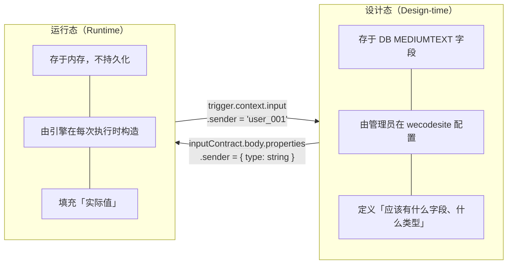
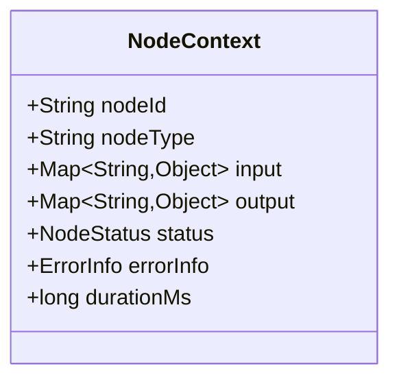
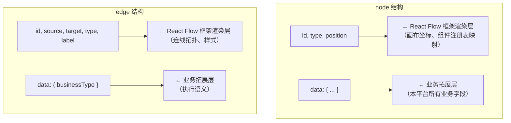
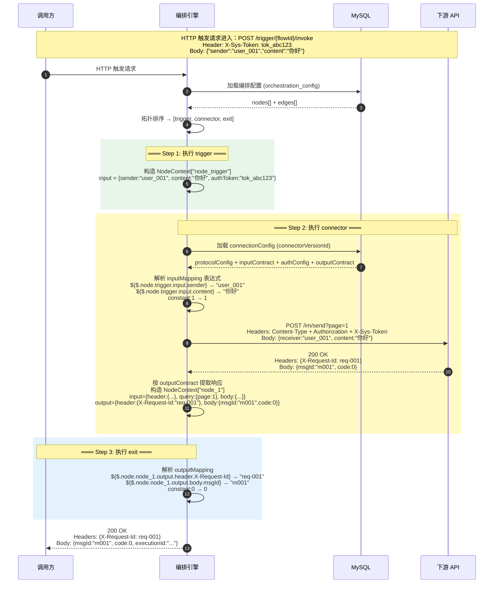

# JSON 构建逻辑实现参考：设计态与运行态

**关联文档**: plan-json-schema.md  
**版本**: v1.0  
**创建日期**: 2026-05-26  
**目标读者**: connector-api / open-server 后端开发者  
**用途**: 基于 JSON Schema 设计规范，给出代码实现时「如何构造 JSON 对象」的逐步骤算法说明

---

## 0. 核心概念速览



每个节点执行完成后，其输入输出被抽象为一个 **JSON 节点上下文对象**（Node Context Object）：



下游节点**可见**其所有前置节点的 NodeContext 的全部字段。表达式 `${$.node.{nodeId}.{input/output}.xxx}` 即引用这些字段。

---

## 1. 设计态 JSON 构建

### 1.1 构建 connectionConfig

**存储位置**: `connector_version_t.connection_config`（MEDIUMTEXT）  
**Schema**: `plan-json-schema.md §4`

```java
// 伪代码：构建连接器连接配置
ConnectionConfig config = ConnectionConfig.builder()
    .labelCn("发送消息")
    .labelEn("Send Message")
    .protocol("HTTP")                          // MVP 固定 HTTP
    .protocolConfig(ProtocolConfig.builder()
        .url("https://api.example.com/im/send")
        .method("POST")
        .headers(Map.of("Content-Type", "application/json"))  // 固定头
        .build())
    .authConfig(AuthConfig.builder()           // 仅声明类型，不存凭证值
        .type("AKSK")                          // JSON 中为字符串枚举
        .fields(List.of(
            FieldDef.of("accessKey", "header", "AK", true, true),
            FieldDef.of("secretKey", "header", "SK", true, true)
        ))
        .build())
    .inputContract(InputContract.builder()     // 协议感知
        .protocol("HTTP")
        .header(JsonSchemaObject.builder()
            .type("object")
            .property("Authorization", StringField.of("string", "Bearer token"))
            .build())
        .query(JsonSchemaObject.builder()
            .type("object")
            .property("page", IntField.of("integer", "页码"))
            .required("page")
            .build())
        .body(JsonSchemaObject.builder()
            .type("object")
            .property("receiver", StringField.of("string", "接收者ID"))
            .property("content", StringField.of("string", "消息内容"))
            .required("receiver", "content")
            .build())
        .build())
    .outputContract(OutputContract.builder()   // 声明期望的返回值结构
        .protocol("HTTP")
        .header(JsonSchemaObject.builder()...)
        .body(JsonSchemaObject.builder()
            .type("object")
            .property("msgId", StringField.of("string", "消息ID"))
            .build())
        .build())
    .timeoutMs(3000)
    .rateLimitConfig(RateLimitConfig.builder()
        .maxQps(10)
        .maxConcurrency(5)
        .build())
    .build();
```

#### 关键规则

| 规则 | 说明 |
|:-----|:-----|
| `inputContract` 使用协议路由器 | JSON Schema 层面通过 `inputContractDef` 的 `oneOf` 路由到 `httpInputContractDef`，未来新增 REDIS/MYSQL 时新增 oneOf 分支即可 |
| `inputContract.{header,query,body}` | HTTP 下至少声明一段（`anyOf` 约束）。固定头（如 `Content-Type`）在 `protocolConfig.headers` 声明，此处仅声明**运行时动态传入**的参数 |
| `authConfig.type` 为**字符串枚举** | JSON 中用 `"SOA"`/`"AKSK"` 等，非 TINYINT。DB 列级才用 TINYINT |
| 凭证不存储 | `authConfig.fields[].sensitive: true` 仅标记，凭证值由调用方在触发时携带 |

---

### 1.2 构建 orchestrationConfig（编排配置）

**存储位置**: `flow_version_t.orchestration_config`（MEDIUMTEXT）  
**Schema**: `plan-json-schema.md §5.4`

orchestrationConfig 是 React Flow 格式的 DAG，框架字段与业务字段分离：



#### 构建步骤

**Step 1: 拓扑排序（应用层校验，JSON Schema 不覆盖）**

从 edges 数组计算出 DAG 拓扑序列，确保无环、无孤儿节点。参见 `plan-json-schema.md §5.5`。

**Step 2: 构建 trigger 节点**

```java
Node triggerNode = Node.builder()
    .id("node_trigger")          // 框架字段
    .type("trigger")             // 框架字段，映射 React 组件 + 业务分类
    .position(100.0, 200.0)      // 框架字段
    .data(TriggerData.builder()  // → node.data 业务字段
        .labelCn("接收请求")
        .labelEn("Receive Request")
        .type("http")            // 触发子类型：http / manual
        .authConfig(AuthConfig.builder()
            .type("SYSTOKEN")
            .fields(List.of(
                FieldDef.of("token", "header", "X-Sys-Token", true, true)
            ))
            .build())
        .inputContract(InputContract.builder()    // 声明触发请求体的 schema
            .protocol("HTTP")
            .body(JsonSchemaObject.builder()
                .type("object")
                .property("sender", StringField.of("string"))
                .property("content", StringField.of("string"))
                .required("sender", "content")
                .build())
            .build())
        .rateLimitConfig(RateLimitConfig.builder().maxQps(100).build())
        .build())
    .build();
```

> 💡 trigger 节点不含 `protocolConfig`（HTTP 端点由框架统一暴露）、不含 `timeoutMs`（引擎统一控制）、不含 `outputContract`（由 exit 节点定义）。

**Step 3: 构建 connector 节点**

```java
Node connectorNode = Node.builder()
    .id("node_1")
    .type("connector")
    .position(350.0, 200.0)
    .data(ConnectorData.builder()
        .labelCn("发送通知")
        .labelEn("Send Notification")
        .connectorVersionId("9876543210123456789")  // 引用的连接器版本雪花ID转string
        .inputMapping(InputMapping.builder()         // 分段映射：镜像 inputContract
            .header(Map.of(
                "Authorization", "${$.node.trigger.input.authToken}"
            ))
            .query(Map.of(
                "page", "constant:1"
            ))
            .body(Map.of(
                "receiver", "${$.node.trigger.input.sender}",
                "content",  "${$.node.trigger.input.content}"
            ))
            .build())
        .build())
    .build();
```

**inputMapping 构建规则**：

1. 读取连接器的 `connectionConfig.inputContract`（存于 `connector_version_t`）
2. 取其协议分段结构（HTTP 下为 header/query/body）
3. `inputMapping` 的 key 结构镜像 `inputContract`：如果 inputContract 有 `body.properties.{receiver, content}`，则 mapping 也有 `body.receiver` 和 `body.content`
4. `inputMapping` 的 value 为表达式：`${$.node.{上游节点id}.{input/output}.{字段路径}}` 或 `constant:值`
5. 必填检查由应用层在保存时执行——mapping 是否覆盖了 inputContract 中 `required` 的全部字段

**Step 4: 构建 data_processor 节点**

```java
Node dpNode = Node.builder()
    .id("node_2")
    .type("data_processor")
    .position(600.0, 200.0)
    .data(DataProcessorData.builder()
        .labelCn("格式化消息")
        .labelEn("Format Message")
        .config(ProcessorConfig.builder()
            .fieldMappings(List.of(
                FieldMapping.of("${node_1.msgId}", "result.id"),
                FieldMapping.of("constant:success", "result.status")
            ))
            .build())
        .build())
    .build();
```

**Step 5: 构建 exit 节点**

```java
Node exitNode = Node.builder()
    .id("node_exit")
    .type("exit")
    .position(850.0, 200.0)
    .data(ExitData.builder()
        .labelCn("返回结果")
        .labelEn("Return Result")
        .outputMapping(OutputMapping.builder()    // 分段映射：镜像 HTTP 响应结构
            .header(Map.of(
                "X-Request-Id", "${$.node.node_1.output.requestId}"
            ))
            .body(Map.of(
                "msgId", "${$.node.node_1.output.msgId}",
                "code",  "constant:0"
            ))
            .build())
        .build())
    .build();
```

**outputMapping 构建规则**：

1. exit 的 `outputMapping` 结构镜像 HTTP 响应结构：`header` / `body` 两段
2. key 为对外返回的字段名，value 为表达式
3. 可重命名：`body.msgId` 映射到上游的 `node_1.output.msgId`，调用方收到的字段名为 `msgId`

**Step 6: 构建 edges 数组**

```java
List<Edge> edges = List.of(
    Edge.builder()
        .id("e1")
        .source("node_trigger")    // React Flow 固定字段名
        .target("node_1")
        .type("smoothstep")        // 渲染样式（框架字段）
        .label("触发")             // 画布展示文本
        .data(EdgeBusinessData.builder()
            .businessType("default")  // 业务语义（MVP 仅 default）
            .build())
        .build(),
    Edge.builder()
        .id("e2")
        .source("node_1")
        .target("node_exit")
        .type("smoothstep")
        .label("发送完成")
        .data(EdgeBusinessData.builder().businessType("default").build())
        .build()
);
```

**Step 7: 组装**

```java
OrchestrationConfig orch = OrchestrationConfig.builder()
    .nodes(List.of(triggerNode, connectorNode, exitNode))
    .edges(edges)
    .build();

// Jackson 序列化 → 写入 flow_version_t.orchestration_config (MEDIUMTEXT)
String json = objectMapper.writeValueAsString(orch);
```

---

## 2. 运行态 JSON 构建

### 2.1 NodeContext 对象结构

引擎在运行时为每个节点构造一个 NodeContext：

```java
// 每个节点执行时持有的上下文
class NodeContext {
    String nodeId;                    // 如 "trigger" / "node_1" / "node_exit"
    String nodeType;                  // trigger / connector / data_processor / exit
    Map<String, Object> input;        // 节点收到的输入（key-value 扁平数据）
    Map<String, Object> output;       // 节点执行后的输出
    NodeStatus status;                // SUCCESS / FAILED
    ErrorInfo errorInfo;              // 失败时的错误详情
    long durationMs;
}
```

执行引擎维护一个 `Map<String, NodeContext>`，key 为 `nodeId`，value 为该节点的上下文。所有已执行节点的上下文对下游可见。

### 2.2 逐节点构建流程

以下按一个典型的三节点编排（trigger → connector → exit）展示运行时构建逻辑。

#### 2.2.1 外部触发接收 → 构建 ExecutionContext

```java
// HTTP 触发入口收到请求
// POST /api/v1/trigger/{flowId}/invoke
// Body: { "sender": "user_001", "content": "你好" }

// 1. 加载编排配置（设计态）
OrchestrationConfig orch = loadFromDb(flowId);   // 从 flow_version_t 读取
List<Node> nodes = orch.getNodes();
List<Edge> edges = orch.getEdges();

// 2. 拓扑排序
List<Node> sortedNodes = topologicalSort(nodes, edges);
// → ["node_trigger", "node_1", "node_exit"]

// 3. 创建执行上下文
ExecutionContext ctx = ExecutionContext.builder()
    .flowId(flowId)
    .executionId(generateSnowflakeId())
    .nodes(sortedNodes)
    .nodeContexts(new ConcurrentHashMap<>())    // 空 Map，逐节点填充
    .credentials(extractCredentials(request))   // 从请求头提取凭证（仅内存）
    .build();
```

#### 2.2.2 执行 trigger 节点

```java
// 获取 trigger 节点的设计态定义
Node triggerDesignNode = sortedNodes.get(0);       // node.type == "trigger"
TriggerData triggerData = (TriggerData) triggerDesignNode.getData();

// 构造 trigger 的 NodeContext
NodeContext triggerCtx = NodeContext.builder()
    .nodeId("node_trigger")
    .nodeType("trigger")
    .input(Map.of(
        "sender",  "user_001",     // 来自 HTTP 请求体
        "content", "你好",          // 来自 HTTP 请求体
        "authToken", ctx.getCredential("X-Sys-Token")  // 来自请求头，按 authConfig 声明提取
    ))
    .output(null)                  // trigger 的输出 = 请求体数据，不做额外转换
    .status(NodeStatus.SUCCESS)
    .build();

ctx.getNodeContexts().put("node_trigger", triggerCtx);
```

> trigger 的 `input` 直接来自 HTTP 请求体（raw body），引擎不在此阶段做 schema 校验（校验在进入时完成）。trigger 的 `output` 可为 null 或等同于 input（取决于实现）。

#### 2.2.3 执行 connector 节点

这是最复杂的步骤——需要**加载连接器配置 + 解析 inputMapping 表达式 + 构造实际 HTTP 请求**。

```java
// 1. 获取 connector 节点的设计态定义
Node connectorDesignNode = sortedNodes.get(1);
ConnectorData connectorData = (ConnectorData) connectorDesignNode.getData();
String connectorVersionId = connectorData.getConnectorVersionId();

// 2. 从 DB 加载连接器配置（connectionConfig）
ConnectionConfig connConfig = loadConnectorConfig(connectorVersionId);
// 得到：protocol="HTTP", protocolConfig={url, method, headers}, 
//       inputContract={header, query, body}, outputContract={header, body},
//       authConfig={type, fields}, timeoutMs, rateLimitConfig

// 3. 构造 connector 的 input（解析 inputMapping）
//    inputMapping 设计态：
//      { header: {"Authorization": "${$.node.trigger.input.authToken}"},
//        query:   {"page": "constant:1"},
//        body:    {"receiver": "${$.node.trigger.input.sender}",
//                  "content":  "${$.node.trigger.input.content}"} }

InputMapping mapping = connectorData.getInputMapping();
Map<String, NodeContext> allContexts = ctx.getNodeContexts();  // 前置节点上下文

// 解析表达式
Map<String, Object> headerParams = resolveMapping(mapping.getHeader(), allContexts);
// → {"Authorization": "xxxxx"}
Map<String, Object> queryParams = resolveMapping(mapping.getQuery(), allContexts);
// → {"page": 1}
Map<String, Object> bodyParams = resolveMapping(mapping.getBody(), allContexts);
// → {"receiver": "user_001", "content": "你好"}

// 4. 构造 connector 的 input（存为 NodeContext.input）
Map<String, Object> connectorInput = new LinkedHashMap<>();
connectorInput.put("header", headerParams);
connectorInput.put("query", queryParams);
connectorInput.put("body", bodyParams);

// 5. 构造实际 HTTP 请求
//    固定头（Content-Type）来自 protocolConfig.headers
//    动态头（Authorization）来自 headerParams
//    认证凭证（如 X-Sys-Token）来自 ctx.credentials，按 authConfig 声明注入
HttpHeaders headers = new HttpHeaders();
headers.addAll(connConfig.getProtocolConfig().getHeaders());  // 固定头
for (Map.Entry<String, Object> h : headerParams.entrySet()) {
    headers.set(h.getKey(), String.valueOf(h.getValue()));    // 动态头
}
// 按 authConfig 注入认证凭证
for (FieldDef field : connConfig.getAuthConfig().getFields()) {
    String credentialValue = ctx.getCredentials().get(field.getName());
    if (credentialValue != null) {
        if ("header".equals(field.getCarrier())) {
            headers.set(field.getFieldName(), credentialValue);
        }
        // else if "query" → 注入 queryParams
    }
}

// 6. 执行 HTTP 调用
Mono<HttpResponse> responseMono = webClient
    .method(connConfig.getProtocolConfig().getMethod())
    .uri(buildUri(connConfig.getProtocolConfig().getUrl(), queryParams))
    .headers(h -> h.addAll(headers))
    .bodyValue(bodyParams)
    .retrieve()
    .toEntity(Map.class)
    .timeout(Duration.ofMillis(connConfig.getTimeoutMs()));

// 7. 解析响应并构造 output
HttpResponse response = responseMono.block();
Map<String, Object> connectorOutput = new LinkedHashMap<>();
// 按 outputContract 声明提取响应数据
if (connConfig.getOutputContract().getHeader() != null) {
    connectorOutput.put("header", extractHeaderFields(response, connConfig.getOutputContract().getHeader()));
}
if (connConfig.getOutputContract().getBody() != null) {
    connectorOutput.put("body", parseResponseBody(response, connConfig.getOutputContract().getBody()));
}
// 实际 output 示例：
// { "header": {"X-Request-Id": "req-001"}, "body": {"msgId": "m001", "code": 0} }

// 8. 构造 connector 的 NodeContext
NodeContext connectorCtx = NodeContext.builder()
    .nodeId("node_1")
    .nodeType("connector")
    .input(connectorInput)
    .output(connectorOutput)
    .status(NodeStatus.SUCCESS)
    .durationMs(response.getDuration())
    .build();

ctx.getNodeContexts().put("node_1", connectorCtx);
```

#### 2.2.4 执行 exit 节点

```java
Node exitDesignNode = sortedNodes.get(2);
ExitData exitData = (ExitData) exitDesignNode.getData();
OutputMapping mapping = exitData.getOutputMapping();
Map<String, NodeContext> allContexts = ctx.getNodeContexts();

// 解析 outputMapping 表达式
Map<String, Object> responseHeaders = resolveMapping(mapping.getHeader(), allContexts);
Map<String, Object> responseBody   = resolveMapping(mapping.getBody(), allContexts);

// 构造最终 HTTP 响应（退出 connector-api，返回给调用方）
HttpResponse finalResponse = buildHttpResponse(responseHeaders, responseBody);
// 响应：Header { X-Request-Id: "req-001" }
//       Body   { msgId: "m001", code: 0 }

// 构造 exit 的 NodeContext
NodeContext exitCtx = NodeContext.builder()
    .nodeId("node_exit")
    .nodeType("exit")
    .input(Map.of("header", responseHeaders, "body", responseBody))
    .output(Map.of("header", responseHeaders, "body", responseBody))
    .status(NodeStatus.SUCCESS)
    .build();

ctx.getNodeContexts().put("node_exit", exitCtx);
```

#### 2.2.5 执行 data_processor 节点（插在 connector 与 exit 之间时）

```java
Node dpDesignNode = sortedNodes.get(i);
DataProcessorData dpData = (DataProcessorData) dpDesignNode.getData();
ProcessorConfig config = dpData.getConfig();
List<FieldMapping> mappings = config.getFieldMappings();

// data_processor 的 input = 可见的上游所有 context（全量透传）
Map<String, NodeContext> allContexts = ctx.getNodeContexts();

// 执行字段映射
Map<String, Object> dpOutput = new LinkedHashMap<>();
for (FieldMapping fm : mappings) {
    Object value = resolveExpression(fm.getSource(), allContexts);
    // 按 target 的路径写入嵌套对象
    setNestedValue(dpOutput, fm.getTarget(), value);
}
// 例如 fieldMappings:
//   {source: "${node_1.msgId}", target: "result.id"}    → dpOutput.result.id = "m001"
//   {source: "constant:success", target: "result.status"} → dpOutput.result.status = "success"
// 结果: { "result": { "id": "m001", "status": "success" } }

NodeContext dpCtx = NodeContext.builder()
    .nodeId("node_2")
    .nodeType("data_processor")
    .input(allContexts)       // data_processor 接收所有上游上下文
    .output(dpOutput)
    .status(NodeStatus.SUCCESS)
    .build();

ctx.getNodeContexts().put("node_2", dpCtx);
```

---

## 3. 表达式解析引擎

### 3.1 表达式语法

| 表达式 | 解析模式 | 示例 |
|:-------|:---------|:-----|
| `constant:xxx` | 直接返回字面值 | `constant:1` → `1`, `constant:success` → `"success"` |
| `${$.node.{nodeId}.{section}.{path}}` | 从 NodeContext 中取值 | `${$.node.trigger.input.sender}` → `"user_001"` |
| `${$.system.xxx}` | 从系统上下文取值（V2） | `${$.system.env.region}` |

### 3.2 解析算法

```java
/**
 * 解析单个表达式，从所有已执行的 NodeContext 中获取值
 */
public Object resolveExpression(String expr, Map<String, NodeContext> contexts) {
    if (expr == null || expr.isBlank()) return null;

    // 1. constant: 前缀 → 直接返回字面值
    if (expr.startsWith("constant:")) {
        return expr.substring("constant:".length());
    }

    // 2. ${...} → JSON Path 表达式
    if (expr.startsWith("${") && expr.endsWith("}")) {
        String inner = expr.substring(2, expr.length() - 1);    // $.node.trigger.input.sender

        // 3. 按 "." 拆分路径
        String[] parts = inner.split("\\.");
        // ["$.node", "trigger", "input", "sender"]     — $.node 合并为一段
        //   或 ["$.system", "env", "region"]

        if (parts.length < 2) {
            throw new ExpressionException("表达式格式错误: " + expr);
        }

        String scope = parts[0];   // "$.node" 或 "$.system"

        if ("$.node".equals(scope)) {
            String nodeId  = parts[1];     // "trigger"
            String section = parts[2];     // "input" 或 "output"
            String fieldPath = joinPath(parts, 3);  // "sender" 或 "result.msgId"

            NodeContext ctx = contexts.get(nodeId);
            if (ctx == null) {
                throw new ExpressionException("表达式引用的节点上下文不存在: nodeId=" + nodeId);
            }

            Map<String, Object> sourceMap;
            if ("input".equals(section)) {
                sourceMap = ctx.getInput();
            } else if ("output".equals(section)) {
                sourceMap = ctx.getOutput();
            } else {
                throw new ExpressionException("未知上下文分区: " + section);
            }

            return getNestedValue(sourceMap, fieldPath);

        } else if ("$.system".equals(scope)) {
            // V2：系统级上下文解析
            String fieldPath = joinPath(parts, 1);
            return getNestedValue(SystemContext.global(), fieldPath);
        }
    }

    throw new ExpressionException("无法识别的表达式: " + expr);
}

/**
 * 递归展开嵌套路径取值
 * "result.msgId" → sourceMap.get("result").get("msgId")
 */
private Object getNestedValue(Map<String, Object> map, String path) {
    String[] keys = path.split("\\.");
    Object current = map;
    for (String key : keys) {
        if (current instanceof Map) {
            current = ((Map<String, Object>) current).get(key);
        } else {
            return null;  // 路径中断，字段不存在
        }
    }
    return current;
}
```

### 3.3 批量解析 Mapping

```java
/**
 * 解析一个分段 mapping（如 header/body），返回 key-value 结果 Map
 */
public Map<String, Object> resolveMapping(
        Map<String, String> mapping,           // { "receiver": "${$.node.trigger.input.sender}", ... }
        Map<String, NodeContext> contexts
) {
    Map<String, Object> result = new LinkedHashMap<>();
    for (Map.Entry<String, String> entry : mapping.entrySet()) {
        Object resolved = resolveExpression(entry.getValue(), contexts);
        result.put(entry.getKey(), resolved);
    }
    return result;
}
```

---

## 4. 完整端到端示例

### 设计态配置（存于 DB）

下面是编排配置 `orchestration_config` 的完整 JSON（设计态），引擎运行时从中读取并构造运行态对象：

```json
{
  "nodes": [
    {
      "id": "node_trigger", "type": "trigger",
      "position": { "x": 100.0, "y": 200.0 },
      "data": {
        "labelCn": "接收请求", "labelEn": "Receive Request",
        "type": "http",
        "authConfig": {
          "type": "SYSTOKEN",
          "fields": [{ "name": "token", "carrier": "header", "fieldName": "X-Sys-Token" }]
        },
        "inputContract": {
          "protocol": "HTTP",
          "body": {
            "type": "object",
            "properties": {
              "sender": { "type": "string" },
              "content": { "type": "string" }
            },
            "required": ["sender", "content"]
          }
        },
        "rateLimitConfig": { "maxQps": 100 }
      }
    },
    {
      "id": "node_1", "type": "connector",
      "position": { "x": 350.0, "y": 200.0 },
      "data": {
        "labelCn": "发送通知", "labelEn": "Send Notification",
        "connectorVersionId": "9876543210123456789",
        "inputMapping": {
          "header": { "Authorization": "${$.node.trigger.input.authToken}" },
          "query": { "page": "constant:1" },
          "body": {
            "receiver": "${$.node.trigger.input.sender}",
            "content": "${$.node.trigger.input.content}"
          }
        }
      }
    },
    {
      "id": "node_exit", "type": "exit",
      "position": { "x": 650.0, "y": 200.0 },
      "data": {
        "labelCn": "返回结果", "labelEn": "Return Result",
        "outputMapping": {
          "header": { "X-Request-Id": "${$.node.node_1.output.header.X-Request-Id}" },
          "body": {
            "msgId": "${$.node.node_1.output.body.msgId}",
            "code": "constant:0"
          }
        }
      }
    }
  ],
  "edges": [
    { "id": "e1", "source": "node_trigger", "target": "node_1", "type": "smoothstep", "label": "触发", "data": { "businessType": "default" } },
    { "id": "e2", "source": "node_1", "target": "node_exit", "type": "smoothstep", "label": "发送完成", "data": { "businessType": "default" } }
  ]
}
```

### 运行态构建（内存中依次构造）



---

## 5. 数据可见性规则

| 节点执行顺序 | 已可见的 NodeContext | 不可见 |
|:-----------|:-----|:-----|
| trigger 执行时 | 无 | — |
| connector(node_1) 执行时 | `node_trigger` | — |
| data_processor(node_2) 执行时 | `node_trigger`, `node_1` | — |
| exit 执行时 | 全部前置节点 | — |

> 表达式 `${$.node.trigger.input.sender}` 在 connector 节点执行时可直接解析，因为 trigger 已经在 connector 之前执行完毕，其 NodeContext 已写入 `ctx.getNodeContexts()`。

### connect.data_processor 表达式的 input/output 分区访问

data_processor 节点的 `fieldMappings[].source` 需要同时能访问上游节点的 **input** 和 **output** 分区。当前 Schema 中的 expression pattern 支持 `${nodeId.contextSection.fieldPath}` 格式。

但注意 **data_processor 的表达式语法尚未完全对齐 plan-json-schema.md v5.4 的 JSON Path 层级格式**（其 Schema 中的 pattern `^(\$\{[a-zA-Z0-9_.]+\}|constant:[a-zA-Z0-9_]+)$` 较宽松）。建议实现时统一用 `${$.node.{nodeId}.{input/output}.{path}}` 解析引擎，向后兼容旧格式：

```java
// data_processor source 表达式兼容解析
public Object resolveDataProcessorSource(String expr, Map<String, NodeContext> contexts) {
    // 新格式: ${$.node.node_1.output.msgId}
    if (expr.startsWith("${$.node.")) {
        return resolveExpression(expr, contexts);
    }
    // 旧格式: ${node_1.msgId}（默认按 output 分区查找）
    if (expr.startsWith("${") && !expr.contains("$.")) {
        String[] parts = extractOldFormat(expr); // ["node_1", "msgId"]
        String nodeId = parts[0];
        String fieldPath = parts[1];
        return getNestedValue(contexts.get(nodeId).getOutput(), fieldPath);
    }
    return resolveExpression(expr, contexts);
}
```

---

## 6. 错误处理与 errorInfo 构建

节点执行失败时，构造 `errorInfo` 对象（定义见 `plan-json-schema.md §3.3.8`）：

**下游调用失败**（code 4xx/5xx）:
```java
ErrorInfo errorInfo = ErrorInfo.builder()
    .code(String.valueOf(downstreamStatus))   // "503"
    .messageZh("下游服务不可用")
    .messageEn("Downstream Service Unavailable")
    .downstreamStatus(downstreamStatus)
    .downstreamBody(truncate(responseBody, 512))
    .build();
```

**内部错误**（code 6xxxx）:
```java
ErrorInfo errorInfo = ErrorInfo.builder()
    .code("6001")
    .messageZh("字段映射失败")
    .messageEn("Field Mapping Failed")
    .cause("source 字段 ${$.node.node_1.output.msgId} 在上游节点输出中不存在")
    .build();
```

---

## 7. 关键实现检查清单

| # | 检查项 | 对应章节 |
|:--|:------|:---------|
| 1 | `node.data` 嵌套正确，业务字段不放在 node 顶层 | §1.2 Step 2-5 |
| 2 | edge 使用 `source`/`target`（非 `sourceNodeId`/`targetNodeId`） | §1.2 Step 6 |
| 3 | `authConfig.type` JSON 中为字符串枚举（`"SOA"`/`"AKSK"`），非 TINYINT | §1.1 |
| 4 | `inputContract`/`outputContract` 包含 `protocol` 标识 + 协议分段结构 | §1.1 |
| 5 | `inputMapping` 结构镜像 `inputContract` 的协议分段 | §1.2 Step 3 |
| 6 | `outputMapping` 为 object（header/body），非 array | §1.2 Step 5 |
| 7 | 表达式使用 `${$.node.{nodeId}.{input/output}.{path}}` 格式 | §3 |
| 8 | `constant:xxx` 直接返回字面值，不解析 | §3.1 |
| 9 | 下游节点可访问所有前置 NodeContext 的 input 和 output | §5 |
| 10 | 凭证仅内存生命周期，不持久化；写入 execution_record 时按 `sensitive: true` 脱敏 | §2.2.3 |
| 11 | errorInfo 符合 oneOf 约束：6xxxx→cause，4xx/5xx→downstreamStatus | §6 |
| 12 | data_processor 表达式向后兼容旧 `${nodeId.fieldPath}` 格式 | §5 |
