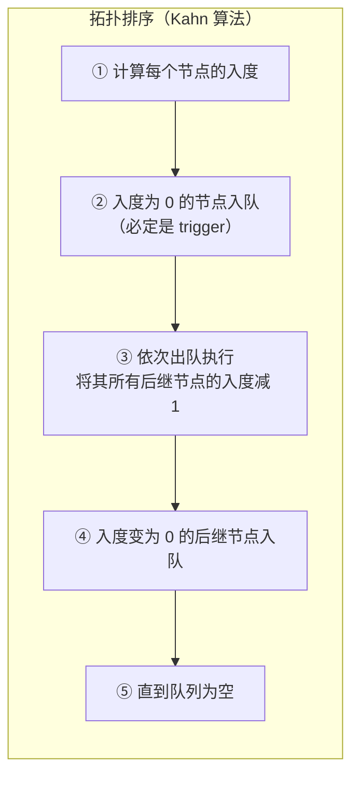
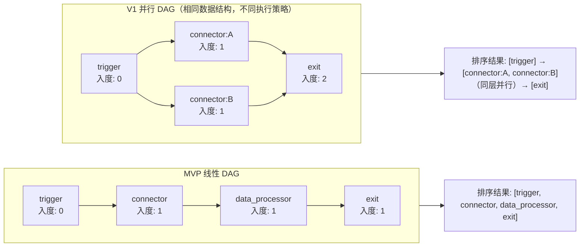
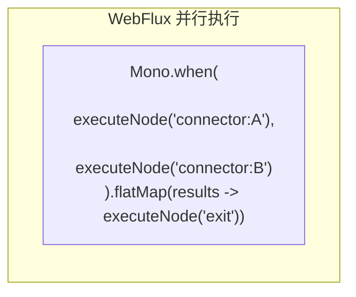

# JSON Schema 设计规范：连接器平台

**关联文档**: plan.md, plan-db.md (§3 表结构定义), plan-api.md (§3 接口详细定义)  
**版本**: v4.0
**创建日期**: 2026-05-22  
**最后更新**: 2026-05-25
**修订说明**: v4.0 — React Flow 官方格式全文档对齐：node.data 嵌套、edge.source/target、edge.type/edge.data 语义分离、nodeDataSchema 独立抽取、§7 精简、§8 精简

---

## 1. 设计哲学

### 1.1 设计目标

| 目标 | 说明 |
|------|------|
| **自描述** | Schema 本身说清字段含义、类型、约束，不散落在代码注释中 |
| **一致性** | 同一语义的字段在不同上下文中命名统一 |
| **可扩展** | 可新增字段，不破坏已有结构 |
| **无冗余** | 不用的字段不出现在 Schema 中 |

### 1.2 参考标准

| 标准 | 参考程度 | 说明 |
|------|---------|------|
| JSON Schema (draft-07) | ⭐⭐⭐ 核心 | `type` / `properties` / `required` / `description` / `definitions` / `oneOf` / `allOf` / `if`-`then` 等元字段直接复用 |
| OpenAPI 3.0 components/schemas | ⭐⭐⭐ 结构 | 可复用组件（authConfig / rateLimitConfig）+ 按场景组合的思想 |

### 1.3 核心原则

```
原则一：同一事物同一个名
  authConfig → 触发器和连接器用同一结构
  rateLimitConfig      → 入站和出站限流用同一结构
  inputContract    → 触发器和连接器统一命名

原则二：不用的字段不出现
  trigger 不需要 protocolConfig（HTTP 端点固定）
  trigger 不需要 timeoutMs（引擎统一控制）
  trigger 不需要 outputContract（由编排 exit 节点定义）

原则三：DAG（有向无环图）的边也是数据，需要语义
  edge 不仅是"谁连到谁"，还承载执行条件（condition）/ 错误路由（error）/ 优先级
  MVP 仅用 default 边，但数据结构须为 V1 分支/容错/并行留好扩展槽

原则四：框架/业务字段严格分离
  node.id / node.type / node.position → React Flow 框架字段
  node.data 内的一切 → 业务字段
  edge.source / edge.target / edge.type(渲染) → React Flow 框架字段
  edge.data 内的一切 → 业务字段
```

---

## 2. 统一字段命名规则

| 上下文 | 规则 | 示例 |
|--------|------|------|
| JSON 内部所有键名 | camelCase | `nameCn` / `authConfig` / `connectorVersionId` |
| 引用外部资源 ID | `*Id` 后缀 + string 类型 | `connectorVersionId: "1234567890"` |
| 时间字段 | `*Time` 后缀 | `createTime` / `publishedTime` |
| 布尔字段 | `is*` 前缀 | `isDeleted` / `isTest` |
| 扩展字段（V1） | `x_*` 前缀 | `x_customMetadata` |
| **数据库列级枚举** | **TINYINT 数字**（plan-db.md §0.7 规范） | `connector_type=1`, `lifecycle_status=2` |
| **JSON 内嵌枚举** | **UPPER_SNAKE_CASE 字符串**（例外，见 §2.1） | `"SOA"` / `"APIG"` / `"SYSTOKEN"` / `"AKSK"` / `"NONE"` |
| **React Flow 框架字段** | **遵循 React Flow 官方命名** | `source`/`target`（非 sourceNodeId/targetNodeId） |

### 2.1 JSON 内嵌枚举使用字符串的例外说明

> ⚠️ **设计决策**：`authConfig.type` 作为存储在 `MEDIUMTEXT` JSON 字段内的嵌套值，使用**字符串枚举**而非 TINYINT 数字。这与 `plan-db.md` §0.7「所有枚举字段统一 TINYINT(10)」规则表面冲突，但属于**有意为之的例外**：
>
> | 维度 | 数据库列级枚举 | JSON 内嵌枚举 |
> |------|--------------|-------------|
> | **字段位置** | MySQL 列（如 `connector_type tinyint`） | MEDIUMTEXT 列的 JSON 子字段 |
> | **枚举表示** | TINYINT 数字 | 字符串（`"SOA"` / `"AKSK"` 等） |
> | **设计理由** | 存储效率 + 索引效率 | 人类可读：前端 React Flow 属性面板直接展示；跨语言 debugging 无需查字典；版本快照 self-describing |
> | **ORM 映射** | MyBatis/R2DBC 直接映射 int | Jackson 序列化/反序列化字符串 → Java enum |
> | **规范适用** | plan-db.md §0.7 | 本文档 §2（本节） |
>
> 枚举值对应关系（JSON 字符串 ⇄ DB TINYINT，应用层映射）：
>
> | JSON 字符串 | TINYINT 代码 | 使用上下文 |
> |------------|:-----------:|-----------|
> | `SOA` | 1 | 连接器认证 |
> | `APIG` | 2 | 连接器认证 |
> | `NONE` | 4 | 连接器认证 |
> | `AKSK` | 5 | 连接器认证 |
> | `SYSTOKEN` | 7 | 触发器认证 |

---

## 3. definitions 聚合段（🆕 v3.0）

> 💡 **v3.0 新增**：所有 `$ref` 引用的共享组件在此聚合。以下 §4 节中的各上下文 Schema 通过 `#/definitions/xxx` 引用这些组件，保证 `$ref` 路径可解析。
>
> ### §3.0 字段名 ↔ 校验类型映射
>
> 为避免「字段名与 Schema 名相同」产生的歧义，本规范区分两者：
> - **字段名（field name）**：JSON 数据中的属性键，描述「存什么数据」（如 `authConfig`、`rateLimitConfig`）
> - **校验类型（definition key）**：definitions 中的组件键名，描述「用什么规则校验」（如 `authConfigDef`、`rateLimitDef`）
>
> ```mermaid
> graph LR
>     subgraph Fields["JSON 字段名<br/>（数据侧）"]
>         F1["authConfig<br/>认证 schema 数据"]
>         F2["rateLimitConfig<br/>限流数据"]
>         F3["inputContract<br/>入参 schema 数据"]
>         F4["outputContract<br/>出参 schema 数据"]
>         F5["errorInfo<br/>错误信息数据"]
>         F6["position<br/>画布坐标数据"]
>     end
>
>     subgraph Defs["definitions 校验类型<br/>（规则侧）"]
>         D1["authConfigDef<br/>校验认证类型声明"]
>         D2["rateLimitDef<br/>校验限流配置"]
>         D3["dataContractDef<br/>校验数据契约结构"]
>         D5["errorInfoDef<br/>校验错误详情"]
>         D6["positionDef<br/>校验画布坐标"]
>     end
>
>     F1 -- "$ref" --> D1
>     F2 -- "$ref" --> D2
>     F3 -- "$ref" --> D3
>     F4 -- "$ref" --> D3
>     F5 -- "$ref" --> D5
>     F6 -- "$ref" --> D6
>
>     style Fields fill:#e3f2fd,stroke:#1565c0
>     style Defs fill:#fff3e0,stroke:#ef6c00
> ```
>
> **副作用**：以下 Schema 定义中，你会看到 `"authConfig": { "$ref": "#/definitions/authConfigDef" }`——左侧是字段名，右侧是校验类型，两者语义关联但字面不同。
>
> **v4.0 新增**：本 definitions 聚合段新增 `nodeDataSchema` / `triggerData` / `connectorData` / `dataProcessorData` / `exitData` 共 5 个组件，用于 §4.3 orchestrationConfig 中 `node.data` 的按类型校验。

```json
{
  "$schema": "http://json-schema.org/draft-07/schema#",
  "$id": "urn:openapp:schema:definitions:v2",
  "title": "共享 Schema 组件聚合",
  "description": "所有上下文 Schema 共用的组件定义。v2：新增 nodeDataSchema 及四种节点数据子定义",

  "definitions": {

    "authConfigDef": {
      "$id": "urn:openapp:schema:authConfigDef:v1",
      "title": "authConfigDef",
      "description": "认证类型声明。校验 JSON 字段 authConfig 的数据结构，声明调用方需携带的认证凭证。type 使用字符串枚举（见 §2.1 例外说明）",
      "type": "object",
      "additionalProperties": false,
      "properties": {
        "type": {
          "type": "string",
          "description": "认证类型枚举（JSON 内嵌字段用字符串，非 TINYINT；参见 §2.1）",
          "enum": ["SOA", "APIG", "SYSTOKEN", "AKSK", "NONE"]
        },
        "fields": {
          "type": "array",
          "description": "凭证字段列表，每个元素定义一个凭证字段的完整信息",
          "items": {
            "type": "object",
            "additionalProperties": false,
            "properties": {
              "name": { "type": "string", "description": "字段名，程序内部标识" },
              "carrier": { "type": "string", "description": "传递位置", "enum": ["header", "query"] },
              "fieldName": { "type": "string", "description": "实际携带时的字段名，如 Authorization / X-Sys-Token" },
              "required": { "type": "boolean", "default": true },
              "sensitive": { "type": "boolean", "default": false, "description": "运行时脱敏" }
            },
            "required": ["name", "carrier", "fieldName"]
          }
        }
      },
      "required": ["type"]
    },

    "rateLimitDef": {
      "$id": "urn:openapp:schema:rateLimitDef:v1",
      "title": "rateLimitDef",
      "description": "限流配置。校验 JSON 字段 rateLimitConfig 的数据结构，触发器和连接器复用同一类型",
      "type": "object",
      "additionalProperties": false,
      "properties": {
        "maxQps": {
          "type": "integer",
          "description": "每秒最大请求数（1-10000）",
          "minimum": 1,
          "maximum": 10000
        },
        "maxConcurrency": {
          "type": "integer",
          "description": "最大并发数（1-1000）",
          "minimum": 1,
          "maximum": 1000
        }
      }
    },

    "dataContractDef": {
      "$id": "urn:openapp:schema:dataContractDef:v1",
      "title": "dataContractDef",
      "description": "数据契约。校验 JSON 字段 inputContract / outputContract 的数据结构，遵循 JSON Schema draft-07 子集",
      "type": "object",
      "properties": {
        "type": {
          "type": "string",
          "description": "顶层固定为 object",
          "enum": ["object"]
        },
        "properties": {
          "type": "object",
          "description": "字段定义，value 为标准 JSON Schema 字段规则",
          "additionalProperties": {
            "type": "object",
            "properties": {
              "type": { "type": "string" },
              "description": { "type": "string" },
              "items": { "type": "object" },
              "enum": { "type": "array" },
              "default": {},
              "minimum": { "type": "number" },
              "maximum": { "type": "number" }
            },
            "required": ["type"]
          }
        },
        "required": {
          "type": "array",
          "description": "必填字段列表",
          "items": { "type": "string" }
        }
      },
      "required": ["type", "properties"]
    },

    "dataContractDefAlias": {
      "$ref": "urn:openapp:schema:dataContractDef:v1",
      "description": "outputContract 字段与 inputContract 共用同一个数据契约校验类型"
    },

    "errorInfoDef": {
      "$id": "urn:openapp:schema:errorInfoDef:v1",
      "title": "errorInfoDef",
      "description": "错误详情。校验 JSON 字段 errorInfo 的数据结构",
      "type": "object",
      "additionalProperties": false,
      "properties": {
        "code": { "type": "string", "description": "错误码" },
        "message": { "type": "string", "description": "错误描述" },
        "cause": {
          "type": "string",
          "description": "根因描述，非下游错误时使用（如 'JSON 解析失败：unexpected token at line 3'、'字段映射失败：source 字段不存在'）"
        },
        "downstreamStatus": { "type": "integer", "description": "下游 HTTP 状态码（下游调用失败时）" },
        "downstreamBody": { "type": "string", "description": "下游响应体片段（截断到 512 字符）" }
      },
      "required": ["code", "message"],
      "oneOf": [
        { "required": ["cause"], "description": "内部错误" },
        { "required": ["downstreamStatus"], "description": "下游错误" }
      ]
    },

    "positionDef": {
      "$id": "urn:openapp:schema:positionDef:v1",
      "title": "positionDef",
      "description": "画布坐标。校验 JSON 字段 position 的数据结构，React Flow (@xyflow/react) 使用浮点坐标",
      "type": "object",
      "additionalProperties": false,
      "properties": {
        "x": { "type": "number", "description": "画布 X 坐标" },
        "y": { "type": "number", "description": "画布 Y 坐标" }
      }
    },

    "nodeDataSchema": {
      "$id": "urn:openapp:schema:nodeDataSchema:v1",
      "title": "nodeDataSchema",
      "description": "节点业务数据 Schema。按 node.type 区分四种场景，通过 oneOf 确保不同类型的节点携带正确的业务字段。该 Schema 被 §4.3 orchestrationConfig 的 node.data 通过 $ref 引用",
      "type": "object",
      "oneOf": [
        {
          "$ref": "#/definitions/triggerData",
          "description": "当 node.type='trigger' 时，data 必须符合 triggerData 结构"
        },
        {
          "$ref": "#/definitions/connectorData",
          "description": "当 node.type='connector' 时，data 必须符合 connectorData 结构"
        },
        {
          "$ref": "#/definitions/dataProcessorData",
          "description": "当 node.type='data_processor' 时，data 必须符合 dataProcessorData 结构"
        },
        {
          "$ref": "#/definitions/exitData",
          "description": "当 node.type='exit' 时，data 必须符合 exitData 结构"
        }
      ]
    },

    "triggerData": {
      "$id": "urn:openapp:schema:triggerData:v1",
      "title": "triggerData",
      "description": "触发器节点业务数据。定义 node.type='trigger' 时 node.data 内的数据结构",
      "type": "object",
      "additionalProperties": false,
      "properties": {
        "labelCn": { "type": "string", "description": "节点中文标签" },
        "labelEn": { "type": "string", "description": "节点英文标签" },
        "type": {
          "type": "string",
          "description": "触发子类型。定义触发方式",
          "enum": ["http", "manual", "test"]
        },
        "authConfig": {
          "$ref": "#/definitions/authConfigDef",
          "description": "HTTP 触发时声明外部调用方需携带的认证凭证类型（仅声明 schema，不含凭证值）"
        },
        "inputContract": {
          "$ref": "#/definitions/dataContractDef",
          "description": "触发请求体的 JSON Schema（HTTP 触发时校验请求体）"
        },
        "rateLimitConfig": {
          "$ref": "#/definitions/rateLimitDef"
        }
      },
      "required": ["type"],
      "allOf": [
        {
          "if": {
            "properties": { "type": { "const": "http" } },
            "required": ["type"]
          },
          "then": {
            "required": ["authConfig", "inputContract"],
            "description": "HTTP 触发必须声明认证类型 schema 和入参 schema"
          }
        },
        {
          "if": {
            "properties": { "type": { "const": "manual" } },
            "required": ["type"]
          },
          "then": {
            "properties": {
              "authConfig": false,
              "inputContract": false
            },
            "description": "手动触发不需要认证和入参 schema（管理员手动填写参数）"
          }
        },
        {
          "if": {
            "properties": { "type": { "const": "test" } },
            "required": ["type"]
          },
          "then": {
            "description": "测试运行使用草稿编排配置，入参由管理员在 wecodesite 中填写模拟数据"
          }
        }
      ]
    },

    "connectorData": {
      "$id": "urn:openapp:schema:connectorData:v1",
      "title": "connectorData",
      "description": "连接器节点业务数据。定义 node.type='connector' 时 node.data 内的数据结构",
      "type": "object",
      "additionalProperties": false,
      "properties": {
        "labelCn": { "type": "string", "description": "节点中文标签" },
        "labelEn": { "type": "string", "description": "节点英文标签" },
        "connectorVersionId": {
          "type": "string",
          "pattern": "^[1-9][0-9]{15,19}$",
          "description": "引用的连接器版本 ID（BIGINT 雪花 ID 转 string，18-20 位数字）"
        },
        "inputMapping": {
          "type": "object",
          "description": "上游数据字段 → 连接器 inputContract 字段的映射。key 为连接器 inputContract 字段名，value 为表达式（如 ${trigger.sender}）"
        }
      },
      "required": ["connectorVersionId", "inputMapping"]
    },

    "dataProcessorData": {
      "$id": "urn:openapp:schema:dataProcessorData:v1",
      "title": "dataProcessorData",
      "description": "数据处理器节点业务数据。定义 node.type='data_processor' 时 node.data 内的数据结构",
      "type": "object",
      "additionalProperties": false,
      "properties": {
        "labelCn": { "type": "string", "description": "节点中文标签" },
        "labelEn": { "type": "string", "description": "节点英文标签" },
        "config": {
          "type": "object",
          "additionalProperties": false,
          "description": "管道转换配置。data_processor 不改 DAG 拓扑，仅做原地数据转换",
          "properties": {
            "fieldMappings": {
              "type": "array",
              "description": "字段映射列表。source 支持 ${nodeId.fieldPath} 或 constant:value 表达式",
              "minItems": 1,
              "items": {
                "type": "object",
                "additionalProperties": false,
                "properties": {
                  "source": {
                    "type": "string",
                    "pattern": "^(\\$\\{[a-zA-Z0-9_.]+\\}|constant:[a-zA-Z0-9_]+)$",
                    "description": "数据来源表达式。${nodeId.fieldPath} 引用上游节点输出，constant:xxx 为固定值"
                  },
                  "target": {
                    "type": "string",
                    "description": "目标字段路径，如 result.id / result.status"
                  }
                },
                "required": ["source", "target"]
              }
            }
          }
        }
      },
      "required": ["config"]
    },

    "exitData": {
      "$id": "urn:openapp:schema:exitData:v1",
      "title": "exitData",
      "description": "出口节点业务数据。定义 node.type='exit' 时 node.data 内的数据结构",
      "type": "object",
      "additionalProperties": false,
      "properties": {
        "labelCn": { "type": "string", "description": "节点中文标签" },
        "labelEn": { "type": "string", "description": "节点英文标签" },
        "outputFields": {
          "type": "array",
          "description": "对外暴露的返回值字段列表（如 ['result.msgId', 'result.code']）",
          "items": { "type": "string" },
          "minItems": 1
        }
      },
      "required": ["outputFields"]
    }
  }
}
```

---

## 4. 各上下文 Schema 定义

> 💡 以下每个 Schema 均为独立校验单元。所有 `$ref` 路径引用 §3 definitions 中的共享组件，保证引用可解析。

### 4.1 触发器 — triggerData（node.data 子结构）

该 Schema 定义了 `orchestrationConfig.nodes` 中 `type="trigger"` 节点 `node.data` 内的配置结构。

> 💡 **trigger ⇄ entry 命名映射**：编排配置中的 `type="trigger"` 对应执行记录 `execution_step_t.node_type = 1 (entry)`。两者语义等价——"trigger" 强调配置视角（声明触发方式），"entry" 强调运行时视角（DAG 入口节点）。跨文档命名已统一见 plan-db.md §0.7 枚举表。

**Schema 定义**：

```json
{
  "$schema": "http://json-schema.org/draft-07/schema#",
  "$id": "urn:openapp:schema:triggerData:v1",
  "title": "triggerData",
  "description": "触发器节点业务数据。定义 node.type='trigger' 时 node.data 内的数据结构",
  "type": "object",
  "additionalProperties": false,
  "properties": {
    "labelCn": { "type": "string", "description": "节点中文标签" },
    "labelEn": { "type": "string", "description": "节点英文标签" },
    "type": {
      "type": "string",
      "description": "触发子类型。定义触发方式",
      "enum": ["http", "manual", "test"]
    },
    "authConfig": {
      "$ref": "#/definitions/authConfigDef",
      "description": "HTTP 触发时声明外部调用方需携带的认证凭证类型（仅声明 schema，不含凭证值）"
    },
    "inputContract": {
      "$ref": "#/definitions/dataContractDef",
      "description": "触发请求体的 JSON Schema（HTTP 触发时校验请求体）"
    },
    "rateLimitConfig": {
      "$ref": "#/definitions/rateLimitDef"
    }
  },
  "required": ["type"],
  "allOf": [
    {
      "if": {
        "properties": { "type": { "const": "http" } },
        "required": ["type"]
      },
      "then": {
        "required": ["authConfig", "inputContract"],
        "description": "HTTP 触发必须声明认证类型 schema 和入参 schema"
      }
    },
    {
      "if": {
        "properties": { "type": { "const": "manual" } },
        "required": ["type"]
      },
      "then": {
        "properties": {
          "authConfig": false,
          "inputContract": false
        },
        "description": "手动触发不需要认证和入参 schema（管理员手动填写参数）"
      }
    },
    {
      "if": {
        "properties": { "type": { "const": "test" } },
        "required": ["type"]
      },
      "then": {
        "description": "测试运行使用草稿编排配置，入参由管理员在 wecodesite 中填写模拟数据"
      }
    }
  ]
}
```

**示例**（展示 `node.data` 上下文）：

```json
{
  "id": "node_trigger",
  "type": "trigger",
  "position": { "x": 100.0, "y": 200.0 },
  "data": {
    "labelCn": "接收请求",
    "labelEn": "Receive Request",
    "type": "http",
    "authConfig": {
      "type": "SYSTOKEN",
      "fields": [
        { "name": "token", "carrier": "header", "fieldName": "X-Sys-Token" }
      ]
    },
    "inputContract": {
      "type": "object",
      "properties": {
        "sender": { "type": "string", "description": "发送者 ID" },
        "content": { "type": "string", "description": "消息内容" }
      },
      "required": ["sender", "content"]
    },
    "rateLimitConfig": { "maxQps": 100 }
  }
}
```

> 💡 触发器节点不含 protocolConfig（HTTP 端点固定）、不含 timeoutMs（引擎统一控制）、不含 outputContract（由编排 exit 节点定义）。

**type 枚举上下文**：

| 上下文 | 可用枚举 | 说明 |
|--------|---------|------|
| 连接器认证（调用下游 API） | `SOA` / `APIG` / `NONE` / `AKSK` | 接入开放平台认证体系 |
| 触发器认证（外部触发流） | `SYSTOKEN` | 本版本仅此一种 |

---

### 4.2 连接器 — connectionConfig

> 💡 此配置独立存储于 `connector_version_t.connection_config`，不受 React Flow 格式约束。该 JSON 为连接器版本自身的对外 API 声明，不是 React Flow 画布产物。

**Schema 定义**：

```json
{
  "$schema": "http://json-schema.org/draft-07/schema#",
  "$id": "urn:openapp:schema:connectionConfig:v2",
  "title": "connectionConfig",
  "description": "连接器配置，声明如何调用下游 API。该 JSON 存储在 connector_version_t.connection_config MEDIUMTEXT 字段中。独立存储，不强制 React Flow 嵌套格式",
  "type": "object",
  "additionalProperties": false,
  "properties": {
    "labelCn": { "type": "string", "description": "连接器中文标签" },
    "labelEn": { "type": "string", "description": "连接器英文标签" },
    "protocol": {
      "type": "string",
      "description": "协议类型，MVP 仅 HTTP",
      "enum": ["HTTP"]
    },
    "protocolConfig": {
      "type": "object",
      "additionalProperties": false,
      "description": "协议配置",
      "properties": {
        "url": { "type": "string", "description": "下游 API 完整 URL" },
        "method": { "type": "string", "enum": ["GET", "POST", "PUT", "DELETE", "PATCH"] },
        "headers": {
          "type": "object",
          "description": "固定请求头（如 Content-Type），运行时注入的认证头不在此声明"
        }
      },
      "required": ["url", "method"]
    },
    "authConfig": { "$ref": "#/definitions/authConfigDef" },
    "inputContract": { "$ref": "#/definitions/dataContractDef" },
    "outputContract": { "$ref": "#/definitions/dataContractDef" },
    "timeoutMs": {
      "type": "integer",
      "description": "单次调用超时（毫秒）",
      "default": 30000,
      "minimum": 1000,
      "maximum": 300000
    },
    "rateLimitConfig": { "$ref": "#/definitions/rateLimitDef" }
  },
  "required": ["protocol", "protocolConfig"]
}
```

**示例**：

```json
{
  "labelCn": "发送消息",
  "labelEn": "Send Message",
  "protocol": "HTTP",
  "protocolConfig": {
    "url": "https://api.example.com/im/send",
    "method": "POST",
    "headers": { "Content-Type": "application/json" }
  },
  "authConfig": {
    "type": "SYSTOKEN",
    "fields": [
      { "name": "token", "carrier": "header", "fieldName": "X-Sys-Token" }
    ]
  },
  "inputContract": {
    "type": "object",
    "properties": {
      "receiver": { "type": "string", "description": "接收者 ID" },
      "content": { "type": "string", "description": "消息内容" }
    },
    "required": ["receiver", "content"]
  },
  "outputContract": {
    "type": "object",
    "properties": {
      "msgId": { "type": "string", "description": "消息 ID" }
    }
  },
  "timeoutMs": 30000,
  "rateLimitConfig": {
    "maxQps": 10,
    "maxConcurrency": 5
  }
}
```

> 💡 示例中不再出现 `$schemaName` 字段。版本标识由数据库 `connector_version_t.version_no` 承载，JSON 内容本身无需自标版本——应用层通过 Jackson 反序列化到固定 POJO 即可。

---

### 4.3 编排配置 — orchestrationConfig

> 🎯 **DAG（Directed Acyclic Graph，有向无环图）编排设计思路**
>
> 连接流编排的本质是将一个业务流程建模为有向无环图：每个节点执行一个原子操作（调用 API、转换数据），边决定操作的执行顺序和条件。连接流平台采用 **显式 DAG（nodes + edges）** 模型，参考 Make 平台的模块+路由表模式。
>
> ```mermaid
> graph TD
>     subgraph DAG["DAG = 节点（做什么）+ 边（何时做、以什么条件做）"]
>         subgraph Nodes["节点（nodes[]）"]
>             N1["trigger<br/>DAG 入口<br/>声明触发条件和入参契约"]
>             N2["connector<br/>数据获取/操作节点<br/>引用已发布的连接器版本"]
>             N3["data_processor<br/>管道节点<br/>原地转换数据，不改变拓扑<br/>（字段映射/表达式计算）"]
>             N4["exit<br/>DAG 出口<br/>声明对外暴露的返回值字段"]
>         end
>         subgraph Edges["边（edges[]）"]
>             E1["承载执行语义<br/>default / condition / error / always"]
>             E2["MVP 仅 default<br/>（无条件顺序执行）"]
>             E3["V1 扩展<br/>条件分支 / 错误路由"]
>         end
>     end
> ```
>
> **为什么是显式 edges 而非隐式顺序？**
> - React Flow 画布天然产生 nodes + edges 两个数组
> - 显式边让拓扑排序可纯粹由数据驱动（不依赖 nodes 数组顺序）
> - 条件边/错误边需要独立存储过滤表达式，隐式模型（如嵌套 runAfter）不够用
> - 版本 diff 时，增删一条边比修改嵌套结构更清晰

**Schema 定义**：

```json
{
  "$schema": "http://json-schema.org/draft-07/schema#",
  "$id": "urn:openapp:schema:orchestrationConfig:v2",
  "title": "orchestrationConfig",
  "description": "连接流编排配置，以显式 DAG（nodes + edges）存储完整编排定义。遵循 React Flow 官方格式：框架字段（id/type/position/source/target）与业务字段（node.data/edge.data）严格分离。该 JSON 存储在 flow_version_t.orchestration_config MEDIUMTEXT 字段中",
  "type": "object",
  "additionalProperties": false,
  "properties": {
    "nodes": {
      "type": "array",
      "minItems": 2,
      "description": "DAG 节点列表。遵循 React Flow Node 接口格式。MVP 最少 2 个（1 trigger + 1 exit），无上限",
      "items": {
        "type": "object",
        "additionalProperties": false,
        "properties": {
          "id": {
            "type": "string",
            "description": "节点 ID，编排内部唯一。由前端 React Flow 画布生成（如 'node_trigger' / 'node_a1b2c3'）"
          },
          "type": {
            "type": "string",
            "enum": ["trigger", "connector", "data_processor", "exit"],
            "description": "节点类型。React Flow 框架字段，映射到 nodeTypes 注册表中对应的 React 组件；同时承载业务分类（运行时决定 NodeExecutor）。trigger=入口, connector=连接器调用, data_processor=管道转换, exit=出口"
          },
          "position": {
            "$ref": "#/definitions/positionDef",
            "description": "节点画布坐标。React Flow 框架字段"
          },
          "data": {
            "$ref": "#/definitions/nodeDataSchema",
            "description": "节点业务数据。React Flow 业务拓展槽（V12 data container），存放所有与框架无关的业务字段。具体结构由 node.type 决定，通过 nodeDataSchema 的 oneOf 校验"
          }
        },
        "required": ["id", "type", "position", "data"]
      }
    },
    "edges": {
      "type": "array",
      "minItems": 1,
      "description": "DAG 边列表。遵循 React Flow Edge 接口格式。存储节点间的执行顺序与条件",
      "items": {
        "type": "object",
        "additionalProperties": false,
        "properties": {
          "id": {
            "type": "string",
            "description": "边 ID，编排内部唯一"
          },
          "source": {
            "type": "string",
            "description": "源节点 ID（React Flow 框架字段，固定名 source），必须对应 nodes[] 中的 id"
          },
          "target": {
            "type": "string",
            "description": "目标节点 ID（React Flow 框架字段，固定名 target），必须对应 nodes[] 中的 id"
          },
          "type": {
            "type": "string",
            "default": "smoothstep",
            "description": "边渲染样式（React Flow 框架字段）。MVP 使用 smoothstep（折线）。可选值：default（贝塞尔）/ smoothstep（折线）/ straight（直线）"
          },
          "label": {
            "type": "string",
            "description": "边标签（React Flow 内置字段，画布展示用），如 '触发' / '发送完成'。MVP 选填"
          },
          "data": {
            "type": "object",
            "additionalProperties": false,
            "description": "边业务扩展数据（React Flow V12 业务拓展槽）。MVP 仅用于承载执行条件语义",
            "properties": {
              "businessType": {
                "type": "string",
                "enum": ["default"],
                "default": "default",
                "description": "边业务类型。MVP 仅 default（无条件顺序传递）；V1 扩展：condition（条件匹配）/ error（失败路由）/ always（无论成败）"
              }
            }
          }
        },
        "required": ["id", "source", "target"]
      }
    }
  },
  "required": ["nodes", "edges"]
}
```

#### 4.3.1 DAG 拓扑约束（应用层校验）

> ⚠️ 以下约束由应用层强制校验，JSON Schema 层面不覆盖（跨节点/跨边引用校验需图遍历，非声明式 Schema 可表达）：

| 规则 | 说明 | MVP | 校验时机 |
|------|------|:---:|---------|
| **节点 ID 唯一** | `nodes[].id` 在编排内不重复 | ✅ | 保存/发布 |
| **边引用存在** | `source` / `target` 必须对应 `nodes[]` 中已声明的 `id` | ✅ | 保存/发布 |
| **无孤儿节点** | 每个 `node.id`（除 trigger/exit）至少有 1 条入边 + 1 条出边 | ✅ | 保存/发布 |
| **trigger 不可为 target** | DAG 入口节点的入度必须为 0 | ✅ | 保存/发布 |
| **exit 不可为 source** | DAG 出口节点的出度必须为 0 | ✅ | 保存/发布 |
| **无环** | 拓扑排序可完成（Kahn 算法），无环路 | ✅ | 保存/发布 |
| **MVP 线性约束** | 每个节点入度 ≤ 1，出度 ≤ 1（单链，不支持分支/并行） | ✅ | 保存/发布 |
| **禁止重复边** | 同一 source-target 对只允许一条边 | ✅ | 保存/发布 |

> V1 放宽：去掉「入度 ≤ 1 / 出度 ≤ 1」约束后，DAG 天然支持扇出（并行分支）和扇入（聚合），数据结构无需任何改动。

#### 4.3.2 DAG 拓扑排序与执行模型







**完整示例**（MVP 线性 DAG，React Flow 格式）：

```json
{
  "nodes": [
    {
      "id": "node_trigger",
      "type": "trigger",
      "position": { "x": 100.0, "y": 200.0 },
      "data": {
        "labelCn": "接收请求",
        "labelEn": "Receive Request",
        "type": "http",
        "authConfig": {
          "type": "SYSTOKEN",
          "fields": [
            { "name": "token", "carrier": "header", "fieldName": "X-Sys-Token" }
          ]
        },
        "inputContract": {
          "type": "object",
          "properties": {
            "sender": { "type": "string" },
            "content": { "type": "string" }
          },
          "required": ["sender", "content"]
        },
        "rateLimitConfig": { "maxQps": 100 }
      }
    },
    {
      "id": "node_1",
      "type": "connector",
      "position": { "x": 350.0, "y": 200.0 },
      "data": {
        "labelCn": "发送消息",
        "labelEn": "Send Message",
        "connectorVersionId": "1234567890123456789",
        "inputMapping": {
          "receiver": "${trigger.sender}",
          "content": "${trigger.content}"
        }
      }
    },
    {
      "id": "node_2",
      "type": "data_processor",
      "position": { "x": 600.0, "y": 200.0 },
      "data": {
        "labelCn": "格式化消息",
        "labelEn": "Format Message",
        "config": {
          "fieldMappings": [
            { "source": "${node_1.msgId}", "target": "result.id" },
            { "source": "constant:success", "target": "result.status" }
          ]
        }
      }
    },
    {
      "id": "node_exit",
      "type": "exit",
      "position": { "x": 850.0, "y": 200.0 },
      "data": {
        "labelCn": "返回结果",
        "labelEn": "Return Result",
        "outputFields": ["result.id", "result.status"]
      }
    }
  ],
  "edges": [
    { "id": "e1", "source": "node_trigger", "target": "node_1", "type": "smoothstep", "label": "触发", "data": { "businessType": "default" } },
    { "id": "e2", "source": "node_1",       "target": "node_2", "type": "smoothstep", "label": "发送完成", "data": { "businessType": "default" } },
    { "id": "e3", "source": "node_2",       "target": "node_exit", "type": "smoothstep", "label": "格式化完成", "data": { "businessType": "default" } }
  ]
}
```

---

### 4.4 执行数据 — executionRecord / executionStep

> 执行数据的结构由对应节点的 inputContract / outputContract 动态决定，不在数据库层约束。errorInfo 统一使用结构化格式。

**errorInfo Schema 定义**（同 §3 definitions）：

```json
{
  "$schema": "http://json-schema.org/draft-07/schema#",
  "$id": "urn:openapp:schema:errorInfoDef:v1",
  "title": "errorInfoDef",
  "type": "object",
  "additionalProperties": false,
  "properties": {
    "code": { "type": "string", "description": "错误码" },
    "message": { "type": "string", "description": "错误描述" },
    "cause": {
      "type": "string",
      "description": "根因描述，非下游错误时使用（如 'JSON 解析失败：unexpected token at line 3'、'字段映射失败：source 字段 ${node_1.msgId} 不存在'）"
    },
    "downstreamStatus": { "type": "integer", "description": "下游 HTTP 状态码（下游调用失败时）" },
    "downstreamBody": { "type": "string", "description": "下游响应体片段（截断到 512 字符）" }
  },
  "required": ["code", "message"],
  "oneOf": [
    { "required": ["cause"], "description": "内部错误" },
    { "required": ["downstreamStatus"], "description": "下游错误" }
  ]
}
```

> 💡 `oneOf` 约束确保每种错误场景都有对应的详细字段：内部错误（如 JSON 解析失败）携带 `cause`，下游调用失败携带 `downstreamStatus`。

**示例**：

```json
// trigger_data / result_data
{
  "sender": "user_001",
  "content": "你好"
}

// input_data / output_data
{
  "msgId": "msg_xxxx",
  "code": 0
}

// errorInfo — 下游调用失败
{
  "code": "DOWNSTREAM_UNAVAILABLE",
  "message": "HTTP 503 服务不可用",
  "downstreamStatus": 503,
  "downstreamBody": "Service Unavailable"
}

// errorInfo — 内部错误
{
  "code": "FIELD_MAPPING_FAILED",
  "message": "字段映射失败",
  "cause": "source 字段 ${node_1.msgId} 在上游节点输出中不存在"
}
```

---

### 4.5 Node 业务数据 Schema（nodeDataSchema）

> 💡 **v4.0 新增**：独立抽取 `nodeDataSchema` 用于 `node.data` 的按类型校验。该 Schema 在 §3 definitions 中定义，§4.3 orchestrationConfig 的 `node.data` 通过 `$ref` 引用。

**Schema 定义**（完整定义见 §3 definitions → `nodeDataSchema`）：

```json
{
  "$schema": "http://json-schema.org/draft-07/schema#",
  "$id": "urn:openapp:schema:nodeDataSchema:v1",
  "title": "nodeDataSchema",
  "description": "节点业务数据 Schema。按 node.type 区分四种场景，通过 oneOf 确保不同类型的节点携带正确的业务字段。该 Schema 被 §4.3 orchestrationConfig 的 node.data 通过 $ref 引用",
  "type": "object",
  "oneOf": [
    {
      "$ref": "#/definitions/triggerData",
      "description": "当 node.type='trigger' 时，data 必须符合 triggerData 结构"
    },
    {
      "$ref": "#/definitions/connectorData",
      "description": "当 node.type='connector' 时，data 必须符合 connectorData 结构"
    },
    {
      "$ref": "#/definitions/dataProcessorData",
      "description": "当 node.type='data_processor' 时，data 必须符合 dataProcessorData 结构"
    },
    {
      "$ref": "#/definitions/exitData",
      "description": "当 node.type='exit' 时，data 必须符合 exitData 结构"
    }
  ]
}
```

四种节点数据的详细 Schema 定义见 §3 definitions：

| 子 Schema | 适用节点类型 | 必填字段 | 说明 |
|-----------|------------|:--------:|------|
| `triggerData` | `trigger` | `type` | 触发子类型 + 可选的认证/入参/限流 |
| `connectorData` | `connector` | `connectorVersionId`, `inputMapping` | 引用已发布的连接器版本 |
| `dataProcessorData` | `data_processor` | `config` | 管道转换配置（字段映射列表） |
| `exitData` | `exit` | `outputFields` | 对外暴露的返回值字段列表 |

---

## 5. DAG（Directed Acyclic Graph）编排演进路线图

```mermaid
flowchart LR
    subgraph MVP["MVP (v1.0)"]
        direction TB
        M1["拓扑: 线性链"]
        M2["edge.type: [default]"]
        M3["节点类型: trigger, connector, data_processor, exit"]
        M4["执行: for 循环串行"]
        M5["数据流: 全量透传"]
    end

    subgraph V1["V1 (v1.1)"]
        direction TB
        V1_1["拓扑: DAG（分支+并行）"]
        V1_2["edge.type: [+condition, error]"]
        V1_3["节点类型: +router, aggregator, error_handler"]
        V1_4["执行: 拓扑层级并行<br/>WebFlux Mono.when()"]
        V1_5["数据流: 条件路由+聚合"]
    end

    subgraph V2["V2+"]
        direction TB
        V2_1["拓扑: DAG（循环+子流）"]
        V2_2["edge.type: [+error, always]"]
        V2_3["节点类型: +iterator, sub_flow, parallel"]
        V2_4["执行: 事件驱动+背压<br/>Reactor groupBy"]
        V2_5["数据流: 流式+窗口"]
    end

    MVP --> V1 --> V2

    Foundation["数据结构不变: nodes[] + edges[]<br/>— 只增字段，不删不改，向后兼容"]
    MVP -.-> Foundation
    V1 -.-> Foundation
    V2 -.-> Foundation
```



关键设计决策：

| 决策 | 选择 | 理由 |
|------|------|------|
| **边语义化** | MVP 就在 edge 中加入 `type`/`label`（限定 default） | 避免 V1 做数据迁移；MVP 前端可选择性渲染 label |
| **data_processor 定位** | 纯管道节点，不改 DAG 拓扑 | V1 引入独立 `router` 节点处理分支，职责清晰 |
| **DAG 拓扑约束** | 应用层校验，JSON Schema 不覆盖 | 跨节点引用校验需图遍历，非声明式 Schema 可表达 |
| **线性约束** | MVP 限制入度≤1 出度≤1 | 降低执行引擎复杂度，V1 只需去掉此限制即可支持并行 |

---

## 6. 版本演进规则

| 场景 | 处理方式 |
|------|---------|
| **新增可选字段** | 直接加，不影响已有数据 |
| **新增必填字段** | 发新版本，旧数据迁移赋默认值 |
| **字段改名** | ❌ 不允许，废弃旧字段 + 新增新字段 |
| **字段废弃** | 保留字段名，标注 `deprecated: true` + `x_replacedBy: "newField"` |
| **枚举值新增** | 直接加，应用层做好未知值降级 |
| **枚举值删除** | ❌ 不允许，标记为 deprecated |
| **edge.type 扩展** | MVP 限定 `default`；V1 新增 `condition`/`error`/`always` 时直接加枚举值 |
| **节点 type 扩展** | V1 新增 `router`/`aggregator` 等时直接加枚举值，旧编排不受影响 |

> **向后兼容**：加不加删、改不删。可以加新字段、新枚举值，不可以删已有字段、改已有字段名。

---

## 7. React Flow 标准格式

> 📌 **本章目标**：记录 React Flow（@xyflow/react v12）框架本身的**标准 Node / Edge 数据接口**。本章仅涉及框架公开的类型定义，不涉及本项目的业务设计。这些接口是我们在 `flow_version_t.orchestration_config` 中存储 DAG 编排数据的**格式约束基础**。

### 7.1 React Flow 标准 Node 与 Edge 接口

React Flow（@xyflow/react v12）是连接流编排画布的前端技术选型。本节记录框架公开的 TypeScript 类型定义——这些字段是 React Flow 画布产物的**固定结构**。

> 💡 **React Flow 的定位**：React Flow 是一个**画布引擎**，不是业务框架。它管的是：「节点怎么拖、线怎么连、画布怎么缩放」，**不管**「节点长什么样、节点里有什么字段、节点之间数据怎么流转」。
>
> | React Flow 管的（框架层） | 业务自己管的（应用层） |
> |---|---|
> | `node.id`、`node.position`、`node.type` 等框架字段 | `node.data` 里的一切（字段结构、节点配置） |
> | 拖拽、选中、连线、Handle 交互 | 节点长什么样（图标、颜色、表单） |
> | 画布缩放、平移、小地图 | 节点间的数据流转逻辑 |
> | 边的渲染样式（贝塞尔/折线/动画） | 运行时 DAG 拓扑排序与执行 |
>
> `node.type` 这个字符串是两层之间的**唯一交汇点**——React Flow 用它找到对应的 React 组件来渲染，应用层恰好也能拿它当业务分类用。但这个恰好是应用层的设计选择，框架本身不感知。

> 📎 **官方来源**：
> - **React Flow 类型系统总览**：https://reactflow.dev/api-reference/types
> - **Node 类型定义**：https://reactflow.dev/api-reference/types/node
> - **Edge 类型定义**：https://reactflow.dev/api-reference/types/edge
> - **GitHub 源码（NodeBase）**：https://github.com/xyflow/xyflow/blob/main/packages/system/src/types/nodes.ts
> - **GitHub 源码（Edge）**：https://github.com/xyflow/xyflow/blob/main/packages/react/src/types/edges.ts
> - **API 参考入口**：https://reactflow.dev/api-reference

#### 7.1.1 Node 接口

```typescript
// React Flow 标准 Node 接口（简化，仅列出与存储相关的字段）
interface Node<TData = Record<string, unknown>> {
  id: string;                    // 节点唯一标识，React Flow 内部使用
  type: string;                  // 映射到注册的 React 组件名（详见 §7.2 语义边界）
  position: {                    // 画布坐标（浮点数）
    x: number;
    y: number;
  };
  data: TData;                   // ⚠️ 所有自定义业务数据必须嵌套在此字段内
  // 以下为 React Flow 内部运行时字段，不应持久化：
  // selected?: boolean;         // 是否被选中
  // dragging?: boolean;         // 是否正在拖拽
  // measured?: { width, height }; // 渲染后的尺寸
  // width?, height?;            // 节点尺寸
  // draggable?, selectable?, connectable?; // 交互控制
  // style?, className?;         // 样式
  // sourcePosition?, targetPosition?; // Handle 位置
  // zIndex?;                    // 层级
}
```
> 📎 来源：https://reactflow.dev/api-reference/types/node

**关键约束**：
- `data` 是用户自定义数据的唯一入口。React Flow 不会触碰 `data` 的内容，但**所有非框架字段必须放在 `data` 内**。
- `type` 决定了 React Flow 使用哪个 React 组件来渲染该节点（详见 §7.2）。
- `id`、`type`、`position` 是框架级字段，不可放入 `data`。

#### 7.1.2 Edge 接口

```typescript
// React Flow 标准 Edge 接口（简化）
interface Edge<TData = Record<string, unknown>> {
  id: string;                    // 边唯一标识
  source: string;                // ⚠️ 源节点 ID（固定字段名 source）
  target: string;                // ⚠️ 目标节点 ID（固定字段名 target）
  type?: string;                 // 边渲染样式（'default', 'smoothstep', 'straight' 等）
  // 以下为可选/运行时字段，不应持久化：
  // sourceHandle?, targetHandle?; // Handle 锚点 ID
  // animated?: boolean;
  // style?, className?;
  // label?, labelStyle?, labelBgStyle?;
  // markerStart?, markerEnd?;
  // selected?, deletable?, focusable?;
  // data?: TData;               // V12 支持 edge.data，可存放业务扩展数据
}
```
> 📎 来源：https://reactflow.dev/api-reference/types/edge

**关键约束**：
- 连接引用字段名固定为 `source` 和 `target`——React Flow 不提供 `sourceNodeId` 或 `targetNodeId` 变体。
- `edge.type` 在 React Flow 中控制**渲染样式**（如贝塞尔曲线 vs 折线），与业务语义（执行条件、错误路由等）无关。
- `edge.data`（V12 新增）是存放边级别业务扩展数据的位置——例如条件表达式、错误处理策略等。

---

### 7.2 React Flow `type` 字段的语义

#### 7.2.1 `node.type` 在框架中的真实角色

在 React Flow 中，`node.type` **仅是一个任意字符串**。React Flow 本身**只提供一个内置类型**，其余全部由使用方自行注册。框架的行为如下：

| 场景 | React Flow 行为 |
|------|----------------|
| `type: 'default'` | React Flow **唯一内置类型**：一个带有选中/拖拽交互的灰色方框 |
| `type: 'some_custom_type'` | 在 `nodeTypes` 注册表中查找名为 `'some_custom_type'` 的 React 组件 → 渲染之；若未注册，fallback 到 `'default'` |

```typescript
// 泛化示例：任何项目注册自定义节点类型的方式
// React Flow 仅内置 'default' 类型；其余类型需自行注册
import { ReactFlow } from '@xyflow/react';
import CustomNodeA from './CustomNodeA';
import CustomNodeB from './CustomNodeB';

const nodeTypes = {
  custom_a: CustomNodeA,
  custom_b: CustomNodeB,
};

// <ReactFlow nodes={nodes} edges={edges} nodeTypes={nodeTypes} />
```

> ⚠️ React Flow **不定义**任何业务语义的节点类型。`'trigger'`、`'connector'`、`'exit'` 等字符串不是 React Flow 的一部分——它们是使用方自行注册的自定义类型。框架只负责根据 `node.type` 字符串在 `nodeTypes` 映射表中查找对应的 React 组件并渲染。

---

## 8. 决策记录

| 决策项 | 选择 | 理由 | 状态 |
|-------|------|------|:---:|
| 存储格式 | **React Flow 原生格式**（`node.data` 嵌套 + `edge.source`/`target`） | DAG 的编辑器就是 React Flow，其格式是事实标准；前端零翻译层，消除维护成本 | ✅ v4.0 已执行 |
| 字段过滤 | JSON Schema `additionalProperties: false`（方案 A） | 编译期保证 + 明确错误提示 | ✅ v3.0 已执行 |
| Node type 统一 | `trigger` / `connector` / `data_processor` / `exit` | 后端的分类更贴近业务语义；前端 `nodeTypes` 注册时对齐即可 | ✅ v4.0 已执行 |
| Edge 语义拆分 | `edge.type` → 渲染样式；`edge.data.businessType` → 业务语义 | 严格遵循 React Flow 框架规范，不混用框架字段承载业务语义 | ✅ v4.0 已执行 |

---

## 附录 A：修订记录

| 版本 | 日期 | 修订内容 | 修订人 |
|------|------|---------|--------|
| v1.0 | 2026-05-22 | 初始版本 | SDDU Plan Agent |
| v2.0 | 2026-05-22 | 重写为标准 JSON Schema 格式 + 示例分离 + 修复跨引用占位符 | SDDU Plan Agent |
| **v3.0** | 2026-05-22 | **审查修复**：① 新增 §3 definitions 聚合段修复 `$ref` 悬空（P1）；② 新增 §2.1 JSON 内嵌枚举字符串例外说明（P2）；③ 修复 `outputSchema` 引用指向 dataSchema（P3）；④ 标注 trigger⇄entry 命名映射（P4）；⑤ 移除示例中 `$schemaName` 字段（P5）；⑥ 标注 lifecycleStatus 枚举字典以 plan-db.md 为准（P6）；⑦ `fieldMappings` 增加 `required` + `pattern` 表达式校验（P7）；⑧ `position.x/y` 从 `integer` 改为 `number` 兼容 React Flow 浮点坐标（P8）；⑨ 所有 Schema 增加 `additionalProperties: false`（P9）；⑩ `errorInfo` 新增 `cause` 字段 + `oneOf` 约束（P10）；⑪ `rateLimit` 增加 `maximum` 约束（P11）；⑫ `triggerConfig` 增加 `allOf` + `if`-`then` 按触发类型条件必填（P12）；⑬ `connectorVersionId` 增加 `pattern` 雪花 ID 格式校验（P13）；⑭ 新增 §4.3.1 DAG 拓扑约束文档（P14）；⑮ **DAG 设计优化**：edge 增加 `type`/`label` 语义字段 + §4.3 编排设计思路说明 + §5 DAG 演进路线图 | SDDU Plan Agent |
| **v3.1** | 2026-05-25 | **React Flow 格式对齐**：新增 §7 React Flow 格式对齐指南——记录框架标准 Node/Edge 接口（含官方来源链接），分析三大差异（edge 字段名、node.data 嵌套、type 枚举值），给出场景分析和存储格式建议，附字段映射对照表 + 持久化过滤策略 + 各模块变更影响评估 + 决策记录 | SDDU Plan Agent |
| **v3.2** | 2026-05-25 | **章节重构**：§7 拆为纯框架标准（§7.1~§7.2，仅记录 React Flow Node/Edge 接口与 type 字段语义边界）；新增 §8 承载所有差异分析、场景评估、存储格式建议、变更影响、决策记录。明确 `trigger`/`connector`/`data_processor`/`exit` 为项目自定义注册类型而非 React Flow 内置 | SDDU Plan Agent |
| **v3.3** | 2026-05-25 | **§7 纯净化**：§7.2.1 替换为泛化示例（去除 customNodes.jsx）；§7.2.2 新增纯 React Flow JSON 示例（仅用 `default` 类型 + 完整字段表 + 持久化提示）；原 §7.2.2 语义过载 + §7.2.3 关键结论迁移至 §8.1.4~§8.1.5 | SDDU Plan Agent |
| **v3.4** | 2026-05-25 | **§7.2.2 示例丰富**：JSON 示例从单一 `default` 类型扩展为覆盖全部四种内置类型（`input`/`default`/`output`/`group`）；新增「React Flow 内置节点类型」对照表（Handle 预设位置 + 典型用途）；持久化提示字段清单补全 | SDDU Plan Agent |
| **v3.5** | 2026-05-25 | **§8 消歧**：可视化对比加注 `connector` 等为项目自定义类型非 React Flow 内置；§7 定位说明加入 §7.1；修正 §8 中三处失效的 §7 交叉引用（§7.2→§7.2.1） | SDDU Plan Agent |
| **v4.0** | 2026-05-25 | **React Flow 官方格式全文档对齐**：node.data 嵌套（所有业务字段迁入 node.data）、edge.source/target（React Flow 标准命名）、edge.type/edge.data 语义分离（type=渲染样式，data.businessType=业务语义）、nodeDataSchema 独立抽取（§4.5）、§7 精简（保留核心接口定义，移除 §7.2.2 完整示例）、§8 精简至仅保留决策记录 | SDDU Plan Agent |
| **v4.1** | 2026-05-25 | **字段命名体系重构**：统一字段后缀约定（Config/Contract/Mapping/Info/Fields/Id），字段名去「Schema」歧义——authTypeSchema→authConfig, inputSchema→inputContract, outputSchema→outputContract, rateLimit→rateLimitConfig；definitions 键名统一 `Def` 后缀（authTypeSchemaDef→authConfigDef）；同步更新 §3.0 映射图、Mermaid 图、描述文字、示例 JSON 及所有 `$ref` 引用 | SDDU Plan Agent |

## 附录 B：v3.0 审查问题修复对照表

| # | 严重度 | 问题 | 修复位置 |
|---|:---:|------|---------|
| P1 | 🔴 | `$ref` 悬空 — definitions 不存在 | §3 新增 definitions 聚合段 |
| P2 | 🔴 | authTypeSchema 枚举类型 vs DB TINYINT 冲突 | §2.1 新增例外说明 + 枚举对照表 |
| P3 | 🔴 | `outputSchema` 引用目标不存在 | §3 definitions 中 `outputSchema` 指向 `dataSchema` |
| P4 | 🟡 | `trigger` vs `entry` 命名不统一 | §4.1 增加命名映射说明 |
| P5 | 🟡 | `$schemaName` 示例中有但 Schema 中无 | 移除示例中的 `$schemaName`，改为注释说明 |
| P6 | 🟡 | lifecycleStatus 枚举字典跨文档冲突 | 标注权威定义以 plan-db.md 为准 |
| P7 | 🟡 | fieldMappings 缺少 required 和格式约束 | 增加 `required` + `pattern` 表达式校验 |
| P8 | 🟡 | `position.x/y` 应为 number 非 integer | 改为 `number` + 新增 `position` definition |
| P9 | 🟢 | 缺少 `additionalProperties: false` | 全部 Schema 增加此约束 |
| P10 | 🟢 | errorInfo 缺少 cause/stackTrace | 新增 `cause` 字段 + `oneOf` 约束 |
| P11 | 🟢 | rateLimit 无最大值约束 | 增加 `maximum` |
| P12 | 🟢 | trigger.type 条件必填未约束 | 增加 `allOf` + `if`-`then` |
| P13 | 🟢 | connectorVersionId 无格式约束 | 增加 `pattern` 雪花 ID 正则 |
| P14 | 🟢 | DAG 约束仅靠注释说明 | 新增 §4.3.1 拓扑约束规则表 |
