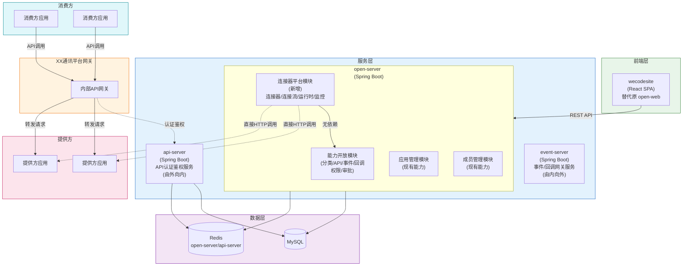
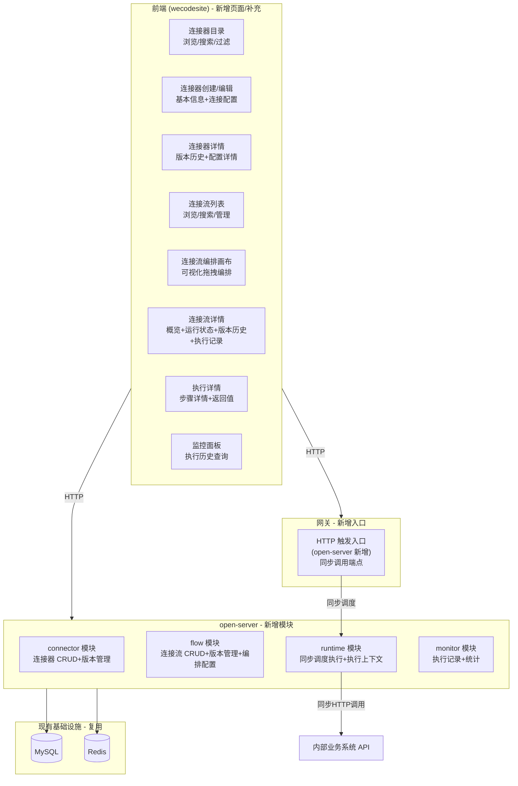
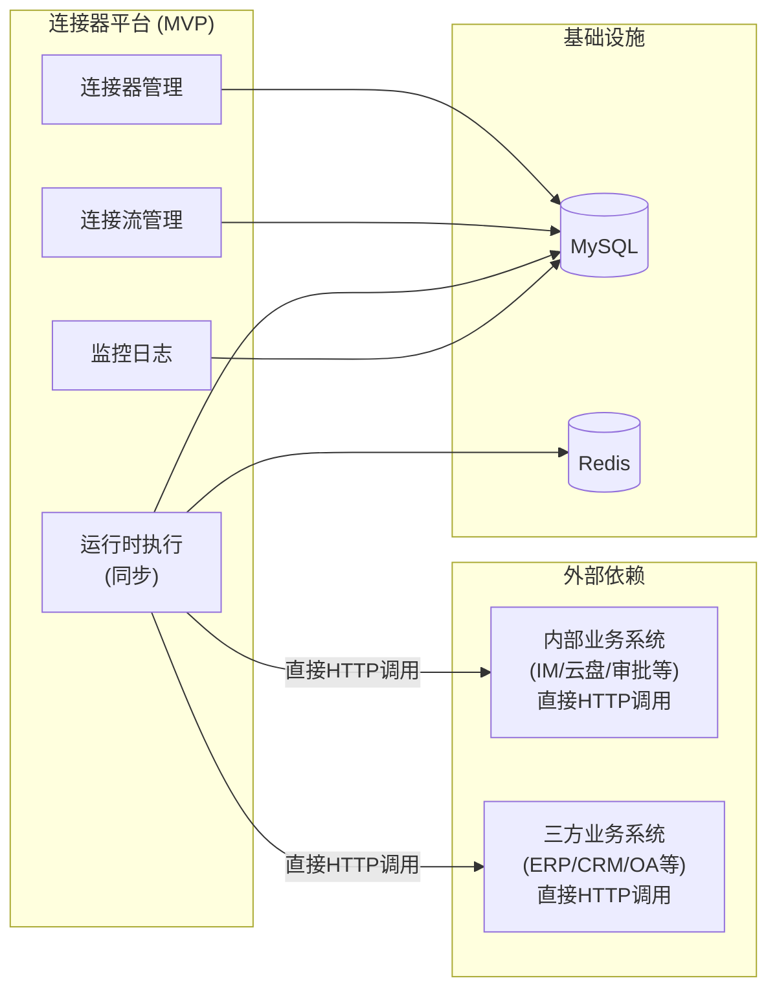
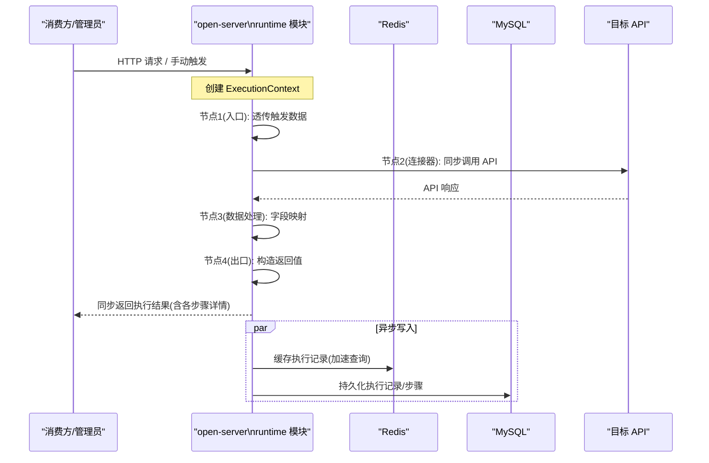
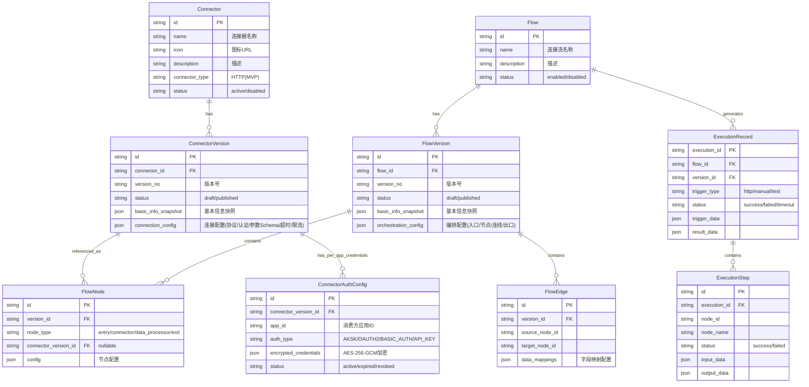

# 技术规划：连接器平台（Connector Platform）

**Feature ID**: CONN-PLAT-001  
**规划版本**: v2.0  
**创建日期**: 2026-05-21  
**规划作者**: SDDU Plan Agent  
**规范版本**: spec.md v4.0  
**前置文档**: discovery-report.md (v3.1), spec.md v4.0, plan-v1.md (废弃), ADR-001~003

> ⚠️ **前端项目说明**：`open-web` 代码已全部迁移至 `wecodesite`，本规划中所有前端引用均以 `wecodesite` 为准。`wecodesite` 已内置 `@xyflow/react` 依赖，且 `ConnectPlatform/Connector`、`ConnectPlatform/ConnectorEditor`、`ConnectPlatform/Flow`、`ConnectPlatform/FlowEditor` 等页面已有实现。

---

## 1. 架构分析

### 1.1 现有系统架构

> 💡 以下架构**沿用**能力开放平台（`specs-tree-capability-open-platform/plan.md §方案D`）的微服务架构设计，仅复用基础设施层（MySQL/Redis/MQS）。**本版本不与能力开放平台集成**——Scope 权限复用（NG18）和审批流独立管理（NG19）移至 V1 阶段。



**与连接器平台相关的现有能力**（本版本**不集成**，仅复用基础设施）：
| 现有能力 | 本版本用途 | 说明 |
|---------|----------|------|
| MySQL / Redis | 数据持久化和缓存 | 复用现有实例 |
| 内部业务系统 HTTP API | 连接器的执行目标 | 连接器直接配置目标 API 地址和认证凭证，不经 API 网关 |

> ⚠️ **本版本独立运行**：连接器平台本版本不与能力开放平台集成（§5.4）。Scope 权限复用（NG18）和审批流独立管理（NG19）移至 V1。

**现有代码引用**:
| 代码位置 | 说明 |
|---------|------|
| `open-server/src/main/java/com/xxx/open/modules/` | 现有能力开放模块（category/api/event/callback/permission/approval），连接器平台在本版本中**不依赖**这些模块 |
| `wecodesite/src/pages/ConnectPlatform/` | 已有连接器目录（Connector）、连接器编辑器（ConnectorEditor）、连接流列表/编排画布（Flow/FlowEditor）页面 |

### 1.2 技术栈确认

> 沿用能力开放平台（`specs-tree-capability-open-platform/plan.md §1.4`）的技术栈标准。

#### 前端技术栈

| 层级 | 技术选型 | 版本 |
|------|----------|------|
| **框架** | React | ^18.2.0 |
| **UI 组件库** | Ant Design | ^4.x |
| **构建工具** | Vite | ^5.0.0 |
| **CSS 预处理器** | Less | ^4.2.0 |
| **样式方案** | Less Module（`.m.less` / `.less`） | - |
| **状态管理** | thunk.js 模式（现有） | - |
| **编排画布** | @xyflow/react (React Flow) | ^12.x（wecodesite 已内置） |

#### 后端技术栈

| 层级 | 技术选型 | 版本 |
|------|----------|------|
| **语言** | Java | 21 |
| **构建工具** | Maven | 3.9.x |
| **框架** | Spring Boot | 3.4.6 |
| **ORM** | MyBatis | mybatis-spring-boot-starter 3.0.4 |
| **数据库** | MySQL | 5.7 |
| **缓存** | Redis | 6.0 |

> ❌ **本版本移除的依赖**：~~能力开放平台 Scope 权限模型~~、~~审批引擎~~、~~事件网关~~、~~Quartz 定时调度~~（触发器不在此版本内）
> ✅ **仅复用**：MySQL / Redis 基础设施

### 1.3 连接器平台新增组件



### 1.4 数据流分析

**连接器发布流程**:
```
管理员创建连接器基本信息 → 配置连接配置(协议/认证/参数Schema/超时/限流) → 
保存草稿(创建首个版本) → 发布(输入版本号) → 版本可用
发布无需审批（NG19移至V1）
```

**连接流创建与执行流程**:
```
管理员创建连接流 → 进入编排画布 → 配置HTTP/手动入口触发器 →
添加连接器节点(引用已发布连接器版本) → 添加数据处理节点(字段映射) →
配置出口节点 → 保存草稿 → 发布(输入版本号) → 部署上线

HTTP触发 → 同步执行连接流 → 返回完整结果
手动触发 → 同步执行连接流 → 展示完整结果
```

**运行时数据流（一次同步执行）**:
```
HTTP请求 / 手动触发
  → 调度器创建 ExecutionContext (含触发数据，当前请求线程)
  → 节点1(入口): 透传触发数据
  → 节点2(连接器): 读取上游数据 → 同步调用外部HTTP API → 输出数据到上下文
  → 节点3(数据处理): 读取上游数据 → 字段映射转换 → 输出数据到上下文
  → 节点4(出口): 定义返回值
  → 返回完整执行结果(各步骤输入/输出/耗时/状态)
  → 异步写入执行记录到MySQL（不阻塞返回）
```

### 1.5 依赖关系图



### 1.6 核心业务对象关系

连接器平台围绕 **8 个核心业务对象**组织，对象间关系：

| 关系 | 说明 |
|------|------|
| Connector → ConnectorVersion | 一个连接器有多个版本（1:N），发布时快照基本信息+连接配置 |
| ConnectorVersion → FlowNode | 连接器版本被连接流节点引用（1:N） |
| ConnectorVersion → ConnectorAuthConfig | 连接器版本按消费方应用存储独立认证凭证（1:N） |
| Flow → FlowVersion | 一个连接流有多个版本（1:N），发布时快照基本信息+编排配置 |
| FlowVersion → FlowNode / FlowEdge | 版本包含节点和连线（1:N），节点含 entry/connector/data_processor/exit 四类（MVP: connector + data_processor） |
| Flow → ExecutionRecord → ExecutionStep | 每次执行生成一条记录，记录含多个步骤（1:N:N） |

> 完整 ER 图（含字段定义）详见 **§4.2 数据库设计** 及 `plan-db.md`

---

## 2. 方案对比

### 2.1 方案 A：轻量同步执行引擎（推荐）

**方案描述**: 基于现有 open-server 扩展，采用轻量级**同步**执行引擎。连接流编排配置以 JSON 存储，运行时引擎接收 HTTP 请求（或手动触发）后，在当前线程中按节点顺序依次同步执行，执行完成后返回完整结果，之后异步写入执行记录。



**核心设计**:
- **编排层**: FlowVersion 的 orchestration_config 以 JSON 格式存储完整编排信息
- **执行引擎**: 顺序同步执行器（SyncSequentialExecutor），从入口节点开始，依次执行每个节点，最后执行出口节点，**同步返回结果**
- **调度**: 无消息队列——HTTP 触发直接在请求线程中执行（通过异步执行器防止长时间阻塞 Tomcat 线程）
- **认证凭证**: 连接器版本中存储认证配置（plan-db 设计为独立表），运行时自动加载注入

**优点**:
- 与现有单体架构完全兼容，开发成本最低
- 无额外框架依赖（无 MQS，无 Quartz），团队熟悉现有技术栈
- 同步执行模型简化了所有数据流——无需处理异步回调/状态查询
- 执行上下文清晰，调试简单——单线程顺序执行，输入输出可追踪
- 执行性能可预测（线性 O(n) 复杂度）
- 可平滑演进到 V1（增加异步分支/循环时再引入 MQS）

**缺点**:
- 长时间运行的连接流会阻塞请求线程（通过超时机制+异步执行器缓解）
- 高并发场景下，单实例执行器可能成为瓶颈（MVP 阶段目标：≥10 并发，可接受）
- 缺乏标准化的流程定义格式（非 BPMN 标准）
- 复杂编排场景（并行/分支/循环）需要在 V1 重构执行器

**风险评估**: 低 — MVP 范围明确（仅线性同步执行），技术复杂度可控

**预估工作量**: 8-12 周 (3-4 后端 + 2-3 前端 + 1 QA)

### 2.2 方案 B：Spring StateMachine 状态机引擎

**方案描述**: 引入 Spring StateMachine 作为流程引擎核心，将连接流执行抽象为状态转换。每个连接器节点对应一个状态，节点执行完成触发状态转换。同步模式下，状态机实例在请求线程中运行。

**优点**:
- 状态机理论成熟，状态转换清晰
- Spring StateMachine 与现有 Spring Boot 技术栈集成良好
- 可扩展性强，后续分支/循环可通过嵌套状态机实现

**缺点**:
- 对于 MVP 的线性同步编排场景，状态机**过度设计**
- 学习曲线：团队需要学习状态机概念和框架 API
- 嵌套状态机复杂度随分支/循环快速上升
- 状态机实例管理增加开发复杂度
- 调试困难：状态转换链路过长时难以追踪

**风险评估**: 中 — 框架引入增加不确定性

**预估工作量**: 10-14 周 (3-4 后端 + 2-3 前端 + 1 QA)

### 2.3 方案 C：消息驱动引擎（本版本不适用）

> ⚠️ **本版本已无异步调度需求**（spec v4.0 确定同步执行），消息驱动引擎方案不适用于本版本。

**方案描述**: 以消息队列为核心，将每个连接器节点封装为独立的消息消费者，流程执行为消息在消费者间的流转。

**不适用的理由**:
- spec v4.0 明确同步执行（FR-021/FR-022），消息驱动引入不必要的异步延迟
- 同步场景下消息队列的序列化/反序列化开销反而降低性能
- 本版本无事件/定时触发，消息队列无必要
- 增加运维复杂度

**风险评估**: 高 — 与同步执行需求不匹配

**预估工作量**: 不推荐

### 2.4 综合对比矩阵

| 对比维度 | 方案 A 轻量同步 | 方案 B 状态机 | 方案 C 消息驱动 |
|---------|:--------------:|:------------:|:--------------:|
| MVP 开发周期 | **8-12 周** ⭐ | 10-14 周 | ❌ 不适用 |
| 技术复杂度 | **低** ⭐ | 中 | 高 |
| 与现有架构兼容性 | **高** ⭐ | 中 | 中 |
| 线性同步执行支持 | **原生** ⭐ | 过度设计 | 反向设计 |
| 分支/循环扩展性 | 需重构 | **自然支持** ⭐ | 需扩展 |
| 可调试性 | **高** ⭐ | 中 | 低 |
| 运维复杂度 | **低** ⭐ | 低 | 中 |
| 团队学习成本 | **无** ⭐ | 1-2 周 | 1 周 |

---

## 3. 推荐方案

### 推荐: 方案 A - 轻量同步执行引擎

**推荐理由**:

1. **MVP 范围精确匹配**: 规范明确 MVP 仅支持**同步**线性编排（HTTP/手动触发器 → 连接器节点/数据处理节点 → 流出口节点），顺序同步执行器是满足需求的最简方案。

2. **同步执行简化架构**: 相比 spec v3.x 的异步执行模型，v4.0 的同步执行大幅降低了运行时复杂度——无需消息队列、无需事件订阅、无需状态轮询。执行结果直接通过 HTTP 响应返回，调用方无需等待异步回调。

3. **最小化技术债务**: 不引入额外框架（Spring StateMachine / MQS），使用纯 Java 实现，与现有架构一致。

4. **开发效率最优**: 团队可在现有 open-server 中新增 connector/flow/runtime/monitor 四个模块，复用已有的 MyBatis/MySQL/Redis 基础设施。

5. **调试友好**: 同步执行的每步输入/输出清晰，测试运行时可逐步验证，排查问题直观。

6. **渐进式演进路径**: MVP→V1 时，可通过增加节点类型处理逻辑扩展分支/循环能力，如需异步能力再引入 MQS。

### 关键架构决策概览

| 决策点 | 选择 | 理由 |
|-------|------|------|
| 流引擎 | 轻量同步执行器（自研） | MVP 仅需线性同步编排，最简方案 |
| 编排画布 | React Flow (@xyflow/react) | React-native, 轻量, TS 支持好 |
| 运行时部署 | 嵌入 open-server（异步线程池隔离） | MVP 避免过早拆分，预留抽取路径 |
| 执行模型 | **同步**（请求线程内执行） | spec v4.0 明确同步执行 |
| 触发方式 | HTTP + 手动（同步） | MVP 范围限定 |
| 执行上下文 | 方法调用参数传递（运行时）+ MySQL 持久化 | 同步执行无需 Redis 缓存上下文 |
| 执行记录持久化 | MySQL（异步写入，不阻塞返回） | 确保执行结果快速返回 |
| 凭证明文存储 | AES-256 加密存储, 界面脱敏 | 满足 NFR-010 安全要求 |
| HTTP 触发入口 | open-server 新增 controller | 简单场景无需独立服务 |
| Scope 权限 | **不集成**（移至 NG18，V1） | 本版本独立运行 |
| 审批流程 | **不集成**（移至 NG19，V1） | 版本发布无需审批 |
| 数据处理节点 | **加入 MVP** | spec v4.0 将数据处理节点纳入 MVP 范围 |

---

## 4. 模块与文件概览

> **职责说明**：本章仅描述「有哪些内容」和「详细设计在哪个文件」。具体设计（表名/字段/索引、API 路径/参数/响应、页面路由/组件树/交互）均只在对应子文档中定义，plan.md 不重复。

### 4.1 模块划分

| 模块 | 所属项目 | 类型 | 说明 |
|------|---------|------|------|
| **connector** | open-server | 新增模块 | 连接器管理 — CRUD、版本管理、连接配置管理 |
| **flow** | open-server | 新增模块 | 连接流管理 — CRUD、版本管理、编排配置 |
| **runtime** | open-server | 新增模块 | 运行时 — 同步调度执行、HTTP 触发入口、执行上下文 |
| **monitor** | open-server | 新增模块 | 监控日志 — 执行历史查询 |
| **connector** | wecodesite | 已有页面组 | 连接器目录/创建编辑/详情（已有实现，需补充） |
| **flow** | wecodesite | 已有页面组 | 连接流列表/编排画布/详情/执行详情（已有实现，需补充） |
| **monitor** | wecodesite | 新增页面组 | 执行历史查询面板 |

> 各模块的**完整数据库表设计**详见 `plan-db.md`  
> 各模块的**完整 API 接口设计**详见 `plan-api.md`  
> 各页面组的**完整前端设计**详见 `plan-page.md`  
> **代码规范**（16 条强制规则，沿用能力开放平台标准）详见 `plan-code.md`

### 4.2 数据库设计

共 **9 张表**，按模块归属：connector 模块 2 张、flow 模块 4 张、runtime 模块 3 张。统一使用 `cp_` 前缀，涵盖连接器基本信息/版本、连接流基本信息/版本/节点/连线、执行记录/步骤、认证凭证。

**核心 ER 关系**（详细字段定义、索引、JSON Schema 见 `plan-db.md`）：



> 表结构定义、字段类型、索引、JSON Schema 详见 **`plan-db.md`**

### 4.3 API 接口设计

共 **14 个逻辑分组**（约 25 个 HTTP 端点），按模块归属：connector 模块 5 组、flow 模块 4 组、runtime 模块 3 组、monitor 模块 2 组。覆盖连接器/连接流的 CRUD、版本管理、连接配置/编排配置编辑与发布、HTTP 触发执行、手动触发执行、测试运行、执行历史查询等全部功能。

> **与 spec v3.x 版 plan 的差异**：
> - ❌ 移除 Scope 权限集成接口
> - ❌ 移除审批集成接口  
> - ❌ 移除事件/定时/Webhook 触发接口
> - 🔄 HTTP 触发改为同步返回（非异步 202）
> - 🔄 执行状态查询接口简化（同步执行无需轮询）
> - ✅ 新增同步执行接口（HTTP 触发 + 手动触发 + 测试运行均同步返回）
> - ✅ 新增数据处理节点配置接口
> - 📋 FR 编号更新为 v4.0 的 FR-001~FR-025

> 完整端点定义、请求/响应 Schema、错误码、鉴权方式详见 **`plan-api.md`**

### 4.4 前端页面设计

共 **8 个页面**，5 个已有实现（wecodesite `ConnectPlatform/` 目录下）+ 3 个需新增（连接流详情、执行详情、监控面板）。覆盖连接器目录/编辑器、连接流列表/编排画布/详情、执行详情、监控面板六大场景。

> **与 spec v3.x 版 plan 的差异**：
> - 🔄 编排画布：触发器仅支持 HTTP + 手动（移除事件/定时/Webhook 配置面板）
> - 🔄 编排画布 MVP 节点类型：连接器节点 + **数据处理节点**（新增）
> - 🔄 监控面板简化为执行历史查询（移除复杂的运行指标统计）
> - ❌ 移除审批相关页面组件
> - ❌ 移除 Scope 权限配置相关组件

> 页面布局、组件树、交互流程、路由设计、状态管理（thunk.js）详见 **`plan-page.md`**

### 4.5 目录结构规划

```
open-app/
├── open-server/                                 # 后端管理服务（现有工程扩展）
│   └── src/main/java/com/xxx/open/modules/
│       ├── category/              # 现有：分类管理
│       ├── api/                   # 现有：API 管理
│       ├── event/                 # 现有：事件管理
│       ├── callback/              # 现有：回调管理
│       ├── permission/            # 现有：权限管理（本版本不依赖）
│       ├── approval/              # 现有：审批管理（本版本不依赖）
│       ├── connector/             # 🆕 连接器管理模块
│       ├── flow/                  # 🆕 连接流管理模块
│       ├── runtime/               # 🆕 运行时模块
│       └── monitor/               # 🆕 监控模块
│
├── wecodesite/                                   # 前端应用
│   └── src/pages/ConnectPlatform/
│       ├── Connector/             # ✅ 已有：连接器目录页面
│       ├── ConnectorEditor/       # ✅ 已有：连接器创建/编辑页面
│       ├── Flow/                  # ✅ 已有：连接流列表
│       ├── FlowEditor/            # ✅ 已有：编排画布
│       │   ├── DataMappingDialog.jsx # 🆕 需新增：数据映射弹窗
│       │   ├── TestRunDialog.jsx  # 🆕 需新增：测试运行弹窗
│       ├── FlowDetail.jsx         # 🆕 需新增：连接流详情
│       ├── ExecutionDetail.jsx    # 🆕 需新增：执行详情
│       └── Monitor/               # 🆕 需新增：监控面板
│           ├── MonitorDashboard.jsx
│           ├── index.jsx
│           ├── constants.jsx
│           └── thunk.js
```

### 4.6 服务职责详表

| 服务 | 新增模块 | 职责 | 数据存储 | 端口 | 上下文根 | 依赖 |
|------|---------|------|----------|------|----------|------|
| **open-server** | connector | 连接器 CRUD、版本管理、连接配置管理 | MySQL + Redis(共享) | 18080 | /open-server | 无（不依赖其他模块） |
| **open-server** | flow | 连接流 CRUD、版本管理、编排配置存储 | MySQL + Redis(共享) | 18080 | /open-server | connector 模块（引用连接器版本） |
| **open-server** | runtime | 同步调度执行、HTTP 触发入口、执行上下文 | MySQL + Redis(共享) | 18080 | /open-server | flow 模块（读取编排配置） |
| **open-server** | monitor | 执行历史查询、统计 | MySQL + Redis(共享) | 18080 | /open-server | runtime 模块（执行数据） |

> 连接器平台的 4 个模块均部署在现有 open-server 中（端口 18080，上下文根 /open-server），复用 open-server 的 MySQL 和 Redis 实例。

### 4.7 文件清单

#### open-server — connector 模块

| 文件 | 说明 |
|------|------|
| `modules/connector/ConnectorController.java` | 连接器 CRUD |
| `modules/connector/ConnectorService.java` | 连接器业务逻辑 |
| `modules/connector/ConnectorVersionController.java` | 版本管理（列表/详情/编辑/发布） |
| `modules/connector/ConnectorVersionService.java` | 版本业务逻辑 |
| `modules/connector/entity/Connector.java` | 连接器实体 |
| `modules/connector/entity/ConnectorVersion.java` | 连接器版本实体 |
| `modules/connector/mapper/ConnectorMapper.java` | 连接器 Mapper |
| `modules/connector/mapper/ConnectorVersionMapper.java` | 版本 Mapper |

#### open-server — flow 模块

| 文件 | 说明 |
|------|------|
| `modules/flow/FlowController.java` | 连接流 CRUD、部署/启停 |
| `modules/flow/FlowService.java` | 连接流业务逻辑 |
| `modules/flow/FlowVersionController.java` | 版本管理、编排配置保存/发布 |
| `modules/flow/FlowVersionService.java` | 版本业务逻辑 |
| `modules/flow/entity/Flow.java` | 连接流实体 |
| `modules/flow/entity/FlowVersion.java` | 连接流版本实体 |
| `modules/flow/entity/FlowNode.java` | 流节点实体 |
| `modules/flow/entity/FlowEdge.java` | 流连线实体 |
| `modules/flow/mapper/FlowMapper.java` | 连接流 Mapper |
| `modules/flow/mapper/FlowVersionMapper.java` | 版本 Mapper |

#### open-server — runtime 模块

| 文件 | 说明 |
|------|------|
| `modules/runtime/ExecutionController.java` | 手动触发、测试运行 |
| `modules/runtime/HttpTriggerController.java` | HTTP 触发入口（同步调用） |
| `modules/runtime/SyncSequentialExecutor.java` | 同步顺序执行引擎 |
| `modules/runtime/ExecutionContext.java` | 执行上下文管理 |
| `modules/runtime/NodeExecutor.java` | 节点执行器接口 |
| `modules/runtime/ConnectorNodeExecutor.java` | 连接器节点执行器 |
| `modules/runtime/DataProcessorNodeExecutor.java` | 数据处理节点执行器 |
| `modules/runtime/entity/ExecutionRecord.java` | 执行记录实体 |
| `modules/runtime/entity/ExecutionStep.java` | 执行步骤实体 |
| `modules/runtime/entity/ConnectorAuthConfig.java` | 认证凭证实体 |
| `modules/runtime/mapper/ExecutionRecordMapper.java` | 执行记录 Mapper |

#### open-server — monitor 模块

| 文件 | 说明 |
|------|------|
| `modules/monitor/MetricsController.java` | 执行历史查询 |
| `modules/monitor/MetricsService.java` | 统计查询服务 |

#### wecodesite — 新增/扩展页面

| 文件 | 说明 | 状态 |
|------|------|:---:|
| `ConnectPlatform/FlowDetail.jsx` | 连接流详情页 | 🆕 |
| `ConnectPlatform/ExecutionDetail.jsx` | 执行详情页 | 🆕 |
| `ConnectPlatform/FlowEditor/DataMappingDialog.jsx` | 数据映射弹窗 | 🆕 |
| `ConnectPlatform/FlowEditor/TestRunDialog.jsx` | 测试运行弹窗 | 🆕 |
| `ConnectPlatform/Monitor/MonitorDashboard.jsx` | 监控面板 | 🆕 |
| `ConnectPlatform/Monitor/index.jsx` | 监控入口 | 🆕 |
| `ConnectPlatform/Connector/thunk.js` | 扩展：fetchVersions 等 | 📝 扩展 |
| `ConnectPlatform/Flow/thunk.js` | 扩展：saveCanvas/testRun 等 | 📝 扩展 |
| `ConnectPlatform/FlowEditor/thunk.js` | 扩展：编排配置保存 | 📝 扩展 |
| `App.jsx` | 注册新路由 | 📝 修改 |

### 4.8 新增依赖

| 依赖 | 版本 | 用途 | 所属项目 |
|------|------|------|---------|
| `@xyflow/react` (React Flow) | ^12.x | 可视化编排画布 | wecodesite（已内置） |

> ❌ **本版本不再引入的依赖**（与 spec v3.x 版 plan 的差异）：
> - ~~Quartz Scheduler~~（定时触发移至 NG17，V1 阶段）
> - ~~MQS 消息队列~~（同步执行无需消息队列）

### 4.9 文件影响统计

| 项目 | 新增文件 | 修改文件 | 删除文件 |
|------|:--------:|:--------:|:--------:|
| open-server (4 个新模块) | 60 | 0 | 0 |
| wecodesite（已有页面 + 新增补充） | 6（新增） + 3（已有需扩展） | 2 | 0 |
| **合计** | **69** | **2** | **0** |

---

## 5. 风险评估

### 5.1 技术风险

| 风险 | 影响 | 概率 | 缓解措施 |
|------|------|:----:|---------|
| 同步执行长时间阻塞 Tomcat 线程 | 影响其他请求响应 | 中 | 使用异步线程池执行（`@Async`/`CompletableFuture`），设置超时（默认 30s，最大 5min），超时强制终止 |
| 可视化编排画布前端复杂度高 | 工期延误 | 中 | MVP 限制线性编排（禁用分支/循环连接），使用 React Flow 的受限模式 |
| 认证凭证加密存储和传输 | 安全漏洞 | 低 | 使用 AES-256-GCM 加密 + HTTPS + 界面脱敏显示 |
| HTTP 触发 URL 安全 | 非法调用 | 低 | 随机不可预测路径 + 请求签名验证 + 限流（FR-024） |
| 同步执行下目标 API 延迟高 | 请求超时 | 中 | 可配置超时（最小 1s，最大 5min），超时返回「执行超时」状态 |

### 5.2 依赖风险

| 风险 | 影响 | 概率 | 缓解措施 |
|------|------|:----:|---------|
| 内部业务系统 API 不稳定 | 连接流执行失败 | 中 | 默认错误处理（FR-023）标记节点失败，不中断整个流（V1 可配置错误处理策略） |
| React Flow 库兼容性问题 | 前端问题 | 低 | 选择稳定版本，做好降级方案（表单配置模式兜底） |

### 5.3 时间风险

| 风险 | 影响 | 概率 | 缓解措施 |
|------|------|:----:|---------|
| MVP 范围 25 个 FR | 开发周期较长 | 中 | 按模块优先级迭代：连接器管理→连接流管理→运行时→监控 |
| 可视化编排画布研发耗时长 | 前端成为瓶颈 | 高 | 先做基础拖拽+节点配置，高级交互后延；用 React Flow 的受控模式减少自研量 |

### 5.4 开放问题处理

| # | 问题 | 建议方案 | 决策时间点 |
|---|------|---------|-----------|
| OQ-001 | MVP 连接器范围 | 优先封装 IM 消息能力（发送消息）作为首个连接器 | Tasks 阶段开始前 |
| OQ-002 | 流编排引擎选型 | **已决策** → 轻量同步执行器（方案 A） | 当前 |
| OQ-003 | 可视化编排画布选型 | **已决策** → React Flow (@xyflow/react) | 当前 |
| OQ-004 | 执行历史保留策略 | 默认保留 30 天（可配置），超过自动清理 | Tasks 阶段 |
| OQ-005 | 限流阈值设定 | HTTP 触发默认 100 次/分钟，手动触发默认 10 次/分钟 | Tasks 阶段 |

---

## 6. 版本规划

### 迭代建议

| 迭代 | 范围 | FR 范围 | 周期 | 交付价值 |
|------|------|---------|:----:|---------|
| **迭代 1** | 连接器管理模块 | FR-001 ~ FR-008 | 2-3 周 | 可创建/编辑/发布连接器，浏览连接器目录 |
| **迭代 2** | 连接流管理模块 | FR-009 ~ FR-020 | 3-4 周 | 可创建连接流、拖拽编排、保存草稿、发布版本 |
| **迭代 3** | 运行时模块 | FR-021 ~ FR-024 | 2-3 周 | 可同步执行连接流（HTTP 触发+手动触发），错误处理+限流 |
| **迭代 4** | 监控模块 | FR-025 | 1-2 周 | 可查看执行历史、执行详情、步骤输入输出 |
| **集成测试** | 全链路联调 + E2E | 全部 | 1-2 周 | 端到端验证 |
| **合计** | | | **8-12 周** | |

### 关键里程碑

| 里程碑 | 时间点 | 验收标准 |
|-------|--------|---------|
| M1: 连接器可用 | 迭代 1 完成 | 可创建/编辑/发布连接器，连接配置完整 |
| M2: 连接流可编排 | 迭代 2 完成 | 可拖拽创建连接流（含数据处理节点），保存草稿，发布版本 |
| M3: 连接流可执行 | 迭代 3 完成 | 连接流可被 HTTP/手动触发同步执行，返回完整结果 |
| M4: 可运维 | 迭代 4 完成 | 可查看执行历史、步骤详情 |
| M5: MVP 就绪 | 集成测试完成 | 完成端到端验证，满足所有 MVP 验收标准 |

---

## ✅ 技术规划完成

**Feature**: 连接器平台 (CONN-PLAT-001)  
**状态**: planned  
**文件**:

| 文档 | 说明 |
|------|------|
| `.sddu/.../specs-tree-connector-platform/plan.md` | **技术总纲**（架构·方案·风险评估·版本规划） |
| `.sddu/.../specs-tree-connector-platform/plan-db.md` | **数据库设计**（表结构·索引·JSON Schema） |
| `.sddu/.../specs-tree-connector-platform/plan-api.md` | **API 接口设计**（端点·请求/响应·鉴权·命名规范） |
| `.sddu/.../specs-tree-connector-platform/plan-page.md` | **前端页面设计**（组件树·交互流程·路由） |
| `.sddu/.../specs-tree-connector-platform/plan-code.md` | **代码规范**（注释·日志·SQL·安全·16 条强制规则） |

### 生成的 ADR

| ADR | 标题 | 状态 |
|-----|------|------|
| `ADR-001.md` | 轻量顺序执行引擎技术方案 | ACCEPTED |
| `ADR-002.md` | React Flow 可视化编排画布 | ACCEPTED |
| `ADR-003.md` | 运行时架构：单体嵌入 + 模块化隔离 | ACCEPTED |

> 💡 现有 ADR 的核心决策（轻量顺序引擎 / React Flow / 单体嵌入）仍然有效，无需更改。主要变更点：执行模型从异步改为同步（已在方案和架构中更新）。

### 与 spec v3.x 版 plan 的主要变更

| 变更项 | v1.x（基于 spec v3.x） | v2.0（基于 spec v4.0） |
|--------|----------------------|----------------------|
| 执行模型 | **异步**（MQS 消息队列） | **同步**（请求线程执行） |
| 调度方式 | 消息驱动 + 轮询 | 直接同步调用 |
| 触发器 | 事件/Webhook/定时/手动 | HTTP/手动 |
| 节点类型（MVP） | 连接器节点 | 连接器节点 + **数据处理节点** |
| Scope/审批集成 | ✅ 集成 | ❌ 移至 V1 |
| FR 数量 | ~37 | 25 |
| 监控范围 | 全指标仪表盘 | 执行历史查询 |
| 错误处理 | 审批流程处理 | 默认错误处理（FR-023） |
| 限流 | 无 | 默认限流（FR-024） |
| 预估工期 | 10-14 周 | **8-12 周** |
| 新增依赖 | Quartz + MQS | 无额外依赖 |

### 下一步
👉 运行 `@sddu-tasks 连接器平台` 开始任务分解