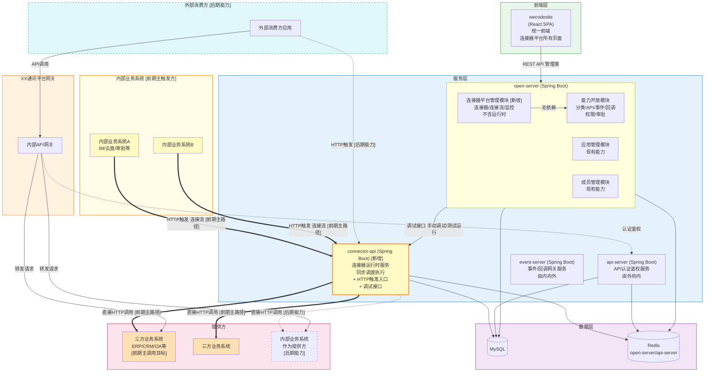
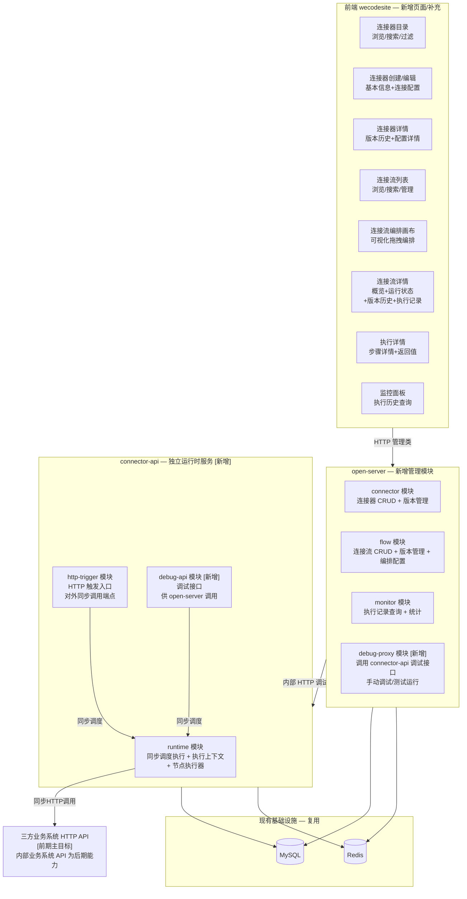
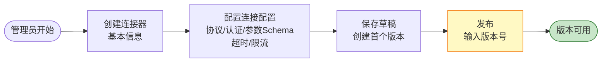
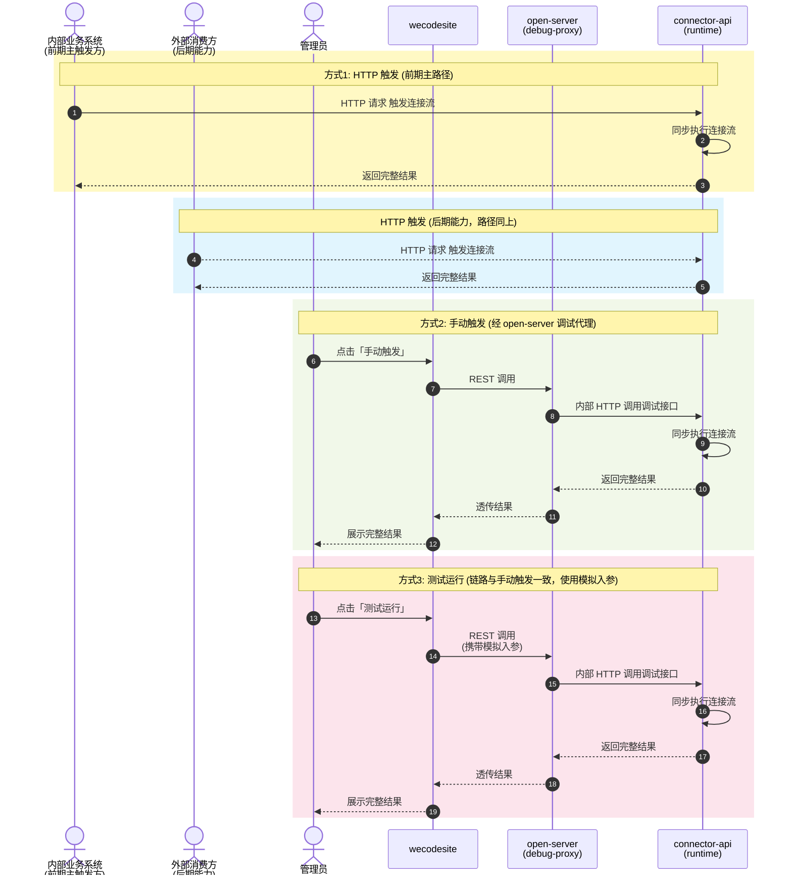
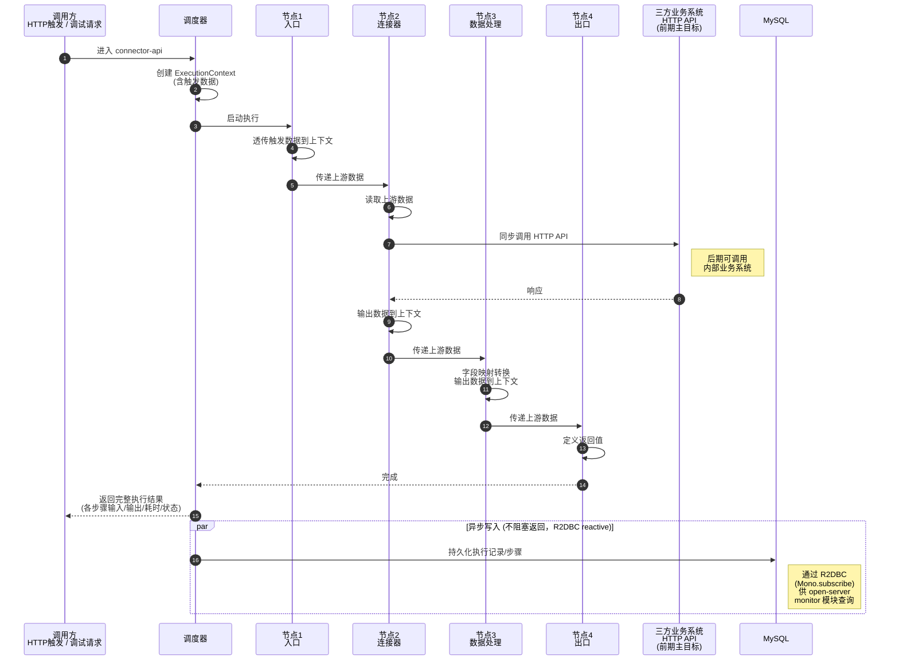
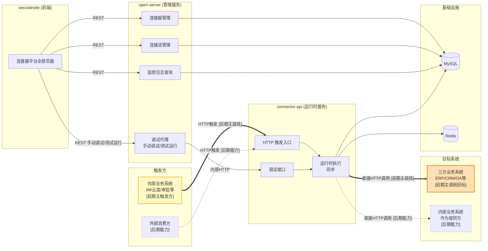
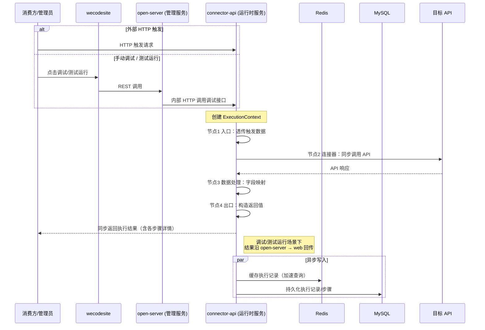
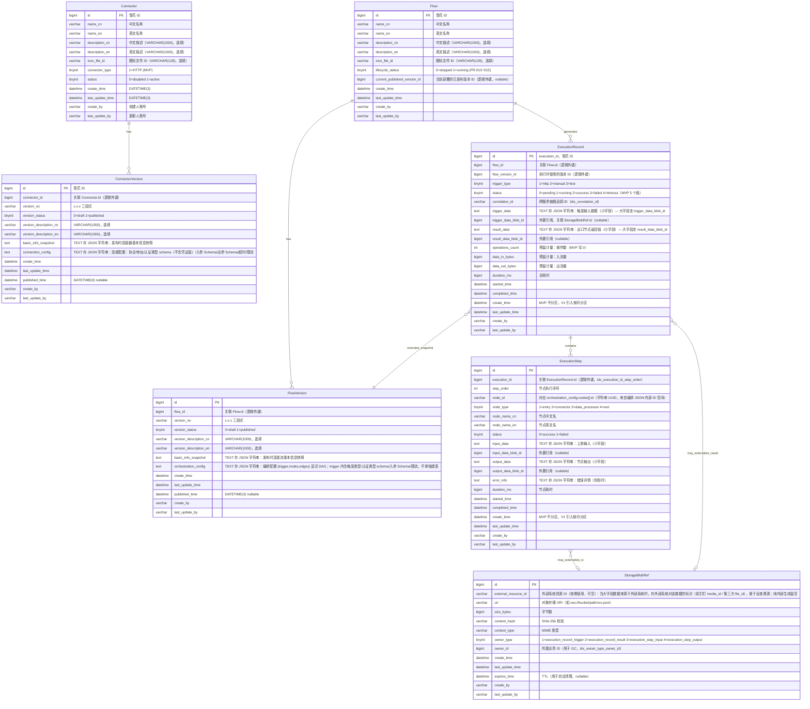

# 技术规划：连接器平台（Connector Platform）

**Feature ID**: CONN-PLAT-001  
**规划版本**: v2.7.6  
**创建日期**: 2026-05-21  
**最近更新**: 2026-05-22  
**规划作者**: SDDU Plan Agent  
**规范版本**: spec.md v4.0  
**前置文档**: discovery-report.md (v3.1), spec.md v4.0, plan-v1.md (废弃), ADR-001~003（ADR-003 已于 v2.1 修订），docs/connector-flow-storage-research/ 5 平台调研报告（v2.4 数据库设计依据），specs-tree-capability-open-platform/plan.md §4.2 表设计规则（v2.7 数据库规范依据）

> ⚠️ **前端项目说明**：`open-web` 代码已全部迁移至 `wecodesite`，本规划中所有前端引用均以 `wecodesite` 为准。`wecodesite` 已内置 `@xyflow/react` 依赖，且 `ConnectPlatform/Connector`、`ConnectPlatform/ConnectorEditor`、`ConnectPlatform/Flow`、`ConnectPlatform/FlowEditor` 等页面已有实现。

---

## 1. 架构分析

### 1.1 系统架构设计

> 💡 以下架构**沿用**能力开放平台（`specs-tree-capability-open-platform/plan.md §方案D`）的微服务架构基础，并**新增独立的 `connector-api` 运行时服务**承载连接流的执行（同步调度、HTTP 触发入口、执行上下文等）。**管理类能力（连接器/连接流/监控的 CRUD）仍在 `open-server`，前端统一在 `wecodesite`**。**本版本不与能力开放平台集成**——Scope 权限复用（NG18）和审批流独立管理（NG19）移至 V1 阶段。
>
> 🎯 **前期定位（集成方向）**：连接器平台承担"**由内向外（同步主动调用）**"的角色，前期主路径是「**内部业务系统（触发方） → 连接器平台 → 三方业务系统（HTTP 接口目标）**」，例如内部 IM/云盘/审批等业务模块通过连接器把数据同步到三方 ERP/CRM/OA。外部消费方直接触发连接流、以及连接器调用内部业务系统作为提供方，作为后期能力（图中以虚线表示），与 api-server「由外向内」、event-server「由内向外（事件/回调）」共同构成完整的内↔外集成矩阵。



> 📌 **方向说明（前期定位）**：
> - **粗实线（==>）** 标识的是**前期主路径**：内部业务系统作为触发方调用连接器平台 → 连接器平台调用三方业务系统的 HTTP 接口（典型场景：内部 IM/云盘/审批等业务模块通过连接器把数据同步到三方 ERP/CRM/OA）
> - **细虚线（-.->）** 标识的是**后期能力**：外部消费方直接触发连接流、以及连接器调用内部业务系统作为提供方（仍可在 MVP 技术上支持，但前期不作为推广重点）
> - 这与 api-server「由外向内」、event-server「由内向外（事件/回调）」形成完整的"内↔外"集成矩阵，连接器平台承担"**由内向外（同步主动调用）**"的角色

**服务职责划分**：
| 服务 | 类型 | 职责 |
|------|------|------|
| **wecodesite** | 前端 | 连接器平台**所有**前端页面（连接器目录/编辑器、连接流列表/编排画布/详情、执行详情、监控面板等） |
| **open-server** | 后端管理服务 | 连接器/连接流的 CRUD 与版本管理、编排配置存储、监控查询；**手动调试/测试运行通过调用 connector-api 的调试接口完成** |
| **connector-api** | 🆕 后端运行时服务 | 同步调度执行引擎、HTTP 触发入口、执行上下文管理、节点执行器（连接器/数据处理）、**对内提供调试接口**（供 open-server 调用） |

**与连接器平台相关的现有能力**（本版本**不集成**，仅复用基础设施）：
| 现有能力 | 本版本用途 | 说明 |
|---------|----------|------|
| MySQL / Redis | 数据持久化和缓存 | open-server 与 connector-api 共享同一 MySQL/Redis 实例 |
| 三方业务系统 HTTP API（前期主目标） | 连接器的执行目标 | connector-api 直接调用目标 API（地址来自 `connection_config`，**凭证由调用方在触发请求中传入，不落库**）；前期重点封装 ERP/CRM/OA 等三方系统 |
| 内部业务系统 HTTP API（后期能力） | 连接器的执行目标 | 后期可扩展将内部业务系统（IM/云盘/审批等）作为提供方调用 |

> ⚠️ **本版本独立运行**：连接器平台本版本不与能力开放平台集成（§5.4）。Scope 权限复用（NG18）和审批流独立管理（NG19）移至 V1。

**现有代码引用**:
| 代码位置 | 说明 |
|---------|------|
| `open-server/src/main/java/com/xxx/open/modules/` | 现有能力开放模块（category/api/event/callback/permission/approval），连接器平台在本版本中**不依赖**这些模块 |
| `connector-api/` | 🆕 新增独立 Spring Boot 工程，承载运行时与调试接口 |
| `wecodesite/src/pages/ConnectPlatform/` | 已有连接器目录（Connector）、连接器编辑器（ConnectorEditor）、连接流列表/编排画布（Flow/FlowEditor）页面，本版本继续扩展（新增详情/执行详情/监控等页面） |

### 1.2 技术栈确认

> 沿用能力开放平台（`specs-tree-capability-open-platform/plan.md §1.4`）的技术栈标准。

#### 前端技术栈

| 层级 | 技术选型 | 版本 |
|------|----------|------|
| **框架** | React | ^18.2.0 |
| **UI 组件库** | Ant Design | ^4.x |
| **构建工具** | Vite | ^5.0.0 |
| **CSS 预处理器** | Less | ^4.2.0 |
| **样式方案** | Less Module（`.m.less` / `.less`） | - |
| **状态管理** | thunk.js 模式（现有） | - |
| **编排画布** | @xyflow/react (React Flow) | ^12.x（wecodesite 已内置） |

#### 后端技术栈

> 📌 **服务分栈策略**：`open-server`（管理服务）沿用现有的 **Spring MVC（同步 Servlet 栈）**；`connector-api`（运行时服务）采用 **Spring WebFlux + Reactor Netty（NIO 异步非阻塞栈）**，并要求 **MySQL（R2DBC）/ Redis（reactive）/ 下游 HTTP 调用（WebClient）全链路非阻塞**，匹配运行时高并发 HTTP 调用场景。

| 层级 | open-server（管理服务） | connector-api（运行时服务） | 说明 |
|------|------------------------|---------------------------|------|
| **语言** | Java 21 | Java 21 | 一致 |
| **构建工具** | Maven 3.9.x | Maven 3.9.x | 一致 |
| **应用框架** | Spring Boot 3.4.6 | Spring Boot 3.4.6 | 一致 |
| **Web 栈** | **Spring MVC**（spring-boot-starter-web，Tomcat Servlet 同步） | **Spring WebFlux**（spring-boot-starter-webflux，Reactor Netty NIO 异步非阻塞） | 🆕 运行时改用 WebFlux |
| **HTTP 客户端**（调用下游 API） | RestTemplate（现有） | **WebClient**（reactive，基于 Reactor Netty） | 🆕 与 WebFlux 栈一致，端到端非阻塞 |
| **数据访问** | MyBatis（mybatis-spring-boot-starter 3.0.4，同步 JDBC） | **R2DBC**（spring-boot-starter-data-r2dbc + r2dbc-mysql + Spring Data R2DBC repository）；执行 SQL 全部返回 `Mono<T>` / `Flux<T>`，端到端非阻塞 | 🆕 connector-api 全 reactive，**不使用 MyBatis 同步 JDBC**，从根本上消除阻塞调用风险 |
| **数据库** | MySQL 5.7 | MySQL 5.7 | 共享同一实例 |
| **缓存** | Redis 6.0（spring-data-redis，同步） | Redis 6.0（**spring-data-redis-reactive**，Lettuce reactive 驱动） | 🆕 与 WebFlux 栈一致 |
| **并发模型** | 一请求一线程（Tomcat 线程池，默认 200） | 事件循环 + Reactor 调度器（少量 EventLoop 线程承接百级以上并发 HTTP 调用） | 🆕 IO 密集型场景吞吐量显著优于同步栈 |

> ❌ **本版本移除的依赖**：~~能力开放平台 Scope 权限模型~~、~~审批引擎~~、~~事件网关~~、~~Quartz 定时调度~~（触发器不在此版本内）
> ✅ **仅复用基础设施**：MySQL / Redis 实例（与 open-server 共享）
> 🆕 **运行时服务新增依赖**：`spring-boot-starter-webflux`、`spring-boot-starter-data-r2dbc`、`r2dbc-mysql`、`spring-boot-starter-data-redis-reactive`、`reactor-core`（随 Spring Boot 自带）
> ❌ **运行时服务不引入**：~~mybatis-spring-boot-starter~~、~~spring-boot-starter-jdbc~~、~~spring-boot-starter-web~~（避免同步栈污染）

> 💡 **为什么 connector-api 选 WebFlux + R2DBC 全 reactive？**
> - **场景匹配**：运行时核心动作是「同步 HTTP 调用三方业务系统」并发会等待下游响应，是典型 IO 密集型场景，NIO 非阻塞模型可用极少的线程承接高并发触发
> - **端到端非阻塞**：HTTP 入口（WebFlux）→ 编排引擎（Reactor）→ 下游调用（WebClient）→ 数据库（R2DBC）→ 缓存（Redis reactive）全链路无阻塞调用，**从根本上消除"误用阻塞 API 拖垮 EventLoop"的风险**
> - **吞吐量**：同等硬件资源下，WebFlux + WebClient + R2DBC 较 Spring MVC + RestTemplate + JDBC 在高并发 HTTP 转发场景下吞吐量提升通常在 2-5 倍，更易达到 NFR 并发指标
> - **背压（Backpressure）**：Reactor 的背压机制天然适配「上游触发速度 vs 下游响应速度」的速率匹配，避免连接器平台被慢下游打垮
> - **不影响调用方编程模型**：connector-api 对外仍暴露**同步 HTTP 端点**（请求-响应一一对应），调用方（包括 open-server debug-proxy、内部业务系统）无需感知内部 reactive 实现
> - **隔离风险**：WebFlux + R2DBC 仅用于 connector-api，open-server 不动，避免对现有管理后台造成栈级风险

> ⚠️ **全 reactive 栈强制规则（已在 plan-code 沉淀）**：
> - **严禁**在 reactive 链路中直接调用任何阻塞 API：JDBC、MyBatis、`RestTemplate`、同步 Redis、`Thread.sleep`、`File IO`、传统 `synchronized` 长等待等
> - 数据库访问**只能用 R2DBC** 的 `Mono<T>` / `Flux<T>` 接口；如需复杂查询使用 `R2dbcEntityTemplate` 或 `DatabaseClient`
> - Redis 访问**只能用 `ReactiveRedisTemplate` / `ReactiveStringRedisTemplate`**
> - HTTP 调用**只能用 `WebClient`**，禁止引入 `RestTemplate` / `OkHttp` 同步客户端
> - 节点执行器（`NodeExecutor`）签名返回 `Mono<NodeOutput>`，而非同步返回值
> - `WebClient` / R2DBC ConnectionFactory 必须配置超时与池上限（防大响应体打爆堆 / 防连接耗尽）
> - 异常处理使用 `.onErrorResume(...)`，避免裸 try-catch 吃掉 reactive 异常信号
> - 测试环境启用 **BlockHound** 主动拦截任何意外阻塞调用，CI 流水线必跑

> 🔄 **共享数据模型策略**：connector-api 与 open-server **共用同一套 MySQL 表 schema**（详见 plan-db.md），但 **entity / 持久化层各自维护**（open-server 用 MyBatis entity + Mapper，connector-api 用 R2DBC entity + Repository），避免 ORM 跨栈耦合。共享的"表结构契约"通过统一的 DDL 迁移脚本（Flyway / Liquibase 之一，迭代 0 决定）保证一致性。

### 1.3 连接器平台新增组件



> 💡 **运行时单独部署的理由**：
> - **职责隔离**：管理类操作（CRUD）与运行时执行（高并发、长耗时同步调用）资源特征不同，独立部署便于针对性扩缩容
> - **故障隔离**：运行时阻塞或异常不影响管理后台的可用性
> - **演进友好**：V1 引入异步执行/MQS 时只需改造 connector-api，open-server 保持稳定
> - **调试接口收口**：手动调试、测试运行等流程统一通过 connector-api 提供的调试接口完成，避免运行时逻辑在 open-server 与 connector-api 重复实现

### 1.4 数据流分析

#### 1.4.1 连接器发布流程



> 💡 发布无需审批（NG19 移至 V1）。

#### 1.4.2 连接流创建与编排流程（设计期）


> 💡 设计期所有编排/发布请求均经 `wecodesite → open-server` 管理接口完成，不涉及 connector-api。

#### 1.4.3 连接流触发与执行流程（运行期）

三种触发方式的跨服务交互对比：



#### 1.4.4 运行时单次执行内部数据流（connector-api 进程内）



### 1.5 依赖关系图



> 📌 **方向说明（前期定位）**：
> - **粗实线（==>）** = 前期主路径：内部业务系统作为触发方 → 连接器平台 → 三方业务系统作为调用目标
> - **细虚线（-.->）** = 后期能力：外部消费方触发、连接器调用内部业务系统作为提供方

### 1.6 核心业务对象关系

连接器平台围绕 **6 个持久化业务对象** + **1 个内存对象（凭证）** 组织（详见 §4.2 数据库设计），对象间关系：

| 关系 | 说明 |
|------|------|
| Connector → ConnectorVersion | 一个连接器有多个版本（1:N），发布时快照基本信息+连接配置（含认证类型 schema，不含凭证值） |
| ConnectorVersion ←···引用··· FlowVersion.orchestration_config.nodes[] | 连接器版本被连接流编排定义中的节点（JSON 数组元素）引用，**非物理外键**，引用关系存于 FlowVersion 的 `orchestration_config` TEXT 字段（JSON 字符串）内 |
| Flow → FlowVersion | 一个连接流有多个版本（1:N），发布时快照基本信息+编排配置（`{trigger, nodes[], edges[]}` 完整 DAG，单一 JSON 字段，**触发器配置完整内嵌于 `trigger` 节点**） |
| Flow → ExecutionRecord → ExecutionStep | 每次执行生成一条记录，记录含多个步骤（1:N:N）；MVP 不分区，V1 按月分区 |
| ExecutionRecord / ExecutionStep ←···外置引用··· StorageBlobRef | 大字段（>64KB）的 input/output/result_data 外置到对象存储，表中只存 `*_blob_id` 引用 |
| Credentials（内存对象，不入库） | 凭证仅在调用过程中由触发请求传入 → 注入 ExecutionContext → 节点执行后清除；写入执行记录时按 `sensitive: true` 标记**脱敏** |

> 完整 ER 图（含字段定义）详见 **§4.2 数据库设计** 及 `plan-db.md`

---

## 2. 方案对比

### 2.1 方案 A：轻量同步执行引擎（推荐）

**方案描述**: **运行时单独部署为 `connector-api` 服务**（与 open-server 进程隔离），采用轻量级**同步**执行引擎。连接流编排配置以 JSON 存储（由 open-server 写入 MySQL），运行时引擎接收 HTTP 触发请求（或来自 open-server 的调试请求）后，在当前线程中按节点顺序依次同步执行，执行完成后返回完整结果，之后异步写入执行记录。**open-server 的手动调试/测试运行流程通过调用 connector-api 的调试接口实现**。



**核心设计**:
- **服务拆分**: `connector-api` 独立 Spring Boot 工程，仅承载运行时与调试接口；`open-server` 承载所有管理类能力（CRUD/版本/监控查询）
- **编排层**: FlowVersion 的 `orchestration_config` 以 TEXT 存 JSON 字符串存储完整编排信息（由 open-server 写入，connector-api 只读；应用层 Jackson 序列化/反序列化）
- **执行引擎**: 反应式顺序执行器（`ReactiveSequentialExecutor`），从入口节点开始构造 `Mono` 链路（`flatMap` 串联各节点 `Mono<NodeOutput>`），最后聚合为 `Mono<ExecutionResult>`；对 HTTP 调用方仍呈现为**同步请求-响应语义**（一次请求等到完整结果再返回）
- **调度**: 无消息队列——HTTP 触发请求进入 connector-api 的 Reactor Netty EventLoop，由执行引擎构造 reactive 链路（`Mono<ExecutionResult>`）异步编排各节点；下游 HTTP 调用通过 WebClient 完全非阻塞，单实例百级并发触发可由少量 EventLoop 线程承接，**对调用方仍呈现为同步 HTTP 请求-响应**
- **调试通道**: connector-api 暴露内部调试接口（仅限 open-server 内网调用），open-server 收到前端调试/测试运行请求后转发到该接口，避免运行时逻辑重复实现
- **认证凭证**: **不持久化**——调用方在触发请求中传入凭证 → connector-api 注入 `ExecutionContext.credentials`（仅内存生命周期）→ 节点执行器读取并注入 WebClient 请求 → 节点完成后从上下文清除；写入执行记录时按 `connection_config.sensitive` 标记自动脱敏

**优点**:
- 运行时独立部署（connector-api），与管理类操作进程隔离，**资源/故障/扩缩容互不影响**
- 调试接口收口在 connector-api，避免运行时逻辑在 open-server / connector-api 两边重复
- 无额外框架依赖（无 MQS，无 Quartz），团队熟悉现有技术栈
- 同步执行模型简化了所有数据流——无需处理异步回调/状态查询
- 执行上下文清晰，调试简单——单线程顺序执行，输入输出可追踪
- 执行性能可预测（线性 O(n) 复杂度）
- 可平滑演进到 V1（增加异步分支/循环时只需改造 connector-api，open-server 保持稳定）

**缺点**:
- 新增一个独立服务（connector-api），运维实例数 +1
- open-server 与 connector-api 之间需新增一条内部 HTTP 调用链路（调试接口），需做好鉴权与重试
- 长时间运行的连接流虽然不会阻塞 EventLoop（WebFlux 非阻塞），但单条连接流执行端到端超时仍需控制（避免下游慢响应占用 WebClient 连接池资源），通过 WebClient 超时 + Reactor `.timeout(...)` 双重保障
- 高并发场景下，单实例执行器可能成为瓶颈（MVP 阶段目标：≥10 并发，可接受；可通过水平扩容 connector-api 实例缓解）
- 缺乏标准化的流程定义格式（非 BPMN 标准）
- 复杂编排场景（并行/分支/循环）需要在 V1 重构执行器

**风险评估**: 低 — MVP 范围明确（仅线性同步执行），技术复杂度可控

**预估工作量**: 8-12 周 (3-4 后端 + 2-3 前端 + 1 QA)

### 2.2 方案 B：Spring StateMachine 状态机引擎

**方案描述**: 引入 Spring StateMachine 作为流程引擎核心，将连接流执行抽象为状态转换。每个连接器节点对应一个状态，节点执行完成触发状态转换。同步模式下，状态机实例在请求线程中运行。

**优点**:
- 状态机理论成熟，状态转换清晰
- Spring StateMachine 与现有 Spring Boot 技术栈集成良好
- 可扩展性强，后续分支/循环可通过嵌套状态机实现

**缺点**:
- 对于 MVP 的线性同步编排场景，状态机**过度设计**
- 学习曲线：团队需要学习状态机概念和框架 API
- 嵌套状态机复杂度随分支/循环快速上升
- 状态机实例管理增加开发复杂度
- 调试困难：状态转换链路过长时难以追踪

**风险评估**: 中 — 框架引入增加不确定性

**预估工作量**: 10-14 周 (3-4 后端 + 2-3 前端 + 1 QA)

### 2.3 方案 C：消息驱动引擎（本版本不适用）

> ⚠️ **本版本已无异步调度需求**（spec v4.0 确定同步执行），消息驱动引擎方案不适用于本版本。

**方案描述**: 以消息队列为核心，将每个连接器节点封装为独立的消息消费者，流程执行为消息在消费者间的流转。

**不适用的理由**:
- spec v4.0 明确同步执行（FR-021/FR-022），消息驱动引入不必要的异步延迟
- 同步场景下消息队列的序列化/反序列化开销反而降低性能
- 本版本无事件/定时触发，消息队列无必要
- 增加运维复杂度

**风险评估**: 高 — 与同步执行需求不匹配

**预估工作量**: 不推荐

### 2.4 综合对比矩阵

| 对比维度 | 方案 A 轻量同步 | 方案 B 状态机 | 方案 C 消息驱动 |
|---------|:--------------:|:------------:|:--------------:|
| MVP 开发周期 | **8-12 周** ⭐ | 10-14 周 | ❌ 不适用 |
| 技术复杂度 | **低** ⭐ | 中 | 高 |
| 与现有架构兼容性 | **高** ⭐ | 中 | 中 |
| 线性同步执行支持 | **原生** ⭐ | 过度设计 | 反向设计 |
| 分支/循环扩展性 | 需重构 | **自然支持** ⭐ | 需扩展 |
| 可调试性 | **高** ⭐ | 中 | 低 |
| 运维复杂度 | **低** ⭐ | 低 | 中 |
| 团队学习成本 | **无** ⭐ | 1-2 周 | 1 周 |

---

## 3. 推荐方案

### 推荐: 方案 A - 轻量同步执行引擎

**推荐理由**:

1. **MVP 范围精确匹配**: 规范明确 MVP 仅支持**同步**线性编排（HTTP/手动触发器 → 连接器节点/数据处理节点 → 流出口节点），顺序同步执行器是满足需求的最简方案。

2. **同步执行简化架构**: 相比 spec v3.x 的异步执行模型，v4.0 的同步执行大幅降低了运行时复杂度——无需消息队列、无需事件订阅、无需状态轮询。执行结果直接通过 HTTP 响应返回，调用方无需等待异步回调。

3. **最小化技术债务**: 不引入额外框架（Spring StateMachine / MQS），使用纯 Java 实现，与现有架构一致；同时**通过将运行时拆为独立服务 `connector-api`，避免管理与执行混在同一进程**导致后期难以拆分。

4. **开发效率最优**: 团队可在现有 open-server 中新增 connector/flow/monitor 三个管理模块，同时启动 `connector-api` 新工程（基于现有 Spring Boot 脚手架）承载 runtime/http-trigger/debug-api 模块，复用已有的 MyBatis/MySQL/Redis 基础设施；前端所有页面统一落在 `wecodesite`，无需协调多前端项目。

5. **调试友好**: 同步执行的每步输入/输出清晰，测试运行时可逐步验证，排查问题直观。

6. **渐进式演进路径**: MVP→V1 时，可通过增加节点类型处理逻辑扩展分支/循环能力，如需异步能力再引入 MQS。

### 关键架构决策概览

| 决策点 | 选择 | 理由 |
|-------|------|------|
| 流引擎 | 轻量同步执行器（自研） | MVP 仅需线性同步编排，最简方案 |
| 编排画布 | React Flow (@xyflow/react) | React-native, 轻量, TS 支持好 |
| **运行时部署** | **独立服务 `connector-api`**（与 open-server 分离） | 职责隔离、故障隔离、独立扩缩容、便于 V1 演进 |
| 调试/测试运行通道 | open-server 调用 connector-api 内部调试接口 | 运行时逻辑收口在 connector-api，避免双份实现 |
| 前端归属 | 全部页面统一放在 wecodesite | 用户侧只对接一个前端入口 |
| 执行模型 | **同步**（请求线程内执行） | spec v4.0 明确同步执行 |
| 触发方式 | HTTP + 手动（同步） | MVP 范围限定 |
| 执行上下文 | 方法调用参数传递（运行时）+ MySQL 持久化 | 同步执行无需 Redis 缓存上下文 |
| 执行记录持久化 | MySQL（异步写入，不阻塞返回） | 确保执行结果快速返回 |
| 凭证存储策略 | **不持久化**，调用方传入 → 内存上下文 → 节点执行后清除；执行记录中脱敏 | MVP 极简（满足 NFR-010 的最小化原则）；V1 视需要再引入加密落库 |
| HTTP 触发入口 | connector-api 新增 controller | 与运行时同进程，链路最短 |
| **connector-api Web 栈** | **Spring WebFlux + Reactor Netty + WebClient** | 运行时高并发同步 HTTP 调用三方系统，NIO 非阻塞栈吞吐量显著优于 Servlet 同步栈；对调用方仍呈现同步语义 |
| **connector-api 数据访问** | **R2DBC (spring-data-r2dbc + r2dbc-mysql)** | 端到端 reactive，**从源头消除阻塞 JDBC 调用风险**；不引入 MyBatis 同步栈 |
| **connector-api 缓存访问** | **spring-data-redis-reactive (Lettuce reactive)** | 与 reactive 栈一致 |
| **connector-api 下游 HTTP 调用** | **WebClient** | 禁止 RestTemplate / OkHttp 同步客户端 |
| **schema 共享策略** | 同一 MySQL 表 schema，entity / 持久化层各服务独立维护 | open-server (MyBatis) + connector-api (R2DBC) 各用其语言惯用 ORM，通过 Flyway 统一 DDL 保证一致 |
| open-server Web 栈 | 沿用 Spring MVC（Servlet） | 管理类操作以 CRUD 为主，并发不高，沿用现有栈避免改造成本 |
| Scope 权限 | **不集成**（移至 NG18，V1） | 本版本独立运行 |
| 审批流程 | **不集成**（移至 NG19，V1） | 版本发布无需审批 |
| 数据处理节点 | **加入 MVP** | spec v4.0 将数据处理节点纳入 MVP 范围 |

---

## 4. 模块与文件概览

> **职责说明**：本章仅描述「有哪些内容」和「详细设计在哪个文件」。具体设计（表名/字段/索引、API 路径/参数/响应、页面路由/组件树/交互）均只在对应子文档中定义，plan.md 不重复。

### 4.1 模块划分

| 模块 | 所属项目 | 类型 | 说明 |
|------|---------|------|------|
| **connector** | open-server | 新增模块 | 连接器管理 — CRUD、版本管理、连接配置管理 |
| **flow** | open-server | 新增模块 | 连接流管理 — CRUD、版本管理、编排配置 |
| **monitor** | open-server | 新增模块 | 监控日志 — 执行历史查询 |
| **debug-proxy** | open-server | 新增模块 | 调试代理 — 接收前端手动调试/测试运行请求并转发至 connector-api 调试接口 |
| **runtime** | **connector-api** 🆕 | 新增模块 | 运行时 — 同步调度执行、执行上下文、节点执行器（连接器/数据处理） |
| **http-trigger** | **connector-api** 🆕 | 新增模块 | HTTP 触发入口 — 对外暴露同步触发端点 |
| **debug-api** | **connector-api** 🆕 | 新增模块 | 调试接口 — 供 open-server 内部调用（手动调试/测试运行） |
| **connector** | wecodesite | 已有页面组 | 连接器目录/创建编辑/详情（已有实现，需补充） |
| **flow** | wecodesite | 已有页面组 | 连接流列表/编排画布/详情/执行详情（已有实现，需补充） |
| **monitor** | wecodesite | 新增页面组 | 执行历史查询面板 |

> 各模块的**完整数据库表设计**详见 `plan-db.md`  
> 各模块的**完整 API 接口设计**详见 `plan-api.md`  
> 各页面组的**完整前端设计**详见 `plan-page.md`  
> **代码规范**（16 条强制规则，沿用能力开放平台标准）详见 `plan-code.md`

### 4.2 数据库设计

> 📚 **设计依据**：基于 `docs/connector-flow-storage-research/` 5 个平台（Zapier / Make / Power Automate / MuleSoft / 钉钉）调研结论，结合本平台约束（MySQL 5.7 + R2DBC、MVP 仅 HTTP 协议、同步执行、不做上架/下架/资源配额/失败重试）综合设计。

**核心设计决策**（取舍依据见调研报告 §九 MVP 存储方案核心建议）：

| 决策点 | 选择 | 调研出处 |
|--------|------|----------|
| **编排定义存储模型** | **单一字段保存完整 DAG**（`{ trigger{}, nodes[], edges[] }`），不拆分 FlowNode/FlowEdge 子表；字段类型采用 **TEXT 存 JSON 字符串**（v2.7.4 决策——不使用 MySQL JSON 原生类型） | Zapier/Make/钉钉/PA 共识（单一字段便于版本快照、diff、回滚）+ TEXT 跨数据库通用、ORM/工具兼容性最好 |
| **节点拓扑模型** | **显式 DAG（nodes + edges 两个数组）** | Make 模式——MVP 虽线性，但 V1 引入分支/循环/并行时无需 schema 迁移 |
| **触发器存储** | **完全内嵌于编排 JSON 的顶级 `trigger{}` 字段**，含触发类型、认证类型 schema（仅声明，不含凭证）、入参 Schema、限流配置；**不单独建表**——凭证不入库且无 token 持久化需求时，独立表已无核心价值（v2.7.3 决策） | MVP 极简 + 触发器配置本就是编排定义的一部分，跟随版本快照便于回滚 |
| **版本管理** | 独立 `openplatform_v2_cp_flow_version_t` / `openplatform_v2_cp_connector_version_t` 表，每次发布写入完整快照；`openplatform_v2_cp_flow.current_published_version_id` 指向最新发布版 | PA `flowversions`(保留 25) + 钉钉 `flow_versions` 模式 |
| **执行历史 I/O 外置** | 大字段（步骤 input/output、连接流 result_data）**默认写 MySQL 内嵌**，当 size > 阈值（建议 64KB，迭代 0 决策）时**自动外置到对象存储**，表中只存 `*_uri/*_size/*_hash` 引用 | PA 默认外置 + Make/钉钉条件外置 |
| **执行记录分区**（V1 优化项） | **MVP 不分区**——`openplatform_v2_cp_execution_record_t` / `openplatform_v2_cp_execution_step_t` 使用普通表结构；V1 引入按 `create_time` 月度分区 + 30 天冷归档 | MVP 业务量小，无需引入分区运维复杂度；分区方案保留为 V1 优化预案（5 平台共识） |
| **计量字段（预留）** | `openplatform_v2_cp_execution_record_t` 预留 `operations_count` / `data_in_bytes` / `data_out_bytes`（MVP 写入 0，V1 启用计费时直接使用） | Make `operations_consumed` + PA `billingMetrics`——避免后期加字段迁移成本 |
| **状态机枚举** | 执行记录：`pending / running / success / failed / timeout`（MVP 5 个值；`partial` / `cancelled` 留给 V1） | 跨平台超集裁剪 |
| **凭证传递** | **不持久化**——凭证仅在调用过程中通过触发请求/执行上下文以参数形式传递；`connection_config` 中只声明**认证类型 schema**（如"该连接器使用 OAuth2 + Bearer Token"），具体凭证值不入库 | MVP 极简：避免凭证落库带来的加密/KMS/轮换/脱敏全套合规复杂度；执行后凭证仅存活于内存与一次执行的上下文中 |
| **schema 主仓库** | 由 `connector-api` 维护 Flyway 迁移脚本（`db/migration/*.sql`），open-server 引入相同脚本并跑迁移 | MuleSoft Maven + PA Solution 模式启发 |
| **数据库前缀** | 所有表统一 `openplatform_v2_cp_` 前缀 | `openplatform`=开放平台体系 / `v2`=平台第二代 / `cp`=connector platform（连接器平台子域），与现有 open-server 既有表（含其它子域）严格隔离，便于未来按子域拆库/迁移 |
| **关联引用方式** | **BIGINT(20) 雪花 ID**（应用层生成），使用逻辑外键（存储关联 ID），**不使用物理外键约束** | 对齐能力开放平台数据库规范（§4.2.x 主键规范） |
| **遵循通用规范** | 所有表遵循 `specs-tree-capability-open-platform/plan.md §4.2 表设计规则`：表后缀 `_t` / 中英文双语名称（`name_cn`/`name_en`）/ 必备 4 审计字段（`create_time`/`last_update_time`/`create_by`/`last_update_by`）/ TINYINT(10) 枚举 / `DATETIME(3)` 时间精度 / `idx_xxx` `uk_xxx` 索引命名 | 复用现有规范，保证整个 openplatform_v2 体系一致 |

**表清单**（共 **7 张表**：4 张主表 + 2 张版本表 + 1 张子表 + 1 张元数据表，触发器配置内嵌于 `flow_version_t.orchestration_config.trigger` JSON，不单独建表）：

| # | 表名 | 类型 | 模块 | 说明 |
|---|------|------|------|------|
| 1 | `openplatform_v2_cp_connector_t` | 主表 | connector | 连接器基本信息（`name_cn`/`name_en`/`description_cn`/`description_en`/`icon_file_id`/`status`/`connector_type` 等，本期字段全部入主表，不拆属性表） |
| 2 | `openplatform_v2_cp_connector_version_t` | 版本表 | connector | 连接器版本（含基本信息快照 + 连接配置 JSON，仅声明认证类型 schema，**不存凭证值**） |
| 3 | `openplatform_v2_cp_flow_t` | 主表 | flow | 连接流基本信息（`name_cn`/`name_en`/`description_cn`/`description_en`/`icon_file_id`/`lifecycle_status`/`current_published_version_id` 等，本期字段全部入主表，不拆属性表） |
| 4 | `openplatform_v2_cp_flow_version_t` | 版本表 | flow | 连接流版本（含基本信息快照 + 编排配置 JSON：`{trigger,nodes,edges}`，**触发器配置完整内嵌于 `trigger`：触发类型 / 认证类型 schema / 入参 Schema / 限流**） |
| 5 | `openplatform_v2_cp_execution_record_t` | 主表 | runtime | 执行记录（含触发数据、最终返回值、状态、耗时、预留计量字段；**MVP 不分区**，V1 引入按月分区） |
| 6 | `openplatform_v2_cp_execution_step_t` | 子表 | runtime | 执行步骤详情（input/output 大字段支持外置到对象存储；**MVP 不分区**，V1 引入按月分区） |
| 7 | `openplatform_v2_cp_storage_blob_ref_t` | 元数据表 | runtime | 对象存储引用元数据（**external_resource_id**（外部系统资源 ID，按需使用）/ uri / size / hash / content_type；用于 GC、审计与外部系统反查溯源） |

> 💡 **触发器为何不单独建表**（v2.7.3 决策）：
> - **凭证不存储**（v2.6 决策）→ 无 `signing_secret` 等需独立运维的密钥字段
> - **触发器仅声明认证类型 schema**（不含 token） → 无 `trigger_token` 持久化需求，HTTP 路径直接用 `/trigger/{flow_id}/invoke`
> - **触发器配置本就是编排定义的一部分** → 跟随 `flow_version_t.orchestration_config` 快照，便于版本回滚（限流变更 = 业务编排变更，发新版本生效）
> - **HTTP 路由查询**：`flow_t.id` → `current_published_version_id` → `flow_version_t.orchestration_config.trigger`，2 次查询走主键索引，性能完全够用
> - **V1 演进**：若出现"动态限流热更新""多端点共享 Flow""token 独立轮换"等场景，再拆出独立 `flow_trigger_endpoint_t` 表

> 💡 **本期（MVP）暂不引入主表 + 属性表模式**：
> - **决策**：MVP 阶段所有业务字段（含 description/tags/icon/owner_group 等）直接放在主表，**不拆 `*_p_t` 属性表**
> - **理由**：本期需求字段明确且数量可控，主表能完整承载；引入属性表会增加查询关联开销与 entity/mapper 维护成本
> - **未来演进**：V1 阶段若出现高频扩展字段（如分类体系、自定义元数据等），再按能力开放平台规范引入 `connector_p_t` / `flow_p_t`，能力开放平台规范的属性表后缀 `_p_t` 命名空间已为此预留
>
> 💡 **MVP 暂不引入按月分区**：
> - **决策**：`execution_record_t` / `execution_step_t` 本期使用普通表结构，**不做分区**
> - **理由**：MVP 业务量小（预估 < 10w 行/月），普通表性能完全够用；分区会引入额外的运维复杂度（分区维护脚本、跨分区查询优化等）
> - **未来演进**：V1 阶段当单表行数接近 500w 或查询性能下降时，引入按 `create_time` 月度分区 + 30 天冷归档（5 平台共识方案）


> 🔐 **凭证传递路径（不持久化）**：
> 1. 调用方发起触发请求时，将凭证作为请求体中的 `credentials` 字段（或 HTTP Header）传入
> 2. connector-api 解析后注入到 `ExecutionContext.credentials`（仅内存生命周期）
> 3. 连接器节点执行器从上下文取出凭证 → 注入到 WebClient 请求头/参数
> 4. 节点执行完成后，凭证从 ExecutionContext 中**显式清除**（避免被后续步骤误用）
> 5. 写入 `openplatform_v2_cp_execution_step_t.input_data` 时，**按 `connection_config` 中标记为 `sensitive: true` 的字段自动脱敏**（值替换为 `***`，长度信息保留）
> 6. 凭证全程不进入 MySQL / Redis / 对象存储，**仅存活于本次 HTTP 请求的内存上下文**

**核心 ER 关系**（完整字段定义、索引、JSON Schema 详见 `plan-db.md`）：



> 💡 **JSON 字段结构（v2.7.4 起统一使用 TEXT 类型存 JSON 字符串，详见 §4.3.3 字段规则与 `plan-db.md`）**：
> - `ConnectorVersion.connection_config` —— `{ protocol, base_url, auth_type, input_schema, output_schema, timeout_ms, rate_limit }`
> - `FlowVersion.orchestration_config.trigger` —— `{ type: "http"|"manual"|"test", auth_type_schema: { type: "bearer"|"api_key"|"oauth2"|"none", carrier: "header"|"query", field_name: "Authorization" }, in_param_schema: {...JSON Schema...}, rate_limit: { qpm: 100 } }`——**触发器配置完整内嵌**（v2.7.3 决策），不单独建表；凭证仅在调用时通过请求传入（v2.6 决策）
> - `FlowVersion.orchestration_config` —— `{ trigger:{...上述结构...}, nodes:[{id,type,connector_version_id,params,position}], edges:[{id,source_node_id,target_node_id,data_mappings:[{source_path,target_path,transform}]}] }`
> - `ExecutionRecord.trigger_data` / `result_data` —— 原始 JSON 数据，超过阈值时仅留 `{ "$externalized": "<storage_blob_ref_id>" }` 引用
> - `ExecutionStep.input_data` / `output_data` —— 同上外置规则
>
> 💡 **关键索引**（命名遵循能力开放平台规范 `idx_xxx` / `uk_xxx`，详见 `plan-db.md`）：
> - `openplatform_v2_cp_connector_version_t (connector_id, version_status, create_time DESC)` —— `idx_connector_id_version_status_create_time`
> - `openplatform_v2_cp_flow_version_t (flow_id, version_status, create_time DESC)` —— `idx_flow_id_version_status_create_time`，查最新草稿/已发布版本
> - `openplatform_v2_cp_flow_t (current_published_version_id)` —— `idx_current_published_version_id`，HTTP 触发查找路径（`/trigger/{flow_id}` → 查 flow_t → join flow_version_t 取 trigger JSON）
> - `openplatform_v2_cp_execution_record_t (flow_id, create_time DESC)` —— `idx_flow_id_create_time`，执行历史查询（FR-025）
> - `openplatform_v2_cp_execution_record_t (correlation_id)` —— `idx_correlation_id`，链路追踪
> - `openplatform_v2_cp_execution_step_t (execution_id, step_order)` —— `idx_execution_id_step_order`，步骤详情
> - `openplatform_v2_cp_storage_blob_ref_t (owner_type, owner_id)` —— `idx_owner_type_owner_id`，GC 任务扫描
> - **分区策略（V1 优化项）**：MVP 阶段 `openplatform_v2_cp_execution_record_t` / `openplatform_v2_cp_execution_step_t` 使用普通表结构；V1 阶段当单表行数接近 500w 时，引入按 `create_time` 月度分区 + 30 天冷归档
>
> 💡 **与调研结论的对应**：
> - 显式 DAG（`{nodes[], edges[]}`）——借鉴 Make
> - 独立版本表 + `current_published_version_id` 指针——借鉴 PA `flowversions` + 钉钉
> - I/O 默认外置（`*_blob_id` 引用）——借鉴 PA `inputsLink/outputsLink`
> - 预留计量字段——借鉴 Make `operations_consumed` + PA `billingMetrics`
> - **凭证不持久化（MVP 简化）**——调研中 5 平台均落库加密存储（AES-256-GCM + KMS），但 MVP 阶段我们选择极简策略：凭证仅在调用过程中传递，不进入任何持久层；待 V1 引入"连接器市场/共享凭证库"等场景再补 `openplatform_v2_cp_credential_t` 表
> - **触发器配置内嵌编排 JSON（v2.7.3 MVP 简化）**——5 平台中 Zapier/PA/钉钉将触发器存独立表（含 token/secret），Make 嵌入 scenarios.trigger；由于本平台**凭证不持久化**且**触发器仅声明认证类型 schema**，独立表的两个核心理由（token 独立运维、B+ 树查找）均失效，因此采用 Make 模式内嵌；V1 若需"动态限流热更新""token 独立轮换"再拆 `openplatform_v2_cp_flow_trigger_endpoint_t`

> 完整表结构 DDL、字段类型、索引、JSON Schema、外置存储引用规范详见 **`plan-db.md`**

### 4.3 表设计规则

遵循能力开放平台数据库设计规范（详见 `specs-tree-capability-open-platform/plan.md §4.2 表设计规则`），本节仅列出连接器平台对该规范的**应用要点与差异点**。

#### 4.3.1 命名规范（连接器平台子域）

| 规则 | 取值 | 示例 |
|------|------|------|
| **完整前缀** | `openplatform_v2_cp_` | `openplatform_v2_cp_connector_t` |
| **表后缀** | 主表/版本表/子表统一 `_t` | `openplatform_v2_cp_flow_version_t` |
| **属性表后缀** | `_p_t`（V1 预留，MVP 不使用） | 能力开放平台规范预留命名空间，本期不引入 |
| **命名风格** | 小写字母 + 下划线 | `connector_version` / `execution_step` |

#### 4.3.2 主表 + 属性表模式（MVP 不引入，V1 演进项）

| 业务对象 | 本期（MVP）是否用属性表 | 说明 |
|---------|:----------------------:|------|
| 连接器（`connector`） | ❌ | 本期需求字段明确（含 description/icon/tags 等），直接入主表；V1 若出现高频扩展再引入 `connector_p_t` |
| 连接流（`flow`） | ❌ | 同上，本期 description/tags/owner_group 直接入主表；V1 若出现高频扩展再引入 `flow_p_t` |
| 连接器版本 / 连接流版本 | ❌ | 字段固定且 JSON 字段已承载扩展空间 |
| HTTP 触发端点 | ❌ | 一对一固定字段 |
| 执行记录 / 步骤 | ❌ | 高频写入，关联开销不划算 |
| 对象存储引用 | ❌ | 元数据少 |

> 💡 **MVP 决策理由**：本期所有业务字段数量可控、主表能完整承载，引入属性表会增加查询关联开销与 entity/mapper 维护成本，因此**全表不拆属性表**。能力开放平台规范的属性表后缀 `_p_t` 命名空间已为 V1 演进预留。

> 💡 **V1 演进触发条件**：当出现以下情况之一时，按能力开放平台规范引入 `*_p_t` 属性表：
> - 单张主表新增字段频率高于每季度 3 次
> - 出现租户/用户级自定义元数据需求（无法预定义 schema）
> - 出现需要按属性键模糊查询的场景

#### 4.3.3 名称、描述、审计、主键、枚举（全量沿用）

| 维度 | 规则 | 连接器平台落地示例 |
|------|------|--------------------|
| **名称字段** | `name_cn` / `name_en` 中英文双语，VARCHAR(100)，必填 | `openplatform_v2_cp_connector_t.name_cn` / `name_en` |
| **描述字段** | `description_cn` / `description_en` **VARCHAR(1000)**，选填 | 本期直接存于主表（`connector_t` / `flow_t` / `*_version_t`），不拆属性表；统一长度便于索引/排序/前端预览（1000 字符足够承载产品级描述） |
| **主键** | BIGINT(20) 雪花 ID，应用层生成；统一命名 `id` | 所有 7 张表 |
| **审计字段** | `create_time` / `last_update_time`（DATETIME(3)）+ `create_by` / `last_update_by`（VARCHAR(100)） | 所有 7 张表 |
| **枚举字段** | TINYINT(10) + 数字默认值 + COMMENT 说明 | 见 §4.3.4 |
| **JSON 数据字段** ⚠️ v2.7.4 新增 | **禁用 MySQL JSON 原生类型**，统一使用 **TEXT** 存 JSON 字符串；具体长度（TEXT / MEDIUMTEXT / LONGTEXT）由 plan-db.md 根据字段实际大小选定，本文档不锁定 | 跨数据库通用（PG/Oracle/SQLServer 都支持）/ ORM 与工具兼容性最好 / 避免 MySQL 5.7/8.0 JSON 类型方言差异 / R2DBC 映射简单。**应用层负责 JSON 格式校验、序列化（Jackson）、反序列化**；不使用 `JSON_EXTRACT` 等原生函数（需要时由应用层解析后过滤） |
| **物理外键** | ❌ 禁用，所有关联通过逻辑字段（`xxx_id` BIGINT）实现 | 全表遵循 |
| **索引命名** | `idx_字段名[_字段名2]` / `uk_字段名` | 见 §4.2 关键索引 |

#### 4.3.4 枚举值字典（连接器平台专用）

| 表 | 字段 | 枚举值 | 说明 |
|----|------|--------|------|
| `connector_t` | `connector_type` | 1=HTTP（MVP）；2/3/4… 预留 MySQL/Redis/Kafka/gRPC（NG12，V1） | 协议类型 |
| `connector_t` | `status` | 0=disabled, 1=active | 连接器启用状态 |
| `connector_version_t` | `version_status` | 0=draft, 1=published | 草稿/已发布 |
| `flow_t` | `lifecycle_status` | 0=stopped, 1=running | 对应 FR-013~015 部署/启动/停止 |
| `flow_version_t` | `version_status` | 0=draft, 1=published | 同上 |
| `execution_record_t` | `trigger_type` | 1=http, 2=manual, 3=test | 触发方式 |
| `execution_record_t` | `status` | 0=pending, 1=running, 2=success, 3=failed, 4=timeout | MVP 5 个值（partial/cancelled 留 V1） |
| `execution_step_t` | `status` | 0=success, 1=failed | 步骤执行结果 |
| `execution_step_t` | `node_type` | 1=entry, 2=connector, 3=data_processor, 4=exit | 节点类型 |
| `storage_blob_ref_t` | `owner_type` | 1=execution_record_trigger, 2=execution_record_result, 3=execution_step_input, 4=execution_step_output | 用于 GC 任务分类扫描 |

#### 4.3.5 与能力开放平台规范的差异点

| 项 | 能力开放平台 | 连接器平台 | 差异原因 |
|----|------------|----------|----------|
| **表前缀** | `openplatform_v2_` | `openplatform_v2_cp_` | 增加 `cp_` 子域标识，便于未来按子域拆库 |
| **大字段外置** | 未涉及（管理类业务） | I/O 大字段（>64KB）外置到对象存储，表中存 `*_blob_id` | 运行时业务有大量执行 I/O 数据，借鉴 Power Automate inputsLink/outputsLink 模式 |
| **分区策略** | 未涉及 | **MVP 不分区**；V1 阶段 `execution_record_t` / `execution_step_t` 按 `create_time` 月度分区 | MVP 业务量小（< 10w 行/月）无需分区；V1 单表接近 500w 时引入（5 平台共识） |
| **属性表模式** | 通用规范定义了 `_p_t` 命名 | **MVP 不引入**；所有字段直接入主表；V1 出现高频扩展时再按规范引入 `*_p_t` | MVP 字段可控，主表完整承载；避免关联开销与 entity/mapper 维护成本 |
| **JSON 大字段** | 较少使用 | `connection_config` / `orchestration_config` / `trigger_data` / `result_data` / `input_data` / `output_data` / `error_info` / `basic_info_snapshot` 大量使用 JSON 数据；**统一 TEXT 类型存储 JSON 字符串**（v2.7.4 决策），不使用 MySQL JSON 原生类型 | 借鉴 Zapier/Make/钉钉 JSON 灵活存储编排数据，但类型选 TEXT 而非 JSON：跨数据库通用 + ORM/工具兼容性最好 + 避免 MySQL JSON 方言差异 |
| **预留计量字段** | 未涉及 | `execution_record_t` 预留 `operations_count` / `data_in_bytes` / `data_out_bytes` | 借鉴 Make/PA，避免后期加字段迁移成本 |
| **schema 主仓库** | 由 open-server 维护 | 由 **connector-api** 维护 Flyway 迁移脚本（open-server 引入相同脚本） | runtime 是数据真正消费源 |

> 💡 R2DBC entity（connector-api）与 MyBatis entity（open-server）的字段映射规则、JSON 序列化策略详见 `plan-code.md`。

### 4.4 API 接口设计

共 **14 个逻辑分组**（约 25 个 HTTP 端点），按服务归属：
- **open-server**: connector 模块 5 组、flow 模块 4 组、monitor 模块 2 组、debug-proxy 模块（对前端暴露的"手动调试/测试运行"等接口，内部转发至 connector-api）
- **connector-api**: http-trigger 模块（对外同步触发）、debug-api 模块（对内调试接口）

覆盖连接器/连接流的 CRUD、版本管理、连接配置/编排配置编辑与发布、HTTP 触发执行、手动触发执行、测试运行、执行历史查询等全部功能。

> **与 spec v3.x 版 plan 的差异**：
> - ❌ 移除 Scope 权限集成接口
> - ❌ 移除审批集成接口  
> - ❌ 移除事件/定时/Webhook 触发接口
> - 🔄 HTTP 触发改为同步返回（非异步 202）
> - 🔄 执行状态查询接口简化（同步执行无需轮询）
> - ✅ 新增同步执行接口（HTTP 触发 + 手动触发 + 测试运行均同步返回）
> - ✅ 新增数据处理节点配置接口
> - 📋 FR 编号更新为 v4.0 的 FR-001~FR-025

> 完整端点定义、请求/响应 Schema、错误码、鉴权方式详见 **`plan-api.md`**

### 4.5 前端页面设计

共 **8 个页面**，5 个已有实现（wecodesite `ConnectPlatform/` 目录下）+ 3 个需新增（连接流详情、执行详情、监控面板）。覆盖连接器目录/编辑器、连接流列表/编排画布/详情、执行详情、监控面板六大场景。

> **与 spec v3.x 版 plan 的差异**：
> - 🔄 编排画布：触发器仅支持 HTTP + 手动（移除事件/定时/Webhook 配置面板）
> - 🔄 编排画布 MVP 节点类型：连接器节点 + **数据处理节点**（新增）
> - 🔄 监控面板简化为执行历史查询（移除复杂的运行指标统计）
> - ❌ 移除审批相关页面组件
> - ❌ 移除 Scope 权限配置相关组件

> 页面布局、组件树、交互流程、路由设计、状态管理（thunk.js）详见 **`plan-page.md`**

### 4.6 目录结构规划

```
open-app/
├── open-server/                                 # 后端管理服务（现有工程扩展）
│   └── src/main/java/com/xxx/open/modules/
│       ├── category/              # 现有：分类管理
│       ├── api/                   # 现有：API 管理
│       ├── event/                 # 现有：事件管理
│       ├── callback/              # 现有：回调管理
│       ├── permission/            # 现有：权限管理（本版本不依赖）
│       ├── approval/              # 现有：审批管理（本版本不依赖）
│       ├── connector/             # 🆕 连接器管理模块
│       ├── flow/                  # 🆕 连接流管理模块
│       ├── monitor/               # 🆕 监控模块
│       └── debug/                 # 🆕 调试代理模块（转发至 connector-api 调试接口）
│
├── connector-api/                                # 🆕 连接器运行时服务（新增独立工程）
│   └── src/main/java/com/xxx/connector/
│       ├── runtime/               # 🆕 同步调度执行引擎、执行上下文、节点执行器
│       ├── trigger/               # 🆕 HTTP 触发入口（对外）
│       ├── debug/                 # 🆕 调试接口（对内，供 open-server 调用）
│       └── common/                # 🆕 公共组件（凭证脱敏器、执行上下文、共享 entity）
│
├── wecodesite/                                   # 前端应用（连接器平台所有页面）
│   └── src/pages/ConnectPlatform/
│       ├── Connector/             # ✅ 已有：连接器目录页面
│       ├── ConnectorEditor/       # ✅ 已有：连接器创建/编辑页面
│       ├── Flow/                  # ✅ 已有：连接流列表
│       ├── FlowEditor/            # ✅ 已有：编排画布
│       │   ├── DataMappingDialog.jsx # 🆕 需新增：数据映射弹窗
│       │   ├── TestRunDialog.jsx  # 🆕 需新增：测试运行弹窗
│       ├── FlowDetail.jsx         # 🆕 需新增：连接流详情
│       ├── ExecutionDetail.jsx    # 🆕 需新增：执行详情
│       └── Monitor/               # 🆕 需新增：监控面板
│           ├── MonitorDashboard.jsx
│           ├── index.jsx
│           ├── constants.jsx
│           └── thunk.js
```

### 4.7 服务职责详表

| 服务 | 新增模块 | 职责 | 数据存储 | 端口 | 上下文根 | 依赖 |
|------|---------|------|----------|------|----------|------|
| **open-server** | connector | 连接器 CRUD、版本管理、连接配置管理 | MySQL + Redis(共享) | 18080 | /open-server | 无（不依赖其他模块） |
| **open-server** | flow | 连接流 CRUD、版本管理、编排配置存储 | MySQL + Redis(共享) | 18080 | /open-server | connector 模块（引用连接器版本） |
| **open-server** | monitor | 执行历史查询、统计（读取 connector-api 写入的执行记录） | MySQL + Redis(共享) | 18080 | /open-server | 共享 MySQL 中由 connector-api 写入的数据 |
| **open-server** | debug | 调试代理：接收前端手动调试/测试运行请求并转发至 connector-api | — | 18080 | /open-server | connector-api（内部 HTTP） |
| **connector-api** 🆕 | runtime | 同步调度执行、执行上下文、节点执行器（连接器/数据处理） | MySQL + Redis(共享) | 18180 | /connector-api | flow 数据（只读 MySQL 中的 orchestration_config） |
| **connector-api** 🆕 | http-trigger | 对外 HTTP 触发入口，同步调用执行引擎 | — | 18180 | /connector-api | runtime 模块 |
| **connector-api** 🆕 | debug-api | 内部调试接口，供 open-server 的 debug 模块调用 | — | 18180 | /connector-api | runtime 模块 |

> **部署说明**：
> - `open-server` 部署 connector/flow/monitor/debug 四个管理类模块，端口 18080
> - `connector-api` 为**新增独立 Spring Boot 工程**，部署 runtime/http-trigger/debug-api 三个运行时模块，端口建议 18180（可调整），上下文根 `/connector-api`
> - 两个服务**共享同一 MySQL 与 Redis 实例**，通过数据库实现状态共享（编排配置、执行记录）
> - `open-server → connector-api` 走内网 HTTP，建议加共享 token 鉴权（具体方案详见 plan-api.md）

### 4.8 文件清单

#### open-server — connector 模块

| 文件 | 说明 |
|------|------|
| `modules/connector/ConnectorController.java` | 连接器 CRUD |
| `modules/connector/ConnectorService.java` | 连接器业务逻辑 |
| `modules/connector/ConnectorVersionController.java` | 版本管理（列表/详情/编辑/发布） |
| `modules/connector/ConnectorVersionService.java` | 版本业务逻辑 |
| `modules/connector/entity/Connector.java` | 连接器实体（对应 `openplatform_v2_cp_connector_t`） |
| `modules/connector/entity/ConnectorVersion.java` | 连接器版本实体（对应 `openplatform_v2_cp_connector_version_t`；`connection_config` TEXT 字段，应用层 Jackson 序列化/反序列化为 POJO，含**认证类型 schema 但不含凭证值**） |
| `modules/connector/mapper/ConnectorMapper.java` | 连接器 Mapper |
| `modules/connector/mapper/ConnectorVersionMapper.java` | 版本 Mapper |

> ❌ **不再需要的文件**：~~`CredentialController` / `CredentialService` / `Credential` entity / `CredentialMapper`~~——凭证不持久化，仅在调用过程中传递（v2.6 决策）

#### open-server — flow 模块

| 文件 | 说明 |
|------|------|
| `modules/flow/FlowController.java` | 连接流 CRUD、部署/启停 |
| `modules/flow/FlowService.java` | 连接流业务逻辑 |
| `modules/flow/FlowVersionController.java` | 版本管理、编排配置保存/发布（**触发器配置作为 orchestration_config.trigger 子节点，与版本一同管理，不需要独立的触发端点 API**） |
| `modules/flow/FlowVersionService.java` | 版本业务逻辑（含 trigger 配置的 schema 校验） |
| `modules/flow/entity/Flow.java` | 连接流实体（对应 `openplatform_v2_cp_flow_t`；含 `current_published_version_id` 指针） |
| `modules/flow/entity/FlowVersion.java` | 连接流版本实体（对应 `openplatform_v2_cp_flow_version_t`；`orchestration_config` TEXT 字段，应用层 Jackson 反序列化为 `OrchestrationConfig` POJO，包含 `trigger { type, auth_type_schema, in_param_schema, rate_limit } / nodes / edges`） |
| `modules/flow/mapper/FlowMapper.java` | 连接流 Mapper |
| `modules/flow/mapper/FlowVersionMapper.java` | 版本 Mapper |

> ❌ **不再需要的实体**：
> - ~~`FlowNode.java`~~ / ~~`FlowEdge.java`~~ / ~~`FlowNodeMapper.java`~~ / ~~`FlowEdgeMapper.java`~~——编排定义已全部内聚到 `FlowVersion.orchestration_config` JSON 字段
> - ~~`FlowTriggerEndpointController.java`~~ / ~~`FlowTriggerEndpointService.java`~~ / ~~`FlowTriggerEndpoint.java`~~ / ~~`FlowTriggerEndpointMapper.java`~~ —— **v2.7.3 决策**：触发器配置完整内嵌于 `orchestration_config.trigger`，不单独建表/实体/Controller/Service/Mapper（凭证不存储 + 无 token 持久化 → 独立表已无必要）

#### open-server — runtime 调试代理模块（debug）

> 运行时本体已迁移到 connector-api。open-server 仅保留**调试代理**：接收前端的手动调试/测试运行请求，转发至 connector-api 调试接口。

| 文件 | 说明 |
|------|------|
| `modules/debug/DebugController.java` | 前端入口：手动调试、测试运行 |
| `modules/debug/DebugProxyService.java` | 调用 connector-api 调试接口（内部 HTTP 客户端） |
| `modules/debug/client/ConnectorApiClient.java` | connector-api HTTP 客户端封装（含鉴权/重试/超时） |

#### connector-api — 🆕 独立运行时服务（全新工程）

| 文件 | 说明 |
|------|------|
| `runtime/ReactiveSequentialExecutor.java` | 反应式顺序执行引擎（基于 `Mono` 链路串联节点；对外仍同步返回 HTTP 响应） |
| `runtime/ExecutionContext.java` | 执行上下文管理（不可变快照 + 步骤累加） |
| `runtime/NodeExecutor.java` | 节点执行器接口，签名 `Mono<NodeOutput> execute(NodeInput, ExecutionContext)` |
| `runtime/ConnectorNodeExecutor.java` | 连接器节点执行器（基于 WebClient 异步调用下游 HTTP API） |
| `runtime/DataProcessorNodeExecutor.java` | 数据处理节点执行器（纯 CPU 计算，直接返回 `Mono.just(...)`） |
| `runtime/entity/ExecutionRecord.java` | 执行记录实体（R2DBC `@Table("openplatform_v2_cp_execution_record_t")` 映射；含预留计量字段） |
| `runtime/entity/ExecutionStep.java` | 执行步骤实体（R2DBC `@Table("openplatform_v2_cp_execution_step_t")` 映射；I/O 大字段含 `*_blob_id` 外置引用） |
| `runtime/entity/StorageBlobRef.java` | 对象存储引用元数据实体（R2DBC `@Table("openplatform_v2_cp_storage_blob_ref_t")` 映射；含 `external_resource_id`（外部系统资源 ID，按需使用，可空）+ uri/size/hash/content_type；用于 GC、审计与外部系统反查溯源） |
| `runtime/entity/FlowVersion.java` | 连接流版本实体（R2DBC 只读视图；`orchestration_config` TEXT 字段，应用层 Jackson 反序列化为 `OrchestrationConfig` 对象，含 `trigger { type, auth_type_schema, in_param_schema, rate_limit }`） |
| `runtime/repository/ExecutionRecordRepository.java` | 🆕 执行记录 R2DBC Repository（`ReactiveCrudRepository`） |
| `runtime/repository/ExecutionStepRepository.java` | 🆕 执行步骤 R2DBC Repository |
| `runtime/repository/FlowVersionReadRepository.java` | 🆕 FlowVersion 只读 R2DBC Repository（按 flow_id 查 current_published_version_id，HTTP 触发取 trigger 配置走这个 Repository） |
| `runtime/repository/StorageBlobRefRepository.java` | 🆕 对象存储引用 R2DBC Repository（用于 GC 任务） |
| `runtime/storage/BlobStorageGateway.java` | 🆕 对象存储网关：自动判定 I/O 是否超阈值需外置；`Mono<BlobRef> putIfNeeded(payload)` / `Mono<byte[]> fetch(blobId)`；后端先支持 OSS（阿里云） |
| `runtime/storage/IOExternalizationPolicy.java` | 🆕 外置策略：默认 64KB 阈值（迭代 0 决策最终值） |
| `runtime/security/CredentialMasker.java` | 🆕 凭证脱敏器：按 `connection_config` 中标记为 `sensitive: true` 的字段在写入 execution_record/step 前自动脱敏（值替换为 `***`，保留长度信息） |
| `runtime/context/ExecutionContextCredentials.java` | 🆕 执行上下文凭证容器：仅内存生命周期，节点执行完成后显式 `clear()`，**永不进入任何持久层** |
| `runtime/client/WebClientFactory.java` | 🆕 WebClient 工厂：连接池、超时、最大缓冲、TLS 等配置统一收口 |
| `runtime/cache/ReactiveRedisAccessor.java` | 🆕 Redis reactive 访问封装（基于 `ReactiveStringRedisTemplate`） |
| `trigger/HttpTriggerController.java` | HTTP 触发入口（WebFlux `@RestController`，返回 `Mono<TriggerResponse>`，对调用方呈现同步语义；接收 `credentials` 字段并注入 ExecutionContext） |
| `debug/DebugApiController.java` | 调试接口（WebFlux `@RestController`，供 open-server 调用：手动调试/测试运行；调用方在请求体中传入凭证） |
| `common/InternalAuthFilter.java` | 内部接口鉴权 WebFilter（基于 `WebFilter`，仅允许 open-server 访问 debug-api） |
| `common/R2dbcConfig.java` | 🆕 R2DBC `ConnectionFactory` 配置（连接池大小、获取超时、最大空闲时间等） |
| `ConnectorApiApplication.java` | Spring Boot 启动类（WebFlux 模式） |
| `pom.xml` / `application.yml` | 工程配置（webflux + r2dbc + r2dbc-mysql + data-redis-reactive；测试 profile 启用 BlockHound） |
| `db/migration/V*__*.sql` | 🆕 Flyway 数据库迁移脚本（**connector-api 为 schema 主仓库**：负责 `openplatform_v2_cp_*` 全部 9 张表的 DDL 演进；open-server 引入相同脚本作为 read-only consumer，仅负责 MyBatis entity/Mapper 适配） |

#### open-server — monitor 模块

| 文件 | 说明 |
|------|------|
| `modules/monitor/MetricsController.java` | 执行历史查询 |
| `modules/monitor/MetricsService.java` | 统计查询服务 |

#### wecodesite — 新增/扩展页面

| 文件 | 说明 | 状态 |
|------|------|:---:|
| `ConnectPlatform/FlowDetail.jsx` | 连接流详情页 | 🆕 |
| `ConnectPlatform/ExecutionDetail.jsx` | 执行详情页 | 🆕 |
| `ConnectPlatform/FlowEditor/DataMappingDialog.jsx` | 数据映射弹窗 | 🆕 |
| `ConnectPlatform/FlowEditor/TestRunDialog.jsx` | 测试运行弹窗 | 🆕 |
| `ConnectPlatform/Monitor/MonitorDashboard.jsx` | 监控面板 | 🆕 |
| `ConnectPlatform/Monitor/index.jsx` | 监控入口 | 🆕 |
| `ConnectPlatform/Connector/thunk.js` | 扩展：fetchVersions 等 | 📝 扩展 |
| `ConnectPlatform/Flow/thunk.js` | 扩展：saveCanvas/testRun 等 | 📝 扩展 |
| `ConnectPlatform/FlowEditor/thunk.js` | 扩展：编排配置保存 | 📝 扩展 |
| `App.jsx` | 注册新路由 | 📝 修改 |

### 4.9 新增依赖

| 依赖 | 版本 | 用途 | 所属项目 |
|------|------|------|---------|
| `@xyflow/react` (React Flow) | ^12.x | 可视化编排画布 | wecodesite（已内置） |
| `spring-boot-starter-webflux` | 随 Spring Boot 3.4.6 | Reactor Netty + WebFlux Web 栈 | connector-api（🆕 运行时服务） |
| `spring-boot-starter-data-r2dbc` | 随 Spring Boot 3.4.6 | Spring Data R2DBC（reactive 数据库访问） | connector-api（🆕 替代 MyBatis） |
| `r2dbc-mysql`（asyncer-io） | ^1.x（或 dev.miku/r2dbc-mysql） | MySQL R2DBC 驱动 | connector-api（🆕） |
| `spring-boot-starter-data-redis-reactive` | 随 Spring Boot 3.4.6 | Redis reactive 驱动（Lettuce） | connector-api |
| `reactor-core` | 随 Spring Boot 3.4.6（reactor-bom） | reactive 编程核心 | connector-api（传递依赖） |
| `flyway-core` + `flyway-mysql` | ^10.x | 数据库 schema 迁移（与 open-server 共享 schema 契约） | connector-api（🆕，迭代 0 选定） |
| `blockhound`（测试 scope） | ^1.0.x | reactive 链路中阻塞调用检测 | connector-api（test/staging 环境启用） |

> ❌ **本版本不再引入的依赖**（与 spec v3.x 版 plan 的差异）：
> - ~~Quartz Scheduler~~（定时触发移至 NG17，V1 阶段）
> - ~~MQS 消息队列~~（同步执行无需消息队列）
>
> ❌ **connector-api 明确不引入**：~~mybatis-spring-boot-starter~~、~~spring-boot-starter-jdbc~~、~~spring-boot-starter-web~~（避免同步栈/阻塞 API 污染 reactive 链路；v2.2 曾计划保留 MyBatis + boundedElastic 隔离方案，**v2.3 已彻底改为 R2DBC**）

### 4.10 文件影响统计

| 项目 | 新增文件 | 修改文件 | 删除文件 |
|------|:--------:|:--------:|:--------:|
| open-server (connector + flow + monitor + debug 4 个模块) | 约 33 | 0 | 0 |
| connector-api 🆕（全新工程：runtime + trigger + debug + storage + security + common） | 约 34（含工程脚手架） | 0 | 0 |
| wecodesite（已有页面 + 新增补充） | 6（新增） + 3（已有需扩展） | 2 | 0 |
| **合计** | **约 78** | **2** | **0** |

> 📌 v2.7.3 决策：**触发器配置完整内嵌于 `flow_version_t.orchestration_config.trigger` JSON，不单独建表**——
> - open-server -5：删除 FlowTriggerEndpointController / Service / Entity / Mapper（4 个）+ 减少了 1 个独立 API 端点的相关 DTO
> - connector-api -2：删除 FlowTriggerEndpoint R2DBC entity / Repository
> - 触发器配置逻辑并入 FlowVersionService（仅多 1 个 trigger schema 校验方法，不需新增文件）
> - 合计减少约 5 个文件（83 → 78）
>
> 📌 v2.7.1 决策：**MVP 不引入主表+属性表模式**，所有 description/icon/tags/owner_group 字段直接入主表（`connector_t` / `flow_t`），不新增 ConnectorProperty / FlowProperty 系列文件
>
> 📌 v2.6 删除凭证持久化（cp_credential 表 + Credential 系列文件）后文件数同步下调：
> - open-server -4：删除 CredentialController / Service / Entity / Mapper
> - connector-api -3：删除 Credential entity / CredentialRepository / CredentialCipher
> - connector-api +2：新增 CredentialMasker（脱敏器）+ ExecutionContextCredentials（内存上下文容器）

---

## 5. 风险评估

### 5.1 技术风险

| 风险 | 影响 | 概率 | 缓解措施 |
|------|------|:----:|---------|
| 同步执行下游慢响应占用 WebClient 连接池 | connector-api 吞吐量下降 | 中 | connector-api 基于 **WebFlux + Reactor Netty** NIO 非阻塞栈，少量 EventLoop 线程即可承接百级并发；WebClient 配置连接池上限 + 连接/读/写超时 + Reactor `.timeout(默认 30s，最大 5min)` 双重保障；超时强制终止；可水平扩容 connector-api 实例 |
| 全 reactive 栈（WebFlux + R2DBC + Redis reactive）团队学习成本 | 工期延误 / 代码质量 | 中-高 | plan-code 沉淀强制规则（禁阻塞 API、统一返回 `Mono`/`Flux`、必配超时等）；迭代 0 安排 3-5 天技术演练（含 R2DBC 实战）；Code Review 重点把关 reactive 链路；CI 流水线强制启用 BlockHound |
| 误用阻塞 API（如裸调用 `RestTemplate` / 引入 JDBC 库） | 阻塞 EventLoop 导致全局吞吐崩塌 | 低 | 从依赖层面屏蔽：`pom.xml` 显式 exclude `spring-boot-starter-web` / `spring-boot-starter-jdbc` / `mybatis-spring-boot-starter`，发现引入即编译失败；测试/staging 启用 BlockHound 主动拦截；Code Review checklist |
| R2DBC MySQL 驱动成熟度（相比 JDBC） | 个别 SQL 特性兼容性问题 / 罕见 bug | 低-中 | 选用社区活跃的 `asyncer-io/r2dbc-mysql`（或 `dev.miku/r2dbc-mysql`）；MVP 阶段 SQL 模式相对简单（CRUD + 简单 join，无存储过程/复杂触发器）；保留向上层引擎降级回 `DatabaseClient` 原生 SQL 的能力 |
| R2DBC 与 MyBatis 共享 schema 漂移 | open-server / connector-api 数据不一致 | 中 | 统一 DDL 迁移脚本（Flyway，**schema 主仓库由 connector-api 维护**——runtime 是数据真正消费源；open-server 作为 read-only consumer 引入相同脚本）；CI 阶段两个服务都跑迁移；任何表结构变更需同步 review 两侧 entity |
| 可视化编排画布前端复杂度高 | 工期延误 | 中 | MVP 限制线性编排（禁用分支/循环连接），使用 React Flow 的受限模式 |
| 凭证在传输/执行过程中泄漏 | 安全漏洞 | 低 | HTTPS 强制；ExecutionContext 凭证容器节点执行完显式 clear()；执行记录按 `connection_config.sensitive` 标记自动脱敏（`***`，保留长度）；凭证**永不进入 MySQL/Redis/对象存储**；日志输出禁止序列化整个 ExecutionContext（Code Review 强制） |
| HTTP 触发 URL 安全 | 非法调用 | 低 | 随机不可预测路径 + 请求签名验证 + 限流（FR-024） |
| 同步执行下目标 API 延迟高 | 请求超时 | 中 | 可配置超时（最小 1s，最大 5min），超时返回「执行超时」状态 |
| **open-server ↔ connector-api 内部通信失败** | 手动调试/测试运行不可用 | 低 | 内部 HTTP 加共享 token 鉴权 + 超时重试（默认 1 次）+ 熔断降级（调试不可用时前端提示重试，不影响管理面 CRUD） |
| **connector-api 独立工程引入运维负担** | 部署/监控成本增加 | 低 | 复用 open-server 的部署流水线模板；MySQL/Redis 复用同一实例；接入现有监控告警 |

### 5.2 依赖风险

| 风险 | 影响 | 概率 | 缓解措施 |
|------|------|:----:|---------|
| 内部业务系统 API 不稳定 | 连接流执行失败 | 中 | 默认错误处理（FR-023）标记节点失败，不中断整个流（V1 可配置错误处理策略） |
| React Flow 库兼容性问题 | 前端问题 | 低 | 选择稳定版本，做好降级方案（表单配置模式兜底） |

### 5.3 时间风险

| 风险 | 影响 | 概率 | 缓解措施 |
|------|------|:----:|---------|
| MVP 范围 25 个 FR | 开发周期较长 | 中 | 按模块优先级迭代：连接器管理→连接流管理→运行时→监控 |
| 可视化编排画布研发耗时长 | 前端成为瓶颈 | 高 | 先做基础拖拽+节点配置，高级交互后延；用 React Flow 的受控模式减少自研量 |

### 5.4 开放问题处理

| # | 问题 | 建议方案 | 决策时间点 |
|---|------|---------|-----------|
| OQ-001 | MVP 连接器范围 | 优先封装 IM 消息能力（发送消息）作为首个连接器 | Tasks 阶段开始前 |
| OQ-002 | 流编排引擎选型 | **已决策** → 轻量同步执行器（方案 A） | 当前 |
| OQ-003 | 可视化编排画布选型 | **已决策** → React Flow (@xyflow/react) | 当前 |
| OQ-004 | 执行历史保留策略 | 默认保留 30 天（可配置），超过自动清理 | Tasks 阶段 |
| OQ-005 | 限流阈值设定 | HTTP 触发默认 100 次/分钟，手动触发默认 10 次/分钟 | Tasks 阶段 |
| **OQ-006** | **凭证存储与 spec.md NFR-010 的对齐** | spec.md NFR-010 原诉求是「凭证加密存储 + 界面脱敏 + HTTPS 传输」；v2.6 plan 决策为**不持久化**（仅传递）。已落实"HTTPS 传输 + 执行记录脱敏"两项；"加密存储"项**通过取消存储本身实现等价的安全收益**。**建议反向同步 spec.md**：将 NFR-010 调整为「凭证不持久化（MVP）；如有持久化场景，须 AES-256-GCM + KMS（V1）」，避免文档不一致 | spec 同步阶段 |

---

## 6. 版本规划

### 迭代建议

| 迭代 | 范围 | FR 范围 | 周期 | 交付价值 |
|------|------|---------|:----:|---------|
| **迭代 0** | 🆕 connector-api 工程脚手架：**Spring WebFlux 初始化 + R2DBC ConnectionFactory + r2dbc-mysql + WebClient 工厂 + ReactiveRedisAccessor + Flyway 迁移脚本 + BlockHound 接入 + 内部鉴权 WebFilter + 部署流水线**；R2DBC entity / Repository 样例；与 open-server 共享 schema 联调 + **团队 WebFlux/Reactor/R2DBC 技术演练（3-5 天）** | — | 1.5-2 周 | connector-api 可启动、可被 open-server 调通；reactive 端到端样例跑通（HTTP 触发 → R2DBC 查询 → WebClient 调用 → 写入执行记录）；团队掌握 reactive 强制规则 |
| **迭代 1** | 连接器管理模块（open-server） | FR-001 ~ FR-008 | 2-3 周 | 可创建/编辑/发布连接器，浏览连接器目录 |
| **迭代 2** | 连接流管理模块（open-server） | FR-009 ~ FR-020 | 3-4 周 | 可创建连接流、拖拽编排、保存草稿、发布版本 |
| **迭代 3** | 运行时模块（connector-api：runtime + http-trigger + debug-api）+ open-server 调试代理（debug） | FR-021 ~ FR-024 | 2-3 周 | 可同步执行连接流（HTTP 触发+手动触发），错误处理+限流 |
| **迭代 4** | 监控模块（open-server） | FR-025 | 1-2 周 | 可查看执行历史、执行详情、步骤输入输出 |
| **集成测试** | 全链路联调 + E2E（含 open-server ↔ connector-api 通信） | 全部 | 1-2 周 | 端到端验证 |
| **合计** | | | **9.5-14 周** | |

### 关键里程碑

| 里程碑 | 时间点 | 验收标准 |
|-------|--------|---------|
| M0: connector-api 可联调 | 迭代 0 完成 | connector-api 工程启动成功，open-server 可通过内部 HTTP 调通调试接口（mock 实现） |
| M1: 连接器可用 | 迭代 1 完成 | 可创建/编辑/发布连接器，连接配置完整 |
| M2: 连接流可编排 | 迭代 2 完成 | 可拖拽创建连接流（含数据处理节点），保存草稿，发布版本 |
| M3: 连接流可执行 | 迭代 3 完成 | 连接流可被 HTTP（connector-api 直连）/手动调试（open-server → connector-api 调试接口）同步执行，返回完整结果 |
| M4: 可运维 | 迭代 4 完成 | 可查看执行历史、步骤详情 |
| M5: MVP 就绪 | 集成测试完成 | 完成端到端验证，满足所有 MVP 验收标准 |

---

## ✅ 技术规划完成

**Feature**: 连接器平台 (CONN-PLAT-001)  
**状态**: planned  
**文件**:

| 文档 | 说明 |
|------|------|
| `.sddu/.../specs-tree-connector-platform/plan.md` | **技术总纲**（架构·方案·风险评估·版本规划） |
| `.sddu/.../specs-tree-connector-platform/plan-db.md` | **数据库设计**（表结构·索引·JSON Schema） |
| `.sddu/.../specs-tree-connector-platform/plan-api.md` | **API 接口设计**（端点·请求/响应·鉴权·命名规范） |
| `.sddu/.../specs-tree-connector-platform/plan-page.md` | **前端页面设计**（组件树·交互流程·路由） |
| `.sddu/.../specs-tree-connector-platform/plan-code.md` | **代码规范**（注释·日志·SQL·安全·16 条强制规则） |

### 生成的 ADR

| ADR | 标题 | 状态 |
|-----|------|------|
| `ADR-001.md` | 轻量顺序执行引擎技术方案 | ACCEPTED |
| `ADR-002.md` | React Flow 可视化编排画布 | ACCEPTED |
| `ADR-003.md` | 运行时架构：**独立部署 `connector-api` 服务**（v2.0 修订，原"单体嵌入 + 模块化隔离"已 SUPERSEDED） | ACCEPTED（v2.0） |

> 💡 现有 ADR-001 / ADR-002 的核心决策（轻量顺序引擎 / React Flow）仍然有效，无需更改。**ADR-003 已在 v2.0 修订**：运行时从「嵌入 open-server」改为「独立部署为 `connector-api` 服务」，open-server 通过内部调试接口调用 connector-api 完成手动调试/测试运行，前端统一收归 wecodesite。其它变更点：执行模型从异步改为同步（已在方案和架构中更新）。

### 与 spec v3.x 版 plan 的主要变更

| 变更项 | v1.x（基于 spec v3.x） | v2.0（基于 spec v4.0） |
|--------|----------------------|----------------------|
| 执行模型 | **异步**（MQS 消息队列） | **同步**（请求线程执行） |
| 调度方式 | 消息驱动 + 轮询 | 直接同步调用 |
| 触发器 | 事件/Webhook/定时/手动 | HTTP/手动 |
| 节点类型（MVP） | 连接器节点 | 连接器节点 + **数据处理节点** |
| Scope/审批集成 | ✅ 集成 | ❌ 移至 V1 |
| FR 数量 | ~37 | 25 |
| 监控范围 | 全指标仪表盘 | 执行历史查询 |
| 错误处理 | 审批流程处理 | 默认错误处理（FR-023） |
| 限流 | 无 | 默认限流（FR-024） |
| 预估工期 | 10-14 周 | **9.5-14 周** |
| 新增依赖 | Quartz + MQS | 无额外依赖 |
| **运行时部署** | 嵌入 open-server | **独立服务 `connector-api`**（与 open-server 拆分） |
| **服务数量** | 1（open-server 单体） | 2（open-server + connector-api） |
| **调试/测试运行链路** | open-server 内部调用 | open-server → connector-api 调试接口（内部 HTTP） |
| **前端归属** | 散落（含 open-web） | 统一在 wecodesite |
| **connector-api Web 栈** | （v1.x 嵌入 open-server，沿用 Spring MVC） | **Spring WebFlux + Reactor Netty + WebClient**（NIO 非阻塞，匹配高并发 HTTP 转发场景）|
| **connector-api 数据访问** | （v1.x 嵌入 open-server，沿用 MyBatis 同步 JDBC） | **R2DBC + r2dbc-mysql**（端到端非阻塞，v2.2 曾计划 MyBatis + boundedElastic 隔离方案，v2.3 改为彻底 R2DBC）|
| **connector-api 全链路 IO 模型** | （v1.x 嵌入 open-server，整体同步阻塞） | **HTTP / DB / Redis 全 reactive 非阻塞**，从依赖层面屏蔽阻塞栈 |

---

## 修订记录

| 版本 | 日期 | 修订内容 | 修订人 |
|------|------|---------|--------|
| v1.0 | 2026-05-21 | 初始版本 — 基于 spec.md v3.x 创建技术规划（异步执行模型、单体嵌入 open-server、MQS + Quartz） | SDDU Plan Agent |
| **v2.0** | **2026-05-21** | **对齐 spec.md v4.0 重大重构**：① 执行模型从异步改为同步（移除 MQS / Quartz 依赖）；② Scope/审批集成移至 V1；③ 新增数据处理节点进入 MVP；④ FR 从 ~37 精简为 25；⑤ 监控范围收窄为执行历史查询；⑥ 新增默认错误处理(FR-023) + 限流(FR-024)；⑦ 前端从 open-web 迁移至 wecodesite | SDDU Plan Agent |
| **v2.1** | **2026-05-22** | **运行时独立部署**：连接器平台运行时从 open-server 内嵌迁出，独立部署为 `connector-api` 服务（端口 18180）；open-server 仅保留管理类模块（connector/flow/monitor）+ 调试代理（debug→转发至 connector-api 调试接口）；前端统一收归 wecodesite；ADR-003 修订（单体嵌入 → 独立部署）。影响：§1.1 架构图、§1.3 新增组件图、§1.4 数据流、§1.5 依赖图、§2.1 方案 A 时序图、§3 关键决策、§4.1 模块划分、§4.5 目录结构、§4.6 服务职责、§4.7 文件清单、§4.9 文件统计、§5.1 风险、§6 迭代规划（新增迭代 0）、里程碑（新增 M0） | SDDU Plan Agent |
| **v2.1a** | **2026-05-22** | **mermaid 图渲染修复**：所有 mermaid 图中节点/边标签 `\n` → `<br/>`；节点 label 内 emoji 替换为文本标记（🆕 → [新增]）；边标签语法 `-->|text|` → `-- "text" -->` 更稳健；时序图 participant 别名引号去除。影响：plan.md 中 5 张图 | SDDU Plan Agent |
| **v2.1b** | **2026-05-22** | **架构图区分前期主路径与后期能力**：明确连接器平台「由内向外」集成定位——前期主路径：内部业务系统（触发方）→ 连接器平台 → 三方业务系统（HTTP 调用目标）；后期能力：外部消费方触发、调用内部业务系统。图中用粗实线（==>）标识主路径，细虚线（-.->）标识后期能力。影响：§1.1 系统架构图、§1.3 新增组件图、§1.4 数据流、§1.5 依赖图、§1.1 顶部说明段 | SDDU Plan Agent |
| **v2.1c** | **2026-05-22** | **§1.4 数据流分析改用 mermaid 图**：3 段文字代码块流程 → 4 张 mermaid 图（连接器发布流程 flowchart LR、连接流创建与编排流程 flowchart LR、连接流触发与执行流程 sequenceDiagram、运行时单次执行内部数据流 sequenceDiagram）。新增 §1.4.1~1.4.4 子章节。影响：§1.4 全部重写 | SDDU Plan Agent |
| **v2.2** | **2026-05-22** | **connector-api 采用 Spring WebFlux NIO 非阻塞栈**：运行时服务 Web 栈从 Spring MVC 改为 Spring WebFlux + Reactor Netty；HTTP 客户端从 RestTemplate 改为 WebClient；Redis 改为 spring-data-redis-reactive；数据访问保留 MyBatis + boundedElastic 调度器隔离；测试环境启用 BlockHound。影响：§1.2 后端技术栈、§2.1 方案 A、§3 关键决策、§4.7 文件清单、§4.8 依赖、§5.1 风险、§6 迭代规划 | SDDU Plan Agent |
| **v2.3** | **2026-05-22** | **connector-api 全 reactive 栈（MyBatis → R2DBC）**：进一步要求 MySQL / Redis / 下游 HTTP 调用全链路非阻塞——数据访问从 MyBatis 同步 JDBC + boundedElastic 隔离改为 R2DBC（spring-data-r2dbc + r2dbc-mysql），全部 SQL 返回 Mono/Flux；从依赖层面 exclude 阻塞栈（mybatis / spring-boot-starter-web / spring-boot-starter-jdbc）；与 open-server 共享 MySQL schema 但 entity/持久化层各自维护（MyBatis vs R2DBC），通过 Flyway 统一 DDL。影响：§1.2 技术栈对比表、§1.2 强制规则/共享数据模型策略、§3 关键决策（+4 项）、§4.7 文件清单（mapper→repository、+R2dbcConfig/Flyway/ReactiveRedisAccessor）、§4.8 依赖（+R2DBC/Flyway、-MyBatis）、§5.1 风险（+3 条、-1 条）、§6 迭代 0 工期、修订记录从顶部移至末尾 | SDDU Plan Agent |
| **v2.4** | **2026-05-22** | **§4.2 数据库设计基于 5 平台调研报告（Zapier/Make/Power Automate/MuleSoft/钉钉）重写**：① 编排定义从拆分 FlowNode/FlowEdge 子表改为**单一 JSON 字段保存完整 DAG**（`{trigger,nodes,edges}`）——借鉴 Make/Zapier/钉钉/PA 共识；② 新增 `openplatform_v2_cp_flow_trigger_endpoint_t` 表存 HTTP 触发的 token+签名密钥+限流配置（满足 NFR-011 安全要求）；③ 凭证 `openplatform_v2_cp_credential` 独立成表（MVP 不分 per-app，per-app 移至 V1）；④ 执行历史 I/O **默认外置到对象存储**（>64KB 阈值），新增 `openplatform_v2_cp_storage_blob_ref_t` 元数据表——借鉴 PA `inputsLink/outputsLink` 模式；⑤ 预留计量字段 `operations_count` / `data_in_bytes` / `data_out_bytes`——借鉴 Make `operations_consumed` + PA `billingMetrics`，避免后期加字段迁移成本；⑥ 新增 `correlation_id` 字段支持跨服务链路追踪；⑦ 执行记录/步骤表按月分区；⑧ schema 主仓库从"open-server"改为"**connector-api**"（runtime 是数据真正消费源）；⑨ Flow 表新增 `current_published_version_id` 指针——借鉴 PA `flowversions`+钉钉模式。影响：§4.2 全面重写（含新增表清单、设计决策表、JSON 字段说明、索引说明），§4.7 open-server/connector-api 文件清单同步调整（+13 个文件、-4 个 FlowNode/FlowEdge 相关），§4.9 文件影响统计 74→89，§5.1 schema 主仓库表述统一 | SDDU Plan Agent |
| **v2.5** | **2026-05-22** | **数据库表前缀统一调整**：从 `cp_` → **`openplatform_v2_cp_`**（openplatform=开放平台体系 / v2=平台第二代 / cp=connector platform 子域）。影响：§4.2 数据库前缀决策行说明文字、表清单 9 张表名、ER 图字段引用、索引说明；§4.7 文件清单中所有 R2DBC `@Table(...)` / MyBatis entity 注释；schema 迁移脚本目录引用；共 34 处替换 | SDDU Plan Agent |
| **v2.6** | **2026-05-22** | **凭证不持久化（MVP 极简）**：取消 `openplatform_v2_cp_credential` 表（9 张表 → 8 张），凭证仅在调用过程中通过触发请求传入 → 注入 ExecutionContext（仅内存）→ 节点执行后清除；执行记录中按 `connection_config.sensitive` 标记自动脱敏；凭证**永不进入 MySQL/Redis/对象存储**。影响：① §4.2 设计决策表「凭证存储」行重写为「凭证传递」；② §4.2 表清单删除 cp_credential（含使用说明新增"凭证传递路径 6 步"）；③ §4.2 ER 图删除 Credential 实体 + ConnectorVersion.credential_id 字段；④ §4.2 调研对应说明改为「凭证不持久化 = MVP 简化策略」；⑤ §1.6 核心业务对象关系重写（6 持久化对象 + 1 内存对象）；⑥ §2.1 方案 A 核心设计「认证凭证」描述重写；⑦ §3 关键决策「凭证明文存储」行改为「凭证存储策略=不持久化」；⑧ §4.5 目录结构 common 注释更新；⑨ §4.7 删除 open-server CredentialController/Service/Entity/Mapper（-4 文件），删除 connector-api Credential entity/CredentialRepository/CredentialCipher（-3 文件），新增 CredentialMasker + ExecutionContextCredentials（+2 文件）；⑩ §4.9 文件统计 89 → 83；⑪ §5.1 风险「认证凭证加密存储和传输」重写为「凭证传输/执行过程泄漏」；⑫ §5.4 开放问题新增 OQ-006（建议反向同步 spec.md NFR-010） | SDDU Plan Agent |
| **v2.7** | **2026-05-22** | **数据库设计对齐能力开放平台规范**：参考 `specs-tree-capability-open-platform/plan.md §4.2 表设计规则`，连接器平台数据库设计全面对齐 openplatform_v2 规范——① 所有表名加 `_t` 后缀（如 `openplatform_v2_cp_connector` → `openplatform_v2_cp_connector_t`）；② 引入主表+属性表模式，新增 `connector_p_t` / `flow_p_t` 两张属性表（共 8 张 → **10 张**）；③ 主键 string UUID → **BIGINT(20) 雪花 ID**；④ 名称字段拆为 `name_cn` / `name_en` 双语；⑤ 描述字段拆为 `description_cn` / `description_en` 双语，存于属性表；⑥ 审计字段统一 `create_time` / `last_update_time`（DATETIME(3)）+ `create_by` / `last_update_by`；⑦ 状态/类型枚举改用 TINYINT(10) + 数字默认值；⑧ 时间字段统一 DATETIME(3) 毫秒精度；⑨ 索引命名规范化 `idx_xxx` / `uk_xxx`；⑩ 新增 §4.3 表设计规则章节（5 个子节：命名规范、主属性表模式、字段规则、枚举字典、与能力开放平台规范的差异点）。影响：§4.2 设计决策表 +2 项（关联引用方式、遵循通用规范）；§4.2 表清单 8 张 → 10 张；§4.2 ER 图全面重写（属性表 + BIGINT 主键 + 双语字段 + TINYINT 枚举 + 审计字段）；§4.2 索引说明对齐命名规范；新增 §4.3 表设计规则；后续章节序号顺延 4.3→4.4 / 4.4→4.5 / .../ 4.9→4.10；§4.8 文件清单中 R2DBC `@Table(...)` / MyBatis entity 注释统一加 `_t` 后缀（9 处修订） | SDDU Plan Agent |
| **v2.7.1** | **2026-05-22** | **MVP 范围收敛：移除属性表 + 取消执行表分区**——基于本期需求评估，撤销 v2.7 引入的两项可选增强项：① **不引入主表+属性表模式**：删除 `connector_p_t` / `flow_p_t` 两张属性表，所有字段（`description_cn` / `description_en` / `icon_url` / `tags` / `owner_group` 等）直接入主表（`connector_t` / `flow_t`），表数 10 → **8 张**；② **MVP 不分区**：`execution_record_t` / `execution_step_t` 本期使用普通表结构，分区方案保留为 V1 优化预案（V1 单表接近 500w 时引入按月分区+30 天冷归档）。理由：MVP 业务量小、字段可控，引入属性表/分区会增加查询关联与运维复杂度。影响：① §1.4 数据流关系描述调整；② §4.2 设计决策表「执行记录分区」改为 V1 优化项，「遵循通用规范」行去掉 `_p_t` 描述；③ §4.2 表清单 10 → 8 张（主表 connector_t / flow_t 字段补全 description/icon/tags/owner_group），新增「本期暂不引入属性表/分区」两段决策说明；④ §4.2 ER 图删除 ConnectorProp / FlowProp 实体及关系，主表字段补全，分区注释改为 V1 引入；⑤ §4.2 关键索引删除 2 张属性表索引，分区描述改为 V1 优化项；⑥ §4.3.1 命名规范「属性表后缀」标注「V1 预留，MVP 不使用」；⑦ §4.3.2 评估表全部 ❌（含 V1 演进触发条件）；⑧ §4.3.3 描述字段改为「直接入主表」，「所有 10 张表」改回「8 张」；⑨ §4.3.5 差异点新增「属性表 MVP 不引入」+「分区策略 MVP 不引入」两条；⑩ §4.10 文件影响统计 87 → 83 还原（不新增 ConnectorProperty/FlowProperty 系列文件）；⑪ 顶部版本号 v2.7 → v2.7.1 | SDDU Plan Agent |
| **v2.7.2** | **2026-05-22** | **描述类字段类型统一：TEXT → VARCHAR(1000)**——所有描述类字段（主表 `connector_t.description_cn`/`description_en`、`flow_t.description_cn`/`description_en`，版本表 `connector_version_t.version_description_cn`/`version_description_en`、`flow_version_t.version_description_cn`/`version_description_en`）统一规约为 `VARCHAR(1000)`，便于索引/排序/前端预览，1000 字符足够承载产品级描述；避免 TEXT 类型的离行存储与全表扫描代价。影响：① §4.2 ER 图 4 处 `text description_*` → `varchar description_*`（含 VARCHAR(1000) 注释）；② §4.2 ER 图 4 处 `version_description_*` 注释补全长度；③ §4.3.3 描述字段规则 `TEXT` → `VARCHAR(1000)`（含「统一长度便于索引/排序/前端预览」理由说明）；④ 顶部版本号 v2.7.1 → v2.7.2 | SDDU Plan Agent |
| **v2.7.3** | **2026-05-22** | **触发器配置合并到编排 JSON，删除独立触发端点表**——基于 v2.6（凭证不持久化）+ v2.4（仅声明认证类型 schema）两个前提，独立 `flow_trigger_endpoint_t` 表已无核心价值（不存 token 故无独立轮换需求 / 无 token 查找路径故不需要 B+ 树 `uk_trigger_token`），决定完全删除，触发器配置内嵌于 `flow_version_t.orchestration_config.trigger` JSON。HTTP 触发 URL 改为 `/trigger/{flow_id}/invoke`（flow_id 雪花数字标识）。表数 **8 → 7 张**，文件数 **83 → 78** 个。涉及变更：① §1.4 数据流删除 Flow→FlowTriggerEndpoint 关系，FlowVersion 补充「触发器配置完整内嵌」说明；② §4.2 设计决策「触发器存储」重写为 JSON 合并方案；③ §4.2 表清单 8 → 7（删 `flow_trigger_endpoint_t`），新增「触发器为何不单独建表」决策说明；④ §4.2 ER 图删除 FlowTriggerEndpoint 实体与 Flow→FlowTriggerEndpoint 关系；⑤ §4.2 JSON 字段说明补全 `orchestration_config.trigger` 完整结构（type/auth_type_schema/in_param_schema/rate_limit）；⑥ §4.2 关键索引删除 2 条 trigger_endpoint 索引，新增 `flow_t.current_published_version_id` 索引（HTTP 触发查找路径）；⑦ §4.2 调研对应说明改为「Make 模式内嵌」+ V1 演进条件；⑧ §4.3.1 命名风格示例改为 `connector_version`/`execution_step`；⑨ §4.3.3 「8 张表」改为「7 张表」（主键/审计字段两行）；⑩ §4.3.4 删除 `flow_trigger_endpoint_t.status` 枚举行；⑪ §4.8 open-server 文件清单删除 FlowTriggerEndpointController/Service/Entity/Mapper（4 个），FlowVersionService 补充「触发器配置 schema 校验」说明；⑫ §4.8 connector-api 文件清单删除 FlowTriggerEndpoint R2DBC entity/Repository，FlowVersionReadRepository 补充「HTTP 触发取 trigger 配置走这个 Repository」说明；⑬ §4.10 文件影响统计 83 → 78（-5）；⑭ plan-api.md §4.2 HTTP 触发 URL 从 `/trigger/{flowId}/{triggerToken}` 改为 `/trigger/{flowId}/invoke`，签名验证段重写为认证说明（凭证调用方携带 + auth_type_schema 校验 + rate_limit 限流），新增 403 错误码（连接流未启用）；⑮ plan-api.md §6 接口编号总表 API-024 路径同步；⑯ 顶部版本号 v2.7.2 → v2.7.3 | SDDU Plan Agent |
| **v2.7.4** | **2026-05-22** | **JSON 数据字段类型统一：禁用 MySQL JSON 原生类型，全部改 TEXT 存 JSON 字符串**——新增表设计规则：所有承载 JSON 数据的字段统一使用 TEXT 类型（具体长度 TEXT/MEDIUMTEXT/LONGTEXT 由 plan-db.md 按字段实际大小选定），应用层负责 JSON 序列化（Jackson）、反序列化、格式校验；不使用 MySQL 的 `JSON_EXTRACT`/`JSON_TABLE` 等原生函数，需要查询时由应用层解析后过滤。理由：跨数据库通用（PG/Oracle/SQLServer 都支持）/ ORM 与工具兼容性最好 / 避免 MySQL 5.7/8.0 JSON 类型方言差异 / R2DBC 映射简单。影响 9 个字段：`connector_version_t.basic_info_snapshot`/`connection_config`、`flow_version_t.basic_info_snapshot`/`orchestration_config`、`execution_record_t.trigger_data`/`result_data`、`execution_step_t.input_data`/`output_data`/`error_info`。涉及变更：① §1.4 数据流 `FlowVersion.orchestration_config` 引用描述加 TEXT 说明；② §2.1 编排层描述补充 TEXT 存 JSON 字符串说明；③ §4.2 设计决策「编排定义存储模型」补充字段类型决策；④ §4.2 ER 图 9 处 `json XXX` → `text XXX`（含 TEXT 存 JSON 字符串注释）；⑤ §4.2 JSON 字段结构说明顶部加 TEXT 类型决策提示；⑥ §4.3.3 新增「JSON 数据字段」规则行；⑦ §4.3.5 差异点「JSON 大字段」行重写（含 TEXT 类型说明 + 删除 v2.7.3 已移除的 `rate_limit_config`）；⑧ §4.8 ConnectorVersion / FlowVersion / runtime FlowVersion 三个实体描述统一为「TEXT 字段 + Jackson 序列化/反序列化」；⑨ 顶部版本号 v2.7.3 → v2.7.4。**外置策略不变**（大字段 > 64KB 仍走对象存储 `*_blob_id` 引用） | SDDU Plan Agent |
| **v2.7.5** | **2026-05-22** | **`storage_blob_ref_t` 新增 `external_resource_id` 字段（外部系统资源 ID）**——支持"大字段数据来源于外部系统时，存外部系统对该数据的标识"场景（如连接器调用钉钉返回 `media_id`、调用第三方返回 `file_id` 等），便于反查溯源。字段定义：`VARCHAR(64)` / 可空（按需使用，纯内部生成 blob 留空）/ 不建索引（仅作为引用标签字段，不支持高频反查）/ 位置在 `uri` 字段之前 / 仅 `storage_blob_ref_t` 加（业务表不动）。背景：用户提出"url 字段前加一个 batch_id 字段，按需使用"，澄清后理解为"大字段对应数据在业务/外部系统中的 ID"，重命名为 `external_resource_id` 避免与"批次 ID"语义混淆。涉及变更：① §4.2 表清单第 7 行说明补充 `external_resource_id` 描述；② §4.2 ER 图 `StorageBlobRef` 实体新增 `external_resource_id` 字段（uri 之前）；③ §4.8 connector-api `runtime/entity/StorageBlobRef.java` 实体描述补充字段说明；④ 顶部版本号 v2.7.4 → v2.7.5 | SDDU Plan Agent |
| **v2.7.6** | **2026-05-22** | **字段精简 + 子文档结构优化（plan.md 同步变更）**——主要变更落在 plan-db.md（详见其修订记录 v2.7.6），plan.md 本次同步：① §4.2 表清单第 1 行（connector_t）字段说明删除 `tags`；② §4.2 表清单第 3 行（flow_t）字段说明删除 `tags`/`owner_group`；③ §4.2 ER 图 Connector 实体删除 `tags` 字段；④ §4.2 ER 图 Flow 实体删除 `tags`/`owner_group` 字段；⑤ 顶部版本号 v2.7.5 → v2.7.6。**理由**：MVP 范围收敛，避免引入未明确需求的「标签 / 归属组」概念，V1 出现需求时再加。plan-db.md 同步做了「章节结构重组（设计规范→表清单→表关系→表定义）」+「5 张表新增状态机图」+「字段精简」三项变更；plan-api.md 同步删除 3 处 API 示例中的 `tags`/`ownerGroup`；plan-page.md 同步删除表单 tags 输入器描述 + 2 处 thunk createXxx 注释。**mermaid 校验**：plan.md 9/9 通过；plan-db.md 6/6 通过（含 5 张新增状态机图） | SDDU Plan Agent |

---

### 下一步
👉 运行 `@sddu-tasks 连接器平台` 开始任务分解