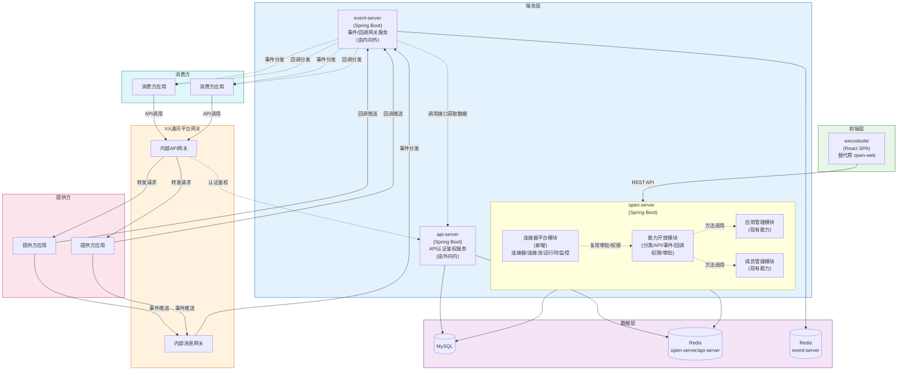
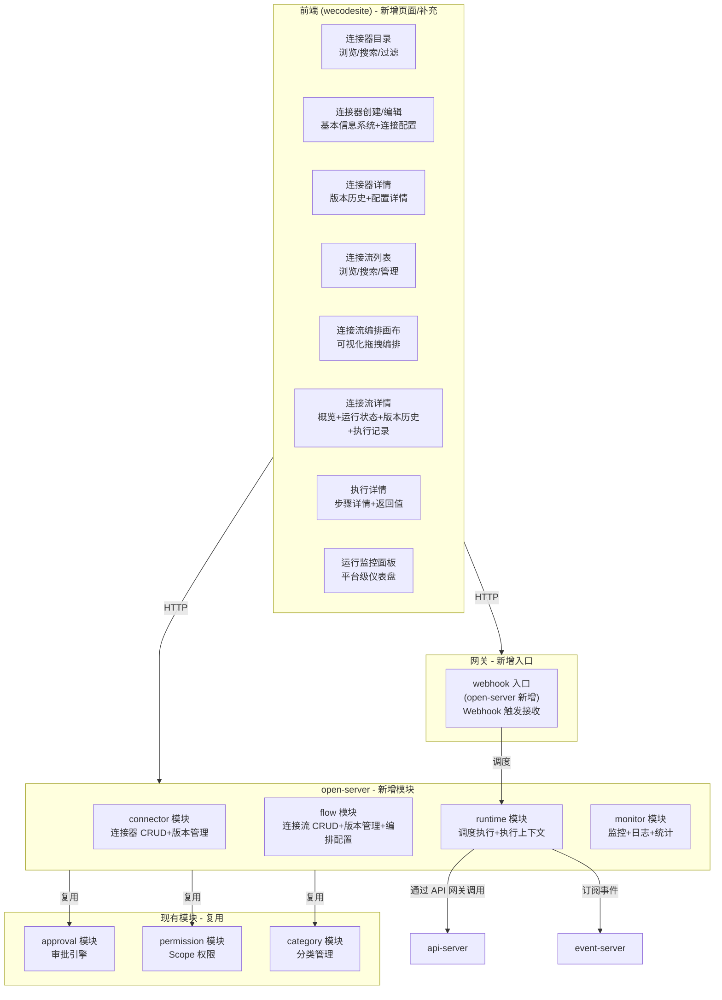
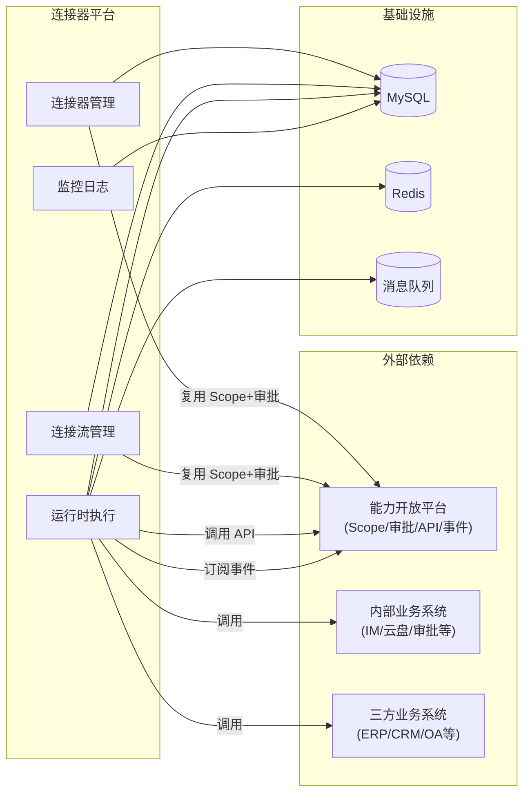
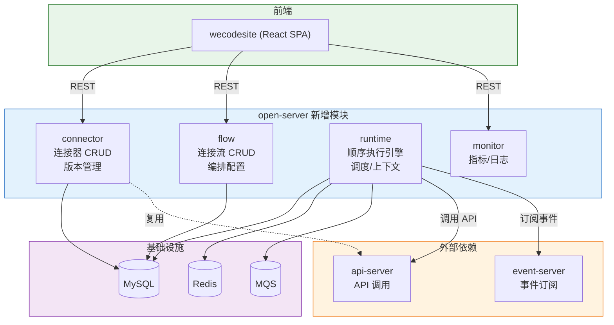
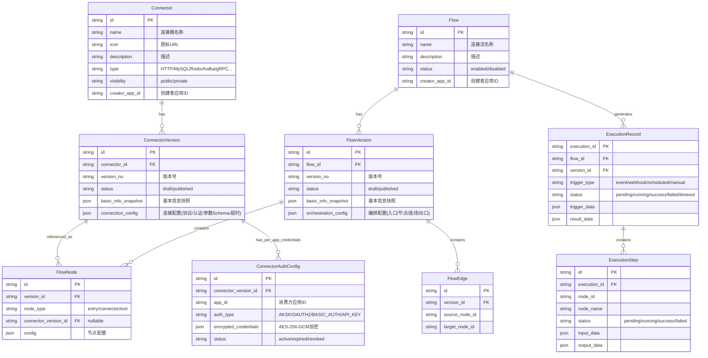

# 技术规划：连接器平台（Connector Platform）

**Feature ID**: CONN-PLAT-001  
**规划版本**: v1.1  
**创建日期**: 2026-05-19  
**规划作者**: SDDU Plan Agent  
**规范版本**: spec.md v3.0  
**前置文档**: discovery-report.md (v3.1), 三方案对比分析, 国内连接器平台技术架构分析, 详细设计文档

> ⚠️ **前端项目说明**：`open-web` 代码已全部迁移至 `wecodesite`，本规划中所有前端引用均以 `wecodesite` 为准。`wecodesite` 已内置 `@xyflow/react` 依赖，且 `ConnectPlatform/Connector`、`ConnectPlatform/ConnectorEditor`、`ConnectPlatform/Flow` 等页面已有实现。

---

## 1. 架构分析

### 1.1 现有系统架构

> 💡 以下架构**沿用**能力开放平台（`specs-tree-capability-open-platform/plan.md §方案D`）的微服务架构设计。唯一差异：前端项目从 `open-web` 变更为 `wecodesite`。



**与连接器平台相关的现有能力（wecodesite 已集成连接器平台页面）**:
| 现有能力 | 用途 | 复用方式 |
|---------|------|---------|
| Scope 权限模型 | 连接器调用 API/事件时的权限管控 | 直接复用，连接器定义关联 API Scope |
| 审批引擎 | 连接器发布/连接流部署审批 | 直接复用，新增审批场景类型 |
| 分类管理 (Category) | 连接器分类树 | 扩展资源类型，复用现有分类体系 |
| 事件网关 (event-server) | 事件触发连接流 | 事件网关作为触发器事件源 |
| API 网关 (api-server) | 连接器执行时的 API 调用路由 | 连接器通过 API 网关调用内部 API |

**现有代码引用**:
| 代码位置 | 说明 |
|---------|------|
| `open-server/src/main/java/com/xxx/open/modules/` | 现有能力开放模块（category/api/event/callback/permission/approval），连接器平台在此新增 4 个模块 |
| `wecodesite/src/pages/ConnectPlatform/` | 已有连接器目录（Connector）、连接器编辑器（ConnectorEditor）、连接流列表/编排画布（Flow）页面 |

### 1.2 技术栈确认

> 沿用能力开放平台（`specs-tree-capability-open-platform/plan.md §1.4`）的技术栈标准。

#### 前端技术栈

| 层级 | 技术选型 | 版本 |
|------|----------|------|
| **框架** | React | ^18.2.0 |
| **UI 组件库** | Ant Design | ^4.x |
| **构建工具** | Vite | ^5.0.0 |
| **CSS 预处理器** | Less | ^4.2.0 |
| **样式方案** | Less Module（`.m.less` / `.less`） | - |
| **状态管理** | thunk.js 模式（现有） | - |
| **编排画布** | @xyflow/react (React Flow) | ^12.x（wecodesite 已内置） |

#### 后端技术栈

| 层级 | 技术选型 | 版本 |
|------|----------|------|
| **语言** | Java | 21 |
| **构建工具** | Maven | 3.9.x |
| **框架** | Spring Boot | 3.4.6 |
| **ORM** | MyBatis | mybatis-spring-boot-starter 3.0.4 |
| **数据库** | MySQL | 5.7 |
| **缓存** | Redis | 6.0 |
| **定时调度** | Quartz Scheduler | Spring Boot 内置 |

### 1.3 连接器平台新增组件



### 1.4 数据流分析

**连接器发布流程**:
```
供给方创建连接器基本信息 → 配置连接配置(协议/认证/参数) → 发布 →
进入审批(复用审批引擎) → 审批通过 → 新版上架可见
```

**连接流创建与执行流程**:
```
消费方创建连接流 → 进入编排画布 → 配置入口触发器 →
添加连接器节点 → 配置数据映射 → 配置出口节点 →
→ 保存草稿 → 发布 → 审批 → 上线启用

事件触发 → 匹配订阅连接流 → 创建执行实例(生成执行ID) →
顺序执行各节点 → 记录执行日志 → 更新执行状态
```

**运行时数据流 (一次执行)**:
```
触发器(事件/Webhook/定时/手动)
  → 调度器创建 ExecutionContext (含触发数据)
  → 节点1(连接器): 读取上游数据 → 调用外部API → 输出到上下文
  → 节点2(连接器): 读取上游数据(含节点1输出) → 调用外部API → 输出到上下文
  → ...
  → 出口节点: 定义返回值
  → 记录执行日志/指标
```

### 1.5 依赖关系图



### 1.6 核心业务对象关系

连接器平台围绕 9 个核心业务对象组织，对象间关系：

| 关系 | 说明 |
|------|------|
| Connector → ConnectorVersion | 一个连接器有多个版本（1:N），发布时快照基本信息+连接配置 |
| ConnectorVersion → FlowNode | 连接器版本被连接流节点引用（1:N） |
| ConnectorVersion → ConnectorAuthConfig | 连接器版本按消费方应用存储独立认证凭证（1:N） |
| Flow → FlowVersion | 一个连接流有多个版本（1:N），发布时快照基本信息+编排配置 |
| FlowVersion → FlowNode / FlowEdge | 版本包含节点和连线（1:N），节点含 entry/connector/exit 三种类型 |
| Flow → ExecutionRecord → ExecutionStep | 每次执行生成一条记录，记录含多个步骤（1:N:N） |

> 完整 ER 图（含字段定义）详见 **§4.2 数据库设计** 及 `plan-db.md`

---

## 2. 方案对比

### 2.1 方案 A：轻量顺序执行引擎（推荐）

**方案描述**: 基于现有 open-server 扩展，采用轻量级顺序执行引擎。连接流编排配置以 JSON 存储，运行时引擎按节点顺序依次执行。使用消息队列进行异步调度，执行上下文存储在 Redis 中，执行记录持久化到 MySQL。



**核心设计**:
- **编排层**: FlowVersion 的 orchestration_config 以 JSON 格式存储完整编排信息（入口节点配置、连接器节点列表及参数、节点间数据映射、出口节点配置）
- **执行引擎**: 顺序执行器（SequentialExecutor），从入口节点开始，依次执行每个连接器节点，最后执行出口节点
- **调度**: 触发事件 → MQS 消息 → 执行器消费 → 顺序执行
- **认证凭证**: 连接器版本中存储认证配置，运行时自动加载注入

**优点**:
- 与现有单体架构完全兼容，开发成本最低
- 无额外框架依赖，团队熟悉现有技术栈
- MVP 仅需线性编排，顺序执行器足够满足需求
- 执行上下文清晰，调试简单
- 执行性能可预测（线性 O(n) 复杂度）
- 可平滑演进到 V1（增加条件/循环/子流程节点类型）

**缺点**:
- 高并发场景下，单实例执行器可能成为瓶颈
- 缺乏标准化的流程定义格式（非 BPMN 标准）
- 复杂编排场景（并行/分支/循环）需要在 V1 重构执行器
- 运行时与 CRUD 在同一个进程中，资源隔离需要额外设计

**风险评估**: 低 — MVP 范围明确（仅线性），技术复杂度可控

**预估工作量**: 10-14 周 (3-4 后端 + 2-3 前端 + 1 QA)

### 2.2 方案 B：Spring StateMachine 状态机引擎

**方案描述**: 引入 Spring StateMachine 作为流程引擎核心，将连接流执行抽象为状态转换。每个连接器节点对应一个状态，节点执行完成触发状态转换。

**优点**:
- 状态机理论成熟，状态转换清晰
- Spring StateMachine 与现有 Spring Boot 技术栈集成良好
- 支持事件驱动状态转换，天然适合触发场景
- 可扩展性强，后续分支/循环可通过嵌套状态机实现

**缺点**:
- 对于 MVP 的线性编排场景，状态机过度设计
- 学习曲线：团队需要学习状态机概念和框架 API
- 嵌套状态机复杂度随分支/循环快速上升
- 状态机实例管理增加开发复杂度
- 调试困难：状态转换链路过长时难以追踪

**风险评估**: 中 — 框架引入增加不确定性

**预估工作量**: 12-16 周 (3-4 后端 + 2-3 前端 + 1 QA)

### 2.3 方案 C：消息驱动引擎

**方案描述**: 以消息队列为核心，将每个连接器节点封装为独立的消息消费者。流程执行为消息在消费者间的流转过程，每个节点执行完将结果写入新消息，路由到下一节点。

**优点**:
- 天然分布式，节点间完全解耦
- 水平扩展能力强（可独立扩展瓶颈节点）
- 与现有 MQS 系统一致，团队熟悉
- 消息持久化提供天然的容错能力
- 追踪能力天然（消息追踪 ID）

**缺点**:
- 线性流程的消息传递延迟比同步调用高
- 调试复杂：消息在多个消费者间流转，需要追踪工具
- 不能复用 Spring StateMachine 的成熟能力
- 节点间数据传递需要序列化/反序列化开销
- MVP 阶段不需要分布式能力，过早引入复杂度
- 运维复杂度增加（多个消费者实例管理）

**风险评估**: 中 — 分布式调试和运维复杂度增加

**预估工作量**: 14-18 周 (4-5 后端 + 2-3 前端 + 1 QA)

### 2.4 综合对比矩阵

| 对比维度 | 方案 A 轻量顺序 | 方案 B 状态机 | 方案 C 消息驱动 |
|---------|:--------------:|:------------:|:--------------:|
| MVP 开发周期 | **10-14 周** ⭐ | 12-16 周 | 14-18 周 |
| 技术复杂度 | **低** ⭐ | 中 | 中高 |
| 与现有架构兼容性 | **高** ⭐ | 中 | 中 |
| 线性编排支持 | **原生** ⭐ | 过度设计 | 可用 |
| 分支/循环扩展性 | 需重构 | **自然支持** ⭐ | 需扩展 |
| 性能 (线性场景) | **高** ⭐ | 中 | 低(消息延迟) |
| 可调试性 | **高** ⭐ | 中 | 低 |
| 运维复杂度 | **低** ⭐ | 低 | 中 |
| 资源隔离 | 需设计 | 需设计 | **天然** ⭐ |
| 团队学习成本 | **无** ⭐ | 1-2 周 | **无** ⭐ |

---

## 3. 推荐方案

### 推荐: 方案 A - 轻量顺序执行引擎

**推荐理由**:

1. **MVP 范围匹配**: 规范明确 MVP 仅支持线性编排（入口节点 → 连接器节点 → 出口节点），无需分支/循环/并行。顺序执行器是满足需求的最简方案，不做过度设计。

2. **最小化技术债务**: 不引入额外框架（Spring StateMachine），使用纯 Java + MQS 实现，与现有架构一致。MVP 上线后如有复杂编排需求，方案 A 的 JSON 编排结构可平滑演进。

3. **开发效率最优**: 团队可在现有 open-server 中新增 connector/flow/runtime/monitor 四个模块，复用已有的 MyBatis/MySQL/Redis/MQS 基础设施，无需引入新依赖。

4. **调试友好**: 线性执行的每步输入/输出清晰，测试运行时可逐步验证，排查问题直观。

5. **渐进式演进路径**: MVP→V1 时，可通过增加节点类型处理逻辑（区分 connector/control/data/error 节点）扩展分支/循环能力，执行器从顺序执行变为调度执行，无需推翻重来。

### 关键架构决策概览

| 决策点 | 选择 | 理由 |
|-------|------|------|
| 流引擎 | 轻量顺序执行器（自研） | MVP 仅需线性编排，最简方案 |
| 编排画布 | React Flow | React-native, 轻量, TS 支持好 |
| 运行时部署 | 嵌入 open-server（独立线程池） | MVP 避免过早拆分，预留抽取路径 |
| 触发调度 | MQS 异步消息 | 与现有基础设施一致 |
| 执行上下文 | Redis + MySQL 双写 | Redis 运行时查询, MySQL 持久化 |
| 凭证明文存储 | AES-256 加密存储, 界面脱敏 | 满足 NFR-010 安全要求 |
| Webhook 入口 | open-server 新增 controller | 简单场景无需独立服务 |

---

## 4. 模块与文件概览

> **职责说明**：本章仅描述「有哪些内容」和「详细设计在哪个文件」。具体设计（表名/字段/索引、API 路径/参数/响应、页面路由/组件树/交互）均只在对应子文档中定义，plan.md 不重复。

### 4.1 模块划分

| 模块 | 所属项目 | 类型 | 说明 |
|------|---------|------|------|
| **connector** | open-server | 新增模块 | 连接器管理 — CRUD、版本管理、上架/下架 |
| **flow** | open-server | 新增模块 | 连接流管理 — CRUD、版本管理、编排配置 |
| **runtime** | open-server | 新增模块 | 运行时 — 调度执行、执行上下文、触发管理 |
| **monitor** | open-server | 新增模块 | 监控日志 — 运行指标、执行历史查询 |
| **connector** | wecodesite | 新增页面组 | 连接器目录/创建编辑/详情 |
| **flow** | wecodesite | 新增页面组 | 连接流列表/编排画布/详情/执行详情 |
| **monitor** | wecodesite | 新增页面组 | 运行监控面板 |

> 各模块的**完整数据库表设计**详见 `plan-db.md`  
> 各模块的**完整 API 接口设计**详见 `plan-api.md`  
> 各页面组的**完整前端设计**详见 `plan-page.md`  
> **代码规范**（16 条强制规则，沿用能力开放平台标准）详见 `plan-code.md`

### 4.2 数据库设计

共 **9 张表**，按模块归属：connector 模块 2 张、flow 模块 4 张、runtime 模块 3 张。统一使用 `cp_` 前缀，涵盖连接器基本信息/版本、连接流基本信息/版本/节点/连线、执行记录/步骤、认证凭证。

**核心 ER 关系**（详细字段定义、索引、JSON Schema 见 `plan-db.md`）：



> 表结构定义、字段类型、索引、JSON Schema 详见 **`plan-db.md`**

### 4.3 API 接口设计

共 **18 个逻辑分组**（展开约 33 个 HTTP 端点），按模块归属：connector 模块 5 组、flow 模块 4 组、runtime 模块 7 组、monitor 模块 2 组。覆盖连接器/连接流的 CRUD、版本管理、上架下架、启停、触发执行、执行查询、测试运行、运行监控等全部功能。同时复用了能力开放平台的审批接口和 MQS 消息主题。

> 完整端点定义、请求/响应 Schema、错误码、鉴权方式、MQS 主题定义详见 **`plan-api.md`**

### 4.4 前端页面设计

共 **8 个页面**，5 个已有实现（wecodesite `ConnectPlatform/` 目录下）+ 3 个需新增（连接流详情、执行详情、运行监控面板）。覆盖连接器目录/编辑器、连接流列表/编排画布/详情、执行详情、监控面板六大场景。

> 页面布局、组件树、交互流程、路由设计、状态管理（thunk.js）详见 **`plan-page.md`**

### 4.5 目录结构规划

```
open-app/
├── open-server/                                 # 后端管理服务（现有工程扩展）
│   └── src/main/java/com/xxx/open/modules/
│       ├── category/              # 现有：分类管理
│       ├── api/                   # 现有：API 管理
│       ├── event/                 # 现有：事件管理
│       ├── callback/              # 现有：回调管理
│       ├── permission/            # 现有：权限管理
│       ├── approval/              # 现有：审批管理
│       ├── connector/             # 🆕 连接器管理模块
│       ├── flow/                  # 🆕 连接流管理模块
│       ├── runtime/               # 🆕 运行时模块
│       └── monitor/               # 🆕 监控模块
│
├── wecodesite/                                   # 前端应用
│   └── src/pages/ConnectPlatform/
│       ├── Connector/             # ✅ 已有：连接器目录页面
│       ├── ConnectorEditor/       # ✅ 已有：连接器创建/编辑页面
│       ├── Flow/                  # ✅ 已有：连接流列表/编排画布
│       │   ├── FlowDetail.jsx     # 🆕 需新增：连接流详情
│       │   ├── ExecutionDetail.jsx # 🆕 需新增：执行详情
│       │   ├── DataMappingDialog.jsx # 🆕 需新增：数据映射弹窗
│       │   └── TestRunDialog.jsx  # 🆕 需新增：测试运行弹窗
│       └── Monitor/               # 🆕 需新增：运行监控面板
│           ├── MonitorDashboard.jsx
│           ├── index.jsx
│           ├── constants.jsx
│           └── thunk.js
```

### 4.6 服务职责详表

| 服务 | 新增模块 | 职责 | 数据存储 | 端口 | 上下文根 | 依赖 |
|------|---------|------|----------|------|----------|------|
| **open-server** | connector | 连接器 CRUD、版本管理、上架/下架 | MySQL + Redis(共享) | 18080 | /open-server | category/permission/approval 模块（方法调用） |
| **open-server** | flow | 连接流 CRUD、版本管理、编排配置存储 | MySQL + Redis(共享) | 18080 | /open-server | connector 模块、permission/approval 模块 |
| **open-server** | runtime | 调度执行、执行上下文管理、Webhook 入口 | MySQL + Redis(共享) | 18080 | /open-server | api-server(API调用)、event-server(事件订阅)、MQS |
| **open-server** | monitor | 运行指标统计、执行日志查询 | MySQL + Redis(共享) | 18080 | /open-server | runtime 模块（执行数据） |

> 连接器平台的 4 个模块均部署在现有 open-server 中（端口 18080，上下文根 /open-server），复用 open-server 的 MySQL 和 Redis 实例。

### 4.7 文件清单

#### open-server — connector 模块

| 文件 | 说明 |
|------|------|
| `modules/connector/ConnectorController.java` | 连接器 CRUD、上架/下架 |
| `modules/connector/ConnectorService.java` | 连接器业务逻辑 |
| `modules/connector/ConnectorVersionController.java` | 版本管理（列表/详情/发布） |
| `modules/connector/ConnectorVersionService.java` | 版本业务逻辑 |
| `modules/connector/entity/Connector.java` | 连接器实体 |
| `modules/connector/entity/ConnectorVersion.java` | 连接器版本实体 |
| `modules/connector/mapper/ConnectorMapper.java` | 连接器 Mapper |
| `modules/connector/mapper/ConnectorVersionMapper.java` | 版本 Mapper |

#### open-server — flow 模块

| 文件 | 说明 |
|------|------|
| `modules/flow/FlowController.java` | 连接流 CRUD、启停 |
| `modules/flow/FlowService.java` | 连接流业务逻辑 |
| `modules/flow/FlowVersionController.java` | 版本管理、编排配置保存/发布 |
| `modules/flow/FlowVersionService.java` | 版本业务逻辑 |
| `modules/flow/entity/Flow.java` | 连接流实体 |
| `modules/flow/entity/FlowVersion.java` | 连接流版本实体 |
| `modules/flow/entity/FlowNode.java` | 流节点实体 |
| `modules/flow/entity/FlowEdge.java` | 流连线实体 |
| `modules/flow/mapper/FlowMapper.java` | 连接流 Mapper |
| `modules/flow/mapper/FlowVersionMapper.java` | 版本 Mapper |

#### open-server — runtime 模块

| 文件 | 说明 |
|------|------|
| `modules/runtime/ExecutionController.java` | 手动触发、执行查询、重试 |
| `modules/runtime/WebhookController.java` | Webhook 触发入口 |
| `modules/runtime/SequentialExecutor.java` | 顺序执行引擎 |
| `modules/runtime/ExecutionContext.java` | 执行上下文管理 |
| `modules/runtime/FlowScheduler.java` | 事件/定时触发调度 |
| `modules/runtime/NodeExecutor.java` | 节点执行器接口 |
| `modules/runtime/entity/ExecutionRecord.java` | 执行记录实体 |
| `modules/runtime/entity/ExecutionStep.java` | 执行步骤实体 |
| `modules/runtime/entity/ConnectorAuthConfig.java` | 认证凭证实体 |
| `modules/runtime/mapper/ExecutionRecordMapper.java` | 执行记录 Mapper |

#### open-server — monitor 模块

| 文件 | 说明 |
|------|------|
| `modules/monitor/MetricsController.java` | 运行指标查询 |
| `modules/monitor/MetricsService.java` | 指标计算服务 |

#### wecodesite — 新增/扩展页面

| 文件 | 说明 | 状态 |
|------|------|:---:|
| `ConnectPlatform/Flow/FlowDetail.jsx` | 连接流详情页 | 🆕 |
| `ConnectPlatform/Flow/ExecutionDetail.jsx` | 执行详情页 | 🆕 |
| `ConnectPlatform/Flow/DataMappingDialog.jsx` | 数据映射弹窗 | 🆕 |
| `ConnectPlatform/Flow/TestRunDialog.jsx` | 测试运行弹窗 | 🆕 |
| `ConnectPlatform/Monitor/MonitorDashboard.jsx` | 监控面板 | 🆕 |
| `ConnectPlatform/Monitor/index.jsx` | 监控入口 | 🆕 |
| `ConnectPlatform/Connector/thunk.js` | 扩展：stats/fetchVersions 等 | 📝 扩展 |
| `ConnectPlatform/Flow/thunk.js` | 扩展：saveCanvas/testRun 等 | 📝 扩展 |
| `App.jsx` | 注册新路由 | 📝 修改 |

### 4.8 新增依赖

| 依赖 | 版本 | 用途 | 所属项目 |
|------|------|------|---------|
| `@xyflow/react` (React Flow) | ^12.x | 可视化编排画布 | wecodesite（已内置） |
| Quartz Scheduler | Spring Boot 内置 | 定时触发服务 | open-server |

### 4.9 文件影响统计

| 项目 | 新增文件 | 修改文件 | 删除文件 |
|------|:--------:|:--------:|:--------:|
| open-server (4 个新模块) | 65 | 0 | 0 |
| wecodesite（已有页面 + 新增补充） | 6（新增） + 3（已有需扩展） | 2 | 0 |
| **合计** | **74** | **2** | **0** |

---

## 5. 风险评估

### 5.1 技术风险

| 风险 | 影响 | 概率 | 缓解措施 |
|------|------|:----:|---------|
| 可视化编排画布前端复杂度高 | 工期延误 | 中 | MVP 限制线性编排，使用 React Flow 的受限模式；高级交互（对齐/分组/撤销重做）延后 |
| 运行时执行隔离不充分 | 单流故障影响其他流 | 低 | 线程池隔离 + 资源配额限制 + 超时强制终止 |
| 认证凭证加密存储和传输 | 安全漏洞 | 低 | 使用 AES-256-GCM 加密 + HTTPS + 界面脱敏显示 |
| 与能力开放平台集成边界不清晰 | 接口不稳定 | 中 | Plan 阶段明确接口契约，制定 mock 策略 |
| 大量并发事件触发时调度性能 | 消息堆积 | 低 | MQS 天然缓冲，设置单流并发限制，超限告警 |
| Webhook URL 安全 | 非法调用 | 低 | 随机不可预测路径 + 请求签名验证 + 限流 |

### 5.2 依赖风险

| 风险 | 影响 | 概率 | 缓解措施 |
|------|------|:----:|---------|
| 能力开放平台 Scope 模型不满足连接器场景 | 需要扩展 Scope 模型 | 低 | 与平台团队提前沟通确认 |
| 审批引擎不支持连接器/连接流审批场景 | 需要扩展审批场景 | 低 | 扩展审批引擎的场景枚举 |
| 内部业务模块人员身份机制未确定 (OQ-007) | 平台连接器注册入口设计 | 中 | Plan 阶段先做，后续与身份机制对齐 |
| React Flow 库兼容性问题 | 前端问题 | 低 | 选择稳定版本，做好降级方案 |

### 5.3 时间风险

| 风险 | 影响 | 概率 | 缓解措施 |
|------|------|:----:|---------|
| MVP 范围较大 (38 个 FR) | 开发周期长 | 中 | 按模块优先级迭代：连接器管理(V1) → 连接流管理(V2) → 运行时(V3) → 监控(V4) |
| 可视化编排画布研发耗时长 | 前端成为瓶颈 | 高 | 先做基础拖拽+节点配置，高级交互后延；用 React Flow 的受控模式减少自研量 |
| 与能力开放平台联调耗时长 | 集成周期长 | 中 | 制定 mock 策略，前端 mock 先行，后端先独立测试 |

### 5.4 开放问题处理

| # | 问题 | 建议方案 | 决策时间点 |
|---|------|---------|-----------|
| OQ-001 | MVP 连接器范围 | 优先封装 IM 消息能力（发送消息/接收消息事件）作为首个平台连接器 | Tasks 阶段开始前 |
| OQ-002 | 流编排引擎选型 | **已决策** → 轻量顺序执行器（方案 A） | 当前 |
| OQ-003 | 可视化编排画布选型 | **已决策** → React Flow (@xyflow/react) | 当前 |
| OQ-004 | 告警通知方式 | 先支持 IM 消息通知（复用现有通知通道），后续扩展邮件/站内信 | Tasks 阶段 |
| OQ-005 | 与分组管理集成 | 连接器作为新资源类型挂载到现有分组体系，复用 category 模块 | Tasks 阶段 |
| OQ-006 | 执行历史保留策略 | 默认保留 30 天（可配置），超过自动清理 | Tasks 阶段 |
| OQ-007 | 内部人员身份机制 | 先简化处理：内部人员使用"应用成员"身份注册连接器，后续完善独立机制 | Tasks 阶段 |

---

## 6. 版本规划

### 迭代建议

| 迭代 | 范围 | 周期 | 交付价值 |
|------|------|:----:|---------|
| **迭代 1** | 连接器管理模块 (FR-001 ~ FR-010) | 3-4 周 | 平台连接器/连接器的创建、编辑、版本管理、上架审批 |
| **迭代 2** | 连接流管理模块 (FR-011 ~ FR-021) | 3-4 周 | 连接流创建、编排画布、版本管理、测试运行 |
| **迭代 3** | 运行时模块 (FR-022 ~ FR-030) | 2-3 周 | 四类触发调度、执行引擎、错误处理、资源配额 |
| **迭代 4** | 监控与治理 (FR-031 ~ FR-037) | 2-3 周 | 执行历史、运行指标、Scope 集成、审批对接 |
| **集成测试** | 全链路联调 + E2E | 1-2 周 | 端到端验证 |
| **合计** | | **10-14 周** | |

### 关键里程碑

| 里程碑 | 时间点 | 验收标准 |
|-------|--------|---------|
| M1: 连接器可用 | 迭代 1 完成 | 可创建/编辑/发布连接器，通过审批上架 |
| M2: 连接流可编排 | 迭代 2 完成 | 可拖拽创建连接流，触发配置，保存草稿 |
| M3: 连接流可执行 | 迭代 3 完成 | 连接流可被事件/Webhook/定时/手动触发执行 |
| M4: 可运维 | 迭代 4 完成 | 可查看执行历史、运行指标、运行状态 |
| M5: MVP 就绪 | 集成测试完成 | 完成端到端验证，满足所有 MVP 验收标准 |

---

## 7. 与能力开放平台的集成

| 集成点 | 连接器平台 | 能力开放平台 | 实现方式 |
|--------|-----------|-------------|---------|
| Scope 授权 | 连接器定义关联 API Scope | 提供 Scope 鉴权接口 | 运行时调用 API 网关进行 Scope 校验 |
| 事件订阅 | 流入口节点选择事件触发 | 提供事件订阅接口 | FlowScheduler 订阅 event-server 事件 |
| 审批流 | 连接器发布/连接流部署 | 审批引擎 | 调用 approval service 创建审批单 |
| 分类管理 | 连接器分类归属 | Category 模块 | 复用 category 表，资源类型新增 connector |

---

## ✅ 技术规划完成

**Feature**: 连接器平台 (CONN-PLAT-001)  
**状态**: planned  
**文件**:

| 文档 | 说明 |
|------|------|
| `.sddu/.../specs-tree-connector-platform/plan.md` | **技术总纲**（架构·方案·风险评估·版本规划） |
| `.sddu/.../specs-tree-connector-platform/plan-db.md` | **数据库设计**（表结构·索引·JSON Schema） |
| `.sddu/.../specs-tree-connector-platform/plan-api.md` | **API 接口设计**（端点·请求/响应·鉴权·命名规范） |
| `.sddu/.../specs-tree-connector-platform/plan-page.md` | **前端页面设计**（组件树·交互流程·路由） |
| `.sddu/.../specs-tree-connector-platform/plan-code.md` | **代码规范**（注释·日志·SQL·安全·16 条强制规则） |

### 生成的 ADR

| ADR | 标题 | 状态 |
|-----|------|------|
| `ADR-001.md` | 轻量顺序执行引擎技术方案 | ACCEPTED |
| `ADR-002.md` | React Flow 可视化编排画布 | ACCEPTED |
| `ADR-003.md` | 运行时架构：单体嵌入 + 模块化隔离 | ACCEPTED |

### 下一步
👉 运行 `@sddu-tasks 连接器平台` 开始任务分解