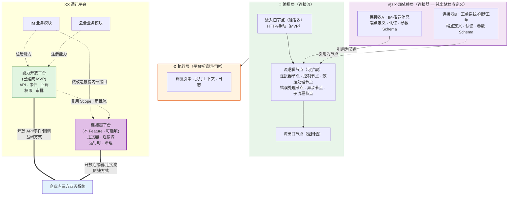

# 规范文档：连接器平台

**Feature ID**: CONN-PLAT-001  
**名称**: 连接器平台（Connector Platform）  
**状态**: specified  
**优先级**: P1  
**作者**: Summer  
**创建日期**: 2026-05-18  
**最后更新**: 2026-05-22  
**需求挖掘报告**: discovery-report.md (v3.1)

---

## 1. 概述

### 1.1 问题陈述

能力开放平台 MVP 已就绪（API/事件/回调/权限/审批），三方平台可通过 API/事件/回调消费 XX 平台能力达成目标。但三方平台消费开放能力时面临以下痛点：

- **单点消费重复造轮子**：每消费一个 API/事件/回调，都要单独写代码处理鉴权、调用、错误重试等，无复用、无标准化
- **多步流程硬编码**：串联多个开放能力完成业务流程时，缺乏编排工具，只能硬编码
- **数据格式转换重复写**：消费能力后需将数据转换适配自身系统格式，每次都要写字段映射和转换逻辑
- **运维管控缺失**：对接后的连接流缺少运行监控、重试、告警等运维能力，出问题只能人工排查

### 1.2 解决方案

构建**连接器平台**，作为与 API、事件、回调**同级并列**的第四种开放形式。连接器是**可选项/锦上添花**——没有连接器，三方平台也能通过 API/事件/回调达成目标；有了连接器，将三方平台原本需要大量人工编码的消费场景转化为**低代码/零代码配置**，使原有开放更便捷。

连接器平台按**三层架构**组织：**外部依赖层**（连接器 — 纯出站端点定义，类比 import 的模块/库）、**编排层**（连接流 — 入口节点→逻辑节点→出口节点，类比函数体）、**执行层**（运行时 — 调度执行引擎，类比虚拟机）。

### 1.3 定位

| 维度 | 说明 |
|------|------|
| **同级并列** | 连接器与 API、事件、回调是同级并列的四种开放形式，共同服务于"连接XX通讯平台与三方平台"的目标 |
| **可选项** | 连接器是锦上添花——没有连接器也能通过 API/事件/回调达成目标，有了连接器使开放更便捷 |
| **归属关系** | 连接器平台是开放平台的组成部分，不内嵌于能力开放平台，但同属开放平台体系 |
| **集成范围** | 仅对接与开放平台相关的业务系统：① 企业内三方业务系统 ② XX通讯平台内部其它业务模块 |
| **复用关系** | 复用能力开放平台的 Scope 权限模型和审批流引擎 |

### 1.4 Goals

| # | 目标 | 衡量标准 |
|---|------|---------|
| G1 | 提供连接器封装能力（纯出站端点定义） | 支持对 XX 平台能力（API）的标准化封装，形成可复用的连接器；连接器定义单个功能点的完整调用信息（调用方式、认证、入参/出参 Schema），**不含触发器**（触发器归流平台编排层管理）；**MVP 仅支持 HTTP/API 协议** |
| G2 | 提供连接器生命周期管理 | 支持连接器的注册、编辑、删除；连接配置编辑即生效，**单版本管理**（MVP 不保留历史版本） |
| G3 | 提供连接流可视化编排 | 支持通过可视化拖拽编排器创建连接流：流入口节点（HTTP 触发器）→ 流逻辑节点（MVP 含**连接器节点** + **数据处理节点**）→ 流出口节点（返回值定义） |
| G4 | 提供连接流生命周期管理 | 支持连接流的创建、编辑、启停、删除；编排配置编辑即生效，**单版本管理**（MVP 不保留历史版本） |
| G5 | 提供基础数据转换 | 支持源字段→目标字段的映射配置，实现连接器间的数据流转 |
| G6 | 提供平台托管运行时 | 连接流在平台侧**同步**调度执行（HTTP 触发 + 测试执行），消费方无需部署运行时 |
| G7 | — | **[已移除]** 运行监控与日志移至 V1 阶段 |

### 1.5 Non-Goals

| # | 非目标 | 原因 |
|---|--------|------|
| NG1 | 实现条件分支/循环/子流程编排 | Should Have，V1 阶段 |
| NG2 | 实现可视化拖拽编排与代码模式互转 | Should Have，V1 阶段 |
| NG3 | 提供函数库和自定义 JS 脚本转换 | Should Have，V1 阶段 |
| NG4 | 提供连接器开发 SDK | Should Have，V1 阶段 |
| NG5 | 实现连接器市场与发现 | Could Have，V2 阶段 |
| NG6 | 支持连接器开放发布 | Could Have，V2 阶段 |
| NG7 | AI 辅助编排 | Could Have，V2 阶段 |
| NG8 | 实现计费系统 | 企业内使用，无需计费 |
| NG9 | 支持多租户/跨企业 | 仅限企业内部系统 |
| NG10 | 替代现有应用管理/成员管理 | 沿用现有系统 |
| NG11 | 通用 iPaaS 能力 | 不与 Zapier/Make/集简云竞争，聚焦 XX 平台能力编排 |
| NG12 | 非 HTTP 协议连接器（MySQL/Redis/Kafka/gRPC 等） | Should Have，V1 阶段 |
| NG13 | 连接器上架/下架 | Should Have，V1 阶段 |
| NG14 | 资源配额与隔离 | Should Have，V1 阶段 |
| NG15 | 失败重试 | Should Have，V1 阶段 |
| NG16 | 事件触发器 | Should Have，V1 阶段 |
| NG17 | 定时触发器（Cron） | Should Have，V1 阶段 |
| NG18 | Scope 权限复用 | Should Have，V1 阶段 |
| NG19 | 审批流独立管理 | Should Have，V1 阶段——本版本仅在设计上预留审批扩展点，不构建审批体系 |
| NG20 | 手动触发调度 | Should Have，V1 阶段 |
| NG21 | 执行历史与运行日志 | Should Have，V1 阶段 |

---

## 2. 用户故事

> 💡 **定位**：本版本面向**平台管理员**单一角色，负责连接器平台的完整管理——包括连接器的注册与配置管理、连接流的编排与运行管理。MVP 采用单版本模型（编辑即生效），审批、版本历史、执行日志等移至 V1。

| ID | 用户故事 | 优先级 | 验收标准 |
|----|---------|--------|---------|
| US-01 | 作为 **平台管理员**，我想要 **创建和管理连接器**（创建、编辑、删除、查询），以便 **将外部系统的 API 封装为可复用的连接器供连接流引用** | P0 | 可创建连接器基本信息（名称/图标/描述/类型），编辑基本信息，删除连接器（校验无引用），浏览连接器列表并支持搜索过滤 |
| US-02 | 作为 **平台管理员**，我想要 **管理连接器的连接配置**（查看、编辑），以便 **控制连接器的调用方式** | P0 | 可查看/编辑连接配置（协议地址/认证方式/入参出参 Schema/超时/限流），编辑即生效，单版本管理（不保留历史版本） |
| US-03 | 作为 **平台管理员**，我想要 **创建和管理连接流**（创建、编辑、删除、查看、启动、停止），以便 **编排和运行跨系统的业务流程** | P0 | 可创建连接流基本信息/配置，编辑基本信息/配置，删除连接流（需已停止），启动/停止连接流，浏览连接流列表 |
| US-04 | 作为 **平台管理员**，我想要 **编排连接流配置并测试执行**，以便 **验证配置正确性后再正式使用** | P0 | 可在可视化画布编排连接流（HTTP 入口→数据处理节点/连接器节点→出口），测试运行并查看结果，编辑即生效（单版本模型） |

---

## 3. 功能需求 (FR)

### 3.1 连接器管理

> 💡 **定位**：连接器分两层：**连接器基本信息**（代表连接器本身）和**连接配置**（属于连接器版本）。基本信息描述"是什么连接器"（名称、图标、类型等），连接配置描述"怎么连接"（协议、地址、认证、参数等）。**MVP 采用单版本模型**：编辑即生效，不保留历史版本，不区分草稿/已发布状态。MVP 仅支持 HTTP 协议，不做上架/下架。

#### 3.1.1 连接器注册与管理

| FR | 名称 | 描述 | 验收标准 |
|----|------|------|---------|
| FR-001 | 连接器创建 | 创建连接器基本信息 | • **名称**：连接器名称 • **图标**：连接器图标 • **描述**：连接器功能描述 • **类型**：协议类型（**MVP 仅支持 HTTP**） • 创建后生成连接器基本信息，连接配置默认为空 |
| FR-002 | 连接器编辑 | 编辑连接器基本信息 | • 支持修改名称、图标、描述、类型 • 编辑基本信息直接更新字段 |
| FR-003 | 连接器删除 | 删除连接器 | • 删除前校验：无运行中的连接流引用该连接器才允许删除 • 有引用时提示影响范围，禁止删除 • 删除后不可恢复 |
| FR-004 | 连接器列表查看 | 浏览连接器目录 | • 列表展示：连接器名称、图标、描述、类型 • 支持按类型过滤；支持搜索 |

#### 3.1.2 连接器连接配置

> 💡 **定位**：连接配置定义连接器如何连接到外部系统。**MVP 采用单版本模型**：每个连接器仅有一个连接配置版本，编辑即生效，不保留历史版本，不区分草稿/已发布状态。

| FR | 名称 | 描述 | 验收标准 |
|----|------|------|---------|
| FR-005 | 连接配置查看 | 查看连接器的连接配置 | • **无配置时提示"暂无配置"** • 展示内容：协议类型、协议地址、认证方式、入参 Schema、出参 Schema、超时设置、限流设置 |
| FR-006 | 连接配置编辑 | 编辑连接配置（编辑即生效） | • 编辑后直接保存，立即生效 • **可编辑内容**：协议类型、协议地址、**认证方式及认证凭证**、入参定义、出参定义、超时设置、限流设置等 • 认证凭证加密存储，界面脱敏显示 • 编辑即生效——已引用该连接器的运行中连接流在下次触发时使用新配置 |

### 3.2 连接流管理

> 💡 **定位**：连接流分两层：**连接流基本信息**和**连接流配置**。基本信息描述连接流的名称、描述等；连接流配置描述编排内容。**MVP 采用单版本模型**：编辑即生效，不保留历史版本，不区分草稿/已发布状态。部署/启停设计上保留，但不做状态校验——编辑即运行。

#### 3.2.1 连接流注册与管理

| FR | 名称 | 描述 | 验收标准 |
|----|------|------|---------|
| FR-009 | 连接流创建 | 创建连接流基本信息 | • **名称**：连接流名称 • **描述**：连接流功能描述 • 创建后生成连接流基本信息，连接流配置默认为空 |
| FR-010 | 连接流编辑 | 编辑连接流基本信息 | • 支持修改名称、描述 • 编辑基本信息直接更新字段 |
| FR-011 | 连接流删除 | 删除连接流 | • 删除前校验：仅「已停止」状态的连接流可删除 • 删除后不可恢复 |
| FR-012 | 连接流列表查看 | 查看连接流列表 | • 展示名称、状态、最后运行时间 • 支持按状态过滤、搜索 |
| FR-013 | 连接流部署 | 将连接流部署到运行时环境 | • 设计上保留部署概念，MVP 不做状态校验 • 编辑连接流配置即视为部署到运行环境 • 部署后连接流进入**运行中**状态 |
| FR-014 | 连接流启动 | 启动已停止的连接流 | • 启动后连接流进入**运行中**状态，开始响应 HTTP 触发 • 已启动的连接流才响应外部触发 |
| FR-015 | 连接流停止 | 停止正在运行的连接流 | • 停止后连接流进入**已停止**状态，不再响应触发 • 已停止连接流可随时重新启动 |

#### 3.2.2 连接流配置

> 💡 **定位**：连接流配置定义连接流的编排内容。**MVP 采用单版本模型**：编辑即生效，不保留历史版本，不区分草稿/已发布状态。

**编排的流逻辑节点体系共 6 种基础节点类型**，**MVP 支持连接器节点 + 数据处理节点**，其余节点类型属 V1 范围：

| 节点类型 | 代码类比 | 描述 | MVP 范围 |
|---------|---------|------|---------|
| **连接器节点** | 调用外部函数 | 引用某个连接器，传入输入参数获取输出返回值 | ✅ MVP |
| **控制节点** | if/for/switch/forkJoin | 变更执行路径：分支、循环、并行 | ❌ V1 |
| **数据处理节点** | map | 数据结构处理：字段映射（源字段→目标字段） | ✅ MVP |
| **错误处理节点** | try/catch/finally | 异常捕获与恢复 | ❌ V1 |
| **异步节点** | setTimeout/Promise/await | 非同步执行控制 | ❌ V1 |
| **子流程节点** | 函数调用 | 引用另一个已定义的连接流作为当前流的一个步骤 | ❌ V1 |

| FR | 名称 | 描述 | 验收标准 |
|----|------|------|---------|
| FR-016 | 连接流配置查看 | 查看连接流的编排配置 | • **无配置时提示"暂无配置"** • 展示内容：流入口节点配置、连接器节点/数据处理节点列表及参数、节点间数据映射、流出口节点配置 |
| FR-017 | 连接流配置编辑 | 编辑连接流的编排内容（编辑即生效） | • 编辑后直接保存，立即生效 • **可编辑内容**：① 流入口节点：HTTP 触发配置、触发数据 Schema ② 连接器节点：选择连接器，配置输入参数 ③ 数据处理节点：配置字段映射（源字段→目标字段） ④ 节点间数据映射 ⑤ 流出口节点：返回字段列表定义 • 提供拖拽式可视化编排画布：画布三区域（入口区→编排区→出口区），支持拖拽、缩放、平移、删除 • 编辑即生效——运行中的连接流在下次触发时使用新配置 |
| FR-020 | 测试执行 | 手动触发连接流测试运行 | • 支持"测试运行"按钮，手动触发连接流执行一次 • 测试运行**同步**返回执行结果 • 测试运行结果独立展示，可查看每步执行详情 • 支持为触发器输入模拟数据（JSON 格式） |

### 3.3 运行时与监控

> 💡 **定位**：提供连接流的调度执行、默认错误处理和限流。调度为**同步执行**——调用方等待完整执行结果后返回。执行历史与运行日志移至 V1（NG21）。

#### 3.3.1 调度执行

| FR | 名称 | 描述 | 验收标准 |
|----|------|------|---------|
| FR-021 | HTTP 触发调度（同步） | 接收 HTTP 请求，同步执行连接流并返回结果 | • 为每个 HTTP 触发的连接流分配独立 URL • 接收 HTTP 请求后，解析请求体作为触发数据 • **同步执行连接流**，执行完成后返回完整结果（返回值 + 各步骤执行状态） • 支持请求签名验证，防止非法调用 |
| FR-023 | 默认错误处理 | 节点执行失败时的默认处理逻辑 | • 单个节点执行失败时，标记该节点为「失败」 • 节点失败后，连接流整体标记为「执行失败」 • 失败上下文数据保留，供排查 • 错误处理策略为平台默认行为，不可配置 |
| FR-024 | 默认限流处理 | 触发请求超过限流阈值时的默认处理逻辑 | • HTTP 触发请求超过阈值时返回 429（Too Many Requests） • 限流策略为平台默认行为，不可配置 |

---

## 4. 非功能需求 (NFR)

### 4.1 性能要求

| ID | 需求 | 目标值 |
|----|------|--------|
| NFR-001 | 连接器目录查询响应时间 | P99 < 200ms |
| NFR-002 | 连接流列表查询响应时间 | P99 < 200ms |
| NFR-003 | ~~事件触发到连接流开始执行的延迟~~ **[已移除]** | **事件触发器移至 NG16** |
| NFR-004 | HTTP 触发到连接流开始执行的延迟 | P99 < 2s |
| NFR-005 | ~~定时触发精度~~ **[已移除]** | **定时触发器移至 NG17** |
| NFR-006 | 系统可用性 | ≥ 99.9% |
| NFR-007 | 单连接流并发执行支持 | ≥ 10 并发实例 |

### 4.2 安全性要求

| ID | 需求 | 描述 |
|----|------|------|
| NFR-008 | 身份认证 | 管理面操作基于企业内部认证系统（Cookie/SSO）；数据面连接器调用通过 AKSK/OAuth 验证 |
| NFR-009 | 权限控制 | 连接器/连接流操作仅限平台管理员；本版本不集成 Scope 权限（移至 NG18） |
| NFR-010 | 凭证安全 | 连接器认证凭证加密存储，界面脱敏显示；凭证传输使用 HTTPS |
| NFR-011 | HTTP 触发安全 | HTTP 触发 URL 使用不可预测的随机路径；支持请求签名验证 |
| NFR-012 | 数据传输安全 | 所有 API 调用使用 HTTPS |
| NFR-013 | 审计日志 | 连接流启停等关键操作记录审计日志 |
| NFR-016 | 操作可撤销 | 连接流启停等关键操作支持回退 |
| NFR-019 | 数据持久化 | 连接流配置数据持久化存储，系统重启不丢失 |
| NFR-020 | ~~资源隔离~~ **[已移除]** | **移至 NG14** |

### 4.5 兼容性要求

| ID | 需求 | 描述 |
|----|------|------|
| NFR-021 | 浏览器兼容 | 支持 Chrome（最新 2 个大版本）、Edge（最新 2 个大版本） |
| NFR-022 | 能力开放平台兼容 | 与能力开放平台 MVP 版本 API/事件/回调接口兼容 |

---

## 5. 技术设计

> 💡 本节的业务对象、接口、页面为概要描述，**不涉及具体表名、路径等实现细节**，详细技术设计在 Plan 阶段定义。

### 5.1 核心业务对象

| 业务对象 | 主要业务字段（概要） | 说明 |
|---------|-------------------|------|
| **连接器** | 名称、图标、描述、类型（HTTP） | 连接器基本信息 |
| **连接器版本** | 连接配置（协议类型/地址/认证/入参/出参/超时/限流） | MVP 单版本模型，不区分草稿/已发布 |
| **连接流** | 名称、描述、状态（运行中/已停止） | 连接流基本信息 |
| **连接流版本** | 编排配置（入口节点/连接器节点/数据映射/出口节点） | MVP 单版本模型，不区分草稿/已发布 |

### 5.2 接口模块

| 模块 | 主要接口 | 说明 |
|------|---------|------|
| 连接器管理 | 连接器 CRUD、连接配置查看/编辑 | 管理员管理连接器 |
| 连接流管理 | 连接流 CRUD、编排配置查看/编辑、启停、测试 | 管理员管理连接流 |
| HTTP 触发入口 | HTTP 触发 | 外部系统通过 HTTP 请求触发连接流（同步返回结果） |

### 5.3 前端页面

| 页面 | 说明 |
|------|------|
| 连接器目录 | 浏览、搜索、过滤可用连接器 |
| 连接器创建/编辑 | 创建和编辑连接器基本信息及连接配置 |
| 连接器详情 | 查看连接器基本信息与配置详情 |
| 连接流列表 | 浏览、搜索、管理连接流 |
| 连接流编排画布 | 可视化拖拽编排连接流配置 |
| 连接流详情 | 连接流概览、运行状态 |

### 5.4 与能力开放平台的集成

> 💡 **本版本不与能力开放平台集成**。Scope 权限复用（NG18）和审批流独立管理（NG19）移至 V1 阶段。连接器平台本版本独立运行，连接器直接配置目标 API 地址和认证凭证，不经过能力开放平台网关。

| 集成点 | 方向 | 说明 |
|--------|------|------|
| **版本发布审批** | — | 本版本不涉及版本发布，审批作为设计预留扩展点 |
| **Scope 权限** | — | 移至 NG18，V1 阶段再复用能力开放平台 Scope 权限模型 |

### 5.5 第三方依赖

| 依赖 | 用途 | 说明 |
|------|------|------|
| 可视化编排画布组件 | 连接流编排交互 | 选型待 Plan 阶段 ADR 决策 |
| 流编排引擎 | 运行时调度执行 | 选型待 Plan 阶段 ADR 决策 |

---

## 6. 边界情况 (EC)

| EC | 场景 | 处理方式 |
|----|------|---------|
| EC-001 | ~~连接器被下架时仍有运行中的连接流引用~~ **[已移除]** | **MVP 无上架/下架功能，移至 NG13** |
| EC-002 | ~~连接器新版本发布后，已引用旧版本的连接流行为变化~~ **[已移除]** | **MVP 单版本模型，无版本切换** |
| EC-003 | 连接流执行中，被引用连接器的认证凭证过期 | 执行失败，提示更新凭证 |
| EC-004 | ~~事件触发时，同一事件驱动大量连接流并发执行~~ **[已移除]** | **事件触发器移至 NG16** |
| EC-005 | HTTP 触发 URL 被非法调用 | 签名验证失败返回 401；记录非法调用日志；触发默认限流（FR-024） |
| EC-006 | ~~定时触发器配置了无效的 Cron 表达式~~ **[已移除]** | **定时触发器移至 NG17** |
| EC-007 | 连接流执行超时 | 单次执行超时后强制终止，标记为「执行超时」 |
| EC-008 | 字段映射中源字段在上游节点输出中不存在 | 执行时该字段值为空/null，不中断执行，在执行日志中记录警告 |
| EC-009 | 能力开放平台 API 网关不可用 | 连接流执行失败；运行时检测网关健康状态 |
| EC-010 | 连接流编排为空（仅有流入口节点无逻辑节点） | 编排校验不通过，禁止保存，提示至少添加一个节点 |
| EC-011 | 同一连接器被同一连接流多次引用 | 允许，每个引用为独立的连接器节点，各自配置参数 |
| EC-012 | 连接流在执行中被用户停止 | 当前执行实例继续完成，后续不再响应新触发 |

---

## 7. 开放问题

| # | 问题 | 影响范围 | 建议决策时间 |
|---|------|---------|-------------|
| OQ-001 | **MVP 平台连接器范围**：具体需要封装哪些 XX 平台能力（IM/云盘/审批/…） | 影响连接器开发和测试范围 | Plan 阶段开始前 |
| OQ-002 | **流编排引擎技术选型**：自研轻量引擎 vs 基于开源引擎（Temporal/Camunda 等） | 影响运行时架构和开发工作量 | Plan 阶段 ADR |
| OQ-003 | **可视化编排画布选型**：React Flow vs AntV X6 vs 其他 | 影响前端编排器开发方案 | Plan 阶段 ADR |
| OQ-004 | ~~执行历史数据保留策略~~ **[已移除]** | **执行历史移至 V1（NG21）** |
| OQ-005 | **限流阈值设定**：HTTP 触发的默认限流阈值 | 影响运行时稳定性 | Plan 阶段 |

---

## 8. 成功标准

### 8.1 定性指标

| 维度 | 成功标准 | 对应核心目标 |
|------|---------|-------------|
| **低代码化** | 管理员能独立创建并运行连接流，无需开发介入 | 管理员能自主配置 |
| **连接器可用** | 连接器可被连接流引用并成功调用 | 连接器被实际消费 |
| **接入提效** | 原本需人工编码 1 周的集成场景，用连接器可在 1 天内完成 | 接入效率显著提升 |
| **运维可控** | 连接流运行状态可查看，异常有反馈 | 运行可靠性 |

### 8.2 定量指标（系统提供度量能力）

| 指标类型 | 具体的指标 | 对应核心目标 |
|---------|-----------|-------------|
| **规模指标** | 平台连接器数量 | 平台连接器被实际消费 |
| **使用指标** | 活跃连接流数量 | 平台管理员能自主配置 |
| **效率指标** | 连接流从创建到运行的时间 | 接入提效 |
| **可靠性指标** | 连接流运行成功率 | 运行可靠性 |

---

## 9. 风险与假设

### 9.1 关键假设

| 假设 | 风险等级 | 验证方式 |
|------|---------|---------|
| 能力开放平台的 API/事件/回调足够稳定，可作为连接器的调用源 | 低 | 已有 MVP 验证 |
| 管理员愿意使用低代码编排工具 | 中 | MVP 上线后观察使用数据 |
| 平台托管运行时能满足性能和可靠性要求 | 中 | 需性能测试验证 |

### 9.2 潜在风险

| 风险 | 影响 | 缓解措施 |
|------|------|---------|
| 可视化拖拽编排前端实现复杂，可能超工期 | 高 | MVP 先支持核心编排能力（线性+节点配置），高级交互（快捷键/对齐/分组）后续迭代 |
| 流编排引擎技术复杂度高 | 中 | Plan 阶段做 ADR 选型，MVP 只支持线性编排，降低首版复杂度 |
| 运行时可靠性（资源隔离/性能/容错） | 中 | 设计执行沙箱，限制单流资源配额 |
| 本版本不集成能力开放平台 Scope/审批，后续集成可能引入兼容性成本 | 中 | 保留扩展点，接口设计时考虑未来集成 |

---

## 10. 版本规划

| 版本 | 范围 | 核心价值 |
|------|------|---------|
| **MVP** | 平台管理员 + 连接器管理（单版本） + 连接流线性编排（HTTP 触发器→连接器节点/数据处理节点→流出口节点）+ 测试执行 + 平台托管运行时（HTTP 触发同步调度）+ 默认错误/限流 | 验证"零代码配置连接流"核心价值 |
| **V1** | 完整编排（分支/循环/子流程）+ 代码模式互转 + 函数库+脚本 + 连接器 SDK + 非 HTTP 协议 + 上架/下架 + 资源配额与隔离 + 失败重试 + 事件/定时/手动触发器 + 执行历史与日志 + Scope 权限 + 审批体系 + 多版本管理 | 满足复杂场景，开放生态 |
| **V2** | 连接器市场 + 连接器开放发布 + AI辅助编排 + 模板库 | 构建连接器生态 |

> ⚠️ **Feature 拆分决策**：发现报告（第10章）建议按前后端分离拆分为两个子 Feature（connector-platform-serve / connector-platform-web），经确认**暂不拆分**，保持当前单 Feature 结构。后端与前端在同一 Feature 内统一规划，后续如开销过大可再考虑拆分。

---

## 附录

### A. 需求追溯

| 需求挖掘报告需求编号 | 对应本规范 FR |
|---------------------|--------------|
| MH-01 平台连接器 | FR-001 ~ FR-006 |
| MH-02 连接器生命周期管理 | FR-001 ~ FR-004, FR-006 |
| MH-03 连接流线性编排 | FR-009 ~ FR-017, FR-020 |
| MH-04 连接流生命周期管理 | FR-009 ~ FR-015, FR-017 |
| MH-05 基础数据转换 | FR-017（作为连接流配置编辑的一部分） |
| MH-06 平台托管运行时 | FR-021, FR-023, FR-024 |
| MH-07 运行监控与日志 | **[移至 V1（NG21）]** |

### B. 参考资料

- 需求挖掘报告：`discovery-report.md`
- 需求挖掘分析：`discovery-analysis.md`
- 能力开放平台规范：`specs-tree-capability-open-platform/spec.md`
- 软件连接器平台汇总对比调研报告：`docs/software-connector-platform-research/软件连接器平台汇总对比调研报告.md`
- 钉钉连接平台调研报告：`docs/software-connector-platform-research/钉钉连接平台调研报告.md`
- 飞书集成平台调研报告：`docs/software-connector-platform-research/飞书集成平台调研报告.md`
- 企业微信连接器平台调研报告：`docs/connector-platform-research/企业微信连接器平台调研报告.md`

---

## 修订记录

| 版本 | 日期 | 修订内容 | 修订人 |
|------|------|---------|--------|
| v1.0 | 2026-05-18 | 初始版本 — 依据 discovery.md (v2.2) 创建完整规范 | AI Assistant |
| v1.1 | 2026-05-18 | 对齐 discovery-report.md v3.0 变更：术语统一（预置连接器→平台连接器，自定义连接器→连接器）、角色重构（三角色模型）、补充三方平台人员注册连接器用户故事（US-04~US-06）及编号顺延 | AI Assistant |
| **v2.0** | **2026-05-19** | **对齐 discovery-report.md v3.1 重大概念重构：① 三层架构对齐（外部依赖层/编排层/执行层）；② 连接器重构为纯出站端点定义，移除触发器（删除 FR-007/FR-008），更新 FR-001~FR-006/FR-009~FR-013；③ 编排层重构：流入口节点（独立于连接器）、6种流逻辑节点（新增 3.2.3 节）、流出口节点（新增 FR-019a）；④ 数据模型移除 ConnectorTrigger，FlowNode 新增 entry/exit 节点类型；⑤ 全文同步：Goals/G1-G3、用户故事 US-01~US-08、页面清单、集成接口、假设等全面对齐新模型** | AI Assistant |
| **v2.1** | **2026-05-19** | **按业务模型修正：\"动作\"非独立业务对象，移除整个\"3.1.2 动作定义\"章节，合并 FR-009/FR-010/FR-011 为 FR-009（连接器调用方式定义，单一功能点）；全文\"动作节点\"→\"连接器节点\"；数据模型移除 ConnectorAction，FlowNode.node_type:connector_action→connector，FR 总数 44→42** | AI Assistant |
| **v2.2** | **2026-05-19** | **§3 子目录重构成按用户角色视角组织：3.1 连接器管理（供给方视角）、3.2 连接流编排（消费方视角）、3.3 运行时与监控（运维视角）、3.4 平台治理（运营方视角）；3.2 从 6 子节合并为 2 子节，3.3 从 3+1 合并为 2 子节** | AI Assistant |
| **v2.3** | **2026-05-19** | **§3.1 按两层模型重写：连接器基本信息（名称/图标/描述/类型）+ 连接配置（协议/认证/参数/超时/限流）属于版本；编辑连接配=新草稿版本→发布=已发布版本；上架为公共（所有应用可用）vs 私有（仅当前应用）；FR 重新编号 FR-001~FR-010，数据模型新增 ConnectorVersion，移除 ConnectorAuth** | AI Assistant |
| **v2.4** | **2026-05-19** | **拆分 FR-007/FR-008 为 FR-007(查看) / FR-008(编辑) / FR-009(版本切换) / FR-010(发布)，FR-011(凭证配置)；发布时快照连接器基本信息+连接配置入版本表；使用侧直接使用最新版本；FR 总数 42→43** | AI Assistant |
| **v2.5** | **2026-05-19** | **FR-011 合入 FR-008，认证凭证属于连接配置一部分；FR 总数 43→42** | AI Assistant |
| **v2.6** | **2026-05-19** | **发布流程修正：编辑时（FR-002/FR-008）写入版本数据+分配版本号，发布（FR-010）仅更新状态（草稿→已发布）+审批** | AI Assistant |
| **v2.7** | **2026-05-19** | **§3.2 按版本化模式重写：连接流=基本信息+配置（版本）；FR 全线重新编号 FR-001~FR-037（3.2 16→11 FR，3.3/3.4 同步移位）；数据模型新增 FlowVersion，FlowNode/FlowEdge 归属版本** | AI Assistant |
| **v2.8** | **2026-05-19** | **异步执行模型：调度触发（FR-022~FR-025）异步化，每次触发生成唯一执行ID；新增 FR-025a 执行状态查询（待执行/执行中/执行成功/执行失败/已超时）；执行历史列表（FR-032）增加执行ID；执行详情（FR-033）增加执行返回值；FR 总数 37→38** | AI Assistant |
| **v2.9** | **2026-05-19** | **删除§5.1架构图（属Plan阶段，spec仅定义需求）；§5.x重新编号** | AI Assistant |
| **v3.0** | **2026-05-19** | **§5技术设计简化为业务角度概要描述：删除详尽字段列表/API路径/页面路由；保留核心业务对象、接口模块、页面、集成的业务描述，实现细节移至Plan阶段** | AI Assistant |
| **v3.1** | **2026-05-21** | **MVP 范围收窄：① 连接器仅支持 HTTP 协议（NG12）；② 不做上架/下架（NG13）；③ 不做资源配额与隔离（NG14）；④ 不做失败重试（NG15）；⑤ 审批范围明确——仅版本发布需审批，部署/启停无需审批。影响：G1/G2/G4/G6/G7、NG 新增 4 项、US-01/02/04/05/07/14/15、FR-001/002/004/005/012/015/017/028/029/030/037、NFR-009/013/018/020、§5.1/5.2、EC-001/003/004/009/010、§8.1/8.2、§9.2、§10、附录 A** | AI Assistant |
| **v3.2** | **2026-05-21** | **MVP 范围再收窄：① 流入口触发器仅 HTTP/手动（事件/定时→NG16/NG17）；② 数据处理节点进入 MVP。影响：G3、NG16/NG17 新增、3.2.2 节点类型表、FR-015/016/017/019/022/023/024/025/029/031、NFR-003/004/005/018、EC-004/006、US-08、§5.4、§10、附录 A** | AI Assistant |
| **v4.0** | **2026-05-21** | **重大重构：① 角色统一为平台管理员（US 16→5）；② FR 全线重编号 FR-001~025（连接器管理 8 + 连接流管理 12 + 运行时与监控 5），移除 3.4 平台治理；③ 调度改为同步执行；④ Scope/审批移至 NG18/NG19；⑤ 新增默认错误处理(FR-023) + 限流(FR-024)；⑥ 运行监控精简为执行历史查询(FR-025)。影响：§2/§3 重写、Goals G6、NG18/NG19 新增、NFR-009/014、§5.1/5.2/5.4、EC-003/005/007/009/010/012、OQ、§8.1、§9.1/9.2、§10、附录 A** | AI Assistant |
| **v5.0** | **2026-05-22** | **MVP 版本模型简化：① 单版本模型（编辑即生效，不区分草稿/已发布，不保留历史版本）；② 移除版本切换(FR-007/018)和版本发布(FR-008/019)；③ 移除手动触发调度(FR-022)和执行历史(FR-025)；④ 新增 NG20（手动触发）/NG21（执行历史）；⑤ G7（运行监控）移除；⑥ 技术设计/边界情况/开放问题/成功标准/版本规划全部对齐。FR 总数 25→19** | AI Assistant |

---

**规范状态**: ✅ 规范编写完成  
**下一步**: 运行 `@sddu-plan 连接器平台` 开始技术规划
