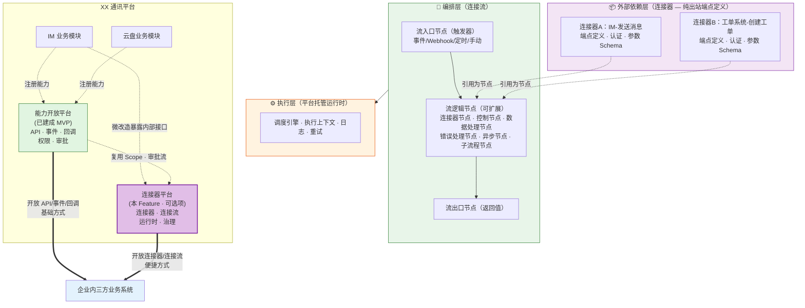
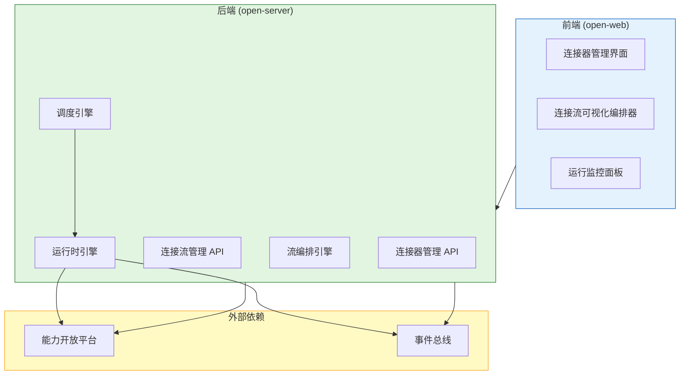

# 规范文档：连接器平台

**Feature ID**: CONN-PLAT-001  
**名称**: 连接器平台（Connector Platform）  
**状态**: specified  
**优先级**: P1  
**作者**: Summer  
**创建日期**: 2026-05-18  
**最后更新**: 2026-05-19  
**需求挖掘报告**: discovery-report.md (v3.1)

---

## 1. 概述

### 1.1 问题陈述

能力开放平台 MVP 已就绪（API/事件/回调/权限/审批），三方平台可通过 API/事件/回调消费 XX 平台能力达成目标。但三方平台消费开放能力时面临以下痛点：

- **单点消费重复造轮子**：每消费一个 API/事件/回调，都要单独写代码处理鉴权、调用、错误重试等，无复用、无标准化
- **多步流程硬编码**：串联多个开放能力完成业务流程时，缺乏编排工具，只能硬编码
- **数据格式转换重复写**：消费能力后需将数据转换适配自身系统格式，每次都要写字段映射和转换逻辑
- **运维管控缺失**：对接后的连接流缺少运行监控、重试、告警等运维能力，出问题只能人工排查

### 1.2 解决方案

构建**连接器平台**，作为与 API、事件、回调**同级并列**的第四种开放形式。连接器是**可选项/锦上添花**——没有连接器，三方平台也能通过 API/事件/回调达成目标；有了连接器，将三方平台原本需要大量人工编码的消费场景转化为**低代码/零代码配置**，使原有开放更便捷。

连接器平台按**三层架构**组织：**外部依赖层**（连接器 — 纯出站端点定义，类比 import 的模块/库）、**编排层**（连接流 — 入口节点→逻辑节点→出口节点，类比函数体）、**执行层**（运行时 — 调度执行引擎，类比虚拟机）。

### 1.3 定位

| 维度 | 说明 |
|------|------|
| **同级并列** | 连接器与 API、事件、回调是同级并列的四种开放形式，共同服务于"连接XX通讯平台与三方平台"的目标 |
| **可选项** | 连接器是锦上添花——没有连接器也能通过 API/事件/回调达成目标，有了连接器使开放更便捷 |
| **归属关系** | 连接器平台是开放平台的组成部分，不内嵌于能力开放平台，但同属开放平台体系 |
| **集成范围** | 仅对接与开放平台相关的业务系统：① 企业内三方业务系统 ② XX通讯平台内部其它业务模块 |
| **复用关系** | 复用能力开放平台的 Scope 权限模型和审批流引擎 |

### 1.4 Goals

| # | 目标 | 衡量标准 |
|---|------|---------|
| G1 | 提供连接器封装能力（纯出站端点定义） | 支持对 XX 平台能力（API/事件/回调）的标准化封装，形成可复用的连接器；连接器包含动作、认证配置、参数定义，**不含触发器**（触发器归流平台编排层管理） |
| G2 | 提供连接器生命周期管理 | 支持连接器的注册、编辑、发布、下架、版本管理；发布时复用能力开放平台审批流程 |
| G3 | 提供连接流可视化编排 | 支持通过可视化拖拽编排器创建连接流：流入口节点（事件/Webhook/定时/手动四种触发器）→ 流逻辑节点（MVP 含连接器动作节点）→ 流出口节点（返回值定义） |
| G4 | 提供连接流生命周期管理 | 支持连接流的创建、编辑、启停、版本管理；部署时复用能力开放平台审批流程 |
| G5 | 提供基础数据转换 | 支持源字段→目标字段的映射配置，实现连接器间的数据流转 |
| G6 | 提供平台托管运行时 | 连接流在平台侧调度执行，消费方无需部署运行时；支持资源配额与隔离 |
| G7 | 提供运行监控与日志 | 支持查看连接流运行状态/执行历史/失败日志；支持失败重试 |

### 1.5 Non-Goals

| # | 非目标 | 原因 |
|---|--------|------|
| NG1 | 实现条件分支/循环/子流程编排 | Should Have，V1 阶段 |
| NG2 | 实现可视化拖拽编排与代码模式互转 | Should Have，V1 阶段 |
| NG3 | 提供函数库和自定义 JS 脚本转换 | Should Have，V1 阶段 |
| NG4 | 提供连接器开发 SDK | Should Have，V1 阶段 |
| NG5 | 实现连接器市场与发现 | Could Have，V2 阶段 |
| NG6 | 支持连接器开放发布 | Could Have，V2 阶段 |
| NG7 | AI 辅助编排 | Could Have，V2 阶段 |
| NG8 | 实现计费系统 | 企业内使用，无需计费 |
| NG9 | 支持多租户/跨企业 | 仅限企业内部系统 |
| NG10 | 替代现有应用管理/成员管理 | 沿用现有系统 |
| NG11 | 通用 iPaaS 能力 | 不与 Zapier/Make/集简云竞争，聚焦 XX 平台能力编排 |

---

## 2. 用户故事

### 2.1 内部业务模块人员（平台连接器供给方）

> 💡 **定位**：XX 通讯平台内部各业务模块（IM、云盘、审批等）的人员，作为能力供给方，负责将自身模块的 API/事件/回调封装为**平台连接器**（纯出站端点定义）并上架到连接器平台。MVP 阶段三方平台人员与内部业务模块人员并重——只有平台连接器和连接器都上架后，三方平台人员才能编排连接流将内外连接起来产生新业务。内部业务模块人员的身份机制（是否需要注册应用等）待定。

| ID | 用户故事 | 优先级 | 验收标准 |
|----|---------|--------|---------|
| US-01 | 作为 **业务模块负责人**，我想要 **将本模块的 API/事件/回调封装为连接器（纯出站端点定义）**，以便 **三方平台可通过连接器消费我模块的能力** | P0 | 业务模块负责人可创建连接器，定义动作和认证配置，提交发布审批 |
| US-02 | 作为 **业务模块负责人**，我想要 **管理本模块连接器的版本和生命周期**，以便 **控制能力的开放节奏和兼容性** | P0 | 支持连接器编辑、新版本发布、下架；已发布连接器编辑不影响运行中连接流 |
| US-03 | 作为 **业务模块负责人**，我想要 **查看本模块连接器的使用情况**，以便 **了解哪些能力被三方平台消费、消费频率如何** | P1 | 可查看连接器被哪些连接流引用、调用次数统计 |

### 2.2 三方平台人员（开发者 / 业务人员）

> 💡 **定位**：企业内三方平台的人员（通过应用成员身份操作），集两个角色于一身：① **注册连接器** — 将自己的系统（ERP/CRM/OA 等）封装为连接器（纯出站端点定义），使连接流可引用其动作能力；② **编排连接流** — 消费已上架的平台连接器和连接器，通过可视化编排实现跨系统业务流程。核心诉求：降本提效——通过连接器减少编码工作量；零代码——通过可视化编排配置连接流。MVP 阶段，三方平台人员是业务推广的核心用户。

| ID | 用户故事 | 优先级 | 验收标准 |
|----|---------|--------|---------|
| US-04 | 作为 **三方平台人员**，我想要 **将我的系统（ERP/CRM/OA 等）封装为连接器并注册到平台**，以便 **连接流可引用我系统的 API 动作能力** | P0 | 三方平台人员可创建连接器，定义动作和认证配置（封装自身系统的 API），提交发布审批 |
| US-05 | 作为 **三方平台人员**，我想要 **管理我所注册连接器的版本和生命周期**，以便 **控制自己系统能力的开放节奏** | P0 | 支持连接器编辑、新版本发布、下架；已发布连接器编辑不影响运行中连接流 |
| US-06 | 作为 **三方平台人员**，我想要 **查看我所注册连接器的使用情况**，以便 **了解哪些连接流在引用我的系统能力** | P1 | 可查看连接器被哪些连接流引用、调用次数统计 |
| US-07 | 作为 **三方平台人员**，我想要 **浏览和使用已上架的连接器**，以便 **减少将 XX 平台能力集成到自己系统的编码工作量** | P0 | 消费方可浏览连接器目录，查看连接器包含的动作列表 |
| US-08 | 作为 **三方平台人员**，我想要 **通过可视化拖拽编排连接流**，以便 **无需硬编码即可串联多个能力完成业务流程** | P0 | 消费方可从流入口节点开始，拖拽连接器动作节点到画布，配置数据映射，定义流出口节点，形成完整连接流 |
| US-09 | 作为 **三方平台人员**，我想要 **配置连接器的认证信息**，以便 **安全地调用外部系统的 API** | P0 | 消费方可为连接器配置 AKSK/OAuth 等认证凭证，运行时自动使用 |
| US-10 | 作为 **三方平台人员**，我想要 **手动触发连接流测试运行**，以便 **验证配置是否正确后再正式启用** | P0 | 消费方可点击"测试运行"按钮，查看测试执行结果 |
| US-11 | 作为 **三方平台人员**，我想要 **启用/停用连接流**，以便 **按需控制业务流程的运行** | P0 | 消费方可一键启停连接流，停用后不再自动触发 |
| US-12 | 作为 **三方平台人员**，我想要 **查看连接流的详细执行日志**，以便 **排查数据流转和执行异常问题** | P0 | 消费方可查看每个步骤的输入/输出数据、执行时间、错误信息 |
| US-13 | 作为 **三方平台人员**，我想要 **收到连接流运行异常告警**，以便 **及时发现和处理问题** | P1 | 连接流运行失败时，消费方收到告警通知 |

### 2.3 平台运营方

> 💡 **定位**：开放平台运营人员，负责审核连接器上架和连接流部署申请，监控平台运行状态，确保合规性与运维可控。

| ID | 用户故事 | 优先级 | 验收标准 |
|----|---------|--------|---------|
| US-14 | 作为 **平台运营人员**，我想要 **审核连接器发布申请**，以便 **确保上架连接器的合规性** | P0 | 运营人员可查看连接器发布申请，执行审批操作 |
| US-15 | 作为 **平台运营人员**，我想要 **审核连接流部署申请**，以便 **确保连接流的合规运行** | P0 | 运营人员可查看连接流部署申请，执行审批操作 |
| US-16 | 作为 **平台运营人员**，我想要 **监控连接器平台的整体运行状态**，以便 **及时发现系统异常** | P1 | 运营人员可查看平台级运行仪表盘，包括活跃连接流数、执行成功率等 |

---

## 3. 功能需求 (FR)

### 3.1 连接器层

> 💡 **定位**：连接器是对单个外部系统的**纯出站端点定义**（类比 import 的模块/库），包含动作、认证配置和参数定义，**不含触发器**。连接器是可复用的原子单元，一个连接器可被多个连接流引用。触发器归流平台编排层管理，作为流入口节点独立于连接器存在。

#### 3.1.1 连接器注册与管理

| FR | 名称 | 描述 | 验收标准 |
|----|------|------|---------|
| FR-001 | 连接器创建 | 连接器提供方创建新连接器，定义基本信息 | • **基本信息**：连接器名称、英文名称、图标、描述、版本号 • **连接器类型**：平台连接器（XX平台能力封装）/ 连接器（外部系统封装） • **认证配置**：选择支持的认证方式（AKSK/OAuth/自定义） • 创建后状态为「草稿」 |
| FR-002 | 连接器编辑 | 连接器提供方编辑连接器的基本信息、动作和认证配置 | • 支持修改基本信息、添加/编辑/删除动作 • 已发布连接器编辑后生成新版本草稿，不影响已引用该连接器的运行中连接流 • 修改记录留痕 |
| FR-003 | 连接器发布 | 连接器提供方提交连接器发布申请，经审批后上架 | • 提交发布前校验：动作定义和认证配置完整 • 提交发布后自动进入审批流程（复用能力开放平台审批引擎） • 审批通过后连接器状态变为「已发布」，可被连接流引用 • 已发布连接器的新版本发布需重新审批 |
| FR-004 | 连接器下架 | 连接器提供方下架已发布的连接器 | • 下架前校验：无运行中的连接流引用该连接器时才允许下架 • 有引用时提示影响范围，禁止下架或要求先停用关联连接流 • 下架后该连接器不可被新连接流引用，已引用的不受影响 |
| FR-005 | 连接器版本管理 | 支持连接器多版本并存和版本切换 | • 支持查看连接器版本历史 • 连接流可指定引用连接器的特定版本 • 新版本发布后，已引用旧版本的连接流不受影响（除非手动升级） |
| FR-006 | 连接器列表查看 | 消费方浏览可用连接器目录 | • 列表展示：连接器名称、图标、描述、类型、状态、版本 • 支持按类型（平台连接器/连接器）、状态过滤 • 支持搜索 |
| FR-006a | 连接器使用统计 | 连接器提供方查看本模块连接器的使用情况 | • 展示连接器被引用的连接流数量和列表 • 展示连接器动作的调用次数统计 • 支持按时间范围查询 |

#### 3.1.2 动作定义

> 💡 **定位**：动作是连接器"执行"操作的能力（出站方向），包括调用 API、发布事件、发送回调通知等。

| FR | 名称 | 描述 | 验收标准 |
|----|------|------|---------|
| FR-009 | API 调用动作定义 | 定义调用外部系统 API 的动作 | • 配置关联的能力开放平台 API（路径/方法/Scope） • 定义动作的输入参数 Schema 和输出参数 Schema • 一个连接器可定义多个 API 调用动作 |
| FR-010 | 事件发布动作定义 | 定义向能力开放平台发布事件的动作 | • 配置关联的事件 Topic • 定义事件发布动作的输入参数 Schema • 一个连接器可定义多个事件发布动作 |
| FR-011 | 回调通知动作定义 | 定义通过回调通知外部系统的动作 | • 配置回调通知的目标地址和认证方式 • 定义回调通知动作的输入参数 Schema • 一个连接器可定义多个回调通知动作 |

#### 3.1.3 连接器认证配置

| FR | 名称 | 描述 | 验收标准 |
|----|------|------|---------|
| FR-012 | 连接器认证类型定义 | 在连接器中定义支持的认证方式 | • 支持 AKSK 认证：配置 Access Key / Secret Key • 支持 OAuth 2.0 认证：配置 Token URL / Client ID / Client Secret • 支持自定义认证：配置自定义 Header / Token • 一个连接器定义一种认证方式 |
| FR-013 | 连接器认证实例配置 | 消费方为连接器实例配置具体的认证凭证 | • 创建连接流时，为引用的连接器配置认证凭证 • 凭证加密存储，界面脱敏显示 • 支持凭证的创建、编辑、删除 |

### 3.2 连接流层（编排层）

> 💡 **定位**：连接流是消费方直接使用的对象，由三个部分有向连接而成：**流入口节点**（触发器 — 定义启动条件）→ **流逻辑节点**（MVP 含连接器动作节点）→ **流出口节点**（可选 — 定义返回值）。通过编排多个节点实现跨系统业务流程。

#### 3.2.1 连接流创建与编排

| FR | 名称 | 描述 | 验收标准 |
|----|------|------|---------|
| FR-014 | 连接流创建 | 消费方创建新连接流 | • 填写连接流名称、描述 • 选择流入口节点类型（事件/Webhook/定时/手动） • 创建后进入编排画布，画布初始包含流入口节点和流出口节点 |
| FR-015 | 可视化拖拽编排 | 通过拖拽式可视化编排器编排连接流 | • 提供画布式编排界面，左侧为连接器面板（可拖拽的连接器动作节点） • 画布预置三个区域：流入口节点区（顶部）→ 逻辑节点编排区（中部）→ 流出口节点区（底部） • 从连接器面板拖拽动作节点到编排区，通过连线表示数据流转方向 • 画布支持缩放、平移 • 节点支持选中、删除、复制 • 连线支持删除 |
| FR-016 | 流入口节点配置 | 配置连接流的触发方式（流入口节点） | • **事件触发**：选择能力开放平台事件（Topic），定义触发数据 Schema • **Webhook 触发**：系统自动生成该连接流专属的 Webhook URL，支持签名验证配置 • **定时触发**：配置 Cron 表达式，支持可视化配置（每天/每周/每月） • **手动触发**：无需额外配置，通过界面"立即执行"触发 |
| FR-017 | 线性编排 | 支持流入口节点→连接器节点→流出口节点的线性编排 | • 第一个固定为流入口节点（事件/Webhook/定时/手动） • 中间节点为连接器动作节点，按顺序串联 • 最后固定为流出口节点（可选，无出口为 fire-and-forget） • 每个动作节点可选择已发布的连接器动作 • 支持添加、删除、调整动作步骤顺序 |
| FR-018 | 动作节点配置 | 配置每个连接器动作节点的参数 | • 为动作节点配置输入参数（支持引用上游节点的输出） • 为动作节点配置连接器认证凭证 • 配置节点级别的错误处理策略（重试次数/重试间隔） |

#### 3.2.2 数据转换

| FR | 名称 | 描述 | 验收标准 |
|----|------|------|---------|
| FR-019 | 字段映射配置 | 配置源字段到目标字段的映射 | • 在动作节点配置界面，提供字段映射编辑器 • 支持从上游节点输出 Schema 中选择源字段 • 支持映射到当前动作节点的输入参数 • 支持一对一映射（源字段→目标字段） • 映射配置可视化展示（源字段名→目标字段名） |
| FR-020 | 常量值配置 | 配置动作节点的固定参数值 | • 支持为动作节点的输入参数配置常量值 • 常量值与字段映射互斥（同一参数只能二选一） |

#### 3.2.3 流逻辑节点类型

> 💡 **定位**：编排层的流逻辑节点体系共 6 种基础节点类型，类比代码函数体的不同语句类型。**MVP 仅支持连接器节点**，其余节点类型属 V1 范围。

| 节点类型 | 代码类比 | 描述 | MVP 范围 |
|---------|---------|------|---------|
| **连接器节点** | 调用外部函数 | 引用某个已发布连接器的动作，传入输入参数获取输出返回值 | ✅ MVP |
| **控制节点** | if/for/switch/forkJoin | 变更执行路径：分支（if/else/switch）、循环（for/while）、并行（fork/join） | ❌ V1 |
| **数据处理节点** | map/filter/reduce | 数据格式转换和运算：字段映射、内置函数、条件过滤 | ❌ V1（基础字段映射另由 FR-019 覆盖） |
| **错误处理节点** | try/catch/finally | 异常捕获与恢复：重试、降级、跳过、告警 | ❌ V1 |
| **异步节点** | setTimeout/Promise/await | 非同步执行控制：延时等待、回调等待、超时控制 | ❌ V1 |
| **子流程节点** | 函数调用 | 引用另一个已定义的连接流作为当前流的一个步骤 | ❌ V1 |

#### 3.2.4 流出口节点

> 💡 **定位**：流出口节点定义连接流执行完毕后的返回值（类比 return 语句），与流入口节点对称构成流的边界。无出口定义时为 fire-and-forget 模式。

| FR | 名称 | 描述 | 验收标准 |
|----|------|------|---------|
| FR-019a | 流出口节点定义 | 定义连接流的返回值 | • 支持配置返回字段列表 • 每个返回字段可引用上游节点的输出或配置常量值 • 支持选择返回值格式（JSON/原始数据） • 无出口定义时为 fire-and-forget |

#### 3.2.5 连接流生命周期管理

> 💡 **定位**：连接流的创建、编辑、启停、版本管理。

| FR | 名称 | 描述 | 验收标准 |
|----|------|------|---------|
| FR-021 | 连接流编辑 | 消费方编辑已创建的连接流 | • 支持修改连接流编排、流入口节点配置、动作节点配置、数据映射 • 已启用连接流编辑后生成新版本草稿，不影响当前运行版本 • 编辑后需重新提交部署审批 |
| FR-022 | 连接流部署审批 | 连接流启用前需经审批 | • 提交部署后自动进入审批流程（复用能力开放平台审批引擎） • 审批通过后连接流可被启用 • 审批不通过需修改后重新提交 |
| FR-023 | 连接流启用/停用 | 消费方控制连接流的运行状态 | • 启用：连接流开始监听触发器/按计划执行 • 停用：连接流停止运行，不再响应触发 • 已停用连接流可随时重新启用 |
| FR-024 | 连接流版本管理 | 支持连接流多版本并存 | • 支持查看连接流版本历史 • 每次编辑保存生成新版本草稿 • 支持回滚到历史版本 |
| FR-025 | 连接流删除 | 消费方删除不再需要的连接流 | • 仅「已停用」状态的连接流可删除 • 删除前确认提示 • 删除后不可恢复，关联的运行历史保留 |
| FR-026 | 连接流列表查看 | 消费方查看自己的连接流列表 | • 列表展示：连接流名称、触发方式、状态、最后运行时间 • 支持按状态过滤、搜索 • 支持快捷操作：启用/停用、编辑、删除 |

#### 3.2.6 连接流测试

| FR | 名称 | 描述 | 验收标准 |
|----|------|------|---------|
| FR-027 | 手动触发测试 | 消费方手动触发连接流测试运行 | • 支持"测试运行"按钮，手动触发连接流执行一次 • 测试运行不影响正式运行中的连接流 • 测试运行结果独立展示，可查看每步执行详情 |
| FR-028 | 测试数据模拟 | 消费方提供模拟触发数据用于测试 | • 支持为触发器输入模拟数据（JSON 格式） • 系统提供基于触发器 Schema 的数据模板 • 测试数据仅在测试运行中使用 |

### 3.3 运行时层

> 💡 **定位**：平台托管的流调度与执行引擎，负责连接流的调度、执行、监控和容错。

#### 3.3.1 流调度引擎

| FR | 名称 | 描述 | 验收标准 |
|----|------|------|---------|
| FR-029 | 事件触发调度 | 接收能力开放平台事件，触发订阅的连接流 | • 订阅能力开放平台事件总线，接收事件推送 • 事件到达后，匹配所有订阅该事件的连接流 • 为每个匹配的连接流创建独立执行实例 |
| FR-030 | Webhook 触发调度 | 接收 Webhook 请求，触发对应连接流 | • 为每个 Webhook 触发的连接流分配独立 URL • 接收 Webhook 请求后，解析请求体作为触发数据 • 支持请求签名验证，防止非法调用 |
| FR-031 | 定时触发调度 | 按 Cron 表达式定时触发连接流 | • 支持标准 Cron 表达式解析 • 支持可视化配置周期（每天/每周/每月/自定义间隔） • 定时任务高可用，避免单点故障导致漏触发 |
| FR-032 | 手动触发调度 | 响应用户手动触发操作 | • 支持界面"立即执行"和"测试运行"两种手动触发 • 手动触发优先级高于定时触发，立即执行 |

#### 3.3.2 执行上下文管理

| FR | 名称 | 描述 | 验收标准 |
|----|------|------|---------|
| FR-033 | 执行上下文创建 | 为每次连接流执行创建独立上下文 | • 上下文包含：触发数据、步骤执行状态、中间结果 • 上下文在执行完成后保留，用于历史查询 • 上下文数据支持超时清理（可配置保留天数） |
| FR-034 | 步骤间数据传递 | 运行时自动传递步骤间的数据 | • 上一步骤的输出自动作为下一步骤可引用的数据源 • 字段映射在运行时自动执行 • 常量值在运行时直接注入 |
| FR-035 | 资源配额与隔离 | 限制单连接流的资源使用 | • 单次执行超时限制（可配置，默认 5 分钟） • 单连接流并发执行数限制 • 单连接流历史数据存储量限制 |

#### 3.3.3 错误处理与重试

| FR | 名称 | 描述 | 验收标准 |
|----|------|------|---------|
| FR-036 | 节点级错误处理 | 单个动作节点执行失败时的处理 | • 支持配置重试策略（重试次数、重试间隔） • 重试次数耗尽后，标记该节点为「失败」 • 节点失败后，连接流整体标记为「执行失败」 |
| FR-037 | 连接流级错误处理 | 连接流执行失败后的处理 | • 连接流执行失败时，发送告警通知（通知方式待定） • 支持手动重试失败的连接流执行 • 失败的执行记录保留，供排查和重试 |

### 3.4 运行监控与日志

| FR | 名称 | 描述 | 验收标准 |
|----|------|------|---------|
| FR-038 | 连接流运行状态查看 | 消费方查看连接流的当前运行状态 | • 状态类型：运行中/已停用/执行失败/审批中 • 支持查看最后执行时间、下次执行时间（定时触发） |
| FR-039 | 执行历史查看 | 消费方查看连接流的历史执行记录 | • 列表展示：执行时间、触发方式、执行状态、耗时 • 支持按时间范围、状态过滤 • 支持点击查看执行详情 |
| FR-040 | 执行详情查看 | 消费方查看单次执行的详细步骤信息 | • 展示每个步骤的：输入数据、输出数据、执行状态、耗时、错误信息 • 支持按步骤查看数据流转路径 • 敏感数据脱敏展示 |
| FR-041 | 运行指标统计 | 平台运营方查看连接器平台的运行指标 | • 活跃连接流数量、总执行次数 • 执行成功率、平均执行耗时 • 按连接器统计调用次数 • 指标数据支持按时间范围查询 |

### 3.5 治理层（复用能力开放平台）

> 💡 **定位**：连接器平台复用能力开放平台的权限模型和审批流引擎，不独立建设治理能力。

| FR | 名称 | 描述 | 验收标准 |
|----|------|------|---------|
| FR-042 | Scope 权限复用 | 连接器调用能力开放平台 API/事件/回调时，通过 Scope 管控 | • 连接器定义中关联的 API/事件/回调，需通过 Scope 获得授权 • 连接流执行时，运行时自动携带 Scope 凭证调用能力开放平台网关 • Scope 权限申请复用能力开放平台现有流程 |
| FR-043 | 审批流复用 - 连接器发布 | 连接器发布审批复用能力开放平台审批引擎 | • 连接器发布申请自动生成审批单 • 审批流程、审批人配置复用能力开放平台审批引擎 • 支持同意/驳回/撤销操作 |
| FR-044 | 审批流复用 - 连接流部署 | 连接流部署审批复用能力开放平台审批引擎 | • 连接流部署申请自动生成审批单 • 审批流程、审批人配置复用能力开放平台审批引擎 • 支持同意/驳回/撤销操作 |

---

## 4. 非功能需求 (NFR)

### 4.1 性能要求

| ID | 需求 | 目标值 |
|----|------|--------|
| NFR-001 | 连接器目录查询响应时间 | P99 < 200ms |
| NFR-002 | 连接流列表查询响应时间 | P99 < 200ms |
| NFR-003 | 事件触发到连接流开始执行的延迟 | P99 < 3s |
| NFR-004 | Webhook 触发到连接流开始执行的延迟 | P99 < 2s |
| NFR-005 | 定时触发精度 | 误差 < 1 分钟 |
| NFR-006 | 系统可用性 | ≥ 99.9% |
| NFR-007 | 单连接流并发执行支持 | ≥ 10 并发实例 |

### 4.2 安全性要求

| ID | 需求 | 描述 |
|----|------|------|
| NFR-008 | 身份认证 | 管理面操作基于企业内部认证系统（Cookie/SSO）；数据面连接器调用通过 AKSK/OAuth 验证 |
| NFR-009 | 权限控制 | 连接器发布/下架仅限连接器提供方（业务模块负责人）；连接流操作仅限创建者及管理员；Scope 权限复用能力开放平台模型 |
| NFR-010 | 凭证安全 | 连接器认证凭证加密存储，界面脱敏显示；凭证传输使用 HTTPS |
| NFR-011 | Webhook 安全 | Webhook URL 使用不可预测的随机路径；支持请求签名验证 |
| NFR-012 | 数据传输安全 | 所有 API 调用使用 HTTPS |
| NFR-013 | 审计日志 | 连接器发布/下架、连接流部署/启停等关键操作记录审计日志 |

### 4.3 可用性要求

| ID | 需求 | 描述 |
|----|------|------|
| NFR-014 | 可视化编排易用性 | 业务人员（非开发者）可在 30 分钟内完成简单连接流的创建和配置 |
| NFR-015 | 错误提示 | 所有操作失败时提供明确的错误码和错误信息，编排界面提供实时校验反馈 |
| NFR-016 | 操作可撤销 | 连接器版本变更、连接流启停等关键操作支持回退 |
| NFR-017 | 操作引导 | 首次使用连接流编排器时有引导流程，帮助用户理解核心概念和操作 |

### 4.4 可靠性要求

| ID | 需求 | 描述 |
|----|------|------|
| NFR-018 | 执行容错 | 单个动作节点失败不丢失上下文数据，支持重试 |
| NFR-019 | 数据持久化 | 连接流配置和执行历史数据持久化存储，系统重启不丢失 |
| NFR-020 | 资源隔离 | 单连接流的资源使用不影响其他连接流的正常执行 |

### 4.5 兼容性要求

| ID | 需求 | 描述 |
|----|------|------|
| NFR-021 | 浏览器兼容 | 支持 Chrome（最新 2 个大版本）、Edge（最新 2 个大版本） |
| NFR-022 | 能力开放平台兼容 | 与能力开放平台 MVP 版本 API/事件/回调接口兼容 |

---

## 5. 技术设计

### 5.1 架构影响

### 5.2 核心数据模型

| 数据实体 | 关键字段 | 说明 |
|---------|---------|------|
| **Connector** | id, name, code_name, type(preset/custom), icon, description, status, version | 连接器主体（纯出站端点定义，不含触发器） |
| **ConnectorAction** | id, connector_id, type(api_call/event_publish/callback), config, input_schema, output_schema | 连接器动作 |
| **ConnectorAuth** | id, connector_id, auth_type(aksk/oauth/custom), config_encrypted | 连接器认证配置 |
| **Flow** | id, name, description, entry_node_type(event/webhook/cron/manual), entry_node_config, status, version, creator_id | 连接流主体 |
| **FlowNode** | id, flow_id, node_type(entry/connector_action/exit), connector_action_id, config, position | 连接流节点（入口节点/连接器动作节点/出口节点） |
| **FlowEdge** | id, flow_id, source_node_id, target_node_id, data_mapping | 连接流连线（数据映射） |
| **FlowExecution** | id, flow_id, trigger_type, status, start_time, end_time, error_message | 连接流执行记录 |
| **FlowNodeExecution** | id, execution_id, node_id, status, input_data, output_data, start_time, end_time, retry_count | 节点执行记录 |

### 5.3 API 接口设计

> 💡 以下为接口清单概要，详细接口规范在 Plan 阶段定义。

| 模块 | 接口 | 方法 | 说明 |
|------|------|------|------|
| 连接器管理 | /api/v1/connectors | GET | 连接器列表 |
| 连接器管理 | /api/v1/connectors | POST | 创建连接器 |
| 连接器管理 | /api/v1/connectors/{id} | GET | 连接器详情 |
| 连接器管理 | /api/v1/connectors/{id} | PUT | 更新连接器 |
| 连接器管理 | /api/v1/connectors/{id}/publish | POST | 发布连接器 |
| 连接器管理 | /api/v1/connectors/{id}/unpublish | POST | 下架连接器 |
| 连接器管理 | /api/v1/connectors/{id}/versions | GET | 连接器版本列表 |
| 连接流管理 | /api/v1/flows | GET | 连接流列表 |
| 连接流管理 | /api/v1/flows | POST | 创建连接流 |
| 连接流管理 | /api/v1/flows/{id} | GET | 连接流详情（含编排数据） |
| 连接流管理 | /api/v1/flows/{id} | PUT | 更新连接流 |
| 连接流管理 | /api/v1/flows/{id}/deploy | POST | 部署连接流（提交审批） |
| 连接流管理 | /api/v1/flows/{id}/enable | POST | 启用连接流 |
| 连接流管理 | /api/v1/flows/{id}/disable | POST | 停用连接流 |
| 连接流管理 | /api/v1/flows/{id}/execute | POST | 手动触发/测试运行 |
| 连接流管理 | /api/v1/flows/{id}/versions | GET | 连接流版本列表 |
| 运行监控 | /api/v1/flows/{id}/executions | GET | 连接流执行历史 |
| 运行监控 | /api/v1/executions/{id} | GET | 执行详情（含每步数据） |
| 运行监控 | /api/v1/executions/{id}/retry | POST | 重试失败执行 |
| 运行监控 | /api/v1/metrics | GET | 平台运行指标 |
| Webhook | /api/v1/webhooks/{flow_id} | POST | Webhook 触发入口 |

### 5.4 前端页面清单

| 页面 | 路由 | 说明 |
|------|------|------|
| 连接器目录 | /connectors | 连接器列表浏览，支持搜索和过滤 |
| 连接器详情 | /connectors/{id} | 连接器详情，含动作/认证信息 |
| 连接器创建/编辑 | /connectors/create, /connectors/{id}/edit | 连接器创建和编辑表单 |
| 连接流列表 | /flows | 连接流列表，含状态和快捷操作 |
| 连接流编排 | /flows/{id}/edit | 可视化拖拽编排画布 |
| 连接流详情 | /flows/{id} | 连接流概览、运行状态、执行历史 |
| 执行详情 | /executions/{id} | 单次执行详情，含每步输入/输出数据 |
| 运行监控面板 | /monitor | 平台级运行指标仪表盘 |

### 5.5 与能力开放平台的集成接口

| 集成点 | 方向 | 说明 |
|--------|------|------|
| API 调用 | 连接器平台 → 能力开放平台 | 连接器动作通过 API 网关调用已注册 API |
| 事件订阅 | 连接器平台 → 能力开放平台 | 连接流流入口节点（事件触发）订阅事件总线，接收事件推送 |
| 事件发布 | 连接器平台 → 能力开放平台 | 连接器动作通过事件网关发布事件 |
| 回调通知 | 连接器平台 → 能力开放平台 | 连接器动作通过回调网关发送回调通知 |
| Scope 鉴权 | 连接器平台 → 能力开放平台 | 运行时通过 Scope 凭证调用 API 网关鉴权 |
| 审批引擎 | 连接器平台 → 能力开放平台 | 连接器发布/连接流部署复用审批引擎 |
| 分组管理 | 连接器平台 → 能力开放平台 | 连接器作为新资源类型挂载到能力开放平台分组体系（FR-003 扩展点） |

### 5.6 第三方依赖

| 依赖 | 用途 | 说明 |
|------|------|------|
| React Flow / AntV X6 | 可视化编排画布 | 连接流可视化拖拽编排（选型待 Plan 阶段 ADR 决策） |
| 流编排引擎 | 运行时引擎 | 自研轻量级 vs 开源引擎（选型待 Plan 阶段 ADR 决策） |

---

## 6. 边界情况 (EC)

| EC | 场景 | 处理方式 |
|----|------|---------|
| EC-001 | 连接器被下架时仍有运行中的连接流引用 | 禁止下架或要求先停用关联连接流，提示影响范围 |
| EC-002 | 连接器新版本发布后，已引用旧版本的连接流行为变化 | 已引用旧版本的连接流不受影响，需手动升级版本 |
| EC-003 | 连接流执行中，被引用连接器的认证凭证过期 | 执行失败，触发告警通知，提示更新凭证后重试 |
| EC-004 | 事件触发时，同一事件驱动大量连接流并发执行 | 执行队列缓冲，超出并发限制时排队等待；单连接流并发超限时触发告警 |
| EC-005 | Webhook URL 被非法调用 | 签名验证失败返回 401；记录非法调用日志；支持限流 |
| EC-006 | 定时触发器配置了无效的 Cron 表达式 | 创建/编辑时实时校验 Cron 表达式有效性，无效时阻止保存 |
| EC-007 | 连接流执行超时 | 单次执行超时后强制终止，标记为「执行超时」，触发告警 |
| EC-008 | 字段映射中源字段在上游节点输出中不存在 | 执行时该字段值为空/null，不中断执行，在执行日志中记录警告 |
| EC-009 | 能力开放平台 API/事件网关不可用 | 连接流执行失败，触发重试/告警；运行时检测网关健康状态 |
| EC-010 | 连接流编排为空（仅触发器无动作） | 编排校验不通过，禁止提交部署，提示至少添加一个动作节点 |
| EC-011 | 同一连接器被同一连接流多次引用（不同动作） | 允许，每个引用为独立的动作节点，各自配置参数 |
| EC-012 | 连接流在执行中被用户停用 | 当前执行实例继续完成，后续不再响应新触发 |

---

## 7. 开放问题

| # | 问题 | 影响范围 | 建议决策时间 |
|---|------|---------|-------------|
| OQ-001 | **MVP 平台连接器范围**：具体需要封装哪些 XX 平台能力（IM/云盘/审批/…） | 影响连接器开发和测试范围 | Plan 阶段开始前 |
| OQ-002 | **流编排引擎技术选型**：自研轻量引擎 vs 基于开源引擎（Temporal/Camunda 等） | 影响运行时架构和开发工作量 | Plan 阶段 ADR |
| OQ-003 | **可视化编排画布选型**：React Flow vs AntV X6 vs 其他 | 影响前端编排器开发方案 | Plan 阶段 ADR |
| OQ-004 | **告警通知方式**：连接流执行失败时的通知渠道（IM 消息/邮件/站内信） | 影响告警模块实现 | Plan 阶段 |
| OQ-005 | **与能力开放平台分组管理的集成方式**：连接器作为新资源类型挂载到现有分组体系，还是独立管理 | 影响连接器目录展示和权限模型 | Plan 阶段，需与能力开放平台团队确认 |
| OQ-006 | **执行历史数据保留策略**：执行记录的保留天数和存储容量限制 | 影响存储成本和数据清理机制 | Plan 阶段 |
| OQ-007 | **内部业务模块人员身份机制**：内部业务模块人员以什么身份注册平台连接器？是否需要注册应用？还是另有机制（如内部白名单、分组责任人延伸等）？ | 影响平台连接器注册入口设计和权限模型 | Plan 阶段，需与能力开放平台团队确认 |

---

## 8. 成功标准

### 8.1 定性指标

| 维度 | 成功标准 | 对应核心目标 |
|------|---------|-------------|
| **低代码化** | 业务人员能独立创建并运行连接流，无需开发介入 | 业务人员能自主配置 |
| **平台连接器可用** | 至少 3 个平台连接器被三方平台实际使用 | 平台连接器被实际消费 |
| **接入提效** | 原本需人工编码 1 周的集成场景，用连接器可在 1 天内完成 | 接入效率显著提升 |
| **运维可控** | 连接流运行状态可监控，失败可重试，异常有告警 | 运行可靠性 |

### 8.2 定量指标（系统提供度量能力）

| 指标类型 | 具体的指标 | 对应核心目标 |
|---------|-----------|-------------|
| **规模指标** | 平台连接器数量、连接器数量 | 平台连接器被实际消费 |
| **使用指标** | 活跃连接流数量、业务人员创建的连接流占比 | 业务人员能自主配置 |
| **效率指标** | 连接流从创建到上线的时间 | 接入提效 |
| **可靠性指标** | 连接流运行成功率、平均重试次数 | 运行可靠性 |

---

## 9. 风险与假设

### 9.1 关键假设

| 假设 | 风险等级 | 验证方式 |
|------|---------|---------|
| 能力开放平台的 API/事件/回调足够稳定，可作为连接流的连接器动作调用源和流入口节点的事件源 | 低 | 已有 MVP 验证 |
| 业务人员愿意使用低代码编排工具 | 中 | MVP 上线后观察使用数据 |
| 平台托管运行时能满足性能和可靠性要求 | 中 | 需性能测试验证 |
| 复用 Scope 权限模型足以覆盖连接器调用鉴权需求 | 低 | 与能力开放平台团队确认 |

### 9.2 潜在风险

| 风险 | 影响 | 缓解措施 |
|------|------|---------|
| 可视化拖拽编排前端实现复杂，可能超工期 | 高 | MVP 先支持核心编排能力（线性+节点配置），高级交互（快捷键/对齐/分组）后续迭代 |
| 流编排引擎技术复杂度高 | 中 | Plan 阶段做 ADR 选型，MVP 只支持线性编排，降低首版复杂度 |
| 运行时可靠性（资源隔离/性能/容错） | 中 | 设计执行沙箱，限制单流资源配额，完善重试机制 |
| 与能力开放平台协作接口的边界与契约 | 中 | 明确接口契约，做好集成测试 |

---

## 10. 版本规划

| 版本 | 范围 | 核心价值 |
|------|------|---------|
| **MVP** | 平台连接器（纯出站端点定义）+ 连接流线性编排（流入口节点→连接器节点→流出口节点）+ 平台托管运行时 + 运行监控 + 基础数据映射 | 验证"零代码配置连接流"核心价值 |
| **V1** | 完整编排（分支/循环/子流程）+ 代码模式互转 + 函数库+脚本 + 连接器 SDK | 满足复杂场景，开放开发者生态 |
| **V2** | 连接器市场 + 连接器开放发布 + AI辅助编排 + 模板库 | 构建连接器生态 |

> ⚠️ **Feature 拆分决策**：发现报告（第10章）建议按前后端分离拆分为两个子 Feature（connector-platform-serve / connector-platform-web），经确认**暂不拆分**，保持当前单 Feature 结构。后端与前端在同一 Feature 内统一规划，后续如开销过大可再考虑拆分。

---

## 附录

### A. 需求追溯

| 需求挖掘报告需求编号 | 对应本规范 FR |
|---------------------|--------------|
| MH-01 平台连接器 | FR-001 ~ FR-006, FR-006a, FR-009 ~ FR-013 |
| MH-02 连接器生命周期管理 | FR-001 ~ FR-006, FR-006a, FR-043 |
| MH-03 连接流线性编排 | FR-014 ~ FR-020, FR-019a |
| MH-04 连接流生命周期管理 | FR-021 ~ FR-026, FR-044 |
| MH-05 基础数据转换 | FR-019, FR-020 |
| MH-06 平台托管运行时 | FR-029 ~ FR-037 |
| MH-07 运行监控与日志 | FR-038 ~ FR-041 |

### B. 参考资料

- 需求挖掘报告：`discovery-report.md`
- 需求挖掘分析：`discovery-analysis.md`
- 能力开放平台规范：`specs-tree-capability-open-platform/spec.md`
- 软件连接器平台汇总对比调研报告：`docs/software-connector-platform-research/软件连接器平台汇总对比调研报告.md`
- 钉钉连接平台调研报告：`docs/software-connector-platform-research/钉钉连接平台调研报告.md`
- 飞书集成平台调研报告：`docs/software-connector-platform-research/飞书集成平台调研报告.md`
- 企业微信连接器平台调研报告：`docs/connector-platform-research/企业微信连接器平台调研报告.md`

---

## 修订记录

| 版本 | 日期 | 修订内容 | 修订人 |
|------|------|---------|--------|
| v1.0 | 2026-05-18 | 初始版本 — 依据 discovery.md (v2.2) 创建完整规范 | AI Assistant |
| v1.1 | 2026-05-18 | 对齐 discovery-report.md v3.0 变更：术语统一（预置连接器→平台连接器，自定义连接器→连接器）、角色重构（三角色模型）、补充三方平台人员注册连接器用户故事（US-04~US-06）及编号顺延 | AI Assistant |
| **v2.0** | **2026-05-19** | **对齐 discovery-report.md v3.1 重大概念重构：① 三层架构对齐（外部依赖层/编排层/执行层）；② 连接器重构为纯出站端点定义，移除触发器（删除 FR-007/FR-008），更新 FR-001~FR-006/FR-009~FR-013；③ 编排层重构：流入口节点（独立于连接器）、6种流逻辑节点（新增 3.2.3 节）、流出口节点（新增 FR-019a）；④ 数据模型移除 ConnectorTrigger，FlowNode 新增 entry/exit 节点类型；⑤ 全文同步：Goals/G1-G3、用户故事 US-01~US-08、页面清单、集成接口、假设等全面对齐新模型** | AI Assistant |

---

**规范状态**: ✅ 规范编写完成  
**下一步**: 运行 `@sddu-plan 连接器平台` 开始技术规划
