# 需求挖掘报告：数据开放平台

**报告 ID**: DISCOVERY-001  
**创建时间**: 2026-04-03  
**最后更新**: 2026-04-07  
**阶段**: 0.discovery（需求挖掘）  
**状态**: ✅ 已完成  
**会话 ID**: feature-session-001

---

## 一、执行摘要

### 1.1 核心定位

**数据开放平台**是 open-app 体系下的子平台，聚焦 XX 通讯平台的数据开放管理，将企业内部 XX 平台的数据开放给企业内部其它三方平台消费使用。

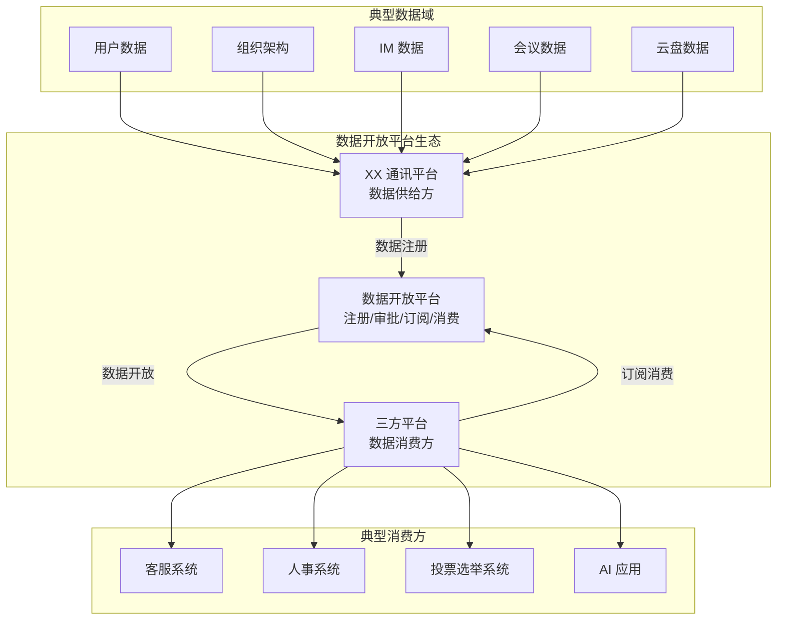

### 1.2 核心问题

| 维度 | 描述 |
|------|------|
| **核心痛点** | 能力封闭：XX 平台的数据和能力无法被企业内部其他三方平台有效利用 |
| **现状** | AI 大行其道，XX 平台 AI 能力薄弱；平台能力局限在内部使用；三方平台无法利用 XX 平台资源开展业务 |
| **目标** | 生态开放：让三方平台能利用 XX 平台资源开展业务，形成企业内部的能力生态 |
| **价值主张** | 提供标准统一的数据开放通道，解决数据孤岛和接口混乱问题 |

### 1.3 目标用户

| 角色 | 职责 | 诉求 |
|------|------|------|
| **数据 Owner** | 业务模块负责人 | 注册数据、生产数据；通过开放数据实现业务价值 |
| **开放平台管理员** | 平台运营人员 | 审批数据注册信息；确保数据符合平台规范 |
| **三方平台业务方** | 企业内部自研系统负责人 | 订阅数据、消费数据；利用 XX 平台数据增强自身业务 |

---

## 二、问题空间分析

### 2.1 现状痛点

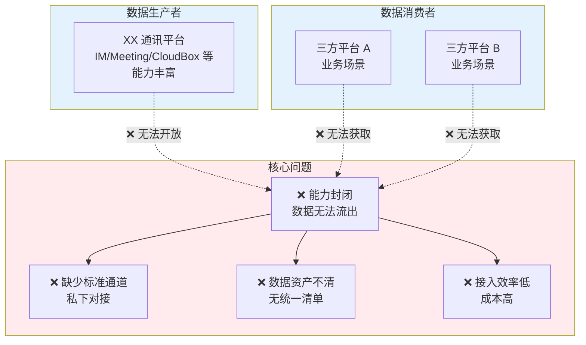

| 痛点维度 | 具体描述 |
|---------|---------|
| **能力封闭** | XX 平台的能力多数局限在平台内部使用，外部无法获取 |
| **缺少标准通道** | 三方平台可能已经在消费数据，但是没有标准统一的通道（私下对接） |
| **数据资产不清** | XX 平台内部没有统一的地方定义数据敏感度，甚至没有数据对象清单 |
| **接入效率低** | 没有统一的数据开放平台，三方平台接入数据成本高 |

### 2.2 业务驱动

| 驱动因素 | 说明 |
|---------|------|
| **AI 趋势** | AI 大行其道，企业内有 AI 应用需求，需要获取 XX 平台数据 |
| **生态建设** | 希望通过数据开放吸引更多三方应用，形成企业内部生态 |
| **业务规划** | 企业数字化转型的基础设施建设 |
| **数据价值赋能** | 消费方面临全链路挑战（找不到、看不懂、不会接、不会用、无法评估），需要平台提供完整的赋能支持 |

### 2.3 不做会怎样

| 影响维度 | 后果 |
|---------|------|
| **业务影响** | 三方平台无法利用 XX 平台资源开展新业务 |
| **效率影响** | 数据对接继续依赖私下对接，效率低、风险高 |
| **竞争影响** | 相比飞书/钉钉等竞品，企业通讯平台能力开放程度落后 |

---

## 三、用户画像与场景

### 3.1 用户画像

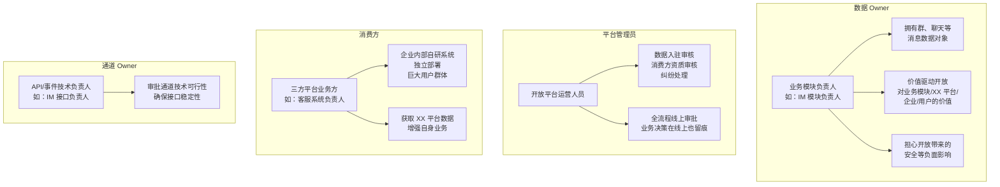

**新增角色**：通道 Owner（API/事件技术负责人）
- 职责：审批通道技术可行性，确保接口稳定性
- 参与场景：权限审批流程（与数据 Owner 共同审批）

### 3.2 典型场景

| 场景编号 | 场景名称 | 描述 |
|---------|---------|------|
| **S1** | 数据 Owner 开放数据 | IM 模块负责人注册 IM 数据（群、聊天消息），经过审批后开放给客服系统使用 |
| **S2** | 三方平台订阅数据 | 客服系统浏览数据目录，订阅用户信息和 IM 消息数据，用于客服会话集成 |
| **S3** | AI 应用消费数据 | AI 助手应用通过标准 API 获取日程、会议数据，用于智能问答和推荐 |
| **S4** | 人事系统数据同步 | 人事系统订阅组织架构数据，用于员工信息同步、入职离职通知 |

### 3.3 用户旅程地图

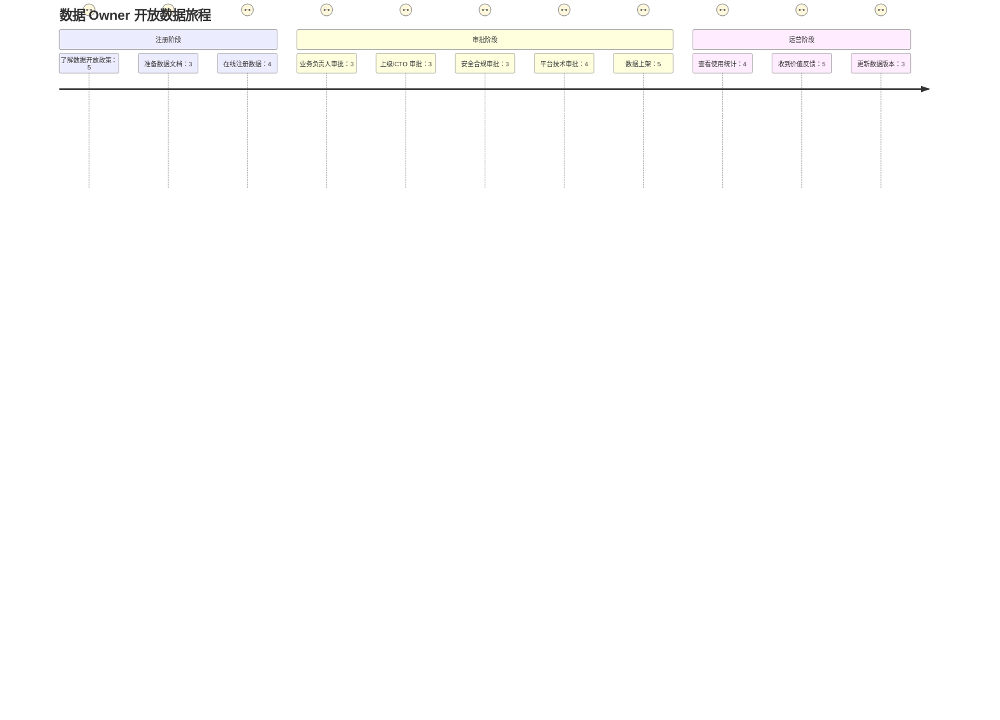

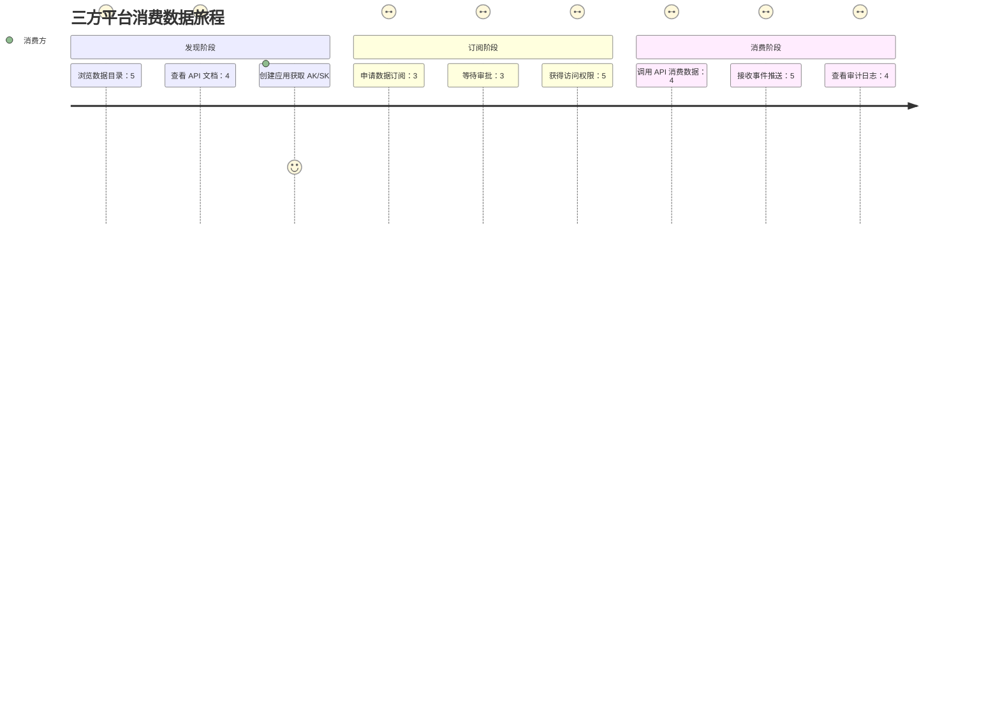

---

## 四、需求分层与优先级

### 4.1 需求分层

```mermaid
graph LR
    subgraph Must_Have[必备需求 - 没有无法使用]
        M1[数据注册]
        M2[数据审批]
        M3[数据订阅]
        M4[数据消费]
        M5[应用管理]
        M6[权限控制]
    end
    
    subgraph Should_Have[期望需求 - 显著提升体验]
        S1[数据目录]
        S2[敏感度分级]
        S3[审计日志]
        S4[用量统计]
        S5[数据资产清单]
    end
    
    subgraph Could_Have[惊喜需求 - 超出预期]
        C1[价值可视化]
        C2[自动化同步]
        C3[开发者门户]
        C4[SDK 支持]
    end
    
    Must_Have -.-> Should_Have -.-> Could_Have
    
    style Must_Have fill:#e1f5e1,stroke:#2e7d32,stroke-width:2px
    style Should_Have fill:#fff3cd,stroke:#f57c00,stroke-width:2px
    style Could_Have fill:#f3e5f5,stroke:#7b1fa2,stroke-width:2px
```

### 4.2 需求清单

#### Must Have（必备）

| 需求编号 | 需求描述 | 验收标准 |
|---------|---------|---------|
| **MH-01** | API Owner 能够注册通道 | 支持填写通道描述，附带注册字段权限（基础/敏感） |
| **MH-02** | 平台管理员能够审批通道 | 支持审批通过/驳回，记录审批意见 |
| **MH-03** | 三方平台能够创建应用 | 创建应用后获取 AK/SK |
| **MH-04** | 三方平台能够申请权限 | 申请 API 权限 + 字段权限 |
| **MH-05** | 三方平台能够通过 API 消费数据 | 使用 AK/SK 调用 API 获取数据 |
| **MH-06** | 支持事件订阅形式 | 数据变更时推送给订阅方 |
| **MH-07** | 双重权限控制 | 应用需同时拥有通道权限 + 字段权限才能消费 |
| **MH-08** | 并行审批流程 | 两条审批单（通道 + 字段），取并集去重，支持并行审批 |
| **MH-09** | 权限审计日志 | 以通道为入口记录调用日志，关联应用和字段权限信息 |

#### Should Have（期望）

| 需求编号 | 需求描述 | 验收标准 |
|---------|---------|---------|
| **SH-01** | 数据目录/市场 | 浏览可订阅的 API/事件列表，支持搜索和分类 |
| **SH-02** | 字段敏感度分级 | 支持定义和管理字段敏感度（基础/敏感），API Owner 在注册时附带定义 |
| **SH-03** | 我的权限清单 | 应用可查看已拥有的通道 + 字段权限（待定，后续详细设计） |
| **SH-04** | 用量统计 | 展示 API 被调用的次数、调用方等 |
| **SH-05** | 默认策略 | 通道权限默认附带基础字段权限，敏感字段需额外申请 |
| **SH-06** | 数据字典/数据地图 | 提供数据含义、关系、使用建议（数据来源、加工逻辑、更新频率、推荐使用场景） |
| **SH-07** | 场景分类目录 | 按业务场景分类展示 API/事件（如：HR 场景、客服场景、AI 场景） |
| **SH-08** | 案例库 | 收集并分享成功案例，提供场景化引导 |
| **SH-09** | 技术咨询支持 | 快速响应、专业解答，有专门支持人员平等服务所有消费方 |
| **SH-10** | 字段权限永久有效 | 字段权限永久有效，除非主动回收 |
| **SH-11** | AK/SK 重置无感 | 权限与应用 ID 绑定，AK/SK 更新不影响权限 |

#### Could Have（惊喜）

| 需求编号 | 需求描述 | 验收标准 |
|---------|---------|---------|
| **CH-01** | 数据价值可视化 | 数据 Owner 能看到开放数据带来的业务价值 |
| **CH-02** | 自动化数据同步 | 支持配置数据管道，自动同步到消费方 |
| **CH-03** | 开发者门户 | 提供开发者文档、SDK 下载、示例代码 |
| **CH-04** | 多开放形式支持 | 支持批量导出、数据同步等形式 |

---

## 五、核心流程设计

### 5.1 数据开放消费全流程

从平台视角展示数据从注册到消费的完整流程，涉及 API Owner、平台管理员、消费方三方角色。

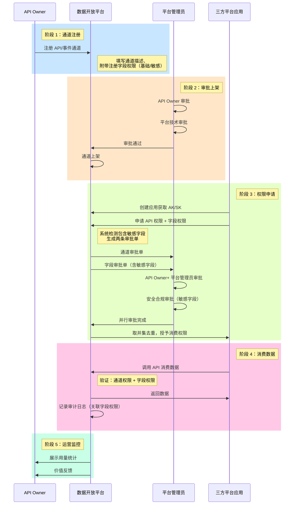

> ℹ️ **消费方视角流程**：从消费方视角，完整流程包括 4 个阶段：发现数据（浏览目录/评估可行性）→ 申请接入（注册应用/订阅审批）→ 技术对接（开发联调/上线验证）→ 持续运营（调用监控/权限管理）。详细流程见 5.3 节典型场景。

**与阶段三的区别**：
| 阶段 | 阶段三（已备份） | 阶段四（当前） |
|------|-----------------|---------------|
| 阶段 1 | 注册数据对象 | 注册 API/事件通道，附带注册字段权限 |
| 阶段 2 | 动态生成审批链（基于数据对象敏感度） | API Owner+ 平台管理员审批 |
| 阶段 3 | 申请通道 + 数据对象权限，一条审批单 | 申请 API+ 字段权限，两条审批单并行审批 |
| 阶段 4 | 验证：通道权限 + 数据对象权限 | 验证：通道权限 + 字段权限 |
| 审计 | 关联数据对象信息 | 关联字段权限信息 |

### 5.2 数据开放形式

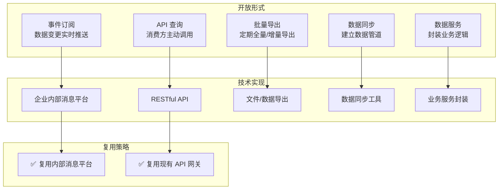

### 5.3 数据消费场景

基于飞书、钉钉等业界实践，数据消费场景可分为以下 5 类：

#### 5.3.1 场景一：业务系统集成（最常见）

**场景描述**：企业内部业务系统需要获取 XX 平台的数据，实现业务闭环。

**典型案例**：

| 消费方 | 使用场景 | 消费的数据 | 敏感度 |
|--------|---------|-----------|--------|
| **人事系统** | 新员工入职自动同步组织架构信息 | 用户基本信息、部门信息 | L2 |
| **财务系统** | 考勤数据同步用于薪资计算 | 考勤记录、请假审批 | L3 |
| **客服系统** | 客服人员查看用户所属部门和职务 | 用户基本信息、组织架构 | L2 |
| **会议室预订系统** | 查看会议室的忙闲状态 | 日历忙闲状态 | L2 |
| **数据分析平台** | 企业运营数据分析和报表 | 用户活跃度、会议统计数据 | L2 |

**消费方式**：
- API 查询：定时同步或按需查询
- 事件订阅：订阅用户入离职事件、部门变更事件

**技术特点**：
- 系统对系统调用（Server-to-Server）
- 通常需要全量数据和增量数据同步
- 对数据实时性要求较高（分钟级）

---

#### 5.3.2 场景二：应用功能嵌入

**场景描述**：第三方应用将 XX 平台的能力嵌入到自己的应用中，提供更丰富的用户体验。

**典型案例**：

| 消费方 | 使用场景 | 消费的数据/能力 | 敏感度 |
|--------|---------|----------------|--------|
| **CRM 系统** | 销售在 CRM 中直接发起会议 | 会议能力、日程能力 | L2-L3 |
| **HR 招聘系统** | 招聘流程中发起视频面试 | 视频会议能力 | L2 |
| **项目管理工具** | 任务提醒发送到 XX 消息 | 消息推送能力 | L2 |
| **审批系统** | 审批结果自动通知 | 消息推送能力 | L2 |

**消费方式**：
- API 调用：按需调用
- SDK 集成：嵌入 SDK 实现更深度集成
- 事件订阅：接收状态变更通知

**技术特点**：
- 用户在消费方应用中操作，体验无缝衔接
- 需要 OAuth 授权（用户身份）
- 对接效率要求高（快速接入）

---

#### 5.3.3 场景三：数据分析与 AI 应用

**场景描述**：利用 XX 平台的数据进行数据分析、BI 报表、AI 智能应用。

**典型案例**：

| 消费方 | 使用场景 | 消费的数据 | 敏感度 |
|--------|---------|-----------|--------|
| **BI 报表系统** | 企业运营分析报表 | 会议数量、文档活跃度、用户活跃度 | L2 |
| **人力资源分析** | 员工流失预测分析 | 用户基本信息、活跃度、考勤数据 | L3 |
| **AI 智能助手** | 智能问答，查询企业信息 | 用户信息、组织架构、日程 | L2-L3 |
| **知识库系统** | 自动汇总会议纪要 | 会议录制、转写（脱敏后） | L3-L4 |

**消费方式**：
- API 查询：批量数据导出
- 事件订阅：增量数据推送
- 数据仓库：定期批量同步

**技术特点**：
- 通常需要批量数据处理
- 对数据量要求较大（历史数据）
- 需要考虑数据脱敏和隐私保护

---

#### 5.3.4 场景四：第三方服务集成

**场景描述**：集成外部第三方服务，实现更丰富的功能。

**典型案例**：

| 消费方 | 使用场景 | 消费的数据 | 敏感度 |
|--------|---------|-----------|--------|
| **视频会议硬件** | 会议室设备自动加入会议 | 会议信息、日程 | L2 |
| **日历应用** | 在第三方日历查看 XX 日程 | 日程信息、忙闲状态 | L2-L3 |
| **邮件系统** | 邮件提醒发送到 XX | 消息推送能力 | L2 |
| **档案系统** | 会议资料自动归档 | 会议信息、录制文件、文档 | L3-L4 |

**消费方式**：
- API 调用：标准化接口
- Webhook：事件驱动
- 开放平台：OAuth 授权

**技术特点**：
- 需要跨平台认证
- 需要处理数据格式转换
- 需要考虑服务稳定性

---

#### 5.3.5 场景五：合规审计与监管

**场景描述**：满足企业合规、审计、监管要求的数据访问。

**典型案例**：

| 消费方 | 使用场景 | 消费的数据 | 敏感度 |
|--------|---------|-----------|--------|
| **审计系统** | 合规审计日志查询 | 操作日志、访问记录 | L2 |
| **安全监控系统** | 异常行为检测 | 访问日志、行为数据 | L2-L3 |
| **法务系统** | 诉讼证据调取 | 消息内容、文档内容（需审批） | L4 |
| **监管部门** | 数据上报 | 统计数据（脱敏后） | L2 |

**消费方式**：
- API 查询：按需查询
- 批量导出：定期报表
- 事件订阅：异常告警

**技术特点**：
- 需要严格权限控制
- 需要完整审计日志
- 通常需要高级别审批

---

### 5.4 与现有 open-app 的关系

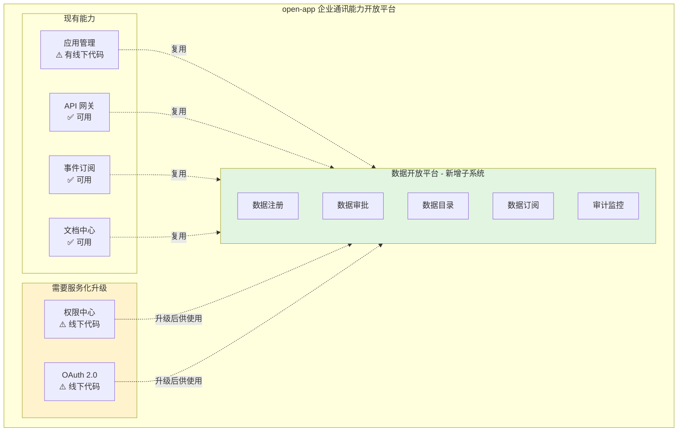

---

## 六、数据治理与合规

### 6.1 数据敏感度分级

| 级别 | 定义 | 典型数据示例 | 开放策略 |
|------|------|-------------|---------|
| **L1-公开** | 可对企业内所有用户公开 | 公司组织架构、部门名称 | 所有认证应用可访问 |
| **L2-内部** | 限于企业内部使用 | 用户基本信息、邮箱、电话 | 需要审批，限制使用场景 |
| **L3-敏感** | 涉及个人隐私或业务敏感 | 薪资、绩效、考勤记录 | 严格管控，仅限特定场景 |
| **L4-个人** | 个人私密数据 | 聊天记录、日程、私人文件 | 需要用户授权，或完全不开放 |
| **L5-机密** | 商业机密、战略信息 | 未公开的战略信息 | 不开放 |

> ⚠️ **注意**: 
> - 当前 XX 平台没有统一的数据敏感度定义，需要建立数据资产清单和分级标准
> - 敏感度定义的最小粒度为**数据对象级别**（如：用户数据、组织架构、IM 消息），不做字段级别的细粒度定义

#### 6.1.2 数据定级流程

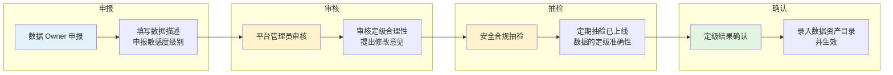

**定级责任界定**：
- **数据 Owner**：负责准确申报数据敏感度，提供数据字段清单和样例
- **平台管理员**：负责审核定级合理性，对明显错误的定级提出修改意见
- **安全合规团队**：负责定期抽检已上线数据的定级准确性
- **最终责任**：数据 Owner 对定级结果负主要责任，平台负审核责任

#### 6.1.3 定级依据示例

| 数据类型 | 典型字段 | 建议定级 | 定级依据 |
|---------|---------|---------|---------|
| **组织架构** | 部门名称、部门 ID、汇报关系 | L1-公开 | 企业内部通用信息，不涉及个人隐私 |
| **用户基本信息** | 姓名、工号、邮箱、部门 | L2-内部 | 涉及个人身份信息，但为企业工作所需 |
| **用户联系信息** | 手机号、家庭地址 | L3-敏感 | 涉及个人隐私，泄露风险高 |
| **薪资信息** | 基本工资、绩效奖金 | L3-敏感 | 涉及个人隐私，高度敏感 |
| **聊天记录** | 单聊消息、群聊消息 | L4-个人 | 个人私密通信内容，需用户授权 |
| **会议内容** | 会议录制、会议纪要 | L4-个人 | 涉及参与者隐私，需授权 |
| **战略信息** | 未公开的战略规划、财务预测 | L5-机密 | 商业机密，不开放 |

> **说明**：以上仅为示例，实际定级需结合企业具体情况和安全合规要求。

### 6.2 审批机制

#### 6.2.1 设计原则：线上为主，线下为辅

**核心原则**：
- **所有审批环节在线上完成**，确保流程可追溯、可审计
- 线下仅作为**补充沟通手段**，用于重大事项的讨论或争议解决
- 线下沟通结果**必须在线上留痕**，确保审批记录的完整性

**线上为主的优势**：
- 全流程可追溯，满足审计要求
- 自动化提醒，提升审批效率
- 数据可视化，便于管理决策

**线下补充的场景**：
- L3-L4 级数据的**安全评审会议**（可选）
- 审批争议的**多方协调会议**（可选）
- 重大数据开放的**汇报演示**（可选）

#### 6.2.2 动态审批流程

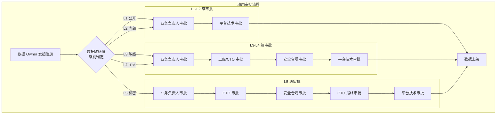

| 敏感度级别 | 审批链 | 审批角色 |
|-----------|--------|---------|
| **L1-公开** | 2 级审批 | 业务负责人 → 平台管理员 |
| **L2-内部** | 2 级审批 | 业务负责人 → 平台管理员 |
| **L3-敏感** | 4 级审批 | 业务负责人 → 上级/CTO → 安全合规 → 平台管理员 |
| **L4-个人** | 4 级审批 | 业务负责人 → 上级/CTO → 安全合规 → 平台管理员 |
| **L5-机密** | 5 级审批 | 业务负责人 → CTO → 安全合规 → CTO 最终审批 → 平台管理员 |

> ✅ **原则**: 所有审批流程均在平台上在线完成，留痕可追溯。

### 6.3 权限控制

#### 6.3.1 字段权限模型（阶段四新设计）

**核心设计原则**：消费权限 = 通道权限 + 字段权限

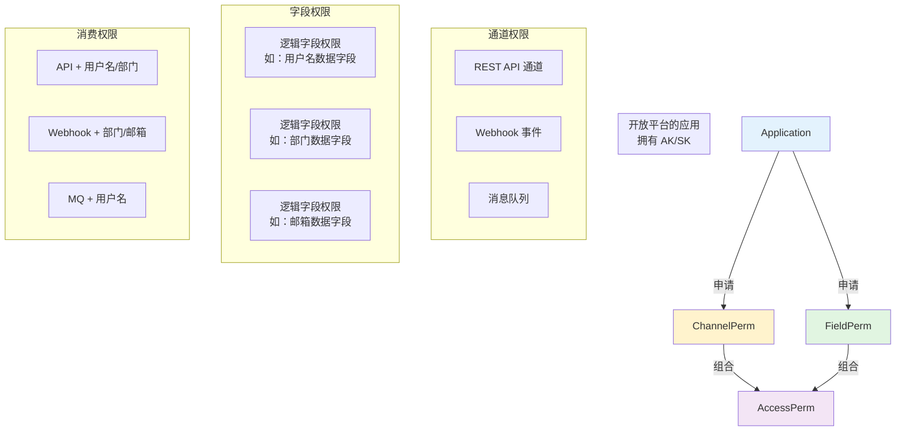

**权限模型说明**：
| 维度 | 说明 |
|------|------|
| **通道权限** | REST API、Webhook、消息队列等消费通道的访问权限 |
| **字段权限** | 逻辑字段的访问权限（不是具体数据库字段） |
| **组合规则** | 应用需同时拥有通道权限 + 字段权限才能消费数据 |
| **字段定义** | 逻辑字段（如：用户名数据字段），包含中文名、英文名等具体字段 |
| **平台定位** | 平台不碰数据，不管理具体数据含义，仅管控权限 |

**与阶段三的区别**：
| 维度 | 阶段三（已备份） | 阶段四（当前） |
|------|-----------------|---------------|
| 权限模型 | 通道权限 + 数据对象权限 | 通道权限 + 字段权限 |
| 数据概念 | 业务逻辑对象（员工信息对象等） | 抹除，直接面向逻辑字段 |
| 字段粒度 | 不做细粒度控制 | 逻辑字段级别管控 |
| 平台定位 | 管理数据对象 | 平台不碰数据，仅管控权限 |
| 对标策略 | 自主设计 | 跟随飞书/钉钉已验证模式 |

**示例**：
- 客服应用申请「获取用户信息 API」权限时，系统提示包含敏感字段（如：手机号、邮箱）
- 应用同时申请：API 通道权限 + 基础字段权限（user_id, name, department）+ 敏感字段权限（phone, email）
- 审批通过后，应用可同时拥有通道权限和字段权限，才能调用 API 获取完整数据

#### 6.3.2 字段权限设计

**字段粒度**：
- **逻辑字段**：不是具体数据库字段，而是业务逻辑层面的字段概念
- 示例：「用户名数据字段」包含中文名、英文名等具体字段
- **平台设计原则**：平台不想倾入数据本身（不管理具体数据含义）

**字段敏感度分级**：
- 会有分级，但不一定是 L1-L5 的命名方式
- 核心是区分「基础字段」和「敏感字段」
- 具体分级方式在后续详细设计体现

**字段敏感度定义者**：
- **API Owner**（通道技术负责人）在注册通道时附带定义
- 没有数据对象概念，数据字段权限不单独注册
- **通道注册时附带注册字段权限**

**默认策略**：
- **通道权限默认附带基础字段权限**
- **敏感字段需额外申请**
- 示例：基础字段（user_id, name, department）默认开放；敏感字段（phone, email）需额外申请

#### 6.3.3 字段权限审批流程

**核心原则**：两条审批单，并行审批，取并集去重

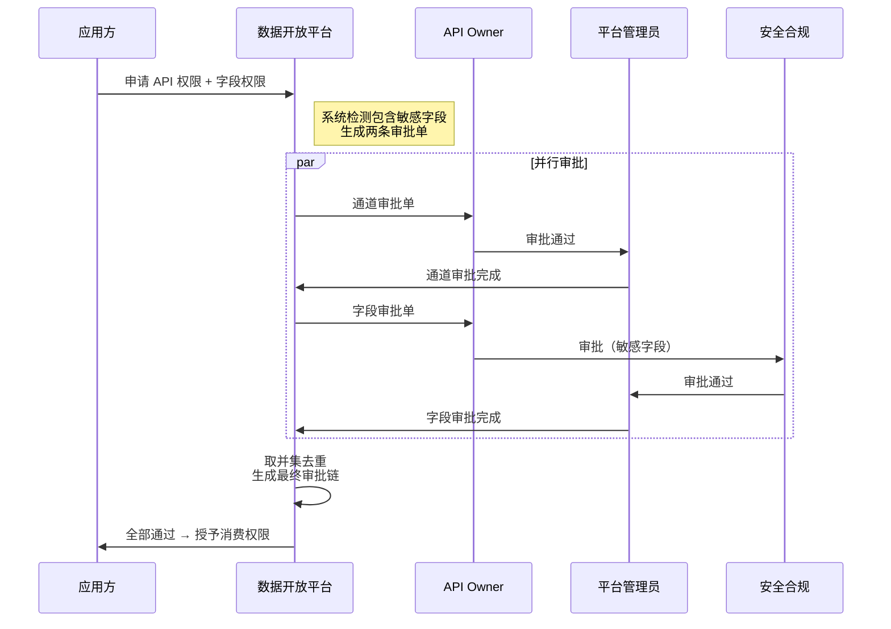

**审批单设计**：
| 方案 | 设计决策 |
|------|---------|
| **两条审批单** | 通道审批单 + 字段审批单，简化设计 |
| **并行审批** | 审批人可同时审批两个单子，提升效率 |
| **取并集去重** | 通道审批人 + 字段审批人，去重后生成最终审批链 |

**审批人视角**：
- **看权限，不看数据**：申请的是通道/数据字段对应的权限
- 如有需要，可以添加通道/字段具体信息（如 API 地址等）
- 平台不碰数据，但可以展示技术元数据

**与阶段三的区别**：
| 维度 | 阶段三（已备份） | 阶段四（当前） |
|------|-----------------|---------------|
| 审批单设计 | 一条审批单，动态审批链 | 两条审批单，并行审批 |
| 审批链组合 | 根据敏感度动态生成 | 取并集去重 |
| 审批人视角 | 看数据对象和敏感度 | 看权限，不看数据 |

#### 6.3.4 权限主体与有效期

| 维度 | 设计决策 |
|------|---------|
| **权限主体** | 开放平台的应用（Application），不是平台，不是终端用户 |
| **权限绑定** | 权限与应用 ID 绑定，AK/SK 仅是凭证代号 |
| **有效期** | 永久有效，除非主动回收 |
| **应用隔离** | 每个应用之间权限隔离，无共享/继承 |

**AK/SK 重置场景**：
- 权限与应用 ID 绑定，AK/SK 更新不影响权限
- 代号会变，但本质还是那个应用

**字段权限变更场景**：
- 低频场景，暂不考虑
- 按权限思路处理：消费通道有新增关联新的数据字段权限才需申请

#### 6.3.5 审计与监控

**审计日志记录**：
- 以通道为入口触发记录（API 调用日志、事件推送日志）
- 关联字段权限信息（哪个应用、使用了哪些字段权限）
- 不独立记录字段权限使用日志

**审计用途**：
- 安全审计（追踪数据泄露、违规使用）
- 使用量统计（计算数据价值）
- 性能优化（识别慢查询、高频调用）
- 问题排查（故障定位、根因分析）
- 合规要求（满足监管审计要求）

**实时监控**：
- 长期目标：完善的系统需要实时监控和告警
- MVP 阶段：暂不考虑，优先保证核心功能
- 分阶段实施

#### 6.3.6 权限可见性

| 功能 | 设计决策 |
|------|---------|
| **我的权限清单** | 待定，后续详细设计体现 |
| **可申请的权限目录** | 待定，后续详细设计体现 |
| **申请进度可视化** | 非刚需，不需要展示详情 |

---

## 七、竞品对标

### 7.1 飞书/钉钉对标分析

| 对标维度 | 飞书做法 | 钉钉做法 | 我们的借鉴 |
|---------|---------|---------|-----------|
| **数据目录** | API 文档中心，分类清晰 | API 文档中心，分类清晰 | ✅ 在现有 API 中心基础上增强 |
| **数据注册** | 开发者提交 API 申请 | ISV 提交应用审核 | ✅ 数据 Owner 在线注册 |
| **审批机制** | 平台审核 + 管理员授权 | 平台审核 + 管理员授权 | ✅ 全流程线上审批 |
| **权限粒度** | 细粒度权限控制 | 分级授权 | ✅ 支持数据敏感度分级 |
| **开放形式** | API + 事件订阅 + Webhook | API + 事件订阅 + Webhook | ✅ 支持多种形式 |
| **开发者体验** | 文档完善、SDK 支持好 | 文档完善、生态成熟 | ✅ 复用现有文档中心，增强 SDK |
| **计费模式** | 部分 API 收费 | 部分 API 收费 | ❌ 企业内部使用，不涉及计费 |

### 7.2 差异化定位

| 维度 | 飞书/钉钉 | 我们 |
|------|---------|------|
| **目标市场** | 公开市场，多企业 | 企业内部，单一企业 |
| **计费** | 部分收费 | 免费 |
| **部署** | 云端 SaaS | 企业内部部署 |
| **合规** | 通用合规 | 企业特定合规要求 |

---

### 7.3 竞品数据价值赋能对比（2026-04-07 调研完成）

基于飞书/钉钉的专项调研（详见 `docs/feishu-dingtalk-data-value-research/`），两者在数据价值赋能方面的核心差异：

#### 7.3.1 核心能力对比

| 维度 | 飞书 | 钉钉 | 我们的借鉴 |
|------|------|------|-----------|
| **API 丰富度** | 2500+ 服务端 API | 数百个 RESTful API | ✅ 优先丰富核心 API |
| **文档管理** | 云文档 + 知识库 API 完善 | 钉盘 + 钉文档基础 | ✅ 参考飞书文档能力 |
| **低代码** | 飞书 aPaaS + 多维表格 | 宜搭（1000 万 + 应用） | ✅ 参考钉钉宜搭生态 |
| **AI 能力** | Aily 智能体 | 10 万 + AI 智能体 | ✅ 参考两者 AI 整合 |
| **考勤人事** | 基础能力 | 远超飞书，全面 | ✅ 参考钉钉考勤 API |
| **量化 ROI** | 较少公开数据 | 详细（80% 效率提升） | ✅ 学习钉钉量化方法 |

#### 7.3.2 平台架构对比

**飞书**：一站式协同专属平台，信息高效流转
- 核心优势：消息与群组、云文档、多维表格、日历
- 开发模式：全代码 + 低代码 + 零代码+AI 智能体
- 典型场景：运维告警、HR 集成、自动化周报

**钉钉**：重建企业神经系统，系统自动协作
- 核心优势：考勤 API、审批流程、宜搭低代码
- 开发模式：全代码 + 宜搭低代码+AI 搭建
- 典型场景：入职自动化、采购审批、考勤分析

#### 7.3.3 可借鉴点

**飞书**：
- ✅ 多维表格零代码搭建业务系统
- ✅ 云文档 + 知识库 API 深度开放
- ✅ 自动化周报场景（模板定时创建）
- ✅ AnyCross 跨平台集成平台

**钉钉**：
- ✅ 宜搭低代码生态（1000 万 + 应用）
- ✅ 量化 ROI 方法（80% 效率提升）
- ✅ 考勤 API 全面开放
- ✅ 审批流程嵌入式集成

---

## 八、成功标准

**核心目标**: 
1. ✅ **数据成功开放出去** - 有数据被开放，有消费方在使用
2. ✅ **数据接入使用很便捷** - 三方平台接入数据简单、快速
3. ✅ **整个流程安全可控合规** - 全流程线上审批、留痕可追溯、安全合规

### 8.1 定性指标

| 维度 | 成功标准 | 对应核心目标 |
|------|---------|-------------|
| **数据开放** | 有数据 Owner 愿意开放数据，数据成功上架 | 数据成功开放出去 |
| **数据消费** | 有消费方订阅并使用开放的数据 | 数据成功开放出去 |
| **接入效率** | 三方平台接入数据的时间显著降低，流程简单 | 数据接入使用很便捷 |
| **用户体验** | 数据 Owner 觉得开放方便，消费方觉得获取容易 | 数据接入使用很便捷 |
| **安全合规** | 全流程线上审批、留痕可追溯、符合企业合规要求 | 整个流程安全可控合规 |
| **风险控制** | 数据安全可控，无数据泄露事件 | 整个流程安全可控合规 |

### 8.2 定量指标（系统提供度量能力）

| 指标类型 | 具体的指标 | 对应核心目标 |
|---------|-----------|-------------|
| **规模指标** | 开放的数据对象数量、数据域数量 | 数据成功开放出去 |
| **接入规模** | 订阅数据的三方平台数量、应用数量 | 数据成功开放出去 |
| **活跃指标** | 每天/每月 API 调用量、事件订阅量 | 数据成功开放出去 |
| **效率指标** | 三方平台接入数据的时间（从 X 天降低到 Y 天） | 数据接入使用很便捷 |
| **审批效率** | 审批平均时长、审批通过率 | 数据接入使用很便捷 |
| **治理指标** | 经过审批的数据开放比例（目标 100%） | 整个流程安全可控合规 |
| **安全指标** | 审计日志完整率、权限违规次数（目标 0） | 整个流程安全可控合规 |
| **价值评估指标** | API 调用量统计、数据使用频次、定期价值报告 | 数据成功开放出去 |

> ⚠️ **注意**: 具体目标值取决于业务运营推广的投入力度，系统首先需要具备度量能力。

---

## 九、风险与假设

### 9.1 关键假设

| 假设 | 风险等级 | 验证方式 |
|------|---------|---------|
| 数据 Owner 有开放数据的意愿 | 中 | 试点项目验证 |
| 企业内部三方平台有使用 XX 平台数据的需求 | 低 | 已有私下对接案例 |
| 现有 open-app 代码可以服务化改造 | 中 | 技术评估 |
| 线上审批流程可以配合 | 中 | 与业务方沟通 |

### 9.2 潜在风险

| 风险 | 影响 | 缓解措施 |
|------|------|---------|
| 数据 Owner 担心数据安全责任 | 高 | 提供完善的权限控制和审计日志 |
| 数据分级标准难以统一 | 中 | 支持可配置的分级标准 |
| 服务化改造工作量大 | 中 | 分阶段实施，优先核心能力 |
| 业务决策流程复杂 | 中 | 全流程线上审批，明确各角色职责 |

---

## 十、待调研事项

| 事项 | 说明 | 优先级 | 状态 |
|------|------|--------|------|
| **消费方业务场景** | 三方平台具体想用数据做什么业务 | P1 | ⏳ 待调研 |
| **当前替代方案** | 没有平台之前，三方平台如何获取数据 | P1 | ⏳ 待调研 |
| **具体 AI 应用规划** | 企业内部是否有具体的 AI 应用需求 | P2 | ⏳ 待调研 |
| **数据资产清单** | XX 平台内部有哪些数据对象 | P1 | ⏳ 待调研 |

> ✅ **竞品赋能调研已完成**：详见 `docs/feishu-dingtalk-data-value-research/`
> - 飞书开放平台数据价值赋能报告.md
> - 钉钉开放平台数据价值赋能报告.md
> - 飞书 vs 钉钉开放平台数据价值对比报告.md

---

## 十一、下一步建议

### 11.1 进入规范编写阶段

运行 `@sdd-spec 数据开放平台` 进入规范编写阶段，产出：
- 产品需求文档（PRD）
- 用户故事地图
- 详细功能规格

### 11.2 并行业务调研

在规范编写阶段，建议同步进行：
- 访谈 2-3 个典型三方平台负责人，了解具体业务场景
- 梳理 XX 平台现有数据对象清单

**已完成调研**：
- ✅ 飞书/钉钉数据价值赋能调研（详见 `docs/feishu-dingtalk-data-value-research/`）
- ✅ 飞书/钉钉数据开放能力对比调研（详见 `docs/data-open-platform-research/`）
- **新增**：调研飞书/钉钉的数据价值赋能做法

### 11.3 技术预研

- 评估 open-app 现有代码的服务化改造方案
- 评估与内部消息平台的集成方案
- 设计数据敏感度分级和权限控制模型

---

## 附录

### A. 会话记录

完整对话记录见：`.specs/feature-session-001/session-log.md`

### B. 分析笔记

分析总结见：`.specs/feature-session-001/discovery-analysis.md`

### C. 参考资料

- 飞书&钉钉开放平台对比调研报告
- 飞书&钉钉数据开放能力对比调研报告
- 飞书&钉钉开放价值与维度对比调研报告
- open-app 业务架构文档
- 代码仓库：https://github.com/give-my-dreams/OpenPlatform

---

**报告状态**: ✅ 需求挖掘完成  
**下一步**: 运行 `@sdd-spec 数据开放平台` 开始规范编写

---

## 修订记录

| 版本 | 日期 | 修订内容 | 修订人 |
|------|------|---------|--------|
| v1.0 | 2026-04-03 | 初始版本 - 完成需求挖掘报告 | AI Assistant |
| v1.1 | 2026-04-03 | 修正 1：审批流程改为全流程线上进行 | AI Assistant |
| v1.2 | 2026-04-03 | 修正 2：审批流程改为基于敏感度等级的动态审批 | AI Assistant |
| v1.3 | 2026-04-03 | 修正 3：明确敏感度定义粒度为数据对象级别 | AI Assistant |
| v1.4 | 2026-04-03 | 修正 4：明确成功标准的三个核心维度 | AI Assistant |
| v1.5 | 2026-04-03 | 修正 5：删除反向依赖说明 | AI Assistant |
| v1.6 | 2026-04-03 | 修正 6：优化 2.1 现状痛点图表结构 | AI Assistant |
| v1.7 | 2026-04-03 | 修正 7：按数据流架构重新设计 2.1 图表 | AI Assistant |
| v1.8 | 2026-04-03 | 修正 8：优化 4.1 需求分层图表布局（多次迭代） | AI Assistant |
| v1.9 | 2026-04-03 | 修正 9：图表语法参考 1.1 章节优化 | AI Assistant |
| v1.10 | 2026-04-03 | 修正 10：修复图表斜向排列问题 | AI Assistant |
| v1.11 | 2026-04-07 | 新增：数据价值赋能章节（第 10 章） | AI Assistant |
| v1.12 | 2026-04-07 | 整合：将第 10 章内容整合到第 2/4/8 章，删除独立章节 | AI Assistant |
| v1.13 | 2026-04-07 | 融合：新增 5.3 数据消费场景、补充 6.1/6.2 节，增加参考资料代码仓库链接 | AI Assistant |
| v1.14 | 2026-04-07 | 优化：删除 5.3.6 重复流程，优化 5.1 说明 | AI Assistant |
| v1.15 | 2026-04-07 | 优化：将 6.1.2 文本流程图转换为 mermaid | AI Assistant |
| v1.16 | 2026-04-07 | 更新：基于竞品赋能调研结果，更新 7/10/11 章 | AI Assistant |
| v1.17 | 2026-04-09 | 新增：阶段三权限关系挖掘 - 双重权限模型、动态审批链、权限可见性 | AI Assistant |
| v1.18 | 2026-04-10 | 新增：阶段四字段权限挖掘 - 抹除数据对象概念、字段权限模型、并行审批 | AI Assistant |

---

**最后更新**: 2026-04-10（阶段四字段权限需求挖掘完成）
