# 数据开放平台产品规范文档

**Feature 名称**: 数据开放平台  
**Feature ID**: DATA-OPEN-001  
**文档版本**: v2.0  
**创建时间**: 2026-04-07  
**最后更新**: 2026-04-07  
**状态**: specified  
**作者**: SDD 规范编写专家  
**关联文档**: 
- [需求挖掘报告](./discovery-report.md)
- [分析笔记](./discovery-analysis.md)
- [Discovery Session Log](./discovery-session-log.md)

---

## 目录

1. [产品概述](#一产品概述)
2. [功能规格](#二功能规格)
3. [核心流程设计](#三核心流程设计)
4. [数据治理规范](#四数据治理规范)
5. [接口规范](#五接口规范)
6. [非功能性需求](#六非功能性需求)
7. [开放问题与待决策事项](#七开放问题与待决策事项)
8. [附录](#附录)

---

## 一、产品概述

### 1.1 核心定位

**数据开放平台**是 open-app 体系下的子平台，聚焦 XX 通讯平台的数据开放管理，将企业内部 XX 平台的数据开放给企业内部其它三方平台消费使用。

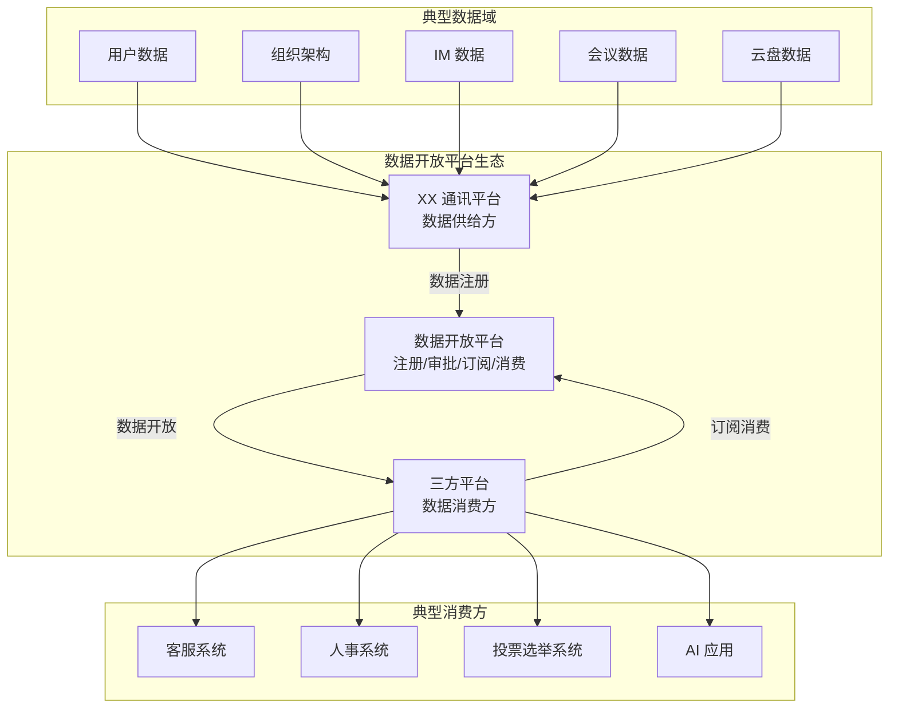

### 1.2 目标用户

| 角色 | 职责 | 核心诉求 |
|------|------|----------|
| **数据 Owner** | 业务模块负责人（如 IM 模块负责人） | 注册数据、生产数据；通过开放数据实现业务价值；担心开放带来的安全负面影响 |
| **开放平台管理员** | 平台运营人员 | 审批数据注册信息；确保数据符合平台规范；全流程线上审批，业务决策在线上也留痕 |
| **三方平台业务方** | 企业内部自研系统负责人（客服系统、人事系统、投票选举系统等） | 订阅数据、消费数据；利用 XX 平台数据增强自身业务；快速接入、简单使用 |

### 1.3 价值主张

| 维度 | 描述 |
|------|------|
| **核心痛点** | 能力封闭：XX 平台的数据和能力无法被企业内部其他三方平台有效利用；AI 大行其道，XX 平台 AI 能力薄弱 |
| **现状问题** | 平台能力局限在内部使用；三方平台无法利用 XX 平台资源开展业务；缺少标准通道，私下对接效率低、风险高 |
| **解决方案** | 提供标准统一的数据开放通道，解决数据孤岛和接口混乱问题 |
| **业务目标** | 生态开放：让三方平台能利用 XX 平台资源开展业务，形成企业内部的能力生态 |

### 1.4 与 open-app 的关系

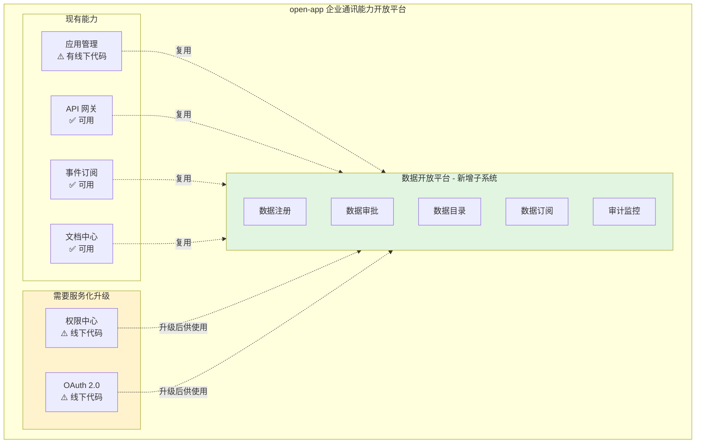

**定位说明**:
- **业务归属**: 子平台，归于 open-app 体系
- **技术架构**: 技术上单独的服务
- **实现方式**: 业务上增强，复用现有 API 中心能力

### 1.5 成功标准

**核心目标**: 
1. ✅ **数据成功开放出去** - 有数据被开放，有消费方在使用
2. ✅ **数据接入使用很便捷** - 三方平台接入数据简单、快速
3. ✅ **整个流程安全可控合规** - 全流程线上审批、留痕可追溯、安全合规

#### 1.5.1 定性指标

| 维度 | 成功标准 | 对应核心目标 |
|------|---------|-------------|
| **数据开放** | 有数据 Owner 愿意开放数据，数据成功上架 | 数据成功开放出去 |
| **数据消费** | 有消费方订阅并使用开放的数据 | 数据成功开放出去 |
| **接入效率** | 三方平台接入数据的时间显著降低，流程简单 | 数据接入使用很便捷 |
| **用户体验** | 数据 Owner 觉得开放方便，消费方觉得获取容易 | 数据接入使用很便捷 |
| **安全合规** | 全流程线上审批、留痕可追溯、符合企业合规要求 | 整个流程安全可控合规 |
| **风险控制** | 数据安全可控，无数据泄露事件 | 整个流程安全可控合规 |

#### 1.5.2 定量指标

| 指标类型 | 具体指标 | 对应核心目标 |
|---------|---------|-------------|
| **规模指标** | 开放的数据对象数量、数据域数量 | 数据成功开放出去 |
| **接入规模** | 订阅数据的三方平台数量、应用数量 | 数据成功开放出去 |
| **活跃指标** | 每天/每月 API 调用量、事件订阅量 | 数据成功开放出去 |
| **效率指标** | 三方平台接入数据的时间（从 X 天降低到 Y 天） | 数据接入使用很便捷 |
| **审批效率** | 审批平均时长、审批通过率 | 数据接入使用很便捷 |
| **治理指标** | 经过审批的数据开放比例（目标 100%） | 整个流程安全可控合规 |
| **安全指标** | 审计日志完整率、权限违规次数（目标 0） | 整个流程安全可控合规 |
| **价值评估** | API 调用量统计、数据使用频次、定期价值报告 | 数据成功开放出去 |

> ⚠️ **注意**: 具体目标值取决于业务运营推广的投入力度，系统首先需要具备度量能力。

---

## 二、功能规格

### 2.1 需求分层

```mermaid
graph LR
    subgraph Must_Have[必备需求 - 没有无法使用]
        M1[数据注册]
        M2[数据审批]
        M3[数据订阅]
        M4[数据消费]
        M5[应用管理]
        M6[权限控制]
        M7[事件订阅]
    end
    
    subgraph Should_Have[期望需求 - 显著提升体验]
        S1[数据目录]
        S2[敏感度分级]
        S3[审计日志]
        S4[用量统计]
        S5[数据资产清单]
        S6[数据字典]
        S7[场景分类]
        S8[案例库]
        S9[技术支持]
    end
    
    subgraph Could_Have[惊喜需求 - 超出预期]
        C1[价值可视化]
        C2[自动化同步]
        C3[开发者门户]
        C4[多形式支持]
    end
    
    Must_Have -.-> Should_Have
    Should_Have -.-> Could_Have
    
    style Must_Have fill:#e1f5e1,stroke:#2e7d32,stroke-width:2px
    style Should_Have fill:#fff3cd,stroke:#f57c00,stroke-width:2px
    style Could_Have fill:#f3e5f5,stroke:#7b1fa2,stroke-width:2px
```

### 2.2 Must Have 需求清单（P0 - 必备）

| 需求编号 | 需求名称 | FR 编号 | 需求描述 | 验收标准 |
|---------|---------|--------|---------|---------|
| **MH-01** | 数据注册 | FR-001 | 数据 Owner 能够注册数据 | 支持填写数据描述、字段定义、开放形式、敏感度级别；提交后进入审批流程 |
| **MH-02** | 数据审批 | FR-002 | 平台管理员能够审批数据注册 | 支持审批通过/驳回，记录审批意见；审批流程根据敏感度动态生成 |
| **MH-03** | 应用管理 | FR-003 | 三方平台能够创建应用 | 创建应用后获取 AK/SK；支持查看和刷新凭证 |
| **MH-04** | 数据订阅 | FR-004 | 三方平台能够订阅数据 | 选择数据后提交订阅申请；支持查看订阅状态 |
| **MH-05** | API 消费 | FR-005 | 三方平台能够通过 API 消费数据 | 使用 AK/SK 调用 API 获取数据；未授权访问返回 401/403 |
| **MH-06** | 事件订阅 | FR-006 | 支持事件订阅形式 | 数据变更时推送给订阅方；支持确认和重试机制 |
| **MH-07** | 权限控制 | FR-007 | 基础权限控制 | 未授权应用无法访问数据；支持应用级、数据级权限 |

### 2.3 Should Have 需求清单（P1 - 期望）

| 需求编号 | 需求名称 | FR 编号 | 需求描述 | 验收标准 |
|---------|---------|--------|---------|---------|
| **SH-01** | 数据目录 | FR-008 | 数据目录/市场 | 浏览可订阅的数据列表，支持搜索和分类 |
| **SH-02** | 敏感度分级 | FR-009 | 数据敏感度分级管理 | 支持定义和管理数据敏感度级别（数据对象级别），支持基于敏感度动态审批 |
| **SH-03** | 审计日志 | FR-010 | 审计日志记录 | 记录所有数据访问行为；支持查询和导出 |
| **SH-04** | 用量统计 | FR-011 | 用量统计展示 | 展示数据被调用的次数、调用方等；支持时间范围筛选 |
| **SH-05** | 数据资产清单 | FR-012 | 数据资产统一管理 | 统一记录 XX 平台有哪些数据对象 |
| **SH-06** | 数据字典 | FR-013 | 数据字典/数据地图 | 提供数据含义、关系、使用建议（数据来源、加工逻辑、更新频率、推荐使用场景） |
| **SH-07** | 场景分类 | FR-014 | 场景分类目录 | 按业务场景分类展示数据（如：HR 场景、客服场景、AI 场景） |
| **SH-08** | 案例库 | FR-015 | 成功案例分享 | 收集并分享成功案例，提供场景化引导 |
| **SH-09** | 技术支持 | FR-016 | 技术咨询支持 | 快速响应、专业解答，有专门支持人员平等服务所有消费方 |

### 2.4 Could Have 需求清单（P2 - 惊喜）

| 需求编号 | 需求名称 | FR 编号 | 需求描述 | 验收标准 |
|---------|---------|--------|---------|---------|
| **CH-01** | 价值可视化 | FR-017 | 数据价值可视化 | 数据 Owner 能看到开放数据带来的业务价值 |
| **CH-02** | 自动化同步 | FR-018 | 自动化数据同步 | 支持配置数据管道，自动同步到消费方 |
| **CH-03** | 开发者门户 | FR-019 | 开发者门户 | 提供开发者文档、SDK 下载、示例代码 |
| **CH-04** | 多形式支持 | FR-020 | 多开放形式支持 | 支持批量导出、数据同步等形式 |

### 2.5 功能需求详细规格

#### FR-001: 数据注册

**描述**: 数据 Owner 能够在平台上注册数据对象，填写完整的元数据信息。

**输入**:
- 数据对象名称
- 数据对象描述
- 字段定义（字段名、类型、描述、示例值）
- 开放形式（API 查询/事件订阅/批量导出/数据同步）
- 敏感度级别（L1-L5）
- 数据来源
- 更新频率
- 推荐使用场景

**处理**:
- 验证必填字段完整性
- 根据敏感度级别生成审批链
- 创建审批流程实例
- 通知相关审批人

**输出**:
- 注册申请提交成功
- 审批流程 ID
- 当前审批状态

**验收标准**:
- 数据 Owner 能够成功填写并提交注册信息
- 系统根据敏感度级别自动生成正确的审批链
- 提交后状态为"审批中"

---

#### FR-002: 数据审批

**描述**: 平台管理员和相关负责人能够对数据注册申请进行审批。

**输入**:
- 审批流程 ID
- 审批决策（通过/驳回）
- 审批意见
- 附件（可选）

**处理**:
- 验证审批人权限
- 记录审批决策和意见
- 更新审批流程状态
- 通知下一审批人或申请人

**输出**:
- 审批结果
- 更新后的流程状态

**验收标准**:
- 各级审批人能够正确收到审批通知
- 审批通过后数据状态变为"已上架"
- 审批驳回后数据状态变为"已驳回"，并通知申请人

---

#### FR-003: 应用管理

**描述**: 三方平台能够创建和管理应用，获取 API 访问凭证。

**输入**:
- 应用名称
- 应用描述
- 业务场景
- 联系人信息

**处理**:
- 创建应用记录
- 生成 AK/SK 凭证
- 存储凭证（加密）

**输出**:
- 应用 ID
- AK（Access Key）
- SK（Secret Key，仅展示一次）

**验收标准**:
- 创建应用后能够立即获取 AK/SK
- SK 仅展示一次，后续可刷新
- 支持查看应用列表和详情

---

#### FR-004: 数据订阅

**描述**: 三方平台能够浏览数据目录并订阅所需数据。

**输入**:
- 应用 ID
- 数据对象 ID
- 使用场景说明

**处理**:
- 验证应用状态
- 创建订阅申请
- 通知审批人

**输出**:
- 订阅申请 ID
- 审批状态

**验收标准**:
- 能够浏览可订阅的数据列表
- 提交订阅申请后进入审批流程
- 审批通过后获得数据访问权限

---

#### FR-005: API 消费

**描述**: 三方平台能够使用 AK/SK 调用 API 消费数据。

**输入**:
- API 端点
- 请求参数
- AK/SK 签名

**处理**:
- 验证签名有效性
- 检查应用权限
- 查询数据
- 返回响应

**输出**:
- 数据响应
- 或错误码

**验收标准**:
- 有效 AK/SK 能够成功获取数据
- 无效 AK/SK 返回 401 错误
- 无权限访问返回 403 错误

---

#### FR-006: 事件订阅

**描述**: 支持数据变更时主动推送事件给订阅方。

**输入**:
- 事件数据
- 订阅方列表

**处理**:
- 格式化事件消息
- 通过内部消息平台推送
- 等待确认
- 失败重试

**输出**:
- 推送结果
- 重试记录

**验收标准**:
- 数据变更后 5 秒内推送给订阅方
- 支持重试机制（最多 3 次）
- 订阅方能够确认接收

---

#### FR-007: 权限控制

**描述**: 实现应用级、数据级、用户级、场景级多维度权限控制。

**输入**:
- 访问请求
- 应用凭证
- 数据对象 ID

**处理**:
- 验证应用状态
- 检查订阅关系
- 验证数据敏感度权限
- 记录访问日志

**输出**:
- 允许/拒绝访问

**验收标准**:
- 未订阅数据无法访问
- 应用被禁用后无法访问
- 高敏感度数据需要额外审批

---

#### FR-008 ~ FR-020

详见后续迭代文档，本版本聚焦 Must Have 需求。

---

## 三、核心流程设计

### 3.1 数据开放消费全流程

从平台视角展示数据从注册到消费的完整流程，涉及数据 Owner、平台管理员、消费方三方角色。

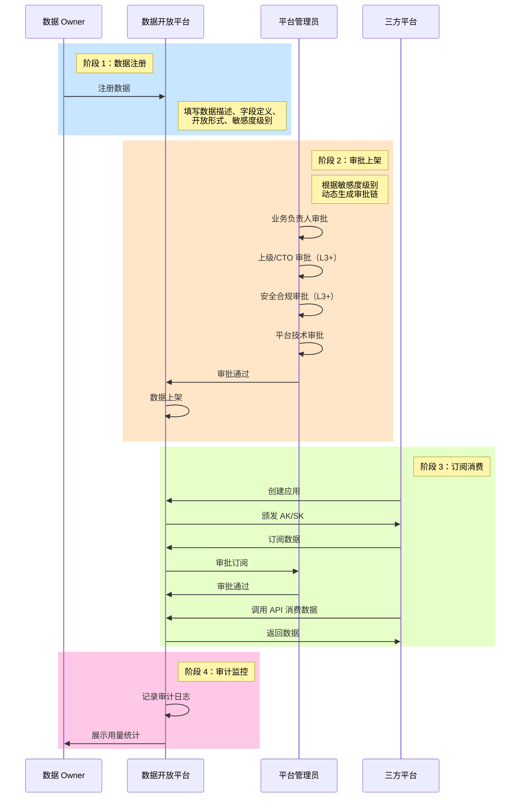

### 3.2 数据注册流程

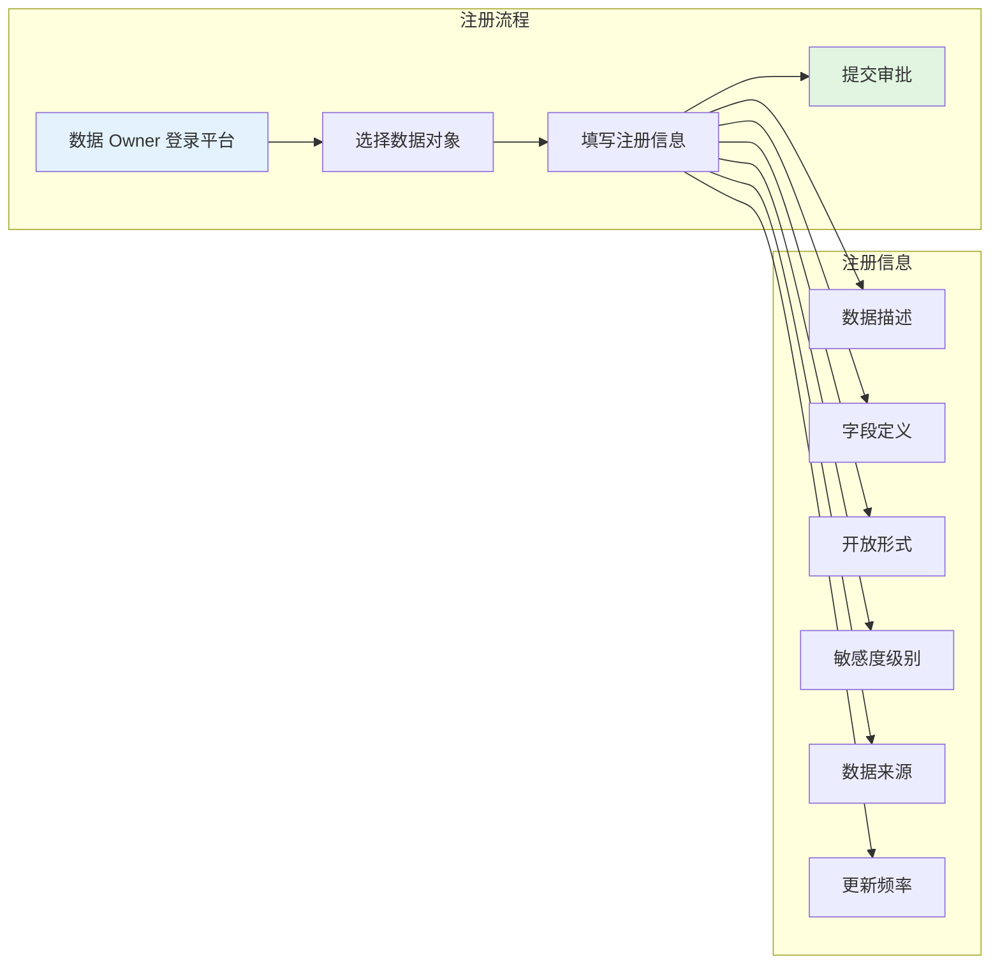

**注册信息详细说明**:

| 字段 | 必填 | 说明 | 示例 |
|------|------|------|------|
| 数据对象名称 | 是 | 数据对象的唯一标识 | user_info（用户信息） |
| 数据对象描述 | 是 | 数据对象的业务含义 | 企业员工基本信息，包含姓名、工号、部门等 |
| 字段定义 | 是 | 包含的所有字段列表 | userId, name, department, email... |
| 开放形式 | 是 | 支持的消费方式 | API 查询、事件订阅 |
| 敏感度级别 | 是 | L1-L5 | L2-内部 |
| 数据来源 | 是 | 数据的原始来源 | XX 通讯平台 - 通讯录模块 |
| 更新频率 | 是 | 数据更新周期 | 实时/每日/每周 |
| 推荐使用场景 | 否 | 建议使用场景说明 | 用户身份验证、组织架构展示 |

### 3.3 数据审批流程

基于敏感度等级的动态审批流程：

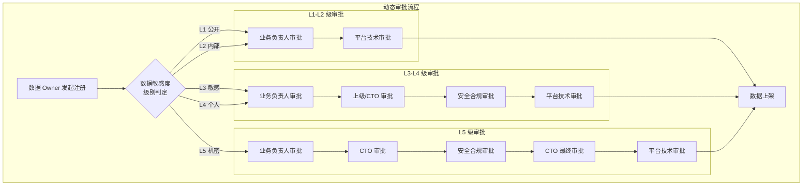

**审批链配置**:

| 敏感度级别 | 审批链 | 审批角色 | 预计时长 |
|-----------|--------|---------|---------|
| **L1-公开** | 2 级审批 | 业务负责人 → 平台管理员 | 1-2 工作日 |
| **L2-内部** | 2 级审批 | 业务负责人 → 平台管理员 | 1-2 工作日 |
| **L3-敏感** | 4 级审批 | 业务负责人 → 上级/CTO → 安全合规 → 平台管理员 | 3-5 工作日 |
| **L4-个人** | 4 级审批 | 业务负责人 → 上级/CTO → 安全合规 → 平台管理员 | 3-5 工作日 |
| **L5-机密** | 5 级审批 | 业务负责人 → CTO → 安全合规 → CTO 最终审批 → 平台管理员 | 5-10 工作日 |

> ✅ **原则**: 所有审批流程均在平台上在线完成，留痕可追溯。

### 3.4 数据订阅流程

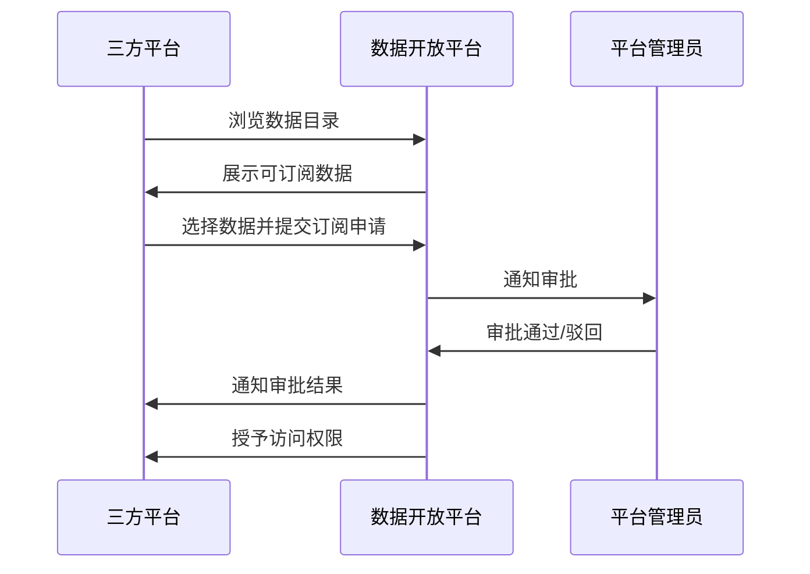

**订阅审批说明**:
- 订阅审批由数据 Owner 或平台管理员执行
- 高敏感度数据订阅需要额外审批
- 审批通过后自动授予 API 访问权限

### 3.5 数据消费流程

#### 3.5.1 API 调用流程

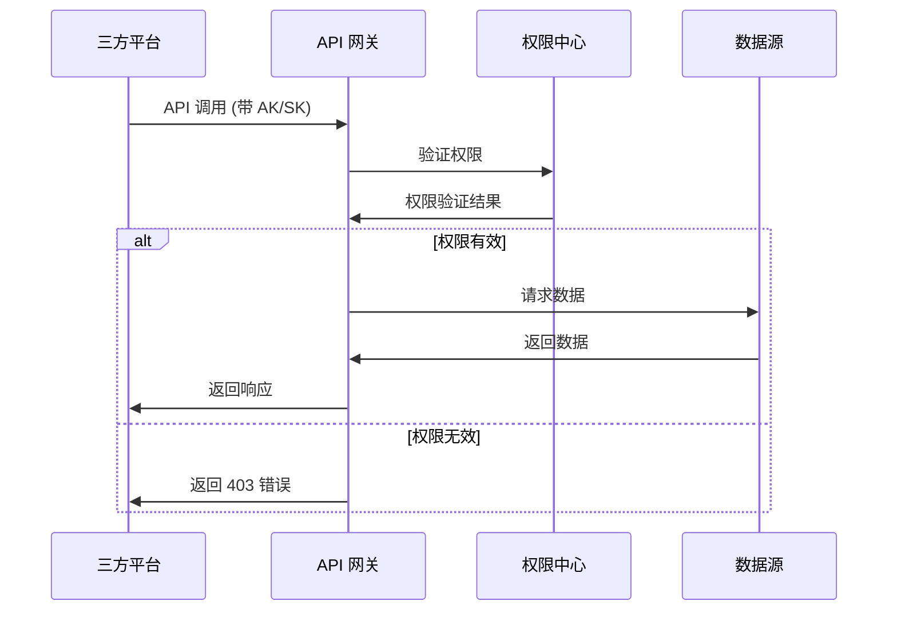

#### 3.5.2 事件推送流程

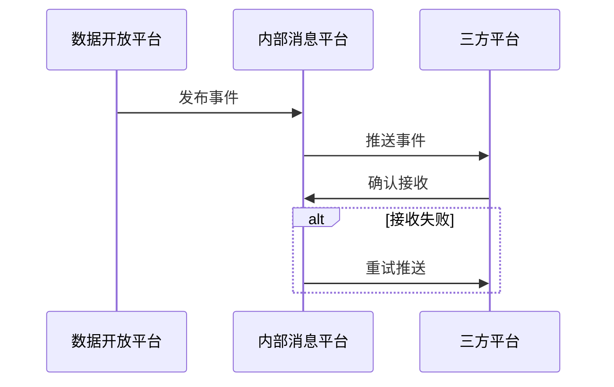

### 3.6 数据开放形式

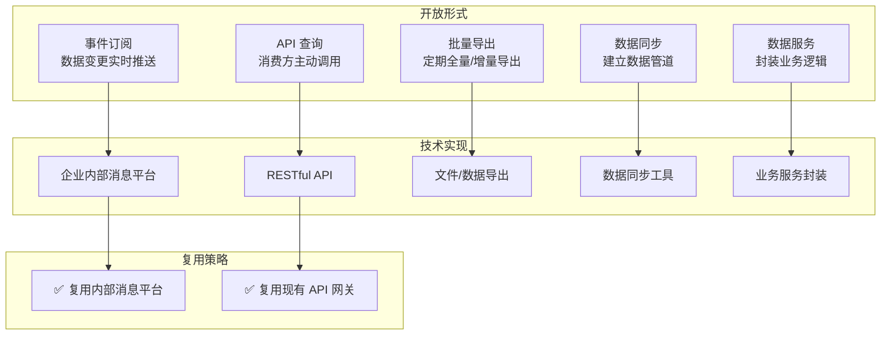

### 3.7 典型消费场景

#### 3.7.1 场景一：业务系统集成（最常见）

**场景描述**：企业内部业务系统需要获取 XX 平台的数据，实现业务闭环。

| 消费方 | 使用场景 | 消费的数据 | 敏感度 | 消费方式 |
|--------|---------|-----------|--------|---------|
| **人事系统** | 新员工入职自动同步组织架构信息 | 用户基本信息、部门信息 | L2 | API 查询 + 事件订阅 |
| **财务系统** | 考勤数据同步用于薪资计算 | 考勤记录、请假审批 | L3 | API 查询 |
| **客服系统** | 客服人员查看用户所属部门和职务 | 用户基本信息、组织架构 | L2 | API 查询 |
| **会议室预订系统** | 查看会议室的忙闲状态 | 日历忙闲状态 | L2 | API 查询 |
| **数据分析平台** | 企业运营数据分析和报表 | 用户活跃度、会议统计数据 | L2 | 批量导出 |

**技术特点**:
- 系统对系统调用（Server-to-Server）
- 通常需要全量数据和增量数据同步
- 对数据实时性要求较高（分钟级）

---

#### 3.7.2 场景二：应用功能嵌入

**场景描述**：第三方应用将 XX 平台的能力嵌入到自己的应用中，提供更丰富的用户体验。

| 消费方 | 使用场景 | 消费的数据/能力 | 敏感度 | 消费方式 |
|--------|---------|----------------|--------|---------|
| **CRM 系统** | 销售在 CRM 中直接发起会议 | 会议能力、日程能力 | L2-L3 | API 调用 + SDK |
| **HR 招聘系统** | 招聘流程中发起视频面试 | 视频会议能力 | L2 | API 调用 |
| **项目管理工具** | 任务提醒发送到 XX 消息 | 消息推送能力 | L2 | API 调用 |
| **审批系统** | 审批结果自动通知 | 消息推送能力 | L2 | 事件订阅 |

**技术特点**:
- 用户在消费方应用中操作，体验无缝衔接
- 需要 OAuth 授权（用户身份）
- 对接效率要求高（快速接入）

---

#### 3.7.3 场景三：数据分析与 AI 应用

**场景描述**：利用 XX 平台的数据进行数据分析、BI 报表、AI 智能应用。

| 消费方 | 使用场景 | 消费的数据 | 敏感度 | 消费方式 |
|--------|---------|-----------|--------|---------|
| **BI 报表系统** | 企业运营分析报表 | 会议数量、文档活跃度、用户活跃度 | L2 | 批量导出 |
| **人力资源分析** | 员工流失预测分析 | 用户基本信息、活跃度、考勤数据 | L3 | API 查询 |
| **AI 智能助手** | 智能问答，查询企业信息 | 用户信息、组织架构、日程 | L2-L3 | API 查询 |
| **知识库系统** | 自动汇总会议纪要 | 会议录制、转写（脱敏后） | L3-L4 | 批量导出 |

**技术特点**:
- 通常需要批量数据处理
- 对数据量要求较大（历史数据）
- 需要考虑数据脱敏和隐私保护

---

#### 3.7.4 场景四：第三方服务集成

**场景描述**：集成外部第三方服务，实现更丰富的功能。

| 消费方 | 使用场景 | 消费的数据 | 敏感度 | 消费方式 |
|--------|---------|-----------|--------|---------|
| **视频会议硬件** | 会议室设备自动加入会议 | 会议信息、日程 | L2 | API 调用 |
| **日历应用** | 在第三方日历查看 XX 日程 | 日程信息、忙闲状态 | L2-L3 | API 调用 + Webhook |
| **邮件系统** | 邮件提醒发送到 XX | 消息推送能力 | L2 | API 调用 |
| **档案系统** | 会议资料自动归档 | 会议信息、录制文件、文档 | L3-L4 | 批量导出 |

**技术特点**:
- 需要跨平台认证
- 需要处理数据格式转换
- 需要考虑服务稳定性

---

#### 3.7.5 场景五：合规审计与监管

**场景描述**：满足企业合规、审计、监管要求的数据访问。

| 消费方 | 使用场景 | 消费的数据 | 敏感度 | 消费方式 |
|--------|---------|-----------|--------|---------|
| **审计系统** | 合规审计日志查询 | 操作日志、访问记录 | L2 | API 查询 |
| **安全监控系统** | 异常行为检测 | 访问日志、行为数据 | L2-L3 | 事件订阅 |
| **法务系统** | 诉讼证据调取 | 消息内容、文档内容（需审批） | L4 | API 查询（特殊审批） |
| **监管部门** | 数据上报 | 统计数据（脱敏后） | L2 | 批量导出 |

**技术特点**:
- 需要严格权限控制
- 需要完整审计日志
- 通常需要高级别审批

---

## 四、数据治理规范

### 4.1 数据敏感度分级

| 级别 | 定义 | 典型数据示例 | 开放策略 |
|------|------|-------------|---------|
| **L1-公开** | 可对企业内所有用户公开 | 公司组织架构、部门名称 | 所有认证应用可访问 |
| **L2-内部** | 限于企业内部使用 | 用户基本信息、邮箱、电话 | 需要审批，限制使用场景 |
| **L3-敏感** | 涉及个人隐私或业务敏感 | 薪资、绩效、考勤记录 | 严格管控，仅限特定场景 |
| **L4-个人** | 个人私密数据 | 聊天记录、日程、私人文件 | 需要用户授权，或完全不开放 |
| **L5-机密** | 商业机密、战略信息 | 未公开的战略信息 | 不开放 |

> ⚠️ **注意**: 
> - 敏感度定义的最小粒度为**数据对象级别**（如：用户数据、组织架构、IM 消息），不做字段级别的细粒度定义
> - 当前 XX 平台没有统一的数据敏感度定义，需要建立数据资产清单和分级标准

### 4.2 数据定级流程

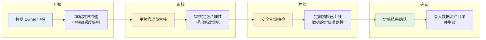

**定级责任界定**：

| 角色 | 职责 | 责任 |
|------|------|------|
| **数据 Owner** | 负责准确申报数据敏感度，提供数据字段清单和样例 | 对定级结果负主要责任 |
| **平台管理员** | 负责审核定级合理性，对明显错误的定级提出修改意见 | 负审核责任 |
| **安全合规团队** | 负责定期抽检已上线数据的定级准确性 | 负监督责任 |

### 4.3 审批机制

#### 4.3.1 设计原则

| 原则 | 说明 |
|------|------|
| **线上为主** | 所有审批环节在线上完成，确保流程可追溯、可审计 |
| **线下为辅** | 线下仅作为补充沟通手段，用于重大事项的讨论或争议解决 |
| **留痕可溯** | 线下沟通结果必须在线上留痕，确保审批记录的完整性 |

#### 4.3.2 审批流程配置

| 配置项 | 说明 |
|--------|------|
| 审批链规则 | 根据敏感度级别动态生成审批链 |
| 审批人映射 | 各角色审批人可配置（如：业务负责人、CTO、安全合规负责人） |
| 审批超时 | 可配置审批超时时间，超时自动提醒或升级 |
| 审批意见 | 必填字段，支持附件上传 |

#### 4.3.3 线下补充场景

| 场景 | 说明 | 留痕要求 |
|------|------|---------|
| L3-L4 级数据的安全评审会议 | 可选，用于复杂数据的安全评估 | 会议纪要上传至审批流程 |
| 审批争议的多方协调会议 | 可选，用于解决审批分歧 | 协调结果记录至审批流程 |
| 重大数据开放的汇报演示 | 可选，用于高层决策 | 汇报材料上传至审批流程 |

### 4.4 权限控制

| 控制维度 | 说明 | 实现方式 |
|---------|------|---------|
| **应用级权限** | 三方平台需创建应用，获取 AK/SK | 应用注册 + 凭证管理 |
| **数据级权限** | 不同敏感度数据有不同的访问权限 | 订阅审批 + 敏感度校验 |
| **用户级权限** | 消费个人数据时可能需要用户 OAuth 授权 | OAuth 2.0 授权流程 |
| **场景级权限** | 限制数据使用场景（如：仅限内部使用） | 场景声明 + 合规审查 |

### 4.5 审计监控

| 审计内容 | 说明 | 保留期限 |
|---------|------|---------|
| **访问日志** | 记录每次 API 调用的时间、调用方、数据对象、结果 | 至少 6 个月 |
| **审批日志** | 记录所有审批操作的操作人、时间、意见 | 至少 1 年 |
| **变更日志** | 记录数据注册信息的变更历史 | 至少 1 年 |
| **异常告警** | 检测异常访问行为并告警 | 实时 |

**异常检测规则**:
- 单应用短时间内高频调用（防爬）
- 非工作时间异常访问
- 跨区域异常访问
- 未授权数据访问尝试

---

## 五、接口规范

### 5.1 API 设计规范

#### 5.1.1 通用规范

| 规范项 | 要求 |
|--------|------|
| **协议** | HTTPS |
| **认证方式** | AK/SK 签名认证 |
| **数据格式** | JSON |
| **字符编码** | UTF-8 |
| **时间格式** | ISO 8601 (YYYY-MM-DDTHH:mm:ssZ) |
| **URL 风格** | RESTful 风格，使用名词复数，小写字母，连字符分隔 |

#### 5.1.2 认证流程

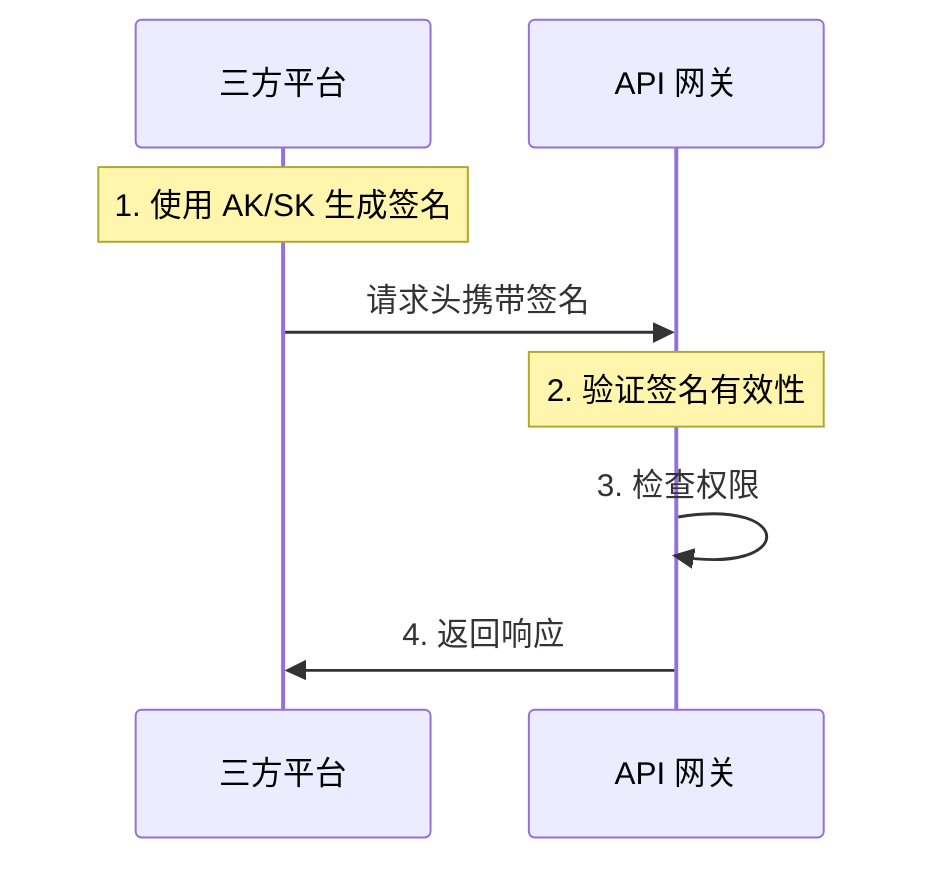

**签名生成规则**:
1. 按字典序排序请求参数
2. 拼接参数和 SK 生成签名字符串
3. 使用 HMAC-SHA256 计算签名
4. 将签名放入请求头 `X-Signature`

#### 5.1.3 错误码规范

| 错误码 | HTTP 状态码 | 含义 | 处理建议 |
|--------|-----------|------|---------|
| SUCCESS | 200 | 成功 | - |
| INVALID_PARAM | 400 | 请求参数错误 | 检查请求参数 |
| UNAUTHORIZED | 401 | 认证失败 | 检查 AK/SK |
| FORBIDDEN | 403 | 权限不足 | 申请数据订阅 |
| NOT_FOUND | 404 | 资源不存在 | 检查资源 ID |
| RATE_LIMIT | 429 | 请求超限 | 降低调用频率 |
| INTERNAL_ERROR | 500 | 服务器错误 | 联系平台支持 |

#### 5.1.4 响应格式

```json
{
  "code": "SUCCESS",
  "message": "操作成功",
  "data": {},
  "timestamp": "2026-04-07T10:00:00Z",
  "traceId": "abc123"
}
```

### 5.2 事件订阅规范

#### 5.2.1 事件格式

```json
{
  "eventId": "string",
  "eventType": "string",
  "eventTime": "ISO8601",
  "dataSource": "string",
  "dataVersion": "string",
  "data": {}
}
```

**事件类型示例**:
- `user.created` - 用户创建
- `user.updated` - 用户信息更新
- `department.created` - 部门创建
- `message.sent` - 消息发送

#### 5.2.2 推送流程


**重试策略**:
- 第 1 次重试：1 分钟后
- 第 2 次重试：5 分钟后
- 第 3 次重试：30 分钟后
- 3 次失败后标记为投递失败，通知订阅方

### 5.3 API 接口清单

#### 5.3.1 数据管理 API

| 接口 | 方法 | 描述 | 权限 |
|------|------|------|------|
| `/api/v1/data-objects` | GET | 获取数据对象列表 | 已认证 |
| `/api/v1/data-objects/{id}` | GET | 获取数据对象详情 | 已订阅 |
| `/api/v1/data-objects` | POST | 注册数据对象 | 数据 Owner |
| `/api/v1/data-objects/{id}` | PUT | 更新数据对象 | 数据 Owner |
| `/api/v1/data-objects/{id}/status` | PATCH | 变更数据状态 | 平台管理员 |

#### 5.3.2 应用管理 API

| 接口 | 方法 | 描述 | 权限 |
|------|------|------|------|
| `/api/v1/apps` | GET | 获取应用列表 | 已认证 |
| `/api/v1/apps` | POST | 创建应用 | 已认证 |
| `/api/v1/apps/{id}` | GET | 获取应用详情 | 应用所有者 |
| `/api/v1/apps/{id}/credentials` | POST | 刷新 AK/SK | 应用所有者 |
| `/api/v1/apps/{id}` | DELETE | 删除应用 | 应用所有者 |

#### 5.3.3 订阅管理 API

| 接口 | 方法 | 描述 | 权限 |
|------|------|------|------|
| `/api/v1/subscriptions` | GET | 获取订阅列表 | 已认证 |
| `/api/v1/subscriptions` | POST | 创建订阅 | 已认证 |
| `/api/v1/subscriptions/{id}` | GET | 获取订阅详情 | 订阅所有者 |
| `/api/v1/subscriptions/{id}` | DELETE | 取消订阅 | 订阅所有者 |
| `/api/v1/subscriptions/{id}/approve` | POST | 审批订阅 | 数据 Owner/管理员 |

#### 5.3.4 审计日志 API

| 接口 | 方法 | 描述 | 权限 |
|------|------|------|------|
| `/api/v1/audit-logs` | GET | 查询审计日志 | 平台管理员 |
| `/api/v1/audit-logs/export` | POST | 导出审计日志 | 平台管理员 |
| `/api/v1/usage-stats` | GET | 获取用量统计 | 数据 Owner/应用所有者 |

---

## 六、非功能性需求

### 6.1 性能需求

| 指标 | 要求 | 说明 |
|------|------|------|
| **API 响应时间** | P95 < 500ms | 95% 的 API 调用在 500ms 内返回 |
| **API 响应时间** | P99 < 1000ms | 99% 的 API 调用在 1000ms 内返回 |
| **事件推送延迟** | < 5 秒 | 数据变更后 5 秒内推送给订阅方 |
| **并发能力** | 支持 1000+ QPS | 支持高并发 API 调用 |
| **数据同步延迟** | 分钟级 | 批量数据同步延迟在分钟级别 |

### 6.2 安全需求

| 要求 | 说明 | 验收标准 |
|------|------|---------|
| **认证安全** | AK/SK 签名认证，支持定期轮换 | SK 加密存储，支持手动/自动轮换 |
| **传输安全** | 全链路 HTTPS 加密 | TLS 1.2+，禁用弱加密算法 |
| **权限控制** | 细粒度权限控制，最小权限原则 | 未授权访问 100% 拦截 |
| **审计追溯** | 完整的操作审计日志，保留至少 6 个月 | 所有操作可追溯，日志不可篡改 |
| **数据脱敏** | 敏感数据按需脱敏后开放 | 支持配置化脱敏规则 |
| **防重放攻击** | 请求签名包含时间戳，防止重放 | 时间窗口外请求拒绝 |
| **防爬机制** | 限流、频次控制 | 支持配置限流策略 |

### 6.3 可用性需求

| 指标 | 要求 | 说明 |
|------|------|------|
| **系统可用性** | 99.9% | 年度停机时间 < 8.76 小时 |
| **故障恢复时间** | < 30 分钟 | MTTR < 30 分钟 |
| **数据备份** | 每日备份，保留 30 天 | 支持增量备份 |
| **灾难恢复** | 支持异地容灾 | RTO < 4 小时，RPO < 1 小时 |

### 6.4 可扩展性需求

| 要求 | 说明 |
|------|------|
| **水平扩展** | 支持水平扩展以应对业务增长 |
| **数据域扩展** | 支持新数据域快速接入 |
| **开放形式扩展** | 支持新增数据开放形式 |
| **审批流程扩展** | 支持审批流程灵活配置 |
| **插件化架构** | 支持插件化扩展认证、授权、审计等模块 |

### 6.5 兼容性需求

| 要求 | 说明 |
|------|------|
| **API 版本** | 支持 API 版本管理，向后兼容至少 2 个大版本 |
| **消息平台** | 复用企业内部消息平台 |
| **API 网关** | 复用现有 API 网关 |
| **浏览器兼容** | 管理后台支持主流浏览器（Chrome、Firefox、Safari、Edge 最新版本） |

### 6.6 可维护性需求

| 要求 | 说明 |
|------|------|
| **日志规范** | 统一日志格式，支持 ELK 收集分析 |
| **监控告警** | 关键指标监控，异常自动告警 |
| **配置管理** | 配置与代码分离，支持动态配置 |
| **文档完整性** | API 文档、部署文档、运维文档完整 |

---

## 七、开放问题与待决策事项

### 7.1 待决策事项

| 问题 ID | 问题 | 说明 | 优先级 | 责任方 | 建议方案 |
|--------|------|------|--------|--------|---------|
| **OD-001** | 数据资产清单 | XX 平台内部有哪些数据对象，需要梳理统一清单 | P1 | 数据 Owner | 组织各业务模块负责人梳理数据对象清单 |
| **OD-002** | 敏感度定级标准 | 需要建立统一的数据敏感度分级标准 | P1 | 安全合规 | 参考行业标准，结合企业实际制定 |
| **OD-003** | 审批人配置 | 各角色的具体审批人需要明确 | P1 | 平台运营 | 建立审批人映射表，支持动态配置 |
| **OD-004** | 服务化改造范围 | open-app 现有能力的服务化改造范围评估 | P2 | 技术团队 | 优先改造权限中心和 OAuth 2.0 |

### 7.2 待调研事项

| 事项 ID | 事项 | 说明 | 优先级 | 状态 |
|--------|------|------|--------|------|
| **OR-001** | 消费方业务场景 | 三方平台具体想用数据做什么业务 | P1 | ⏳ 待调研 |
| **OR-002** | 当前替代方案 | 没有平台之前，三方平台如何获取数据 | P1 | ⏳ 待调研 |
| **OR-003** | 具体 AI 应用规划 | 企业内部是否有具体的 AI 应用需求 | P2 | ⏳ 待调研 |

### 7.3 外部依赖

| 依赖项 | 说明 | 状态 | 负责人 |
|--------|------|------|--------|
| **API 网关** | 复用现有 API 网关能力 | ✅ 可用 | 技术团队 |
| **事件订阅** | 复用现有事件订阅能力 | ✅ 可用 | 技术团队 |
| **文档中心** | 复用现有文档中心 | ✅ 可用 | 技术团队 |
| **内部消息平台** | 用于事件推送 | ⏳ 待对接 | 技术团队 |
| **权限中心** | 需要服务化改造 | ⏳ 待改造 | 技术团队 |
| **OAuth 2.0** | 需要服务化改造 | ⏳ 待改造 | 技术团队 |

### 7.4 风险与缓解

| 风险 ID | 风险 | 影响 | 概率 | 缓解措施 |
|--------|------|------|------|---------|
| **RSK-001** | 数据 Owner 担心数据安全责任 | 高 | 中 | 提供完善的权限控制和审计日志，明确责任边界 |
| **RSK-002** | 数据分级标准难以统一 | 中 | 中 | 支持可配置的分级标准，允许逐步完善 |
| **RSK-003** | 服务化改造工作量大 | 中 | 中 | 分阶段实施，优先核心能力 |
| **RSK-004** | 业务决策流程复杂 | 中 | 中 | 全流程线上审批，明确各角色职责，设置审批 SLA |

---

## 附录

### A. 术语表

| 术语 | 定义 |
|------|------|
| **数据 Owner** | 业务模块负责人，拥有数据对象的管理权和开放决策权 |
| **AK/SK** | Access Key / Secret Key，API 访问凭证，用于签名认证 |
| **数据对象** | 数据开放的最小粒度单位（如：用户数据、组织架构、IM 消息） |
| **敏感度级别** | 数据敏感程度的分级（L1-L5），决定审批流程和开放策略 |
| **事件订阅** | 数据变更时主动推送给订阅方的机制，通过企业内部消息平台实现 |
| **三方平台** | 企业内部除 XX 通讯平台外的其他自研系统（如：客服系统、人事系统） |
| **数据目录** | 展示所有可订阅数据的列表，支持搜索和分类 |
| **数据字典** | 描述数据含义、结构、来源、使用建议的元数据文档 |

### B. 参考资料

- [需求挖掘报告](./discovery-report.md)
- [分析笔记](./discovery-analysis.md)
- [Discovery Session Log](./discovery-session-log.md)
- [飞书开放平台数据价值赋能报告](../../../docs/feishu-dingtalk-data-value-research/飞书开放平台数据价值赋能报告.md)
- [钉钉开放平台数据价值赋能报告](../../../docs/feishu-dingtalk-data-value-research/钉钉开放平台数据价值赋能报告.md)
- [飞书 vs 钉钉开放平台数据价值对比报告](../../../docs/feishu-dingtalk-data-value-research/飞书 vs 钉钉开放平台数据价值对比报告.md)
- [代码仓库](https://github.com/give-my-dreams/OpenPlatform)

### C. 修订记录

| 版本 | 日期 | 修订内容 | 修订人 |
|------|------|---------|--------|
| v1.0 | 2026-04-07 | 初始版本 - 基于 discovery 报告创建正式规范 | SDD 规范编写专家 |
| v2.0 | 2026-04-07 | 覆盖重生成 - 整合 discovery 阶段完整产出，增强功能需求规格、核心流程设计、数据治理规范、接口规范等章节 | SDD 规范编写专家 |
| v2.1 | 2026-04-07 | 文档引用更新 - 更新 session-log.md 为 discovery-session-log.md | SDD 规范编写专家 |

### D. 文档审批

| 角色 | 姓名 | 审批日期 | 意见 |
|------|------|---------|------|
| 产品负责人 | - | - | - |
| 技术负责人 | - | - | - |
| 安全合规 | - | - | - |

---

**文档状态**: ✅ 规范编写完成  
**下一步**: 运行 `@sdd-plan 数据开放平台` 开始技术规划
