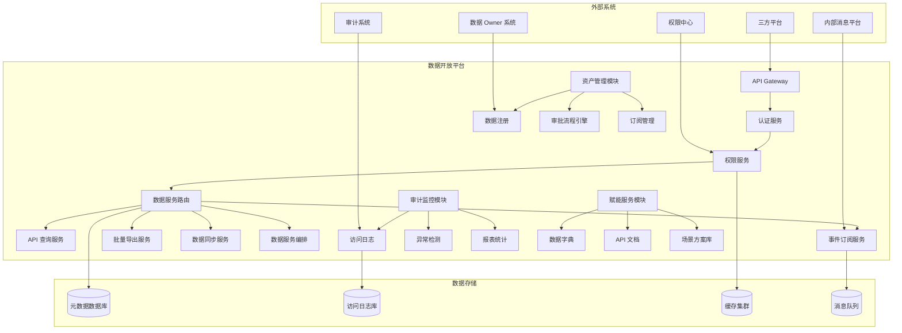
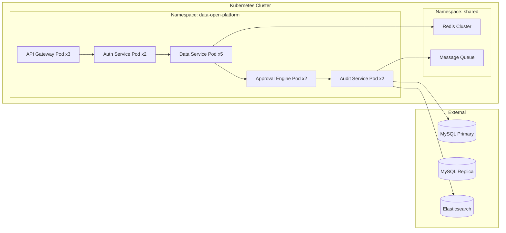

# 数据开放平台 Feature Specification

## 1. 元数据 (Metadata)

| 字段 | 值 |
|------|-----|
| **Feature 名称** | 数据开放平台 |
| **Feature ID** | FR-DATA-OPEN-001 |
| **状态** | specified |
| **优先级** | P0 |
| **创建日期** | 2026-04-07 |
| **最后更新** | 2026-04-07 |
| **作者** | SDD Spec Team |
| **干系人** | 数据 Owner、开放平台管理员、三方平台业务方、安全合规团队、CTO 办公室 |
| **所属系统** | open-app 子平台 |
| **依赖文档** | API 网关文档、权限中心文档、OAuth 2.0 规范 |

---

## 2. 问题陈述 (Problem Statement)

### 2.1 背景

XX 通信平台积累了大量业务数据资产，但当前这些数据被封闭在平台内部，无法被企业内其他系统有效消费和利用。

### 2.2 核心痛点

| 痛点 | 描述 | 影响 |
|------|------|------|
| **能力封闭** | XX 平台能力被困在系统内部 | 数据价值无法最大化 |
| **缺少标准通道** | 无统一标准的数据消费通道 | 各系统重复建设对接能力 |
| **数据资产不清** | 无统一数据对象清单和敏感度定义 | 数据管理混乱，安全风险高 |
| **接入效率低** | 三方平台接入成本高 | 业务创新受阻，集成周期长 |

### 2.3 业务价值

建设数据开放平台，实现：
1. **数据成功开放出去** - 数据被有效消费
2. **数据接入使用很便捷** - 降低三方平台接入成本
3. **整个流程安全可控合规** - 满足企业安全和合规要求

---

## 3. 目标与非目标 (Goals & Non-Goals)

### 3.1 目标 (Goals)

| ID | 目标 | 衡量标准 |
|----|------|----------|
| G-01 | 建立统一数据开放通道 | 所有数据开放请求通过平台处理 |
| G-02 | 实现数据资产可视化管理 | 完整数据对象清单，100% 敏感度标注 |
| G-03 | 建立动态审批机制 | 根据敏感度自动路由审批链 |
| G-04 | 支持多种数据开放形式 | API、事件订阅、批量导出、数据同步、数据服务 |
| G-05 | 实现全流程审计 | 所有数据访问行为可追溯 |
| G-06 | 提供数据价值赋能 | 数据字典、数据地图、API 文档、场景解决方案 |

### 3.2 非目标 (Non-Goals)

| ID | 非目标 | 说明 |
|----|--------|------|
| NG-01 | 不涉及计费功能 | 企业内使用，无需计费 |
| NG-02 | 不替代现有 API Center | 是对 API Center 的数据开放增强 |
| NG-03 | 不处理 L5 级数据开放 | L5 机密数据不在开放范围内 |
| NG-04 | 不涉及跨企业数据开放 | 仅限企业内部系统 |
| NG-05 | 不建设独立用户体系 | 复用 open-app 应用管理体系 |

---

## 4. 用户故事 (User Stories)

| ID | 角色 | 故事 | 价值 |
|----|------|------|------|
| US-01 | 数据 Owner | 作为数据 Owner，我想要注册我的数据资产，以便其他系统可以使用我的数据 | 数据资产化，价值释放 |
| US-02 | 数据 Owner | 作为数据 Owner，我想要设置数据的敏感度级别，以便控制数据的开放范围 | 数据安全管控 |
| US-03 | 平台管理员 | 作为平台管理员，我想要审批数据注册申请，以便确保数据合规开放 | 合规管控 |
| US-04 | 平台管理员 | 作为平台管理员，我想要查看数据开放审计日志，以便追踪数据使用情况 | 安全审计 |
| US-05 | 三方平台业务方 | 作为三方平台业务方，我想要浏览可开放的数据目录，以便找到我需要的数据 | 快速发现数据 |
| US-06 | 三方平台业务方 | 作为三方平台业务方，我想要订阅数据服务，以便在我的系统中使用数据 | 业务集成 |
| US-07 | 三方平台业务方 | 作为三方平台业务方，我想要查看完善的 API 文档，以便快速接入数据 | 降低接入成本 |
| US-08 | 三方平台业务方 | 作为三方平台业务方，我想要获取场景化解决方案，以便参考最佳实践 | 加速业务落地 |
| US-09 | 安全合规人员 | 作为安全合规人员，我想要参与 L3 及以上数据的审批，以便确保数据安全 | 风险管控 |
| US-10 | CTO 办公室 | 作为 CTO 办公室，我想要审批高敏感度数据开放，以便把控整体风险 | 战略风险管控 |

---

## 5. 功能需求 (Functional Requirements)

### 5.1 数据资产管理

#### FR-001: 数据对象注册
**描述**: 数据 Owner 可以注册数据对象到开放平台

**验收标准**:
- [ ] 数据 Owner 可以通过界面提交数据注册申请
- [ ] 注册表单包含：数据名称、数据描述、数据 Owner、敏感度级别、数据形式（API/事件/批量等）
- [ ] 系统自动校验必填字段完整性
- [ ] 注册申请提交后状态为"待审批"
- [ ] 支持上传数据 schema 定义文件（JSON Schema 或 Protobuf）

#### FR-002: 数据敏感度分级
**描述**: 系统支持 5 级数据敏感度分类，并在注册时强制选择

**验收标准**:
- [ ] L1-公开：企业内所有用户可见（如组织架构、部门名称）
- [ ] L2-内部：内部使用（如用户基本信息、邮箱、电话）
- [ ] L3-敏感：隐私或业务敏感（如薪资、绩效、考勤）
- [ ] L4-个人：个人隐私数据（如聊天记录、日历、私人文件）
- [ ] L5-机密：商业秘密、战略信息（不可开放，仅展示提示）
- [ ] 选择 L5 时系统提示"L5 级数据不可开放"

#### FR-003: 数据资产目录
**描述**: 提供可浏览的数据资产目录，展示所有可开放数据

**验收标准**:
- [ ] 目录按业务域分类展示（如组织、人事、财务、客户等）
- [ ] 每个数据对象展示：名称、描述、敏感度、Owner、更新时间
- [ ] 支持按敏感度级别筛选
- [ ] 支持按业务域筛选
- [ ] 支持关键字搜索
- [ ] L3 及以上数据对未授权用户隐藏详细信息

### 5.2 动态审批流程

#### FR-004: 敏感度驱动的审批链
**描述**: 根据数据敏感度级别自动路由不同的审批链

**验收标准**:
- [ ] L1-L2 数据：2 级审批（业务负责人 → 平台管理员）
- [ ] L3-L4 数据：4 级审批（业务负责人 → 上级/CTO → 安全合规 → 平台管理员）
- [ ] L5 数据：5 级审批（业务负责人 → CTO → 安全合规 → CTO 最终审批 → 平台管理员），但 L5 不可开放
- [ ] 审批链配置可在后台管理
- [ ] 审批人可通过站内信/邮件收到审批通知

#### FR-005: 在线审批操作
**描述**: 所有审批环节在平台上在线完成

**验收标准**:
- [ ] 审批人可在待办列表查看待审批申请
- [ ] 审批详情展示完整的注册信息
- [ ] 审批操作支持：通过、拒绝、转交、加签
- [ ] 拒绝时必须填写拒绝原因
- [ ] 审批历史记录完整保存
- [ ] 审批状态实时同步给申请人

#### FR-006: 审批超时处理
**描述**: 审批节点超时自动处理机制

**验收标准**:
- [ ] 每个审批节点可配置超时时间（默认 3 个工作日）
- [ ] 超时前 1 天自动提醒审批人
- [ ] 超时后自动升级到审批人的上级
- [ ] 升级记录计入审批历史

### 5.3 数据开放服务

#### FR-007: API 查询服务
**描述**: 提供 RESTful API 方式的数据查询服务

**验收标准**:
- [ ] 每个注册的数据对象自动生成 API 端点
- [ ] API 支持标准 HTTP 方法（GET/POST）
- [ ] API 支持分页参数（page, pageSize）
- [ ] API 支持条件过滤参数
- [ ] API 响应格式统一为 JSON
- [ ] API 返回包含请求 ID 用于问题追踪

#### FR-008: 事件订阅服务
**描述**: 通过内部消息平台提供数据变更事件订阅

**验收标准**:
- [ ] 数据 Owner 可配置数据变更事件触发规则
- [ ] 订阅方可订阅特定数据对象的事件
- [ ] 事件推送通过企业内部消息平台
- [ ] 事件消息包含：事件类型、数据对象、变更内容摘要、时间戳
- [ ] 支持事件重放（最近 7 天）

#### FR-009: 批量导出服务
**描述**: 支持大数据量的批量导出

**验收标准**:
- [ ] 支持异步批量导出任务
- [ ] 导出格式支持：CSV、Excel、JSON
- [ ] 导出任务完成后通知申请人
- [ ] 导出文件通过安全链接下载（带有效期）
- [ ] 单次导出上限 100 万条记录，超量需分批

#### FR-010: 数据同步服务
**描述**: 支持定时数据同步到订阅方系统

**验收标准**:
- [ ] 支持配置同步频率（实时、每小时、每天、每周）
- [ ] 支持全量同步和增量同步
- [ ] 同步目标支持：数据库、文件存储、API 回调
- [ ] 同步失败自动重试（最多 3 次）
- [ ] 同步状态可监控

#### FR-011: 数据服务编排
**描述**: 支持将多个数据对象组合成数据服务

**验收标准**:
- [ ] 支持可视化服务编排界面
- [ ] 支持数据对象间的关联配置
- [ ] 支持数据转换和聚合操作
- [ ] 编排后的服务可作为一个整体对外提供
- [ ] 服务版本管理（v1, v2, ...）

### 5.4 订阅与授权

#### FR-012: 数据订阅申请
**描述**: 三方平台可申请订阅数据服务

**验收标准**:
- [ ] 订阅申请表单包含：应用场景、使用目的、预计调用量、数据使用期限
- [ ] 一个申请可包含多个数据对象
- [ ] 申请提交后进入审批流程
- [ ] 申请状态可追踪（待审批、已通过、已拒绝）

#### FR-013: 订阅审批流程
**描述**: 数据订阅申请需要审批

**验收标准**:
- [ ] 审批人包括：数据 Owner、平台管理员
- [ ] L3 及以上数据需要安全合规审批
- [ ] 审批通过自动生成访问凭证（API Key/Secret）
- [ ] 审批拒绝时通知申请人并说明原因

#### FR-014: 访问凭证管理
**描述**: 管理数据访问的认证凭证

**验收标准**:
- [ ] 每个订阅申请生成独立的 API Key 和 Secret
- [ ] 支持凭证轮换（手动和自动）
- [ ] 支持凭证禁用和启用
- [ ] 支持凭证过期时间设置
- [ ] 凭证泄露时可紧急撤销

#### FR-015: 权限粒度控制
**描述**: 支持细粒度的数据访问权限控制

**验收标准**:
- [ ] 支持按数据对象授权
- [ ] 支持按操作类型授权（读、写、导出）
- [ ] 支持按时间范围授权
- [ ] 支持按调用频率授权（QPS 限制）
- [ ] 支持按数据量授权（月度配额）

### 5.5 数据价值赋能

#### FR-016: 数据字典
**描述**: 提供完整的数据字典，帮助理解数据结构

**验收标准**:
- [ ] 每个数据对象有详细字段说明
- [ ] 字段说明包含：字段名、类型、描述、是否必填、示例值
- [ ] 支持字段血缘关系展示
- [ ] 支持数据预览功能（脱敏后）

#### FR-017: 数据地图
**描述**: 可视化展示数据资产分布和关系

**验收标准**:
- [ ] 按业务域展示数据分布
- [ ] 展示数据对象间的关联关系
- [ ] 展示数据流向（从 Owner 到消费方）
- [ ] 支持钻取查看详细信息

#### FR-018: API 文档中心
**描述**: 提供完善的 API 使用文档

**验收标准**:
- [ ] 每个 API 端点有独立文档页
- [ ] 文档包含：请求方法、URL、请求参数、响应格式、错误码
- [ ] 提供在线调试功能（Try it out）
- [ ] 提供多语言 SDK 示例代码
- [ ] 文档版本与 API 版本对应

#### FR-019: 场景解决方案库
**描述**: 提供典型场景的解决方案参考

**验收标准**:
- [ ] 按场景分类（业务集成、功能嵌入、数据分析、第三方服务、合规审计）
- [ ] 每个方案包含：场景描述、涉及数据、架构图、实施步骤
- [ ] 支持方案收藏和评论
- [ ] 支持方案下载（PDF）

#### FR-020: 技术咨询支持
**描述**: 提供数据接入的技术咨询服务

**验收标准**:
- [ ] 提供在线咨询入口
- [ ] 支持问题工单提交
- [ ] 工单分配给对应数据 Owner 或平台管理员
- [ ] 工单状态可追踪
- [ ] 常见问题形成 FAQ 库

### 5.6 审计与监控

#### FR-021: 访问日志记录
**描述**: 记录所有数据访问行为

**验收标准**:
- [ ] 记录每次 API 调用的：时间、调用方、数据对象、请求参数摘要、响应状态
- [ ] 日志存储至少 180 天
- [ ] 日志不可篡改
- [ ] 支持按时间、调用方、数据对象查询日志

#### FR-022: 异常行为检测
**描述**: 检测并告警异常访问行为

**验收标准**:
- [ ] 检测异常高频调用（超过配额）
- [ ] 检测异常时间访问（非工作时间）
- [ ] 检测异常数据量导出
- [ ] 检测到异常时自动告警（站内信 + 邮件）
- [ ] 支持自动临时封禁异常调用方

#### FR-023: 审计报表
**描述**: 提供数据开放审计报表

**验收标准**:
- [ ] 按日/周/月生成访问统计报表
- [ ] 展示 TOP10 热门数据对象
- [ ] 展示 TOP10 活跃调用方
- [ ] 展示审批通过率统计
- [ ] 支持报表导出（PDF/Excel）

#### FR-024: 实时监控看板
**描述**: 实时展示数据开放平台运行状态

**验收标准**:
- [ ] 展示当前 QPS、今日调用量、今日订阅数
- [ ] 展示各数据对象健康状态
- [ ] 展示审批队列长度
- [ ] 展示系统错误率
- [ ] 数据每 30 秒刷新

### 5.7 平台管理

#### FR-025: 角色与权限管理
**描述**: 管理平台用户的角色和权限

**验收标准**:
- [ ] 预置角色：数据 Owner、平台管理员、安全合规员、三方平台用户
- [ ] 支持自定义角色
- [ ] 支持角色权限配置
- [ ] 支持用户角色分配
- [ ] 支持角色继承关系

#### FR-026: 审批链配置
**描述**: 配置不同场景的审批流程

**验收标准**:
- [ ] 可配置各敏感度级别的审批节点
- [ ] 可配置每个节点的审批人（按角色或具体人员）
- [ ] 可配置审批超时时间
- [ ] 可配置审批升级规则
- [ ] 审批链变更需要平台管理员确认

#### FR-027: 系统配置管理
**描述**: 管理平台全局配置

**验收标准**:
- [ ] 可配置 API 调用频率默认限制
- [ ] 可配置批量导出上限
- [ ] 可配置日志保留时间
- [ ] 可配置通知模板
- [ ] 配置变更需要审计日志

---

## 6. 非功能需求 (Non-Functional Requirements)

### 6.1 性能要求

| ID | 需求 | 指标 |
|----|------|------|
| NFR-001 | API 响应时间 | P95 < 200ms，P99 < 500ms |
| NFR-002 | 系统吞吐量 | 支持 1000 QPS 并发调用 |
| NFR-003 | 批量导出性能 | 100 万条记录导出时间 < 10 分钟 |
| NFR-004 | 事件推送延迟 | 数据变更后 < 5 秒推送到订阅方 |
| NFR-005 | 页面加载时间 | 首屏加载 < 2 秒 |

### 6.2 安全要求

| ID | 需求 | 指标 |
|----|------|------|
| NFR-006 | 认证方式 | 强制 OAuth 2.0，支持 API Key/Secret |
| NFR-007 | 传输加密 | 所有 API 强制 HTTPS（TLS 1.3） |
| NFR-008 | 数据脱敏 | L3 及以上数据查询结果自动脱敏 |
| NFR-009 | 访问控制 | 基于 RBAC 的细粒度权限控制 |
| NFR-010 | 审计合规 | 100% 访问行为可追溯，日志不可篡改 |
| NFR-011 | 凭证安全 | API Secret 加密存储，支持轮换 |
| NFR-012 | 防重放攻击 | API 请求带时间戳和签名，5 分钟有效期 |

### 6.3 可用性要求

| ID | 需求 | 指标 |
|----|------|------|
| NFR-013 | 系统可用性 | 99.9%（工作日 9:00-21:00） |
| NFR-014 | 故障恢复时间 | RTO < 30 分钟，RPO < 5 分钟 |
| NFR-015 | 服务降级 | 核心功能优先保障，非核心功能可降级 |
| NFR-016 | 容灾能力 | 支持跨可用区部署 |

### 6.4 兼容性要求

| ID | 需求 | 指标 |
|----|------|------|
| NFR-017 | API 版本兼容 | 支持至少 2 个历史版本，平滑迁移 |
| NFR-018 | 浏览器兼容 | Chrome、Firefox、Safari、Edge 最新 2 个版本 |
| NFR-019 | 内部系统集成 | 与企业内部消息平台、权限中心无缝集成 |
| NFR-020 | 数据格式兼容 | 支持 JSON、XML、CSV、Excel 多种格式 |

### 6.5 可扩展性要求

| ID | 需求 | 指标 |
|----|------|------|
| NFR-021 | 水平扩展 | 支持通过增加节点线性提升处理能力 |
| NFR-022 | 数据对象数量 | 支持 10000+ 数据对象注册 |
| NFR-023 | 订阅方数量 | 支持 500+ 三方平台订阅 |
| NFR-024 | 审批流程扩展 | 支持自定义审批节点和条件 |

---

## 7. 技术设计 (Technical Design)

### 7.1 系统架构



### 7.2 数据模型

#### 核心实体

```
DataObject (数据对象)
├── id: string
├── name: string
├── description: string
├── ownerId: string (数据 Owner)
├── sensitivityLevel: enum (L1-L5)
├── dataForm: enum (API/Event/Batch/Sync/Service)
├── schema: json (数据结构定义)
├── status: enum (Draft/Pending/Approved/Rejected/Offline)
├── createdAt: datetime
├── updatedAt: datetime
└── version: string

Subscription (订阅申请)
├── id: string
├── applicantId: string (申请方)
├── dataObjectIds: string[] (申请的数据对象)
├── scenario: string (应用场景)
├── purpose: string (使用目的)
├── estimatedQPS: number
├── duration: dateRange (使用期限)
├── status: enum (Pending/Approved/Rejected/Revoked)
├── apiCredentials: object (API Key/Secret)
├── createdAt: datetime
└── approvedAt: datetime

ApprovalRecord (审批记录)
├── id: string
├── targetType: enum (DataObject/Subscription)
├── targetId: string
├── currentLevel: number (当前审批级别)
├── approvalChain: json (审批链配置)
├── records: array (审批历史)
│   ├── approverId: string
│   ├── action: enum (Approve/Reject/Transfer/AddSign)
│   ├── comment: string
│   ├── timestamp: datetime
│   └── result: enum (Pass/Reject)
├── status: enum (Pending/Approved/Rejected/Escalated)
└── createdAt: datetime

AccessLog (访问日志)
├── id: string
├── subscriptionId: string
├── dataObjectId: string
├── callerId: string
├── apiEndpoint: string
├── requestParams: json (脱敏)
├── responseStatus: number
├── responseSize: number
├── duration: number (ms)
├── ipAddress: string
├── userAgent: string
└── timestamp: datetime
```

### 7.3 API 设计

#### 核心 API 端点

```yaml
# 数据资产管理
POST   /api/v1/data-objects              # 注册数据对象
GET    /api/v1/data-objects              # 查询数据对象列表
GET    /api/v1/data-objects/{id}         # 获取数据对象详情
PUT    /api/v1/data-objects/{id}         # 更新数据对象
DELETE /api/v1/data-objects/{id}         # 删除数据对象

# 订阅管理
POST   /api/v1/subscriptions            # 提交订阅申请
GET    /api/v1/subscriptions            # 查询订阅列表
GET    /api/v1/subscriptions/{id}       # 获取订阅详情
PUT    /api/v1/subscriptions/{id}       # 更新订阅
DELETE /api/v1/subscriptions/{id}       # 撤销订阅

# 审批管理
GET    /api/v1/approvals/pending        # 获取待办审批
POST   /api/v1/approvals/{id}/decision  # 审批决策
GET    /api/v1/approvals/{id}/history   # 获取审批历史

# 数据服务
GET    /api/v1/data/{objectKey}         # 查询数据（调用方使用）
POST   /api/v1/data/{objectKey}/export  # 批量导出
POST   /api/v1/data/{objectKey}/sync    # 配置数据同步

# 审计日志
GET    /api/v1/audit/logs               # 查询访问日志
GET    /api/v1/audit/reports            # 获取审计报表
```

### 7.4 第三方依赖

| 依赖 | 用途 | 状态 |
|------|------|------|
| open-app 应用管理 | 用户和应用管理 | 已存在，直接复用 |
| open-app API Gateway | API 网关和路由 | 已存在，直接复用 |
| open-app 事件订阅 | 内部消息推送 | 已存在，直接复用 |
| open-app 文档中心 | API 文档托管 | 已存在，直接复用 |
| 权限中心 | RBAC 权限控制 | 需升级，支持细粒度授权 |
| OAuth 2.0 服务 | 认证授权 | 需升级，目前离线代码需上线 |
| 企业内部消息平台 | 审批通知、事件推送 | 已存在，需对接 |
| 审计系统 | 日志归档和合规审计 | 已存在，需对接 |

### 7.5 部署架构



---

## 8. 边界情况 (Edge Cases)

### 8.1 错误处理

| ID | 场景 | 处理方式 |
|----|------|----------|
| EC-001 | API 认证失败 | 返回 401，记录安全日志，连续 5 次失败临时封禁 15 分钟 |
| EC-002 | 权限不足 | 返回 403，不暴露具体权限信息 |
| EC-003 | 数据对象不存在 | 返回 404，对未授权用户统一返回"不存在" |
| EC-004 | 超过调用频率限制 | 返回 429，包含重试等待时间 |
| EC-005 | 超过数据量配额 | 返回 429，提示配额已用完，展示重置时间 |
| EC-006 | 后端服务超时 | 返回 504，自动重试 2 次，失败后降级返回缓存数据（如允许） |
| EC-007 | 数据库连接失败 | 返回 503，触发告警，自动切换只读模式 |
| EC-008 | 审批人不存在/离职 | 自动升级到审批人的上级，通知平台管理员 |

### 8.2 极端情况

| ID | 场景 | 处理方式 |
|----|------|----------|
| EC-009 | 并发审批冲突 | 使用乐观锁，先审批者生效，后审批者提示状态已变更 |
| EC-010 | 大量数据同时导出 | 排队处理，展示队列位置，支持取消任务 |
| EC-011 | 数据 Owner 离职 | 数据对象自动冻结，通知平台管理员重新分配 Owner |
| EC-012 | 凭证泄露紧急撤销 | 支持一键撤销所有凭证，5 分钟内生效 |
| EC-013 | 审批链配置错误 | 检测到环路或断链时拒绝保存，提示管理员检查 |
| EC-014 | 敏感数据误开放 | 支持紧急下架，立即停止所有 API 服务，通知所有订阅方 |

### 8.3 并发场景

| ID | 场景 | 处理方式 |
|----|------|----------|
| EC-015 | 同一数据对象多人同时编辑 | 使用版本控制，后提交者需要合并冲突 |
| EC-016 | 同一审批多人同时操作 | 第一个操作生效，其他操作提示"已处理" |
| EC-017 | 高并发 API 调用 | 限流保护，超出部分排队或拒绝 |
| EC-018 | 批量订阅申请 | 异步处理，提交后返回申请 ID，状态可查询 |

---

## 9. 开放问题 (Open Questions)

| ID | 问题 | 影响范围 | 建议决策时间 |
|----|------|----------|--------------|
| OQ-01 | L3/L4 数据审批的"上级"具体指哪个角色？ | 审批流程配置 | 开发前 |
| OQ-02 | 是否支持数据使用期限到期自动回收权限？ | 订阅管理 | 开发前 |
| OQ-03 | 数据同步服务是否支持双向同步？ | 数据同步服务 | 设计阶段 |
| OQ-04 | API 版本废弃策略和迁移通知机制？ | API 兼容性 | 设计阶段 |
| OQ-05 | 是否需要支持数据使用效果反馈机制？ | 数据价值评估 | 二期考虑 |
| OQ-06 | 敏感数据脱敏规则是否需要可配置？ | 数据安全 | 开发前 |
| OQ-07 | 是否需要对异常行为进行机器学习检测？ | 安全监控 | 二期考虑 |
| OQ-08 | 数据服务编排的复杂度上限？ | 服务编排 | 设计阶段 |

---

## 10. 附录

### 10.1 数据敏感度定义详情

| 级别 | 名称 | 定义 | 示例数据 | 开放范围 |
|------|------|------|----------|----------|
| L1 | 公开 | 企业内所有用户可访问 | 组织架构、部门名称、办公地点 | 无需审批 |
| L2 | 内部 | 工作需要可访问 | 员工基本信息、工作邮箱、工作电话 | 2 级审批 |
| L3 | 敏感 | 隐私或业务敏感 | 薪资、绩效、考勤、合同信息 | 4 级审批 |
| L4 | 个人 | 个人隐私数据 | 聊天记录、日历、私人文件、健康信息 | 4 级审批 |
| L5 | 机密 | 商业秘密、战略信息 | 并购计划、核心算法、客户名单 | 不可开放 |

### 10.2 典型数据消费场景

| 场景类型 | 描述 | 典型用例 |
|----------|------|----------|
| 业务系统集成 | 将数据集成到现有业务系统 | HR 系统同步组织架构、财务系统获取报销数据 |
| 应用功能嵌入 | 在第三方应用中嵌入 XX 平台功能 | CRM 中嵌入聊天功能、HR 招聘中嵌入面试安排 |
| 数据分析与 AI 应用 | 用于 BI 报表或 AI 模型训练 | 经营分析报表、AI 助手知识库 |
| 第三方服务集成 | 与外部硬件或服务集成 | 视频会议系统、日历同步、邮件系统 |
| 合规审计与监管 | 满足合规和审计要求 | 审计系统数据抽取、安全监控、法律合规 |

### 10.3 数据价值赋能工具

| 工具 | 功能 | 使用场景 |
|------|------|----------|
| 数据字典 | 字段级详细说明 | 理解数据结构 |
| 数据地图 | 可视化数据分布 | 发现相关数据 |
| 数据血缘 | 数据来源和流转 | 数据质量追溯 |
| 使用建议 | 最佳实践推荐 | 避免常见错误 |
| 数据预览 | 脱敏后样本查看 | 评估数据适用性 |
| API 文档 | 完整接口说明 | 开发接入 |
| 场景方案 | 典型场景参考 | 加速业务落地 |
| 技术咨询 | 专家支持 | 解决疑难问题 |

---

## 文档版本历史

| 版本 | 日期 | 作者 | 变更说明 |
|------|------|------|----------|
| v1.0 | 2026-04-07 | SDD Spec Team | 初始版本 |
