# 钉钉开放平台数据与能力开放调研报告

## 一、概述

钉钉开放平台是阿里巴巴旗下企业协作平台的开放生态，为企业提供通讯录、组织架构、日程、审批、消息等核心业务能力的开放接口。钉钉采用相对简化的权限管理机制，注重易用性和快速集成。

### 1.1 开放平台核心定位

钉钉开放平台的核心定位：
- **企业移动办公平台的开放生态**：提供组织管理、通讯录、考勤、审批等企业核心业务能力
- **简化权限管理**：相对飞书更简化的权限申请和审批流程，降低接入门槛
- **多场景应用支持**：支持企业内部应用、第三方应用、小程序等多种应用形态

### 1.2 应用类型

钉钉开放平台支持多种应用类型：

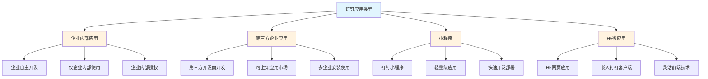

## 二、数据开放能力

### 2.1 数据开放架构

钉钉的数据开放采用基于应用权限范围的控制方式：

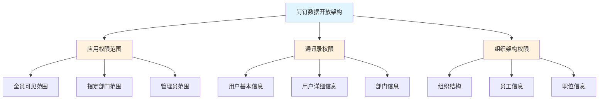

### 2.2 数据权限管理

#### 2.2.1 数据权限类型

钉钉的数据权限主要集中在通讯录和组织架构两大核心业务域：

| 业务域 | 权限说明 | 默认配置 | 配置方式 |
|--------|---------|---------|---------|
| **通讯录** | 应用可访问的通讯录数据范围（用户、部门） | 根据应用类型不同 | 企业管理员配置 |
| **组织架构** | 应用可访问的组织成员数据范围 | 根据应用类型不同 | 企业管理员配置 |
| **考勤数据** | 应用可访问的考勤记录数据 | 需申请权限 | 企业管理员配置 |
| **审批数据** | 应用可访问的审批实例数据 | 需申请权限 | 企业管理员配置 |
| **日程数据** | 应用可访问的日程信息 | 需申请权限 | 企业管理员配置 |

#### 2.2.2 数据权限配置流程

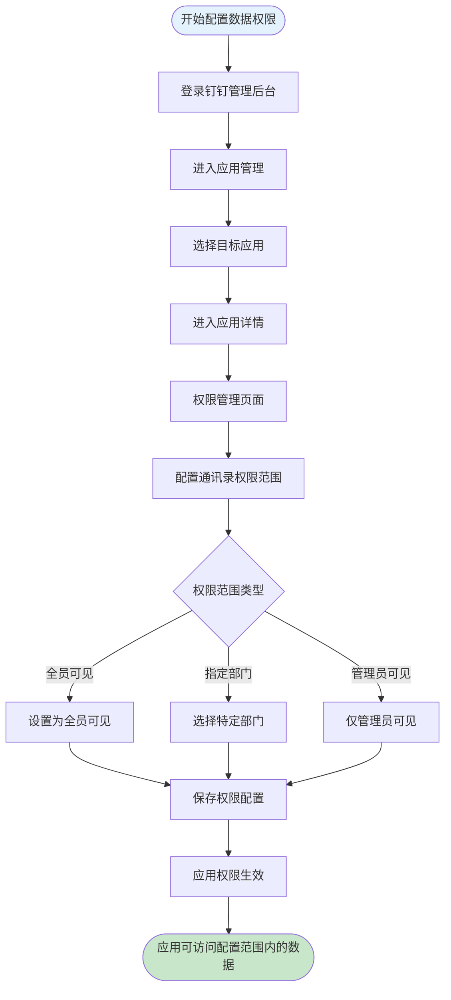

### 2.3 数据权限与应用类型的关系

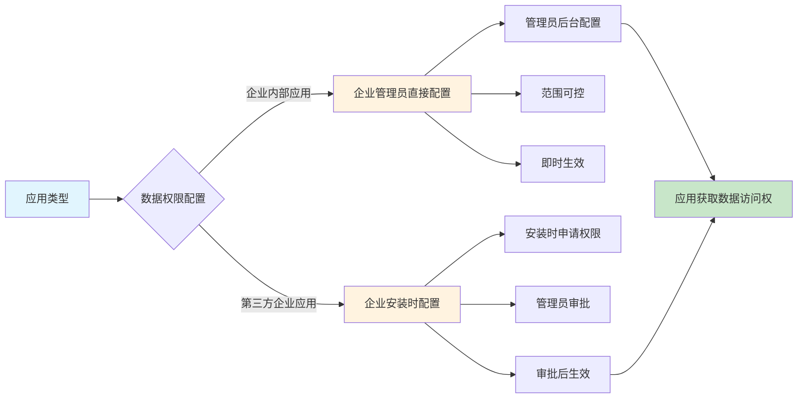

**关键差异点：**
- **企业内部应用**：企业管理员在后台直接配置数据访问范围，权限即时生效
- **第三方企业应用**：企业在安装应用时审批数据权限，审批通过后才生效

### 2.4 数据隔离机制

钉钉采用租户级数据隔离：

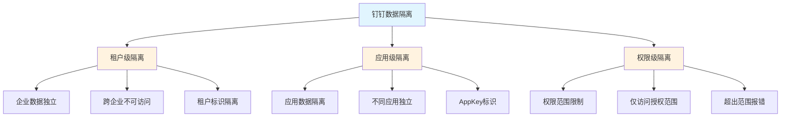

## 三、API开放能力

### 3.1 API权限体系

钉钉的API权限采用相对简化的Scope机制：

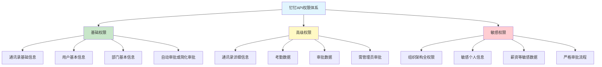

### 3.2 API权限级别

钉钉的API权限分为三个级别：

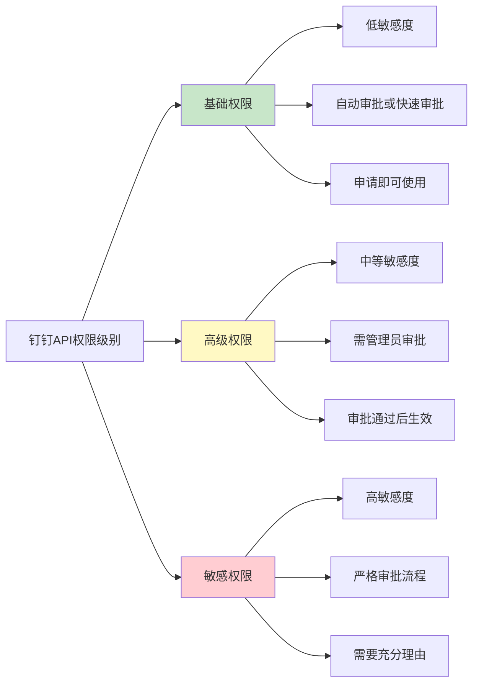

**权限级别对比：**

| 权限级别 | 敏感度 | 审批流程 | 使用场景 |
|---------|-------|---------|---------|
| **基础权限** | 低 | 自动审批或简化审批 | 获取基本信息、基本业务功能 |
| **高级权限** | 中 | 需管理员审批 | 访问业务数据、深度集成 |
| **敏感权限** | 高 | 严格审批流程 | 访问敏感数据、全量数据 |

### 3.3 API权限申请流程

#### 3.3.1 企业内部应用权限申请流程

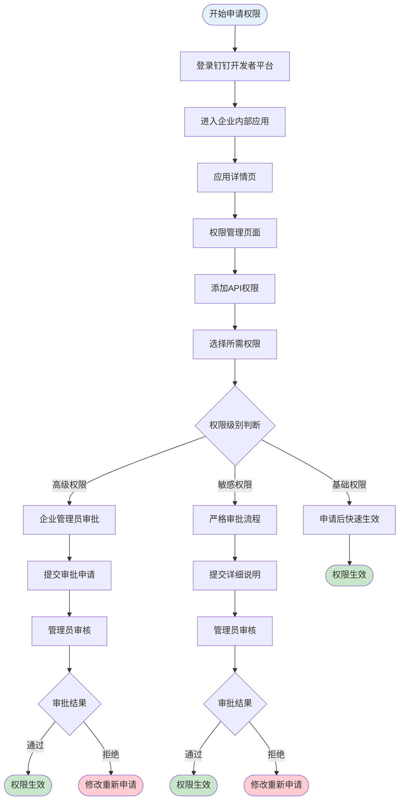

#### 3.3.2 第三方企业应用权限申请流程

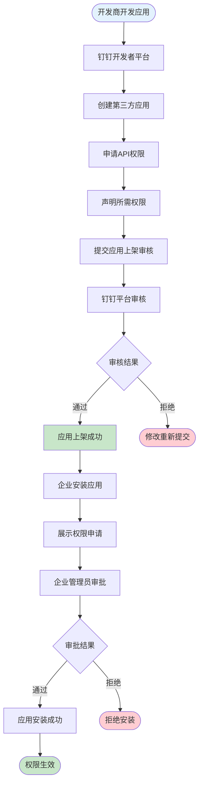

### 3.4 API权限管理特性

#### 3.4.1 简化的权限管理流程

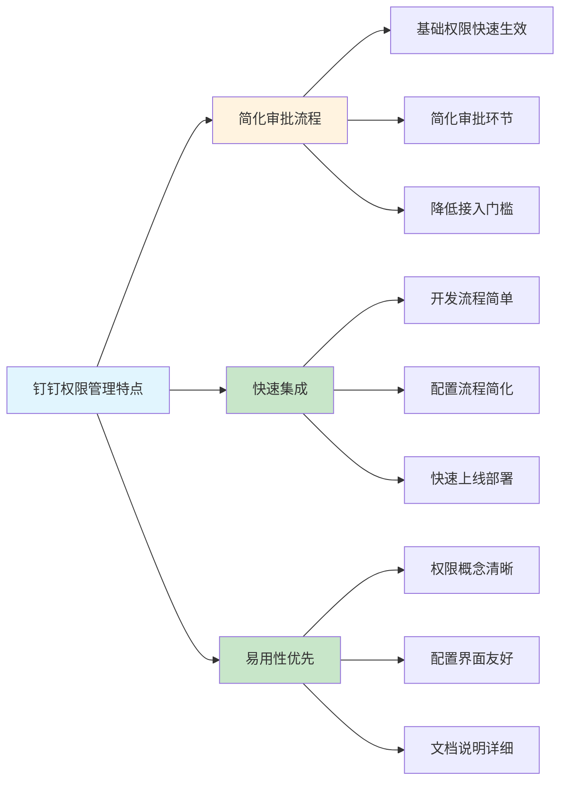

**优势特点：**
- 基础权限申请后可快速使用，无需等待复杂审批
- 权限概念清晰，易于开发者理解
- 配置界面友好，降低管理成本

#### 3.4.2 多应用形态支持

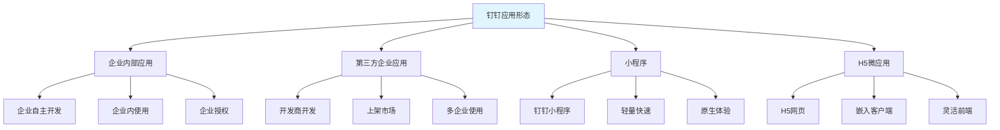

## 四、事件开放能力

### 4.1 事件订阅机制

钉钉提供事件订阅机制，允许应用监听企业内的业务事件：

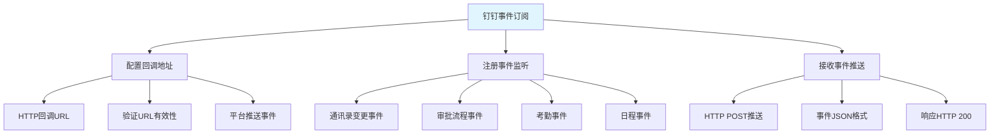

### 4.2 事件订阅流程

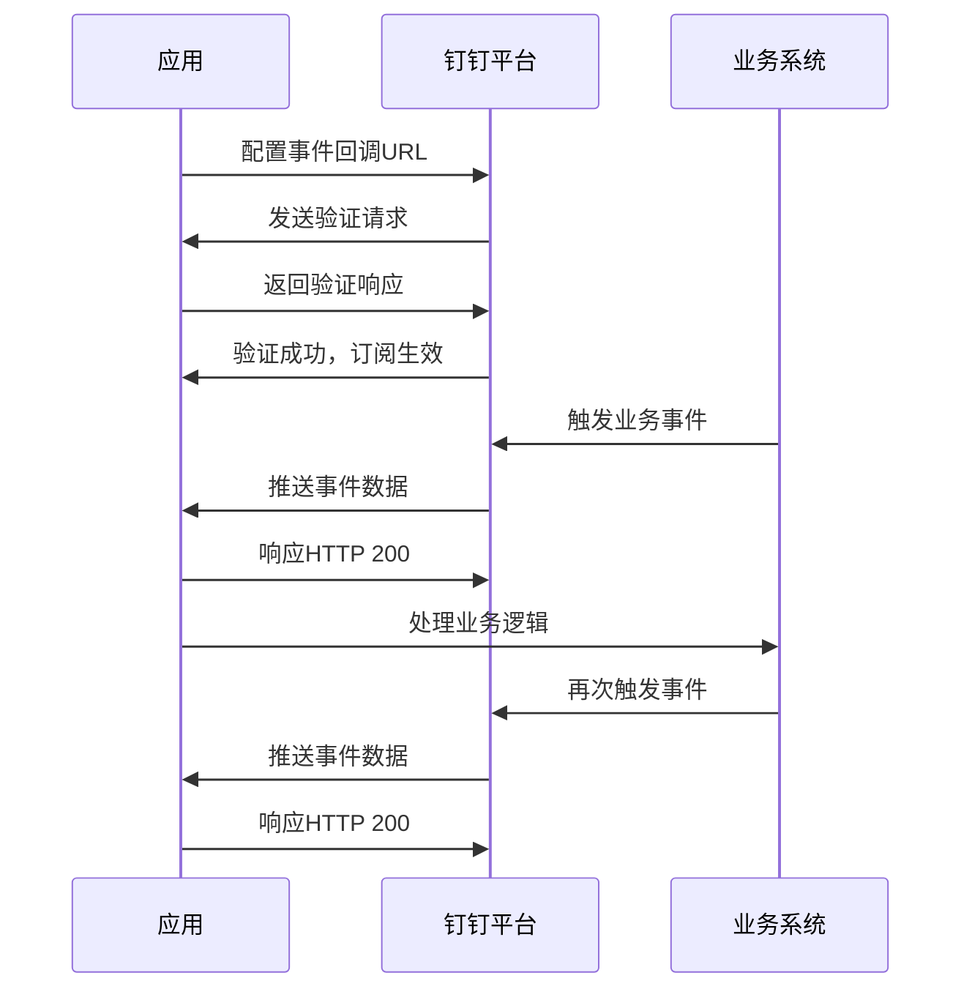

### 4.3 事件类型示例

钉钉支持多种事件类型：

| 事件分类 | 事件示例 | 说明 |
|---------|---------|------|
| **通讯录事件** | user_add_org、user_modify_org、user_leave_org | 用户加入、修改、离职事件 |
| **部门事件** | org_dept_create、org_dept_modify、org_dept_remove | 部门创建、修改、删除事件 |
| **审批事件** | bpms_task_change、bpms_instance_change | 审批任务和实例变更事件 |
| **考勤事件** | attendance_check_in、attendance_check_out | 考勤打卡事件 |
| **日程事件** | calendar_event_create、calendar_event_update | 日程创建和更新事件 |

### 4.4 事件订阅权限

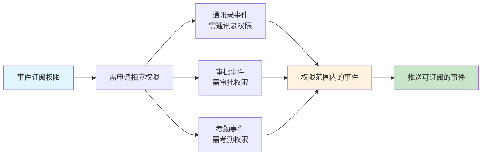

**权限要求：**
- 事件订阅需要申请相应的业务权限
- 只能订阅权限范围内的事件
- 不同事件类型对应不同权限要求

## 五、数据开放与能力开放的关系

### 5.1 钉钉权限模型

钉钉开放平台采用相对简化的权限模型：

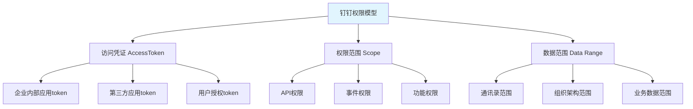

### 5.2 数据开放与API开放的层次关系

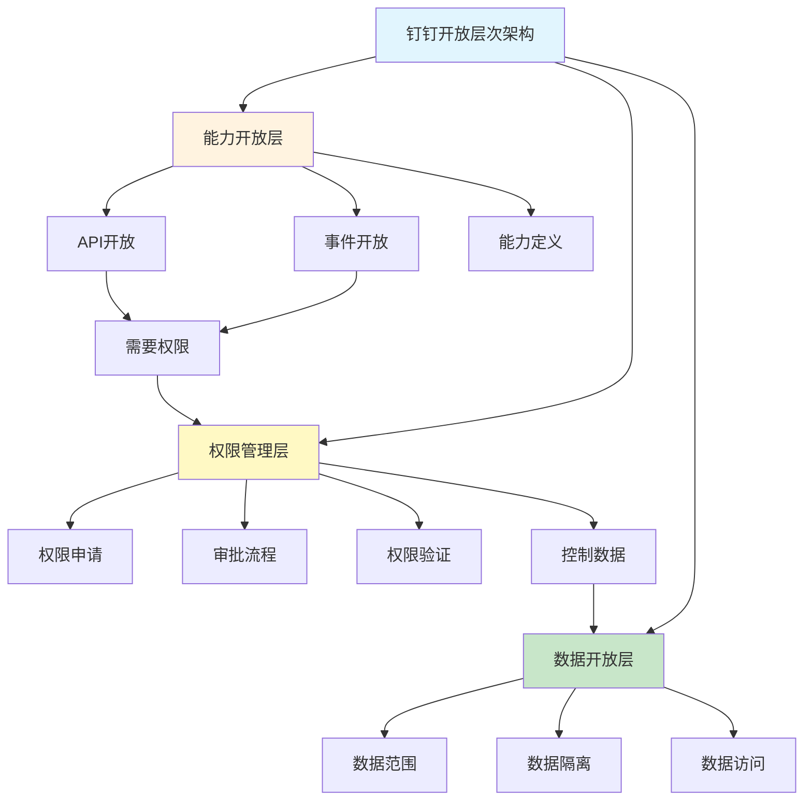

### 5.3 数据开放与能力开放的协同机制

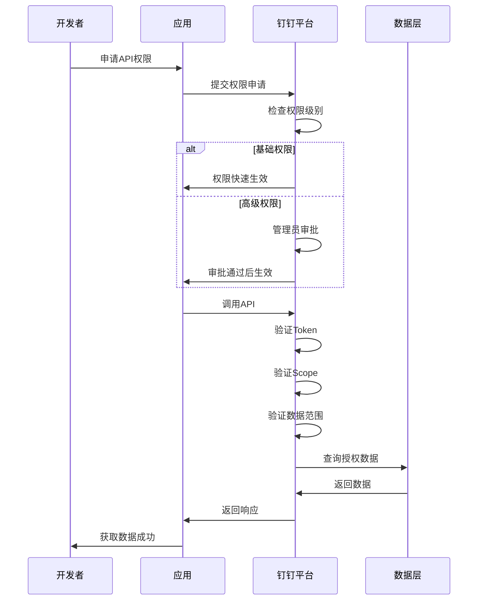

**关键协同点：**
1. **API权限申请触发数据权限配置**：某些API权限需配置数据访问范围
2. **权限验证机制**：API调用时验证Token、Scope、数据范围
3. **数据范围控制**：应用只能访问配置范围内的数据

### 5.4 数据开放与能力开放的依赖关系

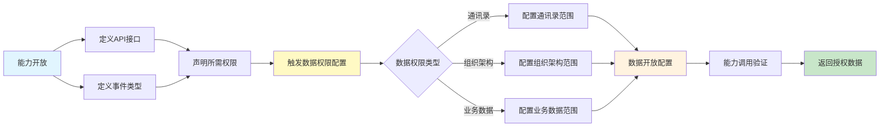

## 六、权限管理设计总结

### 6.1 权限管理核心设计

钉钉开放平台的权限管理设计核心要素：

```mermaid
graph TD
    A[钉钉权限管理核心要素] --> B[简化权限模型]
    A --> C[三级权限控制]
    A --> D[多应用形态]
    A --> E[易用性优先]
    
    B --> B1[AccessToken凭证]
    B --> B2[Scope权限范围]
    B --> B3[DataRange数据范围]
    
    B1 --> B11[企业内部应用token]
    B1 --> B12[第三方应用token]
    
    B2 --> B21[API权限]
    B2 --> B22[事件权限]
    
    B3 --> B31[通讯录范围]
    B3 --> B32[组织架构范围]
    
    C --> C1[基础权限]
    C --> C2[高级权限]
    C --> C3[敏感权限]
    
    C1 --> C11[低敏感度]
    C1 --> C12[快速审批]
    
    C2 --> C21[中敏感度]
    C2 --> C22[管理员审批]
    
    C3 --> C31[高敏感度]
    C3 --> C32[严格审批]
    
    D --> D1[企业内部应用]
    D --> D2[第三方企业应用]
    D --> D3[小程序/H5微应用]
    
    D1 --> D11[企业自主开发]
    D1 --> D12[内部授权]
    
    D2 --> D21[开发商开发]
    D2 --> D22[上架审核]
    
    D3 --> D31[轻量级应用]
    D3 --> D32[快速部署]
    
    E --> E1[简化流程]
    E --> E2[清晰概念]
    E --> E3[友好界面]
    
    E1 --> E11[降低门槛]
    E2 --> E21[易于理解]
    E3 --> E31[降低成本]
    
    style A fill:#e1f5fe
    style B fill:#fff3e0
    style C fill:#fff3e0
    style D fill:#fff3e0
    style E fill:#fff3e0
```

### 6.2 权限管理流程全景

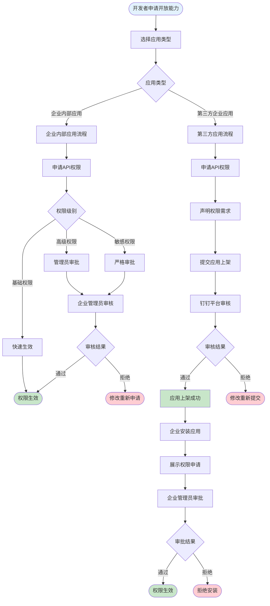

### 6.3 API调用时的权限验证流程

```mermaid
sequenceDiagram
    participant Client as 客户端
    participant App as 应用
    participant Platform as 钉钉平台
    participant Auth as 权限验证层
    participant Data as 数据层
    
    Client->>App: 发起请求
    App->>Platform: 调用API（携带Token）
    
    Platform->>Auth: 解析Token类型
    Auth->>Auth: 验证Token有效性
    
    Auth->>Auth: 查询应用Scope权限
    Auth->>Auth: 检查API权限是否满足
    
    alt 权限不满足
        Auth->>Platform: 返回权限错误
        Platform->>App: 权限错误响应
        App->>Client: 错误提示
    end
    
    Auth->>Auth: 查询数据权限配置
    Auth->>Auth: 检查请求资源是否在范围内
    
    alt 数据权限不满足
        Auth->>Platform: 返回数据权限错误
        Platform->>App: 权限错误响应
        App->>Client: 错误提示
    end
    
    Auth->>Data: 查询数据
    Data->>Auth: 返回数据
    
    Auth->>Platform: 返回数据
    Platform->>App: 返回响应
    App->>Client: 业务响应
```

### 6.4 用户身份体系

钉钉采用简化的用户身份体系：

```mermaid
graph TD
    A[钉钉用户身份体系] --> B[userid<br/>企业内唯一标识]
    A --> C[unionid<br/>跨企业统一标识]
    A --> D[openid<br/>应用内标识]
    
    B --> B1[企业内唯一]
    B --> B2[不同企业不同]
    B --> B3[主要标识]
    
    C --> C1[钉钉账号统一]
    C --> C2[跨企业关联]
    C --> C3[跨应用识别]
    
    D --> D1[应用内标识]
    D --> D2[特定应用使用]
    D --> D3[应用隔离]
    
    style A fill:#e1f5fe
    style B fill:#fff3e0
    style C fill:#fff3e0
    style D fill:#fff3e0
```

**身份ID说明：**

| ID类型 | 生成时机 | 唯一性范围 | 使用场景 |
|-------|---------|-----------|---------|
| **userid** | 用户加入企业时 | 企业内唯一，不同企业不同 | 企业内主要标识，API调用使用 |
| **unionid** | 用户注册钉钉时 | 钉钉账号统一，跨企业相同 | 跨企业识别用户，打通数据 |
| **openid** | 用户使用应用时 | 应用内唯一，不同应用不同 | 应用内标识，特定应用使用 |

## 七、钉钉开放平台优势与特色

### 7.1 核心优势

1. **简化流程**：权限申请和审批流程相对简化，降低接入门槛
2. **易用性强**：权限概念清晰，配置界面友好，易于理解和使用
3. **快速集成**：基础权限快速生效，加速应用开发和上线
4. **多形态支持**：支持企业内部应用、第三方应用、小程序等多种形态
5. **移动优先**：针对移动办公场景优化，提供原生移动体验

### 7.2 设计特色

```mermaid
graph TD
    A[钉钉开放平台特色] --> B[简化权限流程]
    A --> C[多应用形态]
    A --> D[移动优先]
    A --> E[易用性优先]
    
    B --> B1[三级权限]
    B --> B2[快速审批]
    B --> B3[降低门槛]
    
    C --> C1[企业内部应用]
    C --> C2[第三方应用]
    C --> C3[小程序/H5]
    
    D --> D1[移动优化]
    D --> D2[原生体验]
    D --> D3[快速部署]
    
    E --> E1[清晰概念]
    E --> E2[友好界面]
    E --> E3[详细文档]
    
    style A fill:#e1f5fe
    style B fill:#fff3e0
    style C fill:#fff3e0
    style D fill:#c8e6c9
    style E fill:#c8e6c9
```

## 八、钉钉开放平台不足与改进空间

### 8.1 相对不足

与飞书相比，钉钉在以下方面存在相对不足：

1. **权限精细度**：缺少字段级权限控制，粒度较粗
2. **多维权限模型**：缺少三维协同的权限模型设计
3. **数据权限配置**：数据权限配置相对简单，缺少灵活的条件配置
4. **测试调试支持**：缺少类似飞书测试企业功能的快速调试机制
5. **权限管理工具**：缺少批量导入导出等高级权限管理工具

### 8.2 改进建议

```mermaid
graph LR
    A[改进方向] --> B[增强权限精细度]
    A --> C[完善权限模型]
    A --> D[优化调试体验]
    A --> E[丰富管理工具]
    
    B --> B1[引入字段级权限]
    B --> B2[细化权限粒度]
    
    C --> C1[三维权限协同]
    C --> C2[数据范围灵活配置]
    
    D --> D1[测试企业功能]
    D --> D2[多身份调试]
    
    E --> E1[批量权限管理]
    E --> E2[权限可视化]
    
    style A fill:#e1f5fe
    style B fill:#fff3e0
    style C fill:#fff3e0
    style D fill:#c8e6c9
    style E fill:#c8e6c9
```

## 九、总结

钉钉开放平台的数据开放与能力开放体系设计体现了以下核心思想：

1. **易用性优先**：简化权限申请流程，降低开发者接入门槛，快速集成
2. **简化权限模型**：三级权限控制，清晰的概念，易于理解和管理
3. **多形态支持**：支持多种应用形态，适应不同场景需求
4. **移动优先**：针对移动办公场景优化，提供原生移动体验
5. **快速生效**：基础权限快速生效，加速应用开发迭代

钉钉的开放平台设计注重易用性和快速集成，为企业和开发者提供了简化的接入体验，适合快速开发和轻量级应用场景。但在权限精细控制、高级权限管理工具等方面相对飞书存在一定差距，适合对权限控制要求相对宽松的应用场景。