# 飞书 vs 钉钉 vs XX 开放平台对比报告

**文档版本**：v1.0  
**创建日期**：2026-04-08  
**最后更新**：2026-04-08  
**报告类型**：竞品对比分析  

---

## 一、执行摘要

### 1.1 对比目的

本报告旨在对比分析**飞书开放平台**、**钉钉开放平台**和**XX 开放平台**在数据开放与能力开放方面的设计差异，为 XX 开放平台的建设提供参考依据。

### 1.2 核心发现

| 维度 | 飞书 | 钉钉 | XX 开放平台 |
|------|------|------|------------|
| **权限模型** | 三维协同（Token/Scope/Availability） | 简化三级权限 | 动态审批（敏感度驱动） |
| **数据粒度** | 字段级权限控制 | 数据范围控制 | 数据对象级控制 |
| **审批流程** | 自动审批 + 审核双重机制 | 快速审批优先 | 敏感度驱动动态审批链 |
| **开放定位** | 企业协作平台开放生态 | 企业移动办公平台开放生态 | 企业内部数据开放通道 |
| **部署模式** | 云端 SaaS | 云端 SaaS | 企业内部部署 |

### 1.3 核心建议

1. **借鉴飞书**：三维权限模型、字段级权限控制、测试企业功能
2. **借鉴钉钉**：简化审批流程、多应用形态支持、移动优先设计
3. **差异化定位**：聚焦企业内部数据治理、动态审批机制、数据安全合规

---

## 二、平台定位对比

### 2.1 核心定位

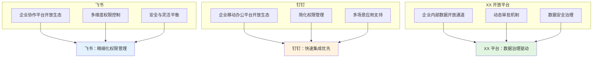

### 2.2 目标市场对比

| 维度 | 飞书 | 钉钉 | XX 开放平台 |
|------|------|------|------------|
| **目标客户** | 中大型企业、知识密集型 | 中小企业、劳动密集型 | 单一企业内部 |
| **部署模式** | 云端 SaaS | 云端 SaaS | 企业内部部署 |
| **计费模式** | 部分 API 收费 | 部分 API 收费 | 免费（内部使用） |
| **合规要求** | 通用合规标准 | 通用合规标准 | 企业特定合规要求 |

### 2.3 核心价值主张

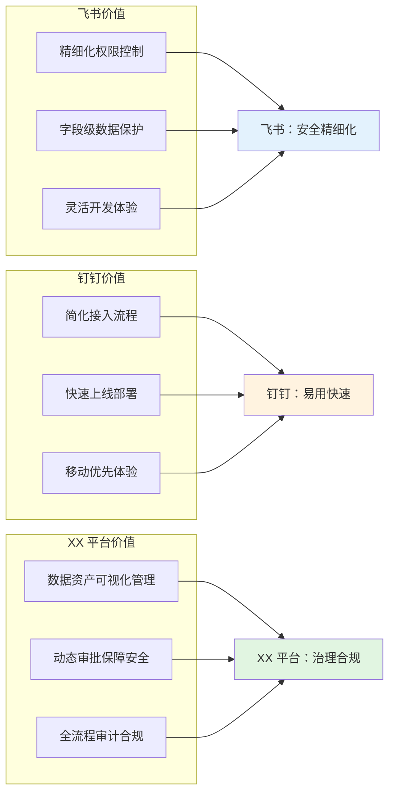

---

## 三、应用类型对比

### 3.1 应用类型体系

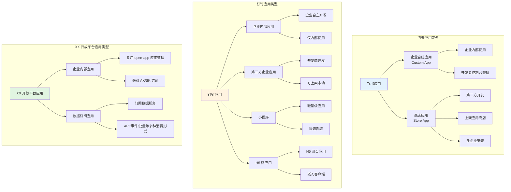

### 3.2 应用类型对比表

| 特性 | 飞书 | 钉钉 | XX 开放平台 |
|------|------|------|------------|
| **自建应用** | ✅ 企业自建应用 | ✅ 企业内部应用 | ✅ 企业内部应用 |
| **第三方应用** | ✅ 商店应用 | ✅ 第三方企业应用 | ❌ 不支持（仅内部） |
| **小程序** | ❌ 不支持 | ✅ 钉钉小程序 | ❌ 暂不支持 |
| **H5 应用** | ❌ 不支持 | ✅ H5 微应用 | ❌ 暂不支持 |
| **应用管理** | 开发者控制台 | 钉钉管理后台 | open-app 应用管理体系 |
| **多租户** | ✅ 支持 | ✅ 支持 | ❌ 单租户（企业内部） |

---

## 四、权限模型对比

### 4.1 权限模型架构

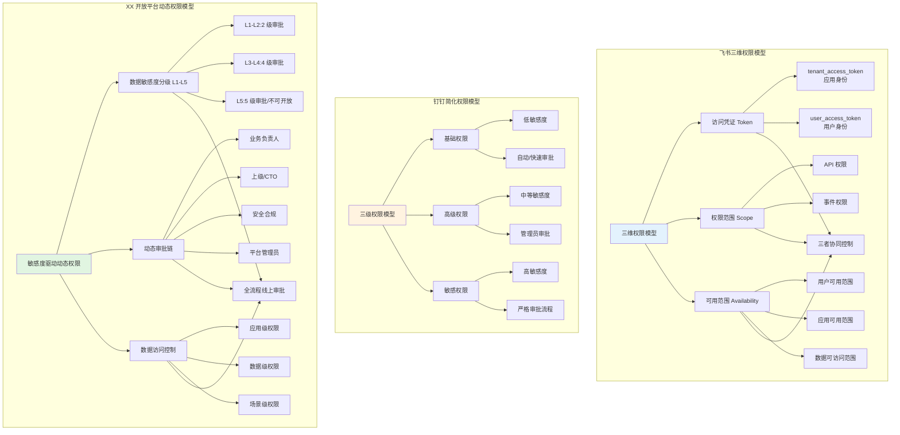

### 4.2 权限级别详细对比

| 特性 | 飞书 | 钉钉 | XX 开放平台 |
|------|------|------|------------|
| **权限分级** | 自动审批权限 + 需审核权限 | 基础权限 + 高级权限 + 敏感权限 | 基于敏感度 L1-L5 |
| **分级依据** | 数据敏感度 | 数据敏感度 | 数据敏感度（L1-L5） |
| **自动审批** | ✅ 支持（可配置规则） | ✅ 基础权限快速生效 | ✅ L1-L2 级 2 级审批 |
| **人工审批** | ✅ 需审核权限 | ✅ 高级/敏感权限 | ✅ L3-L5 级 4-5 级审批 |
| **字段级控制** | ✅ 完善支持 | ❌ 缺少 | ⏳ 二期考虑 |
| **行级控制** | ✅ 支持（数据范围） | ✅ 支持（通讯录范围） | ✅ 支持（数据对象级） |
| **列级控制** | ✅ 支持（字段权限） | ❌ 缺少 | ❌ 暂不支持 |

### 4.3 审批流程对比

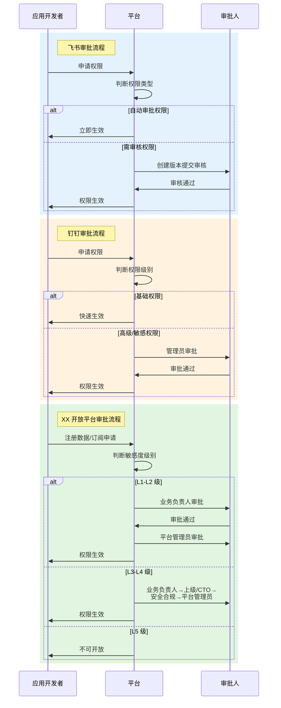

### 4.4 审批链配置对比

| 特性 | 飞书 | 钉钉 | XX 开放平台 |
|------|------|------|------------|
| **审批链配置** | ✅ 可配置自动审批规则 | ❌ 固定审批流程 | ✅ 基于敏感度动态生成 |
| **审批角色** | 企业管理员 | 企业管理员 | 业务负责人、上级/CTO、安全合规、平台管理员 |
| **审批超时** | ❌ 未明确 | ❌ 未明确 | ✅ 支持超时升级（默认 3 个工作日） |
| **审批历史** | ✅ 完整记录 | ✅ 完整记录 | ✅ 完整记录 + 全流程留痕 |
| **审批通知** | ✅ 站内信/邮件 | ✅ 站内信 | ✅ 站内信 + 邮件 |

---

## 五、数据开放能力对比

### 5.1 数据开放架构

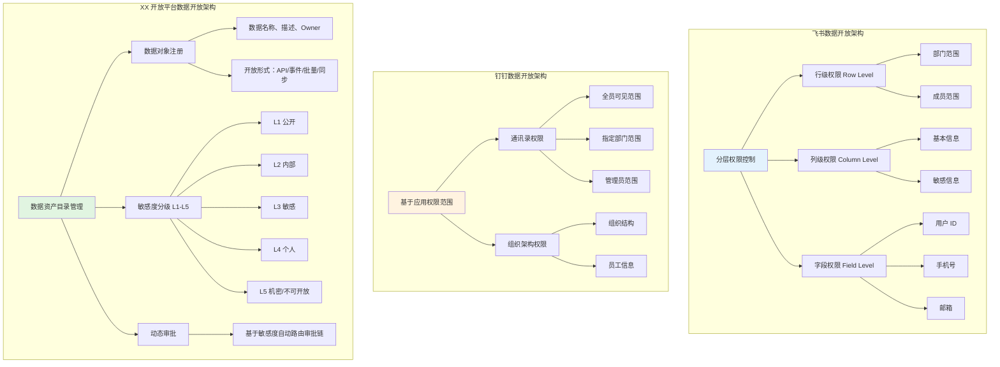

### 5.2 数据权限类型对比

| 业务域 | 飞书 | 钉钉 | XX 开放平台 |
|--------|------|------|------------|
| **通讯录** | ✅ 支持（可配置范围） | ✅ 支持（全员/指定部门/管理员） | ✅ 支持（数据对象级） |
| **组织架构** | ✅ 支持（可配置范围） | ✅ 支持（组织结构/员工信息） | ✅ 支持（数据对象级） |
| **人事数据** | ✅ 飞书人事 | ❌ 考勤数据 | ✅ 支持（L3 级需 4 级审批） |
| **日程数据** | ✅ 支持 | ✅ 支持 | ✅ 支持（L2-L3 级） |
| **文档数据** | ✅ 妙记/云文档 | ❌ 钉盘 | ✅ 支持（云盘数据） |
| **IM 数据** | ❌ 不支持 | ❌ 不支持 | ✅ 支持（L3-L4 级，需严格审批） |
| **会议数据** | ✅ 支持 | ✅ 支持 | ✅ 支持（L2 级） |
| **薪资数据** | ✅ 支持（L3 级） | ❌ 不支持 | ✅ 支持（L3 级，需 4 级审批） |

### 5.3 数据隔离机制

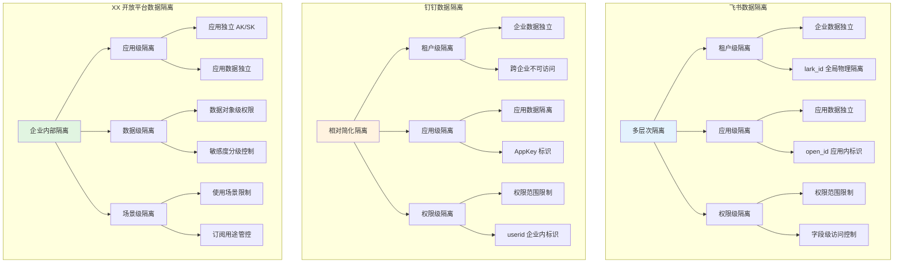

### 5.4 数据敏感度分级对比

| 特性 | 飞书 | 钉钉 | XX 开放平台 |
|------|------|------|------------|
| **分级机制** | ✅ 自动审批/需审核（二级） | ✅ 基础/高级/敏感（三级） | ✅ L1-L5（五级） |
| **分级粒度** | 数据对象级 + 字段级 | 数据范围级 | 数据对象级 |
| **L5 机密数据** | ❌ 未明确 | ❌ 未明确 | ✅ 明确定义（不可开放） |
| **动态调整** | ❌ 未明确 | ❌ 未明确 | ✅ 支持可配置演进 |
| **定级责任** | 平台定义 | 平台定义 | 数据 Owner 申报 + 平台审核 |

---

## 六、API 开放能力对比

### 6.1 API 权限体系

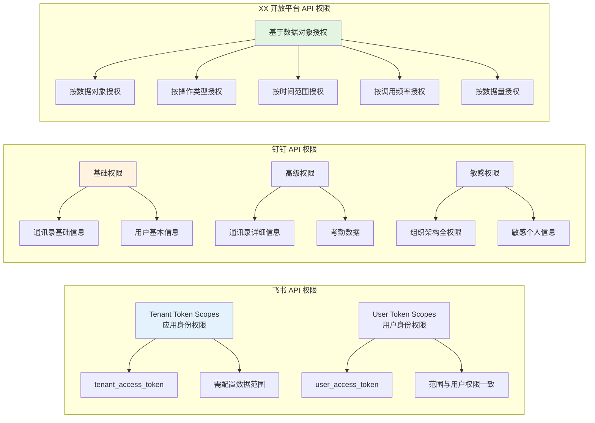

### 6.2 API 权限申请流程对比

| 特性 | 飞书 | 钉钉 | XX 开放平台 |
|------|------|------|------------|
| **申请入口** | 开发者控制台 | 钉钉管理后台 | open-app 开发者控制台 |
| **批量导入** | ✅ 支持 JSON 格式 | ❌ 不支持 | ⏳ 二期考虑 |
| **批量导出** | ✅ 支持 | ❌ 不支持 | ⏳ 二期考虑 |
| **测试调试** | ✅ 测试企业功能 | ❌ 缺少 | ⏳ 二期考虑 |
| **多身份调试** | ✅ 支持 user_access_token | ❌ 不支持 | ⏳ 二期考虑 |
| **权限迁移** | ✅ 跨应用复制 | ❌ 不支持 | ⏳ 二期考虑 |

### 6.3 API 调用验证流程对比

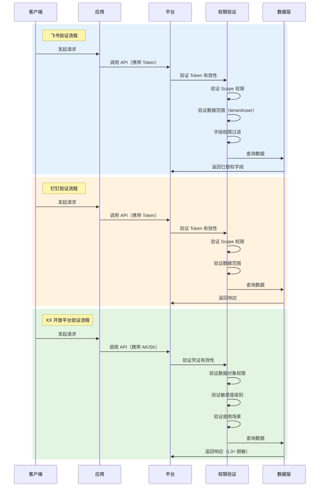

### 6.4 API 性能对比

| 指标 | 飞书 | 钉钉 | XX 开放平台（目标） |
|------|------|------|------------------|
| **API 数量** | 2500+ | 数百个 | 逐步丰富 |
| **响应时间** | P95 < 200ms | P95 < 300ms | P95 < 200ms |
| **系统吞吐量** | 高并发支持 | 中等并发 | 1000 QPS |
| **版本兼容** | 支持多版本 | 支持多版本 | 支持 2 个历史版本 |

---

## 七、事件开放能力对比

### 7.1 事件订阅机制

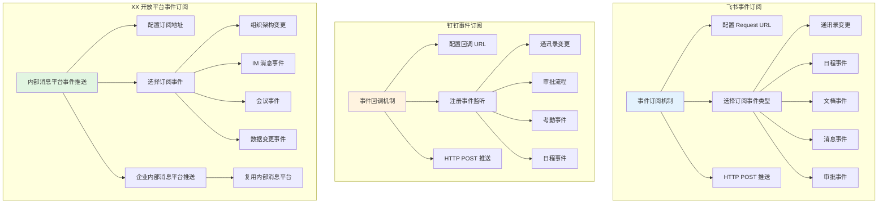

### 7.2 事件类型对比

| 事件分类 | 飞书 | 钉钉 | XX 开放平台 |
|---------|------|------|------------|
| **通讯录事件** | ✅ user.created/updated/deleted | ✅ user_add_org/leave_org/modify_org | ✅ 用户入离职/变更 |
| **部门事件** | ✅ department.created/deleted | ✅ org_dept_create/modify/remove | ✅ 部门变更 |
| **日程事件** | ✅ calendar.event.created/updated | ✅ calendar_event_create/update | ✅ 日程变更 |
| **文档事件** | ✅ drive.file.created/deleted | ❌ 不支持 | ⏳ 云盘数据事件 |
| **消息事件** | ✅ message.created/read | ❌ 不支持 | ✅ IM 消息事件 |
| **会议事件** | ❌ 不支持 | ❌ 不支持 | ✅ 会议创建/变更 |
| **审批事件** | ✅ approval.instance.created | ✅ bpms_task/instance_change | ✅ 审批流程事件 |

### 7.3 事件权限控制对比

| 特性 | 飞书 | 钉钉 | XX 开放平台 |
|------|------|------|------------|
| **订阅身份** | tenant_access_token / user_access_token | 应用身份 / 用户身份 | 应用 AK/SK |
| **订阅范围** | 应用拥有者/管理员资源 | 权限范围内事件 | 数据对象权限范围内 |
| **事件重放** | ✅ 最近 7 天 | ❌ 不支持 | ⏳ 二期考虑 |
| **推送延迟** | < 5 秒 | < 10 秒 | < 5 秒（目标） |

---

## 八、数据治理与合规对比

### 8.1 数据治理体系

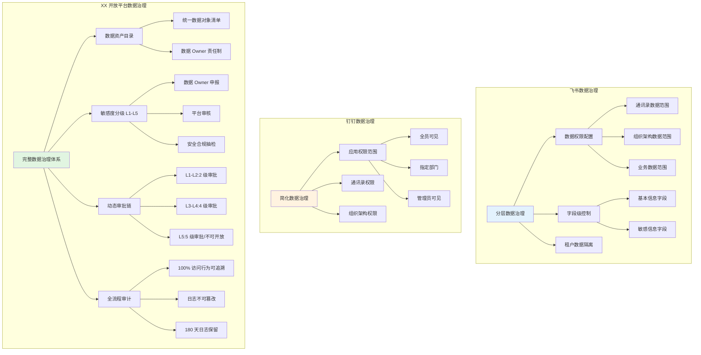

### 8.2 数据治理对比表

| 特性 | 飞书 | 钉钉 | XX 开放平台 |
|------|------|------|------------|
| **数据资产目录** | ❌ 未明确 | ❌ 未明确 | ✅ 统一数据对象清单 |
| **敏感度定义** | 二级（自动审批/需审核） | 三级（基础/高级/敏感） | 五级（L1-L5） |
| **定级责任** | 平台定义 | 平台定义 | 数据 Owner 申报 + 平台审核 |
| **动态调整** | ❌ 未明确 | ❌ 未明确 | ✅ 可配置、可演进 |
| **全流程审计** | ✅ 支持 | ✅ 支持 | ✅ 强化（180 天 + 不可篡改） |
| **异常检测** | ❌ 未明确 | ❌ 未明确 | ✅ 自动告警 + 临时封禁 |

### 8.3 安全合规对比

| 特性 | 飞书 | 钉钉 | XX 开放平台 |
|------|------|------|------------|
| **认证方式** | OAuth 2.0 + API Key | OAuth 2.0 + AccessToken | OAuth 2.0 + AK/SK |
| **传输加密** | HTTPS（TLS 1.3） | HTTPS | HTTPS（TLS 1.3） |
| **数据脱敏** | L3+ 字段级脱敏 | ❌ 未明确 | L3+ 自动脱敏 |
| **凭证轮换** | ✅ 支持 | ✅ 支持 | ✅ 支持（手动 + 自动） |
| **防重放攻击** | ❌ 未明确 | ❌ 未明确 | ✅ 时间戳 + 签名（5 分钟） |
| **日志保留** | ❌ 未明确 | ❌ 未明确 | 180 天 |

---

## 九、开发者体验对比

### 9.1 开发者支持体系

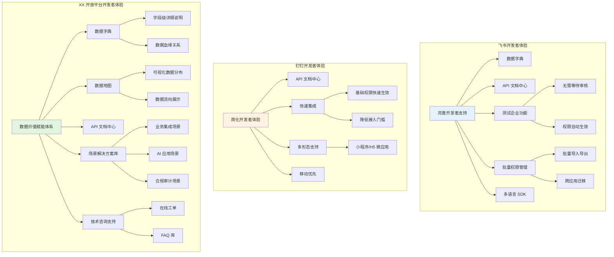

### 9.2 开发者体验对比表

| 特性 | 飞书 | 钉钉 | XX 开放平台 |
|------|------|------|------------|
| **API 文档** | ✅ 完善（云文档 + 知识库） | ✅ 完善 | ✅ 复用 open-app 文档中心 |
| **在线调试** | ✅ Try it out | ❌ 未明确 | ✅ 支持 |
| **SDK 支持** | ✅ 多语言 | ✅ 多语言 | ⏳ 二期提供 |
| **测试环境** | ✅ 测试企业 | ❌ 缺少 | ⏳ 二期考虑 |
| **场景方案** | ❌ 较少 | ✅ 案例丰富 | ✅ 场景分类目录 + 案例库 |
| **技术咨询** | ✅ 专属支持 | ✅ 生态成熟 | ✅ 工单系统 + FAQ |
| **批量管理** | ✅ 导入导出 | ❌ 不支持 | ⏳ 二期考虑 |

### 9.3 数据价值赋能对比

| 赋能工具 | 飞书 | 钉钉 | XX 开放平台 |
|---------|------|------|------------|
| **数据字典** | ✅ 完善 | ❌ 基础 | ✅ 详细字段说明 + 血缘关系 |
| **数据地图** | ❌ 未明确 | ❌ 未明确 | ✅ 可视化分布 + 关系 |
| **使用建议** | ❌ 未明确 | ❌ 未明确 | ✅ 推荐/不推荐场景 |
| **数据预览** | ❌ 未明确 | ❌ 未明确 | ✅ 脱敏样本查看 |
| **场景分类** | ✅ 多维表格场景 | ✅ 宜搭案例 | ✅ 5 类消费场景 |
| **案例库** | ✅ 最佳实践 | ✅ 1000 万 + 应用 | ✅ 收集分享成功案例 |
| **价值评估** | ❌ 较少公开 | ✅ 详细（80% 效率提升） | ✅ 使用量统计 + 价值报告 |

---

## 十、优劣势对比总结

### 10.1 飞书优劣势

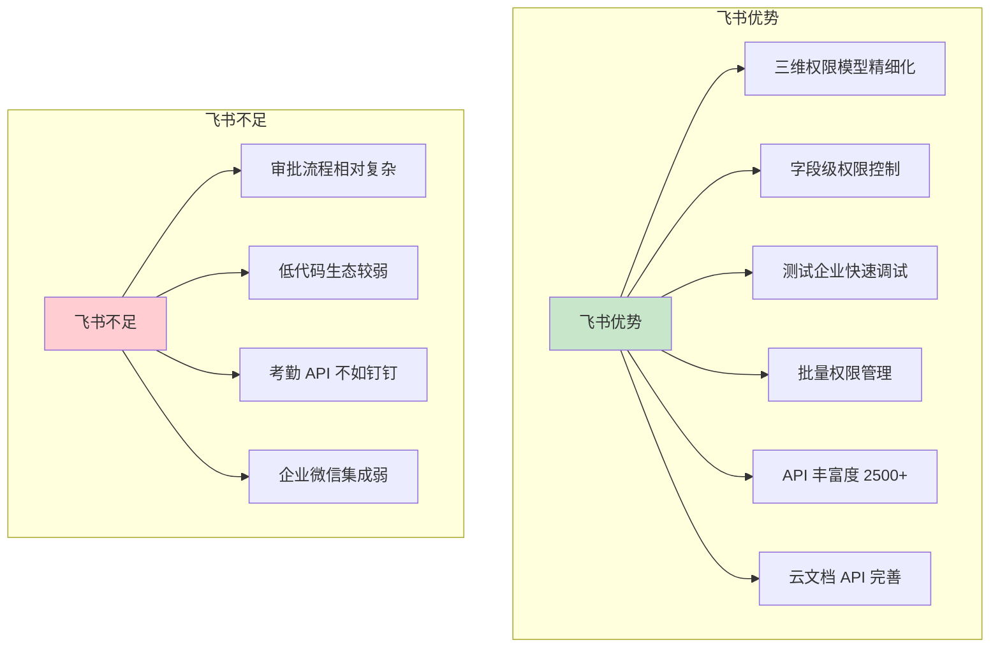

### 10.2 钉钉优劣势

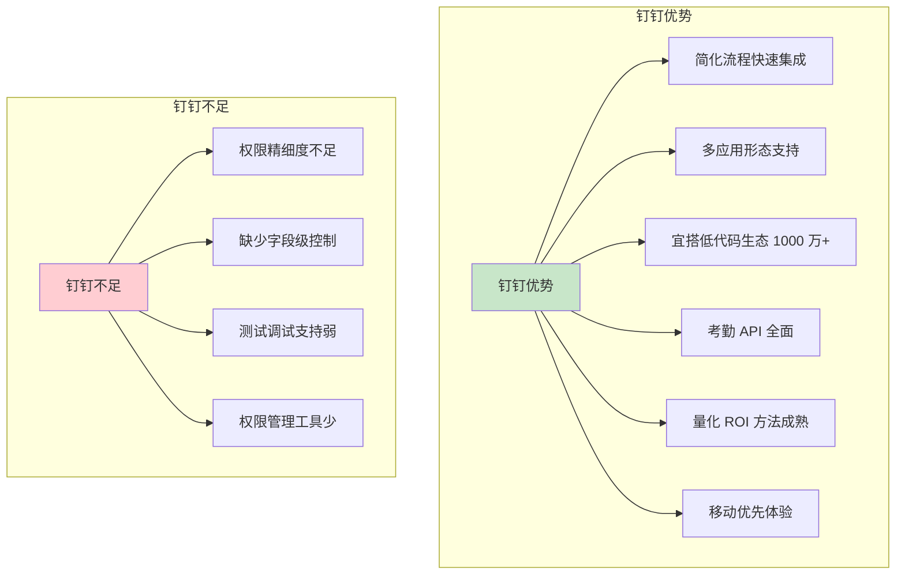

### 10.3 XX 开放平台优劣势

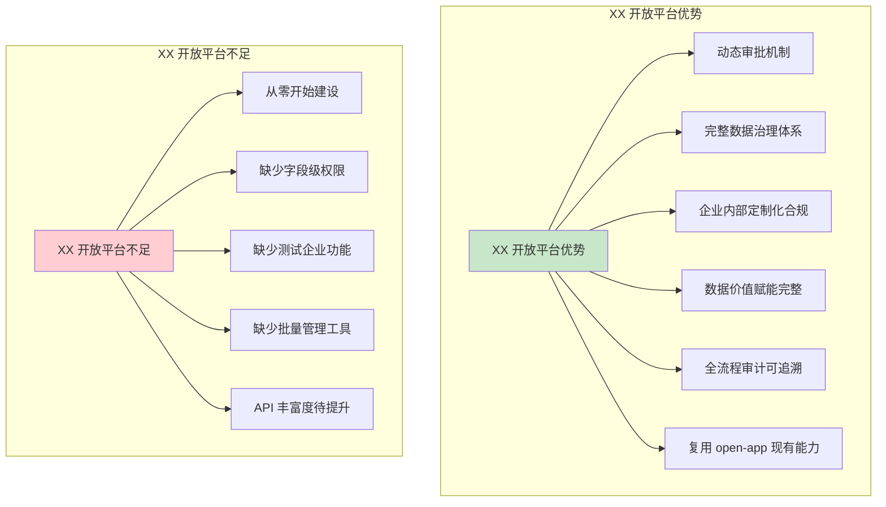

### 10.4 综合对比表

| 维度 | 飞书 | 钉钉 | XX 开放平台 |
|------|------|------|------------|
| **权限模型** | ⭐⭐⭐⭐⭐ 三维协同 | ⭐⭐⭐ 简化三级 | ⭐⭐⭐⭐ 动态审批 |
| **数据治理** | ⭐⭐⭐⭐ 分层控制 | ⭐⭐⭐ 简化治理 | ⭐⭐⭐⭐⭐ 完整体系 |
| **审批流程** | ⭐⭐⭐⭐ 灵活配置 | ⭐⭐⭐⭐ 快速生效 | ⭐⭐⭐⭐⭐ 敏感度驱动 |
| **API 丰富度** | ⭐⭐⭐⭐⭐ 2500+ | ⭐⭐⭐ 数百个 | ⭐⭐ 逐步丰富 |
| **开发者体验** | ⭐⭐⭐⭐⭐ 完善 | ⭐⭐⭐⭐ 简化 | ⭐⭐⭐ 建设中 |
| **数据安全** | ⭐⭐⭐⭐ 字段级 | ⭐⭐⭐ 范围级 | ⭐⭐⭐⭐ 全流程审计 |
| **低代码生态** | ⭐⭐⭐ 多维表格 | ⭐⭐⭐⭐⭐ 宜搭 | ⭐ 暂不支持 |
| **移动体验** | ⭐⭐⭐⭐ 良好 | ⭐⭐⭐⭐⭐ 移动优先 | ⭐⭐⭐ 待优化 |
| **企业内部适配** | ⭐⭐ SaaS 通用 | ⭐⭐ SaaS 通用 | ⭐⭐⭐⭐⭐ 定制化 |

---

## 十一、XX 开放平台建设建议

### 11.1 借鉴飞书（P0 优先级）

| 借鉴点 | 具体建议 | 实施阶段 |
|--------|---------|---------|
| **三维权限模型** | 引入 Token/Scope/Availability 协同控制 | 一期 |
| **字段级权限** | 支持 API 响应字段权限过滤 | 二期 |
| **测试企业功能** | 建设测试环境，无需等待审核即可调试 | 二期 |
| **批量权限管理** | 支持权限导入导出、跨应用迁移 | 二期 |
| **多身份调试** | 支持 user_access_token 快速调试 | 二期 |

### 11.2 借鉴钉钉（P0 优先级）

| 借鉴点 | 具体建议 | 实施阶段 |
|--------|---------|---------|
| **简化流程** | L1-L2 级数据快速审批生效 | 一期 |
| **多形态支持** | 二期支持小程序/H5 微应用 | 二期 |
| **移动优先** | 优化移动端开发者体验 | 一期 |
| **量化 ROI** | 建立数据价值评估指标体系 | 一期 |
| **场景案例** | 建设场景解决方案库和案例库 | 一期 |

### 11.3 差异化建设（核心优势）

| 差异化点 | 具体建议 | 实施阶段 |
|---------|---------|---------|
| **动态审批链** | 基于敏感度 L1-L5 自动路由审批链 | 一期 |
| **数据资产目录** | 统一数据对象清单 + 敏感度标注 | 一期 |
| **全流程审计** | 180 天日志保留 + 不可篡改 | 一期 |
| **数据价值赋能** | 数据字典 + 数据地图 + 场景方案 + 技术咨询 | 一期 |
| **企业化合规** | 满足企业特定安全和合规要求 | 一期 |

### 11.4 建设路线图

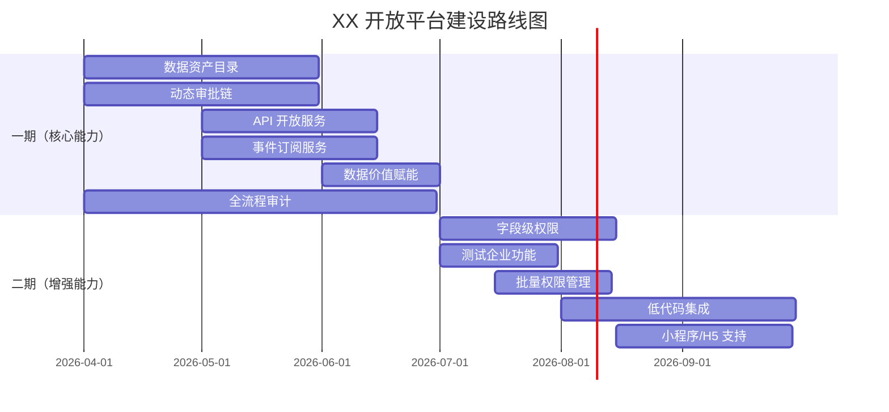

---

## 十二、总结

### 12.1 核心对比结论

| 平台 | 核心优势 | 适用场景 |
|------|---------|---------|
| **飞书** | 精细化权限控制、字段级数据保护、完善开发者体验 | 中大型企业、知识密集型、对数据安全要求高 |
| **钉钉** | 简化流程快速集成、多应用形态、低代码生态成熟 | 中小企业、劳动密集型、快速上线需求 |
| **XX 开放平台** | 动态审批机制、完整数据治理、企业化合规定制 | 单一企业内部、数据安全治理优先、合规要求严格 |

### 12.2 XX 开放平台定位建议

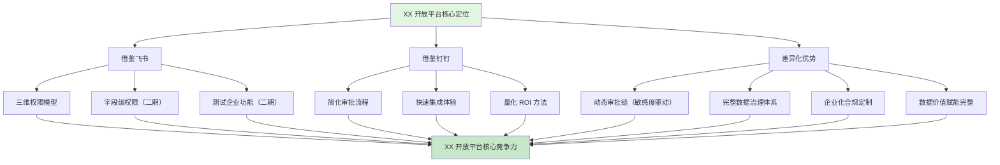

### 12.3 最终建议

1. **一期聚焦**：数据资产目录、动态审批链、核心 API 开放、全流程审计
2. **二期增强**：字段级权限、测试企业、批量管理、低代码集成
3. **持续优化**：API 丰富度、开发者体验、场景方案库

**XX 开放平台应该走差异化路线**：
- ✅ 不追求 API 数量，聚焦核心数据开放质量
- ✅ 不追求通用性，聚焦企业内数据治理需求
- ✅ 不追求快速上线，聚焦安全合规和全流程审计
- ✅ 借鉴飞书钉钉优势，但保持自身特色

---

## 附录

### A. 参考资料

| 文档 | 来源 |
|------|------|
| 飞书开放平台数据与能力开放调研报告 | docs/api-permission-research/ |
| 钉钉开放平台数据与能力开放调研报告 | docs/api-permission-research/ |
| 数据开放平台 Feature Specification | .sdd/specs-tree-root/specs-tree-data-open-platform/spec.md |
| 需求挖掘报告：数据开放平台 | .sdd/specs-tree-root/specs-tree-data-open-platform/discovery-report.md |
| 飞书 vs 钉钉开放平台数据价值对比报告 | docs/data-open-platform-research/ |

### B. 文档修订记录

| 版本 | 日期 | 修订内容 | 修订人 |
|------|------|---------|--------|
| v1.0 | 2026-04-08 | 初始版本 | AI Assistant |

---

**报告完成时间**：2026-04-08  
**报告状态**：✅ 已完成
