# 飞书vs钉钉开放平台数据与能力开放对比报告

## 一、对比概述

飞书和钉钉作为两大主流企业协作平台的开放体系，在数据开放、能力开放、权限管理等方面既有共性，也存在显著差异。本报告将从多个维度对比分析两个平台的设计理念和实现机制。

### 1.1 平台定位对比

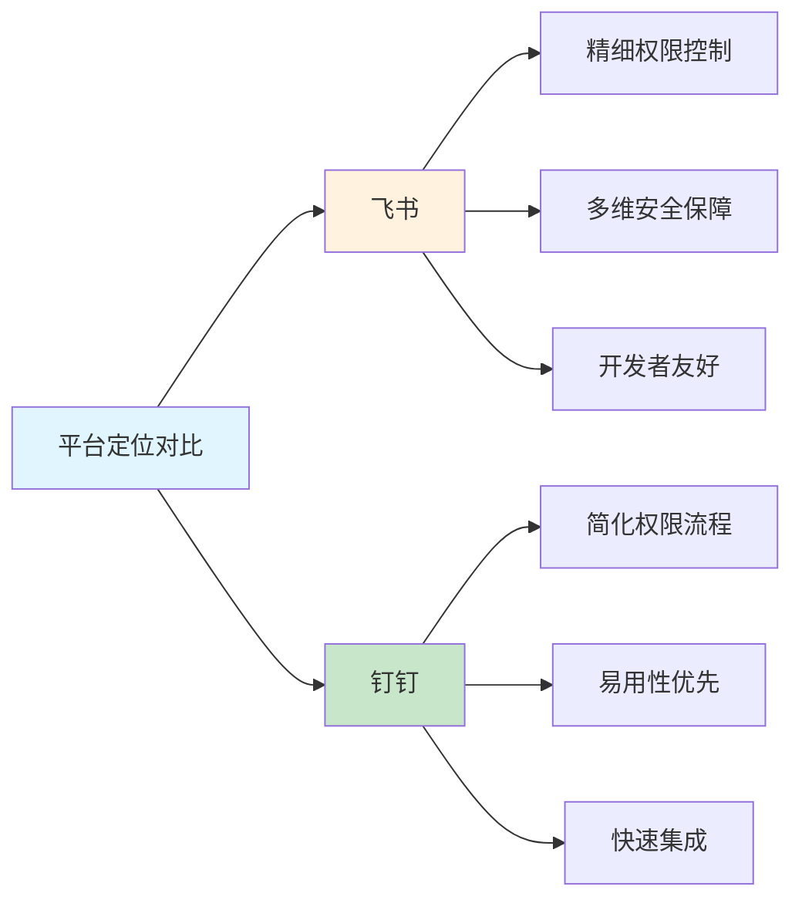

**核心差异：**
- **飞书**：注重精细化权限控制、多维安全保障、为开发者提供灵活高效的接入能力
- **钉钉**：注重简化流程、易用性优先、快速集成，降低接入门槛

### 1.2 应用类型对比

| 对比维度 | 飞书 | 钉钉 |
|---------|------|------|
| **应用类型** | 企业自建应用、商店应用 | 企业内部应用、第三方企业应用、小程序、H5微应用 |
| **应用数量** | 2种主要类型 | 4种应用形态 |
| **应用定位** | 企业内部应用为主，商店应用为辅 | 多形态支持，适应不同场景 |
| **开发主体** | 企业自主开发或第三方开发商 | 企业自主开发、开发商、个人开发者 |

## 二、数据开放能力对比

### 2.1 数据开放架构对比

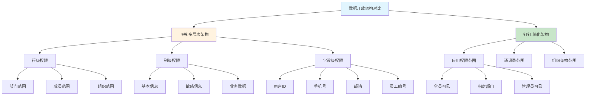

### 2.2 数据权限精细度对比

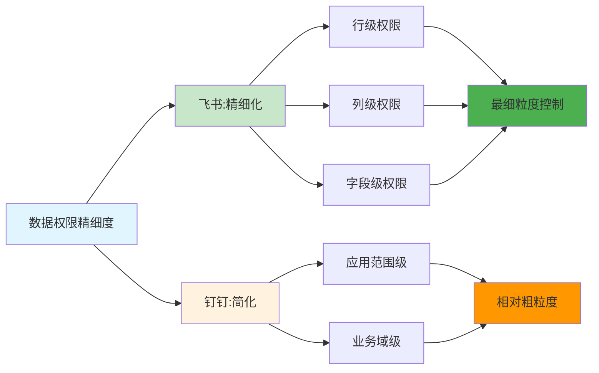

**关键差异：**

| 对比维度 | 飞书 | 钉钉 | 评价 |
|---------|------|------|------|
| **权限粒度** | 行级+列级+字段级 | 应用范围级+业务域级 | 飞书更精细 |
| **控制维度** | 多维度控制 | 相对单一 | 飞书更全面 |
| **配置灵活性** | 多种条件配置 | 简化配置 | 飞书更灵活 |
| **数据安全** | 更高安全保障 | 基本安全保障 | 飞书更强 |

### 2.3 数据权限配置对比

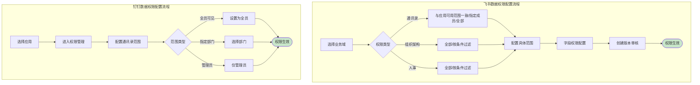

**配置复杂度对比：**

| 对比项 | 飞书 | 钉钉 |
|-------|------|------|
| **配置步骤** | 多步骤，较复杂 | 简化步骤，较简单 |
| **配置维度** | 多维度配置 | 单维度配置 |
| **条件支持** | 支持复杂条件过滤 | 支持简单范围选择 |
| **配置灵活性** | 高 | 中 |

### 2.4 数据权限业务域对比

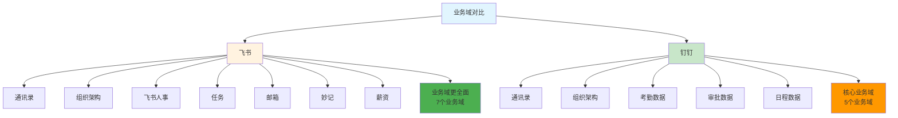

**业务域对比：**

| 业务域 | 飞书支持 | 钉钉支持 | 数据权限配置 |
|-------|---------|---------|-------------|
| **通讯录** | ✓ | ✓ | 飞书更灵活，钉钉简化 |
| **组织架构** | ✓ | ✓ | 飞书支持条件过滤，钉钉简化 |
| **人事数据** | ✓（飞书人事） | ✓（员工信息） | 飞书更全面 |
| **任务** | ✓ | - | 飞书独有 |
| **邮箱** | ✓ | - | 飞书独有 |
| **文档** | ✓（妙记） | - | 飞书独有 |
| **薪资** | ✓ | - | 飞书独有 |
| **考勤** | - | ✓ | 钉钉独有 |
| **审批** | - | ✓ | 钉钉独有 |

## 三、API开放能力对比

### 3.1 API权限体系对比

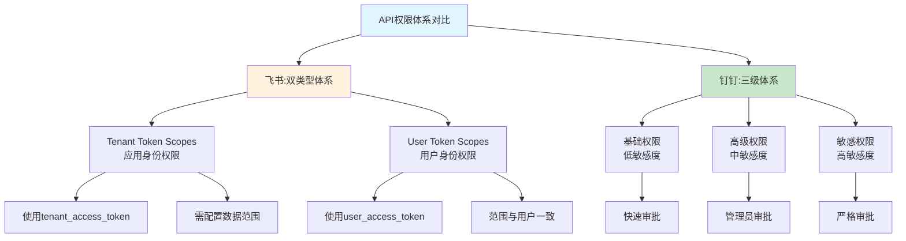

**权限体系对比：**

| 对比维度 | 飞书 | 钉钉 |
|---------|------|------|
| **权限分类** | 按身份类型分类（应用身份/用户身份） | 按敏感度分类（基础/高级/敏感） |
| **分类维度** | 调用身份维度 | 数据敏感度维度 |
| **设计理念** | 明确身份主体，细粒度控制 | 简化分类，快速审批 |
| **适用场景** | 需要区分身份的应用场景 | 需要快速集成的应用场景 |

### 3.2 API权限级别对比

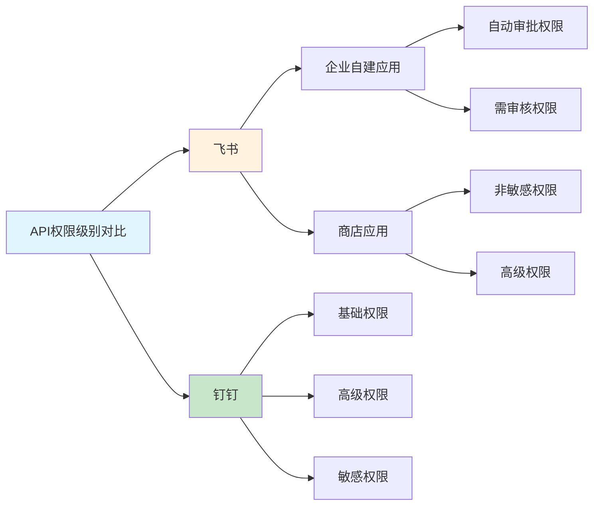

**权限级别对比表：**

| 平台 | 应用类型 | 权限级别 | 审批规则 |
|------|---------|---------|---------|
| **飞书** | 企业自建应用 | 自动审批权限 | 申请后立即生效 |
| **飞书** | 企业自建应用 | 需审核权限 | 创建版本审核后生效 |
| **飞书** | 商店应用 | 非敏感权限 | 上架审核+安装审核 |
| **飞书** | 商店应用 | 高级权限 | 双重严格审核 |
| **钉钉** | 所有应用 | 基础权限 | 快速审批生效 |
| **钉钉** | 所有应用 | 高级权限 | 管理员审批后生效 |
| **钉钉** | 所有应用 | 敏感权限 | 严格审批流程 |

### 3.3 API权限申请流程对比

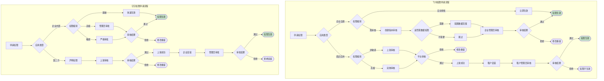

### 3.4 API权限管理特性对比

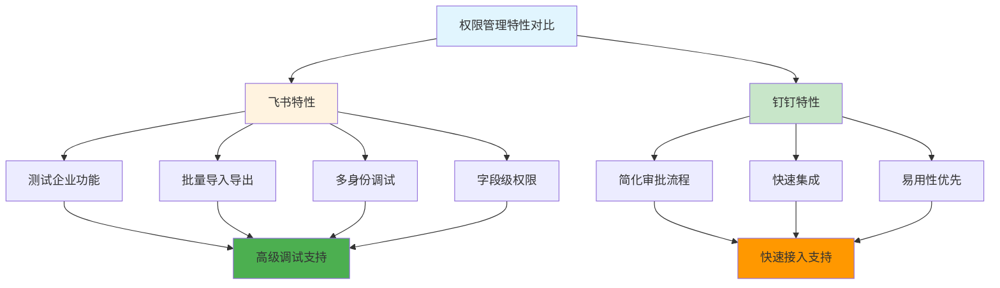

**特性对比表：**

| 特性 | 飞书 | 钉钉 | 说明 |
|------|------|------|------|
| **测试企业功能** | ✓ | - | 飞书提供测试企业，无需审核即可调试 |
| **批量导入导出** | ✓ | - | 飞书支持权限批量管理，提升效率 |
| **多身份调试** | ✓ | - | 飞书支持应用身份和用户身份调试 |
| **字段级权限** | ✓ | - | 飞书支持API响应字段权限控制 |
| **简化审批** | - | ✓ | 钉钉简化审批流程，快速生效 |
| **快速集成** | ✓ | ✓ | 两者都支持，但钉钉更简化 |
| **易用性优先** | ✓ | ✓ | 钉钉更注重易用性 |

## 四、事件开放能力对比

### 4.1 事件订阅机制对比

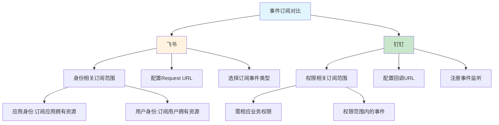

**事件订阅对比：**

| 对比维度 | 飞书 | 钉钉 |
|---------|------|------|
| **订阅范围控制** | 与身份类型相关 | 与业务权限相关 |
| **应用身份订阅** | 只能订阅应用拥有或管理的资源 | 需相应业务权限 |
| **用户身份订阅** | 只能订阅用户拥有或管理的资源 | 需相应业务权限 |
| **事件类型** | 通讯录、部门、日程、文档、审批、消息 | 通讯录、部门、审批、考勤、日程 |

### 4.2 事件类型对比

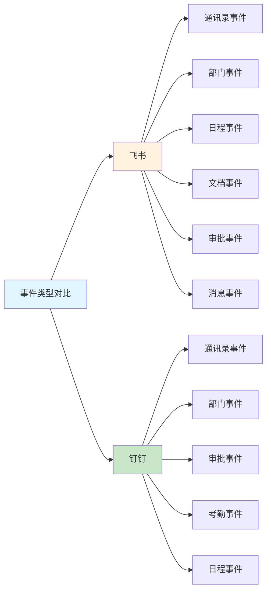

**事件类型对比表：**

| 事件类型 | 飞书支持 | 钉钉支持 |
|---------|---------|---------|
| **通讯录事件** | ✓（user.created、user.deleted等） | ✓（user_add_org等） |
| **部门事件** | ✓（department.created等） | ✓（org_dept_create等） |
| **日程事件** | ✓（calendar.event.created等） | ✓（calendar_event_create等） |
| **审批事件** | ✓（approval.instance.created） | ✓（bpms_task_change等） |
| **文档事件** | ✓（drive.file.created等） | - |
| **消息事件** | ✓（message.created等） | - |
| **考勤事件** | - | ✓（attendance_check_in等） |

## 五、权限管理设计对比

### 5.1 权限模型对比

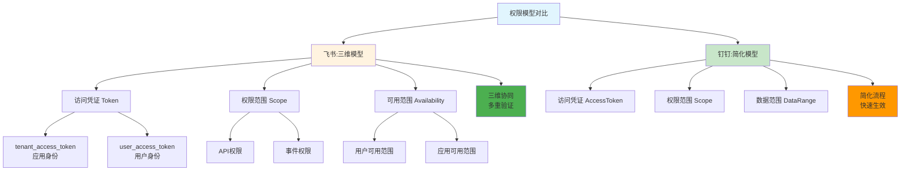

**权限模型对比：**

| 对比维度 | 风书 | 钉钉 |
|---------|------|------|
| **维度数量** | 三维（Token、Scope、Availability） | 简化三维（AccessToken、Scope、DataRange） |
| **协同机制** | 三维协同，多重验证 | 相对简化，快速验证 |
| **身份区分** | 明确区分应用身份和用户身份 | 相对简化 |
| **权限精细度** | 高 | 中 |

### 5.2 权限管理流程对比

```mermaid
flowchart TD
    subgraph 风书权限验证流程
    A1[API调用] --> A2[验证Token]
    A2 --> A3{Token类型}
    A3 -->|tenant_access_token| A4[验证应用身份]
    A3 -->|user_access_token| A5[验证用户身份]
    A4 --> A6[验证Scope权限]
    A5 --> A6
    A6 --> A7{权限是否满足}
    A7 -->|不满足| A8([权限错误])
    A7 -->|满足| A9{数据权限}
    A9 -->|应用身份| A10[验证应用数据范围]
    A9 -->|用户身份| A11[验证用户权限范围]
    A10 --> A12{数据是否在范围内}
    A11 --> A12
    A12 -->|不在范围| A13([数据权限错误])
    A12 -->|在范围| A14[查询数据]
    A14 --> A15[字段权限过滤]
    A15 --> A16([返回已授权数据])
    end
    
    subgraph 钉钉权限验证流程
    B1[API调用] --> B2[验证AccessToken]
    B2 --> B3[验证Scope权限]
    B3 --> B4{权限是否满足}
    B4 -->|不满足| B5([权限错误])
    B4 -->|满足| B6[验证数据范围]
    B6 --> B7{数据是否在范围内}
    B7 -->|不在范围| B8([数据权限错误])
    B7 -->|在范围| B9[查询数据]
    B9 --> B10([返回数据])
    end
    
    style A16 fill:#c8e6c9
    style A8 fill:#ffcdd2
    style A13 fill:#ffcdd2
    style B10 fill:#c8e6c9
    style B5 fill:#ffcdd2
    style B8 fill:#ffcdd2
```

**验证流程对比：**

| 验证步骤 | 飞书 | 钉钉 |
|---------|------|------|
| **Token验证** | 验证Token类型和有效性 | 验证AccessToken有效性 |
| **Scope验证** | 验证API权限是否满足 | 验证API权限是否满足 |
| **身份区分** | 区分应用身份和用户身份 | 相对简化 |
| **数据范围验证** | 根据身份验证不同数据范围 | 验证数据权限配置 |
| **字段过滤** | 根据字段权限过滤响应数据 | 无字段级过滤 |

### 5.3 用户身份体系对比

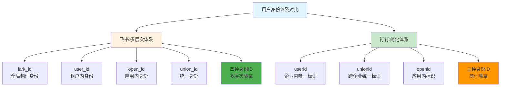

**身份ID对比表：**

| ID类型 | 飞书 | 钉钉 | 生成时机 | 唯一性范围 |
|-------|------|------|---------|-----------|
| **物理身份** | lark_id | - | 注册时 | 全局唯一 |
| **租户内身份** | user_id | userid | 加入租户/企业时 | 租户/企业内唯一 |
| **应用内身份** | open_id | openid | 首次启用应用时 | 应用内唯一 |
| **统一身份** | union_id | unionid | 首次启用应用时 | 同一开发商统一 |
| **ID数量** | 4种 | 3种 | - | 飞书更全面 |

## 六、数据开放与能力开放关系对比

### 6.1 开放层次架构对比

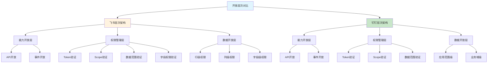

**层次架构对比：**

| 层次 | 飞书 | 钉钉 | 说明 |
|------|------|------|------|
| **能力开放层** | API+事件开放 | API+事件开放 | 相似 |
| **权限管理层** | 四重验证（Token、Scope、数据范围、字段） | 三重验证（Token、Scope、数据范围） | 飞书更全面 |
| **数据开放层** | 行级+列级+字段级权限 | 应用范围+业务域级权限 | 飞书更精细 |

### 6.2 协同机制对比

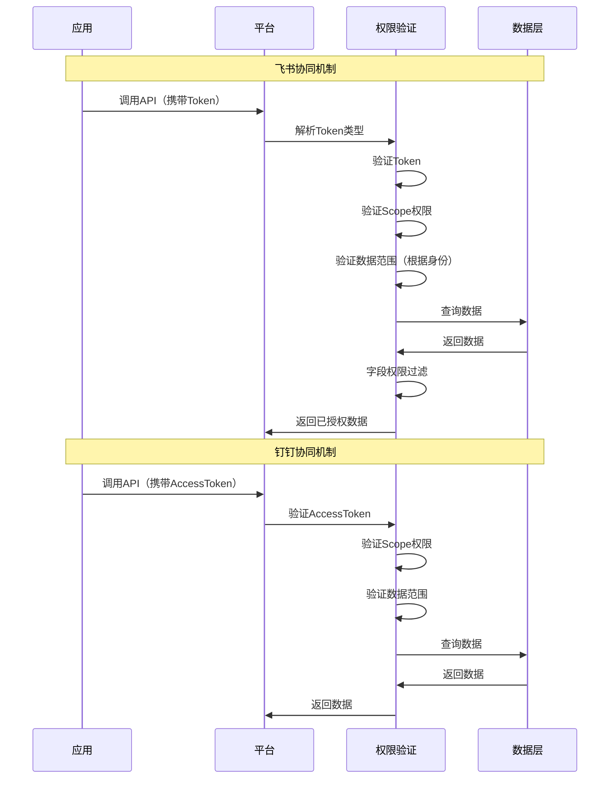

**协同机制对比：**

| 协同环节 | 飞书 | 钉钉 |
|---------|------|------|
| **身份解析** | 区分应用身份和用户身份 | 相对简化 |
| **权限验证** | Scope+数据范围双重验证 | Scope+数据范围双重验证 |
| **数据范围** | 根据身份验证不同数据范围 | 验证配置的数据范围 |
| **字段过滤** | 根据字段权限过滤响应 | 无字段级过滤 |

### 6.3 依赖关系对比

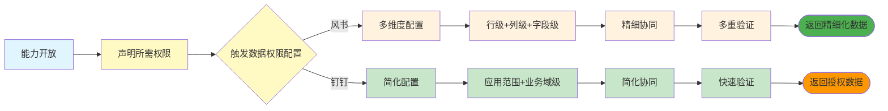

**依赖关系对比：**

| 依赖环节 | 风书 | 钉钉 |
|---------|------|------|
| **能力声明** | API/事件声明所需权限 | API/事件声明所需权限 |
| **数据配置触发** | 某些API触发多维度数据配置 | 某些API触发简化数据配置 |
| **配置维度** | 行级+列级+字段级三维 | 应用范围+业务域二维 |
| **协同验证** | 多重验证，精细控制 | 简化验证，快速响应 |
| **数据返回** | 根据字段权限过滤 | 返回授权范围内数据 |

## 七、综合对比评分

### 7.1 多维度对比评分表

| 对比维度 | 飞书评分 | 钉钉评分 | 说明 |
|---------|---------|---------|------|
| **数据开放精细度** | 5/5 | 3/5 | 飞书行级+列级+字段级，钉钉简化 |
| **数据开放灵活性** | 5/5 | 3/5 | 风书支持复杂条件配置，钉钉简化 |
| **数据开放业务域** | 5/5 | 4/5 | 风书7个业务域，钉钉5个核心业务域 |
| **API权限精细度** | 5/5 | 3/5 | 飞书双类型体系+字段级权限，钉钉三级体系 |
| **API权限申请流程** | 4/5 | 4/5 | 飞书更规范但复杂，钉钉简化但高效 |
| **API权限管理工具** | 5/5 | 3/5 | 飞书批量导入导出+测试企业，钉钉简化 |
| **事件开放能力** | 4/5 | 4/5 | 飞书6类事件，钉钉5类事件 |
| **事件订阅控制** | 5/5 | 4/5 | 风书身份相关订阅，钉钉权限相关订阅 |
| **权限模型完善度** | 5/5 | 3/5 | 飞书三维模型+多重验证，钉钉简化模型 |
| **权限验证流程** | 5/5 | 4/5 | 风书五步验证+字段过滤，钉钉四步验证 |
| **用户身份体系** | 5/5 | 4/5 | 风书四种ID多层次隔离，钉钉三种ID简化 |
| **开发调试支持** | 5/5 | 3/5 | 风书测试企业+多身份调试，钉钉简化 |
| **易用性** | 3/5 | 5/5 | 风书复杂但规范，钉钉简化易用 |
| **快速集成** | 4/5 | 5/5 | 风书需审核流程，钉钉快速生效 |
| **安全保障** | 5/5 | 4/5 | 风书多维保障，钉钉基本保障 |

**总体评分：**
- 风书：67/75（精细度、安全性、灵活性优势）
- 钉钉：56/75（易用性、快速集成优势）

### 7.2 适用场景对比

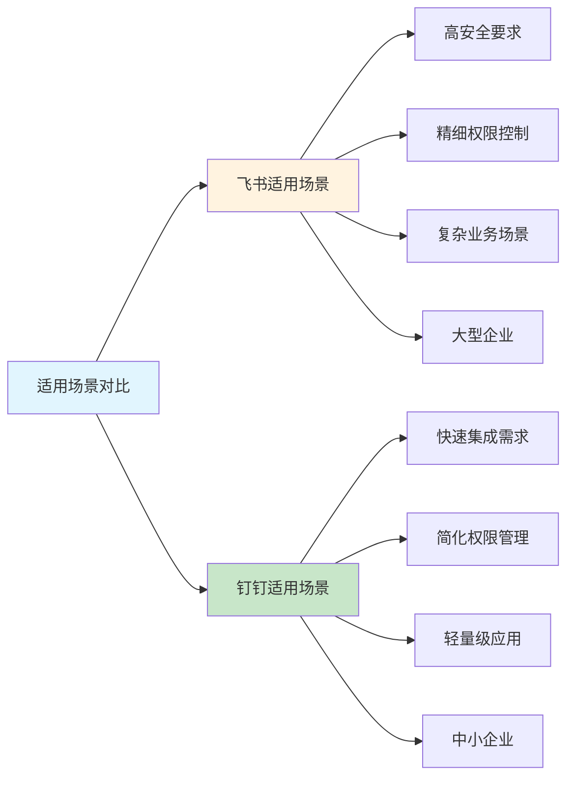

**适用场景对比表：**

| 应用场景 | 推荐平台 | 理由 |
|---------|---------|------|
| **大型企业深度集成** | 飞书 | 精细权限控制，多维安全保障 |
| **高安全要求应用** | 飞书 | 字段级权限，多重验证机制 |
| **复杂业务数据访问** | 飞书 | 多维度数据权限配置，灵活条件过滤 |
| **快速开发原型应用** | 钉钉 | 简化审批流程，快速权限生效 |
| **中小企业轻量集成** | 钉钉 | 易用性高，降低接入门槛 |
| **移动端快速应用** | 钉钉 | 移动优先，小程序快速部署 |

## 八、核心差异总结

### 8.1 设计理念差异

```mermaid
graph TD
    A[核心差异对比] --> B[设计理念]
    A --> C[权限精细度]
    A --> D[管理工具]
    A --> E[适用场景]
    
    B --> B1[飞书]
    B --> B2[钉钉]
    
    B1 --> B11[精细化控制]
    B1 --> B12[多维保障]
    B1 --> B13[开发者友好]
    
    B2 --> B21[易用性优先]
    B2 --> B22[快速集成]
    B2 --> B23[简化流程]
    
    C --> C1[飞书]
    C --> C2[钉钉]
    
    C1 --> C11[行级+列级+字段级]
    C1 --> C12[三维模型]
    C1 --> C13[多重验证]
    
    C2 --> C21[应用范围+业务域]
    C2 --> C22[简化模型]
    C2 --> C23[快速验证]
    
    D --> D1[飞书]
    D --> D2[钉钉]
    
    D1 --> D11[批量导入导出]
    D1 --> D12[测试企业功能]
    D1 --> D13[多身份调试]
    
    D2 --> D21[简化配置界面]
    D2 --> D22[快速审批流程]
    D2 --> D23[易用性工具]
    
    E --> E1[飞书]
    E --> E2[钉钉]
    
    E1 --> E11[大型企业]
    E1 --> E12[高安全要求]
    E1 --> E13[复杂业务]
    
    E2 --> E21[中小企业]
    E2 --> E22[快速集成]
    E2 --> E23[轻量应用]
    
    style A fill:#e1f5fe
    style B fill:#fff3e0
    style C fill:#fff3e0
    style D fill:#fff3e0
    style E fill:#fff3e0
```

### 8.2 关键差异对比表

| 差异维度 | 风书 | 钉钉 | 影响 |
|---------|------|------|------|
| **权限粒度** | 最细（字段级） | 较粗（业务域级） | 风书数据安全更强，钉钉更易管理 |
| **审批流程** | 规范复杂 | 简化快速 | 风书更严谨，钉钉更高效 |
| **调试支持** | 丰富工具 | 简化支持 | 风书开发体验更好，钉钉更易上手 |
| **身份体系** | 多层次隔离 | 简化隔离 | 风书更灵活，钉钉更简单 |
| **配置复杂度** | 高复杂度 | 低复杂度 | 风书更强大，钉钉更易用 |

### 8.3 优劣对比

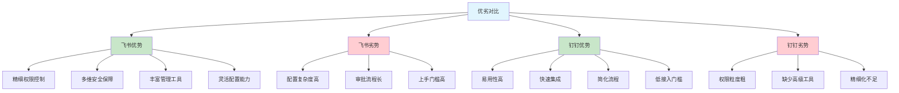

## 九、借鉴建议

### 9.1 从飞书借鉴的设计要点

钉钉可从飞书借鉴以下设计要点：

1. **引入字段级权限控制**
   - 在API响应中实现字段级权限过滤
   - 提供字段权限申请和配置机制
   - 增强数据安全保障

2. **完善三维权限模型**
   - 明确区分应用身份和用户身份
   - 实现Token、Scope、Availability三维协同
   - 提供多重验证机制

3. **增强数据权限配置灵活性**
   - 支持复杂条件过滤配置
   - 提供更多业务域数据权限配置
   - 实现灵活的数据范围控制

4. **丰富权限管理工具**
   - 提供批量权限导入导出功能
   - 实现测试企业快速调试功能
   - 支持多身份调试机制

5. **完善用户身份体系**
   - 引入物理身份ID（类似lark_id）
   - 实现多层次身份隔离
   - 提供更灵活的身份关联机制

### 9.2 从钉钉借鉴的设计要点

飞书可从钉钉借鉴以下设计要点：

1. **简化配置界面**
   - 提供更友好的配置界面设计
   - 简化复杂配置流程
   - 提升易用性

2. **优化快速审批流程**
   - 对低敏感权限进一步简化审批
   - 提供更快速的权利生效机制
   - 降低接入门槛

3. **支持多应用形态**
   - 提供小程序开发支持
   - 支持H5微应用形态
   - 丰富应用开发选择

4. **优化移动端体验**
   - 加强移动端原生体验
   - 提供移动端优先设计
   - 优化移动端开发流程

### 9.3 最佳实践建议

```mermaid
graph TD
    A[最佳实践建议] --> B[权限管理设计]
    A --> C[数据开放设计]
    A --> D[能力开放设计]
    
    B --> B1[精细化+易用性平衡]
    B --> B2[多维模型+简化流程平衡]
    B --> B3[丰富工具+友好界面平衡]
    
    C --> C1[多维度+简化配置平衡]
    C --> C2[灵活配置+快速生效平衡]
    C --> C3[全面业务域+核心业务域平衡]
    
    D --> D1[规范流程+快速集成平衡]
    D --> D2[多重验证+快速响应平衡]
    D --> D3[严格审批+灵活调试平衡]
    
    style A fill:#e1f5fe
    style B fill:#fff3e0
    style C fill:#fff3e0
    style D fill:#c8e6c9
```

**最佳实践建议：**

| 设计维度 | 建议 | 说明 |
|---------|------|------|
| **权限管理** | 精细化+易用性平衡 | 既要精细控制，又要易用管理 |
| **数据开放** | 多维度+简化配置平衡 | 既要全面控制，又要简化配置 |
| **能力开放** | 规范流程+快速集成平衡 | 既要规范流程，又要快速接入 |
| **开发调试** | 严格审批+灵活调试平衡 | 既要严格审批，又要灵活调试 |
| **用户体验** | 丰富功能+友好界面平衡 | 既要功能丰富，又要界面友好 |

## 十、总结

飞书和钉钉开放平台在数据开放与能力开放及权限管理设计方面体现了不同的设计理念：

**飞书特点：**
- 精细化权限控制，多维安全保障
- 三维权限模型，多重验证机制
- 字段级权限控制，最细粒度数据保护
- 丰富的权限管理工具，灵活的开发调试支持
- 适合大型企业、高安全要求、复杂业务场景

**钉钉特点：**
- 简化权限流程，易用性优先
- 三级权限体系，快速审批生效
- 简化的数据权限配置，快速集成
- 多应用形态支持，移动优先设计
- 适合中小企业、快速集成、轻量级应用场景

**核心差异：**
- 权限精细度：飞书更精细（字段级），钉钉较粗（业务域级）
- 配置复杂度：飞书复杂强大，钉钉简单易用
- 审批流程：飞书规范严谨，钉钉简化快速
- 开发调试：飞书工具丰富，钉钉上手简单
- 适用场景：飞书适合大型企业，钉钉适合中小企业

**借鉴建议：**
- 钉钉可借鉴飞书的精细化控制、多维模型、丰富工具
- 风书可借鉴钉钉的简化流程、易用性设计、多形态支持
- 最佳实践应在精细化与易用性、规范与快速、丰富与简洁之间找到平衡

两个平台各有优势，应根据具体场景选择合适的平台，或借鉴两者优点设计适合自身需求的开放平台体系。