# 飞书开放平台数据与能力开放调研报告

## 一、概述

飞书开放平台为企业提供了全面的开放能力体系，涵盖了数据开放、API开放、事件开放等多个维度。飞书的开放体系采用多维度的权限管理机制，确保企业数据安全的同时，为开发者提供灵活的接入能力。

### 1.1 开放平台核心定位

飞书开放平台的核心定位：
- **企业协作平台的开放生态**：提供组织架构、通讯录、日程、文档、消息等核心业务能力的开放
- **多维度权限控制**：通过访问凭证（Token）、权限范围（Scope）、可用范围（Availability）三维控制
- **安全与灵活平衡**：在保护企业数据安全的前提下，为开发者提供足够的灵活性

### 1.2 应用类型

飞书开放平台支持两种应用类型：
- **企业自建应用（Custom App）**：企业内部开发的应用，仅在该企业内使用
- **商店应用（Store App）**：第三方开发的应用，可上架到应用商店供多个企业安装使用

## 二、数据开放能力

### 2.1 数据开放架构

飞书的数据开放采用分层架构，通过数据权限精确控制应用可访问的数据范围。

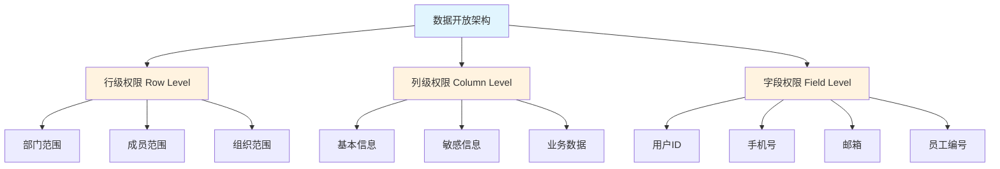

### 2.2 数据权限管理

#### 2.2.1 数据权限类型

飞书支持多种业务域的数据权限配置：

| 业务域 | 权限说明 | 默认配置 | 配置方式 |
|--------|---------|---------|---------|
| **通讯录** | 应用可访问的通讯录数据范围（部门、成员） | 与应用可用范围一致 | 开发者控制台或管理后台 |
| **组织架构** | 应用可访问的组织成员数据范围 | 未配置（需手动配置） | 开发者控制台 |
| **飞书人事** | 应用可访问的人事数据范围（员工、部门） | 空（需手动配置） | 开发者控制台 |
| **任务** | 应用可访问的任务或任务列表数据范围 | 未配置（需手动配置） | 开发者控制台 |
| **邮箱** | 应用可访问的邮箱资源数据范围 | 未配置（需手动配置） | 开发者控制台 |
| **妙记** | 应用可访问的文档相关资源数据范围 | 未配置（需手动配置） | 开发者控制台 |
| **薪资** | 应用可访问的薪资相关资源数据范围 | 未配置（需手动配置） | 开发者控制台 |

#### 2.2.2 数据权限配置流程

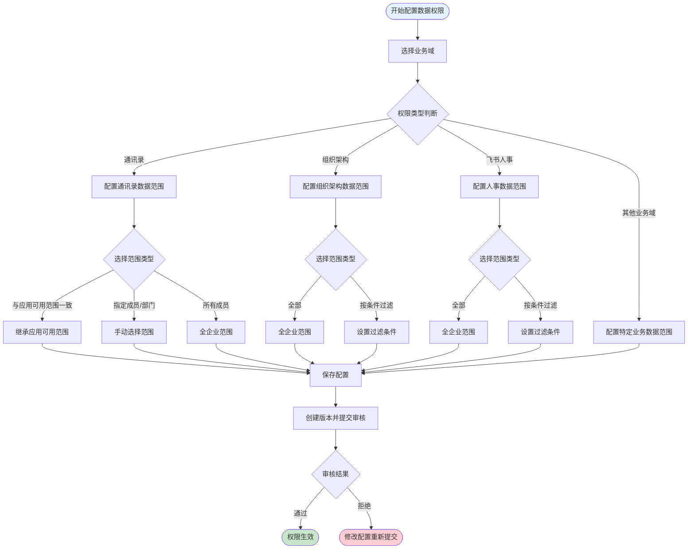

### 2.3 数据权限与身份类型的关系

飞书的数据权限与应用身份类型密切相关：

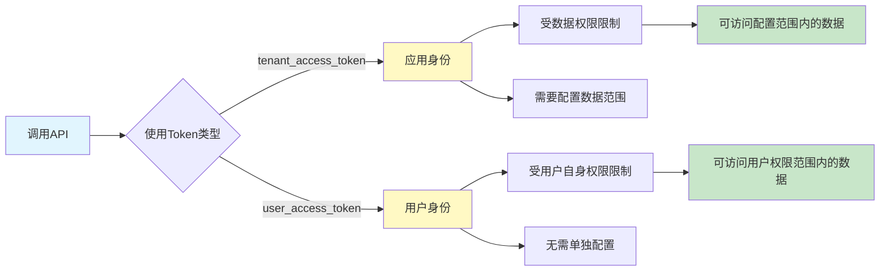

**关键差异点：**
- **应用身份（tenant_access_token）**：需要配置数据权限范围，只能访问配置范围内的数据
- **用户身份（user_access_token）**：无需单独配置数据权限，可访问范围与用户自身权限一致

### 2.4 字段级权限控制

飞书实现了精细化的字段级权限控制，API响应中的不同字段需要不同的权限：

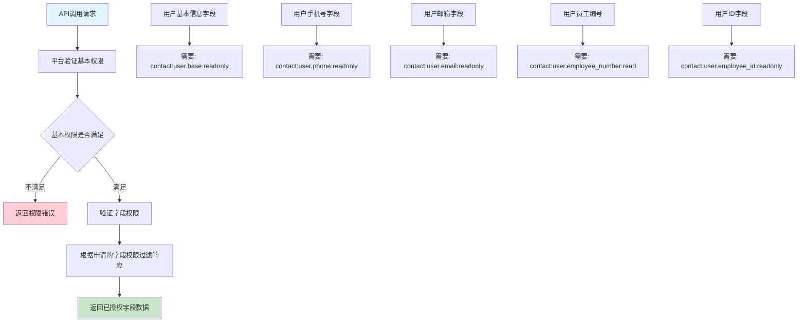

**示例：获取用户信息API的权限要求**

| 字段 | 所需权限 | 说明 |
|------|---------|------|
| name, nickname, en_name | contact:user.base:readonly | 基本信息权限 |
| email | contact:user.email:readonly | 邮箱权限 |
| mobile | contact:user.phone:readonly | 手机号权限 |
| employee_no | contact:user.employee_number:read | 员工编号权限 |
| user_id | contact:user.employee_id:readonly | 用户ID权限 |
| gender | contact:user.gender:readonly | 性别权限 |
| department_ids | contact:user.department:readonly | 组织信息权限 |

## 三、API开放能力

### 3.1 API权限体系

飞书的API权限采用Scope机制，分为两大类型：

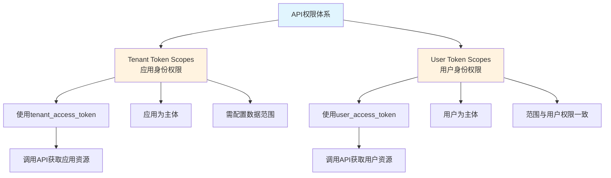

### 3.2 API权限级别

#### 3.2.1 企业自建应用权限级别

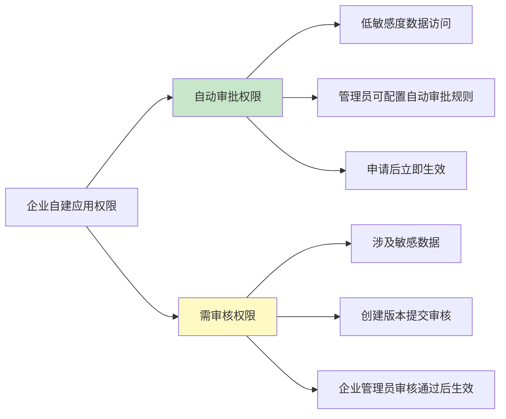

**权限级别说明：**

| 权限类型 | 说明 | 审核规则 |
|---------|------|---------|
| **自动审批权限** | 低敏感度数据访问权限 | 租户管理员可配置自动审批规则，无需审核，申请后立即生效 |
| **需审核权限** | 涉及敏感数据的权限 | 需创建版本并提交审核，企业管理员审核通过后才生效 |

#### 3.2.2 商店应用权限级别

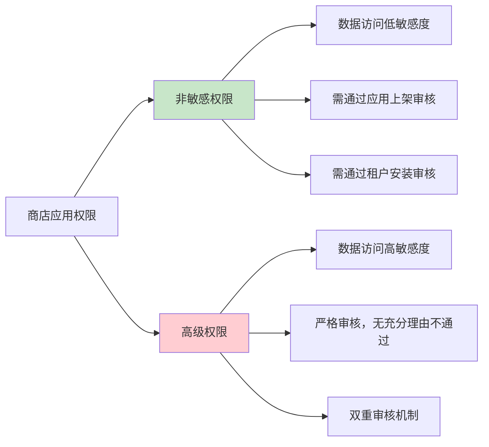

**权限级别说明：**

| 权限类型 | 说明 | 审核规则 |
|---------|------|---------|
| **非敏感权限** | 数据访问低敏感度 | 需通过应用上架审核（飞书平台审核）和租户安装审核（租户管理员审核） |
| **高级权限** | 数据访问高敏感度 | 严格审核，无充分理由不通过，双重审核机制 |

### 3.3 API权限申请流程

#### 3.3.1 企业自建应用权限申请流程

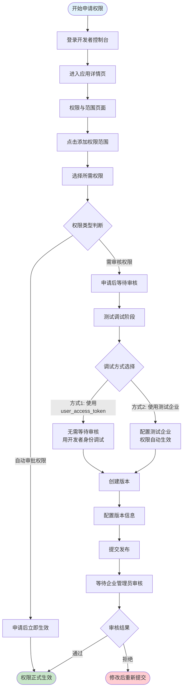

#### 3.3.2 商店应用权限申请流程

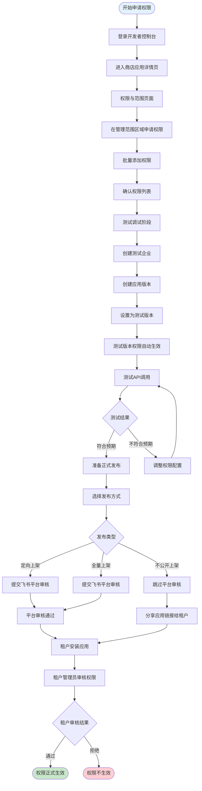

### 3.4 API权限管理特性

#### 3.4.1 批量导入导出权限

飞书提供权限的批量导入导出功能：

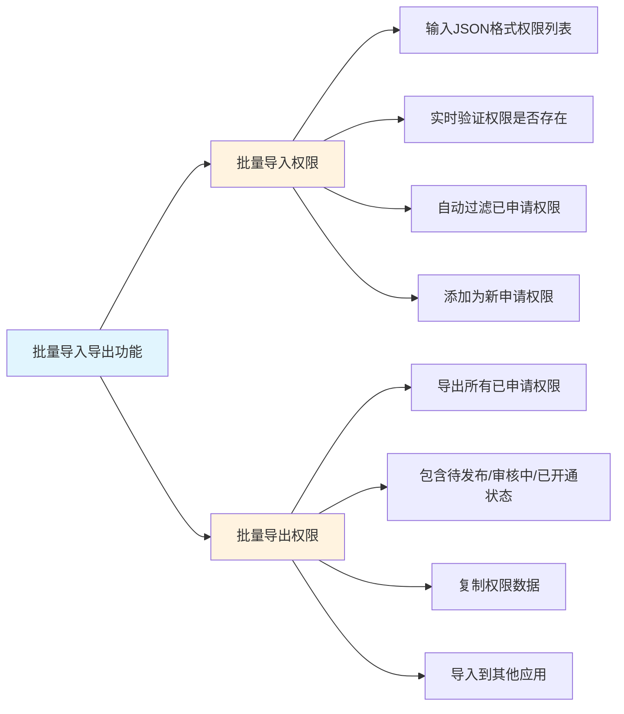

**功能优势：**
- 跨应用迁移权限数据
- 快速复制权限配置
- 避免重复申请

#### 3.4.2 测试企业功能

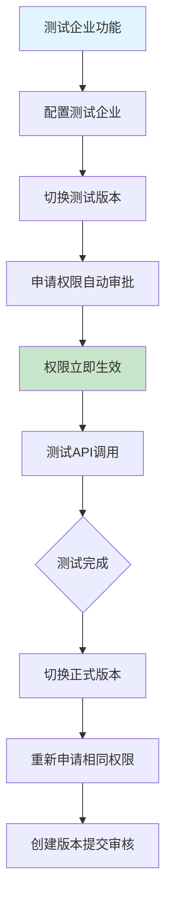

**使用场景：**
- 快速调试需要审核的API
- 无需等待审核流程
- 测试完成后迁移到正式版本

## 四、事件开放能力

### 4.1 事件订阅机制

飞书提供事件订阅机制，允许应用监听企业内的业务事件：

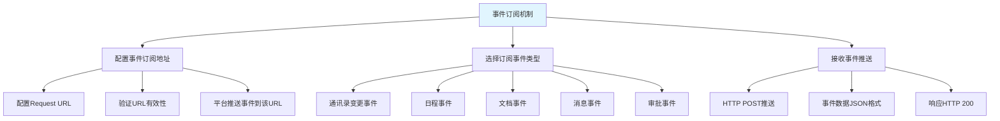

### 4.2 事件订阅流程

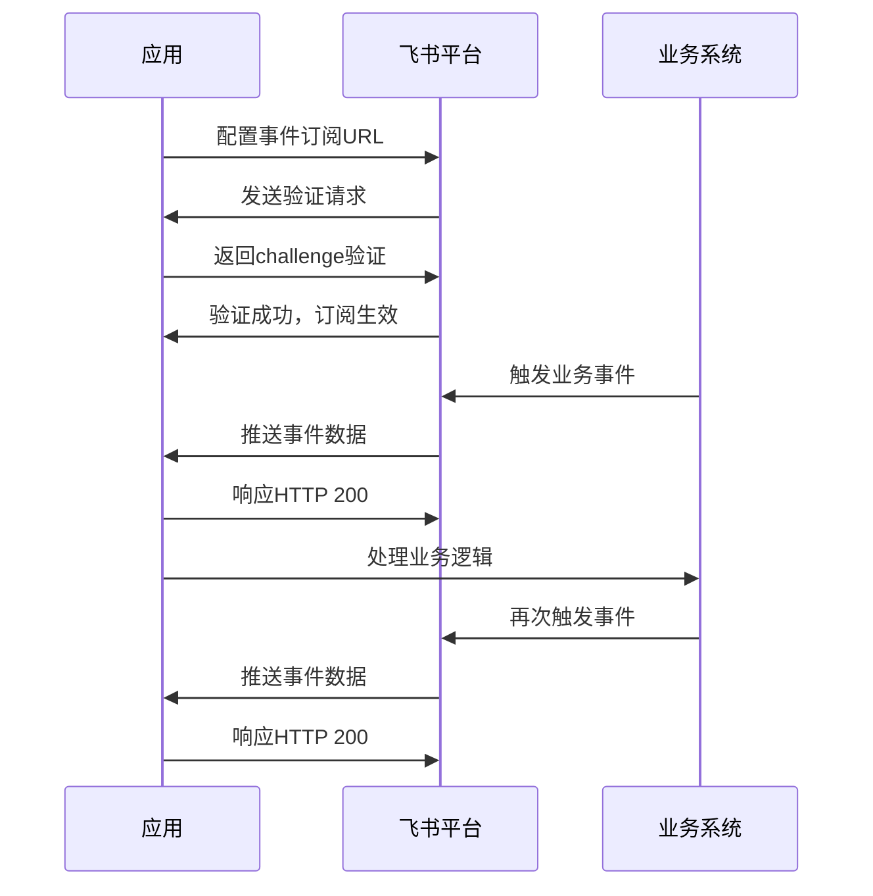

### 4.3 事件权限控制

事件订阅同样需要权限控制：

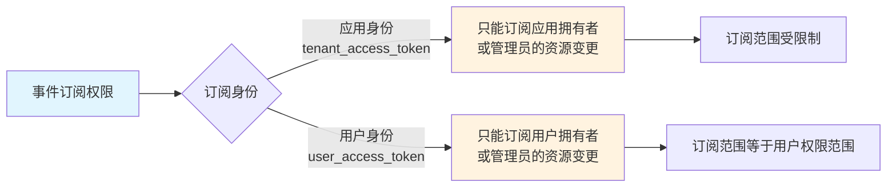

**示例：文档变更事件订阅**

| 订阅方式 | 可订阅范围 | 说明 |
|---------|-----------|------|
| tenant_access_token | 应用拥有或管理的文档 | 应用身份订阅，范围受限 |
| user_access_token | 用户拥有或管理的文档 | 用户身份订阅，范围与用户权限一致 |

### 4.4 事件类型示例

飞书支持多种事件类型：

| 事件分类 | 事件示例 | 说明 |
|---------|---------|------|
| **通讯录事件** | user.created、user.deleted、user.updated | 用户增删改事件 |
| **部门事件** | department.created、department.deleted | 部门增删事件 |
| **日程事件** | calendar.event.created、calendar.event.updated | 日程事件变更 |
| **文档事件** | drive.file.created、drive.file.deleted | 文档增删事件 |
| **审批事件** | approval.instance.created | 审批实例创建 |
| **消息事件** | message.created、message.read | 消息创建和阅读事件 |

## 五、数据开放与能力开放的关系

### 5.1 三维权限模型

飞书开放平台采用三维权限模型：

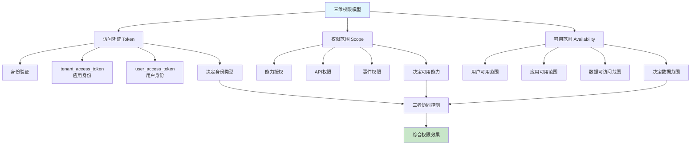

### 5.2 数据开放与API开放的层次关系

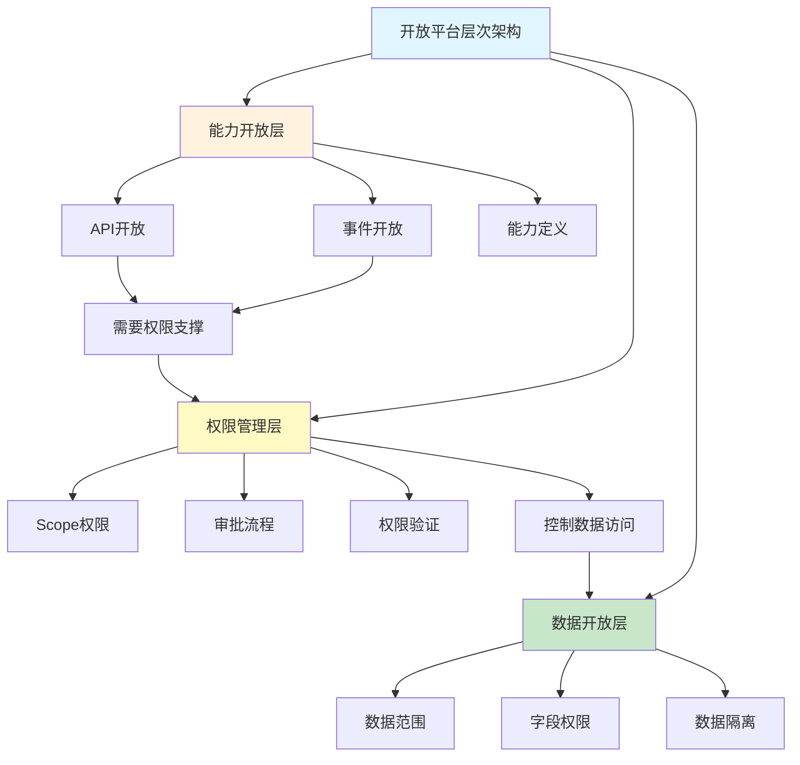

### 5.3 数据开放与能力开放的协同机制

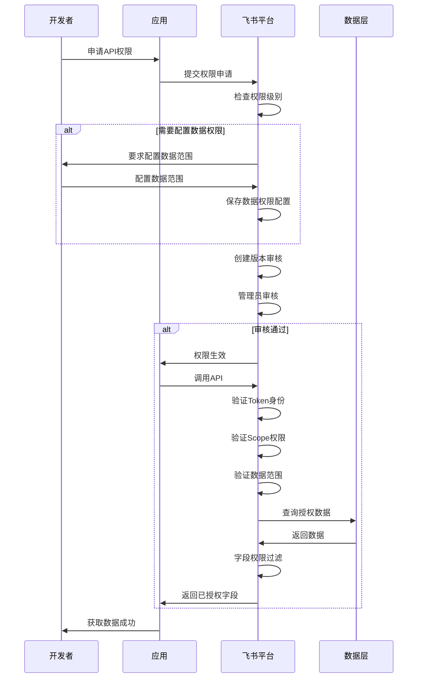

**关键协同点：**
1. **API权限申请触发数据权限配置**：申请某些API权限时，必须配置相应的数据范围
2. **多层验证机制**：API调用时依次验证Token、Scope、数据范围
3. **字段级过滤**：响应数据根据申请的字段权限进行过滤

### 5.4 数据开放与能力开放的依赖关系

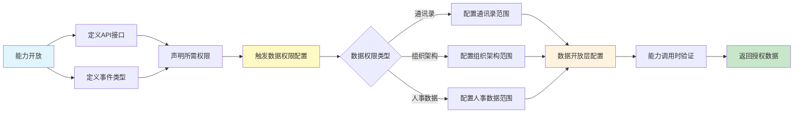

## 六、权限管理设计总结

### 6.1 权限管理核心设计

飞书开放平台的权限管理设计核心要素：

```mermaid
graph TD
    A[飞书权限管理核心要素] --> B[三维权限模型]
    A --> C[分层权限控制]
    A --> D[审批机制]
    A --> E[安全保障]
    
    B --> B1[访问凭证Token]
    B --> B2[权限范围Scope]
    B --> B3[可用范围Availability]
    
    B1 --> B11[tenant_access_token]
    B1 --> B12[user_access_token]
    
    B2 --> B21[API权限]
    B2 --> B22[事件权限]
    
    B3 --> B31[用户可用范围]
    B3 --> B32[应用可用范围]
    
    C --> C1[能力层权限]
    C --> C2[数据层权限]
    
    C1 --> C11[API权限申请]
    C1 --> C12[事件订阅权限]
    
    C2 --> C21[行级权限]
    C2 --> C22[列级权限]
    C2 --> C23[字段级权限]
    
    D --> D1[自动审批]
    D --> D2[审核审批]
    
    D1 --> D11[低敏感度权限]
    D1 --> D12[配置自动审批规则]
    
    D2 --> D21[高敏感度权限]
    D2 --> D22[双重审核机制]
    
    E --> E1[身份验证]
    E --> E2[权限验证]
    E --> E3[数据隔离]
    
    E1 --> E11[Token验证]
    E1 --> E12[身份隔离]
    
    E2 --> E21[Scope验证]
    E2 --> E22[数据范围验证]
    
    E3 --> E31[租户隔离]
    E3 --> E32[应用隔离]
    
    style A fill:#e1f5fe
    style B fill:#fff3e0
    style C fill:#fff3e0
    style D fill:#fff3e0
    style E fill:#fff3e0
```

### 6.2 权限管理流程全景

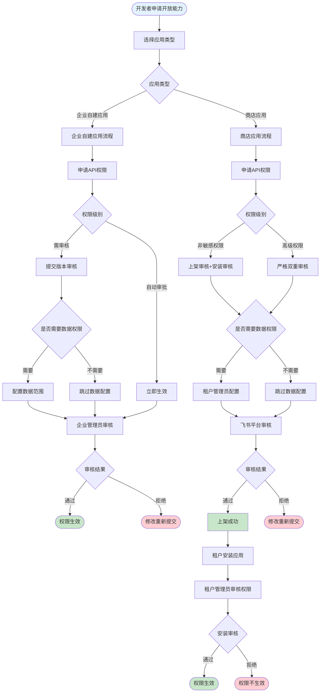

### 6.3 API调用时的权限验证流程

```mermaid
sequenceDiagram
    participant Client as 客户端
    participant App as 应用
    participant Platform as 飞书平台
    participant Auth as 权限验证层
    participant Data as 数据层
    
    Client->>App: 发起请求
    App->>Platform: 调用API（携带Token）
    
    Platform->>Auth: 解析Token类型
    Auth->>Auth: 验证Token有效性
    
    Auth->>Auth: 查询应用Scope权限
    Auth->>Auth: 检查API权限是否满足
    
    alt 权限不满足
        Auth->>Platform: 返回权限错误
        Platform->>App: 权限错误响应
        App->>Client: 错误提示
    end
    
    Auth->>Auth: 查询数据权限配置
    
    alt 使用tenant_access_token
        Auth->>Auth: 验证应用数据范围
        Auth->>Auth: 检查请求资源是否在范围内
    else 使用user_access_token
        Auth->>Auth: 验证用户权限范围
        Auth->>Auth: 检查用户是否有权访问资源
    end
    
    alt 数据权限不满足
        Auth->>Platform: 返回数据权限错误
        Platform->>App: 权限错误响应
        App->>Client: 错误提示
    end
    
    Auth->>Data: 查询数据
    Data->>Auth: 返回原始数据
    
    Auth->>Auth: 字段权限过滤
    Auth->>Auth: 根据字段权限过滤响应
    
    Auth->>Platform: 返回已授权数据
    Platform->>App: 返回响应
    App->>Client: 业务响应
```

### 6.4 用户身份体系

飞书采用多层次的用户身份体系：

```mermaid
graph TD
    A[用户身份体系] --> B[lark_id<br/>全局物理身份]
    A --> C[user_id<br/>租户内身份]
    A --> D[open_id<br/>应用内身份]
    A --> E[union_id<br/>统一身份]
    
    B --> B1[注册时生成]
    B --> B2[不可见]
    B --> B3[数据隔离基础]
    
    C --> C1[租户内唯一]
    C --> C2[不同租户不同]
    C --> C3[支持自定义]
    C --> C4[跨应用通信]
    
    D --> D1[应用内唯一]
    D --> D2[不同应用不同]
    D --> D3[系统分配]
    D --> D4[应用内使用]
    
    E --> E1[同一开发商统一]
    E --> E2[跨应用关联]
    E --> E3[系统分配]
    E --> E4[多应用场景]
    
    style A fill:#e1f5fe
    style B fill:#fff3e0
    style C fill:#fff3e0
    style D fill:#fff3e0
    style E fill:#fff3e0
```

**身份ID关系说明：**

| ID类型 | 生成时机 | 唯一性范围 | 使用场景 |
|-------|---------|-----------|---------|
| **lark_id** | 用户注册飞书时 | 全局唯一 | 系统内部使用，开发者不可见 |
| **user_id** | 用户加入租户时 | 租户内唯一，不同租户不同 | 跨应用通信，企业内部系统集成 |
| **open_id** | 用户首次启用应用时 | 应用内唯一，不同应用不同 | 应用内使用，API调用 |
| **union_id** | 用户首次启用应用时 | 同一开发商的应用统一 | 多应用关联，跨应用数据打通 |

## 七、飞书开放平台优势与特色

### 7.1 核心优势

1. **多维权限控制**：Token、Scope、Availability三维协同，精细化权限管理
2. **分层权限架构**：能力层权限+数据层权限，双重安全保障
3. **字段级权限**：API响应字段权限控制，最细粒度数据保护
4. **灵活审批机制**：自动审批+审核审批，平衡效率与安全
5. **测试企业功能**：无需等待审核即可测试，提升开发效率
6. **批量权限管理**：导入导出功能，简化权限配置流程

### 7.2 设计特色

```mermaid
graph TD
    A[飞书开放平台特色] --> B[精细化权限控制]
    A --> C[多层次身份体系]
    A --> D[灵活的开发流程]
    A --> E[双重安全保障]
    
    B --> B1[三维权限模型]
    B --> B2[字段级权限]
    B --> B3[行级+列级权限]
    
    C --> C1[四种身份ID]
    C --> C2[租户隔离]
    C --> C3[应用隔离]
    
    D --> D1[测试企业功能]
    D --> D2[批量权限管理]
    D --> D3[多身份调试]
    
    E --> E1[身份验证]
    E --> E2[权限验证]
    E --> E3[数据验证]
    
    style A fill:#e1f5fe
    style B fill:#fff3e0
    style C fill:#fff3e0
    style D fill:#c8e6c9
    style E fill:#c8e6c9
```

## 八、总结

飞书开放平台的数据开放与能力开放体系设计体现了以下核心思想：

1. **层次化架构**：能力开放定义接口能力，数据开放控制数据访问，权限管理提供保障机制
2. **协同控制**：三维权限模型协同工作，确保每次API调用都经过多重验证
3. **精细化控制**：从API级别到字段级别的多层次权限，实现最细粒度的数据保护
4. **安全与效率平衡**：通过自动审批、测试企业、批量管理等功能，在保障安全的前提下提升开发效率
5. **灵活适配**：支持企业自建应用和商店应用两种模式，满足不同场景需求

飞书的开放平台设计为企业数据开放提供了完整的安全保障体系，同时为开发者提供了灵活高效的接入能力，是现代企业协作平台开放体系的典型代表。