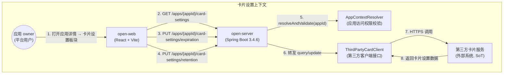
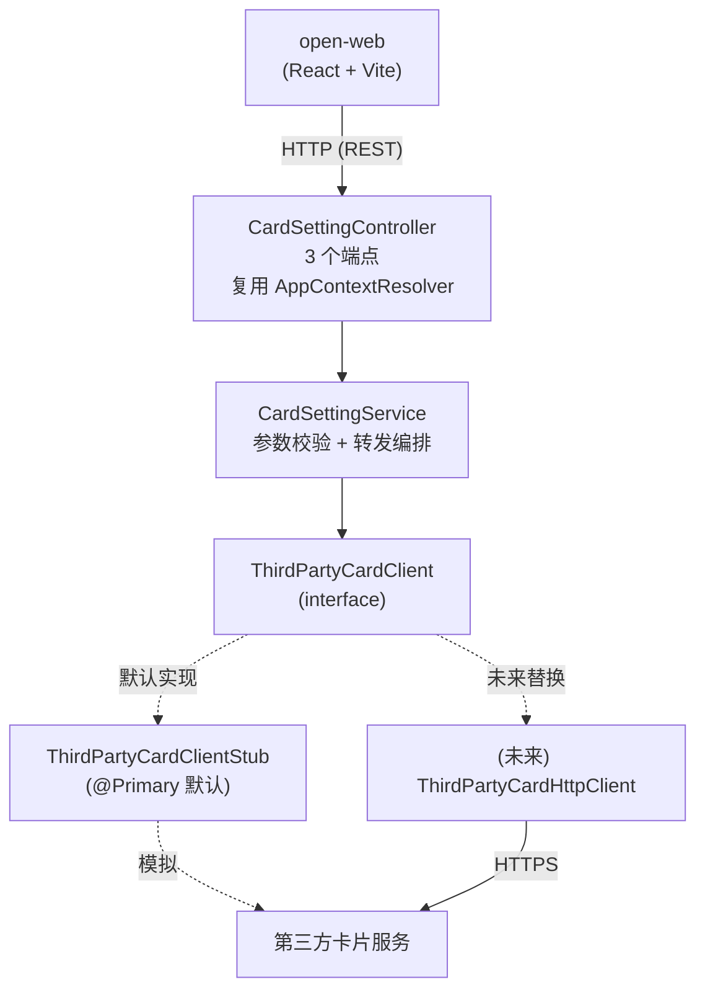
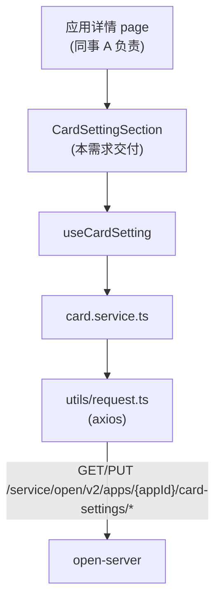
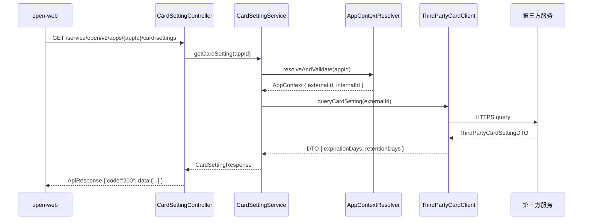
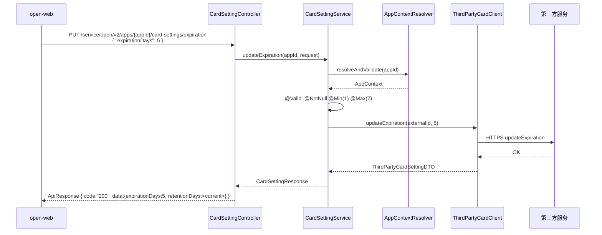
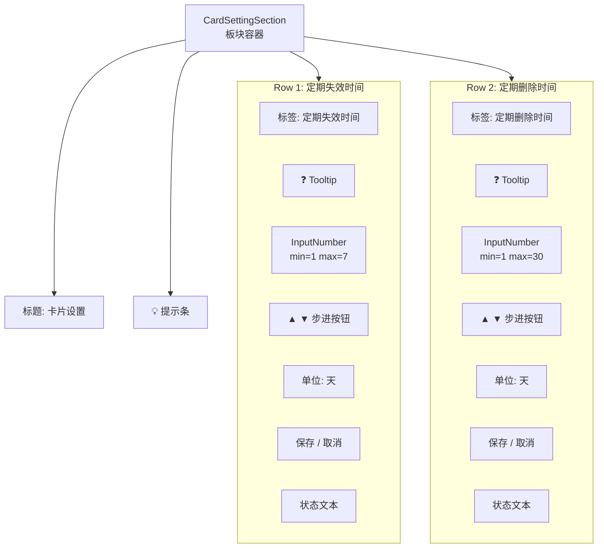

# 需求设计说明书 — 应用卡片设置

## 修订记录

| 版本 | 日期 | 修改人 | 修改说明 |
|------|------|--------|---------|
| v1.0 | 2026-06-10 | Spec Agent | 初稿，基于 spec-card-setting.md v0.1 |

## 目录
- 1 需求价值和概述
- 2 上下文分析
- 3 初始需求分析
    - 3.1 初始需求场景分析
    - 3.2 结构化IR
- 4 需求影响分析
    - 4.1 特性影响分析
- 5 系统用例分析
    - 5.1 用例清单
    - 5.2 用例分析
- 6 功能设计
    - 6.1 功能实现整体设计方案
    - 6.2 功能实现
- 7 系统级非功能设计
    - 7.1 FMEA影响分析
    - 7.2 安全影响分析
    - 7.3 兼容性
    - 7.4 可运维
- 8 checkList

## Keywords 关键字：
- 中文：卡片设置、应用权益、第三方服务转发、定期失效、定期删除
- English：Card Setting, Application Entitlement, Third-party Relay, Expiration, Retention

## Abstract 摘要：

**中文**：本需求在 open-server（后端）和 open-web（前端）中为"应用详情"页面新增"卡片设置"板块。卡片是应用的一种权益，由第三方服务提供，页面落在开放平台，数据权威来源（SoT）也在第三方。板块位于应用详情页尾部，与应用凭证、应用基本信息、认证方式三个板块上下平铺。板块包含两行独立配置：**定期失效时间**（1–7 天）和 **定期删除时间**（1–30 天），每行带 ❓ 提示图标、数值输入框（支持手动输入与步进按钮）、单位"天"、保存/取消按钮，两行分别调用后端不同接口保存。后端 open-server 不持久化该数据，仅做权限校验（复用 `AppContextResolver`）并转发至第三方服务；第三方接口定义待提供，本次通过 `ThirdPartyCardClient` 接口预留形状，并提供 Stub 实现以便联调前跑通。

**English**: This requirement adds a "Card Setting" section to the application detail page in open-server (backend) and open-web (frontend). A card is an entitlement of an application provided by a third-party service; the page lives on the open platform, and the source of truth (SoT) is also the third-party service. The section sits at the bottom of the application detail page, laid out vertically alongside the existing Application Credential / Basic Info / Authentication sections. It contains two independent rows of configuration: **Periodic Expiration** (1–7 days) and **Periodic Retention** (1–30 days). Each row has a ❓ tooltip, a numeric input (with manual typing and stepper buttons), a "days" unit, and Save / Cancel buttons; the two rows save via different backend endpoints. The backend open-server does not persist this data; it only performs permission validation (reusing `AppContextResolver`) and relays requests to the third-party service. The third-party API definition is pending; this iteration reserves the shape via a `ThirdPartyCardClient` interface and ships a Stub implementation so the flow runs end-to-end before the real integration.

## List 缩略语清单

| 缩略语 | 英文全名 | 中文解释 |
|--------|---------|---------|
| IR | Initial Requirement | 初始需求 |
| US | User Story | 用户故事 |
| DFX | Design for X | 面向X的设计（X=性能/安全/可靠性等） |
| FMEA | Failure Mode and Effects Analysis | 失效模式与影响分析 |
| SoT | Source of Truth | 数据权威来源 |
| appId | Application ID | 应用唯一标识（外部业务长 ID） |
| Stub | Stub Implementation | 桩实现，用于联调前模拟外部服务 |

---

## 1 需求价值和概述

### 需求背景与来源

开放平台（OpenPlatform v2）支持第三方应用接入，应用享有多种权益，其中之一是"卡片"权益。卡片由**第三方服务**提供能力与数据承载，但其管理页面（含失效策略、删除策略配置）落在开放平台前端，由平台运营方 / 应用 owner 在此操作。

当前 open-server / open-web 已实现应用凭证、应用基本信息、认证方式等板块（由同事 A 并行开发，视为本需求的前置依赖），但**缺少卡片生命周期策略的配置入口**。应用 owner 无法在平台上直接设置"卡片多久后失效、多久后被删除"，只能通过线下沟通或依赖第三方服务自有界面，带来以下问题：

- 配置分散：失效 / 删除策略需要在第三方平台单独配置，缺乏统一视图
- 合规风险：平台侧无法对失效 / 删除时间设置边界（如失效 ≤ 7 天、删除 ≤ 30 天），存在策略漂移
- 审计缺失：卡片策略变更无平台侧操作日志，难以追溯

本次需求在应用详情页尾部新增"卡片设置"板块，由平台统一承接配置入口，后端转发至第三方服务，保留第三方作为 SoT。

### 需求价值

| 维度 | 价值 |
|------|------|
| 统一视图 | 应用 owner 在一个详情页内看完凭证 / 信息 / 认证 / 卡片策略，无需切换系统 |
| 合规可控 | 前后端双端数值校验（1–7 / 1–30），避免非法策略下发到第三方 |
| 操作追溯 | 保存操作可选接入 AuditLog（待架构师确认编号），变更可审计 |
| 解耦演进 | 数据不落地 open-server，通过 `ThirdPartyCardClient` 接口隔离第三方变化 |
| 交互友好 | ❓ 提示、步进按钮、单位显式展示、取消还原，降低误操作 |

### 如果不做的影响

- 应用 owner 仍需登录第三方服务配置卡片策略，体验割裂
- 平台侧无法对策略边界做强制性约束，合规性依赖第三方
- 卡片失效 / 删除策略变更无平台侧审计轨迹，事后追溯困难
- 后续如需在卡片失效前发送提醒、在删除前做二次确认，缺少平台侧抓手

---

## 2 上下文分析

### 系统上下文



### 利益相关方

| 利益相关方 | 关注点 |
|-----------|--------|
| 应用 owner | 在一个页面内快速调整卡片失效 / 删除策略；看到清晰的范围提示 |
| 同事 A（应用详情 page 负责人） | 卡片设置板块可独立挂载，接口契约稳定，不影响其他三板块 |
| 第三方服务负责人 | 平台侧转发符合契约、参数已校验、异常可观测 |
| 架构师 | 模块划分清晰（card 模块无 entity/mapper）、权限校验复用现有基础设施 |
| 运维 / 审计 | 第三方调用异常可告警；可选接入 AuditLog |

---

## 3 初始需求分析

### 3.1 初始需求场景分析

| 所属场景 | 场景名称 | 场景简要说明 | 涉及角色 |
|---------|---------|------------|---------|
| 卡片设置 | 加载卡片设置 | 进入应用详情 → 板块发起查询请求，回显失效 / 删除时间当前值 | 应用 owner |
| 卡片设置 | 查看字段提示 | hover ❓ 图标查看字段含义与取值范围 | 应用 owner |
| 卡片设置 | 修改失效时间 | 通过输入框 / 步进按钮调整失效时间，点保存 → 调后端接口 → 成功提示 | 应用 owner |
| 卡片设置 | 修改删除时间 | 同上，调不同接口 | 应用 owner |
| 卡片设置 | 取消修改 | 修改后未保存，点取消 → 还原为上次保存值 | 应用 owner |
| 卡片设置 | 保存失败重试 | 第三方服务异常 → 错误提示 → 用户重试 | 应用 owner |
| 卡片设置 | 越界输入拒绝 | 输入 0 或 >7（失效）/ >30（删除） → 自动裁剪到边界值 | 系统 |

### 3.2 结构化IR

| IR属性 | 具体信息 |
|-------|---------|
| IR标识 | IR-OPEN-CARD-001 |
| 名称 | 应用卡片设置 |
| 描述 | 在 open-web 应用详情页尾部新增"卡片设置"板块，由 open-server 转发第三方服务，支持配置卡片定期失效时间与定期删除时间 |
| 优先级 | P1（高） |
| 需求描述（why） | 应用 owner 需要统一入口配置卡片生命周期策略；平台需要对策略边界做合规约束；变更需要可审计 |
| what | ① 查询卡片设置（GET）；② 保存失效时间（PUT /expiration）；③ 保存删除时间（PUT /retention）；④ 前端板块组件（双行独立保存 + 提示 + 步进 + 取消还原）；⑤ 第三方客户端接口预留 + Stub |
| who | 后端：open-server 开发；前端：open-web 开发；第三方服务负责人提供接口定义；应用 owner 使用 |
| 对架构要素的影响 | **架构**：新增 card 模块（无 entity/mapper，纯转发）；**安全**：复用 AppContextResolver；**性能**：第三方调用决定时延，本地仅校验 + 转发；**可靠性**：第三方不可用时返回 502，不暴露细节 |

---

## 4 需求影响分析

### 4.1 特性影响分析

**【新增】**：

| 特性 | 说明 |
|------|------|
| 卡片设置后端模块 | open-server 新增 `modules/card/`（controller / service / dto / client） |
| 第三方客户端接口 | `ThirdPartyCardClient` 接口 + `ThirdPartyCardClientStub` 实现 |
| 卡片设置前端板块 | open-web 新增 `CardSettingSection` 组件 + `card.service.ts` + `useCardSetting.ts` |

**【修改】**：

| 特性 | 影响说明 |
|------|---------|
| 应用详情 page（同事 A） | 在板块列表末尾挂载 `<CardSettingSection appId={appId} />`（本需求不修改该 page 其他部分） |
| `application.yml` | #ASSUMED 新增 `card-service.base-url` / `timeout-ms` 配置项 |

**【删除】**：不涉及

**【数据库】**：不涉及（数据 SoT 在第三方，open-server 不建表、无 entity / mapper）

---

## 5 系统用例分析

### 5.1 用例清单

| 角色名称 | UseCase名称 | UseCase简要说明 | 是否需要细化分析 |
|---------|-----------|---------------|:-------------:|
| 应用 owner | UC-01 加载卡片设置 | 进入应用详情，板块查询并回显当前配置 | 否 |
| 应用 owner | UC-02 查看字段提示 | hover ❓ 图标查看提示文案 | 否 |
| 应用 owner | UC-03 修改并保存失效时间 | 调整失效时间 → 点保存 → 成功提示 | 是 |
| 应用 owner | UC-04 修改并保存删除时间 | 调整删除时间 → 点保存 → 成功提示 | 是 |
| 应用 owner | UC-05 取消修改 | 修改未保存 → 点取消 → 还原 | 否 |
| 应用 owner | UC-06 保存失败重试 | 接口失败 → 错误提示 → 用户重试 | 否 |
| 系统 | UC-07 越界输入裁剪 | 输入越界自动裁剪到 [min, max] | 否 |

### 5.2 用例分析

#### UC-03 修改并保存失效时间

**【简要说明】**：应用 owner 调整"定期失效时间"并保存，系统校验数值边界、校验应用访问权限后转发到第三方服务更新失效时间，成功后回显最新值。

**【Actor】**：应用 owner

**【前置条件】**：
- 用户已登录 open-web，且对当前 appId 具备访问权限（AppContextResolver 通过）
- 板块已完成首次加载，回显当前失效时间

**【最小保证】**：保存失败时，前端保留用户当前输入值，提示错误信息，后端数据不变

**【成功保证】**：
- 后端 `ThirdPartyCardClient.updateExpiration(externalAppId, days)` 调用成功
- 前端显示"保存成功"，输入框显示最新保存值
- 保存 / 取消按钮恢复 disabled 状态

**【主成功场景】**：
1. 应用 owner 通过输入框或 ▲ 按钮将"定期失效时间"从 3 改为 5
2. 前端校验 `1 ≤ 5 ≤ 7`，通过；保存按钮由 disabled → enabled
3. 应用 owner 点击"保存"
4. 前端显示保存中状态（按钮 disabled，状态文本"保存中..."）
5. 前端调用 `PUT /service/open/v2/apps/{appId}/card-settings/expiration`，body: `{ "expirationDays": 5 }`
6. 后端 `CardSettingService` 调用 `appContextResolver.resolveAndValidate(appId)` 通过
7. 后端 DTO 校验 `@NotNull @Min(1) @Max(7)` 通过
8. 后端调用 `thirdPartyCardClient.updateExpiration(externalAppId, 5)`
9. 第三方返回成功，后端构造 `CardSettingResponse { expirationDays=5, retentionDays=<当前值> }`
10. 后端返回 `{ code: "200", data: {...} }`
11. 前端 `message.success('保存成功')`，更新 saved 值，按钮恢复 disabled

**【扩展场景】**：
- **E1 数值越界（前端拦截）**：输入 `10` → InputNumber min/max 自动裁剪为 `7`；保存按钮保持 disabled 直到值合法
- **E2 数值越界（后端拦截）**：绕过前端直接发请求 `expirationDays=10` → 后端 `@Max(7)` 校验失败 → 返回 `code=400`
- **E3 appId 无权限**：`AppContextResolver` 抛 `AppAccessException` → 返回 `code=403`
- **E4 第三方服务不可用**：第三方调用超时 / 抛异常 → 后端返回 `code=502, messageZh="卡片服务暂时不可用"`，错误日志含 appId + 入参
- **E5 用户取消**：修改未保存 → 点"取消" → 输入框还原为 saved 值，不调接口
- **E6 网络断开**：请求未到达 → 前端 request.ts 拦截器提示"网络异常"

**【DFX属性】**：
- 安全：AppContextResolver 应用访问权限校验
- 可靠性：DTO 校验 + 第三方异常兜底
- 可用性：双端校验 + 清晰错误提示 + 取消还原

#### UC-04 修改并保存删除时间

**【简要说明】**：同 UC-03，但字段为"定期删除时间"，调用 `PUT /apps/{appId}/card-settings/retention`，边界 1–30。

**【Actor】**：应用 owner

**【前置条件】**：同 UC-03

**【最小保证】**：同 UC-03

**【成功保证】**：`ThirdPartyCardClient.updateRetention(externalAppId, days)` 调用成功，前端回显

**【主成功场景】**：同 UC-03，差异点：
- 步骤 1：调整"定期删除时间"
- 步骤 2：校验 `1 ≤ x ≤ 30`
- 步骤 5：调用 `PUT /apps/{appId}/card-settings/retention`，body `{ "retentionDays": x }`
- 步骤 8：调用 `thirdPartyCardClient.updateRetention(...)`

**【扩展场景】**：同 UC-03 的 E1–E6

**【DFX属性】**：同 UC-03

#### 5.3 影响的功能列表和需求分解

| 功能编号 | 功能名称 | 功能规格描述 | 类型 | 需求标号 | 需求名称 | 需求描述 |
|---------|---------|------------|------|---------|---------|---------|
| F-01 | 卡片设置查询 | GET /apps/{appId}/card-settings，转发第三方查询，返回 { expirationDays, retentionDays } | 新增 | IR-001 | 加载卡片设置 | 应用级查询，两字段可 null 表示第三方未配置 |
| F-02 | 保存失效时间 | PUT /apps/{appId}/card-settings/expiration，@Min(1) @Max(7) 校验后转发第三方 | 新增 | IR-001 | 修改失效时间 | 数值边界双端校验 + 第三方转发 |
| F-03 | 保存删除时间 | PUT /apps/{appId}/card-settings/retention，@Min(1) @Max(30) 校验后转发第三方 | 新增 | IR-001 | 修改删除时间 | 数值边界双端校验 + 第三方转发 |
| F-04 | 第三方客户端接口 | `ThirdPartyCardClient` 接口（query / updateExpiration / updateRetention）+ Stub 实现 | 新增 | IR-001 | 第三方对接 | 接口预留 + Stub，便于联调前跑通 |
| F-05 | 前端卡片设置板块 | React 组件 `CardSettingSection`，双行独立状态 + 提示 + 步进 + 保存取消 | 新增 | IR-001 | 卡片设置 UI | 与现有板块视觉一致，独立挂载 |

---

## 6 功能设计

### 6.1 功能实现整体设计方案

#### 6.1.1 整体方案

**设计原则**：
- **纯转发，不落地**：open-server 不持久化卡片设置数据，所有读写直接穿透到第三方服务
- **前端轻量**：板块级 useState，无全局状态；两行独立状态机，互不干扰
- **接口隔离**：第三方调用通过 `ThirdPartyCardClient` 接口，实现可替换（Stub / 真实 HTTP / Mock）
- **约定对齐**：Controller / Service / DTO 命名与 URL 风格对齐 `PermissionController` 现有约定

**设计模式**：
- **代理模式**（隐式）：`CardSettingService` 作为前端与第三方之间的"守门人"，承担权限校验 + 参数校验 + 调用转发 + 异常兜底
- **策略模式**（可选演进）：若未来需要对接多个第三方（按应用类型路由），可将 `ThirdPartyCardClient` 升级为策略接口

**限制和约束**：
- 卡片是**应用级**配置，无 cardId 维度
- 两行独立保存，可能存在"失效时间已保存但删除时间保存失败"的中间态（预期行为）
- 不实现乐观锁 / 版本号，依赖第三方服务的并发控制

#### 6.1.2 架构设计

**后端架构**：



**前端架构**：



---

### 6.2 功能实现

#### F-01 卡片设置查询

##### 实现思路

open-server 接收到 GET 请求后：解析 appId → 调用 `AppContextResolver` 校验权限 → 拿到 `externalAppId` → 调 `ThirdPartyCardClient.queryCardSetting(externalAppId)` → 映射为 `CardSettingResponse` 返回。

##### 实现设计



##### 接口设计

| URL | Method | 功能 | 增删改查 | 鉴权 | TPS | 时延 |
|-----|--------|------|---------|------|-----|------|
| `/service/open/v2/apps/{appId}/card-settings` | GET | 查询卡片设置 | 查 | AppContextResolver | 50 | <500ms（含第三方） |

**输入参数**：

| 参数 | 类型 | 必填 | 格式 | 说明 |
|------|------|:----:|------|------|
| appId | String（path） | 是 | 外部业务 ID | 应用标识 |

**返回值**：

| 字段 | 类型 | 说明 |
|------|------|------|
| code | String | "200"=成功 |
| messageZh | String | 中文消息 |
| messageEn | String | 英文消息 |
| data | Object | 卡片设置 |
| data.expirationDays | Integer / null | 定期失效时间（天），null 表示未设置 |
| data.retentionDays | Integer / null | 定期删除时间（天），null 表示未设置 |

---

#### F-02 保存失效时间

##### 实现思路

接收 PUT 请求 → 权限校验 → `@Valid` 校验 `expirationDays ∈ [1,7]` → 调用 `ThirdPartyCardClient.updateExpiration(externalAppId, days)` → 返回最新完整配置。

##### 实现设计



##### 接口设计

| URL | Method | 功能 | 增删改查 | 鉴权 | TPS | 时延 |
|-----|--------|------|---------|------|-----|------|
| `/service/open/v2/apps/{appId}/card-settings/expiration` | PUT | 保存失效时间 | 改 | AppContextResolver | 20 | <500ms |

**请求 Body**：

| 字段 | 类型 | 必填 | 格式 | 说明 |
|------|------|:----:|------|------|
| expirationDays | Integer | 是 | 1..7 | 定期失效时间（天） |

**返回值**：同 F-01

**错误码**：

| code | messageZh | 触发场景 |
|------|-----------|---------|
| 400 | 参数校验失败：expirationDays | 数值越界 / 空 / 非整数 |
| 403 | 无权限访问该应用 | AppContextResolver 抛 AppAccessException |
| 502 | 卡片服务暂时不可用 | 第三方调用异常 |

---

#### F-03 保存删除时间

##### 实现思路

同 F-02，字段换为 `retentionDays`，范围 1–30，调用 `updateRetention`。

##### 接口设计

| URL | Method | 功能 | 增删改查 | 鉴权 | TPS | 时延 |
|-----|--------|------|---------|------|-----|------|
| `/service/open/v2/apps/{appId}/card-settings/retention` | PUT | 保存删除时间 | 改 | AppContextResolver | 20 | <500ms |

**请求 Body**：

| 字段 | 类型 | 必填 | 格式 | 说明 |
|------|------|:----:|------|------|
| retentionDays | Integer | 是 | 1..30 | 定期删除时间（天） |

**返回值**：同 F-01

**错误码**：同 F-02（字段名换为 retentionDays）

---

#### F-04 第三方客户端接口

##### 实现思路

定义 `ThirdPartyCardClient` 接口 + `ThirdPartyCardClientStub` 默认实现（返回固定值或读本地配置）。第三方接口定义到位后，新增 `ThirdPartyCardHttpClient` 实现类，通过 Spring `@Primary` / `@ConditionalOnProperty` 切换。

##### 核心接口

```java
public interface ThirdPartyCardClient {
    /** 查询应用卡片设置 */
    ThirdPartyCardSettingDTO queryCardSetting(String externalAppId);

    /** 更新定期失效时间（第三方接口 #1） */
    ThirdPartyCardSettingDTO updateExpiration(String externalAppId, int expirationDays);

    /** 更新定期删除时间（第三方接口 #2） */
    ThirdPartyCardSettingDTO updateRetention(String externalAppId, int retentionDays);
}
```

##### Stub 实现行为

- `queryCardSetting`: 返回 `{ expirationDays: 3, retentionDays: 15 }`（固定）
- `updateExpiration`: 内存中更新失效时间，返回最新组合
- `updateRetention`: 同上

##### 扩展方式

新增真实 HTTP 实现只需：实现 `ThirdPartyCardClient` + `@Component("http")` + `@ConditionalOnProperty("card-service.base-url")`，Stub 保留作为 fallback。

---

#### F-05 前端卡片设置板块

##### 实现思路

遵循 open-web 现有页面模式：
- `components/CardSettingSection.tsx`（板块组件，接收 appId prop）
- `services/card.service.ts`（接口 + 类型）
- `hooks/useCardSetting.ts`（状态管理）

板块内部两行独立状态机，每行维护：
- `savedValue`（上次服务端值）
- `currentValue`（当前输入值）
- `saving`（保存中标志）

派生：
- `isDirty = currentValue !== savedValue`
- `isValid = min ≤ currentValue ≤ max`
- 保存按钮 enabled = `isDirty && isValid && !saving`
- 取消按钮 enabled = `isDirty && !saving`

##### 界面原型

> 浏览器打开 [`docs/card-setting-mockup.html`](./card-setting-mockup.html) 查看可交互效果图。

**板块结构**：



**交互说明**：

| 操作 | 触发 | 行为 |
|------|------|------|
| 进入板块 | 页面挂载 | 调 `GET /apps/{appId}/card-settings`，loading 时显示骨架屏 |
| hover ❓ | 鼠标悬停 | Tooltip 显示对应文案 |
| 输入数值 | 输入框键入 | 实时校验，越界自动裁剪 |
| 点击 ▲/▼ | 步进按钮 | currentValue ±1，不越界 |
| 点击保存 | 保存按钮 | 调对应 PUT 接口，成功 → 更新 saved + toast |
| 点击取消 | 取消按钮 | currentValue = saved，无请求 |
| 保存失败 | 接口返回非 200 | toast 错误，保留当前输入值供重试 |

##### 架构元素影响列表

| 元素 | 变更类型 | 说明 |
|------|---------|------|
| `open-web/src/components/CardSettingSection.tsx` | 新增 | 板块组件 |
| `open-web/src/components/CardSettingSection.module.less` | 新增 #ASSUMED | 板块样式 |
| `open-web/src/services/card.service.ts` | 新增 | 接口 + 类型 |
| `open-web/src/hooks/useCardSetting.ts` | 新增 | 状态管理 |
| 应用详情 page（同事 A） | 修改 | 末尾挂载 `<CardSettingSection appId={appId} />`（需同事 A 配合） |

---

#### 6.3 功能实现分解分配清单

| # | Task 名称 | 模块 | 职责描述 |
|:-:|----------|------|---------|
| 1 | 卡片 DTO 定义 | open-server | CardSettingResponse / UpdateExpirationRequest / UpdateRetentionRequest / ThirdPartyCardSettingDTO |
| 2 | 第三方客户端接口 | open-server | ThirdPartyCardClient 接口 + ThirdPartyCardClientStub 实现 |
| 3 | 卡片 Service | open-server | CardSettingService — 权限校验 + DTO 校验 + 调用 client + 异常兜底 |
| 4 | 卡片 Controller | open-server | CardSettingController — 3 个端点（GET / PUT expiration / PUT retention） |
| 5 | 配置文件 | open-server | application.yml 新增 card-service.base-url / timeout-ms（#ASSUMED） |
| 6 | 前端接口层 | open-web | card.service.ts — 类型 + 3 个 API 函数 |
| 7 | 前端 hook | open-web | useCardSetting.ts — 状态管理 + actions |
| 8 | 前端板块组件 | open-web | CardSettingSection.tsx + .module.less — UI + 交互 |
| 9 | 板块挂载 | open-web | 同事 A 在应用详情 page 末尾挂载 CardSettingSection |

---

## 7 系统级非功能设计

### 7.1 FMEA影响分析

| 失效模式 | 影响 | 缓解措施 |
|---------|------|---------|
| 第三方服务超时 | 板块查询 / 保存失败 | 后端设置超时（默认 5s），超时返回 502；前端 toast 错误，保留输入值供重试 |
| 第三方服务返回非预期格式 | 解析失败 | client 内部 try-catch，转换为统一 502 |
| 两行并发保存（用户快速点两次） | 第三方侧可能竞态 | 前端 saving 状态锁定按钮；第三方侧由其自身保证幂等（#ASSUMED） |
| AppContextResolver 抛出未预期异常 | 接口 500 | 全局异常处理器兜底；不暴露内部细节 |
| 前端 InputNumber 被绕过（直接构造请求） | 非法值传到第三方 | 后端 `@Valid @Min @Max` 双端校验兜底 |

### 7.2 安全影响分析

| 安全项 | 措施 |
|-------|------|
| 接口鉴权 | 复用 `AppContextResolver.resolveAndValidate(appId)`，无效 appId 或无权用户 → AppAccessException → 403 |
| 越权防护 | 所有接口强制 path 中带 appId，且经 AppContextResolver 校验 |
| 输入校验 | 后端 `@NotNull @Min @Max`；前端 InputNumber min/max |
| 信息泄露 | 第三方异常对外统一表现为 502，错误详情仅在服务端日志 |
| CSRF | 复用 open-web 现有 Bearer Token 机制（request.ts 拦截器） |
| 审计日志 | #ASSUMED 待架构师确认是否新增 OperateEnum（QUERY / UPDATE_CARD_EXPIRATION / UPDATE_CARD_RETENTION） |

### 7.3 兼容性

#### 后向兼容性确认

- 新增 3 个端点，不影响现有接口
- 不修改数据库、不新增表
- 应用详情 page 由同事 A 修改挂载点，本需求组件为新增、不影响已有三板块

#### 前向兼容性确认

- `ThirdPartyCardClient` 接口隔离第三方变化，未来第三方接口升级只改 client 实现
- 若未来需要 cardId 维度（从应用级演进到卡级），端点路径 `/apps/{appId}/cards/{cardId}/settings/*` 可平滑扩展（#ASSUMED 当前不做）
- 板块组件对外仅依赖 `appId` prop，不依赖应用详情 page 内部结构，挂载解耦

### 7.4 可运维

| 运维项 | 说明 |
|-------|------|
| 日志 | Service 入参打 info 日志（参考 PermissionService 约定）；第三方异常打 error 日志，含 appId + 入参 + 异常栈 |
| 配置 | `card-service.base-url` / `timeout-ms` 走 application.yml + env 覆盖 |
| 监控 | 建议后续接入：第三方接口调用成功率 / 时延分位数（本次不做） |
| Stub 切换 | 通过 `@ConditionalOnProperty("card-service.base-url")` 控制 Stub / Http 实现切换 |

---

## 8 checkList

### 8.1 设计自检清单要求

| check点 | 是否达标 | 说明 |
|--------|:-------:|------|
| 需求背景和价值清晰 | ✅ | 第1章已说明，含"如果不做的影响" |
| 用例场景完整覆盖 | ✅ | 7 个用例覆盖加载 / 提示 / 失效保存 / 删除保存 / 取消 / 失败重试 / 越界 |
| 接口定义明确（输入/输出/错误码） | ✅ | 3 个 API 均定义完整参数、返回值、错误码 |
| 数据模型清晰 | ✅ | 不建本地表；4 个 DTO 字段定义完整 |
| 安全设计（鉴权 + 越权防护） | ✅ | 复用 AppContextResolver |
| 前端界面原型 | ✅ | HTML 效果图可交互预览（含失败模拟） |
| 可扩展性设计 | ✅ | ThirdPartyCardClient 接口隔离，未来可替换实现 |
| 前后端技术栈一致 | ✅ | 后端 Spring Boot 3.4.6 / Java 21 / Lombok；前端 React 18 / AntD v4 / TS |
| 与现有约定对齐 | ✅ | Controller URL 风格 / DTO 命名 / Service 校验模式 / 前端 service+hook 模式均对齐 permission 模块 |
| 文件清单完整 | ✅ | 后端 8 个新建 + 1 个修改；前端 4 个新建 + 1 个修改（同事 A） |
| 不引入本地存储 | ✅ | 数据 SoT 在第三方，open-server 无 entity/mapper |
| 第三方依赖隔离 | ✅ | 接口预留 + Stub 默认实现，便于联调前跑通 |
| FMEA 覆盖关键失效模式 | ✅ | 5 类失效模式 + 缓解措施 |
| 双端校验 | ✅ | 前端 InputNumber + 后端 @Valid @Min @Max |
| 待确认项已列出 | ✅ | spec-card-setting.md §6 列出 7 项 Open Questions，本说明书与之对齐 |
