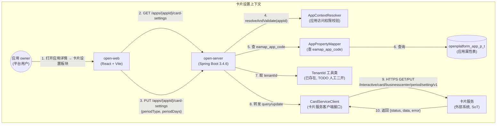
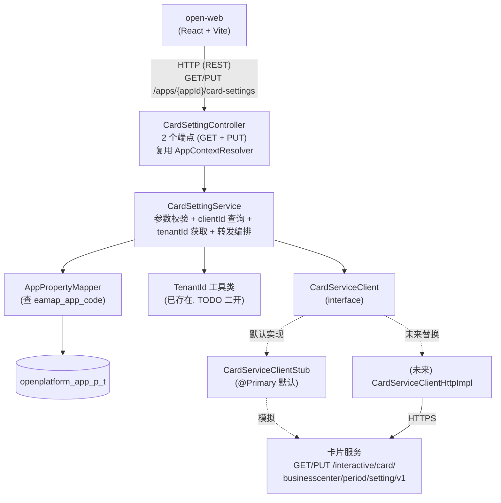
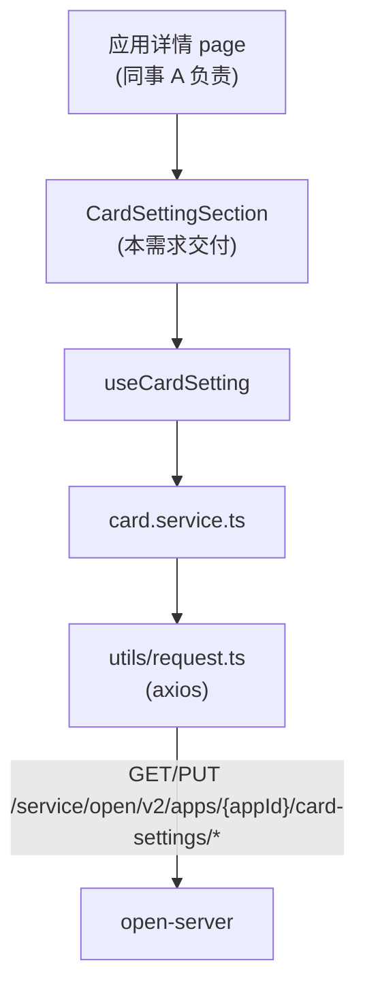
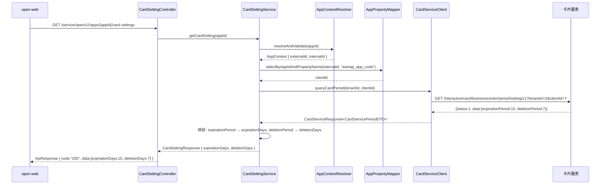
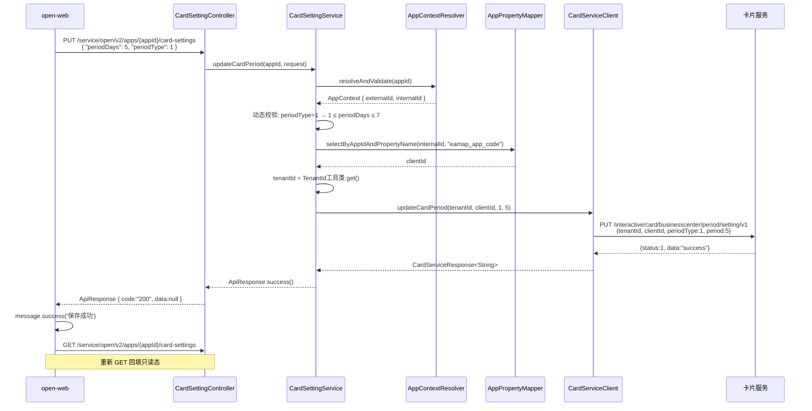
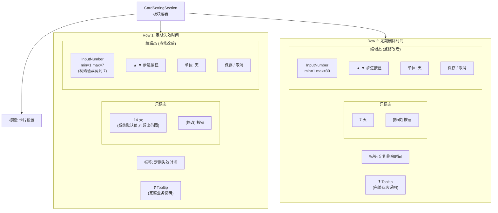

# 需求设计说明书 — 应用卡片设置

## 修订记录

| 版本 | 日期 | 修改人 | 修改说明 |
|------|------|--------|---------|
| v1.0 | 2026-06-10 | Spec Agent | 初稿，基于 spec-card-setting.md v0.1 |
| v1.1 | 2026-06-22 | Spec Agent | 对齐 spec-card-setting.md v0.5：① 接口 3→2 合并（PUT 用 `periodType` 区分失效/删除）；② 字段 `retentionDays` → `deletionDays`；③ 卡片服务接口已明确（GET/PUT `/interactive/card/businesscenter/period/setting/v1`）；④ 客户端改名 `CardServiceClient`；⑤ UI 改为两态（只读 ↔ 编辑）；⑥ Tooltip 文案改为完整业务说明；⑦ 默认值 14/7（演示编辑态裁剪）；⑧ 新增 `AppPropertyMapper` 依赖 |

## 目录
- 1 需求价值和概述
- 2 上下文分析
- 3 初始需求分析
    - 3.1 初始需求场景分析
    - 3.2 结构化IR
- 4 需求影响分析
    - 4.1 特性影响分析
- 5 系统用例分析
    - 5.1 用例清单
    - 5.2 用例分析
- 6 功能设计
    - 6.1 功能实现整体设计方案
    - 6.2 功能实现
- 7 系统级非功能设计
    - 7.1 FMEA影响分析
    - 7.2 安全影响分析
    - 7.3 兼容性
    - 7.4 可运维
- 8 checkList

## Keywords 关键字：
- 中文：卡片设置、应用权益、卡片服务转发、定期失效、定期删除
- English：Card Setting, Application Entitlement, Card Service Relay, Expiration, Deletion

## Abstract 摘要：

**中文**：本需求在 open-server（后端）和 open-web（前端）中为"应用详情"页面新增"卡片设置"板块。卡片是应用的一种权益，由**卡片服务**（外部独立服务）提供，页面落在开放平台，数据权威来源（SoT）也在卡片服务。板块位于应用详情页尾部，与应用凭证、应用基本信息、认证方式三个板块上下平铺。板块包含两行独立配置：**定期失效时间**（系统默认 14 天，用户可配置 1–7 天）和 **定期删除时间**（系统默认 7 天，用户可配置 1–30 天）。UI 采用**两态设计**：只读态显示 `X 天 [修改]`；点击"修改"进入编辑态，显示数值输入框（支持手动输入与步进按钮）、单位"天"、保存/取消按钮。两行独立保存，合并通过**单一 PUT 接口**（`PUT /apps/{appId}/card-settings`）调用后端，由 body 中 `periodType`（0=删除周期/1=失效周期）+ `periodDays` 区分。后端 open-server 不持久化该数据，从 `openplatform_app_p_t` 表查 `eamap_app_code` 作为 `clientId`，从上下文工具类获取 `tenantId`，做权限校验（复用 `AppContextResolver`）+ 参数校验后转发至卡片服务（GET/PUT `/interactive/card/businesscenter/period/setting/v1`）；卡片服务接口已明确，通过 `CardServiceClient` 接口封装统一响应 `{status, data, error}`，并提供 Stub 实现以便联调前跑通。

**English**: This requirement adds a "Card Setting" section to the application detail page in open-server (backend) and open-web (frontend). A card is an entitlement of an application provided by the **Card Service** (an external service); the page lives on the open platform, and the source of truth (SoT) is the Card Service. The section sits at the bottom of the application detail page, laid out vertically alongside the existing Application Credential / Basic Info / Authentication sections. It contains two independent rows: **Periodic Expiration** (system default 14 days, user-configurable 1–7 days) and **Periodic Deletion** (system default 7 days, user-configurable 1–30 days). The UI adopts a **two-state design**: read-only state shows `X days [Modify]`; clicking "Modify" enters edit state with a numeric input (with stepper buttons), a "days" unit, and Save / Cancel buttons. The two rows save independently via a **single PUT endpoint** (`PUT /apps/{appId}/card-settings`), distinguished by `periodType` (0=deletion period / 1=expiration period) + `periodDays` in the request body. The backend open-server does not persist this data; it reads `eamap_app_code` from the `openplatform_app_p_t` table as `clientId`, retrieves `tenantId` from the context utility, performs permission validation (reusing `AppContextResolver`) + parameter validation, and relays requests to the Card Service (GET/PUT `/interactive/card/businesscenter/period/setting/v1`). The Card Service API is already defined; it is wrapped via the `CardServiceClient` interface with a unified response `{status, data, error}`, and a Stub implementation is shipped for pre-integration testing.

## List 缩略语清单

| 缩略语 | 英文全名 | 中文解释 |
|--------|---------|---------|
| IR | Initial Requirement | 初始需求 |
| US | User Story | 用户故事 |
| DFX | Design for X | 面向X的设计（X=性能/安全/可靠性等） |
| FMEA | Failure Mode and Effects Analysis | 失效模式与影响分析 |
| SoT | Source of Truth | 数据权威来源 |
| appId | Application ID | 应用唯一标识（外部业务长 ID） |
| Stub | Stub Implementation | 桩实现，用于联调前模拟外部服务 |

---

## 1 需求价值和概述

### 需求背景与来源

开放平台（OpenPlatform v2）支持第三方应用接入，应用享有多种权益，其中之一是"卡片"权益。卡片由**卡片服务**（外部独立服务）提供能力与数据承载，但其管理页面（含失效策略、删除策略配置）落在开放平台前端，由平台运营方 / 应用 owner 在此操作。

当前 open-server / open-web 已实现应用凭证、应用基本信息、认证方式等板块（由同事 A 并行开发，视为本需求的前置依赖），但**缺少卡片生命周期策略的配置入口**。应用 owner 无法在平台上直接设置"卡片多久后失效、多久后被删除"，只能通过线下沟通或依赖卡片服务自有界面，带来以下问题：

- 配置分散：失效 / 删除策略需要在卡片服务单独配置，缺乏统一视图
- 合规风险：平台侧无法对失效 / 删除时间设置边界（如失效 ≤ 7 天、删除 ≤ 30 天），存在策略漂移
- 审计缺失：卡片策略变更无平台侧操作日志，难以追溯

本次需求在应用详情页尾部新增"卡片设置"板块，由平台统一承接配置入口，后端转发至卡片服务，保留卡片服务作为 SoT。

### 需求价值

| 维度 | 价值 |
|------|------|
| 统一视图 | 应用 owner 在一个详情页内看完凭证 / 信息 / 认证 / 卡片策略，无需切换系统 |
| 合规可控 | 前后端双端数值校验（1–7 / 1–30），避免非法策略下发到第三方 |
| 操作追溯 | 保存操作可选接入 AuditLog（待架构师确认编号），变更可审计 |
| 解耦演进 | 数据不落地 open-server，通过 `CardServiceClient` 接口 + 响应封装隔离卡片服务变化 |
| 交互友好 | ❓ 提示、步进按钮、单位显式展示、取消还原，降低误操作 |

### 如果不做的影响

- 应用 owner 仍需登录卡片服务配置卡片策略，体验割裂
- 平台侧无法对策略边界做强制性约束，合规性依赖第三方
- 卡片失效 / 删除策略变更无平台侧审计轨迹，事后追溯困难
- 后续如需在卡片失效前发送提醒、在删除前做二次确认，缺少平台侧抓手

---

## 2 上下文分析

### 系统上下文



### 利益相关方

| 利益相关方 | 关注点 |
|-----------|--------|
| 应用 owner | 在一个页面内快速调整卡片失效 / 删除策略；看到清晰的范围提示 |
| 同事 A（应用详情 page 负责人） | 卡片设置板块可独立挂载，接口契约稳定，不影响其他三板块 |
| 卡片服务负责人 | 平台侧转发符合契约、参数已校验、异常可观测 |
| 架构师 | 模块划分清晰（card 模块无 entity/mapper）、权限校验复用现有基础设施 |
| 运维 / 审计 | 第三方调用异常可告警；可选接入 AuditLog |

---

## 3 初始需求分析

### 3.1 初始需求场景分析

| 所属场景 | 场景名称 | 场景简要说明 | 涉及角色 |
|---------|---------|------------|---------|
| 卡片设置 | 加载卡片设置 | 进入应用详情 → 板块发起查询请求，**只读态**回显失效 / 删除时间当前值（可能是系统默认值如 14/7，也可能在用户可写范围内） | 应用 owner |
| 卡片设置 | 查看字段提示 | hover ❓ 图标查看字段含义（完整业务说明，如"根据每张消息卡片第一次投放时间开始计算..."） | 应用 owner |
| 卡片设置 | 进入编辑态 | 点击"修改"按钮，当前行切换到编辑态；若当前值超出用户可写范围（如失效 14 天 > max=7），**自动裁剪到 max** 作为初始编辑值 | 应用 owner |
| 卡片设置 | 修改失效时间 | 编辑态下通过输入框 / 步进按钮调整失效时间（1–7 天），点保存 → 调后端 PUT 接口（`periodType=1`）→ 成功提示 → 重新 GET 回填 | 应用 owner |
| 卡片设置 | 修改删除时间 | 同上，`periodType=0`，范围 1–30 天 | 应用 owner |
| 卡片设置 | 取消修改 | 编辑态下未保存，点取消 → 还原为修改前的展示值，切回只读态 | 应用 owner |
| 卡片设置 | 保存失败重试 | 卡片服务异常 → `request.ts` 拦截器自动 toast 错误 → 保留当前输入值供用户重试 | 应用 owner |
| 卡片设置 | 越界输入拒绝 | 编辑态下输入 0 或 >7（失效）/ >30（删除） → InputNumber 自动裁剪到边界值 | 系统 |

### 3.2 结构化IR

| IR属性 | 具体信息 |
|-------|---------|
| IR标识 | IR-OPEN-CARD-001 |
| 名称 | 应用卡片设置 |
| 描述 | 在 open-web 应用详情页尾部新增"卡片设置"板块，由 open-server 转发卡片服务，支持配置卡片定期失效时间与定期删除时间 |
| 优先级 | P1（高） |
| 需求描述（why） | 应用 owner 需要统一入口配置卡片生命周期策略；平台需要对策略边界做合规约束；变更需要可审计 |
| what | ① 查询卡片设置（GET）；② 更新卡片周期（PUT 合并，`periodType` 区分失效/删除）；③ 前端板块组件（**两态 UI** + 提示 + 步进 + 编辑态裁剪 + 取消还原）；④ 卡片服务客户端接口 + Stub + 响应封装；⑤ `AppPropertyMapper` 新建（查 `eamap_app_code`） |
| who | 后端：open-server 开发；前端：open-web 开发；卡片服务负责人（接口定义已明确）；应用 owner 使用 |
| 对架构要素的影响 | **架构**：新增 card 模块（无 entity/mapper，纯转发）；**安全**：复用 AppContextResolver；**性能**：第三方调用决定时延，本地仅校验 + 转发；**可靠性**：第三方不可用时返回 502，不暴露细节 |

---

## 4 需求影响分析

### 4.1 特性影响分析

**【新增】**：

| 特性 | 说明 |
|------|------|
| 卡片设置后端模块 | open-server 新增 `modules/card/`（controller / service / dto / client） |
| 卡片服务客户端接口 | `CardServiceClient` 接口 + `CardServiceClientStub` 实现；封装卡片服务统一响应 `{status, data, error}` |
| 应用属性查询 | open-server 新增 `modules/app/mapper/AppPropertyMapper.java` + 对应 MyBatis XML + `AppProperty` entity（查 `openplatform_app_p_t` 表的 `eamap_app_code`） |
| 卡片设置前端板块 | open-web 新增 `CardSettingSection` 组件（两态 UI）+ `card.service.ts` + `useCardSetting.ts` |

**【修改】**：

| 特性 | 影响说明 |
|------|---------|
| 应用详情 page（同事 A） | 在板块列表末尾挂载 `<CardSettingSection appId={appId} />`（本需求不修改该 page 其他部分） |
| `application.yml` | #ASSUMED 新增 `card-service.base-url` / `timeout-ms` / `period-path` 配置项 |

**【删除】**：不涉及

**【数据库】**：不新增业务数据表（卡片设置数据 SoT 在卡片服务）；但需读取 `openplatform_app_p_t` 现有表的 `eamap_app_code` 属性

---

## 5 系统用例分析

### 5.1 用例清单

| 角色名称 | UseCase名称 | UseCase简要说明 | 是否需要细化分析 |
|---------|-----------|---------------|:-------------:|
| 应用 owner | UC-01 加载卡片设置 | 进入应用详情，板块查询并以**只读态**回显当前配置（可能为系统默认值 14/7 或用户已配置值） | 否 |
| 应用 owner | UC-02 查看字段提示 | hover ❓ 图标查看完整业务说明文案 | 否 |
| 应用 owner | UC-03 进入编辑态 | 点击"修改"按钮，当前行切换到编辑态；若当前值超出可写范围（如失效 14 > max 7），自动裁剪到 max | 是 |
| 应用 owner | UC-04 修改并保存失效时间 | 编辑态调整失效时间（1–7）→ 点保存 → PUT（`periodType=1`）→ 重新 GET 回填 | 是 |
| 应用 owner | UC-05 修改并保存删除时间 | 编辑态调整删除时间（1–30）→ 点保存 → PUT（`periodType=0`）→ 重新 GET 回填 | 是 |
| 应用 owner | UC-06 取消修改 | 编辑态未保存 → 点取消 → 还原到修改前展示值，切回只读态 | 否 |
| 应用 owner | UC-07 保存失败重试 | `request.ts` 拦截器自动 toast 错误 → 保留输入值供重试 | 否 |
| 系统 | UC-08 越界输入裁剪 | 编辑态输入越界 → InputNumber 自动裁剪到 [min, max] | 否 |

### 5.2 用例分析

#### UC-03 进入编辑态

**【简要说明】**：应用 owner 点击"修改"按钮，当前行从只读态切换到编辑态；若当前展示值超出用户可写范围（如失效时间系统默认 14 天 > max=7），InputNumber 初始值**自动裁剪到 max**（7）。

**【Actor】**：应用 owner

**【前置条件】**：
- 板块已完成首次加载，只读态展示当前值（可能是 14/7 等系统默认值，或 1~7/1~30 范围内用户已配置值）

**【最小保证】**：进入编辑态不会发起任何网络请求

**【成功保证】**：当前行显示 InputNumber（带步进按钮）+ [保存] [取消] 按钮，InputNumber 初始值按裁剪规则设置

**【主成功场景】**：
1. 应用 owner 点击当前行的"修改"按钮
2. 当前行切换为编辑态
3. 前端根据裁剪规则设置 InputNumber 初始值：
   - 若当前值 `v` 为 null：InputNumber 清空，显示 placeholder
   - 若 `v < min`：InputNumber 显示 min（失效=1，删除=1）
   - 若 `min ≤ v ≤ max`：InputNumber 显示 v
   - 若 `v > max`：InputNumber 显示 max（失效=7，删除=30）
4. 取消按钮 disabled（尚未修改）；保存按钮 disabled（尚未修改）
5. 应用 owner 修改 InputNumber 中的值后，保存/取消按钮 enabled

**【扩展场景】**：
- **E1 当前值为 null**：InputNumber 清空，显示 placeholder（文案待 OQ-8）；保存按钮保持 disabled 直到用户输入合法值

#### UC-04 修改并保存失效时间

**【简要说明】**：应用 owner 在编辑态调整"定期失效时间"并保存，系统校验数值边界（1–7）、校验应用访问权限后转发到卡片服务更新失效时间（`periodType=1`），成功后重新 GET 回填只读态展示。

**【Actor】**：应用 owner

**【前置条件】**：
- 用户已登录 open-web，且对当前 appId 具备访问权限（AppContextResolver 通过）
- 当前行已进入编辑态（UC-03）

**【最小保证】**：保存失败时，`request.ts` 拦截器自动 toast 错误；前端保留用户当前输入值，停留在编辑态，后端数据不变

**【成功保证】**：
- 后端 `CardServiceClient.updateCardPeriod(tenantId, clientId, 1, days)` 调用成功，卡片服务返回 `{status:1, data:"success"}`
- 前端显示"保存成功"
- 前端**重新调用 GET**，用新返回值回填只读态展示（如 `{expirationDays: 5, deletionDays: 7}`）
- 当前行回到只读态

**【主成功场景】**：
1. 应用 owner 在编辑态通过输入框或 ▲ 按钮将"定期失效时间"改为 5
2. 前端校验 `1 ≤ 5 ≤ 7`，通过；保存按钮 enabled
3. 应用 owner 点击"保存"
4. 前端显示保存中状态（按钮 disabled，状态文本"保存中..."）
5. 前端调用 `PUT /service/open/v2/apps/{appId}/card-settings`，body: `{ "periodDays": 5, "periodType": 1 }`
6. 后端 `CardSettingService` 调用 `appContextResolver.resolveAndValidate(appId)` 通过
7. 后端 DTO 校验：`periodType=1` → 动态校验 `1 ≤ periodDays ≤ 7` 通过
8. 后端通过 `AppPropertyMapper` 查 `clientId`（`openplatform_app_p_t.eamap_app_code`）
9. 后端通过 TenantId 工具类获取 `tenantId`
10. 后端调用 `cardServiceClient.updateCardPeriod(tenantId, clientId, 1, 5)`
11. 卡片服务返回 `{status:1, data:"success"}`
12. 后端返回 `{ code: "200", data: null }`
13. 前端 `message.success('保存成功')`，然后重新调用 GET，用新返回值回填只读态

**【扩展场景】**：
- **E1 数值越界（前端拦截）**：输入 `10` → InputNumber min/max 自动裁剪为 `7`；保存按钮保持 disabled 直到值合法
- **E2 数值越界（后端拦截）**：绕过前端直接发请求 `periodDays=10, periodType=1` → 后端动态校验失败 → 返回 `code=400`
- **E3 periodType 非法**：`periodType=2` → 后端返回 `code=400`
- **E4 appId 无权限**：`AppContextResolver` 抛 `AppAccessException` → 返回 `code=403`
- **E5 eamap_app_code 缺失**：`openplatform_app_p_t` 查不到 → 返回 `code=400, messageZh="应用缺少 eamap_app_code 属性"`
- **E6 卡片服务不可用**：卡片服务调用超时 / 抛异常 → 后端返回 `code=502, messageZh="卡片服务暂时不可用"`，错误日志含 appId + tenantId + clientId + 入参
- **E7 卡片服务业务错误**：卡片服务返回 `{status:0, error:{code:400100, userMessageZh:"租户ID或应用ID为空", ...}}` → 后端透传 code + message
- **E8 用户取消**：修改未保存 → 点"取消" → 输入框还原为修改前展示值，切回只读态，不调接口
- **E9 网络断开**：请求未到达 → 前端 request.ts 拦截器提示"网络异常"（自动 toast）

**【DFX属性】**：
- 安全：AppContextResolver 应用访问权限校验 + eamap_app_code 查询
- 可靠性：DTO 动态校验 + 卡片服务异常兜底（502 / 透传业务错误）
- 可用性：双端校验 + 清晰错误提示（request.ts 自动 toast）+ 取消还原

#### UC-05 修改并保存删除时间

**【简要说明】**：同 UC-04，但字段为"定期删除时间"，`periodType=0`，边界 1–30。

**【Actor】**：应用 owner

**【前置条件】**：同 UC-04

**【最小保证】**：同 UC-04

**【成功保证】**：`CardServiceClient.updateCardPeriod(tenantId, clientId, 0, days)` 调用成功，前端重新 GET 回填

**【主成功场景】**：同 UC-04，差异点：
- 步骤 1：调整"定期删除时间"
- 步骤 2：校验 `1 ≤ x ≤ 30`
- 步骤 5：body `{ "periodDays": x, "periodType": 0 }`
- 步骤 7：动态校验 `1 ≤ periodDays ≤ 30`
- 步骤 10：`cardServiceClient.updateCardPeriod(tenantId, clientId, 0, x)`

**【扩展场景】**：同 UC-04 的 E1–E9

**【DFX属性】**：同 UC-04

#### 5.3 影响的功能列表和需求分解

| 功能编号 | 功能名称 | 功能规格描述 | 类型 | 需求标号 | 需求名称 | 需求描述 |
|---------|---------|------------|------|---------|---------|---------|
| F-01 | 卡片设置查询 | GET /apps/{appId}/card-settings，转发卡片服务查询，返回 `{ expirationDays, deletionDays }` | 新增 | IR-001 | 加载卡片设置 | 应用级查询，两字段可 null 表示卡片服务未配置 |
| F-02 | 更新卡片周期 | PUT /apps/{appId}/card-settings，body `{ periodDays, periodType }`；动态校验后查 `eamap_app_code`、取 `tenantId`、转发卡片服务 | 新增 | IR-001 | 修改卡片周期 | 数值边界双端校验 + `periodType` 区分失效/删除 + 卡片服务转发 |
| F-03 | 卡片服务客户端 | `CardServiceClient` 接口（queryCardPeriod / updateCardPeriod）+ Stub + 响应封装 `CardServiceResponse<T>` / `CardServiceError` / `CardServicePeriodDTO` | 新增 | IR-001 | 卡片服务对接 | 卡片服务接口已明确，封装统一响应 + Stub 便于联调前跑通 |
| F-04 | 应用属性查询 | `AppPropertyMapper` + XML + `AppProperty` entity（查 `openplatform_app_p_t.eamap_app_code`） | 新增 | IR-001 | 应用属性读取 | 提供 `clientId` 给卡片服务调用 |
| F-05 | 前端卡片设置板块 | React 组件 `CardSettingSection`（**两态 UI**）+ `card.service.ts` + `useCardSetting.ts` | 新增 | IR-001 | 卡片设置 UI | 只读态 `X 天 [修改]` ↔ 编辑态 `[InputNumber] [保存][取消]`；裁剪规则；完整 Tooltip；独立挂载 |

---

## 6 功能设计

### 6.1 功能实现整体设计方案

#### 6.1.1 整体方案

**设计原则**：
- **纯转发，不落地**：open-server 不持久化卡片设置数据，所有读写直接穿透到卡片服务
- **前端轻量**：板块级 useState，无全局状态；两行独立状态机，互不干扰；两态 UI（只读 ↔ 编辑）
- **接口隔离**：卡片服务调用通过 `CardServiceClient` 接口，实现可替换（Stub / 真实 HTTP / Mock）；响应封装统一为 `{status, data, error}`
- **约定对齐**：Controller / Service / DTO 命名与 URL 风格对齐 `PermissionController` 现有约定

**设计模式**：
- **代理模式**（隐式）：`CardSettingService` 作为前端与卡片服务之间的"守门人"，承担权限校验 + `clientId` 查询 + `tenantId` 获取 + 参数校验 + 调用转发 + 异常兜底
- **策略模式**（可选演进）：若未来需要对接多个卡片服务（按应用类型路由），可将 `CardServiceClient` 升级为策略接口

**限制和约束**：
- 卡片是**应用级**配置，无 cardId 维度
- 两行独立保存（每次 PUT 仅携带一个 `periodType` + `periodDays`），可能存在"失效时间已保存但删除时间保存失败"的中间态（预期行为）
- 不实现乐观锁 / 版本号，依赖卡片服务的并发控制
- `tenantId` 通过已存在的工具类获取（TODO 由人工二开时对接具体实现）
- `clientId` 通过新建的 `AppPropertyMapper` 从 `openplatform_app_p_t` 表的 `eamap_app_code` 属性查询

#### 6.1.2 架构设计

**后端架构**：



**前端架构**：



---

### 6.2 功能实现

#### F-01 卡片设置查询

##### 实现思路

open-server 接收到 GET 请求后：解析 appId → 调用 `AppContextResolver` 校验权限 → 通过 `AppPropertyMapper` 查 `clientId`（`openplatform_app_p_t.eamap_app_code`）→ 通过 TenantId 工具类获取 `tenantId` → 调 `CardServiceClient.queryCardPeriod(tenantId, clientId)` → 卡片服务返回 `{status:1, data:{expirationPeriod, deletionPeriod}}` → 映射为 `CardSettingResponse { expirationDays, deletionDays }` 返回。

##### 实现设计



##### 接口设计

| URL | Method | 功能 | 增删改查 | 鉴权 | TPS | 时延 |
|-----|--------|------|---------|------|-----|------|
| `/service/open/v2/apps/{appId}/card-settings` | GET | 查询卡片设置 | 查 | AppContextResolver | 50 | <500ms（含卡片服务） |

**输入参数**：

| 参数 | 类型 | 必填 | 格式 | 说明 |
|------|------|:----:|------|------|
| appId | String（path） | 是 | 外部业务 ID | 应用标识（`openplatform_app_t.appId`） |

**返回值**：

| 字段 | 类型 | 说明 |
|------|------|------|
| code | String | "200"=成功 |
| messageZh | String | 中文消息 |
| messageEn | String | 英文消息 |
| data | Object | 卡片设置 |
| data.expirationDays | Integer / null | 定期失效时间（天），null 表示卡片服务未配置；可能为任意整数（如系统默认 14） |
| data.deletionDays | Integer / null | 定期删除时间（天），null 表示卡片服务未配置；可能为任意整数（如系统默认 7） |

---

#### F-02 更新卡片周期（失效/删除合并）

##### 实现思路

接收 PUT 请求 → 权限校验 → 动态校验 `periodType` + `periodDays`（periodType=1 → 1≤days≤7；periodType=0 → 1≤days≤30）→ 通过 `AppPropertyMapper` 查 `clientId`（`openplatform_app_p_t.eamap_app_code`）→ 通过 TenantId 工具类获取 `tenantId` → 调 `CardServiceClient.updateCardPeriod(tenantId, clientId, periodType, periodDays)` → 卡片服务返回 `{status:1, data:"success"}` → 后端返回 200 空 data，前端重新 GET 回填。

##### 实现设计



##### 接口设计

| URL | Method | 功能 | 增删改查 | 鉴权 | TPS | 时延 |
|-----|--------|------|---------|------|-----|------|
| `/service/open/v2/apps/{appId}/card-settings` | PUT | 更新卡片周期（失效/删除合并） | 改 | AppContextResolver | 20 | <500ms |

**请求 Body**：

| 字段 | 类型 | 必填 | 格式 | 说明 |
|------|------|:----:|------|------|
| periodDays | Integer | 是 | 范围取决于 periodType | 周期天数 |
| periodType | Integer | 是 | `0` / `1` | `0`=定期删除周期（1..30）；`1`=定期失效周期（1..7） |

**返回值**：`{ code: "200", data: null }`（前端保存成功后会重新 GET 回填）

**错误码**：

| code | messageZh | 触发场景 |
|------|-----------|---------|
| 400 | 参数校验失败：periodDays / periodType | 数值越界 / 空 / 非整数 / periodType 非法 |
| 400 | 应用缺少 eamap_app_code 属性 | `openplatform_app_p_t` 查不到 `eamap_app_code` |
| 403 | 无权限访问该应用 | AppContextResolver 抛 AppAccessException |
| 502 | 卡片服务暂时不可用 | 卡片服务调用异常（网络/超时） |
| 透传卡片服务 error.code | 透传卡片服务 error.userMessageZh | 卡片服务返回 `{status:0, error:{...}}` |

---

#### F-03 卡片服务客户端接口

##### 实现思路

定义 `CardServiceClient` 接口 + `CardServiceClientStub` 默认实现（返回固定值或读本地配置）+ 统一响应封装 `CardServiceResponse<T>`。卡片服务接口**已明确**，未来新增 `CardServiceClientHttpImpl` 实现类，通过 Spring `@Primary` / `@ConditionalOnProperty` 切换。

##### 卡片服务原始接口（外部）

**查询 GET**

| 项 | 值 |
|----|----|
| Path | `/interactive/card/businesscenter/period/setting/v1` |
| Query | `tenantId=${tenantId}&clientId=${eamapAppId}` |
| 成功响应 | `{status:1, data:{expirationPeriod:15, deletionPeriod:7}}` |
| 失败响应 | `{status:0, error:{code:400100, userMessageZh:"...", userMessageEn:"..."}}` |

**修改 PUT**

| 项 | 值 |
|----|----|
| Path | `/interactive/card/businesscenter/period/setting/v1`（**与查询同路径**，仅方法不同） |
| Body | `{tenantId, clientId, periodType, period}` |
| 成功响应 | `{status:1, data:"success"}` |
| 失败响应 | `{status:0, error:{code, userMessageZh, userMessageEn}}` |

##### 统一响应封装（open-server 内部）

```java
@Data
public class CardServiceResponse<T> {
    private Integer status;              // 1=成功, 0=失败
    private T data;                      // 成功时有值, 失败时 null
    private CardServiceError error;      // 失败时有值, 成功时 null

    public boolean isSuccess() { return status != null && status == 1; }
}

@Data
public class CardServiceError {
    private Integer code;
    private String userMessageZh;
    private String userMessageEn;
}

@Data
public class CardServicePeriodDTO {
    private Integer expirationPeriod;    // 映射为 open-server 的 expirationDays
    private Integer deletionPeriod;      // 映射为 open-server 的 deletionDays
}
```

##### 核心接口

```java
public interface CardServiceClient {
    /** 查询应用卡片周期设置 */
    CardServiceResponse<CardServicePeriodDTO> queryCardPeriod(String tenantId, String clientId);

    /** 更新卡片周期（periodType: 0=删除, 1=失效；period: 天数） */
    CardServiceResponse<String> updateCardPeriod(String tenantId, String clientId,
                                                  int periodType, int period);
}
```

##### Stub 实现行为

- `queryCardPeriod`: 返回 `{status:1, data:{expirationPeriod:14, deletionPeriod:7}}`（固定，演示系统默认值）
- `updateCardPeriod`: 内存中更新对应周期，返回 `{status:1, data:"success"}`

##### 扩展方式

新增真实 HTTP 实现只需：实现 `CardServiceClient` + `@Component("http")` + `@ConditionalOnProperty("card-service.base-url")`，Stub 保留作为 fallback。HTTP 实现需把 `CardServiceResponse` 反序列化为统一结构，并在 `status=0` 时把 `error` 透传到 `BusinessException`。

---

#### F-04 应用属性查询（AppPropertyMapper）

##### 实现思路

新建 `modules/app/mapper/AppPropertyMapper.java` + 对应 MyBatis XML + `AppProperty` entity。参考现有 `modules/sync/entity/OldAppProperty.java` 的表结构（`openplatform_app_p_t`）。关键方法：`selectByAppIdAndPropertyName(Long appId, String propertyName)`，用于在 `CardSettingService` 中查询 `eamap_app_code` 作为 `clientId`。

##### 核心代码

```java
// modules/app/entity/AppProperty.java
@Data
public class AppProperty {
    private Long id;
    private Long parentId;         // 关联应用的 app_id (openplatform_app_t.id)
    private String propertyName;
    private String propertyValue;
    private Integer status;
    // ...其他字段
}

// modules/app/mapper/AppPropertyMapper.java
@Mapper
public interface AppPropertyMapper {
    AppProperty selectByAppIdAndPropertyName(@Param("appId") Long appId,
                                              @Param("propertyName") String propertyName);
}

// resources/mapper/app/AppPropertyMapper.xml
<select id="selectByAppIdAndPropertyName" resultType="AppProperty">
    SELECT * FROM openplatform_app_p_t
    WHERE parent_id = #{appId} AND property_name = #{propertyName} AND status = 1
    LIMIT 1
</select>
```

##### 使用场景

| 调用方 | 用法 |
|--------|------|
| `CardSettingService` | 在 GET/PUT 接口中查询 `clientId = appPropertyMapper.selectByAppIdAndPropertyName(internalId, "eamap_app_code").getPropertyValue()`；若返回 null → 抛 `BusinessException("400", "应用缺少 eamap_app_code 属性", ...)` |

##### 影响

- 不修改表结构，仅新建 mapper 读取现有表
- 放在 `modules/app/` 下可被其他模块复用

---

#### F-05 前端卡片设置板块

##### 实现思路

遵循 open-web 现有页面模式：
- `components/CardSettingSection.tsx`（板块组件，接收 appId prop）
- `services/card.service.ts`（接口 + 类型）
- `hooks/useCardSetting.ts`（状态管理）

**两态 UI 设计**：板块内部两行独立状态机，每行维护：
- `mode: 'readonly' | 'editing'`（当前行的 UI 状态）
- `displayedValue`（只读态展示值，可能超出可写范围，如 14）
- `editValue`（编辑态 InputNumber 值，裁剪后）
- `saving`（保存中标志）

派生：
- `isDirty = mode === 'editing' && editValue !== displayedValue`（按裁剪规则比较）
- `isValid = min ≤ editValue ≤ max`
- 保存按钮 enabled = `isDirty && isValid && !saving`
- 取消按钮 enabled = `mode === 'editing' && !saving`

**进入编辑态的裁剪规则**：
- 若 `displayedValue === null`：`editValue = null`，显示 placeholder
- 若 `displayedValue < min`：`editValue = min`
- 若 `min ≤ displayedValue ≤ max`：`editValue = displayedValue`
- 若 `displayedValue > max`：`editValue = max`

**错误提示**：`request.ts` 拦截器已自动 `message.error(后端 messageZh)`，hook catch 里**不**再手动调 `message.error`（避免双重提示），只做 `console.error` + 状态管理。

##### 界面原型

> 浏览器打开 [`docs/card-setting-mockup.html`](./card-setting-mockup.html) 查看可交互效果图（v0.5 已更新为两态 UI）。

**板块结构**：



**交互说明**：

| 操作 | 触发 | 行为 |
|------|------|------|
| 进入板块 | 页面挂载 | 调 `GET /apps/{appId}/card-settings`，loading 时显示骨架屏；加载完成后**只读态**展示实际值（可能为系统默认值 14/7 或用户已配置值） |
| hover ❓ | 鼠标悬停 | Tooltip 显示完整业务说明文案（如"根据每张消息卡片第一次投放时间开始计算..."） |
| 点击"修改" | 只读态 [修改] 按钮 | 当前行切换到**编辑态**；InputNumber 初始值按 §裁剪规则设置；按钮间距对齐 antd `<Space>` 默认 8px |
| 输入数值 | 编辑态输入框键入 | 实时校验，越界自动裁剪（InputNumber min/max） |
| 点击 ▲/▼ | 编辑态步进按钮 | editValue ±1，不越界 |
| 点击保存 | 编辑态保存按钮 | 调 PUT 接口（body 含 `periodType` + `periodDays`），成功 → `message.success('保存成功')` → **重新 GET** → 用新返回值回填**只读态**展示 |
| 点击取消 | 编辑态取消按钮 | 当前行回到只读态，展示修改前的值，无请求 |
| 保存失败 | 接口返回非 200 | `request.ts` 拦截器自动 toast 错误（hook 不再重复 toast）；保留当前输入值，停留在编辑态供重试 |

> 注：间距约束 — 只读态"天"与"[修改]"的间距 = 编辑态"天"与"[保存]"的间距 = 编辑态"[保存]"与"[取消]"的间距 = antd `<Space>` 默认 8px（对齐 `ApiPermissionDrawer.tsx:195-207`）。

##### 架构元素影响列表

| 元素 | 变更类型 | 说明 |
|------|---------|------|
| `open-web/src/components/CardSettingSection.tsx` | 新增 | 板块组件 |
| `open-web/src/components/CardSettingSection.module.less` | 新增 #ASSUMED | 板块样式 |
| `open-web/src/services/card.service.ts` | 新增 | 接口 + 类型 |
| `open-web/src/hooks/useCardSetting.ts` | 新增 | 状态管理 |
| 应用详情 page（同事 A） | 修改 | 末尾挂载 `<CardSettingSection appId={appId} />`（需同事 A 配合） |

---

#### 6.3 功能实现分解分配清单

| # | Task 名称 | 模块 | 职责描述 |
|:-:|----------|------|---------|
| 1 | 卡片 DTO 定义 | open-server | CardSettingResponse / UpdateCardPeriodRequest（合并） |
| 2 | 卡片服务客户端接口 + 响应封装 | open-server | CardServiceClient 接口 + CardServiceClientStub + CardServiceResponse / CardServiceError / CardServicePeriodDTO |
| 3 | 应用属性查询 | open-server | AppProperty entity + AppPropertyMapper + XML（查 `openplatform_app_p_t.eamap_app_code`） |
| 4 | 卡片 Service | open-server | CardSettingService — 权限校验 + 动态 DTO 校验 + 查 `clientId` + 取 `tenantId` + 调用 client + 异常兜底 |
| 5 | 卡片 Controller | open-server | CardSettingController — 2 个端点（GET + PUT 合并） |
| 6 | 配置文件 | open-server | application.yml 新增 card-service.base-url / timeout-ms / period-path（#ASSUMED） |
| 7 | 前端接口层 | open-web | card.service.ts — 类型 + 2 个 API 函数（GET + PUT 合并） |
| 8 | 前端 hook | open-web | useCardSetting.ts — 两态状态管理 + actions（含保存后重新 GET） |
| 9 | 前端板块组件 | open-web | CardSettingSection.tsx + .module.less — 两态 UI + 完整 Tooltip + 间距对齐 |
| 10 | 板块挂载 | open-web | 同事 A 在应用详情 page 末尾挂载 CardSettingSection |

---

## 7 系统级非功能设计

### 7.1 FMEA影响分析

| 失效模式 | 影响 | 缓解措施 |
|---------|------|---------|
| 卡片服务超时 | 板块查询 / 保存失败 | 后端设置超时（默认 5s），超时返回 502；前端 `request.ts` 拦截器自动 toast 错误，保留输入值供重试 |
| 卡片服务返回 `{status:0}` 业务错误 | 透传错误 | 后端透传 `error.code` + `error.userMessageZh/userMessageEn`；前端自动 toast |
| 卡片服务返回非预期格式 | 解析失败 | client 内部 try-catch，转换为统一 502 |
| `openplatform_app_p_t` 查不到 `eamap_app_code` | 无法调卡片服务 | 后端返回 400 "应用缺少 eamap_app_code 属性"，前端 toast |
| TenantId 工具类取不到 tenantId | 无法调卡片服务 | 由人工二开时处理（TODO）；兜底 500 |
| 两行并发保存（用户快速点两次） | 卡片服务侧可能竞态 | 前端 saving 状态锁定按钮；卡片服务侧由其自身保证幂等（#ASSUMED） |
| AppContextResolver 抛出未预期异常 | 接口 500 | 全局异常处理器兜底；不暴露内部细节 |
| 前端 InputNumber 被绕过（直接构造请求） | 非法值传到卡片服务 | 后端动态校验（按 `periodType` 决定范围）兜底 |

### 7.2 安全影响分析

| 安全项 | 措施 |
|-------|------|
| 接口鉴权 | 复用 `AppContextResolver.resolveAndValidate(appId)`，无效 appId 或无权用户 → AppAccessException → 403 |
| 越权防护 | 所有接口强制 path 中带 appId，且经 AppContextResolver 校验 |
| 输入校验 | 后端动态校验（按 `periodType` 决定范围）；前端 InputNumber min/max |
| 信息泄露 | 卡片服务网络异常对外统一表现为 502；卡片服务业务错误透传 code/message（已由卡片服务方控制脱敏）；错误详情仅在服务端日志 |
| CSRF | 复用 open-web 现有 Bearer Token 机制（request.ts 拦截器） |
| 审计日志 | #ASSUMED 待架构师确认是否新增 OperateEnum（`QUERY_CARD_SETTING` / `UPDATE_CARD_PERIOD`） |

### 7.3 兼容性

#### 后向兼容性确认

- 新增 2 个端点（GET + PUT 合并），不影响现有接口
- 不修改业务数据表（卡片设置数据 SoT 在卡片服务）；新增读取 `openplatform_app_p_t` 的 mapper，不修改表结构
- 应用详情 page 由同事 A 修改挂载点，本需求组件为新增、不影响已有三板块

#### 前向兼容性确认

- `CardServiceClient` 接口隔离卡片服务变化，未来卡片服务接口升级只改 client 实现
- 响应封装 `CardServiceResponse<T>` 的泛型设计支持未来扩展
- 若未来需要 cardId 维度（从应用级演进到卡级），端点路径 `/apps/{appId}/cards/{cardId}/settings/*` 可平滑扩展（#ASSUMED 当前不做）
- 板块组件对外仅依赖 `appId` prop，不依赖应用详情 page 内部结构，挂载解耦

### 7.4 可运维

| 运维项 | 说明 |
|-------|------|
| 日志 | Service 入参打 info 日志（参考 PermissionService 约定）；卡片服务异常打 error 日志，含 `appId` + `tenantId` + `clientId` + 入参 + 异常栈 |
| 配置 | `card-service.base-url` / `timeout-ms` / `period-path` 走 application.yml + env 覆盖 |
| 监控 | 建议后续接入：卡片服务接口调用成功率 / 时延分位数（本次不做） |
| Stub 切换 | 通过 `@ConditionalOnProperty("card-service.base-url")` 控制 Stub / Http 实现切换 |

---

## 8 checkList

### 8.1 设计自检清单要求

| check点 | 是否达标 | 说明 |
|--------|:-------:|------|
| 需求背景和价值清晰 | ✅ | 第1章已说明，含"如果不做的影响" |
| 用例场景完整覆盖 | ✅ | 8 个用例覆盖加载 / 提示 / 进入编辑态 / 失效保存 / 删除保存 / 取消 / 失败重试 / 越界 |
| 接口定义明确（输入/输出/错误码） | ✅ | 2 个 API（GET + PUT 合并）均定义完整参数、返回值、错误码 |
| 数据模型清晰 | ✅ | 不建本地业务表；4 个 DTO 字段定义完整；新增 `AppPropertyMapper` 读取 `openplatform_app_p_t` |
| 安全设计（鉴权 + 越权防护） | ✅ | 复用 AppContextResolver + eamap_app_code 查询 |
| 前端界面原型 | ✅ | HTML 效果图可交互预览（v0.5 已更新为两态 UI + 默认值 14/7 + 完整 Tooltip） |
| 可扩展性设计 | ✅ | `CardServiceClient` 接口 + 响应封装隔离，未来可替换实现 |
| 前后端技术栈一致 | ✅ | 后端 Spring Boot 3.4.6 / Java 21 / Lombok；前端 React 18 / AntD v4 / TS |
| 与现有约定对齐 | ✅ | Controller URL 风格 / DTO 命名 / Service 校验模式 / 前端 service+hook 模式均对齐 permission 模块 |
| 文件清单完整 | ✅ | 后端 12 个新建（含 AppPropertyMapper 三件套）；前端 4 个新建 + 1 个修改（同事 A） |
| 不引入本地业务数据存储 | ✅ | 卡片设置数据 SoT 在卡片服务，open-server 无业务 entity/mapper；仅新增 `AppPropertyMapper` 读取现有 `openplatform_app_p_t` 表 |
| 卡片服务依赖隔离 | ✅ | 接口 + 响应封装 + Stub 默认实现，便于联调前跑通 |
| FMEA 覆盖关键失效模式 | ✅ | 8 类失效模式 + 缓解措施（含 eamap_app_code 缺失、tenantId 缺失、卡片服务业务错误） |
| 双端校验 | ✅ | 前端 InputNumber + 后端动态校验（按 `periodType` 决定范围） |
| 错误提示一致性 | ✅ | `request.ts` 拦截器统一 toast，hook 不再重复 |
| 待确认项已列出 | ✅ | spec-card-setting.md §6 列出 15 项 Open Questions，本说明书与之对齐；已解决 11 项，剩余 4 项待推进 |
