# 企业微信连接器平台调研报告

> **调研日期**: 2026年5月  
> **版本**: v1.0  
> **调研范围**: 企业微信开放平台连接器能力、API体系、回调机制、Webhook机制、生态连接能力

---

## 1. 执行摘要

本报告对企业微信（WeCom）开放平台的连接器能力进行了系统性调研，重点分析了企业微信作为企业级连接器平台的核心架构、集成能力、安全机制及生态体系。企业微信依托腾讯微信生态，构建了一套以API为基础、以回调/Webhook为驱动、以第三方应用市场为扩展的连接器体系，具备较强的企业内外部连接能力，但在流程编排、数据转换等高级连接器功能上仍存在不足。

### 核心发现

| 维度 | 核心发现 | 评级 |
|------|----------|------|
| **连接器类型** | 企业微信不提供显式"连接器"产品，以API+回调+Webhook组合实现连接功能 | ★★★☆☆ |
| **集成能力** | 覆盖应用、数据、事件三大维度，流程集成依赖第三方补齐 | ★★★★☆ |
| **API丰富度** | 通讯录、消息、客户联系、会话存档等200+API，覆盖核心业务场景 | ★★★★☆ |
| **生态连接** | 客户联系+微信客服实现与微信生态双向连接，是差异化优势 | ★★★★★ |
| **安全机制** | 签名验证+加密+IP白名单+会话存档加密，企业级安全保障 | ★★★★☆ |
| **ISV生态** | 第三方应用市场成熟，代开发模式降低ISV接入门槛 | ★★★☆☆ |

**关键结论**: 企业微信的"连接器"能力本质上是**API驱动的集成平台**，而非类似Power Automate或Zapier的**可视化连接器编排平台**。其最大优势在于与微信生态的无缝连接（客户联系、微信客服），最大短板在于缺乏内置的流程编排和数据转换引擎，需依赖第三方ISV或自建中间层补齐。

---

## 2. 连接器类型分析

### 2.1 连接器类型分类总览

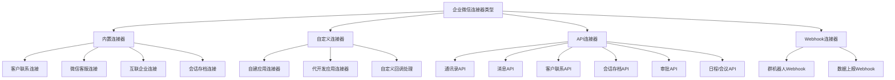

### 2.2 内置连接器

内置连接器指企业微信平台原生提供、无需额外开发即可使用的连接能力。

| 内置连接器 | 连接对象 | 触发方式 | 数据流向 | 使用场景 |
|-----------|----------|----------|----------|----------|
| 客户联系连接 | 微信用户 ↔ 企业员工 | API+回调 | 双向 | CRM客户管理、私域运营 |
| 微信客服连接 | 微信用户 → 企业客服 | API+回调+H5 | 微信→企业 | 在线客服、售后支持 |
| 互联企业连接 | 合作企业 ↔ 本企业 | API+回调 | 双向 | 跨企业协作、供应链沟通 |
| 会话存档连接 | 企业内部聊天 → 存档系统 | 会话拉取API | 单向(提取) | 合规审计、风控监管 |

**内置连接器特点**:
- 无需授权即可在企业微信管理后台配置启用
- 数据流向覆盖单向提取和双向交互
- 与微信生态的连接是核心差异化能力

### 2.3 自定义连接器

自定义连接器指企业或ISV基于企业微信开放能力自主构建的连接方案。

| 自定义连接器类型 | 构建方式 | 开发者角色 | 授权模型 | 典型用途 |
|----------------|----------|------------|----------|----------|
| 自建应用连接器 | 调用开放API+处理回调 | 企业内部开发 | 企业自授权 | 内部系统集成、OA对接 |
| 代开发应用连接器 | 调用开放API+处理回调 | ISV/服务商 | 企业授权服务商 | SaaS产品集成、行业解决方案 |
| 自定义回调处理 | 配置回调URL+解析事件 | 企业/ISV | 按事件订阅 | 事件驱动的流程触发 |

**自定义连接器特点**:
- 灵活度最高，可按业务需求自由组合API和回调
- 自建应用适合内部集成，代开发应用适合ISV提供SaaS服务
- 需自行实现数据转换、错误处理、重试机制

### 2.4 API连接器

API连接器是以企业微信开放API为核心构建的连接通道，是最基础也是最核心的连接器类型。

| API连接器 | API分类 | 核心接口数 | 认证方式 | 调用频率限制 |
|----------|---------|-----------|----------|-------------|
| 通讯录API | 成员/部门/标签 | ~30 | access_token | 60次/分钟(多数) |
| 消息API | 应用消息/群消息 | ~15 | access_token | 按应用配额 |
| 客户联系API | 外部联系人/客户群/朋友圈 | ~50 | access_token | 60次/分钟(多数) |
| 会话内容存档API | 会话拉取/密钥 | ~8 | access_token+SDK | 60次/分钟 |
| 审批API | 审批定义/审批数据 | ~10 | access_token | 60次/分钟 |
| 日程/会议API | 日程/会议/会议室 | ~20 | access_token | 60次/分钟 |
| OA数据API | 打卡/汇报/日报 | ~15 | access_token | 60次/分钟 |
| 微信客服API | 客服账号/会话/消息 | ~25 | access_token | 按客服配额 |

**API连接器Java代码示例**:

```java
import com.tencent.wework.FinanceApi;
import okhttp3.OkHttpClient;
import okhttp3.Request;
import okhttp3.Response;

public class WeComApiConnector {

    private static final String BASE_URL = "https://qyapi.weixin.qq.com/cgi-bin";
    private final OkHttpClient httpClient = new OkHttpClient();
    private final String corpId;
    private final String corpSecret;
    private String accessToken;
    private long tokenExpireTime;

    public WeComApiConnector(String corpId, String corpSecret) {
        this.corpId = corpId;
        this.corpSecret = corpSecret;
        refreshAccessToken();
    }

    private void refreshAccessToken() {
        String url = String.format("%s/gettoken?corpid=%s&corpsecret=%s",
                BASE_URL, corpId, corpSecret);
        Request request = new Request.Builder().url(url).get().build();
        try (Response response = httpClient.newCall(request).execute()) {
            String body = response.body().string();
            JSONObject json = new JSONObject(body);
            if (json.getInt("errcode") == 0) {
                this.accessToken = json.getString("access_token");
                this.tokenExpireTime = System.currentTimeMillis() +
                        json.getLong("expires_in") * 1000 - 300000;
            }
        } catch (Exception e) {
            throw new RuntimeException("Failed to refresh access_token", e);
        }
    }

    private String ensureToken() {
        if (System.currentTimeMillis() >= tokenExpireTime) {
            refreshAccessToken();
        }
        return accessToken;
    }

    public JSONObject listDepartment(Integer parentId) {
        String url = String.format("%s/department/list?access_token=%s&id=%s",
                BASE_URL, ensureToken(), parentId != null ? parentId : "");
        Request request = new Request.Builder().url(url).get().build();
        try (Response response = httpClient.newCall(request).execute()) {
            return new JSONObject(response.body().string());
        } catch (Exception e) {
            throw new RuntimeException("Failed to list department", e);
        }
    }

    public JSONObject sendApplicationMessage(String userIds, String msgType,
                                              String content, int agentId) {
        String url = String.format("%s/message/send?access_token=%s",
                BASE_URL, ensureToken());
        JSONObject msg = new JSONObject();
        msg.put("touser", userIds);
        msg.put("msgtype", msgType);
        msg.put("agentid", agentId);
        msg.put(msgType, new JSONObject().put("content", content));
        Request request = new Request.Builder().url(url)
                .post(okhttp3.RequestBody.create(msg.toString(),
                        okhttp3.MediaType.parse("application/json")))
                .build();
        try (Response response = httpClient.newCall(request).execute()) {
            return new JSONObject(response.body().string());
        } catch (Exception e) {
            throw new RuntimeException("Failed to send message", e);
        }
    }
}
```

### 2.5 Webhook连接器

Webhook连接器是基于群机器人Webhook实现的轻量级推送通道。

| Webhook连接器 | 推送方向 | 消息类型 | 认证方式 | 限制 |
|--------------|----------|----------|----------|------|
| 群机器人Webhook | 外部系统 → 企业微信群 | 文本/Markdown/图片/文件/图文 | Webhook Key(URL内置) | 20条/分钟 |
| 数据上报Webhook | 外部系统 → 企业微信 | 结构化数据 | Token | 按应用配额 |

**Webhook连接器特点**:
- 最简单的集成方式，仅需一个URL即可推送消息
- 仅支持单向推送（外部→企业微信），不支持接收回复
- 适合告警通知、CI/CD状态推送、日报推送等场景

### 2.6 连接器类型对比总表

| 对比维度 | 内置连接器 | 自定义连接器 | API连接器 | Webhook连接器 |
|---------|-----------|-------------|----------|--------------|
| 开发难度 | 无 | 高 | 中 | 低 |
| 灵活度 | 低 | 高 | 高 | 低 |
| 数据流向 | 双向 | 双向 | 双向(主动+回调) | 单向推送 |
| 使用门槛 | 管理后台配置 | 需开发+部署 | 需开发+授权 | 仅需Webhook Key |
| 流程编排 | 无 | 自定义 | 无 | 无 |
| 数据转换 | 无 | 自定义 | 无 | 无 |
| 错误处理 | 平台托管 | 自定义 | 自定义 | 无 |
| 适用场景 | 标准化连接 | 复杂业务集成 | 深度业务集成 | 告警/通知推送 |
| 微信生态连接 | 支持(客户联系/客服) | 支持 | 支持(客户联系API) | 不支持 |

---

## 3. 集成能力分析

### 3.1 集成能力分类总览

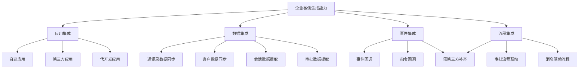

### 3.2 应用集成

企业微信提供三种应用类型，对应不同的集成模式:

| 应用类型 | 开发者 | 授权方式 |可见范围控制 | API权限范围 | 适用场景 |
|---------|--------|---------|------------|------------|---------|
| **自建应用** | 企业内部开发 | 企业管理员自授权 | 按部门/成员配置 | 全部开放API | 内部OA、ERP、CRM集成 |
| **第三方应用** | ISV服务商 | 企业管理员授权安装 | ISV预设+企业调整 | 按ISV申请的权限 | SaaS产品、行业解决方案 |
| **代开发应用** | ISV代企业开发 | 企业管理员授权代开发 | 企业配置 | 全部开放API | ISV为企业定制开发 |

**三种应用类型对比**:

| 对比维度 | 自建应用 | 第三方应用 | 代开发应用 |
|---------|---------|-----------|-----------|
| 部署方式 | 企业自部署 | ISV部署 | ISV部署,企业授权 |
| 数据归属 | 企业 | ISV(需协议约定) | 企业 |
| 授权粒度 | 全API | 按ISV申请的权限集 | 全API |
| 多租户 | 不适用 | ISV多租户管理 | 按企业单租户 |
| 上架 | 不上架应用市场 | 上架第三方应用市场 | 不上架 |
| 开发门槛 | 需企业内开发能力 | ISV专业开发 | ISV专业开发 |
| 维护成本 | 企业自行维护 | ISV维护升级 | ISV维护升级 |

### 3.3 数据集成

数据集成能力指企业微信与外部系统之间的数据同步和交换能力:

| 数据集成场景 | 数据源 | 数据目标 | 同步方向 | 频率 | API集合 |
|-------------|--------|---------|---------|------|---------|
| 通讯录同步 | HR系统 | 企业微信通讯录 | 双向 | 实时/定时 | 成员/部门 CRUD |
| 客户数据同步 | CRM系统 | 企业微信外部联系人 | 双向 | 实时/定时 | 外部联系人/客户群 |
| 审批数据提取 | 企业微信审批 | ERP/OA系统 | 单向(提取) | 实时(回调) | 审批数据获取 |
| OA数据提取 | 企业微信打卡/日报 | HR/报表系统 | 单向(提取) | 定时 | 打卡/日报/汇报 |
| 会话数据提取 | 企业微信会话 | 合规存档系统 | 单向(提取) | 实时(拉取) | 会话内容存档 |

### 3.4 事件集成

事件集成指通过回调机制实现的事件驱动集成:

| 事件类型 | 回调分类 | 触发条件 | 数据内容 | 典型用途 |
|---------|---------|---------|---------|---------|
| 通讯录变更 | 事件回调 | 成员创建/更新/删除 | 成员变更详情 | HR系统同步触发 |
| 消息接收 | 事件回调 | 用户发送消息给应用 | 消息内容 | 智能回复/工单创建 |
| 客户事件 | 事件回调 | 添加/删除外部联系人 | 客户变更详情 | CRM同步触发 |
| 审批状态变更 | 事件回调 | 审批通过/驳回/撤销 | 审批结果 | ERP流程联动 |
| 应用指令 | 指令回调 | 第三方应用指令下发 | 指令内容 | 应用状态切换 |

### 3.5 流程集成

流程集成指跨系统的业务流程串联能力:

| 流程集成类型 | 实现方式 | 成熟度 | 说明 |
|-------------|---------|--------|------|
| 审批流程联动 | 审批API+回调 | ★★★★ | 可实现企业微信审批与ERP/OA审批联动 |
| 消息驱动流程 | 消息回调+外部处理 | ★★★ | 消息触发外部系统流程执行 |
| 定时数据同步流程 | 定时任务+API调用 | ★★★ | 定时拉取/推送数据 |
| 可视化流程编排 | 无原生支持 | ★ | 需依赖第三方平台(如简道云、明道云)补齐 |
| 条件分支流程 | 无原生支持 | ★ | 需自建中间层实现条件判断和分支 |

### 3.6 SDK支持

| SDK | 语言 | 官方维护 | 核心功能 | GitHub/文档 |
|-----|------|---------|---------|------------|
| Finance API C SDK | C | 官方 | 会话内容存档密钥解密 | 官方文档提供 |
| 企业微信Java SDK | Java | 非官方(社区) | API调用封装 | GitHub开源 |
| wecom-sdk(Python) | Python | 非官方(社区) | API调用+回调处理 | GitHub开源 |
| wecom-jsapi | JavaScript | 非官方(社区) | 前端JS-SDK调用 | npm发布 |
| Go SDK | Go | 非官方(社区) | API调用封装 | GitHub开源 |

**集成能力Java代码示例**:

```java
import com.fasterxml.jackson.databind.ObjectMapper;
import java.util.concurrent.Executors;
import java.util.concurrent.ScheduledExecutorService;
import java.util.concurrent.TimeUnit;

public class WeComDataSyncService {

    private final WeComApiConnector apiConnector;
    private final ExternalCrmClient crmClient;
    private final ObjectMapper mapper = new ObjectMapper();
    private final ScheduledExecutorService scheduler =
            Executors.newScheduledThreadPool(2);

    public WeComDataSyncService(WeComApiConnector apiConnector,
                                 ExternalCrmClient crmClient) {
        this.apiConnector = apiConnector;
        this.crmClient = crmClient;
    }

    public void startContactSync() {
        scheduler.scheduleAtFixedRate(this::syncContactsToCrm,
                0, 5, TimeUnit.MINUTES);
    }

    private void syncContactsToCrm() {
        try {
            JSONObject externalContacts = apiConnector.getExternalContactList("");
            JSONArray contactList = externalContacts.getJSONArray("external_contact_list");
            for (int i = 0; i < contactList.length(); i++) {
                JSONObject contact = contactList.getJSONObject(i);
                CrmCustomer customer = mapToCrmCustomer(contact);
                crmClient.upsertCustomer(customer);
            }
        } catch (Exception e) {
            log.error("Contact sync failed", e);
        }
    }

    private CrmCustomer mapToCrmCustomer(JSONObject wecomContact) {
        CrmCustomer customer = new CrmCustomer();
        customer.setName(wecomContact.getString("name"));
        customer.setExternalUserId(wecomContact.getString("external_userid"));
        customer.setPosition(wecomContact.optString("position", ""));
        customer.setCorpName(wecomContact.optString("corp_full_name", ""));
        customer.setSource("wecom");
        return customer;
    }
}
```

---

## 4. 连接器架构分析

### 4.1 总体架构

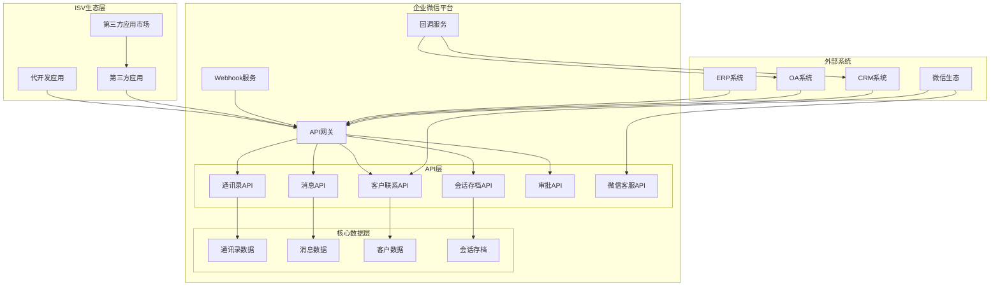

### 4.2 API架构分析

| API模块 | 核心接口 | 数据范围 | 认证方式 | 关键能力 |
|---------|---------|---------|---------|---------|
| **通讯录API** | 成员CRUD、部门CRUD、标签CRUD | 企业内部组织结构 | access_token(自建) / suite_access_token(第三方) | 组织结构同步、身份管理 |
| **消息API** | 应用消息发送、群消息发送、消息接收 | 企业内部+外部群 | access_token | 消息推送、通知告警 |
| **客户联系API** | 外部联系人CRUD、客户群管理、客户朋友圈 | 企业外部客户数据 | access_token | 客户管理、私域运营 |
| **会话内容存档API** | 会话拉取、密钥获取、成员状态查询 | 企业内部+外部会话 | access_token+Finance SDK | 合规存档、风控分析 |
| **审批API** | 审批模板、审批申请、审批状态 | 企业内部审批数据 | access_token | 审批流程联动 |
| **微信客服API** | 客服账号、客服会话、客服消息 | 微信用户客服会话 | access_token | 在线客服、售后支持 |

### 4.3 回调机制架构

#### 4.3.1 回调类型对比

| 回调类型 | 用途 | 数据格式 | 加密方式 | 响应要求 |
|---------|------|---------|---------|---------|
| **事件回调** | 通知外部系统事件发生 | XML/JSON | AES加密(CorpMsgCrypto) | 5秒内响应"success" |
| **指令回调** | 第三方应用指令下发 | XML | AES加密 | 需按指令处理并响应 |

#### 4.3.2 事件回调处理序列图

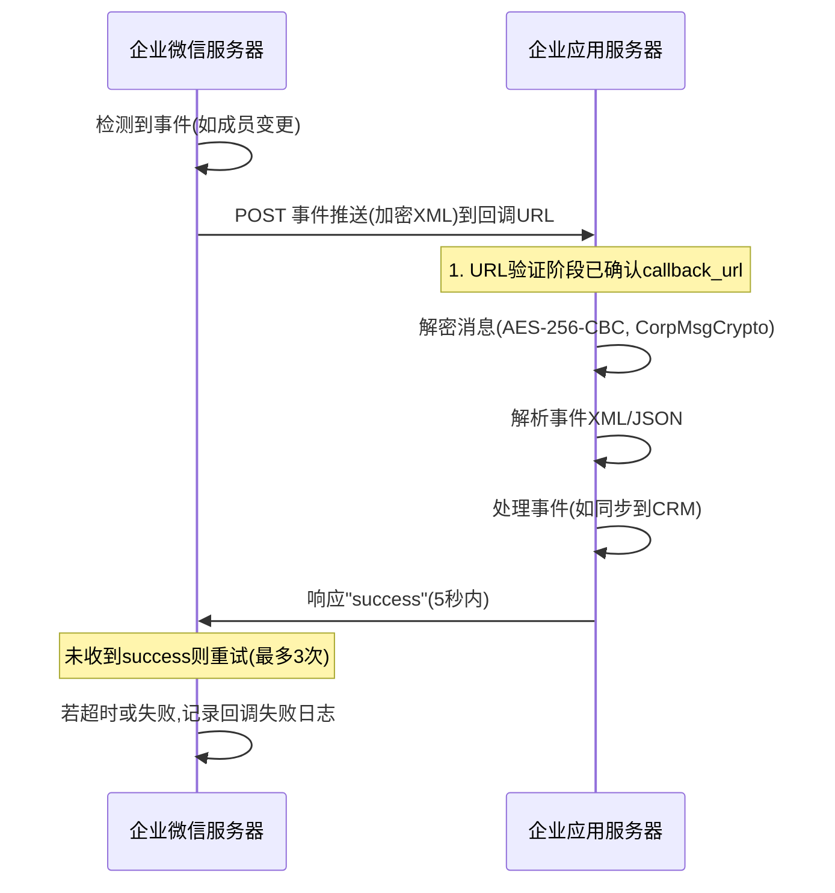

#### 4.3.3 回调处理Java代码示例

```java
import com.tencent.wework.FinanceApi;
import javax.crypto.Cipher;
import javax.crypto.spec.IvParameterSpec;
import javax.crypto.spec.SecretKeySpec;
import java.nio.charset.StandardCharsets;
import java.security.MessageDigest;
import java.util.Base64;

public class WeComCallbackHandler {

    private final String token;
    private final String encodingAesKey;
    private final String corpId;
    private final byte[] aesKey;

    public WeComCallbackHandler(String token, String encodingAesKey, String corpId) {
        this.token = token;
        this.encodingAesKey = encodingAesKey;
        this.corpId = corpId;
        this.aesKey = Base64.getDecoder().decode(encodingAesKey + "=");
    }

    public String verifyUrl(String msgSignature, String timestamp,
                            String nonce, String echoStr) {
        String signature = calculateSignature(token, timestamp, nonce, echoStr);
        if (!signature.equals(msgSignature)) {
            throw new SecurityException("Signature verification failed");
        }
        return decrypt(echoStr);
    }

    public CallbackMessage handleCallback(String msgSignature, String timestamp,
                                           String nonce, String encryptXml) {
        String signature = calculateSignature(token, timestamp, nonce, encryptXml);
        if (!signature.equals(msgSignature)) {
            throw new SecurityException("Signature verification failed");
        }
        String decryptedXml = decrypt(encryptXml);
        return parseCallbackMessage(decryptedXml);
    }

    private String calculateSignature(String... params) {
        try {
            String[] sorted = params.clone();
            java.util.Arrays.sort(sorted);
            String joined = String.join("", sorted);
            MessageDigest sha1 = MessageDigest.getInstance("SHA-1");
            byte[] digest = sha1.digest(joined.getBytes(StandardCharsets.UTF_8));
            StringBuilder sb = new StringBuilder();
            for (byte b : digest) {
                sb.append(String.format("%02x", b));
            }
            return sb.toString();
        } catch (Exception e) {
            throw new RuntimeException("SHA-1 calculation failed", e);
        }
    }

    private String decrypt(String encrypted) {
        try {
            Cipher cipher = Cipher.getInstance("AES/CBC/PKCS5Padding");
            SecretKeySpec keySpec = new SecretKeySpec(aesKey, "AES");
            IvParameterSpec ivSpec = new IvParameterSpec(aesKey, 0, 16);
            cipher.init(Cipher.DECRYPT_MODE, keySpec, ivSpec);
            byte[] decrypted = cipher.doFinal(Base64.getDecoder().decode(encrypted));
            String result = new String(decrypted, StandardCharsets.UTF_8);
            int contentStart = result.indexOf(corpId) + corpId.length();
            return result.substring(contentStart).trim();
        } catch (Exception e) {
            throw new RuntimeException("Decryption failed", e);
        }
    }
}
```

### 4.4 Webhook机制架构

#### 4.4.1 群机器人Webhook序列图

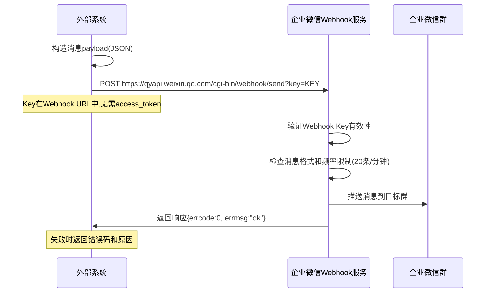

### 4.5 第三方应用架构

```mermaid
graph TB
    subgraph ISVArchitecture[第三方应用(ISV)架构]
        ISVDeveloper[ISV开发者]

        subgraph ISVServer[ISV服务端]
            SuiteApi[suite_access_token管理]
            AuthApi[授权流程处理]
            CallbackHandler[回调处理]
            DataSync[数据同步层]
            MultiTenant[多租户管理]
        end

        subgraph WeComAPI[企业微信开放平台]
            SuiteTokenAPI[suite_access_token获取]
            PreAuthCode[预授权码获取]
            PermanentCode[永久授权码]
            AuthCallback[授权回调]
            ThirdApi[第三方专用API]
        end

        subgraph Enterprise[企业客户]
            Admin[企业管理员]
            Members[企业成员]
        end
    end

    ISVDeveloper --> SuiteApi
    ISVDeveloper --> AuthApi

    SuiteApi --> SuiteTokenAPI
    AuthApi --> PreAuthCode
    AuthApi --> PermanentCode
    AuthApi --> AuthCallback

    CallbackHandler --> ThirdApi
    DataSync --> ThirdApi
    MultiTenant --> SuiteApi

    Admin --> AuthCallback
    Members --> ThirdApi
```

### 4.6 ISV生态架构

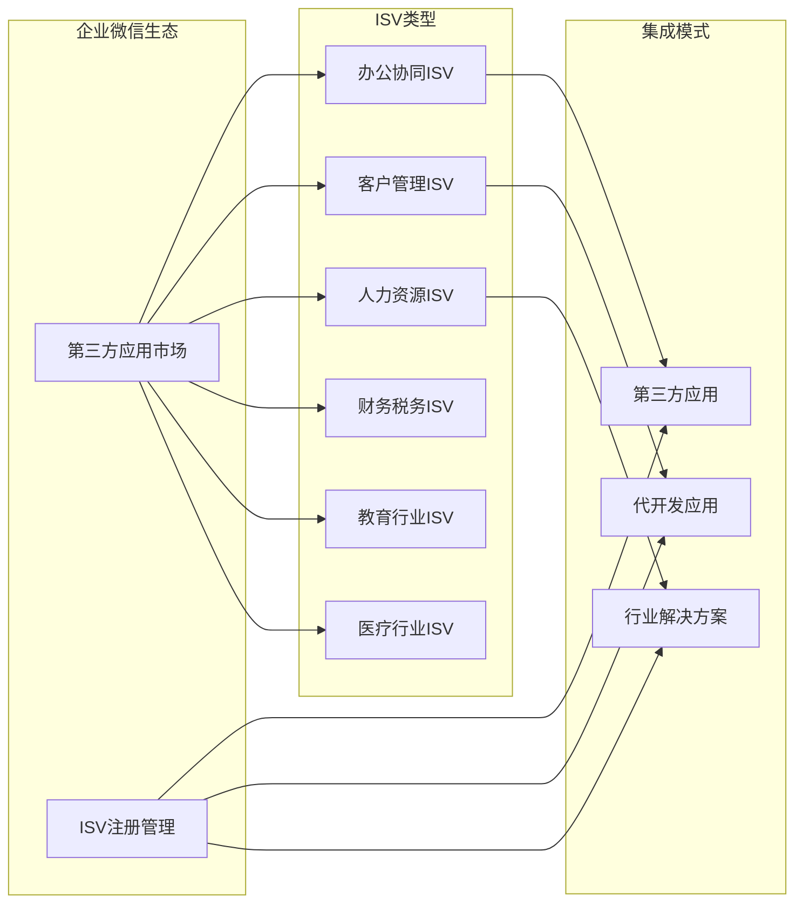

---

## 5. 典型集成场景

### 5.1 CRM客户管理集成

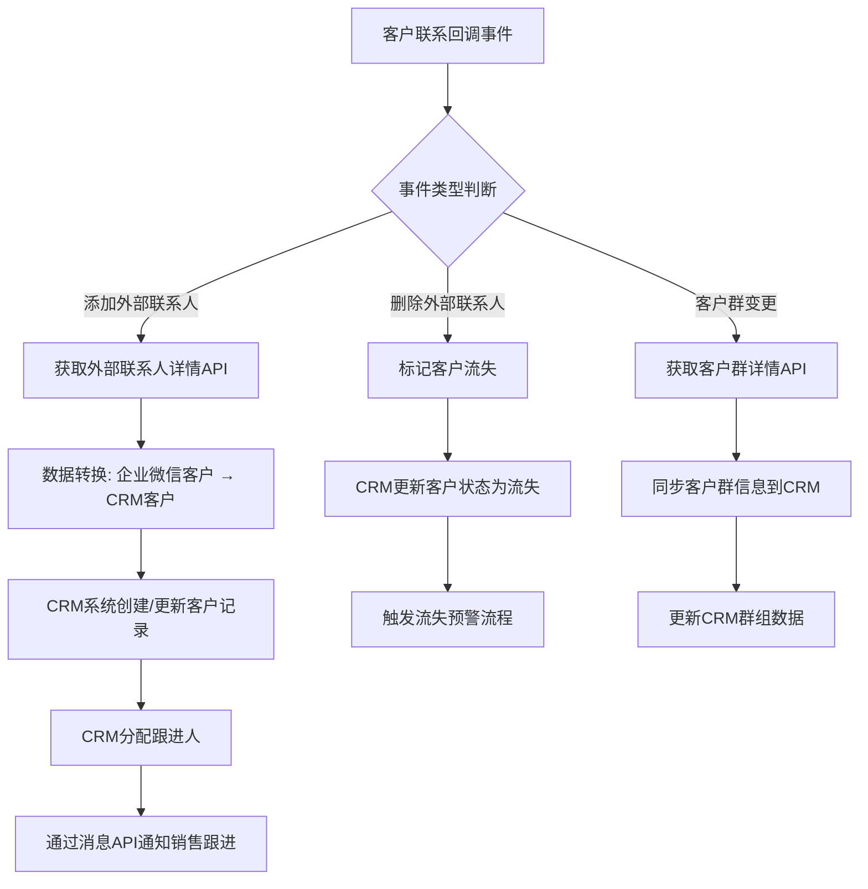

**CRM集成Java代码片段**:

```java
public class CrmIntegrationHandler {

    private final WeComApiConnector apiConnector;
    private final CrmService crmService;

    public void handleExternalContactEvent(CallbackMessage callback) {
        String eventType = callback.getEventType();
        String externalUserId = callback.getExternalUserId();

        switch (eventType) {
            case "add_external_contact":
                JSONObject detail = apiConnector.getExternalContactDetail(externalUserId);
                CrmCustomer customer = mapWeComContactToCrmCustomer(detail);
                crmService.createCustomer(customer);
                notifySalesFollowUp(callback.getStaffUserId(), customer.getName());
                break;
            case "del_external_contact":
                crmService.updateCustomerStatus(externalUserId, "LOST");
                crmService.triggerLossAlert(externalUserId);
                break;
            case "update_external_contact":
                JSONObject updated = apiConnector.getExternalContactDetail(externalUserId);
                crmService.updateCustomer(mapWeComContactToCrmCustomer(updated));
                break;
        }
    }

    private void notifySalesFollowUp(String staffId, String customerName) {
        String content = String.format("新客户提醒: %s 已添加为您的外部联系人,请及时跟进",
                customerName);
        apiConnector.sendApplicationMessage(staffId, "text", content, AGENT_ID);
    }
}
```

### 5.2 企业内部系统单点登录

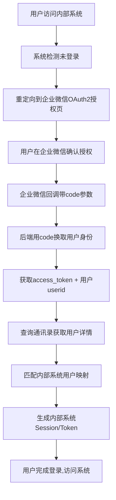

### 5.3 审批流程自动化

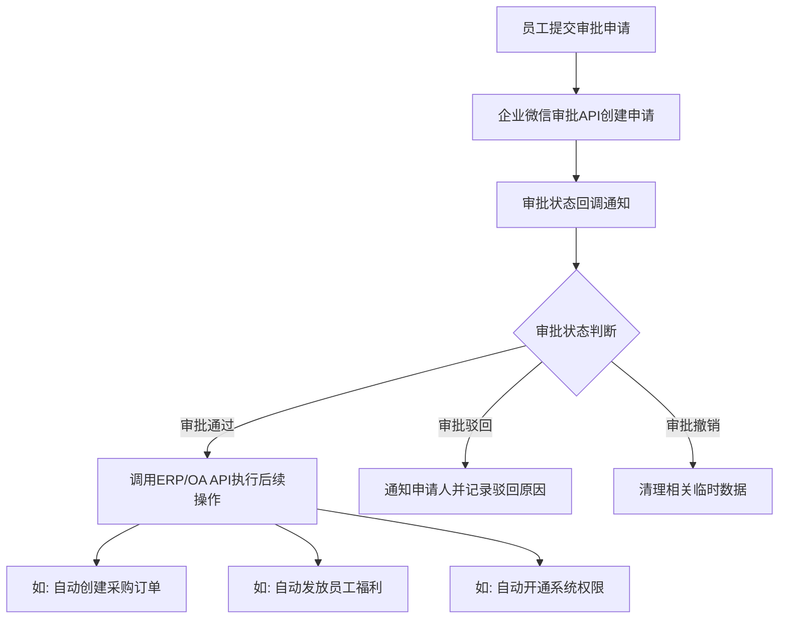

**审批流程Java代码片段**:

```java
public class ApprovalAutomationService {

    public void handleApprovalCallback(CallbackMessage callback) {
        String approvalStatus = callback.getApprovalStatus();
        String spNo = callback.getSpNo();

        JSONObject approvalDetail = apiConnector.getApprovalDetail(spNo);
        JSONObject applyData = approvalDetail.getJSONObject("apply_data");

        switch (approvalStatus) {
            case "2":
                processApprovedApproval(spNo, applyData);
                break;
            case "3":
                notifyRejection(callback.getApplyerUserId(),
                        approvalDetail.getString("remark"));
                break;
            case "4":
                cleanupRevokedApproval(spNo);
                break;
        }
    }

    private void processApprovedApproval(String spNo, JSONObject applyData) {
        String templateId = applyData.getString("template_id");
        if ("PURCHASE_TEMPLATE_ID".equals(templateId)) {
            PurchaseOrder order = extractPurchaseOrder(applyData);
            erpClient.createPurchaseOrder(order);
            apiConnector.sendApplicationMessage(
                    applyData.getString("applicant_userid"),
                    "text", "采购审批已通过,订单已自动创建,订单号:" + order.getId(),
                    AGENT_ID);
        }
    }
}
```

### 5.4 客服系统集成（微信客服）

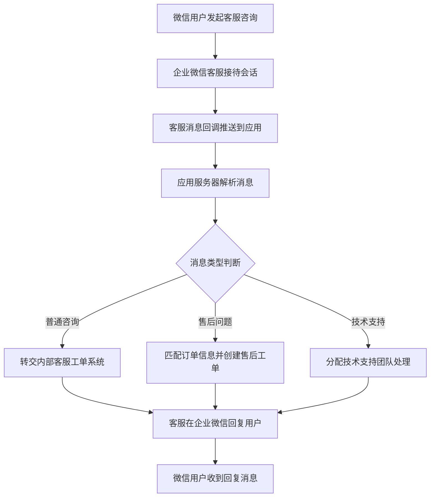

### 5.5 合规数据存档

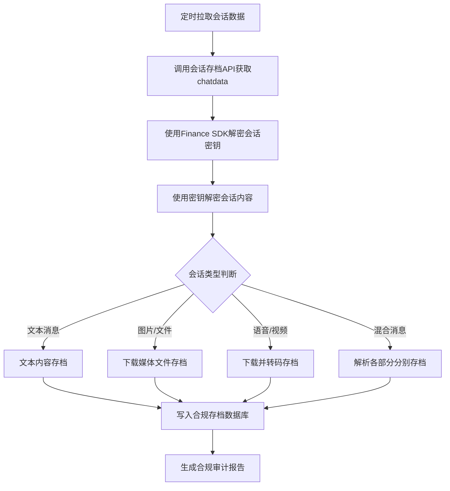

**会话存档Java代码片段**:

```java
public class ChatArchiveService {

    private final FinanceApi financeApi;
    private final ArchiveStorage archiveStorage;

    public void archiveChatData() {
        long seq = archiveStorage.getLastSeq();
        JSONObject result = apiConnector.getChatData(seq, 1000, "", "", 1);
        JSONArray chatDataList = result.getJSONArray("chatdata");

        for (int i = 0; i < chatDataList.length(); i++) {
            JSONObject chatData = chatDataList.getJSONObject(i);
            String encryptChatMsg = chatData.getString("encrypt_chat_msg");
            String encryptRandomKey = chatData.getString("encrypt_random_key");

            byte[] decryptedKey = financeApi.decryptChatRandomKey(
                    PRIVATE_KEY, encryptRandomKey);
            String chatKey = new String(decryptedKey, StandardCharsets.UTF_8);

            byte[] decryptedMsg = financeApi.decryptChatMsg(
                    chatKey, encryptChatMsg);
            String chatMsg = new String(decryptedMsg, StandardCharsets.UTF_8);

            JSONObject msg = new JSONObject(chatMsg);
            String msgType = msg.getString("msgtype");
            long msgSeq = chatData.getLong("seq");

            ArchiveRecord record = buildArchiveRecord(msg, msgType, msgSeq);
            if ("image".equals(msgType) || "file".equals(msgType)) {
                downloadAndArchiveMedia(msg.getString("sdkfileid"), record);
            }
            archiveStorage.save(record);
        }
    }
}
```

### 5.6 跨企业互联协作

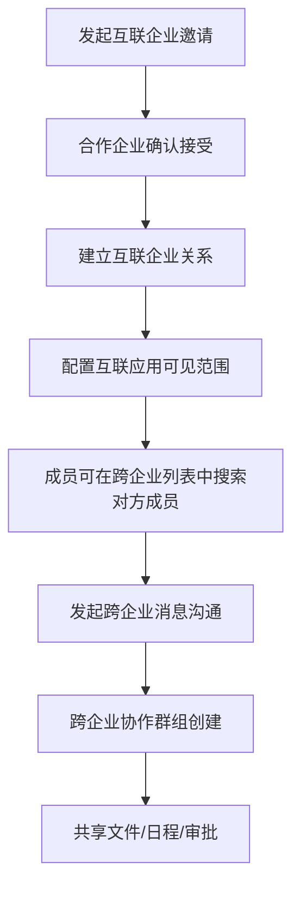

---

## 6. 安全与权限

### 6.1 权限层级体系

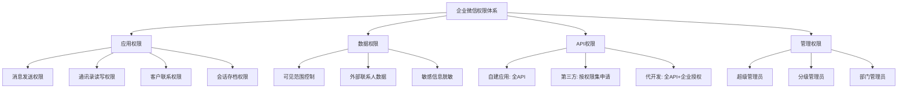

### 6.2 权限类型详细分析

| 权限分类 | 权限名称 | 权限说明 | 授权对象 | 敏感级别 |
|---------|---------|---------|---------|---------|
| **通讯录权限** | 成员信息读取 | 读取成员姓名/职位/手机号 | 自建/第三方(需申请) | ★★★ |
| **通讯录权限** | 成员信息写入 | 创建/更新/删除成员 | 自建/第三方(需申请) | ★★★★ |
| **通讯录权限** | 部门管理 | 创建/更新/删除部门 | 自建/第三方(需申请) | ★★★ |
| **消息权限** | 应用消息发送 | 向可见范围内成员发消息 | 自建/第三方 | ★★ |
| **消息权限** | 群消息发送 | 向企业群发送消息 | 自建(需申请) | ★★ |
| **客户联系权限** | 外部联系人读取 | 读取客户姓名/公司/职位 | 自建/第三方(需申请) | ★★★★ |
| **客户联系权限** | 外部联系人写入 | 添加/编辑/删除外部联系人 | 自建(需申请) | ★★★★★ |
| **客户联系权限** | 客户群管理 | 获取/管理客户群信息 | 自建/第三方(需申请) | ★★★★ |
| **会话存档权限** | 会话内容拉取 | 拉取员工会话数据 | 自建(需单独开通+员工同意) | ★★★★★ |
| **审批权限** | 审批数据读取 | 读取审批申请详情 | 自建/第三方(需申请) | ★★★ |
| **审批权限** | 审批模板管理 | 创建/管理审批模板 | 自建 | ★★★ |

### 6.3 安全机制分析

| 安全机制 | 实现方式 | 应用场景 | 强度 |
|---------|---------|---------|------|
| **签名验证** | SHA-1签名(token+timestamp+nonce+encrypt_msg) | 回调URL验证、消息防篡改 | ★★★★ |
| **消息加密** | AES-256-CBC(CorpMsgCrypto) | 回调消息加密传输 | ★★★★★ |
| **access_token** | corpId+corpSecret换取,2小时有效 | API调用身份认证 | ★★★★ |
| **IP白名单** | 管理后台配置可信IP | API调用来源限制 | ★★★ |
| **会话存档加密** | RSA+AES双层加密,Finance SDK解密 | 会话内容存档数据保护 | ★★★★★ |
| **HTTPS传输** | 全API强制HTTPS | 传输层安全 | ★★★★ |
| **数据脱敏** | 手机号等敏感字段脱敏 | 第三方应用数据访问 | ★★★ |

### 6.4 安全处理Java代码示例

```java
import java.security.InvalidKeyException;
import java.security.NoSuchAlgorithmException;
import javax.crypto.Mac;
import javax.crypto.spec.SecretKeySpec;

public class WeComSecurityManager {

    private final String callbackToken;
    private final String encodingAesKey;
    private final String corpId;

    public boolean verifyCallbackSignature(String msgSignature,
                                            String timestamp, String nonce,
                                            String encryptStr) {
        String[] params = {callbackToken, timestamp, nonce, encryptStr};
        java.util.Arrays.sort(params);
        String joined = String.join("", params);
        String calculated = sha1(joined);
        return calculated.equals(msgSignature);
    }

    private String sha1(String input) {
        try {
            MessageDigest md = MessageDigest.getInstance("SHA-1");
            byte[] digest = md.digest(input.getBytes(StandardCharsets.UTF_8));
            StringBuilder hexString = new StringBuilder();
            for (byte b : digest) {
                hexString.append(String.format("%02x", b));
            }
            return hexString.toString();
        } catch (NoSuchAlgorithmException e) {
            throw new RuntimeException("SHA-1 not available", e);
        }
    }

    public boolean verifyApiIpWhitelist(String callerIp) {
        List<String> allowedIps = fetchWhitelistFromConfig();
        return allowedIps.contains(callerIp);
    }

    public String generateHmacSignature(String payload, String secret) {
        try {
            Mac mac = Mac.getInstance("HmacSHA256");
            mac.init(new SecretKeySpec(secret.getBytes(StandardCharsets.UTF_8),
                    "HmacSHA256"));
            byte[] hmacBytes = mac.doFinal(payload.getBytes(StandardCharsets.UTF_8));
            return Base64.getEncoder().encodeToString(hmacBytes);
        } catch (Exception e) {
            throw new RuntimeException("HMAC generation failed", e);
        }
    }
}
```

### 6.5 敏感权限使用规范

| 敏感权限 | 使用前提 | 合规要求 | 审计要求 |
|---------|---------|---------|---------|
| 会话内容存档 | 企业开通+员工签署知情同意书 | 数据仅用于合规审计 | 存档操作需记录审计日志 |
| 外部联系人写入 | 企业管理员授权+应用可见范围限制 | 不得滥用添加外部联系人 | 记录添加来源和时间 |
| 成员信息写入 | 企业管理员授权 | 变更需通知员工 | 通讯录变更需审计 |
| 客户朋友圈发表 | 企业管理员授权+成员确认 | 不得强制员工发朋友圈 | 记录发表内容和时间 |

---

## 7. 限制与不足

### 7.1 详细限制分析表

| 限制类别 | 具体限制 | 影响范围 | 严重程度 | 缓解方案 |
|---------|---------|---------|---------|---------|
| **API频率限制** | 大部分API 60次/分钟 | 高频同步场景受影响 | ★★★ | 定时批量+队列缓冲 |
| **API频率限制** | 消息发送按应用配额 | 大规模消息推送受限 | ★★★ | 多应用分流 |
| **API频率限制** | Webhook 20条/分钟 | 告警通知场景受限 | ★★ | 合并通知+降频 |
| **数据访问限制** | 第三方应用仅可访问授权范围内数据 | ISV数据范围受限 | ★★★★ | 申请更多权限集 |
| **数据访问限制** | 通讯录敏感字段脱敏(第三方) | 手机号等字段不可见 | ★★★ | 通过代开发模式获取 |
| **数据访问限制** | 会话存档需员工知情同意 | 部分员工可能拒绝 | ★★★★ | 企业合规政策+员工教育 |
| **功能缺失** | 无可视化流程编排引擎 | 无法低代码编排跨系统流程 | ★★★★★ | 依赖第三方(简道云等) |
| **功能缺失** | 无内置数据转换/映射工具 | 需自建ETL逻辑 | ★★★★ | 自建中间层或用ETL工具 |
| **功能缺失** | 无连接器市场/模板库 | 集成需从零开发 | ★★★ | 参考官方示例代码 |
| **平台约束** | 回调5秒响应要求 | 复杂处理需异步化 | ★★★ | 先响应success,异步处理 |
| **平台约束** | access_token 2小时过期 | 需主动刷新机制 | ★★ | 定时刷新+缓存 |
| **平台约束** | 回调重试最多3次 | 3次失败后不再推送 | ★★★ | 确保回调服务高可用 |

### 7.2 API频率限制详解

| API接口 | 频率限制 | 单次数据量限制 | 说明 |
|---------|---------|--------------|------|
| 成员创建/更新 | 60次/分钟 | 单次最多1000人(批量) | 批量接口降低频率消耗 |
| 部门列表获取 | 60次/分钟 | 无限制 | 建议缓存 |
| 应用消息发送 | 按应用配额(动态) | 单次最多1000人 | 企业规模影响配额 |
| 外部联系人列表 | 60次/分钟 | 单次最多1000人 | 分页拉取 |
| 会话内容拉取 | 60次/分钟 | 单次最多1000条 | 定时增量拉取 |
| 审批数据获取 | 60次/分钟 | 单次1条详情 | 建议批量列表+逐条详情 |

### 7.3 与钉钉、飞书的对比分析

| 对比维度 | 企业微信 | 钉钉 | 飞书 |
|---------|---------|------|------|
| **连接器产品** | 无显式连接器产品 | 钉钉连接器(低代码) | 飞书集成平台(低代码) |
| **流程编排** | 无内置,需第三方 | 内置工作流引擎 | 内置审批+自动化规则 |
| **API丰富度** | 200+ API | 200+ API | 300+ API |
| **C端连接** | 微信生态直连(最强) | 无C端生态连接 | 无C端生态连接 |
| **会话存档** | 支持(需合规同意) | 支持(需管理员开通) | 支持 |
| **第三方生态** | 应用市场+代开发 | 应用市场 | 应用市场+集成平台 |
| **低代码能力** | 无 | 钉钉宜搭低代码平台 | 飞书多维表格+自动化 |
| **OAuth集成** | 支持OAuth2企业登录 | 支持OAuth2 | 支持OAuth2 |
| **开放性** | 中(部分权限需审批) | 高(大部分开放) | 高(大部分开放) |
| **合规存档** | 强(RSA+AES双层加密) | 中 | 中 |

---

## 8. 总结与建议

### 8.1 总结

| 维度 | 评价 | 关键结论 |
|------|------|---------|
| **连接器成熟度** | ★★★☆☆ | 企业微信无显式连接器产品,以API+回调+Webhook组合实现,属于API驱动的集成平台而非可视化连接器平台 |
| **集成广度** | ★★★★☆ | API覆盖通讯录/消息/客户联系/审批/会话存档等核心场景,200+接口 |
| **微信生态连接** | ★★★★★ | 客户联系+微信客服实现与微信C端用户的直接连接,这是钉钉和飞书不具备的差异化优势 |
| **安全合规** | ★★★★☆ | 签名验证+加密+白名单+会话存档加密,达到企业级安全标准 |
| **低代码/可视化** | ★☆☆☆☆ | 无内置流程编排/数据转换引擎,需依赖第三方补齐 |
| **ISV生态** | ★★★☆☆ | 第三方应用市场成熟,但代开发模式增加管理复杂度 |

### 8.2 最佳实践建议

| 建议 | 说明 | 优先级 |
|------|------|--------|
| **采用回调驱动+API补充模式** | 以回调事件为触发器,API调用为数据补充,构建事件驱动架构 | P0 |
| **自建应用用于内部集成** | 内部系统(OA/ERP/HR)优先使用自建应用,获取全API权限 | P0 |
| **代开发用于ISV定制** | ISV为企业定制开发时使用代开发模式,降低企业开发成本 | P1 |
| **异步化回调处理** | 回调先响应success,再异步处理业务逻辑,避免超时 | P0 |
| **access_token集中管理** | 建立统一的token管理服务,避免各应用独立刷新导致冲突 | P1 |
| **增量拉取替代全量** | 数据同步采用增量模式(seq/分页),减少API消耗 | P1 |
| **会话存档提前合规准备** | 开通会话存档前完成员工知情同意,避免数据获取受阻 | P0 |

### 8.3 架构设计建议

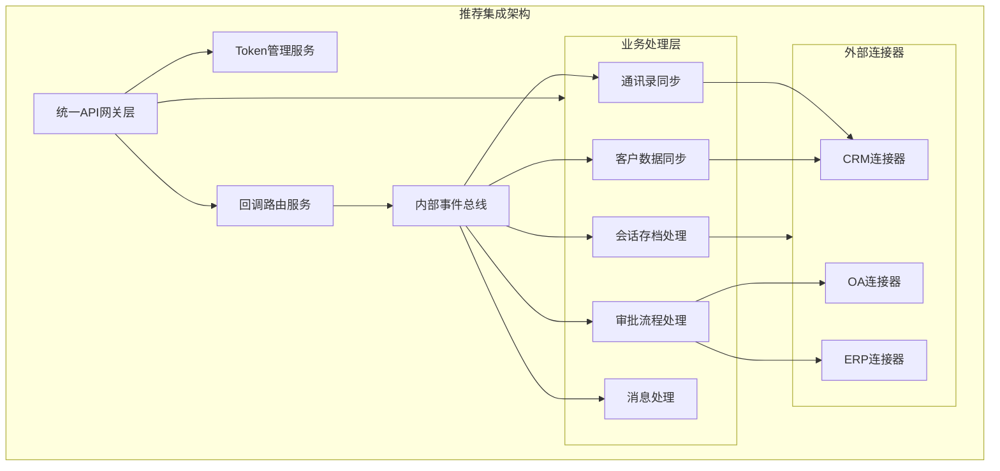

**核心架构原则**:
1. **统一网关**: 所有企业微信API调用通过统一网关,集中token管理、频率控制、错误处理
2. **事件驱动**: 回调事件进入内部事件总线,业务处理层按事件类型异步消费
3. **适配器模式**: 外部系统通过适配器连接,解耦企业微信API细节与业务逻辑
4. **增量同步**: 所有数据同步采用增量模式,基于seq或时间戳避免全量拉取

---

## 9. 附录

### 9.1 API分类列表

| API分类 | 核心接口 | 接口数 | 主要用途 |
|---------|---------|-------|---------|
| 通讯录管理 | 成员CRUD/部门CRUD/标签管理 | ~30 | 组织结构管理 |
| 应用管理 | 应用列表/可见范围设置 | ~5 | 应用配置 |
| 消息推送 | 应用消息/群消息/互发消息 | ~15 | 消息通知 |
| 客户联系 | 外部联系人/客户群/朋友圈/微信客服 | ~50 | 客户管理 |
| 客户朋友圈 | 朋友圈发表/获取 | ~5 | 私域营销 |
| 微信客服 | 客服账号/会话/消息 | ~25 | 客服支持 |
| 会话内容存档 | 会话拉取/密钥获取 | ~8 | 合规存档 |
| 审批 | 审批模板/审批数据/审批申请 | ~10 | 审批管理 |
| 日程 | 日程CRUD/日历管理 | ~15 | 日程管理 |
| 会议 | 会议创建/管理/邀请 | ~10 | 会议管理 |
| OA数据 | 打卡/日报/汇报/出差 | ~15 | OA数据提取 |
| 互联企业 | 互联应用/跨企业通讯录 | ~5 | 跨企业协作 |
| 身份验证 | OAuth2/JS-SDK登录 | ~8 | 单点登录 |
| 电子发票 | 发票查询/报销 | ~5 | 发票报销 |
| 企业支付 | 企业红包/付款/工资 | ~8 | 企业支付 |
| 素材管理 | 上传/下载媒体文件 | ~5 | 文件管理 |

### 9.2 SDK支持详情

| SDK名称 | 语言 | 版本 | 维护方 | 功能覆盖 | 安装方式 |
|---------|------|------|--------|---------|---------|
| Finance API | C | 1.1 | 官方 | 会话存档密钥解密 | 官方文档下载 |
| wecom-sdk | Java | 2.x | 社区 | API调用+回调处理 | Maven依赖 |
| wepy-wecom | Python | 1.x | 社区 | API调用+Token管理 | pip安装 |
| wecom-sdk-go | Go | 1.x | 社区 | API调用 | go get |
| wxwork-jsapi | JavaScript | 1.x | 社区 | JS-SDK前端调用 | npm安装 |
| node-wecom | Node.js | 1.x | 社区 | API+回调+消息 | npm安装 |

### 9.3 ISV生态资源

| ISV类别 | 代表厂商 | 主要产品 | 集成模式 | 应用市场状态 |
|---------|---------|---------|---------|-------------|
| 办公协同 | 泛微/致远/蓝凌 | OA系统 | 第三方应用+代开发 | 已上架 |
| 客户管理 | 销帮帮/探马/微伴 | CRM/SCRM | 第三方应用+代开发 | 已上架 |
| 人力资源 | 北森/薪人薪事 | HR SaaS | 第三方应用 | 已上架 |
| 财税管理 | 用友/金蝶 | ERP/财务 | 第三方应用+代开发 | 已上架 |
| 项目管理 | Teambition/Tapd | 项目协作 | 第三方应用 | 已上架 |
| 教育行业 | 腾讯课堂/小鹅通 | 在线教育 | 第三方应用 | 已上架 |
| 医疗行业 | 腾讯健康/微医 | 医疗服务 | 第三方应用 | 部分上架 |
| 数据分析 | 神策/GrowingIO | 数据分析 | 代开发 | 部分上架 |
| 低代码平台 | 简道云/明道云 | 低代码流程 | 第三方应用 | 已上架 |
| 安全合规 | 天融信/安恒 | 安全审计 | 代开发 | 未上架 |

### 9.4 事件类型目录

| 事件分类 | 事件名称 | 事件标识 | 触发条件 | 回调类型 |
|---------|---------|---------|---------|---------|
| 通讯录变更 | 成员创建 | create_user | 新成员加入企业 | 事件回调 |
| 通讯录变更 | 成员更新 | update_user | 成员信息变更 | 事件回调 |
| 通讯录变更 | 成员删除 | delete_user | 成员离职/移除 | 事件回调 |
| 通讯录变更 | 部门创建 | create_party | 新部门创建 | 事件回调 |
| 通讯录变更 | 部门更新 | update_party | 部门信息变更 | 事件回调 |
| 通讯录变更 | 部门删除 | delete_party | 部门解散 | 事件回调 |
| 客户联系 | 添加外部联系人 | add_external_contact | 员工添加微信客户 | 事件回调 |
| 客户联系 | 删除外部联系人 | del_external_contact | 员工删除微信客户 | 事件回调 |
| 客户联系 | 外部联系人变更 | update_external_contact | 客户信息更新 | 事件回调 |
| 客户联系 | 客户群创建 | create_chat | 新客户群创建 | 事件回调 |
| 客户联系 | 客户群变更 | update_chat | 客户群信息变更 | 事件回调 |
| 客户联系 | 客户群解散 | dismiss_chat | 客户群解散 | 事件回调 |
| 客户联系 | 客户进入会话 | enter_session | 客户发起微信客服会话 | 事件回调 |
| 消息事件 | 消息接收 | msg_notify | 用户发送消息给应用 | 事件回调 |
| 消息事件 | 应用菜单事件 | subscribe | 用户点击应用菜单 | 事件回调 |
| 审批事件 | 审批状态变更 | approval_status_change | 审批通过/驳回/撤销 | 事件回调 |
| 互联企业 | 互联企业变更 | change_corp_interact | 互联企业关系变更 | 事件回调 |
| 应用指令 | 安装应用 | install_app | 第三方应用被企业安装 | 指令回调 |
| 应用指令 | 卸载应用 | uninstall_app | 第三方应用被企业卸载 | 指令回调 |
| 应用指令 | 授权变更 | change_auth | 企业对第三方应用权限变更 | 指令回调 |
| OA数据 | 打卡事件 | punch_event | 员工打卡签到 | 事件回调 |
| OA数据 | 日报事件 | daily_report_event | 员工提交日报 | 事件回调 |

---

> **报告说明**: 本报告基于企业微信开放平台官方文档(https://developer.work.weixin.qq.com/document/)进行调研分析,所有API接口、限制参数、安全机制均参考官方最新版本。企业微信平台持续迭代更新,建议定期关注官方文档变更日志以获取最新信息。
>
> **版本历史**: v1.0 (2026-05-14) - 初版发布