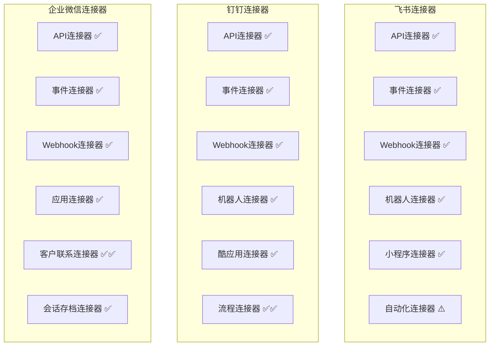
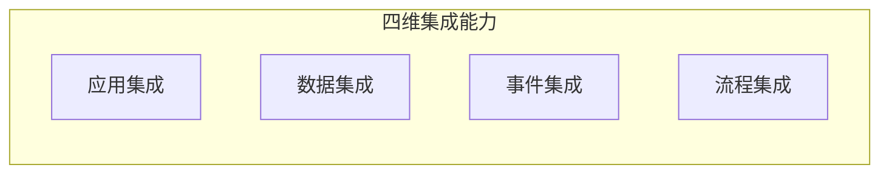
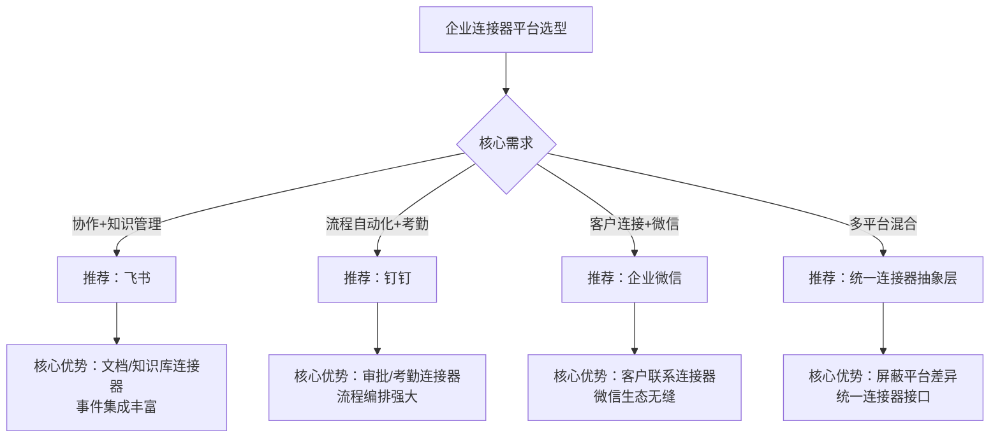
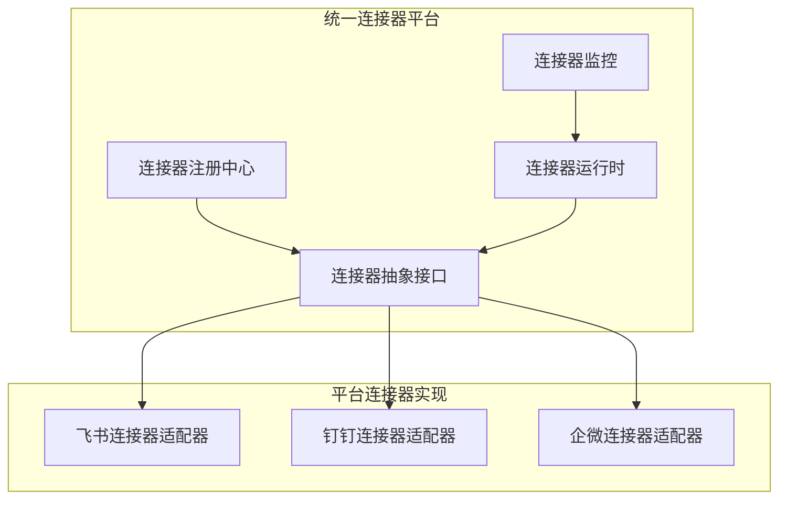

# 连接器平台对比调研汇总报告

## 一、执行摘要

本报告从**连接器平台**（Connector / Integration Platform / iPaaS）角度，对飞书、钉钉、企业微信三大办公平台的连接器能力进行系统化对比调研，分析各平台在连接器类型、集成能力、架构设计、安全机制等方面的差异，为企业连接器平台建设提供决策参考。

### 核心结论

| 对比维度 | 飞书 | 钉钉 | 企业微信 | 综合评价 |
|---------|------|------|---------|---------|
| **连接器类型丰富度** | ⭐⭐⭐⭐⭐ | ⭐⭐⭐⭐ | ⭐⭐⭐⭐ | 飞书类型最丰富 |
| **API设计质量** | ⭐⭐⭐⭐⭐ | ⭐⭐⭐⭐ | ⭐⭐⭐⭐ | 飞书API设计最现代 |
| **事件集成能力** | ⭐⭐⭐⭐⭐ | ⭐⭐⭐⭐ | ⭐⭐⭐ | 飞书事件集成最强 |
| **流程集成能力** | ⭐⭐⭐⭐ | ⭐⭐⭐⭐⭐ | ⭐⭐⭐ | 钉钉流程集成最强 |
| **生态市场成熟度** | ⭐⭐⭐⭐ | ⭐⭐⭐⭐⭐ | ⭐⭐⭐⭐ | 钉钉生态最成熟 |
| **微信生态连接** | ⭐⭐ | ⭐⭐ | ⭐⭐⭐⭐⭐ | 企微独有优势 |
| **开发者体验** | ⭐⭐⭐⭐⭐ | ⭐⭐⭐⭐ | ⭐⭐⭐⭐ | 飞书开发体验最好 |
| **安全合规性** | ⭐⭐⭐⭐⭐ | ⭐⭐⭐⭐⭐ | ⭐⭐⭐⭐⭐ | 三者均优秀 |

**平台选择建议**：
- 注重协作与知识管理 → **飞书**
- 注重流程自动化与ISV生态 → **钉钉**
- 注重客户连接与微信生态 → **企业微信**
- 多平台混合场景 → **统一连接器平台抽象**

---

## 二、连接器类型对比

### 2.1 连接器类型全景对比



### 2.2 连接器类型对比矩阵

| 连接器类型 | 飞书 | 钉钉 | 企业微信 | 差异分析 |
|----------|------|------|---------|---------|
| **RESTful API连接器** | ✅ 设计规范 | ✅ 部分不够规范 | ✅ 设计规范 | 飞书最规范 |
| **事件订阅连接器** | ✅ 类型丰富 | ✅ Stream+HTTP双模式 | ✅ 回调模式 | 钉钉模式更灵活 |
| **Webhook连接器** | ✅ 群机器人 | ✅ 群机器人 | ✅ 群机器人 | 三者相当 |
| **机器人连接器** | ✅ 功能丰富 | ✅ 功能丰富 | ✅ 功能基础 | 飞书/钉钉更强 |
| **审批流程连接器** | ✅ 充分开放 | ✅✅ 非常强大 | ⚠️ 无原生审批 | 钉钉最强 |
| **考勤连接器** | ✅ 基础开放 | ✅✅ 非常充分 | ⚠️ 无原生考勤 | 钉钉最强 |
| **文档/知识库连接器** | ✅✅ 非常充分 | ⚠️ 有限开放 | ❌ 无原生文档 | 飞书最强 |
| **客户关系连接器** | ❌ 无 | ❌ 无 | ✅✅ 独有优势 | 企微独有 |
| **会话存档连接器** | ⚠️ 有限 | ⚠️ 有限 | ✅ 合规存档 | 企微合规场景最强 |
| **微信生态连接器** | ❌ 无 | ❌ 无 | ✅✅ 独有优势 | 企微独有 |

### 2.3 特色连接器对比

| 特色能力 | 飞书 | 钉钉 | 企业微信 |
|---------|------|------|---------|
| **最强项** | 协作数据连接器 | 流程/考勤连接器 | 客户/微信连接器 |
| **独有能力** | 文档协作、知识图谱 | 酷应用、工作流编排 | 客户联系、微信客服 |
| **差异化** | 多维表格、OKR连接 | ISV市场连接器 | 会话存档合规 |
| **缺失项** | 客户管理、微信连接 | 文档深度集成 | 审批流程、考勤管理 |

---

## 三、集成能力对比

### 3.1 集成能力四维对比



| 集成维度 | 飞书 | 钉钉 | 企业微信 | 对比分析 |
|---------|------|------|---------|---------|
| **应用集成** | ⭐⭐⭐⭐⭐ | ⭐⭐⭐⭐⭐ | ⭐⭐⭐⭐ | 飞书/钉钉应用类型更丰富 |
| **数据集成** | ⭐⭐⭐⭐⭐ | ⭐⭐⭐⭐ | ⭐⭐⭐⭐ | 飞书数据范围最广 |
| **事件集成** | ⭐⭐⭐⭐⭐ | ⭐⭐⭐⭐ | ⭐⭐⭐ | 飞书事件类型最丰富 |
| **流程集成** | ⭐⭐⭐⭐ | ⭐⭐⭐⭐⭐ | ⭐⭐⭐ | 钉钉流程集成最强 |

### 3.2 数据集成范围对比

| 数据类别 | 飞书 | 钉钉 | 企业微信 | 对比分析 |
|---------|------|------|---------|---------|
| **用户/组织** | ✅ 充分 | ✅ 充分 | ✅ 充分 | 三者相当 |
| **审批流程** | ✅ 充分 | ✅✅ 非常充分 | ❌ 无原生 | 钉钉最强 |
| **考勤数据** | ✅ 基础 | ✅✅ 非常充分 | ❌ 无原生 | 钉钉最强 |
| **消息通知** | ✅ 充分 | ✅ 充分 | ✅ 充分 | 三者相当 |
| **文档知识** | ✅✅ 非常充分 | ⚠️ 有限 | ❌ 无原生 | 飞书最强 |
| **日程会议** | ✅ 充分 | ✅ 充分 | ⚠️ 有限 | 飞书更强 |
| **客户关系** | ❌ 无 | ❌ 无 | ✅✅ 充分 | 企微独有 |
| **会话内容** | ⚠️ 有限 | ⚠️ 有限 | ✅ 合规存档 | 企微合规最强 |

### 3.3 事件集成能力对比

| 事件维度 | 飞书 | 钉钉 | 企业微信 | 对比分析 |
|---------|------|------|---------|---------|
| **事件类型数量** | ⭐⭐⭐⭐⭐ | ⭐⭐⭐⭐ | ⭐⭐⭐ | 飞书最丰富 |
| **推送方式** | HTTP Webhook | Stream + HTTP回调 | HTTP回调 | 钉钉双模式最灵活 |
| **推送可靠性** | ⭐⭐⭐⭐⭐ | ⭐⭐⭐⭐⭐ | ⭐⭐⭐⭐ | 飞书/钉钉更可靠 |
| **事件数据结构** | 规范JSON | 规范JSON | 规范JSON | 三者相当 |
| **安全验证** | 签名验证 | AES加密 | 签名+Token | 各有特色 |

---

## 四、架构设计对比

### 4.1 连接器架构对比

| 架构维度 | 飞书 | 钉钉 | 企业微信 | 对比分析 |
|---------|------|------|---------|---------|
| **API风格** | RESTful | 部分不够RESTful | RESTful | 飞书/企微更规范 |
| **版本管理** | 明确版本号 | 不统一 | 明确版本号 | 飞书/企微更好 |
| **认证方式** | OAuth2.0 + Tenant Token | OAuth2.0 + Corp Token | OAuth2.0 + Corp Token | 三者相当 |
| **加密方式** | HTTPS + 签名 | HTTPS + AES | HTTPS + 签名 | 钉钉使用AES加密 |
| **SDK语言支持** | Java/Python/Go/Node/PHP | Java/Python/Node/PHP | Java/Python/Go/Node/PHP | 飞书Go SDK更完善 |

### 4.2 API设计质量对比

| 对比维度 | 飞书 | 钉钉 | 企业微信 |
|---------|------|------|---------|
| **路径规范** | ✅ 统一规范 | ⚠️ 部分不统一 | ✅ 规范 |
| **响应格式** | ✅ 标准统一 | ✅ 标准统一 | ✅ 标准统一 |
| **错误码** | ✅ 完善清晰 | ✅ 完善清晰 | ✅ 完善清晰 |
| **文档质量** | ⭐⭐⭐⭐⭐ | ⭐⭐⭐⭐ | ⭐⭐⭐⭐ |
| **在线调试** | ✅ API Explorer | ✅ API Explorer | ⚠️ 有限 |
| **示例代码** | ⭐⭐⭐⭐⭐ | ⭐⭐⭐⭐ | ⭐⭐⭐⭐ |

---

## 五、安全机制对比

### 5.1 安全能力对比矩阵

| 安全维度 | 飞书 | 钉钉 | 企业微信 | 对比分析 |
|---------|------|------|---------|---------|
| **传输加密** | ✅ HTTPS+TLS | ✅ HTTPS+TLS | ✅ HTTPS+TLS | 三者相同 |
| **认证机制** | ✅ 多种Token | ✅ 多种Token | ✅ 多种Token | 三者相当 |
| **签名验证** | ✅ HmacSHA256 | ✅ AES加密 | ✅ 签名+Token | 各有特色 |
| **权限粒度** | ⭐⭐⭐⭐⭐ | ⭐⭐⭐⭐ | ⭐⭐⭐⭐ | 飞书粒度最细 |
| **数据脱敏** | ✅ 内置规则 | ✅ 支持 | ✅ 支持 | 飞书更完善 |
| **IP白名单** | ✅ 支持 | ✅ 支持 | ✅ 支持 | 三者相同 |
| **审计日志** | ✅ 完整 | ✅ 完整 | ✅ 完整 | 三者相同 |
| **等保认证** | 等保三级 | 等保三级 | 等保三级 | 三者相同 |

---

## 六、典型场景对比

### 6.1 场景适用性矩阵

| 集成场景 | 飞书适用性 | 钉钉适用性 | 企微适用性 | 推荐选择 |
|---------|-----------|-----------|-----------|---------|
| **组织架构同步** | ⭐⭐⭐⭐⭐ | ⭐⭐⭐⭐⭐ | ⭐⭐⭐⭐⭐ | 三者均可 |
| **消息通知推送** | ⭐⭐⭐⭐⭐ | ⭐⭐⭐⭐⭐ | ⭐⭐⭐⭐⭐ | 三者均可 |
| **审批流程联动** | ⭐⭐⭐⭐ | ⭐⭐⭐⭐⭐ | ⭐⭐⭐ | 钉钉 |
| **考勤数据集成** | ⭐⭐⭐⭐ | ⭐⭐⭐⭐⭐ | ⭐⭐ | 钉钉 |
| **文档知识集成** | ⭐⭐⭐⭐⭐ | ⭐⭐⭐ | ⭐⭐ | 飞书 |
| **客户管理集成** | ⭐⭐ | ⭐⭐ | ⭐⭐⭐⭐⭐ | 企微 |
| **微信生态连接** | ⭐ | ⭐ | ⭐⭐⭐⭐⭐ | 企微 |
| **合规会话存档** | ⭐⭐ | ⭐⭐ | ⭐⭐⭐⭐⭐ | 企微 |
| **低代码流程编排** | ⭐⭐⭐ | ⭐⭐⭐⭐⭐ | ⭐⭐ | 钉钉 |
| **ISV应用集成** | ⭐⭐⭐⭐ | ⭐⭐⭐⭐⭐ | ⭐⭐⭐⭐ | 钉钉 |

### 6.2 企业类型场景推荐



---

## 七、企业连接器平台建设建议

### 7.1 统一连接器抽象层

建议构建统一连接器抽象层，屏蔽各平台差异：



### 7.2 连接器抽象接口设计

```java
// 统一连接器抽象接口
public interface Connector {
    
    /** 连接器元信息 */
    ConnectorDescriptor getDescriptor();
    
    /** 连接器配置定义 */
    ConnectorConfig getConfigDefinition();
    
    /** 测试连接 */
    ConnectionTestResult testConnection(ConnectorConfig config);
    
    /** 执行操作 */
    ConnectorResult execute(ConnectorOperation operation);
}

// 数据连接器接口
public interface DataConnector extends Connector {
    List<DataRecord> fetchData(DataQuery query);
    void writeData(List<DataRecord> records);
}

// 事件连接器接口
public interface EventConnector extends Connector {
    void subscribe(EventSubscription subscription);
    void unsubscribe(String subscriptionId);
    List<EventRecord> pollEvents(EventQuery query);
}

// 流程连接器接口
public interface ProcessConnector extends Connector {
    String startProcess(ProcessStartRequest request);
    ProcessStatus getProcessStatus(String instanceId);
    void cancelProcess(String instanceId);
}
```

### 7.3 多平台适配策略

| 策略维度 | 建议方案 | 说明 |
|---------|---------|------|
| **API适配** | 适配器模式 | 各平台API封装为统一接口 |
| **事件适配** | 事件总线 + 适配器 | 各平台事件转换为统一事件格式 |
| **认证适配** | 统一认证网关 | 统一管理各平台Token生命周期 |
| **数据适配** | 数据映射引擎 | 各平台数据模型映射为统一模型 |
| **流程适配** | 流程编排引擎 | 各平台流程能力统一编排 |

---

## 八、综合评分与选择建议

### 8.1 综合评分

| 评分维度 | 飞书 | 钉钉 | 企业微信 | 权重 |
|---------|------|------|---------|------|
| **连接器丰富度** | 5 | 4 | 4 | 20% |
| **API设计质量** | 5 | 4 | 4 | 15% |
| **事件集成能力** | 5 | 4 | 3 | 15% |
| **流程集成能力** | 4 | 5 | 3 | 15% |
| **生态成熟度** | 4 | 5 | 4 | 10% |
| **开发者体验** | 5 | 4 | 4 | 10% |
| **安全合规性** | 5 | 5 | 5 | 10% |
| **特色能力** | 4 | 4 | 5 | 5% |
| **加权总分** | **4.70** | **4.35** | **3.75** | 100% |

### 8.2 选择建议

| 企业场景 | 推荐平台 | 核心理由 |
|---------|---------|---------|
| **互联网/科技公司** | 飞书 | 协作数据丰富、API现代、开发体验好 |
| **传统企业/制造业** | 钉钉 | 流程集成强、考勤连接器完善、ISV生态成熟 |
| **销售/服务型企业** | 企业微信 | 客户联系连接器、微信生态无缝对接 |
| **金融/合规型企业** | 钉钉/企微 | 稳定性高、合规会话存档 |
| **多平台企业** | 统一抽象层 | 屏蔽差异、统一管理 |

---

## 九、附录

### 9.1 三大平台连接器能力清单

| 能力 | 飞书 | 钉钉 | 企业微信 |
|------|------|------|---------|
| 通讯录API | ✅ | ✅ | ✅ |
| 消息API | ✅ | ✅ | ✅ |
| 审批API | ✅ | ✅✅ | ❌ |
| 考勤API | ✅ | ✅✅ | ❌ |
| 文档API | ✅✅ | ⚠️ | ❌ |
| 日历API | ✅ | ✅ | ⚠️ |
| 客户联系API | ❌ | ❌ | ✅✅ |
| 会话存档API | ⚠️ | ⚠️ | ✅ |
| 事件订阅 | ✅ | ✅ | ✅ |
| Webhook | ✅ | ✅ | ✅ |
| 机器人 | ✅ | ✅ | ✅ |
| 小程序/应用 | ✅ | ✅ | ✅ |

### 9.2 调研参考资源

| 平台 | 官网 | API文档 | 开发者社区 |
|------|------|---------|-----------|
| **飞书** | https://open.feishu.cn | https://open.feishu.cn/document/server-docs | https://open.feishu.cn/community |
| **钉钉** | https://open.dingtalk.com | https://open.dingtalk.com/document | https://open.dingtalk.com/community |
| **企业微信** | https://developer.work.weixin.qq.com | https://developer.work.weixin.qq.com/document | https://developer.work.weixin.qq.com/community |

### 9.3 术语对照表

| 术语 | 飞书 | 钉钉 | 企业微信 |
|------|------|------|---------|
| 应用ID | App ID | AppKey | corpid / suiteid |
| 应用密钥 | App Secret | AppSecret | corpsecret / suite_secret |
| 用户标识 | user_id / open_id | userid | userid |
| 部门标识 | department_id | dept_id | departmentid |
| 访问令牌 | tenant_access_token | access_token | access_token |
| 事件推送 | 事件订阅 | 事件订阅 / Stream | 回调 |

---

**报告编制时间**：2026年5月
**报告版本**：V1.0
**报告角度**：连接器平台对比调研汇总
**目标受众**：产品团队、架构团队（平台规划与选型参考）
