# 钉钉连接器平台调研报告

## 一、执行摘要

本报告从**连接器/集成平台（iPaaS）**角度深入调研钉钉开放平台的连接器能力，分析其连接器类型、集成机制、架构设计、典型应用场景及生态体系，为企业连接器平台建设和集成能力规划提供参考。

钉钉作为国内领先的企业协同平台，拥有超过6亿用户和2300万组织，其连接器能力覆盖了开放API、事件订阅、Webhook、机器人、工作流自动化、互动卡片等多种形态，形成了较为完整的连接器生态。钉钉连接器平台的核心价值在于：以通讯录和消息为核心枢纽，打通企业管理、业务协作、数据流转的全链路，为企业提供低门槛、高效率的系统集成能力。

### 核心发现

| 维度 | 钉钉连接器平台特点 |
|------|-------------------|
| **连接器类型** | 内置连接器、自定义连接器、API连接器、Webhook连接器、机器人连接器、MCP连接器等多种形态 |
| **集成能力** | 应用集成能力较强，数据集成中等，事件集成完善，流程集成特色突出 |
| **架构设计** | API网关+事件总线+消息管道+数据管道多层架构，Stream模式为特色创新 |
| **开发体验** | SDK支持多语言，开发者工具较完善，但文档质量参差不齐 |
| **生态市场** | 第三方应用市场成熟，ISV生态丰富，但连接器市场尚在发展中 |
| **安全权限** | 分级权限体系完善，数据安全机制健全，但细粒度控制有待加强 |
| **核心优势** | 审批流集成、消息触达、组织架构打通能力突出 |
| **主要不足** | 数据批量处理能力有限、实时双向同步支持不足、连接器治理能力偏弱 |

---

## 二、连接器类型分析

### 2.1 连接器类型全景

钉钉平台提供的连接器类型覆盖了从简单到复杂的多种集成场景：

```mermaid
graph TB
    A[钉钉连接器类型全景] --> B[API连接器]
    A --> C[事件连接器]
    A --> D[Webhook连接器]
    A --> E[机器人连接器]
    A --> F[工作流连接器]
    A --> G[互动卡片连接器]
    A --> H[MCP连接器]

    B --> B1[开放API<br/>RESTful接口]
    B --> B2[服务端SDK<br/>多语言封装]
    B --> B3[连接器平台<br/>可视化配置]

    C --> C1[事件订阅-Stream模式]
    C --> C2[事件订阅-HTTP回调]
    C --> C3[业务事件流]

    D --> D1[自定义机器人Webhook]
    D --> D2[Outgoing机器人]
    D --> D3[钉钉回调Webhook]

    E --> E1[群内交互机器人]
    E --> E2[企业内部机器人]
    E --> E3[ISV第三方机器人]

    F --> F1[审批流程连接器]
    F --> F2[酷应用自动化]
    F --> F3[连接流-低代码编排]

    G --> G1[卡片消息推送]
    G --> G2[卡片交互回调]
    G --> G3[卡片数据更新]

    H --> H1[钉钉MCP Server]
    H --> H2[AI Agent集成]
    H --> H3[工具调用协议]
```

### 2.2 API连接器

#### 2.2.1 开放API体系

钉钉开放API是连接器的基础能力层，提供超过500个API接口，覆盖组织管理、消息通知、审批流程、考勤管理等核心场景：

| API分类 | 接口数量 | 典型接口 | 集成场景 | 对比飞书 |
|---------|---------|---------|---------|---------|
| **通讯录** | 60+ | 用户CRUD、部门管理、角色管理 | 组织架构同步、SSO | ✅ 相当 |
| **消息通知** | 30+ | 工作通知、群消息、机器人消息 | 系统告警、业务通知 | ✅ 相当 |
| **审批流程** | 40+ | 流程定义、实例管理、任务操作 | OA集成、流程自动化 | ✅ 钉钉更强 |
| **考勤管理** | 25+ | 打卡记录、考勤统计、排班管理 | HR系统集成 | ✅ 钉钉更强 |
| **日程会议** | 20+ | 日程管理、会议创建、会议室 | 日历同步、会议集成 | ⚠️ 飞书更强 |
| **文档知识** | 15+ | 文档创建、知识库管理 | 文档自动化 | ⚠️ 飞书更强 |
| **智能人事** | 35+ | 花名册、薪酬、绩效 | HR全流程集成 | ✅ 钉钉特色 |

#### 2.2.2 API连接器接入示例

```java
/**
 * 钉钉API连接器 - 通用请求封装
 * 支持新旧两种API版本，统一错误处理和重试机制
 */
public class DingTalkApiConnector {

    private final DingTalkClient client;
    private final String accessToken;
    private static final int MAX_RETRY = 3;
    private static final long RETRY_INTERVAL_MS = 1000;

    public DingTalkApiConnector(String accessToken) {
        this.client = new DefaultDingTalkClient();
        this.accessToken = accessToken;
    }

    /**
     * 发送工作通知 - 典型API连接器调用
     * 适用场景：系统告警、业务通知、审批提醒
     */
    public String sendWorkNotification(String agentId, String userIdList,
                                       String msgType, Map<String, String> content) {
        int retryCount = 0;
        while (retryCount < MAX_RETRY) {
            try {
                OapiMessageCorpconversationAsyncsendV2Request req =
                    new OapiMessageCorpconversationAsyncsendV2Request();
                req.setAgentId(Long.parseLong(agentId));
                req.setUseridList(userIdList);

                // 根据消息类型设置消息内容
                switch (msgType) {
                    case "text":
                        req.setMsgtype("text");
                        req.setText(new OapiMessageCorpconversationAsyncsendV2Request.Text()
                            .setContent(content.get("content")));
                        break;
                    case "markdown":
                        req.setMsgtype("markdown");
                        req.setMarkdown(new OapiMessageCorpconversationAsyncsendV2Request.Markdown()
                            .setTitle(content.get("title"))
                            .setText(content.get("text")));
                        break;
                    case "action_card":
                        req.setMsgtype("action_card");
                        req.setActionCard(new OapiMessageCorpconversationAsyncsendV2Request.ActionCard()
                            .setTitle(content.get("title"))
                            .setMarkdown(content.get("markdown"))
                            .setSingleTitle(content.get("singleTitle"))
                            .setSingleURL(content.get("singleURL")));
                        break;
                    default:
                        throw new IllegalArgumentException("不支持的消息类型: " + msgType);
                }

                OapiMessageCorpconversationAsyncsendV2Response resp =
                    client.execute(req, accessToken);

                if (resp.getErrcode() == 0) {
                    return resp.getTaskId();
                } else if (resp.getErrcode() == 40014 || resp.getErrcode() == 42001) {
                    // Token过期，刷新后重试
                    refreshAccessToken();
                    retryCount++;
                } else {
                    throw new DingTalkApiException(resp.getErrcode(), resp.getErrmsg());
                }
            } catch (Exception e) {
                retryCount++;
                if (retryCount >= MAX_RETRY) {
                    throw new DingTalkApiException("API调用失败，已重试" + MAX_RETRY + "次", e);
                }
                try { Thread.sleep(RETRY_INTERVAL_MS); } catch (InterruptedException ignored) {}
            }
        }
        throw new DingTalkApiException("API调用失败");
    }
}
```

### 2.3 事件连接器

#### 2.3.1 事件订阅模式

钉钉事件连接器提供两种核心订阅模式，是实时集成的重要基础：

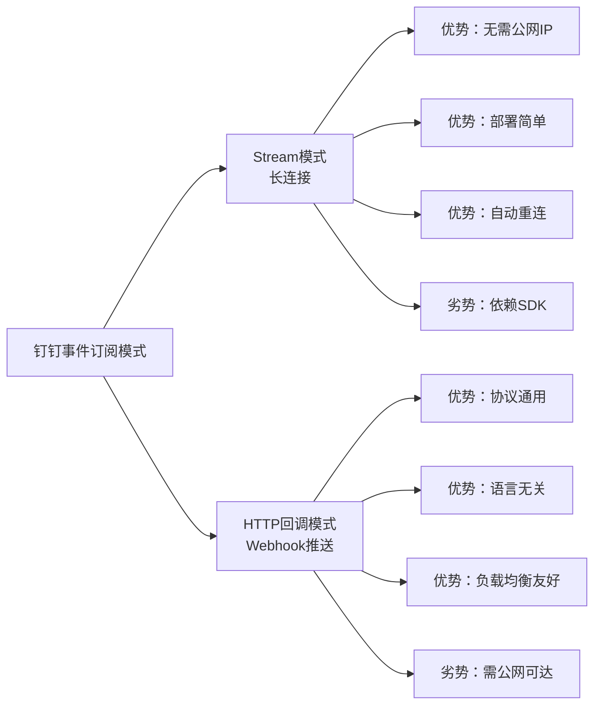

**Stream模式与HTTP回调模式对比**：

| 对比维度 | Stream模式 | HTTP回调模式 | 对比分析 |
|---------|-----------|-------------|---------|
| **网络要求** | 无需公网IP | 需要公网可达URL | Stream模式更适合内网部署 |
| **连接方式** | WebSocket长连接 | HTTP POST推送 | Stream更实时 |
| **部署复杂度** | 低，开箱即用 | 中，需配置回调URL | Stream更简单 |
| **语言支持** | 需SDK支持 | 任何语言均可 | HTTP回调更通用 |
| **可靠性** | 自动重连+心跳 | 重试机制+确认 | 两者都可靠 |
| **扩展性** | 受SDK限制 | 负载均衡友好 | HTTP回调更灵活 |
| **安全性** | SDK内置加密 | AES加密+签名验证 | 两者都安全 |

#### 2.3.2 Stream模式事件连接器

Stream模式是钉钉的创新设计，通过WebSocket长连接实现事件接收，极大降低了开发门槛：

```java
/**
 * 钉钉Stream模式事件连接器
 * 基于WebSocket长连接接收事件，无需公网IP
 * 适用场景：内网部署、快速开发、事件驱动架构
 */
public class DingTalkStreamConnector {

    private OpenDingTalkClient client;
    private final String clientId;
    private final String clientSecret;

    public DingTalkStreamConnector(String clientId, String clientSecret) {
        this.clientId = clientId;
        this.clientSecret = clientSecret;
    }

    /**
     * 启动Stream连接器
     * 自动管理连接、心跳、重连
     */
    public void start() {
        // 创建Stream客户端
        OpenDingTalkClientBuilder builder = new OpenDingTalkClientBuilder()
            .clientId(clientId)
            .clientSecret(clientSecret);

        // 注册事件回调处理器
        builder.registerCallbackListener(
            OpenDingTalkClient.EventTopic.USER_ADD_ORG,
            this::handleUserAddEvent
        );
        builder.registerCallbackListener(
            OpenDingTalkClient.EventTopic.USER_MODIFY_ORG,
            this::handleUserModifyEvent
        );
        builder.registerCallbackListener(
            OpenDingTalkClient.EventTopic.BPMS_INSTANCE_CHANGE,
            this::handleApprovalEvent
        );
        builder.registerCallbackListener(
            OpenDingTalkClient.EventTopic.ATTENDANCE_CHECKIN,
            this::handleAttendanceEvent
        );

        // 构建并启动客户端
        client = builder.build();
        client.start();

        log.info("钉钉Stream连接器已启动，clientId={}", clientId);
    }

    /**
     * 用户入职事件处理
     */
    private void handleUserAddEvent(JSONObject event) {
        String corpId = event.getString("corpId");
        JSONArray userIds = event.getJSONArray("userId");

        log.info("收到用户入职事件，corpId={}, 用户数={}", corpId, userIds.size());

        for (int i = 0; i < userIds.size(); i++) {
            String userId = userIds.getString(i);
            // 获取用户详细信息并同步到本地系统
            syncUserToLocalSystem(userId);
        }
    }

    /**
     * 审批状态变更事件处理
     */
    private void handleApprovalEvent(JSONObject event) {
        String processInstanceId = event.getString("processInstanceId");
        String type = event.getString("type"); // start, finish, cancel

        log.info("收到审批事件，instanceId={}, type={}", processInstanceId, type);

        // 根据审批状态执行对应业务逻辑
        switch (type) {
            case "start":
                onApprovalStarted(processInstanceId);
                break;
            case "finish":
                onApprovalFinished(processInstanceId);
                break;
            case "cancel":
                onApprovalCancelled(processInstanceId);
                break;
        }
    }

    /**
     * 停止Stream连接器
     */
    public void stop() {
        if (client != null) {
            client.stop();
            log.info("钉钉Stream连接器已停止");
        }
    }
}
```

### 2.4 Webhook连接器

#### 2.4.1 自定义机器人Webhook

自定义机器人Webhook是最轻量的连接器形态，适用于消息推送场景：

| 特性 | 说明 | 适用场景 |
|------|------|---------|
| **接入方式** | 群设置中添加机器人，获取Webhook URL | 快速消息推送 |
| **消息类型** | text、markdown、actionCard、feedCard | 多种消息格式 |
| **安全机制** | 关键词过滤、加签验证、IP白名单 | 消息安全保障 |
| **频率限制** | 每分钟20条 | 中低频通知 |
| **交互能力** | 支持按钮交互（Outgoing机器人） | 简单交互场景 |

```java
/**
 * 钉钉Webhook连接器 - 自定义机器人消息推送
 * 支持加签安全模式，多种消息格式
 */
public class DingTalkWebhookConnector {

    private final String webhookUrl;
    private final String secret;

    public DingTalkWebhookConnector(String webhookUrl, String secret) {
        this.webhookUrl = webhookUrl;
        this.secret = secret;
    }

    /**
     * 发送Markdown格式消息
     * 适用场景：系统告警、日报推送、数据报表
     */
    public boolean sendMarkdown(String title, String text) {
        try {
            // 构建带签名URL
            String url = buildSignedUrl();

            // 构建消息体
            JSONObject body = new JSONObject();
            body.put("msgtype", "markdown");

            JSONObject markdown = new JSONObject();
            markdown.put("title", title);
            markdown.put("text", text);
            body.put("markdown", markdown);

            // 发送请求
            HttpClient client = HttpClientBuilder.create().build();
            HttpPost post = new HttpPost(url);
            post.setHeader("Content-Type", "application/json;charset=UTF-8");
            post.setEntity(new StringEntity(body.toJSONString(), "UTF-8"));

            HttpResponse response = client.execute(post);
            String result = EntityUtils.toString(response.getEntity());
            JSONObject json = JSONObject.parseObject(result);

            if (json.getInteger("errcode") == 0) {
                log.info("Webhook消息发送成功");
                return true;
            } else {
                log.error("Webhook消息发送失败：{}", json.getString("errmsg"));
                return false;
            }
        } catch (Exception e) {
            log.error("Webhook消息发送异常", e);
            return false;
        }
    }

    /**
     * 构建加签URL
     * 安全模式：HmacSHA256签名 + 时间戳
     */
    private String buildSignedUrl() throws Exception {
        if (secret == null || secret.isEmpty()) {
            return webhookUrl;
        }

        long timestamp = System.currentTimeMillis();
        String stringToSign = timestamp + "\n" + secret;

        Mac mac = Mac.getInstance("HmacSHA256");
        mac.init(new SecretKeySpec(secret.getBytes("UTF-8"), "HmacSHA256"));
        byte[] signData = mac.doFinal(stringToSign.getBytes("UTF-8"));
        String sign = URLEncoder.encode(Base64.getEncoder().encodeToString(signData), "UTF-8");

        return webhookUrl + "&timestamp=" + timestamp + "&sign=" + sign;
    }
}
```

### 2.5 机器人连接器

#### 2.5.1 机器人连接器类型

钉钉机器人连接器提供了更丰富的交互能力，是消息+交互的复合连接器：

| 机器人类型 | 接入方式 | 交互能力 | 典型场景 | 对比飞书 |
|-----------|---------|---------|---------|---------|
| **自定义机器人** | Webhook接入 | 单向消息推送 | 系统告警、数据通知 | ✅ 相当 |
| **Outgoing机器人** | Webhook+回调 | 双向交互 | 指令式操作、查询 | ⚠️ 飞书交互机器人更灵活 |
| **企业内部机器人** | 应用内开发 | 富交互+卡片 | 业务系统操作 | ✅ 相当 |
| **ISV机器人** | 第三方应用 | 完整应用能力 | SaaS服务集成 | ✅ 相当 |

### 2.6 工作流连接器

#### 2.6.1 审批流程连接器

审批流程连接器是钉钉的特色能力，支持将外部系统流程与钉钉审批深度集成：

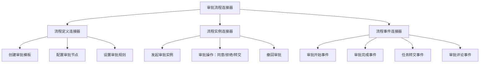

### 2.7 MCP连接器

#### 2.7.1 钉钉MCP服务

钉钉MCP（Model Context Protocol）服务是面向AI Agent时代的新型连接器形态，允许AI大模型通过标准化协议调用钉钉能力：

| MCP能力 | 说明 | 适用场景 |
|---------|------|---------|
| **工具调用** | AI Agent通过MCP调用钉钉API | 智能助手、自动化操作 |
| **上下文获取** | 获取钉钉通讯录、消息等上下文 | 智能决策、上下文感知 |
| **资源访问** | 访问钉钉文档、审批等资源 | 知识检索、数据查询 |
| **提示模板** | 预置钉钉场景的Prompt模板 | 场景化AI应用 |

> **MCP连接器代表连接器平台的发展方向**：从传统的API调用模式，演进为AI原生（AI-Native）的连接器形态，使连接器不仅可被人工编排，更可被AI自主发现和调用。

---

## 三、集成能力分析

### 3.1 集成能力全景

从iPaaS视角分析，钉钉连接器平台在四大集成维度上的能力表现：

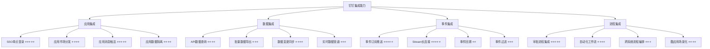

### 3.2 应用集成能力

#### 3.2.1 应用集成架构

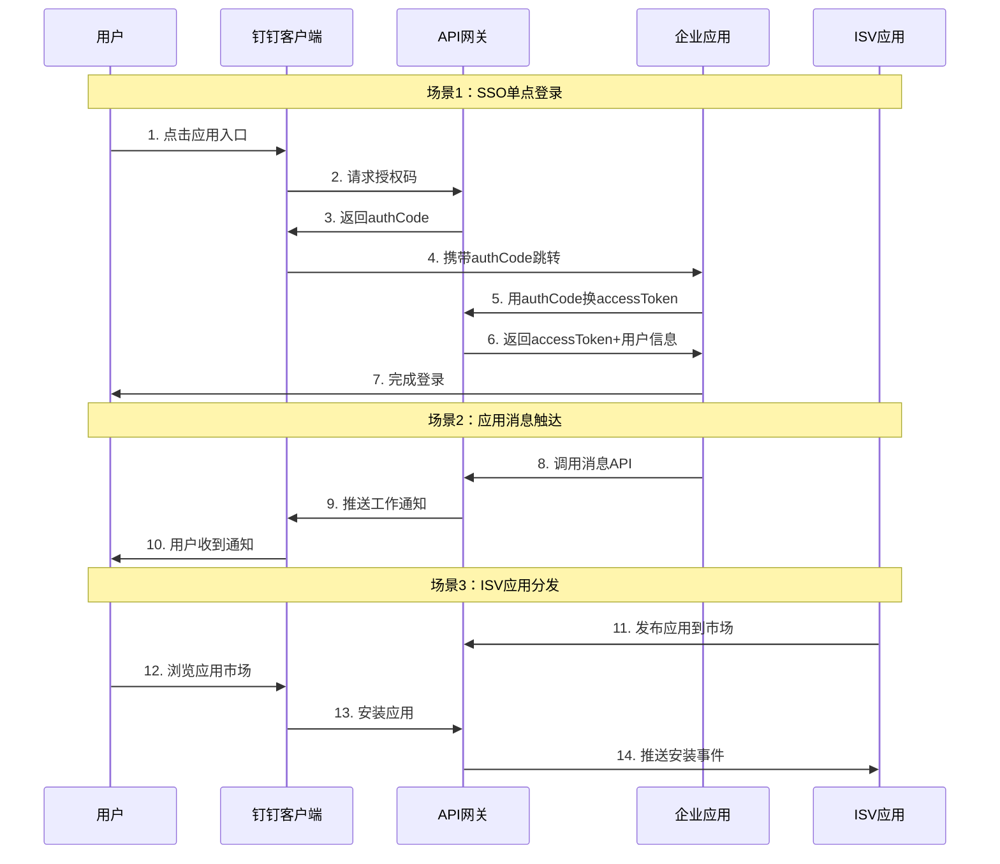

#### 3.2.2 应用集成能力详解

| 集成能力 | 实现方式 | 成熟度 | 典型场景 | 对比飞书 |
|---------|---------|-------|---------|---------|
| **SSO单点登录** | OAuth2.0授权码模式 | ⭐⭐⭐⭐⭐ | 统一身份认证 | ✅ 相当 |
| **应用免登** | 免登授权码 | ⭐⭐⭐⭐⭐ | H5微应用免登 | ✅ 钉钉更便捷 |
| **消息触达** | 工作通知+群消息+机器人 | ⭐⭐⭐⭐⭐ | 业务消息推送 | ✅ 相当 |
| **通讯录集成** | 通讯录读写API | ⭐⭐⭐⭐ | 组织架构同步 | ✅ 相当 |
| **应用市场** | ISV上架+企业安装 | ⭐⭐⭐⭐ | SaaS分发 | ✅ 相当 |
| **多端适配** | PC+移动+小程序 | ⭐⭐⭐⭐ | 全端覆盖 | ⚠️ 飞书更统一 |

### 3.3 数据集成能力

#### 3.3.1 数据集成模式

| 数据集成模式 | 实现方式 | 适用场景 | 数据量级 | 对比飞书 |
|-------------|---------|---------|---------|---------|
| **单条查询** | API单次调用 | 详情查看、实时验证 | 单条 | ✅ 相当 |
| **分页查询** | API分页获取 | 列表展示、批量同步 | 百~万级 | ✅ 相当 |
| **全量导出** | 定时分页拉取 | 数据仓库同步 | 万~百万级 | ⚠️ 无原生导出API |
| **增量同步** | 事件订阅+API补偿 | 数据实时同步 | 增量 | ⚠️ 缺乏CDC机制 |
| **批量写入** | API批量操作 | 数据批量导入 | 百~千级 | ⚠️ 批量API有限 |

#### 3.3.2 数据集成架构示例

```java
/**
 * 钉钉数据集成连接器 - 增量同步引擎
 * 基于事件订阅+定时补偿的增量同步机制
 * 保证数据最终一致性
 */
public class DingTalkDataSyncEngine {

    private final DingTalkApiClient apiClient;
    private final EventStore eventStore;
    private final DataTransformer transformer;
    private final DataSink dataSink;

    // 同步检查点：记录上次同步时间
    private volatile long lastSyncTimestamp = 0;

    /**
     * 增量同步主流程
     * 1. 事件驱动：收到变更事件立即处理
     * 2. 定时补偿：定期全量校验，修复遗漏数据
     */
    @Scheduled(fixedRate = 300000) // 每5分钟执行一次补偿
    public void compensateSync() {
        log.info("开始补偿同步，上次同步时间={}", lastSyncTimestamp);

        // 1. 获取事件存储中未处理的事件
        List<SyncEvent> pendingEvents = eventStore.getPendingEvents(lastSyncTimestamp);

        // 2. 去重处理
        Map<String, SyncEvent> deduplicatedEvents = pendingEvents.stream()
            .collect(Collectors.toMap(
                SyncEvent::getEntityId,
                Function.identity(),
                (e1, e2) -> e2.getTimestamp() > e1.getTimestamp() ? e2 : e1
            ));

        // 3. 批量获取最新数据
        List<String> entityIds = new ArrayList<>(deduplicatedEvents.keySet());
        List<CompletableFuture<EntityData>> futures = entityIds.stream()
            .map(id -> CompletableFuture.supplyAsync(
                () -> apiClient.fetchEntityData(id),
                syncExecutor))
            .collect(Collectors.toList());

        // 4. 等待所有数据获取完成
        List<EntityData> latestData = futures.stream()
            .map(CompletableFuture::join)
            .filter(Objects::nonNull)
            .collect(Collectors.toList());

        // 5. 数据转换与清洗
        List<TransformedData> transformed = latestData.stream()
            .map(transformer::transform)
            .filter(TransformedData::isValid)
            .collect(Collectors.toList());

        // 6. 写入目标系统
        dataSink.batchUpsert(transformed);

        // 7. 更新检查点
        lastSyncTimestamp = System.currentTimeMillis();
        log.info("补偿同步完成，处理数据量={}", transformed.size());
    }

    /**
     * 事件驱动的实时同步
     * 收到事件后立即触发增量同步
     */
    public void onEventReceived(SyncEvent event) {
        log.info("收到同步事件，type={}, entityId={}", event.getType(), event.getEntityId());

        // 存储事件
        eventStore.store(event);

        // 异步处理
        CompletableFuture.runAsync(() -> {
            EntityData data = apiClient.fetchEntityData(event.getEntityId());
            if (data != null) {
                TransformedData transformed = transformer.transform(data);
                dataSink.upsert(transformed);
            }
        }, syncExecutor);
    }
}
```

### 3.4 事件集成能力

#### 3.4.1 事件集成能力矩阵

| 事件能力 | 支持情况 | 说明 | 对比飞书 |
|---------|---------|------|---------|
| **事件订阅** | ✅ 完善 | 支持50+种事件类型 | ✅ 相当 |
| **Stream推送** | ✅ 特色 | WebSocket长连接推送 | ✅ 钉钉特色 |
| **HTTP回调** | ✅ 支持 | 传统Webhook回调 | ✅ 相当 |
| **事件过滤** | ⚠️ 有限 | 仅支持按事件类型过滤 | ⚠️ 飞书过滤更精细 |
| **事件回溯** | ❌ 不支持 | 无法回溯历史事件 | ❌ 均不支持 |
| **事件顺序保证** | ⚠️ 部分 | 部分事件有序 | ⚠️ 相当 |
| **事件幂等处理** | ⚠️ 需自行实现 | 平台提供事件ID | ✅ 相当 |
| **死信队列** | ❌ 不支持 | 推送失败无死信 | ❌ 均不支持 |

### 3.5 流程集成能力

#### 3.5.1 流程集成架构

流程集成是钉钉连接器平台的核心优势之一，尤其在审批流程集成方面表现突出：

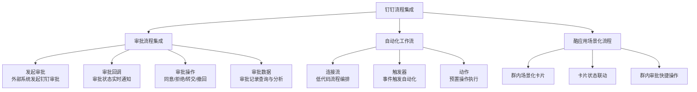

#### 3.5.2 审批流程集成示例

```java
/**
 * 钉钉审批流程集成连接器
 * 支持审批发起、回调、状态查询的完整生命周期
 */
public class DingTalkApprovalConnector {

    private final DingTalkApiClient apiClient;

    /**
     * 发起审批实例
     * 将外部系统业务流程与钉钉审批打通
     */
    public String createApprovalInstance(ApprovalRequest request) {
        OapiProcessInstanceCreateRequest req = new OapiProcessInstanceCreateRequest();

        // 设置审批模板
        req.setProcessCode(request.getProcessCode());

        // 设置发起人
        req.setOriginatorUserId(request.getOriginatorUserId());

        // 设置部门ID（影响审批流节点）
        req.setDeptId(request.getDeptId());

        // 构建审批表单数据
        List<OapiProcessInstanceCreateRequest.FormComponentValueVo> formValues =
            new ArrayList<>();

        for (FormField field : request.getFormFields()) {
            OapiProcessInstanceCreateRequest.FormComponentValueVo vo =
                new OapiProcessInstanceCreateRequest.FormComponentValueVo();
            vo.setName(field.getName());
            vo.setValue(field.getValue());
            vo.setComponentType(field.getComponentType());
            formValues.add(vo);
        }
        req.setFormComponentValues(formValues);

        // 执行创建
        OapiProcessInstanceCreateResponse resp = apiClient.execute(req);

        if (resp.getErrcode() != 0) {
            throw new ApprovalException("审批发起失败: " + resp.getErrmsg());
        }

        log.info("审批实例创建成功，instanceId={}", resp.getProcessInstanceId());
        return resp.getProcessInstanceId();
    }

    /**
     * 处理审批状态变更回调
     * 典型的流程集成回调处理
     */
    public void handleApprovalCallback(String processInstanceId, String type,
                                       String result) {
        switch (type) {
            case "finish":
                if ("agree".equals(result)) {
                    // 审批通过，执行后续业务逻辑
                    onApprovalAgreed(processInstanceId);
                } else if ("refuse".equals(result)) {
                    // 审批拒绝，执行拒绝逻辑
                    onApprovalRefused(processInstanceId);
                }
                break;
            case "start":
                onApprovalStarted(processInstanceId);
                break;
            case "cancel":
                onApprovalCancelled(processInstanceId);
                break;
        }
    }
}
```

---

## 四、连接器架构分析

### 4.1 整体架构

钉钉连接器平台采用多层架构设计，从底层基础设施到上层应用接入形成完整的连接器能力栈：

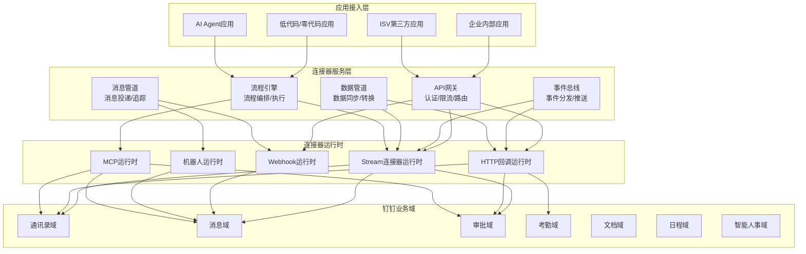

### 4.2 API网关架构

API网关是钉钉连接器平台的核心入口，负责认证、授权、限流、路由等关键职责：

| 网关能力 | 实现方式 | 说明 | 对比飞书 |
|---------|---------|------|---------|
| **认证** | OAuth2.0 + AccessToken | 支持企业内部应用和ISV应用 | ✅ 相当 |
| **授权** | 权限Scope机制 | 按Scope授权，管理员审批 | ✅ 相当 |
| **限流** | 令牌桶算法 | 不同API不同限流策略 | ✅ 相当 |
| **路由** | API版本路由 | 新旧版本共存 | ⚠️ 版本管理不统一 |
| **监控** | 调用统计与告警 | 开发者后台可查看 | ✅ 相当 |
| **日志** | 请求日志 | 30天保留 | ⚠️ 有限 |

### 4.3 事件总线架构

钉钉事件总线是连接器平台的事件中枢，支持事件的生产、分发和消费：

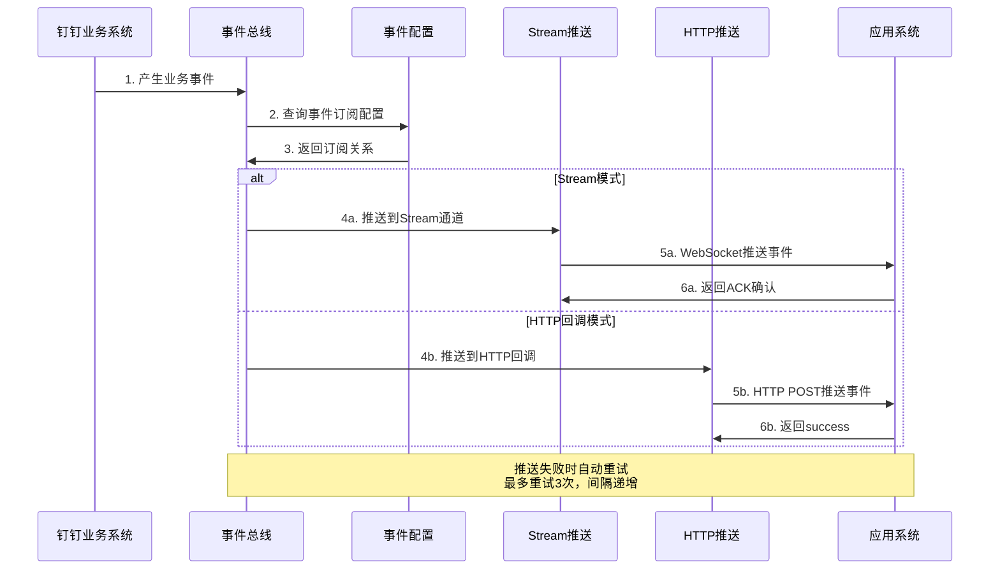

### 4.4 连接器运行时架构

| 运行时组件 | 职责 | 关键特性 | 扩展性 |
|-----------|------|---------|-------|
| **Stream运行时** | 维护WebSocket长连接 | 自动重连、心跳保活、多路复用 | 受SDK限制 |
| **HTTP回调运行时** | 管理HTTP推送 | 重试机制、签名验证、超时控制 | 可水平扩展 |
| **Webhook运行时** | 处理机器人消息推送 | 频率限制、签名校验、消息格式化 | 群级隔离 |
| **机器人运行时** | 管理机器人交互 | 消息解析、指令路由、卡片渲染 | 支持多机器人 |
| **MCP运行时** | AI Agent协议适配 | 工具发现、参数映射、结果转换 | 协议标准化 |

---

## 五、典型集成场景

### 5.1 场景全景

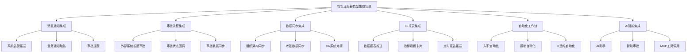

### 5.2 场景1：系统告警与监控通知

**场景描述**：将企业IT系统的监控告警通过钉钉实时推送到运维群，支持告警确认和升级操作。

```java
/**
 * 系统告警钉钉集成连接器
 * 支持多级别告警、告警确认、升级通知
 */
public class AlertDingTalkConnector {

    private final DingTalkWebhookConnector webhookConnector;
    private final DingTalkApiConnector apiConnector;

    /**
     * 发送告警通知 - 使用互动卡片实现交互
     */
    public void sendAlert(AlertEvent alert) {
        String markdown = buildAlertMarkdown(alert);

        // 根据告警级别选择推送渠道
        switch (alert.getSeverity()) {
            case CRITICAL:
                // P0告警：同时推送工作通知+群消息+电话
                apiConnector.sendWorkNotification(alert.getOnCallUsers(), markdown);
                webhookConnector.sendMarkdown("🚨 P0告警", markdown);
                apiConnector.makeCall(alert.getOnCallUsers());  // 电话通知
                break;
            case WARNING:
                // P1告警：推送群消息+工作通知
                webhookConnector.sendMarkdown("⚠️ P1告警", markdown);
                apiConnector.sendWorkNotification(alert.getOnCallUsers(), markdown);
                break;
            case INFO:
                // P2告警：仅推送群消息
                webhookConnector.sendMarkdown("ℹ️ P2告警", markdown);
                break;
        }
    }

    /**
     * 构建告警Markdown消息
     */
    private String buildAlertMarkdown(AlertEvent alert) {
        StringBuilder sb = new StringBuilder();
        sb.append("### 🚨 系统告警通知\n\n");
        sb.append("**告警名称**：").append(alert.getName()).append("\n\n");
        sb.append("**告警级别**：").append(alert.getSeverity()).append("\n\n");
        sb.append("**告警时间**：").append(alert.getTimestamp()).append("\n\n");
        sb.append("**影响范围**：").append(alert.getScope()).append("\n\n");
        sb.append("**告警详情**：").append(alert.getDetail()).append("\n\n");
        sb.append("---\n\n");
        sb.append("请相关同学尽快处理！");
        return sb.toString();
    }
}
```

### 5.3 场景2：HR系统与钉钉审批集成

**场景描述**：将企业HR系统的人事审批流程与钉钉审批打通，实现移动端审批操作。

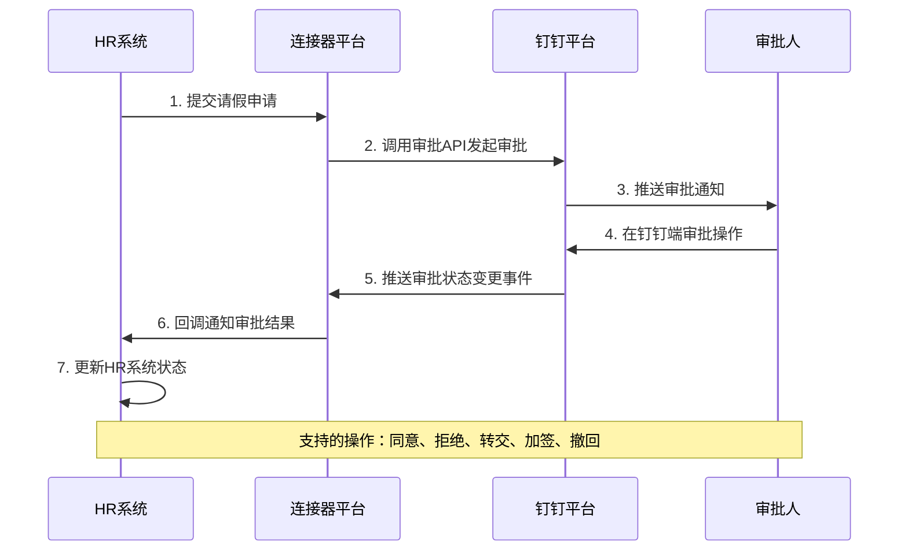

### 5.4 场景3：数据同步管道

**场景描述**：将钉钉组织架构和考勤数据实时同步到企业数据仓库，供BI分析使用。

```java
/**
 * 钉钉数据同步管道连接器
 * 实现钉钉数据到数据仓库的实时+批量同步
 */
public class DingTalkDataPipelineConnector {

    private final DingTalkApiClient apiClient;
    private final DataWarehouseClient dwClient;

    /**
     * 全量同步 - 每日凌晨执行
     * 同步组织架构、用户、考勤等全量数据
     */
    @Scheduled(cron = "0 0 2 * * ?")
    public void fullSync() {
        log.info("开始全量数据同步...");

        // 1. 同步组织架构
        syncDepartments();

        // 2. 同步用户信息
        syncUsers();

        // 3. 同步考勤数据（前一日）
        LocalDate yesterday = LocalDate.now().minusDays(1);
        syncAttendance(yesterday);

        // 4. 同步审批数据（前一日）
        syncApprovals(yesterday);

        log.info("全量数据同步完成");
    }

    /**
     * 增量同步 - 事件驱动
     * 基于事件订阅实现近实时数据同步
     */
    public void onDepartmentChanged(DepartmentChangeEvent event) {
        Department dept = apiClient.getDepartment(event.getDeptId());
        dwClient.upsert("dim_department", dept.toMap());
        log.info("部门数据增量同步完成，deptId={}", event.getDeptId());
    }

    public void onUserChanged(UserChangeEvent event) {
        User user = apiClient.getUser(event.getUserId());
        dwClient.upsert("dim_user", user.toMap());
        log.info("用户数据增量同步完成，userId={}", event.getUserId());
    }
}
```

### 5.5 场景4：BI报表推送

**场景描述**：定时将BI报表数据通过钉钉互动卡片推送到管理层群组，支持数据下钻和筛选交互。

| 实现要素 | 钉钉方案 | 说明 |
|---------|---------|------|
| **报表渲染** | 互动卡片 | 支持图表、表格等富内容 |
| **数据更新** | 卡片数据更新API | 定时刷新卡片数据 |
| **交互操作** | 卡片按钮回调 | 支持筛选、下钻、导出 |
| **定时推送** | 工作通知+群消息 | 定时发送报表卡片 |
| **权限控制** | 群成员可见 | 基于群组控制可见范围 |

### 5.6 场景5：入职自动化工作流

**场景描述**：新员工入职时，自动触发一系列系统配置操作，包括账号创建、权限分配、设备申请等。

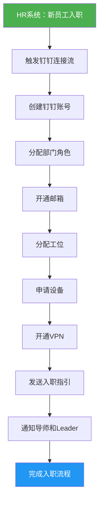

---

## 六、开发体验分析

### 6.1 SDK支持

| 语言 | SDK名称 | 维护状态 | 功能完整度 | 文档质量 | 对比飞书 |
|------|---------|---------|-----------|---------|---------|
| **Java** | dingtalk-sdk-java | ✅ 官方维护 | ⭐⭐⭐⭐ | ⭐⭐⭐ | ✅ 相当 |
| **Python** | dingtalk-sdk-python | ✅ 官方维护 | ⭐⭐⭐ | ⭐⭐⭐ | ✅ 相当 |
| **Node.js** | dingtalk-sdk-node | ✅ 官方维护 | ⭐⭐⭐⭐ | ⭐⭐⭐ | ✅ 相当 |
| **Go** | dingtalk-sdk-go | ⚠️ 社区维护 | ⭐⭐⭐ | ⭐⭐ | ⚠️ 飞书官方SDK更好 |
| **C#** | dingtalk-sdk-csharp | ⚠️ 社区维护 | ⭐⭐ | ⭐⭐ | ⚠️ 飞书无官方SDK |
| **PHP** | dingtalk-sdk-php | ⚠️ 社区维护 | ⭐⭐⭐ | ⭐⭐ | ✅ 相当 |

### 6.2 开发者工具

| 工具 | 功能 | 易用性 | 对比飞书 |
|------|------|-------|---------|
| **开发者后台** | 应用管理、配置、调试 | ⭐⭐⭐⭐ | ✅ 相当 |
| **API Explorer** | 在线API调试 | ⭐⭐⭐⭐ | ✅ 相当 |
| **事件订阅调试** | 事件推送调试 | ⭐⭐⭐ | ⚠️ 飞书调试工具更完善 |
| **机器人调试** | 机器人消息测试 | ⭐⭐⭐ | ✅ 相当 |
| **连接器平台** | 可视化连接器配置 | ⭐⭐⭐ | ⚠️ 飞书集成平台更成熟 |
| **IDEA插件** | 代码辅助开发 | ⭐⭐⭐ | ✅ 相当 |

### 6.3 文档质量

| 文档类型 | 质量评分 | 说明 | 对比飞书 |
|---------|---------|------|---------|
| **API参考文档** | ⭐⭐⭐⭐ | 接口说明较详细，部分示例缺失 | ⚠️ 飞书更详尽 |
| **入门指南** | ⭐⭐⭐⭐ | 快速上手指南较完善 | ✅ 相当 |
| **最佳实践** | ⭐⭐⭐ | 场景化文档较少 | ⚠️ 飞书场景更丰富 |
| **错误码文档** | ⭐⭐⭐ | 错误码覆盖不全 | ⚠️ 飞书更完整 |
| **更新日志** | ⭐⭐⭐ | 版本更新记录不统一 | ⚠️ 飞书更规范 |
| **SDK文档** | ⭐⭐⭐ | SDK文档与API文档有时不一致 | ⚠️ 飞书更一致 |

### 6.4 调试与排障

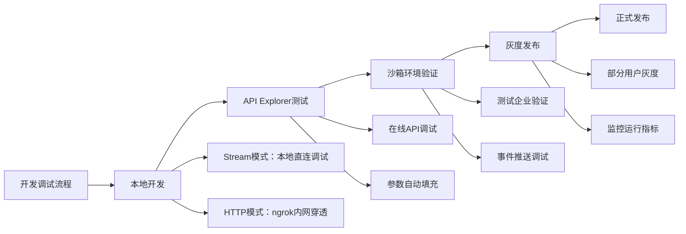

---

## 七、生态与市场分析

### 7.1 钉钉应用市场生态

| 生态维度 | 钉钉现状 | 分析 |
|---------|---------|------|
| **应用数量** | 3000+ | 覆盖主要企业场景 |
| **ISV数量** | 1000+ | ISV生态较为成熟 |
| **应用分类** | 20+大类 | 分类体系完善 |
| **行业覆盖** | 制造、教育、医疗等 | 重点行业覆盖 |
| **连接器市场** | 尚在建设中 | 不如Zapier等成熟 |
| **开放程度** | 逐步开放 | 新API持续开放中 |

### 7.2 连接器平台生态对比

| 对比维度 | 钉钉 | 飞书 | 企业微信 | Zapier | 自建iPaaS |
|---------|------|------|---------|--------|----------|
| **内置连接器** | 50+ | 60+ | 40+ | 5000+ | 按需开发 |
| **自定义连接器** | ✅ 支持 | ✅ 支持 | ⚠️ 有限 | ✅ 支持 | ✅ 完全自定义 |
| **可视化编排** | ⭐⭐⭐ | ⭐⭐⭐⭐ | ⭐⭐ | ⭐⭐⭐⭐⭐ | 按需开发 |
| **第三方连接器** | 少量 | 少量 | 少量 | 非常丰富 | 按需接入 |
| **开发者社区** | 较活跃 | 活跃 | 一般 | 非常活跃 | 内部社区 |
| **企业采纳度** | 高（传统企业） | 高（互联网） | 高（微信生态） | 中（海外为主） | 高（定制化） |

### 7.3 钉钉连接器平台竞争力

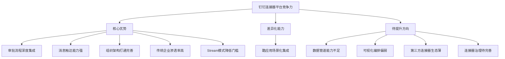

---

## 八、安全与权限

### 8.1 安全机制全景

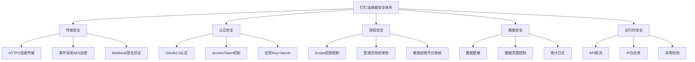

### 8.2 权限控制体系

#### 8.2.1 权限层级

| 权限层级 | 申请方式 | 审批流程 | 典型权限 | 风险等级 |
|---------|---------|---------|---------|---------|
| **基础权限** | 开发者后台自行申请 | 无需审批 | 通讯录读取、消息发送 | 低 |
| **高级权限** | 管理员授权 | 企业管理员审批 | 审批数据读写、考勤管理 | 中 |
| **敏感权限** | 平台审核 | 钉钉平台+企业管理员双重审批 | 通讯录敏感字段、消息记录 | 高 |
| **特殊权限** | 定制申请 | 钉钉商务+技术双重评估 | 全量数据导出、企业管理员操作 | 极高 |

#### 8.2.2 连接器安全对比

| 安全维度 | 钉钉 | 飞书 | 对比分析 |
|---------|------|------|---------|
| **API认证** | OAuth2.0 + AccessToken | OAuth2.0 + TenantAccessToken | 机制类似 |
| **事件加密** | AES256加密 | 签名验证+加密 | 钉钉加密更严格 |
| **Webhook安全** | 加签+关键词+IP白名单 | 签名验证 | 钉钉安全选项更多 |
| **数据脱敏** | 部分字段自动脱敏 | 部分字段自动脱敏 | 相当 |
| **审计日志** | 基础审计 | 较完善审计 | 飞书更好 |
| **权限粒度** | Scope级别 | Scope级别 | 相当 |

### 8.3 安全最佳实践

```java
/**
 * 钉钉连接器安全配置
 * 涵盖认证、加密、权限的最佳实践
 */
public class DingTalkSecurityConfig {

    /**
     * 安全的AccessToken管理
     * - 使用缓存避免频繁获取
     * - 设置合理的过期时间
     * - Token刷新加锁防止并发
     */
    private final Cache<String, String> tokenCache = Caffeine.newBuilder()
        .expireAfterWrite(110, TimeUnit.MINUTES)  // AccessToken有效期2小时，提前10分钟刷新
        .maximumSize(10)
        .build();

    public String getAccessToken(String appKey, String appSecret) {
        return tokenCache.get(appKey, key -> {
            // 获取新的AccessToken
            OapiGettokenRequest req = new OapiGettokenRequest();
            req.setAppkey(appKey);
            req.setAppsecret(appSecret);
            req.setHttpMethod("GET");

            OapiGettokenResponse resp = new DefaultDingTalkClient(
                "https://oapi.dingtalk.com/gettoken").execute(req);

            if (resp.getErrcode() != 0) {
                throw new TokenException("获取AccessToken失败: " + resp.getErrmsg());
            }
            return resp.getAccessToken();
        });
    }

    /**
     * 事件回调验签
     * 防止伪造事件推送攻击
     */
    public boolean verifyCallbackSignature(String timestamp, String sign,
                                           String token, String secret) {
        String stringToSign = timestamp + "\n" + secret;
        try {
            Mac mac = Mac.getInstance("HmacSHA256");
            mac.init(new SecretKeySpec(secret.getBytes(StandardCharsets.UTF_8), "HmacSHA256"));
            byte[] signData = mac.doFinal(stringToSign.getBytes(StandardCharsets.UTF_8));
            String calculatedSign = Base64.getEncoder().encodeToString(signData);
            return calculatedSign.equals(sign);
        } catch (Exception e) {
            log.error("验签失败", e);
            return false;
        }
    }
}
```

---

## 九、限制与不足

### 9.1 连接器能力限制

| 限制类别 | 具体限制 | 影响范围 | 规避方案 | 优先级 |
|---------|---------|---------|---------|-------|
| **API限流** | 单应用QPS限制（通常100-500） | 大批量数据同步 | 分时段同步+多应用分流 | 高 |
| **批量操作** | 批量API较少，单次上限低 | 批量数据导入 | 循环单条操作+并发 | 高 |
| **数据范围** | 部分API仅返回有限字段 | 数据完整性 | 多API组合获取 | 中 |
| **事件回溯** | 不支持历史事件回放 | 数据恢复/补录 | 定时全量补偿 | 中 |
| **实时推送** | 部分事件延迟较大 | 实时性要求高的场景 | API轮询补充 | 低 |
| **并发审批** | 同一审批流并发限制 | 高并发审批场景 | 队列化串行处理 | 低 |

### 9.2 架构限制

| 限制项 | 说明 | 对比飞书 | 影响 |
|-------|------|---------|------|
| **API版本管理** | 新旧API共存，版本不统一 | 飞书版本管理更规范 | 维护成本高 |
| **连接器治理** | 缺少连接器生命周期管理 | 飞书治理能力稍好 | 运维风险 |
| **数据管道** | 无原生数据管道能力 | 均缺乏 | 需自建 |
| **连接器监控** | 监控能力有限 | 飞书稍好 | 问题排查难 |
| **错误处理** | 错误码不统一，部分缺失 | 飞书错误码更规范 | 开发体验差 |
| **沙箱环境** | 沙箱能力有限 | 飞书测试环境更好 | 测试不充分 |

### 9.3 生态限制

| 限制项 | 说明 | 影响 |
|-------|------|------|
| **第三方连接器少** | 相比Zapier/MuleSoft，连接器生态薄弱 | 需自建更多连接器 |
| **ISV连接器标准** | 缺少统一的连接器开发标准 | 连接器质量参差不齐 |
| **跨平台集成** | 与非阿里云生态集成较弱 | 跨云场景受限 |
| **数据流出限制** | 部分数据不支持导出 | 数据中台建设受限 |

### 9.4 限制应对策略

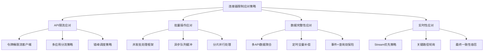

---

## 十、总结与建议

### 10.1 钉钉连接器平台总结

| 评估维度 | 评分 | 核心评价 | 关键优势 | 主要不足 |
|---------|------|---------|---------|---------|
| **连接器类型** | ⭐⭐⭐⭐ | 类型丰富，覆盖主流场景 | API+事件+机器人+工作流+MCP | 连接器市场生态薄 |
| **集成能力** | ⭐⭐⭐⭐ | 应用与流程集成强，数据集成中等 | 审批流集成突出 | 数据管道能力弱 |
| **架构设计** | ⭐⭐⭐⭐ | Stream模式创新，整体分层清晰 | 长连接降低门槛 | 版本管理不统一 |
| **开发体验** | ⭐⭐⭐ | SDK+工具较完善，文档参差不齐 | Stream快速接入 | 文档质量待提升 |
| **生态市场** | ⭐⭐⭐ | 应用市场成熟，连接器市场初期 | ISV生态丰富 | 连接器生态薄弱 |
| **安全权限** | ⭐⭐⭐⭐ | 安全机制完善，权限分层合理 | 事件加密+加签+白名单 | 审计能力待加强 |
| **综合评分** | ⭐⭐⭐½ | 国内领先的企业连接器平台之一 | 企业管理场景深耕 | iPaaS平台能力待完善 |

### 10.2 企业连接器平台建设建议

#### 10.2.1 钉钉连接器平台作为参考的价值

| 参考方向 | 钉钉实践 | 企业借鉴建议 |
|---------|---------|-------------|
| **连接器类型体系** | API+事件+Webhook+机器人+工作流+MCP | 构建多形态连接器体系，覆盖不同集成场景 |
| **Stream长连接模式** | WebSocket事件推送，降低接入门槛 | 引入长连接模式，简化内网系统接入 |
| **审批流程集成** | 深度审批流程API+事件+回调 | 重视流程类连接器，打通核心业务流程 |
| **互动卡片** | 消息+交互的复合连接器形态 | 消息连接器应支持交互能力 |
| **MCP连接器** | AI Agent标准协议接入 | 前瞻布局AI-Native连接器形态 |
| **权限分级** | 基础/高级/敏感/特殊四级 | 建立细粒度的连接器权限体系 |

#### 10.2.2 企业自建连接器平台建议

1. **架构层面**：
   - 采用API网关+事件总线+消息管道+数据管道四层架构
   - 参考钉钉Stream模式，支持长连接和回调双模式
   - 引入MCP协议，支持AI Agent接入

2. **能力层面**：
   - 补齐数据管道能力，支持CDC增量同步
   - 增强可视化编排能力，降低集成门槛
   - 建设连接器市场，形成内部生态

3. **治理层面**：
   - 建立连接器生命周期管理（开发-测试-发布-监控-下线）
   - 统一API版本管理规范
   - 完善连接器监控和告警体系

4. **安全层面**：
   - 建立连接器安全评级机制
   - 实施最小权限原则
   - 完善审计日志和数据脱敏

### 10.3 与其他平台对比建议

| 对比维度 | 钉钉适用场景 | 飞书适用场景 | 自建iPaaS适用场景 |
|---------|-------------|-------------|-------------------|
| **企业类型** | 传统企业、制造业、政府 | 互联网、科技、出海企业 | 大型集团、复杂集成需求 |
| **核心场景** | 审批流程、考勤、组织管理 | 文档协作、即时通讯、项目管理 | 跨系统复杂编排 |
| **集成深度** | 管理类集成深 | 协作类集成深 | 全域深度集成 |
| **推荐策略** | 作为管理域连接器 | 作为协作域连接器 | 作为统一集成平台 |

---

## 附录

### 附录A：钉钉连接器API清单

| 连接器类型 | API分类 | 核心API | 功能说明 |
|-----------|---------|---------|---------|
| **API连接器** | 通讯录 | user.get, user.list, department.list | 组织架构管理 |
| **API连接器** | 消息 | message.asyncsend, message.corpconversation | 消息推送 |
| **API连接器** | 审批 | processinstance.create, processinstance.get | 审批流程 |
| **API连接器** | 考勤 | attendance.list, attendance.listRecord | 考勤数据 |
| **事件连接器** | 通讯录事件 | user_add_org, user_modify_org | 人员变更通知 |
| **事件连接器** | 审批事件 | bpms_instance_change, bpms_task_change | 审批状态通知 |
| **事件连接器** | 考勤事件 | attendance_checkin | 打卡事件通知 |
| **Webhook连接器** | 机器人消息 | 自定义机器人Webhook | 群消息推送 |
| **机器人连接器** | 群交互 | 机器人消息接收+回复 | 群内指令交互 |
| **工作流连接器** | 审批流程 | 审批模板+实例+回调 | 流程自动化 |

### 附录B：钉钉连接器开发资源

| 资源类型 | 名称 | 链接 |
|---------|------|------|
| **开放平台** | 钉钉开放平台 | https://open.dingtalk.com |
| **API文档** | 服务端API文档 | https://open.dingtalk.com/document/orgapp/api-overview |
| **SDK下载** | 官方SDK | https://open.dingtalk.com/document/orgapp/download-server-side-sdk |
| **Stream SDK** | Stream模式SDK | https://open.dingtalk.com/document/orgapp/stream-mode-activation |
| **开发者社区** | 钉钉开发者论坛 | https://open.dingtalk.com/document/orgapp/community |
| **MCP文档** | 钉钉MCP服务 | https://open.dingtalk.com/document/ai-dev/mcp-overview |

### 附录C：连接器能力成熟度模型

| 成熟度等级 | 特征 | 钉钉现状 | 企业目标 |
|-----------|------|---------|---------|
| **L1-基础接入** | API调用、基本认证 | ✅ 已达到 | ✅ 必须 |
| **L2-事件驱动** | 事件订阅、实时推送 | ✅ 已达到 | ✅ 必须 |
| **L3-流程集成** | 流程编排、状态回调 | ✅ 已达到 | ✅ 推荐 |
| **L4-数据管道** | CDC、增量同步、数据质量 | ⚠️ 部分达到 | ✅ 推荐 |
| **L5-智能集成** | AI辅助、自动映射、异常自愈 | ⚠️ MCP初期 | 🎯 目标 |
| **L6-生态运营** | 连接器市场、治理、度量 | ⚠️ 生态初期 | 🎯 目标 |

### 附录D：术语说明

| 术语 | 英文 | 说明 |
|------|------|------|
| **连接器** | Connector | 封装特定系统接入逻辑的可复用组件 |
| **iPaaS** | Integration Platform as a Service | 集成平台即服务 |
| **Stream模式** | Stream Mode | 基于WebSocket长连接的事件推送模式 |
| **MCP** | Model Context Protocol | AI Agent工具调用协议 |
| **ISV** | Independent Software Vendor | 独立软件开发商 |
| **CDC** | Change Data Capture | 变更数据捕获 |
| **Scope** | Permission Scope | OAuth权限范围 |
| **互动卡片** | Interactive Card | 支持交互操作的消息卡片 |
| **酷应用** | Cool App | 钉钉场景化轻应用形态 |
| **连接流** | Connection Flow | 钉钉低代码流程编排能力 |

---

**报告编制时间**：2026年5月
**报告版本**：V1.0
**报告角度**：连接器平台能力调研
