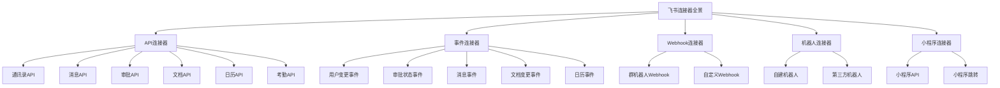
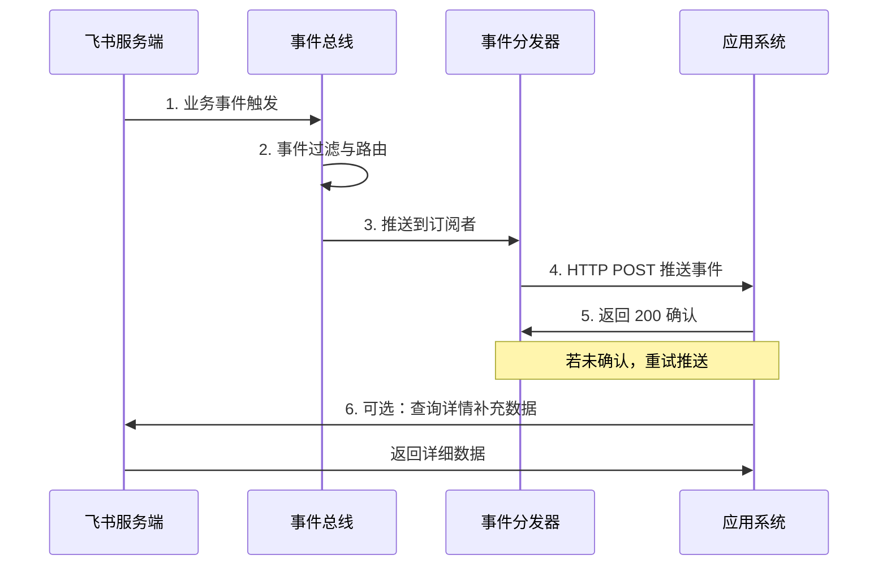
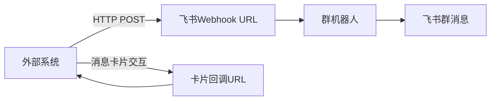
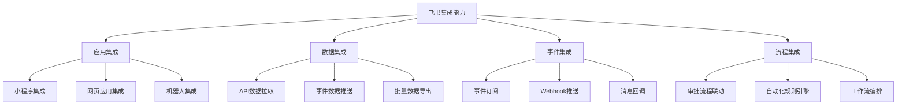
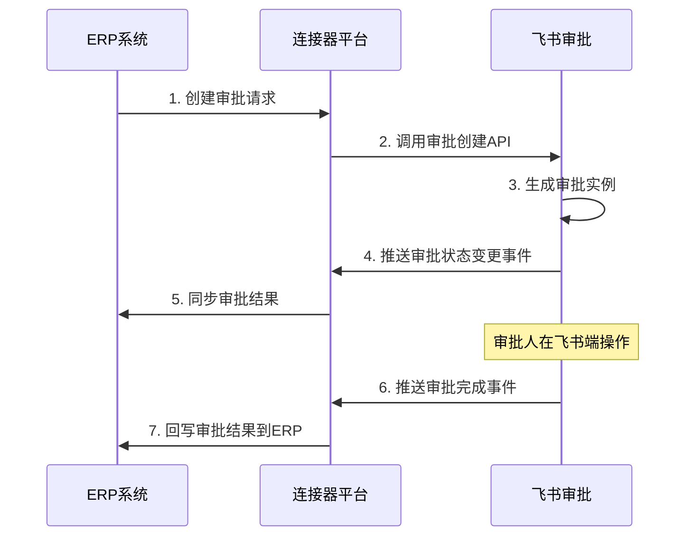
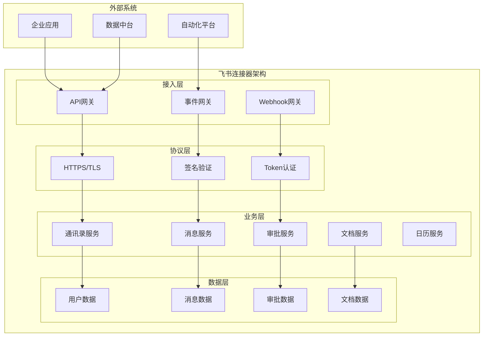
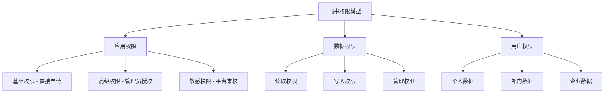

# 飞书连接器平台调研报告

## 一、执行摘要

本报告从**连接器平台**（Connector / Integration Platform / iPaaS）角度深入调研飞书开放平台，分析其连接器能力、集成机制、架构设计和应用场景，为企业连接器平台建设提供参考。

### 核心发现

| 维度 | 飞书连接器平台特点 |
|------|-----------------|
| **连接器类型** | API连接器 + 事件连接器 + Webhook连接器 + 机器人连接器，类型丰富 |
| **集成能力** | 应用集成、数据集成、事件集成、流程集成四维能力完备 |
| **架构设计** | RESTful API + 事件订阅 + Webhook 三层架构，设计现代规范 |
| **开发体验** | 多语言SDK、完善文档、在线调试，开发者体验优秀 |
| **生态市场** | 飞书应用市场生态成熟，ISV连接器丰富 |
| **自动化能力** | 飞书自动化/审批流程引擎，支持低代码集成编排 |

---

## 二、连接器类型分析

### 2.1 连接器类型全景图

飞书开放平台提供的连接器能力覆盖多种集成模式：



### 2.2 API连接器

#### 2.2.1 API连接器概述

API连接器是飞书最核心的连接器类型，通过RESTful API提供标准化的数据访问和操作能力。

**连接器能力矩阵**：

| API连接器 | 功能范围 | 开放程度 | 典型用途 |
|----------|---------|---------|---------|
| **通讯录连接器** | 用户、部门、角色 CRUD | ✅ 充分开放 | 组织架构同步、权限管理 |
| **消息连接器** | 消息发送、已读状态查询 | ✅ 充分开放（读取受限） | 业务通知、消息集成 |
| **审批连接器** | 审批定义、实例、任务 | ✅ 充分开放 | 审批流程集成 |
| **文档连接器** | 文档、表格、知识库 | ✅ 充分开放 | 知识管理集成 |
| **日历连接器** | 日程、会议室 | ✅ 充分开放 | 日程管理集成 |
| **考勤连接器** | 打卡记录、统计 | ✅ 充分开放 | 考勤数据集成 |
| **任务连接器** | 任务创建、查询、更新 | ✅ 充分开放 | 项目管理集成 |
| **云文档连接器** | 云文档读写、权限 | ✅ 充分开放 | 文档协作集成 |

#### 2.2.2 API连接器调用模式

```java
// API连接器调用示例 - 获取用户信息
public class FeishuApiConnector {
    
    private final Client client;
    private final TokenManager tokenManager;
    
    /**
     * 初始化API连接器
     */
    public FeishuApiConnector(String appId, String appSecret) {
        ClientConfig config = ClientConfig.newBuilder()
            .appId(appId)
            .appSecret(appSecret)
            .build();
        this.client = new Client(config);
        this.tokenManager = new TokenManager(appId, appSecret);
    }
    
    /**
     * 获取用户信息 - 单次调用模式
     */
    public UserInfo getUser(String userId) {
        GetUserReq req = GetUserReq.newBuilder()
            .userId(userId)
            .userIdType("user_id")
            .build();
        
        GetUserResp resp = client.contact().user().get(req);
        return resp.getData().getUser();
    }
    
    /**
     * 批量获取用户 - 批量调用模式
     */
    public List<UserInfo> batchGetUsers(List<String> userIds) {
        BatchGetUserReq req = BatchGetUserReq.newBuilder()
            .userIds(userIds)
            .userIdType("user_id")
            .build();
        
        BatchGetUserResp resp = client.contact().user().batchGet(req);
        return resp.getData().getUsers();
    }
    
    /**
     * 分页获取部门用户 - 分页调用模式
     */
    public List<UserInfo> getDepartmentUsers(String departmentId) {
        List<UserInfo> allUsers = new ArrayList<>();
        String pageToken = null;
        
        do {
            GetDepartmentUserReq req = GetDepartmentUserReq.newBuilder()
                .departmentId(departmentId)
                .userIdType("user_id")
                .pageSize(100)
                .pageToken(pageToken)
                .build();
            
            GetDepartmentUserResp resp = client.contact().department()
                .getDepartmentUser(req);
            allUsers.addAll(resp.getData().getUsers());
            pageToken = resp.getData().getPageToken();
        } while (pageToken != null && !pageToken.isEmpty());
        
        return allUsers;
    }
}
```

### 2.3 事件连接器

#### 2.3.1 事件订阅机制

飞书事件连接器通过事件订阅实现实时数据推送，是连接器平台的核心能力之一。

**事件连接器架构**：



**支持的事件类型**：

| 事件类别 | 事件名称 | 触发时机 | 用途说明 |
|---------|---------|---------|---------|
| **用户事件** | user.created / user.updated / user.deleted | 用户增删改 | 人员数据实时同步 |
| **部门事件** | department.created / department.updated / department.deleted | 部门增删改 | 组织架构实时同步 |
| **审批事件** | approval.instance.created / approval.instance.updated | 审批状态变更 | 审批流程实时联动 |
| **消息事件** | message.created / message.read | 消息发送/已读 | 消息状态同步 |
| **文档事件** | doc.created / doc.updated / doc.permission_changed | 文档变更 | 知识库数据同步 |
| **日历事件** | calendar.event.created / calendar.event.updated | 日程变更 | 日程管理联动 |
| **考勤事件** | attendance.checkin / attendance.checkout | 打卡事件 | 考勤实时通知 |

#### 2.3.2 事件连接器实现

```java
// 事件连接器 - Webhook接收处理
@RestController
@RequestMapping("/feishu/connector/event")
public class FeishuEventConnector {
    
    /**
     * 事件回调入口
     */
    @PostMapping("/callback")
    public ResponseEntity<?> handleEvent(
            @RequestHeader("X-Lark-Signature") String signature,
            @RequestHeader("X-Lark-Timestamp") String timestamp,
            @RequestHeader("X-Lark-Nonce") String nonce,
            @RequestBody String body) {
        
        // 1. 签名验证
        if (!verifySignature(signature, timestamp, nonce, body)) {
            return ResponseEntity.status(401).body("Invalid signature");
        }
        
        // 2. URL验证（首次配置时）
        EventChallenge challenge = parseChallenge(body);
        if (challenge != null) {
            return ResponseEntity.ok(Map.of("challenge", challenge.getChallenge()));
        }
        
        // 3. 解析事件
        Event event = parseEvent(body);
        
        // 4. 异步处理事件
        CompletableFuture.runAsync(() -> handleEventByType(event));
        
        // 5. 立即返回确认
        return ResponseEntity.ok().build();
    }
    
    /**
     * 按类型分发事件处理
     */
    private void handleEventByType(Event event) {
        switch (event.getEventType()) {
            case "user.created":
                onUserCreated(event.getData());
                break;
            case "approval.instance.updated":
                onApprovalUpdated(event.getData());
                break;
            case "doc.updated":
                onDocUpdated(event.getData());
                break;
            default:
                log.warn("Unhandled event type: {}", event.getEventType());
        }
    }
}
```

### 2.4 Webhook连接器

#### 2.4.1 群机器人Webhook

飞书支持群机器人Webhook，是最轻量的集成方式：



```java
// Webhook连接器 - 消息推送
public class FeishuWebhookConnector {
    
    /**
     * 推送文本消息
     */
    public void sendTextMessage(String webhookUrl, String content) {
        Map<String, Object> body = Map.of(
            "msg_type", "text",
            "content", Map.of("text", content)
        );
        
        HttpPost(post(webhookUrl, body));
    }
    
    /**
     * 推送交互式卡片消息
     */
    public void sendCardMessage(String webhookUrl, String title, 
            String content, List<CardAction> actions) {
        Map<String, Object> card = Map.of(
            "msg_type", "interactive",
            "card", Map.of(
                "header", Map.of(
                    "title", Map.of("content", title, "tag", "plain_text"),
                    "template", "blue"
                ),
                "elements", buildCardElements(content, actions)
            )
        );
        
        HttpPost(post(webhookUrl, card));
    }
}
```

### 2.5 机器人连接器

#### 2.5.1 机器人连接器能力

| 能力维度 | 自建机器人 | 第三方机器人 | 说明 |
|---------|-----------|------------|------|
| **消息收发** | ✅ 支持 | ✅ 支持 | 接收用户消息、发送回复 |
| **群组交互** | ✅ 支持 | ✅ 支持 | 群@机器人交互 |
| **卡片交互** | ✅ 支持 | ✅ 支持 | 消息卡片按钮交互 |
| **主动推送** | ✅ 支持 | ✅ 支持 | 主动推送消息到群/个人 |
| **命令处理** | ✅ 支持 | ✅ 支持 | 处理用户命令 |
| **权限范围** | 企业内 | 跨企业 | 部署范围不同 |

---

## 三、集成能力分析

### 3.1 集成能力四维模型



### 3.2 应用集成能力

| 集成维度 | 能力描述 | 开放程度 | 典型场景 |
|---------|---------|---------|---------|
| **小程序** | 飞书内嵌入小程序应用 | ✅ 充分开放 | 审批、报销、CRM等企业应用 |
| **网页应用** | H5应用集成到飞书工作台 | ✅ 充分开放 | 外部系统入口集成 |
| **机器人** | 对话式应用集成 | ✅ 充分开放 | 智能客服、运维助手 |
| **侧边栏** | 应用面板集成 | ✅ 开放 | 上下文关联工具 |
| **消息卡片** | 富交互消息集成 | ✅ 充分开放 | 审批通知、任务提醒 |

### 3.3 数据集成能力

| 数据方向 | 集成方式 | 支持情况 | 说明 |
|---------|---------|---------|------|
| **飞书→外部** | API拉取 | ✅ 支持 | 通过API主动获取飞书数据 |
| **飞书→外部** | 事件推送 | ✅ 支持 | 数据变更实时推送到外部 |
| **外部→飞书** | API写入 | ✅ 支持 | 向飞书写入数据（发消息、创建审批等） |
| **外部→飞书** | Webhook触发 | ✅ 支持 | 外部事件触发飞书动作 |
| **双向同步** | API+事件 | ✅ 支持 | 定时全量 + 实时增量的双模式同步 |

### 3.4 流程集成能力

**飞书审批流程集成**：



---

## 四、连接器架构分析

### 4.1 连接器架构设计



### 4.2 认证架构

```java
// Token管理 - 连接器认证
public class FeishuTokenManager {
    
    private String accessToken;
    private long expireTime;
    private final String appId;
    private final String appSecret;
    
    /**
     * 获取AccessToken
     */
    public String getAccessToken() {
        if (accessToken == null || isExpired()) {
            refreshAccessToken();
        }
        return accessToken;
    }
    
    private void refreshAccessToken() {
        // 调用飞书API获取token
        // POST https://open.feishu.cn/open-apis/auth/v3/tenant_access_token/internal
        Map<String, String> body = Map.of(
            "app_id", appId,
            "app_secret", appSecret
        );
        
        HttpResponse resp = HttpPost(
            "https://open.feishu.cn/open-apis/auth/v3/tenant_access_token/internal",
            body
        );
        
        this.accessToken = resp.get("tenant_access_token");
        this.expireTime = System.currentTimeMillis() + resp.get("expire") * 1000;
    }
    
    private boolean isExpired() {
        return System.currentTimeMillis() >= expireTime - 300000; // 提前5分钟刷新
    }
}
```

---

## 五、典型集成场景

### 5.1 集成场景矩阵

| 集成场景 | 连接器组合 | 复杂度 | 价值 |
|---------|-----------|-------|------|
| **消息通知集成** | Webhook + 消息API | 低 | 高 |
| **审批流程联动** | 审批API + 事件订阅 | 中 | 高 |
| **组织架构同步** | 通讯录API + 用户事件 | 中 | 高 |
| **知识库集成** | 文档API + 文档事件 | 中 | 中 |
| **考勤数据同步** | 考勤API + 定时同步 | 低 | 中 |
| **多系统工作流** | 多API + 事件 + 自动化 | 高 | 高 |

### 5.2 消息通知集成

```java
// 消息通知连接器
public class FeishuNotificationConnector {
    
    /**
     * 发送审批通知
     */
    public void sendApprovalNotification(String userId, ApprovalData approval) {
        // 构建消息卡片
        Map<String, Object> card = Map.of(
            "msg_type", "interactive",
            "card", Map.of(
                "header", Map.of(
                    "title", Map.of("content", "📋 审批通知", "tag", "plain_text"),
                    "template", "turquoise"
                ),
                "elements", List.of(
                    Map.of("tag", "div", "text", 
                        String.format("**申请人**：%s\n**审批类型**：%s\n**金额**：¥%s",
                            approval.getApplicant(),
                            approval.getType(),
                            approval.getAmount())),
                    Map.of("tag", "action", "actions", List.of(
                        Map.of("tag", "button", "text", "同意", 
                            "type", "primary", "value", Map.of("action", "approve")),
                        Map.of("tag", "button", "text", "拒绝",
                            "type", "danger", "value", Map.of("action", "reject"))
                    ))
                )
            )
        );
        
        // 发送消息
        SendMessageReq req = SendMessageReq.newBuilder()
            .receiveIdType("user_id")
            .build();
        
        client.im().message().create(req);
    }
}
```

### 5.3 审批流程联动

```java
// 审批流程联动连接器
public class FeishuApprovalConnector {
    
    /**
     * 创建飞书审批实例
     */
    public String createApproval(ApprovalRequest request) {
        CreateApprovalReq req = CreateApprovalReq.newBuilder()
            .approvalCode(request.getApprovalCode())
            .form(request.getFormData())
            .openId(request.getApplicantOpenId())
            .build();
        
        CreateApprovalResp resp = client.approval().instance().create(req);
        return resp.getData().getInstanceCode();
    }
    
    /**
     * 处理审批状态变更事件
     */
    public void onApprovalStatusChanged(ApprovalEventData data) {
        String instanceCode = data.getInstanceCode();
        String status = data.getStatus();
        
        switch (status) {
            case "APPROVED":
                // 审批通过 - 回写业务系统
                erpService.onApprovalApproved(instanceCode);
                break;
            case "REJECTED":
                // 审批拒绝 - 通知申请人
                notificationService.notifyRejection(instanceCode);
                break;
            case "PENDING":
                // 审批中 - 记录状态
                auditService.logApprovalPending(instanceCode);
                break;
        }
    }
}
```

---

## 六、安全与权限

### 6.1 安全机制

| 安全维度 | 飞书机制 | 说明 |
|---------|---------|------|
| **传输安全** | HTTPS + TLS 1.2+ | 全链路加密传输 |
| **认证机制** | App ID + App Secret → Access Token | OAuth2.0 / Tenant Token |
| **签名验证** | X-Lark-Signature (HmacSHA256) | 事件回调签名校验 |
| **权限控制** | 最小权限原则 + 分级审批 | 基础/高级/敏感权限三级 |
| **数据脱敏** | 内置脱敏规则 | 手机号、邮箱等敏感字段脱敏 |
| **IP白名单** | 支持配置 | 限制API调用来源IP |
| **审计日志** | 完整审计 | API调用、数据访问全量审计 |

### 6.2 权限模型



---

## 七、限制与不足

### 7.1 能力限制

| 限制维度 | 具体限制 | 影响 | 应对策略 |
|---------|---------|------|---------|
| **API频率限制** | 单应用QPS限制（通常50-100） | 大规模数据同步受限 | 分批请求 + 缓存 |
| **消息读取** | 消息内容读取严格受限 | 消息审计场景受限 | 通过事件订阅获取 |
| **事件延迟** | 事件推送存在秒级延迟 | 实时性要求高的场景受限 | 关键场景补充API轮询 |
| **批量操作** | 部分API不支持批量 | 数据同步效率受限 | 并发调用 + 限流控制 |
| **数据导出** | 无全量数据导出API | 数据迁移受限 | 分页遍历 + 定时同步 |
| **跨租户** | 不支持跨租户数据访问 | 多企业数据集成受限 | 逐租户对接 |

### 7.2 生态限制

| 限制维度 | 具体说明 | 应对策略 |
|---------|---------|---------|
| **第三方连接器数量** | 相比Zapier等平台偏少 | 自建连接器 + ISV合作 |
| **低代码集成** | 飞书自动化能力有限 | 结合外部iPaaS平台 |
| **数据转换** | 无内置数据转换引擎 | 应用层实现数据映射 |

---

## 八、总结与建议

### 8.1 飞书连接器平台特点总结

| 维度 | 飞书连接器特点 | 优势 | 不足 |
|------|---------------|------|------|
| **连接器类型** | API + 事件 + Webhook + 机器人 | 类型丰富，覆盖全面 | 缺少内置数据转换连接器 |
| **集成能力** | 四维集成能力完备 | 应用/数据/事件/流程全覆盖 | 低代码编排能力有限 |
| **架构设计** | RESTful + 事件订阅三层架构 | 设计现代规范，易扩展 | 事件推送延迟存在 |
| **开发体验** | 多语言SDK + 完善文档 | 开发者体验优秀 | 部分API文档更新滞后 |
| **生态市场** | 飞书应用市场生态成熟 | ISV连接器丰富 | 第三方连接器数量仍偏少 |
| **安全机制** | 分级权限 + 完善安全 | 安全性高 | 权限申请流程复杂 |

### 8.2 企业连接器平台建设建议

1. **双模式数据接入**：定时全量同步 + 实时事件订阅
2. **统一连接器抽象**：封装飞书API为标准连接器接口
3. **事件驱动架构**：基于飞书事件订阅构建事件驱动集成
4. **连接器治理**：建立连接器注册、版本管理、监控体系
5. **安全合规**：遵循最小权限原则，完善审计日志

---

## 九、附录

### 9.1 飞书连接器API清单

| 连接器类型 | API列表 | 主要功能 |
|----------|---------|---------|
| **通讯录** | user.get / user.list / department.list | 组织架构管理 |
| **消息** | message.create / message.get / message.update | 消息推送管理 |
| **审批** | approval.instance.create / approval.instance.get | 审批流程管理 |
| **文档** | doc.get / doc.content.get / doc.list | 文档内容管理 |
| **日历** | calendar.create / calendar.get / calendar_event.list | 日程管理 |
| **考勤** | attendance.list / attendance.user_stats | 考勤数据管理 |

### 9.2 飞书连接器开发资源

| 资源类型 | 链接 |
|---------|------|
| **开放平台官网** | https://open.feishu.cn |
| **API文档** | https://open.feishu.cn/document/server-docs/api-reference |
| **SDK下载** | https://open.feishu.cn/document/ukTMukTMukTM/boTM1YjL0ETO04yNkDN |
| **开发者社区** | https://open.feishu.cn/community |

### 9.3 术语说明

| 术语 | 说明 |
|------|------|
| **连接器** | 封装外部系统API的标准化集成组件 |
| **事件订阅** | 飞书主动推送数据变更通知的机制 |
| **Webhook** | 通过HTTP回调实现消息推送的轻量集成方式 |
| **机器人** | 以对话形式提供服务的飞书应用类型 |
| **消息卡片** | 飞书中支持富交互的卡片式消息格式 |

---

**报告编制时间**：2026年5月
**报告版本**：V1.0
**报告角度**：连接器平台能力调研
