# Activepieces 技术设计调研报告

> 调研对象：Activepieces v0.83.0（MIT 许可，TypeScript 全栈）
> 调研日期：2026 年 5 月
> 调研目标：为 open-app 连接器平台提供架构设计参考
> 仓库地址：https://github.com/activepieces/activepieces

---

## 一、技术架构总览

### 1.1 整体架构

Activepieces 采用经典的 **前后端分离 + Worker 异步执行** 的三层架构。前端 React 单页应用通过 REST API 与 Fastify 后端通信，后端将耗时任务（Flow 执行、Trigger 轮询等）通过 Socket.IO RPC 分发给 Worker 进程执行，Worker 中的 Engine 在子进程沙箱中运行用户自定义逻辑。

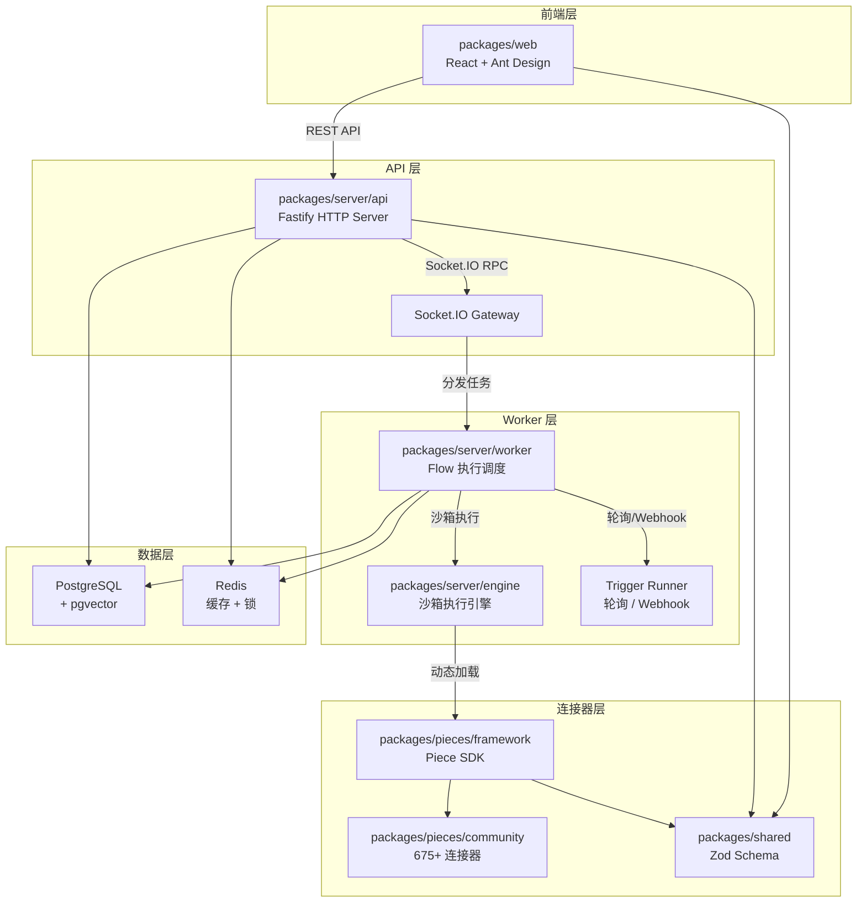
```mermaid
graph TB
    subgraph "前端层"
        WEB["packages/web<br/>React + Ant Design"]
    end

    subgraph "API 层"
        API["packages/server/api<br/>Fastify HTTP Server"]
        WS["Socket.IO Gateway"]
    end

    subgraph "Worker 层"
        WK["packages/server/worker<br/>Flow 执行调度"]
        ENG["packages/server/engine<br/>沙箱执行引擎"]
        TRIGGER["Trigger Runner<br/>轮询 / Webhook"]
    end

    subgraph "数据层"
        PG["PostgreSQL<br/>+ pgvector"]
        RD["Redis<br/>缓存 + 锁"]
    end

    subgraph "连接器层"
        PFW["packages/pieces/framework<br/>Piece SDK"]
        PC["packages/pieces/community<br/>675+ 连接器"]
        SHARED["packages/shared<br/>Zod Schema"]
    end

    WEB -->|REST API| API
    API -->|Socket.IO RPC| WS
    WS -->|分发任务| WK
    WK -->|沙箱执行| ENG
    WK -->|轮询/Webhook| TRIGGER
    API --> PG
    API --> RD
    WK --> PG
    WK --> RD
    ENG -->|动态加载| PFW
    PFW --> PC
    PFW --> SHARED
    API --> SHARED
    WEB --> SHARED
```

### 1.2 核心模块说明

| 模块 | 路径 | 技术栈 | 职责 |
|------|------|--------|------|
| Web 前端 | `packages/web` | React 18, Ant Design, Redux, React Flow | 流程编辑器、连接管理、Dashboard |
| API Server | `packages/server/api` | Fastify 4, TypeORM, Socket.IO | REST API、认证鉴权、WebSocket 网关 |
| Worker | `packages/server/worker` | Socket.IO Client, Redis Lock | Flow 执行调度、Trigger 管理 |
| Engine | `packages/server/engine` | Node.js 子进程 (fork) | 沙箱内执行 Step、隔离用户代码 |
| Shared | `packages/shared` | Zod, TypeScript | 共享类型定义、Schema 验证 |
| Piece Framework | `packages/pieces/framework` | TypeScript | Piece SDK 开发框架 |
| Community Pieces | `packages/pieces/community` | TypeScript | 675+ 社区连接器实现 |

### 1.3 部署架构

Activepieces 使用 Docker Compose 进行一键部署，核心包含三个容器：

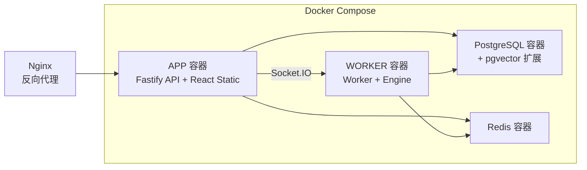
```mermaid
graph LR
    subgraph "Docker Compose"
        APP["APP 容器<br/>Fastify API + React Static"]
        WRK["WORKER 容器<br/>Worker + Engine"]
        PG["PostgreSQL 容器<br/>+ pgvector 扩展"]
        RD["Redis 容器"]
    end

    NGINX["Nginx<br/>反向代理"] --> APP
    APP -->|Socket.IO| WRK
    APP --> PG
    APP --> RD
    WRK --> PG
    WRK --> RD
```

**docker-compose.yml 核心配置（简化）：**

```yaml
version: '3.8'
services:
  app:
    image: activepieces/app:0.83.0
    ports:
      - "8080:80"
    environment:
      - AP_ENGINE_TYPE=APP
      - AP_POSTGRES_HOST=postgres
      - AP_REDIS_HOST=redis
    depends_on:
      - postgres
      - redis

  worker:
    image: activepieces/worker:0.83.0
    environment:
      - AP_ENGINE_TYPE=WORKER
      - AP_POSTGRES_HOST=postgres
      - AP_REDIS_HOST=redis
    depends_on:
      - postgres
      - redis

  postgres:
    image: pgvector/pgvector:pg16
    environment:
      POSTGRES_DB: activepieces
      POSTGRES_USER: activepieces
      POSTGRES_PASSWORD: password
    volumes:
      - pgdata:/var/lib/postgresql/data

  redis:
    image: redis:7-alpine
    volumes:
      - redisdata:/data
```

### 1.4 Worker 调度机制

Activepieces 的 Worker 调度 **不使用 BullMQ 等传统消息队列**，而是采用 **Socket.IO RPC 轮询** 方案：

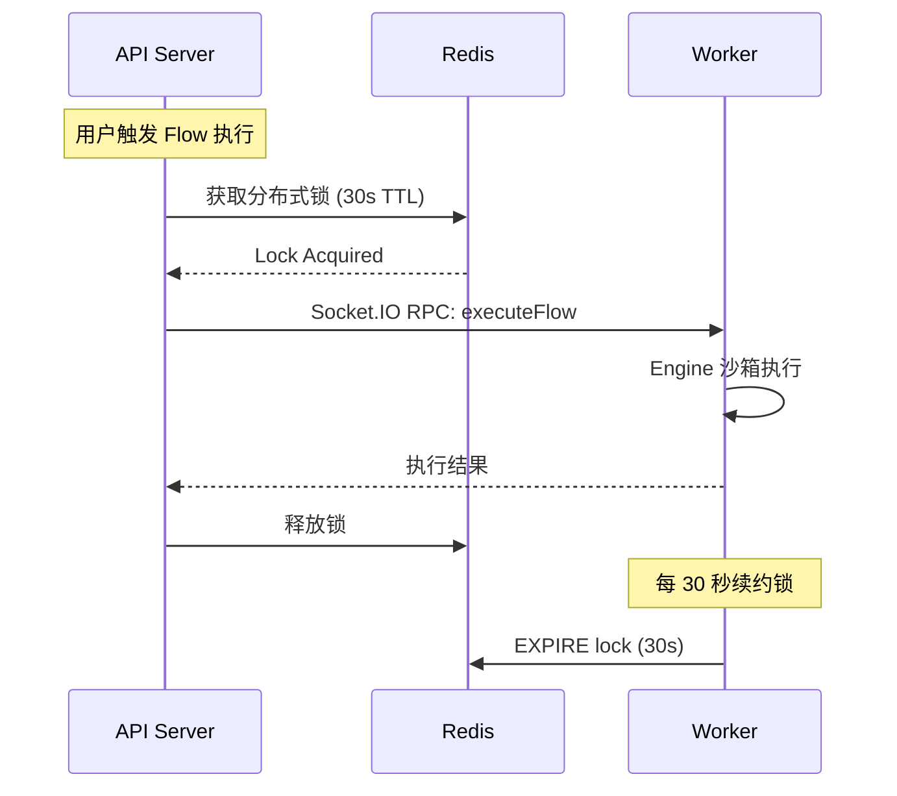
```mermaid
sequenceDiagram
    participant API as API Server
    participant Redis as Redis
    participant Worker as Worker

    Note over API: 用户触发 Flow 执行
    API->>Redis: 获取分布式锁 (30s TTL)
    Redis-->>API: Lock Acquired
    API->>Worker: Socket.IO RPC: executeFlow
    Worker->>Worker: Engine 沙箱执行
    Worker-->>API: 执行结果
    API->>Redis: 释放锁

    Note over Worker: 每 30 秒续约锁
    Worker->>Redis: EXPIRE lock (30s)
```

**关键设计点：**

- **锁续约**：Worker 在执行长时间任务时，每 30 秒对 Redis 锁进行续约（TTL 重置），防止任务未完成就被其他 Worker 抢占
- **Socket.IO RPC**：API 和 Worker 之间通过 Socket.IO 的 `emit + callback` 模式实现远程过程调用，而非 HTTP REST
- **单队列轮询**：所有 Flow 执行请求进入同一个队列，Worker 轮询获取任务。这种方式简单但缺乏优先级调度能力
- **不使用 BullMQ 的原因**：官方解释为"减少依赖复杂度"，但这也带来了以下问题：
  - 无法支持任务优先级
  - 无法支持延迟队列
  - 水平扩展时需要额外的负载均衡策略
  - 任务持久化依赖 Socket.IO 的重连机制，不如 Redis Queue 可靠

---

## 二、Piece（连接器）技术实现

> **这是 Activepieces 最核心的设计，也是对 open-app 最有参考价值的部分。**

### 2.1 Piece 类定义

每个 Piece 是一个独立的 npm 包，通过 `createPiece` 工厂函数定义：

```typescript
// packages/pieces/community/pieces/slack/src/index.ts
import { createPiece } from '@activepieces/pieces-framework';
import { slackAuth } from './lib/auth';
import { sendMessageAction } from './lib/actions/send-message';
import { newMessageTrigger } from './lib/triggers/new-message';

export const slack = createPiece({
  displayName: 'Slack',
  logoUrl: 'https://cdn.activepieces.com/pieces/slack.png',
  auth: slackAuth,
  actions: [sendMessageAction],
  triggers: [newMessageTrigger],
  categories: ['Communication', 'Developer Tools'],
  minimumSupportedRelease: '0.5.0',
  authors: ['activepieces-team'],
});
```

**`createPiece` 工厂函数签名：**

```typescript
// packages/pieces/framework/src/lib/piece.ts
export interface Piece {
  name: string;           // 唯一标识符，如 "@activepieces/piece-slack"
  displayName: string;    // 用户可见名称，如 "Slack"
  logoUrl: string;        // Logo 图片 URL
  auth?: PieceAuth;       // 认证配置（可选）
  actions: Action[];      // Action 列表
  triggers: Trigger[];    // Trigger 列表
  categories: string[];   // 分类标签
  minimumSupportedRelease: string;  // 最低兼容版本
  authors: string[];      // 作者列表
}

export function createPiece(config: {
  displayName: string;
  logoUrl: string;
  auth?: PieceAuth;
  actions: Action[];
  triggers: Trigger[];
  categories?: string[];
  minimumSupportedRelease?: string;
  authors?: string[];
}): Piece;
```

### 2.2 PieceMetadata（Zod Schema）

Piece 的元数据通过 Zod Schema 进行严格的类型验证和序列化。这是 Activepieces 在前后端之间共享类型信息的关键机制：

```typescript
// packages/shared/src/lib/piece-metadata.ts
import { z } from 'zod';

export const PieceMetadataSchema = z.object({
  name: z.string(),
  displayName: z.string(),
  logoUrl: z.string().url(),
  description: z.string().optional(),
  version: z.string(),
  auth: z.any().optional(),          // PieceAuth Schema
  actions: z.record(z.string(), z.any()),  // Action 名称 -> Action Schema
  triggers: z.record(z.string(), z.any()), // Trigger 名称 -> Trigger Schema
  categories: z.array(z.string()).optional(),
  minimumSupportedRelease: z.string().optional(),
  authors: z.array(z.string()).optional(),
});

export type PieceMetadata = z.infer<typeof PieceMetadataSchema>;
```

**Zod Schema 的核心价值：**

1. **运行时验证**：在 API 边界处对 Piece 元数据进行运行时校验，防止非法数据入库
2. **类型推导**：通过 `z.infer<typeof Schema>` 自动推导 TypeScript 类型，避免类型定义和 Schema 定义的双份维护
3. **前后端共享**：`packages/shared` 同时被前端和后端引用，确保类型一致性
4. **JSON 序列化**：Zod Schema 可以直接序列化为 JSON Schema，用于前端动态表单渲染

### 2.3 Trigger 定义

Trigger 是 Flow 的入口点，定义了"何时触发一个流程"：

```typescript
// packages/pieces/framework/src/lib/trigger/trigger.ts
export enum TriggerStrategy {
  WEBHOOK = 'WEBHOOK',           // 第三方推送 Webhook
  POLLING = 'POLLING',           // 定时轮询
  MANUAL = 'MANUAL',             // 手动触发
  APP_WEBHOOK = 'APP_WEBHOOK',   // 应用内 Webhook（如 Slack Event Subscription）
}

export interface Trigger<D extends PieceAuth = PieceAuth> {
  name: string;                  // 唯一标识符
  displayName: string;           // 用户可见名称
  description: string;
  type: TriggerStrategy;
  props: DynamicProps<D>;        // 属性定义
  sampleData: unknown;           // 示例数据（用于流程编辑器预览）
  onEnable?: (context: WebhookEnableContext<D>) => Promise<void>;
  onDisable?: (context: WebhookDisableContext<D>) => Promise<void>;
  run?: (context: TriggerRunContext<D>) => Promise<unknown>;
}
```

**Trigger 实现示例 — Slack 新消息：**

```typescript
// packages/pieces/community/pieces/slack/src/lib/triggers/new-message.ts
import { Trigger, createTrigger, TriggerStrategy } from '@activepieces/pieces-framework';
import { slackAuth } from '../auth';
import { slackChannel } from '../common/props';

export const newMessageTrigger: Trigger = createTrigger({
  name: 'new_message',
  displayName: 'New Message in Channel',
  description: 'Triggers when a new message is posted in a channel',
  type: TriggerStrategy.APP_WEBHOOK,
  auth: slackAuth,
  props: {
    channel: slackChannel,  // 复用的 Dropdown 属性
  },
  sampleData: {
    text: 'Hello world',
    user: 'U12345',
    channel: 'C12345',
    ts: '1234567890.123456',
  },
  onEnable: async (context) => {
    // 调用 Slack API 注册 Event Subscription
    const response = await slackClient.conversations.list({
      token: context.auth.access_token,
    });
    // 保存 Webhook URL 到 Slack App 配置
    await context.app.webhook.create({
      url: context.webhookUrl,
      events: ['message'],
    });
  },
  onDisable: async (context) => {
    // 注销 Webhook
    await context.app.webhook.delete({
      url: context.webhookUrl,
    });
  },
  run: async (context) => {
    // 解析 Webhook Payload
    const payload = context.payload;
    return [payload.body.event];
  },
});
```

**四种 Trigger 策略的执行流程对比：**

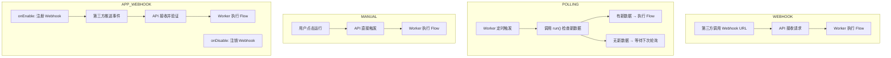
```mermaid
graph TB
    subgraph "WEBHOOK"
        WH1["第三方调用 Webhook URL"] --> WH2["API 接收请求"]
        WH2 --> WH3["Worker 执行 Flow"]
    end

    subgraph "POLLING"
        PL1["Worker 定时触发"] --> PL2["调用 run() 检查新数据"]
        PL2 --> PL3["有新数据 → 执行 Flow"]
        PL2 --> PL4["无新数据 → 等待下次轮询"]
    end

    subgraph "MANUAL"
        MN1["用户点击运行"] --> MN2["API 直接触发"]
        MN2 --> MN3["Worker 执行 Flow"]
    end

    subgraph "APP_WEBHOOK"
        AW1["onEnable: 注册 Webhook"] --> AW2["第三方推送事件"]
        AW2 --> AW3["API 接收并验证"]
        AW3 --> AW4["Worker 执行 Flow"]
        AW5["onDisable: 注销 Webhook"]
    end
```

### 2.4 Action 定义

Action 是 Flow 中的一个执行步骤，定义了"做什么"：

```typescript
// packages/pieces/framework/src/lib/action/action.ts
export interface Action<D extends PieceAuth = PieceAuth> {
  name: string;
  displayName: string;
  description: string;
  props: DynamicProps<D>;
  run: (context: ActionRunContext<D>) => Promise<unknown>;
  errorHandlingOptions?: ErrorHandlingOptions;
}

export interface ErrorHandlingOptions {
  retryOnFailure?: {
    enabled: boolean;
    maxRetries: number;      // 最大重试次数
    retryInterval: number;   // 重试间隔（毫秒）
  };
  continueOnFailure?: {
    enabled: boolean;        // 失败后是否继续执行后续 Step
  };
}
```

**Action 实现示例 — Slack 发送消息：**

```typescript
// packages/pieces/community/pieces/slack/src/lib/actions/send-message.ts
import { createAction, Property } from '@activepieces/pieces-framework';
import { slackAuth } from '../auth';
import { WebClient } from '@slack/web-api';

export const sendMessageAction = createAction({
  name: 'send_message',
  displayName: 'Send Message',
  description: 'Send a message to a channel or user',
  auth: slackAuth,
  props: {
    channel: Property.ShortText({
      displayName: 'Channel',
      description: 'Channel ID or name (e.g., #general)',
      required: true,
    }),
    text: Property.LongText({
      displayName: 'Message',
      description: 'The message text to send',
      required: true,
    }),
    blocks: Property.Json({
      displayName: 'Blocks (Optional)',
      description: 'Slack Block Kit JSON',
      required: false,
    }),
  },
  errorHandlingOptions: {
    retryOnFailure: {
      enabled: true,
      maxRetries: 3,
      retryInterval: 5000,
    },
    continueOnFailure: {
      enabled: false,
    },
  },
  run: async (context) => {
    const client = new WebClient(context.auth.access_token);
    const result = await client.chat.postMessage({
      channel: context.propsValue.channel,
      text: context.propsValue.text,
      blocks: context.propsValue.blocks,
    });
    return result;
  },
});
```

---

### 2.5 Props 系统（重点！）

Props 是 Activepieces 最精妙的设计之一。它是一套 **声明式的属性定义系统**，同时驱动后端验证和前端动态表单渲染。

#### PropertyType 枚举

```typescript
// packages/pieces/framework/src/lib/property/property.ts
export enum PropertyType {
  SHORT_TEXT = 'SHORT_TEXT',         // 短文本输入框
  LONG_TEXT = 'LONG_TEXT',           // 长文本域
  NUMBER = 'NUMBER',                 // 数字输入框
  CHECKBOX = 'CHECKBOX',            // 复选框
  SECRET_TEXT = 'SECRET_TEXT',       // 密码输入框（加密存储）
  DROPDOWN = 'DROPDOWN',            // 下拉选择框
  MULTI_SELECT_DROPDOWN = 'MULTI_SELECT_DROPDOWN', // 多选下拉
  JSON = 'JSON',                    // JSON 编辑器
  ARRAY = 'ARRAY',                  // 数组编辑器
  OBJECT = 'OBJECT',                // 对象编辑器
  DYNAMIC = 'DYNAMIC',              // 动态属性（依赖其他属性）
  DATE = 'DATE',                    // 日期选择器
  FILE = 'FILE',                    // 文件上传
  MARKDOWN = 'MARKDOWN',           // Markdown 展示
  OAUTH2 = 'OAUTH2',               // OAuth2 认证属性
  BASIC_AUTH = 'BASIC_AUTH',       // Basic 认证属性
  CUSTOM_AUTH = 'CUSTOM_AUTH',     // 自定义认证属性
}
```

#### Property 工厂方法

```typescript
// packages/pieces/framework/src/lib/property/property.ts
export const Property = {
  ShortText: (config: {
    displayName: string;
    description?: string;
    required: boolean;
    defaultValue?: string;
  }): ShortTextProperty => ({
    type: PropertyType.SHORT_TEXT,
    ...config,
  }),

  LongText: (config: {
    displayName: string;
    description?: string;
    required: boolean;
    defaultValue?: string;
  }): LongTextProperty => ({
    type: PropertyType.LONG_TEXT,
    ...config,
  }),

  Dropdown: <T>(config: {
    displayName: string;
    description?: string;
    required: boolean;
    options: DropdownOption<T>[] | ((
      context: DropdownState
    ) => Promise<DropdownOption<T>[]>);
    refreshers?: string[];  // 依赖属性列表，变化时重新加载选项
  }): DropdownProperty<T> => ({
    type: PropertyType.DROPDOWN,
    ...config,
  }),

  Array: (config: {
    displayName: string;
    description?: string;
    required: boolean;
    properties: Record<string, AnyProperty>;  // 数组元素的属性定义
  }): ArrayProperty => ({
    type: PropertyType.ARRAY,
    ...config,
  }),

  Object: (config: {
    displayName: string;
    description?: string;
    required: boolean;
    properties: Record<string, AnyProperty>;  // 对象字段的属性定义
  }): ObjectProperty => ({
    type: PropertyType.OBJECT,
    ...config,
  }),

  DynamicProperties: (config: {
    displayName: string;
    description?: string;
    required: boolean;
    props: (context: DynamicPropsContext) => Promise<Record<string, AnyProperty>>;
    refreshers?: string[];  // 依赖属性列表
  }): DynamicProperty => ({
    type: PropertyType.DYNAMIC,
    ...config,
  }),

  // ... 其他工厂方法：Number, Checkbox, SecretText, Json, Date, File 等
};
```

**Props 系统的渲染映射关系：**

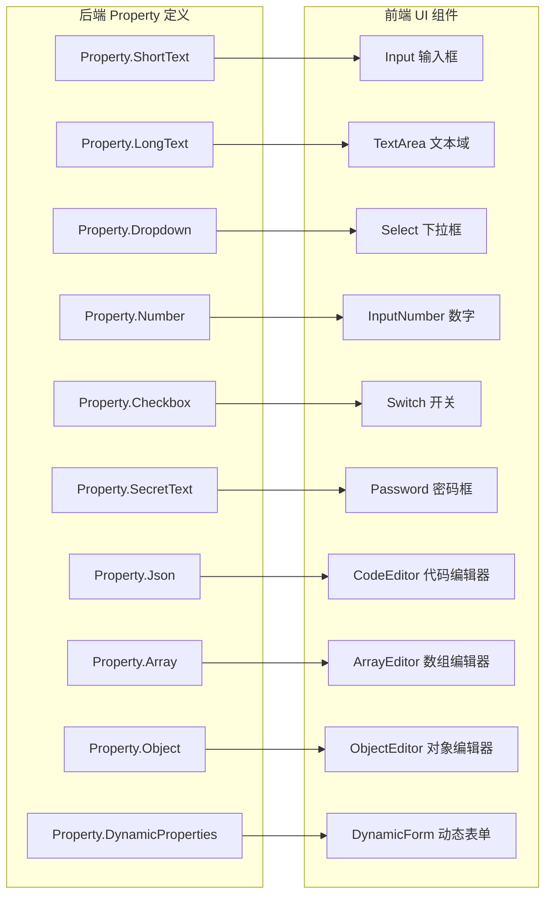
```mermaid
graph LR
    subgraph "后端 Property 定义"
        ST["Property.ShortText"]
        LT["Property.LongText"]
        DD["Property.Dropdown"]
        NM["Property.Number"]
        CB["Property.Checkbox"]
        SC["Property.SecretText"]
        JS["Property.Json"]
        AR["Property.Array"]
        OB["Property.Object"]
        DY["Property.DynamicProperties"]
    end

    subgraph "前端 UI 组件"
        IST["Input 输入框"]
        ILT["TextArea 文本域"]
        IDD["Select 下拉框"]
        INM["InputNumber 数字"]
        ICB["Switch 开关"]
        ISC["Password 密码框"]
        IJS["CodeEditor 代码编辑器"]
        IAR["ArrayEditor 数组编辑器"]
        IOB["ObjectEditor 对象编辑器"]
        IDY["DynamicForm 动态表单"]
    end

    ST --> IST
    LT --> ILT
    DD --> IDD
    NM --> INM
    CB --> ICB
    SC --> ISC
    JS --> IJS
    AR --> IAR
    OB --> IOB
    DY --> IDY
```

#### Props JSON 序列化示例

当 Action 的 Props 被序列化为 JSON 传给前端时，格式如下：

```json
{
  "channel": {
    "type": "SHORT_TEXT",
    "displayName": "Channel",
    "description": "Channel ID or name (e.g., #general)",
    "required": true
  },
  "text": {
    "type": "LONG_TEXT",
    "displayName": "Message",
    "description": "The message text to send",
    "required": true
  },
  "priority": {
    "type": "DROPDOWN",
    "displayName": "Priority",
    "required": false,
    "options": {
      "disabled": false,
      "options": [
        { "label": "Low", "value": "low" },
        { "label": "Medium", "value": "medium" },
        { "label": "High", "value": "high" }
      ]
    },
    "refreshers": ["channel"]
  }
}
```

### 2.6 refreshers 机制（属性联动）

refreshers 是 Props 系统中最具特色的设计，它实现了 **属性之间的联动关系**——当某个属性值变化时，自动重新加载依赖它的其他属性。

**典型场景：选择 Slack Workspace 后，自动加载该 Workspace 下的 Channel 列表。**

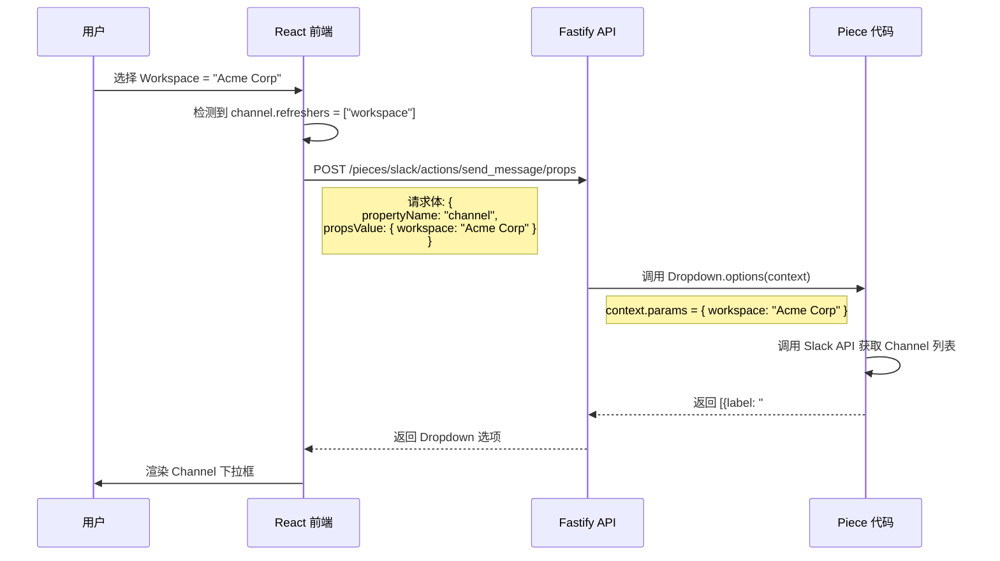
```mermaid
sequenceDiagram
    participant User as 用户
    participant Frontend as React 前端
    participant API as Fastify API
    participant Piece as Piece 代码

    User->>Frontend: 选择 Workspace = "Acme Corp"
    Frontend->>Frontend: 检测到 channel.refreshers = ["workspace"]
    Frontend->>API: POST /pieces/slack/actions/send_message/props
    Note right of Frontend: 请求体: {<br/>propertyName: "channel",<br/>propsValue: { workspace: "Acme Corp" }<br/>}
    API->>Piece: 调用 Dropdown.options(context)
    Note right of API: context.params = { workspace: "Acme Corp" }
    Piece->>Piece: 调用 Slack API 获取 Channel 列表
    Piece-->>API: 返回 [{label: "#general", value: "C123"}]
    API-->>Frontend: 返回 Dropdown 选项
    Frontend->>User: 渲染 Channel 下拉框
```

**代码实现：**

```typescript
// packages/pieces/community/pieces/slack/src/lib/common/props.ts
import { Property } from '@activepieces/pieces-framework';

export const slackChannel = Property.Dropdown({
  displayName: 'Channel',
  description: 'Slack channel to post to',
  required: true,
  refreshers: ['workspace'],  // 当 workspace 变化时，重新加载
  options: async ({ auth, workspace }) => {
    // workspace 是依赖属性的当前值
    const client = new WebClient(auth.access_token);
    const response = await client.conversations.list({
      types: 'public_channel,private_channel',
    });

    return {
      disabled: false,
      options: response.channels?.map((channel) => ({
        label: `#${channel.name}`,
        value: channel.id!,
      })) ?? [],
    };
  },
});
```

**DynamicProperties 的 refreshers 示例：**

```typescript
// 某些 Piece 的属性完全取决于用户选择的对象类型
export const dynamicFields = Property.DynamicProperties({
  displayName: 'Fields',
  description: 'Dynamic fields based on selected object',
  required: true,
  refreshers: ['objectType'],
  props: async ({ auth, objectType }) => {
    // 根据 objectType 动态返回不同的属性定义
    if (objectType === 'contact') {
      return {
        email: Property.ShortText({
          displayName: 'Email',
          required: true,
        }),
        phone: Property.ShortText({
          displayName: 'Phone',
          required: false,
        }),
      };
    } else if (objectType === 'deal') {
      return {
        amount: Property.Number({
          displayName: 'Amount',
          required: true,
        }),
        stage: Property.Dropdown({
          displayName: 'Stage',
          required: true,
          options: await getDealStages(auth),
        }),
      };
    }
    return {};
  },
});
```

### 2.7 Auth 定义

Activepieces 支持四种认证方式，每种都对应 Piece Auth 的一个工厂方法：

```typescript
// packages/pieces/framework/src/lib/auth/auth.ts
import { PieceAuth, Property } from '@activepieces/pieces-framework';

// 1. OAuth2 认证
const slackAuth = PieceAuth.OAuth2({
  description: 'Slack OAuth2 authentication',
  authUrl: 'https://slack.com/oauth/v2/authorize',
  tokenUrl: 'https://slack.com/api/oauth.access',
  required: true,
  scope: ['chat:write', 'channels:read', 'groups:read'],
  props: {
    workspace: Property.ShortText({
      displayName: 'Workspace',
      description: 'Slack workspace name',
      required: true,
    }),
  },
});

// 2. Secret Text（API Key）
const apiKeyAuth = PieceAuth.SecretText({
  description: 'API Key authentication',
  displayName: 'API Key',
  required: true,
});

// 3. Basic Auth
const basicAuth = PieceAuth.BasicAuth({
  description: 'Basic authentication',
  required: true,
  username: {
    displayName: 'Username',
  },
  password: {
    displayName: 'Password',
  },
});

// 4. Custom Auth（自定义认证）
const customAuth = PieceAuth.CustomAuth({
  description: 'Custom authentication',
  required: true,
  props: {
    apiKey: Property.ShortText({
      displayName: 'API Key',
      required: true,
    }),
    domain: Property.ShortText({
      displayName: 'Domain',
      required: true,
    }),
    version: Property.Dropdown({
      displayName: 'API Version',
      required: true,
      options: [
        { label: 'v1', value: 'v1' },
        { label: 'v2', value: 'v2' },
      ],
    }),
  },
  validate: async ({ auth }) => {
    // 验证认证信息是否有效
    try {
      const response = await fetch(`${auth.domain}/api/verify`, {
        headers: { 'Authorization': `Bearer ${auth.apiKey}` },
      });
      return { valid: response.ok };
    } catch {
      return { valid: false, error: 'Invalid credentials' };
    }
  },
});
```

**Auth 数据存储流程：**

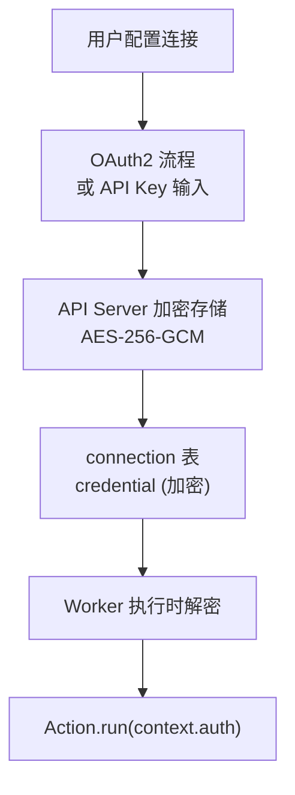
```mermaid
graph TB
    USER["用户配置连接"] --> OAUTH["OAuth2 流程<br/>或 API Key 输入"]
    OAUTH --> ENCRYPT["API Server 加密存储<br/>AES-256-GCM"]
    ENCRYPT --> DB["connection 表<br/>credential (加密)"]
    DB --> DECRYPT["Worker 执行时解密"]
    DECRYPT --> RUN["Action.run(context.auth)"]
```

### 2.8 Piece 的 npm 包结构和动态加载

每个 Piece 是一个独立的 npm 包，遵循统一的目录结构：

```
packages/pieces/community/pieces/slack/
├── package.json              # 包名: @activepieces/piece-slack
├── tsconfig.json
├── src/
│   ├── index.ts              # createPiece() 入口
│   └── lib/
│       ├── auth.ts           # PieceAuth 定义
│       ├── common/
│       │   └── props.ts      # 复用的 Property 定义
│       ├── actions/
│       │   ├── send-message.ts
│       │   ├── update-message.ts
│       │   └── index.ts
│       └── triggers/
│           ├── new-message.ts
│           └── index.ts
└── dist/                     # 编译输出
```

**动态加载机制：**

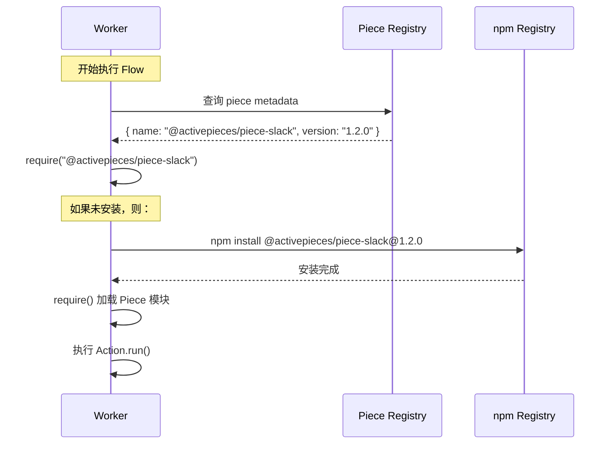
```mermaid
sequenceDiagram
    participant Worker as Worker
    participant Registry as Piece Registry
    participant NPM as npm Registry

    Note over Worker: 开始执行 Flow
    Worker->>Registry: 查询 piece metadata
    Registry-->>Worker: { name: "@activepieces/piece-slack", version: "1.2.0" }
    Worker->>Worker: require("@activepieces/piece-slack")
    Note over Worker: 如果未安装，则：
    Worker->>NPM: npm install @activepieces/piece-slack@1.2.0
    NPM-->>Worker: 安装完成
    Worker->>Worker: require() 加载 Piece 模块
    Worker->>Worker: 执行 Action.run()
```

**动态加载的核心代码（简化）：**

```typescript
// packages/server/engine/src/lib/piece-loader.ts
import { Piece } from '@activepieces/pieces-framework';

export async function loadPiece(pieceName: string, pieceVersion: string): Promise<Piece> {
  const packagePath = `@activepieces/piece-${pieceName}`;

  try {
    // 尝试直接 require（已安装）
    const module = require(packagePath);
    return module[pieceName];
  } catch {
    // 未安装则动态安装
    await installPackage(packagePath, pieceVersion);
    // 清除 require 缓存
    delete require.cache[require.resolve(packagePath)];
    const module = require(packagePath);
    return module[pieceName];
  }
}

async function installPackage(packagePath: string, version: string): Promise<void> {
  const { execSync } = require('child_process');
  execSync(`npm install ${packagePath}@${version} --no-save`, {
    cwd: process.cwd(),
    stdio: 'pipe',
  });
}
```

---

## 三、Flow 数据模型

### 3.1 Flow 数据结构

Activepieces 的 Flow 采用 **Trigger → Steps 线性模型**，即每个 Flow 有且仅有一个 Trigger 作为入口，后接零个或多个 Step 按顺序线性执行。这与 n8n/Zapier 的设计理念一致，简化了编排复杂度但牺牲了并行能力。

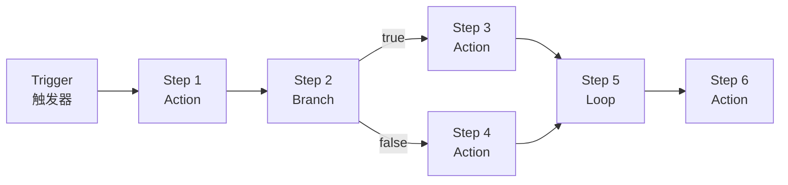
```mermaid
graph LR
    TRIGGER["Trigger<br/>触发器"] --> STEP1["Step 1<br/>Action"]
    STEP1 --> STEP2["Step 2<br/>Branch"]
    STEP2 -->|true| STEP3["Step 3<br/>Action"]
    STEP2 -->|false| STEP4["Step 4<br/>Action"]
    STEP3 --> STEP5["Step 5<br/>Loop"]
    STEP4 --> STEP5
    STEP5 --> STEP6["Step 6<br/>Action"]
```

**Flow 的 JSON 数据结构：**

```json
{
  "id": "flow-uuid-001",
  "displayName": "Slack to Google Sheets",
  "trigger": {
    "name": "new_message",
    "type": "APP_WEBHOOK",
    "settings": {
      "pieceName": "@activepieces/piece-slack",
      "pieceVersion": "1.2.0",
      "triggerName": "new_message",
      "input": {
        "channel": "C12345"
      },
      "inputUiInfo": {}
    }
  },
  "steps": [
    {
      "name": "step_1",
      "type": "PIECE",
      "displayName": "Send Message",
      "settings": {
        "pieceName": "@activepieces/piece-slack",
        "pieceVersion": "1.2.0",
        "actionName": "send_message",
        "input": {
          "channel": "C67890",
          "text": "{{trigger.body.text}}"
        },
        "errorHandlingOptions": {
          "retryOnFailure": { "enabled": true, "maxRetries": 3 },
          "continueOnFailure": { "enabled": false }
        }
      },
      "nextAction": "step_2"
    },
    {
      "name": "step_2",
      "type": "BRANCH",
      "displayName": "Check Priority",
      "settings": {
        "condition": {
          "operator": "IS_NOT_EMPTY",
          "firstValue": "{{trigger.body.text}}",
          "secondValue": ""
        }
      },
      "nextAction": "step_3"
    },
    {
      "name": "step_3",
      "type": "PIECE",
      "displayName": "Add Row",
      "settings": {
        "pieceName": "@activepieces/piece-google-sheets",
        "pieceVersion": "0.7.0",
        "actionName": "append_row",
        "input": {
          "spreadsheetId": "1abc...",
          "range": "Sheet1!A:D",
          "values": ["{{trigger.body.user}}", "{{trigger.body.text}}"]
        }
      },
      "nextAction": null
    }
  ]
}
```

### 3.2 FlowVersion 版本管理

Activepieces 对 Flow 采用 **版本化管理**，每次编辑保存都会生成一个新的 FlowVersion，实现了 Flow 的不可变发布模式：

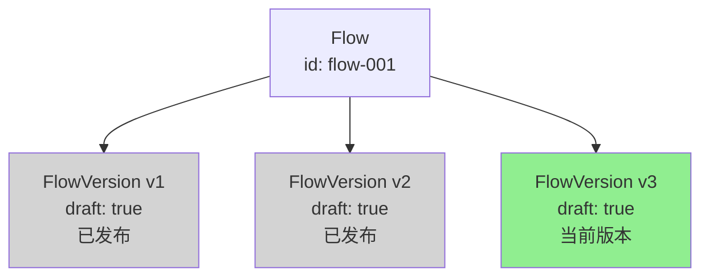
```mermaid
graph TB
    FLOW["Flow<br/>id: flow-001"]
    V1["FlowVersion v1<br/>draft: true<br/>已发布"]
    V2["FlowVersion v2<br/>draft: true<br/>已发布"]
    V3["FlowVersion v3<br/>draft: true<br/>当前版本"]

    FLOW --> V1
    FLOW --> V2
    FLOW --> V3

    style V3 fill:#90EE90
    style V1 fill:#D3D3D3
    style V2 fill:#D3D3D3
```

```typescript
// packages/shared/src/lib/flow-version/flow-version.ts
export interface FlowVersion {
  id: string;
  flowId: string;
  displayName: string;
  trigger: TriggerDto;
  steps: StepDto[];
  created: string;          // ISO 8601
  updated: string;
  // 以下为内部状态
  state: FlowVersionState;  // DRAFT | LOCKED | PUBLISHED
}

export enum FlowVersionState {
  DRAFT = 'DRAFT',         // 草稿，可编辑
  LOCKED = 'LOCKED',       // 锁定，不可编辑（正在发布中）
  PUBLISHED = 'PUBLISHED', // 已发布，不可编辑
}
```

### 3.3 Step 类型

Activepieces 支持四种 Step 类型，每种都有不同的执行语义：

```typescript
// packages/shared/src/lib/step/step-type.ts
export enum StepType {
  PIECE = 'PIECE',     // 调用 Piece Action
  BRANCH = 'BRANCH',   // 条件分支
  LOOP = 'LOOP',       // 循环迭代
  CODE = 'CODE',       // 自定义代码
}

// Branch Step
export interface BranchStep {
  name: string;
  type: StepType.BRANCH;
  displayName: string;
  settings: {
    conditions: Condition[];  // 条件组
    trueAction: Step;        // true 分支（单步）
    falseAction: Step;       // false 分支（单步）
  };
  nextAction: Step;          // 分支结束后继续执行的步骤
}

// Loop Step
export interface LoopStep {
  name: string;
  type: StepType.LOOP;
  displayName: string;
  settings: {
    items: string;           // 循环数组表达式，如 "{{trigger.body.items}}"
    firstAction: Step;       // 循环体中的第一步
    iterationTimeout: number; // 单次迭代超时（毫秒）
  };
  nextAction: Step;
}

// Code Step
export interface CodeStep {
  name: string;
  type: StepType.CODE;
  displayName: string;
  settings: {
    language: 'javascript' | 'python';  // 支持的语言
    code: string;                        // 用户代码
    input: Record<string, any>;          // 输入参数
    timeout: number;                     // 超时时间
  };
  nextAction: Step;
}
```

**四种 Step 类型的执行流程：**


```mermaid
graph TB
    subgraph "PIECE Step"
        P1["加载 Piece"] --> P2["解析 Input 模板"]
        P2 --> P3["调用 Action.run()"]
        P3 --> P4["存储输出"]
    end

    subgraph "BRANCH Step"
        B1["评估 Conditions"] --> B2{条件成立?}
        B2 -->|Yes| B3["执行 trueAction"]
        B2 -->|No| B4["执行 falseAction"]
        B3 --> B5["继续 nextAction"]
        B4 --> B5
    end

    subgraph "LOOP Step"
        L1["解析 items 数组"] --> L2["for each item"]
        L2 --> L3["执行 firstAction"]
        L3 --> L4{还有下一个?}
        L4 -->|Yes| L2
        L4 -->|No| L5["继续 nextAction"]
    end

    subgraph "CODE Step"
        C1["编译用户代码"] --> C2["沙箱内执行"]
        C2 --> C3["收集输出"]
        C3 --> C4["继续 nextAction"]
    end
```

### 3.4 Flow Instance 和 Flow Run 关系

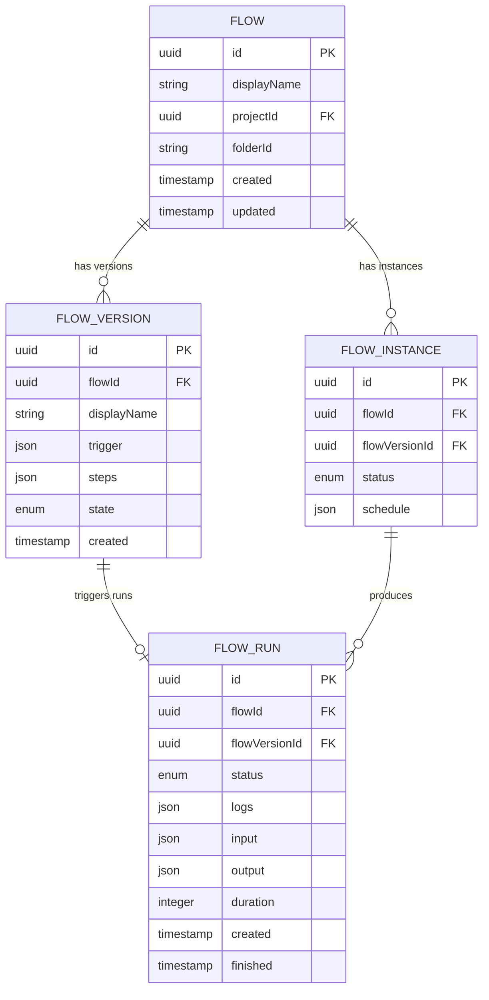
```mermaid
erDiagram
    FLOW ||--o{ FLOW_VERSION : "has versions"
    FLOW_VERSION ||--o| FLOW_RUN : "triggers runs"
    FLOW ||--o{ FLOW_INSTANCE : "has instances"
    FLOW_INSTANCE ||--o{ FLOW_RUN : "produces"

    FLOW {
        uuid id PK
        string displayName
        uuid projectId FK
        string folderId
        timestamp created
        timestamp updated
    }

    FLOW_VERSION {
        uuid id PK
        uuid flowId FK
        string displayName
        json trigger
        json steps
        enum state
        timestamp created
    }

    FLOW_INSTANCE {
        uuid id PK
        uuid flowId FK
        uuid flowVersionId FK
        enum status
        json schedule
    }

    FLOW_RUN {
        uuid id PK
        uuid flowId FK
        uuid flowVersionId FK
        enum status
        json logs
        json input
        json output
        integer duration
        timestamp created
        timestamp finished
    }
```

**Flow Run 状态机：**

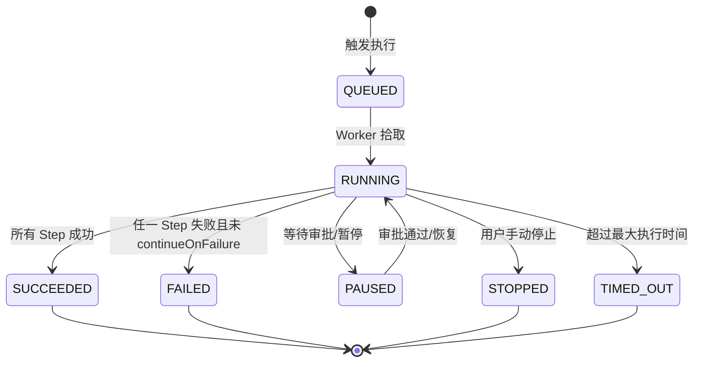
```mermaid
stateDiagram-v2
    [*] --> QUEUED: 触发执行
    QUEUED --> RUNNING: Worker 拾取
    RUNNING --> SUCCEEDED: 所有 Step 成功
    RUNNING --> FAILED: 任一 Step 失败且未 continueOnFailure
    RUNNING --> PAUSED: 等待审批/暂停
    PAUSED --> RUNNING: 审批通过/恢复
    RUNNING --> STOPPED: 用户手动停止
    RUNNING --> TIMED_OUT: 超过最大执行时间
    SUCCEEDED --> [*]
    FAILED --> [*]
    STOPPED --> [*]
    TIMED_OUT --> [*]
```

---

## 四、前端流程编辑器实现

### 4.1 技术栈

Activepieces 前端使用 **React 18** 构建，核心 UI 库为 Ant Design，流程编辑器基于 **React Flow**（一个强大的 React 节点图编辑器库）实现。

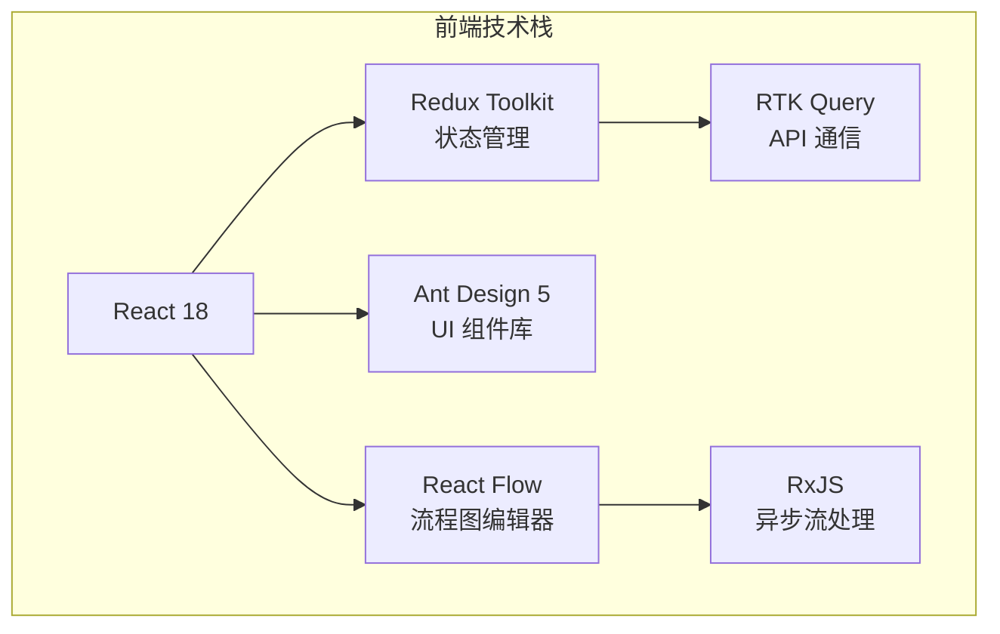
```mermaid
graph TB
    subgraph "前端技术栈"
        REACT["React 18"]
        RF["React Flow<br/>流程图编辑器"]
        AD["Ant Design 5<br/>UI 组件库"]
        RX["Redux Toolkit<br/>状态管理"]
        RTK["RTK Query<br/>API 通信"]
        RXJS["RxJS<br/>异步流处理"]
    end

    REACT --> RF
    REACT --> AD
    REACT --> RX
    RX --> RTK
    RF --> RXJS
```

### 4.2 Flow Builder 组件化

Flow Builder 是整个前端最复杂的模块，采用分层组件化设计：

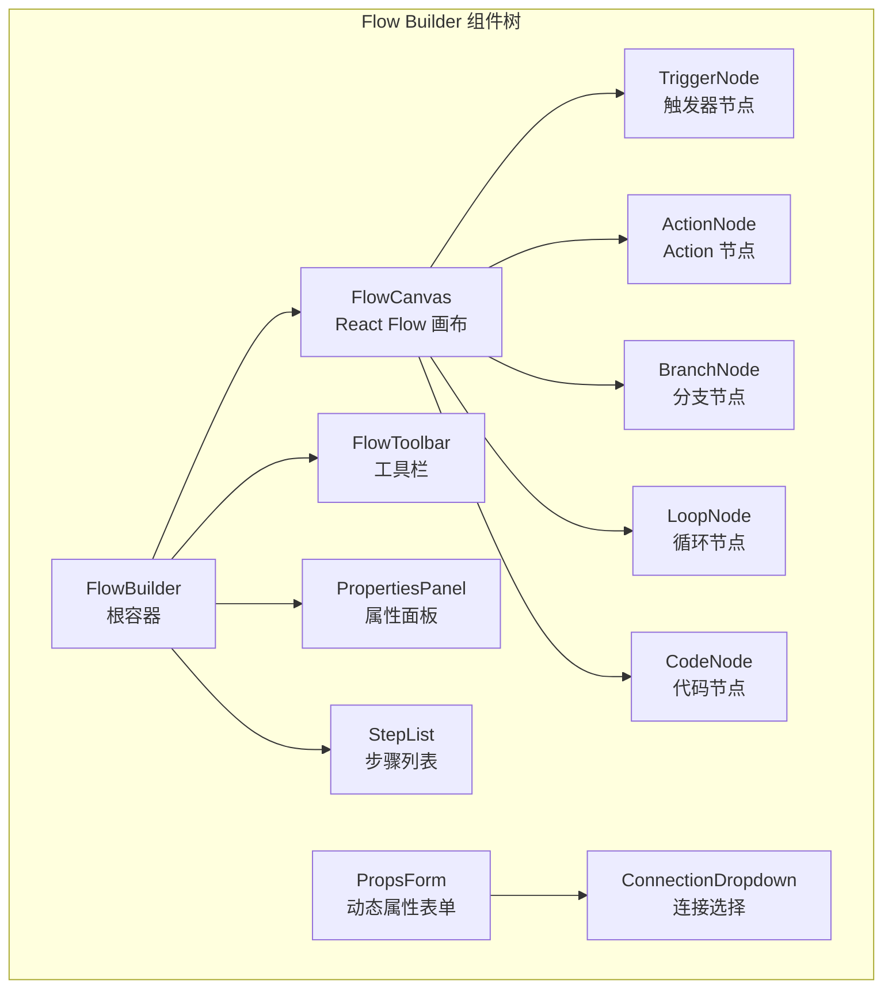
```mermaid
graph TB
    subgraph "Flow Builder 组件树"
        FB["FlowBuilder<br/>根容器"]
        FC["FlowCanvas<br/>React Flow 画布"]
        TB["FlowToolbar<br/>工具栏"]
        PP["PropertiesPanel<br/>属性面板"]
        SL["StepList<br/>步骤列表"]

        FB --> FC
        FB --> TB
        FB --> PP
        FB --> SL

        TN["TriggerNode<br/>触发器节点"]
        AN["ActionNode<br/>Action 节点"]
        BN["BranchNode<br/>分支节点"]
        LN["LoopNode<br/>循环节点"]
        CN["CodeNode<br/>代码节点"]

        FC --> TN
        FC --> AN
        FC --> BN
        FC --> LN
        FC --> CN

        PF["PropsForm<br/>动态属性表单"]
        CD["ConnectionDropdown<br/>连接选择"]
        PF --> CD
    end
```

**FlowBuilder 核心代码结构（简化）：**

```typescript
// packages/web/src/app/flow-builder/flow-builder.tsx
import React from 'react';
import ReactFlow, { Node, Edge } from 'reactflow';
import 'reactflow/dist/style.css';

import { TriggerNode } from './nodes/trigger-node';
import { ActionNode } from './nodes/action-node';
import { BranchNode } from './nodes/branch-node';
import { LoopNode } from './nodes/loop-node';
import { CodeNode } from './nodes/code-node';
import { PropertiesPanel } from './properties-panel';

const nodeTypes = {
  trigger: TriggerNode,
  action: ActionNode,
  branch: BranchNode,
  loop: LoopNode,
  code: CodeNode,
};

export const FlowBuilder: React.FC = () => {
  const { flowVersion, selectedStep } = useFlowBuilder();

  // 将 FlowVersion 转换为 React Flow 的 Nodes/Edges
  const nodes: Node[] = useMemo(
    () => flowVersionToNodes(flowVersion),
    [flowVersion]
  );

  const edges: Edge[] = useMemo(
    () => flowVersionToEdges(flowVersion),
    [flowVersion]
  );

  return (
    <div className="flow-builder">
      <ReactFlow
        nodes={nodes}
        edges={edges}
        nodeTypes={nodeTypes}
        onNodeClick={handleNodeClick}
        onNodesChange={handleNodesChange}
        fitView
      >
        <Background />
        <Controls />
        <MiniMap />
      </ReactFlow>
      {selectedStep && (
        <PropertiesPanel step={selectedStep} />
      )}
    </div>
  );
};
```

### 4.3 Step 拖拽排序

Activepieces 的流程编辑器支持通过拖拽来重新排列 Steps。其核心实现基于 React Flow 的 `onNodesChange` 回调和自定义的拖拽验证逻辑：

```typescript
// packages/web/src/app/flow-builder/dnd/step-drag-handler.ts

export function handleStepDrag(
  flowVersion: FlowVersion,
  draggedStepName: string,
  targetPosition: number
): FlowVersion {
  const steps = [...flowVersion.steps];
  const [draggedStep] = steps.splice(
    steps.findIndex(s => s.name === draggedStepName),
    1
  );
  steps.splice(targetPosition, 0, draggedStep);

  // 重新计算 nextAction 链
  return recalculateNextActions({
    ...flowVersion,
    steps,
  });
}

// 规则验证：Trigger 不能被拖到非首位，Branch 的子 Step 不能脱离 Branch
export function validateDrop(
  step: Step,
  targetIndex: number,
  flowVersion: FlowVersion
): { valid: boolean; reason?: string } {
  if (step.type === 'TRIGGER' && targetIndex !== 0) {
    return { valid: false, reason: 'Trigger must be the first step' };
  }
  if (targetIndex === 0 && step.type !== 'TRIGGER') {
    return { valid: false, reason: 'Only trigger can be at position 0' };
  }
  return { valid: true };
}
```

### 4.4 Props Form 动态渲染

这是前端最核心也最精妙的部分——**根据后端 Piece 的 Property 定义，自动渲染对应的 UI 表单**。

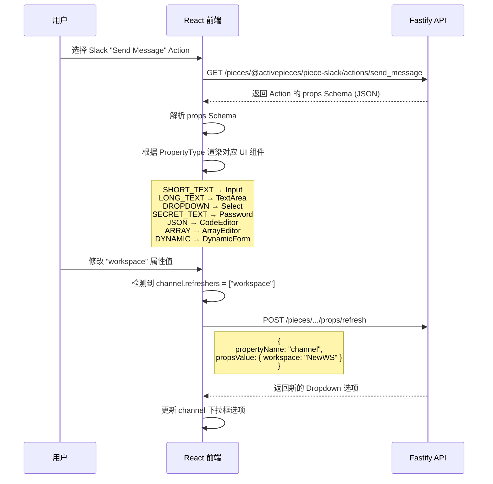
```mermaid
sequenceDiagram
    participant User as 用户
    participant FE as React 前端
    participant API as Fastify API

    User->>FE: 选择 Slack "Send Message" Action
    FE->>API: GET /pieces/@activepieces/piece-slack/actions/send_message
    API-->>FE: 返回 Action 的 props Schema (JSON)
    FE->>FE: 解析 props Schema
    FE->>FE: 根据 PropertyType 渲染对应 UI 组件
    Note over FE: SHORT_TEXT → Input<br/>LONG_TEXT → TextArea<br/>DROPDOWN → Select<br/>SECRET_TEXT → Password<br/>JSON → CodeEditor<br/>ARRAY → ArrayEditor<br/>DYNAMIC → DynamicForm

    User->>FE: 修改 "workspace" 属性值
    FE->>FE: 检测到 channel.refreshers = ["workspace"]
    FE->>API: POST /pieces/.../props/refresh
    Note right of FE: {<br/>  propertyName: "channel",<br/>  propsValue: { workspace: "NewWS" }<br/>}
    API-->>FE: 返回新的 Dropdown 选项
    FE->>FE: 更新 channel 下拉框选项
```

**PropsForm 组件核心代码：**

```typescript
// packages/web/src/app/flow-builder/props-form/props-form.tsx
import React from 'react';
import { PropertyType, AnyProperty } from '@activepieces/shared';

export const PropsForm: React.FC<{
  props: Record<string, AnyProperty>;
  values: Record<string, any>;
  onChange: (key: string, value: any) => void;
}> = ({ props, values, onChange }) => {

  return (
    <div className="props-form">
      {Object.entries(props).map(([key, prop]) => (
        <PropertyRenderer
          key={key}
          property={prop}
          value={values[key]}
          onChange={(value) => onChange(key, value)}
        />
      ))}
    </div>
  );
};

const PropertyRenderer: React.FC<{
  property: AnyProperty;
  value: any;
  onChange: (value: any) => void;
}> = ({ property, value, onChange }) => {
  switch (property.type) {
    case PropertyType.SHORT_TEXT:
      return <ShortTextInput property={property} value={value} onChange={onChange} />;
    case PropertyType.LONG_TEXT:
      return <LongTextInput property={property} value={value} onChange={onChange} />;
    case PropertyType.NUMBER:
      return <NumberInput property={property} value={value} onChange={onChange} />;
    case PropertyType.CHECKBOX:
      return <CheckboxInput property={property} value={value} onChange={onChange} />;
    case PropertyType.SECRET_TEXT:
      return <SecretTextInput property={property} value={value} onChange={onChange} />;
    case PropertyType.DROPDOWN:
      return <DropdownInput property={property} value={value} onChange={onChange} />;
    case PropertyType.JSON:
      return <JsonEditor property={property} value={value} onChange={onChange} />;
    case PropertyType.ARRAY:
      return <ArrayEditor property={property} value={value} onChange={onChange} />;
    case PropertyType.OBJECT:
      return <ObjectEditor property={property} value={value} onChange={onChange} />;
    case PropertyType.DYNAMIC:
      return <DynamicPropertiesForm property={property} value={value} onChange={onChange} />;
    case PropertyType.DATE:
      return <DatePicker property={property} value={value} onChange={onChange} />;
    case PropertyType.FILE:
      return <FileUpload property={property} value={value} onChange={onChange} />;
    default:
      return <div>Unsupported property type: {property.type}</div>;
  }
};
```

**Dropdown 属性的 refreshers 处理：**

```typescript
// packages/web/src/app/flow-builder/props-form/dropdown-input.tsx
export const DropdownInput: React.FC<DropdownProps> = ({ property, value, onChange }) => {
  const [options, setOptions] = useState<DropdownOption[]>([]);
  const [loading, setLoading] = useState(false);
  const formValues = useFormData();  // 获取整个表单的当前值

  // 监听 refreshers 依赖的属性变化
  const refreshersValues = property.refreshers?.map(r => formValues[r]);

  useEffect(() => {
    if (property.options && typeof property.options === 'function') {
      // 动态选项：调用 API 获取
      setLoading(true);
      fetchDropdownOptions(property, formValues)
        .then(opts => setOptions(opts))
        .finally(() => setLoading(false));
    } else if (Array.isArray(property.options)) {
      // 静态选项：直接使用
      setOptions(property.options);
    }
  }, [...(refreshersValues || [])]);  // 依赖变化时重新执行

  return (
    <Form.Item label={property.displayName} required={property.required}>
      <Select
        value={value}
        onChange={onChange}
        loading={loading}
        options={options.map(o => ({ label: o.label, value: o.value }))}
        placeholder={property.description}
      />
    </Form.Item>
  );
};
```

### 4.5 Connection 管理 UI

当用户配置一个需要认证的 Piece 时，需要先创建 Connection（存储认证凭证），再在 Step 中引用该 Connection：

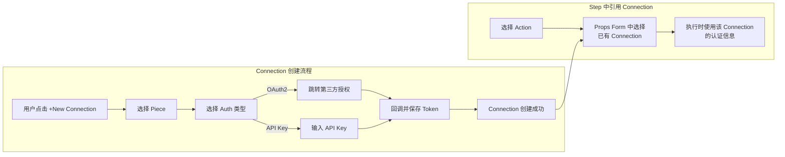
```mermaid
graph LR
    subgraph "Connection 创建流程"
        A["用户点击 +New Connection"] --> B["选择 Piece"]
        B --> C["选择 Auth 类型"]
        C -->|OAuth2| D["跳转第三方授权"]
        C -->|API Key| E["输入 API Key"]
        D --> F["回调并保存 Token"]
        E --> F
        F --> G["Connection 创建成功"]
    end

    subgraph "Step 中引用 Connection"
        H["选择 Action"] --> I["Props Form 中选择<br/>已有 Connection"]
        I --> J["执行时使用该 Connection<br/>的认证信息"]
    end

    G --> I
```

### 4.6 API 通信

前端通过 RTK Query 与后端通信，定义了完整的 API Slice：

```typescript
// packages/web/src/app/api/api-slice.ts
import { createApi, fetchBaseQuery } from '@reduxjs/toolkit/query/react';

export const apiSlice = createApi({
  reducerPath: 'api',
  baseQuery: fetchBaseQuery({
    baseUrl: '/api/v1',
    prepareHeaders: (headers) => {
      const token = getAccessToken();
      if (token) headers.set('Authorization', `Bearer ${token}`);
      return headers;
    },
  }),
  tagTypes: ['Flow', 'FlowRun', 'Connection', 'Piece'],
  endpoints: (builder) => ({
    // Flow CRUD
    getFlows: builder.query<Flow[], void>({
      query: () => '/flows',
      providesTags: ['Flow'],
    }),
    getFlow: builder.query<Flow, string>({
      query: (id) => `/flows/${id}`,
    }),
    createFlow: builder.mutation<Flow, CreateFlowRequest>({
      query: (body) => ({ url: '/flows', method: 'POST', body }),
      invalidatesTags: ['Flow'],
    }),
    updateFlow: builder.mutation<Flow, UpdateFlowRequest>({
      query: ({ id, ...body }) => ({ url: `/flows/${id}`, method: 'PUT', body }),
      invalidatesTags: ['Flow'],
    }),

    // Flow Run
    listFlowRuns: builder.query<FlowRun[], string>({
      query: (flowId) => `/flows/${flowId}/runs`,
      providesTags: ['FlowRun'],
    }),

    // Connection
    listConnections: builder.query<Connection[], void>({
      query: () => '/connections',
      providesTags: ['Connection'],
    }),

    // Piece Props (for refreshers)
    fetchPieceProps: builder.mutation<PropsResponse, PropsRequest>({
      query: (body) => ({
        url: `/pieces/${body.pieceName}/actions/${body.actionName}/props`,
        method: 'POST',
        body,
      }),
    }),
  }),
});
```

---

## 五、后端执行引擎

### 5.1 Engine 沙箱执行

Activepieces 的 Engine 是一个独立的 Node.js 子进程，通过 `child_process.fork()` 创建。沙箱设计确保了用户自定义代码（Code Step）不会影响主进程的稳定性：

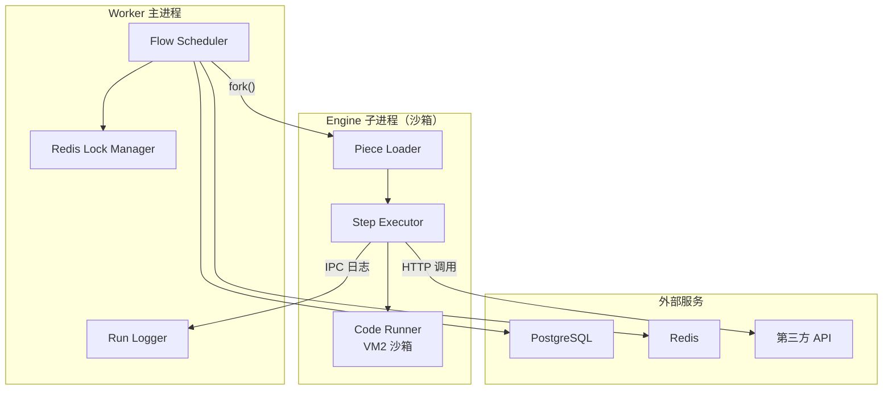
```mermaid
graph TB
    subgraph "Worker 主进程"
        SCHEDULER["Flow Scheduler"]
        LOCK["Redis Lock Manager"]
        LOGGER["Run Logger"]
    end

    subgraph "Engine 子进程（沙箱）"
        LOADER["Piece Loader"]
        EXECUTOR["Step Executor"]
        CODE_RUNNER["Code Runner<br/>VM2 沙箱"]
    end

    subgraph "外部服务"
        PG["PostgreSQL"]
        RD["Redis"]
        EXT["第三方 API"]
    end

    SCHEDULER -->|"fork()"| LOADER
    SCHEDULER --> LOCK
    LOADER --> EXECUTOR
    EXECUTOR --> CODE_RUNNER
    EXECUTOR -->|"HTTP 调用"| EXT
    SCHEDULER --> PG
    SCHEDULER --> RD
    EXECUTOR -->|"IPC 日志"| LOGGER
```

**Engine 执行入口（简化）：**

```typescript
// packages/server/engine/src/lib/executor/flow-executor.ts
import { fork, ChildProcess } from 'child_process';

export class FlowExecutor {
  async execute(flowVersion: FlowVersion, runId: string): Promise<FlowRunResult> {
    // 1. 创建执行上下文
    const context: ExecutionContext = {
      flowVersion,
      runId,
      steps: flowVersion.steps,
      triggerPayload: await this.getTriggerPayload(runId),
      connections: await this.loadConnections(flowVersion),
    };

    // 2. 启动沙箱子进程
    const engineProcess: ChildProcess = fork(
      require.resolve('./engine-worker'),
      [],
      {
        env: {
          ...process.env,
          ENGINE_RUN_ID: runId,
          ENGINE_TIMEOUT: '300000',  // 5 分钟超时
        },
        // 限制子进程资源
        serialization: 'advanced',
      }
    );

    // 3. 发送执行指令
    engineProcess.send({ type: 'EXECUTE_FLOW', context });

    // 4. 等待执行结果
    return new Promise((resolve, reject) => {
      const timeout = setTimeout(() => {
        engineProcess.kill('SIGKILL');
        reject(new Error('Flow execution timed out'));
      }, 300000);

      engineProcess.on('message', (message) => {
        if (message.type === 'FLOW_RESULT') {
          clearTimeout(timeout);
          resolve(message.result);
        }
        if (message.type === 'STEP_LOG') {
          this.logStep(runId, message.stepName, message.log);
        }
      });

      engineProcess.on('error', (err) => {
        clearTimeout(timeout);
        reject(err);
      });

      engineProcess.on('exit', (code) => {
        if (code !== 0) {
          clearTimeout(timeout);
          reject(new Error(`Engine process exited with code ${code}`));
        }
      });
    });
  }
}
```

### 5.2 Trigger 轮询和 Webhook 机制

**Polling Trigger 执行流程：**

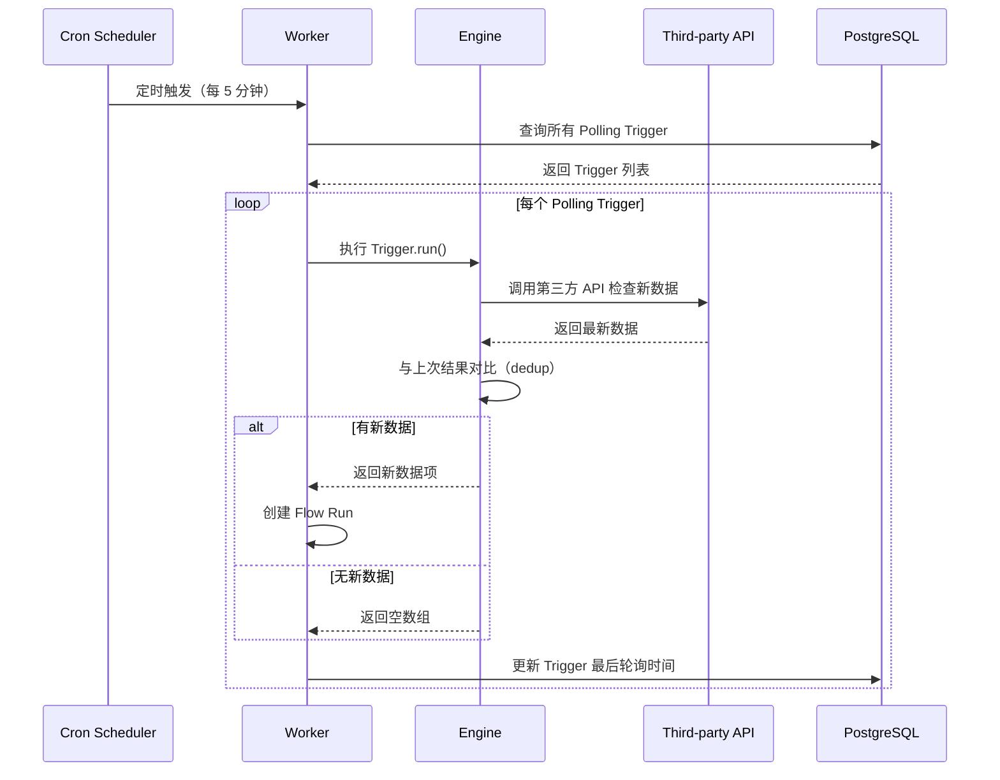
```mermaid
sequenceDiagram
    participant Cron as Cron Scheduler
    participant Worker as Worker
    participant Engine as Engine
    participant API as Third-party API
    participant DB as PostgreSQL

    Cron->>Worker: 定时触发（每 5 分钟）
    Worker->>DB: 查询所有 Polling Trigger
    DB-->>Worker: 返回 Trigger 列表
    loop 每个 Polling Trigger
        Worker->>Engine: 执行 Trigger.run()
        Engine->>API: 调用第三方 API 检查新数据
        API-->>Engine: 返回最新数据
        Engine->>Engine: 与上次结果对比（dedup）
        alt 有新数据
            Engine-->>Worker: 返回新数据项
            Worker->>Worker: 创建 Flow Run
        else 无新数据
            Engine-->>Worker: 返回空数组
        end
        Worker->>DB: 更新 Trigger 最后轮询时间
    end
```

**Webhook Trigger 注册流程：**

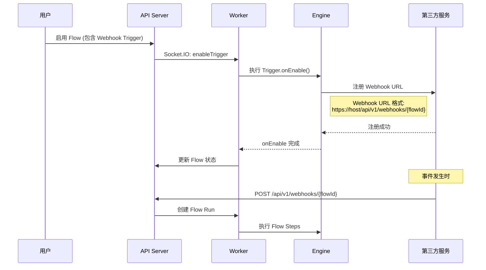
```mermaid
sequenceDiagram
    participant User as 用户
    participant API as API Server
    participant Worker as Worker
    participant Engine as Engine
    participant ThirdParty as 第三方服务

    User->>API: 启用 Flow (包含 Webhook Trigger)
    API->>Worker: Socket.IO: enableTrigger
    Worker->>Engine: 执行 Trigger.onEnable()
    Engine->>ThirdParty: 注册 Webhook URL
    Note right of Engine: Webhook URL 格式:<br/>https://host/api/v1/webhooks/{flowId}
    ThirdParty-->>Engine: 注册成功
    Engine-->>Worker: onEnable 完成
    Worker->>API: 更新 Flow 状态

    Note over ThirdParty: 事件发生时
    ThirdParty->>API: POST /api/v1/webhooks/{flowId}
    API->>Worker: 创建 Flow Run
    Worker->>Engine: 执行 Flow Steps
```

**Webhook 端点处理代码（简化）：**

```typescript
// packages/server/api/src/app/webhooks/webhook-controller.ts
import { FastifyInstance } from 'fastify';

export async function webhookController(app: FastifyInstance) {
  // 处理 incoming webhook
  app.all('/webhooks/:flowId', async (request, reply) => {
    const { flowId } = request.params as { flowId: string };

    // 验证 Flow 存在且已启用
    const flow = await flowService.getOne(flowId);
    if (!flow || !flow.active) {
      return reply.code(404).send({ error: 'Flow not found or inactive' });
    }

    // 将 webhook payload 入队执行
    await flowRunService.start({
      flowId,
      payload: {
        body: request.body,
        headers: request.headers,
        query: request.query,
        method: request.method,
      },
    });

    // 立即返回 200（异步处理）
    return reply.code(200).send({ status: 'queued' });
  });

  // 处理 OAuth2 callback
  app.get('/connections/callback', async (request, reply) => {
    const { code, state } = request.query as { code: string; state: string };
    const connection = await connectionService.handleOAuth2Callback(code, state);
    return reply.redirect(`/connections?status=success&id=${connection.id}`);
  });
}
```

### 5.3 Step 执行上下文

每个 Step 在执行时都会获得一个上下文对象，包含所有必要信息：

```typescript
// packages/pieces/framework/src/lib/action/action-context.ts
export interface ActionRunContext<D extends PieceAuth = PieceAuth> {
  // 当前 Step 的属性值（用户配置）
  propsValue: Record<string, any>;

  // 认证信息（解密后）
  auth: D;

  // 前面 Steps 的输出结果
  executionContext: {
    [stepName: string]: any;  // 如 {{steps.step_1.output}}
  };

  // Trigger 的输出
  trigger: {
    output: any;              // 如 {{trigger.body}}
  };

  // 文件操作
  files: FileService;

  // 日志
  server: {
    log: (message: string) => void;
  };

  // Store（跨 Run 的持久化键值对）
  store: {
    get: (key: string) => Promise<any>;
    put: (key: string, value: any, expires?: number) => Promise<void>;
    delete: (key: string) => Promise<void>;
  };
}
```

**模板解析 — 在运行时解析 `{{steps.step_1.output.id}}` 表达式：**

```typescript
// packages/server/engine/src/lib/template/template-parser.ts
export class TemplateParser {
  private static TEMPLATE_REGEX = /\{\{(.*?)\}\}/g;

  static resolve(
    template: string,
    context: ExecutionExecutionContext
  ): string {
    return template.replace(this.TEMPLATE_REGEX, (match, expression) => {
      const value = this.evaluateExpression(expression.trim(), context);
      return value !== undefined ? String(value) : match;
    });
  }

  private static evaluateExpression(
    expression: string,
    context: ExecutionExecutionContext
  ): any {
    // 支持: trigger.body.text, steps.step_1.output.id, auth.apiKey
    const parts = expression.split('.');
    let current: any = context;

    for (const part of parts) {
      if (current == null) return undefined;
      current = current[part];
    }

    return current;
  }
}

// 使用示例
const resolved = TemplateParser.resolve(
  'Hello {{trigger.body.user}}, your ID is {{steps.step_1.output.id}}',
  {
    trigger: { body: { user: 'Alice' } },
    steps: { step_1: { output: { id: '12345' } } },
  }
);
// 结果: "Hello Alice, your ID is 12345"
```

### 5.4 分支和循环执行

**Branch Step 执行：**

```typescript
// packages/server/engine/src/lib/executor/branch-executor.ts
export async function executeBranch(
  step: BranchStep,
  context: ExecutionContext
): Promise<StepResult> {
  // 评估条件
  const conditionResult = evaluateConditions(
    step.settings.conditions,
    context
  );

  if (conditionResult) {
    // 执行 true 分支
    return executeStep(step.settings.trueAction, context);
  } else {
    // 执行 false 分支
    return executeStep(step.settings.falseAction, context);
  }
}

// 条件运算符
export enum ConditionOperator {
  IS_EQUAL = 'IS_EQUAL',
  IS_NOT_EQUAL = 'IS_NOT_EQUAL',
  IS_EMPTY = 'IS_EMPTY',
  IS_NOT_EMPTY = 'IS_NOT_EMPTY',
  CONTAINS = 'CONTAINS',
  STARTS_WITH = 'STARTS_WITH',
  ENDS_WITH = 'ENDS_WITH',
  GREATER_THAN = 'GREATER_THAN',
  LESS_THAN = 'LESS_THAN',
  EXISTS = 'EXISTS',
}
```

**Loop Step 执行：**

```typescript
// packages/server/engine/src/lib/executor/loop-executor.ts
export async function executeLoop(
  step: LoopStep,
  context: ExecutionContext
): Promise<StepResult> {
  const items = TemplateParser.resolve(
    step.settings.items,
    context
  ) as any[];

  const results: any[] = [];

  for (const [index, item] of items.entries()) {
    // 设置当前迭代上下文
    const iterationContext = {
      ...context,
      currentItem: item,
      currentIndex: index,
    };

    // 检查单次迭代超时
    const timeout = step.settings.iterationTimeout || 60000;
    const result = await withTimeout(
      executeStep(step.settings.firstAction, iterationContext),
      timeout
    );

    results.push(result);
  }

  return { output: results };
}
```

### 5.5 错误处理和重试

Activepieces 的错误处理是 Step 级别的，通过 `errorHandlingOptions` 配置：

```mermaid
flowchart TB
    START["Step 执行"] --> EXEC["调用 Action.run()"]
    EXEC -->|成功| OK["返回结果"]
    EXEC -->|异常| ERR{"errorHandlingOptions?<br/>retryOnFailure?"}

    ERR -->|enabled=true| RETRY{"重试次数<br/>< maxRetries?"}
    RETRY -->|Yes| WAIT["等待 retryInterval"] --> EXEC
    RETRY -->|No| CONT{"continueOnFailure?"}

    ERR -->|enabled=false| CONT

    CONT -->|enabled=true| SKIP["标记 Step 为 FAILED<br/>继续执行 nextAction"]
    CONT -->|enabled=false| FAIL["Flow Run 状态 → FAILED<br/>停止执行"]

    OK --> NEXT["继续 nextAction"]
    SKIP --> NEXT
```

**重试执行代码：**

```typescript
// packages/server/engine/src/lib/executor/retry-handler.ts
export async function executeWithRetry(
  action: () => Promise<any>,
  options: ErrorHandlingOptions,
  logger: RunLogger
): Promise<any> {
  const { retryOnFailure, continueOnFailure } = options;

  const maxRetries = retryOnFailure?.enabled ? retryOnFailure.maxRetries : 0;
  const retryInterval = retryOnFailure?.retryInterval || 5000;
  let lastError: Error | null = null;

  for (let attempt = 0; attempt <= maxRetries; attempt++) {
    try {
      return await action();
    } catch (error) {
      lastError = error as Error;
      logger.warn(`Attempt ${attempt + 1}/${maxRetries + 1} failed: ${error.message}`);

      if (attempt < maxRetries) {
        await sleep(retryInterval);
      }
    }
  }

  // 所有重试用尽
  if (continueOnFailure?.enabled) {
    logger.warn(`Step failed but continuing: ${lastError?.message}`);
    return { error: lastError?.message, continuedOnFailure: true };
  }

  throw lastError;
}
```

### 5.6 Worker 调度

Worker 的整体调度流程：

```mermaid
flowchart TB
    START["Worker 启动"] --> CONNECT["连接 API Server<br/>(Socket.IO)"]
    CONNECT --> READY["注册为可用 Worker"]
    READY --> POLL["轮询获取任务<br/>(Socket.IO RPC)"]

    POLL -->|收到任务| ACQUIRE["获取 Redis 分布式锁<br/>(30s TTL)"]
    ACQUIRE -->|成功| EXECUTE["Engine 执行 Flow"]
    ACQUIRE -->|失败| POLL

    EXECUTE --> RENEW["启动锁续约协程<br/>(每 30s EXPIRE)"]
    RENEW --> RUNNING["Step 顺序执行"]
    RUNNING -->|Step 完成| NEXT["检查下一个 Step"]
    NEXT -->|有| RUNNING
    NEXT -->|无| DONE["执行完成"]
    DONE --> RELEASE["释放 Redis 锁"]
    RELEASE --> REPORT["上报执行结果"]
    REPORT --> POLL

    RUNNING -->|异常| ERROR["错误处理"]
    ERROR -->|retryOnFailure| RUNNING
    ERROR -->|continueOnFailure| NEXT
    ERROR -->|fatal| FAIL["标记 Run 为 FAILED"]
    FAIL --> RELEASE
```

---

## 六、数据库设计

### 6.1 PostgreSQL 表结构（TypeORM）

Activepieces 使用 TypeORM 作为 ORM 框架，所有实体定义采用 Decorator 语法。以下是核心表结构：

```mermaid
erDiagram
    PROJECT ||--o{ FLOW : "contains"
    PROJECT ||--o{ CONNECTION : "has"
    FLOW ||--o{ FLOW_VERSION : "versions"
    FLOW ||--o| FLOW_INSTANCE : "active instance"
    FLOW_INSTANCE ||--o{ FLOW_RUN : "produces"
    FLOW_VERSION ||--o{ FLOW_RUN : "used by"
    CONNECTION }o--|| PIECE_METADATA : "references"

    PROJECT {
        uuid id PK
        string displayName
        uuid ownerId FK
        json platformId
        timestamp created
        timestamp updated
    }

    FLOW {
        uuid id PK
        uuid projectId FK
        string displayName
        uuid folderId
        boolean published
        timestamp created
        timestamp updated
    }

    FLOW_VERSION {
        uuid id PK
        uuid flowId FK
        string displayName
        json trigger
        json steps
        enum state "DRAFT|LOCKED|PUBLISHED"
        timestamp created
        timestamp updated
    }

    FLOW_INSTANCE {
        uuid id PK
        uuid flowId FK
        uuid flowVersionId FK
        enum status "ACTIVE|INACTIVE|ERROR"
        json schedule
        timestamp lastRun
        timestamp created
    }

    FLOW_RUN {
        uuid id PK
        uuid flowId FK
        uuid flowVersionId FK
        enum status "QUEUED|RUNNING|SUCCEEDED|FAILED|STOPPED|TIMED_OUT"
        json logs
        json input
        json output
        integer duration
        timestamp created
        timestamp finished
    }

    CONNECTION {
        uuid id PK
        uuid projectId FK
        string displayName
        string pieceName
        string pieceVersion
        json credential "加密存储"
        json externalId
        enum status "ACTIVE|EXPIRED|ERROR"
        timestamp created
        timestamp updated
    }

    PIECE_METADATA {
        uuid id PK
        string name UK
        string displayName
        string logoUrl
        string version
        json auth
        json actions
        json triggers
        string[] categories
        timestamp created
    }
```

### 6.2 flow 表

```typescript
// packages/server/api/src/app/flows/flow.entity.ts
import { Entity, PrimaryColumn, Column, ManyToOne, OneToMany } from 'typeorm';

@Entity('flow')
export class FlowEntity {
  @PrimaryColumn('uuid')
  id: string;

  @Column({ length: 255 })
  displayName: string;

  @Column('uuid')
  projectId: string;

  @Column('uuid', { nullable: true })
  folderId: string;

  @Column({ default: false })
  published: boolean;

  @Column('jsonb', { nullable: true })
  tags: string[];

  @Column({ type: 'timestamp', default: () => 'CURRENT_TIMESTAMP' })
  created: Date;

  @Column({ type: 'timestamp', default: () => 'CURRENT_TIMESTAMP' })
  updated: Date;

  @ManyToOne(() => ProjectEntity, (project) => project.flows)
  project: ProjectEntity;

  @OneToMany(() => FlowVersionEntity, (version) => version.flow)
  versions: FlowVersionEntity[];
}
```

### 6.3 flow_run 表

```typescript
// packages/server/api/src/app/flow-runs/flow-run.entity.ts
@Entity('flow_run')
export class FlowRunEntity {
  @PrimaryColumn('uuid')
  id: string;

  @Column('uuid')
  flowId: string;

  @Column('uuid')
  flowVersionId: string;

  @Column({
    type: 'enum',
    enum: FlowRunStatus,
    default: FlowRunStatus.QUEUED,
  })
  status: FlowRunStatus;

  @Column('jsonb', { nullable: true })
  logs: StepLog[];

  @Column('jsonb', { nullable: true })
  input: Record<string, any>;  // Trigger payload

  @Column('jsonb', { nullable: true })
  output: Record<string, any>;  // 最后 Step 的输出

  @Column({ nullable: true })
  duration: number;  // 执行时长（毫秒）

  @Column({ type: 'timestamp', default: () => 'CURRENT_TIMESTAMP' })
  created: Date;

  @Column({ type: 'timestamp', nullable: true })
  finished: Date;

  @ManyToOne(() => FlowEntity)
  flow: FlowEntity;
}

export enum FlowRunStatus {
  QUEUED = 'QUEUED',
  RUNNING = 'RUNNING',
  SUCCEEDED = 'SUCCEEDED',
  FAILED = 'FAILED',
  STOPPED = 'STOPPED',
  TIMED_OUT = 'TIMED_OUT',
  PAUSED = 'PAUSED',
}
```

**StepLog 结构（存储在 flow_run.logs JSON 中）：**

```json
[
  {
    "stepName": "trigger",
    "startTime": "2026-05-15T10:00:00.000Z",
    "endTime": "2026-05-15T10:00:00.100Z",
    "status": "SUCCEEDED",
    "input": { "channel": "C12345" },
    "output": { "text": "Hello world", "user": "U123" }
  },
  {
    "stepName": "step_1",
    "startTime": "2026-05-15T10:00:00.150Z",
    "endTime": "2026-05-15T10:00:01.200Z",
    "status": "SUCCEEDED",
    "input": { "channel": "C67890", "text": "Hello world" },
    "output": { "ok": true, "ts": "1234567890.123456" }
  },
  {
    "stepName": "step_2",
    "startTime": "2026-05-15T10:00:01.250Z",
    "endTime": "2026-05-15T10:00:02.500Z",
    "status": "FAILED",
    "input": { "spreadsheetId": "1abc" },
    "output": null,
    "error": "Permission denied: spreadsheet not found"
  }
]
```

### 6.4 flow_version 表

```typescript
// packages/server/api/src/app/flows/flow-version/flow-version.entity.ts
@Entity('flow_version')
export class FlowVersionEntity {
  @PrimaryColumn('uuid')
  id: string;

  @Column('uuid')
  flowId: string;

  @Column({ length: 255 })
  displayName: string;

  @Column('jsonb')
  trigger: TriggerDto;

  @Column('jsonb')
  steps: StepDto[];

  @Column({
    type: 'enum',
    enum: FlowVersionState,
    default: FlowVersionState.DRAFT,
  })
  state: FlowVersionState;

  @Column({ type: 'timestamp', default: () => 'CURRENT_TIMESTAMP' })
  created: Date;

  @Column({ type: 'timestamp', default: () => 'CURRENT_TIMESTAMP' })
  updated: Date;

  @ManyToOne(() => FlowEntity, (flow) => flow.versions)
  flow: FlowEntity;
}
```

### 6.5 connection 表

```typescript
// packages/server/api/src/app/connections/connection.entity.ts
@Entity('connection')
export class ConnectionEntity {
  @PrimaryColumn('uuid')
  id: string;

  @Column({ length: 255 })
  displayName: string;

  @Column('uuid')
  projectId: string;

  @Column({ length: 255 })
  pieceName: string;

  @Column({ length: 50 })
  pieceVersion: string;

  @Column('jsonb')
  credential: Record<string, any>;  // AES-256-GCM 加密存储

  @Column('jsonb', { nullable: true })
  externalId: Record<string, any>;  // OAuth2 的 external_user_id 等

  @Column({
    type: 'enum',
    enum: ConnectionStatus,
    default: ConnectionStatus.ACTIVE,
  })
  status: ConnectionStatus;

  @Column({ type: 'timestamp', default: () => 'CURRENT_TIMESTAMP' })
  created: Date;

  @Column({ type: 'timestamp', default: () => 'CURRENT_TIMESTAMP' })
  updated: Date;
}

export enum ConnectionStatus {
  ACTIVE = 'ACTIVE',
  EXPIRED = 'EXPIRED',
  ERROR = 'ERROR',
}
```

**Credential 加密机制：**

```typescript
// packages/server/api/src/app/connections/credential-encryptor.ts
import * as crypto from 'crypto';

const ALGORITHM = 'aes-256-gcm';
const KEY = Buffer.from(process.env.AP_ENCRYPTION_KEY!, 'hex');  // 32 bytes

export class CredentialEncryptor {
  static encrypt(credential: Record<string, any>): string {
    const iv = crypto.randomBytes(16);
    const cipher = crypto.createCipheriv(ALGORITHM, KEY, iv);

    const encrypted = Buffer.concat([
      cipher.update(JSON.stringify(credential), 'utf8'),
      cipher.final(),
    ]);

    const authTag = cipher.getAuthTag();

    // 格式: iv:authTag:encrypted (全部 hex 编码)
    return `${iv.toString('hex')}:${authTag.toString('hex')}:${encrypted.toString('hex')}`;
  }

  static decrypt(encrypted: string): Record<string, any> {
    const [ivHex, authTagHex, dataHex] = encrypted.split(':');

    const iv = Buffer.from(ivHex, 'hex');
    const authTag = Buffer.from(authTagHex, 'hex');
    const data = Buffer.from(dataHex, 'hex');

    const decipher = crypto.createDecipheriv(ALGORITHM, KEY, iv);
    decipher.setAuthTag(authTag);

    const decrypted = Buffer.concat([
      decipher.update(data),
      decipher.final(),
    ]);

    return JSON.parse(decrypted.toString('utf8'));
  }
}
```

### 6.6 piece_metadata 表

```typescript
// packages/server/api/src/app/pieces/piece-metadata.entity.ts
@Entity('piece_metadata')
export class PieceMetadataEntity {
  @PrimaryColumn('uuid')
  id: string;

  @Column({ unique: true })
  name: string;  // 如 "@activepieces/piece-slack"

  @Column({ length: 255 })
  displayName: string;

  @Column({ length: 2048 })
  logoUrl: string;

  @Column({ length: 50 })
  version: string;

  @Column('jsonb', { nullable: true })
  auth: any;  // PieceAuth Schema (JSON)

  @Column('jsonb', { default: {} })
  actions: Record<string, any>;  // Action 名称 -> Action Schema

  @Column('jsonb', { default: {} })
  triggers: Record<string, any>;  // Trigger 名称 -> Trigger Schema

  @Column('simple-array', { nullable: true })
  categories: string[];

  @Column({ type: 'timestamp', default: () => 'CURRENT_TIMESTAMP' })
  created: Date;
}
```

### 6.7 关键索引

```sql
-- Flow 表索引
CREATE INDEX idx_flow_project_id ON flow (project_id);
CREATE INDEX idx_flow_folder_id ON flow (folder_id);
CREATE INDEX idx_flow_created ON flow (created DESC);

-- Flow Run 表索引（最频繁的查询）
CREATE INDEX idx_flow_run_flow_id ON flow_run (flow_id);
CREATE INDEX idx_flow_run_status ON flow_run (status);
CREATE INDEX idx_flow_run_created ON flow_run (created DESC);
CREATE INDEX idx_flow_run_flow_status ON flow_run (flow_id, status);
CREATE INDEX idx_flow_run_flow_created ON flow_run (flow_id, created DESC);

-- Connection 表索引
CREATE INDEX idx_connection_project_id ON connection (project_id);
CREATE INDEX idx_connection_piece_name ON connection (piece_name);
CREATE INDEX idx_connection_project_piece ON connection (project_id, piece_name);

-- Piece Metadata 表索引
CREATE UNIQUE INDEX idx_piece_metadata_name ON piece_metadata (name);
CREATE INDEX idx_piece_metadata_categories ON piece_metadata USING gin (categories);

-- Flow Version 表索引
CREATE INDEX idx_flow_version_flow_id ON flow_version (flow_id);
CREATE INDEX idx_flow_version_state ON flow_version (state);
```

---

## 七、API 设计

### 7.1 REST API 概览

Activepieces 的 API 遵循 RESTful 设计规范，使用 Fastify 的 Schema 验证机制。所有 API 端点需要 Bearer Token 认证：

```mermaid
graph TB
    subgraph "API 路由结构"
        AUTH["/api/v1/authentication<br/>认证管理"]
        FLOW["/api/v1/flows<br/>Flow CRUD"]
        RUN["/api/v1/flow-runs<br/>Flow Run 管理"]
        CONN["/api/v1/connections<br/>Connection 管理"]
        PIECE["/api/v1/pieces<br/>Piece 元数据"]
        WEBHOOK["/api/v1/webhooks<br/>Webhook 接收"]
        PROJECT["/api/v1/projects<br/>项目管理"]
        FLAG["/api/v1/flags<br/>Feature Flags"]
        STORE["/api/v1/store<br/>键值存储"]
    end
```

### 7.2 Flow CRUD

```typescript
// packages/server/api/src/app/flows/flow-controller.ts

// GET /api/v1/flows - 列出项目下所有 Flows
// Query: projectId, cursor, limit
app.get('/flows', async (request) => {
  const { projectId, cursor, limit } = request.query;
  return flowService.list({ projectId, cursor, limit: limit || 20 });
});

// GET /api/v1/flows/:id - 获取单个 Flow 详情
app.get('/flows/:id', async (request) => {
  const { id } = request.params;
  return flowService.getOne({ id });
});

// POST /api/v1/flows - 创建 Flow
// Body: { displayName, projectId, folderId? }
app.post('/flows', async (request) => {
  const { displayName, projectId, folderId } = request.body;
  return flowService.create({ displayName, projectId, folderId });
});

// PUT /api/v1/flows/:id - 更新 Flow
// Body: { displayName?, folderId? }
app.put('/flows/:id', async (request) => {
  const { id } = request.params;
  const body = request.body;
  return flowService.update({ id, ...body });
});

// DELETE /api/v1/flows/:id - 删除 Flow
app.delete('/flows/:id', async (request) => {
  const { id } = request.params;
  return flowService.delete({ id });
});

// POST /api/v1/flows/:id/publish - 发布 Flow
app.post('/flows/:id/publish', async (request) => {
  const { id } = request.params;
  return flowService.publish({ id });
});
```

**Flow 请求/响应示例：**

```json
// POST /api/v1/flows
// Request:
{
  "displayName": "Slack to Google Sheets",
  "projectId": "proj-uuid-001",
  "folderId": "folder-uuid-001"
}

// Response:
{
  "id": "flow-uuid-001",
  "displayName": "Slack to Google Sheets",
  "projectId": "proj-uuid-001",
  "folderId": "folder-uuid-001",
  "published": false,
  "created": "2026-05-15T10:00:00.000Z",
  "updated": "2026-05-15T10:00:00.000Z"
}
```

### 7.3 Flow Run

```typescript
// packages/server/api/src/app/flow-runs/flow-run-controller.ts

// GET /api/v1/flow-runs - 列出 Flow Runs
// Query: flowId, status, cursor, limit
app.get('/flow-runs', async (request) => {
  const { flowId, status, cursor, limit } = request.query;
  return flowRunService.list({ flowId, status, cursor, limit: limit || 20 });
});

// GET /api/v1/flow-runs/:id - 获取单个 Run 详情（含 logs）
app.get('/flow-runs/:id', async (request) => {
  const { id } = request.params;
  return flowRunService.getOne({ id });
});

// POST /api/v1/flow-runs - 手动触发 Flow 执行
// Body: { flowId, payload? }
app.post('/flow-runs', async (request) => {
  const { flowId, payload } = request.body;
  return flowRunService.start({ flowId, payload });
});

// POST /api/v1/flow-runs/:id/stop - 停止正在运行的 Flow Run
app.post('/flow-runs/:id/stop', async (request) => {
  const { id } = request.params;
  return flowRunService.stop({ id });
});

// POST /api/v1/flow-runs/:id/resume - 恢复暂停的 Flow Run
// Body: { resumePayload }
app.post('/flow-runs/:id/resume', async (request) => {
  const { id } = request.params;
  const { resumePayload } = request.body;
  return flowRunService.resume({ id, resumePayload });
});
```

**Flow Run 响应示例：**

```json
// GET /api/v1/flow-runs/run-uuid-001
{
  "id": "run-uuid-001",
  "flowId": "flow-uuid-001",
  "flowVersionId": "version-uuid-003",
  "status": "SUCCEEDED",
  "logs": [
    {
      "stepName": "trigger",
      "startTime": "2026-05-15T10:00:00.000Z",
      "endTime": "2026-05-15T10:00:00.100Z",
      "status": "SUCCEEDED",
      "input": { "channel": "C12345" },
      "output": { "text": "Hello", "user": "U123" }
    },
    {
      "stepName": "step_1",
      "startTime": "2026-05-15T10:00:00.150Z",
      "endTime": "2026-05-15T10:00:01.200Z",
      "status": "SUCCEEDED",
      "input": { "channel": "C67890", "text": "Hello" },
      "output": { "ok": true }
    }
  ],
  "input": { "channel": "C12345" },
  "output": { "ok": true },
  "duration": 1200,
  "created": "2026-05-15T10:00:00.000Z",
  "finished": "2026-05-15T10:00:01.350Z"
}
```

### 7.4 Connection 管理

```typescript
// packages/server/api/src/app/connections/connection-controller.ts

// GET /api/v1/connections - 列出 Connections
// Query: projectId, pieceName, cursor, limit
app.get('/connections', async (request) => {
  const { projectId, pieceName, cursor, limit } = request.query;
  return connectionService.list({ projectId, pieceName, cursor, limit: limit || 20 });
});

// POST /api/v1/connections - 创建 Connection
// Body: { displayName, projectId, pieceName, pieceVersion, credential }
app.post('/connections', async (request) => {
  const body = request.body;
  // credential 在存储前自动加密
  return connectionService.create(body);
});

// DELETE /api/v1/connections/:id - 删除 Connection
app.delete('/connections/:id', async (request) => {
  const { id } = request.params;
  return connectionService.delete({ id });
});

// POST /api/v1/connections/:id/refresh - 刷新 OAuth2 Token
app.post('/connections/:id/refresh', async (request) => {
  const { id } = request.params;
  return connectionService.refreshOAuth2Token({ id });
});
```

**Connection 创建请求示例（OAuth2）：**

```json
// POST /api/v1/connections
{
  "displayName": "My Slack Connection",
  "projectId": "proj-uuid-001",
  "pieceName": "@activepieces/piece-slack",
  "pieceVersion": "1.2.0",
  "credential": {
    "type": "OAUTH2",
    "access_token": "xoxb-...",
    "refresh_token": "xoxr-...",
    "token_type": "Bearer",
    "expires_in": 43200,
    "scope": "chat:write,channels:read"
  }
}
```

### 7.5 Webhook

```typescript
// packages/server/api/src/app/webhooks/webhook-controller.ts

// POST/GET/PUT/DELETE /api/v1/webhooks/:flowId
// 接收第三方 Webhook 回调，触发对应 Flow 执行
app.all('/webhooks/:flowId', async (request, reply) => {
  const { flowId } = request.params;

  const flow = await flowService.getOne({ id: flowId });
  if (!flow || !flow.active) {
    return reply.code(404).send({ error: 'Flow not found or inactive' });
  }

  await flowRunService.start({
    flowId,
    payload: {
      method: request.method,
      headers: request.headers,
      body: request.body,
      query: request.query,
    },
  });

  return reply.code(200).send({ status: 'queued' });
});

// GET /api/v1/webhooks/:flowId/test - 测试 Webhook 连通性
app.get('/webhooks/:flowId/test', async (request, reply) => {
  return reply.code(200).send({ status: 'ok', flowId: request.params.flowId });
});
```

**Webhook URL 格式：**

```
https://<host>/api/v1/webhooks/<flowId>
```

当 Flow 包含 WEBHOOK 或 APP_WEBHOOK 类型的 Trigger 时，此 URL 即为第三方服务回调的地址。Activepieces 会在 Trigger 的 `onEnable` 生命周期中将此 URL 注册到第三方服务。

---

## 八、对 open-app 的架构设计参考

### 8.1 Piece 模型 → Java 连接器接口映射

Activepieces 的 Piece 模型可以用 Java 接口重新设计，保持声明式的设计理念：

```java
// 对应 Piece 接口
public interface Connector {
    String getName();                    // "slack"
    String getDisplayName();             // "Slack"
    String getLogoUrl();
    ConnectorAuth getAuth();             // 认证配置
    List<ConnectorAction> getActions();  // Action 列表
    List<ConnectorTrigger> getTriggers(); // Trigger 列表
    List<String> getCategories();        // 分类标签
}

// 对应 Action 接口
public interface ConnectorAction {
    String getName();
    String getDisplayName();
    String getDescription();
    Map<String, Property> getProps();    // 属性定义
    Object execute(ActionContext context); // 执行逻辑
    ErrorHandlingOptions getErrorHandlingOptions();
}

// 对应 Trigger 接口
public interface ConnectorTrigger {
    String getName();
    String getDisplayName();
    TriggerStrategy getType();           // WEBHOOK / POLLING / MANUAL
    Map<String, Property> getProps();
    void onEnable(TriggerContext context);
    void onDisable(TriggerContext context);
    List<Object> run(TriggerContext context);
}
```

**映射关系表：**

| Activepieces (TypeScript) | open-app (Java) | 说明 |
|---------------------------|-----------------|------|
| `createPiece()` | `@Connector` 注解 + 实现 `Connector` 接口 | 声明式注册 |
| `Piece.actions` | `Connector.getActions()` | Action 列表 |
| `Piece.triggers` | `Connector.getTriggers()` | Trigger 列表 |
| `Action.run(context)` | `ConnectorAction.execute(context)` | 核心执行逻辑 |
| `Action.props` | `ConnectorAction.getProps()` | 属性定义 |
| `Action.errorHandlingOptions` | `ConnectorAction.getErrorHandlingOptions()` | 错误处理 |
| `Trigger.onEnable/onDisable` | `ConnectorTrigger.onEnable/onDisable` | 生命周期 |

### 8.2 Props Schema → 动态表单渲染方案

Activepieces 的 Props → UI 映射是最值得借鉴的设计。open-app 可以采用 **JSON Schema 驱动** 的动态表单方案：

```mermaid
graph TB
    subgraph "Java 后端"
        PROP["Property 定义<br/>(Java 注解/接口)"]
        SER["序列化为<br/>JSON Schema"]
    end

    subgraph "前端"
        PARSE["解析 JSON Schema"]
        RENDER["根据 type 渲染<br/>对应 UI 组件"]
        REFRESH["refreshers 机制<br/>属性联动"]
    end

    PROP --> SER --> PARSE --> RENDER --> REFRESH
    REFRESH -->|"属性变化"| SER
```

**JSON Schema 格式设计（open-app）：**

```json
{
  "channel": {
    "type": "STRING",
    "displayName": "Channel",
    "description": "Select a Slack channel",
    "required": true,
    "ui": {
      "component": "DROPDOWN",
      "refreshers": ["workspace"],
      "optionsLoader": "/api/v1/connectors/slack/channels"
    }
  },
  "message": {
    "type": "STRING",
    "displayName": "Message",
    "description": "Message text to send",
    "required": true,
    "ui": {
      "component": "TEXTAREA",
      "rows": 4
    }
  },
  "priority": {
    "type": "INTEGER",
    "displayName": "Priority",
    "required": false,
    "ui": {
      "component": "NUMBER",
      "min": 1,
      "max": 10
    }
  },
  "metadata": {
    "type": "OBJECT",
    "displayName": "Metadata",
    "required": false,
    "ui": {
      "component": "KEY_VALUE_EDITOR"
    },
    "properties": {
      "key": { "type": "STRING" },
      "value": { "type": "STRING" }
    }
  }
}
```

**Java Property 定义（注解方式）：**

```java
// 使用注解定义 Property
public class SlackSendMessageAction implements ConnectorAction {

    @Property(type = PropertyType.DROPDOWN, displayName = "Channel", required = true,
              refreshers = {"workspace"},
              optionsLoader = "/api/v1/connectors/slack/channels")
    private String channel;

    @Property(type = PropertyType.LONG_TEXT, displayName = "Message", required = true)
    private String message;

    @Property(type = PropertyType.JSON, displayName = "Blocks", required = false)
    private String blocks;

    @Override
    public Object execute(ActionContext context) {
        // 实现逻辑
    }
}
```

### 8.3 refreshers 机制 → 前端属性联动

Activepieces 的 refreshers 机制可以直接借鉴到 open-app 中，实现 **属性联动** 的核心交互：

```mermaid
sequenceDiagram
    participant User as 用户
    participant FE as open-app 前端
    participant API as open-app API
    participant Connector as Connector 实现

    User->>FE: 选择 Workspace = "Acme"
    FE->>FE: 检测到 channel.refreshers = ["workspace"]
    FE->>API: GET /api/v1/connectors/slack/props/channel/options<br/>?workspace=Acme&auth=conn-123
    API->>Connector: channel.loadOptions(workspace, auth)
    Connector->>Connector: 调用 Slack API
    Connector-->>API: [{label: "#general", value: "C123"}]
    API-->>FE: 返回选项列表
    FE->>User: 渲染更新后的 Channel 下拉框
```

**open-app 的 refreshers 接口设计：**

```java
public interface RefreshableProperty {
    /**
     * 返回此属性依赖的其他属性名称列表。
     * 当这些属性值变化时，前端应重新调用 loadOptions。
     */
    List<String> getRefreshers();

    /**
     * 加载动态选项（如 Dropdown 选项）。
     * 当 refreshers 中的属性值变化时，前端会调用此方法。
     */
    CompletableFuture<List<Option>> loadOptions(PropertyContext context);
}

public interface PropertyContext {
    Map<String, Object> getPropsValue();  // 当前所有属性值
    Object getAuth();                      // 认证信息
}
```

### 8.4 PieceAuth → Java 认证管理

```java
// 对应 PieceAuth.OAuth2
public class OAuth2Auth implements ConnectorAuth {
    private String authUrl;
    private String tokenUrl;
    private List<String> scopes;
    private Map<String, Property> additionalProps;

    @Override
    public AuthType getType() { return AuthType.OAUTH2; }

    @Override
    public CompletableFuture<AuthResult> validate(Object credentials) {
        // 验证 OAuth2 Token 有效性
    }
}

// 对应 PieceAuth.SecretText
public class ApiKeyAuth implements ConnectorAuth {
    private String displayName;

    @Override
    public AuthType getType() { return AuthType.API_KEY; }
}

// 对应 PieceAuth.BasicAuth
public class BasicAuth implements ConnectorAuth {
    @Override
    public AuthType getType() { return AuthType.BASIC; }
}

// 对应 PieceAuth.CustomAuth
public class CustomAuth implements ConnectorAuth {
    private Map<String, Property> props;
    private AuthValidator validator;

    @Override
    public AuthType getType() { return AuthType.CUSTOM; }
}
```

**认证信息存储设计：**

```mermaid
graph TB
    subgraph "open-app 认证管理"
        CREATE["用户创建 Connection"] --> ENCRYPT["AES-256-GCM 加密<br/>credential 字段"]
        ENCRYPT --> STORE["存入 connection 表<br/>credential (加密)"]
        STORE --> DECRYPT["执行时解密"]
        DECRYPT --> INJECT["注入到 ActionContext.auth"]
    end

    subgraph "OAuth2 Token 刷新"
        EXPIRED["Token 过期检测"] --> REFRESH["调用 refresh_token"]
        REFRESH --> REENCRYPT["重新加密存储"]
        REENCRYPT --> STORE
    end
```

### 8.5 Flow 线性模型 vs DAG 模型取舍

| 维度 | 线性模型 (Activepieces) | DAG 模型 (Airflow/Prefect) |
|------|------------------------|---------------------------|
| **理解难度** | 低——直观的"如果→那么"链 | 高——需要理解并行、依赖关系 |
| **并行执行** | 不支持——Steps 严格顺序 | 支持——无依赖节点可并行 |
| **适用场景** | 简单自动化、用户自助 | 复杂数据管道、ETL |
| **编辑器复杂度** | 低——React Flow 即可 | 高——需要自定义 DAG 渲染 |
| **执行引擎** | 简单——顺序遍历 Steps | 复杂——拓扑排序 + 并行调度 |
| **调试体验** | 好——单路径追踪 | 复杂——多路径交叉 |

**open-app 建议：采用线性模型为主，DAG 为辅的混合方案**

```mermaid
graph TB
    subgraph "Phase 1: 线性模型"
        L1["Trigger → Step1 → Step2 → ... → StepN"]
        L2["优势：快速上线，用户易理解"]
    end

    subgraph "Phase 2: 增强线性模型"
        E1["Branch: 条件分支"]
        E2["Loop: 循环迭代"]
        E3["Parallel: 并行执行（无依赖的 Steps）"]
    end

    subgraph "Phase 3: DAG 模型（可选）"
        D1["节点间任意依赖关系"]
        D2["自动拓扑排序"]
        D3["最大化并行度"]
    end

    L1 --> E1 --> E2 --> E3 --> D1
```

### 8.6 可借鉴的设计

| 设计点 | Activepieces 实现 | open-app 借鉴方案 |
|--------|-------------------|-------------------|
| **Schema 验证** | Zod Schema（运行时 + 编译时） | JSON Schema + Java Bean Validation |
| **npm 包即连接器** | 每个 Piece 独立 npm 包 | 每个 Connector 独立 JAR 包 / Spring Boot Starter |
| **MIT 许可** | 完全开源，可商用 | 选择 Apache 2.0 或 MIT |
| **声明式 Props** | Property 工厂方法 | Java 注解 + JSON Schema 导出 |
| **动态表单渲染** | PropertyType → UI 组件映射 | JSON Schema → Form Component (Vue/React) |
| **Trigger 生命周期** | onEnable/onDisable | 同样设计 lifecycle 接口 |
| **Flow 版本管理** | FlowVersion 不可变 | 同样采用版本化发布模式 |
| **Credential 加密** | AES-256-GCM | 同样使用 AES-256-GCM 或 Vault |
| **Step 错误处理** | retryOnFailure/continueOnFailure | 同样设计 Step 级别错误处理 |

### 8.7 需要规避的设计

| 设计点 | Activepieces 问题 | open-app 规避方案 |
|--------|-------------------|-------------------|
| **TypeScript 全栈** | 前后端同一语言，但性能和生态不如 Java | Java 后端 + React/Vue 前端，后端专注执行引擎 |
| **Socket.IO 轮询** | 效率低，不支持优先级，不可靠 | 使用 RabbitMQ/Kafka 作为任务队列，支持优先级、延迟、持久化 |
| **子进程沙箱执行** | 每个 Flow Run fork 一个子进程，开销大 | 使用 GraalVM 沙箱或 Docker 容器池，降低启动开销 |
| **单数据库** | 所有数据存 PostgreSQL，logs JSON 过大时查询慢 | 冷热分离：运行数据存 PostgreSQL，历史日志存 ClickHouse/ES |
| **npm 动态安装** | 运行时 npm install 有安全和性能风险 | 预编译 JAR 包，类加载器隔离，避免运行时安装 |
| **无任务优先级** | Socket.IO 轮询无法区分优先级 | 使用 RabbitMQ 优先级队列或 Redis Sorted Set |
| **无流量控制** | 无限流、无配额管理 | 引入 Rate Limiting 和 Quota 管理 |

### 8.8 open-app 推荐技术架构

基于 Activepieces 的经验和教训，open-app 推荐的架构如下：

```mermaid
graph TB
    subgraph "前端层"
        UI["React/Vue 前端<br/>流程编辑器 + 管理后台"]
    end

    subgraph "API 层"
        GATEWAY["Spring Cloud Gateway<br/>认证 + 限流 + 路由"]
        API["Spring Boot API Server<br/>REST API + WebSocket"]
    end

    subgraph "调度层"
        MQ["RabbitMQ / Kafka<br/>任务队列 + 优先级"]
        SCHEDULER["调度器<br/>Flow 执行调度"]
    end

    subgraph "执行层"
        WORKER["Worker Pool<br/>Flow 执行引擎"]
        SANDBOX["GraalVM / Docker<br/>沙箱执行"]
        TRIGGER["Trigger Manager<br/>轮询 + Webhook"]
    end

    subgraph "连接器层"
        SDK["Connector SDK<br/>Java 开发框架"]
        REGISTRY["Connector Registry<br/>JAR 包注册中心"]
    end

    subgraph "数据层"
        PG["PostgreSQL<br/>业务数据"]
        REDIS["Redis<br/>缓存 + 锁 + 队列"]
        CLICKHOUSE["ClickHouse<br/>执行日志（可选）"]
    end

    UI --> GATEWAY --> API
    API --> MQ --> SCHEDULER --> WORKER
    WORKER --> SANDBOX
    WORKER --> TRIGGER
    WORKER --> SDK --> REGISTRY
    API --> PG
    API --> REDIS
    WORKER --> PG
    WORKER --> REDIS
    WORKER -->|日志| CLICKHOUSE
```

### 8.9 核心架构决策对比

```mermaid
graph LR
    subgraph "Activepieces 决策"
        A1["TypeScript 全栈"]
        A2["Socket.IO RPC"]
        A3["子进程沙箱"]
        A4["PostgreSQL 单库"]
        A5["npm 动态加载"]
        A6["Zod Schema"]
    end

    subgraph "open-app 决策"
        B1["Java + React/Vue"]
        B2["RabbitMQ/Kafka"]
        B3["GraalVM/Docker 池"]
        B4["PG + ClickHouse"]
        B5["JAR 预编译 + 类加载器"]
        B6["JSON Schema + Bean Validation"]
    end

    A1 -.->|"替换"| B1
    A2 -.->|"替换"| B2
    A3 -.->|"优化"| B3
    A4 -.->|"增强"| B4
    A5 -.->|"替换"| B5
    A6 -.->|"借鉴"| B6
```

---

## 总结

Activepieces 作为 MIT 许可的开源自动化平台，其 **Piece 模型、Props 系统、refreshers 机制** 三大核心设计对 open-app 连接器平台建设具有极高的参考价值：

1. **Piece 模型**：声明式的连接器定义方式，一个 Piece = 一个 npm 包，包含 Auth + Actions + Triggers，清晰且可扩展
2. **Props 系统**：PropertyType 枚举 + 工厂方法，同时驱动后端验证和前端动态表单渲染，实现"定义一次，到处使用"
3. **refreshers 机制**：属性联动设计，当依赖属性变化时自动重新加载选项，完美解决了"选择 A 后加载 B 选项"的交互需求
4. **Trigger 生命周期**：onEnable/onDisable 设计，使 Webhook 注册/注销与 Flow 启用/停用自动绑定
5. **Flow 版本管理**：不可变的 FlowVersion 设计，保证了正在运行的 Flow 不会被意外修改

同时需要规避其不足：
- Socket.IO RPC 调度效率低，应替换为专业消息队列
- 子进程沙箱开销大，应使用 GraalVM 或容器池优化
- npm 运行时安装有安全风险，应采用预编译 + 类加载器隔离
- 单库存储历史日志会有性能瓶颈，应采用冷热分离策略

> **核心结论**：借鉴 Activepieces 的声明式连接器模型和动态表单渲染方案，替换其调度和执行基础设施为 Java 生态的成熟方案，是 open-app 连接器平台的最佳路径。
