# Airbyte 技术架构调研报告

> 面向 open-app 连接器平台建设的技术参考
> 版本：基于 Airbyte v0.50.x (Platform) / CDK v0.80.x
> 调研日期：2026-05-15

---

## 一、技术架构总览

### 1.1 整体架构图

Airbyte 是一个开源的 EL(T) 平台，核心设计理念是「**连接器即 Docker 容器**」，通过标准化协议（Airbyte Protocol）实现平台与连接器的完全解耦。前端采用 React SPA，后端 API Server 使用 Java（基于 Micronaut 框架），工作流编排依赖 Temporal，连接器在独立 Docker 容器中执行，通过 stdin/stdout JSON 消息与平台通信。

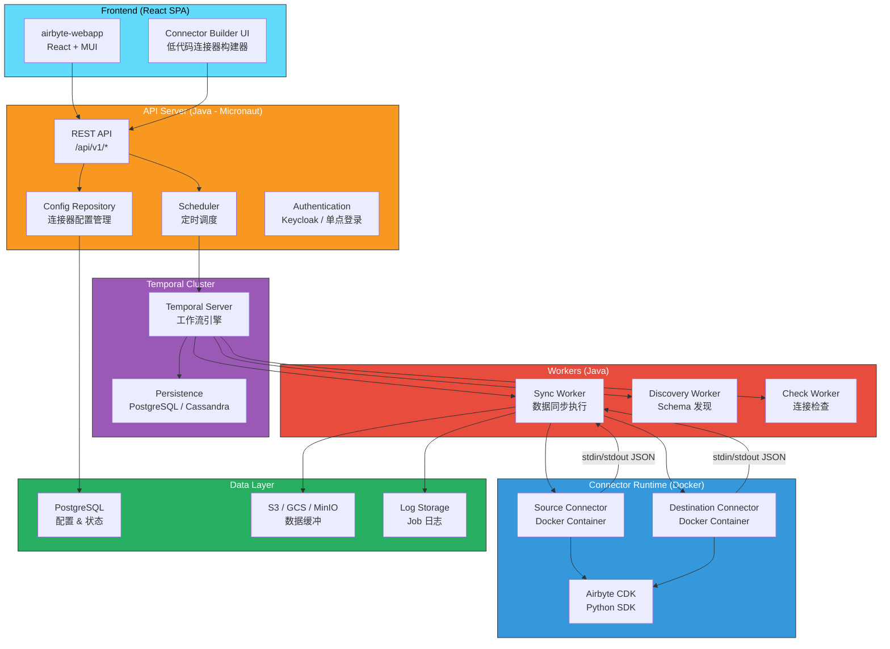
```mermaid
graph TB
    subgraph Frontend["Frontend (React SPA)"]
        WEB["airbyte-webapp<br/>React + MUI"]
        CBUI["Connector Builder UI<br/>低代码连接器构建器"]
    end

    subgraph APIServer["API Server (Java - Micronaut)"]
        REST["REST API<br/>/api/v1/*"]
        CONFIG["Config Repository<br/>连接器配置管理"]
        SCHED["Scheduler<br/>定时调度"]
        AUTH["Authentication<br/>Keycloak / 单点登录"]
    end

    subgraph TemporalCluster["Temporal Cluster"]
        TS["Temporal Server<br/>工作流引擎"]
        TDB["Persistence<br/>PostgreSQL / Cassandra"]
    end

    subgraph Workers["Workers (Java)"]
        SYNC["Sync Worker<br/>数据同步执行"]
        DISC["Discovery Worker<br/>Schema 发现"]
        CHK["Check Worker<br/>连接检查"]
    end

    subgraph ConnectorRuntime["Connector Runtime (Docker)"]
        SRC["Source Connector<br/>Docker Container"]
        DST["Destination Connector<br/>Docker Container"]
        CDK["Airbyte CDK<br/>Python SDK"]
    end

    subgraph DataLayer["Data Layer"]
        DB["PostgreSQL<br/>配置 &amp; 状态"]
        S3["S3 / GCS / MinIO<br/>数据缓冲"]
        LOGS["Log Storage<br/>Job 日志"]
    end

    WEB --> REST
    CBUI --> REST
    REST --> CONFIG
    REST --> SCHED
    SCHED --> TS
    TS --> SYNC
    TS --> DISC
    TS --> CHK
    SYNC --> SRC
    SYNC --> DST
    SRC --> CDK
    DST --> CDK
    SRC -->|"stdin/stdout JSON"| SYNC
    DST -->|"stdin/stdout JSON"| SYNC
    SYNC --> S3
    CONFIG --> DB
    TS --> TDB
    SYNC --> LOGS

    style Frontend fill:#61dafb,stroke:#333,color:#000
    style APIServer fill:#f89820,stroke:#333,color:#fff
    style TemporalCluster fill:#9b59b6,stroke:#333,color:#fff
    style Workers fill:#e74c3c,stroke:#333,color:#fff
    style ConnectorRuntime fill:#3498db,stroke:#333,color:#fff
    style DataLayer fill:#27ae60,stroke:#333,color:#fff
```

### 1.2 核心模块职责

Airbyte 的代码库分为多个核心模块，每个模块承担明确的职责边界：

| 模块 | 语言 | 职责 | 关键产出 |
|------|------|------|----------|
| `airbyte-webapp` | TypeScript/React | Web 管理界面与连接器构建器 UI | SPA 应用，连接配置、数据流映射、同步监控 |
| `airbyte-server` | Java | API Server，配置管理与调度 | REST API，连接器注册，Connection CRUD，Job 调度 |
| `airbyte-workers` | Java | Temporal Worker，执行工作流活动 | SyncWorkflow 活动，Docker 容器编排 |
| `airbyte-cdk` | Python | 连接器开发框架 | AbstractSource, Destination, AirbyteStream 抽象 |
| `airbyte-protocol` | Protocol Buffers/JSON | 平台-连接器通信协议 | AirbyteMessage, AirbyteCatalog, AirbyteStateMessage |
| `airbyte-commons` | Java/Python | 共享工具库 | JSON Schema 校验，类型转换 |
| `connector-builder-ui` | TypeScript/React | 低代码连接器可视化构建器 | 分步向导，YAML 生成，实时测试 |
| `airbyte-cdk/python` | Python | CDK 核心框架 | Low-Code YAML 引擎，Requester, Paginator, RecordExtractor |

### 1.3 部署架构

Airbyte 支持两种主要部署模式：

**Docker Compose（单机开发/小规模部署）**：

```yaml
# docker-compose.yaml 简化版
version: '3.8'
services:
  server:
    image: airbyte/server:${VERSION}
    ports:
      - "8001:8001"
    environment:
      - DATABASE_USER=airbyte
      - DATABASE_PASSWORD=password
      - DATABASE_URL=jdbc:postgresql://db:5432/airbyte
      - TEMPORAL_HOST=temporal:7233
      - CONFIG_ROOT=/data
    volumes:
      - data:/data
    depends_on:
      - db
      - temporal

  worker:
    image: airbyte/worker:${VERSION}
    environment:
      - DATABASE_USER=airbyte
      - DATABASE_PASSWORD=password
      - DATABASE_URL=jdbc:postgresql://db:5432/airbyte
      - TEMPORAL_HOST=temporal:7233
      - DOCKER_HOST=unix:///var/run/docker.sock
    volumes:
      - /var/run/docker.sock:/var/run/docker.sock
      - data:/data
    depends_on:
      - server

  webapp:
    image: airbyte/webapp:${VERSION}
    ports:
      - "8000:80"
    depends_on:
      - server

  db:
    image: postgres:14
    environment:
      - POSTGRES_USER=airbyte
      - POSTGRES_PASSWORD=password
      - POSTGRES_DB=airbyte
    volumes:
      - db:/var/lib/postgresql/data

  temporal:
    image: temporalio/auto-setup:1.20
    environment:
      - DB=postgresql
      - DB_PORT=5432
      - POSTGRES_USER=airbyte
      - POSTGRES_PWD=password
      - POSTGRES_SEEDS=db
    depends_on:
      - db

volumes:
  db:
  data:
```

**Kubernetes（生产级/弹性部署）**：

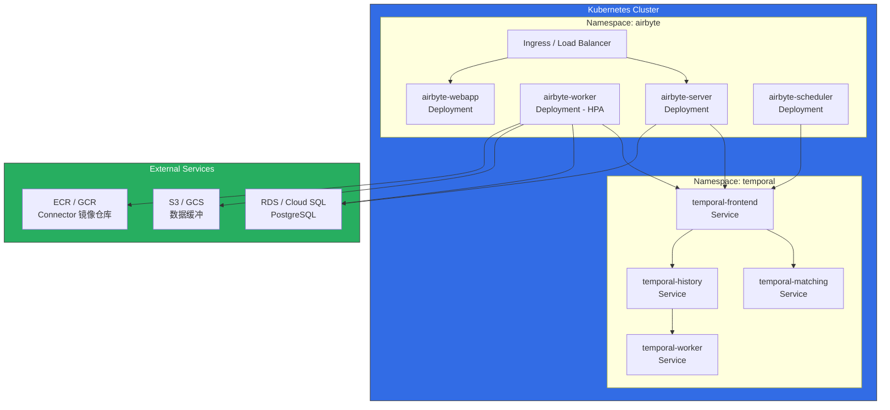
```mermaid
graph TB
    subgraph K8s["Kubernetes Cluster"]
        subgraph NS["Namespace: airbyte"]
            ING["Ingress / Load Balancer"]
            SVC["airbyte-server<br/>Deployment"]
            WRK["airbyte-worker<br/>Deployment - HPA"]
            WEB["airbyte-webapp<br/>Deployment"]
            SCHED["airbyte-scheduler<br/>Deployment"]
        end

        subgraph TEMP_NS["Namespace: temporal"]
            TFRONT["temporal-frontend<br/>Service"]
            TMATCH["temporal-matching<br/>Service"]
            THIST["temporal-history<br/>Service"]
            TWORKER["temporal-worker<br/>Service"]
        end
    end

    subgraph External["External Services"]
        RDS["RDS / Cloud SQL<br/>PostgreSQL"]
        OSS["S3 / GCS<br/>数据缓冲"]
        ECR["ECR / GCR<br/>Connector 镜像仓库"]
    end

    ING --> SVC
    ING --> WEB
    SVC --> TFRONT
    WRK --> TFRONT
    SCHED --> TFRONT
    TFRONT --> TMATCH
    TFRONT --> THIST
    THIST --> TWORKER
    SVC --> RDS
    WRK --> RDS
    WRK --> OSS
    WRK --> ECR

    style K8s fill:#326ce5,stroke:#333,color:#fff
    style External fill:#27ae60,stroke:#333,color:#fff
```

Airbyte 官方提供 Helm Chart，支持通过 `values.yaml` 灵活配置各组件的副本数、资源限制、持久化存储等参数。Worker 组件支持 HPA（Horizontal Pod Autoscaler）根据队列深度自动扩缩容。

### 1.3.1 部署架构的性能考量

Airbyte 的部署架构选择直接影响平台的性能特征和运维复杂度。以下是两种部署模式的详细对比：

**Docker Compose 模式**：
- 适用场景：开发环境、小规模生产（< 10 个 Connection）
- 资源要求：最低 8GB 内存，推荐 16GB
- 并发限制：同时运行的同步任务受 Docker 并发容器数限制（通常 5-10 个）
- 存储依赖：本地文件系统（数据卷），单点故障
- 优势：部署简单，一条命令启动，适合快速验证
- 劣势：无高可用，无弹性扩缩，数据持久化风险

**Kubernetes 模式**：
- 适用场景：生产环境，中大规模（10-1000+ 个 Connection）
- 资源要求：3+ 节点集群，每节点 16GB+ 内存
- 并发能力：Worker 支持水平扩展，通过 HPA 根据队列深度自动扩缩容
- 存储依赖：外部 PostgreSQL（RDS/Cloud SQL）+ 外部对象存储（S3/GCS）
- 优势：高可用、弹性扩展、滚动升级、资源隔离
- 劣势：运维复杂度高，需要 Kubernetes 专业知识

**关键性能参数**：

| 参数 | Docker Compose | Kubernetes | 影响 |
|------|---------------|-----------|------|
| Worker 副本数 | 1 | 3-20（HPA） | 并行同步任务数 |
| 单容器内存限制 | 无限制 | 512MB-2GB | 连接器可用内存 |
| Temporal 分区数 | 1 | 4-12 | 工作流并发度 |
| PostgreSQL 连接池 | 10 | 50-200 | API 并发能力 |
| S3 带宽 | 本地磁盘 | 云端带宽 | 数据缓冲吞吐 |

**Worker 水平扩展策略**：Kubernetes 模式下，Worker 的 HPA（Horizontal Pod Autoscaler）配置是平台性能的关键。Airbyte 推荐的 HPA 策略：
- 目标指标：Temporal Task Queue 深度
- 扩容阈值：队列深度 > 5 时开始扩容
- 缩容阈值：队列深度 = 0 持续 5 分钟后缩容
- 扩容速率：每分钟最多增加 2 个副本
- 缩容速率：每 5 分钟最多减少 1 个副本
- 最小副本数：2（保证高可用）
- 最大副本数：根据集群资源上限设定

### 1.4 Temporal 工作流编排

Temporal 是 Airbyte 平台的「编排大脑」，所有长时间运行的同步操作都通过 Temporal Workflow 管理。选择 Temporal 的核心原因：

1. **持久化执行**：Workflow 状态持久化到数据库，即使 Worker 崩溃也能恢复
2. **内置重试**：Activity 级别的可配置重试策略，无需自行实现
3. **超时控制**：Workflow 和 Activity 均可设置超时，避免任务永久挂起
4. **可观测性**：Temporal Web UI 提供完整的执行历史和状态追踪

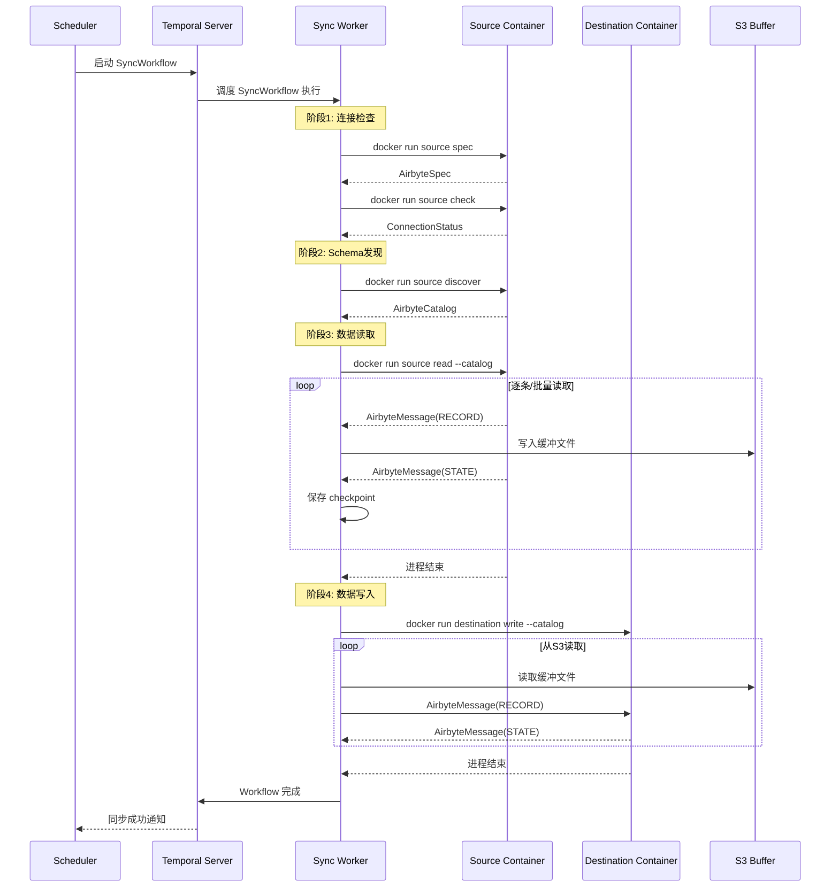
```mermaid
sequenceDiagram
    participant SCHED as Scheduler
    participant TEMPORAL as Temporal Server
    participant WORKER as Sync Worker
    participant SRC as Source Container
    participant DST as Destination Container
    participant S3 as S3 Buffer

    SCHED->>TEMPORAL: 启动 SyncWorkflow
    TEMPORAL->>WORKER: 调度 SyncWorkflow 执行

    Note over WORKER: 阶段1: 连接检查
    WORKER->>SRC: docker run source spec
    SRC-->>WORKER: AirbyteSpec
    WORKER->>SRC: docker run source check
    SRC-->>WORKER: ConnectionStatus

    Note over WORKER: 阶段2: Schema发现
    WORKER->>SRC: docker run source discover
    SRC-->>WORKER: AirbyteCatalog

    Note over WORKER: 阶段3: 数据读取
    WORKER->>SRC: docker run source read --catalog
    loop 逐条/批量读取
        SRC-->>WORKER: AirbyteMessage(RECORD)
        WORKER->>S3: 写入缓冲文件
        SRC-->>WORKER: AirbyteMessage(STATE)
        WORKER->>WORKER: 保存 checkpoint
    end
    SRC-->>WORKER: 进程结束

    Note over WORKER: 阶段4: 数据写入
    WORKER->>DST: docker run destination write --catalog
    loop 从S3读取
        WORKER->>S3: 读取缓冲文件
        WORKER->>DST: AirbyteMessage(RECORD)
        DST-->>WORKER: AirbyteMessage(STATE)
    end
    DST-->>WORKER: 进程结束

    WORKER->>TEMPORAL: Workflow 完成
    TEMPORAL-->>SCHED: 同步成功通知
```

---

### 2.3 Docker 容器化执行模型

Airbyte 最核心的架构决策是「**连接器即 Docker 容器**」。每个连接器被打包为独立的 Docker 镜像，平台通过 `docker run` 执行连接器，通过 stdin/stdout 传递 JSON 消息。这种设计带来了极强的隔离性和可扩展性。

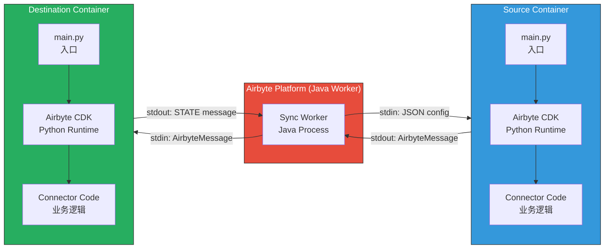
```mermaid
graph LR
    subgraph Platform["Airbyte Platform (Java Worker)"]
        W["Sync Worker<br/>Java Process"]
    end

    subgraph Container1["Source Container"]
        S_MAIN["main.py<br/>入口"]
        S_CDK["Airbyte CDK<br/>Python Runtime"]
        S_CODE["Connector Code<br/>业务逻辑"]
        S_MAIN --> S_CDK
        S_CDK --> S_CODE
    end

    subgraph Container2["Destination Container"]
        D_MAIN["main.py<br/>入口"]
        D_CDK["Airbyte CDK<br/>Python Runtime"]
        D_CODE["Connector Code<br/>业务逻辑"]
        D_MAIN --> D_CDK
        D_CDK --> D_CODE
    end

    W -->|"stdin: JSON config"| Container1
    Container1 -->|"stdout: AirbyteMessage"| W
    W -->|"stdin: AirbyteMessage"| Container2
    Container2 -->|"stdout: STATE message"| W

    style Platform fill:#e74c3c,stroke:#333,color:#fff
    style Container1 fill:#3498db,stroke:#333,color:#fff
    style Container2 fill:#27ae60,stroke:#333,color:#fff
```

**容器执行命令**：

```bash
# 1. 获取 Spec
docker run --rm airbyte/source-postgres:0.50.0 spec

# 2. 检查连接
echo '{"host":"db","port":5432,"database":"mydb","username":"user","password":"pass"}' \
  | docker run --rm -i airbyte/source-postgres:0.50.0 check --config /dev/stdin

# 3. 发现 Schema
echo '{"host":"db","port":5432,...}' \
  | docker run --rm -i airbyte/source-postgres:0.50.0 discover --config /dev/stdin

# 4. 读取数据
echo '{"host":"db",...}' > config.json
echo '{"streams":[...]}' > catalog.json
echo '{"data":{...}}' > state.json  # 可选，增量模式
docker run --rm -i \
  -v $(pwd)/config.json:/data/config.json \
  -v $(pwd)/catalog.json:/data/catalog.json \
  -v $(pwd)/state.json:/data/state.json \
  airbyte/source-postgres:0.50.0 \
  read --config /data/config.json --catalog /data/catalog.json --state /data/state.json
```

**容器内入口（main.py）**：

```python
#!/usr/bin/env python3
import sys
from source_postgres import SourcePostgres
from airbyte_cdk import entrypoint

# CDK 提供统一的入口函数，解析命令行参数并调用对应方法
# 所有输出通过 stdout 以 JSON 格式输出
source = SourcePostgres()
entrypoint.launch(source, sys.argv[1:])
```

**Dockerfile 示例**：

```dockerfile
FROM airbyte/python-connector-base:1.1.0

# 安装连接器依赖
COPY setup.py ./setup.py
COPY main.py ./main.py
COPY source_postgres ./source_postgres/
RUN pip install .

# 声明入口
ENV AIRBYTE_ENTRYPOINT "python /airbyte/integration_code/main.py"
ENTRYPOINT ["python", "/airbyte/integration_code/main.py"]

# 声明使用的协议版本
LABEL io.airbyte.name=airbyte/source-postgres
LABEL io.airbyte.version=0.50.0
```
### 2.4 Connector 生命周期

每个连接器遵循固定的生命周期，由平台驱动执行：

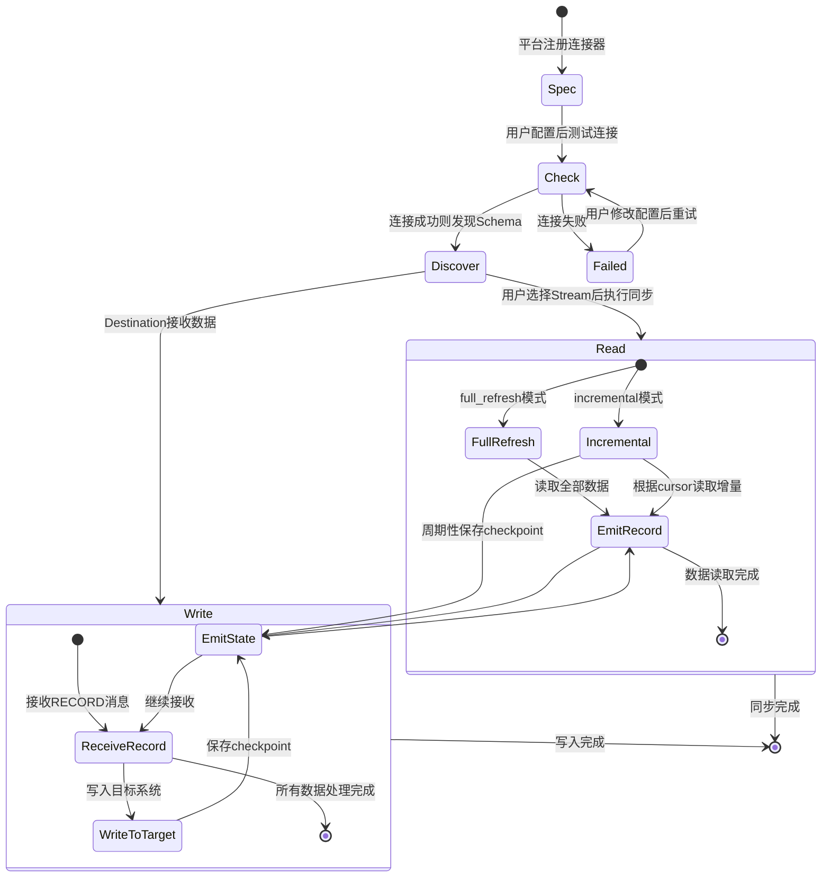
```mermaid
stateDiagram-v2
    [*] --> Spec: 平台注册连接器
    Spec --> Check: 用户配置后测试连接
    Check --> Discover: 连接成功则发现Schema
    Check --> Failed: 连接失败
    Failed --> Check: 用户修改配置后重试
    Discover --> Read: 用户选择Stream后执行同步
    Discover --> Write: Destination接收数据

    state Read {
        [*] --> FullRefresh: full_refresh模式
        [*] --> Incremental: incremental模式
        FullRefresh --> EmitRecord: 读取全部数据
        Incremental --> EmitRecord: 根据cursor读取增量
        Incremental --> EmitState: 周期性保存checkpoint
        EmitRecord --> EmitState
        EmitState --> EmitRecord
        EmitRecord --> [*]: 数据读取完成
    }

    state Write {
        [*] --> ReceiveRecord: 接收RECORD消息
        ReceiveRecord --> WriteToTarget: 写入目标系统
        WriteToTarget --> EmitState: 保存checkpoint
        EmitState --> ReceiveRecord: 继续接收
        ReceiveRecord --> [*]: 所有数据处理完成
    }

    Read --> [*]: 同步完成
    Write --> [*]: 写入完成
```

**生命周期各阶段详解**：

| 阶段 | 命令 | 输入 | 输出 | 超时 | 说明 |
|------|------|------|------|------|------|
| `spec` | `spec` | 无 | `AirbyteSpec` | 5min | 返回配置 Schema，通常在连接器注册时调用一次并缓存 |
| `check` | `check --config` | 连接配置 JSON | `ConnectionStatus` | 30s | 验证连接，只做基本连通性检查 |
| `discover` | `discover --config` | 连接配置 JSON | `AirbyteCatalog` | 10min | 发现所有可用 Stream 和 Schema |
| `read` | `read --config --catalog [--state]` | 配置 + Catalog + State | 流式 `AirbyteMessage` | 不限 | 读取数据，逐条输出 RECORD 和 STATE |
| `write` | `write --config --catalog` | 配置 + Catalog + 流式输入 | 流式 `AirbyteMessage` | 不限 | 写入数据，周期性输出 STATE |
### 2.5 AirbyteCatalog 数据模型

AirbyteCatalog 是连接器与平台之间关于「数据结构」的契约，定义了 Source 暴露哪些数据流、每个数据流的 Schema 和同步能力：

```typescript
/**
 * AirbyteCatalog - Source 的完整数据目录
 */
interface AirbyteCatalog {
  /** 数据流列表 */
  streams: AirbyteStream[];
}

/**
 * AirbyteStream - 单个数据流的元数据
 */
interface AirbyteStream {
  /** 流名称，如 "users", "orders" */
  name: string;

  /** 数据的 JSON Schema，描述每条记录的字段和类型 */
  json_schema: JSONSchema7;

  /** 支持的源端同步模式 */
  supported_sync_modes: SyncMode[];

  /** 是否由源定义 cursor（增量游标字段） */
  source_defined_cursor?: boolean;

  /** 默认的 cursor 字段路径，如 ["updated_at"] */
  default_cursor_field?: string[];

  /** 源定义的主键路径，如 [["id"]] 或 [["org_id", "user_id"]] */
  source_defined_primary_key?: string[][];

  /** 命名空间（如数据库的 schema 名） */
  namespace?: string;

  /** 可用的 cursor 字段列表（用户可选择） */
  available_cursors?: string[];
}

/**
 * SyncMode - 源端同步模式
 */
enum SyncMode {
  /** 全量刷新：每次读取所有数据 */
  FULL_REFRESH = "full_refresh",
  /** 增量同步：只读取自上次同步后的变更 */
  INCREMENTAL = "incremental",
}

/**
 * ConfiguredAirbyteStream - 用户选择同步的流及配置
 * 这是 AirbyteCatalog 的"用户视图"，只包含用户选择的流
 */
interface ConfiguredAirbyteStream {
  stream: AirbyteStream;
  /** 用户选择的源端同步模式 */
  sync_mode: SyncMode;
  /** 用户选择的目标端同步模式 */
  destination_sync_mode: DestinationSyncMode;
  /** 用户指定的 cursor 字段（增量模式） */
  cursor_field?: string[];
  /** 用户指定的主键（append_dedup 模式） */
  primary_key?: string[][];
}
```

### 2.5.1 AirbyteCatalog 设计哲学深度分析

AirbyteCatalog 的设计体现了几个重要的架构决策，这些决策直接影响了平台的可扩展性和用户体验：

**1. 双层 Catalog 模型**：Airbyte 将 Catalog 分为「原始 Catalog」（`AirbyteCatalog`，由 discover 返回）和「配置 Catalog」（`ConfiguredAirbyteCatalog`，由用户选择后生成）。这种分离确保了 Source 的 discover 逻辑不受用户选择的影响，每次 discover 都返回完整的可用数据流集合，而用户的选择独立维护在 Connection 层面。

**2. 主键的多维数组设计**：`source_defined_primary_key` 使用 `string[][]` 类型而非简单的 `string[]`，这是为了支持复合主键和联合主键。外层数组表示不同的主键组合（某些表可能有多组唯一键），内层数组表示单组主键的字段路径。例如 `[["org_id", "user_id"]]` 表示联合主键，`[["id"], ["email"]]` 表示有两组候选键。

**3. Cursor 字段的灵活性**：`source_defined_cursor` 和 `default_cursor_field` 的组合提供了灵活的增量策略。当 `source_defined_cursor=true` 时，Source 强制指定 cursor 字段（如 CDC 模式下使用 LSN），用户不可更改；当 `source_defined_cursor=false` 时，用户可以从 `available_cursors` 中自由选择 cursor 字段。

**4. Namespace 的分层映射**：`namespace` 字段允许 Source 报告数据的逻辑分组（如 PostgreSQL 的 schema 名、MongoDB 的 database 名），Destination 可以根据 `namespaceDefinition` 策略将 namespace 映射为目标系统的不同层级（如目标数据库的 schema 名或表名前缀）。

### 2.6 AirbyteMessage 类型

AirbyteMessage 是平台与连接器之间通信的统一消息格式，所有数据交换都通过此消息类型进行：

```typescript
/**
 * AirbyteMessage - 平台与连接器之间的统一消息格式
 * 连接器通过 stdout 每行输出一个 AirbyteMessage JSON
 */
interface AirbyteMessage {
  /** 消息类型 */
  type: AirbyteMessageType;
  /** 日志消息 */
  log?: AirbyteLogMessage;
  /** 连接器 Spec */
  spec?: AirbyteSpec;
  /** 连接状态 */
  connectionStatus?: AirbyteConnectionStatus;
  /** 数据目录 */
  catalog?: AirbyteCatalog;
  /** 数据记录 */
  record?: AirbyteRecordMessage;
  /** 状态检查点 */
  state?: AirbyteStateMessage;
  /** 追踪信息 */
  trace?: AirbyteTraceMessage;
}

enum AirbyteMessageType {
  RECORD = 'RECORD',
  STATE = 'STATE',
  LOG = 'LOG',
  SPEC = 'SPEC',
  CONNECTION_STATUS = 'CONNECTION_STATUS',
  CATALOG = 'CATALOG',
  TRACE = 'TRACE',
}

/**
 * AirbyteRecordMessage - 单条数据记录
 */
interface AirbyteRecordMessage {
  /** 所属 Stream 名称 */
  stream: string;
  /** 记录数据（符合 Stream 的 json_schema） */
  data: Record<string, any>;
  /** 记录发出时间（epoch 毫秒） */
  emitted_at: number;
  /** 命名空间 */
  namespace?: string;
  /** 变更类型（CDC 场景） */
  change_data_capture?: ChangeDataCapture;
}

/**
 * AirbyteStateMessage - 增量同步的检查点
 */
interface AirbyteStateMessage {
  /** 状态数据 */
  data: Record<string, any> | AirbyteStateData[];
  /** 状态类型 */
  type?: StateType;
}

enum StateType {
  /** 全局状态（所有 Stream 共享一个状态） */
  GLOBAL = 'GLOBAL',
  /** 按 Stream 独立状态 */
  STREAM = 'STREAM',
  /** 遗留状态格式 */
  LEGACY = 'LEGACY',
}
```

**消息流示例**：

```json
{"type": "LOG", "log": {"level": "INFO", "message": "Starting sync..."}}
{"type": "RECORD", "record": {"stream": "users", "data": {"id": 1, "name": "Alice", "updated_at": 1700000000}, "emitted_at": 1700000001000}}
{"type": "RECORD", "record": {"stream": "users", "data": {"id": 2, "name": "Bob", "updated_at": 1700000001}, "emitted_at": 1700000001001}}
{"type": "STATE", "state": {"type": "STREAM", "stream": {"stream_descriptor": {"name": "users"}, "state": {"cursor": "1700000001"}}}}
{"type": "LOG", "log": {"level": "INFO", "message": "Sync completed"}}
```
### 2.7 Connector Development Kit (CDK)

Airbyte CDK 是一个 Python 框架，旨在大幅降低连接器开发成本。它提供了抽象基类、通用组件和工具函数，让开发者只需关注业务逻辑（API 调用、数据解析），无需处理协议解析、消息格式化等底层细节。

**CDK 核心组件层次结构**：

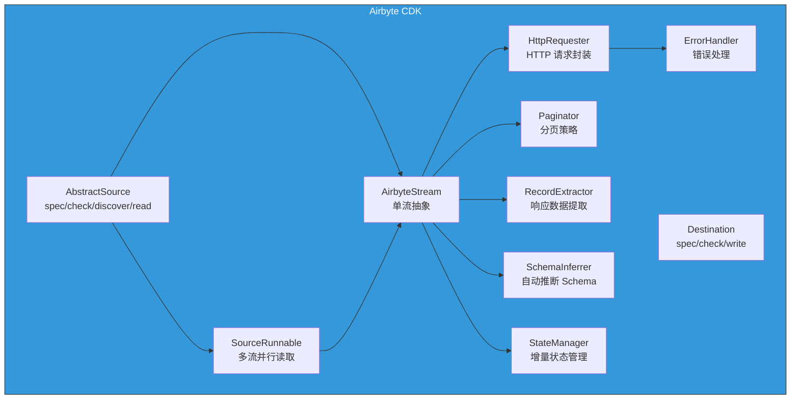
```mermaid
graph TB
    subgraph CDK["Airbyte CDK"]
        AS["AbstractSource<br/>spec/check/discover/read"]
        AD["Destination<br/>spec/check/write"]
        STRM["AirbyteStream<br/>单流抽象"]
        SR["SourceRunnable<br/>多流并行读取"]
        HTTP["HttpRequester<br/>HTTP 请求封装"]
        PAG["Paginator<br/>分页策略"]
        REC["RecordExtractor<br/>响应数据提取"]
        SCH["SchemaInferrer<br/>自动推断 Schema"]
        STATE["StateManager<br/>增量状态管理"]
        ERR["ErrorHandler<br/>错误处理"]
    end

    AS --> STRM
    AS --> SR
    SR --> STRM
    STRM --> HTTP
    STRM --> PAG
    STRM --> REC
    STRM --> SCH
    STRM --> STATE
    HTTP --> ERR

    style CDK fill:#3498db,stroke:#333,color:#fff
```

**CDK 使用示例（全代码连接器）**：

```python
# source_postgres/__init__.py
from airbyte_cdk.sources.abstract_source import AbstractSource
from airbyte_cdk.models import AirbyteCatalog, AirbyteStream, AirbyteMessage
from source_postgres.streams import Users, Orders, Products


class SourcePostgres(AbstractSource):
    """PostgreSQL Source 连接器."""

    def spec(self, logger) -> ConnectorSpecification:
        # 返回 Spec Schema（通常从 YAML 自动生成）
        return ConnectorSpecification(
            connectionSpecification={
                "type": "object",
                "required": ["host", "port", "database", "username", "password"],
                "properties": {...}
            },
            documentationUrl="https://docs.airbyte.com/...",
            supportsIncremental=True,
        )

    def check(self, logger, config) -> AirbyteConnectionStatus:
        try:
            conn = psycopg2.connect(**config)
            conn.close()
            return AirbyteConnectionStatus(status=Status.SUCCEEDED)
        except Exception as e:
            return AirbyteConnectionStatus(
                status=Status.FAILED,
                message=f"Connection failed: {e}"
            )

    def discover(self, logger, config) -> AirbyteCatalog:
        streams = [s(config) for s in [Users, Orders, Products]]
        return AirbyteCatalog(streams=[s.as_airbyte_stream() for s in streams])

    def streams(self, config) -> List[Stream]:
        return [Users(config), Orders(config), Products(config)]
```
### 2.8 低代码连接器（Low-Code Connector）

Airbyte CDK 的杀手级特性是 **Low-Code Connector**，允许开发者仅通过 YAML 声明式定义即可创建连接器，无需编写 Python 代码。这对于基于 REST API 的连接器特别有效，开发时间从数天缩短到数小时。

**manifest.yaml 示例**：

```yaml
# source_stripe/manifest.yaml
version: 0.50.0

# 连接器元数据
type: source
definitions:
  # HTTP 请求器定义
  requester:
    class: airbyte_cdk.sources.http_requests.HttpRequester
    url_base: "https://api.stripe.com/v1/"
    http_method: GET
    authenticator:
      class: airbyte_cdk.sources.auth.BearerAuthenticator
      token: "{{ config['api_key'] }}"
    error_handler:
      response_filters:
        - http_codes: [429]
          action: RETRY
          backoff_time: 5

  # 分页策略
  paginator:
    class: airbyte_cdk.sources.paginator.OffsetPaginator
    page_size: 100
    offset_param: "starting_after"
    next_token_from_response: "{{ response.data[-1].id }}"

  # 数据提取器
  extractor:
    class: airbyte_cdk.sources.extractors.RecordExtractor
    field_pointer: ["data"]

  # 增量状态管理
  state:
    class: airbyte_cdk.sources.state.CursorState
    cursor_field: "created"
    cursor_granularity: "second"

# 数据流定义
streams:
  - name: customers
    primary_key: "id"
    retriever:
      requester:
        path: "customers"
      paginator: "{{ definitions.paginator }}"
      extractor: "{{ definitions.extractor }}"
    schema_loader:
      class: airbyte_cdk.sources.schema.JsonSchemaLoader
      file_path: "schemas/customers.json"

  - name: charges
    primary_key: "id"
    retriever:
      requester:
        path: "charges"
      paginator: "{{ definitions.paginator }}"
      extractor: "{{ definitions.extractor }}"
    schema_loader:
      class: airbyte_cdk.sources.schema.JsonSchemaLoader
      file_path: "schemas/charges.json"
```

**Low-Code 连接器架构**：

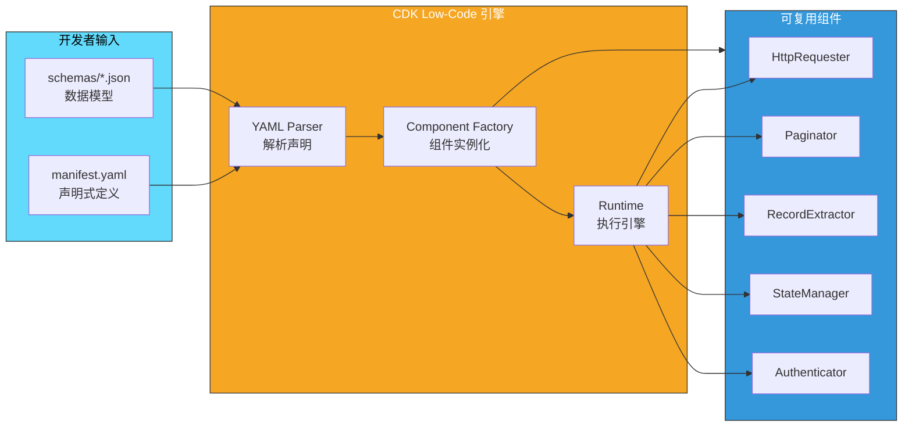
```mermaid
graph LR
    subgraph UserInput["开发者输入"]
        YAML["manifest.yaml<br/>声明式定义"]
        SCHEMA["schemas/*.json<br/>数据模型"]
    end

    subgraph CDKEngine["CDK Low-Code 引擎"]
        PARSER["YAML Parser<br/>解析声明"]
        FACTORY["Component Factory<br/>组件实例化"]
        RUNTIME["Runtime<br/>执行引擎"]
    end

    subgraph Components["可复用组件"]
        R["HttpRequester"]
        P["Paginator"]
        E["RecordExtractor"]
        S["StateManager"]
        A["Authenticator"]
    end

    YAML --> PARSER
    SCHEMA --> PARSER
    PARSER --> FACTORY
    FACTORY --> Components
    FACTORY --> RUNTIME
    RUNTIME --> R
    RUNTIME --> P
    RUNTIME --> E
    RUNTIME --> S
    RUNTIME --> A

    style UserInput fill:#61dafb,stroke:#333,color:#000
    style CDKEngine fill:#f5a623,stroke:#333,color:#fff
    style Components fill:#3498db,stroke:#333,color:#fff
```
### 2.9 Connector Builder UI

Connector Builder UI 是 Airbyte 提供的可视化连接器构建器，它让非开发者也能通过 Web 界面创建连接器。其本质是 Low-Code YAML 的可视化编辑器，将 YAML 定义转化为分步向导式交互。

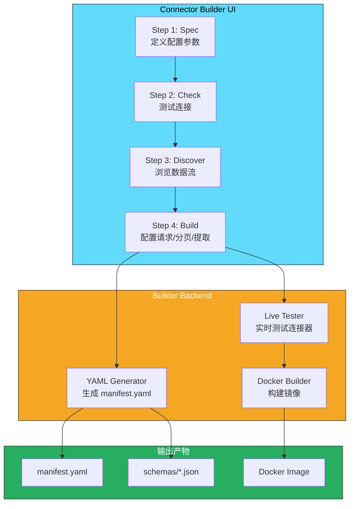
```mermaid
graph TB
    subgraph CBUI["Connector Builder UI"]
        STEP1["Step 1: Spec<br/>定义配置参数"]
        STEP2["Step 2: Check<br/>测试连接"]
        STEP3["Step 3: Discover<br/>浏览数据流"]
        STEP4["Step 4: Build<br/>配置请求/分页/提取"]
    end

    subgraph Backend["Builder Backend"]
        GEN["YAML Generator<br/>生成 manifest.yaml"]
        TEST["Live Tester<br/>实时测试连接器"]
        BUILD["Docker Builder<br/>构建镜像"]
    end

    subgraph Output["输出产物"]
        YAMLOUT["manifest.yaml"]
        SCHEMAOUT["schemas/*.json"]
        DOCKEROUT["Docker Image"]
    end

    STEP1 --> STEP2
    STEP2 --> STEP3
    STEP3 --> STEP4
    STEP4 --> GEN
    STEP4 --> TEST
    GEN --> YAMLOUT
    GEN --> SCHEMAOUT
    TEST --> BUILD
    BUILD --> DOCKEROUT

    style CBUI fill:#61dafb,stroke:#333,color:#000
    style Backend fill:#f5a623,stroke:#333,color:#fff
    style Output fill:#27ae60,stroke:#333,color:#fff
```

**Builder UI 的关键交互流程**：

1. **Spec 步骤**：用户定义连接器需要的配置参数（如 API Key、组织 ID），Builder UI 根据用户输入动态生成 JSON Schema
2. **Check 步骤**：用户输入测试配置，Builder 实时运行连接器的 check 方法，显示连接状态
3. **Discover 步骤**：Builder 运行 discover 方法，展示可用的数据流列表，用户选择要暴露的流
4. **Build 步骤**：用户为每个流配置 HTTP 请求路径、分页策略、数据提取规则，Builder 实时展示数据预览

**Builder UI 的技术实现要点**：

- 前端基于 React，使用 Monaco Editor 提供 YAML 编辑能力
- 后端通过 `/api/v1/connectors/builder/*` API 端点提供支撑
- 实时测试通过临时启动 Docker 容器执行连接器实现
- 生成的 YAML 可以直接下载，也可以发布为自定义连接器

---
## 三、同步任务（Connection）数据模型

### 3.1 Connection 定义

Connection 是 Airbyte 平台的核心数据模型，代表一个数据同步管道的完整配置。一个 Connection 将一个 Source、一个 Destination 和一组数据流配置绑定在一起，并附带调度策略和运行状态。

```typescript
/**
 * Connection - 数据同步连接
 */
interface Connection {
  /** 连接 ID */
  connectionId: string;
  /** 源连接器配置引用 */
  sourceId: string;
  /** 目标连接器配置引用 */
  destinationId: string;
  /** 数据目录（用户选择的流及同步模式） */
  catalog: ConfiguredAirbyteCatalog;
  /** 调度配置 */
  schedule: ConnectionSchedule;
  /** 连接状态 */
  status: ConnectionStatus;
  /** 命名空间定义策略 */
  namespaceDefinition: NamespaceDefinition;
  /** 命名空间格式 */
  namespaceFormat?: string;
  /** 是否启用变更检测（CDC） */
  withCAI: boolean;
  /** 操作类型 */
  operationIds?: string[];
  /** 标签 */
  tags?: Tag[];
}

enum ConnectionStatus {
  ACTIVE = 'active',
  INACTIVE = 'inactive',
  DEPRECATED = 'deprecated',
}

interface ConnectionSchedule {
  /** CRON 表达式 */
  cron?: CronSchedule;
  /** 基础调度间隔 */
  basicSchedule?: BasicSchedule;
}
```
### 3.2 Sync Job 状态机

每个同步任务执行被称为一个 Sync Job，其状态遵循严格的状态机模型：

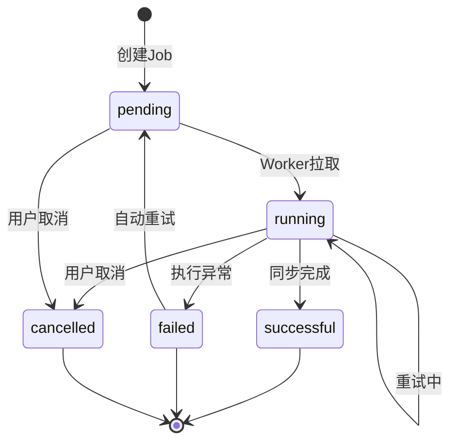
```mermaid
stateDiagram-v2
    [*] --> pending: 创建Job
    pending --> running: Worker拉取
    running --> successful: 同步完成
    running --> failed: 执行异常
    running --> cancelled: 用户取消
    pending --> cancelled: 用户取消
    running --> running: 重试中
    failed --> pending: 自动重试
    successful --> [*]
    failed --> [*]
    cancelled --> [*]
```

**Job 状态转换详细说明**：

| 当前状态 | 目标状态 | 触发条件 | 备注 |
|---------|---------|---------|------|
| `pending` | `running` | Temporal Worker 拉取任务 | Job 开始执行 |
| `running` | `successful` | Source read + Destination write 均完成 | 记录同步行数、耗时 |
| `running` | `failed` | 连接器异常、超时、资源不足 | 记录错误信息，可能触发重试 |
| `running` | `cancelled` | 用户手动取消 | Temporal 取消 Workflow |
| `failed` | `pending` | 重试策略允许且重试次数未耗尽 | 指数退避重试 |

### 3.3 数据流（Stream）配置

用户在创建 Connection 时，需要配置每个数据流的同步模式。Airbyte 提供了两种源端同步模式和三种目标端同步模式的组合：

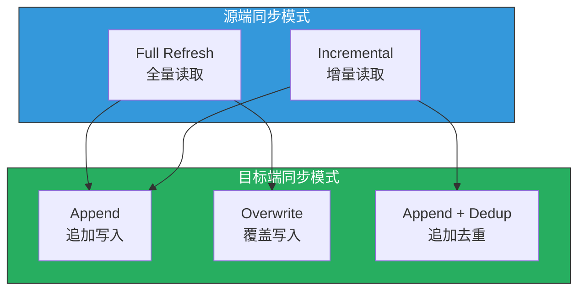
```mermaid
graph TB
    subgraph SourceSyncMode["源端同步模式"]
        FR["Full Refresh<br/>全量读取"]
        INC["Incremental<br/>增量读取"]
    end

    subgraph DestSyncMode["目标端同步模式"]
        APP["Append<br/>追加写入"]
        OW["Overwrite<br/>覆盖写入"]
        AD["Append + Dedup<br/>追加去重"]
    end

    FR --> APP
    FR --> OW
    INC --> APP
    INC --> AD

    style SourceSyncMode fill:#3498db,stroke:#333,color:#fff
    style DestSyncMode fill:#27ae60,stroke:#333,color:#fff
```

**同步模式组合详解**：

| 源端模式 | 目标端模式 | 行为描述 | 适用场景 |
|---------|-----------|---------|---------|
| Full Refresh | Append | 每次全量读取，追加到目标表 | 小表，无需去重 |
| Full Refresh | Overwrite | 每次全量读取，覆盖目标表 | 小表，需要精确数据 |
| Incremental | Append | 只读增量数据，追加到目标表 | 日志类数据，天然有序 |
| Incremental | Append + Dedup | 只读增量数据，追加后按主键去重 | 业务数据，需要最新状态 |

### 3.4 增量同步 vs 全量同步

增量同步是 Airbyte 的核心能力之一，其实现依赖于 **Cursor（游标）** 和 **State（状态）** 两个概念：

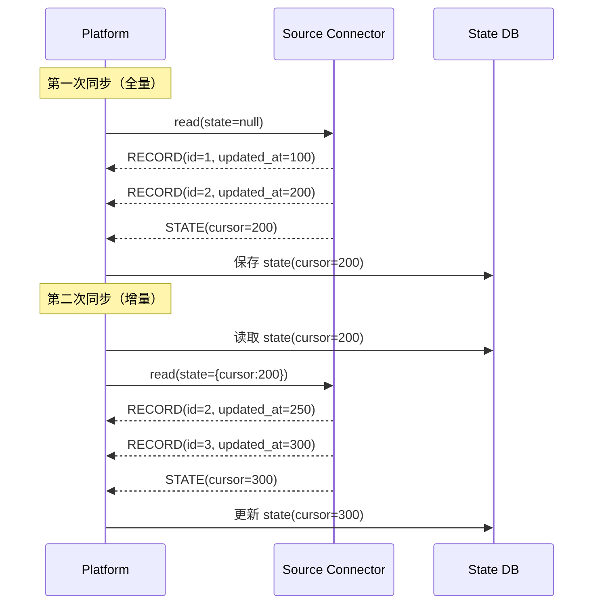
```mermaid
sequenceDiagram
    participant PLAT as Platform
    participant SRC as Source Connector
    participant DB as State DB

    Note over PLAT: 第一次同步（全量）
    PLAT->>SRC: read(state=null)
    SRC-->>PLAT: RECORD(id=1, updated_at=100)
    SRC-->>PLAT: RECORD(id=2, updated_at=200)
    SRC-->>PLAT: STATE(cursor=200)
    PLAT->>DB: 保存 state(cursor=200)

    Note over PLAT: 第二次同步（增量）
    PLAT->>DB: 读取 state(cursor=200)
    PLAT->>SRC: read(state={cursor:200})
    SRC-->>PLAT: RECORD(id=2, updated_at=250)
    SRC-->>PLAT: RECORD(id=3, updated_at=300)
    SRC-->>PLAT: STATE(cursor=300)
    PLAT->>DB: 更新 state(cursor=300)
```

### 3.5 CDC（Change Data Capture）变更检测

对于数据库类 Source，Airbyte 支持 CDC 模式实现真正的增量变更捕获。以 PostgreSQL 为例，CDC 基于 Logical Replication 实现：

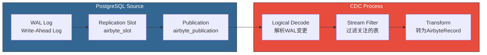
```mermaid
graph LR
    subgraph PG["PostgreSQL Source"]
        WAL["WAL Log<br/>Write-Ahead Log"]
        SLOT["Replication Slot<br/>airbyte_slot"]
        PUB["Publication<br/>airbyte_publication"]
    end

    subgraph CDC["CDC Process"]
        DECODE["Logical Decode<br/>解析WAL变更"]
        FILTER["Stream Filter<br/>过滤关注的表"]
        TRANSFORM["Transform<br/>转为AirbyteRecord"]
    end

    WAL --> SLOT
    SLOT --> PUB
    PUB --> DECODE
    DECODE --> FILTER
    FILTER --> TRANSFORM

    style PG fill:#336791,stroke:#333,color:#fff
    style CDC fill:#e74c3c,stroke:#333,color:#fff
```

CDC 的优势在于能够捕获 DELETE 操作和行级变更，而基于 cursor 的增量同步只能发现新增和修改的记录。但 CDC 也有代价：需要在源数据库配置 Replication Slot，且 WAL 日志不能过早回收。

### 3.6 Connection 生命周期完整流程

一个 Connection 从创建到运行需要经历多个阶段，每个阶段都涉及不同的连接器操作和用户交互。以下是完整的生命周期流程：

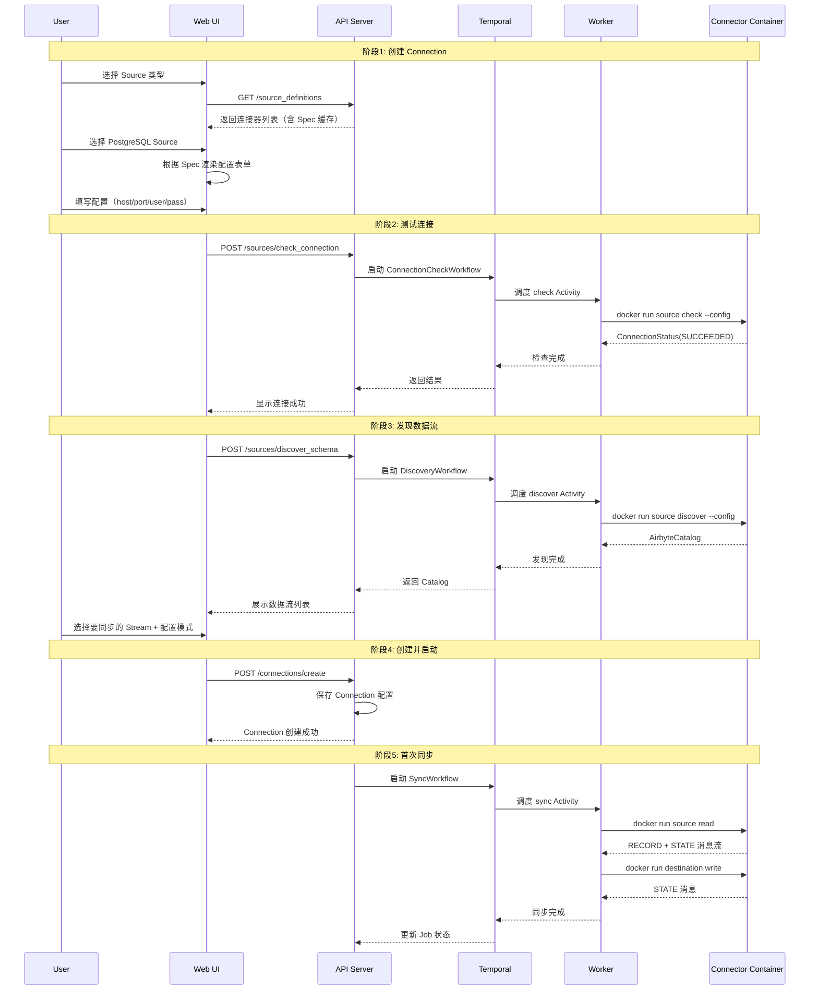
```mermaid
sequenceDiagram
    participant USER as User
    participant UI as Web UI
    participant API as API Server
    participant TEMPORAL as Temporal
    participant WORKER as Worker
    participant CONN as Connector Container

    Note over USER,CONN: 阶段1: 创建 Connection
    USER->>UI: 选择 Source 类型
    UI->>API: GET /source_definitions
    API-->>UI: 返回连接器列表（含 Spec 缓存）
    USER->>UI: 选择 PostgreSQL Source
    UI->>UI: 根据 Spec 渲染配置表单
    USER->>UI: 填写配置（host/port/user/pass）
    
    Note over USER,CONN: 阶段2: 测试连接
    UI->>API: POST /sources/check_connection
    API->>TEMPORAL: 启动 ConnectionCheckWorkflow
    TEMPORAL->>WORKER: 调度 check Activity
    WORKER->>CONN: docker run source check --config
    CONN-->>WORKER: ConnectionStatus(SUCCEEDED)
    WORKER-->>TEMPORAL: 检查完成
    TEMPORAL-->>API: 返回结果
    API-->>UI: 显示连接成功
    
    Note over USER,CONN: 阶段3: 发现数据流
    UI->>API: POST /sources/discover_schema
    API->>TEMPORAL: 启动 DiscoveryWorkflow
    TEMPORAL->>WORKER: 调度 discover Activity
    WORKER->>CONN: docker run source discover --config
    CONN-->>WORKER: AirbyteCatalog
    WORKER-->>TEMPORAL: 发现完成
    TEMPORAL-->>API: 返回 Catalog
    API-->>UI: 展示数据流列表
    USER->>UI: 选择要同步的 Stream + 配置模式
    
    Note over USER,CONN: 阶段4: 创建并启动
    UI->>API: POST /connections/create
    API->>API: 保存 Connection 配置
    API-->>UI: Connection 创建成功
    
    Note over USER,CONN: 阶段5: 首次同步
    API->>TEMPORAL: 启动 SyncWorkflow
    TEMPORAL->>WORKER: 调度 sync Activity
    WORKER->>CONN: docker run source read
    CONN-->>WORKER: RECORD + STATE 消息流
    WORKER->>CONN: docker run destination write
    CONN-->>WORKER: STATE 消息
    WORKER-->>TEMPORAL: 同步完成
    TEMPORAL-->>API: 更新 Job 状态
```

### 3.7 同步模式的组合策略详解

Airbyte 的 6 种同步模式组合（2 种源端 x 3 种目标端）各自有不同的适用场景和性能特征。下面对每种组合进行深入分析：

**Full Refresh + Append**：
- 行为：每次同步读取 Source 的全部数据，追加到 Destination 表末尾
- 优点：实现简单，Source 不需要支持增量
- 缺点：Destination 表会累积重复数据，存储成本线性增长
- 适用：小表（< 10万行）、维度表、无主键的日志数据
- 性能：数据量小则快，数据量大则慢（每次全量读取）

**Full Refresh + Overwrite**：
- 行为：每次同步读取全部数据，删除 Destination 旧数据后写入
- 优点：数据精确，无重复
- 缺点：同步期间 Destination 不可用（先删后写），大规模数据耗时长
- 适用：小表、需要精确数据的场景、数据量不大但变更频繁
- 性能：与数据量成正比，写放大（每次全量覆盖）

**Incremental + Append**：
- 行为：只读取自上次同步后的增量数据，追加到 Destination
- 优点：高效，只传输变更数据
- 缺点：需要 Source 支持 cursor，Destination 会有历史快照
- 适用：日志类数据（天然有序、只增不改）、事件流
- 性能：与增量数据量成正比，远优于全量

**Incremental + Append + Dedup**：
- 行为：读取增量数据追加，然后按主键去重（保留最新记录）
- 优点：高效且数据精确，是最佳实践组合
- 缺点：需要主键，去重操作消耗 Destination 资源
- 适用：业务数据（用户、订单等），需要最新状态
- 性能：增量读取 + 去重开销，整体仍远优于全量

### 3.8 状态管理的三种模式

Airbyte 的增量状态管理经历了多次演进，目前支持三种 State 类型，每种类型有不同的适用场景：

**LEGACY 模式**（已废弃）：
```json
{
  "state": {
    "data": {
      "users": { "cursor": "2024-01-01T00:00:00Z" },
      "orders": { "cursor": "2024-01-01T00:00:00Z" }
    }
  }
}
```
所有 Stream 的状态存储在一个 JSON 对象中，用 Stream 名称作为 key。这种模式简单但不够灵活，无法支持子状态分割。

**STREAM 模式**（推荐）：
```json
{
  "state": {
    "type": "STREAM",
    "stream": {
      "stream_descriptor": { "name": "users", "namespace": "public" },
      "state": {
        "cursor": "2024-01-01T00:00:00Z",
        "cursor_record_count": 1500
      }
    }
  }
}
```
每个 Stream 维护独立的状态，支持更精细的断点续传。如果某个 Stream 同步失败，只需重试该 Stream，其他 Stream 的状态不受影响。

**GLOBAL 模式**：
```json
{
  "state": {
    "type": "GLOBAL",
    "global": {
      "shared_state": { "cursor": "2024-01-01T00:00:00Z" },
      "stream_states": [
        {
          "stream_descriptor": { "name": "users" },
          "state": { "cursor": "2024-01-01T00:00:00Z" }
        }
      ]
    }
  }
}
```
全局状态与 Stream 状态共存，适用于 CDC 场景：全局状态记录 LSN（Log Sequence Number），Stream 状态记录每个流的处理进度。只有当全局 LSN 推进时，才认为所有 Stream 的数据已一致。


---
## 四、前端实现

### 4.1 前端技术栈

Airbyte 前端采用 React + TypeScript 技术栈，UI 组件库使用 Material-UI (MUI)，状态管理使用 React Context + Hooks，路由使用 React Router v6。整体架构为经典的 SPA（单页应用），通过 REST API 与后端通信。

| 技术 | 版本 | 用途 |
|------|------|------|
| React | 18.x | UI 框架 |
| TypeScript | 5.x | 类型安全 |
| MUI | 5.x | UI 组件库 |
| React Router | 6.x | 路由管理 |
| Axios | 1.x | HTTP 客户端 |
| React Query | 4.x | 服务端状态管理 |
| Formik + Yup | - | 表单管理 + 校验 |
| Monaco Editor | - | YAML/JSON 编辑器 |

### 4.2 Connector Builder UI 实现

Connector Builder UI 是前端最复杂的模块，采用分步向导式设计，将连接器构建过程拆解为 4 个步骤：

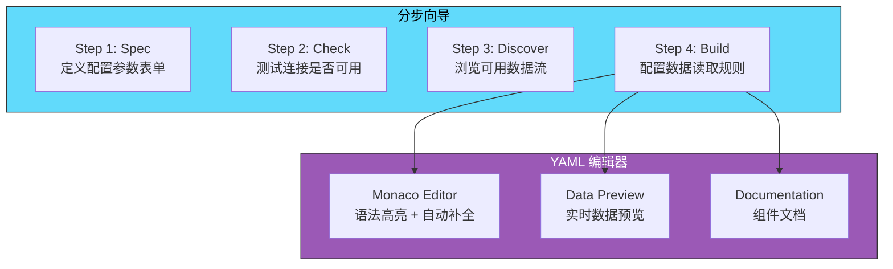
```mermaid
graph TB
    subgraph Wizard["分步向导"]
        S1["Step 1: Spec<br/>定义配置参数表单"]
        S2["Step 2: Check<br/>测试连接是否可用"]
        S3["Step 3: Discover<br/>浏览可用数据流"]
        S4["Step 4: Build<br/>配置数据读取规则"]
    end

    subgraph Editor["YAML 编辑器"]
        MONACO["Monaco Editor<br/>语法高亮 + 自动补全"]
        PREVIEW["Data Preview<br/>实时数据预览"]
        DOCS["Documentation<br/>组件文档"]
    end

    S4 --> MONACO
    S4 --> PREVIEW
    S4 --> DOCS

    style Wizard fill:#61dafb,stroke:#333,color:#000
    style Editor fill:#9b59b6,stroke:#333,color:#fff
```

**Spec 步骤的动态表单渲染**：前端根据连接器返回的 `connectionSpecification` JSON Schema 动态渲染配置表单。关键实现：

```typescript
// 根据 JSON Schema 动态渲染表单的核心逻辑
function SchemaForm({ schema, value, onChange }: SchemaFormProps) {
  // 按 order 字段排序属性
  const sortedProperties = useMemo(() => {
    return Object.entries(schema.properties || {})
      .sort(([_, a], [__, b]) => (a.order ?? 999) - (b.order ?? 999));
  }, [schema]);

  return (
    <FormContainer>
      {sortedProperties.map(([name, fieldSchema]) => {
        // 根据 type 渲染不同控件
        switch (fieldSchema.type) {
          case 'string':
            // airbyte_secret 则用密码框，enum 用下拉框，否则用文本框
            if (fieldSchema.airbyte_secret) {
              return <PasswordField key={name} ... />;
            }
            if (fieldSchema.enum) {
              return <SelectField key={name} options={fieldSchema.enum} ... />;
            }
            return <TextField key={name} ... />;
          case 'integer':
            return <NumberField key={name} ... />;
          case 'object':
            // oneOf 渲染为条件分组
            if (fieldSchema.oneOf) {
              return <ConditionalGroup key={name} oneOf={fieldSchema.oneOf} ... />;
            }
            return <SchemaForm key={name} schema={fieldSchema} ... />;
        }
      })}
    </FormContainer>
  );
}
```
### 4.3 连接配置界面

创建 Connection 的流程是一个多步骤向导，用户依次选择 Source、Destination、配置数据流映射和同步调度：


```mermaid
graph LR
    A["1.选择Source"] --> B["2.配置Source"]
    B --> C["3.选择Destination"]
    C --> D["4.配置Destination"]
    D --> E["5.选择数据流"]
    E --> F["6.配置同步模式"]
    F --> G["7.设置调度"]
    G --> H["8.审核并创建"]

    style A fill:#3498db,stroke:#333,color:#fff
    style H fill:#27ae60,stroke:#333,color:#fff
```

每个步骤的 UI 渲染策略：

- **选择连接器**：展示连接器卡片列表（图标 + 名称 + 描述），支持搜索和分类过滤
- **配置连接器**：根据 Spec 的 `connectionSpecification` 动态渲染表单，实时校验
- **选择数据流**：展示 Discover 返回的 Stream 列表（树形结构），支持全选/反选
- **配置同步模式**：为每个 Stream 独立选择 syncMode 和 destinationSyncMode，UI 根据连接器能力限制可选组合

### 4.4 数据流映射 UI

数据流映射界面展示 Source 和 Destination 之间的数据流关系，支持：

- 流级开关：启用/禁用特定 Stream
- 同步模式选择：下拉框选择 full_refresh/incremental
- 目标模式选择：下拉框选择 append/overwrite/append_dedup
- Cursor 字段选择：增量模式下选择游标字段
- 主键配置：append_dedup 模式下选择主键字段
- Schema 预览：展示当前 Stream 的 JSON Schema

### 4.4.1 连接配置表单的高级交互

Airbyte 的连接配置表单不仅仅是简单的字段渲染，它还支持多种高级交互模式，这些模式对 open-app 的表单引擎设计具有重要参考价值：

**条件渲染（Conditional Rendering）**：基于 JSON Schema 的 `oneOf`/`anyOf` 实现。当用户选择不同的认证方式（如 OAuth2 vs API Key），表单会动态切换显示不同的字段组。Airbyte 通过监听表单值变化，实时重新计算 `oneOf` 的匹配分支，实现条件渲染。

**字段联动（Field Dependencies）**：某些字段的选项依赖于其他字段的值。例如，选择 Salesforce 连接器后，Object Type 下拉框的选项应该根据 Salesforce 实例动态加载。Airbyte 通过 `oneOf` 的 `const` 字段实现简单的联动，但对于复杂联动（如动态加载选项），需要额外的 API 调用。

**异步校验（Async Validation）**：对于某些字段，校验需要调用后端 API（如检查数据库是否存在、验证 API Key 是否有效）。Airbyte 在用户点击「测试连接」按钮时触发异步校验，而非在字段级别实时校验，这是为了避免频繁的 API 调用。

**敏感字段处理**：标记了 `airbyte_secret: true` 的字段在 UI 中使用密码输入框，且值在 API 响应中被脱敏处理（如显示为 `************`）。脱敏逻辑在后端实现，确保敏感数据不会通过 API 泄露。

**多语言支持**：`title` 和 `description` 字段支持多语言，Airbyte 的 i18n 系统会根据当前 locale 自动选择合适的翻译。

### 4.5 同步历史和监控

同步历史页面展示所有 Job 的执行记录，包括：

- Job 列表：状态、开始时间、耗时、同步行数
- Job 详情：执行日志（实时流式展示）、错误信息、统计信息
- 手动触发：立即执行一次同步
- 取消 Job：终止正在运行的同步任务

```typescript
// 同步历史页面核心数据结构
interface JobHistory {
  jobId: string;
  status: JobStatus;
  startTime: number;
  endTime?: number;
  duration?: number;
  rowsSynced: number;
  bytesSynced: number;
  errorMessage?: string;
  streams: JobStreamStats[];
}

interface JobStreamStats {
  streamName: string;
  rowsEmitted: number;
  rowsCommitted: number;
  bytesEmitted: number;
  bytesCommitted: number;
}
```

---
## 五、后端执行引擎

### 5.1 Temporal 工作流编排

Airbyte 使用 Temporal 编排所有长时间运行的同步操作。每个核心操作对应一个 Temporal Workflow：

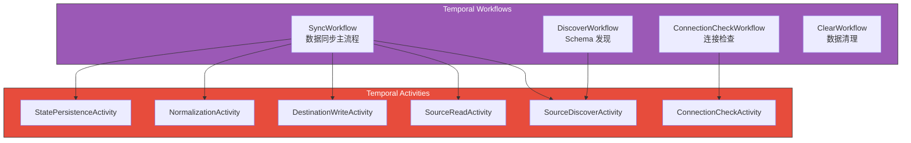
```mermaid
graph TB
    subgraph Workflows["Temporal Workflows"]
        SW["SyncWorkflow<br/>数据同步主流程"]
        DW["DiscoverWorkflow<br/>Schema 发现"]
        CW["ConnectionCheckWorkflow<br/>连接检查"]
        CFW["ClearWorkflow<br/>数据清理"]
    end

    subgraph Activities["Temporal Activities"]
        A1["SourceDiscoverActivity"]
        A2["SourceReadActivity"]
        A3["DestinationWriteActivity"]
        A4["ConnectionCheckActivity"]
        A5["NormalizationActivity"]
        A6["StatePersistenceActivity"]
    end

    SW --> A1
    SW --> A2
    SW --> A3
    SW --> A5
    SW --> A6
    DW --> A1
    CW --> A4

    style Workflows fill:#9b59b6,stroke:#333,color:#fff
    style Activities fill:#e74c3c,stroke:#333,color:#fff
```

**SyncWorkflow 伪代码**：

```java
// airbyte-workers/src/main/java/io/airbyte/workflows/sync/SyncWorkflow.java
public class SyncWorkflow implements WorkflowInterface {

    private final SourceReadActivity sourceReadActivity;
    private final DestinationWriteActivity destinationWriteActivity;
    private final StatePersistenceActivity stateActivity;

    @WorkflowMethod
    public SyncOutput run(SyncInput input) {
        // 1. 启动 Source 容器，开始读取数据
        var readFuture = Async.procedure(
            sourceReadActivity::read,
            input.getSourceConfig(),
            input.getCatalog(),
            input.getState()
        );

        // 2. 启动 Destination 容器，准备写入
        var writeFuture = Async.procedure(
            destinationWriteActivity::write,
            input.getDestinationConfig(),
            input.getCatalog()
        );

        // 3. 数据从 Source 通过 S3 缓冲传递到 Destination
        // Source 输出 -> S3 中间文件 -> Destination 输入
        // 每个阶段在独立的 Temporal Activity 中执行

        // 4. 等待读写完成
        var readResult = readFuture.get();
        var writeResult = writeFuture.get();

        // 5. 保存最终状态
        stateActivity.persist(writeResult.getFinalState());

        return new SyncOutput(readResult, writeResult);
    }
}
```
### 5.2 Worker 调度

Airbyte Worker 通过 Temporal Task Queue 接收任务，支持多实例并行处理：

```java
// Worker 注册示例
public class WorkerFactory {

    public Worker createSyncWorker(WorkerOptions options) {
        Worker worker = new Worker(temporalService, "SYNC_TASK_QUEUE");
        worker.registerWorkflowImplementationTypes(SyncWorkflow.class);
        worker.registerActivitiesImplementations(
            new SourceReadActivity(),
            new DestinationWriteActivity(),
            new StatePersistenceActivity()
        );
        return worker;
    }

    public Worker createCheckWorker(WorkerOptions options) {
        Worker worker = new Worker(temporalService, "CHECK_TASK_QUEUE");
        worker.registerWorkflowImplementationTypes(ConnectionCheckWorkflow.class);
        worker.registerActivitiesImplementations(
            new ConnectionCheckActivity()
        );
        return worker;
    }
}
```

**Task Queue 分区策略**：

| Task Queue | 用途 | 并发控制 |
|-----------|------|---------|
| `SYNC_TASK_QUEUE` | 数据同步 | 按 Connection 互斥 |
| `CHECK_TASK_QUEUE` | 连接检查 | 高并发，短耗时 |
| `DISCOVER_TASK_QUEUE` | Schema 发现 | 中等并发 |
| `NOTIFICATION_TASK_QUEUE` | 通知发送 | 低并发 |

### 5.3 Connector Docker 容器管理

Worker 通过 Docker Java Client 管理连接器容器的生命周期，核心操作包括：

```java
// 容器管理核心逻辑（简化）
public class ConnectorRunner {

    private final DockerClient dockerClient;

    public ContainerOutput runConnector(
        String image,
        String command,
        Map<String, String> config,
        Duration timeout
    ) {
        // 1. 创建容器
        CreateContainerResponse container = dockerClient.createContainerCmd(image)
            .withCmd(command)
            .withEnv(formatEnvVars(config))
            .withMemory(512 * 1024 * 1024L)  // 512MB 内存限制
            .withCpuCount(1L)                 // 1 CPU 核心
            .withNetworkMode("airbyte")       // 隔离网络
            .exec();

        try {
            // 2. 启动容器
            dockerClient.startContainerCmd(container.getId()).exec();

            // 3. 等待容器完成（带超时）
            var result = dockerClient.waitContainerCmd(container.getId())
                .withTimeout(timeout.toSeconds(), TimeUnit.SECONDS)
                .exec(new WaitContainerResultCallback());

            // 4. 收集 stdout 输出（AirbyteMessage 流）
            return parseOutput(container.getId());
        } finally {
            // 5. 清理容器
            dockerClient.removeContainerCmd(container.getId())
                .withForce(true)
                .exec();
        }
    }
}
```

### 5.4 数据缓冲

Airbyte 采用 S3/GCS 作为 Source 和 Destination 之间的数据缓冲层。这种设计解耦了读写速度差异，并支持断点续传：

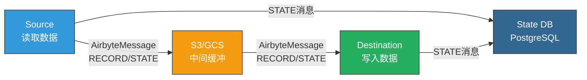
```mermaid
graph LR
    SRC["Source<br/>读取数据"] -->|"AirbyteMessage<br/>RECORD/STATE"| BUFFER["S3/GCS<br/>中间缓冲"]
    BUFFER -->|"AirbyteMessage<br/>RECORD/STATE"| DST["Destination<br/>写入数据"]

    SRC -->|"STATE消息"| STATE_DB["State DB<br/>PostgreSQL"]
    DST -->|"STATE消息"| STATE_DB

    style SRC fill:#3498db,stroke:#333,color:#fff
    style BUFFER fill:#f39c12,stroke:#333,color:#fff
    style DST fill:#27ae60,stroke:#333,color:#fff
    style STATE_DB fill:#336791,stroke:#333,color:#fff
```

数据缓冲的文件组织结构：

```
s3://airbyte-bucket/
  workspace/{workspace_id}/
    connection/{connection_id}/
      job/{job_id}/
        source_output/        # Source 输出的 RECORD 消息
          0_0_0.txt           # 分片文件（格式：attempt_任务索引_文件索引）
          0_0_1.txt
        destination_output/   # Destination 输出（日志、STATE）
        state/                # STATE 检查点文件
          state_0.txt
          state_1.txt
```

### 5.4.1 数据缓冲的流控策略

数据缓冲层不仅解决了读写速度差异的问题，还承担了流控（Flow Control）的关键角色。Airbyte 实现了以下流控机制：

**背压控制（Backpressure）**：当 Destination 写入速度慢于 Source 读取速度时，缓冲区会逐渐填满。Airbyte 通过 S3 文件大小阈值控制背压——当缓冲文件超过设定大小时，暂停 Source 读取，等待 Destination 消费。

**分片策略（Sharding）**：Source 输出按 Stream 名称和配置的分片策略写入不同的 S3 文件。每个分片文件大小上限默认为 200MB（可配置），当文件超过阈值时自动滚动创建新文件。这种分片机制使得 Destination 可以并行读取多个分片，提升写入吞吐量。

**断点续传（Resume from Checkpoint）**：当 Job 因 Worker 重启或临时故障中断时，Temporal 会重新执行 Workflow。此时 Worker 从最近保存的 STATE 检查点恢复，跳过已处理的缓冲文件，只处理剩余数据。这避免了全量重读。

**数据一致性保证**：Airbyte 保证 at-least-once 语义——每条记录至少被写入一次。对于需要 exactly-once 的场景，需要配合 `append_dedup` 模式在 Destination 端去重。STATE 消息的保存是幂等的，平台只保留最新的 STATE。

### 5.4.2 数据格式与序列化

缓冲文件中的数据采用 JSON Lines 格式存储（每行一个 AirbyteMessage JSON），这种选择的原因：

1. **可读性**：JSON Lines 可以直接用文本编辑器查看，便于调试
2. **流式处理**：不需要解析完整文件，逐行读取即可
3. **兼容性**：JSON 是跨语言标准，Source 和 Destination 可用不同语言实现
4. **容错性**：某行解析失败不影响其他行的处理

但这种格式也有明显的性能代价：JSON 序列化/反序列化开销大，文件体积膨胀（相比二进制格式如 Avro/Parquet 大 3-5 倍）。对于大规模数据同步场景，这是明显的瓶颈。Airbyte 社区已讨论引入列式存储格式作为优化方向。

### 5.5 错误处理和重试

Temporal 提供了内置的重试策略，Airbyte 在此基础上针对不同场景配置了差异化的重试参数：

```java
// 重试策略配置示例
RetryOptions syncRetryOptions = RetryOptions.newBuilder()
    .setInitialInterval(Duration.ofSeconds(10))
    .setMaximumInterval(Duration.ofMinutes(5))
    .setBackoffCoefficient(2.0)
    .setMaximumAttempts(3)
    .setDoNotRetry(
        InvalidConfigException.class.getName(),
        AuthenticationException.class.getName()
    )
    .build();

ActivityOptions syncActivityOptions = ActivityOptions.newBuilder()
    .setTaskQueue("SYNC_TASK_QUEUE")
    .setStartToCloseTimeout(Duration.ofHours(24))    // 最长执行24小时
    .setHeartbeatTimeout(Duration.ofMinutes(5))       // 5分钟心跳
    .setRetryOptions(syncRetryOptions)
    .build();
```

**不可重试的错误类型**：

- `InvalidConfigException`：配置错误，重试无意义
- `AuthenticationException`：认证失败，需要用户干预
- `ConnectorNotFoundException`：连接器镜像不存在

---
## 六、数据存储设计

### 6.1 PostgreSQL 表结构

Airbyte 使用 PostgreSQL 作为主要的关系型存储，存储连接器配置、Connection 定义、Job 状态等核心数据。以下是关键表的设计：

```sql
-- 连接器定义表（Source 和 Destination 共用）
CREATE TABLE actor (
    id                          UUID PRIMARY KEY,
    actor_definition_id         UUID NOT NULL REFERENCES actor_definition(id),
    workspace_id                UUID NOT NULL REFERENCES workspace(id),
    name                        VARCHAR NOT NULL,
    configuration               JSONB NOT NULL,       -- 用户填写的连接配置
    actor_type                  VARCHAR NOT NULL,      -- 'source' 或 'destination'
    created_at                  TIMESTAMP WITH TIME ZONE DEFAULT NOW(),
    updated_at                  TIMESTAMP WITH TIME ZONE DEFAULT NOW()
);

-- 连接器定义版本表
CREATE TABLE actor_definition (
    id                          UUID PRIMARY KEY,
    name                        VARCHAR NOT NULL,
    docker_repository           VARCHAR NOT NULL,      -- Docker 镜像仓库地址
    docker_image_tag            VARCHAR NOT NULL,      -- Docker 镜像标签（版本号）
    spec                        JSONB,                 -- 缓存的 Spec
    actor_type                  VARCHAR NOT NULL,
    public                      BOOLEAN DEFAULT FALSE, -- 是否公开连接器
    release_stage               VARCHAR DEFAULT 'alpha',
    created_at                  TIMESTAMP WITH TIME ZONE DEFAULT NOW()
);

-- Connection 表
CREATE TABLE connection (
    id                          UUID PRIMARY KEY,
    source_id                   UUID NOT NULL REFERENCES actor(id),
    destination_id              UUID NOT NULL REFERENCES actor(id),
    namespace_definition        VARCHAR DEFAULT 'source',
    namespace_format            VARCHAR,
    prefix                      VARCHAR,               -- 目标表名前缀
    catalog                     JSONB NOT NULL,         -- ConfiguredAirbyteCatalog
    schedule_data               JSONB,                  -- 调度配置
    status                      VARCHAR DEFAULT 'active',
    with_change_data_capture    BOOLEAN DEFAULT FALSE,
    created_at                  TIMESTAMP WITH TIME ZONE DEFAULT NOW(),
    updated_at                  TIMESTAMP WITH TIME ZONE DEFAULT NOW()
);

-- Job 表
CREATE TABLE job (
    id                          BIGSERIAL PRIMARY KEY,
    config_type                 VARCHAR NOT NULL,       -- 'sync', 'check', 'discover' 等
    scope                       VARCHAR NOT NULL,       -- Connection ID 或 Actor ID
    config_id                   JSONB,                  -- 关联的配置 ID
    status                      VARCHAR NOT NULL,       -- pending/running/successful/failed/cancelled
    started_at                  TIMESTAMP WITH TIME ZONE,
    updated_at                  TIMESTAMP WITH TIME ZONE DEFAULT NOW(),
    created_at                  TIMESTAMP WITH TIME ZONE DEFAULT NOW(),
    attempt_count               INTEGER DEFAULT 0,
    auto_incrementing_attempt_id INTEGER DEFAULT 1
);

-- Job 输出表
CREATE TABLE job_output (
    id                          BIGSERIAL PRIMARY KEY,
    job_id                      BIGINT NOT NULL REFERENCES job(id),
    attempt_id                  INTEGER NOT NULL,
    output_type                 VARCHAR NOT NULL,       -- 'sync', 'check', 'discover' 等
    output                      JSONB,                  -- Job 执行结果（统计信息等）
    created_at                  TIMESTAMP WITH TIME ZONE DEFAULT NOW()
);

-- Stream 状态表（增量同步检查点）
CREATE TABLE state (
    id                          UUID PRIMARY KEY,
    connection_id               UUID NOT NULL REFERENCES connection(id),
    state                       JSONB NOT NULL,          -- AirbyteStateMessage 数据
    created_at                  TIMESTAMP WITH TIME ZONE DEFAULT NOW(),
    updated_at                  TIMESTAMP WITH TIME ZONE DEFAULT NOW()
);
```

### 6.2 ER 关系图

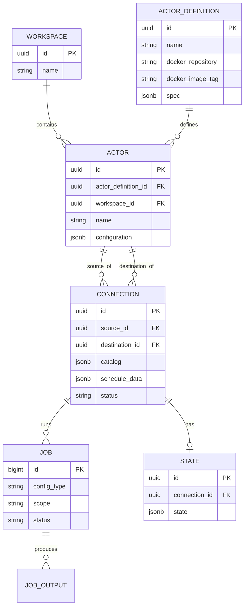
```mermaid
erDiagram
    WORKSPACE ||--o{ ACTOR : contains
    ACTOR_DEFINITION ||--o{ ACTOR : defines
    ACTOR ||--o{ CONNECTION : source_of
    ACTOR ||--o{ CONNECTION : destination_of
    CONNECTION ||--o{ JOB : runs
    CONNECTION ||--o| STATE : has
    JOB ||--o{ JOB_OUTPUT : produces

    WORKSPACE {
        uuid id PK
        string name
    }

    ACTOR_DEFINITION {
        uuid id PK
        string name
        string docker_repository
        string docker_image_tag
        jsonb spec
    }

    ACTOR {
        uuid id PK
        uuid actor_definition_id FK
        uuid workspace_id FK
        string name
        jsonb configuration
    }

    CONNECTION {
        uuid id PK
        uuid source_id FK
        uuid destination_id FK
        jsonb catalog
        jsonb schedule_data
        string status
    }

    JOB {
        bigint id PK
        string config_type
        string scope
        string status
    }

    STATE {
        uuid id PK
        uuid connection_id FK
        jsonb state
    }
```

---
## 七、API 设计

### 7.1 REST API 概览

Airbyte 的 API 分为两个层次：公开的 `/api/v1/*` 和内部使用的 `/webbackend/*`。前者是面向外部集成的标准 REST API，后者是前端专用的高效接口。

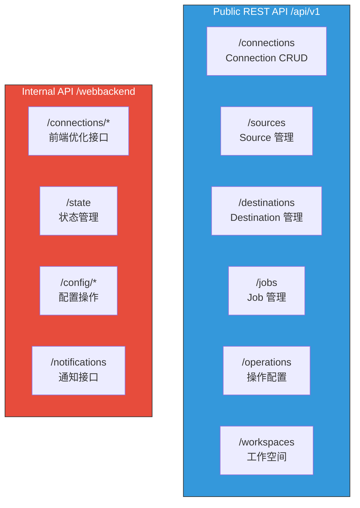
```mermaid
graph TB
    subgraph PublicAPI["Public REST API /api/v1"]
    CONN["/connections<br/>Connection CRUD"]
    SRC["/sources<br/>Source 管理"]
    DST["/destinations<br/>Destination 管理"]
    JOB["/jobs<br/>Job 管理"]
    OPS["/operations<br/>操作配置"]
    WORK["/workspaces<br/>工作空间"]
    end

    subgraph InternalAPI["Internal API /webbackend"]
    WBCONN["/connections/*<br/>前端优化接口"]
    WBSTATE["/state<br/>状态管理"]
    WBCONFIG["/config/*<br/>配置操作"]
    WBNOTIF["/notifications<br/>通知接口"]
    end

    style PublicAPI fill:#3498db,stroke:#333,color:#fff
    style InternalAPI fill:#e74c3c,stroke:#333,color:#fff
```

### 7.2 Connection CRUD API

```bash
# 创建 Connection
POST /api/v1/connections/create
Content-Type: application/json

{
  "sourceId": "uuid-of-source",
  "destinationId": "uuid-of-destination",
  "configs": [
    {
      "name": "sync_config_1",
      "alias": "production_sync",
      "catalog": {
        "streams": [
          {
            "stream": { "name": "users" },
            "config": {
              "syncMode": "incremental",
              "cursorField": ["updated_at"],
              "destinationSyncMode": "append_dedup",
              "primaryKey": [["id"]],
              "selected": true
            }
          }
        ]
      }
    }
  ],
  "schedule": {
    "scheduleType": "cron",
    "cronExpression": "0 */6 * * *"
  },
  "status": "active"
}

# 获取 Connection 详情
GET /api/v1/connections/get
?connectionId=uuid-of-connection

# 更新 Connection
PATCH /api/v1/connections/update

# 删除 Connection
DELETE /api/v1/connections/delete
?connectionId=uuid-of-connection

# 列出所有 Connection
POST /api/v1/connections/list
Content-Type: application/json
{
  "workspaceId": "uuid-of-workspace"
}
```

### 7.3 Job 管理 API

```bash
# 触发同步 Job
POST /api/v1/connections/sync
Content-Type: application/json
{
  "connectionId": "uuid-of-connection"
}

# 触发重置 Job（清除增量状态，下次全量同步）
POST /api/v1/connections/reset
Content-Type: application/json
{
  "connectionId": "uuid-of-connection"
}

# 获取 Job 详情
POST /api/v1/jobs/get
?id=job-id

# 获取 Job 列表
POST /api/v1/jobs/list
Content-Type: application/json
{
  "configIds": ["connection-id-1", "connection-id-2"],
  "configTypes": ["sync"],
  "pagination": {
    "pageSize": 20,
    "rowOffset": 0
  }
}

# 取消 Job
POST /api/v1/jobs/cancel
Content-Type: application/json
{
  "jobId": "job-id"
}
```

### 7.4 Connector 操作 API

```bash
# 获取连接器 Spec
POST /api/v1/source_definition_specifications/get
Content-Type: application/json
{
  "sourceDefinitionId": "uuid-of-source-definition"
}

# 测试 Source 连接
POST /api/v1/scheduler/sources/check_connection
Content-Type: application/json
{
  "sourceDefinitionId": "uuid-of-source-definition",
  "connectionConfiguration": {
    "host": "db.example.com",
    "port": 5432,
    "database": "mydb"
  }
}

# 发现 Source Schema
POST /api/v1/scheduler/sources/discover_schema
Content-Type: application/json
{
  "sourceId": "uuid-of-source"
}
```

---
## 八、对 open-app 的架构设计参考

### 8.1 可借鉴的核心设计

Airbyte 的架构经过大规模生产验证，其多个核心设计模式对 open-app 连接器平台建设具有直接参考价值：

#### 8.1.1 Spec 驱动的声明式设计

Airbyte 最值得借鉴的设计是「Spec 驱动一切」的理念。连接器通过 `connectionSpecification` JSON Schema 声明自己的配置需求，平台根据此 Schema 自动完成：UI 表单渲染、输入校验、敏感字段脱敏、文档生成。这种设计实现了连接器与平台的完全解耦。

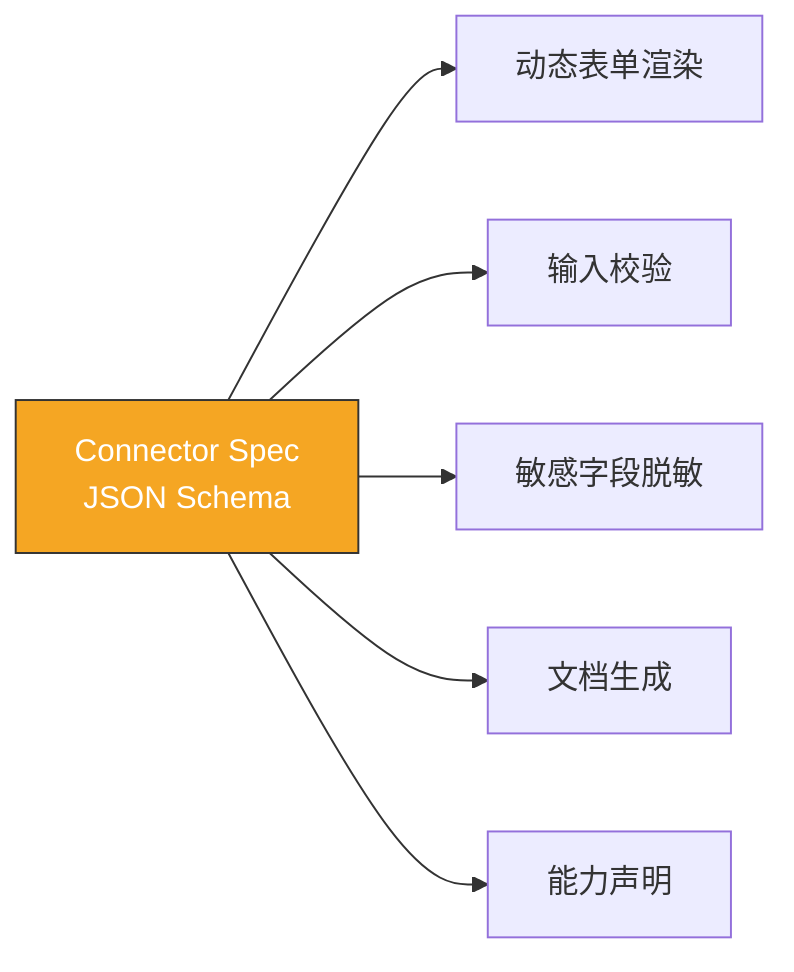
```mermaid
graph LR
    SPEC["Connector Spec<br/>JSON Schema"] --> UI["动态表单渲染"]
    SPEC --> VALID["输入校验"]
    SPEC --> SECRET["敏感字段脱敏"]
    SPEC --> DOC["文档生成"]
    SPEC --> CAP["能力声明"]

    style SPEC fill:#f5a623,stroke:#333,color:#fff
```

**open-app 可落地方案**：

```typescript
// open-app 连接器定义 Schema（参考 AirbyteSpec 改进）
interface OpenAppConnectorSpec {
  /** 连接器元数据 */
  metadata: {
    name: string;
    displayName: string;
    description: string;
    icon?: string;
    version: string;
    category: 'database' | 'api' | 'file' | 'messaging' | 'custom';
    documentationUrl?: string;
  };

  /** 连接配置 JSON Schema（驱动 UI 表单） */
  connectionSpecification: JSONSchema7;

  /** 连接器能力声明 */
  capabilities: {
    /** 支持的操作类型 */
    supportedActions: ('read' | 'write' | 'query' | 'subscribe')[];
    /** 是否支持增量读取 */
    supportsIncrementalRead: boolean;
    /** 是否支持流式输出 */
    supportsStreaming: boolean;
    /** 支持的认证方式 */
    supportedAuthTypes: AuthType[];
  };

  /** 数据模型（可选，类似 AirbyteCatalog） */
  dataModel?: {
    streams: DataStreamSpec[];
  };
}
```

#### 8.1.2 Docker 容器执行模型

Airbyte 的「连接器即 Docker 容器」模型提供了最强的隔离性和安全性。每个连接器在独立容器中运行，无法访问其他连接器的数据或平台内部服务。

**优势**：
- **安全隔离**：连接器无法逃逸容器边界
- **依赖隔离**：每个连接器可以有自己的 Python/Java/Node.js 运行时和依赖版本
- **资源限制**：通过 Docker cgroups 限制 CPU、内存使用
- **版本管理**：连接器版本 = Docker 镜像标签，回滚简单

**open-app 适配方案**：

```mermaid
graph TB
    subgraph Runtime["open-app 连接器运行时"]
        subgraph Mode1["模式1: Docker 容器（批处理场景）"]
            DC["Docker Container<br/>强隔离, 高开销"]
        end
        subgraph Mode2["模式2: 进程隔离（实时场景）"]
            PROC["独立进程<br/>中等隔离, 中等开销"]
        end
        subgraph Mode3["模式3: 线程池（高性能场景）"]
            THREAD["线程内执行<br/>弱隔离, 低开销"]
        end
    end

    DC -->|"适合: ETL, 批量同步"| USE1["数据导入/导出"]
    PROC -->|"适合: 事件处理, API调用"| USE2["实时集成"]
    THREAD -->|"适合: 高频轻量调用"| USE3["内部连接器"]

    style Runtime fill:#3498db,stroke:#333,color:#fff
```
#### 8.1.3 CDK 框架 -> open-app Java 连接器 SDK 设计

Airbyte CDK 是 Python 框架，而 open-app 的技术栈是 Java。需要设计一套 Java 版本的连接器 SDK，借鉴 CDK 的核心概念但适配 Java 生态：

```java
// open-app 连接器 SDK 接口设计（参考 Airbyte CDK）
public interface SourceConnector {

    /** 返回连接器 Spec */
    ConnectorSpec spec();

    /** 验证连接 */
    ConnectionStatus check(ConnectionConfig config);

    /** 发现数据流 */
    DataCatalog discover(ConnectionConfig config);

    /** 读取数据 */
    Iterator<DataMessage> read(
        ConnectionConfig config,
        SelectedStreams streams,
        @Nullable CheckpointState state
    );
}

// 注解驱动的 Spec 声明（比 Airbyte 的手动 JSON Schema 更简洁）
@ConnectorDefinition(
    name = "postgres",
    displayName = "PostgreSQL",
    category = ConnectorCategory.DATABASE,
    supportsIncrementalRead = true
)
public class PostgresSource implements SourceConnector {

    @SpecProperty(
        title = "Host",
        description = "Database hostname",
        order = 0
    )
    private String host;

    @SpecProperty(
        title = "Password",
        secret = true,  // 标记为敏感字段
        order = 4
    )
    private String password;

    @Override
    public ConnectionStatus check(ConnectionConfig config) {
        try (var conn = DriverManager.getConnection(config.getUrl())) {
            return ConnectionStatus.succeeded();
        } catch (SQLException e) {
            return ConnectionStatus.failed(e.getMessage());
        }
    }

    @Override
    public Iterator<DataMessage> read(
        ConnectionConfig config,
        SelectedStreams streams,
        CheckpointState state
    ) {
        // 实现数据读取逻辑，返回迭代器
        return new PostgresRecordIterator(config, streams, state);
    }
}
```

#### 8.1.4 Low-Code YAML -> 低代码连接器定义

Airbyte 的 Low-Code YAML 是降低连接器开发门槛的关键创新。open-app 可以借鉴此模式，但需要适配 Java 技术栈和 iPaaS 场景：

```yaml
# open-app 低代码连接器定义（参考 Airbyte manifest.yaml）
connector:
  metadata:
    name: salesforce
    displayName: Salesforce
    category: api
    version: 1.0.0

  auth:
    type: oauth2
    tokenUrl: https://login.salesforce.com/services/oauth2/token
    scopes: [api, refresh_token]

  # 操作定义（iPaaS 特有，Airbyte 无此概念）
  actions:
    - name: create_record
      displayName: Create Record
      method: POST
      path: /sobjects/{{config.object_type}}
      inputSchema: schemas/create_record_input.json
      outputSchema: schemas/create_record_output.json

    - name: query_records
      displayName: Query Records
      method: GET
      path: /query?q={{parameters.soql}}
      pagination:
        type: offset
        nextUrl: '{{response.nextRecordsUrl}}'
      outputSchema: schemas/query_output.json

    - name: subscribe_events
      displayName: Subscribe to Events
      type: webhook
      path: /sobjects/{{config.object_type}}/describe
      pollInterval: 30s
```

#### 8.1.5 Connector Builder UI -> open-app 连接器构建器

Airbyte 的 Connector Builder UI 是降低连接器创建门槛的利器。open-app 可以借鉴其分步向导设计，但需要适配 iPaaS 场景（增加 Action/Trigger 定义步骤）：

```mermaid
graph TB
    subgraph AirbyteBuilder["Airbyte Builder (4步)"]
        AS1["1.Spec"] --> AS2["2.Check"]
        AS2 --> AS3["3.Discover"]
        AS3 --> AS4["4.Build"]
    end

    subgraph OpenAppBuilder["open-app Builder (6步)"]
        OS1["1.Spec<br/>连接配置"] --> OS2["2.Auth<br/>认证方式"]
        OS2 --> OS3["3.Check<br/>测试连接"]
        OS3 --> OS4["4.Actions<br/>定义操作"]
        OS4 --> OS5["5.Test<br/>测试操作"]
        OS5 --> OS6["6.Publish<br/>发布连接器"]
    end

    style AirbyteBuilder fill:#61dafb,stroke:#333,color:#000
    style OpenAppBuilder fill:#f5a623,stroke:#333,color:#fff
```
#### 8.1.6 Temporal 工作流编排

Airbyte 选择 Temporal 作为工作流引擎，这个决策值得 open-app 借鉴。对于长时间运行的数据同步任务，Temporal 的持久化执行、内置重试和超时控制是刚需。

**open-app 场景适配**：

| 场景 | 是否需要 Temporal | 替代方案 |
|------|------------------|---------|
| 批量数据同步（ETL） | 是 | - |
| 定时调度任务 | 是 | Quartz / Spring Scheduler |
| 短时 API 调用 | 否 | 直接调用 + 重试 |
| 实时事件处理 | 否 | 消息队列 + 异步处理 |
| 工作流编排（多步骤） | 是 | - |

### 8.2 需要规避的设计

尽管 Airbyte 的架构有很多优秀之处，但也有一些设计选择不适合 open-app 的场景，需要特别注意规避：

#### 8.2.1 Docker 开销大，不适合实时场景

Airbyte 的每个连接器操作都启动 Docker 容器，这对于 ETL 批处理场景可以接受，但对于 iPaaS 的实时 API 调用场景，Docker 的启动延迟（通常 1-5 秒）是完全不可接受的。

**量化分析**：

| 操作 | Docker 启动开销 | 进程启动开销 | 线程调用开销 |
|------|----------------|-------------|-------------|
| 启动延迟 | 1-5s | 50-200ms | <1ms |
| 内存占用 | 50-200MB/容器 | 10-50MB/进程 | 共享堆内存 |
| 并发上限 | 受 Docker 调度限制 | 受进程数限制 | 受线程数限制 |
| 隔离性 | 强 | 中 | 弱 |

**open-app 建议**：采用分层运行时策略——Docker 用于批处理、独立进程用于长连接、线程池用于高频短调用。

#### 8.2.2 ETL 模型与 iPaaS 模型差异

Airbyte 是 ETL 平台，其核心抽象是 Source -> Destination 的单向数据流。而 open-app 作为 iPaaS 平台，需要支持更丰富的交互模式：

```mermaid
graph TB
    subgraph ETL["ETL 模型 (Airbyte)"]
        E_SRC["Source<br/>只能读取"] -->|"单向数据流"| E_DST["Destination<br/>只能写入"]
    end

    subgraph iPaaS["iPaaS 模型 (open-app)"]
        I_CONN["Connector<br/>可读可写可订阅"]
        I_ACT["Action<br/>执行操作"]
        I_TRG["Trigger<br/>事件触发"]
        I_QUERY["Query<br/>查询数据"]
        I_CONN --> I_ACT
        I_CONN --> I_TRG
        I_CONN --> I_QUERY
    end

    style ETL fill:#e74c3c,stroke:#333,color:#fff
    style iPaaS fill:#27ae60,stroke:#333,color:#fff
```

**关键差异**：

| 维度 | Airbyte (ETL) | open-app (iPaaS) |
|------|--------------|-----------------|
| 数据流方向 | Source -> Destination 单向 | 任意方向，双向交互 |
| 操作类型 | read/write | read/write/query/execute/subscribe |
| 触发模式 | 定时调度 | 定时 + 事件驱动 + 手动 + API 触发 |
| 数据模型 | Stream + Catalog | Action + Trigger + DataModel |
| 执行模式 | 批处理，长任务 | 实时 + 批处理混合 |
| 连接器数量 | 少量，长期运行 | 大量，频繁创建/销毁 |

#### 8.2.3 Python CDK 与 Java 技术栈不匹配

Airbyte CDK 是 Python 框架，而 open-app 的技术栈是 Java。直接移植 CDK 不现实，但核心概念可以迁移：

| Airbyte CDK 概念 | open-app Java 对应 |
|-----------------|-------------------|
| `AbstractSource` (Python ABC) | `SourceConnector` (Java Interface) |
| `Destination` (Python ABC) | `DestinationConnector` (Java Interface) |
| `AirbyteStream` | `DataStream` (Java Record) |
| `manifest.yaml` (Low-Code) | YAML + Java SPI 动态加载 |
| `entrypoint.launch()` | `ConnectorRunner.run()` |
| `@dataclass_json` 自动序列化 | Jackson / Gson 注解 |
| Python Type Hints | Java Generics + Records |

### 8.3 架构设计参考总结

```mermaid
graph TB
    subgraph Borrow["可借鉴"]
        B1["Spec 驱动声明式设计"]
        B2["JSON Schema 表单渲染"]
        B3["容器隔离执行模型"]
        B4["Low-Code YAML 定义"]
        B5["Connector Builder UI"]
        B6["Temporal 工作流编排"]
        B7["增量状态管理机制"]
    end

    subgraph Avoid["需规避"]
        A1["Docker 全量执行"]
        A2["ETL 单向数据流模型"]
        A3["Python CDK 直接移植"]
        A4["缺少 Action/Trigger 抽象"]
        A5["仅支持批处理模式"]
    end

    subgraph Innovate["需创新"]
        I1["混合运行时策略"]
        I2["Action + Trigger 抽象"]
        I3["Java 连接器 SDK"]
        I4["实时 + 批处理统一架构"]
        I5["事件驱动触发模型"]
    end

    Borrow --> Innovate
    Avoid --> Innovate

    style Borrow fill:#27ae60,stroke:#333,color:#fff
    style Avoid fill:#e74c3c,stroke:#333,color:#fff
    style Innovate fill:#3498db,stroke:#333,color:#fff
```

**核心结论**：Airbyte 为 open-app 提供了连接器平台建设的宝贵参考范本，尤其是 Spec 驱动的声明式设计、JSON Schema 表单渲染、容器隔离执行和 Low-Code YAML 定义等模式可以直接借鉴。但必须根据 iPaaS 场景进行关键改造：引入 Action/Trigger 双向交互模型、设计 Java 连接器 SDK 替代 Python CDK、采用混合运行时策略替代纯 Docker 执行，才能真正构建一个适合实时集成场景的连接器平台。

---

> 本报告基于 Airbyte 开源版本 v0.50.x 和 CDK v0.80.x 进行调研，如有更新请参考 [Airbyte 官方文档](https://docs.airbyte.com/)。### 6.3 连接器定义存储

Airbyte 对连接器定义的存储采用「Docker 镜像引用 + 元数据数据库」的混合策略：

**Docker 镜像存储**：连接器的可执行代码以 Docker 镜像形式存储在 Docker Registry（Docker Hub、ECR、GCR 等）。`actor_definition` 表中的 `docker_repository` 和 `docker_image_tag` 字段记录镜像引用，Worker 在执行时通过 Docker API 拉取并运行对应镜像。

**元数据数据库存储**：连接器的元信息（名称、描述、Spec、版本号等）存储在 PostgreSQL 的 `actor_definition` 表中。Spec 字段在首次调用连接器的 `spec` 命令后被缓存到数据库，避免每次都启动 Docker 容器获取 Spec。

**版本管理策略**：Airbyte 的连接器版本管理遵循以下规则：
- 每个 `actor_definition` 记录对应一个连接器类型
- `docker_image_tag` 字段记录当前使用的版本号（如 `0.50.0`）
- 版本升级通过 `actor_definition_version` 表追踪，记录每个版本的 Spec、changelog 和 breaking changes
- 用户可以在 Connection 层面锁定连接器版本，防止自动升级

### 6.4 Stream 状态存储的优化考量

Stream 状态（增量同步检查点）是数据一致性的关键保障，其存储设计需要平衡以下因素：

**写入频率**：STATE 消息在 Source 读取过程中周期性输出（通常每 1000 条 RECORD 或每 60 秒输出一次 STATE），状态写入频率较高。

**读取延迟**：Job 重启时需要快速读取最新状态，读取延迟直接影响恢复速度。

**数据量**：单个 Connection 的状态数据通常很小（几 KB），但平台可能有数万 Connection 的状态需要管理。

**一致性要求**：状态必须保证原子写入——部分写入会导致断点续传数据不一致。

Airbyte 的当前实现将状态存储在 PostgreSQL 的 `state` 表中，使用 JSONB 字段存储状态数据。这种方案的优缺点：

- 优点：事务保证、与配置数据同库管理、查询方便
- 缺点：高频写入对 PostgreSQL 造成压力、大状态（如 CDC 的 LSN 位点）可能膨胀 JSONB 字段

可能的优化方向：
- 将热状态（正在同步的 Connection 的状态）缓存在 Redis，同步完成后批量写入 PostgreSQL
- 对大状态使用 S3 对象存储，PostgreSQL 只存引用
- 使用专门的时序数据库存储状态变更历史，支持状态回溯和审计


