# Apache NiFi 技术架构调研报告

> 面向 open-app 连接器平台建设的技术参考
> 版本：基于 NiFi 2.x（主线分支，含 NiFi Registry 2.x）
> 调研日期：2026-05-15

---

## 目录

- [一、技术架构总览](#一技术架构总览)
- [二、连接器（Processor）技术实现](#二连接器processor技术实现)
- [三、连接流（Flow）数据模型](#三连接流flow数据模型)
- [四、前端拖拽编辑器实现](#四前端拖拽编辑器实现)
- [五、后端执行引擎](#五后端执行引擎)
- [六、数据存储设计](#六数据存储设计)
- [七、API设计](#七api设计)
- [八、可借鉴的设计模式](#八可借鉴的设计模式)

---

## 一、技术架构总览

### 1.1 整体架构图

Apache NiFi 采用分层架构设计，从上到下依次为 Web UI 层、API 层、框架核心层、仓库层、扩展层和集群层。各层之间通过定义良好的接口解耦，扩展层通过 NAR ClassLoader 实现类隔离加载。

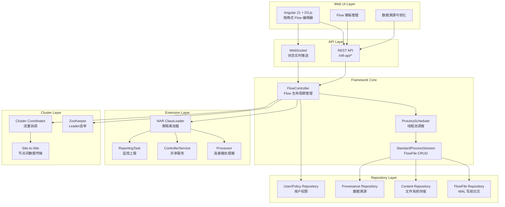

### 1.2 核心模块划分

NiFi 源码采用 Maven 多模块结构，以下列出核心模块及其职责：

| 模块 | 路径 | 职责 | 关键类 |
|------|------|------|--------|
| **nifi-api** | `nifi-api/` | 公共 API 定义，Processor/ControllerService 等核心接口 | `Processor`, `ProcessSession`, `FlowFile`, `PropertyDescriptor` |
| **nifi-framework-api** | `nifi-framework-api/` | 框架内部 API，FlowController/ProcessScheduler 等接口 | `FlowController`, `ProcessScheduler`, `LogicalFlow` |
| **nifi-framework-core** | `nifi-framework-core/` | 框架核心实现，调度引擎、会话管理、仓库实现 | `StandardFlowController`, `StandardProcessScheduler`, `StandardProcessSession` |
| **nifi-frontend** | `nifi-frontend/` | 前端 Angular 应用，Nx Monorepo 结构 | `FlowCanvasComponent`, `PropertyPanelComponent` |
| **nifi-commons** | `nifi-commons/` | 公共工具库，包含多个子模块 | `nifi-utils`, `nifi-expression-language`, `nifi-serialization` |
| **nifi-extension-bundles** | `nifi-extension-bundles/` | 扩展包集合，包含所有官方 Processor | `nifi-standard-services`, `nifi-standard-processors` |
| **nifi-nar-bundles** | `nifi-nar-bundles/` | NAR 打包模块，将扩展打包为 NAR | `nifi-standard-nar`, `nifi-hadoop-nar` |
| **nifi-registry** | `nifi-registry/` | Flow 版本管理服务 | `RegistryClient`, `VersionedFlow` |
| **nifi-assembly** | `nifi-assembly/` | 分发打包模块，生成最终发行包 | — |

### 1.3 集群架构

NiFi 采用 **Zero-Master Cluster** 架构，不存在单点 Master，每个节点都是对等的：

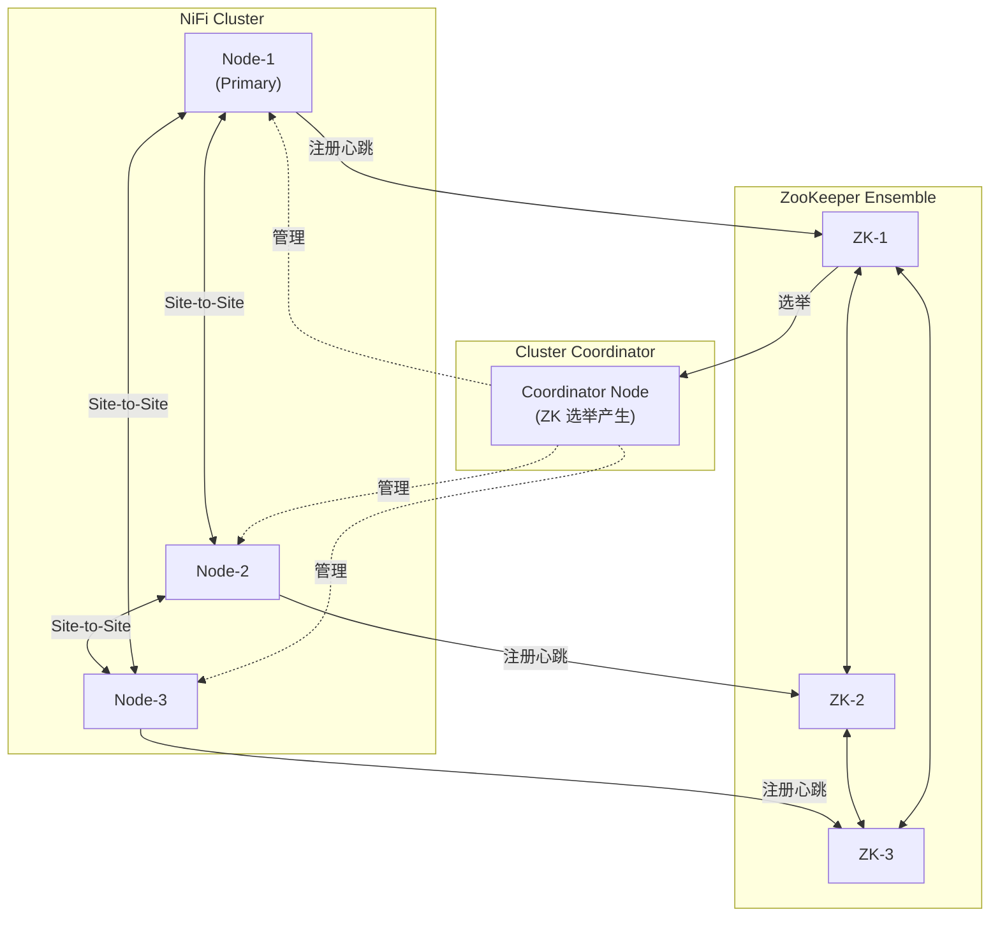

**集群核心机制**：

| 机制 | 说明 | 实现细节 |
|------|------|----------|
| **Zero-Master** | 无固定 Master 节点，所有节点对等 | `ClusterCoordinationProtocolHandler` |
| **Coordinator 选举** | 通过 ZooKeeper 选举 Coordinator 节点 | `CuratorLeaderElectionManager`，使用 Curator Framework 的 LeaderLatch |
| **Flow 同步** | 每个节点运行完整的 Flow 副本 | Flow XML/JSON 通过 `/nifi-api/process-groups/{id}` 下发 |
| **Site-to-Site** | 节点间高效二进制数据传输 | 基于 HTTP/HTTPS 的 RAW 协议或 Socket 协议，支持压缩和批量传输 |
| **心跳机制** | 节点定期向 Coordinator 发送心跳 | 默认 5 秒间隔，超时 2 倍心跳后标记节点断开 |
| **流量负载均衡** | 数据在节点间自动负载均衡 | `LoadBalanceStrategy`：ROUND_ROBIN / SINGLE / PARTITION_BY_ATTRIBUTE |

**Site-to-Site 传输协议源码**：

```java
// 源码位置：nifi-commons/nifi-site-to-site/src/main/java/org/apache/nifi/remote/
public interface SiteToSiteTransportClient {
    // RAW 协议 - 基于 Socket 的二进制传输
    RawClient createRawClient(String host, int port);
    // HTTP 协议 - 基于 HTTP/HTTPS 的传输
    HttpClient createHttpClient(URI uri);
}

// 传输流程
// 1. 请求节点列表 /site-to-site/peers
// 2. 选择目标节点
// 3. 建立传输连接
// 4. 协商协议版本
// 5. 批量传输 FlowFile Content + Attributes
```

---

## 二、连接器（Processor）技术实现

### 2.1 Processor 接口体系

Processor 是 NiFi 的核心抽象，所有数据处理器都实现此接口：

```java
// 源码位置：nifi-api/src/main/java/org/apache/nifi/processor/Processor.java
public interface Processor extends ConfigurableComponent {
    
    /**
     * 核心处理方法 - 每次触发时调用
     * @param context 处理上下文，提供属性访问、状态管理
     * @param session 处理会话，提供 FlowFile CRUD 操作
     */
    void onTrigger(ProcessContext context, ProcessSession session) throws ProcessException;
    
    /**
     * 定义处理器输出关系（路由）
     */
    Set<Relationship> getRelationships();
}
```

**接口继承链**：

```mermaid
classDiagram
    class ConfigurableComponent {
        +initialize(ComponentContext)
        +getSupportedPropertyDescriptors() List~PropertyDescriptor~
        +getSupportedDynamicPropertyDescriptor() PropertyDescriptor
        +validate(ValidationContext) Collection~ValidationResult~
        +getPropertyDescriptor(String) PropertyDescriptor
        +onPropertyModified(PropertyDescriptor, String, String)
        +customValidate(ValidationContext) Collection~ValidationResult~
    }
    
    class Processor {
        +onTrigger(ProcessContext, ProcessSession)
        +getRelationships() Set~Relationship~
    }
    
    class AbstractProcessor {
        #onTrigger(ProcessContext, ProcessSession)
        #getRelationships() Set~Relationship~
    }
    
    class AbstractSessionFactoryProcessor {
        #onTrigger(ProcessContext, ProcessSessionFactory)
    }
    
    ConfigurableComponent <|-- Processor
    Processor <|-- AbstractProcessor
    Processor <|-- AbstractSessionFactoryProcessor
```

### 2.2 生命周期注解

NiFi 通过注解驱动的方式管理 Processor 生命周期，而非强制继承特定基类：

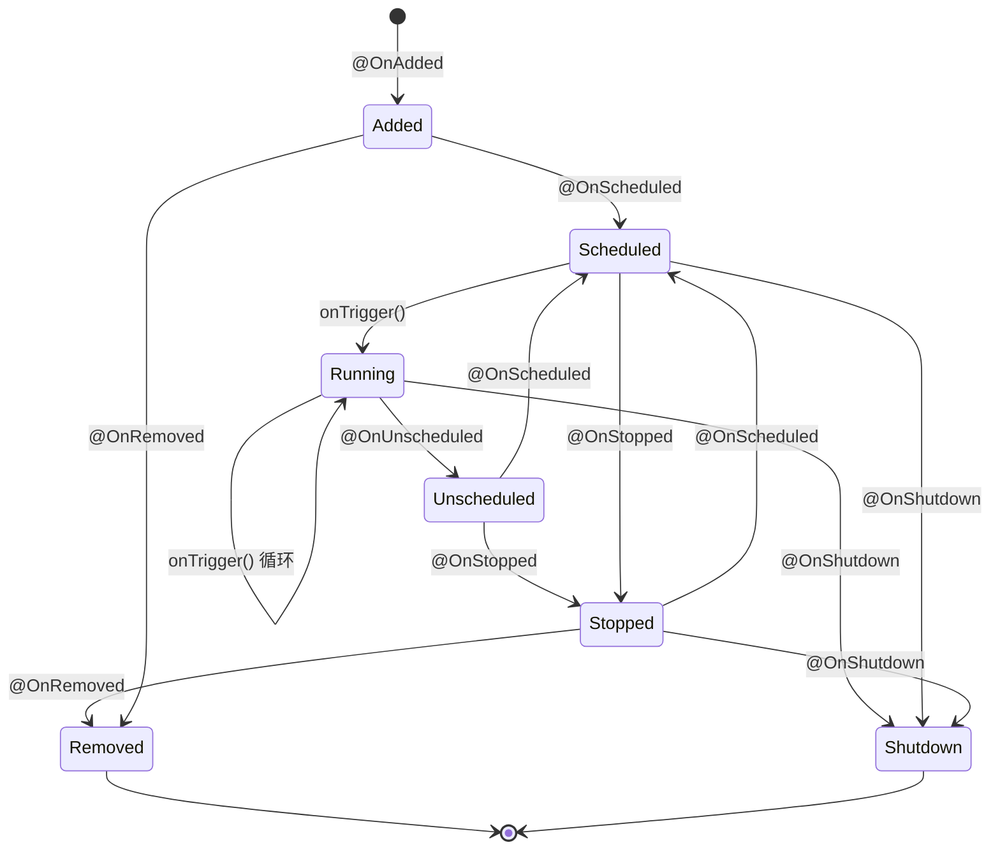

**各注解含义与源码实现**：

| 注解 | 调用时机 | 典型用途 | 源码反射调用点 |
|------|----------|----------|----------------|
| `@OnAdded` | Processor 被添加到画布时 | 初始化内部状态 | `StandardProcessorNode.initProcessor()` |
| `@OnScheduled` | Processor 被调度启动前 | 建立外部连接（DB、HTTP等） | `StandardProcessScheduler.schedule()` |
| `@OnUnscheduled` | Processor 被取消调度后（但未停止） | 暂停处理，准备资源释放 | `StandardProcessScheduler.unschedule()` |
| `@OnStopped` | Processor 完全停止后 | 关闭连接、释放资源 | `StandardProcessScheduler.stop()` |
| `@OnRemoved` | Processor 从画布删除时 | 清理持久化状态 | `StandardFlowController.removeProcessor()` |
| `@OnShutdown` | NiFi 实例关闭时 | 优雅关闭外部连接 | `StandardFlowController.shutdown()` |

**生命周期注解反射调用机制**：

```java
// 源码位置：nifi-framework-core/.../org/apache/nifi/controller/StandardProcessorNode.java
public class StandardProcessorNode extends ComponentNode implements ProcessorNode {
    
    // 通过反射扫描注解方法并缓存
    private final ConcurrentMap<Class<? extends Annotation>, List<Method>> annotationMethodCache;
    
    private void invokeMethodsWithAnnotation(
            Class<? extends Annotation> annotation,
            ProcessContext context,
            ProcessSessionFactory sessionFactory) {
        
        List<Method> methods = annotationMethodCache.computeIfAbsent(annotation, 
            anno -> {
                List<Method> found = new ArrayList<>();
                for (Method m : processor.getClass().getMethods()) {
                    if (m.isAnnotationPresent(anno)) {
                        m.setAccessible(true);
                        found.add(m);
                    }
                }
                return found;
            });
        
        for (Method method : methods) {
            try {
                // 支持多种参数签名：ProcessContext, ProcessSessionFactory 等
                Class<?>[] paramTypes = method.getParameterTypes();
                Object[] args = buildMethodArguments(paramTypes, context, sessionFactory);
                method.invoke(processor, args);
            } catch (Exception e) {
                throw new ProcessException(
                    "Failed to invoke @" + annotation.getSimpleName(), e);
            }
        }
    }
}
```

### 2.3 类型体系

通过注解和 Relationship 定义区分不同类型的 Processor：

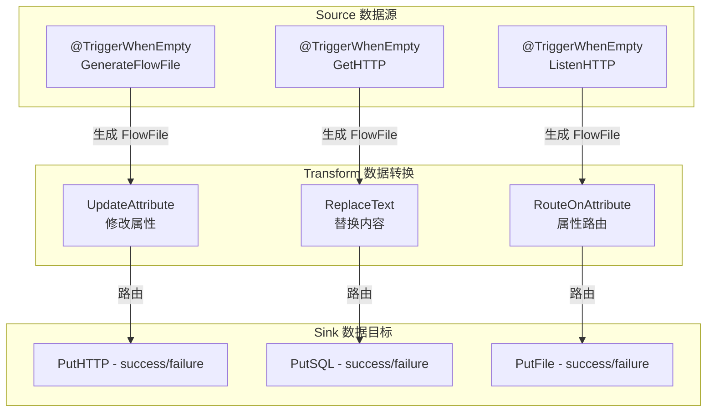

**Source 类型判断**：当 Processor 标注了 `@TriggerWhenEmpty`，调度器会在输入队列为空时仍然触发该 Processor，这就是 Source 处理器的核心特征。

```java
// 源码位置：nifi-api/.../org/apache/nifi/annotation/behavior/TriggerWhenEmpty.java
@Documented
@Target({ElementType.TYPE})
@Retention(RetentionPolicy.RUNTIME)
public @interface TriggerWhenEmpty {
    // 标记此 Processor 即使在输入队列为空时也应被触发
    // 适用于数据源类型的 Processor（如 GenerateFlowFile, GetHTTP 等）
}

// 调度器中的判断逻辑
// 源码位置：nifi-framework-core/.../scheduling/StandardProcessScheduler.java
boolean isTriggerWhenEmpty = processor.getClass()
    .isAnnotationPresent(TriggerWhenEmpty.class);
if (isTriggerWhenEmpty || connection.hasData()) {
    // 执行 onTrigger
    processContext.yield();
    processor.onTrigger(context, sessionFactory);
}
```


### 2.4 PropertyDescriptor 配置模型

PropertyDescriptor 是 NiFi 的核心配置模型，采用 Builder 模式构建，支持属性依赖、动态属性、校验器等高级特性：

```java
// 源码位置：nifi-api/.../org/apache/nifi/processor/PropertyDescriptor.java
public final class PropertyDescriptor implements Comparable<PropertyDescriptor> {
    private final String name;
    private final String displayName;
    private final String description;
    private final String defaultValue;
    private final boolean required;
    private final boolean sensitive;
    private final boolean dynamic;
    private final Set<String> allowableValues;
    private final Validator validator;
    private final PropertyDescriptor dependsOn;  // 属性依赖
    private final Class<? extends ControllerService> controllerServiceDefinition;
    
    public static class Builder {
        private String name;
        private String displayName;
        private String description = "";
        private String defaultValue = null;
        private boolean required = false;
        private boolean sensitive = false;
        private boolean dynamic = false;
        private Set<String> allowableValues = null;
        private Validator validator = Validator.VALID;
        private PropertyDescriptor dependsOn = null;
        private Class<? extends ControllerService> controllerServiceDefinition = null;
        
        public Builder name(String name) { this.name = name; return this; }
        public Builder displayName(String displayName) { 
            this.displayName = displayName; return this; }
        public Builder description(String description) { 
            this.description = description; return this; }
        public Builder defaultValue(String defaultValue) { 
            this.defaultValue = defaultValue; return this; }
        public Builder required(boolean required) { 
            this.required = required; return this; }
        public Builder sensitive(boolean sensitive) { 
            this.sensitive = sensitive; return this; }
        public Builder dynamic(boolean dynamic) { 
            this.dynamic = dynamic; return this; }
        public Builder addValidator(Validator validator) { 
            this.validator = (this.validator == Validator.VALID) 
                ? validator : new ValidatorChain(this.validator, validator); 
            return this; }
        public Builder dependsOn(PropertyDescriptor dependency) { 
            this.dependsOn = dependency; return this; }
        public Builder identifesControllerService(Class<? extends ControllerService> cs) { 
            this.controllerServiceDefinition = cs; return this; }
        
        public PropertyDescriptor build() {
            if (name == null) throw new IllegalStateException("Name must be specified");
            return new PropertyDescriptor(this);
        }
    }
}
```

**属性依赖与 Validator 体系示例**：

```java
// DBCPConnectionPool 的属性依赖配置
public class DBCPConnectionPool extends AbstractControllerService {
    
    static final PropertyDescriptor DATABASE_URL = new PropertyDescriptor.Builder()
        .name("Database Connection URL")
        .description("JDBC连接URL")
        .required(true)
        .addValidator(StandardValidators.URL_VALIDATOR)
        .build();
    
    static final PropertyDescriptor DB_USER = new PropertyDescriptor.Builder()
        .name("Database User")
        .description("数据库用户名")
        .required(true)
        .addValidator(StandardValidators.NON_EMPTY_VALIDATOR)
        .dependsOn(DATABASE_URL)  // 仅当 DATABASE_URL 有值时才显示
        .build();
    
    static final PropertyDescriptor DB_PASSWORD = new PropertyDescriptor.Builder()
        .name("Database Password")
        .description("数据库密码")
        .required(true)
        .sensitive(true)           // 前端以密码框显示
        .addValidator(StandardValidators.NON_EMPTY_VALIDATOR)
        .dependsOn(DATABASE_URL)
        .build();
    
    static final PropertyDescriptor MAX_POOL_SIZE = new PropertyDescriptor.Builder()
        .name("Max Pool Size")
        .description("最大连接数")
        .defaultValue("10")
        .required(true)
        .addValidator(StandardValidators.POSITIVE_INTEGER_VALIDATOR)
        .build();
}

// Validator 接口与标准校验器
public interface Validator {
    ValidationResult validate(String subject, String input, ValidationContext context);
    
    Validator VALID = (subject, input, context) -> 
        new ValidationResult.Builder().subject(subject).input(input).valid(true).build();
}

public class StandardValidators {
    public static final Validator NON_EMPTY_VALIDATOR = (subject, input, context) -> {
        boolean valid = input != null && !input.trim().isEmpty();
        return new ValidationResult.Builder()
            .subject(subject).input(input).valid(valid)
            .explanation(valid ? "" : "必须非空").build();
    };
    
    public static final Validator POSITIVE_INTEGER_VALIDATOR = (subject, input, context) -> {
        boolean valid = false;
        try { valid = Integer.parseInt(input) > 0; } catch (Exception e) { }
        return new ValidationResult.Builder()
            .subject(subject).input(input).valid(valid)
            .explanation(valid ? "" : "必须是正整数").build();
    };
    
    public static final Validator URL_VALIDATOR = ...;
    public static final Validator PORT_VALIDATOR = ...;
    public static final Validator REGEX_VALIDATOR = ...;
    public static final Validator BOOLEAN_VALIDATOR = ...;
    public static final Validator DATA_SIZE_VALIDATOR = ...;
    public static final Validator TIME_PERIOD_VALIDATOR = ...;
}
```

**动态属性**：通过 `dynamic(true)` 标记的属性允许用户自行添加键值对配置：

```java
// 动态属性示例 - UpdateAttribute 处理器
static final PropertyDescriptor DYNAMIC_PROP = new PropertyDescriptor.Builder()
    .name("")
    .description("动态属性 - 用户可添加任意键值对")
    .dynamic(true)
    .addValidator(StandardValidators.ATTRIBUTE_EXPRESSION_LANGUAGE_VALIDATOR)
    .build();

@Override
protected PropertyDescriptor getSupportedDynamicPropertyDescriptor(
        String propertyDescriptorName) {
    return new PropertyDescriptor.Builder()
        .name(propertyDescriptorName)
        .description("用户自定义属性: " + propertyDescriptorName)
        .dynamic(true)
        .addValidator(StandardValidators.ATTRIBUTE_EXPRESSION_LANGUAGE_VALIDATOR)
        .build();
}
```

### 2.5 Relationship 定义输出路由

Relationship 定义了 Processor 处理结果的输出路由方向：

```java
// 源码位置：nifi-api/.../org/apache/nifi/processor/Relationship.java
public final class Relationship {
    private final String name;
    private final String description;
    
    public static class Builder {
        private String name;
        private String description;
        public Builder name(String name) { this.name = name; return this; }
        public Builder description(String description) { 
            this.description = description; return this; }
        public Relationship build() { return new Relationship(this); }
    }
}

// 典型 Relationship 定义
public class MyProcessor extends AbstractProcessor {
    static final Relationship REL_SUCCESS = new Relationship.Builder()
        .name("success").description("处理成功的 FlowFile").build();
    
    static final Relationship REL_FAILURE = new Relationship.Builder()
        .name("failure").description("处理失败的 FlowFile").build();
    
    // 自定义路由关系
    static final Relationship REL_MATCH = new Relationship.Builder()
        .name("matched").description("匹配条件的 FlowFile").build();
    
    static final Relationship REL_UNMATCH = new Relationship.Builder()
        .name("unmatched").description("不匹配条件的 FlowFile").build();
    
    @Override
    public Set<Relationship> getRelationships() {
        return Set.of(REL_SUCCESS, REL_FAILURE);
    }
}
```

### 2.6 自定义 Processor 开发模板

以下是一个完整的自定义 Processor 开发模板，演示从数据源获取消息并处理的完整流程：

```java
package com.example.nifi.processors;

import org.apache.nifi.annotation.behavior.EventDriven;
import org.apache.nifi.annotation.behavior.InputRequirement;
import org.apache.nifi.annotation.behavior.TriggerWhenEmpty;
import org.apache.nifi.annotation.behavior.WritesAttribute;
import org.apache.nifi.annotation.documentation.CapabilityDescription;
import org.apache.nifi.annotation.documentation.Tags;
import org.apache.nifi.annotation.lifecycle.OnScheduled;
import org.apache.nifi.annotation.lifecycle.OnStopped;
import org.apache.nifi.components.PropertyDescriptor;
import org.apache.nifi.components.Validator;
import org.apache.nifi.expression.ExpressionLanguageScope;
import org.apache.nifi.flowfile.FlowFile;
import org.apache.nifi.processor.AbstractProcessor;
import org.apache.nifi.processor.ProcessContext;
import org.apache.nifi.processor.ProcessSession;
import org.apache.nifi.processor.ProcessorInitializationContext;
import org.apache.nifi.processor.Relationship;
import org.apache.nifi.processor.exception.ProcessException;
import org.apache.nifi.processor.util.StandardValidators;
import java.util.*;
import java.util.concurrent.atomic.AtomicReference;

@EventDriven
@TriggerWhenEmpty
@InputRequirement(InputRequirement.Requirement.INPUT_FORBIDDEN)
@Tags({"example", "custom", "source"})
@CapabilityDescription("从自定义数据源拉取消息并生成 FlowFile")
@WritesAttribute("custom.message.id")
public class CustomSourceProcessor extends AbstractProcessor {

    // ========== 关系定义 ==========
    static final Relationship REL_SUCCESS = new Relationship.Builder()
        .name("success").description("成功获取的消息").build();
    static final Relationship REL_FAILURE = new Relationship.Builder()
        .name("failure").description("处理失败的消息").build();
    private Set<Relationship> relationships;

    // ========== 属性定义 ==========
    static final PropertyDescriptor SOURCE_URL = new PropertyDescriptor.Builder()
        .name("Source URL").description("数据源 URL").required(true)
        .addValidator(StandardValidators.URL_VALIDATOR)
        .expressionLanguageSupported(ExpressionLanguageScope.VARIABLE_REGISTRY)
        .build();
    static final PropertyDescriptor POLL_INTERVAL = new PropertyDescriptor.Builder()
        .name("Poll Interval").description("轮询间隔(毫秒)").required(true)
        .defaultValue("1000")
        .addValidator(StandardValidators.POSITIVE_INTEGER_VALIDATOR).build();
    static final PropertyDescriptor BATCH_SIZE = new PropertyDescriptor.Builder()
        .name("Batch Size").description("每次拉取的最大消息数").required(true)
        .defaultValue("100")
        .addValidator(StandardValidators.POSITIVE_INTEGER_VALIDATOR).build();
    static final PropertyDescriptor AUTH_TOKEN = new PropertyDescriptor.Builder()
        .name("Auth Token").description("认证令牌").required(false)
        .sensitive(true).addValidator(Validator.VALID).build();
    private List<PropertyDescriptor> descriptors;

    // ========== 运行时状态 ==========
    private final AtomicReference<CustomSourceClient> clientRef = 
        new AtomicReference<>();

    @Override
    protected void init(ProcessorInitializationContext context) {
        // 初始化关系集合
        relationships = Collections.unmodifiableSet(
            new HashSet<>(Arrays.asList(REL_SUCCESS, REL_FAILURE)));
        // 初始化属性列表
        descriptors = Collections.unmodifiableList(
            Arrays.asList(SOURCE_URL, POLL_INTERVAL, BATCH_SIZE, AUTH_TOKEN));
    }

    @OnScheduled
    public void onScheduled(ProcessContext context) {
        // 建立 Client 连接
        String url = context.getProperty(SOURCE_URL).evaluateAttributeExpressions()
            .getValue();
        String token = context.getProperty(AUTH_TOKEN).getValue();
        CustomSourceClient client = new CustomSourceClient(url, token);
        client.connect();
        clientRef.set(client);
        getLogger().info("CustomSourceClient connected to: " + url);
    }

    @Override
    public void onTrigger(ProcessContext context, ProcessSession session) 
            throws ProcessException {
        CustomSourceClient client = clientRef.get();
        if (client == null || !client.isConnected()) {
            context.yield();  // 暂停调度，等待下次触发
            return;
        }
        
        int batchSize = context.getProperty(BATCH_SIZE).asInteger();
        List<Message> messages = client.poll(batchSize);
        
        if (messages.isEmpty()) {
            context.yield();  // 无数据时暂停
            return;
        }
        
        for (Message msg : messages) {
            FlowFile flowFile = session.create();
            try {
                // 写入内容
                flowFile = session.write(flowFile, out -> {
                    out.write(msg.getPayload().getBytes("UTF-8"));
                });
                // 设置属性
                flowFile = session.putAttribute(flowFile, "custom.message.id", 
                    msg.getId());
                flowFile = session.putAttribute(flowFile, "custom.message.timestamp", 
                    String.valueOf(msg.getTimestamp()));
                // 路由到成功关系
                session.transfer(flowFile, REL_SUCCESS);
                session.getProvenanceReporter().receive(flowFile, 
                    client.getUrl(), "Received message from custom source");
            } catch (Exception e) {
                // 路由到失败关系
                session.transfer(flowFile, REL_FAILURE);
                getLogger().error("Failed to process message: " + msg.getId(), e);
            }
        }
        session.commit();  // 提交事务
    }

    @OnStopped
    public void onStopped() {
        CustomSourceClient client = clientRef.getAndSet(null);
        if (client != null) {
            client.disconnect();
            getLogger().info("CustomSourceClient disconnected");
        }
    }

    @Override
    public Set<Relationship> getRelationships() { return relationships; }
    @Override
    protected List<PropertyDescriptor> getSupportedPropertyDescriptors() { 
        return descriptors; }
}
```

### 2.7 NAR 包加载机制

NAR（NiFi Archive）是 NiFi 的扩展打包格式，基于 Maven 的 WAR/JAR 打包模型，增加了 ClassLoader 隔离机制：

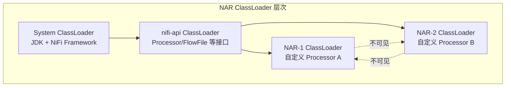

**NAR 加载核心源码**：

```java
// 源码位置：nifi-framework-core/.../org/apache/nifi/nar/NarClassLoaders.java
public class NarClassLoaders {
    
    // NAR ClassLoader 注册表
    private final ConcurrentMap<String, ClassLoader> classLoaders = 
        new ConcurrentHashMap<>();
    
    public void load(File narDirectory) {
        for (File narFile : narDirectory.listFiles((dir, name) -> 
                name.endsWith(".nar"))) {
            // 1. 解析 NAR 的 META-INF/MANIFEST.MF
            NarManifest manifest = NarManifest.parse(narFile);
            
            // 2. 创建隔离的 ClassLoader
            //    父 ClassLoader 为 nifi-api，确保接口共享
            ClassLoader parent = getClass().getClassLoader();
            NarClassLoader narCl = new NarClassLoader(narFile, parent);
            
            // 3. 注册到 ClassLoader 映射表
            classLoaders.put(manifest.getBundleId(), narCl);
            
            // 4. 通过 ServiceLoader 发现 Processor 实现
            ServiceLoader<Processor> processors = 
                ServiceLoader.load(Processor.class, narCl);
            for (Processor processor : processors) {
                registerProcessor(manifest.getBundleId(), processor);
            }
        }
    }
}

// NAR 的 MANIFEST.MF 配置
// Bundle-Id: com.example.nifi.custom-processors
// Bundle-Version: 1.0.0
// NiFi-Processor: com.example.nifi.processors.CustomSourceProcessor
```

**热加载机制**：NiFi 支持运行时加载新的 NAR 包，无需重启服务：

```java
// 源码位置：nifi-framework-core/.../ExtensionManager.java
public interface ExtensionManager {
    // 注册新发现的扩展
    void registerExtension(Class<?> extensionClass, String bundleId);
    
    // 获取所有已注册的 Processor 类型
    Set<Class<? extends Processor>> getProcessors();
    
    // 热加载：监听 NAR 目录变化
    void watchNarDirectory(File narDir);
}
```

---

## 三、连接流（Flow）数据模型

### 3.1 FlowFile 结构

FlowFile 是 NiFi 数据流的核心数据模型，由三部分组成：Content（内容）、Attributes（属性元数据）和 ResourceClaim（资源声明）：

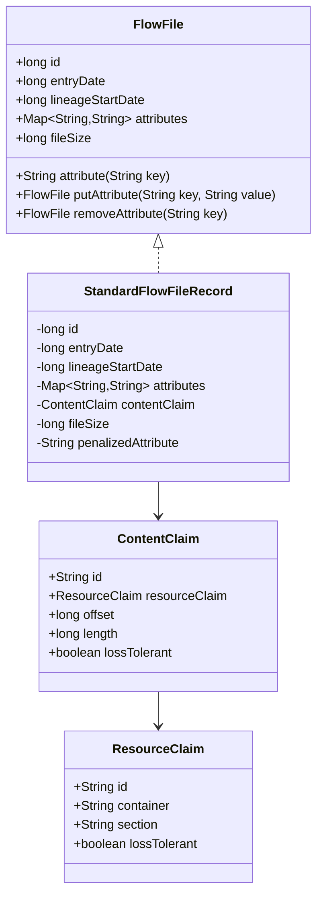

**FlowFile 核心源码**：

```java
// 源码位置：nifi-api/.../org/apache/nifi/flowfile/FlowFile.java
public interface FlowFile {
    long getId();                    // 全局唯一 ID
    long getEntryDate();             // 进入当前 Connection 的时间
    long getLineageStartDate();      // 血缘起始时间
    long getFileSize();              // 内容大小
    String getAttribute(String key); // 获取属性
    Map<String, String> getAttributes(); // 获取所有属性
    
    // 常用内置属性
    // filename     - 文件名
    // path         - 路径
    // uuid         - 唯一标识
    // absolute.path - 绝对路径
}

// 源码位置：nifi-framework-core/.../StandardFlowFileRecord.java
public class StandardFlowFileRecord implements FlowFile {
    private final long id;
    private final long entryDate;
    private final long lineageStartDate;
    private final Map<String, String> attributes;
    private final ContentClaim contentClaim;
    private final long fileSize;
    
    // Builder 模式构建
    public static class Builder {
        private long id;
        private long entryDate = System.currentTimeMillis();
        private Map<String, String> attributes = new HashMap<>();
        private ContentClaim contentClaim;
        private long fileSize;
        
        public Builder id(long id) { this.id = id; return this; }
        public Builder addAttribute(String key, String value) { 
            this.attributes.put(key, value); return this; }
        public Builder contentClaim(ContentClaim claim) { 
            this.contentClaim = claim; return this; }
        public Builder fileSize(long size) { this.fileSize = size; return this; }
        
        public StandardFlowFileRecord build() {
            return new StandardFlowFileRecord(this);
        }
    }
}
```

### 3.2 FlowFile Repository（WAL 写前日志）

FlowFile Repository 采用 WAL（Write-Ahead Log）机制确保 FlowFile 状态的持久化和恢复：

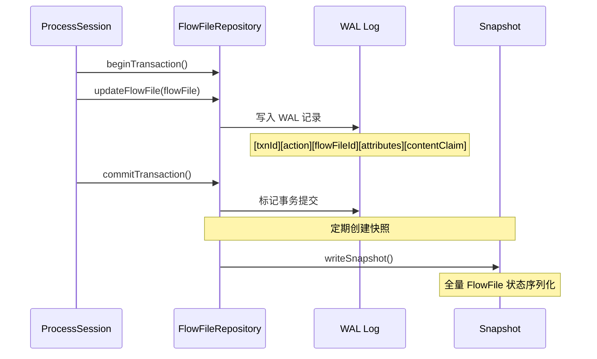

**FlowFile Repository 实现源码**：

```java
// 源码位置：nifi-framework-core/.../repository/WriteAheadFlowFileRepository.java
public class WriteAheadFlowFileRepository implements FlowFileRepository {
    
    private final WriteAheadRepository writeAheadRepository;
    private final int maxCheckpoints;  // 最大检查点数
    private final long checkpointIntervalMillis;  // 检查点间隔
    
    @Override
    public void update(RepositoryRecord record) {
        // 根据 Record 类型执行不同的 WAL 操作
        switch (record.getType()) {
            case CREATE:
                writeAheadRepository.update(record, 
                    UpdateType.CREATE);     // 创建 FlowFile
                break;
            case CONTENT_UPDATED:
                writeAheadRepository.update(record, 
                    UpdateType.UPDATE);     // 更新内容
                break;
            case ATTRIBUTES_UPDATED:
                writeAheadRepository.update(record, 
                    UpdateType.UPDATE);     // 更新属性
                break;
            case DELETE:
                writeAheadRepository.update(record, 
                    UpdateType.DELETE);     // 删除 FlowFile
                break;
        }
    }
    
    @Override
    public void checkpoint() {
        // 创建全量快照
        // 1. 获取当前所有活跃的 FlowFile
        // 2. 序列化为二进制格式
        // 3. 写入新的 Snapshot 文件
        // 4. 清理旧的 WAL 日志
        writeAheadRepository.checkpoint();
    }
    
    @Override
    public void restore() {
        // 恢复流程
        // 1. 读取最新的 Snapshot
        // 2. 重放 Snapshot 之后的 WAL 日志
        // 3. 重建 FlowFile 状态
        writeAheadRepository.recover();
    }
}
```

**WAL 记录格式**：

```
// WAL 记录二进制格式
// [Transaction ID: long][Action Type: byte][FlowFile ID: long]
// [Entry Date: long][Lineage Start Date: long]
// [Attribute Count: int]
//   [Key Length: short][Key: UTF-8][Value Length: short][Value: UTF-8]
// [Content Claim Container: UTF-8][Section: UTF-8][ID: UTF-8]
// [Offset: long][Length: long]
```

### 3.3 Content Repository（文件系统存储）

Content Repository 负责存储 FlowFile 的实际内容数据，采用文件系统分片存储：

```java
// 源码位置：nifi-framework-core/.../repository/FileSystemRepository.java
public class FileSystemRepository implements ContentRepository {
    
    // 存储容器配置 - 支持多个存储目录
    // nifi.content.repository.implementation=org.apache.nifi.controller.repository.FileSystemRepository
    // nifi.content.repository.directory.default=./content_repository
    // nifi.content.repository.directory.archive=./content_archive
    
    private final Map<String, Path> containers;  // 容器名 -> 目录路径
    private final int maxArchiveSize;            // 最大归档大小
    private final long maxContentLifetime;        // 内容最大保留时间
    
    @Override
    public ContentClaim create(boolean lossTolerant) {
        // 1. 选择容器（轮询或基于空间）
        String container = selectContainer();
        // 2. 选择分区（基于时间的分区策略）
        String section = createSection();
        // 3. 生成唯一 ID
        String id = UUID.randomUUID().toString();
        // 4. 创建 ContentClaim
        return new StandardContentClaim(container, section, id, lossTolerant);
    }
    
    @Override
    public OutputStream write(ContentClaim claim) {
        Path path = getPath(claim);
        return Files.newOutputStream(path, 
            StandardOpenOption.CREATE, StandardOpenOption.WRITE);
    }
    
    @Override
    public InputStream read(ContentClaim claim) {
        Path path = getPath(claim);
        return Files.newInputStream(path);
    }
    
    // 分区策略：按时间创建子目录
    // content_repository/
    //   ├── 2026/
    //   │   ├── 05/
    //   │   │   ├── 15/
    //   │   │   │   ├── abc-123-def.content
    //   │   │   │   └── xyz-456-ghi.content
}
```

### 3.4 Provenance Repository（数据溯源）

Provenance Repository 记录每个 FlowFile 的完整数据流转历史：

```java
// 源码位置：nifi-framework-core/.../provenance/PersistentProvenanceRepository.java
public class PersistentProvenanceRepository implements ProvenanceRepository {
    
    // 存储配置
    // nifi.provenance.repository.implementation=
    //   org.apache.nifi.provenance.PersistentProvenanceRepository
    // nifi.provenance.repository.directory.default=./provenance_repository
    // nifi.provenance.repository.max.storage.time=24 hours
    // nifi.provenance.repository.max.storage.size=1 GB
    
    @Override
    public void register(ProvenanceEventRecord event) {
        // Provenance 事件类型
        // CREATE      - FlowFile 被创建
        // RECEIVE     - 从外部接收
        // FETCH       - 从外部获取内容
        // SEND        - 发送到外部
        // ROUTE       - 路由到不同关系
        // CLONE       - 克隆 FlowFile
        // CONTENT_MODIFIED - 内容被修改
        // ATTRIBUTES_MODIFIED - 属性被修改
        // FORK        - 分叉成多个 FlowFile
        // JOIN        - 多个 FlowFile 合并
        // DROP        - FlowFile 被丢弃
        
        eventWriter.write(event);
    }
    
    @Override
    public ProvenanceEventRecord getEvent(long eventId) {
        // 通过事件 ID 查询
        return eventStore.getEvent(eventId);
    }
    
    @Override
    public List<ProvenanceEventRecord> getEvents(
            ProvenanceQuery query, int maxResults) {
        // 支持多种查询条件
        // - by FlowFile UUID
        // - by Processor ID
        // - by time range
        // - by event type
        // - by attribute filter
        return eventStore.query(query, maxResults);
    }
}
```

**Provenance 事件记录结构**：

```java
// 源码位置：nifi-api/.../provenance/ProvenanceEventRecord.java
public class ProvenanceEventRecord {
    private long eventId;               // 事件 ID（递增）
    private EventType eventType;        // 事件类型
    private long eventTime;             // 事件时间
    private String flowFileUuid;        // FlowFile UUID
    private String componentId;         // Processor ID
    private String componentType;       // Processor 类型
    private String componentName;       // Processor 名称
    private Map<String, String> attributes;     // 事件属性
    private Map<String, String> previousAttributes; // 变更前属性
    private String sourceSystemFlowFileIdentifier;  // 来源标识
    private ContentClaim previousContentClaim;   // 变更前内容
    private ContentClaim contentClaim;           // 当前内容
    private long contentSize;           // 内容大小
    private long previousContentSize;   // 变更前内容大小
    private Set<String> parentUuids;    // 父 FlowFile UUID
    private Set<String> childUuids;     // 子 FlowFile UUID
}
```

### 3.5 Flow 定义格式

NiFi 的 Flow 定义以 JSON 或 XML（flow.xml.gz）格式持久化：

```json
{
  "flowContents": {
    "identifier": "root-group-id",
    "name": "NiFi Flow",
    "processors": [
      {
        "identifier": "processor-uuid-1",
        "name": "GenerateFlowFile",
        "type": "org.apache.nifi.processors.standard.GenerateFlowFile",
        "bundle": {
          "group": "org.apache.nifi",
          "artifact": "nifi-standard-processors",
          "version": "2.x.x"
        },
        "position": { "x": 100, "y": 200 },
        "config": {
          "properties": {
            "File Size": "0B",
            "Batch Size": "1",
            "Data Format": "Text"
          },
          "concurrentlySchedulableTaskCount": 1,
          "schedulingStrategy": "TIMER_DRIVEN",
          "schedulingPeriod": "0 sec",
          "penaltyDuration": "30 sec",
          "yieldDuration": "1 sec",
          "autoTerminatedRelationships": []
        }
      }
    ],
    "connections": [
      {
        "identifier": "connection-uuid-1",
        "name": "",
        "source": { "id": "processor-uuid-1", "name": "GenerateFlowFile" },
        "destination": { "id": "processor-uuid-2", "name": "UpdateAttribute" },
        "selectedRelationships": ["success"],
        "backPressureObjectThreshold": 10000,
        "backPressureDataSizeThreshold": "1 GB",
        "flowFileExpiration": "0 sec"
      }
    ],
    "processGroups": [],
    "remoteProcessGroups": [],
    "funnels": [],
    "ports": []
  }
}
```

### 3.6 ProcessGroup 嵌套模型

ProcessGroup 支持 infinitely nested 嵌套，形成 Flow 的层级结构：

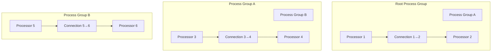

### 3.7 Connection 背压机制

Connection 是 Processor 之间的数据通道，内置背压（Back Pressure）机制防止数据积压溢出：

```java
// 源码位置：nifi-framework-core/.../controller/queue/StandardConnection.java
public class StandardConnection implements Connection {
    
    private final FlowFileQueue queue;
    
    // 背压配置
    // backPressureObjectThreshold - 对象数量阈值（默认 10000）
    // backPressureDataSizeThreshold - 数据大小阈值（默认 1GB）
    // flowFileExpiration - FlowFile 过期时间（默认 0=永不过期）
    
    @Override
    public boolean isBackPressureEnabled() {
        return queue.isBackPressureEnabled();
    }
    
    @Override
    public boolean isFull() {
        return queue.isFull();  // 超过阈值时返回 true
    }
    
    // 当 Connection 满时，上游 Processor 会被暂停调度
    // 源码位置：ProcessScheduler 中的判断
    // if (connection.isFull()) {
    //     // 不触发上游 Processor
    //     // 等待下游消费后自动恢复
    // }
}
```

**背压状态流转**：

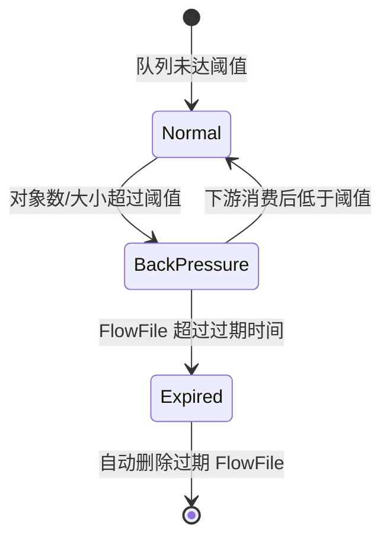

---


## 四、前端拖拽编辑器实现

### 4.1 技术栈与项目结构

NiFi 前端采用 Angular 21 + TypeScript + D3.js，基于 Nx Monorepo 管理多模块：

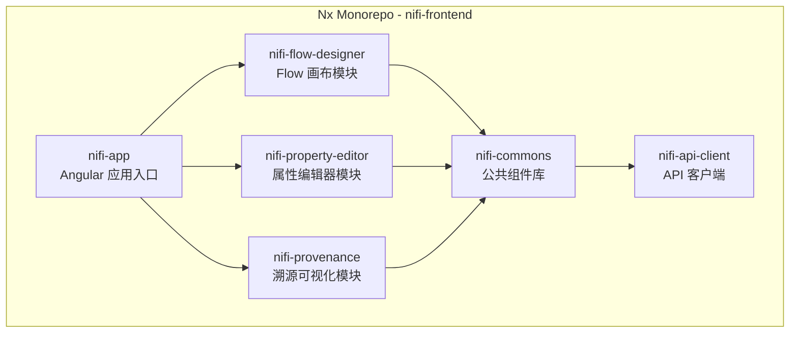

**项目目录结构**：

```
nifi-frontend/
├── apps/
│   └── nifi-app/              # Angular 应用
│       ├── src/
│       │   ├── app/
│       │   │   ├── flow/      # Flow 编辑器
│       │   │   ├── canvas/    # 画布组件
│       │   │   ├── property/  # 属性面板
│       │   │   └── provenance/ # 溯源页面
│       │   └── assets/
│       └── angular.json
├── libs/
│   ├── nifi-flow-designer/    # Flow 设计器库
│   ├── nifi-property-editor/  # 属性编辑器库
│   ├── nifi-provenance/       # 溯源库
│   └── nifi-commons/          # 公共库
├── nx.json                    # Nx 配置
└── package.json
```

### 4.2 画布渲染：D3.js SVG

NiFi 使用 D3.js 进行 SVG 画布渲染，核心渲染流程：

```typescript
// 源码位置：nifi-frontend/libs/nifi-flow-designer/src/lib/canvas/flow-canvas.component.ts

@Component({
    selector: 'nifi-flow-canvas',
    template: `
        <svg #svgCanvas class="flow-canvas"
             [attr.width]="canvasWidth" 
             [attr.height]="canvasHeight">
            <g class="canvas-group" 
               [attr.transform]="transform">
                <!-- 网格背景 -->
                <g class="grid-layer"></g>
                <!-- 连线层 -->
                <g class="connection-layer"></g>
                <!-- 节点层 -->
                <g class="processor-layer"></g>
            </g>
        </svg>
    `
})
export class FlowCanvasComponent implements OnInit, OnDestroy {
    @ViewChild('svgCanvas') svgCanvas: ElementRef<SVGElement>;
    
    private svg: d3.Selection<SVGSVGElement, unknown, null, undefined>;
    private canvasGroup: d3.Selection<SVGGElement, unknown, null, undefined>;
    private zoomBehavior: d3.ZoomBehavior<SVGSVGElement, unknown>;
    
    // 画布状态
    private transform = { x: 0, y: 0, k: 1 };
    
    ngOnInit(): void {
        this.svg = d3.select(this.svgCanvas.nativeElement);
        this.canvasGroup = this.svg.select('.canvas-group');
        
        // 初始化缩放和平移
        this.zoomBehavior = d3.zoom<SVGSVGElement, unknown>()
            .scaleExtent([0.1, 4])  // 缩放范围
            .on('zoom', (event) => {
                this.transform = event.transform;
                this.canvasGroup.attr('transform', event.transform.toString());
            });
        
        this.svg.call(this.zoomBehavior);
        this.initDragBehavior();
        this.renderFlow();
    }
    
    private renderFlow(): void {
        // 渲染顺序：网格 -> 连线 -> 节点（确保节点在连线上方）
        this.renderGrid();
        this.renderConnections();
        this.renderProcessors();
    }
}
```

### 4.3 拖拽交互：D3 drag behavior

```typescript
// 源码位置：nifi-frontend/libs/nifi-flow-designer/src/lib/canvas/drag/processor-drag.handler.ts

export class ProcessorDragHandler {
    
    private dragBehavior: d3.DragBehavior<SVGRectElement, Processor, unknown>;
    
    constructor(private flowService: FlowService) {
        this.dragBehavior = d3.drag<SVGRectElement, Processor>()
            .on('start', this.onDragStart.bind(this))
            .on('drag', this.onDrag.bind(this))
            .on('end', this.onDragEnd.bind(this));
    }
    
    private onDragStart(event: d3.D3DragEvent<SVGRectElement, Processor, unknown>, 
                        datum: Processor): void {
        d3.select(event.sourceEvent.target)
            .raise()  // 将拖拽元素提升到最上层
            .classed('dragging', true);
    }
    
    private onDrag(event: d3.D3DragEvent<SVGRectElement, Processor, unknown>, 
                   datum: Processor): void {
        const scale = this.transform.k;
        datum.position.x += event.dx / scale;
        datum.position.y += event.dy / scale;
        
        // 实时更新 SVG 位置
        d3.select(`#processor-${datum.id}`)
            .attr('transform', `translate(${datum.position.x}, ${datum.position.y})`);
        
        // 同时更新关联的连线
        this.updateConnectedPaths(datum);
    }
    
    private onDragEnd(event: d3.D3DragEvent<SVGRectElement, Processor, unknown>, 
                      datum: Processor): void {
        d3.select(`#processor-${datum.id}`).classed('dragging', false);
        // 保存位置到后端
        this.flowService.updateProcessorPosition(datum.id, datum.position).subscribe();
    }
}
```

### 4.4 节点渲染：SVG rect + icon + label

```typescript
// 源码位置：nifi-frontend/libs/nifi-flow-designer/src/lib/canvas/processor-renderer.ts

export class ProcessorRenderer {
    
    private static readonly PROCESSOR_WIDTH = 180;
    private static readonly PROCESSOR_HEIGHT = 80;
    private static readonly ICON_SIZE = 24;
    private static readonly BORDER_RADIUS = 4;
    
    renderProcessors(processors: Processor[], 
                     container: d3.Selection<SVGGElement, unknown, null, undefined>): void {
        
        // D3 Data Join 模式
        const processorGroups = container.selectAll<SVGGElement, Processor>('.processor')
            .data(processors, d => d.id)
            .join(
                enter => this.enterProcessor(enter),
                update => this.updateProcessor(update),
                exit => this.exitProcessor(exit)
            );
        
        // 绑定拖拽行为
        processorGroups.call(this.dragHandler.getDragBehavior());
    }
    
    private enterProcessor(enter: d3.Selection<SVGGElement, Processor, SVGGElement, unknown>) {
        const group = enter.append('g')
            .attr('class', 'processor')
            .attr('id', d => `processor-${d.id}`)
            .attr('transform', d => `translate(${d.position.x}, ${d.position.y})`);
        
        // 处理器外框
        group.append('rect')
            .attr('class', 'processor-border')
            .attr('width', ProcessorRenderer.PROCESSOR_WIDTH)
            .attr('height', ProcessorRenderer.PROCESSOR_HEIGHT)
            .attr('rx', ProcessorRenderer.BORDER_RADIUS)
            .attr('ry', ProcessorRenderer.BORDER_RADIUS)
            .attr('fill', '#fff')
            .attr('stroke', d => this.getRunningStateColor(d.state))
            .attr('stroke-width', 2);
        
        // 图标区域
        group.append('rect')
            .attr('class', 'processor-icon-bg')
            .attr('x', 4).attr('y', 4)
            .attr('width', ProcessorRenderer.ICON_SIZE + 8)
            .attr('height', ProcessorRenderer.PROCESSOR_HEIGHT - 8)
            .attr('rx', 2).attr('fill', '#e8e8e8');
        
        // 图标
        group.append('image')
            .attr('class', 'processor-icon')
            .attr('x', 8).attr('y', 8)
            .attr('width', ProcessorRenderer.ICON_SIZE)
            .attr('height', ProcessorRenderer.ICON_SIZE)
            .attr('href', d => this.getProcessorIcon(d.type));
        
        // 处理器名称
        group.append('text')
            .attr('class', 'processor-name')
            .attr('x', 44).attr('y', 24)
            .attr('font-size', '12px')
            .attr('font-weight', 'bold')
            .text(d => this.truncateText(d.name, 18));
        
        // 运行状态指示器
        group.append('circle')
            .attr('class', 'status-indicator')
            .attr('cx', ProcessorRenderer.PROCESSOR_WIDTH - 12)
            .attr('cy', 12).attr('r', 5)
            .attr('fill', d => this.getRunningStateColor(d.state));
        
        this.renderPorts(group);
        return group;
    }
    
    private getRunningStateColor(state: string): string {
        switch (state) {
            case 'RUNNING': return '#00c853';    // 绿色
            case 'STOPPED': return '#ff1744';    // 红色
            case 'DISABLED': return '#9e9e9e';   // 灰色
            case 'INVALID': return '#ff9100';    // 橙色
            default: return '#2196f3';           // 蓝色
        }
    }
}
```

### 4.5 连线渲染：D3 curve/line

```typescript
// 源码位置：nifi-frontend/libs/nifi-flow-designer/src/lib/canvas/connection-renderer.ts

export class ConnectionRenderer {
    
    renderConnections(connections: Connection[], 
                      container: d3.Selection<SVGGElement, unknown, null, undefined>,
                      processors: Map<string, Processor>): void {
        
        container.selectAll<SVGPathElement, Connection>('.connection')
            .data(connections, d => d.id)
            .join(
                enter => this.enterConnection(enter, processors),
                update => this.updateConnection(update, processors),
                exit => exit.remove()
            );
    }
    
    private calculatePath(connection: Connection, 
                          processors: Map<string, Processor>): string {
        const source = processors.get(connection.sourceId);
        const dest = processors.get(connection.destinationId);
        if (!source || !dest) return '';
        
        const sourcePort = this.getSourcePort(source, dest);
        const destPort = this.getDestPort(source, dest);
        
        // 贝塞尔曲线
        const dx = destPort.x - sourcePort.x;
        const curvature = 0.5;
        const cx1 = sourcePort.x + dx * curvature;
        const cx2 = destPort.x - dx * curvature;
        
        return `M ${sourcePort.x} ${sourcePort.y} ` +
               `C ${cx1} ${sourcePort.y}, ${cx2} ${destPort.y}, ${destPort.x} ${destPort.y}`;
    }
}
```

### 4.6 属性面板：Angular 组件

```typescript
// 源码位置：nifi-frontend/libs/nifi-property-editor/src/lib/property-panel.component.ts

@Component({
    selector: 'nifi-property-panel',
    template: `
        <div class="property-panel" *ngIf="processor">
            <div class="panel-header">
                <h3>{{ processor.name }}</h3>
                <span class="processor-type">{{ processor.type }}</span>
            </div>
            
            <div class="panel-tabs">
                <button [class.active]="activeTab === 'properties'" 
                        (click)="activeTab = 'properties'">Properties</button>
                <button [class.active]="activeTab === 'scheduling'"
                        (click)="activeTab = 'scheduling'">Scheduling</button>
            </div>
            
            <!-- 属性配置表单 -->
            <div class="properties-tab" *ngIf="activeTab === 'properties'">
                <div *ngFor="let prop of propertyDescriptors" 
                     class="property-row"
                     [class.hidden]="!isPropertyVisible(prop)">
                    
                    <label [attr.for]="prop.name">{{ prop.displayName }}</label>
                    <span class="required" *ngIf="prop.required">*</span>
                    
                    <!-- 文本输入 -->
                    <input *ngIf="!prop.sensitive && !prop.allowableValues?.length"
                           type="text"
                           [(ngModel)]="properties[prop.name]"
                           (ngModelChange)="onPropertyChange(prop, $event)"
                           [placeholder]="prop.description">
                    
                    <!-- 下拉选择 -->
                    <select *ngIf="prop.allowableValues?.length"
                            [(ngModel)]="properties[prop.name]"
                            (ngModelChange)="onPropertyChange(prop, $event)">
                        <option *ngFor="let val of prop.allowableValues" 
                                [value]="val">{{ val }}</option>
                    </select>
                    
                    <!-- 密码输入 -->
                    <input *ngIf="prop.sensitive" type="password"
                           [(ngModel)]="properties[prop.name]"
                           (ngModelChange)="onPropertyChange(prop, $event)">
                    
                    <!-- 校验状态 -->
                    <span class="validation" 
                          [class.valid]="isValid(prop)"
                          [class.invalid]="!isValid(prop)">
                        {{ getValidationMessage(prop) }}
                    </span>
                </div>
                
                <!-- 动态属性添加 -->
                <button class="add-dynamic-property" (click)="addDynamicProperty()">
                    + Add Property
                </button>
            </div>
        </div>
    `
})
export class PropertyPanelComponent implements OnInit {
    @Input() processor: Processor;
    propertyDescriptors: PropertyDescriptor[];
    properties: Record<string, string> = {};
    activeTab = 'properties';
    
    // 基于dependsOn依赖判断属性可见性
    isPropertyVisible(prop: PropertyDescriptor): boolean {
        if (!prop.dependsOn) return true;
        const dependency = this.properties[prop.dependsOn.name];
        return dependency != null && dependency.trim() !== '';
    }
    
    onPropertyChange(prop: PropertyDescriptor, value: string): void {
        this.properties[prop.name] = value;
        this.validateProperty(prop, value);
        this.recalculateVisibility();
    }
}
```

### 4.7 通信方式：REST API + WebSocket

```typescript
// 源码位置：nifi-frontend/libs/nifi-api-client/src/lib/nifi-api.service.ts

@Injectable({ providedIn: 'root' })
export class NifiApiService {
    
    private readonly baseUrl = '/nifi-api';
    
    constructor(private http: HttpClient, private ws: WebSocketService) {}
    
    // ========== REST API ==========
    
    getProcessGroup(id: string): Observable<ProcessGroupEntity> {
        return this.http.get<ProcessGroupEntity>(
            `${this.baseUrl}/process-groups/${id}`);
    }
    
    createProcessor(groupId: string, payload: CreateProcessorPayload): 
            Observable<ProcessorEntity> {
        return this.http.post<ProcessorEntity>(
            `${this.baseUrl}/process-groups/${groupId}/processors`, 
            { revision: { version: 0 }, component: payload });
    }
    
    updateProcessor(id: string, revision: number, payload: Partial<ProcessorDTO>): 
            Observable<ProcessorEntity> {
        return this.http.put<ProcessorEntity>(
            `${this.baseUrl}/processors/${id}`,
            { revision: { version: revision }, component: payload });
    }
    
    deleteProcessor(id: string, revision: number): Observable<void> {
        return this.http.delete<void>(
            `${this.baseUrl}/processors/${id}?version=${revision}`);
    }
    
    // ========== WebSocket 状态推送 ==========
    
    connectStatusWebSocket(): void {
        // WebSocket 连接用于实时接收 Processor 状态变更
        // 包括：运行状态、队列大小、错误信息等
        this.ws.connect('/nifi-api/status/websocket').subscribe({
            next: (update: StatusUpdate) => {
                // 更新画布上的 Processor 状态
                this.updateProcessorStatus(update);
            },
            error: (err) => {
                // 自动重连逻辑
                setTimeout(() => this.connectStatusWebSocket(), 5000);
            }
        });
    }
}
```

---

## 五、后端执行引擎

### 5.1 FlowController：核心调度器

FlowController 是 NiFi 的核心组件，负责管理整个 Flow 的生命周期：

```java
// 源码位置：nifi-framework-core/.../org/apache/nifi/controller/StandardFlowController.java
public class StandardFlowController implements FlowController, HeartbeatSource {
    
    private final ProcessScheduler processScheduler;
    private final FlowFileRepository flowFileRepository;
    private final ContentRepository contentRepository;
    private final ProvenanceRepository provenanceRepository;
    private final ExtensionManager extensionManager;
    private final ControllerServiceProvider controllerServiceProvider;
    
    // ProcessGroup 根节点
    private final ProcessGroup rootGroup;
    
    // Flow 版本管理
    private final FlowManager flowManager;
    
    // ========== 核心方法 ==========
    
    // 启动所有 Processor
    @Override
    public void startProcessGroup(String groupId) {
        ProcessGroup group = rootGroup.findProcessGroup(groupId);
        if (group != null) {
            group.startAll(processScheduler);
        }
    }
    
    // 停止所有 Processor
    @Override
    public void stopProcessGroup(String groupId) {
        ProcessGroup group = rootGroup.findProcessGroup(groupId);
        if (group != null) {
            group.stopAll(processScheduler);
        }
    }
    
    // 添加 Processor
    @Override
    public ProcessorNode addProcessor(Processor processor, String groupId, 
            Position position) {
        ProcessorNode node = new StandardProcessorNode(processor, 
            idGenerator.generateId(), extensionManager);
        node.setPosition(position);
        
        ProcessGroup group = rootGroup.findProcessGroup(groupId);
        group.addProcessor(node);
        
        return node;
    }
    
    // 创建 Connection
    @Override
    public Connection addConnection(String groupId, Connectable source, 
            Connectable destination, Set<Relationship> relationships) {
        Connection connection = new StandardConnection(
            idGenerator.generateId(), source, destination, relationships,
            flowFileQueue);
        
        ProcessGroup group = rootGroup.findProcessGroup(groupId);
        group.addConnection(connection);
        
        return connection;
    }
}
```

### 5.2 ProcessScheduler：线程池调度

ProcessScheduler 负责调度所有 Processor 的执行，支持可配置的并发线程数：

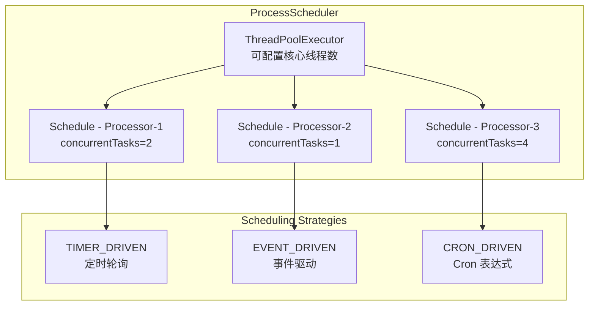

**ProcessScheduler 核心源码**：

```java
// 源码位置：nifi-framework-core/.../scheduling/StandardProcessScheduler.java
public class StandardProcessScheduler implements ProcessScheduler {
    
    private final ScheduledExecutorService schedulingExecutor;
    private final FlowEngine flowEngine;
    private final int maxConcurrentTasks;
    
    // 调度 Processor
    @Override
    public void schedule(ProcessorNode processorNode) {
        StandardProcessorNode node = (StandardProcessorNode) processorNode;
        
        // 1. 调用 @OnScheduled 生命周期方法
        node.invokeMethodsWithAnnotation(OnScheduled.class, context, null);
        
        // 2. 根据调度策略创建调度任务
        SchedulingStrategy strategy = node.getSchedulingStrategy();
        int concurrentTasks = node.getConcurrentlySchedulableTaskCount();
        
        switch (strategy) {
            case TIMER_DRIVEN:
                scheduleTimerDriven(node, concurrentTasks);
                break;
            case EVENT_DRIVEN:
                scheduleEventDriven(node, concurrentTasks);
                break;
            case CRON_DRIVEN:
                scheduleCronDriven(node, concurrentTasks);
                break;
        }
        
        // 3. 更新 Processor 状态为 RUNNING
        node.setScheduledState(ScheduledState.RUNNING);
    }
    
    // Timer-Driven 调度
    private void scheduleTimerDriven(StandardProcessorNode node, int concurrentTasks) {
        String schedulingPeriod = node.getSchedulingPeriod();  // 如 "0 sec", "1 sec"
        long periodMillis = FormatUtils.getTimeDuration(schedulingPeriod, TimeUnit.MILLISECONDS);
        
        for (int i = 0; i < concurrentTasks; i++) {
            ScheduledFuture<?> future = schedulingExecutor.scheduleAtFixedRate(
                () -> triggerProcessor(node),
                0, periodMillis, TimeUnit.MILLISECONDS);
            node.addScheduledFuture(future);
        }
    }
    
    // 触发 Processor 执行
    private void triggerProcessor(StandardProcessorNode node) {
        // 检查前置条件
        if (node.isYielded()) return;            // Processor 正在让步
        if (!node.hasIncomingData() && 
            !node.isTriggerWhenEmpty()) return;   // 无数据且非 Source
        if (node.isBackPressureFull()) return;    // 输出队列已满
        
        try {
            // 创建 ProcessSession
            ProcessSession session = new StandardProcessSession(
                node, flowFileRepository, contentRepository, provenanceRepository);
            
            // 执行 onTrigger
            node.getProcessor().onTrigger(
                node.getProcessContext(), session);
            
            // 提交会话
            session.commit();
        } catch (ProcessException e) {
            // 错误处理：Processor yield
            node.yield(node.getYieldDuration());
            getLogger().error("Processor execution failed", e);
        }
    }
    
    // 取消调度
    @Override
    public void unschedule(ProcessorNode processorNode) {
        StandardProcessorNode node = (StandardProcessorNode) processorNode;
        
        // 1. 取消所有调度任务
        node.cancelScheduledFutures();
        
        // 2. 调用 @OnUnscheduled 生命周期方法
        node.invokeMethodsWithAnnotation(OnUnscheduled.class, context, null);
        
        // 3. 更新状态
        node.setScheduledState(ScheduledState.STOPPED);
    }
}
```

### 5.3 StandardProcessSession：FlowFile CRUD

StandardProcessSession 提供了 FlowFile 的所有 CRUD 操作，是 Processor 与数据存储交互的唯一入口：

```java
// 源码位置：nifi-framework-core/.../controller/repository/StandardProcessSession.java
public class StandardProcessSession implements ProcessSession {
    
    private final FlowFileRepository flowFileRepository;
    private final ContentRepository contentRepository;
    private final ProvenanceRepository provenanceRepository;
    
    // 事务内暂存的变更
    private final List<RepositoryRecord> records = new ArrayList<>();
    private final Set<FlowFile> flowFilesInSession = new HashSet<>();
    
    // ========== 创建 FlowFile ==========
    @Override
    public FlowFile create() {
        return create(null);
    }
    
    @Override
    public FlowFile create(FlowFile parent) {
        long id = idGenerator.generateId();
        StandardFlowFileRecord.Builder builder = new StandardFlowFileRecord.Builder()
            .id(id)
            .entryDate(System.currentTimeMillis())
            .lineageStartDate(parent != null ? parent.getLineageStartDate() : 
                System.currentTimeMillis());
        
        if (parent != null) {
            // 继承父 FlowFile 的属性
            builder.addAttributes(parent.getAttributes());
        }
        
        StandardFlowFileRecord flowFile = builder.build();
        flowFilesInSession.add(flowFile);
        
        // 记录 Provenance 事件
        addProvenanceEvent(flowFile, 
            parent != null ? ProvenanceEventType.FORK : ProvenanceEventType.CREATE);
        
        return flowFile;
    }
    
    // ========== 获取 FlowFile ==========
    @Override
    public FlowFile get() {
        // 从输入队列获取下一个 FlowFile
        FlowFile flowFile = connection.getFlowFileQueue().poll();
        if (flowFile != null) {
            flowFilesInSession.add(flowFile);
        }
        return flowFile;
    }
    
    // ========== 读取 FlowFile 内容 ==========
    @Override
    public InputStream read(FlowFile flowFile) {
        ContentClaim claim = ((StandardFlowFileRecord) flowFile).getContentClaim();
        return contentRepository.read(claim);
    }
    
    // ========== 写入 FlowFile 内容 ==========
    @Override
    public FlowFile write(FlowFile flowFile, OutputStreamCallback callback) {
        // 1. 创建新的 ContentClaim（Copy-on-Write）
        ContentClaim newClaim = contentRepository.create(false);
        
        // 2. 将原内容复制到新 Claim，再执行回调写入
        try (OutputStream out = contentRepository.write(newClaim)) {
            if (flowFile.getSize() > 0) {
                // 复制原有内容
                try (InputStream in = read(flowFile)) {
                    StreamUtils.copy(in, out);
                }
            }
            // 执行用户回调
            callback.process(out);
        }
        
        // 3. 创建更新后的 FlowFile
        StandardFlowFileRecord updated = new StandardFlowFileRecord.Builder()
            .from(flowFile)
            .contentClaim(newClaim)
            .fileSize(newClaim.getLength())
            .build();
        
        flowFilesInSession.add(updated);
        return updated;
    }
    
    // ========== 修改属性 ==========
    @Override
    public FlowFile putAttribute(FlowFile flowFile, String key, String value) {
        Map<String, String> newAttrs = new HashMap<>(flowFile.getAttributes());
        newAttrs.put(key, value);
        
        StandardFlowFileRecord updated = new StandardFlowFileRecord.Builder()
            .from(flowFile)
            .addAttributes(newAttrs)
            .build();
        
        flowFilesInSession.add(updated);
        return updated;
    }
    
    // ========== 路由 FlowFile ==========
    @Override
    public void transfer(FlowFile flowFile, Relationship relationship) {
        // 将 FlowFile 路由到指定 Relationship 对应的 Connection
        RepositoryRecord record = new StandardRepositoryRecord(
            flowFile, relationship, RepositoryRecord.Type.TRANSFER);
        records.add(record);
    }
    
    // ========== 删除 FlowFile ==========
    @Override
    public void remove(FlowFile flowFile) {
        RepositoryRecord record = new StandardRepositoryRecord(
            flowFile, null, RepositoryRecord.Type.DELETE);
        records.add(record);
        flowFilesInSession.remove(flowFile);
    }
    
    // ========== 提交事务 ==========
    @Override
    public void commit() {
        // 1. 将所有变更写入 FlowFile Repository (WAL)
        for (RepositoryRecord record : records) {
            flowFileRepository.update(record);
        }
        
        // 2. 将 FlowFile 移动到目标 Connection 的队列
        for (RepositoryRecord record : records) {
            if (record.getType() == Type.TRANSFER) {
                Connection targetConn = findConnection(record.getRelationship());
                targetConn.getFlowFileQueue().put(record.getFlowFile());
            }
        }
        
        // 3. 写入 Provenance 事件
        for (ProvenanceEventRecord event : provenanceEvents) {
            provenanceRepository.register(event);
        }
        
        // 4. 清理事务状态
        records.clear();
        flowFilesInSession.clear();
        provenanceEvents.clear();
    }
    
    // ========== 回滚事务 ==========
    @Override
    public void rollback() {
        // 1. 将所有 FlowFile 归还到输入队列
        for (FlowFile flowFile : flowFilesInSession) {
            connection.getFlowFileQueue().put(flowFile);
        }
        
        // 2. 清理事务状态
        records.clear();
        flowFilesInSession.clear();
        provenanceEvents.clear();
    }
}
```

### 5.4 触发机制

NiFi 支持三种触发机制：

| 调度策略 | 注解/配置 | 说明 | 适用场景 |
|----------|-----------|------|----------|
| **TIMER_DRIVEN** | `@TriggerWhenEmpty` | 定时轮询，间隔可配置 | 大多数 Processor |
| **EVENT_DRIVEN** | `@EventDriven` | 事件驱动，有数据时立即触发 | 低延迟场景 |
| **CRON_DRIVEN** | cron 表达式 | 按 Cron 表达式调度 | 定时批处理 |

### 5.5 错误处理与重试策略

```java
// 错误处理：通过 Relationship 路由
@Override
public void onTrigger(ProcessContext context, ProcessSession session) {
    FlowFile flowFile = session.get();
    if (flowFile == null) return;
    
    try {
        // 业务处理逻辑
        String result = process(flowFile);
        
        // 写入结果
        flowFile = session.write(flowFile, out -> {
            out.write(result.getBytes("UTF-8"));
        });
        
        // 成功路由
        session.transfer(flowFile, REL_SUCCESS);
    } catch (ProcessingException e) {
        // 失败路由
        flowFile = session.putAttribute(flowFile, "error.message", e.getMessage());
        flowFile = session.putAttribute(flowFile, "error.timestamp", 
            String.valueOf(System.currentTimeMillis()));
        session.transfer(flowFile, REL_FAILURE);
    }
}

// Yield 机制：Processor 主动让出调度时间
// 当外部资源不可用时，Processor 可以 yield 暂停自己
context.yield();  // 暂停调度，默认 1 秒
// 配置：yieldDuration 属性
```

### 5.6 并发执行策略

每个 Processor 可独立配置并发线程数（`concurrentlySchedulableTaskCount`），实现并行处理：

```java
// 源码中的并发控制
// nifi-framework-core/.../StandardProcessorNode.java
public class StandardProcessorNode extends ComponentNode implements ProcessorNode {
    
    // 并发线程数配置
    private volatile int concurrentlySchedulableTaskCount = 1;
    
    // 最大并发线程数（由 @Tags 和 @CapabilityDescription 中的注解决定）
    private final int maxConcurrentTasks;
    
    @Override
    public void setConcurrentlySchedulableTaskCount(int count) {
        if (count < 1 || count > maxConcurrentTasks) {
            throw new IllegalArgumentException(
                "Concurrent tasks must be between 1 and " + maxConcurrentTasks);
        }
        this.concurrentlySchedulableTaskCount = count;
    }
}

// 调度器为每个并发线程创建独立的调度任务
for (int i = 0; i < concurrentTasks; i++) {
    ScheduledFuture<?> future = schedulingExecutor.scheduleAtFixedRate(
        () -> triggerProcessor(node), 0, period, TimeUnit.MILLISECONDS);
    node.addScheduledFuture(future);
}
```

---

## 六、数据存储设计

### 6.1 存储架构总览

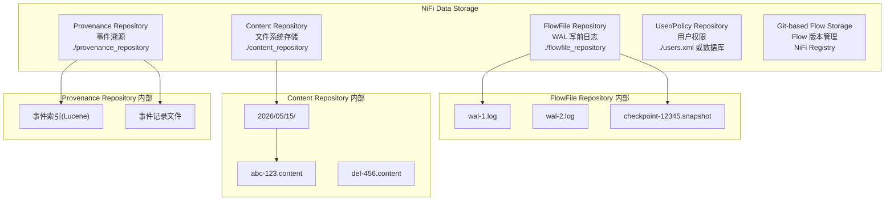

### 6.2 FlowFile Repository：WAL（Write-Ahead Log）

FlowFile Repository 采用 WAL 机制确保 FlowFile 状态的持久性，即使在系统崩溃后也能恢复：

**WAL 写入流程**：

```
1. ProcessSession.commit() 被调用
2. 遍历 Session 中的所有 RepositoryRecord
3. 对每条记录：
   a. 序列化为二进制格式
   b. 写入当前活跃的 WAL 文件
   c. fsync 确保数据落盘
4. 标记事务提交
5. 返回成功
```

**WAL 恢复流程**：

```
1. 系统启动时，检查最新的 Snapshot
2. 加载 Snapshot 中的所有 FlowFile 状态
3. 从 Snapshot 之后的位置开始重放 WAL 日志
4. 重建完整的 FlowFile 状态
5. 清理过期的 WAL 文件
```

**关键配置参数**：

```properties
# nifi.properties
nifi.flowfile.repository.implementation=org.apache.nifi.controller.repository.WriteAheadFlowFileRepository
nifi.flowfile.repository.directory=./flowfile_repository
nifi.flowfile.repository.checkpoint.interval=2 mins    # 快照间隔
nifi.flowfile.repository.always.sync=false              # 每次写入是否fsync
nifi.flowfile.repository.wal.max.size=32 MB             # WAL最大大小
```

**WAL 记录二进制格式**：

```
+------------------+------------------+------------------+
| Transaction ID   | Action Type      | FlowFile Count   |
| (8 bytes long)   | (1 byte)         | (4 bytes int)    |
+------------------+------------------+------------------+
| For each FlowFile:                                    |
| +------------------+------------------+               |
| | FlowFile ID      | Entry Date       |               |
| | (8 bytes)        | (8 bytes)        |               |
| +------------------+------------------+               |
| | Lineage Start   | Attribute Count  |               |
| | (8 bytes)        | (4 bytes)        |               |
| +------------------+------------------+               |
| | For each attribute:                                 |
| | Key Len (2B) | Key (UTF-8) | Val Len (2B) | Val   |
| +-------------------------------------------------+   |
| | Content Claim: Container | Section | ID        |   |
| | Offset (8B) | Length (8B)                       |   |
| +-------------------------------------------------+   |
+-------------------------------------------------------+
```

### 6.3 Content Repository：文件系统存储

Content Repository 存储 FlowFile 的实际内容数据，采用分区分目录策略：

```java
// 源码位置：nifi-framework-core/.../repository/FileSystemRepository.java

// 目录结构
// content_repository/
//   ├── default/                    # 容器名（可配置多个）
//   │   ├── 1/                      # 分区1
//   │   │   ├── 20260515123000abc.content
//   │   │   └── 20260515123001def.content
//   │   ├── 2/                      # 分区2
//   │   │   └── ...
//   │   └── archive/                # 归档目录
//   └── backup/                     # 备份容器

// 关键配置参数
// nifi.content.repository.implementation=
//   org.apache.nifi.controller.repository.FileSystemRepository
// nifi.content.repository.directory.default=./content_repository
// nifi.content.repository.archive.max.retention.period=12 hours
// nifi.content.repository.archive.max.usage.percentage=50%
// nifi.content.repository.always.sync=false
```

**ContentClaim 生命周期**：

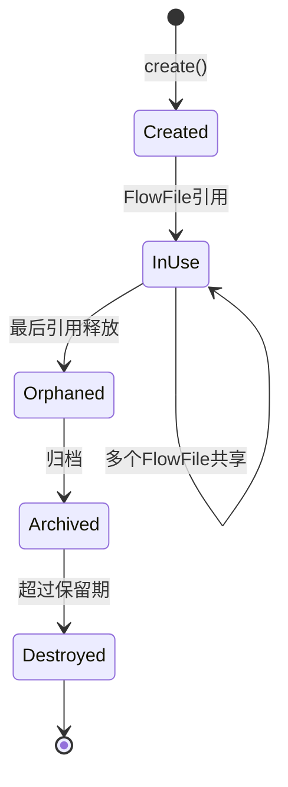

### 6.4 Provenance Repository：事件溯源

Provenance Repository 记录数据流转的完整历史，支持查询和血缘追踪：

```java
// 源码位置：nifi-framework-core/.../provenance/PersistentProvenanceRepository.java

// 存储结构
// provenance_repository/
//   ├── 0/                          # 分区0
//   │   ├── provenance-12345.log    # 事件记录文件
//   │   ├── provenance-12345.index  # Lucene索引
//   │   └── provenance-12345.metadata
//   ├── 1/                          # 分区1
//   └── ...

// 关键配置参数
// nifi.provenance.repository.implementation=
//   org.apache.nifi.provenance.PersistentProvenanceRepository
// nifi.provenance.repository.directory.default=./provenance_repository
// nifi.provenance.repository.max.storage.time=24 hours
// nifi.provenance.repository.max.storage.size=1 GB
// nifi.provenance.repository.index.shard.size=500 MB
// nifi.provenance.repository.index.cache.size=10000
```

**Provenance 查询示例**：

```java
// 查询特定 FlowFile 的完整历史
ProvenanceQuery query = new ProvenanceQuery.Builder()
    .flowFileUuid("abc-123-def-456")
    .build();
List<ProvenanceEventRecord> history = provenanceRepository.query(query, 100);

// 查询特定时间范围内的事件
ProvenanceQuery timeQuery = new ProvenanceQuery.Builder()
    .startDate(startTime)
    .endDate(endTime)
    .eventType(ProvenanceEventType.SEND)
    .build();
```

### 6.5 用户/权限存储

NiFi 支持两种用户权限存储方式：

**文件存储（默认）**：

```xml
<!-- users.xml -->
<?xml version="1.0" encoding="UTF-8"?>
<tenants>
    <groups>
        <group identifier="group-1" name="admins">
            <user identifier="user-1"/>
        </group>
    </groups>
    <users>
        <user identifier="user-1" identity="admin@example.com"/>
    </users>
    <policies>
        <policy identifier="policy-1" resource="/process-groups/root" action="R">
            <user identifier="user-1"/>
            <group identifier="group-1"/>
        </policy>
        <policy identifier="policy-2" resource="/process-groups/root" action="W">
            <user identifier="user-1"/>
        </policy>
    </policies>
</tenants>
```

**数据库存储**：通过配置 `nifi.user.authority.provider` 切换到数据库存储。

### 6.6 关键数据结构对照

| 数据结构 | 存储位置 | 持久化方式 | 恢复策略 |
|----------|----------|------------|----------|
| **FlowFile 元数据** | FlowFile Repository | WAL + Snapshot | 重放 WAL 日志 |
| **FlowFile 内容** | Content Repository | 文件系统 | 直接文件读取 |
| **数据溯源记录** | Provenance Repository | 事件日志 + Lucene 索引 | 索引重建 |
| **Flow 定义** | flow.xml.gz / JSON | 文件压缩 | 文件读取 |
| **用户/权限** | users.xml | XML 文件 | 文件读取 |
| **Processor 状态** | State Manager | 本地文件或 ZooKeeper | State 恢复 |

---

## 七、API设计

### 7.1 REST API 架构

NiFi 的 REST API 遵循 RESTful 设计原则，所有资源通过 `/nifi-api` 前缀访问：

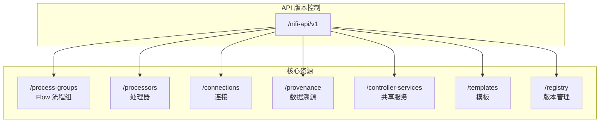

### 7.2 Flow 管理 API

```http
### 获取 ProcessGroup 详情（含所有 Processor、Connection 定义）
GET /nifi-api/process-groups/{id}
Accept: application/json

Response 200:
{
    "identifier": "root-group-id",
    "name": "NiFi Flow",
    "position": { "x": 0, "y": 0 },
    "processors": [...],
    "connections": [...],
    "processGroups": [...],
    "revision": { "version": 42, "clientId": "ui-123" }
}

### 更新 ProcessGroup
PUT /nifi-api/process-groups/{id}
Content-Type: application/json

Request Body:
{
    "revision": { "version": 42 },
    "component": {
        "name": "Updated Flow Name"
    }
}

### 创建子 ProcessGroup
POST /nifi-api/process-groups/{parent-id}/process-groups
Content-Type: application/json

Request Body:
{
    "revision": { "version": 0 },
    "component": {
        "name": "Child Process Group",
        "position": { "x": 100, "y": 200 }
    }
}
```

### 7.3 Processor 管理 API

```http
### 获取 Processor 详情
GET /nifi-api/processors/{id}
Accept: application/json

Response 200:
{
    "identifier": "processor-uuid",
    "name": "GetHTTP",
    "type": "org.apache.nifi.processors.standard.GetHTTP",
    "state": "STOPPED",
    "position": { "x": 100, "y": 200 },
    "config": {
        "properties": {
            "URL": "https://example.com/api",
            "Filename": "response.json"
        },
        "schedulingStrategy": "TIMER_DRIVEN",
        "schedulingPeriod": "0 sec",
        "concurrentlySchedulableTaskCount": 1,
        "penaltyDuration": "30 sec",
        "yieldDuration": "1 sec",
        "bulletinLevel": "WARN",
        "autoTerminatedRelationships": []
    },
    "relationships": [
        { "name": "success", "description": "..." },
        { "name": "failure", "description": "..." }
    ],
    "validationErrors": [],
    "revision": { "version": 5 }
}

### 创建 Processor
POST /nifi-api/process-groups/{group-id}/processors
Content-Type: application/json

Request Body:
{
    "revision": { "version": 0 },
    "component": {
        "type": "org.apache.nifi.processors.standard.GetHTTP",
        "name": "Fetch API Data",
        "position": { "x": 300, "y": 400 }
    }
}

### 更新 Processor 配置
PUT /nifi-api/processors/{id}
Content-Type: application/json

Request Body:
{
    "revision": { "version": 5 },
    "component": {
        "config": {
            "properties": {
                "URL": "https://new-api.example.com/data"
            },
            "schedulingPeriod": "5 sec"
        }
    }
}

### 启动 Processor
PUT /nifi-api/processors/{id}/run-status
Content-Type: application/json

Request Body:
{
    "revision": { "version": 5 },
    "state": "RUNNING"
}

### 停止 Processor
PUT /nifi-api/processors/{id}/run-status
Content-Type: application/json

Request Body:
{
    "revision": { "version": 6 },
    "state": "STOPPED"
}

### 删除 Processor
DELETE /nifi-api/processors/{id}?version=6
```

### 7.4 Connection 管理 API

```http
### 创建 Connection
POST /nifi-api/process-groups/{group-id}/connections
Content-Type: application/json

Request Body:
{
    "revision": { "version": 0 },
    "component": {
        "source": {
            "id": "source-processor-id",
            "type": "PROCESSOR",
            "name": "GetHTTP"
        },
        "destination": {
            "id": "dest-processor-id",
            "type": "PROCESSOR",
            "name": "UpdateAttribute"
        },
        "selectedRelationships": ["success"],
        "backPressureObjectThreshold": 10000,
        "backPressureDataSizeThreshold": "1 GB",
        "flowFileExpiration": "0 sec"
    }
}

### 获取 Connection 队列状态
GET /nifi-api/connections/{id}

Response 包含:
{
    "status": {
        "aggregateSnapshot": {
            "flowFilesQueued": 150,
            "bytesQueued": 5242880,
            "backPressureObjectThreshold": 10000,
            "backPressureDataSizeThreshold": "1 GB",
            "backPressurePercentage": 1.5
        }
    }
}

### 清空 Connection 队列
POST /nifi-api/connections/{id}/listing-requests
Content-Type: application/json

### 删除队列中的 FlowFile
DELETE /nifi-api/connections/{id}/flowfiles/{flowfile-id}
```

### 7.5 Provenance 查询 API

```http
### 查询数据溯源
POST /nifi-api/provenance
Content-Type: application/json

Request Body:
{
    "provenance": {
        "request": {
            "searchTerms": {
                "flowFileUuid": "abc-123-def-456"
            },
            "startDate": "2026-05-15T00:00:00Z",
            "endDate": "2026-05-15T23:59:59Z",
            "eventTypes": ["CREATE", "ROUTE", "SEND"],
            "maxResults": 1000
        }
    }
}

Response 200:
{
    "provenance": {
        "id": "query-uuid",
        "results": {
            "provenanceEvents": [
                {
                    "eventId": 12345,
                    "eventType": "CREATE",
                    "eventTime": "2026-05-15T10:30:00Z",
                    "flowFileUuid": "abc-123-def-456",
                    "componentId": "processor-id",
                    "componentName": "GetHTTP",
                    "attributes": { ... },
                    "contentSize": 1024
                }
            ]
        },
        "total": 1,
        "percentCompleted": 100
    }
}

### 获取 FlowFile 血缘图
GET /nifi-api/provenance/lineage/{flowfile-uuid}

Response 包含完整的血缘链路，从创建到当前状态的完整路径
```

### 7.6 乐观并发控制（Optimistic Concurrency Control）

NiFi API 采用乐观并发控制，通过 `revision` 字段防止并发冲突：

```json
// 每个 API 请求必须携带 revision
{
    "revision": {
        "version": 5,           // 当前版本号
        "clientId": "ui-123"    // 客户端标识
    },
    "component": { ... }
}

// 版本冲突时返回 409 Conflict
// Response 409:
{
    "error": {
        "message": "The component has been updated by another user. " +
                   "Please refresh and try again.",
        "conflict": {
            "serverRevision": { "version": 6, "clientId": "ui-456" },
            "clientRevision": { "version": 5, "clientId": "ui-123" }
        }
    }
}
```

---

## 八、可借鉴的设计模式

### 8.1 Processor 接口 + 注解驱动的生命周期 → open-app Java 连接器接口设计

NiFi 的 Processor 接口设计是其最核心的设计模式之一，通过接口 + 注解的方式实现了高度解耦的连接器模型：

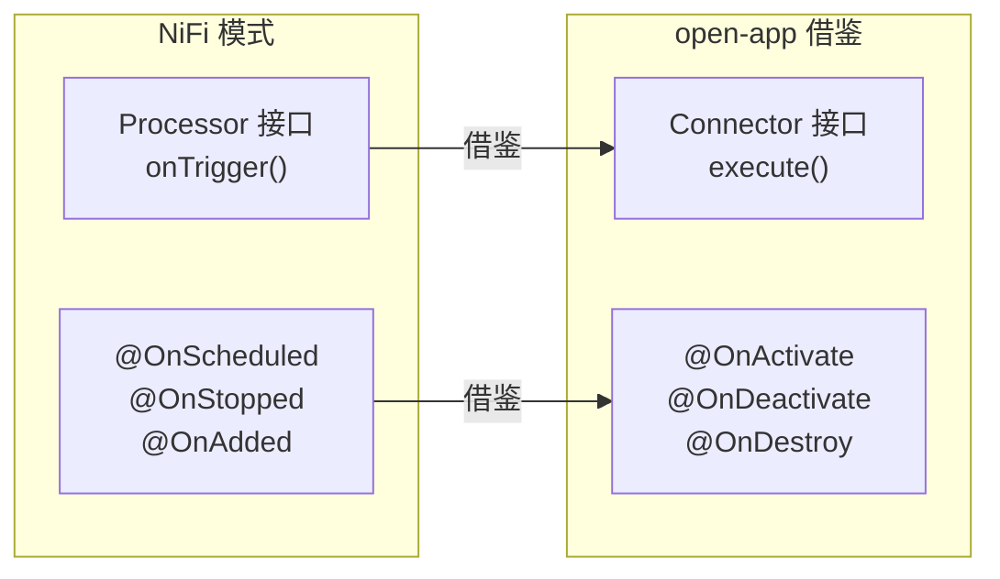

**open-app 连接器接口设计建议**：

```java
// open-app 连接器核心接口
public interface Connector extends ConfigurableComponent {
    
    /**
     * 核心执行方法 - 每次触发时调用
     * @param context 连接器上下文
     * @param session 数据会话
     */
    void execute(ConnectorContext context, ConnectorSession session) 
        throws ConnectorException;
    
    /**
     * 定义输出路由
     */
    Set<Route> getRoutes();
}

// 生命周期注解
@Retention(RetentionPolicy.RUNTIME)
@Target(ElementType.METHOD)
public @interface OnActivate { }    // 激活时调用

@Retention(RetentionPolicy.RUNTIME)
@Target(ElementType.METHOD)
public @interface OnDeactivate { }  // 停用时调用

@Retention(RetentionPolicy.RUNTIME)
@Target(ElementType.METHOD)
public @interface OnDestroy { }     // 销毁时调用

// 示例连接器实现
@ConnectorType(name = "WeCom Message Sender", type = ConnectorType.SINK)
public class WeComMessageConnector implements Connector {
    
    static final Route SUCCESS = new Route.Builder()
        .name("success").description("发送成功").build();
    static final Route FAILURE = new Route.Builder()
        .name("failure").description("发送失败").build();
    
    static final PropertyDescriptor WEBHOOK_URL = new PropertyDescriptor.Builder()
        .name("Webhook URL").required(true).sensitive(true)
        .addValidator(Validators.URL_VALIDATOR).build();
    
    @OnActivate
    public void onActivate(ConnectorContext context) {
        // 初始化 HTTP 客户端
        String url = context.getProperty(WEBHOOK_URL).getValue();
        this.httpClient = HttpClient.newBuilder()
            .uri(URI.create(url)).build();
    }
    
    @Override
    public void execute(ConnectorContext context, ConnectorSession session) {
        Message message = session.getMessage();
        try {
            HttpResponse<String> response = httpClient.send(
                buildRequest(message), HttpResponse.BodyHandlers.ofString());
            session.route(SUCCESS);
        } catch (Exception e) {
            session.route(FAILURE);
        }
    }
    
    @OnDeactivate
    public void onDeactivate() {
        // 释放 HTTP 客户端资源
    }
}
```

### 8.2 PropertyDescriptor Builder 模式 → 动态配置表单

NiFi 的 PropertyDescriptor Builder 模式可以将配置元数据与前端表单自动绑定，这对于 open-app 的连接器配置面板非常有价值：

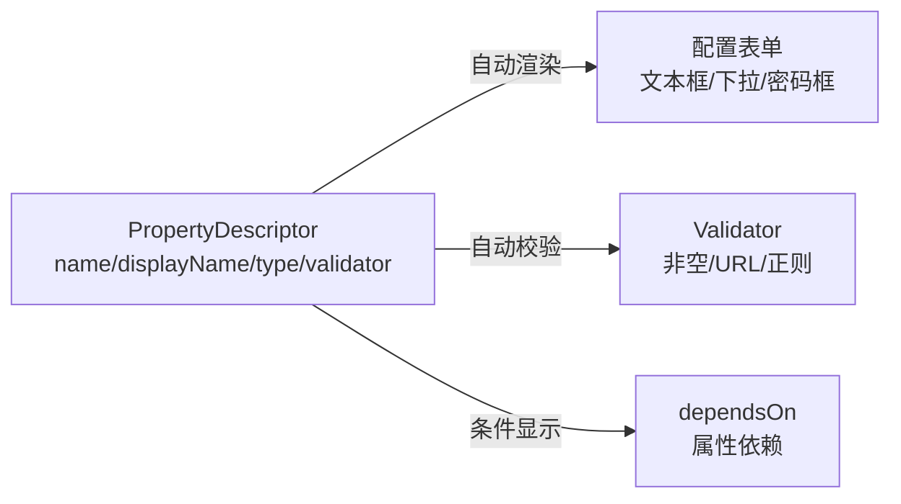

**open-app 动态配置表单设计建议**：

```java
// open-app 配置描述符
public class ConfigDescriptor {
    private final String name;
    private final String displayName;
    private final String description;
    private final ConfigType type;          // TEXT, NUMBER, BOOLEAN, SELECT, PASSWORD
    private final String defaultValue;
    private final boolean required;
    private final boolean sensitive;
    private final boolean dynamic;
    private final Set<String> allowableValues;
    private final Validator validator;
    private final ConfigDescriptor dependsOn;
    
    public static class Builder {
        // ... Builder 模式
    }
}

// 前端根据 ConfigDescriptor 自动渲染表单
// TypeScript 伪代码
function renderConfigForm(descriptors: ConfigDescriptor[]): FormComponent[] {
    return descriptors
        .filter(d => isVisible(d, currentValues))  // 基于 dependsOn 过滤
        .map(d => {
            switch (d.type) {
                case 'PASSWORD': return PasswordInputComponent;
                case 'SELECT':   return SelectComponent.withOptions(d.allowableValues);
                case 'BOOLEAN':  return ToggleComponent;
                case 'NUMBER':   return NumberInputComponent;
                default:         return TextInputComponent;
            }
        });
}
```

### 8.3 NAR 类加载隔离 → 连接器热加载与版本隔离

NAR 的 ClassLoader 隔离机制是 open-app 实现连接器热加载和版本隔离的关键参考：

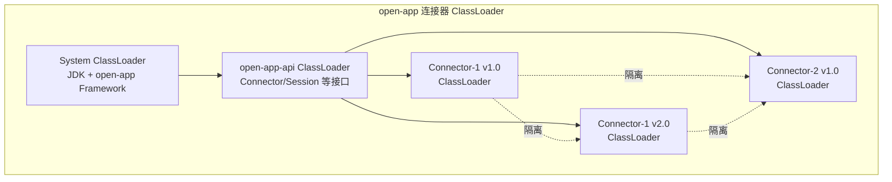

**open-app 连接器加载器设计建议**：

```java
// open-app 连接器 ClassLoader 管理
public class ConnectorClassLoaderManager {
    
    // connectorId -> version -> ClassLoader
    private final ConcurrentMap<String, Map<String, ClassLoader>> classLoaders = 
        new ConcurrentHashMap<>();
    
    public ClassLoader loadConnector(String connectorId, String version, 
            File jarFile) {
        // 1. 创建隔离的 ClassLoader
        //    父 ClassLoader 为 open-app-api，确保接口共享
        ClassLoader parent = Connector.class.getClassLoader();
        URLClassLoader cl = new URLClassLoader(
            new URL[]{ jarFile.toURI().toURL() }, parent);
        
        // 2. 注册
        classLoaders.computeIfAbsent(connectorId, k -> new ConcurrentHashMap<>())
            .put(version, cl);
        
        // 3. 通过 ServiceLoader 发现 Connector 实现
        ServiceLoader<Connector> connectors = ServiceLoader.load(Connector.class, cl);
        
        return cl;
    }
    
    public void unloadConnector(String connectorId, String version) {
        // 1. 停止使用该 ClassLoader 的所有连接器实例
        // 2. 从注册表中移除
        // 3. 关闭 ClassLoader（释放 JAR 文件锁）
        Map<String, ClassLoader> versions = classLoaders.get(connectorId);
        if (versions != null) {
            ClassLoader cl = versions.remove(version);
            if (cl instanceof URLClassLoader) {
                ((URLClassLoader) cl).close();
            }
        }
    }
}
```

### 8.4 Relationship 路由 → 连接流分支模型

NiFi 的 Relationship 路由机制为 open-app 的连接流分支设计提供了参考：

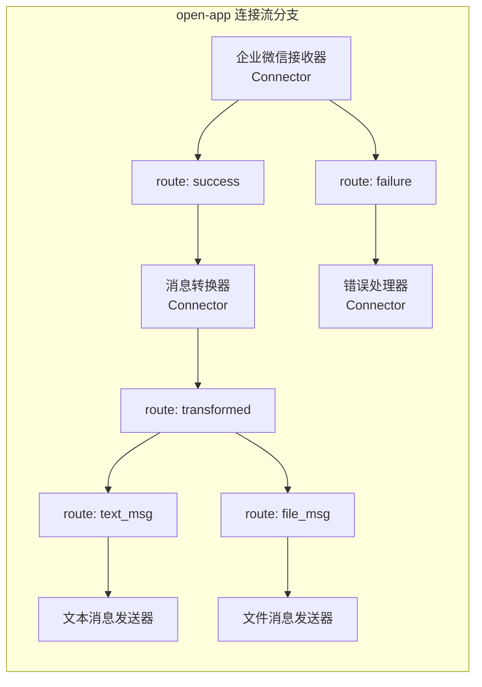

**open-app 路由设计建议**：

```java
// open-app 路由定义
public class Route {
    private final String name;
    private final String description;
    private final int priority;  // 路由优先级
    
    public static class Builder {
        public Builder name(String name) { ... }
        public Builder description(String desc) { ... }
        public Builder priority(int p) { ... }
        public Route build() { ... }
    }
    
    // 预定义路由
    public static final Route SUCCESS = new Route.Builder()
        .name("success").description("处理成功").priority(0).build();
    public static final Route FAILURE = new Route.Builder()
        .name("failure").description("处理失败").priority(0).build();
}

// 连接流中的路由配置
public class ConnectionRoute {
    private String sourceConnectorId;
    private String routeName;
    private String targetConnectorId;
    private BackPressureConfig backPressure;  // 背压配置
}
```

### 8.5 WAL 存储 → 可靠的执行状态持久化

NiFi 的 WAL 机制可以为 open-app 的连接器执行状态持久化提供参考：

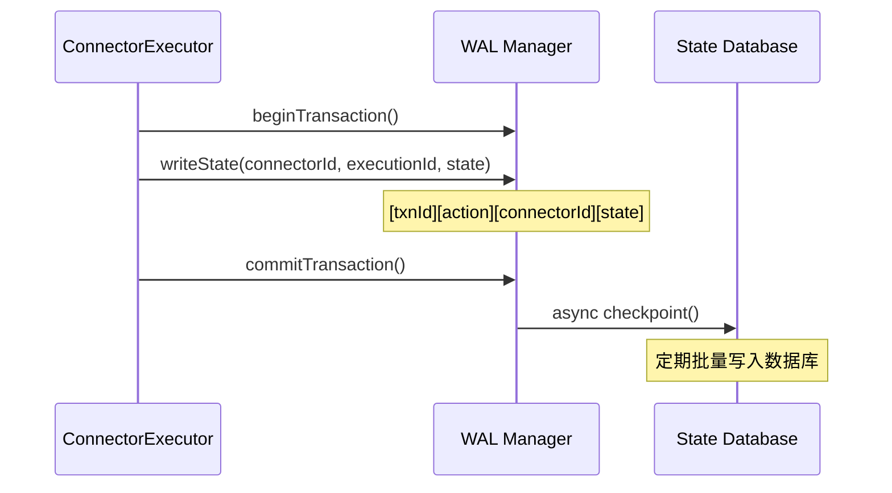

**open-app 状态持久化设计建议**：

```java
// open-app 执行状态 WAL
public class ExecutionStateWAL {
    
    private final RandomAccessFile walFile;
    private final AtomicLong transactionId = new AtomicLong(0);
    
    public void writeState(String connectorId, String executionId, 
            ExecutionState state) {
        long txnId = transactionId.incrementAndGet();
        
        // 序列化状态
        byte[] data = serializeState(connectorId, executionId, state);
        
        // 写入 WAL
        // [txnId: 8B][length: 4B][connectorId: UTF-8][executionId: UTF-8][state: binary]
        walFile.writeLong(txnId);
        walFile.writeInt(data.length);
        walFile.write(data);
        walFile.getFD().sync();  // fsync
    }
    
    public void checkpoint() {
        // 1. 将 WAL 中的状态批量写入数据库
        // 2. 标记已 checkpoint 的 WAL 记录
        // 3. 清理已 checkpoint 的 WAL 文件
    }
    
    public void recover() {
        // 1. 从数据库加载最新状态
        // 2. 重放 WAL 中未 checkpoint 的记录
        // 3. 重建完整状态
    }
}
```

### 8.6 需要规避的设计问题

在借鉴 NiFi 架构的同时，open-app 需要规避以下设计问题：

| NiFi 设计问题 | 问题描述 | open-app 规避方案 |
|---------------|----------|-------------------|
| **ZooKeeper 依赖过重** | 集群协调、Leader选举、状态存储都依赖 ZK，运维复杂 | 使用轻量级协调方案（如 etcd/Consul）或自研 Raft 协议 |
| **前端 Angular 技术栈老旧** | NiFi 前端从 AngularJS 1.x 迁移到 Angular，历史包袱重 | open-app 采用 React/Vue 等现代前端框架 |
| **FlowFile 模型过于重量级** | 每条数据都包含 Content + Attributes + ResourceClaim，内存开销大 | open-app 采用轻量级消息模型，仅存储引用而非完整内容 |
| **Flow XML 全量同步** | 集群间 Flow 定义通过全量 XML 同步，大规模 Flow 时性能差 | 增量同步 + 事件驱动更新 |
| **WAL 单文件瓶颈** | FlowFile Repository 的 WAL 在高吞吐场景下成为瓶颈 | 分片 WAL + 异步批量提交 |
| **Processor 粒度过细** | 每个 Processor 只做一件事，导致 Flow 复杂度爆炸 | open-app 连接器支持更粗粒度的功能组合 |
| **无原生重试机制** | Processor 错误处理只能通过 Relationship 路由，缺乏自动重试 | 内置可配置的重试策略（指数退避、最大重试次数等） |
| **Provenance 存储膨胀** | 数据溯源记录无限增长，存储开销大 | 设置保留策略 + 冷热数据分离 |

### 8.7 架构借鉴总结

```mermaid
graph TB
    subgraph "值得借鉴"
        B1["Processor 接口<br/>+ 注解生命周期"]
        B2["PropertyDescriptor<br/>Builder 配置模型"]
        B3["NAR ClassLoader<br/>类隔离热加载"]
        B4["Relationship<br/>路由分支模型"]
        B5["WAL 存储<br/>可靠状态持久化"]
        B6["ProcessSession<br/>事务化数据操作"]
    end
    
    subgraph "需要规避"
        A1["ZooKeeper 重依赖"]
        A2["Angular 老旧前端"]
        A3["FlowFile 重量级模型"]
        A4["Flow XML 全量同步"]
        A5["无原生重试机制"]
        A6["Provenance 存储膨胀"]
    end
    
    subgraph "open-app 优化方向"
        O1["轻量级协调 etcd/Raft"]
        O2["React/Vue 现代前端"]
        O3["轻量消息模型+引用"]
        O4["增量事件驱动同步"]
        O5["内置重试+死信队列"]
        O6["保留策略+冷热分离"]
    end
    
    B1 --> O1
    B2 --> O2
    B3 --> O3
    B4 --> O4
    B5 --> O5
    B6 --> O6
    A1 -->|规避| O1
    A2 -->|规避| O2
    A3 -->|规避| O3
    A4 -->|规避| O4
    A5 -->|规避| O5
    A6 -->|规避| O6
```

---

## 附录：关键源码索引

| 模块 | 关键类 | 源码路径 |
|------|--------|----------|
| Processor API | `Processor` | `nifi-api/src/main/java/org/apache/nifi/processor/Processor.java` |
| Processor API | `ProcessSession` | `nifi-api/src/main/java/org/apache/nifi/processor/ProcessSession.java` |
| Processor API | `FlowFile` | `nifi-api/src/main/java/org/apache/nifi/flowfile/FlowFile.java` |
| Processor API | `PropertyDescriptor` | `nifi-api/src/main/java/org/apache/nifi/components/PropertyDescriptor.java` |
| Processor API | `Relationship` | `nifi-api/src/main/java/org/apache/nifi/processor/Relationship.java` |
| Framework Core | `StandardFlowController` | `nifi-framework-core/.../controller/StandardFlowController.java` |
| Framework Core | `StandardProcessScheduler` | `nifi-framework-core/.../scheduling/StandardProcessScheduler.java` |
| Framework Core | `StandardProcessSession` | `nifi-framework-core/.../repository/StandardProcessSession.java` |
| Framework Core | `StandardProcessorNode` | `nifi-framework-core/.../controller/StandardProcessorNode.java` |
| Repository | `WriteAheadFlowFileRepository` | `nifi-framework-core/.../repository/WriteAheadFlowFileRepository.java` |
| Repository | `FileSystemRepository` | `nifi-framework-core/.../repository/FileSystemRepository.java` |
| Repository | `PersistentProvenanceRepository` | `nifi-framework-core/.../provenance/PersistentProvenanceRepository.java` |
| NAR | `NarClassLoaders` | `nifi-framework-core/.../nar/NarClassLoaders.java` |
| NAR | `ExtensionManager` | `nifi-framework-core/.../ExtensionManager.java` |
| Cluster | `ClusterCoordinationProtocolHandler` | `nifi-framework-core/.../cluster/ClusterCoordinationProtocolHandler.java` |
| Site-to-Site | `SiteToSiteTransportClient` | `nifi-commons/nifi-site-to-site/.../SiteToSiteTransportClient.java` |

---

> **文档版本**：v1.0  
> **最后更新**：2026-05-15  
> **适用范围**：open-app 连接器平台技术选型参考
