# Camunda 8 技术架构调研报告

> 面向 open-app 连接器平台建设的技术参考
> 版本：基于 Camunda 8.x
> 调研日期：2026-05

---

## 一、技术架构总览

### 1.1 整体架构

Camunda 8 是 Camunda 公司推出的云原生工作流引擎，与 Camunda 7（单体架构）相比，采用了完全分布式的设计。核心引擎 Zeebe 从零开始构建，专为高吞吐、低延迟和水平扩展而设计。

Camunda 8 的整体架构由五大层次组成：客户端层、网关层、引擎集群层、应用层和存储层。每一层都可以独立扩展，实现了真正的云原生架构。

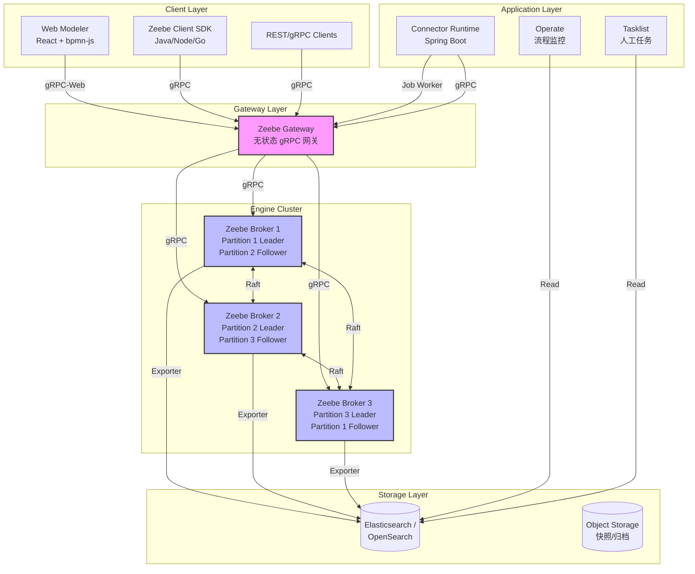
```mermaid
graph TB
    subgraph "Client Layer"
        M[Web Modeler<br/>React + bpmn-js]
        SDK[Zeebe Client SDK<br/>Java/Node/Go]
        API[REST/gRPC Clients]
    end

    subgraph "Gateway Layer"
        GW[Zeebe Gateway<br/>无状态 gRPC 网关]
    end

    subgraph "Engine Cluster"
        direction TB
        Z1[Zeebe Broker 1<br/>Partition 1 Leader<br/>Partition 2 Follower]
        Z2[Zeebe Broker 2<br/>Partition 2 Leader<br/>Partition 3 Follower]
        Z3[Zeebe Broker 3<br/>Partition 3 Leader<br/>Partition 1 Follower]
    end

    subgraph "Application Layer"
        OP[Operate<br/>流程监控]
        TL[Tasklist<br/>人工任务]
        CR[Connector Runtime<br/>Spring Boot]
    end

    subgraph "Storage Layer"
        ES[(Elasticsearch /<br/>OpenSearch)]
        S3[(Object Storage<br/>快照/归档)]
    end

    M -->|gRPC-Web| GW
    SDK -->|gRPC| GW
    API -->|gRPC| GW
    GW -->|gRPC| Z1
    GW -->|gRPC| Z2
    GW -->|gRPC| Z3
    Z1 <-->|Raft| Z2
    Z2 <-->|Raft| Z3
    Z3 <-->|Raft| Z1
    Z1 -->|Exporter| ES
    Z2 -->|Exporter| ES
    Z3 -->|Exporter| ES
    CR -->|Job Worker| GW
    OP -->|Read| ES
    TL -->|Read| ES
    CR -->|gRPC| GW

    style GW fill:#f9f,stroke:#333,stroke-width:2px
    style Z1 fill:#bbf,stroke:#333,stroke-width:2px
    style Z2 fill:#bbf,stroke:#333,stroke-width:2px
    style Z3 fill:#bbf,stroke:#333,stroke-width:2px
```

### 1.2 各组件职责与通信方式

| 组件 | 职责 | 通信协议 | 部署方式 |
|------|------|----------|----------|
| **Zeebe Gateway** | 接收客户端请求，路由到正确的 Partition Leader | gRPC | 无状态，可水平扩展 |
| **Zeebe Broker** | 核心流程引擎，执行流程实例、处理 Job | 内部 gRPC + Raft | 有状态，Partition 分片 |
| **Operate** | 流程实例监控、问题排查 | REST API (读 ES) | 独立微服务 |
| **Tasklist** | 人工任务管理界面 | REST + GraphQL | 独立微服务 |
| **Web Modeler** | 在线 BPMN 建模 | REST + gRPC-Web | 前端 SPA |
| **Connector Runtime** | 运行 Connector 实现 | gRPC (Job Worker) | Spring Boot 应用 |
| **Elasticsearch** | 流程实例数据索引、查询 | HTTP REST | 独立集群 |

**通信方式详解：**

- **客户端 <-> Gateway**：所有客户端通过 gRPC 协议与 Gateway 通信。gRPC 基于 HTTP/2，支持双向流、多路复用，在保证性能的同时提供了强类型的接口定义
- **Gateway <-> Broker**：Gateway 通过内部 gRPC 通道将请求路由到对应 Partition 的 Leader Broker
- **Broker <-> Broker**：同一 Raft 组内的 Broker 通过 Raft 协议进行日志复制和心跳检测
- **Broker -> Elasticsearch**：通过 Exporter 机制将事件数据异步写入 Elasticsearch，供 Operate 和 Tasklist 查询
- **Connector Runtime <-> Gateway**：Connector Runtime 作为 Job Worker 通过 gRPC 长轮询（ActivateJobs）获取任务

### 1.3 集群架构：Partition 分片 + Raft 共识协议

Zeebe 集群的核心设计是 **Partition 分片 + Raft 共识**。这一设计借鉴了 Kafka 的 Partition 思想和 etcd 的 Raft 实现，是 Zeebe 高性能的关键基础。

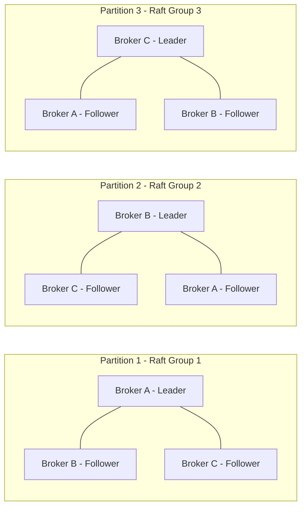
```mermaid
graph LR
    subgraph "Partition 1 - Raft Group 1"
        P1L[Broker A - Leader]
        P1F1[Broker B - Follower]
        P1F2[Broker C - Follower]
    end

    subgraph "Partition 2 - Raft Group 2"
        P2L[Broker B - Leader]
        P2F1[Broker C - Follower]
        P2F2[Broker A - Follower]
    end

    subgraph "Partition 3 - Raft Group 3"
        P3L[Broker C - Leader]
        P3F1[Broker A - Follower]
        P3F2[Broker B - Follower]
    end

    P1L --- P1F1
    P1L --- P1F2
    P2L --- P2F1
    P2L --- P2F2
    P3L --- P3F1
    P3L --- P3F2
```

**关键设计点：**

1. **Partition 是数据分片的基本单位**：每个 Partition 拥有独立的事件日志（Event Log），所有流程实例数据按 Partition 隔离。流程实例在创建时被分配到一个 Partition，之后该实例的所有操作都在同一 Partition 上执行，避免了分布式事务
2. **每个 Partition 独立运行 Raft 协议**：Leader 负责写入，Follower 负责复制，保证数据一致性。Raft 的选举超时通常为 250ms-10s，Leader 心跳间隔为 100ms-2s
3. **分区数在集群创建时确定**，不可动态修改（当前限制），通常设置为 1、3、5、8 等值。分区数决定了集群的并行度和最大吞吐量上限
4. **Leader 分布策略**：通过优先级配置确保同一 Broker 不同时担任过多 Partition 的 Leader，实现负载均衡。推荐每个 Broker 最多担任 `partitionCount / brokerCount + 1` 个 Partition 的 Leader
5. **故障转移**：Leader 宕机时，Raft 自动选举新 Leader，通常在数秒内完成。选举期间该 Partition 不可写入，但不影响其他 Partition

### 1.4 Zeebe Gateway：无状态网关

Zeebe Gateway 是整个集群的入口，具有以下特性：

- **完全无状态**：不存储任何流程数据，可随时重启和水平扩展。Gateway 缓存了 Broker 的拓扑信息（各 Partition 的 Leader 位置），通过定期从 Broker 拉取更新来保持同步
- **gRPC 协议**：所有客户端通过 gRPC 与 Gateway 通信，使用 Protocol Buffers 定义接口
- **请求路由**：Gateway 根据流程实例的 Partition 计算出目标 Broker，将请求转发到对应 Partition 的 Leader
- **Partition 路由算法**：`partitionId = hashCode(key) % partitionCount + 1`，其中 key 可以是流程实例 ID 或自定义 key
- **健康检查**：Gateway 通过 gRPC 健康检查协议暴露自身状态，Kubernetes 等容器编排平台据此进行流量管理

```protobuf
// Zeebe Gateway gRPC 服务定义（简化）
service Gateway {
  // 部署流程
  rpc DeployProcess(DeployProcessRequest) returns (DeployProcessResponse);
  // 创建流程实例
  rpc CreateProcessInstance(CreateProcessInstanceRequest) returns (CreateProcessInstanceResponse);
  // 激活 Job（长轮询，服务端流）
  rpc ActivateJobs(ActivateJobsRequest) returns (stream ActivatedJob);
  // 完成 Job
  rpc CompleteJob(CompleteJobRequest) returns (CompleteJobResponse);
  // 失败 Job
  rpc FailJob(FailJobRequest) returns (FailJobResponse);
  // 发布消息
  rpc PublishMessage(PublishMessageRequest) returns (PublishMessageResponse);
  // 解决 Incident
  rpc ResolveIncident(ResolveIncidentRequest) returns (ResolveIncidentResponse);
}
```

**Gateway 的请求处理流程：**

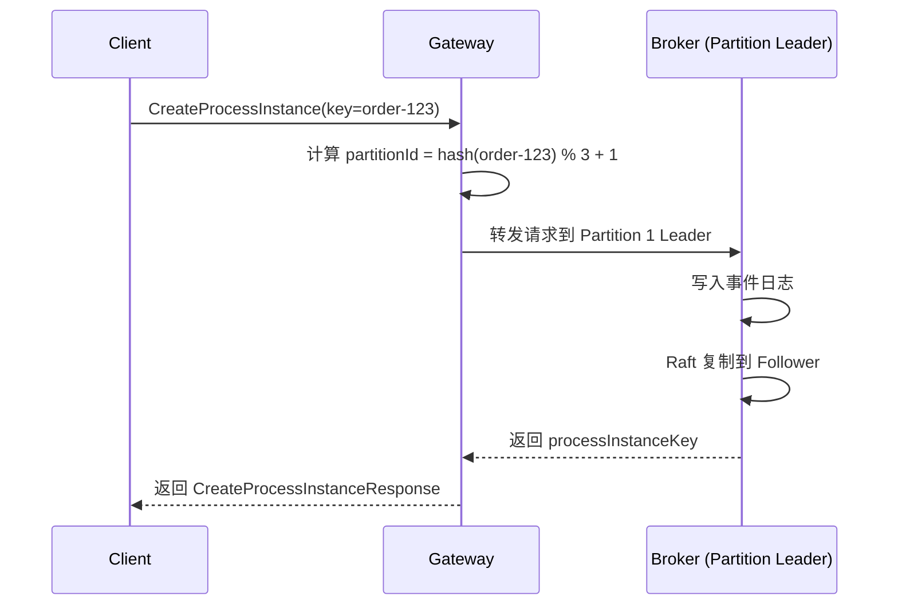
```mermaid
sequenceDiagram
    participant C as Client
    participant G as Gateway
    participant B as Broker (Partition Leader)

    C->>G: CreateProcessInstance(key=order-123)
    G->>G: 计算 partitionId = hash(order-123) % 3 + 1
    G->>B: 转发请求到 Partition 1 Leader
    B->>B: 写入事件日志
    B->>B: Raft 复制到 Follower
    B-->>G: 返回 processInstanceKey
    G-->>C: 返回 CreateProcessInstanceResponse
```

---

## 二、Connector Framework 技术实现（重点！）

### 2.1 Connector 定义模型

Camunda 8 的 Connector Framework 是其最核心的扩展机制之一，也是 open-app 连接器平台最需要参考的设计。Connector 的核心抽象是 **InputElement / OutputElement** 模型，通过这一模型实现了 Connector 的"配置即代码"——开发者在 Template JSON 中定义输入输出，在 Java 代码中实现执行逻辑，两者通过注解自动绑定。

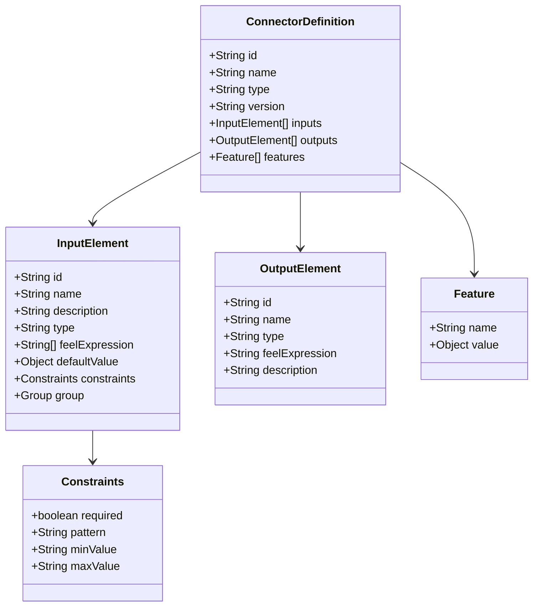
```mermaid
classDiagram
    class ConnectorDefinition {
        +String id
        +String name
        +String type
        +String version
        +InputElement[] inputs
        +OutputElement[] outputs
        +Feature[] features
    }

    class InputElement {
        +String id
        +String name
        +String description
        +String type
        +String[] feelExpression
        +Object defaultValue
        +Constraints constraints
        +Group group
    }

    class OutputElement {
        +String id
        +String name
        +String type
        +String feelExpression
        +String description
    }

    class Feature {
        +String name
        +Object value
    }

    class Constraints {
        +boolean required
        +String pattern
        +String minValue
        +String maxValue
    }

    ConnectorDefinition --> InputElement
    ConnectorDefinition --> OutputElement
    ConnectorDefinition --> Feature
    InputElement --> Constraints
```

**InputElement 定义了 Connector 的输入参数**：
- 每个输入参数有明确的类型（string, number, boolean, array, object, dropdown 等）
- 支持 FEEL 表达式（Friendly Enough Expression Language），允许从流程变量动态计算值
- 支持 `constraints.required` 标记必填项
- 支持 `group` 分组，在 UI 中按组展示
- 支持 `defaultValue` 设置默认值
- 支持 `feel` 属性控制表达式求值行为：`optional` 表示可选表达式、`required` 表示必须使用表达式

**OutputElement 定义了 Connector 的输出结构**：
- 输出映射到流程变量，供后续节点使用
- 使用 FEEL 表达式从 Connector 响应中提取值
- 支持嵌套结构映射，如 `=response.data.items`

### 2.2 Inbound Connector vs Outbound Connector

Camunda 8 将 Connector 分为两大类，这是其架构中最重要的区分：

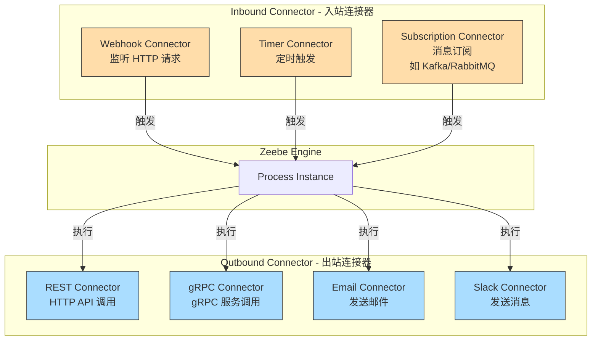
```mermaid
graph TB
    subgraph "Inbound Connector - 入站连接器"
        direction LR
        WH[Webhook Connector<br/>监听 HTTP 请求]
        TM[Timer Connector<br/>定时触发]
        SUB[Subscription Connector<br/>消息订阅<br/>如 Kafka/RabbitMQ]
    end

    subgraph "Outbound Connector - 出站连接器"
        direction LR
        REST[REST Connector<br/>HTTP API 调用]
        GRPC[gRPC Connector<br/>gRPC 服务调用]
        EMAIL[Email Connector<br/>发送邮件]
        SLACK[Slack Connector<br/>发送消息]
    end

    subgraph "Zeebe Engine"
        PI[Process Instance]
    end

    WH -->|触发| PI
    TM -->|触发| PI
    SUB -->|触发| PI
    PI -->|执行| REST
    PI -->|执行| GRPC
    PI -->|执行| EMAIL
    PI -->|执行| SLACK

    style WH fill:#fda,stroke:#333
    style TM fill:#fda,stroke:#333
    style SUB fill:#fda,stroke:#333
    style REST fill:#adf,stroke:#333
    style GRPC fill:#adf,stroke:#333
    style EMAIL fill:#adf,stroke:#333
    style SLACK fill:#adf,stroke:#333
```

**Inbound Connector（入站连接器）**：
- **作用**：从外部系统接收事件，触发流程实例启动或消息中间事件
- **生命周期**：与流程定义绑定，流程部署时激活，流程取消时停用
- **实现方式**：实现 `InboundConnectorExecutable` 接口，在 `activate()` 方法中启动监听，在 `deactivate()` 方法中停止
- **典型场景**：
  - **Webhook**：注册 HTTP 端点，接收外部 POST 请求，将请求体映射为流程变量
  - **Timer**：使用 Quartz 等调度器，按 Cron 表达式触发流程启动
  - **Subscription**：订阅 Kafka Topic、RabbitMQ Queue 等消息源，消费消息并触发流程

**Outbound Connector（出站连接器）**：
- **作用**：在流程执行过程中调用外部系统
- **生命周期**：作为 Job Worker 被激活，执行完毕后完成 Job
- **实现方式**：实现 `OutboundConnectorExecutable` 接口，在 `execute()` 方法中执行外部调用
- **典型场景**：
  - **REST 调用**：调用外部 REST API，支持 GET/POST/PUT/DELETE
  - **gRPC 调用**：调用 gRPC 服务
  - **邮件发送**：通过 SMTP 发送邮件
  - **消息推送**：发送 Slack、企业微信等消息

**入站与出站 Connector 的生命周期对比：**

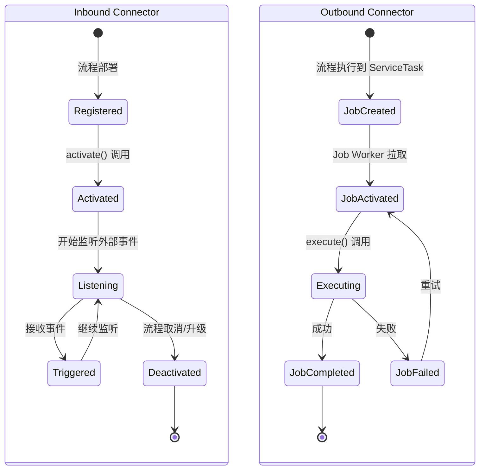
```mermaid
stateDiagram-v2
    state "Inbound Connector" as IC {
        [*] --> Registered: 流程部署
        Registered --> Activated: activate() 调用
        Activated --> Listening: 开始监听外部事件
        Listening --> Triggered: 接收事件
        Triggered --> Listening: 继续监听
        Listening --> Deactivated: 流程取消/升级
        Deactivated --> [*]
    }

    state "Outbound Connector" as OC {
        [*] --> JobCreated: 流程执行到 ServiceTask
        JobCreated --> JobActivated: Job Worker 拉取
        JobActivated --> Executing: execute() 调用
        Executing --> JobCompleted: 成功
        Executing --> JobFailed: 失败
        JobFailed --> JobActivated: 重试
        JobCompleted --> [*]
    }
```

### 2.3 Connector Template JSON Schema（完整示例）

Connector Template 是 Camunda 8 连接器体系中最关键的概念——它是一个 JSON Schema 文档，定义了 Connector 的元数据、输入输出参数和 UI 渲染规则。Web Modeler 通过解析 Template 动态渲染属性面板，实现了"零代码配置连接器"的体验。

以下是一个完整的企业微信消息发送 Connector Template：

```json
{
  "$schema": "https://unpkg.com/@camunda/zeebe-element-template-schema/json/schema.json",
  "name": "企业微信消息发送",
  "id": "io.openapp.connectors.wecom-message",
  "version": 1,
  "description": "通过企业微信机器人 Webhook 发送文本/Markdown 消息",
  "icon": {
    "contents": "data:image/svg+xml;base64,PHN2ZyB4bWxucz0iaHR0cDovL3d3dy53My5vcmcvMjAwMC9zdmciIHdpZHRoPSI0OCIgaGVpZ2h0PSI0OCI+PC9zdmc+"
  },
  "category": {
    "id": "connectors",
    "name": "Connectors"
  },
  "appliesTo": [
    "bpmn:ServiceTask"
  ],
  "elementType": {
    "value": "bpmn:ServiceTask"
  },
  "groups": [
    { "id": "authentication", "label": "认证配置" },
    { "id": "message", "label": "消息内容" },
    { "id": "retry", "label": "重试策略" },
    { "id": "output", "label": "输出映射" }
  ],
  "properties": [
    {
      "id": "taskDefinitionType",
      "type": "Hidden",
      "value": "io.openapp:wecom-message:1"
    },
    {
      "id": "webhookUrl",
      "label": "Webhook 地址",
      "description": "企业微信机器人的 Webhook URL",
      "group": "authentication",
      "type": "String",
      "feel": "optional",
      "binding": {
        "name": "webhookUrl",
        "type": "zeebe:input"
      },
      "constraints": {
        "notEmpty": true
      }
    },
    {
      "id": "secretKey",
      "label": "密钥引用",
      "description": "使用 SECRET 语法引用密钥，如 SECRETS.wecom_webhook_url",
      "group": "authentication",
      "type": "String",
      "feel": "optional",
      "binding": {
        "name": "webhookUrl",
        "type": "zeebe:input"
      },
      "optional": true
    },
    {
      "id": "messageType",
      "label": "消息类型",
      "description": "选择消息格式",
      "group": "message",
      "type": "Dropdown",
      "choices": [
        { "name": "文本消息", "value": "text" },
        { "name": "Markdown 消息", "value": "markdown" }
      ],
      "binding": {
        "name": "messageType",
        "type": "zeebe:input"
      }
    },
    {
      "id": "content",
      "label": "消息内容",
      "description": "消息正文，支持 FEEL 表达式引用流程变量",
      "group": "message",
      "type": "Text",
      "feel": "required",
      "binding": {
        "name": "content",
        "type": "zeebe:input"
      },
      "constraints": {
        "notEmpty": true
      }
    },
    {
      "id": "mentionedList",
      "label": "@提及用户",
      "description": "被@人的用户ID列表",
      "group": "message",
      "type": "String",
      "feel": "optional",
      "optional": true,
      "binding": {
        "name": "mentionedList",
        "type": "zeebe:input"
      }
    },
    {
      "id": "retryCount",
      "label": "重试次数",
      "group": "retry",
      "type": "Number",
      "value": "3",
      "binding": {
        "property": "retries",
        "type": "zeebe:taskDefinition"
      }
    },
    {
      "id": "retryBackoff",
      "label": "重试间隔 ISO-8601",
      "group": "retry",
      "type": "String",
      "value": "PT30S",
      "binding": {
        "name": "retryBackoff",
        "type": "zeebe:input"
      }
    },
    {
      "id": "resultStatusCode",
      "label": "HTTP 状态码",
      "group": "output",
      "type": "String",
      "feel": "optional",
      "binding": {
        "source": "=statusCode",
        "type": "zeebe:output"
      }
    },
    {
      "id": "resultBody",
      "label": "响应内容",
      "group": "output",
      "type": "String",
      "feel": "optional",
      "binding": {
        "source": "=body",
        "type": "zeebe:output"
      }
    }
  ],
  "features": {
    "documentationRef": true
  }
}
```

**Template Schema 关键字段解析：**

| 字段 | 作用 | 说明 |
|------|------|------|
| `appliesTo` | 适用元素类型 | 限定 Template 可绑定到哪些 BPMN 元素（如 ServiceTask、StartEvent 等） |
| `elementType` | 元素类型覆盖 | 可将 ServiceTask 渲染为自定义类型 |
| `groups` | 属性分组 | 控制属性面板中的分组展示 |
| `properties[].type` | 属性类型 | Hidden / String / Number / Boolean / Dropdown / Text |
| `properties[].feel` | FEEL 表达式 | optional/required，控制是否支持 FEEL 表达式 |
| `properties[].binding` | 绑定方式 | zeebe:input（输入映射）、zeebe:output（输出映射）、zeebe:taskDefinition（任务定义） |
| `properties[].constraints` | 约束 | notEmpty、pattern、min/max 等 |

**binding 类型的详细说明：**

| binding type | 含义 | 示例 |
|-------------|------|------|
| `zeebe:input` | 将属性值映射为 Job 输入变量 | `"binding": {"name": "webhookUrl", "type": "zeebe:input"}` |
| `zeebe:output` | 从 Job 输出中提取值映射到流程变量 | `"binding": {"source": "=statusCode", "type": "zeebe:output"}` |
| `zeebe:taskDefinition` | 设置 taskDefinition 的 type 或 retries | `"binding": {"property": "retries", "type": "zeebe:taskDefinition"}` |
| `zeebe:subscription` | 设置消息订阅的 correlationKey 和 messageName | 用于 Inbound Connector 的消息关联 |
| `zeebe:calledDecision` | 绑定决策定义 | 用于 DMN 决策任务 |

### 2.4 Connector Runtime

Connector Runtime 是 Camunda 8 提供的运行时环境，基于 Spring Boot 构建，负责 Connector 实例的发现、注册和执行。

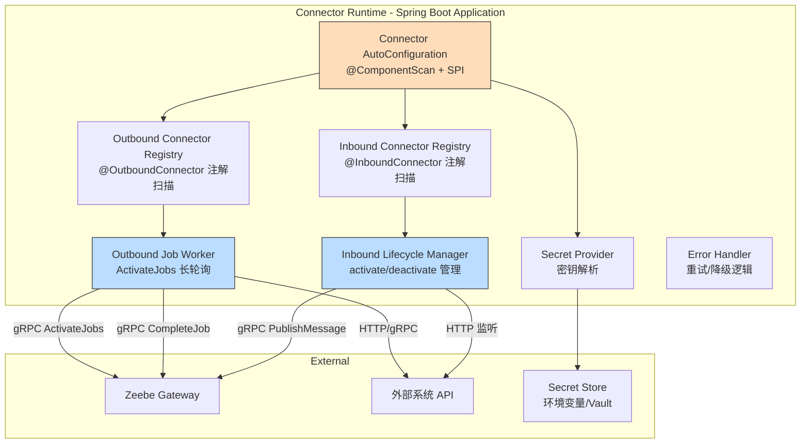
```mermaid
graph TB
    subgraph "Connector Runtime - Spring Boot Application"
        CA[Connector AutoConfiguration<br/>@ComponentScan + SPI]
        OR[Outbound Connector Registry<br/>@OutboundConnector 注解扫描]
        IR[Inbound Connector Registry<br/>@InboundConnector 注解扫描]
        OW[Outbound Job Worker<br/>ActivateJobs 长轮询]
        IL[Inbound Lifecycle Manager<br/>activate/deactivate 管理]
        SS[Secret Provider<br/>密钥解析]
        EH[Error Handler<br/>重试/降级逻辑]
    end

    subgraph "External"
        GW[Zeebe Gateway]
        EXT[外部系统 API]
        SEC[Secret Store<br/>环境变量/Vault]
    end

    CA --> OR
    CA --> IR
    CA --> SS
    OR --> OW
    IR --> IL
    OW -->|gRPC ActivateJobs| GW
    OW -->|gRPC CompleteJob| GW
    OW -->|HTTP/gRPC| EXT
    IL -->|gRPC PublishMessage| GW
    IL -->|HTTP 监听| EXT
    SS --> SEC

    style CA fill:#fdb,stroke:#333
    style OW fill:#bdf,stroke:#333
    style IL fill:#bdf,stroke:#333
```

**Connector Runtime 的启动流程：**

1. Spring Boot 应用启动，触发 `ConnectorAutoConfiguration`
2. 通过 `@ComponentScan` 和 Java SPI 机制扫描所有 Connector 实现
3. 对于 Outbound Connector：注册到 `OutboundConnectorRegistry`，创建对应的 Job Worker
4. 对于 Inbound Connector：注册到 `InboundConnectorRegistry`，在流程部署时调用 `activate()`
5. Secret Provider 初始化，从环境变量或 Vault 加载密钥

**关键配置项：**

```yaml
# application.yml - Connector Runtime 配置
camunda:
  connector:
    # 连接器轮询间隔
    polling-interval: 500ms
    # Job Worker 配置
    worker:
      max-jobs-activate: 32
      request-timeout: 10s
      timeout-seconds: 300
    # 密钥提供者
    secret-provider:
      type: env  # env | vault | kubernetes
    # Inbound Connector Webhook 端口
    inbound:
      webhook:
        port: 8080
        path: /inbound
```

### 2.5 密钥管理：Secret Storage

Camunda 8 的 Secret 机制允许在 Template 中引用密钥，而不是将密钥硬编码到流程定义中。这是企业级安全的关键特性。

**密钥引用语法：**

```
SECRETS.my_secret_key
```

在 Template 中，当属性值以 `SECRETS.` 开头时，Connector Runtime 会在执行时自动替换为实际密钥值。

**密钥存储后端：**

| 后端 | 实现方式 | 适用场景 |
|------|----------|----------|
| 环境变量 | `System.getenv()` | 本地开发、Docker 部署 |
| Kubernetes Secrets | 通过 K8s API 读取 | K8s 集群部署 |
| HashiCorp Vault | Vault KV v2 API | 企业生产环境 |
| 自定义 SecretProvider | 实现 `SecretProvider` 接口 | 特殊安全需求 |

```java
// 自定义 SecretProvider 示例
public class CustomSecretProvider implements SecretProvider {
    
    private final SecretClient secretClient;
    
    public CustomSecretProvider(SecretClient secretClient) {
        this.secretClient = secretClient;
    }
    
    @Override
    public String getSecret(String secretName) {
        // 替换 SECRETS. 前缀
        String key = secretName.replace("SECRETS.", "");
        return secretClient.getSecret(key);
    }
}
```

### 2.6 自定义 Connector 开发完整示例（企业微信发送消息 Connector）

以下是一个完整的企业微信消息发送 Outbound Connector 实现，展示从注解定义到执行逻辑的全过程：

```java
package io.openapp.connectors.wecom;

import io.camunda.connector.api.annotation.OutboundConnector;
import io.camunda.connector.api.outbound.OutboundConnectorContext;
import io.camunda.connector.api.outbound.OutboundConnectorExecutable;
import io.camunda.connector.generator.java.annotation.ElementTemplate;
import io.camunda.connector.generator.java.annotation.ElementTemplate.PropertyGroup;

/**
 * 企业微信消息发送 Connector
 * 
 * 通过企业微信机器人 Webhook 发送文本/Markdown 消息
 * Template 由 @ElementTemplate 注解自动生成
 */
@OutboundConnector(
    name = "WECOM_MESSAGE", 
    type = "io.openapp:wecom-message:1",
    inputVariables = {"webhookUrl", "messageType", "content", "mentionedList"}
)
@ElementTemplate(
    id = "io.openapp.connectors.wecom-message",
    name = "企业微信消息发送",
    version = 1,
    description = "通过企业微信机器人 Webhook 发送文本/Markdown 消息",
    icon = "wecom-icon.svg",
    propertyGroups = {
        @PropertyGroup(id = "authentication", label = "认证配置"),
        @PropertyGroup(id = "message", label = "消息内容"),
        @PropertyGroup(id = "output", label = "输出映射")
    },
    documentationRef = "https://docs.openapp.io/connectors/wecom"
)
public class WeComMessageConnector implements OutboundConnectorExecutable {

    private static final Logger LOG = LoggerFactory.getLogger(WeComMessageConnector.class);
    private static final String WEBHOOK_BASE_URL = "https://qyapi.weixin.qq.com/cgi-bin/webhook/send";

    @Override
    public Object execute(OutboundConnectorContext context) {
        // 1. 从上下文绑定输入变量
        WeComMessageRequest request = context.bindVariables(WeComMessageRequest.class);
        
        LOG.info("发送企业微信消息: type={}, content={}", 
                 request.getMessageType(), 
                 request.getContent());

        // 2. 解析密钥（如果 webhookUrl 是 SECRETS.xxx 格式）
        String webhookUrl = resolveWebhookUrl(request.getWebhookUrl());

        // 3. 构建请求体
        Map<String, Object> body = buildRequestBody(request);

        // 4. 发送 HTTP 请求
        try {
            HttpResponse<String> response = sendRequest(webhookUrl, body);
            
            // 5. 构建输出结果
            return WeComMessageResponse.builder()
                .statusCode(response.statusCode())
                .body(response.body())
                .success(response.statusCode() == 200)
                .build();
                
        } catch (Exception e) {
            LOG.error("企业微信消息发送失败", e);
            throw new ConnectorException(
                "WECOM_SEND_FAILED", 
                "消息发送失败: " + e.getMessage(), 
                e
            );
        }
    }

    /**
     * 解析 Webhook URL，支持 SECRETS. 前缀
     */
    private String resolveWebhookUrl(String webhookUrl) {
        if (webhookUrl != null && webhookUrl.startsWith("SECRETS.")) {
            // SecretProvider 会自动替换
            return webhookUrl;
        }
        return webhookUrl;
    }

    /**
     * 构建企业微信消息请求体
     */
    private Map<String, Object> buildRequestBody(WeComMessageRequest request) {
        Map<String, Object> body = new HashMap<>();
        Map<String, Object> contentMap = new HashMap<>();
        
        switch (request.getMessageType()) {
            case "text":
                contentMap.put("content", request.getContent());
                if (request.getMentionedList() != null) {
                    contentMap.put("mentioned_list", request.getMentionedList());
                }
                body.put("msgtype", "text");
                body.put("text", contentMap);
                break;
                
            case "markdown":
                contentMap.put("content", request.getContent());
                body.put("msgtype", "markdown");
                body.put("markdown", contentMap);
                break;
                
            default:
                throw new ConnectorException(
                    "INVALID_MESSAGE_TYPE", 
                    "不支持的消息类型: " + request.getMessageType()
                );
        }
        
        return body;
    }

    /**
     * 发送 HTTP POST 请求
     */
    private HttpResponse<String> sendRequest(String webhookUrl, Map<String, Object> body) 
            throws Exception {
        ObjectMapper mapper = new ObjectMapper();
        String jsonBody = mapper.writeValueAsString(body);
        
        HttpRequest httpRequest = HttpRequest.newBuilder()
            .uri(URI.create(webhookUrl))
            .header("Content-Type", "application/json")
            .POST(HttpRequest.BodyPublishers.ofString(jsonBody))
            .timeout(Duration.ofSeconds(30))
            .build();
            
        HttpClient client = HttpClient.newBuilder()
            .connectTimeout(Duration.ofSeconds(10))
            .build();
            
        return client.send(httpRequest, HttpResponse.BodyHandlers.ofString());
    }
}
```

**请求/响应数据类：**

```java
/**
 * 企业微信消息请求
 */
@Data
@Builder
public class WeComMessageRequest {
    
    @JsonProperty("webhookUrl")
    @Schema(description = "企业微信机器人 Webhook URL", required = true)
    private String webhookUrl;
    
    @JsonProperty("messageType")
    @Schema(description = "消息类型: text/markdown", allowableValues = {"text", "markdown"})
    private String messageType = "text";
    
    @JsonProperty("content")
    @Schema(description = "消息内容")
    private String content;
    
    @JsonProperty("mentionedList")
    @Schema(description = "@提及的用户ID列表")
    private List<String> mentionedList;
}

/**
 * 企业微信消息响应
 */
@Data
@Builder
public class WeComMessageResponse {
    
    @JsonProperty("statusCode")
    private int statusCode;
    
    @JsonProperty("body")
    private String body;
    
    @JsonProperty("success")
    private boolean success;
}
```

### 2.7 发现和注册机制：SPI + Spring Boot AutoConfiguration

Camunda 8 Connector 的发现和注册采用了 **Java SPI + Spring Boot AutoConfiguration** 的双重机制，确保了灵活性和易用性。

**Java SPI 机制：**

Connector Runtime 通过 Java SPI（Service Provider Interface）发现 Connector 实现。在 `META-INF/services/` 目录下声明接口实现：

```
# META-INF/services/io.camunda.connector.api.outbound.OutboundConnectorExecutable
io.openapp.connectors.wecom.WeComMessageConnector
io.openapp.connectors.slack.SlackMessageConnector

# META-INF/services/io.camunda.connector.api.inbound.InboundConnectorExecutable
io.openapp.connectors.webhook.WebhookConnector
```

**Spring Boot AutoConfiguration：**

```java
@Configuration
@ConditionalOnClass(OutboundConnectorExecutable.class)
@EnableConfigurationProperties(ConnectorProperties.class)
public class ConnectorAutoConfiguration {

    @Bean
    @ConditionalOnMissingBean
    public OutboundConnectorRegistry outboundConnectorRegistry(
            List<OutboundConnectorExecutable> connectors) {
        OutboundConnectorRegistry registry = new OutboundConnectorRegistry();
        connectors.forEach(connector -> {
            OutboundConnector annotation = connector.getClass()
                .getAnnotation(OutboundConnector.class);
            if (annotation != null) {
                registry.register(annotation.type(), connector);
            }
        });
        return registry;
    }

    @Bean
    @ConditionalOnMissingBean
    public InboundConnectorRegistry inboundConnectorRegistry(
            List<InboundConnectorExecutable> connectors) {
        InboundConnectorRegistry registry = new InboundConnectorRegistry();
        connectors.forEach(connector -> {
            InboundConnector annotation = connector.getClass()
                .getAnnotation(InboundConnector.class);
            if (annotation != null) {
                registry.register(annotation.type(), connector);
            }
        });
        return registry;
    }

    @Bean
    @ConditionalOnMissingBean
    public SecretProvider secretProvider(ConnectorProperties properties) {
        return switch (properties.getSecretProvider().getType()) {
            case "env" -> new EnvSecretProvider();
            case "vault" -> new VaultSecretProvider(properties.getVault());
            case "kubernetes" -> new KubernetesSecretProvider();
            default -> throw new IllegalArgumentException(
                "Unknown secret provider type");
        };
    }
}
```

**发现流程时序图：**

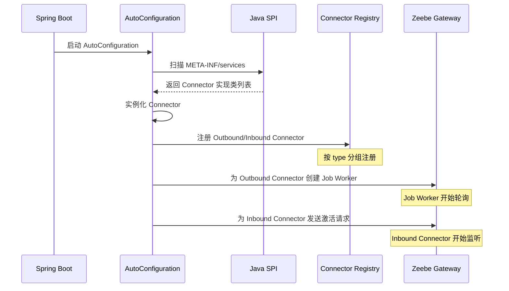
```mermaid
sequenceDiagram
    participant SB as Spring Boot
    participant AC as AutoConfiguration
    participant SPI as Java SPI
    participant REG as Connector Registry
    participant GW as Zeebe Gateway

    SB->>AC: 启动 AutoConfiguration
    AC->>SPI: 扫描 META-INF/services
    SPI-->>AC: 返回 Connector 实现类列表
    AC->>AC: 实例化 Connector
    AC->>REG: 注册 Outbound/Inbound Connector
    Note over REG: 按 type 分组注册
    AC->>GW: 为 Outbound Connector 创建 Job Worker
    Note over GW: Job Worker 开始轮询
    AC->>GW: 为 Inbound Connector 发送激活请求
    Note over GW: Inbound Connector 开始监听
```

---

## 三、流程（BPMN）数据模型

### 3.1 BPMN 2.0 在 Camunda 中的扩展

Camunda 8 基于 BPMN 2.0 标准进行了扩展，添加了 Zeebe 特有的扩展命名空间和属性。这些扩展使得 BPMN 能够更好地适配 Zeebe 的分布式执行模型。

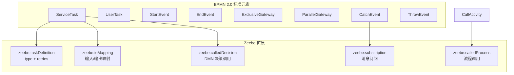
```mermaid
graph TB
    subgraph "BPMN 2.0 标准元素"
        ST[ServiceTask]
        UT[UserTask]
        SE[StartEvent]
        EE[EndEvent]
        EG[ExclusiveGateway]
        PG[ParallelGateway]
        CE[CatchEvent]
        TE[ThrowEvent]
    end

    subgraph "Zeebe 扩展"
        TD[zeebe:taskDefinition<br/>type + retries]
        IO[zeebe:ioMapping<br/>输入/输出映射]
        SUB[zeebe:subscription<br/>消息订阅]
        TD2[zeebe:calledDecision<br/>DMN 决策调用]
        CP[zeebe:calledProcess<br/>流程调用]
    end

    ST --> TD
    ST --> IO
    CE --> SUB
    ST --> TD2
    CALL[CallActivity] --> CP
```

**Zeebe 核心扩展属性：**

| 扩展 | 用途 | 示例 |
|------|------|------|
| `zeebe:taskDefinition` | 定义 ServiceTask 的类型和重试次数 | `<zeebe:taskDefinition type="io.openapp:wecom-message:1" retries="3" />` |
| `zeebe:ioMapping` | 定义任务的输入/输出映射 | 将流程变量映射为 Job 输入，将 Job 输出映射回流程变量 |
| `zeebe:subscription` | 定义消息订阅的关联键 | `<zeebe:subscription correlationKey="orderId" />` |
| `zeebe:calledDecision` | 调用 DMN 决策表 | `<zeebe:calledDecision decisionId="risk-assessment" />` |
| `zeebe:calledProcess` | 调用子流程 | `<zeebe:calledProcess processId="child-process" />` |
| `zeebe:retryBackoff` | 重试退避策略 | `<zeebe:retryBackoff>PT30S</zeebe:retryBackoff>` |

### 3.2 Process Instance 数据结构

流程实例是 Zeebe 中的核心运行时实体，其数据结构如下：

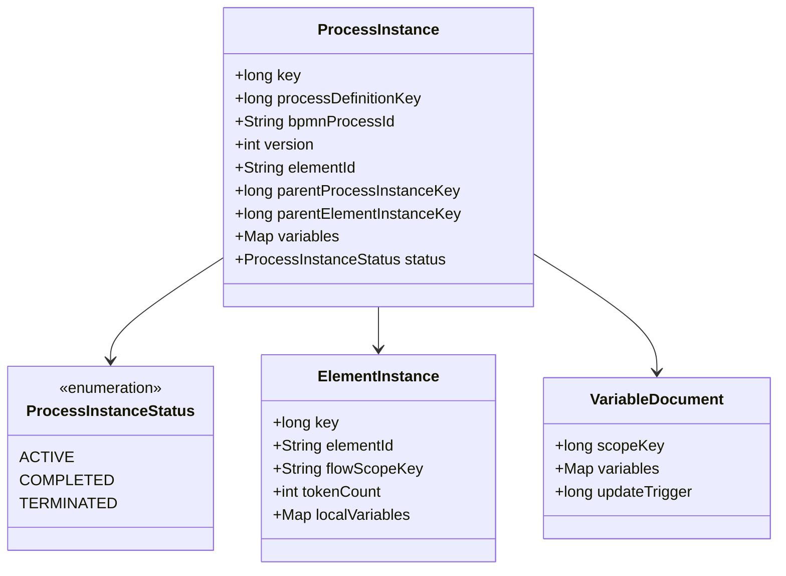
```mermaid
classDiagram
    class ProcessInstance {
        +long key
        +long processDefinitionKey
        +String bpmnProcessId
        +int version
        +String elementId
        +long parentProcessInstanceKey
        +long parentElementInstanceKey
        +Map variables
        +ProcessInstanceStatus status
    }

    class ProcessInstanceStatus {
        <<enumeration>>
        ACTIVE
        COMPLETED
        TERMINATED
    }

    class ElementInstance {
        +long key
        +String elementId
        +String flowScopeKey
        +int tokenCount
        +Map localVariables
    }

    class VariableDocument {
        +long scopeKey
        +Map variables
        +long updateTrigger
    }

    ProcessInstance --> ProcessInstanceStatus
    ProcessInstance --> ElementInstance
    ProcessInstance --> VariableDocument
```

**流程实例的关键标识：**

- **key**：全局唯一标识，由 Zeebe 自动生成（雪花算法）
- **bpmnProcessId**：流程定义的业务标识，如 `order-approval-process`
- **processDefinitionKey**：特定版本的流程定义标识
- **parentProcessInstanceKey**：父流程实例的 key，用于 CallActivity 场景

### 3.3 Job / Activation 执行模型

Zeebe 的 Job 模型是其执行引擎的核心抽象。与 Camunda 7 的"引擎推送"模型不同，Zeebe 采用了"Worker 拉取"模型。

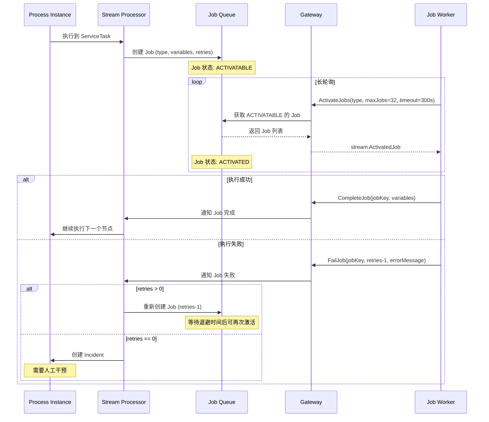
```mermaid
sequenceDiagram
    participant PI as Process Instance
    participant SP as Stream Processor
    participant JQ as Job Queue
    participant GW as Gateway
    participant JW as Job Worker

    PI->>SP: 执行到 ServiceTask
    SP->>JQ: 创建 Job (type, variables, retries)
    Note over JQ: Job 状态: ACTIVATABLE

    loop 长轮询
        JW->>GW: ActivateJobs(type, maxJobs=32, timeout=300s)
        GW->>JQ: 获取 ACTIVATABLE 的 Job
        JQ-->>GW: 返回 Job 列表
        GW-->>JW: stream ActivatedJob
        Note over JQ: Job 状态: ACTIVATED
    end

    alt 执行成功
        JW->>GW: CompleteJob(jobKey, variables)
        GW->>SP: 通知 Job 完成
        SP->>PI: 继续执行下一个节点
    else 执行失败
        JW->>GW: FailJob(jobKey, retries-1, errorMessage)
        GW->>SP: 通知 Job 失败
        alt retries > 0
            SP->>JQ: 重新创建 Job (retries-1)
            Note over JQ: 等待退避时间后可再次激活
        else retries == 0
            SP->>PI: 创建 Incident
            Note over PI: 需要人工干预
        end
    end
```

**Job 的关键属性：**

| 属性 | 类型 | 说明 |
|------|------|------|
| `key` | long | Job 全局唯一标识 |
| `type` | String | Job 类型，对应 `zeebe:taskDefinition.type` |
| `processInstanceKey` | long | 所属流程实例 |
| `elementId` | String | BPMN 元素 ID |
| `variables` | Map | 输入变量 |
| `retries` | int | 剩余重试次数 |
| `deadline` | long | 激活超时时间戳 |
| `customHeaders` | Map | 自定义头信息 |

### 3.4 流程变量存储（Document Store）

Zeebe 使用 Document Store（文档存储）来管理流程变量。变量与作用域（Scope）绑定，支持层级作用域继承。

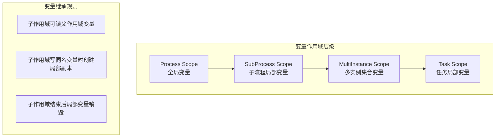
```mermaid
graph TB
    subgraph "变量作用域层级"
        PS[Process Scope<br/>全局变量]
        SS1[SubProcess Scope<br/>子流程局部变量]
        MS1[MultiInstance Scope<br/>多实例集合变量]
        TS1[Task Scope<br/>任务局部变量]
    end

    PS --> SS1
    SS1 --> MS1
    MS1 --> TS1

    subgraph "变量继承规则"
        R1[子作用域可读父作用域变量]
        R2[子作用域写同名变量时创建局部副本]
        R3[子作用域结束后局部变量销毁]
    end
```

**变量存储特点：**

- 变量以 JSON 格式存储，支持嵌套对象和数组
- 变量更新是原子性的，通过事件日志记录每一次变更
- 变量大小限制：单个变量值最大 64KB，单个作用域所有变量总大小最大 256KB
- 变量通过 FEEL 表达式访问：`=orderId`、`=customer.name`

### 3.5 BPMN XML 示例

以下是一个完整的订单审批流程 BPMN XML，展示了 Zeebe 扩展的使用：

```xml
<?xml version="1.0" encoding="UTF-8"?>
<bpmn:definitions xmlns:bpmn="http://www.omg.org/spec/BPMN/20100524/MODEL"
                  xmlns:zeebe="http://camunda.org/schema/zeebe/1.0"
                  xmlns:bpmndi="http://www.omg.org/spec/BPMN/20100524/DI"
                  id="Definitions_1"
                  targetNamespace="http://bpmn.io/schema/bpmn">

  <bpmn:process id="order-approval" name="订单审批流程" isExecutable="true">
    
    <!-- 开始事件：接收订单消息 -->
    <bpmn:startEvent id="orderReceived" name="订单已接收">
      <bpmn:outgoing>flow1</bpmn:outgoing>
      <bpmn:messageEventDefinition messageRef="orderMessage" />
      <zeebe:subscription correlationKey="=orderId" />
    </bpmn:startEvent>

    <bpmn:message id="orderMessage" name="order-received-message" />

    <!-- 服务任务：发送企业微信通知 -->
    <bpmn:serviceTask id="sendNotification" name="发送通知">
      <bpmn:incoming>flow1</bpmn:incoming>
      <bpmn:outgoing>flow2</bpmn:outgoing>
      <zeebe:taskDefinition type="io.openapp:wecom-message:1" retries="3" />
      <zeebe:ioMapping>
        <zeebe:input source="=SECRETS.wecom_webhook_url" target="webhookUrl" />
        <zeebe:input source="='markdown'" target="messageType" />
        <zeebe:input source="='## 新订单通知\n订单号: ' + orderId + '\n金额: ' + string(amount)" target="content" />
      </zeebe:ioMapping>
    </bpmn:serviceTask>

    <!-- 排他网关：金额判断 -->
    <bpmn:exclusiveGateway id="amountGateway" name="金额判断">
      <bpmn:incoming>flow2</bpmn:incoming>
      <bpmn:outgoing>flow3</bpmn:outgoing>
      <bpmn:outgoing>flow4</bpmn:outgoing>
    </bpmn:exclusiveGateway>

    <!-- 服务任务：小额订单自动审批 -->
    <bpmn:serviceTask id="autoApprove" name="自动审批">
      <bpmn:incoming>flow3</bpmn:incoming>
      <bpmn:outgoing>flow5</bpmn:outgoing>
      <zeebe:taskDefinition type="auto-approve" retries="1" />
    </bpmn:serviceTask>

    <!-- 用户任务：大额订单人工审批 -->
    <bpmn:userTask id="manualReview" name="人工审批">
      <bpmn:incoming>flow4</bpmn:incoming>
      <bpmn:outgoing>flow6</bpmn:outgoing>
    </bpmn:userTask>

    <!-- 结束事件 -->
    <bpmn:endEvent id="orderCompleted" name="订单完成">
      <bpmn:incoming>flow5</bpmn:incoming>
      <bpmn:incoming>flow6</bpmn:incoming>
    </bpmn:endEvent>

    <!-- 顺序流 -->
    <bpmn:sequenceFlow id="flow1" sourceRef="orderReceived" targetRef="sendNotification" />
    <bpmn:sequenceFlow id="flow2" sourceRef="sendNotification" targetRef="amountGateway" />
    <bpmn:sequenceFlow id="flow3" sourceRef="amountGateway" targetRef="autoApprove">
      <bpmn:conditionExpression>amount &lt;= 10000</bpmn:conditionExpression>
    </bpmn:sequenceFlow>
    <bpmn:sequenceFlow id="flow4" sourceRef="amountGateway" targetRef="manualReview">
      <bpmn:conditionExpression>amount &gt; 10000</bpmn:conditionExpression>
    </bpmn:sequenceFlow>
    <bpmn:sequenceFlow id="flow5" sourceRef="autoApprove" targetRef="orderCompleted" />
    <bpmn:sequenceFlow id="flow6" sourceRef="manualReview" targetRef="orderCompleted" />

  </bpmn:process>
</bpmn:definitions>
```

---

## 四、前端建模器实现

### 4.1 Web Modeler 技术栈

Camunda 8 的 Web Modeler 是一个基于 React 的单页应用（SPA），核心流程建模能力由 bpmn-js 提供。

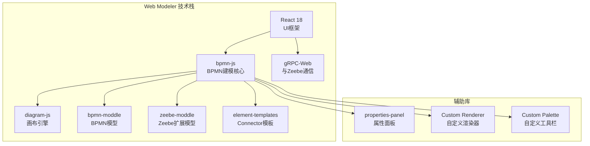
```mermaid
graph TB
    subgraph "Web Modeler 技术栈"
        direction TB
        REACT[React 18<br/>UI框架]
        BPMN[bpmn-js<br/>BPMN建模核心]
        DIAGRAM[diagram-js<br/>画布引擎]
        MODDLE[bpmn-moddle<br/>BPMN模型]
        ZEEBE_MODDLE[zeebe-moddle<br/>Zeebe扩展模型]
        ET[element-templates<br/>Connector模板]
        GRPC[gRPC-Web<br/>与Zeebe通信]
    end

    REACT --> BPMN
    BPMN --> DIAGRAM
    BPMN --> MODDLE
    BPMN --> ZEEBE_MODDLE
    BPMN --> ET
    REACT --> GRPC

    subgraph "辅助库"
        PROPS[properties-panel<br/>属性面板]
        CUSTOM[Custom Renderer<br/>自定义渲染器]
        PALETTE[Custom Palette<br/>自定义工具栏]
    end

    BPMN --> PROPS
    BPMN --> CUSTOM
    BPMN --> PALETTE
```

### 4.2 bpmn-js 架构原理

bpmn-js 是 Camunda 开源的 BPMN 2.0 建模库，其架构由三个核心层组成：

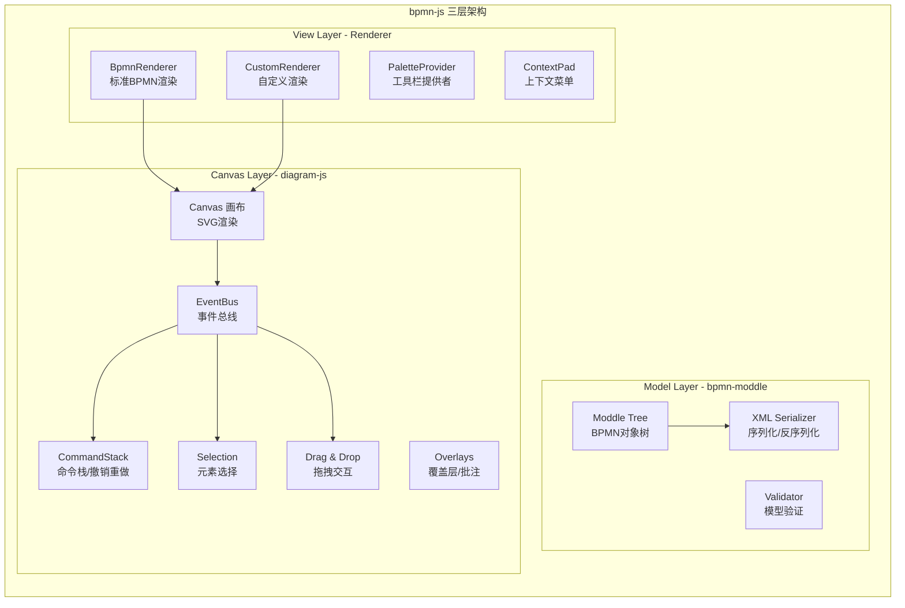
```mermaid
graph TB
    subgraph "bpmn-js 三层架构"
        direction TB
        
        subgraph "Canvas Layer - diagram-js"
            CANVAS[Canvas 画布<br/>SVG渲染]
            EVENT_BUS[EventBus<br/>事件总线]
            COMMAND[CommandStack<br/>命令栈/撤销重做]
            SELECTION[Selection<br/>元素选择]
            DRAG[Drag & Drop<br/>拖拽交互]
            OVERLAY[Overlays<br/>覆盖层/批注]
        end

        subgraph "Model Layer - bpmn-moddle"
            MODDLE_TREE[Moddle Tree<br/>BPMN对象树]
            SERIALIZER[XML Serializer<br/>序列化/反序列化]
            VALIDATOR[Validator<br/>模型验证]
        end

        subgraph "View Layer - Renderer"
            RENDERER[BpmnRenderer<br/>标准BPMN渲染]
            CUSTOM_R[CustomRenderer<br/>自定义渲染]
            PALETTE_V[PaletteProvider<br/>工具栏提供者]
            CONTEXT_PAD[ContextPad<br/>上下文菜单]
        end
    end

    CANVAS --> EVENT_BUS
    EVENT_BUS --> COMMAND
    EVENT_BUS --> SELECTION
    EVENT_BUS --> DRAG
    MODDLE_TREE --> SERIALIZER
    RENDERER --> CANVAS
    CUSTOM_R --> CANVAS
```

**diagram-js 画布引擎核心概念：**

- **Canvas**：基于 SVG 的画布，管理所有图形元素的渲染和视图变换（缩放、平移）
- **EventBus**：事件总线，所有组件间通信的中心枢纽。支持 `on`、`off`、`fire` 和 `once` 方法
- **CommandStack**：命令栈，实现撤销/重做功能。每个用户操作封装为 Command 对象
- **ElementRegistry**：元素注册表，维护所有画布元素的索引，支持按 ID、类型查找
- **ConnectionDocking**：连接线停靠计算，确保连接线正确连接到元素边缘

```javascript
// diagram-js 事件总线使用示例
eventBus.on('shape.added', function(event) {
  console.log('形状已添加:', event.element);
});

eventBus.on('connection.create', function(event) {
  console.log('连接已创建:', event.connection);
});

// 命令栈执行
commandStack.execute('shape.create', {
  shape: newShape,
  parent: parentElement,
  position: { x: 100, y: 100 }
});

// 撤销
commandStack.undo();
```

### 4.3 拖拽建模交互

bpmn-js 的拖拽建模基于 diagram-js 的 Drag & Drop 模块实现，核心交互流程如下：

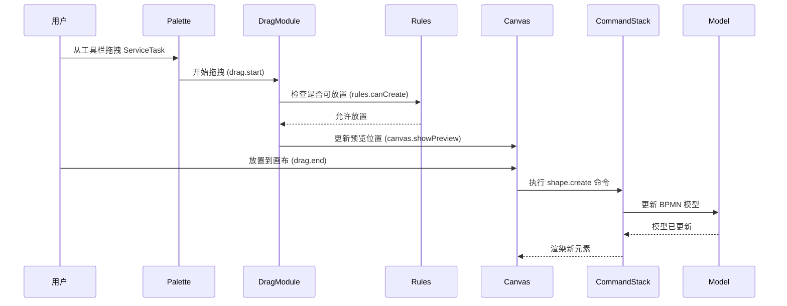
```mermaid
sequenceDiagram
    participant U as 用户
    participant P as Palette
    participant D as DragModule
    participant R as Rules
    participant C as Canvas
    participant CS as CommandStack
    participant M as Model

    U->>P: 从工具栏拖拽 ServiceTask
    P->>D: 开始拖拽 (drag.start)
    D->>R: 检查是否可放置 (rules.canCreate)
    R-->>D: 允许放置
    D->>C: 更新预览位置 (canvas.showPreview)
    U->>C: 放置到画布 (drag.end)
    C->>CS: 执行 shape.create 命令
    CS->>M: 更新 BPMN 模型
    M-->>CS: 模型已更新
    CS-->>C: 渲染新元素
```

**关键交互规则（Rules）：**

| 规则 | 说明 |
|------|------|
| `shape.create` | 只能在 Process/SubProcess/Participant 内创建 |
| `connection.create` | 源和目标必须在同一 Scope 内 |
| `shape.resize` | 只有 SubProcess/Lane/Pool 可缩放 |
| `shape.delete` | 不能删除开始事件（如果只有一个） |
| `elements.move` | 移动时保持连接关系 |

### 4.4 属性面板：React 组件实现

属性面板是 Web Modeler 中最复杂的 UI 组件之一，它需要根据选中的 BPMN 元素动态渲染不同的配置表单。

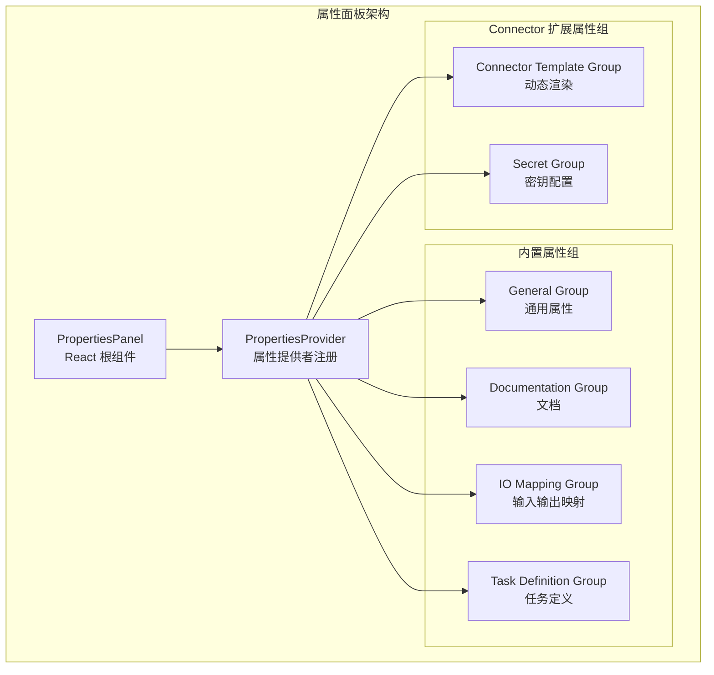
```mermaid
graph TB
    subgraph "属性面板架构"
        PP[PropertiesPanel<br/>React 根组件]
        PS[PropertiesProvider<br/>属性提供者注册]
        
        subgraph "内置属性组"
            GG[General Group<br/>通用属性]
            DG[Documentation Group<br/>文档]
            IG[IO Mapping Group<br/>输入输出映射]
            TG[Task Definition Group<br/>任务定义]
        end
        
        subgraph "Connector 扩展属性组"
            CTG[Connector Template Group<br/>动态渲染]
            SG[Secret Group<br/>密钥配置]
        end
    end

    PP --> PS
    PS --> GG
    PS --> DG
    PS --> IG
    PS --> TG
    PS --> CTG
    PS --> SG
```

**属性面板的 React 组件实现：**

```tsx
// PropertiesPanel.jsx - 属性面板核心实现
import { PropertiesPanel } from 'bpmn-js-properties-panel';
import { useEffect, useState } from 'react';

export function ModelerPropertiesPanel({ modeler, element }) {
  const [properties, setProperties] = useState(null);

  useEffect(() => {
    if (!element) return;

    // 获取 Element Template
    const template = element.businessObject.get('zeebe:templateRef');
    
    if (template) {
      // 渲染 Connector Template 驱动的动态表单
      setProperties(renderTemplateProperties(element, template));
    } else {
      // 渲染标准 BPMN 属性
      setProperties(renderStandardProperties(element));
    }
  }, [element]);

  return (
    <div className="properties-panel">
      {properties}
    </div>
  );
}

// 根据 Connector Template 渲染动态属性
function renderTemplateProperties(element, template) {
  return template.properties.map(prop => {
    switch (prop.type) {
      case 'String':
        return <StringProperty key={prop.id} property={prop} element={element} />;
      case 'Number':
        return <NumberProperty key={prop.id} property={prop} element={element} />;
      case 'Dropdown':
        return <DropdownProperty key={prop.id} property={prop} element={element} />;
      case 'Boolean':
        return <BooleanProperty key={prop.id} property={prop} element={element} />;
      case 'Text':
        return <TextProperty key={prop.id} property={prop} element={element} />;
      case 'Hidden':
        return null; // 不渲染
      default:
        return <StringProperty key={prop.id} property={prop} element={element} />;
    }
  });
}
```

### 4.5 Connector Template 在 Modeler 中的渲染：Element Templates 机制

Element Templates 是 bpmn-js 中的核心扩展机制，它允许通过 JSON 配置动态定义 BPMN 元素的外观和行为。

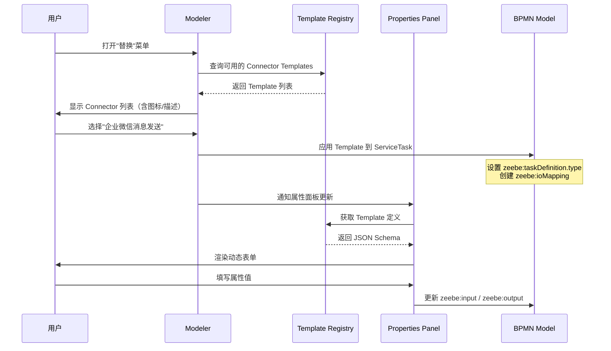
```mermaid
sequenceDiagram
    participant U as 用户
    participant M as Modeler
    participant TR as Template Registry
    participant PP as Properties Panel
    participant BPMN as BPMN Model

    U->>M: 打开"替换"菜单
    M->>TR: 查询可用的 Connector Templates
    TR-->>M: 返回 Template 列表
    M->>U: 显示 Connector 列表（含图标/描述）
    U->>M: 选择"企业微信消息发送"
    M->>BPMN: 应用 Template 到 ServiceTask
    Note over BPMN: 设置 zeebe:taskDefinition.type<br/>创建 zeebe:ioMapping
    M->>PP: 通知属性面板更新
    PP->>TR: 获取 Template 定义
    TR-->>PP: 返回 JSON Schema
    PP->>U: 渲染动态表单
    U->>PP: 填写属性值
    PP->>BPMN: 更新 zeebe:input / zeebe:output
```

**Element Template 在 BPMN XML 中的存储：**

```xml
<bpmn:serviceTask id="Task_1" name="发送企业微信通知">
  <!-- Template 引用 -->
  <bpmn:extensionElements>
    <zeebe:taskDefinition 
      type="io.openapp:wecom-message:1" 
      retries="3" />
    <zeebe:ioMapping>
      <zeebe:input source="=SECRETS.wecom_webhook_url" target="webhookUrl" />
      <zeebe:input source="='markdown'" target="messageType" />
      <zeebe:input source="=notificationContent" target="content" />
      <zeebe:output source="=statusCode" target="wecomStatusCode" />
    </zeebe:ioMapping>
    <!-- Template 标识（用于 Modeler 关联） -->
    <camunda:properties>
      <camunda:property name="elementTemplateId" 
                        value="io.openapp.connectors.wecom-message" />
      <camunda:property name="elementTemplateVersion" value="1" />
    </camunda:properties>
  </bpmn:extensionElements>
</bpmn:serviceTask>
```

### 4.6 前端与 Zeebe Gateway 通信：gRPC-Web

Web Modeler 需要与 Zeebe Gateway 通信来部署流程、创建实例等。由于浏览器不支持原生 gRPC，Camunda 采用了 gRPC-Web 方案。

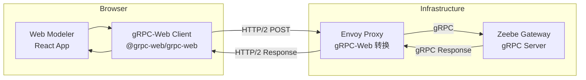
```mermaid
graph LR
    subgraph "Browser"
        WM[Web Modeler<br/>React App]
        GW_JS[gRPC-Web Client<br/>@grpc-web/grpc-web]
    end

    subgraph "Infrastructure"
        PROXY[Envoy Proxy<br/>gRPC-Web 转换]
        ZGW[Zeebe Gateway<br/>gRPC Server]
    end

    WM --> GW_JS
    GW_JS -->|HTTP/2 POST| PROXY
    PROXY -->|gRPC| ZGW
    ZGW -->|gRPC Response| PROXY
    PROXY -->|HTTP/2 Response| GW_JS
    GW_JS --> WM
```

**gRPC-Web 通信配置：**

```typescript
// Zeebe gRPC-Web 客户端配置
import { ZeebeGrpcClient } from '@camunda8/sdk';

const zeebeClient = new ZeebeGrpcClient({
  // Envoy Proxy 地址（负责 gRPC-Web 到 gRPC 的转换）
  gatewayAddress: 'https://zeebe.example.com/grpc',
  
  // OAuth 配置（Camunda 8 SaaS 模式）
  camundaCloud: {
    clientId: process.env.ZEEBE_CLIENT_ID,
    clientSecret: process.env.ZEEBE_CLIENT_SECRET,
    clusterId: process.env.ZEEBE_CLUSTER_ID,
  },
  
  // 连接配置
  retry: true,
  maxRetries: 5,
  maxRetryTimeout: 30000,
});

// 部署流程
async function deployProcess(bpmnXml: string) {
  const response = await zeebeClient.deployProcess({
    definition: Buffer.from(bpmnXml).toString('base64'),
    name: 'order-approval.bpmn',
  });
  return response;
}
```

---

## 五、Zeebe 执行引擎

### 5.1 StreamProcessor + Exporter 架构

Zeebe Broker 的核心是 StreamProcessor（流处理器），它从事件日志中顺序读取事件并处理。这一架构借鉴了 Kafka Streams 和 Event Sourcing 的设计思想。

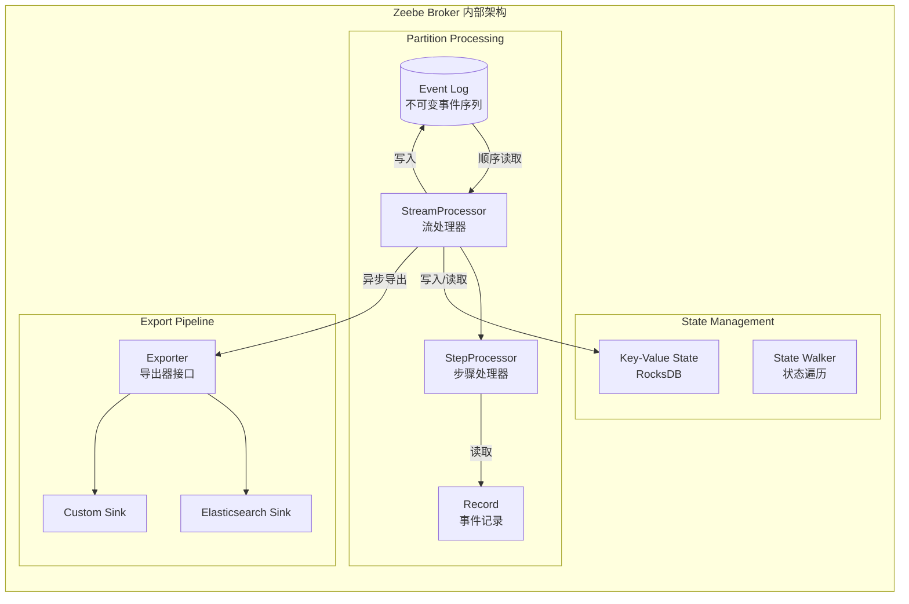
```mermaid
graph TB
    subgraph "Zeebe Broker 内部架构"
        direction TB
        
        subgraph "Partition Processing"
            EL[(Event Log<br/>不可变事件序列)]
            SP[StreamProcessor<br/>流处理器]
            SS[StepProcessor<br/>步骤处理器]
            REC[Record<br/>事件记录]
        end

        subgraph "State Management"
            KS[Key-Value State<br/>RocksDB]
            SW[State Walker<br/>状态遍历]
        end

        subgraph "Export Pipeline"
            EXP[Exporter<br/>导出器接口]
            ES_SINK[Elasticsearch Sink]
            CUSTOM_SINK[Custom Sink]
        end
    end

    EL -->|顺序读取| SP
    SP --> SS
    SS -->|读取| REC
    SP -->|写入/读取| KS
    SP -->|写入| EL
    SP -->|异步导出| EXP
    EXP --> ES_SINK
    EXP --> CUSTOM_SINK
```

**StreamProcessor 核心流程：**

1. **事件写入**：客户端请求到达 Broker 后，首先将事件写入 Event Log（顺序写入，极高性能）
2. **流处理**：StreamProcessor 从 Event Log 中按序读取事件，执行状态转换逻辑
3. **状态更新**：处理完成后更新 Key-Value State（基于 RocksDB），例如更新流程实例的当前步骤
4. **事件导出**：通过 Exporter 接口将事件异步导出到外部系统（Elasticsearch 等）

**Record（记录）结构：**

每条 Record 是 Event Log 中的基本单元，包含以下字段：

| 字段 | 类型 | 说明 |
|------|------|------|
| `key` | long | 记录唯一标识 |
| `sourceRecordPosition` | long | 源记录位置（用于追踪因果关系） |
| `value` | Object | 记录值（不同类型的 Record 有不同的 Value 结构） |
| `recordType` | Enum | COMMAND（命令）或 EVENT（事件） |
| `valueType` | Enum | JOB / PROCESS / PROCESS_INSTANCE / MESSAGE 等 |
| `intent` | Enum | 记录意图，如 CREATED / ACTIVATED / COMPLETED / FAILED |
| `timestamp` | long | 时间戳 |
| `partitionId` | int | 分区 ID |

### 5.2 Job Worker 模型

Job Worker 是 Zeebe 执行模型的核心，它采用"拉取"模式而非"推送"模式，这是与 Camunda 7 的关键区别。

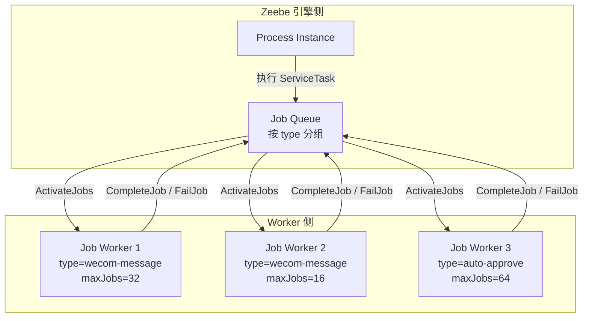
```mermaid
graph TB
    subgraph "Zeebe 引擎侧"
        PI2[Process Instance] -->|执行 ServiceTask| JQ[Job Queue<br/>按 type 分组]
    end

    subgraph "Worker 侧"
        JW1[Job Worker 1<br/>type=wecom-message<br/>maxJobs=32]
        JW2[Job Worker 2<br/>type=wecom-message<br/>maxJobs=16]
        JW3[Job Worker 3<br/>type=auto-approve<br/>maxJobs=64]
    end

    JQ -->|ActivateJobs| JW1
    JQ -->|ActivateJobs| JW2
    JQ -->|ActivateJobs| JW3

    JW1 -->|CompleteJob / FailJob| JQ
    JW2 -->|CompleteJob / FailJob| JQ
    JW3 -->|CompleteJob / FailJob| JQ
```

**ActivateJobs 请求参数：**

```protobuf
message ActivateJobsRequest {
  string type = 1;           // Job 类型
  string worker = 2;         // Worker 标识
  int32 timeout = 3;         // Job 锁定超时（毫秒）
  int32 maxJobsToActivate = 4; // 一次最多激活的 Job 数
  repeated string fetchVariable = 5; // 只获取指定变量（优化网络传输）
  Duration requestTimeout = 6; // 长轮询超时
}
```

**Job Worker 的最佳实践：**

- **maxJobsToActivate**：根据任务处理时间和内存限制设置，通常为 32-64
- **timeout**：必须大于任务的最长执行时间，否则 Job 会被重新激活导致重复执行
- **fetchVariable**：只获取必要的变量，减少网络传输和内存占用
- **幂等性**：Job Worker 必须实现幂等性，因为超时后的 Job 可能被重复激活
- **背压控制**：Worker 内部应限制并发执行的 Job 数量，防止过载

### 5.3 流程实例生命周期

```mermaid
stateDiagram-v2
    [*] --> Created: CreateProcessInstance
    Created --> Activated: 流程开始执行
    
    state Activated {
        [*] --> ElementReady: 进入元素
        ElementReady --> ElementExecuting: 元素开始执行
        ElementExecuting --> ElementCompleted: 元素执行完成
        ElementCompleted --> ElementReady: 进入下一个元素
        ElementExecuting --> IncidentRaised: 执行异常
        IncidentRaised --> ElementExecuting: Incident 解决
    }
    
    Activated --> Completed: 到达 EndEvent
    Activated --> Terminated: 取消流程
    
    Completed --> [*]
    Terminated --> [*]
```

**Incident（事件/事故）机制：**

Incident 是 Zeebe 中处理异常的核心机制。当 Job 执行失败且重试次数耗尽、消息关联失败、条件表达式求值错误等情况发生时，Zeebe 会创建 Incident。

- Incident 创建后，流程实例在该节点**暂停**，不会继续执行
- Incident 必须通过外部操作（API 调用或 Operate UI）手动解决
- 解决 Incident 后，流程从暂停点继续执行
- Incident 类型包括：`JOB_NO_RETRIES`、`IO_MAPPING_ERROR`、`CONDITION_ERROR`、`MESSAGE_NOT_CORRELATED` 等

### 5.4 消息/信号订阅

Zeebe 支持两种流程间通信机制：消息（Message）和信号（Signal）。

```mermaid
graph TB
    subgraph "消息机制 - 点对点"
        MP[消息发布者<br/>PublishMessage]
        MS1[消息开始事件<br/>启动新流程实例]
        MS2[消息中间捕获事件<br/>等待并继续]
        
        MP -->|correlationKey 匹配| MS1
        MP -->|correlationKey 匹配| MS2
    end

    subgraph "信号机制 - 广播"
        SP2[信号发布者<br/>BroadcastSignal]
        SS1[信号开始事件]
        SS2[信号中间捕获事件]
        
        SP2 -->|广播到所有订阅者| SS1
        SP2 -->|广播到所有订阅者| SS2
    end
```

**消息 vs 信号对比：**

| 特性 | 消息（Message） | 信号（Signal） |
|------|----------------|----------------|
| 通信模式 | 点对点 | 广播 |
| 关联 | 通过 correlationKey 关联到特定流程实例 | 无关联，所有订阅者都收到 |
| 持久化 | 消息在 TTL 内等待关联 | 信号是即时的，不持久化 |
| 使用场景 | 订单确认、审批回调 | 全局通知、配置变更 |
| TTL | 支持消息 TTL（默认不超时） | 无 TTL |

**消息订阅的关键参数：**

```protobuf
message PublishMessageRequest {
  string messageName = 1;           // 消息名称（对应 BPMN messageRef）
  string correlationKey = 2;        // 关联键（必须与订阅的 correlationKey 匹配）
  int64 timeToLive = 3;            // 消息存活时间（毫秒）
  string messageId = 4;            // 消息唯一ID（用于幂等去重）
  map<string, string> variables = 5; // 消息携带的变量
}
```

### 5.5 错误处理与补偿（BPMN Error / Compensation Event）

Zeebe 支持丰富的 BPMN 错误处理和补偿机制：

```mermaid
graph TB
    subgraph "错误处理模式"
        ST1[ServiceTask] -->|BPMN Error| BEC[Boundary Error Event]
        ST1 -->|Job Failed| INC[Incident]
        BEC --> HANDLER1[错误处理流程]
    end

    subgraph "补偿模式"
        ST2[ServiceTask A] -->|完成后| ST3[ServiceTask B]
        ST3 -->|补偿请求| COMP[Compensation Handler]
        COMP -->|撤销 A| ST2
    end

    subgraph "重试模式"
        ST4[ServiceTask] -->|retryCount > 0| RETRY[自动重试<br/>带退避]
        ST4 -->|retryCount == 0| INC2[Incident]
        RETRY --> ST4
    end
```

**BPMN Error vs Incident vs Job Failure 的区别：**

| 场景 | 处理方式 | 说明 |
|------|----------|------|
| **可预期的业务错误** | 抛出 BPMN Error | 如"余额不足"，通过 Boundary Error Event 处理 |
| **不可预期的技术错误** | Job Failed + 重试 | 如"网络超时"，自动重试 |
| **重试耗尽** | 创建 Incident | 需要人工干预 |
| **流程需要撤销** | Compensation Event | 触发补偿操作，回滚已执行的步骤 |

```java
// Job Worker 中抛出 BPMN Error
@Override
public Object execute(OutboundConnectorContext context) {
    try {
        // 业务逻辑
    } catch (InsufficientBalanceException e) {
        // 抛出 BPMN Error（可被 Boundary Error Event 捕获）
        throw new BpmnError("INSUFFICIENT_BALANCE", "账户余额不足: " + e.getMessage());
    } catch (Exception e) {
        // 抛出 Job 失败（触发重试或 Incident）
        throw new ConnectorException("PAYMENT_FAILED", e.getMessage(), e);
    }
}
```

### 5.6 定时器调度

Zeebe 支持三种定时器定义方式，基于 ISO-8601 标准：

| 定时器类型 | 格式 | 示例 | 说明 |
|-----------|------|------|------|
| **时间点** | ISO-8601 Date-Time | `2026-06-01T10:00:00Z` | 在指定时间触发 |
| **持续时间** | ISO-8601 Duration | `PT30M` | 在 30 分钟后触发 |
| **循环** | ISO-8601 Recurring | `R3/PT10M` | 每 10 分钟触发，共 3 次 |

定时器的实现由 Zeebe Broker 内部的 Timer Schedule 处理，不依赖外部调度器。每个 Partition 维护独立的定时器队列，使用时间轮（Timing Wheel）算法高效调度。

---

## 六、数据存储设计

### 6.1 Event Log：顺序写入的不可变事件日志

Zeebe 的核心存储是 Event Log（事件日志），这是一个不可变的、顺序写入的日志结构。所有状态变更都以事件的形式追加写入，这是 Event Sourcing 模式的核心实现。

```mermaid
graph TB
    subgraph "Event Log 结构"
        direction LR
        E1[Position 1<br/>PROCESS:CREATED]
        E2[Position 2<br/>PROCESS_INSTANCE:CREATED]
        E3[Position 3<br/>JOB:CREATED]
        E4[Position 4<br/>JOB:ACTIVATED]
        E5[Position 5<br/>JOB:COMPLETED]
        E6[Position 6<br/>PROCESS_INSTANCE:COMPLETED]
    end

    subgraph "写入特性"
        W1[顺序追加写入<br/>无随机IO]
        W2[不可变<br/>只追加不修改]
        W3[分段存储<br/>按大小/时间切割]
    end

    E1 --> E2 --> E3 --> E4 --> E5 --> E6
```

**Event Log 的关键设计决策：**

1. **顺序写入**：所有操作都是追加写入，没有随机 IO，极大地提高了写入性能。在 SSD 上可达 100MB/s+ 的写入吞吐
2. **不可变**：一旦写入不可修改，保证了数据的完整性和可审计性
3. **分段（Segment）**：Log 按大小（默认 512MB）或时间切割为多个 Segment 文件，便于清理和归档
4. **索引**：每个 Segment 附带一个索引文件，支持按 Position 快速查找
5. **压缩**：支持 Log Compaction，清理已完成的流程实例的事件，释放磁盘空间

**Event Log 与 State 的关系：**

```mermaid
graph LR
    EL[(Event Log<br/>不可变)] -->|replay| KS[(Key-Value State<br/>RocksDB)]
    EL -->|export| ES[(Elasticsearch<br/>查询索引)]
    
    subgraph "读取路径"
        APP1[Operate<br/>流程监控] --> ES
        APP2[Tasklist<br/>人工任务] --> ES
    end
    
    subgraph "写入路径"
        CLIENT[Client] -->|gRPC| BROKER[Broker]
        BROKER -->|append| EL
    end
```

### 6.2 Partition 分片：每个 Partition 独立 Raft 组

每个 Partition 的数据存储完全独立，包括独立的 Event Log、独立的 Raft 组和独立的 State 存储。

```mermaid
graph TB
    subgraph "Broker 1"
        direction TB
        P1_LOG[(Partition 1<br/>Event Log)]
        P1_STATE[(Partition 1<br/>RocksDB State)]
        P1_RAFT[Partition 1<br/>Raft Module]
        P2_LOG[(Partition 2<br/>Event Log)]
        P2_STATE[(Partition 2<br/>RocksDB State)]
        P2_RAFT[Partition 2<br/>Raft Module]
    end

    P1_RAFT --> P1_LOG
    P1_RAFT --> P1_STATE
    P2_RAFT --> P2_LOG
    P2_RAFT --> P2_STATE
```

**每个 Partition 的数据目录结构：**

```
data/
  partition-1/
    log/                    # Event Log
      segment-1.log        # 日志段文件
      segment-1.idx        # 索引文件
      segment-2.log
      segment-2.idx
    state/                  # Key-Value State (RocksDB)
      000001.sst
      000002.sst
      MANIFEST
      CURRENT
    raft/                   # Raft 元数据
      snapshot-1.meta
      term-vote.bin
  partition-2/
    log/
    state/
    raft/
```

### 6.3 Elasticsearch / OpenSearch 索引设计

Zeebe 通过 Exporter 将事件数据导出到 Elasticsearch/OpenSearch，用于 Operate 和 Tasklist 的查询。索引设计是性能的关键。

```mermaid
graph TB
    subgraph "Elasticsearch 索引"
        direction TB
        PI_IDX[operate-process-instance<br/>流程实例索引]
        FI_IDX[operate-flow-node-instance<br/>节点实例索引]
        VAR_IDX[operate-variable<br/>变量索引]
        INC_IDX[operate-incident<br/>Incident 索引]
        PD_IDX[operate-process<br/>流程定义索引]
        JOB_IDX[operate-job<br/>Job 索引]
        MSG_IDX[operate-message<br/>消息索引]
    end

    subgraph "索引策略"
        ILA[ILM - Index Lifecycle Management<br/>索引生命周期管理]
        ROLLOVER[Rollover<br/>滚动索引]
        REFRESH[Refresh Interval<br/>刷新间隔: 1s]
    end

    PI_IDX --> ILA
    FI_IDX --> ILA
    VAR_IDX --> ROLLOVER
```

**核心索引 Mapping（简化）：**

```json
{
  "operate-process-instance-1.0.0": {
    "mappings": {
      "properties": {
        "key": { "type": "long" },
        "processDefinitionKey": { "type": "long" },
        "bpmnProcessId": { "type": "keyword" },
        "version": { "type": "integer" },
        "state": { "type": "keyword" },
        "startDate": { "type": "date" },
        "endDate": { "type": "date" },
        "parentProcessInstanceKey": { "type": "long" },
        "treePath": { "type": "keyword" },
        "tenantId": { "type": "keyword" }
      }
    },
    "settings": {
      "number_of_shards": 3,
      "number_of_replicas": 1,
      "refresh_interval": "1s",
      "index.lifecycle.name": "operate-ilm-policy",
      "index.lifecycle.rollover_alias": "operate-process-instance"
    }
  }
}
```

**treePath 字段的设计**：

treePath 是 Zeebe Operate 中一个非常巧妙的设计，它将流程实例的层级关系编码为一个字符串路径，如 `PI_123/PI_456/FNI_789`，用于高效查询流程实例树。

### 6.4 流程定义存储

流程定义的存储分为两部分：

1. **Event Log**：流程部署事件（包含 BPMN XML）存储在 Event Log 中
2. **RocksDB State**：当前有效的流程定义元数据存储在 State 中
3. **Elasticsearch**：流程定义的查询索引（不含 XML，XML 按需从 Log 重放）

```mermaid
graph LR
    DEPLOY[DeployProcess] -->|写入| EL[(Event Log)]
    EL -->|replay| STATE[(RocksDB<br/>processDefKey -> metadata)]
    EL -->|export| ES[(Elasticsearch<br/>查询索引)]
    
    subgraph "RocksDB State Key"
        K1["processDefKey -> {<br/>bpmnProcessId,<br/>version,<br/>resourceName,<br/>checksum<br/>}"]
    end
    
    STATE --> K1
```

### 6.5 流程实例状态

流程实例的运行时状态存储在 RocksDB 中，以 Key-Value 形式组织：

```mermaid
graph TB
    subgraph "流程实例状态 (RocksDB)"
        direction TB
        
        subgraph "ElementInstance (元素实例)"
            EI_KEY[Key: elementInstanceKey]
            EI_VAL[Value: {<br/>elementId,<br/>flowScopeKey,<br/>tokenCount,<br/>state<br/>}]
        end
        
        subgraph "Variable (变量)"
            VAR_KEY[Key: scopeKey + variableName]
            VAR_VAL[Value: {<br/>name,<br/>value (JSON),<br/>scopeKey<br/>}]
        end
        
        subgraph "Job (任务)"
            JOB_KEY[Key: jobKey]
            JOB_VAL[Value: {<br/>type,<br/>processInstanceKey,<br/>retries,<br/>state,<br/>deadline<br/>}]
        end
        
        subgraph "Message Subscription (消息订阅)"
            MSG_KEY[Key: processInstanceKey + messageName]
            MSG_VAL[Value: {<br/>messageName,<br/>correlationKey,<br/>state,<br/>elementInstanceKey<br/>}]
        end
        
        subgraph "Timer (定时器)"
            TIMER_KEY[Key: elementInstanceKey + timerId]
            TIMER_VAL[Value: {<br/>dueDate,<br/>repetitions,<br/>state<br/>}]
        end
    end
```

**状态管理的核心原则：**

- **单写者**：每个 Partition 的 State 只由 StreamProcessor 写入，无并发问题
- **快照**：定期创建 State 快照，用于 Raft 安装快照和故障恢复
- **增量更新**：State 只存储最新状态，历史状态通过 Event Log 重放获得

---

## 七、API 设计

### 7.1 gRPC API（Zeebe Gateway）：Protobuf 定义

Zeebe Gateway 是所有客户端的入口，通过 gRPC 协议提供服务。完整的 API 定义在 [gateway.proto](https://github.com/camunda/zeebe/blob/main/gateway-protocol/src/main/proto/gateway.proto) 中。

```protobuf
syntax = "proto3";

package gateway_protocol;

service Gateway {
  // === 流程定义 ===
  // 部署流程（支持多个资源）
  rpc DeployProcess(DeployProcessRequest) returns (DeployProcessResponse);
  // 部署资源（通用，支持 BPMN + DMN + Form）
  rpc DeployResource(DeployResourceRequest) returns (DeployResourceResponse);

  // === 流程实例 ===
  // 创建流程实例（同步/异步）
  rpc CreateProcessInstance(CreateProcessInstanceRequest) 
      returns (CreateProcessInstanceResponse);
  // 创建流程实例并等待结果
  rpc CreateProcessInstanceWithResult(CreateProcessInstanceWithResultRequest) 
      returns (CreateProcessInstanceWithResultResponse);
  // 取消流程实例
  rpc CancelProcessInstance(CancelProcessInstanceRequest) 
      returns (CancelProcessInstanceResponse);
  // 设置流程变量
  rpc SetVariables(SetVariablesRequest) returns (SetVariablesResponse);

  // === Job 管理 ===
  // 激活 Job（长轮询，服务端流）
  rpc ActivateJobs(ActivateJobsRequest) returns (stream ActivatedJob);
  // 完成 Job
  rpc CompleteJob(CompleteJobRequest) returns (CompleteJobResponse);
  // 失败 Job
  rpc FailJob(FailJobRequest) returns (FailJobResponse);
  // 抛出 BPMN Error
  rpc ThrowError(ThrowErrorRequest) returns (ThrowErrorResponse);
  // 更新 Job 重试次数
  rpc UpdateJobRetries(UpdateJobRetriesRequest) returns (UpdateJobRetriesResponse);

  // === 消息 ===
  // 发布消息
  rpc PublishMessage(PublishMessageRequest) returns (PublishMessageResponse);
  // 关联消息（手动）

  // === Incident ===
  // 解决 Incident
  rpc ResolveIncident(ResolveIncidentRequest) returns (ResolveIncidentResponse);

  // === 流程实例迁移 ===
  rpc MigrateProcessInstance(MigrateProcessInstanceRequest) 
      returns (MigrateProcessInstanceResponse);

  // === 信号 ===
  rpc BroadcastSignal(BroadcastSignalRequest) returns (BroadcastSignalResponse);
  
  // === 集群拓扑 ===
  rpc Topology(TopologyRequest) returns (TopologyResponse);
}
```

**关键 API 的请求/响应示例：**

```protobuf
// 创建流程实例
message CreateProcessInstanceRequest {
  int64 processDefinitionKey = 1;    // 流程定义 Key
  string bpmnProcessId = 2;          // 或使用 bpmnProcessId + version
  int32 version = 3;
  repeated string variables = 4;     // 输入变量 (JSON)
  string tenantId = 5;               // 多租户标识
  string operationReference = 6;     // 操作引用（用于追踪）
  bool startBeforeExecuteUserTask = 7; // 在用户任务执行前启动
  bool fetchVariables = 8;           // 是否获取变量
}

message CreateProcessInstanceResponse {
  int64 processDefinitionKey = 1;
  string bpmnProcessId = 2;
  int32 version = 3;
  int64 processInstanceKey = 4;      // 流程实例 Key
  string tenantId = 5;
}
```

### 7.2 Operate REST API

Operate 提供了 REST API 用于查询流程实例数据，主要用于监控和排查场景。

**Operate API 基础路径**：`/v1`

**核心 API 端点：**

| 方法 | 路径 | 说明 |
|------|------|------|
| `GET` | `/v1/process-instances/{key}` | 获取流程实例详情 |
| `POST` | `/v1/process-instances/search` | 搜索流程实例 |
| `POST` | `/v1/process-instances/{key}/delete` | 删除流程实例 |
| `GET` | `/v1/incidents/{key}` | 获取 Incident 详情 |
| `POST` | `/v1/incidents/search` | 搜索 Incident |
| `POST` | `/v1/incidents/{key}/resolve` | 解决 Incident |
| `GET` | `/v1/flownode-instances/{key}` | 获取节点实例详情 |
| `POST` | `/v1/flownode-instances/search` | 搜索节点实例 |
| `GET` | `/v1/variables/{key}` | 获取变量详情 |
| `POST` | `/v1/variables/search` | 搜索变量 |
| `GET` | `/v1/processes/{key}` | 获取流程定义 |
| `POST` | `/v1/processes/search` | 搜索流程定义 |
| `GET` | `/v1/processes/{key}/xml` | 获取 BPMN XML |

**搜索请求示例：**

```json
POST /v1/process-instances/search
{
  "filter": {
    "state": "ACTIVE",
    "bpmnProcessId": "order-approval",
    "startDateAfter": "2026-05-01T00:00:00Z"
  },
  "sort": [
    {
      "field": "startDate",
      "order": "DESC"
    }
  ],
  "pagination": {
    "from": 0,
    "limit": 20
  }
}
```

### 7.3 Tasklist REST API

Tasklist 提供了人工任务管理相关的 REST API。

**核心 API 端点：**

| 方法 | 路径 | 说明 |
|------|------|------|
| `POST` | `/v1/tasks/search` | 搜索任务 |
| `GET` | `/v1/tasks/{id}` | 获取任务详情 |
| `POST` | `/v1/tasks/{id}/assign` | 分配任务给用户 |
| `POST` | `/v1/tasks/{id}/unassign` | 取消任务分配 |
| `POST` | `/v1/tasks/{id}/complete` | 完成任务 |
| `POST` | `/v1/tasks/{id}/variables/search` | 搜索任务变量 |
| `POST` | `/v1/variables/search` | 搜索变量 |
| `PATCH` | `/v1/variables/{id}` | 更新变量 |

**任务搜索示例：**

```json
POST /v1/tasks/search
{
  "state": "CREATED",
  "assignee": "john.doe",
  "bpmnProcessId": "order-approval",
  "pagination": {
    "from": 0,
    "limit": 50
  }
}
```

### 7.4 关键 API 端点汇总

```mermaid
graph TB
    subgraph "Zeebe Gateway - gRPC"
        Z1[DeployProcess / DeployResource]
        Z2[CreateProcessInstance]
        Z3[ActivateJobs / CompleteJob / FailJob]
        Z4[PublishMessage / BroadcastSignal]
        Z5[SetVariables / ResolveIncident]
        Z6[Topology]
    end

    subgraph "Operate - REST"
        O1[GET/POST /process-instances]
        O2[GET/POST /incidents]
        O3[GET/POST /flownode-instances]
        O4[GET/POST /variables]
        O5[GET/POST /processes]
    end

    subgraph "Tasklist - REST"
        T1[POST /tasks/search]
        T2[GET /tasks/id]
        T3[POST /tasks/id/assign]
        T4[POST /tasks/id/complete]
    end

    Z1 & Z2 & Z3 --> |写入路径| ENGINE[Zeebe Engine]
    O1 & O2 & O3 --> |读取路径| ES_READ[Elasticsearch]
    T1 & T2 & T3 --> |读取路径| ES_READ
```

**API 设计的关键决策：**

1. **读写分离**：写入通过 Zeebe Gateway（gRPC），读取通过 Operate/Tasklist（REST + ES）
2. **最终一致性**：写入后需要等待 ES 索引刷新（约 1s），读取可能略有延迟
3. **长轮询**：ActivateJobs 使用服务端流，避免频繁轮询
4. **幂等性**：PublishMessage 支持 messageId 去重

---

## 八、可借鉴的设计模式

### 8.1 Connector Template JSON Schema → open-app 连接器定义

Connector Template JSON Schema 是 Camunda 8 中最值得借鉴的设计模式。它实现了"声明式连接器定义"——通过一个 JSON 文件同时驱动 UI 渲染和运行时绑定。

**借鉴要点：**

```mermaid
graph TB
    subgraph "Camunda 8 Connector Template"
        CT_JSON[Template JSON<br/>元数据 + 属性定义]
        CT_UI[Web Modeler<br/>动态属性面板]
        CT_RUNTIME[Connector Runtime<br/>变量绑定]
        CT_JSON --> CT_UI
        CT_JSON --> CT_RUNTIME
    end

    subgraph "open-app 连接器定义（借鉴）"
        OA_JSON[Connector Schema JSON<br/>元数据 + 属性定义]
        OA_UI[open-app 建模器<br/>动态属性面板]
        OA_RUNTIME[open-app 执行引擎<br/>变量绑定]
        OA_JSON --> OA_UI
        OA_JSON --> OA_RUNTIME
    end

    CT_JSON -.->|借鉴| OA_JSON
    CT_UI -.->|借鉴| OA_UI
    CT_RUNTIME -.->|借鉴| OA_RUNTIME
```

**open-app 连接器定义 Schema 建议：**

```json
{
  "$schema": "https://openapp.io/schemas/connector-definition/v1",
  "id": "io.openapp.connectors.wecom-message",
  "name": "企业微信消息发送",
  "version": 1,
  "description": "通过企业微信机器人 Webhook 发送消息",
  "icon": "wecom.svg",
  "category": "messaging",
  "type": "outbound",
  "capabilities": ["retry", "timeout", "secret-ref"],
  "properties": {
    "inputs": [
      {
        "id": "webhookUrl",
        "name": "Webhook 地址",
        "type": "string",
        "required": true,
        "secretRef": true,
        "group": "authentication"
      },
      {
        "id": "messageType",
        "name": "消息类型",
        "type": "enum",
        "enumValues": [
          { "label": "文本消息", "value": "text" },
          { "label": "Markdown 消息", "value": "markdown" }
        ],
        "default": "text",
        "group": "message"
      },
      {
        "id": "content",
        "name": "消息内容",
        "type": "text",
        "required": true,
        "expressionEnabled": true,
        "group": "message"
      }
    ],
    "outputs": [
      {
        "id": "statusCode",
        "name": "HTTP 状态码",
        "type": "number",
        "path": "$.statusCode"
      },
      {
        "id": "responseBody",
        "name": "响应内容",
        "type": "object",
        "path": "$.body"
      }
    ]
  },
  "runtime": {
    "executor": "io.openapp.connectors.wecom.WeComMessageExecutor",
    "timeout": "30s",
    "retryPolicy": {
      "maxRetries": 3,
      "backoff": "exponential",
      "initialInterval": "5s"
    }
  }
}
```

**与 Camunda Template 的差异化改进：**

| 维度 | Camunda 8 | open-app 建议 |
|------|-----------|---------------|
| Schema 位置 | 与 bpmn-moddle 耦合 | 独立 Schema，与流程引擎解耦 |
| 属性绑定 | zeebe:input / zeebe:output | 直接映射到输入输出，无需 BPMN 扩展 |
| 表达式语言 | FEEL | 支持 FEEL 或简化版表达式（如 `${variable}`） |
| 密钥引用 | SECRETS.xxx | 统一密钥管理 API，支持多种后端 |
| 运行时配置 | 分散在多个 binding 中 | 集中在 `runtime` 节点 |
| 版本管理 | version 字段 | 语义化版本 + 兼容性声明 |

### 8.2 Job Worker 模式 → open-app 执行引擎

Zeebe 的 Job Worker 模式是其高性能的关键——引擎不直接调用外部系统，而是创建 Job，由 Worker 主动拉取执行。

**借鉴要点：**

```mermaid
graph TB
    subgraph "Zeebe Job Worker 模式"
        ZE[Zeebe Engine<br/>创建 Job]
        ZJ[Job Queue<br/>按 type 分组]
        ZW[Job Worker<br/>长轮询拉取]
        
        ZE -->|创建 Job| ZJ
        ZW -->|ActivateJobs| ZJ
        ZW -->|CompleteJob| ZJ
    end

    subgraph "open-app 执行引擎（借鉴）"
        OA_E[open-app 流程引擎<br/>创建 Task]
        OA_Q[Task Queue<br/>按 connectorType 分组]
        OA_W[Connector Executor<br/>长轮询拉取]
        
        OA_E -->|创建 Task| OA_Q
        OA_W -->|ActivateTasks| OA_Q
        OA_W -->|CompleteTask| OA_Q
    end

    ZE -.->|借鉴| OA_E
    ZJ -.->|借鉴| OA_Q
    ZW -.->|借鉴| OA_W
```

**Job Worker 模式的优势：**

1. **解耦**：引擎与执行器完全解耦，可以独立部署和扩展
2. **弹性**：Worker 可以动态增减，引擎自动负载均衡
3. **可靠性**：Job 超时后自动重新激活，不丢失任务
4. **可观测**：Job 状态（ACTIVATABLE -> ACTIVATED -> COMPLETED/FAILED）清晰可追踪
5. **背压**：Worker 通过控制 `maxJobsToActivate` 实现自然背压

**open-app 执行引擎建议：**

```typescript
// Connector Executor 接口设计
interface ConnectorExecutor {
  // 连接器类型（对应 Connector Definition 的 id）
  connectorType: string;
  
  // 激活任务
  activateTasks(request: ActivateTasksRequest): AsyncIterable<ActivatedTask>;
  
  // 执行任务
  execute(task: ActivatedTask, context: ExecutionContext): Promise<TaskResult>;
  
  // 完成任务
  completeTask(taskKey: string, result: TaskResult): Promise<void>;
  
  // 失败任务
  failTask(taskKey: string, error: TaskError): Promise<void>;
}

// 长轮询激活请求
interface ActivateTasksRequest {
  connectorType: string;
  maxTasks: number;
  timeout: number;       // 锁定超时（毫秒）
  requestTimeout: number; // 长轮询超时（毫秒）
  fetchVariables?: string[]; // 只获取指定变量
}
```

### 8.3 BPMN 标准适用性评估（BPMN vs 自定义 DAG）

Camunda 8 选择了 BPMN 2.0 标准，这对 open-app 是一个重要的技术选型参考。

```mermaid
graph LR
    subgraph "BPMN 2.0"
        B1[优势: 标准化/可视化/工具生态丰富]
        B2[劣势: 学习曲线陡峭/扩展困难/复杂度高]
    end

    subgraph "自定义 DAG"
        D1[优势: 简单直观/易扩展/轻量级]
        D2[劣势: 无标准/工具匮乏/可移植性差]
    end

    subgraph "混合方案"
        H1[核心: 简化 DAG 引擎]
        H2[前端: 类 BPMN 可视化]
        H3[兼容: 支持 BPMN 子集导入]
    end
```

**BPMN 适用性评估表：**

| 评估维度 | BPMN 2.0 | 自定义 DAG | 推荐 |
|----------|----------|-----------|------|
| **学习曲线** | 陡峭（需理解 100+ 元素） | 平缓（基础 5-10 个概念） | DAG |
| **可视化建模** | 原生支持，工具成熟 | 需自建渲染器 | BPMN |
| **人工任务** | 原生支持 UserTask | 需自行实现 | BPMN |
| **错误处理** | 丰富的 Error/Compensation | 需自行设计 | BPMN |
| **子流程/调用** | CallActivity/SubProcess | 嵌套 DAG | BPMN |
| **扩展性** | 需扩展命名空间，复杂 | 直接添加属性 | DAG |
| **连接器集成** | 通过 Element Template | 直接绑定到节点 | DAG |
| **执行性能** | 复杂的状态机开销大 | 轻量级，高性能 | DAG |
| **社区/标准** | ISO 标准，社区大 | 无标准 | BPMN |

**open-app 的建议方案：采用简化 DAG + 类 BPMN 可视化**

1. **引擎层**：使用简化的 DAG 模型，核心概念只有 5 个：Flow、Node、Condition、Parallel、SubFlow
2. **前端层**：使用 bpmn-js 渲染可视化建模界面，但只暴露简化后的元素子集
3. **连接器绑定**：Node 直接关联 Connector Definition，无需 BPMN 的 Element Template 间接层
4. **导入兼容**：支持导入 BPMN XML 的子集（ServiceTask、Gateway、SequenceFlow 等）

### 8.4 Element Templates → 动态表单渲染

Element Templates 机制是 Camunda 8 实现"零代码配置连接器"的关键，它将 JSON Schema 驱动的 UI 渲染模式发挥到了极致。

**借鉴到 open-app 的动态表单系统：**

```mermaid
graph TB
    subgraph "动态表单渲染引擎"
        SC[Connector Schema JSON<br/>连接器定义]
        FR[Form Renderer<br/>表单渲染器]
        VW[Widget Registry<br/>组件注册表]
        
        subgraph "内置组件"
            W1[InputWidget<br/>文本输入]
            W2[SelectWidget<br/>下拉选择]
            W3[NumberWidget<br/>数字输入]
            W4[BoolWidget<br/>开关切换]
            W5[CodeWidget<br/>代码编辑器]
            W6[SecretWidget<br/>密钥选择器]
        end
    end

    SC -->|解析 properties| FR
    FR -->|根据 type 查找| VW
    VW --> W1 & W2 & W3 & W4 & W5 & W6
```

**动态表单渲染实现：**

```tsx
// DynamicForm.tsx - open-app 动态表单
interface FormProperty {
  id: string;
  name: string;
  type: 'string' | 'number' | 'boolean' | 'enum' | 'text' | 'secret';
  required?: boolean;
  default?: any;
  description?: string;
  group?: string;
  expressionEnabled?: boolean;
  enumValues?: { label: string; value: string }[];
}

function DynamicForm({ 
  properties, 
  values, 
  onChange 
}: { 
  properties: FormProperty[];
  values: Record<string, any>;
  onChange: (id: string, value: any) => void;
}) {
  // 按 group 分组
  const groups = groupBy(properties, 'group');
  
  return (
    <Form>
      {Object.entries(groups).map(([group, props]) => (
        <FormGroup key={group} title={group}>
          {props.map(prop => (
            <FormField key={prop.id} property={prop}>
              <FormWidget 
                property={prop}
                value={values[prop.id]}
                onChange={(v) => onChange(prop.id, v)}
              />
            </FormField>
          ))}
        </FormGroup>
      ))}
    </Form>
  );
}
```

### 8.5 需要规避的设计

在借鉴 Camunda 8 的同时，以下设计需要谨慎评估或规避：

#### 8.5.1 BPMN 学习曲线陡峭

**问题**：BPMN 2.0 标准包含 100+ 种元素类型，对于普通业务用户来说学习成本极高。Camunda 的培训课程通常需要 3-5 天。

**规避方案**：
- 只暴露简化后的元素子集（ServiceTask、Gateway、Start/End、Timer、Message 等 10-15 个）
- 提供"引导模式"：用户选择业务场景，自动生成流程模板
- 连接器即节点的理念：用户不需要理解 BPMN，只需选择连接器并配置参数

#### 8.5.2 Zeebe 部署复杂度

**问题**：一个完整的 Camunda 8 集群至少需要：3 个 Zeebe Broker + 1 个 Gateway + 3 个 Elasticsearch 节点 + Operate + Tasklist，运维复杂度高。

**规避方案**：
- 采用单进程嵌入式架构（如 SQLite + 内嵌 ES），降低小规模部署的复杂度
- 支持从单机到集群的平滑升级路径
- 提供 Docker Compose 一键部署和 Helm Chart

#### 8.5.3 Connector Runtime 与主引擎耦合

**问题**：Camunda 8 的 Connector Runtime 是一个独立的 Spring Boot 应用，但它与 Zeebe Gateway 的 gRPC 协议强耦合。如果引擎 API 变更，所有 Connector 都需要重新适配。

**规避方案**：
- 定义稳定的 Connector SDK 接口，与引擎协议解耦
- Connector SDK 只暴露 `execute(context) -> result` 的简单接口
- 引擎协议变更时，只需要更新 SDK 的适配层，无需修改 Connector 代码

```mermaid
graph TB
    subgraph "Camunda 8 - 耦合问题"
        C_CR[Connector Runtime] -->|gRPC 强耦合| C_GW[Zeebe Gateway]
        C_SDK[Zeebe Client SDK] -->|协议变更影响| C_CR
    end

    subgraph "open-app - 解耦方案"
        OA_C[Connector Implementation<br/>execute() -> result]
        OA_SDK[Connector SDK<br/>稳定接口层]
        OA_ADAPTER[Protocol Adapter<br/>gRPC/REST/消息队列]
        OA_E[open-app 执行引擎]
        
        OA_C --> OA_SDK
        OA_SDK --> OA_ADAPTER
        OA_ADAPTER --> OA_E
        
        Note1[协议变更只影响 Adapter] -.-> OA_ADAPTER
    end
```

#### 8.5.4 其他需要规避的设计

| 设计 | 问题 | 规避方案 |
|------|------|----------|
| **分区数不可变** | 集群创建后无法修改 Partition 数量 | 使用动态分片或哈希环 |
| **Event Log 无压缩** | 长期运行的流程实例会占用大量磁盘 | 实现快照 + 增量日志压缩 |
| **FEEL 表达式** | 专有表达式语言，用户学习成本高 | 使用标准 JSONPath 或简化模板语法 |
| **单语言 SDK** | 官方 Connector Runtime 只支持 Java | 提供多语言 SDK（TypeScript/Python/Go） |
| **无本地状态管理** | Worker 重启后丢失本地状态 | 支持 Checkpoint 机制 |

---

## 总结

Camunda 8 作为业界领先的工作流引擎，在以下方面为 open-app 连接器平台建设提供了宝贵的技术参考：

**最值得借鉴的设计：**
1. **Connector Template JSON Schema**：声明式连接器定义，一份数据驱动 UI 渲染和运行时绑定
2. **Job Worker 模式**：拉取式任务执行，解耦引擎和执行器，支持弹性扩展
3. **Element Templates**：动态表单渲染机制，实现"零代码配置连接器"
4. **Inbound/Outbound 分类**：清晰区分入站和出站连接器，各自优化生命周期管理
5. **Secret Storage**：统一的密钥管理接口，支持多种后端

**需要规避的设计：**
1. BPMN 全量标准的学习曲线——采用简化 DAG
2. Zeebe 集群部署复杂度——提供单机到集群的渐进式部署
3. Connector Runtime 与引擎协议耦合——定义稳定的 SDK 接口层
4. FEEL 专有表达式语言——使用标准化的表达式方案
5. 单语言 SDK 限制——提供多语言支持

**open-app 的技术选型建议：**

| 维度 | 推荐方案 | 理由 |
|------|----------|------|
| 流程引擎 | 简化 DAG + 可选 BPMN 子集 | 降低学习成本，保持核心能力 |
| 连接器定义 | JSON Schema 驱动 | 借鉴 Template，但与引擎解耦 |
| 执行模型 | Job Worker 拉取模式 | 解耦、弹性、可靠 |
| 前端建模 | bpmn-js 渲染 + 简化元素集 | 复用成熟渲染器，简化用户交互 |
| 密钥管理 | 统一 Secret Provider 接口 | 支持多后端，安全合规 |
| 部署模式 | 单机嵌入式 → 集群分布式 | 渐进式复杂度，降低初期门槛 |

---

> 本报告基于 Camunda 8.x 版本的技术架构进行分析，具体实现细节可能随版本更新而变化。
> 建议结合 open-app 的实际业务场景，选择性借鉴上述设计模式。
