# Node-RED 技术架构调研报告

> **版本**: Node-RED v4.x  
> **调研目标**: 为 open-app 连接器平台的架构设计提供技术参考  
> **日期**: 2026-05-15  

---

## 一、技术架构总览

### 1.1 整体架构

Node-RED 采用经典的 **Editor-Runtime-Storage** 三层架构，编辑器与运行时完全解耦，通过 REST API 与 WebSocket 通信。这种架构使得编辑器可以独立部署、运行时可以嵌入任意 Node.js 应用。

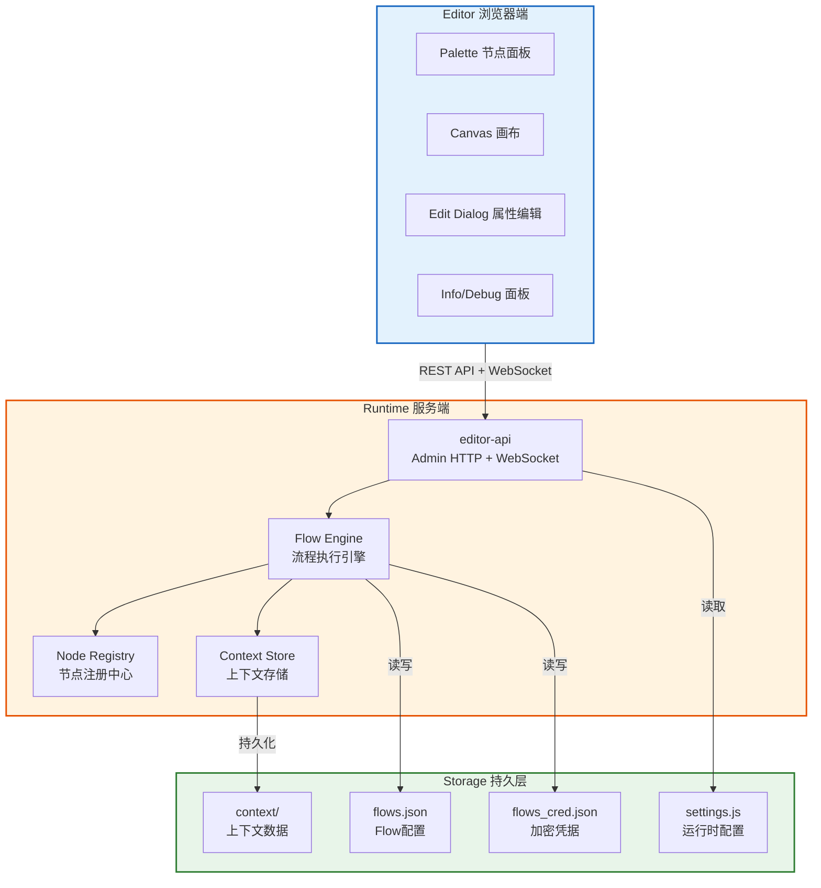
```mermaid
graph TB
    subgraph Editor["Editor 浏览器端"]
        Palette["Palette 节点面板"]
        Canvas["Canvas 画布"]
        EditDialog["Edit Dialog 属性编辑"]
        InfoDebug["Info/Debug 面板"]
    end

    subgraph Runtime["Runtime 服务端"]
        EditorAPI["editor-api<br/>Admin HTTP + WebSocket"]
        FlowEngine["Flow Engine<br/>流程执行引擎"]
        NodeRegistry["Node Registry<br/>节点注册中心"]
        ContextStore["Context Store<br/>上下文存储"]
    end

    subgraph Storage["Storage 持久层"]
        FlowsJSON["flows.json<br/>Flow配置"]
        CredJSON["flows_cred.json<br/>加密凭据"]
        SettingsJS["settings.js<br/>运行时配置"]
        ContextData["context/<br/>上下文数据"]
    end

    Editor -->|"REST API + WebSocket"| EditorAPI
    EditorAPI --> FlowEngine
    FlowEngine --> NodeRegistry
    FlowEngine --> ContextStore
    FlowEngine -->|"读写"| FlowsJSON
    FlowEngine -->|"读写"| CredJSON
    EditorAPI -->|"读取"| SettingsJS
    ContextStore -->|"持久化"| ContextData

    style Editor fill:#e3f2fd,stroke:#1565c0,stroke-width:2px
    style Runtime fill:#fff3e0,stroke:#e65100,stroke-width:2px
    style Storage fill:#e8f5e9,stroke:#2e7d32,stroke-width:2px
```

### 1.2 核心包结构

Node-RED 从 v1.0 开始采用 monorepo 结构，拆分为多个 npm 包，各司其职：

| 包名 | 职责 | 关键导出 |
|------|------|----------|
| `node-red` | 主入口，组合所有子包 | `RED.init(server, settings)` |
| `@node-red/runtime` | 核心运行时：Flow 生命周期、节点实例化、消息传递 | `runtime.init(settings)` |
| `@node-red/editor-api` | Admin HTTP API + WebSocket 通信层 | `api.init(server, runtime)` |
| `@node-red/editor-client` | 前端编辑器（原生 JS + SVG + jQuery） | 静态资源（HTML/JS/CSS） |
| `@node-red/registry` | 节点注册中心：发现、加载、管理节点模块 | `registry.init(settings)` |
| `@node-red/util` | 工具库：日志、i18n、Hooks 钩子、执行追踪 | `log`, `i18n`, `hooks` |
| `@node-red/nodes` | 内置节点集合（inject, debug, function, http 等） | 节点定义文件 |

包之间的依赖关系如下：

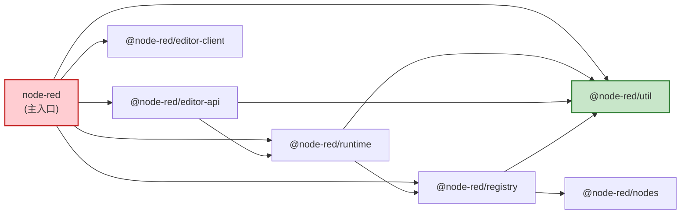
```mermaid
graph LR
    NR["node-red<br/>(主入口)"]
    RT["@node-red/runtime"]
    EA["@node-red/editor-api"]
    EC["@node-red/editor-client"]
    REG["@node-red/registry"]
    UT["@node-red/util"]
    ND["@node-red/nodes"]

    NR --> RT
    NR --> EA
    NR --> EC
    NR --> REG
    NR --> UT
    RT --> REG
    RT --> UT
    EA --> RT
    EA --> UT
    REG --> UT
    REG --> ND

    style NR fill:#ffcdd2,stroke:#c62828,stroke-width:2px
    style UT fill:#c8e6c9,stroke:#2e7d32,stroke-width:2px
```

### 1.3 嵌入式部署模式

Node-RED 最重要的架构特性之一是 **可嵌入性**。Runtime 和 Editor 完全解耦，使得 Node-RED 可以作为 npm 模块嵌入任意 Express 应用中：

```javascript
// 嵌入式部署示例
const http = require('http');
const express = require('express');
const RED = require('node-red');

const app = express();
const server = http.createServer(app);

// Node-RED 配置
const settings = {
    httpAdminRoot: '/red',         // Editor 挂载路径
    httpNodeRoot: '/api',          // HTTP 节点挂载路径
    userDir: './.nodered',         // 用户数据目录
    functionGlobalContext: {        // 全局上下文
        os: require('os'),
        _lodash: require('lodash')
    },
    // 禁用 Editor（仅运行时模式）
    // disableEditor: true,
};

// 初始化并启动
RED.init(server, settings);
app.use(settings.httpAdminRoot, RED.httpAdmin);  // Editor 路由
app.use(settings.httpNodeRoot, RED.httpNode);     // HTTP 节点路由

server.listen(1880, () => {
    RED.start();  // 启动运行时
});
```

这种嵌入式能力使得 Node-RED 可以：

- **仅运行时模式**：设置 `disableEditor: true`，无 UI 纯后台执行
- **嵌入现有应用**：与已有 Express 应用共享端口和中间件
- **多实例部署**：同一进程内运行多个独立 Runtime（不同 `userDir`）
- **自定义 Editor**：替换编辑器前端，仅复用 Runtime

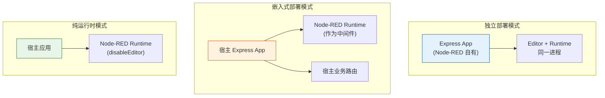
```mermaid
graph TB
    subgraph "独立部署模式"
        A1["Express App<br/>(Node-RED 自有)"]
        A2["Editor + Runtime<br/>同一进程"]
        A1 --> A2
    end

    subgraph "嵌入式部署模式"
        B1["宿主 Express App"]
        B2["Node-RED Runtime<br/>(作为中间件)"]
        B3["宿主业务路由"]
        B1 --> B2
        B1 --> B3
    end

    subgraph "纯运行时模式"
        C1["宿主应用"]
        C2["Node-RED Runtime<br/>(disableEditor)"]
        C1 --> C2
    end

    style A1 fill:#e3f2fd,stroke:#1565c0
    style B1 fill:#fff3e0,stroke:#e65100
    style C1 fill:#e8f5e9,stroke:#2e7d32
```

### 1.4 启动流程

Node-RED 的启动流程涉及配置加载、节点注册、Flow 编排等多个阶段：

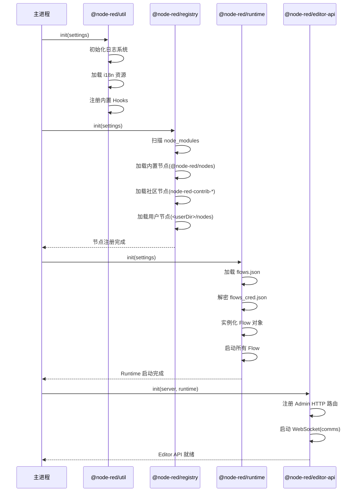
```mermaid
sequenceDiagram
    participant Main as 主进程
    participant Util as @node-red/util
    participant Registry as @node-red/registry
    participant Runtime as @node-red/runtime
    participant EditorAPI as @node-red/editor-api

    Main->>Util: init(settings)
    Util->>Util: 初始化日志系统
    Util->>Util: 加载 i18n 资源
    Util->>Util: 注册内置 Hooks

    Main->>Registry: init(settings)
    Registry->>Registry: 扫描 node_modules
    Registry->>Registry: 加载内置节点(@node-red/nodes)
    Registry->>Registry: 加载社区节点(node-red-contrib-*)
    Registry->>Registry: 加载用户节点(<userDir>/nodes)
    Registry-->>Main: 节点注册完成

    Main->>Runtime: init(settings)
    Runtime->>Runtime: 加载 flows.json
    Runtime->>Runtime: 解密 flows_cred.json
    Runtime->>Runtime: 实例化 Flow 对象
    Runtime->>Runtime: 启动所有 Flow
    Runtime-->>Main: Runtime 启动完成

    Main->>EditorAPI: init(server, runtime)
    EditorAPI->>EditorAPI: 注册 Admin HTTP 路由
    EditorAPI->>EditorAPI: 启动 WebSocket(comms)
    EditorAPI-->>Main: Editor API 就绪
```

---

## 二、节点技术实现

### 2.1 HTML + JS 配对定义规范

Node-RED 的每个节点由 **一对文件** 定义，这是其最核心的设计模式：

| 文件 | 运行环境 | 职责 |
|------|----------|------|
| `node.html` | 浏览器（Editor） | 节点注册、编辑模板、帮助文本 |
| `node.js` | 服务端（Runtime） | 运行时逻辑、消息处理 |

这种配对定义使得节点的 **编辑时行为** 和 **运行时行为** 完全分离，各自独立演化。编辑时定义了节点在 Palette 中的外观、属性编辑表单和帮助文档；运行时定义了节点的消息处理逻辑和生命周期管理。

**node.html** — 编辑器端定义的核心结构：

```html
<script type="text/javascript">
RED.nodes.registerType('my-custom-node', {
    category: 'function',              // Palette 分类
    color: '#a6bbcf',                  // 节点颜色
    defaults: {                        // 可编辑属性定义
        name: { value: '' },
        topic: { value: '', required: true,
                 validate: RED.validators.regex(/^[a-zA-Z]/) },
        outputType: { value: 'msg' },
        timeout: { value: 30,
                   validate: function(v) { return v > 0 && v <= 300; } },
        server: { type: 'my-config-node', required: true }
    },
    credentials: {                     // 凭据定义（分开存储）
        username: { type: 'text' },
        password: { type: 'password' }
    },
    inputs: 1,                         // 输入端口数量（0 或 1）
    outputs: 2,                        // 输出端口数量（0+）
    icon: 'arrow-in.svg',
    label: function() {
        return this.name || 'my node';
    },
    outputLabels: ['success', 'error'],
    oneditprepare: function() {
        $('#node-input-timeout').spinner({ min: 1, max: 300 });
    },
    oneditsave: function() {
        var topic = $('#node-input-topic').val();
        if (!topic.startsWith('/')) {
            $('#node-input-topic').val('/' + topic);
        }
    },
    oneditcancel: function() {},
    oneditdelete: function() {}
});
</script>

<!-- 编辑模板 -->
<script type="text/html" data-template-name="my-custom-node">
    <div class="form-row">
        <label for="node-input-name"><i class="fa fa-tag"></i> Name</label>
        <input type="text" id="node-input-name" placeholder="Name">
    </div>
    <div class="form-row">
        <label for="node-input-server"><i class="fa fa-server"></i> Server</label>
        <input type="text" id="node-input-server">
    </div>
    <div class="form-row">
        <label for="node-input-topic"><i class="fa fa-envelope"></i> Topic</label>
        <input type="text" id="node-input-topic" placeholder="/topic/path">
    </div>
    <div class="form-row">
        <label for="node-input-username"><i class="fa fa-user"></i> Username</label>
        <input type="text" id="node-input-username">
    </div>
    <div class="form-row">
        <label for="node-input-password"><i class="fa fa-lock"></i> Password</label>
        <input type="password" id="node-input-password">
    </div>
</script>

<!-- 帮助文本 -->
<script type="text/html" data-help-name="my-custom-node">
    <p>My custom node that processes messages.</p>
    <h3>Inputs</h3>
    <dl class="message-properties">
        <dt>payload <span class="property-type">string</span></dt>
        <dd>The payload of the message to process.</dd>
    </dl>
    <h3>Outputs</h3>
    <ol class="node-ports">
        <li>Success output
            <dl class="message-properties">
                <dt>payload <span class="property-type">object</span></dt>
                <dd>The processed result.</dd>
            </dl>
        </li>
        <li>Error output
            <dl class="message-properties">
                <dt>payload <span class="property-type">string</span></dt>
                <dd>Error message.</dd>
            </dl>
        </li>
    </ol>
</script>
```

**node.js** — 运行时逻辑：

```javascript
module.exports = function(RED) {
    'use strict';

    function MyCustomNode(config) {
        // 必须调用 createNode 初始化节点
        RED.nodes.createNode(this, config);

        // 从 config 中提取属性（与 defaults 定义一一对应）
        this.name = config.name;
        this.topic = config.topic;
        this.timeout = config.timeout;

        // 获取关联的 Config Node
        var serverNode = RED.nodes.getNode(config.server);

        // 获取凭据（password 类型只能获取 has_ 布尔值）
        var username = this.credentials.username;       // 可访问值
        var hasPassword = this.credentials.has_password; // 仅布尔值
        // this.credentials.password === undefined (运行时不可读)

        var node = this;

        // 输入处理：核心消息处理逻辑
        this.on('input', function(msg, send, done) {
            // msg:  消息对象，通常包含 payload 属性
            // send: 发送消息函数（替代 node.send）
            // done: 完成回调（用于错误通知和异步流程控制）

            if (!serverNode) {
                done(new Error('Server configuration not found'));
                return;
            }

            try {
                var result = processMessage(msg, serverNode);
                node.status({
                    fill: 'green', shape: 'dot', text: 'processing'
                });
                msg.payload = result;
                send(msg);
                done();
            } catch (err) {
                node.status({
                    fill: 'red', shape: 'ring', text: 'error'
                });
                done(err);
            }
        });

        // 关闭处理：资源清理
        this.on('close', function(removed, done) {
            // removed: true = 节点被删除
            //          false = 重启/重部署
            node.status({});  // 清除状态
            if (node.client) {
                node.client.disconnect();
            }
            done();  // 必须调用 done 表示清理完成
        });

        // 初始化完成
        node.status({ fill: 'blue', shape: 'ring', text: 'ready' });
    }

    function processMessage(msg, serverNode) {
        return {
            original: msg.payload,
            processed: true,
            timestamp: Date.now()
        };
    }

    // 注册节点类型
    RED.nodes.registerType('my-custom-node', MyCustomNode, {
        credentials: {
            username: { type: 'text' },
            password: { type: 'password' }
        }
    });
};
```

### 2.2 registerType 定义详解

`RED.nodes.registerType()` 是节点注册的核心 API，其定义对象包含以下关键字段：

| 字段 | 类型 | 说明 |
|------|------|------|
| `category` | string | Palette 中的分类，如 `function`、`network`、`storage` |
| `color` | string | 节点颜色，十六进制值，如 `#a6bbcf` |
| `defaults` | object | 可编辑属性定义，每个属性含 `value`、`required`、`validate`、`type` |
| `credentials` | object | 凭据定义，`type:"text"` 可访问，`type:"password"` 仅提供 `has_` 布尔值 |
| `inputs` | 0\|1 | 输入端口数量，0 表示源节点（如 inject），1 表示普通节点 |
| `outputs` | number | 输出端口数量，0 表示终节点（如 debug），可大于 1（如 switch） |
| `icon` | string | 节点图标文件名，如 `arrow-in.svg` |
| `label` | string\|function | 节点标签，函数时 `this` 指向节点实例 |
| `oneditprepare` | function | 编辑对话框打开时调用，初始化 UI 组件 |
| `oneditsave` | function | 保存前调用，可修改待保存数据 |
| `oneditcancel` | function | 取消编辑时调用，清理资源 |

**defaults 属性详细规范**：

```javascript
defaults: {
    propertyName: {
        value: 'default_value',     // 默认值（必填）
        required: true,             // 是否必填
        validate: function(v) {     // 验证函数
            return v.length > 0;
        },
        // type 字段指向 Config Node 类型
        // 当设置了 type 时，编辑器会自动生成下拉选择框
        // 列出所有该类型的 Config Node 实例
        type: 'my-config-node',     // 关联 Config Node
    }
}
```

**编辑模板命名约定**：

- 模板容器：`data-template-name="<node-type>"`，必须与注册类型名一致
- 输入字段 ID：`node-input-<propertyname>`，与 `defaults` 中的属性名对应
- 凭据字段 ID：`node-input-<credentialname>`，与 `credentials` 中的名称对应
- 此命名约定使编辑器能自动绑定表单字段到节点属性，无需手动序列化/反序列化

### 2.3 生命周期状态机

节点的生命周期从构造到销毁经历明确的状态转换：

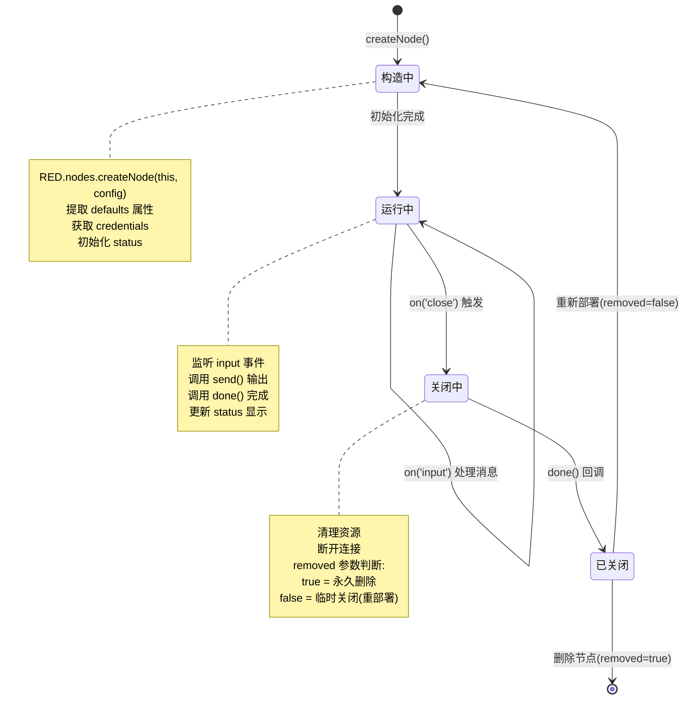
```mermaid
stateDiagram-v2
    [*] --> 构造中: createNode()
    构造中 --> 运行中: 初始化完成
    运行中 --> 运行中: on('input') 处理消息
    运行中 --> 关闭中: on('close') 触发
    关闭中 --> 已关闭: done() 回调
    已关闭 --> 构造中: 重新部署(removed=false)
    已关闭 --> [*]: 删除节点(removed=true)

    note right of 构造中
        RED.nodes.createNode(this, config)
        提取 defaults 属性
        获取 credentials
        初始化 status
    end note

    note right of 运行中
        监听 input 事件
        调用 send() 输出
        调用 done() 完成
        更新 status 显示
    end note

    note right of 关闭中
        清理资源
        断开连接
        removed 参数判断:
        true = 永久删除
        false = 临时关闭(重部署)
    end note
```

生命周期关键点详解：

1. **构造阶段**：调用 `RED.nodes.createNode(this, config)` 后，Node 继承了 EventEmitter 的能力，`config` 中的 defaults 属性被提取到 `this` 上，credentials 被注入到 `this.credentials` 中。此时节点已具备接收消息的能力，但尚未开始处理。

2. **运行阶段**：节点通过 `on('input', handler)` 监听输入消息。handler 接收三个参数：
   - `msg`：消息对象，核心约定包含 `payload` 属性
   - `send`：消息发送函数（v1.0+ 新增，替代 `node.send()`），支持数组形式发送到不同端口
   - `done`：完成回调，无参调用表示成功，传入 Error 对象则触发 Catch 节点

3. **关闭阶段**：`on('close', handler)` 接收 `removed` 和 `done` 两个参数。`removed=true` 表示节点被永久删除（应彻底清理），`removed=false` 表示重部署（应保留持久连接等资源）。`done()` 必须被调用以通知 Runtime 关闭完成。

### 2.4 输入/输出端口机制

节点的端口系统决定了消息在 Flow 中的流动路径：

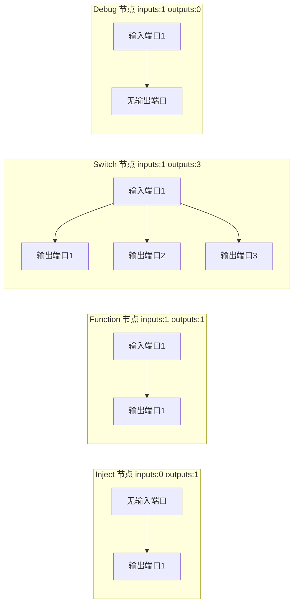
```mermaid
graph LR
    subgraph "Inject 节点 inputs:0 outputs:1"
        I1["无输入端口"] --> O1["输出端口1"]
    end

    subgraph "Function 节点 inputs:1 outputs:1"
        I2["输入端口1"] --> O2["输出端口1"]
    end

    subgraph "Switch 节点 inputs:1 outputs:3"
        I3["输入端口1"] --> O3A["输出端口1"]
        I3 --> O3B["输出端口2"]
        I3 --> O3C["输出端口3"]
    end

    subgraph "Debug 节点 inputs:1 outputs:0"
        I4["输入端口1"] --> O4["无输出端口"]
    end
```

**wires 数组与端口映射**：

在 Flow JSON 中，`wires` 是一个二维数组，外层数组索引对应输出端口号，内层数组包含目标节点 ID：

```json
{
    "id": "switch-node-1",
    "type": "switch",
    "wires": [
        ["func-node-1", "func-node-2"],
        ["func-node-3"],
        ["debug-node-1"]
    ]
}
```

**send() 函数的端口控制**：

```javascript
// 发送到端口0的默认连接
send(msg);                // 等价于 send([msg])

// 发送到指定端口（数组索引对应端口号）
send([msg, null, msg2]);  // 端口0: msg, 端口1: 不发送, 端口2: msg2

// 克隆消息避免共享引用问题
var msg2 = RED.util.cloneMessage(msg);
send([msg, msg2]);
```

### 2.5 credentials 凭据系统

Node-RED 的凭据系统采用 **分离存储 + 对称加密** 的方式，确保敏感信息不会明文存储在 flows.json 中：

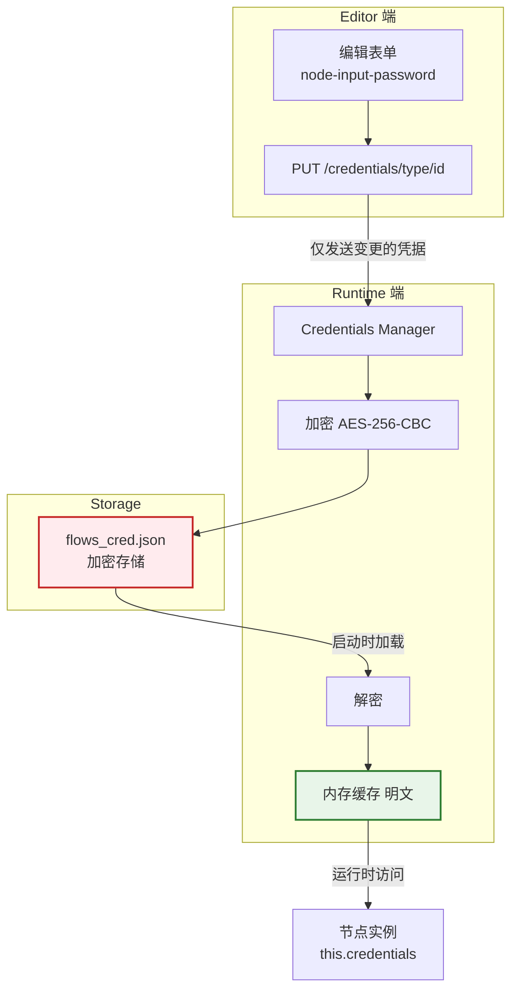
```mermaid
graph TB
    subgraph "Editor 端"
        EditForm["编辑表单<br/>node-input-password"]
        API1["PUT /credentials/type/id"]
        EditForm --> API1
    end

    subgraph "Runtime 端"
        CredMgr["Credentials Manager"]
        Encrypt["加密 AES-256-CBC"]
        Decrypt["解密"]
        Memory["内存缓存 明文"]
    end

    subgraph "Storage"
        FlowsCred["flows_cred.json<br/>加密存储"]
    end

    API1 -->|"仅发送变更的凭据"| CredMgr
    CredMgr --> Encrypt
    Encrypt --> FlowsCred
    FlowsCred -->|"启动时加载"| Decrypt
    Decrypt --> Memory
    Memory -->|"运行时访问"| NodeInstance["节点实例<br/>this.credentials"]

    style FlowsCred fill:#ffebee,stroke:#c62828,stroke-width:2px
    style Memory fill:#e8f5e9,stroke:#2e7d32,stroke-width:2px
```

凭据类型的安全分级：

| 类型 | 编辑器可访问 | 运行时可访问 | 存储方式 | 典型用例 |
|------|-------------|-------------|----------|----------|
| `type:"text"` | ✅ 原文 | ✅ 原文 | 加密存储 | 用户名、API Key |
| `type:"password"` | ✅ 原文（编辑时） | ❌ 仅 `has_password` 布尔值 | 加密存储 | 密码、Secret |

这种设计的核心思想是：**即使节点代码存在恶意，也无法通过 `this.credentials.password` 读回密码原文**。节点在运行时只能通过 `has_password` 判断用户是否配置了密码，然后在需要时通过安全的 API 传递凭据。

### 2.6 消息传递机制

Node-RED 的消息传递是其运行时的核心能力，消息在节点间的流转经过多层处理：

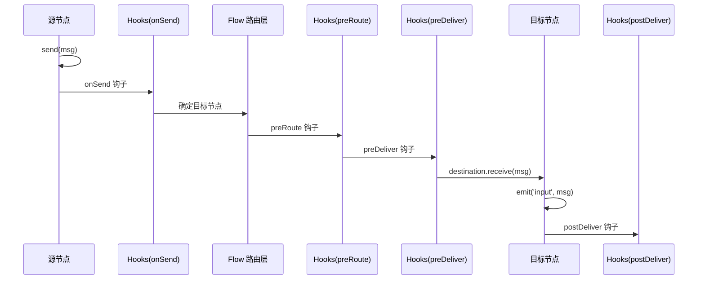
```mermaid
sequenceDiagram
    participant Source as 源节点
    participant Hooks1 as Hooks(onSend)
    participant Flow as Flow 路由层
    participant Hooks2 as Hooks(preRoute)
    participant Hooks3 as Hooks(preDeliver)
    participant Dest as 目标节点
    participant Hooks4 as Hooks(postDeliver)

    Source->>Source: send(msg)
    Source->>Hooks1: onSend 钩子
    Hooks1->>Flow: 确定目标节点
    Flow->>Hooks2: preRoute 钩子
    Hooks2->>Hooks3: preDeliver 钩子
    Hooks3->>Dest: destination.receive(msg)
    Dest->>Dest: emit('input', msg)
    Dest->>Hooks4: postDeliver 钩子
```

**消息传递的完整路径**：

1. 源节点调用 `send(msg)` → 触发 `onSend` Hook
2. Flow 路由层根据 `wires` 配置确定目标节点 → 触发 `preRoute` Hook
3. 消息即将投递到目标节点 → 触发 `preDeliver` Hook
4. 目标节点的 `receive(msg)` 方法被调用 → 内部 `emit('input', msg)`
5. 投递完成 → 触发 `postDeliver` Hook
6. 目标节点的 input handler 执行完毕 → 触发 `onReceive` / `postReceive` Hook

**消息对象的约定**：

```javascript
// 标准消息对象结构
var msg = {
    payload: "message content",  // 核心数据，类型不限
    topic: "sensor/data",        // 主题/路由键
    _msgid: "abc123",            // 消息ID（Runtime自动生成，用于追踪）
    // 其他自定义属性...
};

// 消息克隆机制
// 当一个消息需要发送到多个目标节点时，
// Node-RED 会自动克隆消息，避免不同节点修改同一引用
```

### 2.7 消息传递优化

Node-RED 在消息传递层面做了多项性能优化：

**单输出单连线快捷引用**：

```javascript
// 当节点只有1个输出端口且只有1条连线时
// 不需要遍历 wires 数组，直接使用 _wire 快捷引用
if (node._wire) {
    // 快捷路径：直接投递到唯一目标
    node._wire.receive(msg);
} else {
    // 普通路径：遍历 wires 数组
    for (var i = 0; i < node.wires.length; i++) {
        for (var j = 0; j < node.wires[i].length; j++) {
            node.wires[i][j].receive(msg);
        }
    }
}
```

**NOOP_SEND 空操作优化**：

```javascript
// 当节点没有任何连线时，send 函数被替换为 NOOP_SEND
// 避免不必要的消息克隆和 Hook 调用
var NOOP_SEND = function() {};

// 节点初始化时判断
if (node.wires.length === 0) {
    node.send = NOOP_SEND;  // 无输出，send 为空操作
}
```

**异步投递（setImmediate）**：

```javascript
// 消息投递使用 setImmediate 实现异步
// 确保不会因为长链路导致调用栈溢出
Flow.prototype.send = function(sendEvents) {
    setImmediate(function() {
        // 实际投递逻辑
        sendEvents.forEach(function(event) {
            event.destination.receive(event.msg);
        });
    });
};
```

这些优化使得 Node-RED 在高频消息场景下仍能保持良好性能，尤其是在 IoT 数据采集等消息密集型场景中。

### 2.8 Context Store 上下文存储

Context Store 为节点提供了三种作用域的数据存储能力，支持可插拔的后端实现：

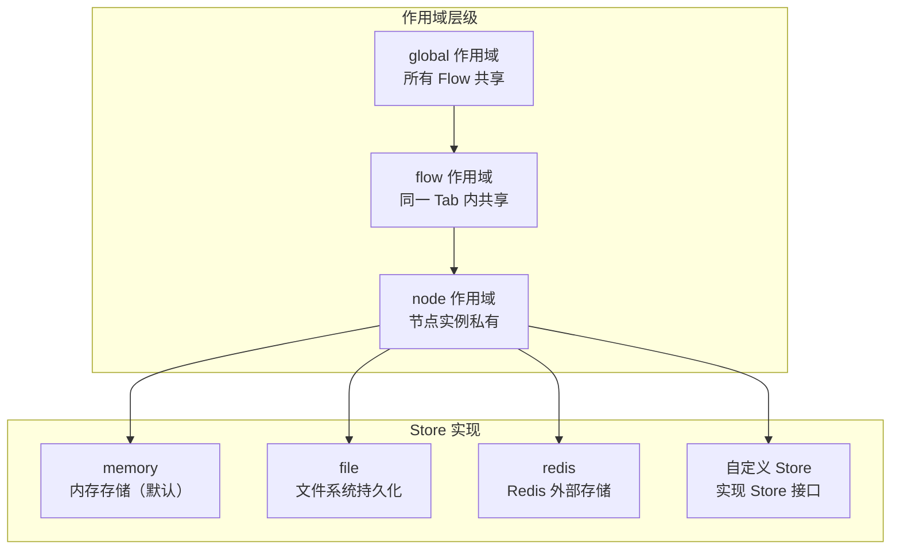
```mermaid
graph TB
    subgraph "作用域层级"
        Global["global 作用域<br/>所有 Flow 共享"]
        Flow["flow 作用域<br/>同一 Tab 内共享"]
        Node["node 作用域<br/>节点实例私有"]
    end

    Global --> Flow --> Node

    subgraph "Store 实现"
        Memory["memory<br/>内存存储（默认）"]
        File["file<br/>文件系统持久化"]
        Redis["redis<br/>Redis 外部存储"]
        Custom["自定义 Store<br/>实现 Store 接口"]
    end

    Node --> Memory
    Node --> File
    Node --> Redis
    Node --> Custom
```

**Context Store 使用示例**：

```javascript
// 设置上下文值
node.context().flow.set("counter", 0);          // flow 作用域
node.context().global.set("config", myConfig);   // global 作用域
var count = node.context().get("count") || 0;    // node 作用域

// 异步获取（持久化 Store）
node.context().flow.get("counter", function(err, val) {
    if (err) { node.error(err); return; }
    // 使用 val
});

// 便捷访问方式
var flowContext = node.context().flow;
var globalContext = node.context().global;
```

**settings.js 中配置 Context Store**：

```javascript
contextStorage: {
    default: "memory",           // 默认使用内存
    memory: { module: "memory" },
    file: {
        module: "localfilesystem",
        config: {
            dir: "./context",     // 持久化目录
            base: "context",      // 文件名前缀
            cache: true,          // 启用内存缓存
            cacheTimeout: 30      // 缓存超时（秒）
        }
    },
    redis: {
        module: "node-red-contrib-context-redis",
        config: {
            host: "localhost",
            port: 6379
        }
    }
}
```

### 2.9 社区节点生态

Node-RED 拥有繁荣的社区节点生态，遵循 `node-red-contrib-*` 的命名规范：

```javascript
// 社区节点的 package.json 规范
{
    "name": "node-red-contrib-example",
    "version": "1.0.0",
    "description": "A sample Node-RED node",
    "keywords": ["node-red", "example"],
    "node-red": {
        "nodes": {
            "example": "example/example.js"    // 运行时入口
        }
    },
    "dependencies": {
        "some-library": "^2.0.0"
    }
}
```

**Palette 管理器**：Node-RED 内置了节点包管理界面，用户可以直接在编辑器中搜索、安装、卸载社区节点，无需命令行操作。其实现原理是：

1. 调用 npm registry API 搜索 `node-red-contrib-*` 包
2. 通过子进程执行 `npm install` 安装到 `userDir/node_modules`
3. 通过 Registry 模块动态加载新安装的节点
4. 无需重启 Runtime 即可使用新节点

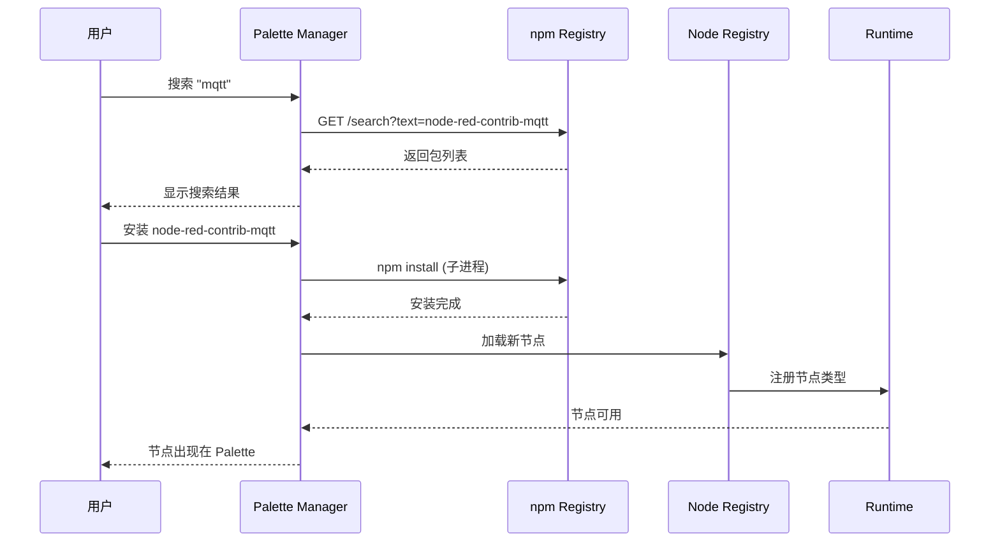
```mermaid
sequenceDiagram
    participant User as 用户
    participant Palette as Palette Manager
    participant NPM as npm Registry
    participant Registry as Node Registry
    participant Runtime as Runtime

    User->>Palette: 搜索 "mqtt"
    Palette->>NPM: GET /search?text=node-red-contrib-mqtt
    NPM-->>Palette: 返回包列表
    Palette-->>User: 显示搜索结果

    User->>Palette: 安装 node-red-contrib-mqtt
    Palette->>NPM: npm install (子进程)
    NPM-->>Palette: 安装完成
    Palette->>Registry: 加载新节点
    Registry->>Runtime: 注册节点类型
    Runtime-->>Palette: 节点可用
    Palette-->>User: 节点出现在 Palette
```

---

## 三、Flow 数据模型

### 3.1 Flow JSON Schema

Flow 的完整配置以 JSON 数组形式存储在 `flows.json` 中，每个元素代表一个节点、Tab、Subflow 或 Group：

```json
[
    {
        "id": "tab-flow-1",
        "type": "tab",
        "label": "My Flow",
        "disabled": false,
        "info": "Flow description",
        "env": [
            { "name": "API_URL", "value": "https://api.example.com", "type": "str" }
        ]
    },
    {
        "id": "group-1",
        "type": "group",
        "name": "Input Processing",
        "style": { "label": true },
        "nodes": ["inject-1", "function-1"],
        "x": 34, "y": 29, "w": 432, "h": 162
    },
    {
        "id": "inject-1",
        "type": "inject",
        "z": "tab-flow-1",
        "name": "Trigger",
        "props": [
            { "p": "payload" },
            { "p": "topic", "vt": "str" }
        ],
        "repeat": "5",
        "crontab": "",
        "once": true,
        "onceDelay": 0.1,
        "topic": "sensor/data",
        "payload": "",
        "payloadType": "date",
        "x": 110, "y": 60,
        "wires": [["function-1"]]
    },
    {
        "id": "function-1",
        "type": "function",
        "z": "tab-flow-1",
        "g": "group-1",
        "name": "Transform",
        "func": "msg.payload = { timestamp: msg.payload, value: Math.random() };\nreturn msg;",
        "outputs": 1,
        "timeout": 0,
        "noerr": 0,
        "initialize": "",
        "finalize": "",
        "libs": [],
        "x": 290, "y": 60,
        "wires": [["debug-1", "http-1"]]
    },
    {
        "id": "debug-1",
        "type": "debug",
        "z": "tab-flow-1",
        "name": "Debug Output",
        "active": true,
        "tosidebar": true,
        "console": false,
        "tostatus": false,
        "complete": "payload",
        "targetType": "msg",
        "x": 500, "y": 60,
        "wires": []
    },
    {
        "id": "subflow-1",
        "type": "subflow",
        "name": "Error Handler",
        "info": "Reusable error handling subflow",
        "in": [{ "x": 40, "y": 40, "wires": [{ "id": "sf-catch-1" }] }],
        "out": [{ "x": 380, "y": 40, "wires": [{ "id": "sf-func-1", "port": 0 }] }]
    }
]
```

### 3.2 核心字段说明

| 字段 | 类型 | 说明 |
|------|------|------|
| `id` | string | 节点唯一标识，8位十六进制，如 `"a1b2c3d4"` |
| `type` | string | 节点类型，如 `"function"`、`"inject"`、`"tab"`、`"subflow"` |
| `z` | string | 所属 Tab ID，标识节点属于哪个 Flow 页签 |
| `d` | boolean | 是否禁用（disabled），禁用的节点不参与运行 |
| `wires` | array | 连接关系，二维数组，`wires[portIndex]` = 目标节点ID数组 |
| `name` | string | 节点名称，用于显示和日志 |
| `g` | string | 所属 Group ID（v1.1+） |
| `x`, `y` | number | 画布坐标位置 |

### 3.3 wires 连接定义

wires 是 Flow 数据模型中最关键的字段，定义了节点间的连接关系：

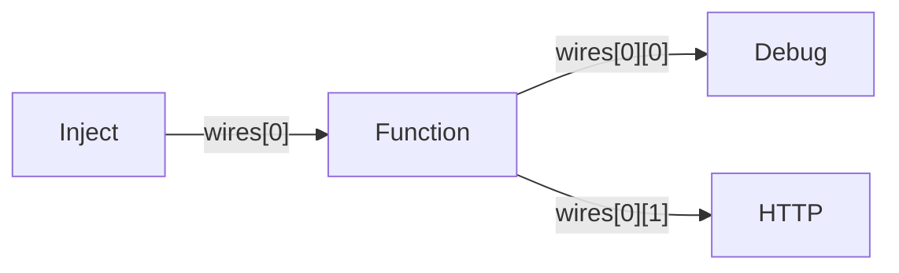
```mermaid
graph LR
    A["Inject"] -->|"wires[0]"| B["Function"]
    B -->|"wires[0][0]"| C["Debug"]
    B -->|"wires[0][1]"| D["HTTP"]
```

```json
{
    "id": "function-1",
    "type": "function",
    "wires": [
        ["debug-1", "http-1"]
    ]
}
```

wires 规则：
- `wires[0]` = 输出端口1连接的节点ID数组
- `wires[1]` = 输出端口2连接的节点ID数组
- 数组内可包含多个目标节点ID，表示消息被克隆后发送到所有目标
- `wires: []` 表示无输出端口
- `wires[0] = []` 表示端口1无连接

### 3.4 Subflow 嵌套

Subflow 是 Node-RED 的可复用流程片段，类似于编程中的函数：

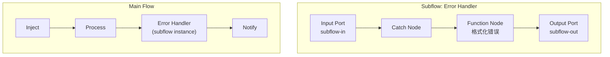
```mermaid
graph TB
    subgraph "Subflow: Error Handler"
        SF_IN["Input Port<br/>subflow-in"]
        SF_Catch["Catch Node"]
        SF_Func["Function Node<br/>格式化错误"]
        SF_OUT["Output Port<br/>subflow-out"]
        SF_IN --> SF_Catch --> SF_Func --> SF_OUT
    end

    subgraph "Main Flow"
        Inject["Inject"] --> Process["Process"]
        Process --> SubflowInstance["Error Handler<br/>(subflow instance)"]
        SubflowInstance --> Notify["Notify"]
    end
```

Subflow 在 flows.json 中的表示：
- `type: "subflow"` 定义 Subflow 模板
- `in` 和 `out` 定义输入/输出端口
- 实例节点 `type: "subflow:subflow-id"` 引用模板

### 3.5 Tab / Group 组织

- **Tab**（`type: "tab"`）：Flow 的顶层组织单元，每个 Tab 对应编辑器中的一个页签，Tab 之间相互独立运行
- **Group**（`type: "group"`，v1.1+）：Tab 内的可视化分组，用于在画布上组织相关节点，支持背景色和标签
- **环境变量**（`env`）：Tab 级别的环境变量，在 Flow 内通过 `$env` 访问

### 3.6 导入/导出格式

Node-RED 支持多种导入/导出格式：

```json
// 标准格式：JSON 数组
[
    { "id": "node-1", "type": "inject", ... },
    { "id": "node-2", "type": "debug", ... }
]

// 完整格式：包含 Flow 配置
{
    "flows": [...],
    "credentials": { ... }
}
```

导出时可以选择：
- **单个节点**：仅导出选中的节点
- **选中节点+依赖**：包含关联的 Config Node 和 Subflow
- **整个 Tab**：导出 Tab 内所有节点
- **全部 Flow**：导出 flows.json 完整内容

---

## 四、前端拖拽编辑器实现

### 4.1 技术栈

Node-RED 编辑器前端采用 **原生 JavaScript + SVG + jQuery** 的技术栈，没有使用 React/Vue 等现代框架：

| 技术 | 用途 | 说明 |
|------|------|------|
| 原生 JavaScript | 核心逻辑 | 约 60,000+ 行手写 JS 代码 |
| SVG | 连线渲染 | 贝塞尔曲线路径 |
| DOM | 节点渲染 | 每个节点是一个 div 元素 |
| jQuery | DOM 操作和事件 | 依赖 jQuery 3.x |
| jQuery UI | 对话框和交互 | 属性编辑面板 |
| ACE Editor | 代码编辑 | Function 节点的代码编辑器 |
| FontAwesome | 图标 | 节点图标和 UI 图标 |
| Mustache | 模板引擎 | 节点帮助文本渲染 |

### 4.2 画布渲染架构

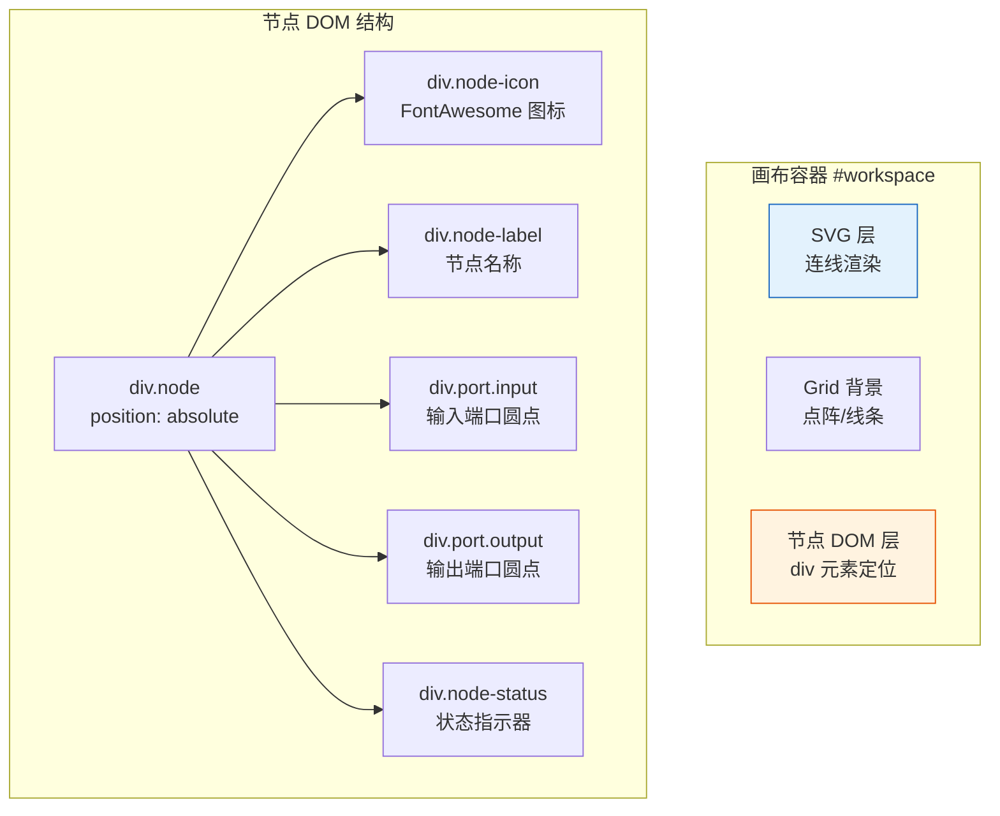
```mermaid
graph TB
    subgraph "画布容器 #workspace"
        SVG["SVG 层<br/>连线渲染"]
        Grid["Grid 背景<br/>点阵/线条"]
        Nodes["节点 DOM 层<br/>div 元素定位"]
    end

    subgraph "节点 DOM 结构"
        NodeDiv["div.node<br/>position: absolute"]
        NodeIcon["div.node-icon<br/>FontAwesome 图标"]
        NodeLabel["div.node-label<br/>节点名称"]
        PortIn["div.port.input<br/>输入端口圆点"]
        PortOut["div.port.output<br/>输出端口圆点"]
        StatusDot["div.node-status<br/>状态指示器"]
    end

    NodeDiv --> NodeIcon
    NodeDiv --> NodeLabel
    NodeDiv --> PortIn
    NodeDiv --> PortOut
    NodeDiv --> StatusDot

    style SVG fill:#e3f2fd,stroke:#1565c0
    style Nodes fill:#fff3e0,stroke:#e65100
```

**画布渲染的关键实现**：

```javascript
// 节点在画布上的定位
// 使用 CSS position: absolute + top/left 定位
var nodeElement = document.createElement('div');
nodeElement.className = 'node node-' + node.type;
nodeElement.style.position = 'absolute';
nodeElement.style.left = node.x + 'px';
nodeElement.style.top = node.y + 'px';
nodeElement.id = 'node-' + node.id;

// 画布平移和缩放
// 通过 CSS transform 实现
var canvas = document.getElementById('workspace');
canvas.style.transform = 'translate(' + offsetX + 'px,' + offsetY + 'px) scale(' + scaleFactor + ')';
```

### 4.3 拖拽交互实现

拖拽交互使用原生 DOM 事件实现，支持节点拖动、连线拖动、画布平移：

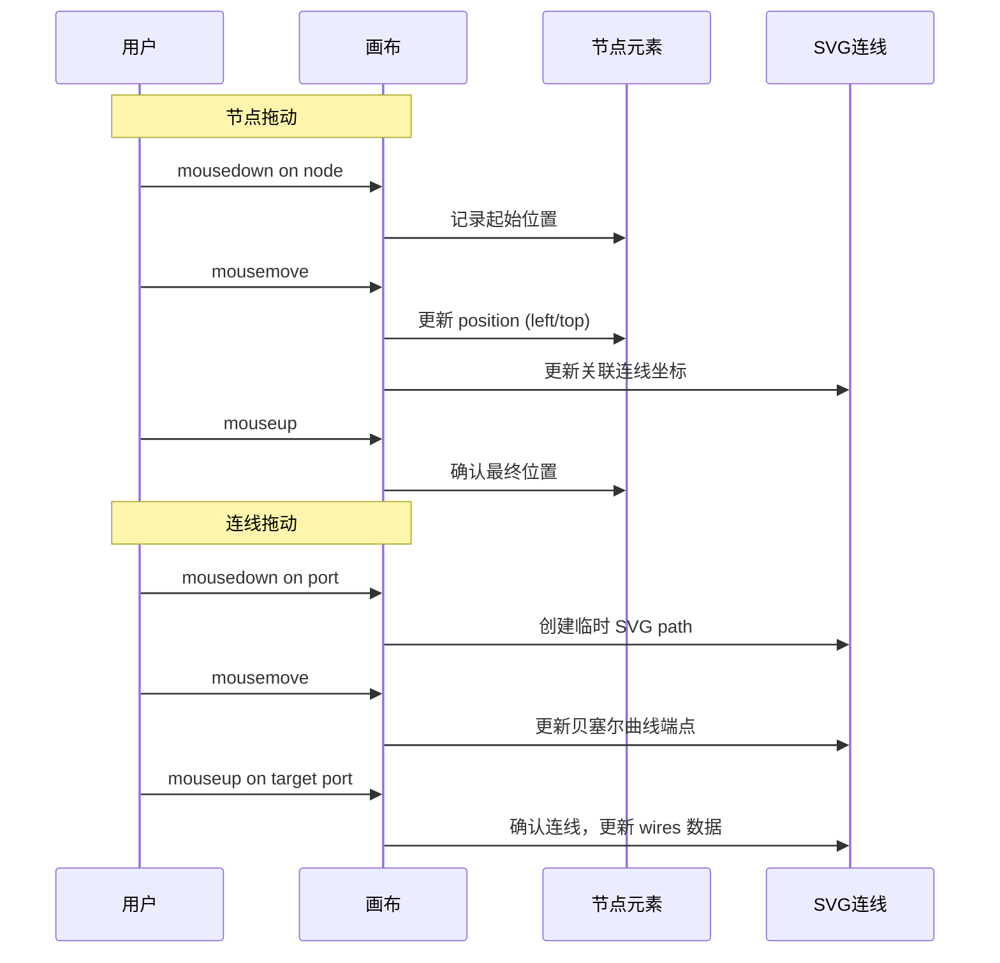
```mermaid
sequenceDiagram
    participant User as 用户
    participant Canvas as 画布
    participant Node as 节点元素
    participant Wire as SVG连线

    Note over User,Canvas: 节点拖动
    User->>Canvas: mousedown on node
    Canvas->>Node: 记录起始位置
    User->>Canvas: mousemove
    Canvas->>Node: 更新 position (left/top)
    Canvas->>Wire: 更新关联连线坐标
    User->>Canvas: mouseup
    Canvas->>Node: 确认最终位置

    Note over User,Canvas: 连线拖动
    User->>Canvas: mousedown on port
    Canvas->>Wire: 创建临时 SVG path
    User->>Canvas: mousemove
    Canvas->>Wire: 更新贝塞尔曲线端点
    User->>Canvas: mouseup on target port
    Canvas->>Wire: 确认连线，更新 wires 数据
```

**节点拖动核心代码**：

```javascript
// 节点拖动实现（简化）
var startX, startY, offsetX, offsetY;
var selectedNodes = [];

function onNodeMouseDown(evt) {
    startX = evt.clientX;
    startY = evt.clientY;
    // 记录所有选中节点的初始位置
    selectedNodes.forEach(function(n) {
        n._startX = n.x;
        n._startY = n.y;
    });
    document.addEventListener('mousemove', onNodeMouseMove);
    document.addEventListener('mouseup', onNodeMouseUp);
}

function onNodeMouseMove(evt) {
    var dx = evt.clientX - startX;
    var dy = evt.clientY - startY;
    selectedNodes.forEach(function(n) {
        n.x = n._startX + dx / scaleFactor;
        n.y = n._startY + dy / scaleFactor;
        // 更新 DOM 位置
        var el = document.getElementById('node-' + n.id);
        el.style.left = n.x + 'px';
        el.style.top = n.y + 'px';
        // 更新关联连线
        RED.view.redrawLinks(n);
    });
}
```

### 4.4 连线渲染：SVG 贝塞尔曲线

连线使用 SVG `<path>` 元素绘制三次贝塞尔曲线，控制点根据端口方向自动计算：

```javascript
// 贝塞尔曲线连线渲染
function drawLink(sourcePort, targetPort) {
    var sx = sourcePort.x;   // 源端口 x
    var sy = sourcePort.y;   // 源端口 y
    var tx = targetPort.x;   // 目标端口 x
    var ty = targetPort.y;   // 目标端口 y

    // 计算控制点（水平方向偏移）
    var dx = Math.abs(tx - sx);
    var cpOffset = Math.max(50, dx * 0.5);

    var cp1x = sx + cpOffset;  // 控制点1 x
    var cp1y = sy;              // 控制点1 y
    var cp2x = tx - cpOffset;  // 控制点2 x
    var cp2y = ty;              // 控制点2 y

    // 构造 SVG path
    var path = 'M ' + sx + ' ' + sy +
               ' C ' + cp1x + ' ' + cp1y +
               ' ' + cp2x + ' ' + cp2y +
               ' ' + tx + ' ' + ty;

    return path;
}
```

### 4.5 属性编辑面板

属性编辑面板使用 jQuery UI Dialog 实现，当双击节点时弹出：

```javascript
// 编辑对话框的实现
function showEditDialog(node) {
    var dialog = $('#node-dialog-edit');
    dialog.empty();

    // 加载节点对应的编辑模板
    var template = $('script[data-template-name="' + node.type + '"]').html();
    dialog.html(template);

    // 填充当前值
    for (var prop in node._def.defaults) {
        $('#node-input-' + prop).val(node[prop]);
    }

    // 调用节点的 oneditprepare 钩子
    if (node._def.oneditprepare) {
        node._def.oneditprepare.call(node);
    }

    // 打开对话框
    dialog.dialog({
        title: node._def.label.call(node),
        modal: true,
        width: 500,
        buttons: {
            "Done": function() {
                // 调用 oneditsave 钩子
                if (node._def.oneditsave) {
                    node._def.oneditsave.call(node);
                }
                // 保存属性值
                for (var prop in node._def.defaults) {
                    node[prop] = $('#node-input-' + prop).val();
                }
                dialog.dialog("close");
            },
            "Cancel": function() {
                if (node._def.oneditcancel) {
                    node._def.oneditcancel.call(node);
                }
                dialog.dialog("close");
            }
        }
    });
}
```

### 4.6 Palette 侧栏

Palette 侧栏按 category 分类展示所有已注册的节点类型，支持搜索过滤：

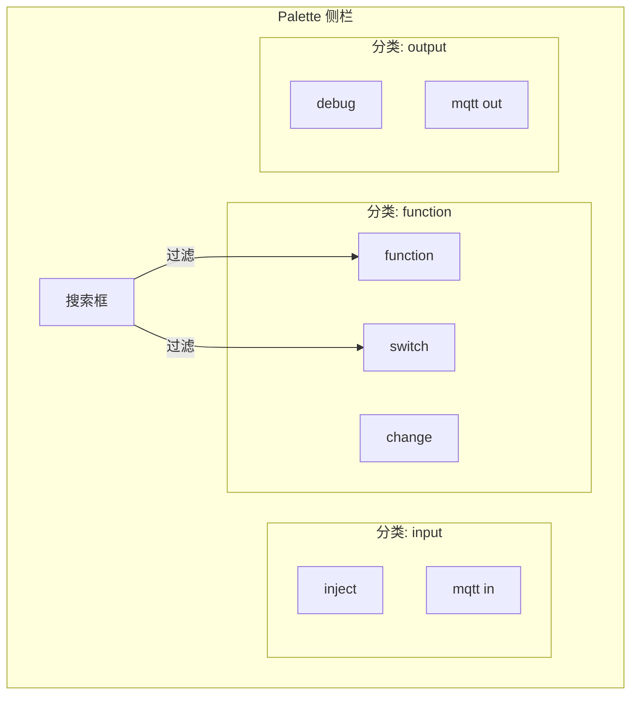
```mermaid
graph TB
    subgraph "Palette 侧栏"
        Search["搜索框"]
        subgraph "分类: input"
            N1["inject"]
            N2["mqtt in"]
        end
        subgraph "分类: function"
            N3["function"]
            N4["switch"]
            N5["change"]
        end
        subgraph "分类: output"
            N6["debug"]
            N7["mqtt out"]
        end
    end

    Search -->|"过滤"| N3
    Search -->|"过滤"| N4
```

### 4.7 前端与 Runtime 通信

前端编辑器与后端 Runtime 之间通过两种机制通信：

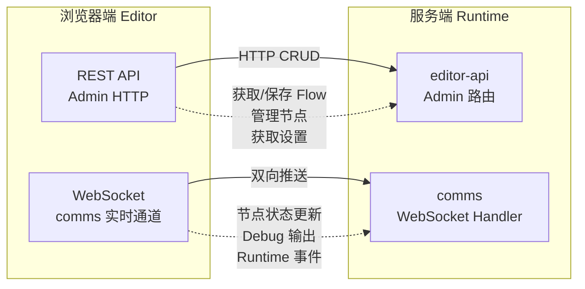
```mermaid
graph LR
    subgraph "浏览器端 Editor"
        REST["REST API<br/>Admin HTTP"]
        WS["WebSocket<br/>comms 实时通道"]
    end

    subgraph "服务端 Runtime"
        AdminAPI["editor-api<br/>Admin 路由"]
        CommsWS["comms<br/>WebSocket Handler"]
    end

    REST -->|"HTTP CRUD"| AdminAPI
    WS -->|"双向推送"| CommsWS

    REST -.->|"获取/保存 Flow<br/>管理节点<br/>获取设置"| AdminAPI
    WS -.->|"节点状态更新<br/>Debug 输出<br/>Runtime 事件"| CommsWS
```

**REST API 通信（同步操作）**：

```javascript
// 获取当前 Flow 配置
$.getJSON('/flows', function(flows) { ... });

// 保存 Flow 配置
$.ajax({
    url: '/flows',
    type: 'POST',
    data: JSON.stringify(flows),
    contentType: 'application/json',
    headers: { "Node-RED-API-Version": "v2" }
});

// 安装节点包
$.post('/nodes', { module: 'node-red-contrib-mqtt' });
```

**WebSocket 通信（实时推送）**：

```javascript
// WebSocket 连接
var ws = new WebSocket(
    'ws://' + location.host + '/comms'
);

// 接收 Runtime 事件
ws.onmessage = function(evt) {
    var msg = JSON.parse(evt.data);
    switch(msg.topic) {
        case 'status':
            // 更新节点状态显示
            updateNodeStatus(msg.data);
            break;
        case 'debug':
            // 在 Debug 面板显示输出
            appendDebugMessage(msg.data);
            break;
        case 'notification':
            // 显示通知
            showNotification(msg.data);
            break;
    }
};
```

---

## 五、后端执行引擎

### 5.1 Runtime 核心

Runtime 是 Node-RED 的核心执行引擎，负责 Flow 的生命周期管理、节点实例化和消息传递：

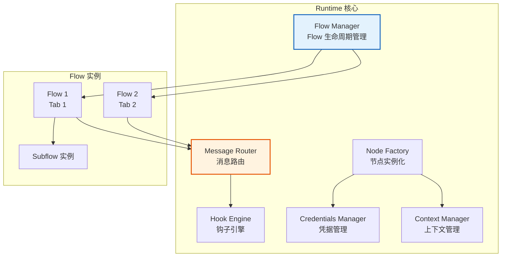
```mermaid
graph TB
    subgraph "Runtime 核心"
        FlowMgr["Flow Manager<br/>Flow 生命周期管理"]
        NodeFactory["Node Factory<br/>节点实例化"]
        MsgRouter["Message Router<br/>消息路由"]
        HookEngine["Hook Engine<br/>钩子引擎"]
        CredMgr["Credentials Manager<br/>凭据管理"]
        ContextMgr["Context Manager<br/>上下文管理"]
    end

    subgraph "Flow 实例"
        Flow1["Flow 1<br/>Tab 1"]
        Flow2["Flow 2<br/>Tab 2"]
        Subflow1["Subflow 实例"]
    end

    FlowMgr --> Flow1
    FlowMgr --> Flow2
    Flow1 --> Subflow1

    Flow1 --> MsgRouter
    Flow2 --> MsgRouter
    MsgRouter --> HookEngine

    NodeFactory --> CredMgr
    NodeFactory --> ContextMgr

    style FlowMgr fill:#e3f2fd,stroke:#1565c0,stroke-width:2px
    style MsgRouter fill:#fff3e0,stroke:#e65100,stroke-width:2px
```

**Flow 启动过程**：

```javascript
// Flow 启动核心逻辑（简化）
Flow.prototype.start = function() {
    var activeNodes = {};
    var flow = this;

    // 1. 实例化所有节点
    this.config.nodes.forEach(function(nodeConfig) {
        if (nodeConfig.d) return;  // 跳过禁用节点

        var NodeConstructor = registry.getNodeType(nodeConfig.type);
        if (NodeConstructor) {
            var node = new NodeConstructor(nodeConfig);
            activeNodes[nodeConfig.id] = node;

            // 2. 构建 wires 连接
            node.wires = [];
            nodeConfig.wires.forEach(function(outputPorts) {
                var portWires = [];
                outputPorts.forEach(function(targetId) {
                    if (activeNodes[targetId]) {
                        portWires.push(activeNodes[targetId]);
                    }
                });
                node.wires.push(portWires);
            });

            // 3. 优化：单输出单连线快捷引用
            if (node.wires.length === 1 && node.wires[0].length === 1) {
                node._wire = node.wires[0][0];
            }
        }
    });

    // 4. 启动 Inject 等源节点
    Object.values(activeNodes).forEach(function(node) {
        if (typeof node.start === 'function') {
            node.start();
        }
    });
};
```

### 5.2 消息传递的异步投递

消息传递使用 `setImmediate` 实现异步投递，确保长链路不会导致调用栈溢出：

```javascript
// Flow.send 的核心实现
Flow.prototype.send = function(sourceNode, sourcePort, msg) {
    // 触发 onSend Hook
    hooks.onSend(sourceNode, msg);

    var targets;
    if (sourceNode._wire) {
        // 快捷路径：单输出单连线
        targets = [{ node: sourceNode._wire, msg: msg }];
    } else {
        // 普通路径：遍历 wires
        targets = [];
        var wires = sourceNode.wires[sourcePort] || [];
        wires.forEach(function(targetNode) {
            if (wires.length === 1) {
                targets.push({ node: targetNode, msg: msg });
            } else {
                // 多目标：克隆消息
                targets.push({
                    node: targetNode,
                    msg: RED.util.cloneMessage(msg)
                });
            }
        });
    }

    // 异步投递
    setImmediate(function() {
        targets.forEach(function(target) {
            // 触发 preDeliver Hook
            hooks.preDeliver(target.node, target.msg);
            // 投递到目标节点
            target.node.receive(target.msg);
            // 触发 postDeliver Hook
            hooks.postDeliver(target.node, target.msg);
        });
    });
};
```

### 5.3 错误处理：Catch 节点

Catch 节点实现了 Flow 级别的错误捕获机制，类似于 try-catch：

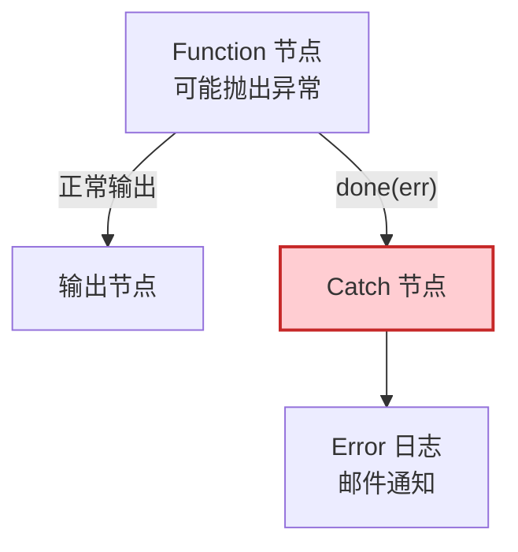
```mermaid
graph TB
    Func["Function 节点<br/>可能抛出异常"] -->|"正常输出"| Output["输出节点"]
    Func -->|"done(err)"| Catch["Catch 节点"]
    Catch --> ErrorLog["Error 日志<br/>邮件通知"]

    style Catch fill:#ffcdd2,stroke:#c62828,stroke-width:2px
```

错误传播机制：

```javascript
// 节点中调用 done(err) 触发错误传播
this.on('input', function(msg, send, done) {
    try {
        // 业务逻辑
        doSomethingRisky();
        done();
    } catch (err) {
        // 错误传递给 Catch 节点
        done(err);
    }
});

// Runtime 内部的错误传播逻辑
Node.prototype.error = function(err, msg) {
    // 1. 记录错误日志
    log.error(this.id, err.message);

    // 2. 查找同 Flow 内的 Catch 节点
    var catchNodes = this._flow.getCatchNodes();

    // 3. 将错误消息发送到 Catch 节点
    if (catchNodes.length > 0) {
        var errorMsg = RED.util.cloneMessage(msg);
        errorMsg.error = {
            message: err.message,
            source: { id: this.id, type: this.type }
        };
        catchNodes.forEach(function(catchNode) {
            catchNode.receive(errorMsg);
        });
    }
};
```

### 5.4 Status 节点和状态监控

Status 节点可以监听其他节点的状态变化，实现运行时监控：

```javascript
// 节点设置状态
node.status({ fill: 'green', shape: 'dot', text: 'connected' });
node.status({ fill: 'red', shape: 'ring', text: 'disconnected' });
node.status({});  // 清除状态

// Status 节点接收状态变化
this.on('input', function(msg) {
    // msg.status = { fill, shape, text }
    // msg.status.source = { id, type }
});
```

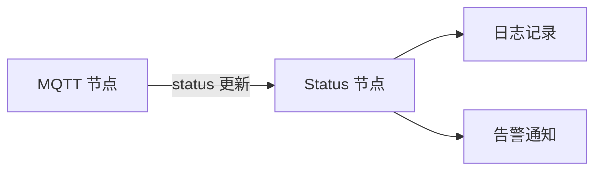
```mermaid
graph LR
    MQTT["MQTT 节点"] -->|"status 更新"| Status["Status 节点"]
    Status --> Log["日志记录"]
    Status --> Alert["告警通知"]
```

### 5.5 Hooks 机制

Hooks 是 Node-RED v1.0 引入的扩展机制，允许在消息传递的各个阶段注入自定义逻辑：

```javascript
// 注册 Hook
RED.hooks.add('onSend', function(sendEvent) {
    // sendEvent: { source, destination, msg }
    console.log('Message sent from:', sendEvent.source.id);
    // 返回 false 可阻止消息传递
});

// Hook 触发点
RED.hooks.add('preRoute', function(sendEvent) {
    // 消息路由前，可修改目标
});

RED.hooks.add('preDeliver', function(sendEvent) {
    // 消息投递前，可修改消息内容
});

RED.hooks.add('postDeliver', function(sendEvent) {
    // 消息投递后
});

RED.hooks.add('onReceive', function(receiveEvent) {
    // 节点接收消息时
});

RED.hooks.add('postReceive', function(receiveEvent) {
    // 节点处理消息后
});
```

**Hooks 的完整生命周期**：

| Hook | 触发时机 | 用途 |
|------|----------|------|
| `onSend` | 源节点调用 send() | 消息审计、限流 |
| `preRoute` | Flow 路由层确定目标前 | 动态路由 |
| `preDeliver` | 消息投递到目标节点前 | 消息修改、过滤 |
| `postDeliver` | 消息投递完成后 | 消息追踪 |
| `onReceive` | 目标节点 receive() 调用时 | 消息统计 |
| `postReceive` | 目标节点 input handler 完成后 | 性能监控 |
| `onComplete` | 节点调用 done() 时 | 错误追踪、执行时间统计 |

---

## 六、数据存储设计

### 6.1 存储文件概览

Node-RED 的持久化数据存储在 `userDir` 目录下，主要包含以下文件：

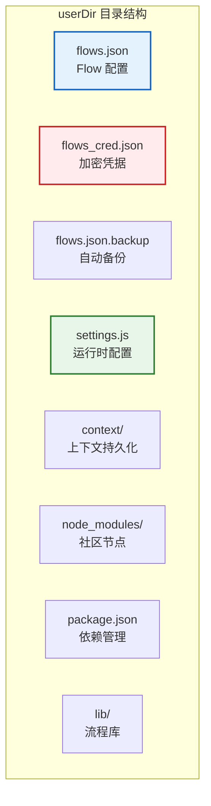
```mermaid
graph TB
    subgraph "userDir 目录结构"
        FlowsJSON["flows.json<br/>Flow 配置"]
        FlowsCred["flows_cred.json<br/>加密凭据"]
        FlowsBackup["flows.json.backup<br/>自动备份"]
        Settings["settings.js<br/>运行时配置"]
        ContextDir["context/<br/>上下文持久化"]
        NodeModules["node_modules/<br/>社区节点"]
        PackageJSON["package.json<br/>依赖管理"]
        LibDir["lib/<br/>流程库"]
    end

    style FlowsJSON fill:#e3f2fd,stroke:#1565c0,stroke-width:2px
    style FlowsCred fill:#ffebee,stroke:#c62828,stroke-width:2px
    style Settings fill:#e8f5e9,stroke:#2e7d32,stroke-width:2px
```

### 6.2 flows.json — Flow 配置

`flows.json` 存储完整的 Flow 配置，包括节点定义、连接关系和布局信息：

```json
[
    {
        "id": "e8f4a1b2",
        "type": "tab",
        "label": "IoT Data Pipeline",
        "disabled": false,
        "info": "Collect sensor data and process"
    },
    {
        "id": "a1b2c3d4",
        "type": "mqtt in",
        "z": "e8f4a1b2",
        "name": "Sensor Input",
        "topic": "sensors/+/data",
        "qos": "1",
        "broker": "f5e6d7c8",
        "x": 120,
        "y": 100,
        "wires": [["b2c3d4e5"]]
    },
    {
        "id": "b2c3d4e5",
        "type": "json",
        "z": "e8f4a1b2",
        "name": "Parse JSON",
        "property": "payload",
        "action": "",
        "pretty": false,
        "x": 310,
        "y": 100,
        "wires": [["c3d4e5f6"]]
    }
]
```

### 6.3 flows_cred.json — 加密凭据

`flows_cred.json` 存储加密后的凭据数据，与 `flows.json` 分离存储：

```json
{
    "$": "a1b2c3d4e5f6789012345678abcdef0123456789abcdef0123456789abcdef01"
}
```

**加密机制详解**：

```mermaid
graph TB
    subgraph "加密流程"
        Plain["明文凭据<br/>{username:'admin', password:'secret'}"]
        Key["加密密钥<br/>credentialSecret"]
        IV["随机 IV<br/>16字节"]
        Cipher["AES-256-CBC<br/>加密"]
        Encrypted["加密字符串<br/>Base64 编码"]
    end

    Plain --> Cipher
    Key --> Cipher
    IV --> Cipher
    Cipher --> Encrypted

    subgraph "密钥来源"
        ConfigKey["settings.js<br/>credentialSecret"]
        FallbackKey["系统生成<br/>存储在 .config.json"]
    end

    ConfigKey --> Key
    FallbackKey -->|"未配置时"| Key
```

加密流程说明：
1. 使用 `credentialSecret` 作为密钥（若未配置则自动生成并存入 `.config.json`）
2. 生成 16 字节随机 IV（初始化向量）
3. 使用 AES-256-CBC 对称加密
4. 将 IV + 密文拼接后 Base64 编码存储

**安全局限性**：
- 对称加密，密钥与密文在同一服务器上，安全性依赖服务器本身的访问控制
- 无多租户隔离，所有 Flow 共享同一加密密钥
- 无密钥轮换机制，更换密钥需要重新加密所有凭据

### 6.4 settings.js — 运行时配置

`settings.js` 是 Node-RED 的核心配置文件，导出一个 JavaScript 对象：

```javascript
module.exports = {
    // 网络配置
    uiPort: 1880,
    uiHost: "0.0.0.0",
    httpAdminRoot: "/",
    httpNodeRoot: "/",

    // 安全配置
    adminAuth: {
        type: "credentials",
        users: [{
            username: "admin",
            password: "$2a$08$...",  // bcrypt 哈希
            permissions: "*"
        }],
        default: { permissions: "read" }
    },
    https: {
        key: require("fs").readFileSync("privkey.pem"),
        cert: require("fs").readFileSync("cert.pem")
    },
    requireHttps: true,

    // 凭据加密
    credentialSecret: "my-secret-key",

    // Flow 配置
    flowFile: "flows.json",
    flowFilePretty: true,     // JSON 格式化输出

    // 节点配置
    nodesDir: "./nodes",      // 自定义节点目录
    nodesExcludes: [],         // 排除的节点模块

    // 上下文存储
    contextStorage: {
        default: "memory",
        memory: { module: "memory" },
        file: {
            module: "localfilesystem",
            config: {
                dir: "./context",
                cache: true,
                cacheTimeout: 30
            }
        }
    },

    // 日志配置
    logging: {
        console: {
            level: "info",
            metrics: false,
            audit: false
        }
    },

    // 功能限制
    functionGlobalContext: {},
    functionTimeout: 10,       // Function 节点超时（秒）
    exportGlobalContextKeys: true,
    debugMaxLength: 1000,

    // 编辑器配置
    editorTheme: {
        projects: { enabled: false },
        palette: { editable: true },
        tours: { enabled: true }
    }
};
```

### 6.5 Context Store 存储实现

Context Store 支持多种后端实现，通过统一的接口抽象：

```javascript
// Context Store 接口定义
var ContextStore = {
    // 打开存储（初始化）
    open: function() { return Promise.resolve(); },

    // 关闭存储
    close: function() { return Promise.resolve(); },

    // 获取值
    get: function(scope, key, callback) {
        // scope: "global" | flowId | nodeId
        // key: 属性名
        callback(null, value);
    },

    // 设置值
    set: function(scope, key, value, callback) {
        callback(null);
    },

    // 获取所有键
    keys: function(scope, callback) {
        callback(null, keysArray);
    },

    // 删除值
    delete: function(scope) { return Promise.resolve(); },

    // 清理（删除所有数据）
    clean: function(activeNodes) { return Promise.resolve(); }
};
```

**内存存储实现**：

```javascript
// 默认的内存存储
var memoryStore = function() {
    var data = {};
    return {
        open: function() { return Promise.resolve(); },
        get: function(scope, key, callback) {
            callback(null, data[scope] && data[scope][key]);
        },
        set: function(scope, key, value, callback) {
            data[scope] = data[scope] || {};
            data[scope][key] = value;
            callback(null);
        },
        keys: function(scope, callback) {
            callback(null, data[scope] ? Object.keys(data[scope]) : []);
        }
    };
};
```

**文件持久化存储**：

```javascript
// localfilesystem 存储的关键特性
{
    module: "localfilesystem",
    config: {
        dir: "./context",       // 存储目录
        base: "context",        // 文件名前缀
        cache: true,            // 内存缓存
        cacheTimeout: 30,       // 缓存超时（秒）
        flushInterval: 30       // 刷盘间隔（秒）
    }
}
// 文件结构：
// context/
//   global/
//     context.json            // global 作用域
//   <flow-id>/
//     context.json            // flow 作用域
//   <node-id>/
//     context.json            // node 作用域
```

---

## 七、API 设计

### 7.1 Admin HTTP API

Admin API 是编辑器与 Runtime 之间的主要通信接口，基于 Express 路由实现：

```mermaid
graph TB
    subgraph "Admin API 路由"
        Flows["/flows<br/>Flow 配置 CRUD"]
        Nodes["/nodes<br/>节点管理"]
        Settings["/settings<br/>运行时设置"]
        Creds["/credentials<br/>凭据管理"]
        Comms["/comms<br/>WebSocket"]
    end

    subgraph "HTTP 方法"
        GET["GET"]
        POST["POST"]
        PUT["PUT"]
        DELETE["DELETE"]
    end

    GET --> Flows
    GET --> Nodes
    GET --> Settings
    POST --> Flows
    POST --> Nodes
    POST --> Creds
    PUT --> Flows
    PUT --> Nodes
    DELETE --> Nodes
    Comms -->|"ws://"| WS["WebSocket 连接"]
```

### 7.2 核心 API 端点

**Flow 管理 API**：

| 方法 | 路径 | 说明 | v2 请求体 |
|------|------|------|-----------|
| GET | `/flows` | 获取所有 Flow 配置 | - |
| POST | `/flows` | 保存所有 Flow 配置 | `{ flows: [...], credentials: {...} }` |
| GET | `/flow/:id` | 获取指定 Flow | - |
| POST | `/flow` | 创建新 Flow | `{ label, nodes, configs }` |
| PUT | `/flow/:id` | 更新指定 Flow | `{ label, nodes, configs }` |
| DELETE | `/flow/:id` | 删除指定 Flow | - |

**节点管理 API**：

| 方法 | 路径 | 说明 |
|------|------|------|
| GET | `/nodes` | 获取所有已安装节点列表 |
| POST | `/nodes` | 安装节点包（npm install） |
| GET | `/nodes/:module` | 获取指定模块信息 |
| PUT | `/nodes/:module` | 启用/禁用节点模块 |
| DELETE | `/nodes/:module` | 卸载节点包（npm uninstall） |
| GET | `/nodes/:module/:type` | 获取指定节点类型信息 |

**凭据管理 API**：

| 方法 | 路径 | 说明 |
|------|------|------|
| GET | `/credentials/:type/:id` | 获取节点凭据（仅返回 has_ 布尔值） |
| POST | `/credentials/:type/:id` | 更新节点凭据 |

**API 使用示例**：

```bash
# 获取所有 Flow
curl -H "Node-RED-API-Version: v2" \
     -H "Authorization: Bearer <token>" \
     http://localhost:1880/flows

# 保存 Flow 配置
curl -X POST \
     -H "Content-Type: application/json" \
     -H "Node-RED-API-Version: v2" \
     -d '{"flows":[...], "rev":"abc123"}' \
     http://localhost:1880/flows

# 安装社区节点
curl -X POST \
     -H "Content-Type: application/json" \
     -d '{"module":"node-red-contrib-mqtt"}' \
     http://localhost:1880/nodes

# 启用节点模块
curl -X PUT \
     -H "Content-Type: application/json" \
     -d '{"enabled":true}' \
     http://localhost:1880/nodes/node-red-contrib-mqtt
```

### 7.3 HTTP Node — 节点内置 HTTP 端点

除了 Admin API，Node-RED 还通过 HTTP Node 提供用户自定义的 HTTP 端点：

```mermaid
graph LR
    Client["HTTP 客户端"] -->|"GET /api/data"| HTTPIn["HTTP In 节点<br/>/api/data"]
    HTTPIn --> Function["Function 节点<br/>处理请求"]
    Function --> HTTPOut["HTTP Response 节点"]
    HTTPOut -->|"JSON 响应"| Client
```

HTTP Node 的路由挂载在 `httpNodeRoot` 路径下：

```javascript
// settings.js 配置
{
    httpNodeRoot: "/api",    // HTTP Node 的根路径
    httpNodeCors: {          // CORS 配置
        origin: "*",
        methods: "GET,POST,PUT,DELETE"
    },
    httpNodeAuth: {          // HTTP Node 认证
        type: "basic",
        users: [...]
    }
}
```

### 7.4 WebSocket comms — 实时状态推送

WebSocket comms 通道负责将 Runtime 的事件实时推送到编辑器：

```javascript
// comms WebSocket 消息格式
{
    "topic": "status",       // 消息类型
    "data": {                // 消息数据
        "id": "node-id",
        "status": {
            "fill": "green",
            "shape": "dot",
            "text": "connected"
        }
    }
}

// 消息类型
// status    - 节点状态变化
// debug     - Debug 节点输出
// notify    - 系统通知
// runtime-state - Runtime 状态变化（启动/停止）
// node/added    - 新节点安装
// node/removed  - 节点卸载
```

```mermaid
sequenceDiagram
    participant Runtime as Runtime
    participant Comms as comms WebSocket
    participant Editor as Editor

    Runtime->>Comms: 节点状态变化
    Comms->>Editor: {topic:"status", data:{...}}
    Editor->>Editor: 更新节点状态图标

    Runtime->>Comms: Debug 输出
    Comms->>Editor: {topic:"debug", data:{...}}
    Editor->>Editor: 在 Debug 面板显示

    Runtime->>Comms: Runtime 状态变化
    Comms->>Editor: {topic:"runtime-state", data:{...}}
    Editor->>Editor: 显示重启提示
```

---

## 八、对 open-app 的架构设计参考

### 8.1 HTML+JS 配对定义 → Java+JS 映射

Node-RED 的 HTML+JS 配对定义模式是连接器平台设计的核心参考。在 open-app 中，可以将其映射为 **Java 运行时 + JSON Schema 编辑器元数据** 的配对模式：

```mermaid
graph TB
    subgraph "Node-RED 模式"
        NR_HTML["node.html<br/>编辑器注册 + 模板 + 帮助"]
        NR_JS["node.js<br/>运行时逻辑"]
    end

    subgraph "open-app 映射模式"
        OA_SCHEMA["JSON Schema<br/>编辑器元数据定义"]
        OA_JAVA["Java Class<br/>运行时逻辑"]
        OA_UI["React/Vue 表单<br/>基于 Schema 自动渲染"]
    end

    NR_HTML -->|"映射"| OA_SCHEMA
    NR_JS -->|"映射"| OA_JAVA
    OA_SCHEMA --> OA_UI

    style NR_HTML fill:#e3f2fd,stroke:#1565c0
    style NR_JS fill:#fff3e0,stroke:#e65100
    style OA_SCHEMA fill:#e8f5e9,stroke:#2e7d32
    style OA_JAVA fill:#f3e5f5,stroke:#6a1b9a
```

**映射对照表**：

| Node-RED | open-app 映射 | 优势 |
|----------|---------------|------|
| `node.html` (registerType) | JSON Schema 定义节点元数据 | 结构化、可验证、可自动生成 UI |
| `node.html` (edit template) | React/Vue 动态表单（基于 Schema） | 现代化 UI 框架，组件化 |
| `node.html` (help text) | Markdown 文档 + 自动生成 | 标准文档格式 |
| `node.js` (constructor) | Java `@NodeDef` 注解 + 构造函数 | 类型安全、编译期检查 |
| `node.js` (on input) | Java `@InputHandler` 方法 | 类型安全、异步支持 |
| `node.js` (on close) | Java `@PreDestroy` / `AutoCloseable` | 标准生命周期管理 |
| `defaults` | JSON Schema `properties` | 标准验证规则、可扩展 |
| `credentials` | 加密属性 + Vault 集成 | 企业级安全 |
| `wires` | Flow DAG 边定义 | 类型安全的连接定义 |

**open-app 节点定义示例**：

```java
// Java 运行时定义
@NodeDef(
    type = "http-request",
    category = "network",
    name = "HTTP Request",
    icon = "globe",
    inputs = 1,
    outputs = 2,
    outputLabels = {"response", "error"},
    schema = "http-request.schema.json"  // 关联的 JSON Schema
)
public class HttpRequestNode extends AbstractNode {

    @NodeProperty(defaultValue = "GET")
    private String method;

    @NodeProperty(required = true)
    private String url;

    @NodeProperty(defaultValue = "30")
    private int timeout;

    @Credential(type = CredentialType.PASSWORD)
    private String authToken;

    @InputHandler
    public void onInput(Message msg, SendFunction send, DoneFunction done) {
        try {
            HttpResponse response = httpClient.execute(
                method, url, msg.getPayload(), timeout
            );
            msg.setPayload(response.getBody());
            send.send(msg);  // 输出端口 1
            done.done();
        } catch (Exception e) {
            Message errorMsg = Message.clone(msg);
            errorMsg.setPayload(e.getMessage());
            send.send(new Message[]{null, errorMsg});  // 输出端口 2
            done.done(e);
        }
    }

    @Override
    public void onClose(boolean removed) {
        httpClient.close();
    }
}
```

```json
{
    "$schema": "http://json-schema.org/draft-07/schema#",
    "title": "HTTP Request Node",
    "type": "object",
    "properties": {
        "method": {
            "type": "string",
            "enum": ["GET", "POST", "PUT", "DELETE", "PATCH"],
            "default": "GET",
            "description": "HTTP method"
        },
        "url": {
            "type": "string",
            "format": "uri",
            "description": "Request URL"
        },
        "timeout": {
            "type": "integer",
            "minimum": 1,
            "maximum": 300,
            "default": 30,
            "description": "Timeout in seconds"
        },
        "authToken": {
            "type": "string",
            "x-credential": true,
            "description": "Authentication token"
        }
    },
    "required": ["url"],
    "ui": {
        "method": { "widget": "select" },
        "url": { "widget": "input", "placeholder": "https://api.example.com" },
        "timeout": { "widget": "spinner", "min": 1, "max": 300 },
        "authToken": { "widget": "password" }
    }
}
```

### 8.2 Flow JSON 格式 → open-app Flow 数据模型

Node-RED 的 Flow JSON 格式可以演化为 open-app 的 Flow 数据模型，增加类型安全和版本管理：

```mermaid
graph TB
    subgraph "Node-RED Flow JSON"
        NR_Flow["扁平 JSON 数组<br/>无版本号<br/>无类型校验"]
    end

    subgraph "open-app Flow Model"
        OA_Flow["结构化 Flow 对象<br/>版本号 + Schema<br/>类型校验 + 加密"]
        OA_Version["版本管理<br/>Git-friendly"]
        OA_Validate["Schema 校验<br/>编译期检查"]
    end

    NR_Flow -->|"演化"| OA_Flow
    OA_Flow --> OA_Version
    OA_Flow --> OA_Validate
```

**open-app Flow 数据模型草案**：

```json
{
    "$schema": "open-app-flow/v1",
    "version": "1.0.0",
    "id": "flow-uuid-1",
    "name": "Data Pipeline",
    "description": "ETL pipeline for sensor data",
    "metadata": {
        "createdAt": "2026-01-01T00:00:00Z",
        "updatedAt": "2026-05-15T00:00:00Z",
        "author": "admin",
        "tags": ["etl", "sensor"]
    },
    "nodes": [
        {
            "id": "node-1",
            "type": "http-request",
            "name": "Fetch API Data",
            "position": { "x": 100, "y": 200 },
            "properties": {
                "method": "GET",
                "url": "https://api.example.com/data",
                "timeout": 30
            },
            "credentials": {
                "authToken": "enc:abc123..."
            },
            "outputs": [
                { "id": "out-1", "label": "response", "targets": ["node-2"] },
                { "id": "out-2", "label": "error", "targets": ["node-3"] }
            ]
        }
    ],
    "variables": {
        "API_BASE_URL": "https://api.example.com"
    }
}
```

### 8.3 消息传递机制 → 事件驱动架构

Node-RED 的消息传递机制可以映射为 open-app 的事件驱动架构：

```mermaid
graph TB
    subgraph "Node-RED 消息传递"
        NR_Send["node.send(msg)"]
        NR_Flow["Flow 路由层"]
        NR_Hook["Hooks 链"]
        NR_Recv["target.receive(msg)"]
    end

    subgraph "open-app 事件驱动"
        OA_Emit["EventEmitter.emit(event)"]
        OA_Bus["EventBus<br/>同步/异步"]
        OA_Middleware["Middleware 链"]
        OA_Handler["@InputHandler"]
    end

    NR_Send -->|"映射"| OA_Emit
    NR_Flow -->|"映射"| OA_Bus
    NR_Hook -->|"映射"| OA_Middleware
    NR_Recv -->|"映射"| OA_Handler
```

**open-app 事件总线设计参考**：

```java
// 事件总线接口
public interface FlowEventBus {
    // 同步发送（同一线程内）
    void emit(Node source, int port, Message msg);

    // 异步发送（线程池投递）
    CompletableFuture<Void> emitAsync(Node source, int port, Message msg);

    // 注册中间件（对应 Node-RED Hooks）
    void addMiddleware(FlowMiddleware middleware);

    // 注册事件处理器
    void on(String eventType, MessageHandler handler);
}

// 中间件接口（对应 Node-RED Hooks）
public interface FlowMiddleware {
    // 消息发送前
    default boolean onSend(SendEvent event) { return true; }
    // 消息路由前
    default boolean preRoute(SendEvent event) { return true; }
    // 消息投递前
    default boolean preDeliver(DeliverEvent event) { return true; }
    // 消息投递后
    default void postDeliver(DeliverEvent event) {}
    // 消息接收时
    default void onReceive(ReceiveEvent event) {}
    // 消息处理后
    default void postReceive(ReceiveEvent event) {}
}
```

### 8.4 可借鉴的设计

| 借鉴点 | Node-RED 实现 | open-app 适配建议 |
|--------|---------------|-------------------|
| **轻量灵活** | 单进程、低资源占用、快速启动 | 微服务模式下保持轻量，支持冷启动 |
| **可嵌入** | npm 模块嵌入 Express | 提供 SDK，可嵌入 Spring Boot 应用 |
| **社区生态** | `node-red-contrib-*` + npm | 插件市场 + Maven/Gradle 仓库 |
| **npm 包即节点** | 安装 npm 包即可使用 | JAR 包即连接器，Maven 坐标即安装 |
| **Palette 管理器** | 编辑器内安装/卸载节点 | Web 控制台内管理连接器 |
| **可视化编排** | 拖拽式 Flow 编辑器 | React Flow + 现代化编辑器 |
| **消息驱动** | msg 对象 + send/done 模式 | 事件驱动 + Message 对象 |
| **Hooks 机制** | 消息传递各阶段的钩子 | 中间件链 + AOP |
| **Config Node** | 共享配置节点模式 | 连接配置复用 + 连接池 |
| **Subflow** | 可复用流程片段 | 子流程模板 + 版本管理 |

### 8.5 需要规避的问题

| 问题 | Node-RED 现状 | open-app 改进方向 |
|------|---------------|-------------------|
| **安全性不足** | 无沙箱隔离，Function 节点可执行任意代码 | 沙箱执行、代码审计、权限控制 |
| **无多租户** | 单用户模式，无租户隔离 | 多租户架构，Flow/数据/凭据租户隔离 |
| **前端技术老旧** | 原生 JS + jQuery，无组件化 | React/Vue + TypeScript，组件化架构 |
| **凭据加密简单** | 对称加密，密钥同服务器 | Vault/KMS 集成，非对称加密，密钥轮换 |
| **无版本管理** | Flow 配置无版本号 | Flow 版本管理 + Git 集成 |
| **无并发控制** | 单线程执行，无并发管理 | 线程池 + 背压 + 流量控制 |
| **无集群支持** | 单实例部署 | 集群模式 + 消息队列（Kafka/RabbitMQ） |
| **无审计日志** | 仅运行日志，无操作审计 | 完整审计链路：操作日志 + 数据血缘 |
| **调试能力有限** | Debug 节点 + 日志 | 断点调试 + 链路追踪 + 性能分析 |
| **测试支持弱** | 无内置测试框架 | 单元测试 + 集成测试 + 模拟节点 |

### 8.6 架构对比总结

```mermaid
graph TB
    subgraph "Node-RED 架构"
        direction TB
        NR_E["Editor<br/>原生JS+jQuery+SVG"]
        NR_R["Runtime<br/>Node.js 单进程"]
        NR_S["Storage<br/>JSON 文件"]
        NR_E --- NR_R --- NR_S
    end

    subgraph "open-app 目标架构"
        direction TB
        OA_E["Editor<br/>React+TypeScript+ReactFlow"]
        OA_R["Runtime<br/>Java/Spring Boot + 集群"]
        OA_S["Storage<br/>数据库 + Vault + Git"]
        OA_MQ["Message Queue<br/>Kafka/RabbitMQ"]
        OA_E --- OA_R --- OA_S
        OA_R --- OA_MQ
    end

    NR_E -.->|"升级"| OA_E
    NR_R -.->|"升级"| OA_R
    NR_S -.->|"升级"| OA_S

    style NR_E fill:#ffcdd2,stroke:#c62828,stroke-width:1px
    style NR_R fill:#ffcdd2,stroke:#c62828,stroke-width:1px
    style NR_S fill:#ffcdd2,stroke:#c62828,stroke-width:1px
    style OA_E fill:#c8e6c9,stroke:#2e7d32,stroke-width:2px
    style OA_R fill:#c8e6c9,stroke:#2e7d32,stroke-width:2px
    style OA_S fill:#c8e6c9,stroke:#2e7d32,stroke-width:2px
    style OA_MQ fill:#e1bee7,stroke:#6a1b9a,stroke-width:2px
```

**核心结论**：

1. **Node-RED 的 HTML+JS 配对定义模式** 值得借鉴，但 open-app 应采用 Java + JSON Schema 的配对方式，实现类型安全和编译期检查
2. **Flow JSON 数据格式** 是优秀的轻量级流程定义格式，open-app 可在其基础上增加版本管理、类型校验和加密支持
3. **消息传递的 Hooks 机制** 设计优雅，open-app 可映射为中间件链，并增加背压、限流等企业级能力
4. **社区生态的 npm 包即节点模式** 极大降低了节点开发门槛，open-app 可通过 JAR 包即连接器实现类似体验
5. **Node-RED 的安全性和多租户缺失** 是最大短板，open-app 必须从架构层面解决这些问题，不能简单照搬

---

> **文档版本**: v1.0  
> **最后更新**: 2026-05-15  
> **作者**: open-app 技术团队
