# n8n 技术架构调研报告

> 面向 open-app 连接器平台建设的技术参考
> 版本：基于 n8n v2.21.0
> 调研日期：2026-05-15

---

## 一、技术架构总览

### 1.1 整体架构图

n8n 采用经典的分层架构，前端 SPA 与后端服务通过 REST API 通信，后端基于 Express 5.x 构建，核心逻辑封装在 n8n-workflow 和 n8n-core 两个包中，数据持久化依赖 PostgreSQL（或 SQLite）+ Redis，异步任务通过 Bull Queue 分发至 Worker 进程执行。

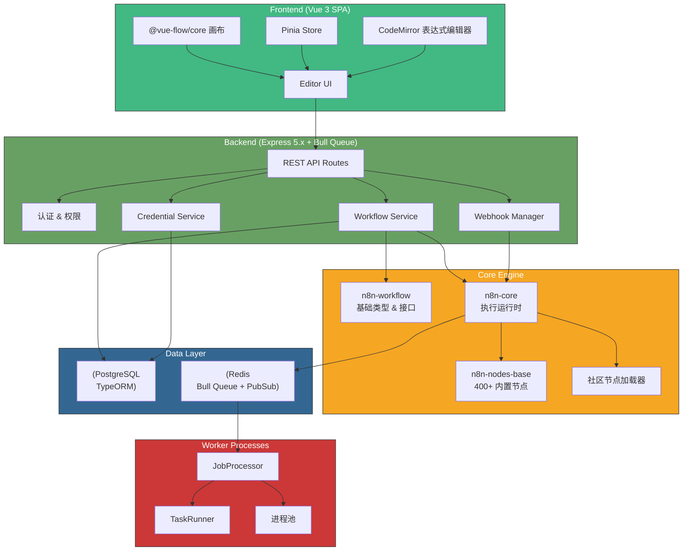
```mermaid
graph TB
    subgraph Frontend["Frontend (Vue 3 SPA)"]
        UI[Editor UI]
        VF["@vue-flow/core 画布"]
        Pinia[Pinia Store]
        CM[CodeMirror 表达式编辑器]
    end

    subgraph Backend["Backend (Express 5.x + Bull Queue)"]
        API[REST API Routes]
        Auth["认证 & 权限"]
        WH[Webhook Manager]
        WF[Workflow Service]
        Cred[Credential Service]
    end

    subgraph Core["Core Engine"]
        NW["n8n-workflow<br/>基础类型 & 接口"]
        NC["n8n-core<br/>执行运行时"]
        NB["n8n-nodes-base<br/>400+ 内置节点"]
        CN["社区节点加载器"]
    end

    subgraph Data["Data Layer"]
        PG["(PostgreSQL<br/>TypeORM)"]
        RD["(Redis<br/>Bull Queue + PubSub)"]
    end

    subgraph Worker["Worker Processes"]
        JP[JobProcessor]
        TR[TaskRunner]
        Pool["进程池"]
    end

    UI --> API
    VF --> UI
    Pinia --> UI
    CM --> UI
    API --> Auth
    API --> WH
    API --> WF
    API --> Cred
    WF --> NW
    WF --> NC
    NC --> NB
    NC --> CN
    WF --> PG
    Cred --> PG
    NC --> RD
    RD --> JP
    JP --> TR
    JP --> Pool
    WH --> NC

    style Frontend fill:#42b883,stroke:#333,color:#fff
    style Backend fill:#68a063,stroke:#333,color:#fff
    style Core fill:#f5a623,stroke:#333,color:#fff
    style Data fill:#336791,stroke:#333,color:#fff
    style Worker fill:#cb3837,stroke:#333,color:#fff
```

### 1.2 核心包职责

| 包名 | 职责 | 关键导出 |
|------|------|----------|
| `n8n-workflow` | 基础类型与接口定义 | `INodeType`, `INodeTypeDescription`, `IExecuteFunctions`, `INodeExecutionData`, `ICredentialType` |
| `n8n-core` | 执行运行时引擎 | `WorkflowExecutor`, `Workflow`, `NodeExecuteFunctions` |
| `n8n-nodes-base` | 400+ 内置节点实现 | 各种 Trigger / Action 节点 |
| `packages/cli` | 主服务入口 | Express Server, Bull Queue, Webhook Server, CLI 命令 |
| `@n8n/db` | 数据库访问层 | TypeORM Entities, Migrations, Repositories |
| `editor-ui` | 前端编辑器 | Vue 3 SPA, @vue-flow/core 画布 |

### 1.3 多实例部署架构

n8n 支持水平扩展，采用 Main + Worker 模式，通过 Redis（Bull Queue + Pub/Sub）实现进程间通信：

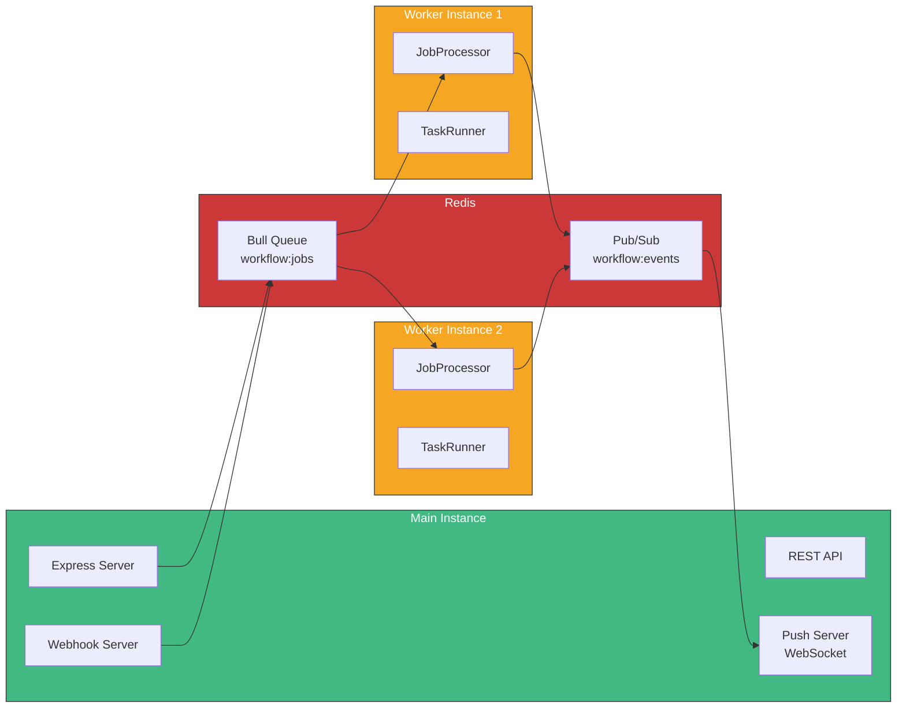
```mermaid
graph LR
    subgraph MainInstance["Main Instance"]
        MExpress[Express Server]
        MWebhook[Webhook Server]
        MAPI[REST API]
        MPush["Push Server<br/>WebSocket"]
    end

    subgraph Redis["Redis"]
        BQ["Bull Queue<br/>workflow:jobs"]
        PS["Pub/Sub<br/>workflow:events"]
    end

    subgraph Worker1["Worker Instance 1"]
        W1JP[JobProcessor]
        W1TR[TaskRunner]
    end

    subgraph Worker2["Worker Instance 2"]
        W2JP[JobProcessor]
        W2TR[TaskRunner]
    end

    MExpress --> BQ
    MWebhook --> BQ
    BQ --> W1JP
    BQ --> W2JP
    W1JP --> PS
    W2JP --> PS
    PS --> MPush

    style MainInstance fill:#42b883,stroke:#333,color:#fff
    style Redis fill:#cb3837,stroke:#333,color:#fff
    style Worker1 fill:#f5a623,stroke:#333,color:#fff
    style Worker2 fill:#f5a623,stroke:#333,color:#fff
```

**启动命令**：

```bash
# Main 模式（API + Webhook + Push）
n8n start

# Worker 模式（仅执行任务）
n8n worker

# Webhook 模式（仅处理 Webhook 回调）
n8n webhook
```

**通信机制**：
- **Bull Queue**：Main 将 Workflow 执行任务推入 `workflow:jobs` 队列，Worker 竞争消费
- **Redis Pub/Sub**：Worker 执行完成后通过 `workflow:events` 频道推送事件，Main 收到后通过 WebSocket 通知前端
- **配置示例**：

```typescript
// packages/cli/src/Queue.ts
const queue = new Queue('workflow:jobs', {
  redis: {
    host: config.get('redis.host'),
    port: config.get('redis.port'),
    password: config.get('redis.password'),
  },
  defaultJobOptions: {
    removeOnComplete: 100,
    removeOnFail: 500,
    attempts: 3,
    backoff: { type: 'exponential', delay: 1000 },
  },
});
```

**Worker 进程模型**：

n8n Worker 采用 Bull Queue 的 JobProcessor 模式，每个 Worker 进程包含以下组件：

1. **JobProcessor**：从 Bull Queue 消费执行任务，负责 Workflow 的调度和监控
2. **TaskRunner**：实际执行节点逻辑的运行时，支持沙箱隔离（v2.x 新增）
3. **进程池**：对于 CPU 密集型任务，Worker 可启动子进程执行，避免阻塞主循环

```typescript
// packages/cli/src/Worker.ts（简化）
class WorkerProcess {
  private queue: BullQueue;
  private taskRunner: TaskRunner;

  async start() {
    this.queue = new Queue('workflow:jobs', this.redisConfig);
    this.queue.process(async (job) => {
      const { workflowId, executionId } = job.data;
      const workflow = await this.workflowRepository.getById(workflowId);
      const executor = new WorkflowExecutor(workflow, this.taskRunner);
      return await executor.run(executionId);
    });
  }
}
```

---

## 二、节点（Node/Connector）技术实现

> **这是本报告的核心章节**。n8n 的节点系统是其最精妙的设计之一，理解其接口定义、生命周期和扩展机制，对 open-app 连接器平台建设具有直接指导意义。

### 2.1 INodeType 接口定义

```typescript
// n8n-workflow/src/Interfaces.ts

/**
 * 节点类型接口 - 所有节点的顶层契约
 * 一个节点必须实现 description 属性，
 * 并根据节点类型选择性实现 execute / trigger / webhook 等方法
 */
export interface INodeType {
  /** 节点描述信息 - 定义节点的元数据、参数、凭证等 */
  description: INodeTypeDescription;

  /** 常规执行方法 - Action 节点实现此方法，返回执行结果数据 */
  execute?(this: IExecuteFunctions): Promise<INodeExecutionData[][]>;

  /** Trigger 执行方法 - 工作流激活时调用，持续运行直到停用 */
  trigger?(this: ITriggerFunctions): Promise<ITriggerResponse>;

  /** Poll 方法 - 轮询触发器使用，定期检查新数据 */
  poll?(this: IPollFunctions): Promise<INodeExecutionData[][]>;

  /** Webhook 方法 - 处理外部 HTTP 回调 */
  webhook?(this: IWebhookFunctions): Promise<IWebhookResponseData>;

  /** 节点方法 - 提供 UI 辅助方法（动态加载选项、资源选择器等） */
  methods?: {
    loadOptions?: INodeMethods;
    resourceMapping?: INodeMethods;
    listSearch?: INodeMethods;
  };
}
```

### 2.2 INodeTypeDescription 完整 Schema

这是节点定义的核心元数据结构，定义了节点在 UI 中如何呈现、需要哪些参数、支持哪些凭证等：

```typescript
// n8n-workflow/src/Interfaces.ts

export interface INodeTypeDescription {
  // ========== 基础展示信息 ==========
  /** 节点在 UI 中显示的名称，如 "HTTP Request" */
  displayName: string;
  /** 节点的唯一标识名，如 "n8n-nodes-base.httpRequest" */
  name: string;
  /** 节点图标 (FontAwesome 图标名或 SVG data URI) */
  icon?: string;
  /** 节点图标 URL (用于品牌 Logo) */
  iconUrl?: string;
  /** 节点版本号，支持同一节点多版本共存 */
  version: number | number[];
  /** 节点描述文本 */
  description: string;
  /** 节点分组标签，如 ["transform", "action"] */
  group: string[];

  // ========== 参数定义 ==========
  /** 节点参数列表 - 驱动 UI 动态表单渲染，每个参数对应一个表单控件 */
  properties: INodeProperties[];

  // ========== 凭证定义 ==========
  /** 所需凭证类型列表，一个节点可要求多种凭证 */
  credentials?: ICredentialType[];

  // ========== 输入输出定义 ==========
  /** 输入连接定义 */
  inputs: INodeInputConfiguration[];
  /** 输出连接定义 */
  outputs: INodeOutputConfiguration[];

  // ========== Webhook 定义 ==========
  /** Webhook 路径定义，仅 Webhook Trigger 节点需要 */
  webhooks?: IWebhookDescription[];

  // ========== UI 行为控制 ==========
  subtitle?: string;          // 子分类标签
  hidden?: boolean;           // 是否在节点面板中隐藏
  isTrigger?: boolean;        // 是否为 Trigger 节点
  color?: string;             // 默认颜色
  documentationUrl?: string;  // 文档 URL
}
```


### 2.3 Trigger Node vs Regular Node

n8n 将节点分为两大类：**Trigger 节点**（工作流入口）和 **Regular 节点**（数据处理/转换/输出）。两者在接口实现和生命周期上有本质区别：

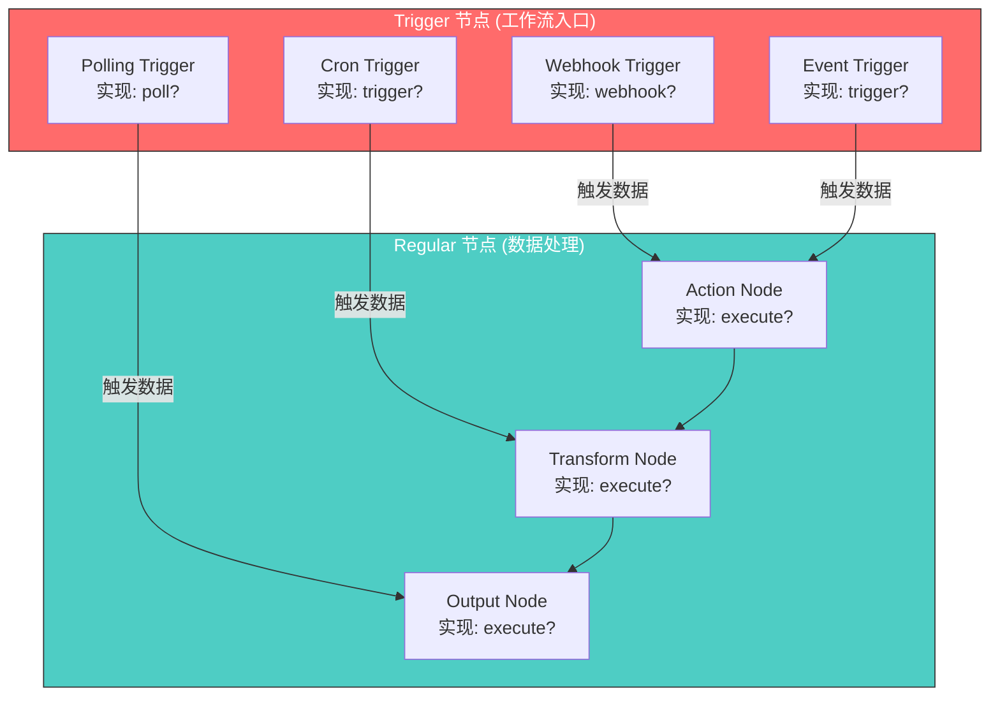
```mermaid
graph TD
    subgraph TriggerNodes["Trigger 节点 (工作流入口)"]
        WH["Webhook Trigger<br/>实现: webhook?"]
        CRON["Cron Trigger<br/>实现: trigger?"]
        POLL["Polling Trigger<br/>实现: poll?"]
        EVT["Event Trigger<br/>实现: trigger?"]
    end

    subgraph RegularNodes["Regular 节点 (数据处理)"]
        ACT["Action Node<br/>实现: execute?"]
        TRN["Transform Node<br/>实现: execute?"]
        OUT["Output Node<br/>实现: execute?"]
    end

    WH --> |"触发数据"| ACT
    CRON --> |"触发数据"| TRN
    POLL --> |"触发数据"| OUT
    EVT --> |"触发数据"| ACT
    ACT --> TRN
    TRN --> OUT

    style TriggerNodes fill:#ff6b6b,stroke:#333,color:#fff
    style RegularNodes fill:#4ecdc4,stroke:#333,color:#fff
```

**关键区别**：

| 特性 | Trigger Node | Regular Node |
|------|-------------|--------------|
| 主要方法 | `trigger?` / `webhook?` / `poll?` | `execute?` |
| 调用时机 | 工作流激活时启动，持续运行 | 被上游数据触发执行 |
| 返回类型 | `ITriggerResponse` (含停止回调) | `INodeExecutionData[][]` |
| 输入连接 | 无 (工作流入口) | 有 |
| 输出连接 | 有 | 有 |
| 实例化 | 激活时创建，停用时销毁 | 执行时创建，执行完销毁 |

**Trigger 节点实现示例（Cron 定时触发）**：

```typescript
// n8n-nodes-base/nodes/Cron/Cron.node.ts
export class Cron implements INodeType {
  description: INodeTypeDescription = {
    displayName: 'Schedule Trigger',
    name: 'n8n-nodes-base.scheduleTrigger',
    group: ['trigger'],
    version: 1.1,
    description: 'Triggers the workflow at specified times',
    inputs: [],
    outputs: [NodeConnectionTypes.Main],
    properties: [
      {
        displayName: 'Rule',
        name: 'rule',
        type: 'collection',
        default: {},
        options: [
          { name: 'interval', displayName: 'Every' },
          { name: 'cron', displayName: 'Cron' },
        ],
      },
    ],
  };

  async trigger(this: ITriggerFunctions): Promise<ITriggerResponse> {
    const rule = this.getNodeParameter('rule') as ICollectionParameterData;
    const interval = rule.interval as number;

    const timeout = setInterval(async () => {
      const now = new Date();
      this.emit([
        [{ json: { timestamp: now.toISOString(), date: now.toDateString() } }],
      ]);
    }, interval * 1000);

    return {
      closeFunction: async () => { clearInterval(timeout); },
    };
  }
}
```


### 2.4 Webhook Trigger 实现

Webhook 是 n8n 最常用的触发方式，其实现涉及路径注册、认证、生命周期管理等：

```typescript
// IWebhookDescription 接口
export interface IWebhookDescription {
  /** Webhook 路径，如 "workflow/{workflowId}/webhook" */
  path: string;
  /** HTTP 方法 */
  method: 'GET' | 'POST' | 'PUT' | 'DELETE' | 'PATCH';
  /** 认证方式 */
  authentication?: WebhookAuthenticationType;
  /** Webhook 生命周期方法 */
  webhookMethods?: {
    /** 工作流激活时调用 - 用于注册 Webhook */
    onCreate?: IWebhookMethod;
    /** 工作流停用时调用 - 用于注销 Webhook */
    onDelete?: IWebhookMethod;
  };
  /** 响应模式 */
  responseMode?: 'onReceived' | 'lastNode' | 'responseNode';
  /** 重试策略 */
  retryPolicy?: {
    maxRetries: number;
    waitBetweenRetries: number;
  };
}
```

**Webhook 生命周期流程**：

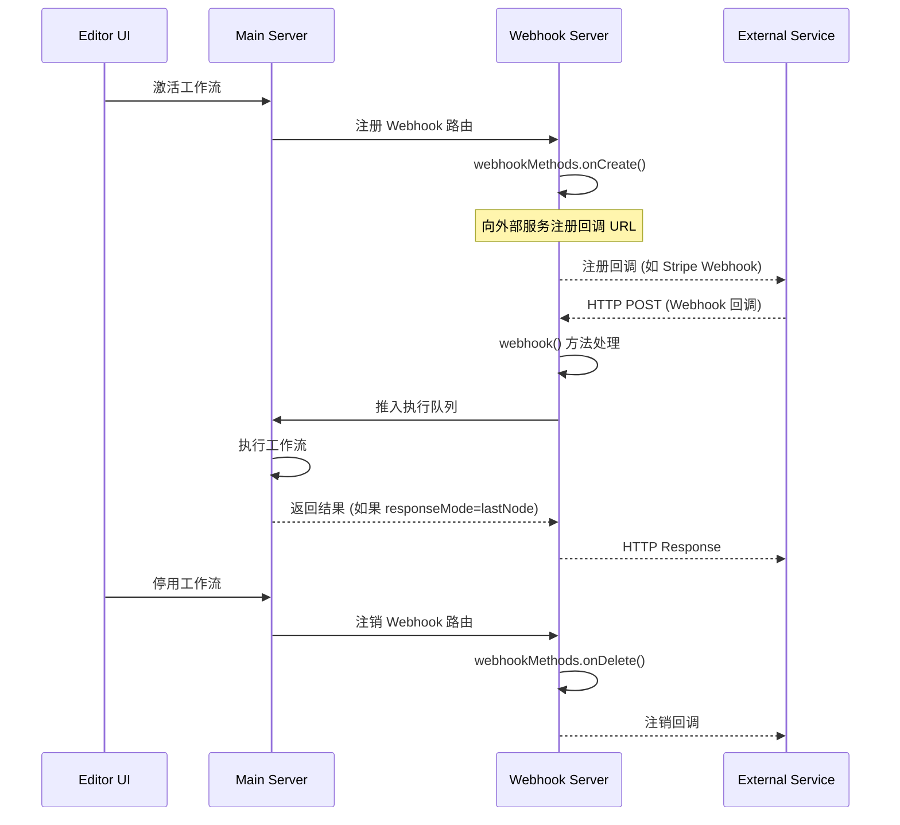
```mermaid
sequenceDiagram
    participant UI as Editor UI
    participant Main as Main Server
    participant WH as Webhook Server
    participant Ext as External Service

    UI->>Main: 激活工作流
    Main->>WH: 注册 Webhook 路由
    WH->>WH: webhookMethods.onCreate()
    Note over WH: 向外部服务注册回调 URL
    WH-->>Ext: 注册回调 (如 Stripe Webhook)

    Ext-->>WH: HTTP POST (Webhook 回调)
    WH->>WH: webhook() 方法处理
    WH->>Main: 推入执行队列
    Main->>Main: 执行工作流
    Main-->>WH: 返回结果 (如果 responseMode=lastNode)
    WH-->>Ext: HTTP Response

    UI->>Main: 停用工作流
    Main->>WH: 注销 Webhook 路由
    WH->>WH: webhookMethods.onDelete()
    WH-->>Ext: 注销回调
```

**Webhook 节点实现示例**：

```typescript
export class Webhook implements INodeType {
  description: INodeTypeDescription = {
    displayName: 'Webhook',
    name: 'n8n-nodes-base.webhook',
    group: ['trigger'],
    version: 2,
    inputs: [],
    outputs: [NodeConnectionTypes.Main],
    webhooks: [
      { name: 'default', httpMethod: 'POST', path: 'webhook', responseMode: 'onReceived' },
    ],
    properties: [
      {
        displayName: 'HTTP Method',
        name: 'httpMethod',
        type: 'options',
        options: [
          { name: 'GET', value: 'GET' },
          { name: 'POST', value: 'POST' },
          { name: 'PUT', value: 'PUT' },
        ],
        default: 'GET',
      },
      {
        displayName: 'Authentication',
        name: 'authentication',
        type: 'options',
        options: [
          { name: 'None', value: 'none' },
          { name: 'Header Auth', value: 'headerAuth' },
          { name: 'Basic Auth', value: 'basicAuth' },
        ],
        default: 'none',
      },
    ],
  };

  async webhook(this: IWebhookFunctions): Promise<IWebhookResponseData> {
    const req = this.getRequestObject();
    return {
      workflowData: [[{ json: { body: req.body, headers: req.headers, query: req.query } }]],
    };
  }
}
```


### 2.5 Credential 定义

n8n 的凭证系统支持继承和自动认证，是连接器平台安全模型的重要参考：

```typescript
// ICredentialType 接口
export interface ICredentialType {
  /** 凭证名称，如 "httpBasicAuth" */
  name: string;
  /** 显示名称，如 "HTTP Basic Auth" */
  displayName: string;
  /** 凭证属性列表 - 定义需要用户填写的字段 */
  properties: INodeProperties[];
  /** 继承的父凭证类型 - 支持凭证继承链 */
  extends?: ICredentialType[];
  /** 认证方式 - 用于自动注入请求头/参数 */
  authenticate?: IAuthenticate;
  /** 凭证所属的节点 */
  parent?: string;
}
```

**凭证继承示例**：

```typescript
// OAuth2 凭证定义（基类）
export class OAuth2Api implements ICredentialType {
  name = 'oAuth2Api';
  displayName = 'OAuth2 API';
  properties: INodeProperties[] = [
    { displayName: 'Client ID', name: 'clientId', type: 'string' },
    { displayName: 'Client Secret', name: 'clientSecret', type: 'password' },
    { displayName: 'Access Token', name: 'accessToken', type: 'hidden' },
    { displayName: 'Refresh Token', name: 'refreshToken', type: 'hidden' },
  ];
  authenticate = { type: 'oAuth2' };
}

// Google OAuth2 凭证（继承基类）
export class GoogleOAuth2Api implements ICredentialType {
  name = 'googleOAuth2Api';
  displayName = 'Google OAuth2 API';
  extends = ['oAuth2Api'];  // 继承 OAuth2 基类
  properties: INodeProperties[] = [
    { displayName: 'Scope', name: 'scope', type: 'string', default: 'https://www.googleapis.com/auth/drive' },
  ];
}
```

**认证自动注入**：当节点使用凭证发请求时，n8n 会根据 `authenticate` 配置自动在请求中注入认证信息：

| 认证类型 | 注入方式 |
|---------|---------|
| `genericCredentialType` (Header Auth) | 在请求头中添加 `Authorization: {value}` |
| `httpBasicAuth` | 在请求头中添加 `Authorization: Basic {base64(user:pass)}` |
| `oAuth2` | 在请求头中添加 `Authorization: Bearer {accessToken}` |
| `digestAuth` | 使用 Digest 认证协议 |

### 2.6 INodeProperties 参数系统

`INodeProperties` 是驱动 UI 动态表单渲染的核心，每个参数定义对应一个表单控件：

```typescript
export interface INodeProperties {
  /** 参数显示名称 */
  displayName: string;
  /** 参数内部名称 */
  name: string;
  /** 参数类型 */
  type: 'string' | 'number' | 'boolean' | 'collection' | 'options' |
        'dropdown' | 'fixedCollection' | 'color' | 'dateTime' | 'json';
  /** 默认值 */
  default?: any;
  /** 占位文本 */
  placeholder?: string;
  /** 描述信息 */
  description?: string;
  /** 条件显示控制 - 根据其他参数值决定是否显示 */
  displayOptions?: {
    show?: Record<string, (string | number | boolean)[]>;
    hide?: Record<string, (string | number | boolean)[]>;
  };
  /** 选项列表 (type=options/dropdown 时使用) */
  options?: INodePropertyOptions[];
  /** 嵌套参数 (type=collection/fixedCollection 时使用) */
  values?: INodeProperties[];
  /** 是否必填 */
  required?: boolean;
  /** 参数类型 - single(单值) / fixed(固定集合) / collection(可扩展) */
  typeOptions?: {
    multipleValues?: boolean;
    multipleValueButtonText?: string;
    loadOptionsMethod?: string;  // 动态加载选项的方法名
    loadOptionsDependsOn?: string[];  // 依赖的其他参数
  };
  /** 选项值验证规则 */
  noDataExpression?: boolean;  // 禁止使用表达式
}
```

**参数条件显示示例**：

```typescript
// 当 operation = "getAll" 时显示 limit 参数
{
  displayName: 'Limit',
  name: 'limit',
  type: 'number',
  default: 50,
  displayOptions: {
    show: {
      operation: ['getAll'],
    },
  },
},
// 当 resource = "user" AND operation = "update" 时显示 updateFields 参数
{
  displayName: 'Update Fields',
  name: 'updateFields',
  type: 'collection',
  displayOptions: {
    show: {
      resource: ['user'],
      operation: ['update'],
    },
  },
  default: {},
  options: [
    { name: 'name', displayName: 'Name' },
    { name: 'email', displayName: 'Email' },
  ],
},
```

### 2.7 节点生命周期

节点从注册到销毁经历完整生命周期，理解生命周期对设计连接器管理机制至关重要：

```mermaid
stateDiagram-v2
    [*] --> Registration: 节点包加载
    Registration --> Construction: 实例化 INodeType
    Construction --> Selection: 用户添加到工作流
    Selection --> Configuration: 用户配置参数
    Configuration --> Activation: 工作流激活
    Activation --> Execution: 触发/执行
    Execution --> Execution: 循环执行
    Execution --> Deactivation: 工作流停用
    Deactivation --> [*]: 清理资源

    note right of Registration: 加载 npm 包或社区节点
    note right of Activation: Trigger 节点: trigger() 被调用
    note right of Execution: Regular 节点: execute() 被调用
    note right of Deactivation: Trigger 节点: closeFunction() 被调用
```

**各阶段说明**：

| 阶段 | 触发条件 | 执行内容 |
|------|---------|---------|
| Registration | 服务启动/社区节点安装 | 扫描节点包，注册 INodeTypeDescription 到注册表 |
| Construction | 首次需要使用节点 | 实例化 INodeType 类 |
| Selection | 用户从面板拖拽节点 | 在 Workflow JSON 中创建节点记录 |
| Configuration | 用户在参数面板填写 | 更新节点的 parameters 和 credentials |
| Activation | 工作流被激活 | Trigger 节点调用 `trigger()`/`webhook()`，开始监听 |
| Execution | 数据触发执行 | Regular 节点调用 `execute()`，处理数据 |
| Deactivation | 工作流被停用 | 调用 `closeFunction()` 清理资源 |

### 2.8 社区节点加载

n8n 支持通过 npm 包加载社区节点，采用类似 Java ServiceLoader 的模式：

```typescript
// packages/cli/src/CommunityNodes.ts（简化）
class CommunityNodes {
  /**
   * 安装社区节点
   * 1. npm install @n8n/xxx-node
   * 2. 扫描包内的 n8n configuration
   * 3. 注册 INodeTypeDescription
   */
  async install(packageName: string): Promise<void> {
    await this.npmInstall(packageName);
    const nodePaths = this.resolveNodePaths(packageName);
    for (const nodePath of nodePaths) {
      const nodeType = require(nodePath);
      this.nodeTypesRegistry.register(nodeType);
    }
  }

  /**
   * 扫描节点包 - 类似 ServiceLoader 机制
   * n8n 通过 package.json 中的 n8n 配置字段发现节点
   */
  private resolveNodePaths(packageName: string): string[] {
    const pkg = require(`${packageName}/package.json`);
    const n8nConfig = pkg.n8n || {};
    // 从 package.json 的 n8n.nodes 字段获取节点文件路径
    return n8nConfig.nodes || [];
  }
}
```

**package.json 中的节点声明**：

```json
{
  "name": "n8n-nodes-base",
  "n8n": {
    "nodes": [
      "dist/nodes/Http/HttpRequest.node.js",
      "dist/nodes/Slack/Slack.node.js",
      "dist/nodes/Google/GoogleSheets.node.js"
    ],
    "credentials": [
      "dist/credentials/HttpBasicAuth.credentials.js",
      "dist/credentials/OAuth2Api.credentials.js"
    ]
  }
}
```

---

## 三、工作流（Workflow）数据模型

> 工作流数据模型是 n8n 运行的核心数据结构，理解其 JSON Schema 对设计 open-app 的 Flow 数据模型具有直接参考价值。

### 3.1 Workflow JSON Schema 完整示例

```json
{
  "name": "My Workflow",
  "active": false,
  "nodes": [
    {
      "id": "webhook-1",
      "name": "Webhook",
      "type": "n8n-nodes-base.webhook",
      "typeVersion": 2,
      "position": [250, 300],
      "parameters": {
        "httpMethod": "POST",
        "path": "my-webhook",
        "responseMode": "onReceived"
      },
      "credentials": {},
      "webhookId": "a1b2c3d4-e5f6-7890-abcd-ef1234567890"
    },
    {
      "id": "http-1",
      "name": "HTTP Request",
      "type": "n8n-nodes-base.httpRequest",
      "typeVersion": 4.2,
      "position": [470, 300],
      "parameters": {
        "method": "POST",
        "url": "https://api.example.com/data",
        "authentication": "predefinedCredentialType",
        "nodeCredentialType": "httpBasicAuth",
        "sendBody": true,
        "specifyBody": "json",
        "jsonBody": "={{ JSON.stringify($input.first().json) }}"
      },
      "credentials": {
        "httpBasicAuth": {
          "id": "1",
          "name": "My Basic Auth"
        }
      }
    },
    {
      "id": "if-1",
      "name": "IF",
      "type": "n8n-nodes-base.if",
      "typeVersion": 2,
      "position": [690, 300],
      "parameters": {
        "conditions": {
          "boolean": [
            {
              "value1": "={{ $json.success }}",
              "operation": "equal",
              "value2": true
            }
          ]
        }
      }
    }
  ],
  "connections": {
    "Webhook": {
      "main": [
        [
          {
            "node": "HTTP Request",
            "type": "main",
            "index": 0
          }
        ]
      ]
    },
    "HTTP Request": {
      "main": [
        [
          {
            "node": "IF",
            "type": "main",
            "index": 0
          }
        ]
      ]
    }
  },
  "settings": {
    "executionOrder": "v1",
    "saveManualExecutions": true,
    "callerPolicy": "workflowsFromSameOwner",
    "errorWorkflow": "error-handler-workflow-id"
  },
  "staticData": null,
  "tags": [
    { "id": "1", "name": "production" }
  ],
  "pinData": {}
}
```

### 3.2 Node 在 Workflow 中的表示

每个节点在 Workflow JSON 中由以下关键字段描述：

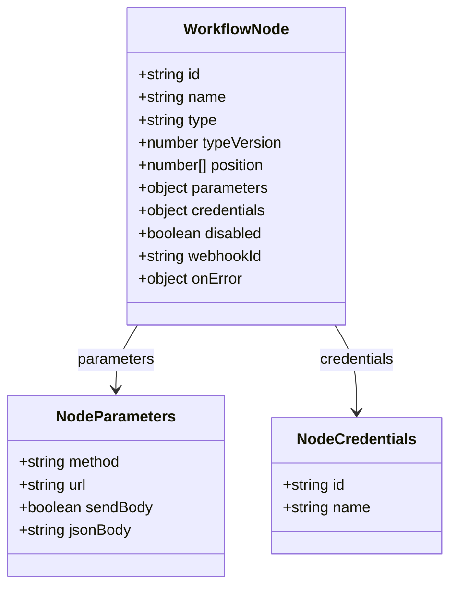
```mermaid
classDiagram
    class WorkflowNode {
        +string id
        +string name
        +string type
        +number typeVersion
        +number[] position
        +object parameters
        +object credentials
        +boolean disabled
        +string webhookId
        +object onError
    }
    class NodeParameters {
        +string method
        +string url
        +boolean sendBody
        +string jsonBody
    }
    class NodeCredentials {
        +string id
        +string name
    }
    WorkflowNode --> NodeParameters : parameters
    WorkflowNode --> NodeCredentials : credentials
```

**关键字段说明**：

| 字段 | 类型 | 说明 |
|------|------|------|
| `id` | string | 节点在当前工作流中的唯一 ID（UUID） |
| `name` | string | 节点实例名称（用户可修改，需在同一个工作流中唯一） |
| `type` | string | 节点类型标识，如 `n8n-nodes-base.httpRequest` |
| `typeVersion` | number | 节点类型版本号，支持同一节点多版本共存 |
| `position` | number[2] | 画布上的坐标 [x, y] |
| `parameters` | object | 用户配置的参数值 |
| `credentials` | object | 关联的凭证，key 为凭证类型名，value 为 {id, name} |
| `disabled` | boolean | 是否禁用（跳过执行） |
| `onError` | string | 错误处理策略：`stopWorkflow` / `continueErrorOutput` / `continueRegularOutput` |

### 3.3 Connection 定义

连接定义了节点之间的数据流向，采用 source → target 的映射结构：

```typescript
// connections 数据结构
interface IConnections {
  [sourceNodeName: string]: {
    [outputType: string]: IConnection[][];  // 二维数组：[outputIndex][connectionIndex]
  };
}

interface IConnection {
  node: string;    // 目标节点名称
  type: string;    // 连接类型（通常是 "main"）
  index: number;   // 目标节点的输入索引
}
```

**连接示例解析**：

```json
{
  "Webhook": {
    "main": [
      [
        { "node": "HTTP Request", "type": "main", "index": 0 }
      ]
    ]
  }
}
```

- `Webhook` 是源节点名称
- `main` 是输出类型（主输出）
- 外层数组索引 = 源节点的输出端口索引（0 = 第一个输出端口）
- 内层数组 = 该输出端口连接的所有目标节点
- `node` = 目标节点名称
- `index` = 目标节点的输入端口索引

**多输出节点连接**（如 IF 节点有两个输出：true/false）：

```json
{
  "IF": {
    "main": [
      [{ "node": "Success Handler", "type": "main", "index": 0 }],
      [{ "node": "Error Handler", "type": "main", "index": 0 }]
    ]
  }
}
```

### 3.4 工作流版本管理

n8n 的版本管理主要体现在两个维度：

1. **节点类型版本（typeVersion）**：同一节点可有多个版本，用户选择使用哪个版本。n8n 在执行时根据 `typeVersion` 加载对应的实现类。

2. **工作流执行版本（executionOrder）**：`settings.executionOrder` 控制执行引擎的行为：
   - `v0`：旧版执行顺序（可能有非确定性行为）
   - `v1`：新版执行顺序（确定性行为，推荐）

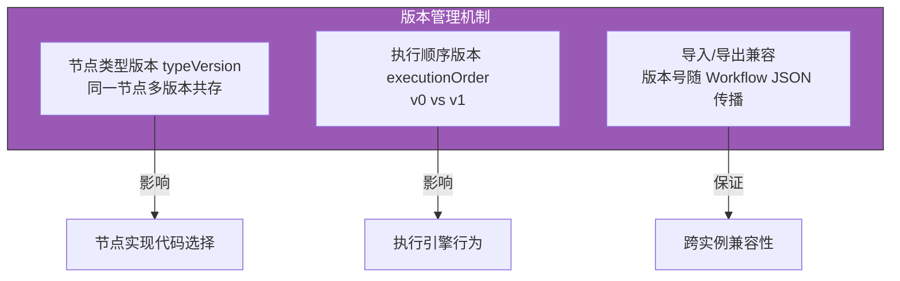
```mermaid
graph TD
    subgraph Versioning["版本管理机制"]
        NV["节点类型版本 typeVersion<br/>同一节点多版本共存"]
        EV["执行顺序版本 executionOrder<br/>v0 vs v1"]
        IM["导入/导出兼容<br/>版本号随 Workflow JSON 传播"]
    end

    NV --> |"影响"| Code["节点实现代码选择"]
    EV --> |"影响"| Exec["执行引擎行为"]
    IM --> |"保证"| Compat["跨实例兼容性"]

    style Versioning fill:#9b59b6,stroke:#333,color:#fff
```

### 3.5 导入/导出格式

n8n 支持工作流的导入/导出，格式即上述 Workflow JSON。关键特性：

- **可移植性**：JSON 格式可直接复制、版本控制、分享
- **凭证脱敏**：导出时 credentials 只保留 `{id, name}`，不包含实际凭证数据
- **表达式保留**：`{{ $json.foo }}` 表达式以字符串形式保留
- **位置信息保留**：`position` 字段确保导入后布局不变

---

## 四、前端拖拽编辑器实现

> n8n 的前端编辑器是其最直观的技术亮点。基于 Vue 3 + @vue-flow/core 实现的画布编辑器，对 open-app 选择 React Flow 作为替代方案有直接参考价值。

### 4.1 技术栈

| 技术 | 用途 | 说明 |
|------|------|------|
| Vue 3 | UI 框架 | Composition API + `<script setup>` |
| @vue-flow/core | 画布渲染 | 基于 React Flow 思路的 Vue 版本，支持 DAG 布局 |
| Pinia | 状态管理 | 替代 Vuex，更轻量、更好的 TS 支持 |
| CodeMirror 6 | 表达式编辑器 | 用于 `{{ $json.foo }}` 表达式的语法高亮和补全 |
| Element Plus | UI 组件库 | 表单、对话框、通知等 |
| Vue I18n | 国际化 | 多语言支持 |

### 4.2 画布渲染架构

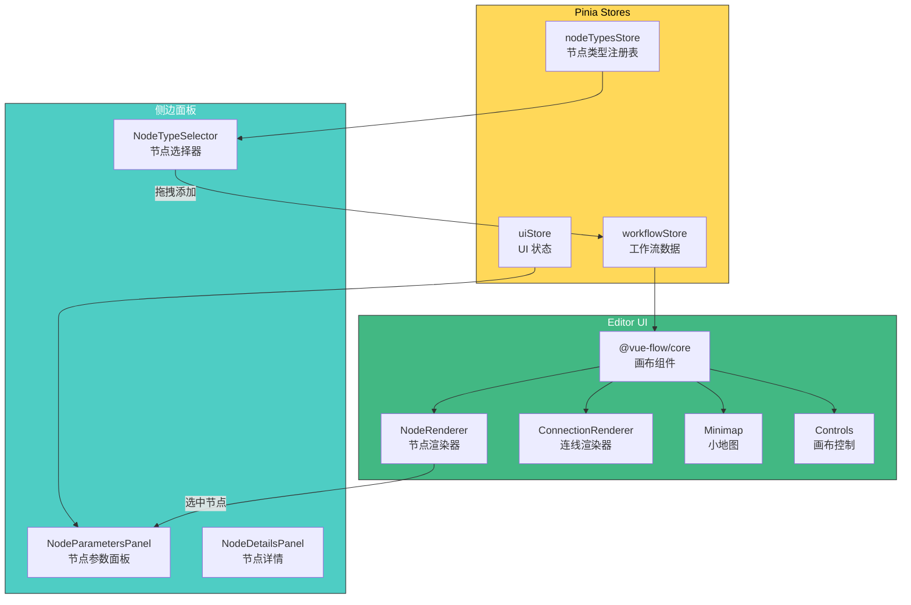
```mermaid
graph TB
    subgraph EditorUI["Editor UI"]
        Canvas["@vue-flow/core<br/>画布组件"]
        NR["NodeRenderer<br/>节点渲染器"]
        CR["ConnectionRenderer<br/>连线渲染器"]
        MM["Minimap<br/>小地图"]
        CB["Controls<br/>画布控制"]
    end

    subgraph Stores["Pinia Stores"]
        WS["workflowStore<br/>工作流数据"]
        NS["nodeTypesStore<br/>节点类型注册表"]
        UI2["uiStore<br/>UI 状态"]
    end

    subgraph Panels["侧边面板"]
        NP["NodeParametersPanel<br/>节点参数面板"]
        ND["NodeDetailsPanel<br/>节点详情"]
        NT["NodeTypeSelector<br/>节点选择器"]
    end

    Canvas --> NR
    Canvas --> CR
    Canvas --> MM
    Canvas --> CB

    WS --> Canvas
    NS --> NT
    UI2 --> NP

    NR --> |"选中节点"| NP
    NT --> |"拖拽添加"| WS

    style EditorUI fill:#42b883,stroke:#333,color:#fff
    style Stores fill:#ffd859,stroke:#333,color:#000
    style Panels fill:#4ecdc4,stroke:#333,color:#fff
```

### 4.3 NodeRenderer 组件化

每个节点类型在画布上由一个 Vue 组件渲染，组件通过 `nodeTypes` 注册机制绑定：

```typescript
// editor-ui/src/components/NodeTypes/NodeRenderer.vue（简化）
import { defineComponent, h } from 'vue';
import type { NodeProps } from '@vue-flow/core';

// 节点类型注册
const nodeTypes = {
  default: DefaultNode,
  trigger: TriggerNode,
  action: ActionNode,
  // ... 可扩展
};

export default defineComponent({
  name: 'NodeRenderer',
  props: {
    data: { type: Object as PropType<NodeProps>, required: true },
  },
  setup(props) {
    const nodeType = computed(() => {
      const type = props.data.type;
      return nodeTypes[type] || nodeTypes.default;
    });

    return () => h(nodeType.value, {
      data: props.data,
      position: props.data.position,
      selected: props.data.selected,
    });
  },
});
```

**节点组件结构**：

```vue
<!-- editor-ui/src/components/NodeTypes/ActionNode.vue -->
<template>
  <div class="action-node" :class="{ selected, disabled }">
    <!-- 节点头部：图标 + 名称 -->
    <div class="node-header">
      <NodeIcon :icon="data.icon" :color="data.color" />
      <span class="node-name">{{ data.name }}</span>
      <NodeStatus :status="data.status" />
    </div>
    <!-- 节点主体：参数摘要 -->
    <div class="node-body">
      <ParameterValue :value="data.parameters.operation" />
      <ParameterValue :value="data.parameters.resource" />
    </div>
    <!-- 输入/输出端口 -->
    <Handle type="target" :position="Position.Left" />
    <Handle type="source" :position="Position.Right" />
  </div>
</template>
```

### 4.4 Connection 连线渲染

@vue-flow/core 提供内置的连线渲染，n8n 在此基础上扩展了自定义连线和验证：

```typescript
// 自定义连线验证
const isValidConnection = (connection: Connection): boolean => {
  const sourceNode = getNode(connection.source);
  const targetNode = getNode(connection.target);

  // 不能连接到自身
  if (connection.source === connection.target) return false;

  // 输出类型必须匹配输入类型
  const sourceOutput = sourceNode.data.outputs[connection.sourceHandle];
  const targetInput = targetNode.data.inputs[connection.targetHandle];

  return sourceOutput.type === targetInput.type;
};

// 连线样式 - 根据数据类型着色
const getEdgeStyle = (edge: Edge): CSSProperties => {
  const dataType = edge.data?.type;
  const colorMap: Record<string, string> = {
    main: '#666',
    error: '#ff6b6b',
    ai: '#9b59b6',
  };
  return {
    stroke: colorMap[dataType] || '#666',
    strokeWidth: 2,
  };
};
```

### 4.5 拖拽交互

从节点选择器拖拽节点到画布的交互流程：

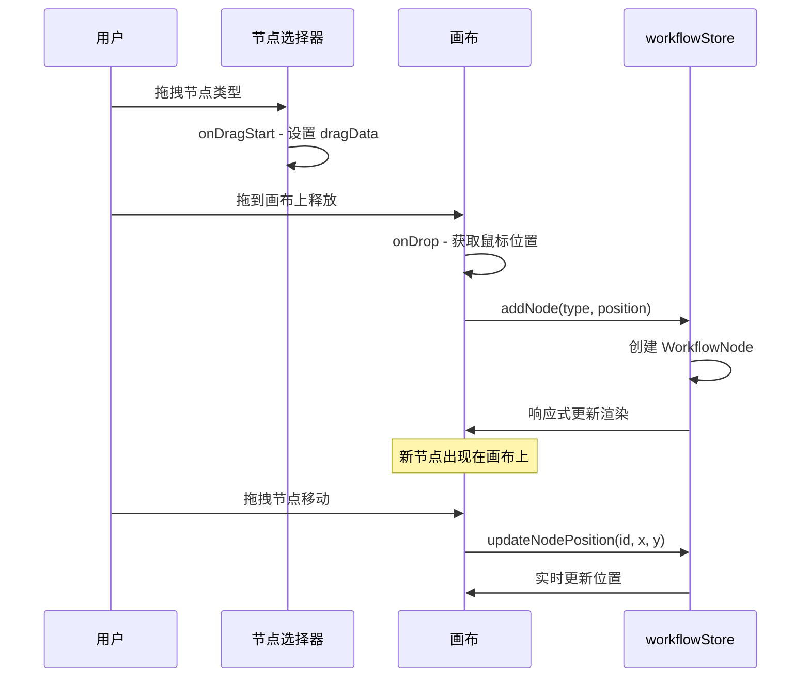
```mermaid
sequenceDiagram
    participant User as 用户
    participant Selector as 节点选择器
    participant Canvas as 画布
    participant Store as workflowStore

    User->>Selector: 拖拽节点类型
    Selector->>Selector: onDragStart - 设置 dragData
    User->>Canvas: 拖到画布上释放
    Canvas->>Canvas: onDrop - 获取鼠标位置
    Canvas->>Store: addNode(type, position)
    Store->>Store: 创建 WorkflowNode
    Store->>Canvas: 响应式更新渲染
    Note over Canvas: 新节点出现在画布上

    User->>Canvas: 拖拽节点移动
    Canvas->>Store: updateNodePosition(id, x, y)
    Store->>Canvas: 实时更新位置
```

```typescript
// 画布拖放处理
const onDrop = (event: DragEvent) => {
  const nodeTypeData = event.dataTransfer?.getData('application/n8n-node-type');
  if (!nodeTypeData) return;

  const { type, typeVersion } = JSON.parse(nodeTypeData);
  const position = project({
    x: event.clientX - bounds.left,
    y: event.clientY - bounds.top,
  });

  // 添加节点到工作流
  workflowStore.addNode({
    id: uuid(),
    name: generateNodeName(type),
    type,
    typeVersion,
    position,
    parameters: getDefaultParameters(type),
    credentials: {},
  });
};
```

### 4.6 表达式编辑器

n8n 的表达式编辑器基于 CodeMirror 6 构建，支持 `{{ $json.foo }}` 语法的智能补全：

```typescript
// 表达式语法：{{ $json.fieldName }}
// 支持：$json, $input, $item, $env, $workflow, $now, $today

// CodeMirror 6 扩展配置
const expressionExtensions = [
  // 语法高亮 - {{ }} 内的表达式高亮
  expressionHighlighting(),
  // 自动补全 - 输入 $ 时弹出上下文变量列表
  autocompletion({
    override: [expressionCompleter],
  }),
  // 错误检测 - 实时校验表达式语法
  expressionLinter(),
  // 提示 - hover 显示变量说明
  expressionTooltip(),
];

// 自动补全数据源
const expressionCompleter = (context: CompletionContext) => {
  const word = context.matchBefore(/\$[\w.]*/);
  if (!word) return null;

  return {
    from: word.from,
    options: [
      { label: '$json', type: 'variable', detail: '当前节点的输入数据' },
      { label: '$json.id', type: 'property', detail: '数据项 ID' },
      { label: '$json.name', type: 'property', detail: '数据项名称' },
      { label: '$input', type: 'variable', detail: '输入项对象' },
      { label: '$input.first()', type: 'function', detail: '第一个输入项' },
      { label: '$input.last()', type: 'function', detail: '最后一个输入项' },
      { label: '$input.all()', type: 'function', detail: '所有输入项' },
      { label: '$env', type: 'variable', detail: '环境变量' },
      { label: '$workflow', type: 'variable', detail: '工作流信息' },
      { label: '$now', type: 'variable', detail: '当前时间 (ISO)' },
    ],
  };
};
```

### 4.7 节点参数面板 - 动态表单渲染

参数面板根据 `INodeProperties[]` 动态渲染表单控件，这是 n8n 最精妙的前端设计之一：

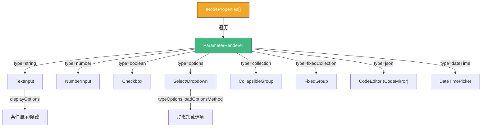
```mermaid
graph TD
    INP["INodeProperties[]"] --> |"遍历"| Renderer["ParameterRenderer"]
    Renderer --> |"type=string"| TextInput["TextInput"]
    Renderer --> |"type=number"| NumberInput["NumberInput"]
    Renderer --> |"type=boolean"| Checkbox["Checkbox"]
    Renderer --> |"type=options"| Select["Select/Dropdown"]
    Renderer --> |"type=collection"| CollapsibleGroup["CollapsibleGroup"]
    Renderer --> |"type=fixedCollection"| FixedGroup["FixedGroup"]
    Renderer --> |"type=json"| CodeEditor["CodeEditor (CodeMirror)"]
    Renderer --> |"type=dateTime"| DatePicker["DateTimePicker"]

    TextInput --> |"displayOptions"| Conditional["条件显示/隐藏"]
    Select --> |"typeOptions.loadOptionsMethod"| Dynamic["动态加载选项"]

    style INP fill:#f5a623,stroke:#333,color:#fff
    style Renderer fill:#42b883,stroke:#333,color:#fff
```

**动态表单渲染核心逻辑**：

```typescript
// ParameterRenderer.vue（简化）
const renderParameter = (param: INodeProperties) => {
  // 1. 检查 displayOptions - 是否应该显示
  if (!shouldDisplay(param.displayOptions, nodeValues)) return null;

  // 2. 根据 type 选择渲染组件
  const componentMap: Record<string, Component> = {
    string: 'ParameterInputString',
    number: 'ParameterInputNumber',
    boolean: 'ParameterInputCheckbox',
    options: 'ParameterInputSelect',
    dropdown: 'ParameterInputDropdown',
    collection: 'ParameterInputCollection',
    fixedCollection: 'ParameterInputFixedCollection',
    json: 'ParameterInputCode',
    dateTime: 'ParameterInputDateTime',
    color: 'ParameterInputColor',
  };

  const component = componentMap[param.type];
  if (!component) return null;

  // 3. 渲染参数组件
  return h(component, {
    parameter: param,
    modelValue: nodeValues.parameters[param.name],
    'onUpdate:modelValue': (value: any) => {
      workflowStore.updateNodeParameter(nodeId, param.name, value);
    },
  });
};
```

### 4.8 前端状态管理

```typescript
// stores/workflowStore.ts（核心状态）
export const useWorkflowStore = defineStore('workflow', () => {
  // 工作流数据
  const workflow = ref<IWorkflowDb>({
    id: '',
    name: '',
    nodes: [],
    connections: {},
    settings: {},
    active: false,
    staticData: null,
  });

  // 节点操作
  const addNode = (node: INodeCreate) => { /* ... */ };
  const removeNode = (nodeId: string) => { /* ... */ };
  const updateNodeParameter = (nodeId: string, key: string, value: any) => { /* ... */ };
  const updateNodePosition = (nodeId: string, position: [number, number]) => { /* ... */ };

  // 连接操作
  const addConnection = (connection: IConnection) => { /* ... */ };
  const removeConnection = (connection: IConnection) => { /* ... */ };

  // 工作流操作
  const save = async () => {
    await apiClient.post(`/rest/workflows/${workflow.value.id}`, workflow.value);
  };
  const execute = async () => {
    await apiClient.post(`/rest/workflows/${workflow.value.id}/execute`);
  };

  return {
    workflow,
    addNode, removeNode, updateNodeParameter, updateNodePosition,
    addConnection, removeConnection,
    save, execute,
  };
});
```

---

## 五、后端执行引擎

> n8n 的执行引擎是 Workflow 运行的核心，理解其执行流程、数据传递和错误处理机制，对设计 Java 版执行引擎至关重要。

### 5.1 WorkflowExecutor 执行流程

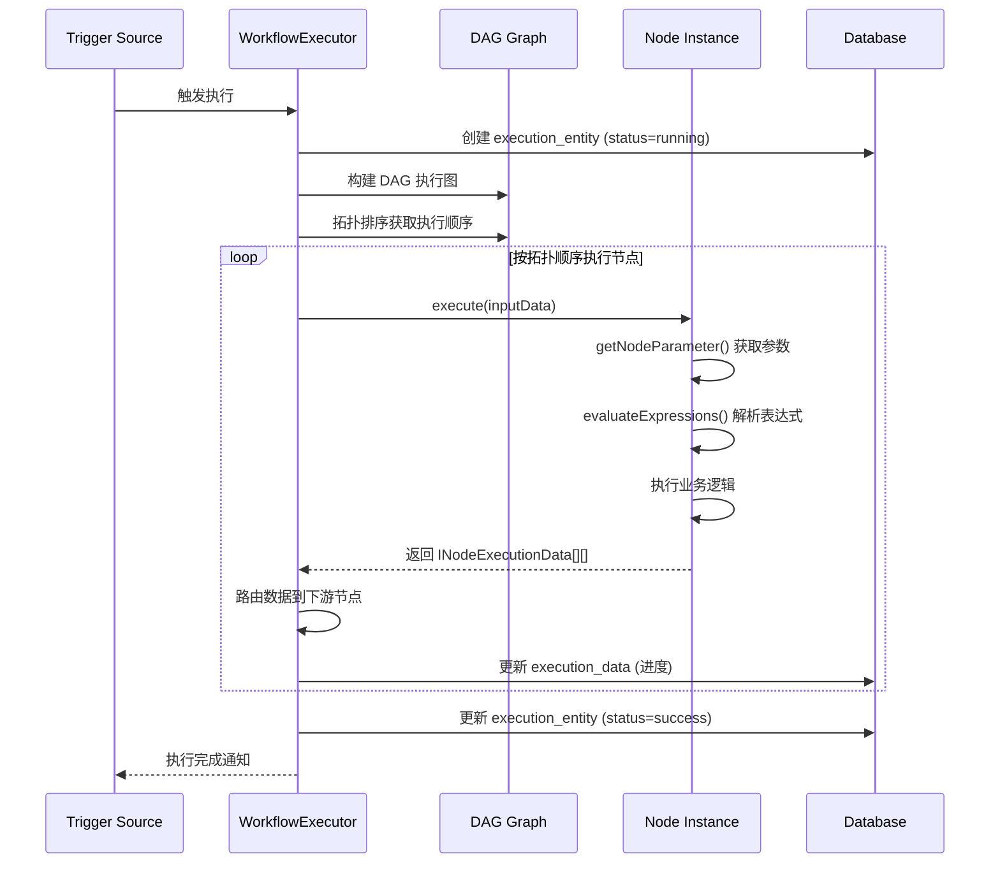
```mermaid
sequenceDiagram
    participant Trigger as Trigger Source
    participant Executor as WorkflowExecutor
    participant Graph as DAG Graph
    participant Node as Node Instance
    participant DB as Database

    Trigger->>Executor: 触发执行
    Executor->>DB: 创建 execution_entity (status=running)
    Executor->>Graph: 构建 DAG 执行图
    Executor->>Graph: 拓扑排序获取执行顺序

    loop 按拓扑顺序执行节点
        Executor->>Node: execute(inputData)
        Node->>Node: getNodeParameter() 获取参数
        Node->>Node: evaluateExpressions() 解析表达式
        Node->>Node: 执行业务逻辑
        Node-->>Executor: 返回 INodeExecutionData[][]
        Executor->>Executor: 路由数据到下游节点
        Executor->>DB: 更新 execution_data (进度)
    end

    Executor->>DB: 更新 execution_entity (status=success)
    Executor-->>Trigger: 执行完成通知
```

**核心执行逻辑**：

```typescript
// n8n-core/src/WorkflowExecutor.ts（简化）
class WorkflowExecutor {
  private workflow: Workflow;
  private executionData: IExecutionData;

  async run(executionId: string): Promise<IExecutionStatus> {
    // 1. 初始化执行上下文
    const context = this.createExecutionContext(executionId);

    // 2. 构建执行图（DAG）
    const executionGraph = this.buildExecutionGraph();

    // 3. 按拓扑顺序执行
    for (const node of executionGraph) {
      if (node.disabled) continue;

      try {
        // 获取节点输入数据
        const inputData = this.getNodeInputData(node);

        // 创建执行函数上下文
        const executeFunctions = new ExecuteFunctions(
          this.workflow,
          node,
          inputData,
          context,
        );

        // 执行节点
        const result = await nodeType.execute!.call(executeFunctions);

        // 存储输出数据
        this.setNodeOutputData(node, result);

        // 检查是否需要停止
        if (context.shouldStop) break;

      } catch (error) {
        // 错误处理
        await this.handleNodeError(node, error);
        if (node.onError === 'stopWorkflow') break;
      }
    }

    return this.getExecutionStatus();
  }
}
```

### 5.2 IExecuteFunctions 上下文

`IExecuteFunctions` 是节点执行时的上下文对象，提供丰富的 API：

```typescript
export interface IExecuteFunctions {
  // ========== 参数获取 ==========
  /** 获取节点参数值（已解析表达式） */
  getNodeParameter(name: string, itemIndex?: number): any;
  /** 获取节点参数值（未解析表达式的原始值） */
  getNodeParameterValueType(name: string): string;

  // ========== 凭证获取 ==========
  /** 获取凭证数据 */
  getCredentials(type: string): Promise<ICredentialDataDecryptedObject>;

  // ========== 输入数据 ==========
  /** 获取所有输入数据 */
  getInputData(inputIndex?: number, inputName?: string): INodeExecutionData[];

  // ========== HTTP 请求 ==========
  /** 发送 HTTP 请求（自动注入凭证认证） */
  helpers.httpRequest(options: IHttpRequestOptions): Promise<any>;
  /** 发送 HTTP 请求（带重试） */
  helpers.httpRequestWithAuthentication(options: IHttpRequestOptions): Promise<any>;

  // ========== 表达式 ==========
  /** 解析表达式 */
  evaluateExpression(expression: string, itemIndex: number): any;

  // ========== 输出控制 ==========
  /** 准备输出数据 */
  prepareOutputData(outputData: INodeExecutionData[][]): INodeExecutionData[][];

  // ========== 辅助方法 ==========
  /** 返回当前执行项的信息 */
  getItemData(): IItemData;
  /** 获取工作流静态数据（持久化） */
  getWorkflowStaticData(type: 'global' | 'node'): IDataObject;
  /** 发送执行进度通知 */
  sendExecutionProgress(progress: IExecutionProgress): void;
}
```

### 5.3 节点间数据传递

n8n 使用 `INodeExecutionData[][]` 作为节点间数据传递的标准格式：

```typescript
// 核心数据结构
interface INodeExecutionData {
  json: IDataObject;        // 主要数据（JSON 对象）
  binary?: IBinaryKeyData;  // 二进制数据（文件等）
  pairedItem?: IPairedItemData;  // 数据溯源信息
}

// 二维数组含义：
// 第一维：输出端口索引（对应节点的 output[0], output[1]...）
// 第二维：该输出端口的数据项列表
type NodeOutputData = INodeExecutionData[][];
```

**数据传递流程**：

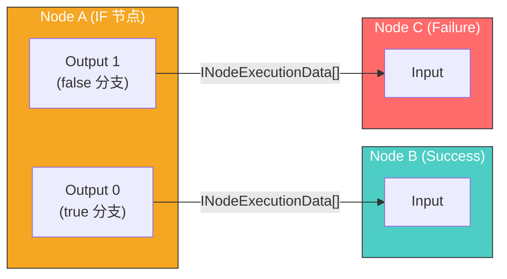
```mermaid
graph LR
    subgraph NodeA["Node A (IF 节点)"]
        AOut0["Output 0<br/>(true 分支)"]
        AOut1["Output 1<br/>(false 分支)"]
    end

    subgraph NodeB["Node B (Success)"]
        BIn["Input"]
    end

    subgraph NodeC["Node C (Failure)"]
        CIn["Input"]
    end

    AOut0 --> |"INodeExecutionData[]"| BIn
    AOut1 --> |"INodeExecutionData[]"| CIn

    style NodeA fill:#f5a623,stroke:#333,color:#fff
    style NodeB fill:#4ecdc4,stroke:#333,color:#fff
    style NodeC fill:#ff6b6b,stroke:#333,color:#fff
```

**数据项示例**：

```json
[
  [
    {
      "json": {
        "id": 1,
        "name": "John",
        "email": "john@example.com"
      },
      "pairedItem": { "item": 0, "input": 0 }
    },
    {
      "json": {
        "id": 2,
        "name": "Jane",
        "email": "jane@example.com"
      },
      "pairedItem": { "item": 1, "input": 0 }
    }
  ]
]
```

### 5.4 分支和循环执行

n8n 的分支和循环执行通过 DAG 图的拓扑排序实现：

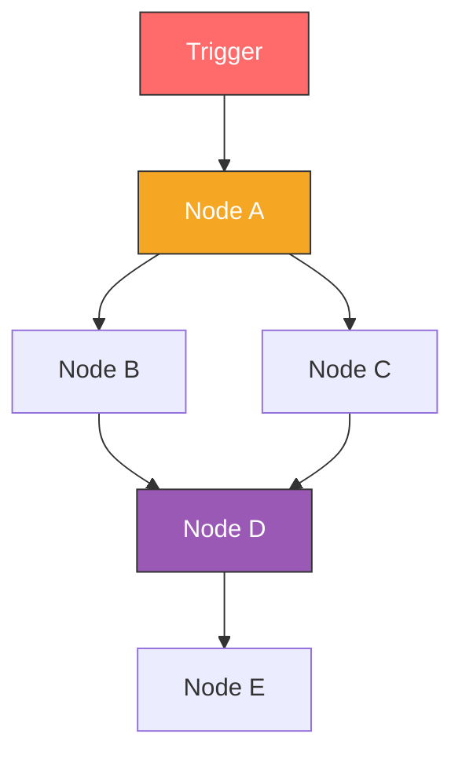
```mermaid
graph TD
    T[Trigger] --> A[Node A]
    A --> B[Node B]
    A --> C[Node C]
    B --> D[Node D]
    C --> D
    D --> E[Node E]

    style T fill:#ff6b6b,stroke:#333,color:#fff
    style A fill:#f5a623,stroke:#333,color:#fff
    style D fill:#9b59b6,stroke:#333,color:#fff
```

**执行策略**：

| 场景 | 执行策略 | 说明 |
|------|---------|------|
| 串行 | 逐个执行 | 单链路：A→B→C→D |
| 并行分支 | 并发执行 | A 分叉到 B 和 C，B 和 C 可并发 |
| 汇聚 | 等待所有输入 | D 等待 B 和 C 都完成后执行 |
| 循环 (SplitInBatches) | 分批处理 | 将大量数据分成小批次，每批执行一次 |

**SplitInBatches 循环示例**：

```typescript
// 批量处理数据
async execute(this: IExecuteFunctions): Promise<INodeExecutionData[][]> {
  const items = this.getInputData();
  const batchSize = this.getNodeParameter('batchSize') as number;

  const results: INodeExecutionData[] = [];

  for (let i = 0; i < items.length; i += batchSize) {
    const batch = items.slice(i, i + batchSize);
    // 将当前批次作为输出，触发后续节点
    this.emit([batch]);
    // 等待后续节点执行完成
    const batchResults = await this.waitForDownstream();
    results.push(...batchResults);
  }

  return [results];
}
```

### 5.5 错误处理和重试

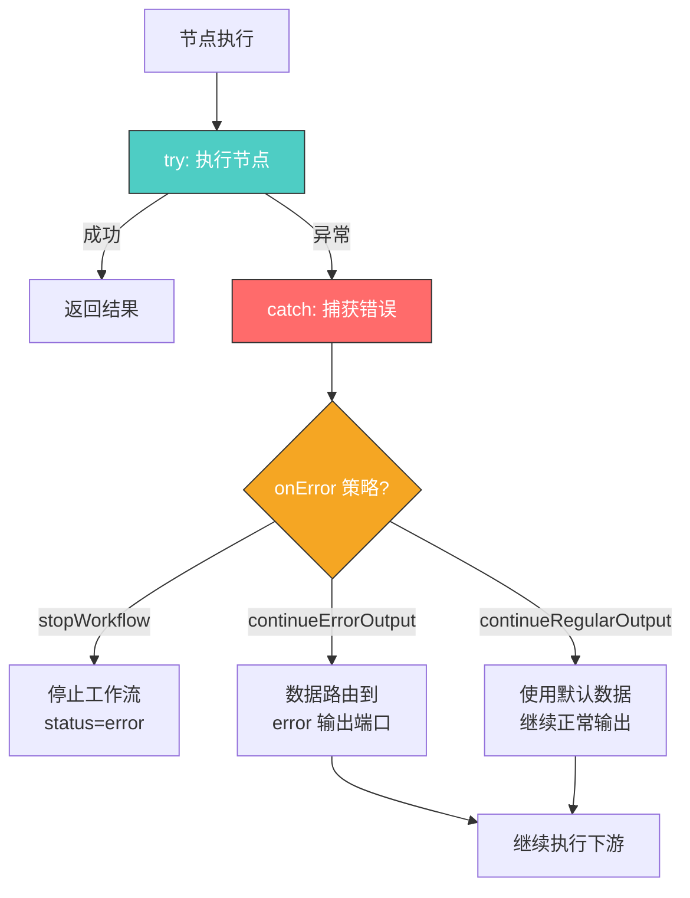
```mermaid
flowchart TD
    Start["节点执行"] --> Try["try: 执行节点"]
    Try --> |"成功"| Success["返回结果"]
    Try --> |"异常"| Catch["catch: 捕获错误"]

    Catch --> CheckPolicy{"onError 策略?"}
    CheckPolicy --> |"stopWorkflow"| Stop["停止工作流<br/>status=error"]
    CheckPolicy --> |"continueErrorOutput"| ErrorOut["数据路由到<br/>error 输出端口"]
    CheckPolicy --> |"continueRegularOutput"| RegOut["使用默认数据<br/>继续正常输出"]

    ErrorOut --> Continue["继续执行下游"]
    RegOut --> Continue

    style Try fill:#4ecdc4,stroke:#333,color:#fff
    style Catch fill:#ff6b6b,stroke:#333,color:#fff
    style CheckPolicy fill:#f5a623,stroke:#333,color:#fff
```

**重试机制**：

- **Bull Queue 级别重试**：整个工作流执行失败后重试，通过 `attempts` 和 `backoff` 配置
- **节点级别重试**：单个节点执行失败后重试，通过 `retryOnFail` 和 `maxTries` 配置
- **Webhook 级别重试**：Webhook 回调处理失败后重试，通过 `retryPolicy` 配置

### 5.6 Webhook 注册和回调

```typescript
// WebhookManager 核心逻辑
class WebhookManager {
  private webhookServer: Server;
  private activeWebhooks: Map<string, WebhookRegistration>;

  /**
   * 注册工作流的所有 Webhook
   * 在工作流激活时调用
   */
  async activateWorkflow(workflowId: string): Promise<void> {
    const workflow = await this.workflowRepo.getById(workflowId);
    const triggerNodes = workflow.getTriggerNodes();

    for (const node of triggerNodes) {
      if (node.type.includes('webhook')) {
        const webhookPath = this.generateWebhookPath(node, workflowId);
        const handler = this.createWebhookHandler(node, workflowId);

        // 注册 Express 路由
        this.webhookServer[webhookPath.method.toLowerCase()](
          webhookPath.path,
          handler
        );

        // 调用 onCreate 生命周期
        const nodeType = this.nodeTypes.get(node.type);
        if (nodeType.webhookMethods?.onCreate) {
          await nodeType.webhookMethods.onCreate.call(context);
        }

        this.activeWebhooks.set(webhookPath.key, { node, workflowId, handler });
      }
    }
  }

  /**
   * 创建 Webhook 请求处理器
   */
  private createWebhookHandler(node: INode, workflowId: string) {
    return async (req: Request, res: Response) => {
      try {
        // 1. 认证校验
        await this.authenticateWebhook(req, node);

        // 2. 调用节点的 webhook 方法
        const nodeType = this.nodeTypes.get(node.type);
        const result = await nodeType.webhook!.call(webhookContext);

        // 3. 根据响应模式处理
        if (node.parameters.responseMode === 'onReceived') {
          res.status(200).json({ message: 'Workflow was started' });
        }

        // 4. 推入执行队列
        await this.executionQueue.add({
          workflowId,
          triggerData: result.workflowData,
        });

      } catch (error) {
        res.status(500).json({ error: error.message });
      }
    };
  }
}
```

### 5.7 Worker 进程执行模型

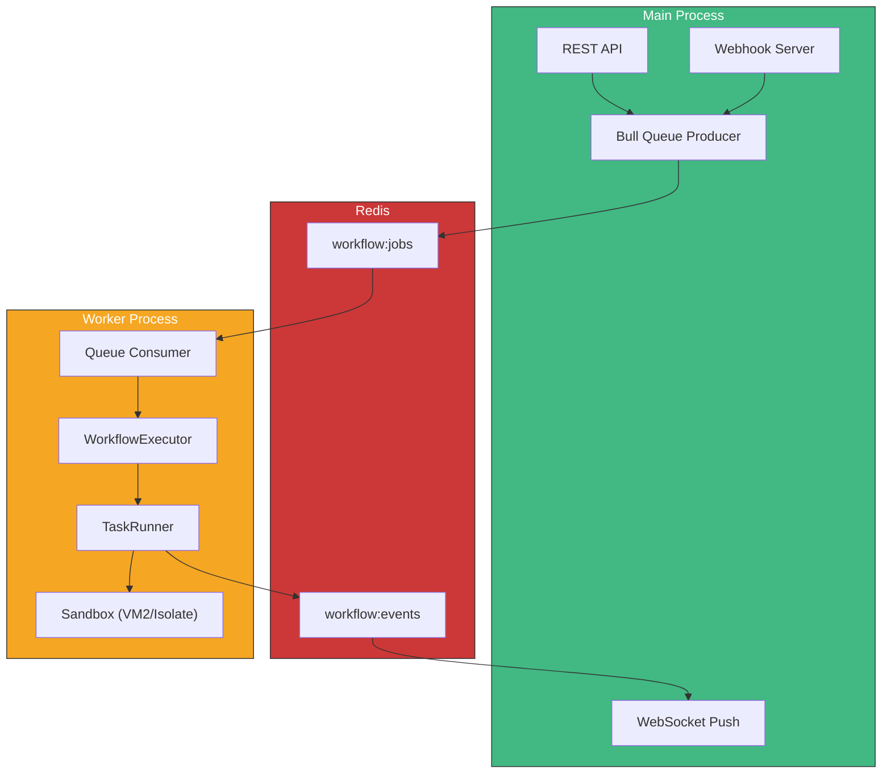
```mermaid
graph TB
    subgraph MainProcess["Main Process"]
        API2["REST API"]
        WHS["Webhook Server"]
        WS2["WebSocket Push"]
        Q2["Bull Queue Producer"]
    end

    subgraph Redis2["Redis"]
        BQ2["workflow:jobs"]
        PS2["workflow:events"]
    end

    subgraph WorkerProcess["Worker Process"]
        QC["Queue Consumer"]
        WE["WorkflowExecutor"]
        TR2["TaskRunner"]
        Sandbox["Sandbox (VM2/Isolate)"]
    end

    API2 --> Q2
    WHS --> Q2
    Q2 --> BQ2
    BQ2 --> QC
    QC --> WE
    WE --> TR2
    TR2 --> Sandbox
    TR2 --> PS2
    PS2 --> WS2

    style MainProcess fill:#42b883,stroke:#333,color:#fff
    style Redis2 fill:#cb3837,stroke:#333,color:#fff
    style WorkerProcess fill:#f5a623,stroke:#333,color:#fff
```

**TaskRunner 沙箱隔离**（v2.x 新增）：

n8n v2.x 引入了 TaskRunner，将节点代码执行放在沙箱中，提高安全性：

```typescript
// TaskRunner 沙箱执行
class TaskRunner {
  private sandbox: Sandbox;

  async executeNodeCode(code: string, context: any): Promise<any> {
    // 使用 VM2 或 Isolate 创建沙箱
    const sandbox = this.createSandbox({
      timeout: 30000,  // 30s 超时
      memory: 256,     // 256MB 内存限制
    });

    // 注入安全上下文
    sandbox.inject('$input', context.inputData);
    sandbox.inject('$env', context.envVars);

    // 在沙箱中执行
    return await sandbox.run(code);
  }
}
```

---

## 六、数据库设计

> n8n 使用 TypeORM 作为 ORM 框架，数据模型简洁高效。理解其表结构对设计 open-app 的数据模型有参考价值。

### 6.1 TypeORM 实体关系图

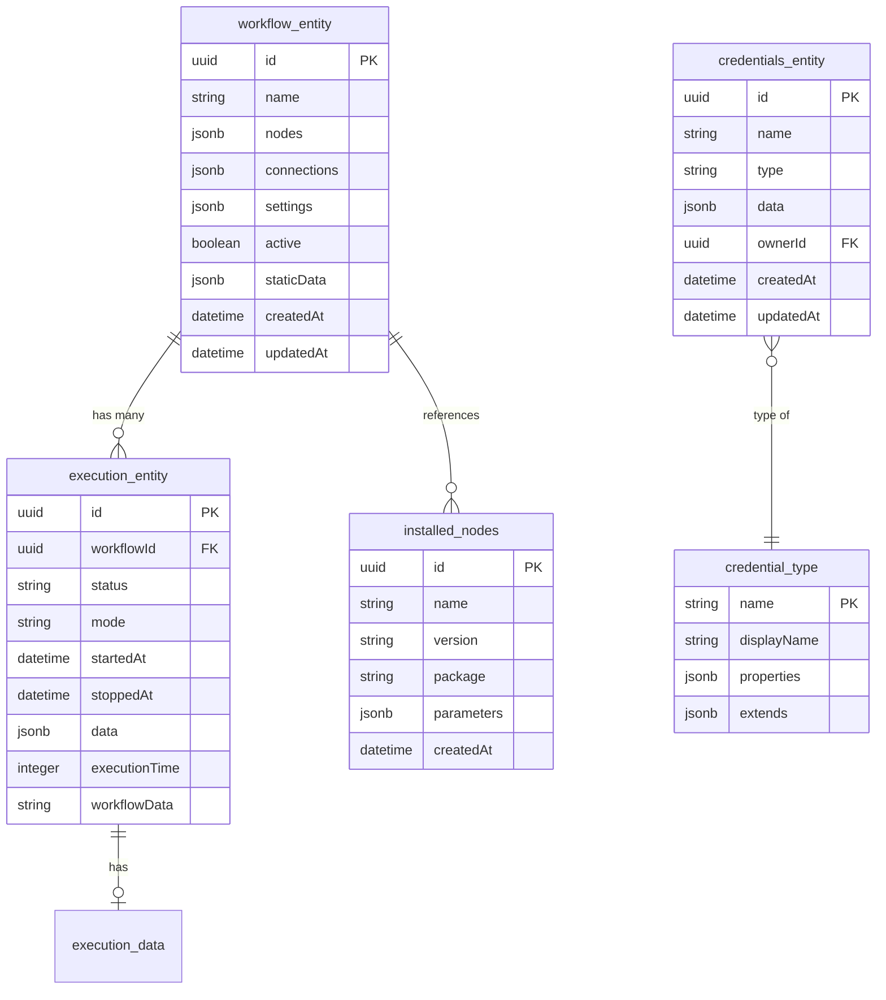
```mermaid
erDiagram
    workflow_entity ||--o{ execution_entity : "has many"
    workflow_entity ||--o{ installed_nodes : "references"
    credentials_entity }o--|| credential_type : "type of"
    execution_entity ||--o| execution_data : "has"

    workflow_entity {
        uuid id PK
        string name
        jsonb nodes
        jsonb connections
        jsonb settings
        boolean active
        jsonb staticData
        datetime createdAt
        datetime updatedAt
    }

    execution_entity {
        uuid id PK
        uuid workflowId FK
        string status
        string mode
        datetime startedAt
        datetime stoppedAt
        jsonb data
        integer executionTime
        string workflowData
    }

    credentials_entity {
        uuid id PK
        string name
        string type
        jsonb data
        uuid ownerId FK
        datetime createdAt
        datetime updatedAt
    }

    installed_nodes {
        uuid id PK
        string name
        string version
        string package
        jsonb parameters
        datetime createdAt
    }

    credential_type {
        string name PK
        string displayName
        jsonb properties
        jsonb extends
    }
```

### 6.2 workflow_entity 表

这是最核心的表，存储工作流的完整定义：

```sql
CREATE TABLE workflow_entity (
    id              UUID PRIMARY KEY DEFAULT gen_random_uuid(),
    name            VARCHAR(255) NOT NULL,
    -- 节点列表 - JSON 数组，包含所有节点定义
    nodes           JSONB NOT NULL DEFAULT '[]',
    -- 连接定义 - JSON 对象，描述节点间的数据流
    connections     JSONB NOT NULL DEFAULT '{}',
    -- 工作流设置
    settings        JSONB DEFAULT '{}',
    -- 是否激活（激活后 Trigger 节点开始监听）
    active          BOOLEAN NOT NULL DEFAULT false,
    -- 静态数据 - 工作流持久化状态（如上次轮询时间）
    staticData      JSONB,
    -- 创建者
    ownerId         UUID REFERENCES user_entity(id),
    -- 时间戳
    createdAt       TIMESTAMP NOT NULL DEFAULT NOW(),
    updatedAt       TIMESTAMP NOT NULL DEFAULT NOW()
);

-- 关键索引
CREATE INDEX idx_workflow_active ON workflow_entity(active);
CREATE INDEX idx_workflow_owner ON workflow_entity(ownerId);
CREATE INDEX idx_workflow_name ON workflow_entity USING gin(name gin_trgm_ops);
```

**nodes JSONB 结构**：存储为 `INode[]` 的 JSON 数组，每个元素包含节点的完整配置（id, name, type, typeVersion, position, parameters, credentials 等）。

**connections JSONB 结构**：存储为 `IConnections` 的 JSON 对象，key 为源节点名称，value 为连接映射。

**staticData JSONB**：用于存储工作流的持久化状态，如 Polling 触发器的上次轮询时间戳。该数据在工作流执行间持久存在。

### 6.3 execution_entity 表

记录每次工作流执行的状态和数据：

```sql
CREATE TABLE execution_entity (
    id              UUID PRIMARY KEY DEFAULT gen_random_uuid(),
    -- 关联工作流
    workflowId      UUID NOT NULL REFERENCES workflow_entity(id),
    -- 执行状态: waiting | running | success | error | canceled | crashed
    status          VARCHAR(50) NOT NULL DEFAULT 'running',
    -- 触发模式: manual | trigger | webhook
    mode            VARCHAR(50) NOT NULL,
    -- 执行时间
    startedAt       TIMESTAMP NOT NULL DEFAULT NOW(),
    stoppedAt       TIMESTAMP,
    -- 执行耗时（毫秒）
    executionTime   INTEGER,
    -- 执行数据 - 包含每个节点的输入/输出
    data            JSONB,
    -- 工作流快照 - 执行时的工作流定义（防止工作流修改影响执行记录）
    workflowData    JSONB,
    -- 时间戳
    createdAt       TIMESTAMP NOT NULL DEFAULT NOW(),
    updatedAt       TIMESTAMP NOT NULL DEFAULT NOW()
);

-- 关键索引
CREATE INDEX idx_execution_workflow ON execution_entity(workflowId);
CREATE INDEX idx_execution_status ON execution_entity(status);
CREATE INDEX idx_execution_started ON execution_entity(startedAt DESC);
CREATE INDEX idx_execution_workflow_status ON execution_entity(workflowId, status);
```

**data JSONB 结构**：

```json
{
  "resultData": {
    "runData": {
      "Webhook": [
        {
          "startTime": 1700000000000,
          "executionTime": 50,
          "executionStatus": "success",
          "data": {
            "main": [
              [{ "json": { "body": {}, "headers": {} } }]
            ]
          }
        }
      ],
      "HTTP Request": [
        {
          "startTime": 1700000000050,
          "executionTime": 230,
          "executionStatus": "success",
          "data": {
            "main": [
              [{ "json": { "id": 1, "name": "result" } }]
            ]
          }
        }
      ]
    }
  }
}
```

### 6.4 credentials_entity 表

凭证数据以加密方式存储：

```sql
CREATE TABLE credentials_entity (
    id              UUID PRIMARY KEY DEFAULT gen_random_uuid(),
    name            VARCHAR(255) NOT NULL,
    -- 凭证类型，如 "httpBasicAuth", "oAuth2Api"
    type            VARCHAR(255) NOT NULL,
    -- 加密的凭证数据（AES-256 加密）
    data            TEXT NOT NULL,
    -- 所属用户
    ownerId         UUID REFERENCES user_entity(id),
    createdAt       TIMESTAMP NOT NULL DEFAULT NOW(),
    updatedAt       TIMESTAMP NOT NULL DEFAULT NOW()
);

-- 关键索引
CREATE INDEX idx_credential_type ON credentials_entity(type);
CREATE INDEX idx_credential_owner ON credentials_entity(ownerId);
CREATE UNIQUE INDEX idx_credential_name_owner ON credentials_entity(name, ownerId);
```

**加密机制**：

```typescript
// 凭证加密/解密
class CredentialsEncoder {
  private encryptionKey: Buffer;  // 从环境变量 N8N_ENCRYPTION_KEY 获取

  encrypt(data: ICredentialDataDecryptedObject): string {
    const iv = crypto.randomBytes(16);
    const cipher = crypto.createCipheriv('aes-256-cbc', this.encryptionKey, iv);
    const encrypted = Buffer.concat([
      cipher.update(JSON.stringify(data)),
      cipher.final(),
    ]);
    return iv.toString('hex') + ':' + encrypted.toString('hex');
  }

  decrypt(encryptedData: string): ICredentialDataDecryptedObject {
    const [ivHex, dataHex] = encryptedData.split(':');
    const iv = Buffer.from(ivHex, 'hex');
    const data = Buffer.from(dataHex, 'hex');
    const decipher = crypto.createDecipheriv('aes-256-cbc', this.encryptionKey, iv);
    const decrypted = Buffer.concat([decipher.update(data), decipher.final()]);
    return JSON.parse(decrypted.toString());
  }
}
```

### 6.5 installed_nodes 表

```sql
CREATE TABLE installed_nodes (
    id              UUID PRIMARY KEY DEFAULT gen_random_uuid(),
    -- 节点包名
    name            VARCHAR(255) NOT NULL,
    -- 版本号
    version         VARCHAR(50) NOT NULL,
    -- npm 包名
    package         VARCHAR(255) NOT NULL,
    -- 节点参数（缓存）
    parameters      JSONB,
    createdAt       TIMESTAMP NOT NULL DEFAULT NOW(),
    updatedAt       TIMESTAMP NOT NULL DEFAULT NOW()
);

CREATE UNIQUE INDEX idx_installed_node_name ON installed_nodes(name);
```

---

## 七、API 设计

> n8n 的 REST API 设计简洁实用，采用模块化路由组织。理解其 API 结构对设计 open-app 的 API 有参考价值。

### 7.1 REST API 概览

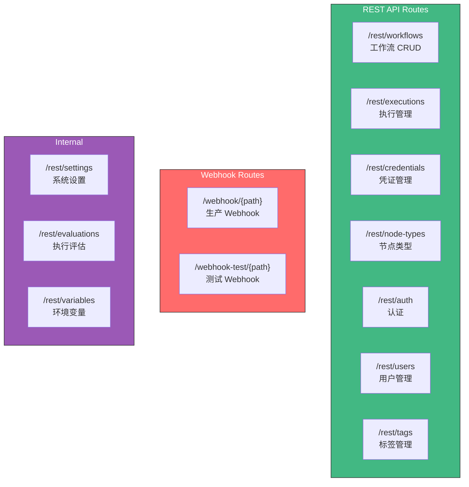
```mermaid
graph TB
    subgraph APIRoutes["REST API Routes"]
        WF["/rest/workflows<br/>工作流 CRUD"]
        EX["/rest/executions<br/>执行管理"]
        CR["/rest/credentials<br/>凭证管理"]
        ND["/rest/node-types<br/>节点类型"]
        AU["/rest/auth<br/>认证"]
        US["/rest/users<br/>用户管理"]
        TG["/rest/tags<br/>标签管理"]
    end

    subgraph WebhookRoutes["Webhook Routes"]
        WH_PRODUCTION["/webhook/{path}<br/>生产 Webhook"]
        WH_TEST["/webhook-test/{path}<br/>测试 Webhook"]
    end

    subgraph InternalRoutes["Internal"]
        SS["/rest/settings<br/>系统设置"]
        EV["/rest/evaluations<br/>执行评估"]
        VO["/rest/variables<br/>环境变量"]
    end

    style APIRoutes fill:#42b883,stroke:#333,color:#fff
    style WebhookRoutes fill:#ff6b6b,stroke:#333,color:#fff
    style InternalRoutes fill:#9b59b6,stroke:#333,color:#fff
```

### 7.2 Workflow CRUD

```typescript
// 工作流 API 端点

// 获取工作流列表（分页 + 过滤）
GET /rest/workflows
// Query: ?limit=50&cursor=xxx&active=true&tags=production

// 获取单个工作流
GET /rest/workflows/:id

// 创建工作流
POST /rest/workflows
// Body: { name, nodes, connections, settings }

// 更新工作流
PUT /rest/workflows/:id
// Body: { name, nodes, connections, settings, active }

// 删除工作流
DELETE /rest/workflows/:id

// 激活/停用工作流
POST /rest/workflows/:id/activate
POST /rest/workflows/:id/deactivate

// 执行工作流
POST /rest/workflows/:id/execute
// Body: { startNodes?, runData? }

// 传输工作流（获取完整 JSON，用于导入/导出）
GET /rest/workflows/:id/transfer
```

**API 响应格式**：

```json
{
  "id": "a1b2c3d4-e5f6-7890-abcd-ef1234567890",
  "name": "My Workflow",
  "active": true,
  "nodes": [...],
  "connections": {...},
  "settings": {...},
  "createdAt": "2026-01-15T10:30:00.000Z",
  "updatedAt": "2026-05-10T14:20:00.000Z",
  "tags": [{ "id": "1", "name": "production" }]
}
```

### 7.3 Execution API

```typescript
// 执行 API 端点

// 获取执行列表
GET /rest/executions
// Query: ?limit=50&status=success&workflowId=xxx

// 获取单个执行详情
GET /rest/executions/:id

// 删除执行记录
DELETE /rest/executions/:id

// 取消正在运行的执行
POST /rest/executions/:id/cancel

// 重试失败的执行
POST /rest/executions/:id/retry
```

### 7.4 Credential API

```typescript
// 凭证 API 端点

// 获取凭证列表（不含敏感数据）
GET /rest/credentials
// Query: ?limit=50&type=oAuth2Api

// 获取凭证类型列表
GET /rest/credential-types

// 创建凭证
POST /rest/credentials
// Body: { name, type, data: { user, password, ... } }

// 更新凭证
PUT /rest/credentials/:id
// Body: { name, data }

// 删除凭证
DELETE /rest/credentials/:id

// 测试凭证连接
POST /rest/credentials/:id/test
```

### 7.5 Webhook 路由

```typescript
// Webhook 路由 - 不需要 API 认证
// 生产环境 URL
POST /webhook/{workflowId}/{webhookPath}
GET  /webhook/{workflowId}/{webhookPath}

// 测试环境 URL（仅在编辑器中测试时使用）
POST /webhook-test/{workflowId}/{webhookPath}
GET  /webhook-test/{workflowId}/{webhookPath}

// Webhook 认证方式
// 1. Header Auth: 验证请求头
// 2. Basic Auth: 验证用户名密码
// 3. 无认证: 直接接受请求
```

**Webhook URL 生成规则**：

```
基础 URL: https://n8n.example.com
生产路径: /webhook/{userDefinedPath}
测试路径: /webhook-test/{userDefinedPath}
完整 URL: https://n8n.example.com/webhook/my-custom-path
```

---

## 八、对 open-app 的架构设计参考

> **这是本报告的最终目的章节**。将 n8n 的架构精华映射到 open-app 的 Java + JS 技术栈，给出具体的实施方案和规避建议。

### 8.1 INodeTypeDescription → Java 连接器接口映射

n8n 的 `INodeTypeDescription` 是声明式节点定义的典范，open-app 应将其映射为 Java 注解驱动的连接器接口：

```java
/**
 * open-app 连接器定义注解 - 对标 n8n INodeTypeDescription
 * 声明式定义连接器的元数据、参数、凭证、输入输出
 */
@Target(ElementType.TYPE)
@Retention(RetentionPolicy.RUNTIME)
public @interface ConnectorDefinition {
    String displayName();                    // 对应 displayName
    String name();                           // 对应 name
    String description();                    // 对应 description
    String icon() default "";                // 对应 icon
    int version() default 1;                 // 对应 version
    String[] group() default {};             // 对应 group
    boolean isTrigger() default false;       // 对应 isTrigger
    String documentationUrl() default "";    // 对应 documentationUrl
}

/**
 * 连接器参数注解 - 对标 n8n INodeProperties
 * 驱动前端动态表单渲染
 */
@Target(ElementType.FIELD)
@Retention(RetentionPolicy.RUNTIME)
public @interface ConnectorParam {
    String displayName();
    String name();
    ParamType type();
    String defaultValue() default "";
    String description() default "";
    boolean required() default false;
    String showWhen() default "";             // 对应 displayOptions
    Option[] options() default {};
    String loadOptionsMethod() default "";    // 对应 typeOptions.loadOptionsMethod
}

enum ParamType {
    STRING, NUMBER, BOOLEAN, OPTIONS, DROPDOWN,
    COLLECTION, JSON, DATETIME, COLOR
}
```

**Java 连接器实现示例**：

```java
@ConnectorDefinition(
    displayName = "Slack",
    name = "openapp.connectors.slack",
    description = "Send messages and manage Slack workspace",
    icon = "slack.svg",
    version = 1,
    group = {"communication"}
)
@CredentialRef(SlackOAuth2Credential.class)
public class SlackConnector implements ActionConnector {

    @ConnectorParam(displayName = "Resource", name = "resource",
                    type = ParamType.OPTIONS,
                    options = {
                        @Option(name = "message", displayName = "Message"),
                        @Option(name = "channel", displayName = "Channel"),
                    })
    private String resource;

    @ConnectorParam(displayName = "Operation", name = "operation",
                    type = ParamType.OPTIONS,
                    showWhen = "resource=message",
                    options = {
                        @Option(name = "send", displayName = "Send"),
                        @Option(name = "update", displayName = "Update"),
                    })
    private String operation;

    @ConnectorParam(displayName = "Channel", name = "channel",
                    type = ParamType.STRING, required = true,
                    showWhen = "resource=message,operation=send")
    private String channel;

    @ConnectorParam(displayName = "Text", name = "text",
                    type = ParamType.STRING, required = true,
                    showWhen = "resource=message,operation=send")
    private String text;

    @Override
    public ConnectorOutput execute(ConnectorInput input, ConnectorContext context) {
        SlackClient client = context.getCredential(SlackOAuth2Credential.class).getClient();
        MessageResponse response = client.postMessage(channel, text);
        return ConnectorOutput.success(Map.of(
            "ts", response.getTimestamp(),
            "channel", response.getChannel()
        ));
    }
}
```

**映射对照表**：

| n8n 概念 | open-app 映射 | 实现方式 |
|----------|--------------|---------|
| `INodeType` | `Connector` 接口 | Java Interface + 注解 |
| `INodeTypeDescription` | `@ConnectorDefinition` 注解 | Java Annotation |
| `INodeProperties` | `@ConnectorParam` 注解 | Java Annotation + 枚举 |
| `execute()` | `ActionConnector.execute()` | Java 方法 |
| `trigger()` | `TriggerConnector.onStart()/onStop()` | Java 方法 |
| `webhook()` | `WebhookConnector.handleRequest()` | Java 方法 |
| `methods.loadOptions` | `@ConnectorParam(loadOptionsMethod=...)` | Java 反射调用 |


### 8.2 INodeProperties → Java 动态表单 Schema

n8n 的 `INodeProperties` 驱动前端动态表单渲染，open-app 需要将其序列化为 JSON Schema 供前端消费：

```java
/**
 * 连接器元数据序列化 - 将 Java 注解转为前端可消费的 JSON Schema
 */
public class ConnectorSchemaGenerator {

    public ConnectorSchema generate(Class<?> connectorClass) {
        ConnectorDefinition def = connectorClass.getAnnotation(ConnectorDefinition.class);
        List<ParamSchema> params = new ArrayList<>();

        for (Field field : connectorClass.getDeclaredFields()) {
            ConnectorParam param = field.getAnnotation(ConnectorParam.class);
            if (param != null) {
                params.add(ParamSchema.builder()
                    .displayName(param.displayName())
                    .name(param.name())
                    .type(param.type().name().toLowerCase())
                    .defaultValue(param.defaultValue())
                    .description(param.description())
                    .required(param.required())
                    .showWhen(parseShowWhen(param.showWhen()))
                    .options(Arrays.stream(param.options())
                        .map(o -> Map.of("name", o.name(), "displayName", o.displayName()))
                        .collect(Collectors.toList()))
                    .build());
            }
        }

        return ConnectorSchema.builder()
            .displayName(def.displayName())
            .name(def.name())
            .description(def.description())
            .icon(def.icon())
            .version(def.version())
            .group(Arrays.asList(def.group()))
            .isTrigger(def.isTrigger())
            .properties(params)
            .build();
    }
}
```

**前端消费的 JSON Schema 输出**：

```json
{
  "displayName": "Slack",
  "name": "openapp.connectors.slack",
  "version": 1,
  "isTrigger": false,
  "properties": [
    {
      "displayName": "Resource",
      "name": "resource",
      "type": "options",
      "default": "message",
      "options": [
        { "name": "message", "displayName": "Message" },
        { "name": "channel", "displayName": "Channel" }
      ]
    },
    {
      "displayName": "Operation",
      "name": "operation",
      "type": "options",
      "showWhen": { "resource": ["message"] },
      "options": [
        { "name": "send", "displayName": "Send" },
        { "name": "update", "displayName": "Update" }
      ]
    }
  ]
}
```

### 8.3 Workflow JSON → open-app Flow 数据模型

n8n 的 Workflow JSON 格式简洁高效，open-app 应采用类似但更规范的数据模型：

```java
@Entity
@Table(name = "flow_definition")
public class FlowDefinition {
    @Id
    private UUID id;
    private String name;

    @Column(columnDefinition = "jsonb")
    @JdbcTypeCode(SqlTypes.JSON)
    private List<FlowNode> nodes;              // 对标 n8n nodes

    @Column(columnDefinition = "jsonb")
    @JdbcTypeCode(SqlTypes.JSON)
    private Map<String, FlowConnectionGroup> connections;  // 对标 n8n connections

    @Column(columnDefinition = "jsonb")
    @JdbcTypeCode(SqlTypes.JSON)
    private FlowSettings settings;             // 对标 n8n settings

    private boolean active;                    // 对标 n8n active

    @Column(columnDefinition = "jsonb")
    @JdbcTypeCode(SqlTypes.JSON)
    private Map<String, Object> staticData;    // 对标 n8n staticData

    private LocalDateTime createdAt;
    private LocalDateTime updatedAt;
}
```

**n8n 与 open-app 数据模型对比**：

| 维度 | n8n | open-app 建议 |
|------|-----|--------------|
| 节点存储 | JSON 列（无结构约束） | JSON 列 + JSON Schema 校验 |
| 连接存储 | 嵌套 JSON 对象 | 扁平化连接表 + JSON 列 |
| 凭证引用 | `{id, name}` 内联 | 独立凭证表 + 外键引用 |
| 版本管理 | 仅 typeVersion | typeVersion + flowVersion (语义版本) |
| 静态数据 | JSON 列 | JSON 列 + 定期清理策略 |

### 8.4 Credential → 认证管理映射

```java
@Target(ElementType.TYPE)
@Retention(RetentionPolicy.RUNTIME)
public @interface CredentialDefinition {
    String name();
    String displayName();
    Class<? extends CredentialDefinition>[] extends_() default {};
}

@CredentialDefinition(name = "oauth2Api", displayName = "OAuth2 API")
public abstract class OAuth2Credential implements Credential {

    @ConnectorParam(displayName = "Client ID", name = "clientId", type = ParamType.STRING)
    private String clientId;

    @ConnectorParam(displayName = "Client Secret", name = "clientSecret", type = ParamType.STRING)
    private String clientSecret;

    /** 自动注入 Authorization header - 对标 n8n authenticate */
    @Override
    public HttpRequest intercept(HttpRequest request) {
        return request.withHeader("Authorization", "Bearer " + getAccessToken());
    }
}

@CredentialDefinition(
    name = "googleOAuth2Api",
    displayName = "Google OAuth2 API",
    extends_ = OAuth2Credential.class
)
public class GoogleOAuth2Credential extends OAuth2Credential {

    @ConnectorParam(displayName = "Scope", name = "scope", type = ParamType.STRING)
    private String scope;
}
```

### 8.5 @vue-flow/core → React Flow 替代方案

| 功能 | n8n (@vue-flow/core) | open-app (React Flow) |
|------|---------------------|----------------------|
| 画布渲染 | `<VueFlow>` 组件 | `<ReactFlow>` 组件 |
| 自定义节点 | `nodeTypes` 注册 | `nodeTypes` 注册 |
| 连线渲染 | 内置 + 自定义 Edge | 内置 + 自定义 Edge |
| 拖拽交互 | `onDrop` 事件 | `onDrop` 事件 |
| 小地图 | `<MiniMap>` | `<MiniMap>` |
| 控制面板 | `<Controls>` | `<Controls>` |
| 布局算法 | dagre / elkjs | dagre / elkjs |
| 表达式编辑器 | CodeMirror 6 | CodeMirror 6 (React wrapper) |

```tsx
// open-app 自定义连接器节点
const ConnectorNode: React.FC<NodeProps> = ({ data, selected }) => (
  <div className={`connector-node ${selected ? 'selected' : ''}`}>
    <div className="node-header">
      <ConnectorIcon icon={data.icon} color={data.color} />
      <span>{data.displayName}</span>
      <StatusBadge status={data.status} />
    </div>
    <div className="node-body">
      <ParamSummary params={data.parameters} />
    </div>
    <Handle type="target" position={Position.Left} />
    <Handle type="source" position={Position.Right} />
  </div>
);
```

