# 开源连接器平台技术架构汇总对比报告

> **文档版本**: v1.0  
> **创建日期**: 2026-05-15  
> **目标读者**: open-app 架构团队、技术决策者  
> **文档目的**: 对6个主流开源连接器平台进行横向技术架构对比，为 open-app（企业通讯能力开放平台）建设连接器平台提供技术选型与架构设计决策参考

---

## 一、执行摘要

### 1.1 核心结论

经过对 Apache NiFi、Camunda 8、n8n、Activepieces、Node-RED、Airbyte 六个开源连接器平台的深度技术架构对比分析，得出以下核心结论：

| 维度 | 结论 |
|------|------|
| **技术栈匹配度** | n8n（全JS栈）和 Activepieces（TypeScript+React）与 open-app 的 JS+Java 技术栈匹配度最高；NiFi 和 Camunda（纯Java后端）在后端层面匹配度最高 |
| **连接器定义模型** | n8n 的 INodeTypeDescription 声明式模型最为优雅且类型安全，Camunda 的 Connector Template JSON 标准化程度最高；两者结合是最佳参考 |
| **连接流数据模型** | n8n 的 Workflow JSON（nodes[]+connections{}）DAG 模型灵活性与可读性最佳；Camunda BPMN 2.0 标准化程度最高但学习曲线陡峭 |
| **前端编辑器** | n8n 基于 @vue-flow/core 的实现质量最高，交互体验最佳；Camunda bpmn-js 标准化但偏重流程建模 |
| **执行引擎** | Camunda Job Worker + Stream Processor 架构最为成熟可靠；NiFi 的背压机制是数据密集场景的最佳实践 |
| **数据存储** | PostgreSQL + Redis 是主流选择（n8n、Activepieces 均采用），与 open-app 现有技术栈兼容 |
| **许可证风险** | n8n 的 Fair-code 许可证存在商业使用限制；Airbyte 的 ELv2 对部分连接器有使用限制；NiFi、Node-RED（Apache 2.0）和 Activepieces（MIT）最为自由 |

### 1.2 推荐方案概述

基于以上分析，open-app 连接器平台推荐技术架构方案如下：

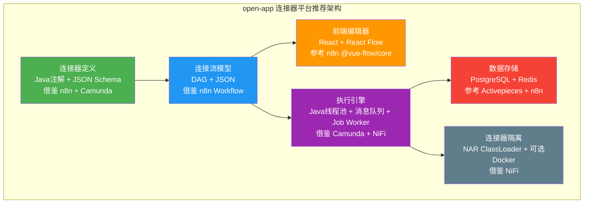

**核心借鉴策略**：
- **连接器定义**：融合 n8n 的声明式描述 + Camunda 的模板标准化，用 Java 注解实现编译时检查，JSON Schema 实现运行时验证
- **连接流模型**：采用 n8n 的 DAG + JSON 方案，兼顾灵活性与可读性
- **前端编辑器**：React + React Flow（与 n8n 使用 @vue-flow/core 思路一致，但适配 React 生态）
- **执行引擎**：借鉴 Camunda Job Worker 的分布式执行模型 + NiFi ProcessScheduler 的线程池调度
- **数据存储**：PostgreSQL（持久化）+ Redis（缓存/队列），参考 Activepieces 和 n8n 的成熟实践
- **连接器隔离**：Java 原生 NAR ClassLoader 隔离 + 可选 Docker 容器隔离（高安全场景）

---

## 二、平台技术栈对比

### 2.1 技术栈全景对比

| 维度 | Apache NiFi | Camunda 8 | n8n | Activepieces | Node-RED | Airbyte |
|------|-------------|-----------|-----|--------------|----------|---------|
| **前端框架** | Angular 15+ | React 18 | Vue 3 | React 18 | 原生JS | React 18 |
| **前端画布** | D3.js SVG | bpmn-js | @vue-flow/core | 自定义Step Builder | 原生SVG path | 分步向导(无画布) |
| **后端语言** | Java 17+ | Java 17 (Zeebe) | Node.js (TypeScript) | TypeScript (NestJS) | Node.js | Java 17 + Python 3.9+ |
| **后端框架** | Spring + NiFi Runtime | Zeebe + Spring Boot | Express.js | NestJS | Express.js | Micronaut + Temporal |
| **主数据库** | H2/PostgreSQL/MySQL | PostgreSQL | PostgreSQL/SQLite | PostgreSQL | SQLite/文件 | PostgreSQL |
| **缓存/队列** | 内置队列 | Hazelcast | Redis (Bull Queue) | Redis (Bull Queue) | 无 | Redis |
| **搜索引擎** | 无 | Elasticsearch | 无 | 无 | 无 | 无 |
| **消息协议** | HTTP/Site-to-Site | gRPC + REST | REST + WebSocket | REST + WebSocket | REST + WebSocket | REST + gRPC |
| **容器化** | Docker/K8s | Docker/K8s/Helm | Docker | Docker | Docker | Docker/K8s/Helm |
| **CI/CD** | Maven + Jenkins | Gradle + GitHub Actions | pnpm + GitHub Actions | npm + GitHub Actions | npm + GitHub Actions | Gradle + GitHub Actions |
| **许可证** | Apache 2.0 | Apache 2.0 | Fair-code (Sustainable Use) | MIT | Apache 2.0 | MIT + ELv2 |
| **GitHub Stars** | ~4.9k | ~3.5k | ~60k | ~12k | ~20k | ~17k |
| **首次发布** | 2014 (NiFi孵化) | 2022 (Camunda 8) | 2019 | 2022 | 2013 | 2020 |
| **社区活跃度** | 中高 | 高 | 极高 | 高 | 极高 | 高 |

### 2.2 技术栈与 open-app 匹配度评估

open-app 的技术栈为 **JS（前端）+ Java（后端）**，以下评估各平台技术栈与 open-app 的匹配度：

| 平台 | 后端匹配度 | 前端匹配度 | 综合匹配度 | 说明 |
|------|-----------|-----------|-----------|------|
| **Apache NiFi** | ⭐⭐⭐⭐⭐ | ⭐⭐ | ⭐⭐⭐⭐ | 后端纯Java，架构设计可完全借鉴；前端Angular与React差异大，交互设计可参考但代码不可复用 |
| **Camunda 8** | ⭐⭐⭐⭐⭐ | ⭐⭐⭐ | ⭐⭐⭐⭐ | 后端Java+gRPC，执行引擎架构最值得借鉴；前端React，部分组件可复用；bpmn-js可集成 |
| **n8n** | ⭐⭐ | ⭐⭐⭐⭐ | ⭐⭐⭐ | 后端Node.js与Java差异大，架构思路可借鉴但代码不可复用；前端Vue 3思路可迁移到React |
| **Activepieces** | ⭐⭐ | ⭐⭐⭐⭐ | ⭐⭐⭐ | 后端TypeScript/NestJS，架构模式可借鉴；前端React，交互模式可直接参考 |
| **Node-RED** | ⭐⭐ | ⭐⭐ | ⭐⭐⭐ | 前端原生JS+SVG，技术栈差异大但拖拽编辑器设计理念值得借鉴 |
| **Airbyte** | ⭐⭐⭐⭐ | ⭐⭐⭐ | ⭐⭐⭐⭐ | 后端Java+Python混合，Java部分可参考；Temporal工作流引擎可集成 |

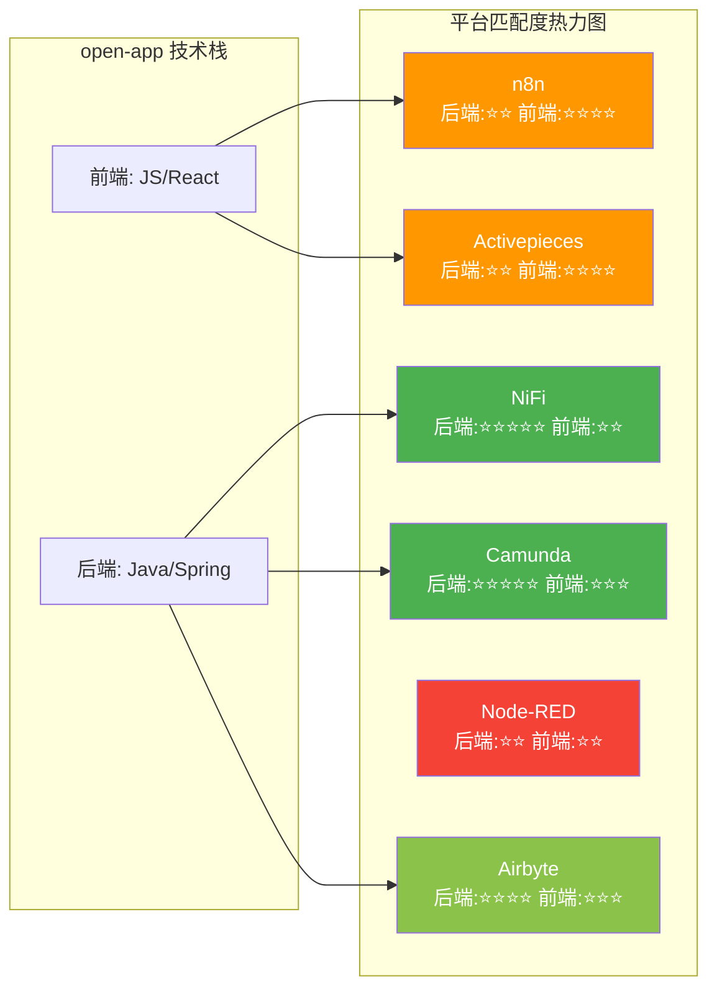

### 2.3 许可证风险详细分析

| 平台 | 许可证 | 商业使用 | 修改分发 | 专利授权 | SaaS限制 | 风险等级 |
|------|--------|---------|---------|---------|---------|---------|
| **Apache NiFi** | Apache 2.0 | ✅ 自由 | ✅ 自由 | ✅ 包含 | ❌ 无 | 🟢 低 |
| **Camunda 8** | Apache 2.0 | ✅ 自由 | ✅ 自由 | ✅ 包含 | ❌ 无 | 🟢 低 |
| **n8n** | Fair-code (Sustainable Use) | ⚠️ 有限制 | ⚠️ 需保留声明 | ❌ 不包含 | ✅ 不可作为竞品SaaS | 🟡 中 |
| **Activepieces** | MIT | ✅ 自由 | ✅ 自由 | ❌ 不包含 | ❌ 无 | 🟢 低 |
| **Node-RED** | Apache 2.0 | ✅ 自由 | ✅ 自由 | ✅ 包含 | ❌ 无 | 🟢 低 |
| **Airbyte** | MIT + ELv2 | ⚠️ 部分连接器限制 | ⚠️ ELv2部分限制 | ❌ 不包含 | ⚠️ 部分限制 | 🟡 中 |

> **注意**：n8n 的 Fair-code 许可证允许内部使用和修改，但不允许将其作为竞品 SaaS 服务提供。open-app 作为企业内部平台使用不构成风险，但需注意不可将 n8n 代码直接嵌入对外售卖的 SaaS 产品中。Airbyte 的 ELv2（Elastic License 2.0）对部分连接器有限制，需逐个确认。

---

## 三、连接器定义模型对比

> **本章是核心重点**：连接器定义模型决定了平台的可扩展性、开发体验和类型安全性，是连接器平台的基石。

### 3.1 各平台连接器定义方式详解

#### 3.1.1 Apache NiFi — Processor 接口 + PropertyDescriptor

NiFi 采用纯 Java 接口驱动的命令式模型：

```java
// NiFi Processor 定义示例
@Tags({"HTTP", "REST"})
@CapabilityDescription("Fetches data from an HTTP endpoint")
public class InvokeHTTP extends AbstractProcessor {
    // 属性声明
    public static final PropertyDescriptor PROP_URL = new PropertyDescriptor.Builder()
        .name("Remote URL")
        .description("The URL to send the request to")
        .required(true)
        .addValidator(StandardValidators.URL_VALIDATOR)
        .expressionLanguageSupported(ExpressionLanguageScope.FLOWFILE_ATTRIBUTES)
        .build();
    
    // 关系定义
    public static final Relationship REL_SUCCESS = new Relationship.Builder()
        .name("success")
        .description("Successful responses")
        .build();
    
    @Override
    public void onTrigger(ProcessContext context, ProcessSession session) {
        // 执行逻辑
    }
}
```

**核心要素**：
- `Processor` 接口：定义生命周期方法（onTrigger, initialize, onScheduled 等）
- `PropertyDescriptor`：声明式属性定义，支持验证器、表达式语言、动态属性
- `Relationship`：定义输出关系（success, failure, retry 等）
- `ProcessSession`：管理 FlowFile 的创建、读取、传输
- `@Tags` / `@CapabilityDescription`：元数据注解
- `ValidationContext`：自定义验证逻辑

#### 3.1.2 Camunda 8 — Connector Template JSON + @OutboundConnector

Camunda 8 采用 JSON 模板 + Java 注解的混合模型：

```json
// Connector Template JSON (前端UI定义)
{
  "$schema": "https://unpkg.com/@camunda/element-templates-json-schema/resources/schema.json",
  "name": "REST Connector",
  "id": "io.camunda.connectors.HttpJson.v1",
  "version": 5,
  "properties": [
    {
      "id": "method",
      "type": "Dropdown",
      "value": "GET",
      "choices": ["GET", "POST", "PUT", "DELETE"],
      "binding": { "name": "method" }
    },
    {
      "id": "url",
      "type": "String",
      "optional": false,
      "binding": { "name": "url" }
    }
  ]
}
```

```java
// Java 注解定义 (后端执行)
@OutboundConnector(
    name = "REST Connector",
    type = "io.camunda:http-json:1",
    inputVariables = {"method", "url", "headers", "body"},
    version = 1
)
public class HttpJsonFunction implements OutboundConnectorFunction {
    @Override
    public Object execute(OutboundConnectorContext context) {
        var request = context.bindVariables(HttpJsonRequest.class);
        // 执行逻辑
    }
}
```

**核心要素**：
- `Connector Template JSON`：定义前端 UI 表单（属性面板），包含类型、绑定关系、验证规则
- `@OutboundConnector` / `@InboundConnector`：Java 注解，声明连接器元数据
- `OutboundConnectorFunction`：执行接口，通过 `bindVariables` 自动绑定输入
- `Secret` 注解：标记敏感字段，运行时自动从 Secret Store 解析
- `element-templates-json-schema`：JSON Schema 标准，前端可渲染动态表单

#### 3.1.3 n8n — INodeTypeDescription + INodeProperties + Credential

n8n 采用纯 TypeScript 声明式模型，类型安全程度最高：

```typescript
// n8n 节点定义示例
export class HttpNode implements INodeType {
  description: INodeTypeDescription = {
    displayName: 'HTTP Request',
    name: 'httpRequest',
    icon: 'fa:link',
    group: ['output'],
    version: [1, 2, 3],              // 多版本支持
    description: 'Makes an HTTP request',
    defaults: { name: 'HTTP Request' },
    inputs: ['main'],
    outputs: ['main'],
    credentials: [{                   // 认证定义
      name: 'httpBasicAuth',
      displayedName: 'Basic Auth',
      required: true,
    }],
    properties: [                     // 属性定义（动态表单）
      {
        displayName: 'Method',
        name: 'method',
        type: 'options',             // 类型系统
        noDataExpression: true,
        options: [
          { name: 'GET', value: 'GET' },
          { name: 'POST', value: 'POST' },
        ],
        default: 'GET',
      },
      {
        displayName: 'URL',
        name: 'url',
        type: 'string',
        default: '',
        placeholder: 'https://example.com',
        required: true,
      },
    ],
  };

  async execute(this: IExecuteFunctions): Promise<INodeExecutionData[][]> {
    // 执行逻辑
  }
}
```

**核心要素**：
- `INodeTypeDescription`：节点元数据（名称、图标、版本、分组、输入输出）
- `INodeProperties`：属性定义数组，支持丰富的类型系统（string, number, options, collection, fixedCollection, multiOptions 等）
- `credentials`：认证凭证定义，与属性系统分离
- **条件显示**：`displayOptions` 支持基于其他属性值的条件显示/隐藏
- **多版本共存**：`version` 数组支持同一节点多版本并存
- `INodeExecutionData`：节点执行结果的标准数据结构

#### 3.1.4 Activepieces — Piece 类 + Zod Schema Props + PieceAuth

Activepieces 采用 TypeScript 类 + Zod Schema 的运行时验证模型：

```typescript
// Activepieces Piece 定义示例
export const httpPiece = createPiece({
  name: 'http',
  displayName: 'HTTP',
  logoUrl: 'https://cdn.activepieces.com/pieces/http.png',
  auth: PieceAuth.None(),            // 或 PieceAuth.BasicAuth({...})
  actions: [
    createAction({
      name: 'send_request',
      displayName: 'Send Request',
      description: 'Send an HTTP request',
      props: {                        // Zod Schema Props
        method: Property.StaticDropdown({
          displayName: 'Method',
          options: {
            options: [
              { label: 'GET', value: 'GET' },
              { label: 'POST', value: 'POST' },
            ],
          },
          required: true,
        }),
        url: Property.ShortText({
          displayName: 'URL',
          description: 'The URL to send the request to',
          required: true,
        }),
      },
      async run(context) {
        const { method, url } = context.propsValue;
        // 执行逻辑
      },
    }),
  ],
  triggers: [],                       // 触发器定义
});
```

**核心要素**：
- `createPiece`：工厂函数，创建连接器包（Piece）
- `Property.*`：属性定义工具，基于 Zod Schema 运行时验证
- `PieceAuth`：认证定义（None, BasicAuth, CustomAuth, OAuth2, SecretText）
- `createAction` / `createTrigger`：动作和触发器定义
- `context.propsValue`：运行时属性值，自动验证和类型推断
- `context.auth`：运行时认证信息，自动注入

#### 3.1.5 Node-RED — HTML + JS 配对 + defaults + credentials

Node-RED 采用 HTML+JS 双文件配对的独特模型：

```html
<!-- HTTP Request 节点 - HTML 文件 -->
<script type="text/html" data-template-name="http request">
    <div class="form-row">
        <label for="node-input-method"><i class="fa fa-tasks"></i> Method</label>
        <select id="node-input-method" style="width:70%;">
            <option value="GET">GET</option>
            <option value="POST">POST</option>
            <option value="PUT">PUT</option>
            <option value="DELETE">DELETE</option>
        </select>
    </div>
    <div class="form-row">
        <label for="node-input-url"><i class="fa fa-globe"></i> URL</label>
        <input id="node-input-url" type="text" placeholder="http://">
    </div>
</script>

<script type="text/javascript">
    RED.nodes.registerType('http request', {
        category: 'function',
        color: "#E2D96E",
        defaults: {
            name: {value: ""},
            method: {value: "GET"},
            url: {value: "", required: true},
        },
        credentials: {
            user: {type: "text"},
            password: {type: "password"}
        },
        inputs: 1,
        outputs: 1,
        icon: "white-globe.png",
        label: function() { return this.name || this.url; }
    });
</script>
```

**核心要素**：
- **双文件配对**：HTML（UI 模板 + JS 注册逻辑）+ JS（执行逻辑）
- `defaults`：节点默认属性声明，支持 required、validate
- `credentials`：凭证定义，加密存储
- `data-template-name`：HTML 模板与注册名对应
- `RED.nodes.registerType`：注册函数，声明元数据
- **无类型系统**：纯 JavaScript，无编译时类型检查

#### 3.1.6 Airbyte — AirbyteSpec JSON Schema + Python CDK + YAML Manifest

Airbyte 采用三层定义模型：YAML Manifest → JSON Schema → Python CDK：

```yaml
# YAML Manifest (低代码定义)
source:
  type: "http-request"
  definitionId: "abc-123"
  dockerRepository: "airbyte/source-http-request"
  dockerImageTag: "0.1.0"
  documentationUrl: "https://docs.airbyte.com/integrations/sources/http-request"
  spec:
    connectionSpecification:
      $schema: "http://json-schema.org/draft-07/schema#"
      title: "HTTP Request Source Spec"
      type: "object"
      required: ["url"]
      properties:
        url:
          type: "string"
          description: "The URL to fetch data from"
          pattern: "^https?://"
        http_method:
          type: "string"
          enum: ["GET", "POST"]
          default: "GET"
    authSpecification:
      auth_type: "oauth2.0"
      oauth2Specification:
        authFlowType: "authorization_code"
```

```python
# Python CDK (高级定义)
class HttpRequestSource(HttpSource):
    def check_connection(self, logger, config) -> Tuple[bool, any]:
        # 连接检查
        pass
    
    def streams(self, config) -> List[Stream]:
        return [CustomStream(config)]
```

**核心要素**：
- `AirbyteSpec`：JSON Schema 格式的连接器规范（connectionSpecification）
- `YAML Manifest`：低代码定义方式，自动生成 Python 代码框架
- `Python CDK`：编程式定义，提供 AbstractSource、Stream、HttpStream 等基类
- `authSpecification`：独立的认证规范定义
- `Docker 容器化**：每个连接器封装为 Docker 镜像，独立运行
- **Catalog**：数据流目录（AirbyteCatalog），定义可同步的数据流

### 3.2 连接器定义模型横向对比

| 对比维度 | Apache NiFi | Camunda 8 | n8n | Activepieces | Node-RED | Airbyte |
|---------|-------------|-----------|-----|--------------|----------|---------|
| **定义范式** | 命令式(Java接口) | 声明式+命令式混合 | 声明式(TypeScript) | 声明式(TypeScript+Zod) | 声明式(HTML+JS) | 声明式(YAML/JSON)+命令式(Python) |
| **类型安全** | ⭐⭐⭐ (Java编译时) | ⭐⭐⭐⭐ (Java+JSON Schema) | ⭐⭐⭐⭐⭐ (TypeScript严格) | ⭐⭐⭐⭐ (Zod运行时) | ⭐ (无类型) | ⭐⭐⭐ (JSON Schema) |
| **动态表单支持** | ⭐⭐⭐ (PropertyDescriptor) | ⭐⭐⭐⭐ (Element Template) | ⭐⭐⭐⭐⭐ (displayOptions) | ⭐⭐⭐⭐ (Property.* ) | ⭐⭐ (HTML手动) | ⭐⭐⭐ (JSON Schema) |
| **条件属性显示** | ✅ (Expression Language) | ✅ (constraints) | ✅ (displayOptions) | ✅ (Zod refine) | ❌ (手动JS) | ⚠️ (有限) |
| **认证定义** | PropertyDescriptor | Secret注解+SecretStore | credentials分离定义 | PieceAuth枚举 | credentials加密 | authSpecification独立 |
| **版本管理** | ❌ 无内建 | ✅ Template version | ✅ 多版本并存 | ❌ 无内建 | ❌ 无内建 | ✅ Docker tag + Spec版本 |
| **表达式语言** | ✅ NiFi EL + Groovy | ✅ FEEL表达式 | ✅ 表达式语法{{}} | ✅ 插值语法{{}} | ✅ Mustache模板 | ❌ 无 |
| **文档自动生成** | ✅ (@CapabilityDescription) | ✅ (Template) | ✅ (description字段) | ✅ (description) | ❌ | ✅ (documentationUrl) |
| **扩展包格式** | NAR (ClassLoader隔离) | JAR | npm package | npm package | npm package | Docker镜像 |
| **开发者门槛** | 高(Java) | 中(Java+JSON) | 中(TypeScript) | 低(TypeScript) | 低(JS) | 中(YAML/Python) |

### 3.3 声明式 vs 命令式对比分析

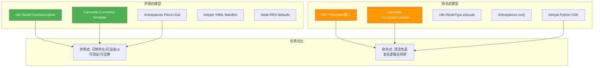

### 3.4 open-app 推荐连接器定义方案

**推荐方案：Java 注解 + JSON Schema 元数据**

结合 n8n 的声明式描述模型和 Camunda 的 Template 标准化，设计 open-app 的连接器定义模型：

```java
// open-app 连接器定义示例
@ConnectorDefinition(
    name = "HTTP Request",
    type = "openapp:http-request",
    version = 1,
    icon = "http",
    category = "network",
    description = "Sends an HTTP request to a specified URL"
)
public class HttpRequestConnector implements ConnectorExecutor {
    
    @ConnectorProperty(
        displayName = "Method",
        type = PropertyType.OPTIONS,
        required = true,
        options = {"GET", "POST", "PUT", "DELETE", "PATCH"},
        defaultValue = "GET",
        group = "request"
    )
    private String method;
    
    @ConnectorProperty(
        displayName = "URL",
        type = PropertyType.STRING,
        required = true,
        placeholder = "https://api.example.com/data",
        group = "request",
        validate = @Validation(pattern = "^https?://")
    )
    private String url;
    
    @ConnectorAuth(
        type = AuthType.OAUTH2,
        supportedTypes = {AuthType.NONE, AuthType.BASIC, AuthType.OAUTH2, AuthType.API_KEY}
    )
    private ConnectorAuthConfig auth;
    
    @Override
    public ConnectorOutput execute(ConnectorContext context) {
        // 执行逻辑
    }
}
```

**设计要点**：
1. **@ConnectorDefinition** 注解提供编译时元数据检查，替代 n8n 的 INodeTypeDescription
2. **@ConnectorProperty** 注解声明属性，自动生成 JSON Schema 用于前端表单渲染
3. **@ConnectorAuth** 独立认证定义，借鉴 n8n credentials 分离模式
4. **JSON Schema 自动生成**：从 Java 注解自动生成前端可消费的 JSON Schema
5. **版本管理**：`version` 字段支持多版本共存，借鉴 n8n 和 Camunda
6. **条件显示**：`displayOptions` 字段在生成的 JSON Schema 中表达

---

## 四、连接流数据模型对比

> **本章是核心重点**：连接流数据模型决定了平台的编排能力上限，包括支持的工作流复杂度、错误处理能力和状态追踪粒度。

### 4.1 各平台 Flow 数据模型详解

#### 4.1.1 Apache NiFi — FlowFile + ProcessGroup + Connection（背压）

NiFi 的数据模型以数据流为核心，强调数据流量的精确控制：

```
FlowFile（数据单元）
├── attributes（元数据 Map<String,String>）
├── contentClaim（内容引用，存储在 ContentRepository）
│
ProcessGroup（流程组，支持嵌套）
├── connections[]（连接，定义队列）
│   ├── source（上游 Processor/ProcessGroup）
│   ├── destination（下游 Processor/ProcessGroup）
│   ├── flowFileQueue（队列实现）
│   │   ├── backPressureDataSizeThreshold（背压-数据量阈值）
│   │   ├── backPressureObjectThreshold（背压-对象数阈值）
│   │   ├── flowFileExpiration（过期时间）
│   │   └── prioritizers（优先级排序器）
│   ├── bending（ bends[] 弯曲点坐标）
│   └── name
├── processors[]（处理器实例）
├── funnels[]（分流器）
├── ports[]（输入/输出端口，跨ProcessGroup通信）
├── remoteProcessGroups[]（远程流程组，Site-to-Site通信）
└── processGroups[]（子流程组，递归嵌套）
```

**核心特征**：
- **背压机制**：Connection 队列支持数据量和对象数双重阈值，达到阈值时自动暂停上游处理器
- **FlowFile 不可变**：每次处理生成新的 FlowFile，支持完整的数据血缘追踪
- **嵌套 ProcessGroup**：支持无限层级的流程组嵌套，实现模块化
- **Content Repository**：内容与属性分离，支持巨大的数据量处理
- **优先级排序**：队列支持多种优先级策略（FIFO, LIFO, NewestFirst, OldestFirst, PriorityAttributePrioritizer）

#### 4.1.2 Camunda 8 — BPMN 2.0 XML + ProcessInstance + Job

Camunda 采用 BPMN 2.0 标准模型，企业级流程引擎：

```xml
<!-- BPMN 2.0 XML 定义 -->
<definitions>
  <process id="order-fulfillment" isExecutable="true">
    <startEvent id="start" />
    <serviceTask id="check-inventory" name="Check Inventory">
      <extensionElements>
        <zeebe:taskDefinition type="io.camunda:http-json:1" />
        <zeebe:taskHeader key="method">GET</zeebe:taskHeader>
        <zeebe:taskHeader key="url">https://inventory/api/check</zeebe:taskHeader>
      </extensionElements>
    </serviceTask>
    <exclusiveGateway id="inventory-check" />
    <serviceTask id="reserve-items" name="Reserve Items" />
    <serviceTask id="notify-backorder" name="Notify Backorder" />
    <endEvent id="end" />
    <!-- 连线定义 -->
    <sequenceFlow sourceRef="start" targetRef="check-inventory" />
    <sequenceFlow sourceRef="check-inventory" targetRef="inventory-check" />
    <sequenceFlow sourceRef="inventory-check" targetRef="reserve-items">
      <conditionExpression>true</conditionExpression>
    </sequenceFlow>
    <sequenceFlow sourceRef="inventory-check" targetRef="notify-backorder">
      <conditionExpression>false</conditionExpression>
    </sequenceFlow>
  </process>
</definitions>
```

**核心特征**：
- **BPMN 2.0 标准**：行业标准流程建模语言，支持网关（排他/并行/包含）、子流程、事件等
- **ProcessInstance**：流程实例，持久化到 Hazelcast + Elasticsearch
- **Job**：任务单元，由 Job Worker 拉取执行，支持重试和超时
- **Variable Scope**：变量作用域（流程级/局部级），支持复杂的数据传递
- **Incident**：故障机制，任务失败超重试次数后创建 Incident，需人工处理
- **Exporter**：数据导出器，支持将流程数据导出到外部系统

#### 4.1.3 n8n — Workflow JSON（nodes[] + connections{}）+ INodeExecutionData

n8n 采用简洁灵活的 JSON DAG 模型：

```json
{
  "id": "workflow-123",
  "name": "My Workflow",
  "active": true,
  "nodes": [
    {
      "id": "abc123",
      "name": "HTTP Request",
      "type": "n8n-nodes-base.httpRequest",
      "typeVersion": 3,
      "position": [250, 300],
      "parameters": {
        "method": "POST",
        "url": "https://api.example.com/data",
        "body": "={\"key\": \"{{ $json.userId }}\"}"
      },
      "credentials": {
        "httpBasicAuth": {
          "id": "cred-1",
          "name": "My API Auth"
        }
      }
    },
    {
      "id": "def456",
      "name": "IF",
      "type": "n8n-nodes-base.if",
      "typeVersion": 2,
      "position": [450, 300],
      "parameters": {
        "conditions": {
          "string": [{
            "value1": "={{ $json.status }}",
            "operation": "equals",
            "value2": "success"
          }]
        }
      }
    }
  ],
  "connections": {
    "HTTP Request": {
      "main": [
        [{ "node": "IF", "type": "main", "index": 0 }]
      ]
    },
    "IF": {
      "main": [
        [{ "node": "Success Handler", "type": "main", "index": 0 }],
        [{ "node": "Error Handler", "type": "main", "index": 0 }]
      ]
    }
  },
  "settings": {
    "executionOrder": "v1"
  }
}
```

**核心特征**：
- **DAG 模型**：nodes 数组 + connections 对象，清晰表达有向无环图
- **INodeExecutionData**：`{ json: {}, pairedItem: {} }`，支持数据血缘追踪
- **表达式系统**：`{{ $json.field }}` 支持跨节点数据引用
- **多输出**：节点可定义多个输出端口（如 IF 节点有 true/false 两个输出）
- **子工作流**：Execute Workflow 节点支持嵌套调用
- **执行版本**：`executionOrder: "v1"` 控制执行语义

#### 4.1.4 Activepieces — Flow（Trigger → Steps 线性）+ FlowVersion + FlowRun

Activepieces 采用线性 Step Builder 模型：

```typescript
// Flow 数据模型
interface Flow {
  id: string;
  displayName: string;
  projectId: string;
  folderId: string | null;
  versions: FlowVersion[];           // 版本历史
}

interface FlowVersion {
  id: string;
  displayName: string;
  trigger: Trigger;                  // 触发器（唯一入口）
  steps: Step[];                     // 步骤列表（线性排列）
  valid: boolean;
  updatedBy: string;
  created: string;
}

interface Trigger {
  name: string;
  type: string;                      // 如 'schedule', 'webhook', 'piece_trigger'
  settings: TriggerSettings;
  nextStepName: string | null;       // 指向第一个Step
}

interface Step {
  name: string;
  type: string;                      // 如 'piece_action', 'code', 'branch'
  displayName: string;
  settings: StepSettings;
  nextStepName: string | null;       // 线性指向下一个Step
}

// Branch 步骤扩展线性为分支
interface BranchStep extends Step {
  settings: {
    condition: Condition[];
    onSuccessStepName: string | null;  // 条件真分支
    onFailureStepName: string | null;  // 条件假分支
  };
}
```

**核心特征**：
- **线性编排**：Trigger → Step1 → Step2 → ... → StepN，本质是线性链表
- **Branch 扩展**：通过 Branch 步骤实现条件分支，但本质仍是 nextStepName 指针
- **版本管理**：FlowVersion 完整记录每次修改，支持版本对比和回滚
- **FlowRun**：执行实例，记录步骤执行状态、输入输出
- **无 DAG**：不支持并行分支汇聚（merge），复杂流程表达力有限

#### 4.1.5 Node-RED — Flow JSON（[{id, type, wires}]）+ msg 对象

Node-RED 采用极简的 JSON 数组 + wires 连线模型：

```json
[
  {
    "id": "node-1",
    "type": "http in",
    "name": "HTTP Input",
    "url": "/api/data",
    "method": "post",
    "wires": [["node-2"]]
  },
  {
    "id": "node-2",
    "type": "function",
    "name": "Transform",
    "func": "msg.payload = { result: msg.payload.value * 2 };\nreturn msg;",
    "outputs": 1,
    "wires": [["node-3", "node-4"]]   // 扇出：同时连到两个节点
  },
  {
    "id": "node-3",
    "type": "http request",
    "name": "API Call",
    "url": "https://api.example.com",
    "method": "POST",
    "wires": [["node-5"]]
  },
  {
    "id": "node-4",
    "type": "debug",
    "name": "Debug Log",
    "wires": []
  },
  {
    "id": "node-5",
    "type": "http response",
    "name": "Response",
    "wires": []
  }
]
```

**核心特征**：
- **扁平数组**：所有节点在同一个 JSON 数组中，无嵌套
- **wires 连线**：`wires: [[id1, id2], [id3]]`，二维数组表示多输出端口
- **msg 对象**：`{ payload, topic, _msgid }`，节点间传递的标准消息对象
- **子流程（Subflow）**：通过 type="subflow" 实现节点分组
- **Tab 分组**：UI 层面的分组，不影响执行语义
- **克隆语义**：msg 在扇出时自动克隆，避免状态共享

#### 4.1.6 Airbyte — Connection（Source + Destination + Catalog + Schedule）+ SyncJob

Airbyte 的数据模型面向数据同步场景，与通用工作流平台差异较大：

```json
{
  "connectionId": "conn-123",
  "sourceId": "src-456",
  "destinationId": "dst-789",
  "sourceCatalogId": "cat-001",
  "catalogId": "cat-002",
  "syncCatalog": {
    "streams": [
      {
        "stream": {
          "name": "users",
          "jsonSchema": {
            "type": "object",
            "properties": {
              "id": { "type": "integer" },
              "name": { "type": "string" },
              "email": { "type": "string" }
            }
          }
        },
        "config": {
          "syncMode": "incremental",
          "destinationSyncMode": "append_dedup",
          "selected": true,
          "primaryKey": [["id"]],
          "cursorField": ["updated_at"]
        }
      }
    ]
  },
  "scheduleType": "cron",
  "scheduleData": {
    "cron": {
      "cronExpression": "0 0 * * *",
      "cronTimeZone": "UTC"
    }
  },
  "status": "active",
  "namespaceDefinition": "source",
  "prefix": "src_"
}
```

**核心特征**：
- **Source → Destination**：单向数据管道，无复杂分支
- **Catalog**：数据流目录，描述可同步的数据流及其 Schema
- **SyncMode**：full_refresh | incremental，支持增量同步
- **SyncJob**：同步任务实例，记录执行状态、数据量统计
- **Schedule**：定时调度（cron 表达式）
- **无通用编排**：不支持条件分支、循环、子流程等通用工作流能力

### 4.2 Flow 数据模型横向对比

| 对比维度 | Apache NiFi | Camunda 8 | n8n | Activepieces | Node-RED | Airbyte |
|---------|-------------|-----------|-----|--------------|----------|---------|
| **图模型** | DAG（有向无环图） | BPMN 2.0（有向图+事件） | DAG | 线性链表+Branch | DAG（扁平） | 线性管道 |
| **嵌套支持** | ✅ ProcessGroup递归嵌套 | ✅ 子流程/调用活动 | ✅ ExecuteWorkflow子流程 | ❌ 无嵌套 | ⚠️ Subflow有限嵌套 | ❌ 无嵌套 |
| **并行执行** | ✅ 多Connection并行 | ✅ 并行网关 | ✅ 多输出并行 | ❌ 无并行 | ✅ 扇出并行 | ❌ 单管道 |
| **汇聚(Merge)** | ✅ 多输入Connection | ✅ 并行网关汇聚 | ✅ 多输入汇聚 | ❌ 无汇聚 | ✅ 多输入汇聚 | ❌ 无 |
| **循环支持** | ❌ 无环 | ✅ 循环事件/子流程 | ⚠️ Loop节点 | ❌ 无 | ⚠️ 有限 | ❌ 无 |
| **版本管理** | ⚠️ 流程版本（有限） | ✅ Process Definition版本 | ✅ Workflow版本列表 | ✅ FlowVersion完整 | ❌ 无 | ✅ 连接器版本 |
| **状态追踪** | ✅ FlowFile血缘 | ✅ ProcessInstance+Incident | ✅ Execution ID | ✅ FlowRun步骤追踪 | ⚠️ Debug模式 | ✅ SyncJob状态 |
| **错误处理** | ✅ Relationship(failure) | ✅ 边界事件+错误事件 | ✅ Error Trigger+继续 | ✅ 步骤失败处理 | ⚠️ Catch节点 | ✅ SyncJob失败 |
| **背压/流控** | ✅ 背压阈值 | ✅ 作业速率限制 | ❌ 无 | ❌ 无 | ❌ 无 | ⚠️ 限流 |
| **数据血缘** | ✅ FlowFile provenance | ✅ Variable scope | ✅ pairedItem | ❌ 无 | ❌ 无 | ⚠️ Catalog追踪 |
| **序列化格式** | JSON (flow.xml.gz) | BPMN XML | JSON | JSON (DB) | JSON | JSON (DB) |
| **条件分支** | ✅ RouteOnAttribute | ✅ 排他网关 | ✅ IF/Switch节点 | ✅ Branch步骤 | ✅ Switch节点 | ❌ 无 |

### 4.3 模型复杂度与灵活性对比图

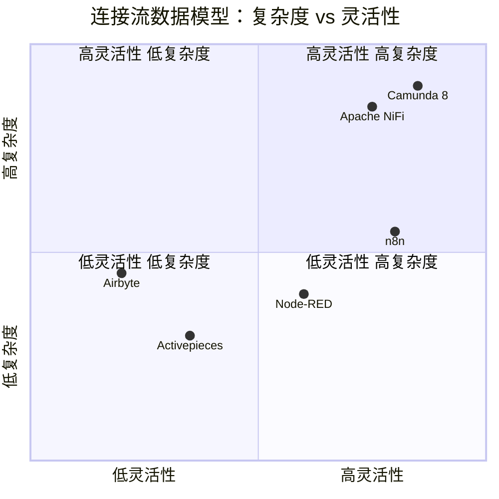

### 4.4 open-app 推荐连接流数据模型方案

**推荐方案：DAG + JSON Schema**

借鉴 n8n 的 Workflow JSON 模型，设计 open-app 的连接流数据模型：

```json
{
  "id": "flow-123",
  "name": "消息通知流程",
  "version": 2,
  "description": "根据消息类型分发给不同渠道",
  "nodes": [
    {
      "id": "trigger-1",
      "type": "openapp:webhook-trigger",
      "name": "接收消息",
      "position": { "x": 200, "y": 300 },
      "config": { "path": "/messages" },
      "outputs": [
        { "id": "out-1", "name": "message", "type": "main" }
      ]
    },
    {
      "id": "router-1",
      "type": "openapp:switch",
      "name": "消息路由",
      "position": { "x": 450, "y": 300 },
      "config": {
        "rules": [
          { "output": "email", "condition": "{{ $json.type === 'email' }}" },
          { "output": "sms", "condition": "{{ $json.type === 'sms' }}" },
          { "output": "im", "condition": "{{ $json.type === 'im' }}" }
        ]
      },
      "inputs": [{ "id": "in-1", "name": "message", "type": "main" }],
      "outputs": [
        { "id": "out-email", "name": "email", "type": "branch" },
        { "id": "out-sms", "name": "sms", "type": "branch" },
        { "id": "out-im", "name": "im", "type": "branch" }
      ]
    },
    {
      "id": "conn-email",
      "type": "openapp:smtp-sender",
      "name": "发送邮件",
      "position": { "x": 700, "y": 150 },
      "config": {
        "to": "{{ $json.recipient }}",
        "subject": "{{ $json.subject }}",
        "body": "{{ $json.content }}"
      }
    }
  ],
  "edges": [
    { "id": "e1", "source": "trigger-1", "sourceOutput": "out-1", "target": "router-1", "targetInput": "in-1" },
    { "id": "e2", "source": "router-1", "sourceOutput": "out-email", "target": "conn-email" }
  ],
  "settings": {
    "errorStrategy": "continue",
    "maxRetries": 3,
    "retryDelay": 5000,
    "timeout": 300000
  }
}
```

**设计要点**：
1. **nodes + edges 分离**：借鉴 n8n 的 nodes[]+connections{} 模式，但用 edges[] 替代 connections{}（更直观）
2. **DAG 保证**：运行时验证无环，循环通过特殊 Loop 节点实现
3. **版本管理**：`version` 字段 + 版本历史表
4. **表达式系统**：`{{ $json.field }}` 语法，借鉴 n8n
5. **错误策略**：`settings.errorStrategy` 支持 continue/stop/fallback
6. **位置信息**：`position` 字段支持前端编辑器还原布局

---

## 五、前端拖拽编辑器对比

> **本章是核心重点**：前端编辑器是用户与连接器平台交互的核心界面，直接影响用户体验和开发效率。

### 5.1 各平台前端编辑器实现详解

#### 5.1.1 Apache NiFi — Angular + D3.js SVG

**架构特点**：
- **画布渲染**：D3.js 操作 SVG，手动管理 DOM 节点
- **拖拽实现**：D3.js drag behavior（d3.drag()），自定义拖拽约束
- **连线渲染**：D3.js 绘制贝塞尔曲线（SVG path），支持弯曲点拖拽
- **缩放平移**：D3.js zoom behavior（d3.zoom()），transform 矩阵变换
- **节点渲染**：Angular 组件 + SVG foreignObject（嵌入 HTML）
- **属性面板**：Angular 动态表单，根据 PropertyDescriptor 渲染
- **状态管理**：Angular Service + RxJS，与 NiFi REST API 交互

**优势**：
- 高度自定义的 SVG 渲染，精确控制每个像素
- 成熟的数据流可视化（FlowFile 队列实时显示）
- 支持大型流程图（1000+ 节点）

**劣势**：
- Angular 框架重，学习曲线陡
- D3.js SVG 手动操作复杂，维护成本高
- 与 React 生态不兼容

#### 5.1.2 Camunda 8 — React + bpmn-js

**架构特点**：
- **画布渲染**：bpmn-js（基于 bpmn-moddle + diagram-js），SVG 渲染
- **拖拽实现**：diagram-js 内置拖拽系统
- **连线渲染**：bpmn-js 自动布局连线，支持手动调整路径点
- **节点渲染**：bpmn-js 内置 BPMN 元素渲染，Element Template 扩展自定义属性面板
- **属性面板**：React 组件 + bpmn-js Properties Panel 扩展
- **标准支持**：完整 BPMN 2.0 渲染（网关、事件、子流程等）

**优势**：
- BPMN 2.0 工业标准，与业务流程建模一致
- bpmn-js 生态成熟，大量插件和扩展
- React 技术栈，组件可复用

**劣势**：
- BPMN 建模偏重业务流程，技术集成场景偏重
- bpmn-js 自定义样式困难
- Element Template 生态相对封闭

#### 5.1.3 n8n — Vue 3 + @vue-flow/core

**架构特点**：
- **画布渲染**：@vue-flow/core（基于 React Flow 的 Vue 移植版），SVG + HTML 混合渲染
- **拖拽实现**：@vue-flow/core 内置拖拽（drag handler + transform）
- **连线渲染**：@vue-flow/core 贝塞尔曲线/直线/步进线，支持自定义连线类型
- **节点渲染**：Vue 3 组件作为自定义节点，支持 Teleport 嵌入
- **属性面板**：Vue 3 组件 + 动态表单（根据 INodeProperties 渲染）
- **小地图**：@vue-flow/minimap 插件
- **控件**：@vue-flow/controls 插件（缩放、适应、锁定）

**优势**：
- @vue-flow/core API 设计优雅，开发效率高
- Vue 3 Composition API + TypeScript，代码质量高
- 自定义节点灵活，视觉表现力强
- 交互体验流畅，动画效果优秀

**劣势**：
- Vue 3 与 React 生态不直接兼容
- @vue-flow/core 社区相对 React Flow 较小
- 大规模流程图（500+ 节点）性能需要优化

#### 5.1.4 Activepieces — React + 自定义 Step Builder

**架构特点**：
- **无画布**：不使用节点图拖拽，采用线性 Step Builder 模式
- **步骤编辑**：线性步骤列表，点击添加/删除步骤
- **分支编辑**：Branch 步骤展开为条件分支面板
- **属性面板**：React 组件 + 动态属性表单（根据 Zod Schema 渲染）
- **代码编辑器**：Monaco Editor（代码步骤）
- **动画**：Framer Motion 步骤展开/折叠动画

**优势**：
- 用户门槛低，无需学习图编辑
- 适合简单线性流程
- React 技术栈

**劣势**：
- 无画布可视化，复杂流程不直观
- 不支持并行分支可视化
- 线性模型限制表达能力

#### 5.1.5 Node-RED — 原生 JS + SVG path

**架构特点**：
- **画布渲染**：原生 JavaScript + SVG（无框架依赖）
- **拖拽实现**：自定义拖拽逻辑（mousedown/mousemove/mouseup 事件）
- **连线渲染**：SVG path 贝塞尔曲线，自动计算控制点
- **节点渲染**：SVG rect + text + icon（font-awesome），foreignObject 嵌入 HTML 表单
- **属性面板**：动态 HTML 表单（基于节点 defaults 定义生成）
- **信息面板**：侧边信息面板，显示节点文档

**优势**：
- 零依赖，极其轻量
- IoT 场景优化，社区节点生态丰富
- 简单直接，上手快

**劣势**：
- 无现代前端框架，代码维护困难
- SVG 性能在大型流程图下有瓶颈
- UI 交互相对原始

#### 5.1.6 Airbyte — React + 分步向导

**架构特点**：
- **无画布**：Source → Destination 单向管道，无需图编辑
- **配置向导**：分步配置（选择Source → 配置Source → 选择Destination → 配置Destination → 配置Catalog → 配置Schedule）
- **Schema 浏览器**：展示 Source 的数据流 Schema，支持勾选同步字段
- **连接列表**：Dashboard 展示所有 Connection 及其 SyncJob 状态

**优势**：
- 操作简单，低代码用户友好
- Schema 可视化清晰
- React 技术栈

**劣势**：
- 仅支持 Source→Destination 线性管道，无通用编排
- 无画布编辑器，无法可视化数据流
- 不适用于通用连接器平台

### 5.2 前端编辑器技术对比

| 对比维度 | Apache NiFi | Camunda 8 | n8n | Activepieces | Node-RED | Airbyte |
|---------|-------------|-----------|-----|--------------|----------|---------|
| **画布渲染** | D3.js SVG | bpmn-js SVG | @vue-flow/core SVG+HTML | 无画布(Step Builder) | 原生SVG | 无画布(向导) |
| **拖拽实现** | d3.drag() | diagram-js内置 | @vue-flow/core内置 | 无拖拽 | 原生事件 | 无拖拽 |
| **节点渲染** | Angular+foreignObject | bpmn-js内置 | Vue 3组件 | React组件 | SVG rect+text | React组件 |
| **连线渲染** | 贝塞尔曲线+弯曲点 | bpmn-js自动布局 | 贝塞尔/直线/步进 | 无连线 | SVG path贝塞尔 | 无连线 |
| **属性面板** | Angular动态表单 | bpmn-js Properties Panel | Vue 3动态表单 | React动态表单 | HTML动态表单 | React表单向导 |
| **表达式编辑** | NiFi EL编辑器 | FEEL表达式编辑器 | 表达式输入框+语法高亮 | 插值输入框 | Mustache编辑器 | 无 |
| **缩放/平移** | d3.zoom() | diagram-js内置 | @vue-flow/core内置 | 无 | 自定义transform | 无 |
| **小地图** | ❌ | ✅ (bpmn-js插件) | ✅ (@vue-flow/minimap) | ❌ | ❌ | ❌ |
| **撤销/重做** | ✅ | ✅ | ✅ | ⚠️ 有限 | ❌ | ❌ |
| **多选/批量操作** | ✅ | ✅ | ✅ | ❌ | ✅ | ❌ |
| **搜索节点** | ✅ | ✅ | ✅ | ✅ | ✅ | ✅ |
| **复制/粘贴** | ✅ | ✅ | ✅ | ✅ | ✅ | ❌ |
| **快捷键** | ✅ | ✅ | ✅ | ⚠️ 有限 | ✅ | ❌ |
| **移动端适配** | ❌ | ❌ | ⚠️ 有限 | ✅ | ❌ | ✅ |
| **大型流程图** | 1000+节点 | 500+节点 | 500+节点 | 不适用 | 200+节点 | 不适用 |
| **自定义主题** | ⚠️ 有限 | ✅ CSS覆盖 | ✅ CSS变量 | ✅ CSS变量 | ⚠️ 有限 | ✅ |
| **开源可复用性** | ❌ (Angular绑定) | ✅ (bpmn-js独立) | ✅ (@vue-flow/core独立) | ✅ (React组件) | ❌ (全局耦合) | ❌ (业务耦合) |

### 5.3 前端编辑器架构对比图

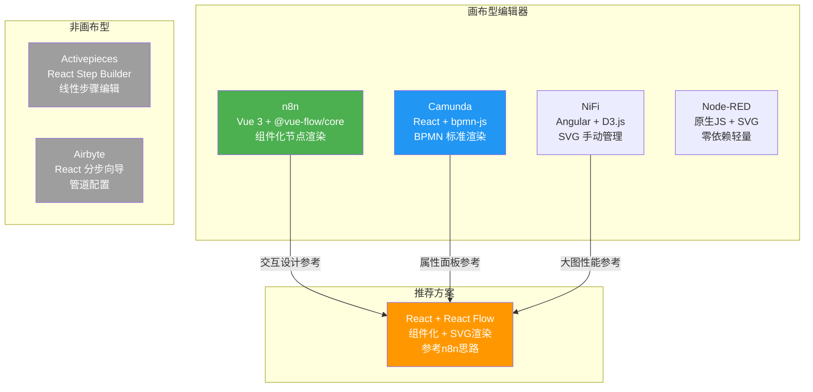

### 5.4 open-app 推荐前端方案

**推荐方案：React + React Flow**

基于 n8n 使用 @vue-flow/core 的成功经验，选择 React 生态的对应方案 React Flow：

| 方面 | 推荐选择 | 理由 |
|------|---------|------|
| **画布引擎** | React Flow | 与 @vue-flow/core 同源设计，API 风格一致，React 生态最成熟的流程图库 |
| **节点渲染** | React 组件 + SVG | 自定义节点组件，支持复杂 UI |
| **连线渲染** | React Flow 内置 | 贝塞尔/直线/步进线，自定义连线样式 |
| **属性面板** | React 组件 + JSON Schema Form | 根据 @ConnectorProperty 生成的 JSON Schema 动态渲染 |
| **表达式编辑** | Monaco Editor + 自定义语法高亮 | 支持 `{{ $json.field }}` 表达式语法 |
| **小地图** | React Flow Minimap 插件 | 大型流程图导航 |
| **代码编辑** | Monaco Editor | 代码步骤编辑 |

**React Flow vs bpmn-js 对比**：

| 维度 | React Flow | bpmn-js |
|------|-----------|---------|
| **框架绑定** | React | 框架无关 |
| **学习曲线** | 低 | 高（BPMN知识） |
| **自定义能力** | ⭐⭐⭐⭐⭐ | ⭐⭐⭐ |
| **标准合规** | 无特定标准 | BPMN 2.0 |
| **社区规模** | 25k+ Stars | 7k+ Stars |
| **适用场景** | 通用连接器编排 | 业务流程建模 |
| **与open-app契合度** | ⭐⭐⭐⭐⭐ | ⭐⭐⭐ |

---

## 六、后端执行引擎对比

### 6.1 各平台执行引擎详解

#### 6.1.1 Apache NiFi — FlowController + ProcessScheduler（线程池）+ ProcessSession

```
FlowController（主控制器）
├── ProcessScheduler（调度器）
│   ├── StandardProcessScheduler
│   │   ├── ScheduledExecutor（定时调度线程池）
│   │   └── componentLifeCycleThreadPool（组件生命周期线程池）
│   ├── ConnectableTask（可执行任务包装）
│   │   └── 逐个触发Processor.onTrigger()
│   └── ProcessContext（执行上下文）
│       ├── maxConcurrentTasks（最大并发数）
│       └── schedulingStrategy（TIMED_DRIVEN / EVENT_DRIVEN / CRON_DRIVEN）
├── ProcessSession（会话管理）
│   ├── create() / clone() / remove() FlowFile
│   ├── transfer(FlowFile, Relationship)
│   ├── commit() / rollback()
│   └── penalize(FlowFile, duration)（惩罚/延迟机制）
├── FlowFileRepository（FlowFile持久化）
├── ContentRepository（内容存储）
└── ProvenanceRepository（血缘记录）
```

**核心机制**：
- **线程池调度**：每个 Processor 可配置并发线程数（maxConcurrentTasks）
- **背压驱动**：当下游 Connection 队列满时，自动暂停上游 Processor
- **Session 事务**：ProcessSession 提供 commit/rollback 事务语义
- **惩罚机制**：penalize() 让 FlowFile 在指定时间内不可被处理
- **预写日志（WAL）**：FlowFileRepository 使用 WAL 保证不丢数据
- **定时/事件/CRON**：三种调度策略灵活配置

#### 6.1.2 Camunda 8 — StreamProcessor + Job Worker（gRPC）+ Exporter

```
Zeebe Broker（分布式引擎）
├── StreamProcessor（流处理器）
│   ├── ProcessingStateMachine
│   │   ├── 从 LogStream 读取事件
│   │   ├── 执行 BPMN 语义处理
│   │   └── 写入处理结果到 LogStream
│   └── EventApplier（事件应用器）
├── Job Management
│   ├── Job Activatable（可激活的任务）
│   ├── Job Worker（通过 gRPC 拉取任务）
│   │   ├── ActivateJobs（拉取任务请求）
│   │   ├── maxJobsToActivate（批量拉取数）
│   │   ├── requestTimeout（长轮询超时）
│   │   └── timeout（任务执行超时）
│   └── Job Retries（重试机制，递减计数）
├── Exporter（导出器接口）
│   ├── Export（导出记录到外部系统）
│   └── ElasticsearchExporter / HazelcastExporter
├── Partition（分区）
│   ├── 每个Partition独立处理
│   └── Raft共识协议保证一致性
└── LogStream（事件日志流）
    └── Append-only 日志，保证顺序
```

**核心机制**：
- **事件溯源**：所有状态变更以事件形式追加到 LogStream
- **Job Worker 拉取**：Worker 主动拉取任务（长轮询），而非推送，实现自然负载均衡
- **分区并行**：多 Partition 并行处理，水平扩展
- **重试 + Incident**：任务重试次数耗尽后创建 Incident
- **Exporter**：可插拔的数据导出器
- **Raft 共识**：保证分区数据一致性

#### 6.1.3 n8n — WorkflowExecutor + Bull Queue（Redis）+ Worker 进程

```
WorkflowExecutor（工作流执行器）
├── WorkflowExecute（单次执行）
│   ├── runWorkflow()（执行入口）
│   ├── IWorkflowExecuteAdditionalData（执行上下文）
│   └── NodeExecuteFunctions（节点执行函数集）
├── WorkflowExecutionMode
│   ├── regular（常规模式，单进程）
│   └── queue（队列模式，多Worker进程）
├── Bull Queue（Redis消息队列）
│   ├── workflowQueue（工作流执行队列）
│   │   ├── add()（入队执行请求）
│   │   └── process()（Worker处理函数）
│   ├── executionRepository（执行结果存储）
│   └── Redis（Bull Queue 后端）
├── Worker 进程（Queue模式）
│   ├── 从 Bull Queue 拉取任务
│   ├── 执行 WorkflowExecute
│   └── 结果写入 DB
└── Execution Entity（执行记录）
    ├── executionData（执行输入）
    ├── resultData（执行结果）
    ├── status（waiting/running/success/error/crashed）
    └── stoppedAt（完成时间）
```

**核心机制**：
- **单/队列双模式**：regular 模式单进程执行，queue 模式多 Worker 分布式执行
- **Bull Queue**：基于 Redis 的可靠消息队列，支持优先级、延迟、重试
- **节点顺序执行**：按 DAG 拓扑序执行，同层节点并行
- **Webhook 触发**：支持 Webhook 等待模式（production execution）
- **执行超时**：`EXECUTIONS_TIMEOUT` 环境变量控制全局超时
- **错误恢复**：失败执行支持从最后成功节点恢复（部分场景）

#### 6.1.4 Activepieces — Engine 沙箱 + Socket.IO Worker + Sandbox 子进程

```
Engine（执行引擎）
├── FlowExecutor（流程执行器）
│   ├── executeFlow()（执行入口）
│   ├── executeTrigger()（执行触发器）
│   └── executeStep()（执行步骤）
├── Sandbox（沙箱环境）
│   ├── CodeSandbox（代码步骤沙箱）
│   │   ├── 子进程隔离（child_process.fork）
│   │   ├── 内存限制
│   │   └── 执行超时
│   └── PieceSandbox（连接器沙箱）
│       └── 隔离执行连接器代码
├── Worker 服务
│   ├── Socket.IO 连接（与主服务通信）
│   ├── Redis Queue（任务分发）
│   │   ├── flowQueue（流程执行队列）
│   │   └── flowRunQueue（运行结果队列）
│   └── Worker 横向扩展
├── Trigger Service
│   ├── Cron 触发器（定时调度）
│   ├── Webhook 触发器（HTTP 回调）
│   └── Piece Trigger（连接器内置触发）
└── FlowRun（执行记录）
    ├── stepsStatusSnapshot（步骤状态快照）
    ├── executionOutput（执行输出）
    └── duration（执行耗时）
```

**核心机制**：
- **子进程沙箱**：代码步骤在子进程中执行，内存和时间限制
- **Socket.IO 通信**：Worker 与主服务通过 WebSocket 实时通信
- **Redis 队列**：Bull Queue 分发任务
- **触发器服务**：独立的触发器管理服务
- **步骤线性执行**：按 nextStepName 链式执行

#### 6.1.5 Node-RED — Runtime + Flow Engine + setImmediate 异步

```
Node-RED Runtime
├── Flow Engine（流程引擎）
│   ├── Flow.js（流程管理）
│   │   ├── start() / stop()（启停流程）
│   │   ├── handleEvent()（处理节点事件）
│   │   └── getNode() / getFlow()（获取节点/流程）
│   ├── Node.js（节点基类）
│   │   ├── send(msg)（发送消息）
│   │   ├── receive(msg)（接收消息）
│   │   ├── error(msg)（错误处理）
│   │   └── status({fill,shape,text})（状态更新）
│   └── Hooks（钩子系统）
│       ├── preSend / postSend
│       ├── preReceive / postReceive
│       └── onComplete
├── Comms（通信层）
│   ├── WebSocket（编辑器实时通信）
│   └── HTTP Admin API
├── Context（上下文存储）
│   ├── Node Context（节点级）
│   ├── Flow Context（流程级）
│   └── Global Context（全局级）
└── Storage（存储层）
    ├── localFileSystem（本地文件）
    └── PostgreSQL（可选插件）
```

**核心机制**：
- **事件驱动**：setImmediate / process.nextTick 异步执行，非阻塞
- **消息传递**：msg 对象在节点间传递，send() → receive()
- **无持久化队列**：消息在内存中传递，不持久化（重启丢失）
- **Context 三级存储**：节点/流程/全局上下文，可持久化
- **Hook 系统**：可拦截消息发送/接收，实现中间件逻辑

#### 6.1.6 Airbyte — Temporal 工作流 + Docker 容器 + 云存储缓冲

```
Airbyte Platform
├── Temporal 工作流引擎
│   ├── SyncWorkflow（同步工作流）
│   │   ├── discover（发现数据流）
│   │   ├── spec（获取连接器规范）
│   │   ├── check（连接检查）
│   │   └── sync（数据同步）
│   ├── Activity（工作流活动）
│   │   ├── SourceDiscoverActivity
│   │   ├── SourceReadActivity
│   │   ├── DestinationWriteActivity
│   │   └── 每个Activity运行在独立Docker容器中
│   └── Workflow 调度
│       ├── Cron Schedule
│       └── Manual Trigger
├── Connector Runner（连接器运行器）
│   ├── Docker 容器（每个连接器独立容器）
│   ├── airbyte-bootloader（连接器镜像加载）
│   └── 容器编排（K8s Pod / Docker Compose）
├── 缓冲存储（数据中转）
│   ├── S3 / GCS / Azure Blob
│   ├── 本地文件系统
│   └── 数据先写缓冲，再由Destination读取
└── Job Orchestrator（任务编排器）
    ├── Sync Job（同步任务）
    ├── Reset Connection（重置连接）
    └── Refresh Schema（刷新Schema）
```

**核心机制**：
- **Temporal 工作流**：成熟的分布式工作流引擎，天然支持重试、超时、补偿
- **Docker 容器隔离**：每个连接器运行在独立容器中，资源隔离和安全性最佳
- **云存储缓冲**：Source→云存储→Destination，解耦读写
- **Activity 粒度**：每个操作（discover/spec/check/sync）作为独立 Activity
- **水平扩展**：Temporal Worker 可水平扩展，K8s 部署

### 6.2 执行引擎横向对比

| 对比维度 | Apache NiFi | Camunda 8 | n8n | Activepieces | Node-RED | Airbyte |
|---------|-------------|-----------|-----|--------------|----------|---------|
| **执行模型** | 线程池+事件驱动 | 事件溯源+Job拉取 | 单进程/队列模式 | 子进程沙箱+队列 | 事件循环(setImmediate) | Temporal工作流+Docker |
| **调度策略** | 定时/事件/CRON | 定时/信号/消息 | 定时/Webhook | 定时/Webhook/触发器 | 定时/注入/HTTP | 定时/CRON/手动 |
| **并发策略** | 线程池(可配置并发数) | 分区并行+Worker拉取 | Bull Queue+多Worker | Bull Queue+多Worker | 单线程事件循环 | Temporal+多Worker |
| **错误处理** | Relationship(failure)+惩罚 | Incident+重试递减 | 执行记录+继续/停止 | 步骤失败+继续/停止 | Catch节点 | Temporal重试策略 |
| **重试机制** | ⚠️ 手动(惩罚+重路由) | ✅ 自动(次数+超时) | ✅ 节点级重试 | ✅ 步骤级重试 | ❌ 无内建 | ✅ Temporal自动重试 |
| **补偿事务** | ❌ 无 | ✅ BPMN补偿事件 | ❌ 无 | ❌ 无 | ❌ 无 | ⚠️ 有限(重置连接) |
| **资源隔离** | NAR ClassLoader | JAR ClassLoader | 进程级(Worker) | 子进程沙箱 | 无隔离 | Docker容器 |
| **水平扩展** | ⚠️ NiFi集群(有限) | ✅ Zeebe集群(原生) | ✅ 多Worker进程 | ✅ 多Worker | ❌ 单实例 | ✅ Temporal+K8s |
| **消息持久化** | ✅ WAL(FlowFile) | ✅ LogStream(事件) | ✅ Redis(Bull) | ✅ Redis(Bull) | ❌ 内存 | ✅ Temporal+DB |
| **流控/背压** | ✅ Connection背压 | ⚠️ 作业速率限制 | ❌ 无 | ❌ 无 | ❌ 无 | ⚠️ 限流 |
| **执行超时** | ✅ 处理器超时 | ✅ Job超时 | ✅ 全局/节点超时 | ✅ 步骤超时 | ❌ 无 | ✅ Temporal超时 |
| **可观测性** | ✅ Provenance+Status | ✅ Incident+Exporter | ✅ 执行日志 | ✅ FlowRun快照 | ⚠️ Debug模式 | ✅ SyncJob监控 |

### 6.3 执行引擎能力象限图

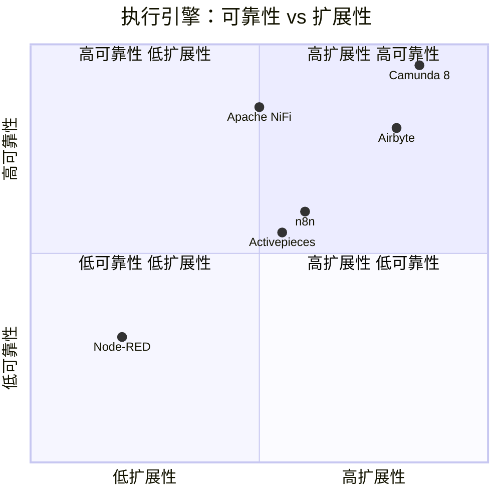

### 6.4 open-app 推荐执行引擎方案

**推荐方案：Java 线程池 + 消息队列 + Job Worker**

借鉴 Camunda Job Worker 的分布式执行模型 + NiFi ProcessScheduler 的线程池调度机制：

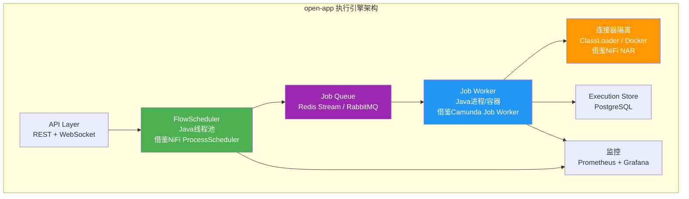

**设计要点**：
1. **FlowScheduler**：Java ScheduledExecutorService，解析 DAG 拓扑序，按依赖关系调度
2. **Job Queue**：Redis Stream（轻量）或 RabbitMQ（企业级），任务持久化保证不丢
3. **Job Worker**：可水平扩展的 Java 进程，主动拉取任务（长轮询）
4. **连接器隔离**：NAR ClassLoader（默认，Java原生轻量）+ 可选 Docker 容器（高安全场景）
5. **重试策略**：指数退避 + 最大重试次数，借鉴 Camunda
6. **超时控制**：Job 级别超时，Worker 强制取消

---

## 七、数据存储设计对比

### 7.1 各平台存储方案详解

#### 7.1.1 Apache NiFi

| 存储 | 技术 | 用途 | 特点 |
|------|------|------|------|
| FlowFile Repository | WAL (Write-Ahead Log) | FlowFile 元数据持久化 | 预写日志，保证不丢数据 |
| Content Repository | 文件系统/S3 | FlowFile 内容数据 | 支持 GB 级数据，可扩展 |
| Provenance Repository | 文件系统/Lucene | 数据血缘记录 | 可查询、可索引 |
| Flow Registry | Git | 流程版本管理 | 支持多 Registry |
| 用户/权限 | 文件/LDAP | 认证授权 | 可插拔 |

**特点**：以文件系统为核心，关系型数据库仅存元数据（可选）。适合大数据量场景，但查询能力有限。

#### 7.1.2 Camunda 8

| 存储 | 技术 | 用途 | 特点 |
|------|------|------|------|
| LogStream | 分区日志 | 事件溯源 | Append-only，Raft共识 |
| Hazelcast | 内存网格 | 运行时状态缓存 | 低延迟，分布式 |
| Elasticsearch | 搜索引擎 | ProcessInstance索引/查询 | 全文搜索，可视化 |
| PostgreSQL | 关系型DB | Operate/Tasklist | 业务数据 |
| S3/MinIO | 对象存储 | 导出数据 | 可选 |

**特点**：事件溯源架构，以 LogStream 为核心。Elasticsearch 提供强大查询能力，但运维复杂度高。

#### 7.1.3 n8n

| 存储 | 技术 | 用途 | 特点 |
|------|------|------|------|
| PostgreSQL/SQLite | 关系型DB | 工作流/执行/凭证 | 主存储 |
| Redis | 内存数据库 | Bull Queue + 缓存 | 队列模式必须 |
| 文件系统 | 本地 | 临时数据 | 执行中间结果 |

**表结构**（PostgreSQL）：
- `workflow_entity`：工作流定义
- `execution_entity`：执行记录
- `credentials_entity`：凭证（加密）
- `installed_nodes_entity`：已安装节点

**特点**：简洁的关系型存储，PostgreSQL 为主，Redis 为辅。适合中小规模场景。

#### 7.1.4 Activepieces

| 存储 | 技术 | 用途 | 特点 |
|------|------|------|------|
| PostgreSQL | 关系型DB | 全部业务数据 | 主存储 |
| Redis | 内存数据库 | Bull Queue + 缓存 | 队列+缓存 |
| 文件系统 | 本地 | 代码步骤沙箱 | 临时文件 |

**表结构**（PostgreSQL）：
- `flow` + `flow_version`：流程+版本
- `flow_run`：执行记录
- `piece` + `piece_metadata`：连接器元数据
- `instance` + `instance_rights`：多租户
- `project` + `project_member`：项目与成员

**特点**：完整的多租户支持，关系型数据库优先，表设计规范。

#### 7.1.5 Node-RED

| 存储 | 技术 | 用途 | 特点 |
|------|------|------|------|
| 文件系统 | JSON文件 | 流程定义 + 凭证 | 主存储 |
| SQLite | 可选 | Context持久化 | 需插件 |
| 内存 | JS对象 | 运行时状态 | 重启丢失 |

**文件结构**：
- `flows.json`：流程定义
- `flows_cred.json`：加密凭证
- `settings.js`：配置文件
- `.config.json`：运行时状态

**特点**：极简存储，JSON 文件为主。不适合多租户和大规模场景，但部署简单。

#### 7.1.6 Airbyte

| 存储 | 技术 | 用途 | 特点 |
|------|------|------|------|
| PostgreSQL | 关系型DB | 配置/元数据/Jobs | 主存储 |
| Redis | 内存数据库 | 缓存+队列 | 可选 |
| S3/GCS/Azure | 对象存储 | 数据缓冲 | Source→缓冲→Destination |
| Temporal DB | PostgreSQL | 工作流状态 | Temporal引擎自带 |

**特点**：PostgreSQL + 云存储的组合，数据缓冲用对象存储，适合数据同步场景。

### 7.2 数据存储横向对比

| 对比维度 | Apache NiFi | Camunda 8 | n8n | Activepieces | Node-RED | Airbyte |
|---------|-------------|-----------|-----|--------------|----------|---------|
| **主存储** | 文件系统(WAL) | LogStream+ES | PostgreSQL | PostgreSQL | JSON文件 | PostgreSQL |
| **缓存** | 内存 | Hazelcast | Redis | Redis | 内存 | Redis |
| **搜索** | Lucene | Elasticsearch | ❌ | ❌ | ❌ | ❌ |
| **队列** | 内置 | 内置(gRPC) | Redis(Bull) | Redis(Bull) | ❌ | Temporal |
| **ACID保障** | ⭐⭐⭐ (WAL) | ⭐⭐⭐⭐⭐ (Raft) | ⭐⭐⭐⭐ (PG) | ⭐⭐⭐⭐ (PG) | ⭐ (文件) | ⭐⭐⭐⭐ (PG) |
| **可扩展性** | ⭐⭐⭐⭐ (文件/S3) | ⭐⭐⭐⭐⭐ (分布式) | ⭐⭐⭐ (PG单主) | ⭐⭐⭐ (PG单主) | ⭐ (文件) | ⭐⭐⭐⭐ (PG+S3) |
| **多租户** | ⚠️ ProcessGroup隔离 | ⭐⭐⭐⭐⭐ (Tenant) | ⭐⭐⭐ (Owner) | ⭐⭐⭐⭐⭐ (Project+Rights) | ❌ | ⭐⭐⭐ (Workspace) |
| **凭证加密** | ⭐⭐⭐⭐ (加密属性) | ⭐⭐⭐⭐ (Secret Store) | ⭐⭐⭐⭐ (DB加密) | ⭐⭐⭐⭐ (DB加密) | ⭐⭐ (文件加密) | ⭐⭐⭐⭐ (DB加密) |
| **运维复杂度** | 高(多存储系统) | 极高(ES+HZ+PG+Zeebe) | 低(PG+Redis) | 低(PG+Redis) | 极低(文件) | 中(PG+Redis+Temporal) |
| **备份恢复** | ⭐⭐⭐ (文件备份) | ⭐⭐⭐⭐ (ES快照+LogStream) | ⭐⭐⭐⭐⭐ (PG备份) | ⭐⭐⭐⭐⭐ (PG备份) | ⭐⭐⭐⭐ (文件复制) | ⭐⭐⭐⭐ (PG备份) |
| **数据量支撑** | TB级 | TB级 | 百万级记录 | 百万级记录 | 万级记录 | TB级(对象存储) |

### 7.3 数据存储架构对比图

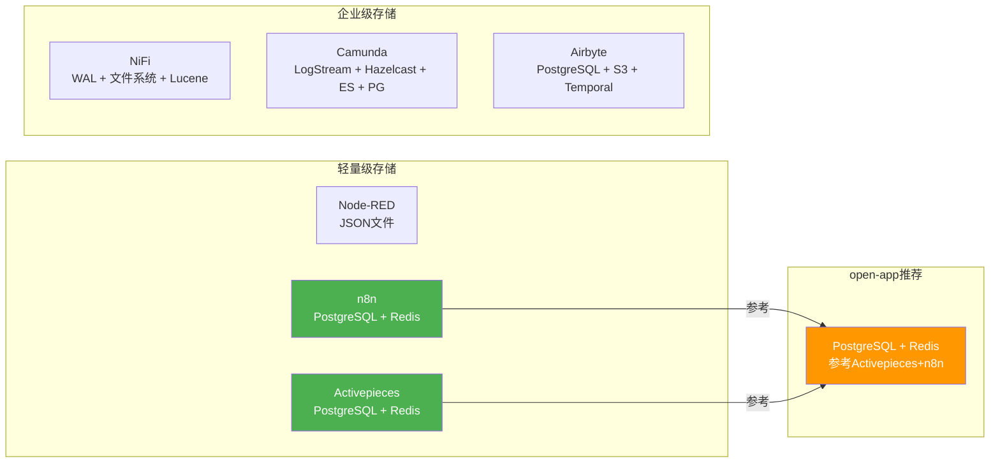

### 7.4 open-app 推荐数据存储方案

**推荐方案：PostgreSQL + Redis**

| 存储层 | 技术 | 用途 | 参考 |
|--------|------|------|------|
| 关系型数据库 | PostgreSQL | 工作流定义、执行记录、凭证、用户权限、连接器元数据 | Activepieces, n8n |
| 缓存/队列 | Redis (Redis Stream) | 任务队列、会话缓存、限流计数、发布订阅 | n8n, Activepieces |
| 对象存储 | MinIO/S3（可选） | 大数据缓冲、附件存储 | Airbyte |
| 搜索引擎 | Elasticsearch（可选） | 执行日志搜索、审计日志 | Camunda |

**核心表设计参考**（借鉴 Activepieces 多租户设计）：

```sql
-- 工作流定义
CREATE TABLE connector_flow (
    id UUID PRIMARY KEY,
    tenant_id UUID NOT NULL REFERENCES tenant(id),
    name VARCHAR(255) NOT NULL,
    description TEXT,
    flow_json JSONB NOT NULL,          -- DAG + JSON 模型
    version INT NOT NULL DEFAULT 1,
    is_active BOOLEAN DEFAULT false,
    created_by UUID,
    created_at TIMESTAMP DEFAULT NOW(),
    updated_at TIMESTAMP DEFAULT NOW()
);

-- 执行记录
CREATE TABLE flow_execution (
    id UUID PRIMARY KEY,
    flow_id UUID NOT NULL REFERENCES connector_flow(id),
    flow_version INT NOT NULL,
    status VARCHAR(32) NOT NULL,        -- pending/running/success/failed/cancelled
    trigger_type VARCHAR(64),
    input_data JSONB,
    output_data JSONB,
    error_message TEXT,
    started_at TIMESTAMP,
    completed_at TIMESTAMP,
    duration_ms INT
);

-- 连接器定义
CREATE TABLE connector_definition (
    id UUID PRIMARY KEY,
    tenant_id UUID NOT NULL REFERENCES tenant(id),
    name VARCHAR(255) NOT NULL,
    type VARCHAR(255) NOT NULL,          -- 如 openapp:http-request
    version INT NOT NULL DEFAULT 1,
    schema_json JSONB NOT NULL,          -- JSON Schema 元数据
    icon_url VARCHAR(512),
    category VARCHAR(64),
    is_builtin BOOLEAN DEFAULT false,
    created_at TIMESTAMP DEFAULT NOW()
);

-- 凭证
CREATE TABLE connector_credential (
    id UUID PRIMARY KEY,
    tenant_id UUID NOT NULL REFERENCES tenant(id),
    name VARCHAR(255) NOT NULL,
    type VARCHAR(255) NOT NULL,
    encrypted_data BYTEA NOT NULL,       -- AES-256 加密
    created_at TIMESTAMP DEFAULT NOW()
);
```

---

## 八、综合评分与推荐方案

### 8.1 六维度评分表

| 评分维度（1-5分） | Apache NiFi | Camunda 8 | n8n | Activepieces | Node-RED | Airbyte |
|------------------|-------------|-----------|-----|--------------|----------|---------|
| **技术栈匹配度**（与open-app JS+Java） | 4 | 4.5 | 3 | 3 | 2 | 3.5 |
| **连接器模型成熟度** | 3.5 | 4 | 5 | 4 | 2.5 | 3.5 |
| **Flow数据模型灵活性** | 4.5 | 5 | 4.5 | 2.5 | 3.5 | 2 |
| **前端编辑器质量** | 3 | 3.5 | 5 | 3 | 2.5 | 2 |
| **执行引擎可靠性** | 4.5 | 5 | 3.5 | 3.5 | 2 | 4.5 |
| **对open-app参考价值** | 4 | 4.5 | 4.5 | 3.5 | 2.5 | 3 |
| **综合得分** | **3.92** | **4.42** | **4.17** | **3.25** | **2.50** | **3.08** |

> **评分说明**：
> - 技术栈匹配度：后端Java+前端JS与open-app的契合程度
> - 连接器模型成熟度：定义方式的类型安全、动态表单、认证定义等综合评估
> - Flow数据模型灵活性：DAG能力、嵌套、版本管理、状态追踪等综合评估
> - 前端编辑器质量：画布渲染、拖拽交互、属性面板、表达式编辑等综合评估
> - 执行引擎可靠性：错误处理、重试、流控、持久化、可观测性等综合评估
> - 对open-app参考价值：综合以上维度，结合许可证风险的综合评估

### 8.2 综合评分雷达图

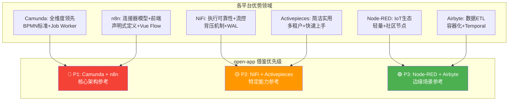

### 8.3 open-app 推荐技术架构方案

#### 8.3.1 总体架构

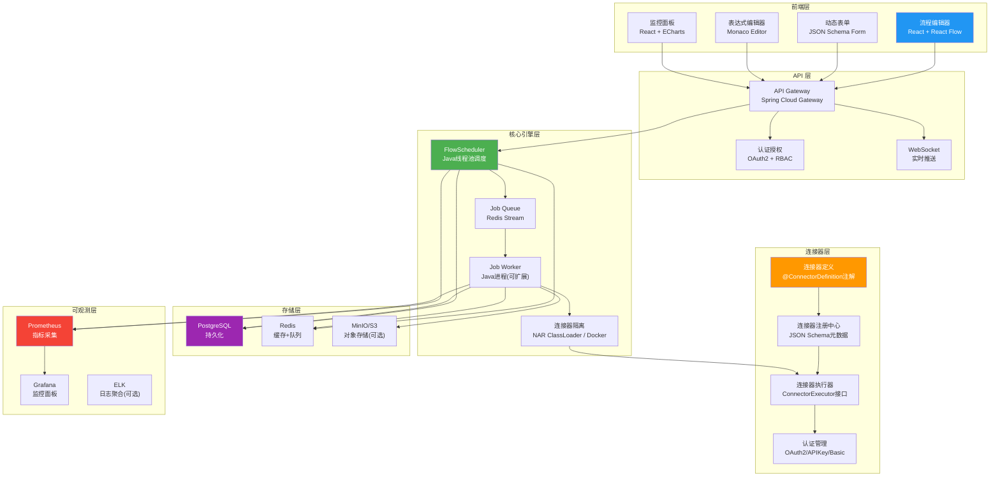

#### 8.3.2 各模块推荐方案详细说明

| 模块 | 推荐方案 | 借鉴来源 | 理由 |
|------|---------|---------|------|
| **连接器定义** | Java注解(@ConnectorDefinition) + JSON Schema元数据 | n8n INodeTypeDescription + Camunda Connector Template | Java注解提供编译时检查，JSON Schema支持前端动态表单渲染 |
| **连接器认证** | @ConnectorAuth注解 + SecretStore | Camunda Secret注解 + n8n credentials | 编译时标记敏感字段，运行时自动从SecretStore解密 |
| **连接流模型** | DAG + JSON（nodes[] + edges[]） | n8n Workflow JSON | 兼顾灵活性与可读性，前端可轻松渲染 |
| **前端编辑器** | React + React Flow | n8n @vue-flow/core（同类库React版） | React生态最成熟的流程图库，API优雅，自定义能力强 |
| **动态表单** | JSON Schema Form（react-jsonschema-form / formily） | n8n INodeProperties + Camunda Element Template | 根据JSON Schema自动渲染表单，支持条件显示 |
| **表达式系统** | {{ $json.field }} + SpEL | n8n表达式 + Spring SpEL | 前端用n8n风格表达式，后端SpEL执行 |
| **执行引擎** | Java线程池(FlowScheduler) + Redis Stream(Job Queue) + Job Worker | Camunda Job Worker + NiFi ProcessScheduler | 线程池调度DAG，Worker拉取执行，水平扩展 |
| **连接器隔离** | NAR ClassLoader（默认）+ 可选Docker | NiFi NAR ClassLoader + Airbyte Docker | Java原生轻量隔离，高安全场景Docker容器 |
| **数据存储** | PostgreSQL + Redis | Activepieces + n8n | 成熟方案，运维简单，多租户支持 |
| **凭证管理** | AES-256加密 + PostgreSQL BYTEA | n8n credentials | 加密存储，运行时解密 |
| **监控告警** | Prometheus + Grafana | Camunda Operate | 指标采集+可视化+告警 |
| **多租户** | tenant_id字段隔离 | Activepieces Project + Rights | 行级隔离，查询过滤 |

#### 8.3.3 推荐实施路线图

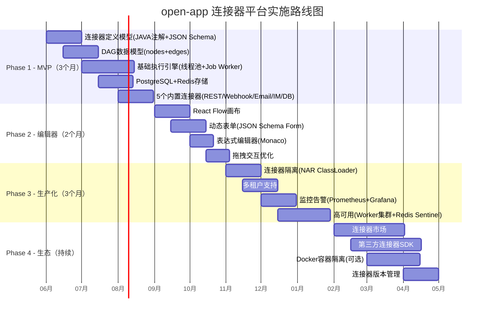

**Phase 1 — MVP（3个月）**：
- 目标：核心引擎可运行，5个内置连接器可用
- 关键交付：连接器定义注解 + DAG模型 + 基础执行引擎 + PostgreSQL存储
- 参考：NiFi Processor接口设计 + n8n Workflow JSON模型

**Phase 2 — 编辑器（2个月）**：
- 目标：可视化编辑器可用，用户可拖拽创建流程
- 关键交付：React Flow画布 + JSON Schema动态表单 + 表达式编辑器
- 参考：n8n @vue-flow/core交互设计 + Camunda属性面板

**Phase 3 — 生产化（3个月）**：
- 目标：满足生产环境要求（多租户、监控、高可用）
- 关键交付：NAR ClassLoader隔离 + 多租户 + Prometheus监控 + Worker集群
- 参考：NiFi NAR隔离 + Activepieces多租户 + Camunda Operate监控

**Phase 4 — 生态（持续）**：
- 目标：连接器生态繁荣，第三方可贡献
- 关键交付：连接器市场 + 第三方SDK + Docker隔离 + 版本管理
- 参考：n8n社区生态 + Airbyte连接器市场

### 8.4 风险与缓解措施

| 风险 | 等级 | 缓解措施 |
|------|------|---------|
| React Flow 大规模流程图性能 | 中 | 虚拟化渲染（只渲染视口内节点），参考 NiFi 的分页加载策略 |
| NAR ClassLoader 隔离不完全 | 中 | 严控连接器依赖白名单，关键场景提供 Docker 隔离选项 |
| JSON Schema Form 定制性不足 | 低 | 基于 react-jsonschema-form 二次开发，参考 n8n 的 displayOptions 机制 |
| 表达式安全风险（SpEL注入） | 高 | 沙箱执行 SpEL，限制可用类和方法，参考 Activepieces 代码沙箱 |
| Redis 单点故障 | 中 | Redis Sentinel / Cluster 部署，参考 n8n 队列模式 |
| 连接器版本兼容性 | 中 | 版本号强制校验，不兼容版本提示升级，参考 n8n 多版本并存 |

### 8.5 与 open-app 现有架构的集成点

| 集成点 | 方式 | 说明 |
|--------|------|------|
| **用户体系** | 共享认证服务 | 连接器平台使用 open-app 统一认证（OAuth2/SSO） |
| **权限体系** | RBAC 扩展 | 新增 `connector:flow:create`、`connector:flow:execute` 等权限 |
| **消息通道** | 内置连接器 | IM/邮件/短信作为内置连接器，直接调用 open-app 消息能力 |
| **API Gateway** | 路由挂载 | 连接器平台 API 挂载到 `/api/connector/*` 路径 |
| **WebSocket** | 共享连接 | 执行状态推送复用 open-app WebSocket 基础设施 |
| **监控** | 共享 Prometheus | 连接器平台指标接入 open-app 监控体系 |
| **日志** | 共享 ELK | 连接器执行日志接入 open-app 日志系统 |

---

## 附录

### 附录 A：参考资料

| 平台 | 官方文档 | GitHub 仓库 |
|------|---------|-------------|
| Apache NiFi | https://nifi.apache.org/docs.html | https://github.com/apache/nifi |
| Camunda 8 | https://docs.camunda.io/ | https://github.com/camunda/camunda |
| n8n | https://docs.n8n.io/ | https://github.com/n8n-io/n8n |
| Activepieces | https://www.activepieces.com/docs | https://github.com/activepieces/activepieces |
| Node-RED | https://nodered.org/docs/ | https://github.com/node-red/node-red |
| Airbyte | https://docs.airbyte.com/ | https://github.com/airbytehq/airbyte |

### 附录 B：术语表

| 术语 | 说明 |
|------|------|
| DAG | Directed Acyclic Graph，有向无环图 |
| BPMN | Business Process Model and Notation，业务流程建模标注 |
| NAR | NiFi Archive，NiFi 扩展包格式 |
| ClassLoader | Java 类加载器，实现类隔离 |
| FlowFile | NiFi 的数据单元，包含属性和内容引用 |
| Job Worker | Camunda 的任务执行模型，Worker 主动拉取任务 |
| Element Template | Camunda 的连接器模板，定义前端 UI 表单 |
| Bull Queue | Node.js 基于 Redis 的消息队列库 |
| INodeTypeDescription | n8n 的节点类型描述接口 |
| Zod | TypeScript 运行时 Schema 验证库 |
| Temporal | 分布式工作流引擎 |
| FEEL | Friendly Enough Expression Language，DMN 标准表达式语言 |
| SpEL | Spring Expression Language，Spring 表达式语言 |
| WAL | Write-Ahead Log，预写日志 |
| ELv2 | Elastic License 2.0，允许使用但限制商业竞品 |
| Fair-code | n8n 的可持续使用许可证，限制竞品 SaaS |

### 附录 C：对比总结矩阵

| 特性 | open-app推荐 | 最佳参考平台 | 次佳参考平台 |
|------|-------------|-------------|-------------|
| 连接器定义 | Java注解+JSON Schema | n8n | Camunda |
| 连接流模型 | DAG+JSON | n8n | NiFi |
| 前端编辑器 | React+React Flow | n8n(交互) | Camunda(属性面板) |
| 执行引擎 | 线程池+消息队列+Worker | Camunda | NiFi |
| 数据存储 | PostgreSQL+Redis | Activepieces | n8n |
| 连接器隔离 | NAR+Docker | NiFi | Airbyte |
| 多租户 | 行级隔离 | Activepieces | Camunda |
| 监控告警 | Prometheus+Grafana | Camunda | NiFi |
| 表达式系统 | {{ }}+SpEL | n8n | Camunda |
| 凭证管理 | AES-256加密 | Camunda | n8n |

---

> **文档结论**：open-app 连接器平台应采用 **Camunda + n8n 双核心参考策略**——Camunda 提供后端执行引擎和可靠性的最佳实践，n8n 提供连接器定义模型和前端编辑器的最佳实践，辅以 NiFi 的背压机制和隔离方案、Activepieces 的多租户设计。这一组合既发挥了 Java 后端的工程优势，又借鉴了 JS 前端的交互创新，是 open-app 建设 连接器平台的最优技术路径。
