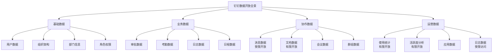
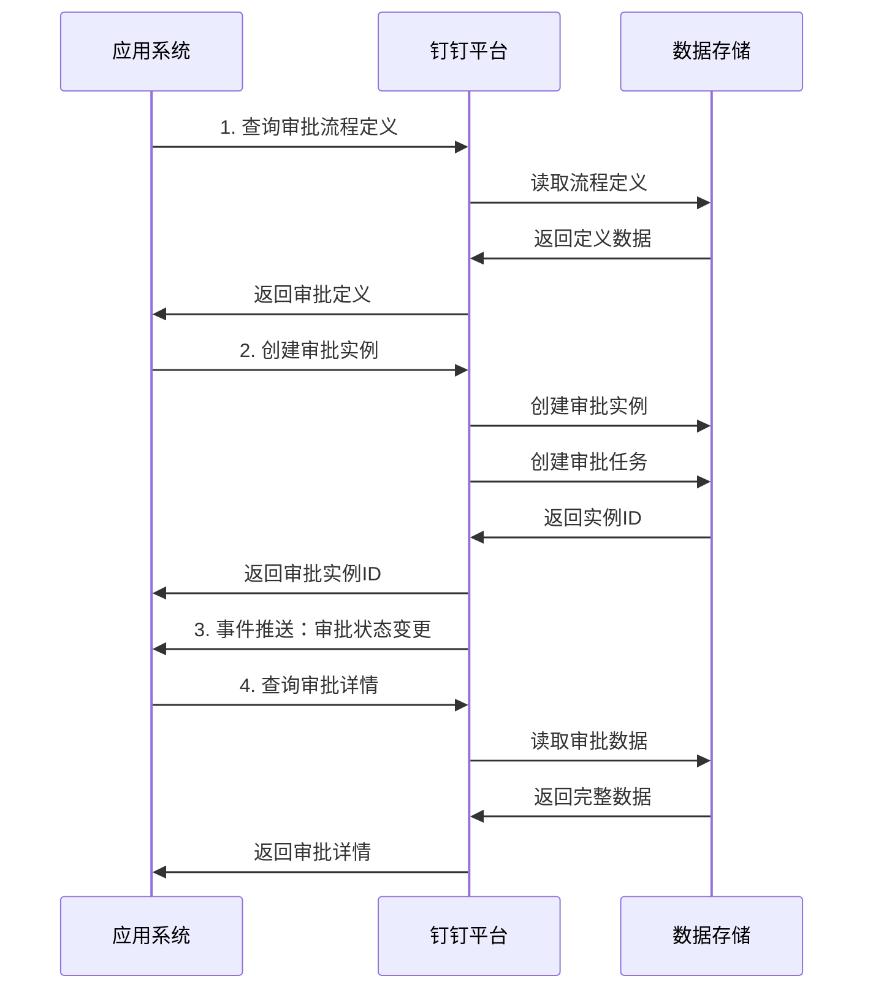
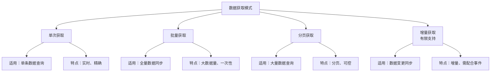
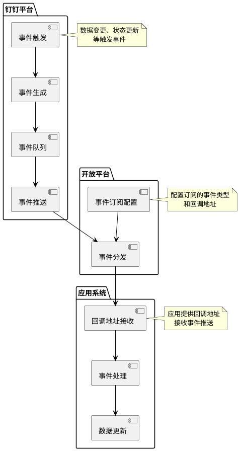
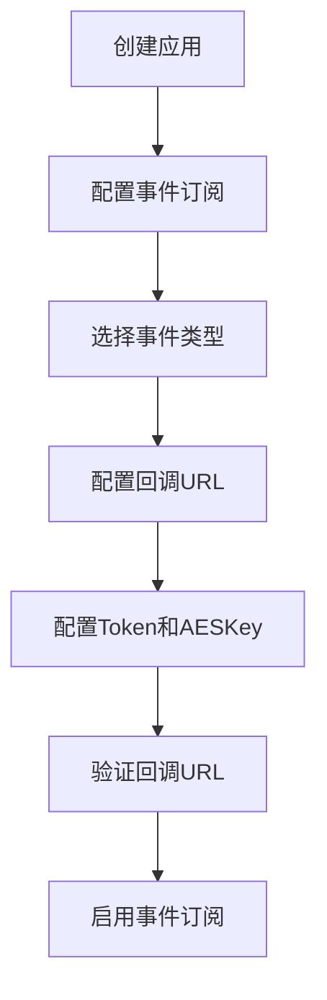
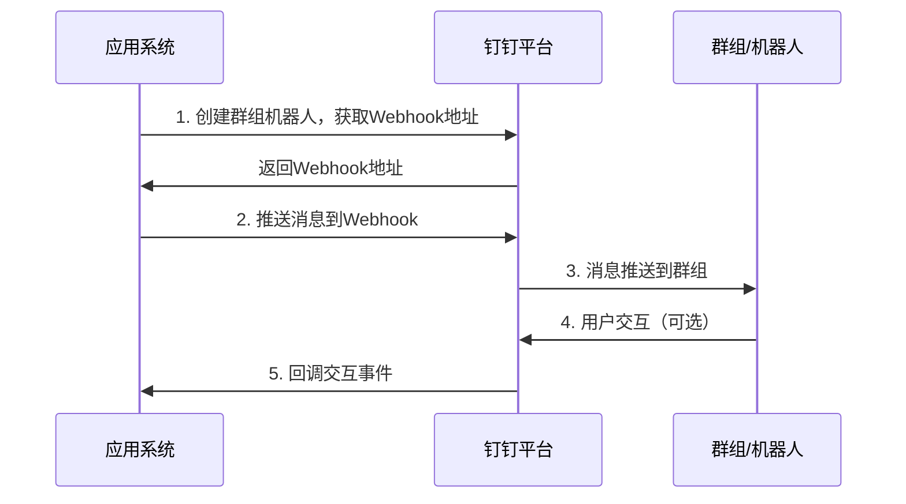
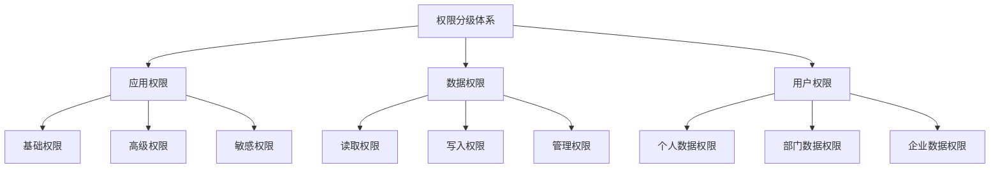
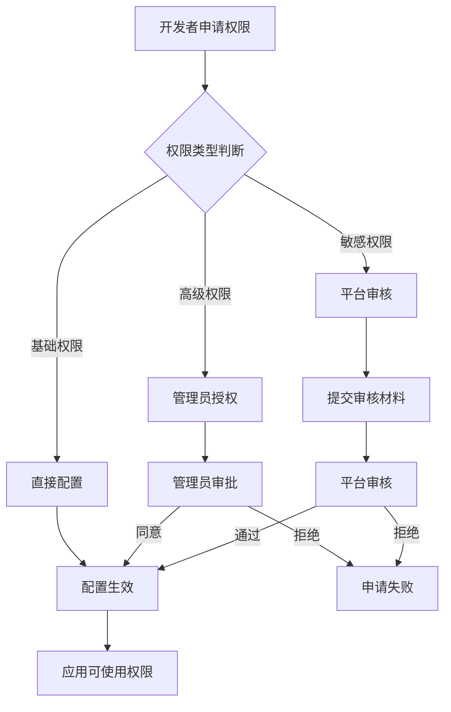

# 钉钉数据开放能力调研报告

## 一、执行摘要

本报告从**数据开放**角度深入调研钉钉开放平台，分析其数据开放的范围、机制、消费方式和应用场景，为企业数据中台建设和数据开放能力规划提供参考。

### 核心发现

| 维度 | 钉钉数据开放特点 |
|------|-----------------|
| **开放范围** | 重点开放基础、业务数据，协作数据受限较多 |
| **开放机制** | RESTful API + 事件订阅 + Webhook 多种方式 |
| **数据消费** | 支持实时获取、批量导出、增量订阅等多种模式 |
| **权限控制** | 分级权限管理，权限粒度相对较粗 |
| **数据安全** | 完善的安全机制，但部分数据开放受限 |

---

## 二、数据开放范围分析

### 2.1 数据开放全景图

钉钉开放平台开放的数据聚焦企业管理核心场景，分为四大类：



### 2.2 基础数据开放

#### 2.2.1 用户数据

**开放内容**：

| 数据字段 | 开放方式 | 权限要求 | 用途说明 | 对比飞书 |
|---------|---------|---------|---------|---------|
| 用户基本信息 | API读取 | 通讯录读权限 | 用户身份识别 | ✅ 开放程度相同 |
| 用户详细信息 | API读取 | 通讯录读权限（敏感） | 详细人员档案 | ✅ 开放程度相同 |
| 用户状态 | API读取 | 通讯录读权限 | 在线状态判断 | ✅ 开放程度相同 |
| 用户扩展属性 | API读取 | 通讯录读权限 | 自定义扩展字段 | ✅ 开放程度相同 |
| 用户入职信息 | API读取 | 人事权限（敏感） | 入职时间、职位等 | ⚠️ 需特殊权限 |

**开放目的**：

1. **统一身份体系**：为企业应用提供统一的用户身份标识，实现单点登录
2. **组织管理统一**：基于钉钉组织架构实现应用权限管理
3. **HR系统对接**：支持人事系统数据同步和人员管理
4. **协同场景支撑**：提供用户信息支持审批、任务等协作场景

**数据消费场景**：

| 场景 | 数据需求 | API调用方式 | 数据处理 | 开放程度 |
|------|---------|------------|---------|---------|
| **应用登录** | 用户ID、基本信息 | 单次获取 | 身份验证 | ✅ 完全开放 |
| **人员管理** | 用户列表+部门关系 | 批量获取 | 组织架构可视化 | ✅ 完全开放 |
| **HR系统对接** | 详细信息+入职信息 | 批量获取+定时同步 | HR数据同步 | ⚠️ 部分受限 |
| **权限分配** | 用户ID+角色关系 | 批量获取 | 权限规则计算 | ✅ 完全开放 |

**开放特点对比**：

| 维度 | 钉钉 | 飞书 | 对比分析 |
|------|------|------|---------|
| **字段丰富度** | 较丰富 | 非常丰富 | 飞书字段更丰富 |
| **扩展能力** | 支持扩展属性 | 支持自定义字段 | 均支持扩展 |
| **敏感数据** | 部分需特殊权限 | 部分需特殊权限 | 权限控制类似 |
| **数据质量** | 较高 | 高 | 飞书数据质量更高 |

#### 2.2.2 组织架构数据

**开放内容**：

| 数据字段 | 开放方式 | 权限要求 | 用途说明 |
|---------|---------|---------|---------|
| 部门信息 | API读取 | 通讯录读权限 | 部门基本信息 |
| 部门层级关系 | API读取 | 通讯录读权限 | 组织树结构 |
| 部门成员列表 | API读取 | 通讯录读权限 | 部门人员管理 |
| 部门管理员 | API读取 | 通讯录读权限 | 部门管理关系 |

**开放目的**：

1. **组织架构统一**：提供统一的组织架构数据源
2. **权限继承**：基于组织架构实现应用权限继承
3. **业务场景支持**：支持审批流转、任务分配等场景

**数据消费场景**：

| 场景 | 数据需求 | API调用方式 | 数据处理 |
|------|---------|------------|---------|
| **组织架构可视化** | 全量部门+层级关系 | 批量获取 | 组织树渲染 |
| **部门人员管理** | 部门成员列表 | 按部门批量获取 | 人员统计 |
| **审批流转** | 部门层级+上级关系 | 实时获取 | 审批节点计算 |

#### 2.2.3 角色权限数据

**开放内容**：

| 数据字段 | 开放方式 | 权限要求 | 用途说明 |
|---------|---------|---------|---------|
| 角色信息 | API读取 | 角色读权限 | 角色定义 |
| 角色成员关系 | API读取 | 角色读权限 | 角色分配 |
| 角色权限配置 | API读取（有限） | 管理员权限 | 权限配置 |

**开放特点**：
- 角色权限数据开放程度有限
- 主要支持角色查询和成员关系获取
- 权限配置细节开放较少

### 2.3 业务数据开放

#### 2.3.1 审批数据

**开放内容**：

| 数据字段 | 开放方式 | 权限要求 | 用途说明 | 对比飞书 |
|---------|---------|---------|---------|---------|
| 审批流程定义 | API读取+创建 | 审批管理权限 | 审批流程配置 | ✅ 相同 |
| 审批实例 | API读取+创建 | 审批数据权限 | 审批记录查询 | ✅ 相同 |
| 审批任务 | API读取 | 审批数据权限 | 待办任务查询 | ✅ 相同 |
| 审批评论 | API读取+创建 | 审批数据权限 | 审批意见 | ✅ 相同 |
| 审批附件 | API读取 | 审批数据权限 | 审批材料 | ✅ 相同 |

**开放目的**：

1. **审批数据透明化**：让企业应用获取审批流程数据
2. **流程数据分析**：支持审批效率分析、流程优化
3. **系统集成**：与ERP、OA等系统对接
4. **业务场景支撑**：支持各类业务审批场景

**数据消费场景**：

| 场景 | 数据需求 | API调用方式 | 数据处理 |
|------|---------|------------|---------|
| **审批流程发起** | 审批定义+实例创建 | API创建 | 流程启动 |
| **审批进度查询** | 审批实例+任务状态 | 实时查询 | 流程监控 |
| **审批数据分析** | 全量审批记录 | 批量导出 | 效率分析 |
| **审批系统集成** | 审批数据双向同步 | API+事件订阅 | ERP/OA对接 |

**开放机制**：



#### 2.3.2 考勤数据

**开放内容**：

| 数据字段 | 开放方式 | 权限要求 | 用途说明 | 对比飞书 |
|---------|---------|---------|---------|---------|
| 考勤记录 | API读取 | 考勤数据权限 | 打卡记录 | ✅ 开放更充分 |
| 考勤统计 | API读取 | 考勤数据权限 | 考勤报表 | ✅ 开放更充分 |
| 考勤规则 | API读取+配置 | 考勤管理权限 | 考勤规则配置 | ✅ 功能更强大 |
| 排班数据 | API读取+配置 | 考勤管理权限 | 排班表管理 | ✅ 功能更强大 |
| 外勤数据 | API读取 | 考勤数据权限 | 外勤打卡记录 | ✅ 特色功能 |

**开放目的**：

1. **考勤数据透明**：开放考勤数据支持考勤管理
2. **考勤数据集成**：与HR、薪酬系统对接
3. **考勤数据分析**：支持考勤趋势分析、异常识别

**数据消费场景**：

| 场景 | 数据需求 | API调用方式 | 数据处理 | 开放程度 |
|------|---------|------------|---------|---------|
| **考勤记录查询** | 个人/部门考勤记录 | 按用户/部门获取 | 考勤展示 | ✅ 完全开放 |
| **考勤报表生成** | 考勤统计数据 | 批量获取+统计 | 考勤报表 | ✅ 完全开放 |
| **考勤系统集成** | 考勤数据双向同步 | API+事件订阅 | HR对接 | ✅ 完全开放 |
| **考勤数据分析** | 全量考勤数据 | 批量导出 | 趋势分析 | ✅ 完全开放 |

**开放优势**：
- 考勤数据开放非常充分
- 支持丰富的考勤场景
- 考勤功能强大，开放能力强

#### 2.3.3 日志数据

**开放内容**：

| 数据字段 | 开放方式 | 权限要求 | 用途说明 |
|---------|---------|---------|---------|
| 日志模板 | API读取+创建 | 日志管理权限 | 日志模板配置 |
| 日志实例 | API读取+创建 | 日志数据权限 | 日志记录查询 |
| 日志统计 | API读取 | 日志数据权限 | 日志统计报表 |

**开放目的**：
- 支持工作汇报数据开放
- 与绩效系统对接
- 支持工作效率分析

### 2.4 协作数据开放

#### 2.4.1 消息数据

**开放内容**：

| 数据字段 | 开放方式 | 权限要求 | 用途说明 | 对比飞书 |
|---------|---------|---------|---------|---------|
| 消息发送 | API发送 | 消息发送权限 | 消息推送 | ✅ 相同 |
| 消息记录 | API读取（受限） | 特殊审批权限 | 消息历史查询 | ⚠️ 受限更严格 |
| 群消息 | API读取+发送 | 组管理权限 | 群消息管理 | ✅ 相同 |
| 消息状态 | API读取（有限） | 消息权限 | 已读状态 | ⚠️ 开放有限 |

**开放限制**：
- 消息内容读取严格受限
- 消息历史查询需特殊审批
- 隐私保护要求更高

**开放目的**：

1. **消息推送能力**：提供企业级消息推送通道
2. **消息系统集成**：支持与其他系统消息集成
3. **消息数据合规**：支持消息数据合规管理

#### 2.4.2 文档数据

**开放内容**：

| 数据字段 | 开放方式 | 权限要求 | 用途说明 | 对比飞书 |
|---------|---------|---------|---------|---------|
| 文档基本信息 | API读取（有限） | 文档读权限 | 文档列表 | ⚠️ 开放有限 |
| 文档内容 | API读取（受限） | 文档读写权限 | 文档内容获取 | ⚠️ 开放受限 |
| 文档权限 | API读取+配置 | 文档管理权限 | 文档权限管理 | ⚠️ 功能有限 |
| 文档分享 | API操作 | 文档权限 | 文档分享管理 | ✅ 基本开放 |

**开放特点**：
- 文档数据开放程度有限
- 主要开放文档基本信息
- 文档内容获取受限较多

#### 2.4.3 会议数据

**开放内容**：

| 数据字段 | 开放方式 | 权限要求 | 用途说明 |
|---------|---------|---------|---------|
| 会议信息 | API读取+创建 | 会议权限 | 会议创建查询 |
| 会议参与者 | API读取 | 会议权限 | 参会人员管理 |
| 会议录制 | API读取（有限） | 会议管理权限 | 会议录制数据 |

### 2.5 运营数据开放

#### 2.5.1 使用统计数据

**开放内容**：

| 数据字段 | 开放方式 | 权限要求 | 用途说明 | 对比飞书 |
|---------|---------|---------|---------|---------|
| 用户活跃度 | API读取（有限） | 管理员权限 | 用户使用统计 | ⚠️ 开放有限 |
| 功能使用统计 | API读取（有限） | 管理员权限 | 功能使用情况 | ⚠️ 开放有限 |
| 应用使用数据 | API读取 | 应用管理员权限 | 应用统计 | ✅ 相同 |
| 存储使用量 | API读取 | 管理员权限 | 存储统计 | ✅ 相同 |

**开放特点**：
- 运营数据开放程度有限
- 主要面向管理员开放
- 数据分析能力相对较弱

---

## 三、数据开放机制分析

### 3.1 API 数据获取机制

#### 3.1.1 API 数据获取模式

钉钉提供多种数据获取模式：



#### 3.1.2 API 数据获取示例

**单次获取示例**：

```java
// 获取单个用户信息
public UserInfo getUserInfo(String userId) {
    DingTalkClient client = new DefaultDingTalkClient("https://oapi.dingtalk.com/topapi/v2/user/get");
    OapiV2UserGetRequest req = new OapiV2UserGetRequest();
    req.setUserid(userId);
    
    OapiV2UserGetResponse resp = client.execute(req, accessToken);
    return resp.getResult();
}
```

**批量获取示例**：

```java
// 批量获取用户信息
public List<UserInfo> batchGetUsers(List<String> userIds) {
    DingTalkClient client = new DefaultDingTalkClient("https://oapi.dingtalk.com/topapi/user/listbypage");
    
    List<UserInfo> allUsers = new ArrayList<>();
    for (String deptId : deptIds) {
        long page = 0;
        long pageSize = 100;
        
        while (true) {
            OapiUserListbypageRequest req = new OapiUserListbypageRequest();
            req.setDepartmentId(Long.parseLong(deptId));
            req.setPageNo(page);
            req.setPageSize(pageSize);
            
            OapiUserListbypageResponse resp = client.execute(req, accessToken);
            allUsers.addAll(resp.getUserlist());
            
            if (!resp.isHasMore()) {
                break;
            }
            page++;
        }
    }
    
    return allUsers;
}
```

#### 3.1.3 API 设计特点

**设计特点**：
- API 路径设计较为统一：`https://oapi.dingtalk.com/{api_path}`
- 部分API使用新版本：`https://api.dingtalk.com/{version}/{api_path}`
- 响应格式统一：`{"errcode":0,"errmsg":"ok","result":{...}}`

**对比飞书**：

| 维度 | 钉钉 | 飞书 | 对比分析 |
|------|------|------|---------|
| **API设计** | 部分不够RESTful | RESTful设计 | 飞书设计更现代 |
| **版本管理** | 版本管理不统一 | 版本号明确 | 飞书版本管理更好 |
| **文档质量** | 文档详细 | 文档非常详细 | 飞书文档质量更高 |
| **SDK支持** | 多语言SDK | 多语言SDK | 两者相当 |

### 3.2 事件订阅机制

#### 3.2.1 事件订阅架构

钉钉提供事件订阅机制实现数据实时推送：



#### 3.2.2 支持的事件类型

**数据变更事件**：

| 事件类型 | 事件名称 | 数据内容 | 用途说明 | 对比飞书 |
|---------|---------|---------|---------|---------|
| 用户变更 | user_add_org、user_modify_org、user_leave_org | 用户信息 | 用户数据同步 | ✅ 相同 |
| 部门变更 | org_dept_create、org_dept_modify、org_dept_remove | 部门信息 | 组织架构同步 | ✅ 相同 |
| 审批变更 | bpms_instance_change、bpms_task_change | 审批数据 | 审批流程同步 | ✅ 相同 |
| 考勤变更 | attendance_checkin | 考勤数据 | 考勤数据同步 | ✅ 相同 |
| 消息事件 | chat_add_message（受限） | 消息信息 | 消息事件同步 | ⚠️ 受限更多 |

**事件数据结构**：

```json
{
  "EventType": "user_add_org",
  "TimeStamp": 1640000000000,
  "CorpId": "corp_id_here",
  "UserId": ["user_id_1", "user_id_2"],
  "StaffId": ["staff_id_1", "staff_id_2"]
}
```

#### 3.2.3 事件订阅配置

**配置流程**：



**配置示例**：

```java
// 配置事件订阅
public void configureEventSubscription() {
    // 在开放平台配置：
    // 1. 回调URL：https://your-app.com/callback
    // 2. Token：your_token
    // 3. AESKey：your_aes_key
    // 4. 订阅事件类型：user_add_org, user_modify_org等
    
    // 代码中处理回调
}
```

#### 3.2.4 事件处理机制

**事件接收与处理**：

```java
// 事件回调接收
@PostMapping("/callback")
public void handleCallback(HttpServletRequest request, HttpServletResponse response) {
    // 1. 读取请求体
    String body = readRequestBody(request);
    
    // 2. 解密消息（使用AESKey）
    String decrypted = decryptMessage(body, token, aesKey);
    
    // 3. 解析事件
    Event event = parseEvent(decrypted);
    
    // 4. 处理事件
    handleEventByType(event);
    
    // 5. 返回响应
    response.setStatus(200);
    response.getWriter().write("success");
}
```

**对比飞书**：

| 维度 | 钉钉 | 飞书 | 对比分析 |
|------|------|------|---------|
| **事件类型** | 丰富 | 非常丰富 | 飞书事件类型更多 |
| **推送机制** | 回调URL | Webhook | 机制类似 |
| **加密方式** | AES加密 | 签名验证 | 加密方式不同 |
| **可靠性** | 高 | 高 | 两者都很可靠 |

### 3.3 Webhook 数据推送机制

#### 3.3.1 机器人Webhook

钉钉支持机器人Webhook推送消息：



**Webhook推送示例**：

```java
// 推送文本消息
public void pushTextMessage(String webhookUrl, String message) {
    HttpClient client = HttpClientBuilder.create().build();
    HttpPost post = new HttpPost(webhookUrl);
    
    JSONObject body = new JSONObject();
    body.put("msgtype", "text");
    body.put("text", new JSONObject().put("content", message));
    
    post.setEntity(new StringEntity(body.toJSONString()));
    HttpResponse response = client.execute(post);
}
```

---

## 四、数据开放权限管理

### 4.1 权限分级体系

钉钉数据开放采用分级权限管理：



### 4.2 权限类型详解

#### 4.2.1 应用权限

| 权限类型 | 权限范围 | 申请方式 | 典型权限示例 | 对比飞书 |
|---------|---------|---------|------------|---------|
| **基础权限** | 基础数据读取 | 直接申请 | 通讯录读权限 | ✅ 相同 |
| **高级权限** | 数据读写、推送 | 管理员授权 | 消息发送、审批创建 | ✅ 相同 |
| **敏感权限** | 敏感数据访问 | 平台审核 | 考勤数据导出、消息记录读取 | ⚠️ 审核更严格 |

#### 4.2.2 数据权限

**权限矩阵**：

| 数据类型 | 读取权限 | 写入权限 | 管理权限 | 数据范围 | 开放程度 |
|---------|---------|---------|---------|---------|---------|
| 用户数据 | 通讯录读 | 通讯录写 | 通讯录管理 | 全企业或特定部门 | ✅ 充分开放 |
| 审批数据 | 审批读 | 审批创建 | 审批管理 | 本人参与的或全企业 | ✅ 充分开放 |
| 考勤数据 | 考勤读 | 考勤提交 | 考勤管理 | 个人或部门 | ✅ 非常充分 |
| 消息数据 | 消息读（受限） | 消息发送 | 消息管理 | 本人消息 | ⚠️ 受限较多 |
| 文档数据 | 文档读（有限） | 文档写 | 文档管理 | 有权限的文档 | ⚠️ 开放有限 |

### 4.3 权限申请与授权流程



---

## 五、企业数据中台场景分析

### 5.1 数据中台架构设计

钉钉数据开放能力在企业数据中台建设中的应用：

```plantuml
@startuml
!include <archimate/Archimate>

package "钉钉数据源" {
    database "基础数据" as base_data
    database "业务数据" as biz_data
    database "协作数据<br/>有限" as collab_data
    database "运营数据<br/>有限" as ops_data
}

package "数据开放能力" {
    [API接口] as api
    [事件订阅] as event
    [数据导出] as export
}

package "数据中台" {
    package "数据接入层" {
        [数据同步服务] as sync
        [数据清洗服务] as clean
    }
    
    package "数据存储层" {
        database "数据仓库" as warehouse
        database "实时数据] as realtime
    }
    
    package "数据服务层" {
        [数据查询服务] as query
        [数据分析服务] as analysis
    }
}

package "数据消费方" {
    [企业应用] as app
    [数据分析] as bi
    [外部企业<br/>受限] as external
}

base_data -down-> api
biz_data -down-> api
collab_data -down-> event
ops_data -down-> export

api -down-> sync
event -down-> sync
export -down-> sync

sync -down-> clean
clean -down-> warehouse
clean -down-> realtime

warehouse -down-> query
realtime -down-> analysis

query -down-> app
analysis -down-> bi
query -down-> external

note right of sync
  定时同步+实时订阅
  双模式数据接入
end note

note right of external
  数据开放受限
  需权限审批
end note
@enduml
```

### 5.2 数据接入实现

#### 5.2.1 全量数据同步

**定时全量同步**：

```java
// 定时全量同步用户数据
@Scheduled(cron = "0 0 2 * * ?")  // 每天凌晨2点执行
public void syncAllUsers() {
    log.info("开始全量同步用户数据");
    
    // 1. 获取全量部门列表
    List<Department> departments = getAllDepartments();
    
    // 2. 按部门获取用户列表
    List<UserInfo> allUsers = new ArrayList<>();
    for (Department dept : departments) {
        List<UserInfo> deptUsers = getUsersByDepartment(dept.getId());
        allUsers.addAll(deptUsers);
    }
    
    // 3. 数据清洗
    List<UserInfo> cleanedUsers = cleanUserData(allUsers);
    
    // 4. 数据入库
    batchInsertUsers(cleanedUsers);
    
    log.info("完成全量同步用户数据，同步数量：{}", cleanedUsers.size());
}
```

#### 5.2.2 实时数据订阅

**实时数据订阅接入**：

```java
// 实时数据订阅接入
public void setupRealtimeSync() {
    // 配置事件订阅
    // 处理回调事件
}

// 用户变更事件处理
private void handleUserAddEvent(Event event) {
    String[] userIds = event.getUserId();
    
    for (String userId : userIds) {
        // 获取用户详细信息
        UserInfo user = getUserInfo(userId);
        
        // 数据清洗
        UserInfo cleanedUser = cleanUser(user);
        
        // 数据入库
        insertUser(cleanedUser);
    }
}
```

---

## 六、数据开放对比分析

### 6.1 数据开放范围对比

| 数据类型 | 钉钉开放程度 | 飞书开放程度 | 对比分析 |
|---------|-------------|-------------|---------|
| **基础数据** | ✅ 充分开放 | ✅ 充分开放 | 两者相当 |
| **审批数据** | ✅ 充分开放 | ✅ 充分开放 | 两者相当 |
| **考勤数据** | ✅✅ 非常充分 | ✅ 充分开放 | 钉钉更强 |
| **消息数据** | ⚠️ 受限较多 | ⚠️ 受限 | 飞书稍好 |
| **文档数据** | ⚠️ 开放有限 | ✅ 充分开放 | 飞书更强 |
| **运营数据** | ⚠️ 开放有限 | ⚠️ 开放有限 | 两者相当 |

### 6.2 数据开放机制对比

| 开放机制 | 钉钉 | 飞书 | 对比分析 |
|---------|------|------|---------|
| **API设计** | 部分不够RESTful | RESTful设计 | 飞书更好 |
| **事件订阅** | ✅ 支持 | ✅ 支持 | 两者相当 |
| **Webhook** | ✅ 支持 | ✅ 支持 | 两者相当 |
| **数据导出** | ✅ 支持 | ✅ 支持 | 两者相当 |
| **API文档** | 文档详细 | 文档非常详细 | 飞书更好 |

### 6.3 企业数据中台适用性对比

| 维度 | 钉钉 | 飞书 | 对比分析 |
|------|------|------|---------|
| **数据丰富度** | ⭐⭐⭐⭐ | ⭐⭐⭐⭐⭐ | 飞书数据更丰富 |
| **数据质量** | ⭐⭐⭐⭐ | ⭐⭐⭐⭐⭐ | 飞书数据质量更高 |
| **开放程度** | ⭐⭐⭐⭐ | ⭐⭐⭐⭐ | 飞书略好 |
| **集成便捷性** | ⭐⭐⭐⭐ | ⭐⭐⭐⭐⭐ | 飞书更便捷 |
| **企业适用性** | ⭐⭐⭐⭐⭐ | ⭐⭐⭐⭐ | 钉钉更适合传统企业 |

---

## 七、总结与建议

### 7.1 钉钉数据开放特点总结

| 维度 | 钉钉数据开放特点 | 优势 | 不足 |
|------|-----------------|------|------|
| **数据范围** | 重点开放基础、业务数据 | 企业管理数据开放充分 | 协作数据开放受限 |
| **开放机制** | API + 事件订阅 + Webhook | 机制完善 | API设计不够现代 |
| **权限控制** | 分级权限管理 | 权限体系完善 | 权限粒度相对较粗 |
| **数据安全** | 完善的安全机制 | 数据安全有保障 | 部分数据开放受限 |
| **企业数据中台** | 适合传统企业数据中台 | 企业管理数据丰富 | 协作数据不足 |

### 7.2 企业数据中台建议

#### 7.2.1 数据接入建议

1. **充分利用考勤数据**：钉钉考勤数据开放非常充分，应充分利用
2. **审批数据对接**：审批数据开放完善，适合业务流程对接
3. **组织架构同步**：基础数据开放充分，适合组织架构同步
4. **协作数据补充**：协作数据开放有限，需要其他数据源补充

#### 7.2.2 最佳实践建议

1. **权限申请策略**：合理申请权限，避免权限过度
2. **数据缓存优化**：合理使用缓存减少API调用
3. **事件处理优化**：异步处理事件提升性能
4. **数据质量保障**：加强数据清洗和质量检查

---

## 八、附录

### 8.1 钉钉数据开放API清单

| 数据类型 | API列表 | 主要功能 |
|---------|---------|---------|
| **用户数据** | user.get、user.list、user.listbypage | 用户信息获取 |
| **组织数据** | department.list、department.get、user.listbypage | 组织架构获取 |
| **审批数据** | processinstance.create、processinstance.get、processinstance.list | 审批数据获取 |
| **考勤数据** | attendance.list、attendance.listRecord、attendance.getattcolumns | 考勤数据获取 |
| **消息数据** | message.corpconversation_send | 消息发送 |

### 8.2 相关资源

| 资源类型 | 链接 |
|---------|------|
| **钉钉开放平台官网** | https://open.dingtalk.com |
| **API文档** | https://open.dingtalk.com/document/orgapp/api-overview |
| **权限说明** | https://open.dingtalk.com/document/orgapp/permission-application |

---

**报告编制时间**：2026年4月
**报告版本**：V1.0
**报告角度**：数据开放能力调研