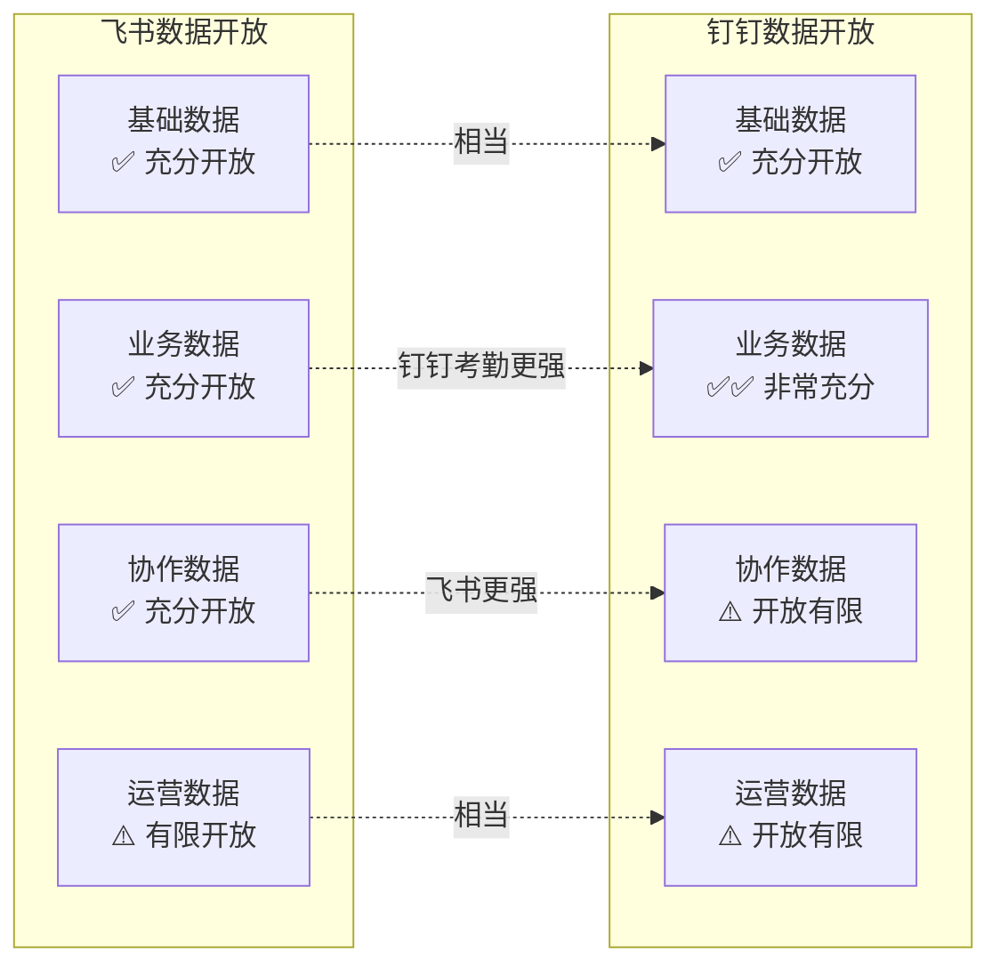
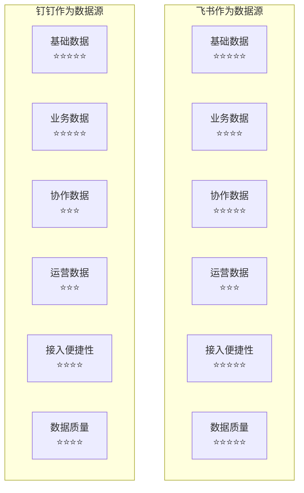
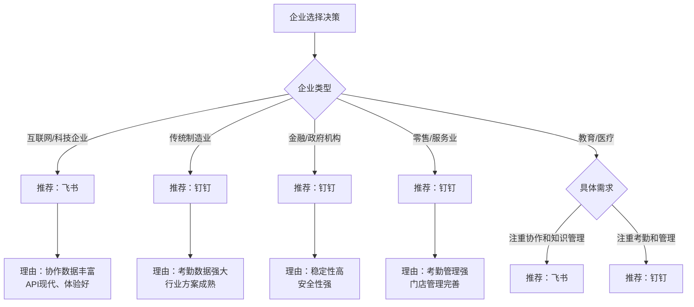

# 飞书&钉钉数据开放能力对比调研报告

## 一、执行摘要

本报告从**数据开放**角度深入对比飞书和钉钉开放平台，分析两者在数据开放范围、机制、权限、安全等方面的差异，为企业数据中台建设和数据开放能力规划提供决策参考。

### 核心结论

| 对比维度 | 飞书 | 钉钉 | 综合评价 |
|---------|------|------|---------|
| **数据开放范围** | ⭐⭐⭐⭐⭐ | ⭐⭐⭐⭐ | 飞书数据范围更广 |
| **数据开放机制** | ⭐⭐⭐⭐⭐ | ⭐⭐⭐⭐ | 飞书机制更现代 |
| **数据开放程度** | ⭐⭐⭐⭐ | ⭐⭐⭐⭐ | 两者相当 |
| **API设计质量** | ⭐⭐⭐⭐⭐ | ⭐⭐⭐⭐ | 飞书设计更好 |
| **文档完善度** | ⭐⭐⭐⭐⭐ | ⭐⭐⭐⭐ | 飞书文档更详细 |
| **企业适用性** | ⭐⭐⭐⭐ | ⭐⭐⭐⭐⭐ | 钉钉更适合传统企业 |

**选择建议**：
- 互联网、科技、创新型企业 → **推荐飞书**
- 传统企业、注重考勤管理 → **推荐钉钉**
- 需要丰富协作数据 → **推荐飞书**
- 需要强大考勤数据 → **推荐钉钉**

---

## 二、数据开放范围对比

### 2.1 数据开放全景对比

#### 2.1.1 数据开放范围对比矩阵

#### 2.1.2 数据类型开放程度对比

| 数据类型 | 飞书开放程度 | 钉钉开放程度 | 差异分析 | 推荐 |
|---------|-------------|-------------|---------|------|
| **用户数据** | ⭐⭐⭐⭐⭐ | ⭐⭐⭐⭐ | 飞书字段更丰富，扩展能力更强 | 飞书 |
| **组织架构** | ⭐⭐⭐⭐⭐ | ⭐⭐⭐⭐⭐ | 两者开放程度相同 | 相当 |
| **角色权限** | ⭐⭐⭐⭐ | ⭐⭐⭐⭐ | 两者开放程度相同 | 相当 |
| **审批数据** | ⭐⭐⭐⭐⭐ | ⭐⭐⭐⭐⭐ | 两者开放都很充分 | 相当 |
| **考勤数据** | ⭐⭐⭐⭐ | ⭐⭐⭐⭐⭐ | 钉钉考勤数据开放更充分，功能更强 | 钉钉 |
| **任务数据** | ⭐⭐⭐⭐⭐ | ⭐⭐⭐ | 飞书任务数据开放更充分 | 飞书 |
| **消息数据** | ⚠️ 受限 | ⚠️ 受限较多 | 飞书消息数据开放稍好 | 飞书 |
| **文档数据** | ⭐⭐⭐⭐⭐ | ⚠️ 开放有限 | 飞书文档数据开放非常充分 | 飞书 |
| **会议数据** | ⭐⭐⭐⭐ | ⭐⭐⭐⭐ | 两者开放程度相同 | 相当 |
| **运营数据** | ⚠️ 有限开放 | ⚠️ 有限开放 | 两者开放都有限 | 相当 |

### 2.2 基础数据开放对比

#### 2.2.1 用户数据开放对比

| 对比维度 | 飞书 | 钉钉 | 差异分析 |
|---------|------|------|---------|
| **基本字段** | ✅ 完全开放 | ✅ 完全开放 | 两者相同 |
| **扩展字段** | ✅ 支持自定义字段 | ✅ 支持扩展属性 | 飞书自定义能力更强 |
| **字段丰富度** | ⭐⭐⭐⭐⭐ | ⭐⭐⭐⭐ | 飞书字段更丰富 |
| **数据质量** | ⭐⭐⭐⭐⭐ | ⭐⭐⭐⭐ | 飞书数据质量更高 |
| **获取便捷性** | ⭐⭐⭐⭐⭐ | ⭐⭐⭐⭐ | 飞书API更易用 |

**典型场景对比**：

| 场景 | 飞书实现 | 钉钉实现 | 对比结论 |
|------|---------|---------|---------|
| **用户信息同步** | 批量接口，一次获取100用户 | 按部门分页获取 | 飞书更便捷 |
| **自定义字段获取** | 支持自定义字段API读取 | 支持扩展属性读取 | 飞书字段更灵活 |
| **用户状态获取** | 支持在线状态获取 | 支持在线状态获取 | 两者相同 |

#### 2.2.2 组织架构数据开放对比

| 对比维度 | 飞书 | 钉钉 | 差异分析 |
|---------|------|------|---------|
| **部门信息** | ✅ 完全开放 | ✅ 完全开放 | 两者相同 |
| **层级关系** | ✅ 完全开放 | ✅ 完全开放 | 两者相同 |
| **成员关系** | ✅ 完全开放 | ✅ 完全开放 | 两者相同 |
| **获取效率** | ⭐⭐⭐⭐⭐ | ⭐⭐⭐⭐ | 飞书批量接口更高效 |

**对比结论**：组织架构数据开放两者基本相同，飞书在批量获取效率上略优。

### 2.3 业务数据开放对比

#### 2.3.1 审批数据开放对比

| 对比维度 | 飞书 | 钉钉 | 差异分析 |
|---------|------|------|---------|
| **流程定义** | ✅ API读取+创建 | ✅ API读取+创建 | 两者相同 |
| **审批实例** | ✅ API读取+创建 | ✅ API读取+创建 | 两者相同 |
| **审批任务** | ✅ API读取 | ✅ API读取 | 两者相同 |
| **事件订阅** | ✅ 支持实时推送 | ✅ 支持实时推送 | 两者相同 |
| **数据导出** | ✅ 批量导出 | ✅ 批量导出 | 两者相同 |

**对比结论**：审批数据开放两者完全相同，都非常充分。

#### 2.3.2 考勤数据开放对比

| 对比维度 | 飞书 | 钉钉 | 差异分析 |
|---------|------|------|---------|
| **考勤记录** | ✅ 开放 | ✅✅ 非常充分开放 | 钉钉更强 |
| **考勤统计** | ✅ 开放 | ✅✅ 非常充分开放 | 钉钉更强 |
| **考勤规则** | ✅ 开放 | ✅✅ 功能非常强大 | 钉钉更强 |
| **排班管理** | ✅ 开放 | ✅✅ 功能非常强大 | 钉钉更强 |
| **外勤打卡** | ⚠️ 功能有限 | ✅ 支持外勤打卡 | 钉钉更强 |

**对比结论**：考勤数据开放钉钉明显更强，这是钉钉的核心优势。

**典型场景对比**：

| 场景 | 飞书实现 | 钉钉实现 | 对比结论 |
|------|---------|---------|---------|
| **考勤记录查询** | 支持基础查询 | 支持丰富查询条件 | 钉钉更强 |
| **考勤统计分析** | 支持基础统计 | 支持多维度统计 | 钉钉更强 |
| **排班管理** | 支持基础排班 | 支持复杂排班规则 | 钉钉更强 |
| **外勤管理** | 支持有限 | 完善的外勤管理 | 钉钉更强 |

### 2.4 协作数据开放对比

#### 2.4.1 消息数据开放对比

| 对比维度 | 飞书 | 钉钉 | 差异分析 |
|---------|------|------|---------|
| **消息发送** | ✅ 充分支持 | ✅ 充分支持 | 两者相同 |
| **消息记录** | ⚠️ 受限开放 | ⚠️ 受限更严格 | 飞书稍好 |
| **消息状态** | ✅ 支持已读状态 | ⚠️ 开放有限 | 飞书更好 |
| **群消息** | ✅ 支持 | ✅ 支持 | 两者相同 |
| **机器人消息** | ✅ 支持 | ✅ 支持 | 两者相同 |

**对比结论**：消息数据开放两者都受限，飞书开放程度稍好。

#### 2.4.2 文档数据开放对比

| 对比维度 | 飞书 | 钉钉 | 差异分析 |
|---------|------|------|---------|
| **文档信息** | ✅ 完全开放 | ⚠️ 开放有限 | 飞书更强 |
| **文档内容** | ✅ 完全开放 | ⚠️ 开放受限 | 飞书更强 |
| **文档权限** | ✅ 完全开放 | ⚠️ 功能有限 | 飞书更强 |
| **文档协作** | ✅ 完全支持 | ⚠️ 支持有限 | 飞书更强 |
| **版本管理** | ✅ 支持 | ⚠️ 支持有限 | 飞书更强 |

**对比结论**：文档数据开放飞书明显更强，这是飞书的核心优势。

**典型场景对比**：

| 场景 | 飞书实现 | 钉钉实现 | 对比结论 |
|------|---------|---------|---------|
| **文档内容获取** | API读取完整内容 | API读取受限 | 飞书更强 |
| **文档协作编辑** | API支持协作编辑 | 协作能力有限 | 飞书更强 |
| **文档权限管理** | API完整权限管理 | 权限管理有限 | 飞书更强 |
| **文档版本管理** | 支持版本历史 | 版本管理有限 | 飞书更强 |

#### 2.4.3 任务数据开放对比

| 对比维度 | 飞书 | 钉钉 | 差异分析 |
|---------|------|------|---------|
| **任务信息** | ✅ 充分开放 | ⚠️ 开放有限 | 飞书更强 |
| **任务分配** | ✅ 充分支持 | ⚠️ 支持有限 | 飞书更强 |
| **任务进度** | ✅ 充分支持 | ⚠️ 支持有限 | 飞书更强 |
| **任务协作** | ✅ 充分支持 | ⚠️ 支持有限 | 飞书更强 |

**对比结论**：任务数据开放飞书明显更强。

---

## 三、数据开放机制对比

### 3.1 API设计对比

#### 3.1.1 API设计风格对比

| 对比维度 | 飞书 | 钉钉 | 差异分析 |
|---------|------|------|---------|
| **API风格** | RESTful设计 | 部分不够RESTful | 飞书设计更现代 |
| **版本管理** | 版本号明确 | 版本管理不统一 | 飞书版本管理更好 |
| **路径设计** | 统一规范 | 部分不统一 | 飞书更规范 |
| **响应格式** | 标准JSON | 标准JSON | 两者相同 |

**API路径对比**：

| 平台 | API路径示例 | 设计特点 |
|------|------------|---------|
| **飞书** | `https://open.feishu.cn/open-apis/v1/contact/user/get` | RESTful、版本号明确、路径规范 |
| **钉钉** | `https://oapi.dingtalk.com/topapi/v2/user/get` | 部分使用oapi、topapi，不够统一 |

#### 3.1.2 API文档质量对比

| 对比维度 | 飞书 | 钉钉 | 差异分析 |
|---------|------|------|---------|
| **文档完整性** | ⭐⭐⭐⭐⭐ | ⭐⭐⭐⭐ | 飞书文档更完整 |
| **示例丰富度** | ⭐⭐⭐⭐⭐ | ⭐⭐⭐⭐ | 飞书示例更丰富 |
| **更新及时性** | ⭐⭐⭐⭐⭐ | ⭐⭐⭐⭐ | 飞书更新更及时 |
| **易读性** | ⭐⭐⭐⭐⭐ | ⭐⭐⭐⭐ | 飞书文档更易读 |

**对比结论**：飞书API文档质量明显更好，开发者体验更优。

#### 3.1.3 SDK支持对比

| 编程语言 | 飞书 | 钉钉 | 对比分析 |
|---------|------|------|---------|
| **Java** | ✅ 官方SDK | ✅ 官方SDK | 两者相同 |
| **Python** | ✅ 官方SDK | ✅ 官方SDK | 两者相同 |
| **Go** | ✅ 官方SDK | ⚠️ 社区SDK | 飞书更好 |
| **Node.js** | ✅ 官方SDK | ✅ 官方SDK | 两者相同 |
| **PHP** | ✅ 官方SDK | ✅ 官方SDK | 两者相同 |

**对比结论**：飞书SDK支持更好，特别是Go语言有官方支持。

### 3.2 事件订阅机制对比

#### 3.2.1 事件类型对比

| 事件分类 | 飞书支持 | 钉钉支持 | 对比分析 |
|---------|---------|---------|---------|
| **用户事件** | ✅ 创建、更新、删除 | ✅ 创建、更新、删除 | 两者相同 |
| **部门事件** | ✅ 创建、更新、删除 | ✅ 创建、更新、删除 | 两者相同 |
| **审批事件** | ✅ 实例、任务变更 | ✅ 实例、任务变更 | 两者相同 |
| **考勤事件** | ✅ 打卡事件 | ✅ 打卡事件 | 两者相同 |
| **文档事件** | ✅ 创建、更新、权限变更 | ⚠️ 事件有限 | 飞书更好 |
| **消息事件** | ⚠️ 受限 | ⚠️ 受限更多 | 飞书稍好 |

**对比结论**：飞书事件类型更丰富，特别是文档事件。

#### 3.2.2 事件推送机制对比

| 对比维度 | 飞书 | 钉钉 | 差异分析 |
|---------|------|------|---------|
| **推送方式** | Webhook推送 | 回调URL推送 | 机制类似 |
| **安全验证** | 签名验证 | AES加密 | 加密方式不同 |
| **可靠性** | ⭐⭐⭐⭐⭐ | ⭐⭐⭐⭐⭐ | 两者都很可靠 |
| **重试机制** | ✅ 指数退避重试 | ✅ 重试机制 | 两者相同 |

**对比结论**：事件推送机制两者都很完善，安全验证方式不同。

### 3.3 数据获取方式对比

#### 3.3.1 数据获取模式对比

| 获取模式 | 飞书 | 钉钉 | 对比分析 |
|---------|------|------|---------|
| **单次获取** | ✅ 支持 | ✅ 支持 | 两者相同 |
| **批量获取** | ✅ 支持批量接口 | ✅ 支持批量获取 | 飞书批量接口更好 |
| **分页获取** | ✅ 支持分页 | ✅ 支持分页 | 两者相同 |
| **增量获取** | ⚠️ 需配合事件 | ⚠️ 需配合事件 | 两者相同 |
| **数据导出** | ✅ 支持 | ✅ 支持 | 两者相同 |

**对比结论**：数据获取方式两者基本相同，飞书批量接口设计更好。

---

## 四、数据开放权限对比

### 4.1 权限体系对比

#### 4.1.1 权限分级对比

| 权限类型 | 飞书 | 钉钉 | 对比分析 |
|---------|------|------|---------|
| **基础权限** | ✅ 直接申请 | ✅ 直接申请 | 两者相同 |
| **高级权限** | ✅ 管理员授权 | ✅ 管理员授权 | 两者相同 |
| **敏感权限** | ✅ 平台审核 | ✅ 平台审核 | 两者相同 |
| **权限粒度** | ⭐⭐⭐⭐⭐ | ⭐⭐⭐⭐ | 飞书权限粒度更细 |

#### 4.1.2 权限申请流程对比

| 对比维度 | 飞书 | 钉钉 | 差异分析 |
|---------|------|------|---------|
| **申请便捷性** | ⭐⭐⭐⭐⭐ | ⭐⭐⭐⭐ | 飞书更便捷 |
| **审核速度** | ⭐⭐⭐⭐⭐ | ⭐⭐⭐⭐ | 飞书审核更快 |
| **权限说明** | ⭐⭐⭐⭐⭐ | ⭐⭐⭐⭐ | 飞书说明更清晰 |

**对比结论**：飞书权限申请更便捷，权限粒度更细。

### 4.2 数据访问控制对比

| 对比维度 | 飞书 | 钉钉 | 差异分析 |
|---------|------|------|---------|
| **数据范围控制** | ✅ 细粒度控制 | ✅ 控制粒度较粗 | 飞书更好 |
| **数据脱敏** | ✅ 完善的脱敏机制 | ✅ 支持数据脱敏 | 两者相同 |
| **审计日志** | ✅ 完整的审计日志 | ✅ 完整的审计日志 | 两者相同 |
| **权限继承** | ✅ 基于组织架构继承 | ✅ 基于组织架构继承 | 两者相同 |

**对比结论**：数据访问控制飞书粒度更细。

---

## 五、数据安全机制对比

### 5.1 安全机制对比矩阵

| 安全维度 | 飞书 | 钉钉 | 对比分析 |
|---------|------|------|---------|
| **传输加密** | ✅ HTTPS加密 | ✅ HTTPS加密 | 两者相同 |
| **存储加密** | ✅ 数据加密存储 | ✅ 数据加密存储 | 两者相同 |
| **访问控制** | ✅ 细粒度权限控制 | ✅ 权限控制 | 飞书粒度更细 |
| **审计日志** | ✅ 完整审计日志 | ✅ 完整审计日志 | 两者相同 |
| **数据脱敏** | ✅ 完善的脱敏规则 | ✅ 支持数据脱敏 | 两者相同 |
| **IP白名单** | ✅ 支持 | ✅ 支持 | 两者相同 |
| **等保认证** | ✅ 等保三级 | ✅ 等保三级 | 两者相同 |

**对比结论**：数据安全机制两者都很完善，飞书权限控制粒度更细。

---

## 六、企业数据中台场景适用性对比

### 6.1 数据中台架构对比

#### 6.1.1 作为数据源的适用性对比

#### 6.1.2 数据中台场景对比

| 场景 | 飞书适用性 | 钉钉适用性 | 推荐 |
|------|-----------|-----------|------|
| **用户数据中台** | ⭐⭐⭐⭐⭐ | ⭐⭐⭐⭐⭐ | 两者都适合 |
| **组织架构中台** | ⭐⭐⭐⭐⭐ | ⭐⭐⭐⭐⭐ | 两者都适合 |
| **审批流程中台** | ⭐⭐⭐⭐⭐ | ⭐⭐⭐⭐⭐ | 两者都适合 |
| **考勤管理中台** | ⭐⭐⭐⭐ | ⭐⭐⭐⭐⭐ | 钉钉更适合 |
| **协作数据中台** | ⭐⭐⭐⭐⭐ | ⭐⭐⭐ | 飞书更适合 |
| **知识管理中台** | ⭐⭐⭐⭐⭐ | ⭐⭐⭐ | 飞书更适合 |

### 6.2 企业类型适用性对比

#### 6.2.1 企业类型决策矩阵

| 企业类型 | 飞书推荐度 | 钉钉推荐度 | 推荐选择 | 核心理由 |
|---------|-----------|-----------|---------|---------|
| **互联网科技企业** | ⭐⭐⭐⭐⭐ | ⭐⭐⭐⭐ | 飞书 | 协作数据丰富、API更现代 |
| **创新型初创企业** | ⭐⭐⭐⭐⭐ | ⭐⭐⭐⭐ | 飞书 | 数据开放更充分、体验更好 |
| **传统制造业** | ⭐⭐⭐ | ⭐⭐⭐⭐⭐ | 钉钉 | 考勤数据强大、功能完善 |
| **零售行业** | ⭐⭐⭐ | ⭐⭐⭐⭐⭐ | 钉钉 | 考勤管理强、门店管理完善 |
| **金融行业** | ⭐⭐⭐⭐ | ⭐⭐⭐⭐⭐ | 钉钉 | 稳定性高、安全性强 |
| **教育行业** | ⭐⭐⭐⭐ | ⭐⭐⭐⭐ | 两者均可 | 根据具体需求选择 |

#### 6.2.2 场景选择决策矩阵

| 数据需求场景 | 推荐选择 | 核心优势 |
|-------------|---------|---------|
| **需要丰富的协作数据** | 飞书 | 文档、任务、知识库数据开放充分 |
| **需要强大的考勤数据** | 钉钉 | 考勤数据开放非常充分，功能强大 |
| **需要现代化的API设计** | 飞书 | RESTful设计、文档完善、SDK支持好 |
| **需要成熟的行业方案** | 钉钉 | 行业方案成熟、ISV生态完善 |
| **需要快速数据接入** | 飞书 | API设计好、接入更便捷 |
| **需要数据质量保障** | 飞书 | 数据质量更高、字段更规范 |

---

## 七、综合评价与选择建议

### 7.1 综合评分对比

| 评分维度 | 飞书 | 钉钉 | 权重 | 飞书加权分 | 钉钉加权分 |
|---------|------|------|------|-----------|-----------|
| **数据开放范围** | ⭐⭐⭐⭐⭐ | ⭐⭐⭐⭐ | 20% | 5.0 | 4.0 |
| **数据开放机制** | ⭐⭐⭐⭐⭐ | ⭐⭐⭐⭐ | 15% | 3.75 | 3.0 |
| **API设计质量** | ⭐⭐⭐⭐⭐ | ⭐⭐⭐⭐ | 15% | 3.75 | 3.0 |
| **文档完善度** | ⭐⭐⭐⭐⭐ | ⭐⭐⭐⭐ | 10% | 2.5 | 2.0 |
| **数据开放程度** | ⭐⭐⭐⭐ | ⭐⭐⭐⭐ | 20% | 4.0 | 4.0 |
| **企业适用性** | ⭐⭐⭐⭐ | ⭐⭐⭐⭐⭐ | 20% | 3.2 | 4.0 |
| **综合评分** | - | - | 100% | **22.2** | **20.0** |

### 7.2 选择建议决策树

### 7.3 最终建议

#### 7.3.1 选择飞书的情况

**适合企业**：
- ✅ 互联网、科技、创新型企业
- ✅ 需要丰富的协作数据
- ✅ 注重API质量和开发体验
- ✅ 需要强大的文档和知识管理数据

**核心优势**：
- 数据开放范围广，协作数据丰富
- API设计现代，RESTful规范
- 文档完善，开发者体验好
- 数据质量高，字段规范

#### 7.3.2 选择钉钉的情况

**适合企业**：
- ✅ 传统企业、制造业、零售业
- ✅ 需要强大的考勤管理数据
- ✅ 需要成熟的行业解决方案
- ✅ 金融、政府等对稳定性要求高的企业

**核心优势**：
- 考勤数据开放非常充分，功能强大
- 行业方案成熟，ISV生态完善
- 稳定性高，安全性强
- 企业适用性广

---

## 八、附录

### 8.1 数据开放能力对比清单

| 能力维度 | 飞书 | 钉钉 | 对比结论 |
|---------|------|------|---------|
| **用户数据** | ⭐⭐⭐⭐⭐ | ⭐⭐⭐⭐ | 飞书更好 |
| **组织架构** | ⭐⭐⭐⭐⭐ | ⭐⭐⭐⭐⭐ | 两者相同 |
| **审批数据** | ⭐⭐⭐⭐⭐ | ⭐⭐⭐⭐⭐ | 两者相同 |
| **考勤数据** | ⭐⭐⭐⭐ | ⭐⭐⭐⭐⭐ | 钉钉更好 |
| **消息数据** | ⚠️ 受限 | ⚠️ 受限更多 | 飞书稍好 |
| **文档数据** | ⭐⭐⭐⭐⭐ | ⚠️ 开放有限 | 飞书更好 |
| **任务数据** | ⭐⭐⭐⭐⭐ | ⭐⭐⭐ | 飞书更好 |
| **API设计** | ⭐⭐⭐⭐⭐ | ⭐⭐⭐⭐ | 飞书更好 |
| **文档质量** | ⭐⭐⭐⭐⭐ | ⭐⭐⭐⭐ | 飞书更好 |
| **企业适用性** | ⭐⭐⭐⭐ | ⭐⭐⭐⭐⭐ | 钉钉更好 |

### 8.2 典型场景对比

| 场景 | 飞书推荐度 | 钉钉推荐度 | 推荐选择 |
|------|-----------|-----------|---------|
| **用户数据中台** | ⭐⭐⭐⭐⭐ | ⭐⭐⭐⭐⭐ | 两者均可 |
| **考勤管理中台** | ⭐⭐⭐⭐ | ⭐⭐⭐⭐⭐ | 钉钉 |
| **协作数据中台** | ⭐⭐⭐⭐⭐ | ⭐⭐⭐ | 飞书 |
| **知识管理中台** | ⭐⭐⭐⭐⭐ | ⭐⭐⭐ | 飞书 |
| **审批流程中台** | ⭐⭐⭐⭐⭐ | ⭐⭐⭐⭐⭐ | 两者均可 |

---

**报告编制时间**：2026年4月
**报告版本**：V1.0
**报告角度**：数据开放能力对比调研
**目标受众**：产品团队（功能规划参考）