# 飞书数据开放能力调研报告

## 一、执行摘要

本报告从**数据开放**角度深入调研飞书开放平台，分析其数据开放的范围、机制、消费方式和应用场景，为企业数据中台建设和数据开放能力规划提供参考。

### 核心发现

| 维度 | 飞书数据开放特点 |
|------|-----------------|
| **开放范围** | 全面覆盖基础、业务、协作、运营四类数据 |
| **开放机制** | RESTful API + 事件订阅 + Webhook 多种方式 |
| **数据消费** | 支持实时获取、批量导出、增量订阅等多种模式 |
| **权限控制** | 分级权限管理，细粒度数据访问控制 |
| **数据安全** | 完善的数据脱敏、审计、加密机制 |

---

## 二、数据开放范围分析

### 2.1 数据开放全景图

飞书开放平台开放的数据涵盖企业数字化办公的全生命周期，分为四大类：

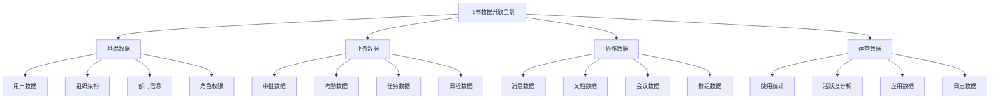

### 2.2 基础数据开放

#### 2.2.1 用户数据

**开放内容**：
| 数据字段 | 开放方式 | 权限要求 | 用途说明 |
|---------|---------|---------|---------|
| 用户基本信息 | API读取 | 通讯录读权限 | 用户身份识别、权限分配 |
| 用户详细信息 | API读取 | 通讯录读权限（敏感） | 详细人员档案、HR系统对接 |
| 用户状态 | API读取 | 通讯录读权限 | 用户在线状态、可用性判断 |
| 用户头像 | API读取 | 通讯录读权限 | 用户展示、头像同步 |
| 用户自定义字段 | API读取 | 通讯录读权限 | 扩展属性、自定义信息 |

**开放目的**：
1. **身份统一**：为企业应用提供统一的用户身份体系，避免重复建设
2. **权限管理**：基于飞书组织架构实现应用权限控制
3. **人员管理**：支持HR、OA等系统的人员数据同步
4. **协同场景**：提供用户信息用于协作场景（如任务分配、审批流转）

**数据消费场景**：

| 场景 | 数据需求 | API调用方式 | 数据处理 |
|------|---------|------------|---------|
| **应用登录认证** | 用户ID、基本信息 | 单次获取 | 身份验证、权限校验 |
| **用户信息展示** | 基本信息+头像 | 按需获取 | UI展示、用户卡片 |
| **人员信息同步** | 详细信息+自定义字段 | 批量获取+定时同步 | HR系统数据同步 |
| **组织管理** | 用户列表+部门关系 | 批量获取 | 组织架构可视化 |

#### 2.2.2 组织架构数据

**开放内容**：
| 数据字段 | 开放方式 | 权限要求 | 用途说明 |
|---------|---------|---------|---------|
| 部门信息 | API读取 | 通讯录读权限 | 组织架构管理 |
| 部门层级关系 | API读取 | 通讯录读权限 | 组织树结构、权限继承 |
| 部门成员列表 | API读取 | 通讯录读权限 | 部门人员管理、群组创建 |
| 部门自定义字段 | API读取 | 通讯录读权限 | 扩展属性、业务定制 |

**开放目的**：
1. **组织管理统一**：提供统一的组织架构数据源，避免各应用重复维护
2. **权限继承**：基于组织架构实现应用权限的层级管理
3. **业务场景支持**：支持审批流转、任务分配等基于组织的业务场景

**数据消费场景**：

| 场景 | 数据需求 | API调用方式 | 数据处理 |
|------|---------|------------|---------|
| **组织架构可视化** | 全量部门+层级关系 | 批量获取 | 组织树渲染 |
| **部门人员管理** | 部门成员列表 | 按部门批量获取 | 人员统计、分组管理 |
| **权限分配** | 部门+用户关系 | 批量获取 | 权限规则计算 |
| **审批流转** | 部门层级+上级关系 | 实时获取 | 审批节点计算 |

#### 2.2.3 角色权限数据

**开放内容**：
| 数据字段 | 开放方式 | 权限要求 | 用途说明 |
|---------|---------|---------|---------|
| 角色信息 | API读取 | 角色读权限 | 角色定义、角色管理 |
| 角色成员关系 | API读取 | 角色读权限 | 角色分配、权限查询 |
| 权限配置 | API读取 | 角色读权限（敏感） | 权限规则、访问控制 |

**开放目的**：
1. **权限统一管理**：提供统一的权限体系，简化应用权限管理
2. **角色复用**：避免各应用重复定义角色体系
3. **细粒度控制**：支持基于角色的细粒度数据访问控制

### 2.3 业务数据开放

#### 2.3.1 审批数据

**开放内容**：
| 数据字段 | 开放方式 | 权限要求 | 用途说明 |
|---------|---------|---------|---------|
| 审批定义 | API读取+创建 | 审批管理权限 | 审批流程配置 |
| 审批实例 | API读取+创建 | 审批数据权限 | 审批记录查询、流程发起 |
| 审批任务 | API读取 | 审批数据权限 | 待办任务、审批状态 |
| 审批评论 | API读取+创建 | 审批数据权限 | 审批意见、讨论记录 |
| 审批附件 | API读取 | 审批数据权限 | 审批材料、证明文件 |

**开放目的**：
1. **流程数据透明化**：让企业应用能够获取审批流程数据，实现流程透明化管理
2. **流程数据分析**：支持审批效率分析、流程优化等数据驱动决策
3. **系统集成**：与ERP、OA等系统对接，实现审批流程统一
4. **业务场景支撑**：支持请假、报销、采购等各类业务审批场景

**数据消费场景**：

| 场景 | 数据需求 | API调用方式 | 数据处理 |
|------|---------|------------|---------|
| **审批流程发起** | 审批定义+实例创建 | API创建 | 流程启动、数据初始化 |
| **审批进度查询** | 审批实例+任务状态 | 实时查询 | 流程监控、状态同步 |
| **审批数据分析** | 全量审批记录 | 批量导出 | 流程效率分析、瓶颈识别 |
| **审批系统集成** | 审批数据双向同步 | API读取+事件订阅 | ERP/OA审批数据对接 |

**开放机制设计**：

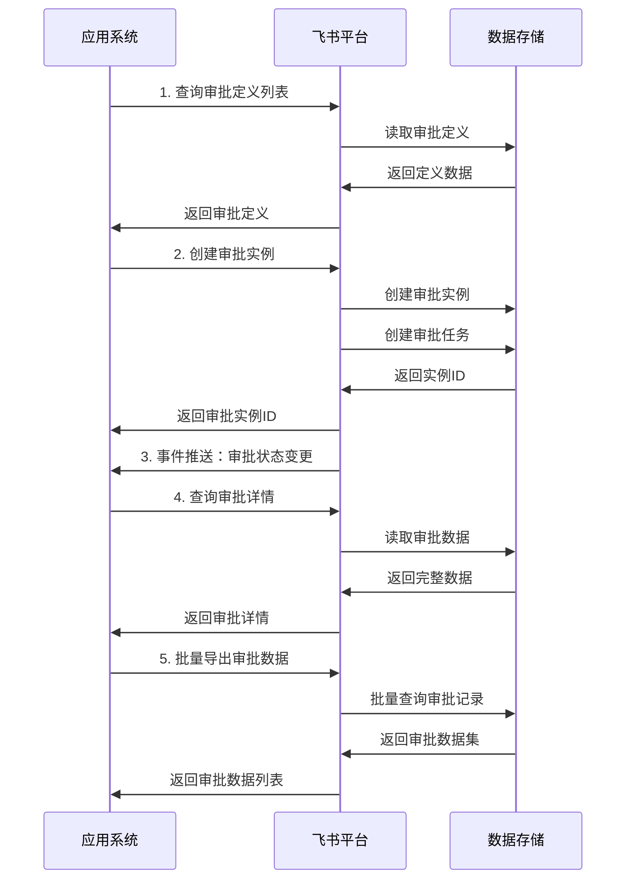

#### 2.3.2 考勤数据

**开放内容**：
| 数据字段 | 开放方式 | 权限要求 | 用途说明 |
|---------|---------|---------|---------|
| 考勤记录 | API读取 | 考勤数据权限 | 打卡记录、考勤统计 |
| 考勤统计 | API读取 | 考勤数据权限 | 考勤报表、工时统计 |
| 考勤规则 | API读取+配置 | 考勤管理权限 | 考勤规则配置 |
| 排班数据 | API读取+配置 | 考勤管理权限 | 排班表、班次管理 |

**开放目的**：
1. **考勤数据透明**：让企业应用能够获取考勤数据，支持考勤管理
2. **考勤数据集成**：与HR系统、薪酬系统对接，实现考勤数据统一
3. **考勤数据分析**：支持考勤趋势分析、异常识别等数据应用

**数据消费场景**：

| 场景 | 数据需求 | API调用方式 | 数据处理 |
|------|---------|------------|---------|
| **考勤记录查询** | 个人/部门考勤记录 | 按用户/部门获取 | 考勤展示、记录统计 |
| **考勤报表生成** | 考勤统计数据 | 批量获取+统计计算 | 考勤报表、工时统计 |
| **考勤系统集成** | 考勤数据双向同步 | API读取+事件订阅 | HR系统考勤对接 |
| **考勤数据分析** | 全量考勤数据 | 批量导出 | 考勤趋势分析、异常识别 |

#### 2.3.3 任务数据

**开放内容**：
| 数据字段 | 开放方式 | 权限要求 | 用途说明 |
|---------|---------|---------|---------|
| 任务信息 | API读取+创建 | 任务数据权限 | 任务创建、任务查询 |
| 任务进度 | API读取+更新 | 任务数据权限 | 任务进度跟踪 |
| 任务分配 | API读取+配置 | 任务数据权限 | 任务分配、责任人管理 |
| 任务评论 | API读取+创建 | 任务数据权限 | 任务讨论、协作沟通 |

**开放目的**：
1. **任务数据共享**：支持任务数据在不同应用间共享和同步
2. **任务协作**：提供任务数据支持团队协作和项目管理
3. **任务数据分析**：支持任务完成率、效率等数据分析

### 2.4 协作数据开放

#### 2.4.1 消息数据

**开放内容**：
| 数据字段 | 开放方式 | 权限要求 | 用途说明 |
|---------|---------|---------|---------|
| 消息内容 | API读取+发送 | 消息权限 | 消息推送、消息查询 |
| 消息记录 | API读取（有限） | 消息权限（敏感） | 消息历史查询（需审批） |
| 群消息 | API读取+发送 | 组管理权限 | 群消息推送、群消息管理 |
| 消息状态 | API读取 | 消息权限 | 已读状态、撤回状态 |

**开放目的**：
1. **消息推送能力**：提供企业级消息推送通道，支持业务通知
2. **消息集成**：支持与其他系统消息集成，统一消息入口
3. **消息数据治理**：支持消息数据合规管理、审计追溯

**数据消费场景**：

| 场景 | 数据需求 | API调用方式 | 数据处理 |
|------|---------|------------|---------|
| **业务通知推送** | 单聊/群消息推送 | API发送 | 业务事件通知、任务提醒 |
| **消息历史查询** | 消息记录（需审批） | API读取 | 消息审计、合规追溯 |
| **消息系统集成** | 消息双向同步 | API发送+事件订阅 | 统一消息平台 |
| **机器人消息** | 机器人消息推送 | Webhook推送 | 自动化消息、智能客服 |

**数据开放限制**：
- 消息内容读取受限，需特殊审批权限
- 消息历史查询需合规审批，仅支持审计场景
- 消息数据有隐私保护，需数据脱敏处理

#### 2.4.2 文档数据

**开放内容**：
| 数据字段 | 开放方式 | 权限要求 | 用途说明 |
|---------|---------|---------|---------|
| 文档基本信息 | API读取 | 文档读权限 | 文档列表、文档查询 |
| 文档内容 | API读取+编辑 | 文档读写权限 | 文档内容获取、编辑 |
| 文档权限 | API读取+配置 | 文档管理权限 | 文档权限管理 |
| 文档评论 | API读取+创建 | 文档权限 | 文档讨论、协作评论 |
| 文档版本 | API读取 | 文档读权限 | 文档版本历史 |

**开放目的**：
1. **知识资产开放**：开放企业文档数据，支持知识管理和知识共享
2. **文档协作**：支持文档内容获取和编辑，实现文档协作
3. **文档数据集成**：支持文档数据与其他系统集成
4. **知识数据分析**：支持文档使用统计、知识图谱等数据应用

**数据消费场景**：

| 场景 | 数据需求 | API调用方式 | 数据处理 |
|------|---------|------------|---------|
| **文档内容获取** | 文档基本信息+内容 | API读取 | 文档展示、内容引用 |
| **文档协作编辑** | 文档内容编辑 | API编辑 | 文档协作、内容更新 |
| **文档系统集成** | 文档数据双向同步 | API读取+编辑 | 知识库系统对接 |
| **文档数据分析** | 文档使用统计 | API读取+统计分析 | 文档热度、知识图谱 |

#### 2.4.3 会议数据

**开放内容**：
| 数据字段 | 开放方式 | 权限要求 | 用途说明 |
|---------|---------|---------|---------|
| 会议信息 | API读取+创建 | 会议权限 | 会议创建、会议查询 |
| 会议参与者 | API读取 | 会议权限 | 参会人员管理 |
| 会议录制 | API读取（有限） | 会议管理权限 | 会议录制数据 |
| 会议纪要 | API读取+创建 | 会议权限 | 会议记录、纪要生成 |

**开放目的**：
1. **会议数据透明**：开放会议数据，支持会议管理和效率分析
2. **会议系统集成**：支持会议数据与其他系统集成
3. **会议数据应用**：支持会议效率分析、会议纪要自动化等场景

### 2.5 运营数据开放

#### 2.5.1 使用统计数据

**开放内容**：
| 数据字段 | 开放方式 | 权限要求 | 用途说明 |
|---------|---------|---------|---------|
| 用户活跃度 | API读取（有限） | 管理员权限 | 用户使用统计 |
| 功能使用统计 | API读取（有限） | 管理员权限 | 功能使用情况 |
| 应用使用数据 | API读取 | 应用管理员权限 | 应用使用统计 |
| 存储使用量 | API读取 | 管理员权限 | 存储空间统计 |

**开放目的**：
1. **运营数据透明**：提供运营数据，支持企业运营分析
2. **数据驱动决策**：支持基于运营数据的决策优化
3. **成本优化**：支持基于使用数据的成本分析和优化

**数据消费场景**：

| 场景 | 数据需求 | API调用方式 | 数据处理 |
|------|---------|------------|---------|
| **用户活跃度分析** | 用户活跃数据 | 批量获取+统计 | 用户行为分析 |
| **功能使用统计** | 功能使用数据 | 批量获取 | 功能优化决策 |
| **成本分析** | 存储+应用使用数据 | 批量获取 | 成本优化、资源规划 |

---

## 三、数据开放机制分析

### 3.1 API 数据获取机制

#### 3.1.1 API 数据获取模式

飞书提供多种数据获取模式，满足不同场景的数据消费需求：

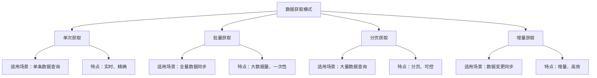

#### 3.1.2 API 数据获取设计

**单次获取示例**：

```java
// 获取单个用户信息
public UserInfo getUserInfo(String userId) {
    GetUserReq req = GetUserReq.newBuilder()
        .userId(userId)
        .userIdType("user_id")
        .build();
    
    GetUserResp resp = client.contact().user().get(req);
    return resp.getData().getUser();
}
```

**批量获取示例**：

```java
// 批量获取用户信息
public List<UserInfo> batchGetUsers(List<String> userIds) {
    BatchGetUserReq req = BatchGetUserReq.newBuilder()
        .userIds(userIds)
        .userIdType("user_id")
        .build();
    
    BatchGetUserResp resp = client.contact().user().batchGet(req);
    return resp.getData().getUsers();
}
```

**分页获取示例**：

```java
// 分页获取部门用户列表
public List<UserInfo> getDepartmentUsers(String departmentId) {
    List<UserInfo> allUsers = new ArrayList<>();
    String pageToken = null;
    
    do {
        GetDepartmentUserReq req = GetDepartmentUserReq.newBuilder()
            .departmentId(departmentId)
            .userIdType("user_id")
            .pageSize(100)
            .pageToken(pageToken)
            .build();
        
        GetDepartmentUserResp resp = client.contact().department().getDepartmentUser(req);
        allUsers.addAll(resp.getData().getUsers());
        pageToken = resp.getData().getPageToken();
    } while (pageToken != null && !pageToken.isEmpty());
    
    return allUsers;
}
```

#### 3.1.3 API 设计原则

**RESTful API 设计**：
- 统一的 API 路径设计：`https://open.feishu.cn/open-apis/{version}/{resource}`
- 标准的 HTTP 方法：GET（读取）、POST（创建）、PUT（更新）、DELETE（删除）
- 一致的响应格式：`{"code": 0, "msg": "success", "data": {...}}`

**数据获取优化**：
- **批量接口**：减少 API 调用次数，提升效率
- **分页机制**：支持大数据量获取，避免超时
- **字段选择**：支持部分字段获取，减少数据传输
- **缓存机制**：应用端缓存常用数据，减少重复调用

### 3.2 事件订阅机制

#### 3.2.1 事件订阅架构

飞书提供事件订阅机制，实现数据的实时推送：

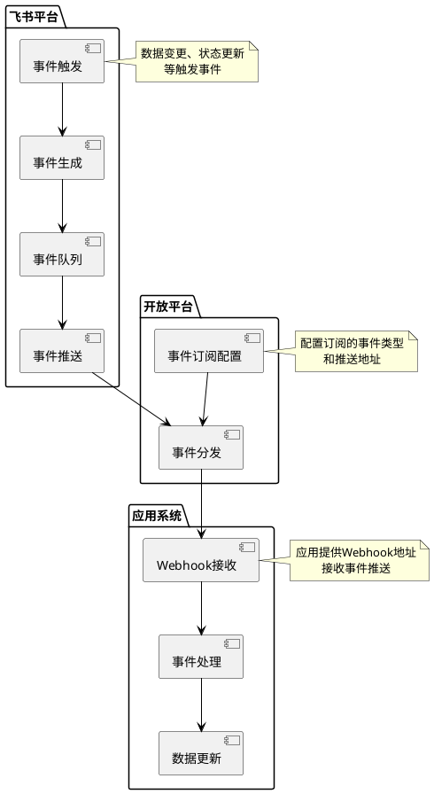

#### 3.2.2 支持的事件类型

**数据变更事件**：

| 事件类型 | 事件名称 | 数据内容 | 用途说明 |
|---------|---------|---------|---------|
| 用户变更 | user.created、user.updated、user.deleted | 用户信息 | 用户数据实时同步 |
| 部门变更 | department.created、department.updated、department.deleted | 部门信息 | 组织架构实时同步 |
| 审批变更 | approval.instance.created、approval.instance.updated | 审批数据 | 审批流程实时同步 |
| 考勤变更 | attendance.checkin、attendance.checkout | 考勤数据 | 考勤数据实时同步 |
| 消息事件 | message.created、message.read | 消息信息 | 消息状态实时同步 |
| 文档事件 | doc.created、doc.updated、doc.permission_changed | 文档数据 | 文档数据实时同步 |

**事件数据结构**：

```json
{
  "event": {
    "event_id": "event_id_here",
    "event_type": "user.created",
    "create_time": "1640000000000",
    "data": {
      "user": {
        "user_id": "user_id_here",
        "name": "张三",
        "department_ids": ["dept_id_1"],
        "status": 1
      }
    }
  },
  "header": {
    "tenant_key": "tenant_key_here",
    "token": "token_here",
    "app_id": "app_id_here"
  }
}
```

#### 3.2.3 事件订阅配置

**配置步骤**：

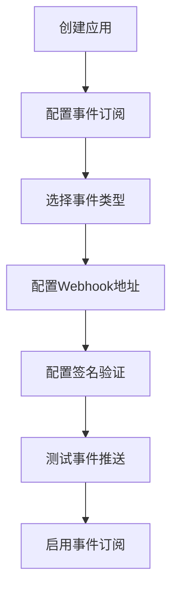

**配置示例**：

```java
// 配置事件订阅
public void configureEventSubscription() {
    EventSubscriptionConfig config = EventSubscriptionConfig.newBuilder()
        .addEventTypes("user.created", "user.updated", "user.deleted")
        .addEventTypes("approval.instance.created", "approval.instance.updated")
        .webhookUrl("https://your-app.com/webhook")
        .signKey("your_sign_key")
        .build();
    
    client.event().subscription().configure(config);
}
```

#### 3.2.4 事件处理机制

**事件接收与处理**：

```java
// Webhook事件接收
@PostMapping("/webhook")
public void handleEvent(HttpServletRequest request, HttpServletResponse response) {
    // 1. 验证签名
    String signature = request.getHeader("X-Lark-Signature");
    String timestamp = request.getHeader("X-Lark-Timestamp");
    String nonce = request.getHeader("X-Lark-Nonce");
    
    if (!verifySignature(signature, timestamp, nonce)) {
        response.setStatus(400);
        return;
    }
    
    // 2. 解析事件
    String body = readRequestBody(request);
    Event event = parseEvent(body);
    
    // 3. 处理事件
    handleEventByType(event);
    
    // 4. 返回响应
    response.setStatus(200);
}

// 事件处理
private void handleEventByType(Event event) {
    String eventType = event.getEventType();
    
    switch (eventType) {
        case "user.created":
            handleUserCreated(event.getData());
            break;
        case "user.updated":
            handleUserUpdated(event.getData());
            break;
        case "approval.instance.created":
            handleApprovalCreated(event.getData());
            break;
        default:
            log.warn("Unknown event type: {}", eventType);
    }
}

// 用户创建事件处理
private void handleUserCreated(EventData data) {
    User user = data.getUser();
    // 同步用户数据到本地系统
    userService.syncUser(user);
}
```

### 3.3 Webhook 数据推送机制

#### 3.3.1 Webhook 推送架构

飞书支持 Webhook 方式的数据推送，主要用于消息推送和机器人消息：

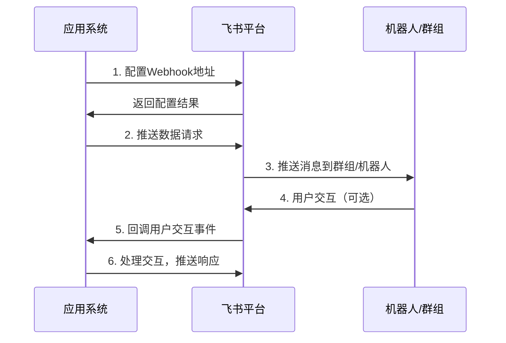

#### 3.3.2 Webhook 推送示例

**消息推送**：

```java
// 推送群消息
public void pushGroupMessage(String webhookUrl, String message) {
    WebhookRequest request = WebhookRequest.newBuilder()
        .msgType("text")
        .content("{\"text\":\"" + message + "\"}")
        .build();
    
    webhookClient.push(webhookUrl, request);
}
```

**卡片消息推送**：

```java
// 推送交互式卡片消息
public void pushCardMessage(String webhookUrl, ApprovalData approval) {
    CardMessage card = CardMessage.newBuilder()
        .header(CardHeader.newBuilder()
            .title("审批通知")
            .template("blue")
            .build())
        .elements(Arrays.asList(
            CardElement.newBuilder()
                .tag("div")
                .text("**申请人**：" + approval.getApplicant() + "\n**审批类型**：" + approval.getType())
                .build(),
            CardElement.newBuilder()
                .tag("action")
                .actions(Arrays.asList(
                    ActionButton.newBuilder()
                        .tag("button")
                        .text("同意")
                        .type("primary")
                        .value("{\"action\":\"approve\",\"id\":\"" + approval.getId() + "\"}")
                        .build(),
                    ActionButton.newBuilder()
                        .tag("button")
                        .text("拒绝")
                        .type("danger")
                        .value("{\"action\":\"reject\",\"id\":\"" + approval.getId() + "\"}")
                        .build()
                ))
                .build()
        ))
        .build();
    
    webhookClient.pushCard(webhookUrl, card);
}
```

### 3.4 数据导出机制

#### 3.4.1 批量数据导出

飞书支持批量数据导出，用于数据分析和数据迁移：

**导出能力**：
| 数据类型 | 导出方式 | 数据格式 | 权限要求 |
|---------|---------|---------|---------|
| 用户数据 | API批量获取 | JSON | 通讯录读权限 |
| 审批数据 | API批量获取 | JSON | 审批数据权限 |
| 考勤数据 | API批量获取 | JSON | 考勤数据权限 |
| 文档数据 | API批量获取 | JSON | 文档读权限 |

**导出示例**：

```java
// 批量导出用户数据
public void exportUsers(String filePath) {
    List<UserInfo> allUsers = new ArrayList<>();
    String pageToken = null;
    
    do {
        GetUserListReq req = GetUserListReq.newBuilder()
            .pageSize(100)
            .pageToken(pageToken)
            .build();
        
        GetUserListResp resp = client.contact().user().getList(req);
        allUsers.addAll(resp.getData().getUsers());
        pageToken = resp.getData().getPageToken();
        
        // 限流控制
        if (pageToken != null) {
            Thread.sleep(100);
        }
    } while (pageToken != null);
    
    // 导出为JSON文件
    exportToJson(allUsers, filePath);
}
```

---

## 四、数据开放权限管理

### 4.1 权限分级体系

飞书数据开放采用分级权限管理，确保数据安全访问：

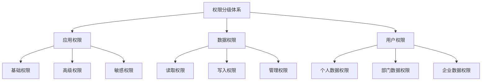

### 4.2 权限类型详解

#### 4.2.1 应用权限

| 权限类型 | 权限范围 | 申请方式 | 典型权限示例 |
|---------|---------|---------|------------|
| **基础权限** | 基础数据读取 | 直接申请 | 通讯录读权限、用户基本信息 |
| **高级权限** | 数据读写、推送 | 管理员授权 | 消息发送、审批创建 |
| **敏感权限** | 敏感数据访问 | 平台审核 | 消息内容读取、考勤数据导出 |

#### 4.2.2 数据权限

**权限矩阵**：

| 数据类型 | 读取权限 | 写入权限 | 管理权限 | 数据范围 |
|---------|---------|---------|---------|---------|
| 用户数据 | 通讯录读 | 通讯录写 | 通讯录管理 | 全企业或特定部门 |
| 审批数据 | 审批读 | 审批创建 | 审批管理 | 本人参与的审批或全企业 |
| 考勤数据 | 考勤读 | 考勤提交 | 考勤管理 | 个人考勤或部门考勤 |
| 消息数据 | 消息读（受限） | 消息发送 | 消息管理 | 本人消息或群消息 |
| 文档数据 | 文档读 | 文档写 | 文档管理 | 有权限的文档 |

#### 4.2.3 用户权限

**权限继承**：
- 基于组织架构的权限继承：部门管理员继承部门权限
- 基于角色的权限分配：角色决定数据访问范围
- 基于用户的数据隔离：用户只能访问有权限的数据

### 4.3 权限申请与授权流程

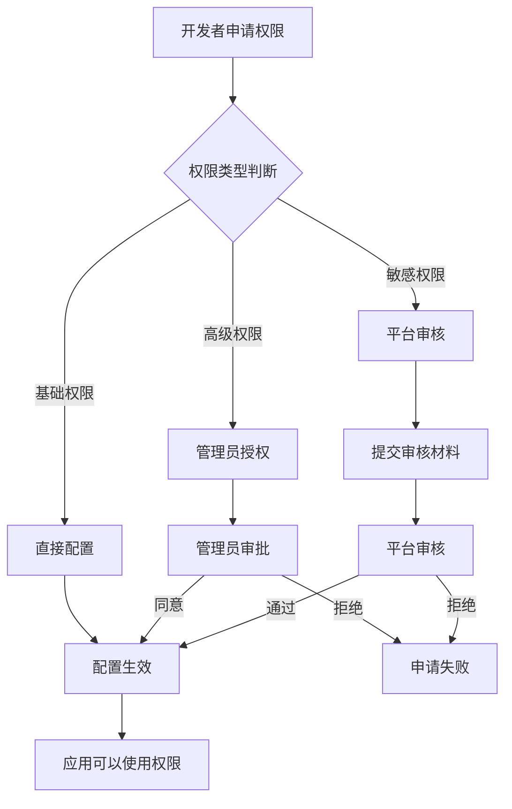

### 4.4 权限控制最佳实践

**最小权限原则**：
```java
// 只申请必要的权限
public void configureAppPermissions() {
    // 只申请用户基本信息读取权限，不申请敏感权限
    PermissionConfig config = PermissionConfig.newBuilder()
        .addPermission("contact:user:read:basic")  // 用户基本信息
        .addPermission("message:send")             // 发送消息
        .build();
    
    // 不申请敏感权限如：message:content:read（消息内容读取）
    // 不申请过度权限如：contact:user:read:sensitive（用户敏感信息）
}
```

**权限动态检查**：
```java
// 权限检查
public boolean checkPermission(String userId, String permission) {
    // 检查用户是否有该权限
    if (!userService.hasPermission(userId, permission)) {
        log.warn("User {} has no permission: {}", userId, permission);
        return false;
    }
    
    // 检查数据访问范围
    DataScope scope = userService.getDataScope(userId);
    if (!scope.canAccess(targetDataId)) {
        log.warn("User {} cannot access data: {}", userId, targetDataId);
        return false;
    }
    
    return true;
}
```

---

## 五、数据开放安全机制

### 5.1 数据安全架构

飞书数据开放建立了完善的安全机制，确保数据安全：

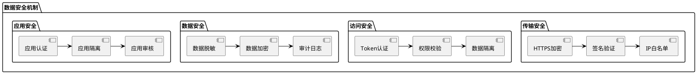

### 5.2 传输安全

#### 5.2.1 HTTPS 加密传输

- 所有 API 请求必须使用 HTTPS
- 数据传输全程加密，防止中间人攻击
- SSL/TLS 证书验证，确保连接安全

#### 5.2.2 签名验证机制

**签名算法**：
```java
// 请求签名
public String signRequest(String timestamp, String nonce, String body, String appSecret) {
    String signStr = timestamp + nonce + appSecret + body;
    return HmacSHA256(signStr, appSecret);
}

// 签名验证
public boolean verifySignature(String signature, String timestamp, String nonce, String body) {
    String expectedSignature = signRequest(timestamp, nonce, body, appSecret);
    return signature.equals(expectedSignature);
}
```

#### 5.2.3 IP 白名单控制

- 配置应用服务器 IP 白名单
- 只允许白名单 IP 访问 API
- 防止未授权服务器调用 API

### 5.3 访问安全

#### 5.3.1 Token 认证机制

**Access Token 生命周期**：

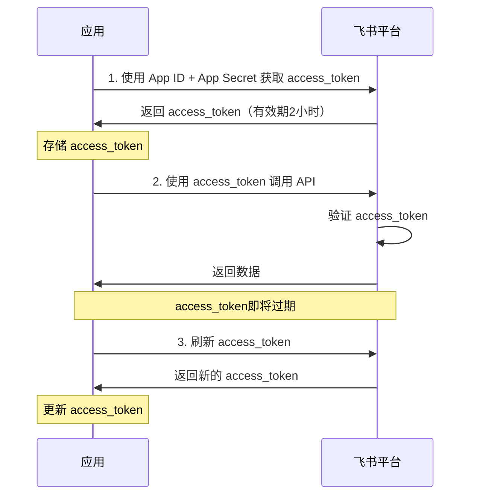

**Token 管理**：

```java
// Token 管理
public class TokenManager {
    private String accessToken;
    private long expireTime;
    
    // 获取 Token
    public String getAccessToken() {
        if (accessToken == null || isExpired()) {
            refreshAccessToken();
        }
        return accessToken;
    }
    
    // 刷新 Token
    private void refreshAccessToken() {
        GetAccessTokenReq req = GetAccessTokenReq.newBuilder()
            .appId(appId)
            .appSecret(appSecret)
            .build();
        
        GetAccessTokenResp resp = client.auth().accessToken().get(req);
        this.accessToken = resp.getData().getAccessToken();
        this.expireTime = resp.getData().getExpireTime();
    }
    
    // 检查是否过期
    private boolean isExpired() {
        return System.currentTimeMillis() >= expireTime - 300000; // 提前5分钟刷新
    }
}
```

#### 5.3.2 数据隔离机制

- **租户隔离**：不同企业数据完全隔离
- **应用隔离**：不同应用数据访问隔离
- **用户隔离**：用户只能访问有权限的数据

### 5.4 数据安全

#### 5.4.1 数据脱敏

**脱敏规则**：

| 数据类型 | 脱敏规则 | 脱敏示例 |
|---------|---------|---------|
| 手机号 | 中间4位隐藏 | 138****5678 |
| 邮箱 | @前部分隐藏 | zhang***@company.com |
| 身份证 | 中间部分隐藏 | 320***********1234 |
| 地址 | 部分隐藏 | 北京市朝阳区*** |

**脱敏实现**：

```java
// 数据脱敏
public UserInfo desensitizeUser(UserInfo user) {
    UserInfo desensitized = new UserInfo();
    desensitized.setUserId(user.getUserId());
    desensitized.setName(user.getName());
    
    // 手机号脱敏
    desensitized.setMobile(desensitizeMobile(user.getMobile()));
    
    // 邮箱脱敏
    desensitized.setEmail(desensitizeEmail(user.getEmail()));
    
    return desensitized;
}

private String desensitizeMobile(String mobile) {
    if (mobile == null || mobile.length() < 11) {
        return mobile;
    }
    return mobile.substring(0, 3) + "****" + mobile.substring(7);
}
```

#### 5.4.2 数据加密

- **传输加密**：HTTPS 加密传输
- **存储加密**：敏感数据加密存储
- **字段加密**：特定字段加密处理

#### 5.4.3 审计日志

**审计内容**：

| 审计事件 | 记录内容 | 用途说明 |
|---------|---------|---------|
| API调用 | 应用ID、用户ID、API路径、调用时间、返回状态 | API调用审计 |
| 数据访问 | 应用ID、用户ID、数据类型、数据ID、访问时间 | 数据访问审计 |
| 权限变更 | 应用ID、权限类型、变更时间、操作人 | 权限变更审计 |
| 数据导出 | 应用ID、用户ID、数据类型、导出时间、数据量 | 数据导出审计 |

---

## 六、企业数据中台场景分析

### 6.1 数据中台架构设计

飞书数据开放能力为企业数据中台建设提供了数据源：

```plantuml
@startuml
!include <archimate/Archimate>

package "飞书数据源" {
    database "基础数据" as base_data
    database "业务数据" as biz_data
    database "协作数据" as collab_data
    database "运营数据" as ops_data
}

package "数据开放能力" {
    [API接口] as api
    [事件订阅] as event
    [数据导出] as export
    [数据推送] as push
}

package "数据中台" {
    package "数据接入层" {
        [数据同步服务] as sync
        [数据清洗服务] as clean
        [数据质量服务] as quality
    }
    
    package "数据存储层" {
        database "数据仓库" as warehouse
        database "数据湖" as lake
        database "实时数据] as realtime
    }
    
    package "数据服务层" {
        [数据查询服务] as query
        [数据分析服务] as analysis
        [数据可视化服务] as visualization
    }
}

package "数据消费方" {
    [企业应用] as app
    [数据分析] as bi
    [外部企业] as external
}

base_data -down-> api
biz_data -down-> api
collab_data -down-> event
ops_data -down-> export

api -down-> sync
event -down-> sync
export -down-> sync
push -down-> sync

sync -down-> clean
clean -down-> quality
quality -down-> warehouse
quality -down-> lake
quality -down-> realtime

warehouse -down-> query
lake -down-> analysis
realtime -down-> visualization

query -down-> app
analysis -down-> bi
visualization -down-> external

note right of sync
  定时同步+实时订阅
  双模式数据接入
end note

note right of external
  通过数据服务开放
  给外部企业消费
end note
@enduml
```

### 6.2 数据接入实现

#### 6.2.1 全量数据同步

**定时全量同步**：

```java
// 定时全量同步用户数据
@Scheduled(cron = "0 0 2 * * ?")  // 每天凌晨2点执行
public void syncAllUsers() {
    log.info("开始全量同步用户数据");
    
    // 1. 获取全量用户数据
    List<UserInfo> allUsers = fetchAllUsersFromFeishu();
    
    // 2. 数据清洗
    List<UserInfo> cleanedUsers = cleanUserData(allUsers);
    
    // 3. 数据质量检查
    validateUserData(cleanedUsers);
    
    // 4. 数据入库
    batchInsertUsers(cleanedUsers);
    
    log.info("完成全量同步用户数据，同步数量：{}", cleanedUsers.size());
}

// 获取全量用户数据
private List<UserInfo> fetchAllUsersFromFeishu() {
    List<UserInfo> allUsers = new ArrayList<>();
    String pageToken = null;
    
    do {
        GetUserListReq req = GetUserListReq.newBuilder()
            .pageSize(100)
            .pageToken(pageToken)
            .build();
        
        GetUserListResp resp = client.contact().user().getList(req);
        allUsers.addAll(resp.getData().getUsers());
        pageToken = resp.getData().getPageToken();
        
        Thread.sleep(100);  // 限流控制
    } while (pageToken != null);
    
    return allUsers;
}
```

#### 6.2.2 实时数据订阅

**实时数据订阅接入**：

```java
// 实时数据订阅接入
public void setupRealtimeSync() {
    // 1. 配置事件订阅
    configureEventSubscription();
    
    // 2. 启动事件处理
    startEventHandler();
}

// 事件处理
private void handleUserCreatedEvent(EventData data) {
    User user = data.getUser();
    
    // 1. 数据清洗
    UserInfo cleanedUser = cleanUser(user);
    
    // 2. 数据质量检查
    validateUser(cleanedUser);
    
    // 3. 数据入库
    insertUser(cleanedUser);
    
    log.info("实时同步用户数据：{}", cleanedUser.getUserId());
}
```

#### 6.2.3 数据清洗与质量

**数据清洗**：

```java
// 数据清洗
public UserInfo cleanUser(User user) {
    UserInfo cleaned = new UserInfo();
    
    // 字段标准化
    cleaned.setUserId(user.getUserId());
    cleaned.setName(user.getName().trim());
    cleaned.setEmail(user.getEmail().toLowerCase());
    
    // 字段补全
    if (cleaned.getEmail() == null || cleaned.getEmail().isEmpty()) {
        cleaned.setEmail(generateDefaultEmail(cleaned.getUserId()));
    }
    
    // 数据脱敏（根据需要）
    if (needDesensitize) {
        cleaned.setMobile(desensitizeMobile(user.getMobile()));
    } else {
        cleaned.setMobile(user.getMobile());
    }
    
    return cleaned;
}
```

**数据质量检查**：

```java
// 数据质量检查
public void validateUser(UserInfo user) {
    // 必填字段检查
    if (user.getUserId() == null || user.getUserId().isEmpty()) {
        throw new DataQualityException("用户ID为空");
    }
    
    if (user.getName() == null || user.getName().isEmpty()) {
        throw new DataQualityException("用户姓名为空");
    }
    
    // 格式检查
    if (user.getEmail() != null && !isValidEmail(user.getEmail())) {
        throw new DataQualityException("邮箱格式错误：" + user.getEmail());
    }
    
    if (user.getMobile() != null && !isValidMobile(user.getMobile())) {
        throw new DataQualityException("手机号格式错误：" + user.getMobile());
    }
}
```

### 6.3 数据服务开放

#### 6.3.1 数据服务设计

**数据查询服务**：

```java
// 用户数据查询服务
@RestController
@RequestMapping("/api/data/user")
public class UserDataService {
    
    @Autowired
    private UserRepository userRepository;
    
    // 查询用户信息
    @GetMapping("/{userId}")
    public UserInfo getUser(@PathVariable String userId) {
        UserInfo user = userRepository.findById(userId);
        if (user == null) {
            throw new NotFoundException("用户不存在：" + userId);
        }
        
        // 数据脱敏（根据调用方权限）
        if (!hasFullDataPermission()) {
            user = desensitizeUser(user);
        }
        
        return user;
    }
    
    // 批量查询用户
    @PostMapping("/batch")
    public List<UserInfo> batchGetUsers(@RequestBody List<String> userIds) {
        List<UserInfo> users = userRepository.findByIds(userIds);
        
        // 数据脱敏
        if (!hasFullDataPermission()) {
            users = users.stream()
                .map(this::desensitizeUser)
                .collect(Collectors.toList());
        }
        
        return users;
    }
    
    // 查询部门用户
    @GetMapping("/department/{deptId}")
    public List<UserInfo> getDepartmentUsers(@PathVariable String deptId) {
        List<UserInfo> users = userRepository.findByDepartment(deptId);
        
        // 数据脱敏
        if (!hasFullDataPermission()) {
            users = users.stream()
                .map(this::desensitizeUser)
                .collect(Collectors.toList());
        }
        
        return users;
    }
}
```

#### 6.3.2 数据服务权限控制

**权限控制**：

```java
// 数据服务权限控制
@Aspect
@Component
public class DataPermissionAspect {
    
    @Around("@annotation(DataPermission)")
    public Object checkPermission(ProceedingJoinPoint joinPoint) throws Throwable {
        // 1. 获取调用方信息
        String appId = getAppId();
        String userId = getUserId();
        DataPermission permission = getPermissionAnnotation(joinPoint);
        
        // 2. 检查应用权限
        if (!appService.hasPermission(appId, permission.requiredPermission())) {
            throw new PermissionDeniedException("应用无权限：" + permission.requiredPermission());
        }
        
        // 3. 检查用户权限
        if (!userService.hasPermission(userId, permission.requiredPermission())) {
            throw new PermissionDeniedException("用户无权限：" + permission.requiredPermission());
        }
        
        // 4. 检查数据范围
        if (!checkDataScope(userId, joinPoint.getArgs())) {
            throw new PermissionDeniedException("用户无数据访问权限");
        }
        
        // 5. 记录审计日志
        auditService.logAccess(appId, userId, permission.requiredPermission(), joinPoint.getArgs());
        
        // 6. 执行方法
        return joinPoint.proceed();
    }
}
```

#### 6.3.3 数据服务开放给外部企业

**外部企业数据消费**：

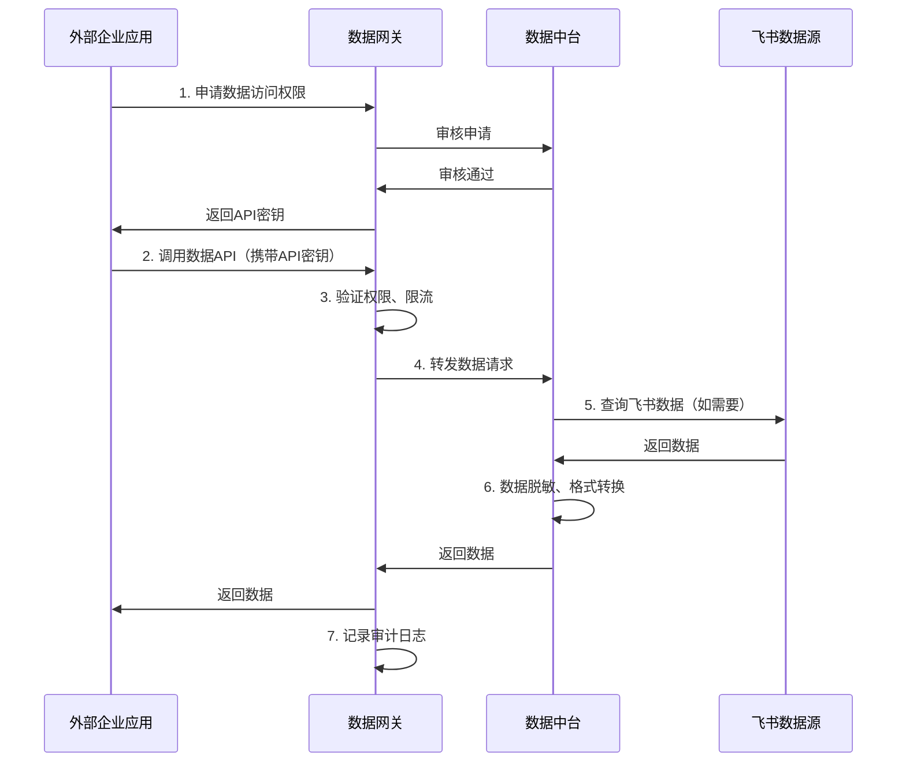

**数据开放策略**：

| 策略维度 | 说明 | 配置示例 |
|---------|------|---------|
| **数据范围** | 限制开放的数据范围 | 只开放公开数据，不开放敏感数据 |
| **数据脱敏** | 对开放数据进行脱敏处理 | 手机号、邮箱脱敏后再开放 |
| **访问限制** | 限制访问频率和访问量 | 每分钟最多100次调用 |
| **权限管理** | 基于申请的数据访问权限 | 企业申请后审批授权 |
| **审计追溯** | 记录所有数据访问日志 | 完整的访问审计日志 |

---

## 七、数据开放价值分析

### 7.1 开放目的分析

飞书开放数据的根本目的：

| 开放目的 | 详细说明 | 典型场景 |
|---------|---------|---------|
| **消除数据孤岛** | 企业数据分散在各应用中，开放数据实现数据统一 | 企业数据中台建设 |
| **提升数据价值** | 让数据在不同场景下被消费，发挥数据价值 | 数据分析、业务决策 |
| **降低集成成本** | 提供标准的数据接口，降低系统集成成本 | 应用系统对接 |
| **促进生态建设** | 开放数据吸引开发者，构建应用生态 | ISV应用开发 |
| **提升用户体验** | 数据在不同应用间流转，提升用户体验 | 统一身份、数据同步 |

### 7.2 开放价值实现

#### 7.2.1 数据价值实现路径

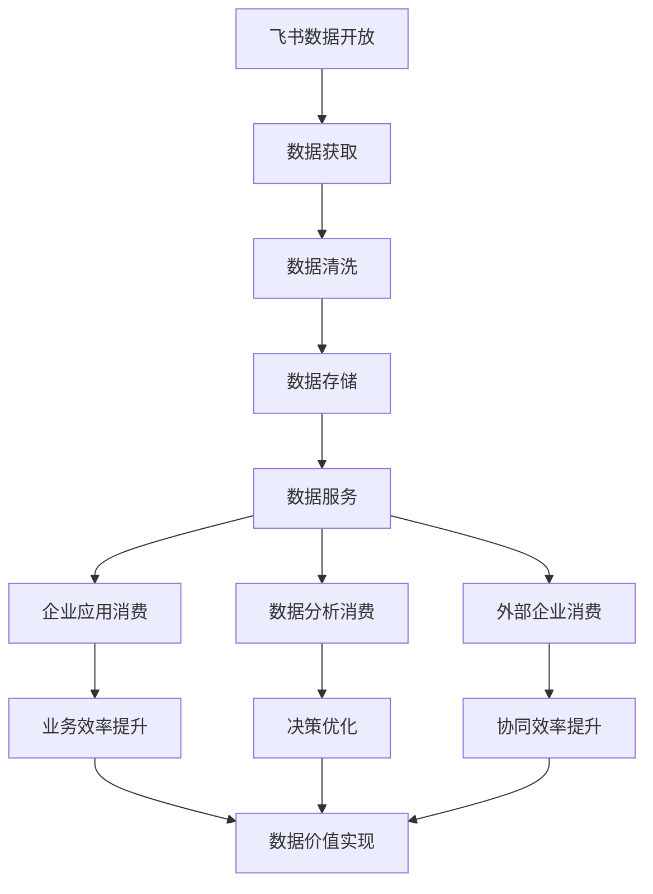

#### 7.2.2 数据价值量化

| 价值维度 | 量化指标 | 实现方式 |
|---------|---------|---------|
| **效率提升** | 应用开发效率提升30% | 统一数据接口，减少重复开发 |
| **成本降低** | 系统集成成本降低50% | 标准API，降低对接成本 |
| **决策优化** | 决策响应时间缩短40% | 数据实时获取，快速分析 |
| **体验提升** | 用户满意度提升20% | 数据统一，体验一致 |

---

## 八、数据开放最佳实践

### 8.1 数据获取最佳实践

#### 8.1.1 批量数据获取优化

**优化策略**：

```java
// 批量获取优化
public List<UserInfo> batchGetUsersOptimized(List<String> userIds) {
    // 1. 分批处理（避免单次请求过大）
    int batchSize = 50;
    List<UserInfo> allUsers = new ArrayList<>();
    
    for (int i = 0; i < userIds.size(); i += batchSize) {
        List<String> batchIds = userIds.subList(i, Math.min(i + batchSize, userIds.size()));
        List<UserInfo> batchUsers = client.contact().user().batchGet(batchIds);
        allUsers.addAll(batchUsers);
        
        // 限流控制
        Thread.sleep(50);
    }
    
    return allUsers;
}
```

#### 8.1.2 缓存策略

**缓存设计**：

```java
// 数据缓存
public class UserCache {
    private Cache<String, UserInfo> cache;
    
    public UserInfo getUser(String userId) {
        // 1. 查缓存
        UserInfo cached = cache.getIfPresent(userId);
        if (cached != null) {
            return cached;
        }
        
        // 2. 调API
        UserInfo user = client.contact().user().get(userId);
        
        // 3. 写缓存
        cache.put(userId, user);
        
        return user;
    }
    
    // 定时刷新缓存
    @Scheduled(fixedRate = 3600000)  // 每小时刷新
    public void refreshCache() {
        cache.invalidateAll();
    }
}
```

### 8.2 数据订阅最佳实践

#### 8.2.1 事件处理优化

**异步处理**：

```java
// 异步事件处理
@PostMapping("/webhook")
public void handleEventAsync(HttpServletRequest request) {
    // 1. 验证签名（同步）
    if (!verifySignature(request)) {
        return;
    }
    
    // 2. 解析事件（同步）
    Event event = parseEvent(request);
    
    // 3. 异步处理事件
    CompletableFuture.runAsync(() -> {
        handleEvent(event);
    });
    
    // 4. 立即返回响应
    response.setStatus(200);
}
```

#### 8.2.2 事件幂等处理

**幂等设计**：

```java
// 事件幂等处理
public void handleEventIdempotent(Event event) {
    String eventId = event.getEventId();
    
    // 1. 检查事件是否已处理
    if (eventProcessedCache.containsKey(eventId)) {
        log.info("Event already processed: {}", eventId);
        return;
    }
    
    // 2. 处理事件
    try {
        handleEventByType(event);
        
        // 3. 记录事件已处理
        eventProcessedCache.put(eventId, true);
    } catch (Exception e) {
        log.error("Event processing failed: {}", eventId, e);
        // 不记录已处理，下次重试
    }
}
```

### 8.3 数据安全最佳实践

#### 8.3.1 权限最小化

**只申请必要权限**：
- 不申请过度权限
- 根据实际需求申请最小权限集
- 定期审查权限，移除不必要权限

#### 8.3.2 数据脱敏

**敏感数据脱敏**：
- 对外开放的接口必须数据脱敏
- 根据调用方权限决定脱敏程度
- 记录数据脱敏日志

#### 8.3.3 审计追溯

**完整审计日志**：
- 记录所有数据访问行为
- 记录数据变更历史
- 支持数据访问追溯

---

## 九、总结与建议

### 9.1 飞书数据开放特点总结

| 维度 | 飞书数据开放特点 | 优势 | 不足 |
|------|-----------------|------|------|
| **数据范围** | 全面覆盖基础、业务、协作、运营数据 | 数据范围广，满足多种场景 | 部分数据开放受限 |
| **开放机制** | API + 事件订阅 + Webhook + 导出 | 多种机制，灵活选择 | 机制较复杂，学习成本高 |
| **权限控制** | 分级权限、细粒度控制 | 权限体系完善，安全可控 | 权限申请流程复杂 |
| **数据安全** | 完善的安全机制 | 数据安全有保障 | 安全机制增加开发成本 |
| **企业数据中台** | 适合作为数据中台数据源 | 数据源丰富，接入便捷 | 需要数据清洗和质量控制 |

### 9.2 企业数据中台建议

#### 9.2.1 数据接入建议

1. **双模式接入**：定时全量同步 + 实时事件订阅
2. **数据清洗**：接入数据必须清洗和质量检查
3. **数据存储**：建立数据仓库和数据湖
4. **数据服务**：构建统一数据服务层

#### 9.2.2 数据开放建议

1. **分级开放**：根据数据敏感度分级开放
2. **权限管理**：建立完善的数据开放权限体系
3. **数据脱敏**：对外开放数据必须脱敏
4. **审计追溯**：记录完整的数据访问日志

#### 9.2.3 最佳实践建议

1. **最小权限原则**：只申请必要的数据访问权限
2. **数据缓存优化**：合理使用缓存减少API调用
3. **异步处理事件**：事件处理异步化提升性能
4. **幂等性设计**：确保事件处理的幂等性
5. **限流控制**：合理控制数据获取频率

---

## 十、附录

### 10.1 飞书数据开放API清单

| 数据类型 | API列表 | 主要功能 |
|---------|---------|---------|
| **用户数据** | user.get、user.batch_get、user.list | 用户信息获取 |
| **组织数据** | department.get、department.list、department.user_list | 组织架构获取 |
| **审批数据** | approval.instance.create、approval.instance.get、approval.list | 审批数据获取 |
| **考勤数据** | attendance.list、attendance.user_list、attendance.statistic | 考勤数据获取 |
| **消息数据** | message.send、message.list（受限） | 消息推送和查询 |
| **文档数据** | doc.get、doc.content.get、doc.list | 文档数据获取 |

### 10.2 飞书数据开放权限清单

| 权限类型 | 权限名称 | 权限说明 |
|---------|---------|---------|
| **基础权限** | contact:user:read:basic | 用户基本信息读取 |
| **高级权限** | contact:user:read | 用户详细信息读取 |
| **敏感权限** | contact:user:read:sensitive | 用户敏感信息读取 |
| **消息权限** | message:send | 发送消息 |
| **审批权限** | approval:instance:create | 创建审批实例 |
| **文档权限** | doc:read | 读取文档 |

### 10.3 相关资源

| 资源类型 | 链接 |
|---------|------|
| **飞书开放平台官网** | https://open.feishu.cn |
| **API文档** | https://open.feishu.cn/document/server-docs/api-reference |
| **权限说明** | https://open.feishu.cn/document/home/introduction-to-scope-and-authorization/availability-of-permissions |
| **事件订阅文档** | https://open.feishu.cn/document/ukTMukTMukTM/uUTN2UjL2UjN2UTN2UTN |

---

**报告编制时间**：2026年4月
**报告版本**：V1.0
**报告角度**：数据开放能力调研