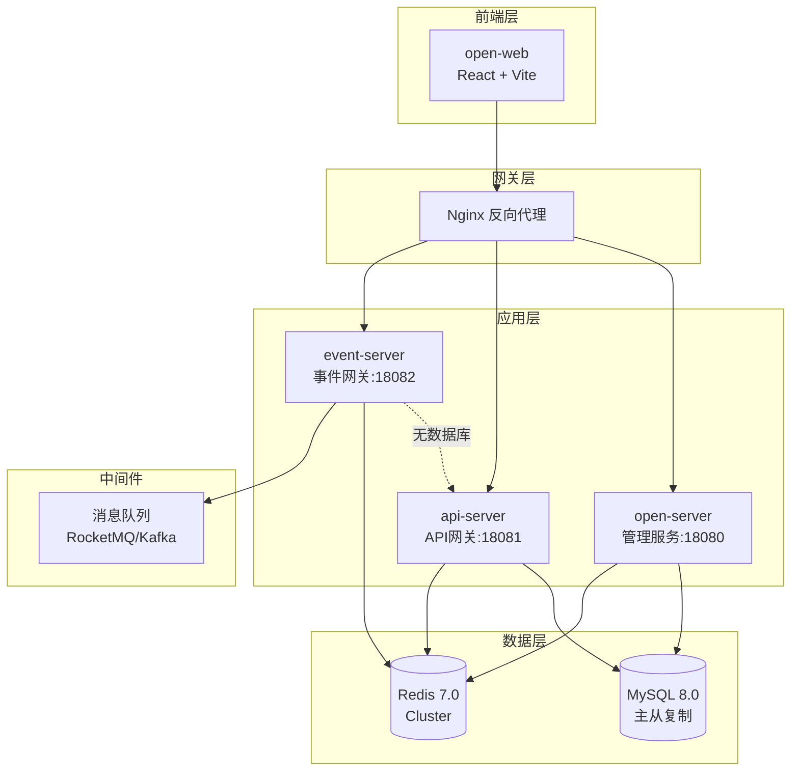

# 能力开放平台部署指南

**项目名称**: 能力开放平台（Capability Open Platform）  
**版本**: v1.0.0  
**编制日期**: 2026-04-22  
**运维负责人**: SDDU DevOps Team

---

## 1. 部署概述

### 1.1 架构概览



### 1.2 服务清单

| 服务 | 端口 | 依赖 | 部署方式 |
|------|------|------|----------|
| open-server | 18080 | MySQL, Redis | Spring Boot JAR |
| api-server | 18081 | MySQL, Redis | Spring Boot JAR |
| event-server | 18082 | Redis, api-server | Spring Boot JAR |
| open-web | 13000 | - | Nginx 静态资源 |

---

## 2. 环境准备

### 2.1 硬件要求

| 环境 | CPU | 内存 | 存储 | 数量 |
|------|-----|------|------|------|
| **开发环境** | 4核 | 8GB | 100GB | 1台 |
| **测试环境** | 4核 | 16GB | 200GB | 2台 |
| **生产环境** | 8核 | 32GB | 500GB | 3台+ |

### 2.2 软件要求

| 软件 | 版本 | 说明 |
|------|------|------|
| **JDK** | 21+ | 必须，用于运行 Spring Boot |
| **MySQL** | 8.0+ | 必须，数据存储 |
| **Redis** | 7.0+ | 必须，缓存和分布式锁 |
| **Nginx** | 1.24+ | 推荐，反向代理和静态资源 |
| **Node.js** | 18+ | 前端构建工具 |

### 2.3 网络要求

| 端口 | 服务 | 协议 | 说明 |
|------|------|------|------|
| 18080 | open-server | HTTP | 管理服务 |
| 18081 | api-server | HTTP | API 网关 |
| 18082 | event-server | HTTP | 事件网关 |
| 13000 | open-web | HTTP | 前端服务 |
| 3306 | MySQL | TCP | 数据库 |
| 6379 | Redis | TCP | 缓存服务 |

---

## 3. 数据库部署

### 3.1 MySQL 安装

```bash
# CentOS/RHEL
sudo yum install mysql-server

# Ubuntu/Debian
sudo apt-get install mysql-server

# 启动 MySQL
sudo systemctl start mysqld
sudo systemctl enable mysqld

# 安全配置
sudo mysql_secure_installation
```

### 3.2 创建数据库和用户

```sql
-- 创建数据库
CREATE DATABASE openplatform DEFAULT CHARACTER SET utf8mb4 COLLATE utf8mb4_unicode_ci;

-- 创建用户
CREATE USER 'openplatform'@'%' IDENTIFIED BY 'your_strong_password';

-- 授权
GRANT ALL PRIVILEGES ON openplatform.* TO 'openplatform'@'%';
FLUSH PRIVILEGES;
```

### 3.3 初始化数据库

```bash
# 执行初始化脚本
mysql -u openplatform -p openplatform < docs/sql/init-schema.sql

# 插入默认数据
mysql -u openplatform -p openplatform < docs/sql/insert-default-data.sql

# 验证表创建
mysql -u openplatform -p openplatform -e "SHOW TABLES LIKE 'openplatform_v2_%'"
```

### 3.4 主从复制配置（生产环境）

**主库配置** (`/etc/my.cnf`):

```ini
[mysqld]
server-id = 1
log-bin = mysql-bin
binlog-format = ROW
binlog-do-db = openplatform
```

**从库配置** (`/etc/my.cnf`):

```ini
[mysqld]
server-id = 2
relay-log = mysql-relay-bin
read-only = 1
```

---

## 4. Redis 部署

### 4.1 Redis 安装

```bash
# CentOS/RHEL
sudo yum install redis

# Ubuntu/Debian
sudo apt-get install redis-server

# 启动 Redis
sudo systemctl start redis
sudo systemctl enable redis
```

### 4.2 Redis 配置

编辑 `/etc/redis/redis.conf`:

```conf
# 绑定地址
bind 0.0.0.0

# 端口
port 6379

# 密码（生产环境必须设置）
requirepass your_redis_password

# 最大内存
maxmemory 4gb

# 内存淘汰策略
maxmemory-policy allkeys-lru

# 持久化
appendonly yes
appendfsync everysec
```

### 4.3 Redis 集群配置（生产环境）

```bash
# 创建集群目录
mkdir -p /opt/redis-cluster/{7000,7001,7002,7003,7004,7005}

# 启动 Redis 节点
redis-server /opt/redis-cluster/7000/redis.conf
redis-server /opt/redis-cluster/7001/redis.conf
# ... 其他节点

# 创建集群
redis-cli --cluster create \
  192.168.1.101:7000 192.168.1.101:7001 \
  192.168.1.102:7002 192.168.1.102:7003 \
  192.168.1.103:7004 192.168.1.103:7005 \
  --cluster-replicas 1
```

---

## 5. 应用部署

### 5.1 编译打包

```bash
# 克隆代码
git clone https://github.com/your-org/open-platform.git
cd open-platform

# 编译后端
mvn clean package -DskipTests

# 编译前端
cd open-web
npm install
npm run build
```

### 5.2 配置文件

**open-server** (`application-prod.yml`):

```yaml
spring:
  datasource:
    url: jdbc:mysql://mysql-master:3306/openplatform?useSSL=true&serverTimezone=Asia/Shanghai
    username: openplatform
    password: ${MYSQL_PASSWORD}
    driver-class-name: com.mysql.cj.jdbc.Driver
    
  redis:
    host: redis-cluster
    port: 6379
    password: ${REDIS_PASSWORD}
    database: 0
    
server:
  port: 18080
  
mybatis:
  mapper-locations: classpath:mapper/*.xml
  
# Mock 配置
mock:
  enabled: false
```

**api-server** (`application-prod.yml`):

```yaml
spring:
  datasource:
    url: jdbc:mysql://mysql-master:3306/openplatform?useSSL=true&serverTimezone=Asia/Shanghai
    username: openplatform
    password: ${MYSQL_PASSWORD}
    
  redis:
    host: redis-cluster
    port: 6379
    password: ${REDIS_PASSWORD}
    
server:
  port: 18081
  
# 内部网关配置
internal:
  gateway:
    url: http://internal-gateway:8080
```

**event-server** (`application-prod.yml`):

```yaml
spring:
  redis:
    host: redis-cluster
    port: 6379
    password: ${REDIS_PASSWORD}
    
server:
  port: 18082
  
# api-server 配置
api-server:
  url: http://api-server:18081/api-server
  
# 消息队列配置（可选）
rocketmq:
  name-server: rocketmq:9876
```

### 5.3 启动服务

**使用脚本启动**:

```bash
# 启动 open-server
cd open-server
./scripts/start.sh

# 启动 api-server
cd api-server
./scripts/start.sh

# 启动 event-server
cd event-server
./scripts/start.sh
```

**使用 systemd 管理**:

创建服务文件 `/etc/systemd/system/open-server.service`:

```ini
[Unit]
Description=Open Platform - Open Server
After=network.target mysql.service redis.service

[Service]
Type=simple
User=openplatform
WorkingDirectory=/opt/open-platform/open-server
ExecStart=/usr/bin/java -Xms2g -Xmx4g -jar open-server.jar --spring.profiles.active=prod
Restart=on-failure
RestartSec=10

[Install]
WantedBy=multi-user.target
```

启动服务:

```bash
sudo systemctl daemon-reload
sudo systemctl start open-server
sudo systemctl enable open-server
```

### 5.4 验证服务

```bash
# 检查 open-server
curl http://localhost:18080/open-server/actuator/health

# 检查 api-server
curl http://localhost:18081/api-server/actuator/health

# 检查 event-server
curl http://localhost:18082/event-server/actuator/health
```

---

## 6. 前端部署

### 6.1 构建

```bash
cd open-web
npm install
npm run build
```

### 6.2 Nginx 配置

创建配置文件 `/etc/nginx/conf.d/open-platform.conf`:

```nginx
upstream open-server {
    server 192.168.1.101:18080;
    server 192.168.1.102:18080;
}

upstream api-server {
    server 192.168.1.101:18081;
    server 192.168.1.102:18081;
}

upstream event-server {
    server 192.168.1.101:18082;
    server 192.168.1.102:18082;
}

server {
    listen 80;
    server_name open.yourdomain.com;
    
    # 强制 HTTPS
    return 301 https://$server_name$request_uri;
}

server {
    listen 443 ssl http2;
    server_name open.yourdomain.com;
    
    # SSL 证书
    ssl_certificate /etc/nginx/ssl/open.yourdomain.com.crt;
    ssl_certificate_key /etc/nginx/ssl/open.yourdomain.com.key;
    
    # SSL 配置
    ssl_protocols TLSv1.2 TLSv1.3;
    ssl_ciphers HIGH:!aNULL:!MD5;
    ssl_prefer_server_ciphers on;
    
    # 前端静态资源
    location / {
        root /opt/open-platform/open-web/dist;
        try_files $uri $uri/ /index.html;
        index index.html;
    }
    
    # open-server API
    location /open-server/ {
        proxy_pass http://open-server/open-server/;
        proxy_set_header Host $host;
        proxy_set_header X-Real-IP $remote_addr;
        proxy_set_header X-Forwarded-For $proxy_add_x_forwarded_for;
        proxy_set_header X-Forwarded-Proto $scheme;
    }
    
    # api-server API
    location /api-server/ {
        proxy_pass http://api-server/api-server/;
        proxy_set_header Host $host;
        proxy_set_header X-Real-IP $remote_addr;
        proxy_set_header X-Forwarded-For $proxy_add_x_forwarded_for;
        proxy_set_header X-Forwarded-Proto $scheme;
    }
    
    # event-server API
    location /event-server/ {
        proxy_pass http://event-server/event-server/;
        proxy_set_header Host $host;
        proxy_set_header X-Real-IP $remote_addr;
        proxy_set_header X-Forwarded-For $proxy_add_x_forwarded_for;
        proxy_set_header X-Forwarded-Proto $scheme;
    }
    
    # 健康检查
    location /health {
        return 200 'OK';
        add_header Content-Type text/plain;
    }
}
```

### 6.3 启动 Nginx

```bash
# 测试配置
sudo nginx -t

# 启动 Nginx
sudo systemctl start nginx
sudo systemctl enable nginx

# 重载配置
sudo nginx -s reload
```

---

## 7. 监控部署

### 7.1 Prometheus + Grafana

**Prometheus 配置** (`prometheus.yml`):

```yaml
global:
  scrape_interval: 15s

scrape_configs:
  - job_name: 'open-server'
    metrics_path: '/open-server/actuator/prometheus'
    static_configs:
      - targets: ['192.168.1.101:18080', '192.168.1.102:18080']
  
  - job_name: 'api-server'
    metrics_path: '/api-server/actuator/prometheus'
    static_configs:
      - targets: ['192.168.1.101:18081', '192.168.1.102:18081']
  
  - job_name: 'event-server'
    metrics_path: '/event-server/actuator/prometheus'
    static_configs:
      - targets: ['192.168.1.101:18082', '192.168.1.102:18082']
```

**Grafana 仪表盘**:

导入 Spring Boot 仪表盘：ID 12900

### 7.2 日志收集（ELK）

**Filebeat 配置** (`filebeat.yml`):

```yaml
filebeat.inputs:
- type: log
  paths:
    - /opt/open-platform/open-server/logs/*.log
  fields:
    service: open-server
  
- type: log
  paths:
    - /opt/open-platform/api-server/logs/*.log
  fields:
    service: api-server
  
- type: log
  paths:
    - /opt/open-platform/event-server/logs/*.log
  fields:
    service: event-server

output.elasticsearch:
  hosts: ["elasticsearch:9200"]
  index: "open-platform-%{+yyyy.MM.dd}"
```

---

## 8. 安全配置

### 8.1 防火墙配置

```bash
# 开放端口
sudo firewall-cmd --permanent --add-port=80/tcp
sudo firewall-cmd --permanent --add-port=443/tcp
sudo firewall-cmd --permanent --add-port=18080/tcp
sudo firewall-cmd --permanent --add-port=18081/tcp
sudo firewall-cmd --permanent --add-port=18082/tcp

# 重载防火墙
sudo firewall-cmd --reload
```

### 8.2 HTTPS 证书

```bash
# 使用 Let's Encrypt 免费证书
sudo yum install certbot python3-certbot-nginx
sudo certbot --nginx -d open.yourdomain.com

# 自动续期
sudo crontab -e
# 添加定时任务
0 0 1 * * /usr/bin/certbot renew --quiet
```

### 8.3 数据库安全

```sql
-- 删除匿名用户
DELETE FROM mysql.user WHERE User='';

-- 禁止 root 远程登录
DELETE FROM mysql.user WHERE User='root' AND Host NOT IN ('localhost', '127.0.0.1', '::1');

-- 删除测试数据库
DROP DATABASE IF EXISTS test;

-- 刷新权限
FLUSH PRIVILEGES;
```

---

## 9. 备份与恢复

### 9.1 数据库备份

```bash
#!/bin/bash
# backup-mysql.sh

BACKUP_DIR=/opt/backup/mysql
DATE=$(date +%Y%m%d_%H%M%S)
BACKUP_FILE=openplatform_$DATE.sql.gz

# 创建备份目录
mkdir -p $BACKUP_DIR

# 备份数据库
mysqldump -u openplatform -p'your_password' openplatform | gzip > $BACKUP_DIR/$BACKUP_FILE

# 删除 7 天前的备份
find $BACKUP_DIR -name "*.sql.gz" -mtime +7 -delete

echo "Backup completed: $BACKUP_FILE"
```

**定时备份**:

```bash
# 每天凌晨 2 点备份
crontab -e
0 2 * * * /opt/scripts/backup-mysql.sh
```

### 9.2 数据恢复

```bash
# 恢复数据库
gunzip < openplatform_20260422_020000.sql.gz | mysql -u openplatform -p openplatform
```

---

## 10. 故障排查

### 10.1 常见问题

| 问题 | 原因 | 解决方法 |
|------|------|----------|
| 服务无法启动 | 端口被占用 | `lsof -i:18080` 查看占用进程 |
| 数据库连接失败 | 连接数不足 | 增加 `max_connections` |
| Redis 连接超时 | 网络问题或密码错误 | 检查网络和配置 |
| 事件分发失败 | event-server 依赖 Redis | 确保 Redis 已启动 |
| 权限校验失败 | Token 过期或无效 | 检查 Token 有效期 |

### 10.2 日志查看

```bash
# 查看 open-server 日志
tail -f open-server/logs/open-server.log

# 查看 api-server 日志
tail -f api-server/logs/api-server.log

# 查看 event-server 日志
tail -f event-server/logs/event-server.log

# 查看错误日志
grep -i error open-server/logs/open-server.log
```

### 10.3 性能调优

**JVM 参数**:

```bash
# 生产环境推荐参数
java -Xms4g -Xmx4g \
     -XX:+UseG1GC \
     -XX:MaxGCPauseMillis=200 \
     -XX:+HeapDumpOnOutOfMemoryError \
     -XX:HeapDumpPath=/opt/logs/heapdump.hprof \
     -jar open-server.jar
```

**MySQL 参数**:

```ini
[mysqld]
# 连接数
max_connections = 1000

# 缓冲池大小（建议为内存的 70-80%）
innodb_buffer_pool_size = 16G

# 日志文件大小
innodb_log_file_size = 1G

# 查询缓存
query_cache_type = 1
query_cache_size = 256M
```

---

## 11. 升级指南

### 11.1 升级前准备

1. 备份数据库
2. 备份配置文件
3. 通知用户系统维护

### 11.2 升级步骤

```bash
# 1. 停止服务
./scripts/stop.sh

# 2. 备份旧版本
cp -r /opt/open-platform /opt/open-platform.bak

# 3. 更新代码
git pull origin main

# 4. 编译打包
mvn clean package -DskipTests

# 5. 数据库迁移
mysql -u openplatform -p openplatform < docs/sql/migration-v1.1.0.sql

# 6. 启动服务
./scripts/start.sh

# 7. 验证服务
curl http://localhost:18080/open-server/actuator/health
```

---

## 12. 附录

### 12.1 启动脚本

**start.sh**:

```bash
#!/bin/bash

APP_NAME="open-server"
JAR_FILE="open-server.jar"
PID_FILE="app.pid"
LOG_FILE="logs/open-server.log"

# 检查是否已运行
if [ -f "$PID_FILE" ]; then
    PID=$(cat $PID_FILE)
    if ps -p $PID > /dev/null 2>&1; then
        echo "Service is already running (PID: $PID)"
        exit 1
    fi
fi

# 启动服务
nohup java -Xms2g -Xmx4g -jar $JAR_FILE --spring.profiles.active=prod > $LOG_FILE 2>&1 &
echo $! > $PID_FILE

echo "Service started (PID: $(cat $PID_FILE))"
```

**stop.sh**:

```bash
#!/bin/bash

PID_FILE="app.pid"

if [ -f "$PID_FILE" ]; then
    PID=$(cat $PID_FILE)
    kill $PID
    rm -f $PID_FILE
    echo "Service stopped"
else
    echo "PID file not found"
fi
```

### 12.2 健康检查脚本

```bash
#!/bin/bash

check_service() {
    local name=$1
    local url=$2
    
    response=$(curl -s -o /dev/null -w "%{http_code}" $url)
    if [ $response -eq 200 ]; then
        echo "✅ $name is healthy"
    else
        echo "❌ $name is unhealthy (HTTP $response)"
    fi
}

check_service "open-server" "http://localhost:18080/open-server/actuator/health"
check_service "api-server" "http://localhost:18081/api-server/actuator/health"
check_service "event-server" "http://localhost:18082/event-server/actuator/health"
```

---

**文档版本**: v1.0.0  
**最后更新**: 2026-04-22  
**维护人**: SDDU DevOps Team
