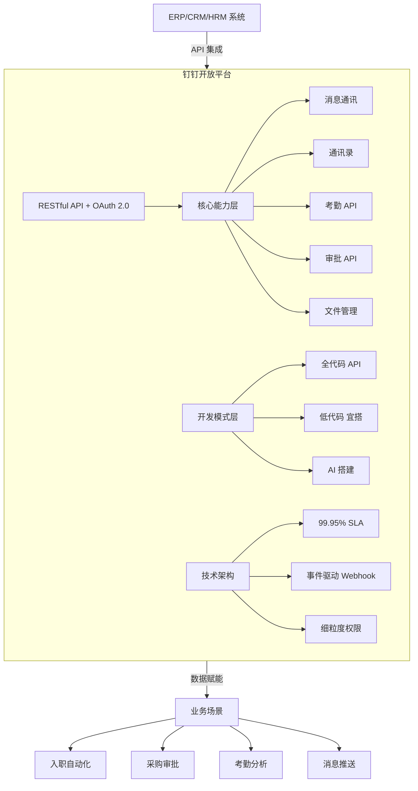
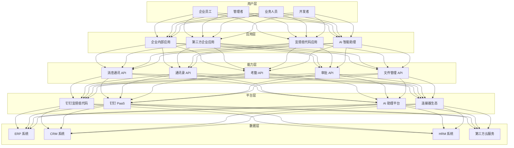
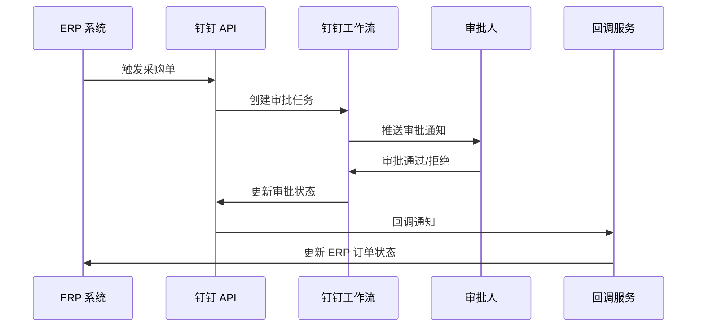
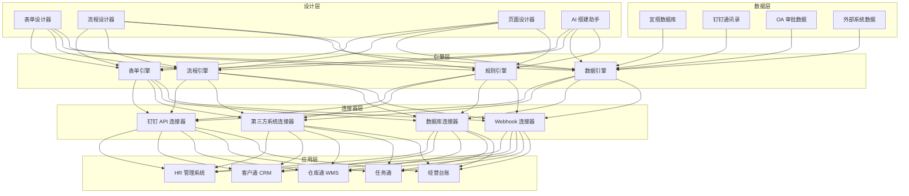
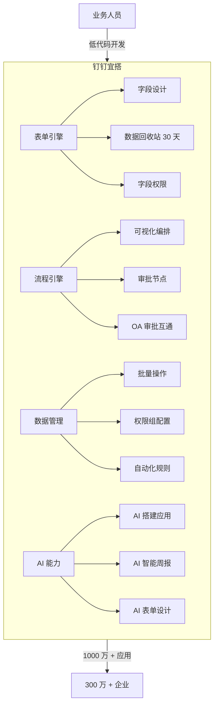

# 钉钉开放平台数据价值赋能报告

> 调研日期：2026年4月 | 数据来源：钉钉开放平台官方文档、钉钉官网、宜搭帮助中心

---

## 一、平台概览

钉钉开放平台是阿里巴巴集团旗下钉钉产品面向企业和开发者提供的**企业级应用开发与系统集成平台**。其核心理念是让分散系统通过标准化接口自动协作，重建企业"神经系统"，将组织节奏从"被动处理"升级为"即时反应"。

### 核心定位

- **统一工作平台**：将 ERP、CRM、HRM 等系统集中到钉钉
- **自动化引擎**：通过 API 实现跨系统自动协作
- **AI 驱动**：AI 原生能力深度融入办公场景
- **低代码优先**：宜搭平台让人人都是创造者

### 关键数据

| 指标 | 数据 |
|------|------|
| SLA 可用性 | 99.95% |
| 服务企业数 | 300 万+ |
| 宜搭应用数 | 1000 万+ |
| AI 智能体数 | 10 万+ |
| 数据提交量 | 40 亿+ |
| 开发协议 | RESTful API + OAuth 2.0 |
| 客户覆盖 | 制造、零售、金融、教育、政务等 |

### 平台架构

### 详细架构

---

## 二、核心开放能力与数据价值

### 2.1 消息与通讯 API

**能力概述**：提供企业即时通讯的全套 API，支持工作通知、群消息、机器人消息推送等。

**数据赋能场景**：

| 场景 | 实现方式 | 数据价值 |
|------|----------|----------|
| 自动化消息推送 | 项目状态变更触发钉钉机器人推送 | 信息即时触达，减少沟通延迟 |
| 新员工入职自动通知 | HR 系统触发 → 自动发欢迎信息 → 加入对应群组 | 入职体验提升，流程自动化 |
| 项目进度实时推送 | 后端数据库状态变更 → API 推送至相关群组 | 管理者实时掌握项目进展 |
| 告警通知 | 监控系统异常 → 钉钉消息推送 | 运维响应时间缩短 |

**关键 API**：
- 发送工作通知
- 群机器人 Webhook
- 消息发送与回调

### 2.2 通讯录与组织架构 API

**能力概述**：提供用户管理、部门管理、组织架构同步等能力。

**数据赋能场景**：

| 场景 | 实现方式 | 数据价值 |
|------|----------|----------|
| 组织架构同步 | HR 系统 → 钉钉通讯录自动同步 | 统一身份管理，多系统数据一致 |
| 员工入职自动化 | 新员工资料提交 → 触发邮箱、门禁、IT 资产系统同步 | 员工生产力启动速度加快 60% |
| 部门动态管理 | 通过 API 动态同步组织架构变化 | 组织调整实时反映到所有系统 |

**关键 API**：
- `/user/get` 获取员工资料
- `/department/list` 获取部门列表
- 用户创建/更新/删除
- 部门创建/更新/删除

### 2.3 考勤 API

**能力概述**：提供考勤规则管理、打卡记录查询、排班管理等能力。

**数据赋能场景**：

| 场景 | 实现方式 | 数据价值 |
|------|----------|----------|
| 考勤数据导出分析 | 定期自动导出员工出勤数据 → BI 工具分析 | 团队活跃度热力图，加班分析 |
| 请假审批联动 | 宜搭请假审批通过 → 调用连接器通知钉钉考勤 | 考勤状态自动更新，无需手动操作 |
| 考勤报表自动化 | 考勤数据自动汇总 → 一键导出考勤报表 | 薪资计算效率提升，减少错误 |

**关键 API**：
- 考勤规则管理
- 打卡记录查询
- 排班管理
- 假勤审批同步

### 2.4 审批 API

**能力概述**：提供审批流程管理、审批数据互通、第三方审批接入等能力。

**数据赋能场景**：

| 场景 | 实现方式 | 数据价值 |
|------|----------|----------|
| ERP 采购审批自动化 | ERP 触发采购单 → API 推送至钉钉工作流 → 批准后回调更新 ERP | 审批时间从 76.8 小时压缩至 8 小时内，效率提升 80% |
| 自有 OA 审批同步 | 企业自有审批系统 → 同步到钉钉 OA 审批 | 审批入口统一，处理效率提升 |
| 审批数据分析 | 审批数据定期导出 → 分析审批效率瓶颈 | 发现流程优化点，持续改进 |

**关键 API**：
- `/gettoken` 获取访问凭证
- 审批流程创建/查询
- 审批回调处理
- 宜搭与钉钉 OA 审批数据互通

### ERP 整合流程

---

## 三、AI 驱动的数据赋能

### 3.1 钉钉 AI 助理

钉钉 AI 助理是面向企业工作场景的智能助手，提供以下核心能力：

| 能力 | 说明 | 数据赋能价值 |
|------|------|--------------|
| 智能问答 | 基于企业知识库的 AI 问答 | 快速获取企业知识，减少搜索时间 |
| 数据分析 | AI 辅助数据分析与报表生成 | 降低数据分析门槛 |
| 流程自动化 | AI 驱动的工作流自动化 | 复杂流程智能编排 |
| 管理员 AI 助理 | 为管理员提供智能管理建议 | 管理决策数据驱动 |

### 3.2 宜搭 AI 能力

- **AI 搭建应用**：通过 AI 快速生成业务应用原型
- **AI 智能周报**：自动生成智能周报
- **AI 表单设计**：AI 辅助表单设计与优化

### 3.3 组织大脑

- 整合企业数据资产，提供全局数据视图
- 支持上下级管理视图
- 企业门户数据集成

---

## 四、开发模式与集成能力

### 4.1 开发模式

| 开发模式 | 平台 | 适用场景 | 技术门槛 |
|----------|------|----------|----------|
| 全代码 | 钉钉开放平台 API | 复杂业务系统集成 | 高 |
| 低代码 | 钉钉宜搭 | 业务系统快速搭建 | 中-低 |
| AI 搭建 | 宜搭 AI + 钉钉 AI 助理 | 智能应用开发 | 低 |

### 4.2 钉钉宜搭

宜搭是钉钉的低代码平台，核心数据：

| 指标 | 数据 |
|------|------|
| 服务企业数 | 300万+ |
| 宜搭应用数 | 1000万+ |
| AI 智能体数 | 10万+ |
| 数据提交量 | 40亿+ |

**核心能力**：
- 表单设计：丰富的字段类型，数据回收站（30天内可恢复）
- 流程引擎：可视化流程编排，审批节点配置
- 数据管理：批量修改/删除，权限组配置，字段级权限
- 自动化：集成自动化，数据卡片发送
- 国际化：多语言支持，海外邮箱（OutLook、Gmail）
- OA 审批数据互通：宜搭与钉钉 OA 审批深度集成

### 宜搭低代码架构

**典型应用场景**：
- HR 综合管理系统
- 绩效考核 KPI
- 仓库通、客户通、任务通
- 经营台账、智能周报

### 宜搭架构图

### 4.3 钉钉 PaaS

- 提供企业级 PaaS 能力
- 支持复杂业务系统定制开发
- 与宜搭深度集成

### 4.4 API Explorer

- 在线 API 调试工具
- 即时测试接口调用
- 快速验证开发逻辑

---

## 五、技术架构与安全

### 5.1 技术优势

| 优势 | 说明 | 数据价值 |
|------|------|----------|
| 99.95% SLA 高可用 | 系统稳定性保障自动化流程持续运行 | 财务月结零中断，现金周转周期缩短 |
| 细粒度权限控制 | 支持部门、角色、字段级权限设定 | 合规共享资料，降低隐私法遵风险 |
| 事件驱动 Webhook | 取代传统轮询，变更即时推送 | 员工生产力启动速度加快 60% |
| OAuth 2.0 认证 | 安全通讯标准 | 保障 API 调用安全 |

### 5.2 数据安全

- **访问凭证管理**：access_token 自动刷新机制
- **权限最小化**：仅授予必要访问权
- **操作日志**：双系统日志，不可篡改的操作轨迹
- **合规保障**：支持 GDPR 与本地隐私法

---

## 六、典型客户案例与量化 ROI

### 6.1 制造业 ERP 整合案例

- **痛点**：采购申请平均耗时 3.2 天审批，供应链响应慢
- **方案**：SAP/用友 ERP → 钉钉 API → 工作流自动审批 → 回调更新 ERP
- **数据价值**：
  - 审批时间从 76.8 小时压缩至 8 小时内，**效率提升 80%**
  - 内部稽核从半日缩减至 15 分钟
  - 每次操作皆有不可篡改的操作轨迹

### 6.2 中企表单处理案例

- **背景**：每月处理 2,000 张表单，每张耗时 15 分钟人工转录
- **方案**：导入钉钉开放平台 API，实现近乎零介入
- **数据价值**：
  - 时薪 HK$150 计算，**年省人力成本逾 HK$54 万**
  - 错误率下降逾 70%
  - 订单延误、重复开单等隐性成本大幅减少

### 6.3 通用量化回报

根据 IDC 2024 年报告：
- 成功部署企业级 API 整合的公司，三年内平均降低营运成本 **18%**
- 自动化后平均节省 **67%** 处理时间

### 6.4 钉钉使用前后对比

| 维度 | 使用前 | 使用后 |
|------|--------|--------|
| 团队协作 | 任务分散，标准不一，沟通混乱 | 统一平台，人员与任务集中 |
| 信息管理 | 信息散落在 WhatsApp/邮件/Excel | 官方渠道，权限可控，可追溯 |
| 工作流 | 手动处理审批、排班、报告 | 流程在线化，审批更快，反馈更及时 |
| 人事管理 | 打卡、请假、加班分散在不同系统 | 自动汇总，一键导出考勤报表 |

**量化指标**：
- 运营效率提升：**9.5 倍**
- 成本节省：**72%**
- 团队同步加快：**35%**

---

## 七、数据赋能总结

### 7.1 钉钉开放平台的核心数据价值

1. **系统整合中枢**：通过标准化 API 将 ERP、CRM、HRM 等系统集中到钉钉
2. **自动化流程引擎**：事件驱动 Webhook 机制实现跨系统自动协作
3. **低代码业务搭建**：宜搭平台 1000 万+ 应用，让人人都是创造者
4. **AI 智能赋能**：10 万+ AI 智能体，降低智能化门槛
5. **数据驱动决策**：考勤/审批/消息数据导出 → BI 分析 → 管理洞察
6. **高可用保障**：99.95% SLA，细粒度权限，事件驱动架构

### 7.2 五步启动高影响项目

1. **锁定高频跨系统流程**：如员工入职（HR、IT、行政三系统同步）
2. **创建企业自建应用**：获取 AppKey 与 AppSecret
3. **测试基础连线**：使用 Postman 确认 access_token 获取
4. **开发轻量中间层**：处理数据转换、错误重试与 token 自动刷新
5. **沙盒全流程测试**：权限最小化审查

### 7.3 适用企业画像

- **中大型传统企业**：需要整合多个遗留系统，打造统一工作入口
- **制造/零售/政务**：重视考勤、审批、人事管理
- **低代码需求强**：希望业务人员也能搭建应用
- **出海企业**：需要国际化能力与全球化部署

---

*本报告基于钉钉开放平台官方文档及公开资料整理，数据截至 2026 年 4 月。*
