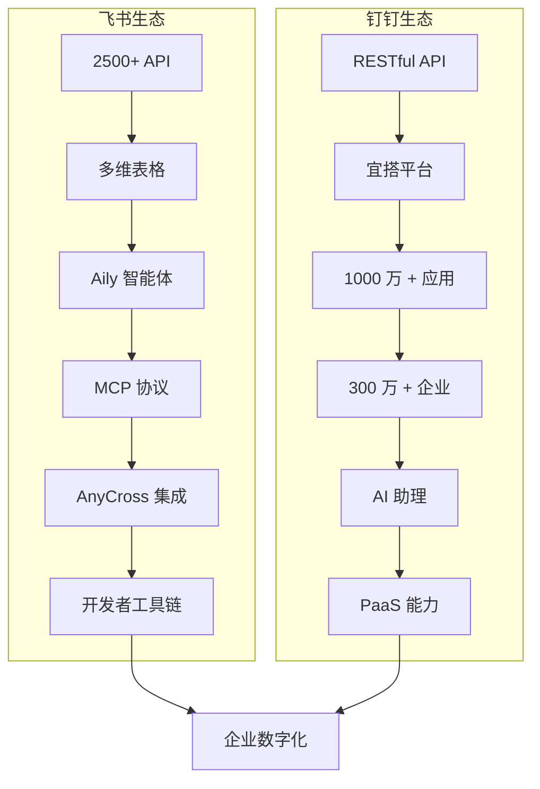
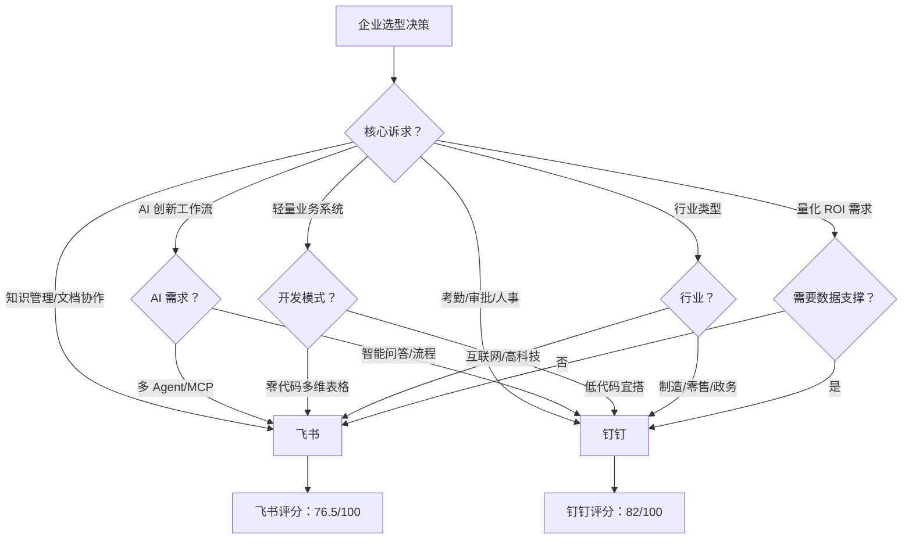

# 飞书 vs 钉钉开放平台数据价值对比报告

> 调研日期：2026年4月 | 数据来源：飞书开放平台官方文档、钉钉开放平台官方文档、行业分析报告

---

## 一、对比总览

| 维度 | 飞书开放平台 | 钉钉开放平台 |
|------|-------------|-------------|
| 所属公司 | 字节跳动 | 阿里巴巴集团 |
| 核心理念 | 一站式协同专属平台，信息高效流转 | 重建企业神经系统，系统自动协作 |
| API 数量 | 2500+ 服务端 API | 数百个 RESTful API |
| 应用形态 | 机器人、网页应用、小组件 | 企业内部应用、第三方企业应用 |
| 开发协议 | RESTful API + 长连接事件订阅 | RESTful API + OAuth 2.0 + Webhook |
| SLA | 未公开 | 99.95% |
| SDK 支持 | Java、Python、Go、Node.js | Java、Python、Go、PHP 等 |

---

```mermaid
xychart-beta
    title "飞书 vs 钉钉 核心能力对比"
    x-axis ["API 丰富度", "文档管理", "低代码", "AI 能力", "考勤人事", "审批流程", "开发者体验", "量化 ROI", "生态规模", "国际化"]
    y-axis "评分" 0 --> 10
    bar "飞书" [9, 9.5, 8, 9, 6, 7.5, 9, 5, 7, 6]
    bar "钉钉" [7, 6, 9, 7.5, 9.5, 9, 7, 9, 9, 8]
```

## 二、核心能力对比

### 2.1 消息与通讯

| 能力 | 飞书 | 钉钉 | 对比分析 |
|------|------|------|----------|
| 消息类型 | 文本、富文本、图片、文件、卡片、视频、音频、表情 | 文本、图片、文件、链接、Markdown、ActionCard | 飞书消息类型更丰富，特别是可交互卡片 |
| 群组管理 | 创建群、更新群、拉人入群、获取历史消息 | 群管理、群机器人 Webhook | 飞书群组管理能力更细粒度 |
| 运维告警 | 自动拉群报警（含客户案例：华住） | 工作通知推送 | 飞书场景化更成熟 |
| 消息历史 | 支持获取会话完整历史消息 | 有限支持 | 飞书更完善 |

### 2.2 通讯录与组织架构

| 能力 | 飞书 | 钉钉 | 对比分析 |
|------|------|------|----------|
| 部门管理 | 创建/修改部门 | 创建/更新/删除部门 | 基本持平 |
| 用户管理 | 创建/修改用户 | 创建/更新/删除用户 | 基本持平 |
| HR 系统集成 | 入转调离全流程自动化 | 组织架构同步、入职自动化 | 飞书场景描述更完整（含学习指南推送） |
| 用户组管理 | 支持 | 支持 | 基本持平 |

### 2.3 文档与知识管理

| 能力 | 飞书 | 钉钉 | 对比分析 |
|------|------|------|----------|
| 云文档 | 文档、电子表格、多维表格、知识库、云空间 | 钉盘、钉文档 | 飞书文档生态更完善，API 更丰富 |
| 多维表格 | 强大的业务管理工具，支持应用模式 | 多元表 | 飞书多维表格更成熟，支持零代码搭建专业系统 |
| 知识库 | 完整的知识库 API，节点管理，富文本内容获取 | 知识库基础能力 | 飞书知识库 API 更完善 |
| 自动化周报 | 模板定时创建、授权、归档、催办 | 宜搭智能周报 | 飞书自动化场景更丰富 |

### 2.4 日历与会议

| 能力 | 飞书 | 钉钉 | 对比分析 |
|------|------|------|----------|
| 日历 API | 创建/更新/删除日程，忙闲查询，会议室预定 | 日程管理 | 飞书日历 API 更完善 |
| 会议管理 | 智能会务（日程+会议+会议室串联） | 钉钉会议、钉闪会 | 飞书会议管理 API 更开放 |
| 休假同步 | HR 系统到请假日程到名片/日历显示标识 | 假勤审批同步到钉钉 | 飞书场景更完整 |

### 2.5 审批与流程

| 能力 | 飞书 | 钉钉 | 对比分析 |
|------|------|------|----------|
| 审批 API | 三方审批接入，嵌入式单据 | OA 审批，宜搭流程引擎 | 钉钉审批生态更成熟（含宜搭深度集成） |
| ERP 集成 | 审批管办一体（得物案例） | ERP 采购审批自动化（制造业案例） | 钉钉量化数据更详细（80% 效率提升） |
| 流程编排 | AnyCross 集成平台 | 宜搭可视化流程编排 | 钉钉低代码流程更成熟 |

### 2.6 考勤与人事

| 能力 | 飞书 | 钉钉 | 对比分析 |
|------|------|------|----------|
| 考勤 API | 基础能力 | 考勤规则、打卡记录、排班管理 | 钉钉考勤能力远超飞书 |
| 智能人事 | 飞书人事（人才发现与管理） | 智能人事、钉钉薪酬 | 钉钉人事管理更全面 |
| 招聘 | 飞书招聘（AI 简历评估、人岗匹配） | 智慧招聘 | 飞书招聘 AI 能力更强 |

---

## 三、低代码/零代码能力对比

### 3.1 平台对比

| 维度 | 飞书 | 钉钉 |
|------|------|------|
| 低代码平台 | 飞书 aPaaS | 钉钉宜搭 |
| 零代码平台 | 多维表格（Base） | 宜搭表单 + 流程 |
| 应用数量 | 未公开 | 1000万+ 宜搭应用 |
| 服务企业 | 未公开 | 300万+ 企业 |
| 数据提交量 | 未公开 | 40亿+ |
| AI 智能体 | Aily 智能体 | 10万+ AI 智能体 |

### 3.2 功能对比

| 功能 | 飞书多维表格 | 钉钉宜搭 |
|------|-------------|----------|
| 表单设计 | 表单视图 | 丰富的表单组件 |
| 数据视图 | 表格、看板、甘特图、日历等 | 多视图支持 |
| 仪表盘 | 仪表盘可视化分析 | 报表分析 |
| 自动化 | 自动化规则（触发器+动作） | 集成自动化、业务规则 |
| 权限管理 | 高级权限（行/列级） | 权限组配置、字段级权限 |
| 数据回收站 | 未明确 | 30天内可恢复 |
| 国际化 | 多语言支持 | 多语言支持，海外邮箱 |
| OA 审批互通 | 审批 API | 宜搭与钉钉 OA 审批深度互通 |

### 3.3 开发体验

| 维度 | 飞书 aPaaS | 钉钉宜搭 |
|------|-----------|----------|
| AI 辅助开发 | AI 增强全模块开发 | AI 搭建应用、AI 智能周报 |
| 应用模式 | 多维表格应用模式（零代码搭建专业系统） | 宜搭应用发布到工作台 |
| 插件生态 | 多维表格插件 | 连接器生态 |

---

## 四、AI 能力对比

### 4.1 AI 平台

| 维度 | 飞书 | 钉钉 |
|------|------|------|
| AI 平台 | 飞书 Aily | 钉钉 AI 助理 |
| 智能体数量 | 未公开 | 10万+ |
| 核心能力 | 智能文档理解、数据分析、任务规划、MCP 协议 | 智能问答、数据分析、流程自动化 |
| 知识库 | 关联企业专属知识（云文档、知识库、本地文件） | 企业知识库 |
| MCP 支持 | 支持（飞书协同工具 MCP） | 未明确 |

### 4.2 AI 原生开发

| 能力 | 飞书 | 钉钉 |
|------|------|------|
| AI 搭建系统 | 飞书妙搭（对话搭建系统，多 Agent 架构） | 宜搭 AI 搭建 |
| AI 辅助开发 | aPaaS 全模块 AI 辅助 | 宜搭 AI 表单设计 |
| AI 修复 | AI 一键修复问题 | 未明确 |

### 4.3 AI 硬件

| 能力 | 飞书 | 钉钉 |
|------|------|------|
| AI 录音设备 | AI 录音豆（与安克创新联合） | DingTalk A1 |

---

## 五、集成生态对比

### 5.1 集成平台

| 维度 | 飞书 | 钉钉 |
|------|------|------|
| 集成平台 | AnyCross（飞书集成平台） | 宜搭连接器、钉钉 PaaS |
| 集成方式 | 全域数据互通 | 跨系统自动协作 |
| 网页组件 | 云文档组件、成员名片组件、搜索组件 | 未明确 |

### 5.2 开发者工具

| 工具 | 飞书 | 钉钉 |
|------|------|------|
| API 调试台 | 一站式调试，自动获取鉴权，内置权限申请 | API Explorer |
| 智能助手 | 开放平台智能助手（概念解释、方案设计、报错诊断） | 未明确 |
| SDK | Java、Python、Go、Node.js | Java、Python、Go、PHP 等 |
| 开发者社群 | 飞书开发者社群 | 钉钉开发者社区 |

### 5.3 CLI 工具（2026年3月）

| 维度 | 飞书 | 钉钉 |
|------|------|------|
| CLI 发布 | 2026-03-28，MIT 协议 | 2026-03-27，Apache-2.0 协议 |
| 架构 | 分层开放架构 | 统一开放架构 |

---

## 六、客户案例与量化 ROI 对比

### 6.1 典型客户

| 行业 | 飞书客户 | 钉钉客户 |
|------|---------|---------|
| 互联网/科技 | 字节跳动、理想汽车 | 未公开 |
| 零售/消费 | 得物、沪上阿姨 | 未公开 |
| 酒店 | 华住 | 未公开 |
| 通信 | 中国移动国际 | 未公开 |
| 制造 | 未公开 | 制造业（ERP 整合案例） |

### 6.2 量化 ROI

| 指标 | 飞书 | 钉钉 |
|------|------|------|
| 审批效率 | 未公开具体数据 | 效率提升 80% |
| 人力成本节省 | 未公开具体数据 | 年省 HK$54 万（月 2000 表单案例） |
| 运维成本降低 | 未公开具体数据 | 三年降低 18%（IDC 报告） |
| 处理时间节省 | 未公开具体数据 | 节省 67% |
| 运营效率 | 未公开具体数据 | 提升 9.5 倍 |
| 成本节省 | 未公开具体数据 | 72% |
| 团队同步 | 未公开具体数据 | 加快 35% |
| 生产力启动 | 未公开具体数据 | 加快 60% |

---

## 七、定价模式对比

| 维度 | 飞书 | 钉钉 |
|------|------|------|
| 收费模式 | 按席订阅模式 | 基础免费+增值订阅 |
| 高级 AI 功能 | 额外付费 | 整合在付费版本中 |
| 标准版 | 按席计费 | 免费 |
| 专业版 | 按席计费 | 9800 元统一定价 |
| 旗舰版 | 按席计费 | 专属版 |

---

## 八、数据安全与合规对比

| 维度 | 飞书 | 钉钉 |
|------|------|------|
| 权限管理 | 应用级+租户级权限，高级权限（行/列级） | 细粒度权限（部门、角色、字段级） |
| Token 管理 | SDK 提供完整生命周期管理 | access_token 自动刷新 |
| 操作日志 | 未明确 | 双系统日志，不可篡改 |
| AI 安全 | 企业级 AI 安全和知识管理解决方案 | 未明确 |
| 合规 | 未明确 | 支持 GDPR 与本地隐私法 |

---

## 九、适用场景推荐

### 9.1 选择飞书的场景

- 知识密集型团队，重视文档协作与知识管理
- 互联网/高科技企业，追求极致协作效率
- 需要强大的多维表格进行轻量业务系统搭建
- 希望将 AI 深度融入工作流（Aily + MCP + 妙搭）
- 重视日历、会议管理的场景
- 需要丰富的消息类型和可交互卡片

### 9.2 选择钉钉的场景

- 传统行业企业（制造、零售、政务等）
- 重视考勤、审批、人事管理
- 需要整合多个遗留系统（ERP、CRM、HRM）
- 低代码需求强烈，希望业务人员也能搭建应用
- 需要明确的量化 ROI 和高可用保障（99.95% SLA）
- 出海企业，需要国际化能力

---

## 十、综合评分

| 维度 | 飞书评分 | 钉钉评分 | 说明 |
|------|---------|---------|------|
| API 丰富度 | 9/10 | 7/10 | 飞书 2500+ API，覆盖更广 |
| 文档与知识管理 | 9.5/10 | 6/10 | 飞书文档生态显著领先 |
| 低代码能力 | 8/10 | 9/10 | 钉钉宜搭生态更成熟，应用量更大 |
| AI 能力 | 9/10 | 7.5/10 | 飞书 AI 架构更先进（妙搭多 Agent、MCP） |
| 考勤人事 | 6/10 | 9.5/10 | 钉钉考勤人事能力远超飞书 |
| 审批流程 | 7.5/10 | 9/10 | 钉钉审批生态更成熟 |
| 开发者体验 | 9/10 | 7/10 | 飞书工具链更完善（智能助手、调试台） |
| 量化 ROI | 5/10 | 9/10 | 钉钉量化数据更丰富 |
| 生态规模 | 7/10 | 9/10 | 钉钉服务企业 300万+，应用 1000万+ |
| 国际化 | 6/10 | 8/10 | 钉钉国际化能力更强 |

---

## 十一、总结与建议

### 11.1 核心差异总结

| 差异点 | 飞书 | 钉钉 |
|--------|------|------|
| 产品哲学 | 极致效率 + 人文关怀，鼓励知识流动与团队自主 | 强管理体系，像严格的行政主管 |
| 数据赋能重点 | 信息流转、文档协作、AI 智能体 | 系统整合、流程自动化、考勤人事 |
| 技术架构 | 分层开放架构，MCP 协议连接 AI | 事件驱动 Webhook，RESTful API |
| 客户群体 | 互联网、高科技、知识型企业 | 制造、零售、政务、传统行业 |

### 11.2 选型建议

- 如果企业核心诉求是**知识管理、文档协作、AI 创新**，优先选择飞书
- 如果企业核心诉求是**考勤管理、审批流程、人事管理、系统整合**，优先选择钉钉
- 如果企业是**互联网/高科技行业**，飞书更契合
- 如果企业是**传统行业/制造业**，钉钉更合适
- 如果企业需要**明确的 ROI 数据支撑决策**，钉钉提供更丰富的量化案例
- 如果企业追求**AI 原生工作流**，飞书的 Aily + 妙搭 + MCP 架构更先进

---

*本报告基于飞书开放平台和钉钉开放平台官方文档及公开资料整理，数据截至 2026 年 4 月。*
