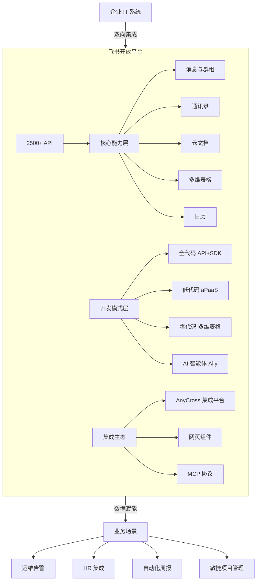
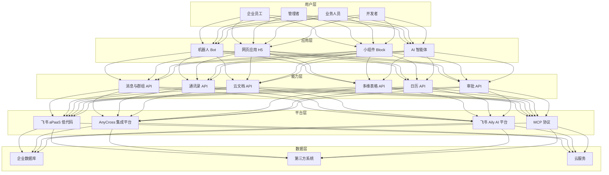
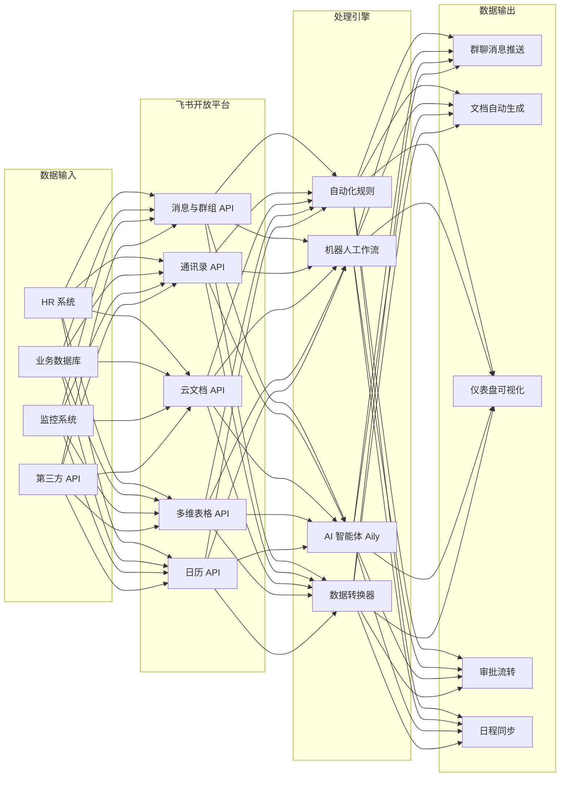
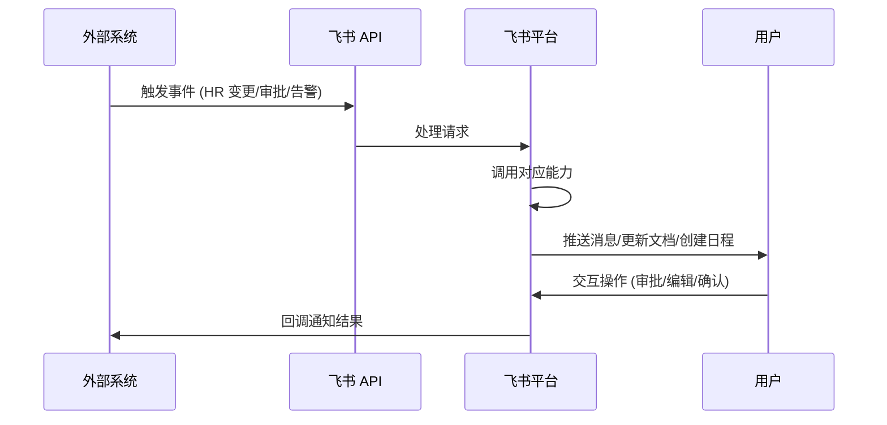
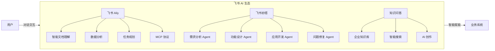
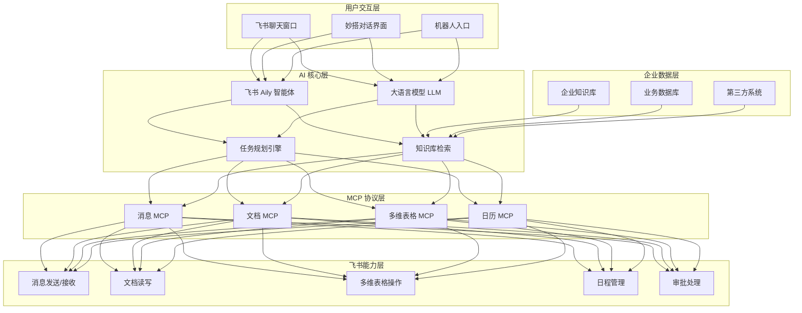

# 飞书开放平台数据价值赋能报告

> 调研日期：2026年4月 | 数据来源：飞书开放平台官方文档、飞书官网、客户案例

---

## 一、平台概览

飞书开放平台是字节跳动旗下飞书产品面向企业和开发者提供的**一站式应用开发与系统集成平台**。其核心理念是"飞书能力全面深度开放，作为信息的枢纽、业务的入口融入企业现有 IT 生态"，帮助企业打造**一站式协同专属平台**。

### 核心定位

- **信息枢纽**：打通企业内外部信息流转壁垒
- **业务入口**：将飞书作为企业统一工作入口
- **IT 生态补充**：良好支撑和补充已有 IT 系统
- **AI 原生**：深度整合 AI 能力，打造智能工作流

### 关键数据

| 指标 | 数据 |
|------|------|
| 服务端 API 数量 | 2500+ |
| 应用形态 | 机器人（Bot）、网页应用（H5）、小组件（Block） |
| 开发模式 | 全代码、低代码（aPaaS）、零代码（多维表格）、AI 智能体（Aily） |
| SDK 支持 | Java、Python、Go、Node.js |
| 客户覆盖 | 互联网、高科技、消费零售、制造、金融、医疗等 |

### 平台架构

---

## 二、核心开放能力与数据价值

### 2.1 消息与群组 API

**能力概述**：提供即时通讯场景的全套 API，支持文本、富文本、图片、文件、可交互卡片、视频、音频等多种消息类型，以及群组创建、管理等能力。

**数据赋能场景**：

| 场景 | 实现方式 | 数据价值 |
|------|----------|----------|
| 运维告警自动拉群 | 机器人自动创建项目群，拉入相关人员，推送报警通知 | 告警响应时间缩短，处理过程可追溯，自动复盘沉淀 |
| 工单自动流转 | 自动创建沟通群、设置群信息、归档历史消息、处理完自动解散 | 工单处理闭环自动化，减少人工干预 |
| 业务数据随手可得 | 机器人定时推送业务报表到群组 | 移动办公看数，实时捕捉异常数据 |
| 智能审批管办一体 | 审批消息推送 + 嵌入式单据 + 一键转发聊天 | 审批效率大幅提升，操作与审批一体化 |

**关键 API**：
- 创建群 / 更新群信息 / 拉用户入群
- 发送消息（文本、富文本、卡片等）
- 获取会话历史消息

### 2.2 通讯录（组织架构）API

**能力概述**：提供企业组织架构的全生命周期管理，包括部门信息、人员信息、用户组等。

**数据赋能场景**：

| 场景 | 实现方式 | 数据价值 |
|------|----------|----------|
| HR 系统集成 | 入职/转正/调岗/离职自动同步到飞书 | 人员数据实时同步，告别手动维护 |
| 入转调离管理 | 转调离在线审批 + 流程指引 + 入职推送学习指南 | 流程规范化，减少疏漏 |
| 组织架构同步 | 将企业组织架构从 HR 系统同步到飞书 | 统一身份管理，多系统数据一致 |

**关键 API**：
- 创建部门 / 修改部门信息
- 创建用户 / 修改用户属性
- 维护用户与部门/用户组关联关系

### 2.3 云文档 API

**能力概述**：涵盖飞书文档、电子表格、多维表格、知识库、云空间等产品的全套操作能力。

**数据赋能场景**：

| 场景 | 实现方式 | 数据价值 |
|------|----------|----------|
| 自动化周报/月报 | 模板定时创建 → 自动授权 → 知识库归档 → 群消息催办 | 规范格式、自动化催办、节省人力 |
| 电子表格统计销售额 | 创建电子表格 → 写入外部数据 → 添加统计公式 → 设置样式 | 外部数据自动同步，实时统计分析 |
| 知识库待办每日提醒 | 读取周报文档 → 提取待办事项 → 封装提醒消息 → 发送到团队群 | 待办事项不遗漏，每日自动跟进 |
| 文档数据迁移替换链接 | 本地文件导入飞书 → 提取过期链接 → 修正为新链接 | 数据迁移无缝衔接，链接自动更新 |

**关键 API**：
- 文档 CRUD / 权限管理
- 电子表格数据读写 / 样式设置
- 多维表格记录/字段/数据表管理
- 知识库节点管理 / 文档富文本内容获取
- 文件上传 / 导入任务管理

### 2.4 多维表格（Base）API

**能力概述**：多维表格是飞书的核心业务管理工具，"一个表格也可以是无数个应用"，通过 API 可轻松打通内部其他业务系统。

**数据赋能场景**：

| 场景 | 实现方式 | 数据价值 |
|------|----------|----------|
| 敏捷项目管理 | 多维表格管理项目数据 + 日历 API 创建公开日历供团队订阅 | 项目进度可视化，团队协同效率提升 |
| 轻量业务系统搭建 | 通过应用模式零代码搭建 CRM、OKR、生产巡检等系统 | 替代传统软件开发，快速响应业务需求 |
| 数据收集与分析 | 表单收集 → 多维表格存储 → 仪表盘可视化 | 数据驱动决策，零代码实现数据分析 |
| 自动化流程 | 自动化规则触发 → 同步项目进展 → 自动发送通知 | 流程自动化，解放人力 |

**关键 API**：
- 列出/新增/更新/删除记录
- 字段管理（列出/新增/更新/删除）
- 数据表管理
- 高级权限（自定义角色、协作者管理）

### 2.5 日历 API

**能力概述**：提供日历、日程、忙闲查询等能力，支持会议室预定、第三方用户邀请等。

**数据赋能场景**：

| 场景 | 实现方式 | 数据价值 |
|------|----------|----------|
| 智能会务管理 | 串联日程、会议、会议室 → 自动同步会务日程 → 线上预定 → 状态实时确认 | 会议组织自动化，提升会议质量 |
| 休假状态同步 | HR 系统请假审批通过 → 创建请假日程 → 个人名片/日历显示"请假"标识 | 避免无效工作安排，提升团队协作效率 |
| 忙闲查询 | 查询用户日程忙闲 → 智能推荐会议时间 | 减少逐一确认时间的人力消耗 |

**关键 API**：
- 查询用户日程忙闲
- 创建/更新/删除日程
- 增加/删除日程参与者及会议室
- 创建/删除请假日程

### 数据赋能流程

### 数据赋能流程

---

## 三、AI 驱动的数据赋能

### 3.1 飞书 Aily（AI 智能体平台）

Aily 是飞书围绕大语言模型（LLM）提供的企业级智能体搭建平台，提供以下核心能力：

| 能力 | 说明 | 数据赋能价值 |
|------|------|--------------|
| 智能文档理解 | AI 自动解析文档内容 | 从非结构化文档中提取结构化数据 |
| 数据分析 | AI 辅助数据分析与洞察 | 降低数据分析门槛，快速发现业务趋势 |
| 飞书协同工具 MCP | 通过 MCP 协议连接飞书核心能力 | AI 可直接操作飞书消息、文档、多维表格等 |
| 任务规划 | 自主拆解和执行复杂任务 | 将复杂业务流程自动化执行 |
| 智能检索 | 边想边搜，动态调整策略 | 精准获取企业内外部知识 |
| 自定义企业知识 | 关联飞书云文档、知识库及本地文件 | 构建企业专属知识库，支持智能问答 |

### 3.2 飞书妙搭（AI 原生系统搭建工具）

- **对话搭建系统**：通过对话即可搭建业务系统，所见即所得
- **多 Agent 架构**：需求分析、功能设计、数据管控、应用开发、问题修复各由专业 Agent 支持
- **AI 辅助开发**：开发前 AI 自助需求确认、开发中局部精调、开发后 AI 一键修复

### 3.3 飞书 MCP（Model Context Protocol）

- 连接飞书核心能力与主流 AI 工具
- 实现消息、多维表格、文档等多场景智能协作
- 支持 OpenClaw 等官方插件

### 3.4 知识问答

- 基于企业知识库的智能搜索与问答
- AI 直出答案，标记信息来源
- 支持基于全局知识的智能创作

### AI 智能体架构

---

## 四、开发模式与集成能力

### 4.1 四种开发模式

| 开发模式 | 平台 | 适用场景 | 技术门槛 |
|----------|------|----------|----------|
| 全代码 | 飞书开放平台 API + SDK | 复杂业务系统集成、定制化开发 | 高 |
| 低代码 | 飞书 aPaaS | 企业智能系统开发，AI 辅助开发 | 中 |
| 零代码 | 飞书多维表格（Base） | 轻量业务系统搭建、数据管理 | 低 |
| AI 智能体 | 飞书 Aily | 企业级智能应用搭建 | 低-中 |

### 4.2 集成平台

**飞书集成平台（AnyCross）**：为企业提供标准、高效的系统集成能力，实现全域数据互通。

### 4.3 网页组件

| 组件 | 功能 | 数据赋能价值 |
|------|------|--------------|
| 云文档组件 | 将云文档嵌入业务系统 | 业务系统内直接协同编辑、评论、权限管理 |
| 成员名片组件 | 展示飞书成员名片 | 快速了解团队成员，一键发起聊天 |
| 搜索组件 | 搜索和选择人员、群组、文档 | 多类型数据混排展示，快速定位 |

### 4.4 开发工具

- **API 调试台**：一站式接口调试，自动获取鉴权凭证，内置权限申请，多语言示例代码
- **服务端 SDK**：Java、Python、Go、Node.js，支持长连接事件回调、结构化请求、Token 生命周期管理
- **开放平台智能助手**：概念解释、方案设计、报错诊断

---

## 五、典型客户案例与数据价值

### 5.1 得物：智能审批管办一体

- **痛点**：审批流程与执行割裂，大量时间消耗在确认、手工操作、反馈循环中
- **方案**：利用飞书开放能力实现审批消息推送 + 嵌入式单据 + 执行反馈闭环
- **数据价值**：审批与执行一体化，减少系统切换，操作可追溯

### 5.2 理想汽车：自动化智能工单

- **痛点**：多渠道工单分散，缺乏统一管理
- **方案**：创建智能工单机器人，统一工单流转，配置工单规则
- **数据价值**：工单数据集中管理，自动化任务分配，处理效率可量化

### 5.3 华住：统一告警解决方案

- **痛点**：多业务系统监控告警分散
- **方案**：基于飞书开放能力打造统一告警解决方案，自动拉群、推送通知、协同处理
- **数据价值**：告警信息高效流转，处理记录自动沉淀，便于复盘

### 5.4 沪上阿姨：业务数据随手可得

- **痛点**：移动办公看数困难，无法实时捕捉异常
- **方案**：利用机器人让业务数据推送到群聊
- **数据价值**：移动办公实时看数，异常数据及时捕捉

### 5.5 中国移动国际：休假状态实时同步

- **痛点**：请假信息不同步到通讯软件，导致无效工作安排
- **方案**：打通 HR 系统与飞书，实时同步请假状态
- **数据价值**：避免无效工作安排，提升团队协作效率

---

## 六、数据安全与合规

- **权限管理**：应用级权限 + 租户级权限，支持权限申请与审批流程
- **高级权限**：多维表格支持行/列级精细化权限控制
- **数据安全**：企业级 AI 安全和知识管理解决方案
- **Token 管理**：SDK 提供完整的 tenant_access_token 生命周期管理

---

## 七、数据赋能总结

### 7.1 飞书开放平台的核心数据价值

1. **信息高效流转**：通过消息、文档、日历等 API 打通信息孤岛
2. **业务流程自动化**：多维表格 + 自动化规则 + 机器人实现端到端自动化
3. **数据驱动决策**：多维表格仪表盘 + AI 数据分析，零代码实现数据可视化
4. **AI 赋能业务**：Aily 智能体 + MCP 协议，让 AI 直接操作业务系统
5. **低门槛开发**：四种开发模式覆盖从开发者到业务人员的全角色
6. **生态整合**：AnyCross 集成平台实现全域数据互通

### 7.2 适用企业画像

- **中大型企业**：需要整合多个业务系统，打造统一工作入口
- **知识密集型团队**：重视文档协作、知识管理、信息流转
- **敏捷业务团队**：需要快速搭建轻量业务系统，快速响应变化
- **AI 先行者**：希望将 AI 能力深度融入日常业务流程

---

*本报告基于飞书开放平台官方文档及公开资料整理，数据截至 2026 年 4 月。*
