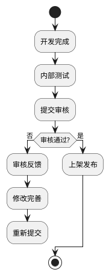
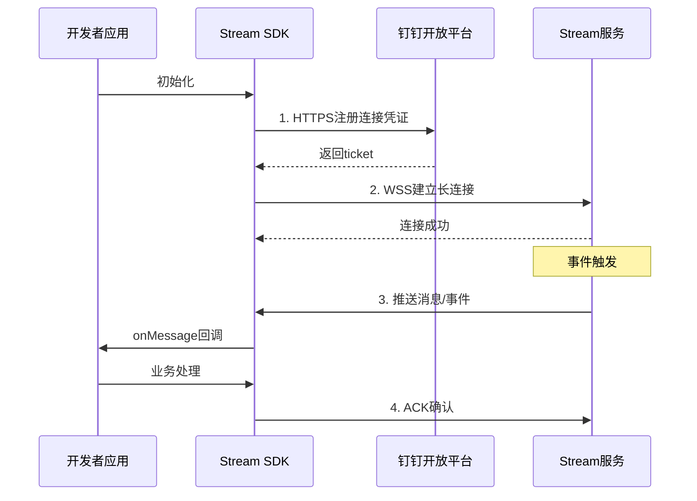
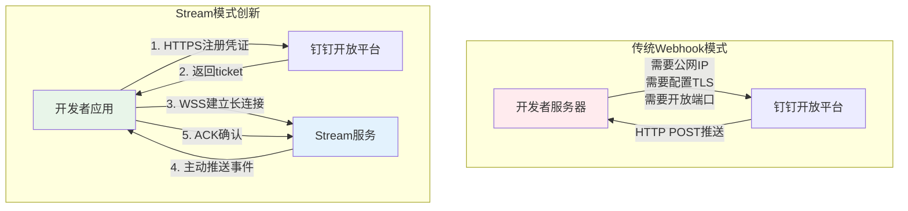

# 钉钉开放平台深度调研报告

## 📋 目录

1. [平台概述](#1-平台概述)
2. [应用类型设计](#2-应用类型设计)
3. [开放能力范围](#3-开放能力范围)
4. [开发者生态](#4-开发者生态)
5. [技术架构](#5-技术架构)
6. [核心SDK与工具链](#6-核心sdk与工具链)
7. [Stream模式详解](#7-stream模式详解)
8. [参考资料与链接](#8-参考资料与链接)

---

## 1. 平台概述

钉钉开放平台是阿里巴巴旗下的企业级应用开发平台，提供丰富的API和开发工具，支持第三方开发者和企业构建各种应用形态，包括机器人、小程序、H5微应用、工作台组件等。

### 1.1 官方资源入口

| 资源类型 | 链接 |
|---------|------|
| 开放平台官网 | https://open.dingtalk.com |
| 开发者文档 | https://ding-doc.dingtalk.com |
| 开发者百科(社区版) | https://opensource.dingtalk.com/developerpedia/ |
| GitHub开源组织 | https://github.com/open-dingtalk |
| 应用管理后台 | https://open-dev.dingtalk.com |

---

## 2. 应用类型设计

### 2.1 应用类型分类

钉钉开放平台支持三种主要的应用类型：

| 应用类型 | 说明 | 适用场景 |
|---------|------|---------|
| **企业内部应用** | 仅供企业自身使用，不对外发布 | 企业内部OA、审批、考勤等定制化需求 |
| **第三方企业应用** | 由ISV开发，上架到应用市场供企业使用 | 标准化SaaS产品，面向多企业销售 |
| **第三方个人应用** | 面向个人开发者的轻量级应用 | 个人工具、测试应用 |

### 2.2 应用形态详解

#### 2.2.1 小程序 (Microapp)

- **技术栈**: 基于钉钉自研的小程序框架
- **特点**: 轻量级、无需安装、即用即走
- **适用场景**: 轻量级业务场景、快速迭代的需求
- **开发要求**: 需要学习钉钉小程序DSL
- **能力限制**: 受限于小程序容器，无法直接访问DOM

#### 2.2.2 H5微应用

- **技术栈**: 标准Web技术(HTML/CSS/JavaScript)
- **特点**: 兼容性好、开发门槛低、可复用现有Web应用
- **适用场景**: 复杂业务场景、已有Web应用迁移
- **开发要求**: 需要集成钉钉JSAPI进行权限验证和免登
- **能力限制**: 需要处理移动端适配

#### 2.2.3 机器人 (Robot)

- **类型**: 企业内部机器人、群自定义机器人
- **功能**: 
  - 接收用户消息(单聊/群聊)
  - 发送消息到会话
  - 支持多种消息类型(文本、Markdown、卡片等)
- **接入模式**: 
  - **Webhook模式**: 需要公网IP/域名，配置回调URL
  - **Stream模式**: 2023年推出的新模式，无需公网IP
- **适用场景**: 消息通知、智能客服、群助手

#### 2.2.4 工作台组件

- **功能**: 自定义工作台展示内容
- **类型**: 工作台应用、快捷入口等
- **适用场景**: 企业个性化工作台定制

### 2.3 应用形态对比

| 维度 | 小程序 | H5微应用 | 机器人 | 工作台组件 |
|------|--------|---------|--------|-----------|
| 开发门槛 | 中 | 低 | 低 | 中 |
| 用户体验 | 优秀 | 良好 | 良好 | 良好 |
| 功能丰富度 | 中 | 高 | 低 | 中 |
| 部署方式 | 发布上线 | 服务器部署 | 服务端部署 | 配置发布 |
| 审核要求 | 需要 | 需要 | 部分需要 | 需要 |

---

## 3. 开放能力范围

### 3.1 IM能力

| 能力 | 描述 | 接口类型 |
|------|------|---------|
| **消息通知** | 发送工作通知、群消息、单聊消息 | OpenAPI |
| **群机器人** | 自定义机器人发送消息、接收@消息 | Webhook/Stream |
| **互动卡片** | 发送可交互的卡片消息、更新卡片 | OpenAPI |
| **消息类型** | 文本、Markdown、图片、富文本、OA消息等 | - |
| **AI卡片** | 支持流式更新的AI卡片 | OpenAPI |

**互动卡片关键接口**:
- 创建并投放卡片: `/v1.0/card/instances`
- 更新卡片: `/v1.0/card/instances` 
- AI卡片流式更新: 专用接口

### 3.2 通讯录能力

| 能力 | 描述 | 权限要求 |
|------|------|---------|
| **用户管理** | 查询用户信息、部门用户列表、用户详情 | 通讯录读取权限 |
| **部门管理** | 部门增删改查、部门树获取 | 通讯录管理权限 |
| **角色权限** | 角色管理、权限分配 | 管理员权限 |
| **员工信息** | 入职、离职、转部门等 | 通讯录管理权限 |

### 3.3 审批能力

| 能力 | 描述 |
|------|------|
| **审批流** | 创建、查询、更新审批模板和流程 |
| **审批实例** | 发起审批、查询审批状态、审批操作 |
| **审批任务** | 获取待办任务、已办任务 |
| **表单数据** | 获取审批表单数据、附件等 |

### 3.4 考勤能力

| 能力 | 描述 |
|------|------|
| **打卡数据** | 查询员工打卡记录、打卡详情 |
| **排班管理** | 排班查询、班次设置 |
| **考勤统计** | 考勤报表、统计查询 |
| **请假加班** | 请假、加班记录查询 |

### 3.5 会议能力

| 能力 | 描述 |
|------|------|
| **日程管理** | 创建、查询、更新日程 |
| **忙闲查询** | 查询用户忙闲状态 |
| **视频会议** | 创建会议、会议控制 |

### 3.6 文档能力

| 能力 | 描述 |
|------|------|
| **钉盘** | 文件上传、下载、分享 |
| **文档协作** | 在线文档创建、编辑、权限管理 |
| **知识库** | 知识库管理、文档搜索 |

### 3.7 其他开放能力

#### 3.7.1 宜搭 (低代码平台)

- **定位**: 钉钉官方低代码应用搭建平台
- **能力**: 表单、流程、报表快速搭建
- **集成**: 支持与自建应用的数据互通
- **适用**: 业务人员快速搭建轻量级应用

#### 3.7.2 AI能力 (2024年重点)

| 能力 | 描述 |
|------|------|
| **AI助理** | 创建AI助理、自定义能力 |
| **AI卡片** | 流式输出、智能交互卡片 |
| **MCP服务** | Model Context Protocol服务集成 |
| **听记** | AI语音转文字 |
| **AI搜索** | 智能知识库搜索 |

### 3.8 MCP (Model Context Protocol) 服务

钉钉MCP服务提供了丰富的API能力集成：

| Profile | 功能 | 权限点 |
|---------|------|--------|
| dingtalk-contacts | 通讯录 | qyapi_addresslist_search |
| dingtalk-department | 部门管理 | qyapi_get_department_list |
| dingtalk-robot-send-message | 机器人发消息 | Premium.Ding.Write |
| dingtalk-tasks | 待办 | Todo.Todo.Write/Read |
| dingtalk-calendar | 日程 | Calendar.Event.Write/Read |
| dingtalk-checkin | 签到 | qyapi_checkin_read |
| dingtalk-notice | 工作通知 | - |
| dingtalk-app-manage | 应用管理 | qyapi_microapp_manage |
| dingtalk-teambition | 项目管理 | Project.Project.Write.All |
| dingtalk-report | 日志 | qyapi_report_statistics |

---

## 4. 开发者生态

### 4.1 应用市场运营模式

| 维度 | 说明 |
|------|------|
| **上架流程** | 开发→测试→提交审核→上架→推广 |
| **审核周期** | 一般3-7个工作日 |
| **应用分类** | 办公效率、人力资源、财务管理、客户管理等 |
| **收费模式** | 免费、按人数收费、按功能收费、定制开发 |

### 4.2 开发者工具链

#### 4.2.1 官方SDK支持

| 语言 | Stream SDK | OpenAPI SDK | 状态 |
|------|-----------|------------|------|
| **Java** | dingtalk-stream | 官方支持 | 活跃维护 |
| **Python** | dingtalk-stream | 官方支持 | 活跃维护 |
| **Node.js** | dingtalk-stream | 官方支持 | 活跃维护 |
| **Go** | dingtalk-stream-sdk-go | 社区支持 | 活跃维护 |
| **.NET** | Jusoft.DingtalkStream | 社区贡献 | 可用 |
| **PHP** | - | 需自行实现 | 需自助接入 |

#### 4.2.2 开发者工具

| 工具 | 用途 | 链接 |
|------|------|------|
| **DingTalk DevTools** | 小程序/H5调试 | 钉钉开发者工具 |
| **内网穿透(pierced)** | 本地开发调试(已下线) | 推荐使用Stream模式 |
| **Stream SDK** | 事件订阅、机器人、卡片回调 | GitHub开源 |
| **卡片平台** | 互动卡片设计 | https://card.dingtalk.com |

### 4.3 文档体系与学习资源

| 资源类型 | 链接 | 说明 |
|---------|------|------|
| **官方文档** | https://open.dingtalk.com/document | 权威完整，更新及时 |
| **开发者百科** | https://opensource.dingtalk.com/developerpedia/ | 社区版，更新更快 |
| **GitHub教程** | https://github.com/open-dingtalk | 多语言示例代码 |
| **视频教程** | 文档内嵌视频 | 卡片使用、Stream模式等 |

### 4.4 应用上架审核流程



**审核要点**:
- 功能完整性
- 功能完整性
- 用户体验
- 安全合规
- 隐私保护
- 商业资质(ISV应用)

### 4.5 ISV合作与商业分成

| 合作模式 | 说明 |
|---------|------|
| **免费应用** | 免费提供给企业使用，可获得流量曝光 |
| **付费应用** | 应用内收费，平台分成比例需参考最新政策 |
| **定制开发** | 为企业客户提供定制化服务 |
| **联合运营** | 与钉钉深度合作的联合解决方案 |

---

## 5. 技术架构

### 5.1 API设计风格

#### 5.1.1 RESTful API

- 基于HTTP协议
- JSON数据格式
- 统一返回结构

```json
{
  "errcode": 0,
  "errmsg": "ok",
  "result": {}
}
```

#### 5.1.2 版本管理

| 版本 | 状态 | 说明 |
|------|------|------|
| **旧版API** | 维护中 | 逐步迁移中 |
| **新版API** | 推荐使用 | 统一网关、更规范 |

**新旧版本差异**:
- 新版API有统一的网关入口
- 认证方式略有不同
- 部分字段命名规范统一

### 5.2 认证授权机制

#### 5.2.1 应用凭证

| 凭证类型 | 说明 | 获取方式 |
|---------|------|---------|
| **Client ID** | 应用唯一标识(原AppKey/SuiteKey) | 开发者后台 |
| **Client Secret** | 应用密钥(原AppSecret/SuiteSecret) | 开发者后台 |
| **Corp ID** | 企业唯一标识 | 企业管理后台 |

#### 5.2.2 获取AccessToken

```
POST https://api.dingtalk.com/v1.0/oauth2/accessToken
Content-Type: application/json

{
  "appKey": "your-app-key",
  "appSecret": "your-app-secret"
}
```

#### 5.2.3 JSAPI权限验证

H5微应用需要在页面加载时进行JSAPI权限验证：

```javascript
// 1. 从服务端获取签名配置
dd.config({
  agentId: '',
  corpId: '',
  timeStamp: '',
  nonceStr: '',
  signature: '',
  jsApiList: ['runtime.info', 'biz.contact.choose']
});

// 2. 验证成功回调
dd.ready(() => {
  // 调用JSAPI
});
```

### 5.3 事件订阅和回调机制

#### 5.3.1 两种接入模式对比

| 特性 | Webhook模式 | Stream模式(推荐) |
|------|------------|-----------------|
| **公网IP** | 需要 | 不需要 |
| **域名/证书** | 需要 | 不需要 |
| **防火墙配置** | 需要开放端口 | 不需要 |
| **加解密处理** | 需要 | 不需要 |
| **内网穿透** | 本地开发需要 | 不需要 |
| **安全性** | 需自行配置TLS | 内置TLS加密 |
| **维护成本** | 较高 | 极低 |

#### 5.3.2 Stream模式工作原理



**Stream模式流程说明**：
1. **注册凭证**：应用通过HTTPS向钉钉开放平台注册，获取连接ticket
2. **建立连接**：使用ticket与Stream服务建立WebSocket长连接
3. **接收事件**：Stream服务主动推送事件到应用
4. **确认机制**：应用处理完成后返回ACK确认

### 5.4 权限模型和数据权限

#### 5.4.1 权限申请

在开发者后台为应用申请所需API权限：

1. 登录 https://open-dev.dingtalk.com
2. 进入应用详情 → 权限管理
3. 勾选需要的权限点
4. 部分敏感权限需要企业管理员审批

#### 5.4.2 常见权限点

| 权限点 | 说明 |
|-------|------|
| qyapi_addresslist_search | 通讯录搜索 |
| qyapi_get_member | 获取成员详情 |
| qyapi_get_department_list | 获取部门列表 |
| Contact.User.Read | 读取用户基本信息 |
| Calendar.Event.Read | 读取日程 |
| Todo.Todo.Write | 创建待办 |

### 5.5 开发调试工具

#### 5.5.1 在线调试

- 开发者后台提供API在线调试工具
- 可快速测试接口、查看返回结果

#### 5.5.2 日志查询

- 开发者后台可查询应用调用日志
- 查看请求参数、响应结果、错误信息

#### 5.5.3 Stream模式调试

由于Stream模式不需要公网IP，本地开发极为方便：

```bash
# Python示例
pip install dingtalk-stream
python bot.py --client_id xxx --client_secret xxx
```

---

## 6. 核心SDK与工具链

### 6.1 SDK架构类图

```plantuml
@startuml
skinparam classAttributeIconSize 0
skinparam monochrome true

package "Stream SDK" {
    class DingTalkStreamClient {
        -credential: Credential
        -handlers: Map<String, CallbackHandler>
        +registerCallbackHandler(topic: String, handler: CallbackHandler)
        +start_forever()
        +stop()
    }
    
    class Credential {
        +client_id: String
        +client_secret: String
        +getAccessToken(): String
    }
    
    class CallbackHandler {
        +{abstract} process(callback: CallbackMessage): AckMessage
    }
    
    class ChatbotHandler {
        +process(callback: CallbackMessage): AckMessage
        +reply_text(text: String, message: ChatbotMessage)
        +reply_card(card: CardObject, message: ChatbotMessage)
    }
    
    class CallbackMessage {
        +data: JSON
        +topic: String
        +headers: Map<String, String>
    }
    
    class ChatbotMessage {
        +sender: User
        +conversation: Conversation
        +text: TextContent
        +from_dict(data: JSON): ChatbotMessage
    }
    
    DingTalkStreamClient --> Credential : uses
    DingTalkStreamClient --> CallbackHandler : manages
    CallbackHandler --> CallbackMessage : processes
    ChatbotHandler --|> CallbackHandler : extends
    ChatbotHandler --> ChatbotMessage : uses
}

package "OpenAPI SDK" {
    class DingTalkClient {
        +access_token: String
        +getUserInfo(user_id: String): User
        +sendMessage(message: Message): Response
        +getDepartmentList(): List<Department>
    }
    
    class Message {
        +msgtype: Enum {TEXT, MARKDOWN, OA, CARD}
        +content: Content
        +tos: List<User>
    }
}

DingTalkStreamClient ..> DingTalkClient : can use
together

@enduml
```

**SDK架构说明**：
- **Stream SDK**：处理实时事件订阅（机器人消息、卡片回调）
- **OpenAPI SDK**：处理业务API调用（通讯录、消息发送）
- **双SDK协同**：Stream接收事件，OpenAPI执行业务操作

### 6.2 Stream SDK详解

#### 6.1.1 Python SDK

**安装**:
```bash
pip install dingtalk-stream
```

**机器人示例**:
```python
import dingtalk_stream
from dingtalk_stream import AckMessage

class CalcBotHandler(dingtalk_stream.ChatbotHandler):
    async def process(self, callback: dingtalk_stream.CallbackMessage):
        incoming_message = dingtalk_stream.ChatbotMessage.from_dict(callback.data)
        text = incoming_message.text.content.strip()
        
        # 处理消息
        result = eval(text)  # 简单示例
        self.reply_text(f"结果: {result}", incoming_message)
        
        return AckMessage.STATUS_OK, 'OK'

# 启动
credential = dingtalk_stream.Credential(client_id, client_secret)
client = dingtalk_stream.DingTalkStreamClient(credential)
client.register_callback_handler(
    dingtalk_stream.chatbot.ChatbotMessage.TOPIC, 
    CalcBotHandler()
)
client.start_forever()
```

#### 6.1.2 Java SDK

**Maven依赖**:
```xml
<dependency>
    <groupId>com.dingtalk.open</groupId>
    <artifactId>dingtalk-stream</artifactId>
    <version>1.3.11</version>
</dependency>
```

#### 6.1.3 Go SDK

**安装**:
```bash
go get github.com/open-dingtalk/dingtalk-stream-sdk-go
```

#### 6.1.4 Node.js SDK

**安装**:
```bash
npm install dingtalk-stream
```

### 6.2 互动卡片SDK

**卡片平台**: https://card.dingtalk.com/card-builder

**主要功能**:
- 可视化卡片设计器
- 模板导入/导出
- 卡片投放和更新API
- 支持AI流式卡片

### 6.3 回调加解密

对于使用Webhook模式的开发者，需要处理回调消息的加解密：

**官方加解密库**:
- Java: 官方提供
- C#: DingTalk-Callback-Crypto
- Python: 示例代码中提供

---

## 7. Stream模式详解

### 7.1 Stream模式概述

Stream模式是钉钉在2023年推出的全新事件订阅机制，相比传统的Webhook模式，具有显著的优势。

### 7.2 Stream模式五大"零"特性

| 特性 | 说明 |
|------|------|
| **零公网IP** | 不需要公网IP或域名 |
| **零加解密/签名/TLS证书** | 内置TLS加密，自动鉴权 |
| **零防火墙白名单** | 无需开放服务端口 |
| **零网关部署** | 反向连接，无需网关 |
| **零内网穿透** | 本地开发无需穿透工具 |

### 7.3 Stream模式架构图



**Stream模式核心优势**：
- **反向连接**：应用主动连接平台，无需公网IP
- **内置安全**：WSS加密传输，自动鉴权
- **零运维**：无需配置防火墙、网关、TLS证书

### 7.4 Stream协议详解

#### 7.3.1 接入流程

```
步骤一: 注册连接凭证 (HTTP POST)
    ↓
步骤二: 建立WebSocket连接
    ↓
步骤三: 接收推送消息
    ↓
步骤四: 回复ACK确认
```

#### 7.3.2 注册连接凭证

```http
POST /v1.0/gateway/connections/open HTTP/1.1
Host: api.dingtalk.com
Content-Type: application/json

{
    "clientId": "${ClientID}",
    "clientSecret": "${ClientSecret}",
    "subscriptions": [
        {"topic": "*", "type": "EVENT"},
        {"topic": "/v1.0/im/bot/messages/get", "type": "CALLBACK"}
    ]
}
```

**响应**:
```json
{
  "endpoint": "wss://wss-open-connection.dingtalk.com:443/connect",
  "ticket": "7724109a-ea43-4aa2-b803-87d82c5aaee6"
}
```

#### 7.3.3 消息类型

| 类型 | Topic | 说明 |
|------|-------|------|
| 机器人消息 | /v1.0/im/bot/messages/get | 接收发送给机器人的消息 |
| 卡片回调 | /v1.0/card/instances/callback | 用户与卡片交互的回调 |
| 事件推送 | * | 通讯录、审批等事件 |
| 系统消息 | ping/disconnect | 连接健康检查 |

### 7.4 支持的域名

- **HTTPS域名**: api.dingtalk.com:443
- **WebSocket域名**: wss-open-connection.dingtalk.com:443

### 7.5 负载均衡支持

Stream模式支持多连接负载均衡：

```python
# 启动多个Stream客户端实例
for i in range(3):
    client = DingTalkStreamClient(credential)
    client.register_callback_handler(topic, handler)
    # 每个实例独立连接
```

钉钉服务端会通过随机策略选择通道推送消息。

---

## 8. 参考资料与链接

### 8.1 官方文档

| 文档 | 链接 |
|------|------|
| 开放平台文档 | https://open.dingtalk.com/document |
| Stream模式介绍 | https://open.dingtalk.com/document/resourcedownload/introduction-to-stream-mode |
| Stream协议文档 | https://open.dingtalk.com/document/direction/stream-mode-protocol-access-description |
| 互动卡片文档 | https://open.dingtalk.com/document/orgapp/create-and-deliver-cards |

### 8.2 开源项目

| 项目 | 链接 | 说明 |
|------|------|------|
| 开发者百科 | https://github.com/open-dingtalk/developerpedia | 社区文档 |
| Python Stream SDK | https://github.com/open-dingtalk/dingtalk-stream-sdk-python | Stream SDK |
| Java Stream SDK | https://github.com/open-dingtalk/dingtalk-stream-sdk-java | Stream SDK |
| Go Stream SDK | https://github.com/open-dingtalk/dingtalk-stream-sdk-go | Stream SDK |
| Node.js Stream SDK | https://github.com/open-dingtalk/dingtalk-stream-sdk-nodejs | Stream SDK |
| 卡片示例 | https://github.com/open-dingtalk/dingtalk-card-examples | 互动卡片示例 |
| MCP服务 | https://github.com/open-dingtalk/dingtalk-mcp | MCP服务 |

### 8.3 开发者社区

- **GitHub组织**: https://github.com/open-dingtalk
- **Awesome DingTalk**: https://github.com/weir-cloud/awesome-dingtalk
- **Stream共创群**: 见开发者百科支持页面

---

## 9. 总结与建议

### 9.1 平台优势

1. **生态完善**: 覆盖IM、通讯录、审批、考勤等企业核心场景
2. **Stream模式创新**: 大幅降低开发门槛和运维成本
3. **AI能力丰富**: 2024年重点发力AI，MCP协议开放
4. **多语言SDK**: 官方支持Java/Python/Node.js/Go
5. **社区活跃**: 开源项目丰富，文档更新及时

### 9.2 开发建议

1. **优先使用Stream模式**: 无需公网IP，开发调试更方便
2. **关注新版API**: 使用新版服务端API，更规范统一
3. **合理申请权限**: 按需申请API权限，避免过度申请
4. **重视卡片交互**: 互动卡片提供比纯文本更好的用户体验
5. **本地开发**: 使用Stream模式可在本地直接开发调试

### 9.3 注意事项

1. **ticket有效期**: 注册连接凭证的ticket仅90秒有效，且只能用一次
2. **ACK响应**: 事件订阅需要正确回复ACK，避免重复推送
3. **并发限制**: 注意API调用频率限制
4. **安全合规**: 正式应用必须使用真实的公网IP或域名

---

*报告生成时间: 2026年4月*
*数据来源: 钉钉开放平台官方文档、GitHub开源项目、开发者百科*
