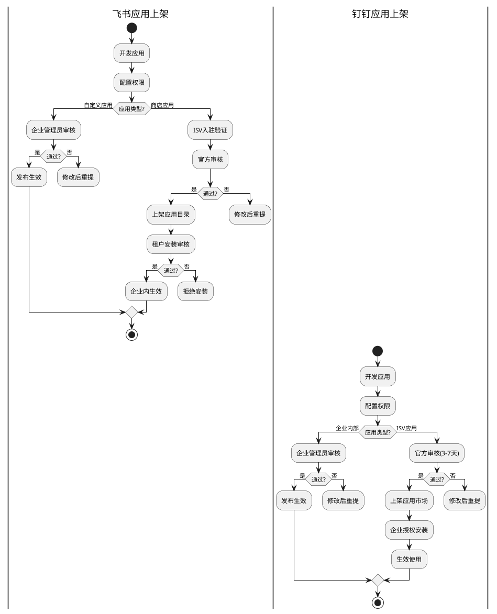
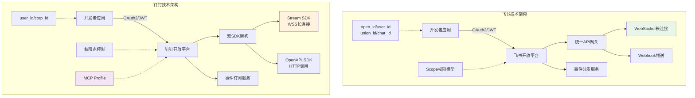
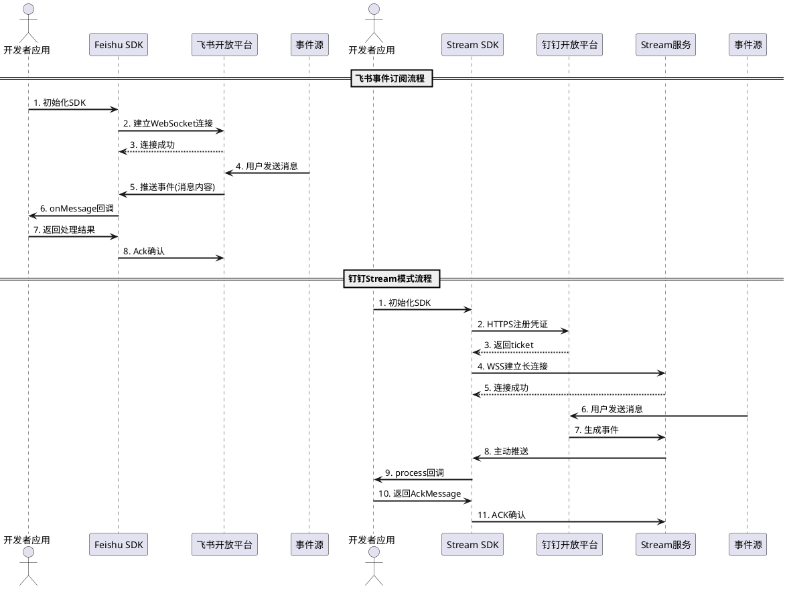
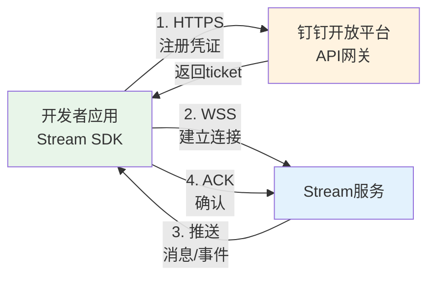
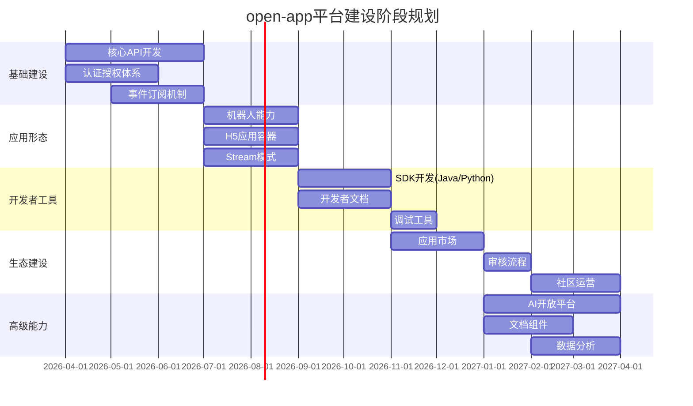

# 飞书 vs 钉钉开放平台对比分析报告

## 目录

1. [执行摘要](#1-执行摘要)
2. [应用类型设计对比](#2-应用类型设计对比)
3. [开放能力范围对比](#3-开放能力范围对比)
4. [开发者生态对比](#4-开发者生态对比)
5. [技术架构对比](#5-技术架构对比)
6. [商业化模式对比](#6-商业化模式对比)
7. [对 open-app 的启示与建议](#7-对-open-app-的启示与建议)
8. [附录：详细对比表](#8-附录详细对比表)

---

## 1. 执行摘要

### 1.1 调研背景与目标

本报告旨在通过深度对比分析飞书和钉钉两大企业级通讯平台的开放能力，为 open-app（企业内部通讯开放平台）的建设提供参考和借鉴。调研聚焦于应用类型设计、开放能力范围、开发者生态、技术架构和商业化模式五个核心维度。

### 1.2 核心发现

| 对比维度 | 飞书开放平台 | 钉钉开放平台 | 关键差异 |
|---------|-------------|-------------|---------|
| **应用形态** | 机器人、H5应用、文档组件、多维表格组件 | 小程序、H5微应用、机器人、工作台组件 | 飞书强调文档协作能力，钉钉强调小程序生态 |
| **开放能力** | 2500+ API，覆盖IM、文档、日历、会议、云盘 | 覆盖IM、审批、考勤、会议、文档、AI能力 | 飞书文档能力更强，钉钉AI和办公流程能力突出 |
| **开发者体验** | 完善的工具链，开发者工具IDE、CardKit卡片构建器 | Stream模式创新，零公网IP部署，多语言SDK | 钉钉Stream模式降低接入门槛，飞书工具链更完善 |
| **技术架构** | OAuth2 + JWT，Webhook/WebSocket双模式 | 双SDK架构(Stream + OpenAPI)，Webhook/Stream | 钉钉Stream模式是重大创新，飞书权限模型更细粒度 |
| **商业模式** | 应用目录分成，ISV入驻审核 | 应用市场分成，ISV生态合作，AI能力开放 | 两者类似，钉钉AI商业化更激进 |

### 1.3 关键洞察

**1. 应用形态差异反映产品基因**
- 飞书：以文档协作见长，开放能力深度集成飞书文档、多维表格
- 钉钉：以审批考勤起家，流程自动化和办公场景能力更强

**2. 技术架构的"颠覆式创新"**
- 钉钉Stream模式（2023年推出）是行业重大创新，解决了传统Webhook模式的五大痛点
- 飞书在权限模型和API设计规范上更加精细化

**3. AI能力的战略定位不同**
- 钉钉：AI作为核心战略，推出AI助理、MCP服务、AI卡片等完整生态
- 飞书：AI能力相对保守，主要通过Coze机器人集成

**4. 开发者生态运营策略**
- 飞书：强调工具链完整性和开发者体验
- 钉钉：强调降低接入门槛和社区生态建设（开发者百科开源）

---

## 2. 应用类型设计对比

### 2.1 应用分类体系对比

#### 飞书：双轨制（企业内部 + 对外发布）

| 应用类型 | 目标用户 | 分发范围 | 审核要求 | 特色能力 |
|---------|---------|---------|---------|---------|
| **自定义应用** | 企业内部人员 | 仅限创建企业内使用 | 企业管理员审批 | 支持全部能力，包括工作台组件 |
| **商店应用** | 多企业用户 | 飞书应用中心，所有租户可安装 | 官方审核 + 租户审核 | 不支持工作台组件能力 |

#### 钉钉：三轨制（企业内部 + ISV企业 + ISV个人）

| 应用类型 | 目标用户 | 分发范围 | 审核要求 | 特色能力 |
|---------|---------|---------|---------|---------|
| **企业内部应用** | 企业自身 | 仅供创建企业使用 | 企业管理员审批 | 完整能力，可定制化 |
| **第三方企业应用** | 多企业用户 | 应用市场，企业级客户 | 官方审核 + 企业授权 | 标准化SaaS产品 |
| **第三方个人应用** | 个人用户 | 个人使用场景 | 简化审核 | 轻量级工具 |

**关键差异分析**：

1. **分类逻辑不同**：飞书按"部署范围"分类（内部 vs 外部），钉钉按"开发者身份 + 用户类型"分类（企业自研 vs ISV企业 vs ISV个人）

2. **审核层级差异**：飞书商店应用需要"官方审核 + 租户安装审核"双重审核；钉钉ISV应用同样需要双重审核，但企业内部应用仅需企业管理员审批

3. **能力限制策略**：飞书对商店应用限制工作台组件能力（防止恶意抢占工作台入口）；钉钉对各类应用的能力限制相对统一

### 2.2 应用形态详细对比

#### 2.2.1 机器人能力对比

| 能力维度 | 飞书机器人 | 钉钉机器人 | 差异点评 |
|---------|-----------|-----------|---------|
| **机器人类型** | 应用机器人、自定义机器人 | 企业内部机器人、群自定义机器人 | 飞书自定义机器人能力更强 |
| **消息类型** | 文本、富文本、图片、文件、卡片、视频、音频、表情 | 文本、Markdown、图片、富文本、OA消息、卡片 | 飞书消息类型更丰富，钉钉OA消息场景化 |
| **单聊能力** | 应用机器人支持 | 企业内部机器人支持 | 两者相当 |
| **群管理能力** | 创建群组、添加成员、管理公告、标签、菜单 | 相对简单，主要消息推送 | 飞书群管理能力显著更强 |
| **交互能力** | 完整交互，支持卡片回调 | 支持互动卡片回调 | 两者相当 |
| **接入模式** | Webhook + WebSocket | Webhook + Stream模式 | 钉钉Stream模式是重大创新 |
| **跨群使用** | 应用机器人支持跨群 | 需在每个群单独配置 | 飞书更灵活 |

**核心差异洞察**：

飞书机器人在**群管理和消息丰富度**上更胜一筹，特别是支持群菜单、标签、公告等管理能力，可以将机器人作为"群应用"使用。钉钉机器人的**Stream模式**是革命性创新，解决了传统Webhook需要公网IP的痛点，极大降低了开发和部署成本。

#### 2.2.2 H5应用对比

| 能力维度 | 飞书H5应用 | 钉钉H5微应用 | 差异点评 |
|---------|-----------|-------------|---------|
| **技术栈** | 标准H5技术 | 标准H5技术 | 两者相同 |
| **JSAPI能力** | 通讯录、文档、日历、会议等 | 通讯录、审批、考勤、钉盘等 | 飞书侧重协作，钉钉侧重办公 |
| **免登录机制** | SSO单点登录 | JSAPI权限验证后免登 | 两者相当 |
| **容器定制** | 支持导航栏颜色、方向、菜单等 | 相对简单 | 飞书容器定制能力更强 |
| **调试工具** | 远程调试工具（类似Chrome DevTools） | 开发者工具IDE | 飞书调试体验更接近Web开发 |
| **性能优化** | 客户端提供性能优化 | 容器优化 | 两者相当 |

#### 2.2.3 小程序/轻应用对比

| 能力维度 | 飞书小程序 | 钉钉小程序 | 差异点评 |
|---------|-----------|-----------|---------|
| **技术架构** | 自研小程序框架 | 自研小程序框架 | 两者类似，DSL不同 |
| **开发体验** | 开发者工具IDE | 开发者工具IDE | 两者相当 |
| **包大小限制** | 不超过10MB | 一般2MB（可扩展） | 飞书限制更宽松 |
| **能力范围** | 相对保守 | 能力更丰富 | 钉钉小程序生态更成熟 |

**重要发现**：飞书在官方文档中对小程序的着墨较少，重点推广H5应用和机器人；钉钉则持续投入小程序生态，将其作为应用形态的核心。

#### 2.2.4 特色应用形态（飞书独有）

**飞书文档组件（Docs Add-on）**

飞书独创的应用形态，允许开发者在飞书文档中嵌入自定义功能模块：

| 组件类型 | 说明 | 应用场景 |
|---------|------|---------|
| **正文组件** | 文档正文中的内容块 | 流程图、思维导图、业务数据展示 |
| **浮动组件** | 悬浮在文档上的模块 | 批注、辅助工具 |

**视图类型**：
- 全屏视图：填充整个可见区域
- 浮动卡片视图：浮动在正文上方
- 弹出视图：弹窗展示
- 模态视图：带遮罩的模态框

**开放能力**：
- 可获取文档信息：标题、内容、统计数据、权限、历史记录
- 可调用文档功能：工具栏、选择组件、名片预览、复制粘贴
- 可编辑文档内容：标题、正文、格式设置
- 可感知文档变化：用户操作、权限变更、协同编辑

**飞书多维表格组件（Base Extensions）**

三种插件类型：
- 记录视图插件：展开记录后添加插件（如版式打印）
- 表格视图插件：表格头部添加（如地图视图）
- 自动化插件：自动化流程中触发（如OCR文字提取）

**钉钉对标能力**：钉钉暂无直接对标能力，但通过"宜搭"低代码平台可实现类似功能。

### 2.3 应用形态选择策略对比

#### 飞书官方推荐策略

| 场景 | 推荐形态 | 理由 |
|-----|---------|------|
| 聊天交互、消息通知 | 机器人 | 基于对话的自然交互方式 |
| 快速迁移现有H5应用 | H5应用 | 低成本迁移，免登录体验 |
| 文档协作增强 | 文档组件 | 深度集成飞书文档 |
| 数据管理增强 | 多维表格组件 | 扩展Base能力 |
| 需要原生体验 | 小程序 | 性能最优 |

#### 钉钉官方推荐策略

| 场景 | 推荐形态 | 理由 |
|-----|---------|------|
| 轻量级快速上线 | 小程序 | 即用即走，开发成本低 |
| 复杂业务场景 | H5微应用 | 功能丰富，可复用现有Web应用 |
| 消息通知、群助手 | 机器人 | 单聊/群聊场景 |
| 企业个性化门户 | 工作台组件 | 定制工作台展示 |

**关键洞察**：

1. **产品基因决定推荐策略**：飞书优先推荐H5和机器人（强调协作和快速集成），钉钉优先推荐小程序（强调轻量和即用即走）

2. **文档协作是飞书差异化优势**：飞书独有的文档组件和多维表格组件，将开放能力深度集成到核心产品场景中

3. **小程序是钉钉生态核心**：钉钉将小程序作为应用形态的核心，投入更多资源和能力建设

---

## 3. 开放能力范围对比

### 3.1 IM能力对比

#### 消息发送能力

| 能力 | 飞书支持 | 钉钉支持 | 差异 |
|-----|---------|---------|------|
| **文本消息** | ✅ | ✅ | 相当 |
| **富文本消息** | ✅ 支持HTML标签 | ✅ 支持Markdown | 飞书更强大，支持完整HTML |
| **图片消息** | ✅ | ✅ | 相当 |
| **文件消息** | ✅ | ✅ | 相当 |
| **视频消息** | ✅ | ✅ | 相当 |
| **音频消息** | ✅ | ✅ | 相当 |
| **卡片消息** | ✅ 交互卡片 | ✅ 互动卡片 | 两者能力相当 |
| **表情回复** | ✅ | ❌ | 飞书独有 |
| **消息加急** | ✅ 应用内/短信/电话 | ❌ | 飞书独有 |
| **消息置顶** | ✅ | ❌ | 飞书独有 |
| **消息编辑** | ✅ | ❌ | 飞书独有 |
| **合并转发** | ✅ | ❌ | 飞书独有 |

#### 消息管理能力

| 能力 | 飞书支持 | 钉钉支持 | 差异 |
|-----|---------|---------|------|
| **消息撤回** | ✅ | ✅ | 相当 |
| **已读状态** | ✅ | ✅ | 相当 |
| **历史消息** | ✅ | ✅ | 相当 |
| **URL预览** | ✅ 可自定义预览卡片 | ✅ 基础预览 | 飞书更灵活 |

**核心洞察**：飞书在IM开放能力上更为激进，提供了表情回复、消息加急、消息置顶、消息编辑等创新功能；钉钉的IM能力相对保守，但稳定性更高。

### 3.2 通讯录能力对比

| 能力 | 飞书 | 钉钉 | 差异 |
|-----|------|------|------|
| **用户管理** | 完整的CRUD操作 | 完整的CRUD操作 | 相当 |
| **部门管理** | 完整的CRUD操作 | 完整的CRUD操作 | 相当 |
| **组织架构** | 支持 | 支持 | 相当 |
| **用户组** | ✅ 支持用户组概念 | ❌ 通过角色实现 | 飞书更灵活 |
| **自定义属性** | ✅ 支持企业自定义 | ✅ 支持 | 相当 |
| **角色权限** | 基于Scope的细粒度控制 | 基于权限点的控制 | 飞书更精细 |
| **身份标识** | open_id/user_id/union_id/chat_id | user_id/corp_id | 飞书标识体系更完善 |

### 3.3 审批能力对比

| 能力 | 飞书 | 钉钉 | 差异 |
|-----|------|------|------|
| **审批定义** | 获取审批定义、表单字段 | 完整的审批流CRUD | 钉钉更完整 |
| **审批实例** | 创建、查询、操作 | 完整的实例管理 | 相当 |
| **审批任务** | 通过、拒绝、转交、催办 | 完整的任务管理 | 相当 |
| **审批附件** | 上传、下载 | 支持 | 相当 |
| **流程设计** | 相对简单 | 可视化流程设计器 | 钉钉更强 |

**核心洞察**：钉钉在审批能力上投入更多，毕竟是其起家功能；飞书的审批能力相对基础，但API设计更规范。

### 3.4 日历与会议能力对比

| 能力 | 飞书 | 钉钉 | 差异 |
|-----|------|------|------|
| **日历管理** | 完整的日历CRUD | 日程管理 | 飞书更完整 |
| **日程管理** | 完整的日程CRUD | 完整的日程CRUD | 相当 |
| **忙闲查询** | ✅ | ✅ | 相当 |
| **会议管理** | 完整的视频会议CRUD | 会议创建、控制 | 飞书更完整 |
| **会议室管理** | ✅ 会议室列表、忙闲查询 | ✅ | 相当 |
| **录制管理** | ✅ 录制文件管理 | ✅ | 相当 |
| **日历类型** | 5种类型（primary/shared/google/resource/exchange） | 相对简单 | 飞书更丰富 |
| **日历权限** | 4级权限（free_busy_reader/reader/writer/owner） | 相对简单 | 飞书更细粒度 |

**核心洞察**：飞书在日历和会议能力上明显领先，特别是支持多种日历类型（Google/Exchange集成）和细粒度权限控制，反映了其产品定位更偏向协作办公。

### 3.5 文档能力对比

这是两者差异最大的领域。

#### 飞书文档能力

**云文档(Docs)**：
- 文件管理：复制、删除、权限、转让所有权
- 文档操作：创建、获取内容、元数据、块操作
- 电子表格：工作表管理、单元格读写、样式设置
- 订阅功能：文件变更事件订阅

**多维表格(Base)**：
- 应用管理：创建、删除、复制
- 数据表管理：CRUD、属性更新
- 视图管理：列表、创建、更新、删除
- 记录管理：查询、CRUD、批量操作
- 字段管理：CRUD
- 权限管理：权限设置、协作者管理
- 仪表盘：完整的仪表盘CRUD

#### 钉钉文档能力

**钉盘**：
- 文件上传、下载、分享
- 基础权限管理

**在线文档**：
- 文档创建、编辑
- 权限管理

**知识库**：
- 知识库管理
- 文档搜索

**核心洞察**：

1. **飞书文档能力是核心优势**：飞书将文档作为核心产品，开放能力深度且完整，特别是多维表格的开放能力非常强大

2. **钉钉文档能力相对基础**：钉钉的文档能力相对简单，主要满足基础文件存储和协作需求

3. **产品定位差异**：飞书定位"协作办公平台"，文档是核心；钉钉定位"数字化办公平台"，流程和审批是核心

### 3.6 AI能力对比（2024年重点）

#### 钉钉AI能力（战略级投入）

| 能力 | 说明 | 开放程度 |
|-----|------|---------|
| **AI助理** | 创建AI助理、自定义能力 | 完整开放 |
| **AI卡片** | 流式输出、智能交互卡片 | 完整开放 |
| **MCP服务** | Model Context Protocol服务集成 | 完整开放 |
| **AI听记** | AI语音转文字 | 部分开放 |
| **AI搜索** | 智能知识库搜索 | 部分开放 |

#### 飞书AI能力（相对保守）

| 能力 | 说明 | 开放程度 |
|-----|------|---------|
| **Coze机器人** | 集成Coze AI能力 | 通过机器人集成 |
| **智能助手** | 文档内的AI助手 | 有限开放 |

**核心洞察**：

1. **AI战略差异显著**：钉钉将AI作为核心战略，推出了完整的AI开放生态（AI助理、MCP服务、AI卡片）；飞书的AI开放相对保守，主要通过Coze机器人集成

2. **MCP协议是重大创新**：钉钉推出的MCP（Model Context Protocol）服务，将钉钉能力以标准化协议开放给AI Agent，是面向AI时代的开放标准

3. **AI卡片流式更新**：钉钉支持AI卡片的流式更新，可实现类似ChatGPT的打字机效果，飞书暂无此能力

### 3.7 开放能力范围总结

| 能力领域 | 飞书优势 | 钉钉优势 | 建议 |
|---------|---------|---------|------|
| **IM能力** | 消息类型更丰富，表情回复、加急等创新功能 | 稳定性高，场景化消息（OA消息） | 学习飞书创新功能，保持钉钉稳定性 |
| **通讯录** | 用户组、细粒度权限控制 | 企业级通讯录管理成熟 | 结合两者优势 |
| **审批流程** | 基础能力 | 流程设计器、复杂流程支持 | 参考钉钉流程能力 |
| **日历会议** | 多类型日历、细粒度权限 | 基础能力 | 学习飞书日历能力 |
| **文档协作** | **核心优势**，多维表格开放能力强 | 基础能力 | **重点学习飞书** |
| **AI能力** | 基础集成 | **核心优势**，MCP服务创新 | **重点学习钉钉AI开放** |

---

## 4. 开发者生态对比

### 4.0 开发者生态全景图

```plantuml
@startuml
skinparam componentStyle rectangle
skinparam monochrome true

package "飞书开发者生态" {
    [开发者] as FDev
    [开发者工具IDE] as FIDE
    [远程调试工具] as FDebug
    [CardKit卡片构建器] as FCard
    [GitHub示例] as FGitHub
    [SDK讨论群] as FGroup
    
    FDev --> FIDE : 开发
    FDev --> FDebug : 调试
    FDev --> FCard : 设计卡片
    FDev --> FGitHub : 参考代码
    FDev --> FGroup : 技术交流
    
    [Java SDK] as FJava
    [Python SDK] as FPython
    [Go SDK] as FGo
    [Node SDK] as FNode
    
    FDev --> FJava : 后端开发
    FDev --> FPython : 后端开发
    FDev --> FGo : 后端开发
    FDev --> FNode : 后端开发
}

package "钉钉开发者生态" {
    [开发者] as DDev
    [开发者工具IDE] as DIDE
    [Stream SDK] as DStream
    [卡片平台] as DCard
    [GitHub开源组织] as DGitHub
    [开发者百科] as DWiki
    
    DDev --> DIDE : 开发
    DDev --> DStream : 事件订阅
    DDev --> DCard : 设计卡片
    DDev --> DGitHub : 贡献代码
    DDev --> DWiki : 查阅文档
    
    [Java SDK] as DJava
    [Python SDK] as DPython
    [Go SDK] as DGo
    [.NET SDK] as DNet
    
    DDev --> DJava : 后端开发
    DDev --> DPython : 后端开发
    DDev --> DGo : 后端开发
    DDev --> DNet : 后端开发
}

[飞书应用目录] as FStore
[钉钉应用市场] as DStore

FDev --> FStore : 上架应用
DDev --> DStore : 上架应用

@enduml
```

**生态差异分析**：
- **飞书**：强调工具链完整性，远程调试工具体验优秀
- **钉钉**：强调社区开放性，GitHub开源组织活跃，Stream SDK降低门槛

### 4.1 应用市场/商店运营对比

#### 飞书应用目录

| 维度 | 飞书 |
|-----|------|
| **上架流程** | 开发→测试→官方审核→上架→推广 |
| **审核周期** | 一般7-14个工作日 |
| **发布类型** | 全量上架、定向上架（最多30个租户）、私密上架 |
| **收费模式** | 免费、按人数收费、按功能收费 |
| **分成比例** | 未公开具体比例 |

#### 钉钉应用市场

| 维度 | 钉钉 |
|-----|------|
| **上架流程** | 开发→测试→提交审核→上架→推广 |
| **审核周期** | 一般3-7个工作日 |
| **发布类型** | 标准上架 |
| **收费模式** | 免费、按人数收费、按功能收费、定制开发 |
| **分成比例** | 参考最新政策，一般为收入的一定比例 |
| **ISV合作** | 联合运营、深度合作的联合解决方案 |

**核心洞察**：钉钉的审核周期更短（3-7天 vs 7-14天），ISV生态运营更加成熟，有明确的联合运营模式；飞书的发布类型更灵活（支持定向上架和私密上架）。

### 4.2 开发者工具链对比

#### SDK支持对比

| 语言 | 飞书SDK | 钉钉Stream SDK | 钉钉OpenAPI SDK | 备注 |
|-----|--------|---------------|----------------|------|
| **Java** | ✅ 官方维护 | ✅ 官方维护 | ✅ 官方维护 | 两者相当 |
| **Python** | ✅ 官方维护 | ✅ 官方维护 | ✅ 官方维护 | 两者相当 |
| **Go** | ✅ 官方维护 | ✅ 活跃维护 | ✅ 社区支持 | 两者相当 |
| **Node.js** | ✅ 官方维护 | ✅ 官方维护 | ✅ 官方维护 | 两者相当 |
| **.NET** | ❌ | ✅ 社区贡献 | - | 钉钉社区更活跃 |
| **PHP** | ❌ | ❌ | 需自行实现 | 两者相当 |

#### 开发工具对比

| 工具类型 | 飞书 | 钉钉 | 差异 |
|---------|------|------|------|
| **开发者工具IDE** | ✅ 支持小程序、H5调试 | ✅ 支持小程序、H5调试 | 相当 |
| **远程调试工具** | ✅ Web应用远程调试（类似Chrome DevTools） | ❌ | 飞书独有 |
| **卡片构建工具** | ✅ CardKit可视化构建 | ✅ 卡片平台可视化设计 | 相当 |
| **内网穿透** | 需自行配置 | Stream模式无需穿透 | 钉钉更便利 |
| **在线调试** | ✅ 开发者后台API调试 | ✅ 开发者后台API调试 | 相当 |

**核心洞察**：飞书在开发者工具链上更加完善，特别是Web应用远程调试工具（类似Chrome DevTools）体验优秀；钉钉的Stream模式是重大创新，彻底解决了本地开发需要内网穿透的痛点。

### 4.3 文档体系对比

| 文档类型 | 飞书 | 钉钉 | 差异 |
|---------|------|------|------|
| **快速入门** | 丰富，5分钟快速上手 | 丰富 | 相当 |
| **开发指南** | 详细，场景化教程 | 详细，开发者百科（社区版） | 钉钉社区文档更新更快 |
| **API参考** | 完整，2500+ API文档 | 完整 | 飞书API数量更多 |
| **最佳实践** | 客户案例、行业解决方案 | GitHub示例代码丰富 | 钉钉GitHub生态更活跃 |
| **视频教程** | 官方视频 | 文档内嵌视频 | 相当 |
| **开发者社区** | SDK讨论群 | GitHub组织、开发者百科 | 钉钉社区更开放 |

**关键发现**：钉钉推出了"开发者百科"(https://opensource.dingtalk.com/developerpedia/)，这是社区版文档，更新速度比官方文档更快，体现了钉钉更加开放的社区运营理念。

### 4.4 审核和发布流程对比

#### 飞书发布流程

**测试机制**：
- 使用user_access_token调试无需审核的API
- 配置测试企业，测试版本中权限自动生效
- 支持批量导入/导出权限配置

**发布选项**：
- 全量上架
- 定向上架（灰度发布，最多30个租户）
- 私密上架（通过链接安装）

#### 钉钉发布流程

**测试机制**：
- 创建测试企业
- 设置测试版本
- 在测试企业中权限自动生效

**审核要点**：
- 功能完整性
- 用户体验
- 安全合规
- 隐私保护
- 商业资质（ISV应用）

**核心洞察**：飞书的发布选项更灵活（支持定向上架和私密上架），适合灰度发布和私密测试；钉钉的审核流程更加标准化，审核周期更短。

### 4.4 应用上架流程对比

**流程差异分析**：
- **飞书**：商店应用需经过"官方审核 + 租户安装审核"双重审核，更严格
- **钉钉**：ISV应用官方审核后企业直接授权安装，流程更简洁

---

## 5. 技术架构对比

### 5.1 API设计风格对比

| 维度 | 飞书 | 钉钉 | 差异 |
|-----|------|------|------|
| **协议** | HTTPS RESTful | HTTPS RESTful | 相同 |
| **数据格式** | JSON | JSON | 相同 |
| **认证方式** | OAuth2 + JWT | OAuth2 + JWT | 相同 |
| **版本管理** | URL路径版本（/v1/） | URL路径版本（/v1.0/） | 类似 |
| **错误处理** | code + message + data | errcode + errmsg + result | 类似 |
| **请求方法** | GET/POST/PUT/DELETE/PATCH | GET/POST/PUT/DELETE | 飞书支持PATCH |

**URL结构对比**：

飞书：`https://open.feishu.cn/open-apis/{service}/{version}/{resource}`
钉钉：`https://api.dingtalk.com/v1.0/{resource}` 或 `https://oapi.dingtalk.com/{resource}`

### 5.2 开放平台技术架构对比图

**架构差异分析**：
- **飞书**：统一API网关，支持WebSocket/Webhook双模式，完善的身份标识体系
- **钉钉**：双SDK架构(Stream+OpenAPI)，Stream模式创新，MCP协议面向AI时代

### 5.3 事件订阅机制时序图对比

**流程差异分析**：
- **飞书**：WebSocket直连平台，事件由平台统一分发
- **钉钉**：先注册凭证再连接Stream服务，支持更灵活的路由

### 5.4 认证授权机制对比

#### Token体系对比

| Token类型 | 飞书 | 钉钉 | 差异 |
|----------|------|------|------|
| **应用级Token** | app_access_token | accessToken | 相当 |
| **租户级Token** | tenant_access_token | accessToken（含CorpID） | 飞书区分更明确 |
| **用户级Token** | user_access_token | 通过JSAPI获取 | 飞书更规范 |

#### 身份标识对比

**飞书身份标识体系**：
- `open_id`：用户/部门/群组在应用内的唯一标识
- `user_id`：用户在租户内的唯一标识
- `union_id`：用户在整个飞书生态内的唯一标识
- `chat_id`：群组在租户内的唯一标识

**钉钉身份标识体系**：
- `user_id`：用户唯一标识
- `corp_id`：企业唯一标识
- `chat_id`：群组唯一标识

**核心洞察**：飞书的身份标识体系更加完善，特别是`union_id`支持跨应用用户识别，`open_id`保护用户隐私；钉钉的标识体系相对简单。

### 5.3 事件订阅机制对比（重大差异）

这是两者最大的技术架构差异。

#### 飞书：Webhook + WebSocket双模式

| 模式 | 说明 | 适用场景 |
|-----|------|---------|
| **Webhook** | 事件发生时，飞书向开发者配置的回调URL推送事件 | 有公网IP/域名的生产环境 |
| **WebSocket** | 建立长连接，实时接收事件 | 需要实时性、频繁交互的场景 |

**Webhook模式要求**：
- 需要公网IP/域名
- 需要配置TLS证书
- 需要处理消息加解密
- 需要配置防火墙白名单
- 本地开发需要内网穿透

#### 钉钉：Webhook + Stream模式（革命性创新）

| 模式 | 说明 | 适用场景 |
|-----|------|---------|
| **Webhook** | 传统回调模式 | 有公网IP/域名的环境 |
| **Stream模式** | 建立长连接，主动拉取事件 | 所有场景，特别是本地开发 |

**Stream模式五大"零"特性**：

| 特性 | 说明 | 价值 |
|------|------|------|
| **零公网IP** | 不需要公网IP或域名 | 降低部署成本 |
| **零加解密** | 内置TLS加密，自动鉴权 | 降低开发成本 |
| **零防火墙** | 无需开放服务端口 | 降低运维成本 |
| **零网关** | 反向连接，无需网关 | 降低架构复杂度 |
| **零内网穿透** | 本地开发无需穿透工具 | 提升开发体验 |

**Stream模式工作原理**：

**流程说明**：
1. 应用通过HTTPS注册获取连接凭证
2. 使用ticket与Stream服务建立WebSocket长连接
3. Stream服务主动推送事件
4. 应用处理完成返回ACK确认

**核心洞察**：

1. **Stream模式是行业重大创新**：钉钉Stream模式彻底解决了传统Webhook模式的五大痛点，极大降低了开发和部署成本

2. **本地开发体验天壤之别**：使用钉钉Stream模式，本地开发无需内网穿透，直接运行即可接收事件；飞书仍需配置内网穿透或部署到公网

3. **安全性不打折**：Stream模式内置TLS加密和自动鉴权，安全性与Webhook相当

4. **建议open-app重点参考**：Stream模式的技术架构值得open-app重点学习和借鉴

### 5.4 权限模型对比

#### 飞书权限模型

基于Scope的细粒度权限控制：

| 权限类型 | 说明 | 示例 |
|---------|------|------|
| **应用权限** | 应用级别的权限 | 读取通讯录、发送消息 |
| **用户权限** | 用户级别的权限 | 读取用户日历、创建文档 |
| **资源权限** | 资源级别的权限 | 读取特定文档、管理特定群组 |

**权限申请流程**：
1. 开发者在后台申请所需权限
2. 企业管理员审批
3. 部分敏感权限支持自动审批

#### 钉钉权限模型

基于权限点的控制：

| 权限类型 | 说明 | 示例 |
|---------|------|------|
| **API权限** | 调用特定API的权限 | qyapi_addresslist_search |
| **数据权限** | 访问特定数据的权限 | Contact.User.Read |
| **功能权限** | 使用特定功能的权限 | Calendar.Event.Write |

**MCP权限Profile**：钉钉将权限封装为MCP Profile，简化AI Agent的权限管理：
- dingtalk-contacts：通讯录
- dingtalk-department：部门管理
- dingtalk-calendar：日程
- dingtalk-tasks：待办
- 等

**核心洞察**：飞书的权限模型更加细粒度，支持自动审批和人工审批；钉钉的权限模型更加场景化，特别是MCP Profile的封装对AI时代更加友好。

### 5.5 安全机制对比

| 安全机制 | 飞书 | 钉钉 | 差异 |
|---------|------|------|------|
| **IP白名单** | ✅ 支持 | ✅ 支持 | 相当 |
| **数据权限范围** | ✅ 可配置应用可用范围 | ✅ 支持 | 相当 |
| **消息加密** | ✅ 支持 | ✅ Stream内置 | 相当 |
| **Webhook签名** | ✅ 支持 | ✅ 支持 | 相当 |
| **TLS传输** | ✅ 强制 | ✅ 强制 | 相当 |

---

## 6. 商业化模式对比

### 6.1 应用商店分成模式

| 维度 | 飞书 | 钉钉 | 差异 |
|-----|------|------|------|
| **分成比例** | 未公开 | 参考官方政策 | 两者均未完全公开 |
| **结算周期** | 未公开 | 月结/季结 | 类似 |
| **收费方式** | 免费、按人数、按功能 | 免费、按人数、按功能、定制 | 钉钉多一个定制选项 |
| **ISV支持** | ISV入驻审核 | ISV资质审核 + 联合运营 | 钉钉ISV生态更成熟 |

### 6.2 AI能力商业化

#### 钉钉AI商业化（激进）

| AI能力 | 商业化模式 |
|-------|-----------|
| **AI助理** | 基础免费，高级功能收费 |
| **AI卡片** | 按调用量收费 |
| **MCP服务** | 按调用量收费 |
| **AI听记** | 按使用时长收费 |

#### 飞书AI商业化（保守）

| AI能力 | 商业化模式 |
|-------|-----------|
| **Coze机器人** | 基础免费，高级模型收费 |
| **智能助手** | 基础功能免费 |

**核心洞察**：钉钉将AI作为核心商业化引擎，推出了完整的AI收费体系；飞书的AI商业化相对保守，更多作为产品增值功能。

### 6.3 企业服务商业化

| 服务类型 | 飞书 | 钉钉 |
|---------|------|------|
| **咨询实施** | 官方+伙伴 | 官方+ISV |
| **定制开发** | 伙伴生态 | ISV生态 |
| **培训服务** | 官方培训 | 官方+ISV培训 |
| **技术支持** | 分级支持 | 分级支持 |

### 6.4 商业化模式总结

| 模式 | 飞书特点 | 钉钉特点 | open-app建议 |
|-----|---------|---------|-------------|
| **应用分成** | 相对保守 | ISV生态成熟，联合运营 | 初期免费，成熟后引入分成 |
| **AI商业化** | 保守，增值功能 | 激进，核心引擎 | 根据AI战略定位决定 |
| **企业服务** | 伙伴生态 | ISV生态 | 建立开发者分级体系 |

---

## 7. 对 open-app 的启示与建议

### 7.1 应用类型设计建议

#### 建议1：采用"双轨制"应用分类

参考飞书的"自定义应用 + 商店应用"模式，建议open-app采用：

| 应用类型 | 目标用户 | 分发范围 | 审核要求 |
|---------|---------|---------|---------|
| **企业内部应用** | 企业内部开发者 | 仅限创建企业内使用 | 企业管理员审批 |
| **平台应用** | 平台级应用（如OA、HR等） | 全平台可用 | 平台运营方审核 |

**理由**：
- 企业内部应用满足定制化需求，快速迭代
- 平台应用提供标准化能力，确保质量和安全

#### 建议2：优先支持三种应用形态

基于调研，建议open-app优先支持以下应用形态：

| 优先级 | 应用形态 | 理由 |
|-------|---------|------|
| **P0** | 机器人 | 开发成本低，适用场景广，快速验证价值 |
| **P0** | H5应用 | 快速迁移现有系统，复用Web技术栈 |
| **P1** | 文档组件 | 如果有文档产品，这是差异化优势 |
| **P2** | 小程序 | 投入大，生态建设周期长，后期考虑 |

#### 建议3：机器人能力重点投入

建议参考飞书机器人的设计：
- 支持应用机器人和自定义机器人类型
- 提供丰富的消息类型（文本、富文本、卡片、文件等）
- 支持群管理能力（创建群组、添加成员、群公告等）
- 支持单聊和群聊场景

### 7.2 开放能力范围建议

#### 建议4：采用"核心能力 + 扩展能力"分层开放

| 能力层级 | 开放能力 | 优先级 |
|---------|---------|--------|
| **核心层** | IM消息、通讯录、用户认证 | P0，必须开放 |
| **业务层** | 审批、日历、会议、文档 | P1，根据产品定位选择 |
| **扩展层** | 存储、搜索、AI能力 | P2，逐步开放 |

#### 建议5：重点学习飞书的文档开放能力

如果open-app有文档协作产品，强烈建议学习飞书的文档组件设计：
- 支持正文组件和浮动组件两种类型
- 提供全屏、浮动卡片、弹出、模态四种视图
- 开放文档信息获取、功能调用、内容编辑、变化感知能力

#### 建议6：重点学习钉钉的AI开放模式

建议open-app参考钉钉的AI开放策略：
- 推出AI助理开放平台
- 设计MCP（Model Context Protocol）标准化协议
- 支持AI卡片的流式更新
- 将AI能力作为核心开放能力

### 7.3 技术架构建议

#### 建议7：采用"双模式"事件订阅机制（强烈推荐）

**强烈建议open-app同时支持Webhook和Stream两种模式**：

| 模式 | 适用场景 | 技术要点 |
|-----|---------|---------|
| **Webhook** | 有公网IP的生产环境 | 传统回调模式，成熟稳定 |
| **Stream** | 本地开发、无公网IP环境 | 长连接主动拉取，零公网IP |

**Stream模式的核心价值**：
- 零公网IP：降低部署成本
- 零加解密：降低开发成本
- 零防火墙：降低运维成本
- 零内网穿透：提升开发体验

**技术实现要点**：
1. 建立WSS长连接
2. 实现自动重连机制
3. 内置TLS加密和鉴权
4. 支持消息确认机制

#### 建议8：设计完善的身份标识体系

建议参考飞书的身份标识设计：

| 标识类型 | 说明 | 使用场景 |
|---------|------|---------|
| `open_id` | 应用内唯一标识 | API调用，保护隐私 |
| `user_id` | 租户内唯一标识 | 业务系统关联 |
| `union_id` | 平台级唯一标识 | 跨应用用户识别 |
| `chat_id` | 群组唯一标识 | 群管理 |

#### 建议9：采用细粒度权限模型

建议参考飞书的Scope权限模型：
- 应用权限：应用级别的能力授权
- 用户权限：用户级别的能力授权
- 资源权限：资源级别的能力授权

支持自动审批和人工审批两种模式：
- 普通权限：自动审批
- 敏感权限：企业管理员人工审批

### 7.4 开发者生态建议

#### 建议10：建设完善的开发者工具链

| 工具类型 | 优先级 | 说明 |
|---------|-------|------|
| **多语言SDK** | P0 | Java、Python、Go、Node.js官方维护 |
| **开发者工具IDE** | P1 | 小程序/H5调试 |
| **远程调试工具** | P1 | Web应用远程调试（类似Chrome DevTools） |
| **卡片构建工具** | P1 | 可视化卡片设计器 |
| **在线调试平台** | P1 | API在线测试 |

#### 建议11：建立开放的开发者社区

参考钉钉的社区运营策略：
- 建立GitHub开源组织
- 推出开发者百科（社区版文档）
- 建立SDK讨论群
- 提供丰富的示例代码

#### 建议12：设计灵活的审核和发布机制

参考飞书的发布机制：
- 支持全量上架、定向上架、私密上架三种模式
- 支持测试企业机制
- 支持权限批量导入/导出
- 审核流程区分普通权限和敏感权限

### 7.5 商业化建议

#### 建议13：初期免费，建立生态

开放平台初期建议：
- 所有API免费调用
- 应用上架免费
- 重点建立开发者生态

#### 建议14：成熟期引入分成模式

生态成熟后，可考虑：
- 应用商店分成（如收入10-30%）
- 高级API调用收费
- 企业级技术支持收费

#### 建议15：AI能力作为增值项

如果open-app有AI能力：
- 基础AI功能免费
- 高级AI模型收费
- AI调用按量计费

### 7.6 open-app平台建设路线图

**实施建议**：
1. **Phase 1（1-3月）**：核心API、认证授权、基础事件订阅
2. **Phase 2（4-6月）**：机器人、H5应用、Stream模式、基础SDK
3. **Phase 3（7-9月）**：应用市场、审核流程、开发者社区
4. **Phase 4（10-12月）**：AI开放、高级组件、生态运营

---

## 8. 附录：详细对比表

### 附录A：应用形态详细对比表

| 维度 | 飞书机器人 | 飞书H5 | 飞书文档组件 | 钉钉小程序 | 钉钉H5 | 钉钉机器人 |
|-----|-----------|--------|-------------|-----------|--------|-----------|
| **开发门槛** | 低 | 低 | 中 | 中 | 低 | 低 |
| **用户体验** | 良好 | 良好 | 优秀 | 优秀 | 良好 | 良好 |
| **功能丰富度** | 高 | 高 | 高 | 中 | 高 | 低 |
| **开发周期** | 短 | 短 | 中 | 中 | 短 | 短 |
| **部署方式** | 服务端 | 服务端 | 服务端 | 发布上线 | 服务器部署 | 服务端 |
| **调试难度** | 低 | 低 | 中 | 中 | 低 | 低 |
| **适用场景** | 消息通知 | 业务系统 | 文档协作 | 轻量应用 | 复杂业务 | 群助手 |

### 附录B：开放能力详细对比表

| 能力领域 | 飞书 | 钉钉 | 差异 |
|---------|------|------|------|
| **IM-消息类型** | 文本、富文本、图片、文件、视频、音频、卡片、表情回复 | 文本、Markdown、图片、富文本、OA消息、卡片 | 飞书更丰富 |
| **IM-创新功能** | 表情回复、消息加急、消息置顶、消息编辑、合并转发 | 无 | 飞书领先 |
| **通讯录-用户组** | 支持 | 通过角色实现 | 飞书更灵活 |
| **通讯录-身份标识** | open_id/user_id/union_id/chat_id | user_id/corp_id | 飞书更完善 |
| **审批-流程设计** | 相对简单 | 可视化流程设计器 | 钉钉更强 |
| **日历-日历类型** | 5种（支持Google/Exchange） | 基础类型 | 飞书更丰富 |
| **日历-权限级别** | 4级（free_busy_reader/reader/writer/owner） | 基础权限 | 飞书更细粒度 |
| **会议-录制管理** | ✅ | ✅ | 相当 |
| **文档-多维表格** | 完整的CRUD能力 | 基础能力 | 飞书领先 |
| **文档-组件嵌入** | 文档组件、多维表格组件 | 通过宜搭实现 | 飞书原生支持 |
| **AI-AI助理** | 基础集成 | 完整开放 | 钉钉领先 |
| **AI-MCP服务** | 无 | 完整开放 | 钉钉独有 |
| **AI-AI卡片** | 基础 | 流式更新 | 钉钉领先 |

### 附录C：技术架构详细对比表

| 技术维度 | 飞书 | 钉钉 | 优势方 |
|---------|------|------|--------|
| **API协议** | HTTPS RESTful | HTTPS RESTful | 相当 |
| **数据格式** | JSON | JSON | 相当 |
| **认证方式** | OAuth2 + JWT | OAuth2 + JWT | 相当 |
| **事件订阅-Webhook** | ✅ | ✅ | 相当 |
| **事件订阅-长连接** | WebSocket | Stream模式 | 钉钉创新 |
| **Stream零公网IP** | ❌ | ✅ | 钉钉优势 |
| **Stream零加解密** | ❌ | ✅ | 钉钉优势 |
| **Stream零内网穿透** | ❌ | ✅ | 钉钉优势 |
| **SDK语言** | Java/Python/Go/Node.js | Java/Python/Go/Node.js/.NET | 钉钉更丰富 |
| **权限模型** | Scope细粒度控制 | 权限点控制 | 飞书更细粒度 |
| **身份标识** | 4种标识体系 | 基础标识 | 飞书更完善 |
| **安全机制** | IP白名单/TLS/加密 | IP白名单/TLS/Stream内置 | 相当 |

### 附录D：开发者生态详细对比表

| 生态维度 | 飞书 | 钉钉 | 优势方 |
|---------|------|------|--------|
| **应用市场** | 应用目录 | 应用市场 | 相当 |
| **审核周期** | 7-14天 | 3-7天 | 钉钉更快 |
| **发布类型** | 全量/定向/私密 | 标准上架 | 飞书更灵活 |
| **SDK维护** | 官方活跃维护 | 官方+社区维护 | 钉钉社区更活跃 |
| **开发者工具** | IDE+远程调试+CardKit | IDE+Stream SDK+卡片平台 | 飞书工具链更完善 |
| **文档体系** | 官方文档完善 | 官方+开发者百科 | 钉钉社区更开放 |
| **GitHub生态** | 官方示例 | 开源组织+多语言示例 | 钉钉更开放 |
| **本地开发** | 需内网穿透 | Stream模式无需穿透 | 钉钉体验更好 |
| **社区运营** | SDK讨论群 | GitHub+开发者百科 | 钉钉更活跃 |

---

## 结语

通过对飞书和钉钉开放平台的深度对比分析，我们发现：

1. **产品基因决定开放策略**：飞书以文档协作见长，开放能力深度集成文档场景；钉钉以审批流程起家，流程自动化和办公场景能力更强。

2. **技术创新的重要性**：钉钉Stream模式是行业重大创新，解决了传统Webhook模式的五大痛点，值得open-app重点学习。

3. **AI是下一个战场**：钉钉将AI作为核心战略，推出了MCP服务等创新开放能力；飞书相对保守。open-app应根据自身AI战略定位决定开放策略。

4. **开发者体验是核心竞争力**：无论是飞书完善的工具链，还是钉钉便捷的Stream模式，都体现了对开发者体验的重视。

5. **生态建设需要长期投入**：飞书和钉钉都建立了成熟的开发者生态，包括应用市场、SDK、文档、社区等，这需要长期持续的投入。

建议open-app在建设过程中：
- 优先支持机器人、H5应用、文档组件（如果有文档产品）三种形态
- 重点学习钉钉Stream模式的技术架构
- 参考飞书的权限模型和身份标识设计
- 建立完善的开发者工具链和社区生态
- 根据产品定位决定AI开放策略

---

**报告信息**
- 调研日期：2026-04-02
- 报告版本：v1.0
- 调研对象：飞书开放平台、钉钉开放平台
- 报告用途：open-app开放平台建设参考
