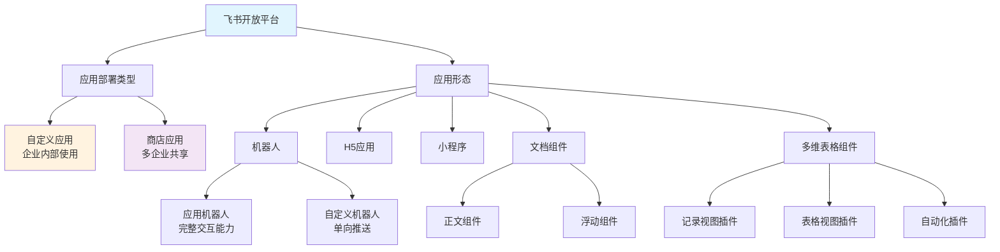
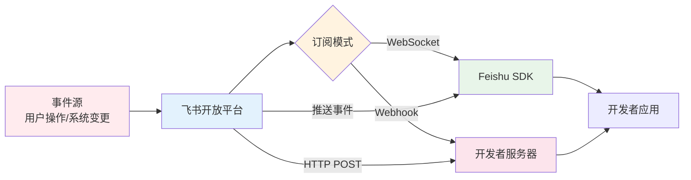
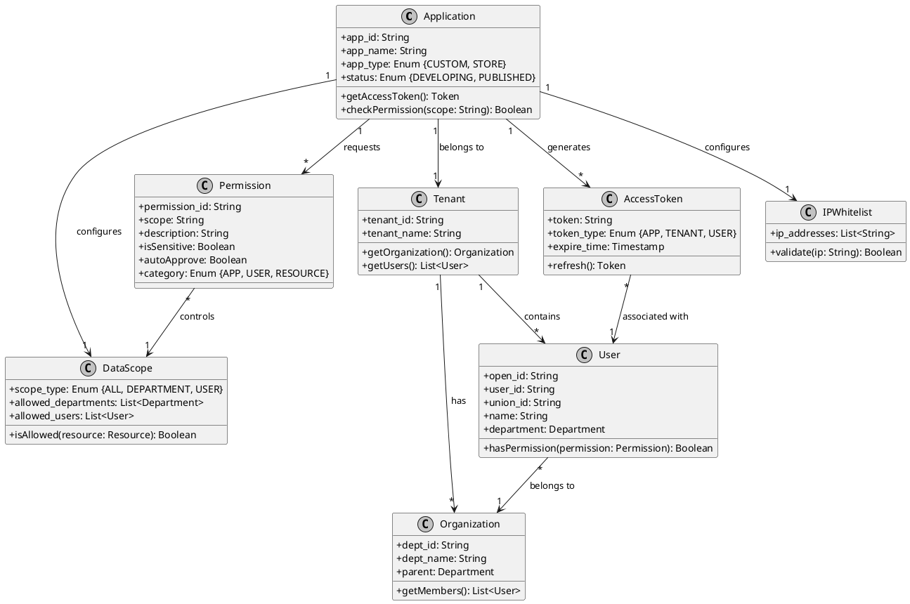

# 飞书开放平台深度调研报告

## 目录
1. [应用类型设计](#1-应用类型设计)
2. [开放能力范围](#2-开放能力范围)
3. [开发者生态](#3-开发者生态)
4. [技术架构](#4-技术架构)

---

## 1. 应用类型设计

### 1.1 应用部署类型对比

飞书开放平台将应用分为两大类：

| 维度 | 自定义应用 (Custom Apps) | 商店应用 (Store Apps) |
|------|------------------------|---------------------|
| **定义** | 由企业内部人员或授权开发者开发，仅能在同一企业内发布使用 | 由第三方服务商开发，发布在飞书应用目录，可供所有飞书租户安装使用 |
| **开发者** | 企业内部人员或授权开发者 | 第三方独立软件供应商(ISV) |
| **用户范围** | 企业内部人员 | 购买激活该应用的企业内部人员、飞书个人版用户 |
| **支持能力** | 支持所有现有能力 | **不支持工作台组件能力** |
| **审核流程** | 无需飞书团队审核，企业租户管理员审批后即可使用 | 需通过飞书官方审核才能在应用目录上架 |
| **发布位置** | 企业内部使用 | 飞书应用中心 (https://app.feishu.cn/) |

### 1.2 应用形态详细说明

#### 1.2.1 机器人 (Bot)

**定义**：基于对话与用户交互的应用，是向用户传递信息的常用渠道。

**核心能力**：
- 消息推送：自动向用户或群组发送业务信息、事件通知、数据展示等
- 接收与回复消息：通过事件订阅实时接收会话消息并响应用户
- 多样化消息格式：支持文本、图片、链接、按钮、卡片等多种格式
- 群管理：自动创建群组、添加成员、管理群公告、会话标签、群菜单等

**两种机器人类型对比**：

| 能力 | 应用机器人 | 自定义机器人 |
|-----|----------|-------------|
| **使用场景** | 与企业业务系统整合，如数据监控、故障处理群组自动创建 | 仅支持单向消息推送到群，用于临时推送固定内容 |
| **开发方式** | 在开发者后台创建应用并启用机器人能力 | 在飞书群组设置中添加 |
| **开发成本** | 仅需服务端开发，支持丰富交互 | 配置简单，但场景受限 |
| **单聊能力** | 支持与应用范围内用户建立单聊 | ❌ 仅能在添加的群中使用 |
| **跨群使用** | ✅ 支持 | ❌ 不支持 |
| **消息交互** | ✅ 支持完整交互 | 仅支持配置打开链接交互 |
| **访问通讯录** | ✅ 支持 | ❌ 不支持 |

**典型应用场景**：
- 监控告警机器人：集成监控系统，自动推送告警到指定群组
- 任务提醒机器人：定时推送任务提醒、数据报告
- 新员工欢迎机器人：自动检测新成员入群并发送欢迎消息
- AI机器人：结合Coze等AI能力，实现智能对话

#### 1.2.2 H5应用 (Web Application)

**定义**：使用H5技术开发，可在飞书客户端内运行的应用。

**核心特点**：
- **开发速度快**：一次开发，多平台运行（桌面端、移动端）
- **动态更新**：通过公开访问URL集成，无需发版即可更新
- **低成本迁移**：企业现有H5应用可低成本迁移到飞书工作台
- **免登录体验**：基于飞书客户端开放接口，用户免登录使用
- **性能优化**：飞书客户端提供性能优化，体验接近原生

**支持能力**：
- 调用飞书客户端API（JSAPI）：通讯录、云文档等
- 免登录访问（SSO单点登录）
- 灵活配置入口：搜索结果快捷入口、聊天框"+"菜单、消息快捷操作

**使用限制**：
- 渲染层和数据层需在服务端维护，交互响应速度比原生应用慢
- 对网络质量要求高，弱网环境影响使用体验

**典型应用场景**：
- 企业现有H5办公应用集成到飞书
- 需要频繁更新的运营活动页面
- 需要在飞书外部分发的应用

**容器定制化能力**：
- 屏幕方向设置（强制横屏/竖屏/跟随系统）
- 导航栏颜色设置
- 隐藏导航栏/底部导航栏
- 配置更多菜单功能
- 滑动关闭应用
- 在浏览器中打开网页

#### 1.2.3 文档组件 (Docs Add-on)

**定义**：飞书文档推出的开放能力，支持在文档中嵌入自定义功能模块，实现文档协作与企业工作流集成。

**两种组件类型**：

| 类型 | 说明 | 图示说明 |
|-----|------|---------|
| **正文组件** | 属于文档正文内容，作为内容块存在，与其他内容块（如思维导图、流程图）功能和体验类似 | 文档正文中的内容块 |
| **浮动组件** | 独立于云文档内容的模块，可自由拖动和调整大小，不受正文内容影响 | 悬浮在文档上的模块 |

**正文组件附加视图**：

| 视图类型 | 说明 | 使用方式 |
|---------|------|---------|
| **全屏视图** | 视图填充整个可见区域 | 声明`contributes.fullscreen`，使用`Service.Fullscreen` API |
| **浮动卡片视图** | 浮动在正文内容上方 | 声明`contributes.floatCard`，使用`Service.FloatCard` API |
| **弹出视图** | 显示弹窗 | 声明`contributes.popup`，使用`View.Action.showPopup` API |
| **模态视图** | 显示模态框（自动包含关闭按钮、标题和背景遮罩） | 声明`contributes.modal`，使用`View.Action.openModal` API |

**开放能力范围**：
- **可获取文档信息**：文档标题、内容（块类型和数据）、统计数据、权限信息、历史记录、环境信息（暗黑模式、文档模式、多语言）
- **可调用文档功能**：工具栏、选择/会话组件、名片预览、图片预览、复制粘贴、撤销恢复、展开/折叠块等
- **可编辑文档内容**：标题、正文（文本、图片、表格、任务、公式、@、文件、云文档、iframe等）、格式设置
- **可感知文档变化**：用户操作（打开/关闭文档、内容变更、块浮选）、用户权限（可读、可编辑、可评论）
- **可与用户交互**：识别用户身份、获取用户授权、读取进度感知、权限感知、协同编辑
- **完全控制组件本身**：改变形状（嵌入块、全屏、浮动、文本扩展）、读取和存储数据、引入外部能力

**典型应用场景**：
- 集成业务工作流：项目管理系统、OA审批系统、任务监督系统
- 提升文档创作效率：文本绘图（Mermaid流程图）、批量格式设置、格式检查

#### 1.2.4 多维表格组件 (Base Extensions)

**定义**：基于多维表格(Base)提供的扩展能力，开发者可将自研产品直接嵌入多维表格，扩展其功能。

**三种插件类型**：

| 插件类型 | 说明 | 示例 |
|---------|------|------|
| **记录视图插件** | 在展开记录详情后添加插件 | 版式打印插件：将多维表格数据转换为可打印版式 |
| **表格视图插件** | 点击表格头部加号，在"扩展视图插件"区域添加 | 地图视图插件：在地图上标记位置、范围等可视化信息 |
| **自动化插件** | 点击多维表格右上角"自动化"，在创建自动化流程时添加 | 文字提取自动化：上传图片后识别文字并写入相关字段 |

**核心概念**：
- **数据表**：多维表格至少包含一个数据表，是用于记录多条数据的数据容器
- **记录**：数据表中的每行数据
- **自动化**：支持设置自动化流程，包括官方推荐流程和自定义流程

**典型应用场景**：
- 版式打印：自由组合表格字段，打印业务所需数据
- 地图视图：地理位置可视化
- OCR文字提取：图片文字识别并自动填充
- 客户关系管理(CRM)

### 1.3 应用能力组合

飞书应用能力可以组合使用，常见组合方式：
- **H5应用 + 机器人能力**：使用事件订阅将H5应用中的业务通知发送到飞书会话
- **机器人 + 飞书卡片**：通过卡片消息实现轻量级交互
- **文档组件 + 业务系统**：在文档中集成业务流程

### 1.4 应用形态架构图



---

## 2. 开放能力范围

### 2.1 IM能力（即时消息）

**核心功能**：

| 功能模块 | 支持能力 |
|---------|---------|
| **消息发送** | 发送文本、富文本、图片、文件、卡片、视频、音频、表情等消息类型；支持批量发送、回复消息、编辑消息、转发消息、合并转发 |
| **消息管理** | 撤回消息、查询消息已读状态、获取会话历史消息、获取消息内容、获取消息中的资源文件 |
| **消息卡片** | 更新应用发送的消息卡片、延迟更新卡片、发送仅特定人员可见的卡片 |
| **表情回复** | 添加/删除/列消息表情回复 |
| **消息加急** | 应用内加急、短信加急、电话加急 |
| **消息置顶** | 置顶/取消置顶消息、获取群内置顶消息 |
| **URL预览** | 将消息中的URL解析为文本或卡片格式展示 |

**消息类型支持**：
- 文本消息 (text)
- 富文本消息 (post)
- 图片消息 (image)
- 文件消息 (file)
- 视频消息 (video)
- 音频消息 (audio)
- 卡片消息 (interactive)
- 群名片、个人名片
- 表情包

### 2.2 通讯录能力

**核心功能**：

| 功能模块 | 支持能力 |
|---------|---------|
| **用户管理** | 获取用户信息、批量获取用户、查询用户列表、通过手机号/邮箱获取用户、创建/更新/删除用户 |
| **部门管理** | 获取部门信息、获取部门列表、获取直属部门列表、创建/更新/删除部门 |
| **组织架构** | 获取完整组织架构、批量获取用户详情 |
| **用户组** | 获取用户组信息、获取用户组成员列表、创建/更新/删除用户组 |
| **自定义属性** | 获取企业自定义用户属性 |

**身份标识类型**：
- `open_id`：用户/部门/群组在应用内的唯一标识
- `user_id`：用户在租户内的唯一标识
- `union_id`：用户在整个飞书生态内的唯一标识
- `chat_id`：群组在租户内的唯一标识

### 2.3 审批能力

**核心功能**：

| 功能模块 | 支持能力 |
|---------|---------|
| **审批定义** | 获取审批定义、获取审批表单字段信息 |
| **审批实例** | 创建审批实例、获取审批实例详情、审批任务通过/拒绝/转交、催办审批任务 |
| **审批抄送** | 获取抄送详情 |
| **审批搜索** | 搜索审批实例、批量获取审批实例ID |
| **审批附件** | 上传审批附件、下载审批附件 |

### 2.4 文档能力

**云文档(Docs)能力**：

| 功能模块 | 支持能力 |
|---------|---------|
| **文件管理** | 获取文件信息、复制文件、删除文件、获取文件权限、转让文件所有权 |
| **文档操作** | 创建文档、获取文档内容、获取文档元数据、获取文档块内容、创建/更新/删除文档块 |
| **电子表格** | 创建电子表格、获取工作表、添加/删除工作表、读取/写入单元格数据、设置单元格样式 |
| **订阅功能** | 订阅文件变更事件、取消订阅 |

**多维表格(Base)能力**：

| 功能模块 | 支持能力 |
|---------|---------|
| **应用管理** | 创建/删除/获取多维表格应用、复制应用 |
| **数据表管理** | 创建/删除/获取数据表、更新数据表属性、获取数据表列表 |
| **视图管理** | 获取视图列表、创建/更新/删除视图 |
| **记录管理** | 查询记录、创建/更新/删除记录、批量操作记录 |
| **字段管理** | 获取字段列表、创建/更新/删除字段 |
| **权限管理** | 获取权限设置、更新权限设置、添加/移除协作者 |
| **仪表盘** | 获取仪表盘列表、创建/更新/删除仪表盘 |

### 2.5 日历能力

**核心功能**：

| 功能模块 | 支持能力 |
|---------|---------|
| **日历管理** | 获取主日历信息、创建共享日历、获取日历列表、搜索日历、更新/删除日历 |
| **日程管理** | 创建日程、获取日程详情、更新/删除日程、邀请参与者、响应日程邀请 |
| **忙闲查询** | 查询用户忙闲信息 |
| **日程订阅** | 订阅日历变更事件 |

**日历类型**：
- `primary`：用户或应用的主日历
- `shared`：用户或应用创建的共享日历
- `google`：用户绑定的Google日历
- `resource`：会议室日历
- `exchange`：用户绑定的Exchange日历

**日历权限级别**：
- `free_busy_reader`：访客只能看到忙闲信息
- `reader`：订阅者，可查看所有日程详情
- `writer`：编辑者，可创建和修改日程
- `owner`：管理员，可管理日历和共享设置

### 2.6 会议能力

**视频会议(VC)能力**：

| 功能模块 | 支持能力 |
|---------|---------|
| **会议管理** | 创建会议、获取会议详情、更新/删除会议、查询会议列表 |
| **参与者管理** | 邀请参与者、移除参与者、查询参与者列表 |
| **会议控制** | 开始/结束会议、查询会议状态 |
| **会议室管理** | 获取会议室列表、查询会议室忙闲 |
| **录制管理** | 查询录制文件、获取录制详情 |

### 2.7 存储能力

**云盘(Drive)能力**：

| 功能模块 | 支持能力 |
|---------|---------|
| **文件上传** | 上传图片、上传文件、分片上传大文件 |
| **文件下载** | 下载图片、下载文件 |
| **文件管理** | 获取文件元信息、复制/移动/删除文件、创建文件夹 |
| **权限管理** | 设置文件权限、添加/移除协作者、转移文件所有权 |
| **搜索功能** | 搜索文件 |

### 2.8 其他开放能力

**链接预览(Link Preview)**：
- 将聊天消息中的特定链接转换为文本或卡片形式展示
- 用户无需跳转即可快速了解链接内容
- 通过卡片交互完成业务操作

**应用快捷方式(App Shortcut)**：
- 配置搜索结果中的快捷入口显示
- 配置聊天框"+"菜单中的应用入口
- 配置消息快捷操作的应用入口

**移动端登录(Mobile Login)**：
- 允许用户使用飞书账号授权登录第三方移动应用

---

## 3. 开发者生态

### 3.1 应用商店/App Center运营模式

**商店应用特点**：
- 由独立软件供应商(ISV)开发，面向通用场景
- 提供一对多的分发渠道
- 需通过飞书官方审核才能上架
- 企业管理员和用户可在飞书应用目录发现和安装

**上架流程**：
1. **入驻与验证**：ISV身份验证
2. **应用开发**：创建商店应用，完成前后端开发
3. **上架审核**：飞书官方严格审核
4. **安装使用**：通过审核后，任何飞书租户可在应用目录找到并安装

**发布类型**：

| 发布类型 | 可见范围 | 安装方式 |
|---------|---------|---------|
| **全量上架** | 所有飞书用户（个人版和团队版租户） | 应用目录安装 |
| **定向上架** | 灰度可见范围内的飞书用户（团队版租户，上限30个租户） | 应用目录安装 |
| **私密上架** | 所有飞书用户（个人版和团队版租户） | 获取安装链接的用户 |

### 3.2 开发者工具链

#### 3.2.1 服务端SDK

**支持语言**：
- **Java SDK** (>= 1.8)
- **Python SDK** (>= 3.8)
- **Go SDK** (>= 1.5)
- **NodeJS SDK** (>= 10.0.0)

**SDK核心能力**：
- 基于长连接的事件回调
- 结构化的API请求参数
- 全生命周期的应用访问令牌(tenant_access_token)管理
- 完善的类型系统和语义化编程接口
- 详细的注释和文档链接

**GitHub开源**：
- 源码可在GitHub项目空间查看
- 支持提交Issue反馈问题
- 提供示例场景代码

#### 3.2.2 开发者工具(Feishu Developer Tools)

**功能特性**：
- 小程序调试、预览和发布（包大小限制：不超过10MB）
- H5应用调试和预览
- 编辑器与资源管理器
- 内置命令行工具

**支持平台**：
- macOS
- Windows 10/11 (64位)
- **注意**：暂不支持Apple M芯片（需开启Rosetta模式运行）

**下载地址**：
- MacOS：https://sf3-cn.feishucdn.com/obj/larkdeveloper/opdev/ide/full-packages/opdev-ide-3.4.2-SaaS-lark.dmg
- Windows-64位：https://sf3-cn.feishucdn.com/obj/larkdeveloper/opdev/ide/full-packages/opdev-ide-3.4.2-SaaS-lark.zip

#### 3.2.3 Web应用远程调试工具

**功能**：在线调试H5应用，类似Chrome DevTools

**支持查看信息**：
- Elements（元素）
- Console（控制台）
- Network（网络请求）
- Storage（存储）
- Cookie

**环境要求**：
- 操作系统：Android、iOS、Windows、Mac
- 飞书版本：v7.8及以上
- 浏览器：Chrome
- 网络环境：稳定

**使用步骤**：
1. 在开发者后台"Web应用 > Web应用调试工具"进入调试平台
2. 选择要调试的Web应用
3. 在应用HTML的`<head>`标签中粘贴调试脚本：
   ```html
   <script src="https://sf1-scmcdn-cn.feishucdn.com/obj/feishu-static/op/fe/devtools_frontend/remote-debug-0.0.1-alpha.6.js"></script>
   ```
4. 使用调试平台生成的地址进行调试

#### 3.2.4 飞书卡片构建工具 (CardKit)

**功能**：可视化卡片构建工具，通过拖拽方式快速构建卡片

**核心特性**：
- 可视化拖拽编辑
- 丰富的组件库（文本、图片、按钮、图表等）
- 卡片变量功能，支持多场景复用
- 实时预览效果
- 参考案例库

**卡片应用场景**：
- 聊天消息中的卡片
- 群置顶消息卡片
- 链接预览卡片

**访问地址**：https://open.feishu.cn/cardkit

### 3.3 文档体系和学习资源

**官方文档结构**：

| 文档类型 | 内容 |
|---------|------|
| **快速入门** | 快速调用服务端API、开发回声机器人、开发卡片交互机器人、嵌入H5应用到工作台 |
| **开发指南** | 应用类型介绍、自定义应用开发流程、商店应用上架流程、权限和授权 |
| **API参考** | 完整的服务端API列表、事件列表、客户端JSAPI参考 |
| **场景教程** | 机器人自动群组告警、向指定部门群发消息、基于事件的消息推送、开发卡片交互机器人 |
| **最佳实践** | 客户案例、行业解决方案 |

**学习资源**：
- 官方视频教程（约5分钟快速了解入驻、开发、发布流程）
- SDK讨论群（Java、Python、Go SDK专用飞书群）
- GitHub示例代码

### 3.4 审核和发布流程

#### 3.4.1 自定义应用发布流程

**发布触发条件**：
- 基本信息变更
- 权限范围变更
- 应用功能变更
- 事件订阅配置变更

**审核流程**：
1. 创建应用新版本
2. 配置版本号、更新说明、功能说明
3. 配置可用范围（全员/部分成员）
4. 提交发布申请
5. 企业管理员审核
6. 审核通过后生效

**测试调试机制**：
- 使用`user_access_token`调试无需审核的API
- 配置测试企业，在测试版本中权限自动生效
- 支持批量导入/导出权限配置

#### 3.4.2 商店应用发布流程

**ISV入驻要求**：
- 需先通过ISV资质验证
- 遵守ISV日常运营管理规范

**测试机制**：
- 创建测试企业
- 设置测试版本
- 在测试企业中权限自动生效

**发布选项**：
- 全量上架
- 定向上架（灰度发布，最多30个租户）
- 私密上架（通过链接安装）

**双重审核**：
1. 应用上架审核（飞书开放平台审核）
2. 租户安装审核（租户管理员审核）

### 3.5 应用分发和推广机制

**应用发现渠道**：

| 渠道 | 说明 |
|-----|------|
| **飞书应用目录** | 官方应用市场，所有上架应用展示 |
| **搜索快捷入口** | 配置后在飞书搜索结果中显示快捷入口 |
| **聊天"+"菜单** | 配置后在聊天框"+"菜单中显示 |
| **消息快捷操作** | 配置后在消息快捷操作中显示 |
| **私密链接** | 生成专属安装链接分享 |

**可用范围配置**：
- **全员可用**：组织内所有成员可访问
- **部分成员**：指定部门或成员可用
- **禁用成员**：指定范围内成员不可使用

**申请访问机制**：
- 支持成员申请使用无权限的应用
- 管理员审批后获得访问权限

---

## 4. 技术架构

### 4.1 API设计风格

**RESTful API设计**：
- 遵循RESTful架构风格
- 使用HTTP方法表示操作：GET（查询）、POST（创建）、PUT（更新）、DELETE（删除）、PATCH（部分更新）
- 统一的URL格式：`https://open.feishu.cn/open-apis/{service}/{version}/{resource}`

**请求格式**：
- 请求方法：HTTP标准方法
- 请求头：`Authorization: Bearer {access_token}`、`Content-Type: application/json`
- 请求体：JSON格式

**响应格式**：
```json
{
  "code": 0,
  "msg": "ok",
  "data": { ... }
}
```

**HTTP状态码**：
- 200：成功
- 400：请求参数错误
- 401：未授权
- 403：禁止访问
- 404：资源不存在
- 429：请求频率限制
- 500：服务器内部错误

### 4.2 认证授权机制

#### 4.2.1 访问令牌类型

| 令牌类型 | 是否需要用户授权 | 说明 | 示例值 |
|---------|---------------|------|-------|
| **tenant_access_token** | 否 | 以应用身份调用API的凭证，数据范围由应用数据权限决定，适合无需用户登录的自动化操作 | `t-24b5bf4e00b2af1234` |
| **user_access_token** | 是 | 以用户身份调用API的凭证，数据范围由用户权限决定，适合代表用户执行操作 | `eyJhbGciOiJFUzI1NiIs...` |
| **app_access_token** | 否 | 应用身份的短期令牌，主要用于商店应用获取tenant_access_token | `a-24b5cef00b1234` |

#### 4.2.2 令牌获取流程

**自定义应用获取tenant_access_token**：
1. 在开发者后台获取App ID和App Secret
2. 调用API获取tenant_access_token

**商店应用获取tenant_access_token**：
1. 配置事件订阅接收app_ticket
2. 使用App ID、App Secret、app_ticket获取app_access_token
3. 获取tenant_key（租户唯一标识）
4. 使用app_access_token和tenant_key获取tenant_access_token

**获取user_access_token（OAuth2流程）**：
1. 配置安全设置中的重定向URL
2. 调用获取OAuth code接口
3. 使用code换取user_access_token
4. token有效期约2小时，需定期刷新

#### 4.2.3 权限模型(Scope)

**权限分类**：

| 分类维度 | 类型 | 说明 |
|---------|------|------|
| **按身份类型** | Tenant Token Scopes | 使用tenant_access_token调用时的权限 |
| | User Token Scopes | 使用user_access_token调用时的权限 |
| **按敏感程度** | 非敏感权限 | 低敏感度数据访问 |
| | 高级权限 | 高敏感度数据访问，需严格审核 |

**自定义应用权限级别**：

| 级别 | 说明 | 审核规则 |
|-----|------|---------|
| **自动审批权限** | 租户管理员可配置自动审批 | 无需审核，申请后立即生效 |
| **需审核权限** | 涉及敏感数据的权限 | 需创建版本提交审核，管理员审批后生效 |

**权限申请原则**：
- 最小权限原则：只申请必要的权限
- 权限范围过大可能对企业数据安全造成威胁
- 自定义应用：开发者申请→租户管理员审核
- 商店应用：飞书平台审核+租户安装审核

**权限批量操作**：
- 支持批量导入/导出权限
- 便于跨应用迁移权限配置

### 4.3 事件订阅和Webhook机制

#### 4.3.1 事件订阅(Event Subscription)

**适用场景**：
- 实时数据处理
- 快速事件响应
- 数据同步（如员工离职后立即处理业务数据）
- 用户操作响应（如新成员入群自动欢迎）

**订阅方式**：

| 方式 | 说明 | 推荐使用场景 |
|-----|------|------------|
| **长连接接收** | 通过SDK建立WebSocket全双工通道，自动处理认证、解密、签名验证 | 集成Feishu SDK的自定义应用 |
| **Webhook通知** | 配置公网URL接收HTTP POST请求，需自行处理安全验证 | 传统Webhook模式 |

**订阅身份类型**：
- **Tenant Token Based**：使用tenant_access_token订阅，数据范围由应用权限决定
- **User Token Based**：使用user_access_token订阅，数据范围由用户权限决定

**事件版本**：
- v1.0：传统格式，包含ts、uuid、token、event等字段
- v2.0：推荐版本，包含schema、header、event等字段，更完善的结构

**事件推送机制**：
- 事件触发后通过HTTP POST推送
- 需在3秒内响应HTTP 200状态码
- 失败重传机制：15秒、5分钟、1小时、6小时后重试，最多4次
- 有序事件：部分事件保证按顺序推送，需确保消费完前置事件

#### 4.3.2 事件订阅架构图



**订阅流程说明**：
1. **WebSocket模式**：SDK建立长连接，平台主动推送事件
2. **Webhook模式**：开发者配置URL，平台通过HTTP POST推送事件

#### 4.3.3 回调(Callback)

**与事件的区别**：

| 维度 | 回调(Callback) | 事件(Event) |
|------|---------------|------------|
| **响应要求** | 必须立即返回响应内容反馈用户操作 | 只需简单响应是否收到 |
| **操作类型** | 同步操作 | 异步操作 |
| **失败处理** | 无补推机制，超时即失败 | 失败重传机制 |
| **前端表现** | 等待服务器返回后完成加载 | 不阻塞前端 |

**适用场景**：
- 卡片交互场景：用户点击卡片按钮，服务器需立即返回更新后的卡片内容
- 链接预览场景：用户查看链接时，服务器需立即返回预览内容

**订阅方式**：
- 长连接接收（通过SDK）
- Webhook通知（配置公网URL）

**回调结构**：
```json
{
  "schema": "2.0",
  "header": {
    "token": "...",
    "create_time": "...",
    "event_type": "url.preview.get",
    "tenant_key": "...",
    "app_id": "..."
  },
  "event": { ... }
}
```

### 4.4 权限模型和数据安全

#### 4.4.1 应用数据权限

**概念**：应用数据权限指应用作为身份访问业务资源时可获取的数据范围。

**配置场景**：
- 调用通讯录、飞书HR企业版等API时
- 使用tenant_access_token时需要配置
- 使用user_access_token时无需单独配置（跟随用户权限）

**配置方式**：
- 在开发者后台"数据权限"页面配置
- 可配置访问的用户范围、部门范围等

#### 4.4.2 应用可用范围

**定义**：定义哪些用户群体（组织、用户组、个人）可以使用应用。

**配置原则**：
- 最小可用原则：只设置为必须使用应用的部门或成员
- 避免普通成员因可用范围过大而获取敏感企业数据

**配置层级**：
- 应用开发者：发布版本时配置
- 组织管理员：在管理后台调整

**支持范围**：
- 全员可用
- 部分成员（指定部门或用户）
- 禁用成员（优先级高于可用成员）

#### 4.4.3 IP白名单

**功能**：提高应用安全性，只有白名单中的IP才能调用API

**配置位置**：开发者后台"安全设置"

### 4.5 权限模型类图



**权限模型说明**：
- **应用级权限**：应用本身的能力范围（如发送消息、读取通讯录）
- **用户级权限**：操作发起者的权限边界
- **数据级权限**：可访问的数据范围（全员/部门/个人）
- **IP白名单**：网络层安全控制

### 4.6 开发调试工具

#### 4.5.1 日志查询

**功能**：
- 检索服务端API调用日志
- 检索客户端API调用日志
- 检索事件推送日志

**使用场景**：线上运维、问题定位

#### 4.5.2 运营分析

**功能**：
- 查看应用使用数据
- 支持应用所有者、管理员、运营者查看

**数据维度**：
- 活跃用户
- 功能使用频次
- 使用时长等

#### 4.5.3 用户反馈

**功能**：
- 用户快速反馈使用问题
- 开发者在后台查看反馈并定位问题

#### 4.5.4 测试企业与人员

**功能**：
- 创建测试企业
- 在测试环境中验证应用功能
- 测试版本中权限自动生效，无需审核

---

## 附录

### A. 飞书开放平台重要链接

| 资源 | 链接 |
|-----|------|
| 开发者后台 | https://open.feishu.cn/app |
| 应用商店 | https://app.feishu.cn/ |
| 卡片构建工具 | https://open.feishu.cn/cardkit |
| Web应用调试工具 | https://open.feishu.cn/app/web-inspect |

### B. SDK GitHub仓库

| 语言 | 仓库地址 | 示例代码 |
|-----|---------|---------|
| Go | github.com/larksuite/oapi-sdk-go | oapi-sdk-go-demo |
| Python | github.com/larksuite/oapi-sdk-python | oapi-sdk-python-demo |
| Java | github.com/larksuite/oapi-sdk-java | oapi-sdk-java-demo |
| NodeJS | github.com/larksuite/node-sdk | - |

### C. 版本信息

- JSSDK版本：`https://lf-scm-cn.feishucdn.com/lark/op/h5-js-sdk-1.5.44.js`
- 开发者工具版本：3.4.2
- 飞书客户端要求：v7.8及以上（用于调试工具）
