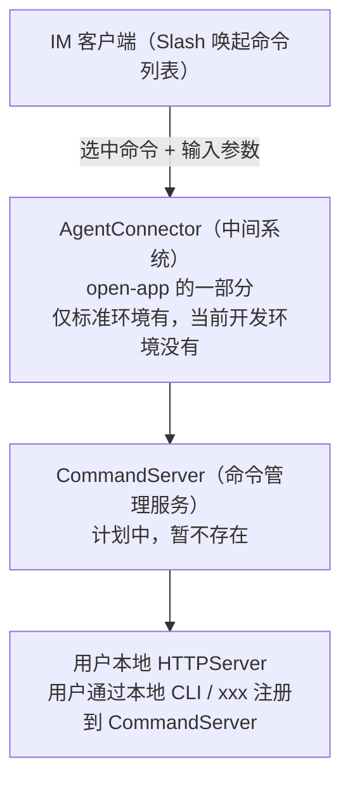

# IM Slash 命令直达本地服务调研

> **调研主题**: 在 IM 中通过 Slash 命令一键唤起命令列表、输入参数、直达用户本地 HTTPServer 的"确定性命令触发"模式，是否业务主流 / 主推 / 未来发展趋势
> **创建日期**: 2026-09-08
> **调研状态**: 📋 背景已确认，调研启动
> **分支**: 待创建

---

## 一、背景

### 1.1 系统上下文

本调研属于 **open-app**（企业通讯能力开放平台）的演进方向讨论。

- **open-app** 是 **XXX 通讯系统**（企业级统一通讯平台：IM / Meeting / CloudBox / Calendar / Bot 等）的**能力开放平台**，通过 API / 事件 / 回调 / 连接器四种形式将通讯能力开放给企业内业务应用（详见 `docs/XXX 通讯系统概述.md`）。
- 本次需求发生在 **IM 子系统** 场景内。

### 1.2 需求描述

在 IM 中，通过 **Slash 命令**（如输入 `/`）唤起一个**命令列表**，流程如下：

```
用户在 IM 输入 "/"（Slash）
   ↓
唤起 命令列表（弹出可选的命令）
   ↓
用户 选中某个命令
   ↓
输入参数（结构化表单 / 参数）
   ↓
触发到 用户本地 HTTPServer（用户自己机器上跑的 HTTP 服务）
```

### 1.3 与传统 Agent Skill 的本质差异（调研核心区分点）

这是本方案与传统 Agent Skill **最大的不同** —— 传统 Agent Skill 由 **AI Agent（LLM）参与处理**（理解自然语言、解析意图、决策调用哪个工具）；而本方案 **全程无 AI Agent 处理，纯程序化传递**（命令确定性映射、参数结构化传递、路由程序化）。

| 维度 | 传统 Agent Skill | 本方案（调研对象） |
|------|-----------------|------------------|
| 中间处理方 | **AI Agent（LLM）** 参与：理解自然语言、解析意图、决定调哪个工具 | **无 AI Agent**，全程纯代码/程序化处理 |
| 输入理解 | 自然语言 → LLM 意图识别 | 命令**确定性映射**，参数**结构化字段** |
| 决策方式 | 模糊语义 → 模型决策 → 执行 | 强类型：命令枚举 → 参数 schema → 触发 |
| 本质 | "聪明地猜"（语义推断/模型决策） | "确定地传"（命令/参数/路由全部程序化） |

> 一句话：**不是给 LLM 一个 prompt 让它决定"怎么做"，而是用户显式选命令、显式填参数，程序按定义好的映射把结构化数据原样转发到本地 HTTPServer。全程无语义推断、无模型决策。**

---

## 二、架构链路（当前已知信息）



### 2.1 组件说明

| 组件 | 状态 | 说明 |
|------|:---:|------|
| **AgentConnector** | 仅标准环境有 | 中间编排系统，open-app 的一部分；当前环境不具备 |
| **CommandServer** | 计划中，暂不存在 | 命令管理服务：维护命令清单 / 参数 schema / 注册关系 |
| **本地 CLI / xxx** | 待定 | 用户注册命令到 CommandServer 的入口方式（`xxx` 为未确定的占位指代） |
| **用户本地 HTTPServer** | 用户侧 | 最终接收触发，执行命令逻辑的本地服务 |

> ⚠️ **不确定性标注**：`CommandServer` 与`本地注册入口`均为规划中/未定形态；`AgentConnector` 当前环境不可用。这些组件细节待后续调研补充。

---

## 三、调研目标

| # | 目标 | 要回答的问题 |
|---|------|-------------|
| G1 | **验证趋势判断** | "IM 内 Slash 命令直达本地服务"这种**无 AI 处理、全程序传递**的确定性触发模式，是否是业界主流 / 主流厂商主推方向？ |
| G2 | **对标主流平台做法** | Slack / Discord / Telegram / 飞书 / 钉钉 / 企微 / Teams 等 IM，是否提供同类能力（Slash 命令 / 本地服务直连）？形态如何？ |
| G3 | **明确与 AI Agent Skill 的边界** | 业界是否也存在"非 AI 触发"的确定性命令通道？它与 Agent Skill（AI 触发）的分工 / 关系是什么？ |
| G4 | **判断未来趋势** | 这种模式是过渡性方案还是未来趋势？与 AI Agent 生态是替代、互补还是并存？ |
| G5 | **提炼对 open-app 的启示** | 综合结论，给出 open-app 是否应投入 / 如何投入该方向的建议 |

---

## 四、调研计划（调研对象 + 调研维度）

### 4.1 调研对象全景（四类）

#### 4.1.1 同类型竞品 —— 提供"确定性命令触发 / Slash 命令"的 IM 与通讯平台（直接竞品）

> 与本方案（IM 内 `/` 唤起命令 → 参数 → 触发本地服务）**形态最接近**的产品。统一追踪三方面：**① 非 AI 本地 Command 支持、② AI Agent Skill 支持、③ 未来规划**（是否主推本地执行 / 是否 AI 化取代确定性）。

| 平台 | 归属 | 非 AI 本地 Command | AI Agent Skill | 未来规划 |
|------|------|:---:|:---:|------|
| **Slack** | Salesforce | ✅ Slash Commands（`/command` 直达 Request URL/HTTP，参数结构化） | ✅ Slack AI + Agentforce + MCP 接入 | 【待调研】主推 Agentforce，是否仍保留确定性通道 |
| **Discord** | Discord | ✅ Slash Commands + Interactions（Webhook 回传，参数 Options/Autocomplete） | ⚠️ 无原生，靠第三方 AI Bot / Activities | 【待调研】以确定性为主 |
| **Telegram** | Telegram | ✅ Bot Commands（`/command`）+ 内联菜单按钮 | ⚠️ Bot API 无原生 AI，第三方接入 | 【待调研】确定性为主 |
| **飞书 / Lark** | 字节跳动 | ✅ 快捷指令 / `/` 命令 + 交互卡片 | ✅ 飞书智能伙伴 + 飞书 MCP | 【待调研】AI 助理与命令并存（双通道） |
| **钉钉** | 阿里巴巴 | ✅ 群机器人 `/` 命令 + 互动卡片 + 酷应用 | ✅ 钉钉 AI 助理 + 钉钉 MCP | 【待调研】AI 助理与命令并存（双通道） |
| **企业微信** | 腾讯 | ⚠️ 有限（应用消息 + 回调，无标准 `/` 命令菜单） | ✅ 企微智能机器人 | 【待调研】回调为主 |
| **Microsoft Teams** | 微软 | ✅ Slash command + Message Extensions | ✅ Copilot Studio + Teams AI Library + 自定义引擎 Agent | 【待调研】AI 与命令并存（双通道） |

> ⚠️ 上表各列初判基于公开认知，**需在信息采集阶段用官方文档核实**；`AI Agent Skill 支持` 列关注是否提供"MCP / Function Calling / 自定义 Agent"等机器可调用通道。

#### 4.1.2 不同类型产品 —— AI 驱动 / 自动化类（对照：区分"确定性 vs AI"）

> 这些是 AI Agent 参与处理的"对立面"，同样统一追踪三方面：**① 非 AI 本地 Command 支持、② AI Agent Skill 支持、③ 未来规划**，用于判断"确定性命令 vs AI 触发"是替代还是互补。

| 平台 / 产品 | 类型 | 非 AI 本地 Command | AI Agent Skill | 未来规划 |
|------------|------|:---:|:---:|------|
| **Slack AI / Agentforce** | AI Agent 整合 | ⚠️ 复用 Slack 原生 Slash Commands | ✅ 核心（Agentforce 主推） | 观察是否仍保留确定性通道 |
| **Microsoft Copilot Studio** | Agent 平台 | ⚠️ 无本地 Command 概念 | ✅ 核心（自定义 Agent） | AI 驱动为主 |
| **飞书智能伙伴 / 钉钉 AI 助理** | AI 助理 | ⚠️ 复用平台原生命令/卡片 | ✅ 核心（自然语言 + 工具调用） | AI 驱动为主 |
| **OpenAI Assistants / GPTs / Function Calling** | AI 工具调用 | ❌ 无（LLM 决策调工具） | ✅ 核心 | AI 纯驱动 |
| **Claude Code Skills / MCP** | AI Skill 生态 | ❌ 无（AI 理解后调用） | ✅ 核心（**本方案的对立面**） | AI 纯驱动 |
| **GitHub Copilot CLI / AI CLI** | AI 命令行 | ❌ 无（slash 命令仍由 AI 驱动） | ✅ 核心 | AI 驱动为主 |
| **n8n / Zapier / Make / Coze / Dify** | 编排 / 自动化 | ✅ 有（确定性工作流节点） | ✅ 有（AI 节点 / Agent 编排） | 双通道并存 |

> ⚠️ 上表初判基于公开认知，需信息采集阶段核实；本类对标的核心问题是——**它们是否也保留了"非 AI 确定性触发"这条通道，还是全面 AI 化**。

#### 4.1.3 生态基础设施 / 协议

| 对象 | 说明 |
|------|------|
| **Webhook / 事件回调机制** | 命令触发到底层服务的基本载体（Slack/Discord/飞书/钉钉均用） |
| **WebSocket / 长连接 / 断点续传** | IM → **用户本地**的通道打通方式（关键难点） |
| **MCP / Function Calling / A2A** | 与"确定性命令"定位互补/相悖的 AI 接入协议，用于划清边界 |
| **open-app 自身 connector-api / event-server** | 本平台已有能力，评估可复用度（事件回调 / 连接器） |

#### 4.1.4 本地执行工具（非 IM 语境，但交互形态可参考）

| 对象 | 说明 |
|------|------|
| **VS Code Command Palette** | 确定性命令列表 + 参数输入 + 本地执行（交互形态高度一致） |
| **Raycast / Alfred / Spotlight** | 本地 launcher，确定性命令 + 参数 |
| **开发者 CLI（gh / npm / git）** | 确定性子命令 + flags 参数，命令枚举的先例 |

---

### 4.2 调研维度（每个维度要回答的问题）

#### 维度 A · 命令入口与唤起形态
- 各平台是否支持 `/` slash 唤起命令列表？
- 唤起交互形态：下拉 / 弹出面板 / 侧栏 / 消息内嵌？
- 命令清单由客户端本地生成还是服务端下发？

#### 维度 B · 参数输入形态
- 参数如何输入：自由文本 / 结构化表单 / Modal / 参数选项（options）/ Autocomplete？
- 命令如何声明所需参数（参数 schema / manifest）？

#### 维度 C · 命令注册与下发
- 命令清单由谁维护：平台内置 / 第三方应用注册 / 本地服务上报？
- 命令发现机制：用户如何知道有哪些命令？

#### 维度 D · 触发到本地的链路机制（关键技术难点）
- IM 命令如何到用户本地：Webhook / 长连接 / 内网穿透 / 本地 agent / 轮询？
- 安全与鉴权：本地服务如何可信接收（token / 双向通道 / 签名）？
- 是否有成熟先例？业界主流走哪种链路？

#### 维度 E · 确定性 vs AI（核心区分维度）
- 业界做"命令触发"的主流：确定性（无 LLM）还是 AI 理解？
- 是否存在纯确定的命令通道（无 AI 参与）？是被主推还是被 AI 取代？
- **追踪每个平台的「非 AI 本地 Command」与「AI Agent Skill」两套能力的存在与成熟度**。

#### 维度 F · 与 Agent Skill 的关系
- 确定性命令与 AI Skill 是替代、互补还是并存？
- 主流厂商是否同时保留两条通道？

#### 维度 G · 生态与未来规划
- 命令市场 / 插件生态规模与活跃度？
- 该方向的未来演化：过渡 / 互补 / 长期主流？
- **主流厂商的未来规划**：对"本地执行 / 本地 agent"、以及"AI Agent Skill"两条路线的战略投入与路线图表述。

---

### 4.3 对标矩阵（对象 × 维度，S 骨架）

> 下表为计划采集的结构骨架；`【待调研】` 表示需在信息采集阶段填实。**用户核心关注列：维 E（确定性 vs AI）、维 D（本地链路）、维 G（未来规划）**。

| 对象 | A 入口 | B 参数 | C 注册 | D 本地链路 | E 确定性/AI | F 与AI关系 | G 未来规划 |
|------|:---:|:---:|:---:|:---:|:---:|:---:|:---:|
| **Slack** | 支持 | Modal/Blocks | 应用注册 | 【待调研】 | 【待调研】 | 双通道 | 【待调研】 |
| **Discord** | 支持 | Options/Autocomplete | 应用注册 | 【待调研】 | 全确定性 | 无AI入口 | 【待调研】 |
| **Telegram** | 支持 | 内联按钮 | Bot 注册 | 【待调研】 | 全确定性 | 无AI入口 | 【待调研】 |
| **飞书 / Lark** | 支持 | 交互卡片 | 应用/快捷指令 | 【待调研】 | 部分AI化 | 双通道 | 【待调研】 |
| **钉钉** | 支持 | 互动卡片 | 酷应用 | 【待调研】 | 部分AI化 | 双通道 | 【待调研】 |
| **企业微信** | 有限 | 卡片消息 | 应用注册 | 【待调研】 | 【待调研】 | 双通道 | 【待调研】 |
| **Teams** | 支持 | Message Extensions | 应用注册 | 【待调研】 | 部分AI化 | 【待调研】 | 【待调研】 |
| **VS Code** | 支持 | 参数输入 | 扩展注册 | 本地执行 | 全确定性 | 无AI | 【待调研】 |

> ⚠️ 矩阵中"确定/部分AI化"等初判基于公开认知，**需在信息采集阶段用官方文档核实**，避免结论偏差。

---

## 五、产出物规划

**产出思路**：**每个竞品产出一份单独调研报告**，所有竞品调研完成后，**汇总出一份整体调研对比汇总报告**（`summary.md`）。

### 5.1 产出结构

```
docs/im-slash-command-research/
├── README.md                          # 本文件：背景 + 调研计划 + 维度 A~G 定义
├── summary.md                         # ★ 整体调研对比汇总报告（最终产出）
└── reports/                           # 各竞品单独调研报告（一竞品一份）
    ├── 01-slack.md                    # 同类型：Slack
    ├── 02-discord.md                  # 同类型：Discord
    ├── 03-telegram.md                 # 同类型：Telegram
    ├── 04-feishu-lark.md              # 同类型：飞书 / Lark
    ├── 05-dingtalk.md                 # 同类型：钉钉
    ├── 06-wecom.md                    # 同类型：企业微信
    ├── 07-teams.md                    # 同类型：Microsoft Teams
    ├── 08-agentforce.md               # 不同类型：Slack AI / Agentforce
    ├── 09-copilot-studio.md           # 不同类型：Microsoft Copilot Studio
    ├── 10-ai-assistant.md             # 不同类型：飞书智能伙伴 / 钉钉 AI 助理
    ├── 11-openai-tool-calling.md      # 不同类型：OpenAI Assistants / GPTs / Function Calling
    ├── 12-claude-code-skills.md       # 不同类型：Claude Code Skills / MCP（含 A2A）
    ├── 13-ai-cli.md                   # 不同类型：GitHub Copilot CLI / AI CLI
    └── 14-automation-ipaas.md         # 不同类型：n8n / Zapier / Make / Coze / Dify
```

> `reports/` 下的一竞品一份对应 §4.1.1 / §4.1.2 的表行列；若后续对分组产品（如 n8n / Zapier / Coze / Dify）需更细粒度，可再拆分。

### 5.2 单份竞品报告（统一样式）

每份竞品报告按 **§4.2 维度 A~G** 逐项展开，包含：

| 小节 | 内容 |
|------|------|
| 产品定位 | 归属、形态、目标用户 |
| 能力盘点 | 逐维度 A~G 的调研发现（含官方文档信源） |
| 三方面结论 | ① 非 AI 本地 Command 支持、② AI Agent Skill 支持、③ 未来规划 |
| 对本方案的启示 | 可借鉴 / 需规避 / 差异化机会 |

### 5.3 整体对比汇总报告（summary.md）

汇总所有竞品报告，产出：

1. **对标矩阵总表**（填实 §4.3 的骨架：对象 × 维度 A~G）
2. **三方面全景对比**：非 AI 本地 Command / AI Agent Skill / 未来规划，各竞品横向对照
3. **趋势判断**：回应用户的调研目标 G1~G5（是否主流 / 主推 / 未来趋势）
4. **对 open-app 的结论建议**：是否投入、如何投入该方向

---

## 六、调研状态与下一步

| 事项 | 状态 | 说明 |
|------|:---:|------|
| 背景确认 | ✅ | 已与用户对齐（链路 / 组件状态 / 核心差异化） |
| 调研计划对齐 | ⏳ 待办 | 目标 G1~G5、四类调研对象、维度 A~G 细化（见 §四） |
| 分支创建 | ✅ | `feature/im-slash-command-research` |
| 信息采集 | ⏳ 待办 | 需换环境执行外部公开信源采集 |
| 报告撰写 | ⏳ 待办 | 待信息采集后按维度产出 |
| 结论对齐 | ⏳ 待办 | 结论产出后与用户对齐，再决定是否正式立项 |

> **下一步**：与用户对齐 §4 调研计划（四类对象、维度 A~G、对标矩阵），确认后可启动信息采集。
