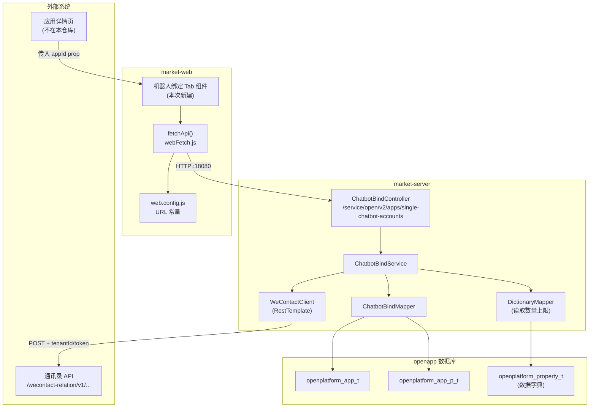
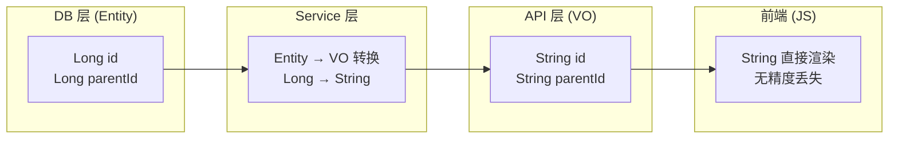
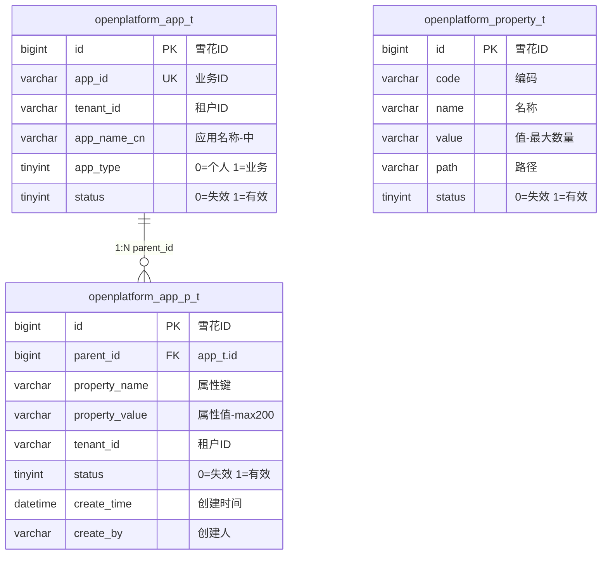
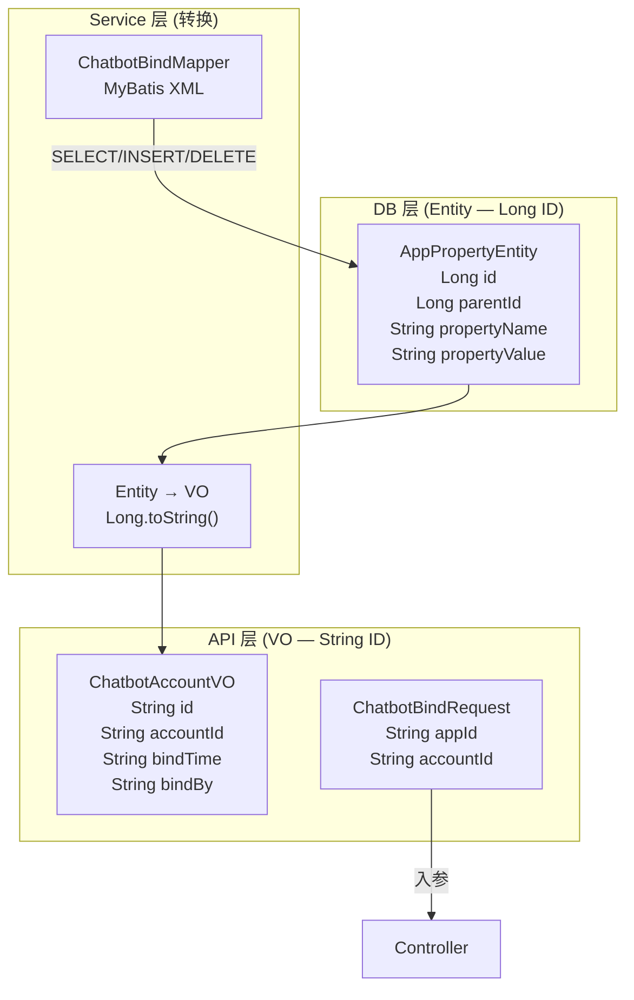
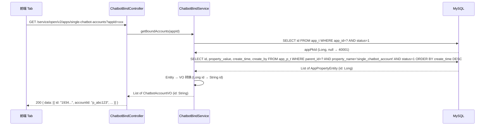
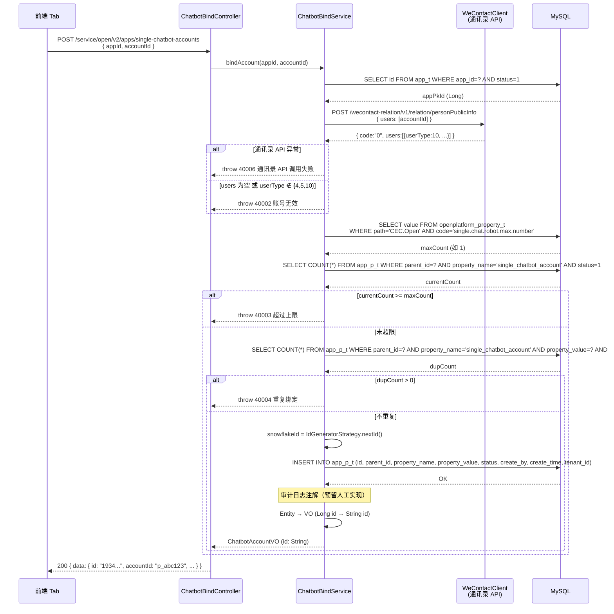
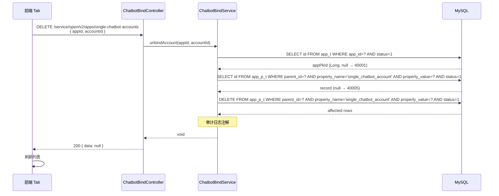
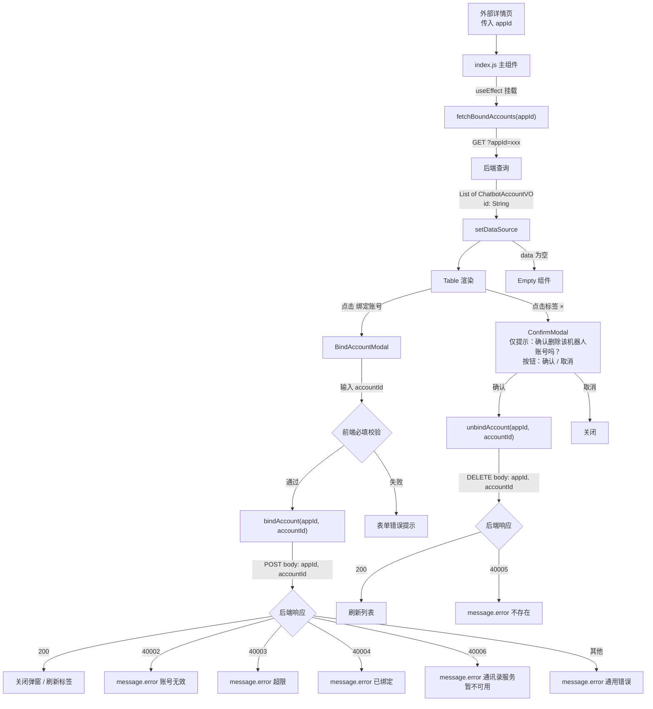

# Spec：应用绑定单聊机器人账号

> **版本**: v2.0  
> **日期**: 2026-06-22  
> **状态**: Draft  
> **范围**: market-server（后端 API）+ market-web（前端 Tab 组件）
>
> **v2.0 变更摘要**:
> - 机器人账号校验由本地正则（`p_` 前缀）改为**调用通讯录 API 远程校验**（userType ∈ {4,5,10}）
> - 绑定数量上限来源由 `lookup_classify_t / lookup_item_t` 改为 `openplatform_property_t`（path=`CEC.Open`, code=`single.chat.robot.max.number`，默认值=1）
> - 审计日志标记为**预留人工实现**（market-server 当前无 `@AuditLog`）
> - 雪花 ID：dev 环境 `DevIdGeneratorStrategy` 已实现；标准环境 `StandardIdGeneratorStrategy` 待实现
> - `AppPropertyEntity` 在 market-server 中新建，不复用 open-server 的 `OldAppProperty`
> - 前端布局由 Table 改为**动态标签流式布局**（flex-wrap，按字符宽度自动换行）
> - 新增错误码 40006（通讯录 API 调用失败）
> - 解绑二次确认提示语：「确认删除该机器人账号吗？」
> - `tenantId` 配置到 `application.yml`；`token` 由人工通过工具类获取

---

## 1. Scope

### 1.1 功能概述

在应用管理审批跳转的详情页（**该页面不在现有代码中，由外部系统集成**）内新增一个「机器人绑定」Tab，实现以下三个能力：

| 能力 | 说明 |
|------|------|
| **查询** | 获取当前应用已绑定的所有单聊机器人账号列表 |
| **绑定** | 为当前应用手动输入并绑定一个新的单聊机器人账号 |
| **解绑** | 从当前应用解除一个已绑定的单聊机器人账号 |

### 1.2 业务规则

| # | 规则 | 来源 |
|---|------|------|
| BR-1 | 一个应用可绑定的机器人账号数量上限由 `openplatform_property_t` 数据字典配置决定（path=`CEC.Open`, code=`single.chat.robot.max.number`，默认值=1），**服务端在绑定时校验** | 用户确认 |
| BR-2 | 每个绑定的机器人在 `openplatform_app_p_t` 中存储为**独立一行**记录 | 用户确认 |
| BR-3 | 存储方式：`parent_id` = 应用主键 `id`，`property_name` = `single_chatbot_account`，`property_value` = 账号 ID | 用户确认 |
| BR-4 | 解绑操作执行**硬删除**（DELETE FROM），通过 `app_id` + `accountId` 定位记录 | 用户确认 |
| BR-5 | 绑定/解绑操作通过**现有 AOP 注解机制**记录审计日志，开发者仅需在接口方法上添加注解 | 用户确认 |
| BR-6 | 权限控制：仅校验登录态（`@AuthRole`），不做细粒度角色校验 | 用户确认 |
| BR-7 | ~~机器人账号格式校验~~ 已改为**调用通讯录接口远程校验**（见 §2.6），不再做本地正则校验 | 用户确认 |
| BR-11 | 绑定时调用通讯录 API 获取账号信息，校验 `userType` ∈ {4=机器人, 5=业务助手, 10=个人助手}，其他类型返回 40002 | 用户确认 |
| BR-12 | 通讯录 API 请求体为 `{"users":["<accountId>"]}`，响应 `users` 为空列表时返回 40002 | 用户确认 |
| BR-13 | 通讯录 API 请求头需携带 `x-welink-tenantid` 和 `Authorization`，**tenantId 和 token 由运维人工获取并配置**，本系统不自动获取 | 用户确认 |
| BR-14 | 绑定数量上限从 `openplatform_property_t` 数据字典表读取（path=`CEC.Open`, code=`single.chat.robot.max.number`），不再依赖 lookup 表 | 用户确认 |
| BR-15 | 复用现有 `DictionaryMapper.selectByPathAndCode(path, code)` 读取数量上限，无需新建 Mapper | `[src/market-server/.../dictionary/mapper/DictionaryMapper.java:32]` |
| BR-8 | **前端不控制数量上限**，上限校验完全由服务端在绑定时负责 | 用户确认 |
| BR-9 | **DB 主键为雪花 ID（Long）**，返回前端时**必须转为 String** 防 JS 精度丢失 | 用户确认 |
| BR-10 | **DB Entity 与 API VO 严格分离**，DB Entity 用 `Long`，VO 用 `String` | 用户确认 |

### 1.3 不在范围内

- 应用详情页本身的路由和框架搭建（由外部系统集成）
- 机器人账号的创建/管理（由通讯录系统负责）
- 通讯录 API 本身的实现（由外部系统负责）
- `Authorization` token 的自动获取（由人工通过工具类获取）
- 审批流程相关的任何改动
- 前端对绑定数量上限的展示或控制
- 标准环境雪花 ID 生成代码（`StandardIdGeneratorStrategy.nextId()` 待实现）
- 审计日志 AOP 注解（market-server 当前无此能力，预留人工实现）
- `openplatform_property_t` 数据字典记录的新增（由人工实现，不在本次 Spec 范围）

### 1.4 系统上下文



---

## 2. Interface

### 2.1 ID 处理策略



**规则**:
- DB Entity（`AppPropertyEntity`）中 `id`、`parentId` 类型为 `Long`
- API VO（`ChatbotAccountVO`）中所有 ID 字段类型为 `String`
- Service 层负责 Entity → VO 转换，`Long.toString()` 序列化
- 雪花 ID 生成由 `IdGeneratorStrategy` 负责：dev 环境使用 `DevIdGeneratorStrategy`（已实现完整雪花算法）；标准生产环境 `StandardIdGeneratorStrategy` 骨架已存在但 `nextId()` 待实现 `[src/market-server/.../common/id/DevIdGeneratorStrategy.java:1-161]` `[src/market-server/.../common/id/StandardIdGeneratorStrategy.java:1-42]`

### 2.2 后端 API

三个接口统一路径：`/service/open/v2/apps/single-chatbot-accounts`

| # | Method | 参数位置 | 用途 |
|---|--------|----------|------|
| 1 | **GET** | QueryParam (`?appId=xxx`) | 查询已绑定列表 |
| 2 | **POST** | Body (`{ appId, accountId }`) | 绑定 |
| 3 | **DELETE** | Body (`{ appId, accountId }`) | 解绑 |

---

#### 2.2.1 查询已绑定账号列表

```
GET /service/open/v2/apps/single-chatbot-accounts?appId={appId}
```

**请求参数**:

| 参数 | 位置 | 类型 | 必填 | 说明 |
|------|------|------|------|------|
| `appId` | query | String | 是 | 应用业务 ID（`openplatform_app_t.app_id`） |

**响应** `ApiResponse<List<ChatbotAccountVO>>`:

```json
{
  "code": "200",
  "messageZh": "成功",
  "messageEn": "Success",
  "data": [
    {
      "id": "1934567890123456789",
      "accountId": "p_abc123",
      "bindTime": "2026-06-10 14:30:00",
      "bindBy": "userId_001"
    }
  ]
}
```

> `id` 为 `app_p_t.id` 的 String 形式（雪花 ID → String），防止 JS 精度丢失。

**处理逻辑**:
1. 通过 `app_id` 查询 `openplatform_app_t` 获取主键 `id`（不存在或 status=0 → 40001）
2. 查询 `openplatform_app_p_t` WHERE `parent_id` = {app主键id} AND `property_name` = 'single_chatbot_account' AND `status` = 1
3. 按 `create_time` DESC 排序
4. Entity → VO 转换（`Long` → `String`）

**错误码**:

| code | 含义 |
|------|------|
| 40001 | 应用不存在 |
| 40101 | 未登录 |

---

#### 2.2.2 绑定机器人账号

```
POST /service/open/v2/apps/single-chatbot-accounts
```

**请求体**:

```json
{
  "appId": "app001",
  "accountId": "p_abc123"
}
```

| 参数 | 类型 | 必填 | 校验规则 | 说明 |
|------|------|------|----------|------|
| `appId` | String | 是 | @NotBlank | 应用业务 ID |
| `accountId` | String | 是 | @NotBlank（后端通过通讯录 API 校验有效性） | 机器人账号 ID |

**响应** `ApiResponse<ChatbotAccountVO>`:

```json
{
  "code": "200",
  "messageZh": "绑定成功",
  "messageEn": "Bind successful",
  "data": {
    "id": "1934567890123456789",
    "accountId": "p_abc123",
    "bindTime": "2026-06-10 14:30:00",
    "bindBy": "userId_001"
  }
}
```

**处理逻辑**:
1. 通过 `app_id` 查询应用主键 `id`（不存在 → 40001）
2. 调用通讯录 API 校验 `accountId` 有效性（详见 §2.6）：
   - 请求 POST `/wecontact-relation/v1/relation/personPublicInfo?source=welink_sysi_open`
   - 请求头携带 `x-welink-tenantid` + `Authorization`（配置项，人工获取）
   - 响应 `users` 为空列表 → 40002
   - 响应 `users[0].userType` ∉ {4, 5, 10} → 40002
3. 查询 `openplatform_property_t`（path=`CEC.Open`, code=`single.chat.robot.max.number`）获取最大可绑定数量
4. 查询当前已绑定数量
5. 已绑定 >= 上限 → 40003
6. 重复检查（同 property_value 已存在且 status=1）→ 40004
7. 通过 `IdGeneratorStrategy.nextId()` 生成雪花 ID（dev 环境 `DevIdGeneratorStrategy` 已实现；标准环境 `StandardIdGeneratorStrategy` 预留人工实现）`[src/market-server/.../common/id/DevIdGeneratorStrategy.java:91]`
8. INSERT `openplatform_app_p_t`
9. Entity → VO 转换（`Long` → `String`）
10. 添加审计日志注解（**预留人工实现**，见附录 A-5）

**错误码**:

| code | 含义 |
|------|------|
| 40001 | 应用不存在 |
| 40002 | 账号无效（通讯录 API 未查到或 userType 不合法） |
| 40003 | 超过最大可绑定数量 |
| 40004 | 该账号已绑定（重复绑定） |
| 40006 | 通讯录 API 调用失败（网络超时/服务不可用） |
| 40101 | 未登录 |

---

#### 2.2.3 解绑机器人账号

```
DELETE /service/open/v2/apps/single-chatbot-accounts
```

**请求体**:

```json
{
  "appId": "app001",
  "accountId": "p_abc123"
}
```

| 参数 | 类型 | 必填 | 说明 |
|------|------|------|------|
| `appId` | String | 是 | 应用业务 ID |
| `accountId` | String | 是 | 机器人账号 ID |

**响应** `ApiResponse<Void>`:

```json
{
  "code": "200",
  "messageZh": "解绑成功",
  "messageEn": "Unbind successful",
  "data": null
}
```

**处理逻辑**:
1. 通过 `app_id` 查询应用主键 `id`（不存在 → 40001）
2. 查询 `openplatform_app_p_t` WHERE `parent_id` = ? AND `property_name` = 'single_chatbot_account' AND `property_value` = ? AND `status` = 1
3. 记录不存在 → 40005
4. 硬删除：`DELETE FROM openplatform_app_p_t WHERE parent_id = ? AND property_name = 'single_chatbot_account' AND property_value = ? AND status = 1`
5. 添加审计日志注解 #ASSUMED

**错误码**:

| code | 含义 |
|------|------|
| 40001 | 应用不存在 |
| 40005 | 绑定记录不存在（该应用未绑定此账号） |
| 40101 | 未登录 |

---

### 2.3 数据模型定义

#### 2.3.1 DB Entity（内部使用，Long 类型）

```java
// AppPropertyEntity.java — 对应 openplatform_app_p_t
public class AppPropertyEntity {
    private Long id;              // 雪花 ID (DB: BIGINT)
    private Long parentId;        // 应用主键 (DB: BIGINT)
    private String propertyName;  // 属性键
    private String propertyValue; // 属性值
    private String tenantId;      // 租户
    private Integer status;       // 0=失效 1=有效
    private Date createTime;
    private String createBy;
    private Date lastUpdateTime;
    private String lastUpdateBy;
}
```

#### 2.3.2 API VO（对外输出，ID 为 String）

```java
// ChatbotAccountVO.java — API 响应对象
public class ChatbotAccountVO {
    private String id;        // 雪花 ID → String（防 JS 精度丢失）
    private String accountId; // 机器人账号 ID (property_value)
    private String bindTime;  // 绑定时间 yyyy-MM-dd HH:mm:ss
    private String bindBy;    // 绑定操作人
}
```

#### 2.3.3 请求 DTO

```java
// ChatbotBindRequest.java — POST/DELETE 请求体
public class ChatbotBindRequest {
    @NotBlank
    private String appId;

    @NotBlank   // 后端通过通讯录 API 校验有效性，此处仅做非空校验
    private String accountId;
}
```

#### 2.3.4 Entity → VO 转换

```java
// Service 层内部转换
private ChatbotAccountVO toVO(AppPropertyEntity entity) {
    ChatbotAccountVO vo = new ChatbotAccountVO();
    vo.setId(String.valueOf(entity.getId()));           // Long → String
    vo.setAccountId(entity.getPropertyValue());
    vo.setBindTime(DateUtil.format(entity.getCreateTime(), "yyyy-MM-dd HH:mm:ss"));
    vo.setBindBy(entity.getCreateBy());
    return vo;
}
```

---

### 2.4 数量上限配置（openplatform_property_t 数据字典）

从已有数据字典表 `openplatform_property_t` 读取绑定数量上限，复用现有 `DictionaryMapper.selectByPathAndCode(path, code)` 方法 `[src/market-server/.../dictionary/mapper/DictionaryMapper.java:32]`。

| 字段 | 值 | 说明 |
|------|----|------|
| `id` | 雪花 ID（BIGINT，由 `IdGeneratorStrategy.nextId()` 生成） | 主键 |
| `path` | `CEC.Open` | 数据字典路径 |
| `code` | `single.chat.robot.max.number` | 最大可绑定单聊机器人数量编码 |
| `value` | `1`（默认值，运维可调整） | 最大数量，整数字符串 |

**读取方式**：

```java
// 注入已有 Mapper
@Autowired
private DictionaryMapper dictionaryMapper;

// 读取数量上限
DictionaryEntity entity = dictionaryMapper.selectByPathAndCode("CEC.Open", "single.chat.robot.max.number");
int maxCount = (entity != null && entity.getValue() != null) 
    ? Integer.parseInt(entity.getValue()) 
    : 1;  // 默认值：未配置时上限为 1
```

> **注意**：`openplatform_property_t` 对应 Entity 为 `DictionaryEntity` `[src/market-server/.../dictionary/entity/DictionaryEntity.java:18]`，**非 PropertyEntity**。主键 `id` 为雪花 ID。

> **数据字典记录新增由人工实现，不在本次 Spec 范围。**

---

### 2.5 前端

#### 2.5.1 组件结构

```
src/router/routeRedBlue/
└── app-chatbot-bindtab/               # 新建模块目录
    ├── index.js                       # 主组件（Tab 入口）
    ├── index.module.less              # 样式
    ├── constant.js                    # 列配置、校验规则、常量
    ├── thunk.js                       # API 调用函数
    └── components/
        └── BindAccountModal.js        # 绑定弹窗
```

#### 2.5.2 主组件行为（index.js）

**Props 接口**:

| Prop | 类型 | 必填 | 说明 |
|------|------|------|------|
| `appId` | String | 是 | 当前应用的业务 ID，由父页面传入 |

**页面布局**（动态标签流式布局，非表格）：

```
┌─────────────────────────────────────────────────────────────┐
│  机器人绑定                                                   │
├─────────────────────────────────────────────────────────────┤
│                                                             │
│  ┌──────────────────┐  ┌──────────────────┐  ┌──────────────────┐
│  │ p_abc123     [×] │  │ p_def456     [×] │  │ p_ghi789     [×] │
│  └──────────────────┘  └──────────────────┘  └──────────────────┘
│  ┌─────────────────────────────────────────────────────────────┐
│  │ p_very_long_robot_account_name_here              [×]        │
│  └─────────────────────────────────────────────────────────────┘
│  ┌──────────────────┐                                           │
│  │ ＋ 添加账号       │   ← 跟在最后一个标签后，超出行限制自动换行   │
│  └──────────────────┘                                           │
│                                                             │
└─────────────────────────────────────────────────────────────┘
```

**换行规则**（动态计算，非固定列数）：

| 规则 | 说明 |
|------|------|
| 每行字符上限 | 由容器宽度动态计算（`containerWidth / charWidth`），随窗口缩放实时变化 |
| 标签间距 | 每个标签之间间隔一个字符宽度（约 `1em`） |
| 多个标签同行 | 按顺序排列，累计字符数不超过行上限时保持在同一行 |
| 最后一个标签溢出 | 如果加上最后一个标签会超出行上限，则该标签另起一行 |
| 超长标签独占行 | 如果单个标签字符长度超过行上限，该标签独占一行（不截断） |
| 标签最小宽度 | 保证最小可读宽度（如 120px），避免过窄 |
| **「＋ 添加账号」按钮** | 作为最后一个 tag 跟在账号标签之后，超出行限制时自动另起一行 |
| **输入状态点击外部** | 当输入框处于激活状态时，点击页面任意非输入区域自动触发保存请求（失焦提交） |

**实现方式**：

```javascript
// 使用 CSS flex + flex-wrap 实现流式布局
// 每个标签宽度由内容决定（max-content），超出容器自动换行
<Tag style={{ marginBottom: 8, maxWidth: '100%' }}>
  {accountId} <CloseOutlined onClick={() => handleUnbind(accountId)} />
</Tag>
```

> **不使用 Ant Design `Table`**，改用 `Tag` + `flex-wrap` 容器实现动态标签流式布局。  
> 容器宽度变化时标签自动重排，无需监听 resize 事件。

**行为说明**:

1. **初始化**: 组件挂载 → 调用查询接口获取已绑定列表 → 渲染标签
2. **绑定流程**:
   - 点击「+ 绑定账号」→ 弹出 `BindAccountModal`
   - 前端必填校验
   - 确认 → 调用绑定接口 → 成功刷新标签列表
   - code=40002 → `message.error('账号无效')`
   - code=40003 → `message.error('已超过最大绑定数量')`
   - code=40004 → `message.error('该账号已绑定')`
   - code=40006 → `message.error('通讯录服务暂不可用')`
3. **解绑流程**:
   - 点击标签上的「×」→ `ConfirmModal` 弹出，仅展示提示语「确认删除该机器人账号吗？」
   - 按钮仅「确认」「取消」两个，无其他附加内容
   - 确认 → 调用解绑接口（body: `{ appId, accountId }`）→ 成功刷新标签列表
4. **空状态**: Ant Design `Empty` 组件

> **前端不获取、不展示数量上限**，完全依赖服务端返回的错误信息。  
> **前端不传递任何 DB 主键 ID**，仅使用 `appId`（业务 ID）和 `accountId`（账号 ID）操作。

#### 2.5.3 绑定弹窗（BindAccountModal.js）

**表单校验规则**:

| 规则 | 正则/条件 | 提示信息 |
|------|-----------|----------|
| 必填 | `required: true` | 请输入机器人账号 |

> **注意**：前端不再做格式校验（正则已移除），账号有效性由后端调用通讯录 API 校验。

#### 2.5.4 API 配置（web.config.js 新增）

```javascript
APP_CHATBOT_ACCOUNTS: '/market-web/service/open/v2/apps/single-chatbot-accounts',
```

> 三个接口共用同一 URL，通过 HTTP Method（GET/POST/DELETE）区分。

#### 2.5.5 thunk.js API 函数

| 函数名 | HTTP | 参数位置 | 调用 |
|--------|------|----------|------|
| `fetchBoundAccounts(appId)` | GET | QueryParam | `fetchApi(URL + '?appId=' + encodeURIComponent(appId))` |
| `bindAccount(appId, accountId)` | POST | Body | `fetchApi(URL, { method:'POST', body: JSON.stringify({ appId, accountId }) })` |
| `unbindAccount(appId, accountId)` | DELETE | Body | `fetchApi(URL, { method:'DELETE', body: JSON.stringify({ appId, accountId }) })` |

---

### 2.6 通讯录 API（外部系统，绑定校验用）

绑定时调用通讯录接口校验账号有效性、获取账号信息。

**接口详情**：

| 项 | 值 |
|---|---|
| Method | POST |
| URL | `/wecontact-relation/v1/relation/personPublicInfo?source=welink_sysi_open` |
| Content-Type | application/json |

**请求头**：

| Header | 值 | 来源 |
|--------|-----|------|
| `x-welink-tenantid` | `${wecontact.tenant-id}` | 配置到 `application.yml`，运维人工填入 |
| `Authorization` | `${token}` | 人工通过工具类获取（不持久化，运行时读取） |

**请求 Body**：

```json
{
  "users": ["p_robot"]
}
```

> `users` 为数组，本场景固定传入 1 个 accountId。

**响应 Body**：

```json
{
  "code": "0",
  "message": "OK",
  "users": [
    {
      "personAccount": "p_robot",
      "workId": "p_robot",
      "chineseName": "test机器人",
      "englishName": "test robot",
      "userType": 10,
      "userStatus": 3
    }
  ]
}
```

**userType 枚举**（仅以下值允许绑定）：

| userType | 含义 | 是否允许绑定 |
|:--------:|------|:----------:|
| 4 | 机器人 | ✅ |
| 5 | 业务助手 | ✅ |
| 10 | 个人助手 | ✅ |
| 其他 | — | ❌ 返回 40002 |

**校验逻辑**：

```
1. 调用通讯录 API
2. 网络异常/超时 → 40006（通讯录 API 调用失败）
3. code != "0" → 40006
4. users 为空列表 → 40002（账号无效）
5. users[0].userType ∉ {4, 5, 10} → 40002（类型不合法）
6. 校验通过 → 继续后续绑定流程
```

**配置示例**（application.yml）：

```yaml
wecontact:
  api-url: https://xxx.example.com   # 通讯录 API 基础 URL #ASSUMED
  tenant-id: <运维人工填入>           # x-welink-tenantid
```

> **`Authorization` token 不配置在 yml 中**，由人工通过独立工具类获取，运行时注入。

> **实现说明**：market-server 当前无 HTTP 客户端，需新增 `RestTemplateConfig`（参考 `[src/event-server/.../common/config/RestTemplateConfig.java:14-20]`）和 `WeContactClient`（参考 `[src/event-server/.../client/ApiServerClient.java:29-272]`）。

---

## 3. Constraints

### 3.1 技术约束

| # | 约束 | 来源 |
|---|------|------|
| C-1 | 后端 SQL 不使用 `SELECT *`，显式列出字段 | [app-version-approval-spec.md] |
| C-2 | JOIN ≤ 3 张表，子查询嵌套 ≤ 3 层 | [app-version-approval-spec.md] |
| C-3 | 响应统一使用 `ApiResponse<T>` 包装 | `[src/market-server/.../common/model/ApiResponse.java:1-155]` |
| C-4 | DB 主键为雪花 ID（Long/BigInt），dev 环境 `DevIdGeneratorStrategy` 已实现；标准环境 `StandardIdGeneratorStrategy` 待实现 | `[src/market-server/.../common/id/DevIdGeneratorStrategy.java:1-161]` |
| C-5 | **所有 ID 字段返回前端时必须转为 String**，防 JS Number 精度丢失（雪花 ID > 2^53） | 用户确认 |
| C-6 | **DB Entity 与 API VO 严格分离**：Entity 用 `Long`，VO 用 `String` | 用户确认 |
| C-7 | 安全注解 `@AuthRole` 标记所有 Controller 方法 | `[src/market-server/.../common/security/AuthRole.java:1-21]` |
| C-8 | 审计日志 **预留人工实现**（market-server 当前无 `@AuditLog` 注解，仅 open-server 有） | 用户确认 |
| C-9 | 前端 React 18 + Ant Design 4.x + CSS Modules (Less) | `[src/market-web/package.json]` |
| C-10 | 前端 HTTP 使用 `fetchApi()`，不使用 axios | `[src/market-web/src/utils/webFetch.js:1-36]` |
| C-11 | 前端状态使用 `useState`（页面级） | 现有代码模式 |
| C-12 | 时间格式：`yyyy-MM-dd HH:mm:ss`，时区 `Asia/Shanghai` | [app-version-approval-spec.md] |
| C-13 | 国际化：响应 messageZh/messageEn 双语 | 现有代码模式 |
| C-14 | DELETE 请求参数放 Body（非 QueryParam） | 用户确认 |
| C-15 | 前端不获取也不展示绑定数量上限 | 用户确认 |
| C-16 | 前端不传递任何 DB 主键 ID，仅使用业务 ID（appId）和账号 ID（accountId） | 用户确认 |
| C-17 | 后端调用通讯录 API 需使用 `RestTemplate`（market-server 当前无 HTTP 客户端，需新增 Bean + Client 类） | 用户确认 |
| C-18 | `tenantId` 配置到 `application.yml`；`token` 由人工通过工具类获取，不持久化到配置文件 | 用户确认 |
| C-19 | 绑定数量上限从 `openplatform_property_t`（path=`CEC.Open`, code=`single.chat.robot.max.number`）读取，复用 `DictionaryMapper.selectByPathAndCode()` | `[src/market-server/.../dictionary/mapper/DictionaryMapper.java:32]` |

### 3.2 数据约束

| # | 约束 | 说明 |
|---|------|------|
| D-1 | `property_value` VARCHAR(2000) ≥ 200 字符 accountId | [docs/app.sql:23-36] |
| D-2 | 同一应用下可存在多条 `single_chatbot_account` 记录 | EAV 模式 |
| D-3 | 解绑定位：`parent_id` + `property_name` + `property_value` + `status=1` | 业务规则 |
| D-4 | 绑定重复检查：同 D-3 条件 COUNT > 0 | 业务规则 |

---

## 4. Data

### 4.1 数据模型



**`app_p_t` 记录示例（本次功能）**:

| id (BIGINT) | parent_id (BIGINT) | property_name | property_value | status |
|---|---|---|---|---|
| 1934567890123456789 | 1934000000000000500 | single_chatbot_account | p_abc123 | 1 |
| 1934567890123456790 | 1934000000000000500 | single_chatbot_account | p_def456 | 1 |
| 1934567890123456791 | 1934000000000000500 | single_chatbot_account | p_ghi789 | 1 |

> DB 层 id/parent_id 均为雪花 Long；API 层返回时转为 String。

### 4.2 数据操作矩阵

| 操作 | 表 | SQL | 条件 |
|------|-----|-----|------|
| 查询已绑定列表 | `app_p_t` | SELECT | `parent_id`=?, `property_name`='single_chatbot_account', `status`=1 |
| 绑定（插入） | `app_p_t` | INSERT | 新行（id 由 IdGeneratorStrategy 生成） |
| 解绑（删除） | `app_p_t` | DELETE | `parent_id`=?, `property_name`='single_chatbot_account', `property_value`=?, `status`=1 |
| 重复检查 | `app_p_t` | SELECT COUNT | 同解绑条件 |
| 数量上限检查 | `app_p_t` | SELECT COUNT | `parent_id`=?, `property_name`='single_chatbot_account', `status`=1 |
| 查应用主键 | `app_t` | SELECT id | `app_id`=?, `status`=1 |
| 查最大数量 | `openplatform_property_t` | SELECT | `path`='CEC.Open', `code`='single.chat.robot.max.number'（复用 DictionaryMapper） |
| 校验账号有效性 | 外部通讯录 API | POST | `/wecontact-relation/v1/relation/personPublicInfo` |

### 4.3 对象层次关系



### 4.4 新增文件清单

#### 后端 (market-server)

```
modules/
└── chatbotbindtab/                          # 新模块（包名 #ASSUMED）
    ├── controller/
    │   └── ChatbotBindController.java       # 3 个接口
    ├── service/
    │   ├── ChatbotBindService.java          # 接口
    │   └── impl/ChatbotBindServiceImpl.java # 实现（含 Entity→VO 转换、通讯录 API 调用）
    ├── client/
    │   └── WeContactClient.java             # 通讯录 API 客户端（RestTemplate 调用）
    ├── mapper/
    │   └── ChatbotBindMapper.java           # MyBatis Mapper 接口
    ├── entity/
    │   └── AppPropertyEntity.java           # DB 实体（Long id，新建不复用 open-server）
    ├── dto/
    │   ├── ChatbotBindRequest.java          # 绑定/解绑请求 DTO
    │   └── WeContactRequest.java            # 通讯录 API 请求 DTO #ASSUMED
    └── vo/
        ├── ChatbotAccountVO.java            # 响应 VO（String id）
        └── WeContactResponse.java           # 通讯录 API 响应 VO #ASSUMED

common/
└── config/
    └── RestTemplateConfig.java              # RestTemplate Bean（参考 event-server）

resources/mapper/
└── chatbotbindtab/
    └── ChatbotBindMapper.xml                # SQL 映射
```

#### 前端 (market-web)

```
src/router/routeRedBlue/
└── app-chatbot-bindtab/
    ├── index.js
    ├── index.module.less
    ├── constant.js
    ├── thunk.js
    └── components/
        └── BindAccountModal.js
```

#### 配置变更

| 文件 | 变更 |
|------|------|
| `web.config.js` | 新增 1 个 URL 常量 |
| `application.yml` | 新增 `wecontact.api-url`、`wecontact.tenant-id` 配置项 |
| `openplatform_property_t`（运行时） | 新增数据字典记录（path=`CEC.Open`, code=`single.chat.robot.max.number`, value=`1`） |

---

## 5. Test Cases

### 5.1 后端接口测试

#### TC-01: 查询已绑定账号 — 正常

| 项 | 内容 |
|----|------|
| 前置 | 应用 A（app_id=app001）已绑定 2 个账号 |
| 操作 | `GET /service/open/v2/apps/single-chatbot-accounts?appId=app001` |
| 期望 | code=200，data 长度=2，id 字段为 String 类型（如 `"1934567890123456789"`），按 create_time DESC |

#### TC-02: 查询 — 应用不存在

| 项 | 内容 |
|----|------|
| 操作 | `GET /service/open/v2/apps/single-chatbot-accounts?appId=nonexistent` |
| 期望 | code=40001 |

#### TC-03: 查询 — 无绑定记录

| 项 | 内容 |
|----|------|
| 前置 | 应用 B 存在但未绑定 |
| 操作 | `GET /service/open/v2/apps/single-chatbot-accounts?appId=app002` |
| 期望 | code=200，data=[] |

#### TC-04: 绑定 — 正常

| 项 | 内容 |
|----|------|
| 前置 | 已绑定 2 个，上限=5 |
| 操作 | `POST /service/open/v2/apps/single-chatbot-accounts` body: `{"appId":"app001","accountId":"p_newbot001"}` |
| 期望 | code=200，data.id 为 String 类型，app_p_t 新增一行 |

#### TC-05: 绑定 — 通讯录 API 返回空 users

| 项 | 内容 |
|----|------|
| 前置 | 通讯录 API 返回 `{"code":"0","users":[]}` |
| 操作 | POST body: `{"appId":"app001","accountId":"nonexistent_account"}` |
| 期望 | code=40002（账号无效） |

#### TC-05b: 绑定 — 通讯录 API 返回不合法 userType

| 项 | 内容 |
|----|------|
| 前置 | 通讯录 API 返回 `{"code":"0","users":[{"userType":1}]}` |
| 操作 | POST body: `{"appId":"app001","accountId":"p_normaluser"}` |
| 期望 | code=40002（userType=1 不在 {4,5,10} 中） |

#### TC-06: 绑定 — 超过上限

| 项 | 内容 |
|----|------|
| 前置 | 已绑定 1 个，上限=1（默认值） |
| 操作 | POST body: `{"appId":"app001","accountId":"p_overflow"}` |
| 期望 | code=40003 |

#### TC-06c: 绑定 — 通讯录 API 调用失败

| 项 | 内容 |
|----|------|
| 前置 | 通讯录 API 网络超时 / 返回非 0 code |
| 操作 | POST body: `{"appId":"app001","accountId":"p_abc123"}` |
| 期望 | code=40006 |

#### TC-07: 绑定 — 重复

| 项 | 内容 |
|----|------|
| 前置 | 已绑定 p_abc123 |
| 操作 | POST body: `{"accountId":"p_abc123"}` |
| 期望 | code=40004 |

#### TC-08: 解绑 — 正常

| 项 | 内容 |
|----|------|
| 前置 | 应用 A 绑定了 p_abc123 |
| 操作 | `DELETE /service/open/v2/apps/single-chatbot-accounts` body: `{"appId":"app001","accountId":"p_abc123"}` |
| 期望 | code=200，对应行物理删除 |

#### TC-09: 解绑 — 记录不存在

| 项 | 内容 |
|----|------|
| 前置 | 应用 A 未绑定 p_nonexist |
| 操作 | `DELETE /service/open/v2/apps/single-chatbot-accounts` body: `{"appId":"app001","accountId":"p_nonexist"}` |
| 期望 | code=40005 |

#### TC-10: 解绑 — 应用不存在

| 项 | 内容 |
|----|------|
| 操作 | `DELETE /service/open/v2/apps/single-chatbot-accounts` body: `{"appId":"nonexistent","accountId":"p_abc123"}` |
| 期望 | code=40001 |

#### TC-11: 未登录

| 项 | 内容 |
|----|------|
| 前置 | 无登录态 |
| 操作 | 任意接口 |
| 期望 | HTTP 401 |

#### TC-12: ID 精度验证

| 项 | 内容 |
|----|------|
| 前置 | DB 中 app_p_t.id = 1934567890123456789 |
| 操作 | 查询接口返回 |
| 期望 | JSON 中 id 字段值为 `"1934567890123456789"`（String），非 `1934567890123456800`（Number 精度丢失） |

### 5.2 前端交互测试

#### TC-F01: 初始化加载

| 项 | 内容 |
|----|------|
| 操作 | 组件挂载，传入有效 appId |
| 期望 | 自动查询，标签流式渲染已绑定账号列表 |

#### TC-F02: 绑定 — 前端必填校验

| 项 | 内容 |
|----|------|
| 操作 | 不输入任何 accountId → 点击确认 |
| 期望 | 表单校验拦截（required），不发请求 |

#### TC-F02b: 绑定 — 服务端返回账号无效

| 项 | 内容 |
|----|------|
| 操作 | 输入合法字符串 → 提交 → 服务端返回 40002 |
| 期望 | `message.error('账号无效')` 提示 |

#### TC-F03: 绑定 — 服务端超限错误

| 项 | 内容 |
|----|------|
| 操作 | 提交合法 accountId，服务端返回 40003 |
| 期望 | `message.error` 提示超限 |

#### TC-F04: 绑定 — 服务端重复错误

| 项 | 内容 |
|----|------|
| 操作 | 提交已存在 accountId，服务端返回 40004 |
| 期望 | `message.error` 提示已绑定 |

#### TC-F05: 解绑 — 二次确认

| 项 | 内容 |
|----|------|
| 操作 | 点击标签上的「×」 |
| 期望 | 弹出 ConfirmModal，提示「确认删除该机器人账号吗？」→ 确认 → 调用解绑 → 刷新；取消 → 无操作 |

#### TC-F06: 空状态

| 项 | 内容 |
|----|------|
| 操作 | 无绑定记录时挂载 |
| 期望 | 显示 Empty 组件 |

---

## 附录 A: #ASSUMED 标记汇总

| # | 标记内容 | 需确认方 | 影响 |
|---|----------|----------|------|
| A-1 | ~~Lookup classify_code~~ 已替换为 `openplatform_property_t`（path=`CEC.Open`, code=`single.chat.robot.max.number`），需运维确认 | 运维 | 数据字典配置 |
| A-2 | 通讯录 API 基础 URL（`wecontact.api-url`） | 运维 | 外部系统地址 |
| A-3 | 审计日志注解（**预留人工实现**） | 开发 | 代码实现 |
| A-4 | 新模块包名 `chatbotbindtab` | 开发 | 代码组织 |
| A-5 | tenant_id 从应用记录继承 | 开发 | 多租户 |
| A-6 | 通讯录 API 读取失败降级策略（当前默认返回 40006） | 产品/开发 | 容错 |
| A-7 | 数量上限读不到配置时默认值 = 1 | 产品/运维 | 业务上限 |
| A-8 | `WeContactRequest` / `WeContactResponse` DTO 类名 | 开发 | 代码组织 |

---

## 附录 B: 时序图

### B.1 查询已绑定账号



### B.2 绑定机器人账号



### B.3 解绑机器人账号



---

## 附录 C: 组件交互流程


