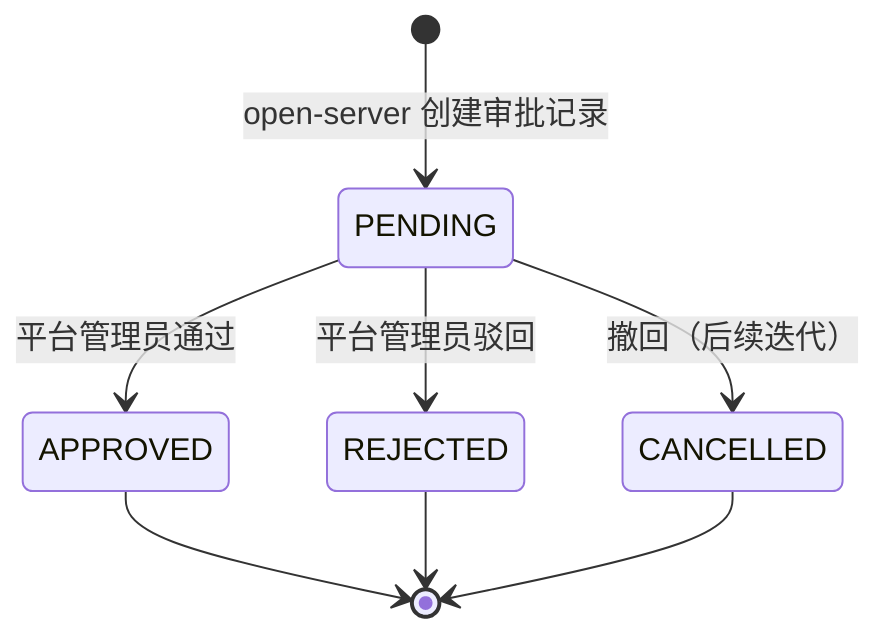

# market-server 通用审批管理模块 — 技术规格书（Spec）

> **版本**: v10.1 | **日期**: 2026-06-23 | **状态**: 待评审
>
> **效果图**: 浏览器打开 [`approval-page-mockup.html`](./approval-page-mockup.html) 可交互预览
>
> **v10.2 变更摘要**: 响应 VO 新增 `hisAppId` 字段（`openplatform_app_p_t.eamap_app_code`，用于前端展示），`appId` 恢复为 `openplatform_app_t.app_id`（用于路由跳转应用详情）；前端应用ID列 dataIndex 改为 hisAppId，查看按钮路由使用 appId；更新 §2.1 / §2.2.4 / §4.2
>
> **v10.1 变更摘要**: 待审批列表主查询由 3 表 JOIN 改为单表查询 approval_record_t，version/app 数据由 Service 层单表补查后整合；新增 AppEntity / AppVersionEntity / AppMapper / AppVersionMapper；AppVersionPublishHandler 通过/驳回时使用 AppVersionStatusEnum 更新版本状态；审批接口改为平台级单层审批（去除节点流转）；更新 §1.4 / §2.1 / §5.1 / §5.3 / §6.1
>
> **v10.0 变更摘要**: API URL 路径前缀由 `/approvals/` 重命名为 `/apps/`；端点名 `app-pending` → `pending`、`app-published` → `publish`、`app-process` → `approval`；同步更新 §2.1 / §2.2.3 / §5.1 / §6.1 / §6.3 中所有引用
>
> **v9.2 变更摘要**: 新增应用版本状态枚举 AppVersionStatusEnum（5 种状态）；已上架列表 SQL 简化为直接查询 version.status=4（APPROVED），不再 JOIN approval_record_t；计数 SQL 简化为 COUNT(DISTINCT)；新增审批操作与版本状态联动说明；更新测试用例 T-04~T-08
>
> **v9.1 变更摘要**: 标注为历史功能重建；API URL 重命名为自描述命名（app-pending / app-published / app-process）；待审批列表增加 businessType 过滤并按 last_update_time 排序；已上架列表完全重构为以 app_t 为主表 + 子查询取最新已上架版本
>
> **v9.0 变更摘要**: Tab 页拆分为待审批应用 + 已上架应用两个 Tab（单页面单菜单）；已审批列表改为已上架应用列表（按应用分组展示最新已上架版本）；查看按钮改为 window.open 新开标签页；同意和拒绝均使用 Modal.confirm 二次确认；新增审批状态机设计

---

## 1. Scope（范围）

### 1.1 模块职责

market-server 提供**通用审批管理**能力，供 open-server 发起的审批流程进行审批操作。模块设计为通用引擎 + 策略扩展，支持多种 businessType。

> **⚠️ 重建说明**：应用版本审批功能此前已在 market-server 中实现过（历史代码已不存在）。本次为从零重建，页面展示和功能与历史版本完全一致。

**包含**：
- 待审批列表查询（分页）
- 已上架应用列表查询（分页，按应用分组展示最新已上架版本）
- 审批操作（通过/驳回统一接口，按 action 字段区分）
- 策略模式：`ApprovalHandler` 处理审批通过/驳回后的业务副作用
- 策略模式：`BusinessDataResolver` 解析不同 businessType 的业务展示数据
- 前端审批管理页面（待审批应用页 + 已上架应用页）
- 审批状态机定义（状态流转图 + 生命周期说明）

**不包含**：
- 审批流创建/编排（由 open-server 负责）
- 审批流模板 CRUD（由 open-server 负责）
- 催办/转办/撤回（后续迭代）
- 审批详情页（后续迭代）
- 搜索/过滤功能（暂时不提供，后续迭代）
- 业务表 DDL（App / Version / Ability 表结构见 `[docs/market-server/app.sql]`）

### 1.2 菜单与页面策略

当前固定为**应用版本发布审批**类型，采用**单页面 + 双 Tab** 结构：

| 菜单项 | 路由 | 图标 | Tab | 说明 |
|--------|------|------|-----|------|
| 审批管理 | `/approval` | `AuditOutlined` | 待审批应用 | 展示 status=PENDING(0) 的审批记录 |
| — | — | — | 已上架应用 | 展示每个应用最新已上架（APPROVED）版本 |

后续新增其他审批类型时，每种类型创建独立的审批管理页面。

### 1.3 核心约束

| 约束 | 说明 | 来源 |
|------|------|------|
| 共享数据库 | market-server 与 open-server 连接同一 MySQL `openapp` 库 | `[src/market-server/resources/application.yml]` |
| Entity 同构 | ApprovalRecord / ApprovalLog / ApprovalFlow 与 open-server 字段完全一致 | `[src/open-server/.../approval/entity/]` |
| combinedNodes 快照 | ApprovalRecord 存储 combinedNodes JSON 快照，不依赖 flowId | `[src/open-server/.../approval/entity/ApprovalRecord.java:30]` |
| businessType 由 open-server 决定 | market-server 不硬编码 businessType，通过策略模式路由 | `#DESIGN_DECISION` |
| 操作人来源 | 从 `UserContextHolder` 获取（Web 端调用），非 IM 回调 | `[src/market-server/.../security/UserContextHolder.java]` |
| **业务表已定义** | app / version / ability / relation 表结构见 app.sql | `[docs/market-server/app.sql]` |
| **单应用单待审** | 每个应用同时只能有一个 PENDING 状态的审批记录，只有审批通过或驳回后才能发起新版本 | open-server 业务规则 |
| **SQL 禁止 SELECT \*** | 所有查询必须明确列出字段名 | `#SQL_RULE` |
| **连表不超过 3 张** | JOIN 查询不超过 3 张表（含子查询），子查询嵌套不超过 3 层 | `#SQL_RULE` |

### 1.4 SQL 编写规范

#### 规则 1：禁止 `SELECT *`

```sql
-- ✗ 禁止
SELECT * FROM openplatform_v2_approval_record_t

-- ✓ 正确
SELECT id, business_type, business_id, applicant_id, applicant_name,
       status, current_node, create_time, completed_at
FROM openplatform_v2_approval_record_t
```

#### 规则 2：连表 ≤ 3 张

```sql
-- ✓ 正确：主表 + 2 张关联表 = 3 张
SELECT r.id, r.business_type, v.version_code, a.app_name_cn
FROM openplatform_v2_approval_record_t r
LEFT JOIN openplatform_app_version_t v ON r.business_id = v.id
LEFT JOIN openplatform_app_t a ON v.app_id = a.id

-- ✗ 禁止：4 张表 JOIN
SELECT ... FROM r
LEFT JOIN v ON ...
LEFT JOIN a ON ...
LEFT JOIN openplatform_app_ability_relation_t acr ON ...  -- 超出限制
```

#### 规则 3：子查询嵌套 ≤ 3 层

```sql
-- ✓ 正确：2 层嵌套
SELECT ... FROM r WHERE r.business_id IN (
    SELECT v.id FROM openplatform_app_version_t v WHERE v.app_id IN (
        SELECT a.id FROM openplatform_app_t a WHERE a.app_name_cn LIKE '%keyword%'
    )
)
```

#### 多表数据获取策略

当需要展示的数据涉及多张表时，统一采用**单表查询 + Service 层整合**策略：

| 策略 | 说明 | 适用场景 |
|------|------|---------|
| **单表查询 + 代码整合** | 每张表独立查询返回实体对象，Service 层按业务关系整合为 VO | 待审批列表（record → version → app → 能力 → 第三方ID） |
| BusinessDataResolver | 不同 businessType 各自实现 Resolver，内部按规范查询 | 业务展示数据（后续迭代） |

> **设计决策**：禁止多表 JOIN 获取展示数据。每张表独立查询，Service 层负责结果整合。优势：SQL 简单可控、实体类型安全、易于调试和扩展。

---

## 2. Interface（接口）

### 2.1 后端 API（3 个端点）

**Base Path**: `/service/open/v2/apps`
**端口**: 18080
**认证**: `@AuthRole`（market-server 自定义权限注解）`[src/market-server/.../security/AuthRole.java]`

#### API-1: 待审批列表

```
GET /service/open/v2/apps/pending
```

**请求参数**：

| 参数 | 类型 | 必填 | 说明 |
|------|------|:----:|------|
| curPage | Integer | 否 | 当前页，默认 1 |
| pageSize | Integer | 否 | 每页条数，默认 10，前端可选 10/20/50 |

> **说明**：当前不提供搜索/过滤参数，后续迭代按需增加。

**响应**（`ApiResponse`）`[src/market-server/.../model/ApiResponse.java]`：

```json
{
  "code": "200",
  "messageZh": "成功",
  "messageEn": "Success",
  "data": [
    {
      "id": 1,
      "businessType": "app_version_publish",
      "businessId": "1001",
      "appId": "app_001",
      "hisAppId": "app_third_party_001",
      "appNameCn": "订单管理应用",
      "appNameEn": "Order Management App",
      "versionNo": "v2.1.0",
      "capabilityNames": "订单查询, 订单创建",
      "applicantId": "u001",
      "status": 0,
      "createTime": "2026-06-03 10:23:45"
    }
  ],
  "page": {
    "curPage": 1,
    "pageSize": 10,
    "total": 5,
    "totalPages": 1
  }
}
```

**响应字段说明**：

| 字段 | 类型 | 说明 |
|------|------|------|
| id | Long | 审批记录 ID |
| businessType | String | 业务类型 |
| businessId | String | 业务 ID（版本 ID） |
| appId | String | 应用 ID（`openplatform_app_t.app_id`，用于路由跳转应用详情） |
| hisAppId | String | 历史应用编码（从 `openplatform_app_p_t` 属性表 `eamap_app_code` 获取，Service 层补查，用于展示） |
| appNameCn | String | 应用中文名 |
| appNameEn | String | 应用英文名 |
| versionNo | String | 版本号 |
| capabilityNames | String | 应用关联能力中文名（逗号分隔），由 Service 层补查 `#CODE_ENRICH` |
| applicantId | String | 申请人账号 ID |
| status | Integer | 审批状态（待审批页固定为 0） |
| createTime | String | 申请时间 |

> **注意**：主查询通过 `business_type = 'app_version_publish'` 过滤，仅返回应用版本发布类型的审批记录。排序字段为 `last_update_time DESC`（非 create_time），确保最近更新过的记录排在前面。
>
> **v10.1 变更**：主查询改为单表查询 `approval_record_t`，version/app 数据由 Service 层单表补查后整合；appId 从属性表 `eamap_app_code` 获取；审批改为平台级单层通过。

**主查询 SQL**（单表：approval_record_t）：

```sql
SELECT
    r.id,
    r.business_type,
    r.business_id,
    r.applicant_id,
    r.status,
    r.current_node,
    r.create_time,
    r.last_update_time
FROM openplatform_v2_approval_record_t r
WHERE r.status = 0
  AND r.business_type = 'app_version_publish'
ORDER BY r.last_update_time DESC
LIMIT #{offset}, #{pageSize}
```

**能力名称补查**（Service 层 Java 代码，两步单表查询）：

```sql
-- 第一步：从版本属性表获取 abilityIds（逗号分隔的能力主键 ID）
SELECT property_value
FROM openplatform_app_version_p_t
WHERE parent_id = #{versionId}
  AND property_name = 'abilityIds'
```

```sql
-- 第二步：根据 ID 列表查能力中英文名（IN 查询，单表）
SELECT id, ability_name_cn, ability_name_en
FROM openplatform_ability_t
WHERE id IN (#{id1}, #{id2}, ...)
```

> **说明**：版本关联能力存储在 `openplatform_app_version_p_t`（版本属性表），`property_name = 'abilityIds'` 时 `property_value` 为逗号分隔的能力主键 ID（如 `"101,102,103"`）。Service 层解析字符串后批量查询 `openplatform_ability_t` 获取能力名称。

**第三方应用ID补查**（Service 层 Java 代码，从属性表获取）：

```sql
-- 根据应用主键 ID 查询第三方应用 ID（KV 属性表）
SELECT property_value
FROM openplatform_app_p_t
WHERE parent_id = #{appId}
  AND property_name = 'eamap_app_code'
```

> `[src/open-server/.../mapper/ApprovalRecordMapper.xml]`: `selectPendingList` 方法参考
>
> **注意**:
> - `appId` 响应字段 = `openplatform_app_p_t.property_value`（`property_name = 'eamap_app_code'`，即应用编码），由 Service 层补查
> - `appNameCn/appNameEn` = `openplatform_app_t.app_name_cn/app_name_en`，由 Service 层通过 version→app 链路补查
> - `versionNo` = `openplatform_app_version_t.version_code`，由 Service 层补查
> - `capabilityNames` = 从版本属性表 `openplatform_app_version_p_t` 获取 abilityIds，再查 `openplatform_ability_t`，由 Service 层补查

**计数 SQL**：

```sql
SELECT COUNT(*)
FROM openplatform_v2_approval_record_t
WHERE status = 0
  AND business_type = 'app_version_publish'
```

#### API-2: 已上架应用列表

```
GET /service/open/v2/apps/publish
```

> **v9.2 变更**: 已上架列表不再 JOIN `approval_record_t`，改为直接查询 `openplatform_app_version_t.status = 4`（APPROVED）的版本。子查询仅涉及 1 张表（version），外层 JOIN 2 张表（a + v + 子查询结果）。`applicantId` 由 Service 层根据 version_id 从 approval_record 补查。

**请求参数**：

| 参数 | 类型 | 必填 | 说明 |
|------|------|:----:|------|
| curPage | Integer | 否 | 当前页，默认 1 |
| pageSize | Integer | 否 | 每页条数，默认 10，前端可选 10/20/50 |

> **注意**: 无 status 筛选参数，固定查询有效(status=1)的业务应用(app_type=1)，按应用去重取最新已上架版本（version.status=4 即 APPROVED）。

**响应**：同 API-1 结构。

**响应字段说明**（与 API-1 的差异）：

| 字段 | 类型 | 说明 |
|------|------|------|
| id | Long | 应用主键 ID（`app_t.id`，非审批记录 ID） |
| appId | String | 应用 ID（直接从 `app_t.app_id` 获取，用于路由跳转） |
| hisAppId | String | 历史应用编码（从 `openplatform_app_p_t` 属性表 `eamap_app_code` 补查，用于展示） |
| appNameCn | String | 应用中文名（`app_t.app_name_cn`） |
| appNameEn | String | 应用英文名（`app_t.app_name_en`） |
| versionNo | String | 版本号（最新已上架版本的 `version_code`） |
| capabilityNames | String | 应用关联能力中文名（逗号分隔），由 Service 层补查 `#CODE_ENRICH` |
| applicantId | String | 申请人账号 ID（Service 层根据 version_id 查询 approval_record WHERE business_id = version_id AND status = 1 补查） |
| createTime | String | 应用创建时间（`app_t.create_time`） |

**主查询 SQL**（子查询取每个应用最新已上架版本，2 表 JOIN + 子查询）：

```sql
SELECT a.id AS app_pk_id, a.app_id, a.app_name_cn, a.app_name_en,
       a.create_time, a.last_update_time,
       v.id AS version_id, v.version_code
FROM openplatform_app_t a
INNER JOIN (
    SELECT v2.app_id, MAX(v2.version_code) AS max_version_code
    FROM openplatform_app_version_t v2
    WHERE v2.status = 4
    GROUP BY v2.app_id
) latest ON a.id = latest.app_id
INNER JOIN openplatform_app_version_t v 
  ON a.id = v.app_id AND v.version_code = latest.max_version_code
WHERE a.status = 1 AND a.app_type = 1
ORDER BY a.last_update_time DESC
LIMIT #{offset}, #{pageSize}
```

**SQL 合规验证**：

| 规则 | 结果 | 说明 |
|------|:----:|------|
| 无 SELECT * | ✓ | 所有字段明确列出 |
| JOIN ≤ 3 表 | ✓ | 外层: a + v + latest(子查询结果) = 2 JOIN；子查询: 仅 v2 = 1 表 |
| 子查询嵌套 ≤ 3 层 | ✓ | 仅 1 层 FROM 子查询 |

> **设计说明**：由于一个应用可能有多个已上架版本，使用子查询按 `app_id` 分组取 `MAX(version_code)` 确保每个应用只返回最新已上架版本。子查询仅过滤 `v2.status = 4`（APPROVED），不再依赖 approval_record_t。appId 从属性表 `eamap_app_code` 获取。外层通过 `INNER JOIN` 子查询结果和版本表精确匹配到该版本记录。

**Service 层补查**：

1. **申请人补查**：根据 `version_id` 查询 `approval_record_t` 获取 `applicant_id`（因为主查询以 app_t 为主表，不直接包含审批记录的申请人字段）
2. **能力名称补查**：同 API-1，从版本属性表获取 abilityIds，再查能力表

```sql
-- 申请人补查（根据版本ID查审批记录）
SELECT applicant_id
FROM openplatform_v2_approval_record_t
WHERE business_id = #{versionId}
  AND status = 1
  AND business_type = 'app_version_publish'
ORDER BY id DESC
LIMIT 1
```

```sql
-- 第一步：从版本属性表获取 abilityIds（逗号分隔的能力主键 ID）
SELECT property_value
FROM openplatform_app_version_p_t
WHERE parent_id = #{versionId}
  AND property_name = 'abilityIds'
```

```sql
-- 第二步：根据 ID 列表查能力中文名（IN 查询，单表）
SELECT ability_name_cn
FROM openplatform_ability_t
WHERE id IN (#{id1}, #{id2}, ...)
```

**计数 SQL**：

```sql
SELECT COUNT(DISTINCT v.app_id)
FROM openplatform_app_version_t v
INNER JOIN openplatform_app_t a ON v.app_id = a.id
WHERE v.status = 4 AND a.status = 1 AND a.app_type = 1
```

#### API-3: 审批操作（通过/驳回统一接口）

```
POST /service/open/v2/apps/approval
```

**请求 Body**：
```json
{
  "id": "123",
  "action": 0
}
```

| 字段 | 类型 | 必填 | 说明 |
|------|------|:----:|------|
| id | String | 是 | 审批记录 ID（Controller 接收 String，Service 层转换为 Long） |
| action | Integer | 是 | 0=通过（APPROVE）, 1=驳回（REJECT） |

**响应**：
```json
{
  "code": "200",
  "messageZh": "操作成功",
  "messageEn": "Operation successful",
  "data": null
}
```

**业务逻辑**（参考 `[src/open-server/.../engine/ApprovalEngine.java]` approve/reject 方法）：

```
1. 查询 ApprovalRecord by id
2. 校验 status == PENDING(0)，否则返回错误
3. 解析 combinedNodes JSON → List<ApprovalNodeDto>
4. 获取 currentNode 索引对应的节点
5. 校验操作人（UserContextHolder.getUserId()）== 节点 userId
6. 校验 action 值（0 或 1）
7. 插入 ApprovalLog（action=请求体 action）
8. 按 action 分支：
   ┌─ action=0（通过）:
   │    判断是否最后一个节点：
   │    - 是 → record.status = APPROVED(1), record.completedAt = now
   │           → handler.onApproved(record)   // 策略回调
   │    - 否 → record.currentNode += 1
   │    更新 ApprovalRecord
   │
   └─ action=1（驳回）:
        record.status = REJECTED(2), record.completedAt = now
        handler.onRejected(record)   // 策略回调
        更新 ApprovalRecord
```

**错误码**：

| code | messageZh | 场景 |
|------|-----------|------|
| 40001 | 审批记录不存在 | record 查询为空 |
| 40002 | 审批记录已处理，当前状态：{status} | status != PENDING |
| 40004 | 不支持的业务类型：{businessType} | handler 未注册 |
| 40005 | 无效的操作类型：{action} | action 不是 0 或 1 |

---

### 2.2 前端页面

#### 2.2.1 路由与菜单

**路由**: `src/router/index.tsx` `[src/market-web/router/index.tsx]`

```jsx
<Route path="approval" element={<Approval />} />
```

**菜单**: `src/components/Layout/index.js` `[src/market-web/components/Layout/index.js]`

单个菜单项：

```js
// menuItems 数组新增：
{ key: '/approval', icon: <AuditOutlined />, label: '审批管理' },
```

#### 2.2.2 页面结构

单模块，遵循 `routeRedBlue/` 目录约定 `[src/market-web/router/routeRedBlue/]`：

```
src/router/routeRedBlue/
└── approval/
    ├── index.js            # 页面主文件（Tabs + 表格 + 弹窗）
    ├── index.module.less   # CSS Modules 样式
    ├── constant.js         # 常量（API 配置 key, 操作枚举, 列定义）
    └── thunk.js            # API 调用封装（fetchApi + buildApiUrl）
```

> 参考模式：`[src/market-web/router/routeRedBlue/lookup-classify/]` 的文件结构

#### 2.2.3 API 配置

**`src/configs/web.config.js`** 新增 `[src/market-web/configs/web.config.js]`：

```js
// 审批管理
APPROVAL_PENDING_LIST: '/market-web/service/open/v2/apps/pending',
APPROVAL_PUBLISHED_LIST: '/market-web/service/open/v2/apps/publish',
APPROVAL_PROCESS: '/market-web/service/open/v2/apps/approval',
```

#### 2.2.4 页面设计

单页面 + Tabs 切换 + 表格 + 分页（无搜索栏，后续迭代按需增加）。

**Tab 切换**：
- **待审批应用**：显示 status=PENDING(0) 的记录
- **已上架应用**：显示每个应用最新已上架（APPROVED）版本

**待审批应用 Tab 表格列**：

| 列名 | 字段 | 宽度 | 渲染 |
|------|------|------|------|
| 应用名称 | appNameCn / appNameEn | 150px | 根据当前语言切换展示（中/英文）`#I18N_SWITCH` |
| 应用能力 | capabilityNames | 160px | 文本（逗号分隔，超长省略） |
| 版本号 | versionNo | 90px | 文本 |
| 应用ID | hisAppId | 120px | 文本（历史应用编码，从 `openplatform_app_p_t` 补查） |
| 申请账号 | applicantId | 100px | 文本（账号 ID） |
| 申请时间 | createTime | 155px | yyyy-MM-dd HH:mm:ss |
| 操作 | - | 180px | 按钮组（查看 + 同意 + 拒绝） |

**已上架应用 Tab 表格列**：

| 列名 | 字段 | 宽度 | 渲染 |
|------|------|------|------|
| 应用名称 | appNameCn / appNameEn | 150px | 根据当前语言切换展示（中/英文）`#I18N_SWITCH` |
| 应用能力 | capabilityNames | 160px | 文本（逗号分隔，超长省略） |
| 版本号 | versionNo | 90px | 文本 |
| 应用ID | hisAppId | 120px | 文本（历史应用编码，从 `openplatform_app_p_t` 补查） |
| 申请账号 | applicantId | 100px | 文本（账号 ID，Service 层从审批记录补查） |
| 创建时间 | createTime | 155px | yyyy-MM-dd HH:mm:ss（应用创建时间） |
| 操作 | - | 100px | 仅查看按钮 |

**操作按钮**：

| 按钮 | 待审批 Tab | 已上架 Tab | 行为 |
|------|:----------:|:----------:|------|
| 查看 | ✓ | ✓ | `window.open('/app-detail/' + record.appId, '_blank')` — 使用 `appId`（非 hisAppId）跳转应用详情 |
| 同意 | ✓ | — | `Modal.confirm` 二次确认 → 调用 process API（action=0）→ 成功后 `message.success('审批通过')` + `fetchData()` |
| 拒绝 | ✓ | — | `Modal.confirm` 二次确认 → 调用 process API（action=1）→ 成功后 `message.success('已拒绝')` + `fetchData()` |

**语言切换逻辑**：

```js
const renderAppName = (text, record) => {
  return currentLang === 'en' ? record.appNameEn : record.appNameCn;
};
```

**交互流程**：

```
同意操作:
  1. 点击"同意"按钮
  2. Modal.confirm 弹出确认框，展示应用名称、版本号、申请账号
  3. 用户确认 → 调用 thunk.processApproval({ id: record.id, action: 0 })
  4. 检查 result.code === '200'
  5. 成功 → message.success('审批通过') + fetchData() 刷新列表
  6. 失败 → message.error({ content: result?.messageZh || '操作失败' })
  7. 取消 → Modal 关闭，无操作

拒绝操作:
  1. 点击"拒绝"按钮
  2. Modal.confirm 弹出确认框，展示应用名称、版本号、申请账号
  3. 用户确认 → 调用 thunk.processApproval({ id: record.id, action: 1 })
  4. 检查 result.code === '200'
  5. 成功 → message.success('已拒绝') + fetchData() 刷新列表
  6. 失败 → message.error({ content: result?.messageZh || '操作失败' })
  7. 取消 → Modal 关闭，无操作

查看操作:
  1. 点击"查看"按钮
  2. window.open('/app-detail/' + record.appId, '_blank') 新开浏览器标签页
```

**关键代码模式**：

```js
// approval/thunk.js — API 调用
import { fetchApi, buildApiUrl } from '../../../utils/webFetch';
import { API_CONFIG } from './constant';

export const fetchPendingList = async (params = {}) => {
  try {
    const result = await fetchApi(API_CONFIG.PENDING_LIST, { method: 'GET', params });
    return result || {};
  } catch (err) { return {}; }
};

export const fetchPublishedList = async (params = {}) => {
  try {
    const result = await fetchApi(API_CONFIG.PUBLISHED_LIST, { method: 'GET', params });
    return result || {};
  } catch (err) { return {}; }
};

export const processApproval = async (data) => {
  try {
    return await fetchApi(API_CONFIG.PROCESS, {
      method: 'POST',
      body: JSON.stringify(data),
    }) || {};
  } catch (err) { return {}; }
};
```

```js
// approval/constant.js
export const API_CONFIG = {
  PENDING_LIST: 'APPROVAL_PENDING_LIST',
  PUBLISHED_LIST: 'APPROVAL_PUBLISHED_LIST',
  PROCESS: 'APPROVAL_PROCESS',
};

export const APPROVAL_ACTION = {
  APPROVE: 0,
  REJECT: 1,
};

export const PAGE_SIZE_OPTIONS = [
  { label: '10 条/页', value: 10 },
  { label: '20 条/页', value: 20 },
  { label: '50 条/页', value: 50 },
];

// 待审批 Tab 列定义
export const getPendingColumns = ({ renderAppName, renderAction }) => [
  { title: '应用名称', dataIndex: 'appNameCn', width: 150, render: renderAppName },
  { title: '应用能力', dataIndex: 'capabilityNames', width: 160, ellipsis: true },
  { title: '版本号', dataIndex: 'versionNo', width: 90 },
  { title: '应用ID', dataIndex: 'appId', width: 120 },
  { title: '申请账号', dataIndex: 'applicantId', width: 100 },
  { title: '申请时间', dataIndex: 'createTime', width: 155 },
  { title: '操作', width: 180, fixed: 'right', render: renderAction },
];

// 已上架 Tab 列定义
export const getPublishedColumns = ({ renderAppName, renderAction }) => [
  { title: '应用名称', dataIndex: 'appNameCn', width: 150, render: renderAppName },
  { title: '应用能力', dataIndex: 'capabilityNames', width: 160, ellipsis: true },
  { title: '版本号', dataIndex: 'versionNo', width: 90 },
  { title: '应用ID', dataIndex: 'appId', width: 120 },
  { title: '申请账号', dataIndex: 'applicantId', width: 100 },
  { title: '创建时间', dataIndex: 'createTime', width: 155 },
  { title: '操作', width: 100, fixed: 'right', render: renderAction },
];
```

```js
// approval/index.js — 状态管理
const [activeTab, setActiveTab] = useState('pending');
const [dataSource, setDataSource] = useState([]);
const [loading, setLoading] = useState(false);
const [pagination, setPagination] = useState({ curPage: 1, pageSize: 10, total: 0 });
const [currentLang, setCurrentLang] = useState(localStorage.getItem('lang') || 'zh');

// Tab 切换时重置分页并加载对应数据
const handleTabChange = (key) => {
  setActiveTab(key);
  setPagination({ curPage: 1, pageSize: 10, total: 0 });
};

// 根据 activeTab 调用不同 API
const fetchData = async () => {
  setLoading(true);
  const fetchFn = activeTab === 'pending' ? fetchPendingList : fetchPublishedList;
  const result = await fetchFn({ curPage: pagination.curPage, pageSize: pagination.pageSize });
  if (result.code === '200') {
    setDataSource(result.data || []);
    setPagination(prev => ({ ...prev, total: result.page?.total || 0 }));
  }
  setLoading(false);
};

// 事件处理
const handleView = (record) => {
  window.open('/app-detail/' + record.appId, '_blank');
};

const handleApprove = (record) => {
  Modal.confirm({
    title: '确认审批通过',
    content: `应用：${record.appNameCn}，版本：${record.versionNo}，申请账号：${record.applicantId}`,
    onOk: async () => {
      const result = await processApproval({ id: String(record.id), action: APPROVAL_ACTION.APPROVE });
      if (result.code === '200') {
        message.success('审批通过');
        fetchData();
      } else {
        message.error(result?.messageZh || '操作失败');
      }
    },
  });
};

const handleReject = (record) => {
  Modal.confirm({
    title: '确认审批拒绝',
    content: `应用：${record.appNameCn}，版本：${record.versionNo}，申请账号：${record.applicantId}`,
    okType: 'danger',
    onOk: async () => {
      const result = await processApproval({ id: String(record.id), action: APPROVAL_ACTION.REJECT });
      if (result.code === '200') {
        message.success('已拒绝');
        fetchData();
      } else {
        message.error(result?.messageZh || '操作失败');
      }
    },
  });
};
```

---

## 3. Constraints（约束）

### 3.1 后端技术约束

| 约束 | 值 |
|------|-----|
| 框架 | Spring Boot 3.4.6 |
| JDK | Java 21 |
| ORM | MyBatis（纯 XML Mapper，无注解 SQL） |
| 构建 | Maven |
| 端口 | 18080 |
| Context Path | `/market-server` |
| JSON | Jackson `[src/market-server/.../config/JacksonConfig.java]` — 时间格式 `yyyy-MM-dd HH:mm:ss`，时区 `Asia/Shanghai` |
| **SQL 规范** | 禁止 `SELECT *`；JOIN ≤ 3 张表；子查询嵌套 ≤ 3 层 |

### 3.2 前端技术约束

| 约束 | 值 |
|------|-----|
| 框架 | React 18.2.0 |
| UI 库 | Ant Design 4.24.16（v4，非 v5） |
| 语言 | JavaScript（非 TypeScript） |
| 样式 | CSS Modules + Less |
| HTTP | webFetch.js（原生 fetch 封装），`fetchApi()` + `buildApiUrl()` |
| 状态 | useState（页面级），无 Zustand |
| 国际化 | 硬编码中文文本，应用名称列按语言切换中/英文 |
| 路由 | react-router-dom v6 |

### 3.3 数据库约束

- 共享库：`openapp`（MySQL）
- 审批三表已由 open-server 创建：`openplatform_v2_approval_record_t` / `openplatform_v2_approval_log_t` / `openplatform_v2_approval_flow_t`
- market-server 只做 SELECT + UPDATE（不 INSERT 审批记录，不 CREATE 审批流）
- combinedNodes 字段为 JSON 快照，market-server 只读取不修改

---

## 4. Data（数据）

### 4.1 审批表结构（已有，open-server 创建）

> 以下来自 `[src/open-server/.../approval/entity/]` + `[docs/sql/01-init-schema.sql]`

#### openplatform_v2_approval_record_t

| 字段 | 类型 | 说明 |
|------|------|------|
| id | BIGINT AUTO_INCREMENT | 主键 |
| combined_nodes | JSON | 审批节点快照 `[{"type":"resource","userId":"u001","userName":"张三","order":1,"level":1}]` |
| business_type | VARCHAR(50) | 业务类型（如 `app_version_publish`） |
| business_id | VARCHAR(64) | 业务 ID |
| applicant_id | VARCHAR(64) | 申请人账号 ID |
| applicant_name | VARCHAR(100) | 申请人姓名 |
| status | TINYINT | 0=待审批, 1=已通过, 2=已驳回, 3=已撤回 |
| current_node | INT | 当前审批节点索引（从 0 开始） |
| create_time | DATETIME | 创建时间 |
| last_update_time | DATETIME | 最后更新时间 |
| create_by | VARCHAR(64) | 创建人 |
| last_update_by | VARCHAR(64) | 最后更新人 |
| completed_at | DATETIME | 完成时间 |

**索引**：
- `PRIMARY KEY (id)`
- `idx_business (business_type, business_id)` — 按业务查询
- `idx_status (status)` — 按状态查询
- `idx_applicant (applicant_id)` — 按申请人查询

#### openplatform_v2_approval_log_t

| 字段 | 类型 | 说明 |
|------|------|------|
| id | BIGINT AUTO_INCREMENT | 主键 |
| record_id | BIGINT | 关联审批记录 |
| node_index | INT | 审批节点索引 |
| level | VARCHAR | 审批层级 |
| operator_id | VARCHAR(64) | 操作人 ID |
| operator_name | VARCHAR(100) | 操作人姓名 |
| action | TINYINT | 0=通过, 1=驳回, 2=撤回, 3=转办, 4=催办 |
| comment | TEXT | 审批意见 |
| create_time | DATETIME | 操作时间 |

#### openplatform_v2_approval_flow_t

| 字段 | 类型 | 说明 |
|------|------|------|
| id | BIGINT AUTO_INCREMENT | 主键 |
| name_cn | VARCHAR(100) | 流程中文名 |
| name_en | VARCHAR(100) | 流程英文名 |
| code | VARCHAR(50) UNIQUE | 流程编码 |
| description_cn | VARCHAR(500) | 描述中文 |
| description_en | VARCHAR(500) | 描述英文 |
| nodes | JSON | 节点配置 |
| status | TINYINT | 0=禁用, 1=启用 |

### 4.2 业务表结构

> 以下 DDL 来自 `[docs/market-server/app.sql]`

#### openplatform_app_t（应用主表）

```sql
CREATE TABLE `openplatform_app_t` (
  `id` bigint(20) NOT NULL COMMENT '主键',
  `app_id` varchar(100) NOT NULL COMMENT '应用ID',
  `tenant_id` varchar(64) NOT NULL DEFAULT '' COMMENT '租户id',
  `icon_id` varchar(64) NOT NULL DEFAULT '' COMMENT '图标id',
  `app_name_cn` varchar(255) NOT NULL COMMENT '应用中文名',
  `app_name_en` varchar(255) NOT NULL COMMENT '应用英文名',
  `app_desc_cn` varchar(2000) NOT NULL DEFAULT '' COMMENT '应用中文描述',
  `app_desc_en` varchar(2000) NOT NULL DEFAULT '' COMMENT '应用英文描述',
  `app_type` tinyint(1) DEFAULT '0' COMMENT '应用类型：0-个人应用 1-业务应用',
  `app_sub_type` tinyint(10) DEFAULT NULL COMMENT '应用子类型',
  `status` tinyint DEFAULT '1' COMMENT '状态：0=失效, 1=有效',
  `create_by` varchar(100) DEFAULT NULL COMMENT '创建人',
  `create_time` datetime(3) DEFAULT CURRENT_TIMESTAMP(3) COMMENT '创建时间',
  `last_update_by` varchar(100) DEFAULT NULL COMMENT '最后更新人',
  `last_update_time` datetime(3) DEFAULT CURRENT_TIMESTAMP(3) ON UPDATE CURRENT_TIMESTAMP(3) COMMENT '最后更新时间',
  PRIMARY KEY (`id`),
  UNIQUE KEY `uniq_app_id` (`app_id`) USING BTREE,
  UNIQUE KEY `uniq_name_cn` (`app_name_cn`) USING BTREE,
  UNIQUE KEY `uniq_name_en` (`app_name_en`) USING BTREE
) ENGINE=InnoDB COMMENT='应用表';
```

#### openplatform_app_version_t（应用版本表）

```sql
CREATE TABLE `openplatform_app_version_t` (
  `id` bigint(20) NOT NULL COMMENT '主键',
  `app_id` bigint(20) NOT NULL COMMENT '应用主键id',
  `version_desc_cn` varchar(2000) DEFAULT NULL COMMENT '版本中文描述',
  `version_desc_en` varchar(2000) DEFAULT NULL COMMENT '版本英文描述',
  `version_code` varchar(100) NOT NULL COMMENT '版本号',
  `tenant_id` varchar(64) NOT NULL DEFAULT '' COMMENT '租户id',
  `status` tinyint DEFAULT '1' COMMENT '版本状态：1=草稿, 2=流程中(待审批), 3=驳回, 4=审批通过, 5=取消申请',
  `create_by` varchar(100) DEFAULT NULL COMMENT '创建人',
  `create_time` datetime(3) DEFAULT CURRENT_TIMESTAMP(3) COMMENT '创建时间',
  `last_update_by` varchar(100) DEFAULT NULL COMMENT '最后更新人',
  `last_update_time` datetime(3) DEFAULT CURRENT_TIMESTAMP(3) ON UPDATE CURRENT_TIMESTAMP(3) COMMENT '最后更新时间',
  PRIMARY KEY (`id`),
  KEY `idx_app_id` (`app_id`) USING BTREE
) ENGINE=InnoDB COMMENT='应用版本表';
```

#### openplatform_ability_t（能力表）

```sql
CREATE TABLE `openplatform_ability_t` (
  `id` bigint(20) NOT NULL COMMENT '主键',
  `ability_name_cn` varchar(255) NOT NULL COMMENT '能力中文名',
  `ability_name_en` varchar(255) NOT NULL COMMENT '能力英文名',
  `ability_desc_cn` varchar(2000) NOT NULL DEFAULT '' COMMENT '能力中文描述',
  `ability_desc_en` varchar(2000) NOT NULL DEFAULT '' COMMENT '能力英文描述',
  `ability_type` TINYINT(1) NOT NULL DEFAULT '0' COMMENT '能力类型',
  `order_num` int(11) NOT NULL COMMENT '序号',
  `status` tinyint DEFAULT '1' COMMENT '状态：0=失效, 1=有效',
  `create_by` varchar(100) DEFAULT NULL COMMENT '创建人',
  `create_time` datetime(3) DEFAULT CURRENT_TIMESTAMP(3) COMMENT '创建时间',
  `last_update_by` varchar(100) DEFAULT NULL COMMENT '最后更新人',
  `last_update_time` datetime(3) DEFAULT CURRENT_TIMESTAMP(3) ON UPDATE CURRENT_TIMESTAMP(3) COMMENT '最后更新时间',
  PRIMARY KEY (`id`),
  KEY `idx_ability_type` (`ability_type`) USING BTREE
) ENGINE=InnoDB COMMENT='能力表';
```

#### openplatform_app_ability_relation_t（应用能力关联表）

```sql
CREATE TABLE `openplatform_app_ability_relation_t` (
  `id` bigint(20) NOT NULL COMMENT '主键',
  `app_id` bigint(20) NOT NULL COMMENT '应用主键id',
  `ability_id` bigint(20) NOT NULL COMMENT '能力主键id',
  `ability_type` tinyint(1) NOT NULL DEFAULT '0' COMMENT '能力类型',
  `tenant_id` varchar(64) NOT NULL DEFAULT '' COMMENT '租户id',
  `status` tinyint DEFAULT '1' COMMENT '状态：0=失效, 1=有效',
  `create_by` varchar(100) DEFAULT NULL COMMENT '创建人',
  `create_time` datetime(3) DEFAULT CURRENT_TIMESTAMP(3) COMMENT '创建时间',
  `last_update_by` varchar(100) DEFAULT NULL COMMENT '最后更新人',
  `last_update_time` datetime(3) DEFAULT CURRENT_TIMESTAMP(3) ON UPDATE CURRENT_TIMESTAMP(3) COMMENT '最后更新时间',
  PRIMARY KEY (`id`),
  UNIQUE KEY `uniq_app_ability_id` (`app_id`,`ability_id`) USING BTREE,
  KEY `idx_app_id` (`app_id`) USING BTREE
) ENGINE=InnoDB COMMENT='应用能力关联表';
```

#### openplatform_app_p_t（应用属性表 — KV 结构）

```sql
CREATE TABLE `openplatform_app_p_t` (
  `id` bigint(20) NOT NULL COMMENT '主键',
  `parent_id` bigint(20) NOT NULL COMMENT '应用主键ID',
  `property_name` varchar(255) NOT NULL COMMENT '属性名',
  `property_value` varchar(2000) NOT NULL DEFAULT '' COMMENT '属性值',
  `tenant_id` varchar(64) NOT NULL DEFAULT '' COMMENT '租户id',
  `status` tinyint DEFAULT '1' COMMENT '状态：0=失效, 1=有效',
  `create_by` varchar(100) DEFAULT NULL COMMENT '创建人',
  `create_time` datetime(3) DEFAULT CURRENT_TIMESTAMP(3) COMMENT '创建时间',
  `last_update_by` varchar(100) DEFAULT NULL COMMENT '最后更新人',
  `last_update_time` datetime(3) DEFAULT CURRENT_TIMESTAMP(3) ON UPDATE CURRENT_TIMESTAMP(3) COMMENT '最后更新时间',
  PRIMARY KEY (`id`),
  KEY `idx_parent_id` (`parent_id`) USING BTREE
) ENGINE=InnoDB COMMENT='应用属性表';
```

#### openplatform_app_version_p_t（版本属性表 — KV 结构）

```sql
CREATE TABLE `openplatform_app_version_p_t` (
  `id` bigint(20) NOT NULL COMMENT '主键',
  `parent_id` bigint(20) NOT NULL COMMENT '版本主键ID',
  `property_name` varchar(255) DEFAULT NULL COMMENT '属性名',
  `property_value` varchar(2000) NOT NULL DEFAULT '' COMMENT '属性值',
  `tenant_id` varchar(64) NOT NULL DEFAULT '' COMMENT '租户id',
  `status` tinyint DEFAULT '1' COMMENT '状态：0=失效, 1=有效',
  `create_by` varchar(100) DEFAULT NULL COMMENT '创建人',
  `create_time` datetime(3) DEFAULT CURRENT_TIMESTAMP(3) COMMENT '创建时间',
  `last_update_by` varchar(100) DEFAULT NULL COMMENT '最后更新人',
  `last_update_time` datetime(3) DEFAULT CURRENT_TIMESTAMP(3) ON UPDATE CURRENT_TIMESTAMP(3) COMMENT '最后更新时间',
  PRIMARY KEY (`id`),
  KEY `idx_parent_id` (`parent_id`) USING BTREE
) ENGINE=InnoDB COMMENT='应用版本属性表';
```

> **关键说明**：
> - `openplatform_app_p_t` 为 KV 属性表，应用编码通过 `property_name = 'eamap_app_code'` 获取
> - `openplatform_app_version_p_t` 为版本 KV 属性表，能力 ID 列表通过 `property_name = 'abilityIds'` 获取（`property_value` 为逗号分隔的能力主键 ID）
> - `openplatform_app_ability_relation_t.app_id` 关联的是 `openplatform_app_t.id`（主键），不是 `app_id` 字段
> - **待审批列表**：响应 VO 中 `appId` = `openplatform_app_t.app_id`（Service 层通过 version→app 补查），`hisAppId` = `openplatform_app_p_t.property_value`（`property_name = 'eamap_app_code'`，Service 层补查）
> - **已上架列表**：响应 VO 中 `appId` = `openplatform_app_t.app_id`（直接从主表获取），`hisAppId` = `openplatform_app_p_t.property_value`（`property_name = 'eamap_app_code'`，Service 层补查）
> - **查看跳转**：前端查看按钮路由拼接使用 `appId`（非 `hisAppId`）
> - 响应 VO 中的 `versionNo` 对应数据库字段 `openplatform_app_version_t.version_code`
> - **已上架列表设计要点**：主表为 `openplatform_app_t`（筛选 status=1, app_type=1），通过子查询取每个应用最新已上架版本（version.status=4 即 APPROVED，MAX(version_code)），appId 从属性表 `eamap_app_code` 补查，applicantId 由 Service 层从 approval_record 补查
> - **版本状态枚举**：`openplatform_app_version_t.status` 使用 `AppVersionStatusEnum`（1=草稿, 2=流程中, 3=驳回, 4=审批通过, 5=取消申请），详见 5.7 节

---

## 5. Architecture（架构设计）

### 5.1 后端架构（策略模式）

```
ApprovalController（3 个端点：pending / publish / approval）
    │
    ▼
ApprovalServiceImpl（流程编排）
    │
    ├─ 待审批列表:
    │    ├─ 1. 单表查 approval_record_t（按 business_type + status 过滤）
    │    ├─ 2. 单表查 app_version_t by versionId → version_code, app_id
    │    ├─ 3. 单表查 app_t by appPkId → app_name_cn, app_name_en
    │    ├─ 4. 单表查 app_p_t → eamap_app_code
    │    ├─ 5. 单表查 app_version_p_t → abilityIds → 查 ability_t → 能力名称
    │    └─ 6. 整合为 ApprovalListVo
    │
    ├─ 已上架列表（app_t 主表 + 子查询取 MAX(version_code) WHERE v.status=4）
    │
    └─ 审批操作（process 统一入口）:
         ├─ 状态/权限校验
         ├─ 解析 combinedNodes
         ├─ 插入 ApprovalLog
         ├─ 更新 ApprovalRecord（状态/节点推进）
         └─ 策略路由 ──→ ApprovalHandlerFactory
                               │
                     ┌─────────┼──────────┐
                     ▼         ▼          ▼
             AppVersion   ApiPermission  EventPermission ...
             PublishHandler ApplyHandler  ApplyHandler
                     │         │          │
                     ▼         ▼          ▼
               版本状态更新   subscription  subscription
             (AppVersionStatusEnum.APPROVED/REJECTED)
```

### 5.2 核心接口设计

#### ApprovalHandler（策略接口）

```java
public interface ApprovalHandler {
    /** 返回该 Handler 支持的 businessType */
    String getBusinessType();

    /** 审批最终通过后的业务副作用 */
    void onApproved(ApprovalRecord record);

    /** 审批驳回后的业务副作用 */
    void onRejected(ApprovalRecord record);
}
```

#### ApprovalHandlerFactory（策略工厂）

```java
@Component
public class ApprovalHandlerFactory {
    private final List<ApprovalHandler> handlers;
    private final Map<String, ApprovalHandler> handlerMap = new HashMap<>();

    @PostConstruct
    public void init() {
        for (ApprovalHandler handler : handlers) {
            handlerMap.put(handler.getBusinessType(), handler);
        }
    }

    public ApprovalHandler getHandler(String businessType) {
        return handlerMap.get(businessType);
    }
}
```

#### BusinessDataResolver（业务数据解析器）

```java
public interface BusinessDataResolver {
    /** 返回支持的 businessType */
    String getBusinessType();

    /**
     * 解析业务展示数据
     *
     * <p>返回业务相关展示字段（应用中英文名、版本号、应用ID、能力名称等）。
     * 注意：内部查询需遵守 SQL 规范（禁止 SELECT *，JOIN ≤ 3 表）</p>
     *
     * @param businessId 业务 ID
     * @return 业务展示数据 Map
     */
    Map<String, Object> resolveBusinessData(String businessId);

    /** 返回 businessType 的中文名称 */
    String getBusinessTypeName();
}
```

#### BusinessDataResolverFactory

```java
@Component
public class BusinessDataResolverFactory {
    private final List<BusinessDataResolver> resolvers;
    private final Map<String, BusinessDataResolver> resolverMap = new HashMap<>();

    @PostConstruct
    public void init() {
        for (BusinessDataResolver resolver : resolvers) {
            resolverMap.put(resolver.getBusinessType(), resolver);
        }
    }

    public BusinessDataResolver getResolver(String businessType) {
        return resolverMap.get(businessType);
    }
}
```

### 5.3 ApprovalEngine（简化版）

参考 `[src/open-server/.../engine/ApprovalEngine.java]`，market-server 仅保留：

| 方法 | 说明 | 对应 open-server |
|------|------|-----------------|
| `process(recordId, action)` | 统一审批操作（通过/驳回） | `approve()` + `reject()` 合并 |

**不包含**（open-server 有但 market-server 不需要）：
- `composeApprovalNodes()` — 审批流由 open-server 创建
- `createApproval()` — 审批记录由 open-server 发起
- `cancel()` — 撤回功能后续迭代
- `transfer()` — 转办功能后续迭代

**process 方法伪代码**：

```java
@Transactional(rollbackFor = Exception.class)
public void process(Long recordId, int action) {
    // 1. 查询记录
    ApprovalRecord record = recordMapper.selectById(recordId);
    if (record == null) throw new BizException(40001, "审批记录不存在");

    // 2. 状态校验
    if (record.getStatus() != STATUS_PENDING) {
        throw new BizException(40002, "审批记录已处理，当前状态：" + record.getStatus());
    }

    // 3. 获取策略 handler
    ApprovalHandler handler = handlerFactory.getHandler(record.getBusinessType());
    if (handler == null) {
        throw new BizException(40004, "不支持的业务类型：" + record.getBusinessType());
    }

    // 4. 插入日志（level 固定为 "global"）
    insertLog(record, action);

    // 5. 按 action 分支处理（平台级单层审批，无节点流转）
    Date now = new Date();
    if (action == ACTION_APPROVE) {
        record.setStatus(STATUS_APPROVED);
        record.setCompletedAt(now);
        recordMapper.update(record);
        handler.onApproved(record);  // → 更新 version.status = AppVersionStatusEnum.APPROVED(4)
    } else if (action == ACTION_REJECT) {
        record.setStatus(STATUS_REJECTED);
        record.setCompletedAt(now);
        recordMapper.update(record);
        handler.onRejected(record);  // → 更新 version.status = AppVersionStatusEnum.REJECTED(3)
    } else {
        throw new BizException(40005, "无效的操作类型：" + action);
    }
}
```

**版本状态联动**（`AppVersionPublishHandler`）：

```java
@Override
public void onApproved(ApprovalRecord record) {
    // businessId = version_t.id
    Long versionId = Long.parseLong(record.getBusinessId());
    appVersionMapper.updateStatus(versionId, AppVersionStatusEnum.APPROVED.getValue());
}

@Override
public void onRejected(ApprovalRecord record) {
    Long versionId = Long.parseLong(record.getBusinessId());
    appVersionMapper.updateStatus(versionId, AppVersionStatusEnum.REJECTED.getValue());
}
```

> **枚举引用**：`AppVersionStatusEnum` 定义在 `approval/constant/AppVersionStatusEnum.java`，已存在。
> - `APPROVED(4)` — 审批通过
> - `REJECTED(3)` — 审批驳回

### 5.4 常量定义

参考 `[src/open-server/.../engine/ApprovalEngine.java]` 内部枚举：

```java
// 状态
public static final int STATUS_PENDING = 0;
public static final int STATUS_APPROVED = 1;
public static final int STATUS_REJECTED = 2;
public static final int STATUS_CANCELLED = 3;

// 操作
public static final int ACTION_APPROVE = 0;
public static final int ACTION_REJECT = 1;
public static final int ACTION_CANCEL = 2;
public static final int ACTION_TRANSFER = 3;
public static final int ACTION_URGE = 4;
```

### 5.5 扩展方式

新增 businessType 审批支持，只需：

1. 实现 `ApprovalHandler` 接口 + `@Component`
2. 实现 `BusinessDataResolver` 接口 + `@Component`
3. 工厂自动注册，Controller / Service / Engine 无需修改

新增审批类型菜单页：每种类型独立页面，独立路由，独立菜单项。

### 5.6 审批状态机

#### 状态流转图



#### 状态定义

| 状态 | 值 | 说明 | 终态? |
|------|:--:|------|:-----:|
| PENDING | 0 | 等待平台管理员处理 | 否 |
| APPROVED | 1 | 平台管理员审批通过 | 是 |
| REJECTED | 2 | 平台管理员驳回，流程终止 | 是 |
| CANCELLED | 3 | 预留，market-server 暂未实现 | 是 |

#### 状态转移条件

| 转移 | 触发条件 | 执行方 | 副作用 |
|------|---------|--------|--------|
| `[*] → PENDING` | 开发者提交版本发布审批 | open-server `ApprovalEngine.createApproval()` | 创建 ApprovalRecord，status=0 |
| `PENDING → APPROVED` | 平台管理员审批通过 | market-server `ApprovalEngine.process()` | status=1，completedAt=now，`handler.onApproved()` |
| `PENDING → REJECTED` | 平台管理员驳回 | market-server `ApprovalEngine.process()` | status=2，completedAt=now，`handler.onRejected()` |
| `PENDING → CANCELLED` | 撤回（后续迭代） | — | 暂未实现 |

#### 审批生命周期

```
开发者在 open-server 创建应用版本
    │
    ▼
提交版本发布审批申请 (open-server)
    │
    ▼
创建 PENDING 审批记录 (open-server ApprovalEngine.createApproval)
    │  ├── 解析审批流节点 → combinedNodes JSON 快照
    │  └── status = PENDING(0), currentNode = 0
    │
    ▼
管理员在 market-server 查看待审批列表
    │
    ├── 通过 ──→ APPROVED(1)
    │       ├── handler.onApproved(record)  // 策略回调：更新版本状态为已上架
    │       └── 应用进入已上架应用列表
    │
    └── 驳回 ──→ REJECTED(2)
            ├── handler.onRejected(record)  // 策略回调：更新版本状态为已驳回
            └── 应用仍展示在已上架列表（如有历史已上架版本）
```

> **说明**：market-server 仅负责审批操作（process），不负责审批记录创建和流程编排（由 open-server 负责）。

#### 审批操作与版本状态联动

```
开发者创建版本 → version.status = DRAFT(1)
提交审批申请 → version.status = IN_PROCESS(2), 创建 PENDING 审批记录
审批通过 → version.status = APPROVED(4) [handler.onApproved]
审批驳回 → version.status = REJECTED(3) [handler.onRejected]
取消申请 → version.status = CANCELLED(5) [后续迭代]
```

> **说明**：`openplatform_app_version_t.status` 为版本自身状态，与 `openplatform_v2_approval_record_t.status`（审批记录状态）是两套独立的状态体系。已上架列表查询使用版本状态（`v.status = 4`），待审批列表查询使用审批记录状态（`r.status = 0`）。

### 5.7 应用版本状态枚举

```java
public enum AppVersionStatusEnum {
    DRAFT(1, "草稿"),
    IN_PROCESS(2, "流程中（待审批）"),
    REJECTED(3, "驳回"),
    APPROVED(4, "审批通过"),
    CANCELLED(5, "取消申请");

    private final int value;
    private final String description;
}
```

| 状态 | 值 | 说明 | 触发时机 |
|------|:--:|------|---------|
| DRAFT | 1 | 草稿，版本刚创建 | 开发者在 open-server 创建新版本 |
| IN_PROCESS | 2 | 流程中（待审批） | 开发者提交审批申请，open-server 更新版本状态 |
| REJECTED | 3 | 驳回 | market-server handler.onRejected() 回调 |
| APPROVED | 4 | 审批通过 | market-server handler.onApproved() 回调 |
| CANCELLED | 5 | 取消申请 | 后续迭代（撤回功能） |

> **注意**：此枚举定义在 market-server 的 `approval/constant/AppVersionStatusEnum.java` 中，用于已上架列表 SQL 过滤（`WHERE v2.status = 4`）和 Handler 回调中更新版本状态。

---

## 6. File Manifest（文件清单）

### 6.1 后端文件清单

> 路径前缀：`market-server/src/main/java/com/xxx/it/works/wecode/v2/modules/`

**已有文件（18 个，无需修改）**：

| # | 文件路径 | 说明 |
|:-:|---------|------|
| 1 | `approval/controller/ApprovalController.java` | 3 个端点（pending, publish, approval） |
| 2 | `approval/service/ApprovalService.java` | 接口 |
| 3 | `approval/engine/ApprovalEngine.java` | 简化版审批引擎（process 统一方法） |
| 4 | `approval/handler/ApprovalHandler.java` | 策略接口 |
| 5 | `approval/handler/ApprovalHandlerFactory.java` | 策略工厂 |
| 6 | `approval/handler/AppVersionPublishHandler.java` | 应用版本审批 handler（待补充版本状态更新逻辑） |
| 7 | `approval/entity/ApprovalRecord.java` | 实体（同构 open-server） |
| 8 | `approval/entity/ApprovalLog.java` | 实体（同构 open-server） |
| 9 | `approval/entity/ApprovalFlow.java` | 实体（同构 open-server） |
| 10 | `approval/mapper/ApprovalRecordMapper.java` | Mapper 接口 |
| 11 | `approval/mapper/ApprovalLogMapper.java` | Mapper 接口 |
| 12 | `approval/mapper/ApprovalFlowMapper.java` | Mapper 接口 |
| 13 | `approval/dto/ApprovalNodeDto.java` | 节点 DTO |
| 14 | `approval/dto/ApprovalListRequest.java` | 列表查询请求（curPage, pageSize） |
| 15 | `approval/dto/ApprovalProcessRequest.java` | 审批操作请求（id: String, action: Integer） |
| 16 | `approval/vo/ApprovalListVo.java` | 列表展示 VO |
| 17 | `approval/constant/ApprovalConstants.java` | 状态/操作常量 |
| 18 | `approval/constant/AppVersionStatusEnum.java` | 应用版本状态枚举（DRAFT/IN_PROCESS/REJECTED/APPROVED/CANCELLED） |

**v10.1 新建文件（6 个）**：

| # | 文件路径 | 说明 |
|:-:|---------|------|
| 19 | `approval/entity/AppEntity.java` | 应用实体（对应 `openplatform_app_t`） |
| 20 | `approval/entity/AppVersionEntity.java` | 版本实体（对应 `openplatform_app_version_t`） |
| 21 | `approval/mapper/AppMapper.java` | 应用 Mapper（`selectById`） |
| 22 | `approval/mapper/AppVersionMapper.java` | 版本 Mapper（`selectById` + `updateStatus`） |

**v10.1 修改文件（4 个）**：

| # | 文件路径 | 变更 |
|:-:|---------|------|
| 23 | `approval/service/impl/ApprovalServiceImpl.java` | `getPendingList` 改为单表查询 + Service 层补查 version→app→能力→第三方ID |
| 24 | `approval/handler/AppVersionPublishHandler.java` | `onApproved/onRejected` 补充版本状态更新（引用 `AppVersionStatusEnum`） |

**MyBatis XML 文件**（路径前缀 `market-server/src/main/resources/mapper/`）：

| # | 文件路径 | 状态 | 说明 |
|:-:|---------|:----:|------|
| 25 | `ApprovalRecordMapper.xml` | 修改 | `selectPendingList` 改为单表查 approval_record_t；保留 selectCapabilityNames、selectThirdPartyAppId |
| 26 | `ApprovalLogMapper.xml` | 不变 | SQL（insert） |
| 27 | `ApprovalFlowMapper.xml` | 不变 | SQL（selectByCode） |
| 28 | `AppMapper.xml` | **新建** | 单表 SELECT app_t（selectById） |
| 29 | `AppVersionMapper.xml` | **新建** | 单表 SELECT + UPDATE version_t（selectById, updateStatus） |

### 6.2 前端新建文件（4 个）

> 路径前缀：`market-web/src/router/routeRedBlue/`

| # | 文件路径 | 说明 |
|:-:|---------|------|
| 1 | `approval/index.js` | 页面主文件（Tabs + 表格 + 弹窗） |
| 2 | `approval/index.module.less` | 样式 |
| 3 | `approval/constant.js` | 常量（API 配置, 操作枚举, 两个 Tab 列定义） |
| 4 | `approval/thunk.js` | API 调用（fetchPendingList, fetchPublishedList, processApproval） |

### 6.3 前端修改文件（3 个）

| # | 文件路径 | 变更 |
|:-:|---------|------|
| 1 | `market-web/src/router/index.tsx` | 新增 `<Route path="approval" element={<Approval />} />` |
| 2 | `market-web/src/components/Layout/index.js` | menuItems 新增 `{ key: '/approval', icon: <AuditOutlined />, label: '审批管理' }` |
| 3 | `market-web/src/configs/web.config.js` | 新增 3 个 API URL 配置（APPROVAL_PENDING_LIST, APPROVAL_PUBLISHED_LIST, APPROVAL_PROCESS） |

---

## 7. Test Cases（测试用例）

### 7.1 后端测试用例（15 条）

#### 列表查询

| # | 用例 | 预期 |
|:-:|------|------|
| T-01 | GET /apps/pending — 无参数 | 返回所有 status=0 且 business_type='app_version_publish' 的记录，Service 层单表补查 version→app→能力→第三方ID，含 appNameCn/appNameEn/versionNo/appId/capabilityNames/applicantId，按 lastUpdateTime DESC 排序 |
| T-02 | GET /apps/pending — 分页 curPage=2, pageSize=5 | 返回第 6-10 条记录，page.total 正确 |
| T-03 | GET /apps/pending — 无记录 | data=[], page.total=0 |
| T-04 | GET /apps/publish — 无参数 | 返回所有 status=1 且 app_type=1 的应用及其最新已上架版本（version.status=4），按 lastUpdateTime DESC 排序，appId 来自 app_t.app_id。子查询仅过滤 version.status=4，不 JOIN approval_record_t |
| T-05 | GET /apps/publish — 同一应用多个已上架版本 | 仅返回 version_code 最大的版本（子查询 MAX(version_code) WHERE v.status=4） |
| T-06 | GET /apps/publish — 同一应用 v1(status=4) + v2(status=3) | 返回 v1（最新已上架版本），v2 被驳回（status=3）不影响 v1 展示 |
| T-07 | GET /apps/publish — 应用仅有 status=3(REJECTED) 的版本 | 该应用不出现在结果中（子查询无 status=4 的记录，INNER JOIN 过滤掉） |
| T-08 | GET /apps/publish — 分页 | 以应用维度分页（非审批记录维度），page.total = COUNT(DISTINCT v.app_id) WHERE v.status=4 AND a.status=1 AND a.app_type=1 |

#### 审批操作

| # | 用例 | 预期 |
|:-:|------|------|
| T-09 | POST /apps/approval action=0 — 正常通过（单节点） | status → APPROVED(1), completedAt 非空, handler.onApproved 执行, version.status → AppVersionStatusEnum.APPROVED(4) |
| T-10 | POST /apps/approval action=0 — 多节点非最后 | currentNode += 1, status 仍为 PENDING(0), handler 不触发, version.status 不变 |
| T-11 | POST /apps/approval action=0 — 多节点最后节点 | status → APPROVED(1), handler.onApproved 执行, version.status → AppVersionStatusEnum.APPROVED(4) |
| T-12 | POST /apps/approval action=1 — 正常驳回 | status → REJECTED(2), handler.onRejected 执行, version.status → AppVersionStatusEnum.REJECTED(3) |
| T-13 | POST /apps/approval — record 不存在 | code=40001 |
| T-14 | POST /apps/approval — 非 PENDING 状态 | code=40002, messageZh 含当前状态 |
| T-15 | POST /apps/approval — 无效 action | code=40005, messageZh 含 action 值 |

### 7.2 前端测试用例（15 条）

| # | 用例 | 预期 |
|:-:|------|------|
| F-01 | 进入 `/approval` 页面 | 默认显示"待审批应用"Tab，自动加载列表 |
| F-02 | 切换到"已上架应用"Tab | 加载已上架数据，隐藏"同意/拒绝"按钮，仅保留"查看" |
| F-03 | 切换回"待审批应用"Tab | 重新加载待审批数据，显示"查看/同意/拒绝"按钮 |
| F-04 | 点击"审批管理"菜单项 | 正确导航到审批页面，菜单高亮 |
| F-05 | 应用名称列 — 切换语言 | 中文环境显示 appNameCn，英文环境展示 appNameEn |
| F-06 | 待审批 Tab 点击"查看"按钮 | `window.open` 新开浏览器标签页，URL 为 `/app-detail/{appId}` |
| F-07 | 已上架 Tab 点击"查看"按钮 | `window.open` 新开浏览器标签页，URL 为 `/app-detail/{appId}` |
| F-08 | 待审批 Tab 点击"同意"按钮 → 确认 | Modal.confirm 弹出 → 确认 → 调用 process(action=0) → success toast + 列表刷新 |
| F-09 | 待审批 Tab 点击"同意"按钮 → 取消 | Modal 关闭，无操作 |
| F-10 | 待审批 Tab 点击"拒绝"按钮 | Modal.confirm 弹出确认框，展示应用信息摘要 |
| F-11 | 待审批 Tab 点击"拒绝"按钮 → 确认 | 调用 process(action=1) → success toast + 列表刷新 |
| F-12 | 待审批 Tab 点击"拒绝"按钮 → 取消 | Modal 关闭，无操作 |
| F-13 | 已上架 Tab 操作列 | 仅显示"查看"按钮，无同意/拒绝按钮 |
| F-14 | 待审批 Tab 时间列标题 | 显示"申请时间" |
| F-15 | 已上架 Tab 时间列标题 | 显示"创建时间" |

---

## 8. 效果图

> 浏览器打开 [`approval-page-mockup.html`](./approval-page-mockup.html) 查看可交互效果图。

效果图为单页面 + Tabs 结构：

### 8.1 整体布局

- **左侧导航**：展示"审批管理"菜单项（一个菜单项，点击进入审批页面）
- **页面标题**：审批管理 + 语言切换（中文/EN）
- **Tab 切换**：待审批应用 / 已上架应用（无角标）

### 8.2 待审批应用 Tab

- **数据表格**：示例待审批数据
  - 列：应用名称（中/英文）、应用能力、版本号、应用ID、申请账号、申请时间、操作
  - 操作按钮：查看（蓝色链接）、同意（绿色链接）、拒绝（红色链接）
- **分页组件**：页码 + 每页条数选择
- **同意确认弹窗**：Modal.confirm 样式，展示应用信息摘要
- **拒绝确认弹窗**：Modal.confirm 样式（红色确认按钮），展示应用信息摘要
- **Toast 提示**：操作成功后的顶部提示条

### 8.3 已上架应用 Tab

- **数据表格**：示例已上架数据
  - 列：应用名称（中/英文）、应用能力、版本号、应用ID、申请账号、创建时间、操作
  - 操作按钮：仅查看（蓝色链接）
- **分页组件**：页码 + 每页条数选择

### 8.3 设计色值（与 market-web 一致）

- Primary: `#2b5ff5`
- Success: `#00b578`
- Danger: `#f54a45`
- Warning: `#ff9f00`
- Font: 13px
- Border-radius: 6px
